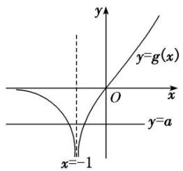
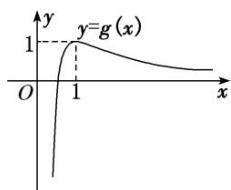
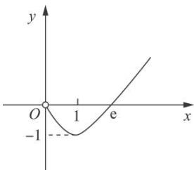

# 专题38 由函数零点或方程根的个数求参数范围问题

# 【例题选讲】

[例1] 已知函数 $f(x) = x^{2} + \frac{2}{x} - a\ln x (a \in \mathbf{R})$ .  
（1）若 $f(x)$ 在 x=2 处取得极值，求曲线 $y=f(x)$ 在点 $(1, f(1))$ 处的切线方程；  
（2）当 a>0 时，若 $f(x)$ 有唯一的零点 $x_{0}$ ，求 $[x_{0}]$ .

注： $[x]$ 表示不超过 $x$ 的最大整数，如 $[0.6] = 0$ ， $[2.1] = 2$ ， $[-1.5] = -2$

(参考数据： $\ln 2=0.693,\ \ln 3=1.099,\ \ln 5=1.609,\ \ln 7=1.946$ )

[规范解答] （1） $\because f(x) = x^2 + \frac{2}{x} - a\ln x, \therefore f'(x) = \frac{2x^3 - ax - 2}{x^2} (x > 0)$ ,
由题意得 $f(2)=0$ ，则 $2\times2^{3}-2a-2=0,\quad a=7$ ，
经验证，当 a=7 时， $f(x)$ 在 x=2 处取得极值， $\therefore f(x)=x^{2}+\frac{2}{x}-7\ln x$
$f ^ {'} (x) = 2 x - \frac {2}{x ^ {2}} - \frac {7}{x}, \therefore f ^ {'} （1） = - 7, f （1） = 3,$
则曲线 $y=f(x)$ 在点 $(1, f(1))$ 处的切线方程为 $y-3=-7(x-1)$ ，即 $7x+y-10=0$ .  
（2）令 $g(x) = 2x^{3} - ax - 2(x > 0)$ ，则 $g'(x) = 6x^{2} - a$ ，由 $a > 0$ ， $g'(x) = 0$ ，可得 $x = \sqrt{\frac{a}{6}}$
$\therefore g(x)$ 在 $\left[0, \sqrt{\frac{a}{6}}\right]$ 上单调递减，在 $\left[\sqrt{\frac{a}{6}}, +\infty\right]$ 上单调递增.
由于 $g(0) = -2 < 0$ ，故当 $x \in \left[0, \sqrt{\frac{a}{6}}\right]$ 时， $g(x) < 0$ ，又 $g(1) = -a < 0$
故 $g(x)$ 在 $(1, +\infty)$ 上有唯一零点，设为 $x_{1}$ ，
从而可知 $f(x)$ 在 $(0, x_{1})$ 上单调递减，在 $(x_{1}, +\infty)$ 上单调递增，
由于 $f(x)$ 有唯一零点 $x_{0}$ ，故 $x_{1}=x_{0}$ ，且 $x_{0}>1$ ，则 $g(x_{0})=0$ ， $f(x_{0})=0$ ，可得 $2\ln x_{0}-\frac{3}{x_{0}^{3}-1}-1=0$ .
令 $h(x)=2\ln x-\frac{3}{x^{3}-1}-1(x>1)$ ，易知 $h(x)$ 在 $(1,+\infty)$ 上单调递增，
由于 $h(2)=2\ln2-\frac{10}{7}<2\times0.7-\frac{10}{7}<0,\quad h(3)=2\ln3-\frac{29}{26}>0$ ，故 $x_{0}\in(2,3)$ ， $[x_{0}]=2$

[例 2] 已知函数 $f(x)=xe^{x}-\frac{1}{2}a(x+1)^{2}$ .  
（1）若 $a = \mathrm{e}$ ，求函数 $f(x)$ 的极值；  
（2）若函数 $f(x)$ 有两个零点，求实数a的取值范围.

[破题思路] 第（1）问求 $f(x)$ 的极值，想到求 $f'(x)=0$ 的解，然后根据单调性求极值；第（2）问求实数a的取值范围，想到建立关于a的不等式，给出函数 $f(x)$ 的解析式，并已知 $f(x)$ 有两个零点，利用 $f(x)$ 的图象与x轴有两个交点求解.

[规范解答] （1）由题意知，当 $a = \mathrm{e}$ 时， $f(x) = x\mathrm{e}^x - \frac{1}{2}\mathrm{e}(x + 1)^2$ ，函数 $f(x)$ 的定义域为 $(- \infty, + \infty)$ ，
$f'(x)=(x+1)e^{x}-e(x+1)=(x+1)(e^{x}-e)$ . 令 $f'(x)=0$ ，解得 x=-1 或 x=1.
当 x 变化时， $f'(x)$ ， $f(x)$ 的变化情况如下表所示：

<table><tr><td>x</td><td> $(-\infty, -1)$ </td><td>-1</td><td> $(-1, 1)$ </td><td>1</td><td> $(1, +\infty)$ </td></tr><tr><td> $f'(x)$ </td><td>+</td><td>0</td><td>-</td><td>0</td><td>+</td></tr><tr><td> $f(x)$ </td><td></td><td>极大值 $-\frac{1}{e}$ </td><td></td><td>极小值 $-e$ </td><td></td></tr></table>
所以当 x=-1 时， $f(x)$ 取得极大值 $-\frac{1}{e}$ ；当 x=1 时， $f(x)$ 取得极小值 -e.  
（2） 法一：分类讨论法 $f'(x)=(x+1)e^{x}-a(x+1)=(x+1)(e^{x}-a)$ ,
若 a=0，易知函数 $f(x)$ 在 $(-∞, +∞)$ 上只有一个零点，故不符合题意.
若 a<0，当 $x\in(-\infty,-1)$ 时， $f'(x)<0$ ， $f(x)$ 单调递减；
当 $x \in (-1, +\infty)$ 时， $f'(x) > 0$ ， $f(x)$ 单调递增.
由 $f(-1)=-\frac{1}{e}<0$ ，且 $f(1)=e-2a>0$ ，当 $x\to-\infty$ 时， $f(x)\to+\infty$
所以函数 $f(x)$ 在 $(-∞, +∞)$ 上有两个零点.
若 $\ln a<-1$ ，即 $0<a<\frac{1}{e}$ ，当 $x\in(-\infty,\ \ln a)\cup(-1,+\infty)$ 时， $f'(x)>0,\ f(x)$ 单调递增；
当 $x \in (\ln a, -1)$ 时， $f'(x) < 0$ ， $f(x)$ 单调递减。
又 $f(\ln a)=a\ln a-\frac{1}{2}a(\ln a+1)^{2}<0$ ，所以函数 $f(x)$ 在 $(-∞, +∞)$ 上至多有一个零点，故不符合题意.
若 $\ln a = -1$ ，即 $a = \frac{1}{e}$ ，当 $x \in (-\infty, +\infty)$ 时， $f'(x) \geq 0$ ， $f(x)$ 单调递增，故不符合题意.
若 $\ln a > -1$ ，即 $a > \frac{1}{e}$ ，当 $x \in (-\infty, -1) \cup (\ln a, +\infty)$ 时， $f'(x) > 0$ ， $f(x)$ 单调递增；
当 $x \in (-1, \ln a)$ 时， $f'(x) < 0$ ， $f(x)$ 单调递减.
又 $f(-1)=-\frac{1}{e}<0$ ，所以函数 $f(x)$ 在 $(-∞,+∞)$ 上至多有一个零点，故不符合题意.

综上，实数 a 的取值范围是 $(-∞, 0)$ .

法二：数形结合法 令 $f(x) = 0$ ，即 $x\mathrm{e}^{x} - \frac{1}{2} a(x + 1)^{2} = 0$ ，得 $x\mathrm{e}^{x} = \frac{1}{2} a(x + 1)^{2}$ .
当 x=-1 时，方程为 $-e^{-1}=\frac{1}{2}a\times0$ ，显然不成立，
所以 x = -1 不是方程的解，即 -1 不是函数 $f(x)$ 的零点.
当 $x \neq -1$ 时，分离参数得 $a = \frac{2xe^{x}}{(x+1)^{2}}$ .

记 $g(x)=\frac{2xe^{x}}{(x+1)^{2}}(x\neq-1)$ ，则 $g'(x)=\frac{(2xe^{x})'(x+1)^{2}-[(x+1)^{2}]'\cdot2xe^{x}}{(x+1)^{4}}=\frac{2e^{x}(x^{2}+1)}{(x+1)^{3}}.$
当 x<-1 时， $g'(x)<0$ ，函数 $g(x)$ 单调递减；当 x>-1 时， $g'(x)>0$ ，函数 $g(x)$ 单调递增.
当 $x = 0$ 时， $g(x) = 0$ ；当 $x \to -\infty$ 时， $g(x) \to 0$ ；当 $x \to -1$ 时， $g(x) \to -\infty$ ；当 $x \to +\infty$ 时， $g(x) \to +\infty$ 。
故函数 $g(x)$ 的图象如图所示.

作出直线 y=a，由图可知，当 a<0 时，直线 y=a 和函数 $g(x)$ 的图象有两个交点，此时函数 $f(x)$ 有两个零点．故实数 a 的取值范围是 $(-∞, 0)$ .

# [题后悟通] 利用函数零点的情况求参数范围的方法  
（1）分离参数 $(a = g(x))$ 后，将原问题转化为 $y = g(x)$ 的值域(最值)问题或转化为直线 $y = a$ 与 $y = g(x)$ 的图象的交点个数问题(优选分离、次选分类)求解；  
（2）利用零点的存在性定理构建不等式求解;  
（3）转化为两个熟悉的函数图象的位置关系问题，从而构建不等式求解

[例 3] 已知函数 $f(x)=\mathrm{e}^{x}-2x-1$ .  
（1）求曲线 $y=f(x)$ 在 $(0, f(0))$ 处的切线方程；  
（2）设 $g(x)=af(x)+(1-a)e^{x}$ ，若 $g(x)$ 有两个零点，求实数 a 的取值范围.

[规范解答] （1）由题意知 $f(x)=\mathrm{e}^{x}-2,\quad k=f(0)=1-2=-1$ ，又 $f(0)=\mathrm{e}^{0}-2\times0-1=0$ ，
∴ $f(x)$ 在 $(0, f(0))$ 处的切线方程为 y = -x.  
（2） $g(x)=\mathrm{e}^{x}-2ax-a,\quad g'(x)=\mathrm{e}^{x}-2a$ . 当 $a\leq0$ 时， $g'(x)>0,\quad\therefore g(x)$ 在 R 上单调递增，不符合题意. 当 a>0 时，令 $g'(x)=0$ ，得 $x=\ln(2a)$ ，在 $(-∞, \ln(2a))$ 上， $g'(x)<0$ ，在 $(\ln(2a), +∞)$ 上， $g'(x)>0,\quad\therefore g(x)$ 在 $(-∞, \ln(2a))$ 上单调递减，在 $(\ln(2a), +∞)$ 上单调递增，
$\therefore g (x) _ {\text { 极小值 }} = g (\ln (2 a)) = 2 a - 2 a \ln (2 a) - a = a - 2 a \ln (2 a).$
∵ $g(x)$ 有两个零点，∴ $g(x)_{\text{极小值}} < 0$ ，即 $a - 2a \ln(2a) < 0$ ，∵ a > 0，∴ $\ln(2a) > \frac{1}{2}$ ，解得 $a > \frac{\sqrt{e}}{2}$ ,
∴实数 a 的取值范围为 $\left(\frac{\sqrt{e}}{2}, +\infty\right)$ .

[例 4] 已知函数 $f(x)=\ln x-ax^{2}+x,\quad a\in\mathbf{R}.$  
（1）当 a=0 时，求曲线 $y=f(x)$ 在点(e, $f(e)$ )处的切线方程；  
（2）讨论 $f(x)$ 的单调性;  
（3）若 $f(x)$ 有两个零点，求a的取值范围.

[规范解答] （1） 当 a=0 时， $f(x)=\ln x+x$ ， $f(e)=e+1$ ， $f'(x)=\frac{1}{x}+1$ ， $f'(e)=1+\frac{1}{e}$
∴ 曲线 $y=f(x)$ 在点 $(e, f(e))$ 处的切线方程为 $y-(e+1)=\left(1+\frac{1}{e}\right)(x-e)$ ，即 $y=\left(\frac{1}{e}+1\right)x$ .  
（2） $f'(x)=\frac{1}{x}-2ax+1=\frac{-2ax^{2}+x+1}{x},\quad x>0,$

①当 $a \leq 0$ 时，显然 $f'(x) > 0$ ，∴ $f(x)$ 在 $(0, +\infty)$ 上单调递增；
②当 a>0 时，令 $f'(x)=\frac{-2ax^{2}+x+1}{x}=0$ ，则 $-2ax^{2}+x+1=0$ ，易知其判别式为正，
设方程的两根分别为 $x_{1}$ ， $x_{2}(x_{1}<x_{2})$ ，则 $x_{1}x_{2}=-\frac{1}{2a}<0,\therefore x_{1}<0<x_{2}$
$\therefore f ^ {'} (x) = \frac {- 2 a x ^ {2} + x + 1}{x} = \frac {- 2 a \left(x - x _ {1}\right) \left(x - x _ {2}\right)}{x}, x > 0.$
令 $f'(x)>0$ ，得 $x\in(0,\ x_{2})$ ；令 $f'(x)<0$ ，得 $x\in(x_{2},+\infty)$ ，其中 $x_{2}=\frac{1+\sqrt{8a+1}}{4a}$ ，
∴函数 $f(x)$ 在 $\left(0, \frac{1+\sqrt{8a+1}}{4a}\right)$ 上单调递增，在 $\left(\frac{1+\sqrt{8a+1}}{4a}, +\infty\right)$ 上单调递减.  
（3）法一：由（2）知，

①当 $a \leq 0$ 时， $f(x)$ 在 $(0, +\infty)$ 上单调递增，至多一个零点，不符合题意；  
②当 a>0 时，函数 $f(x)$ 在 $(0, x_{2})$ 上单调递增，在 $(x_{2}, +\infty)$ 上单调递减，∴ $f(x)_{\max}=f(x_{2})$ .

要使 $f(x)$ 有两个零点，需 $f(x_{2})>0$ ，即 $\ln x_{2}-ax_{2}^{2}+x_{2}>0$ ，
又由 $f'(x_{2})=0$ 得 $ax_{2}^{2}=\frac{1+x_{2}}{2}$ ，代入上面的不等式得 $2\ln x_{2}+x_{2}>1$ ，解得 $x_{2}>1$ ，∴ $a=\frac{1+x_{2}}{2x_{2}^{2}}=\frac{1}{2}\left(\frac{1}{x_{2}^{2}}+\frac{1}{x_{2}}\right)<1$ .
下面证明：当 $a \in (0, 1)$ 时， $f(x)$ 有两个零点.
$f \left(\frac {1}{e}\right) = \ln \frac {1}{e} - a e ^ {- 2} + \frac {1}{e} <   0, f \left(\frac {2}{a}\right) = \ln \frac {2}{a} - a \cdot \frac {4}{a ^ {2}} + \frac {2}{a} <   \frac {2}{a} - a \cdot \frac {4}{a ^ {2}} + \frac {2}{a} = 0 (\because \ln x <   x).$
又 $x_{2}=\frac{1+\sqrt{8a+1}}{4a}<\frac{1+\sqrt{8+1}}{4a}=\frac{1}{a}<\frac{2}{a}$ ，且 $x_{2}=\frac{1+\sqrt{8a+1}}{4a}=\frac{2}{\sqrt{8a+1}-1}>\frac{2}{\sqrt{8+1}-1}=1>\frac{1}{e}$
$f(x_{2}) = \ln x_{2} - ax_{2}^{2} + x_{2} = \frac{1}{2} (2\ln x_{2} + x_{2} - 1) > 0,\quad \therefore f(x)\text{在}\left(\frac{1}{e},x_{2}\right)\text{与}\left(x_{2},\frac{2}{a}\right)\text{上各有一个零点.}$
∴a 的取值范围为(0, 1).

法二: 函数 $f(x)$ 有两个零点, 等价于方程 $a=\frac{\ln x+x}{x^{2}}$ 有两解. 令 $g(x)=\frac{\ln x+x}{x^{2}}, x>0$ , 则 $g'(x)=\frac{1-2\ln x-x}{x^{3}}$ . 由 $g'(x)=\frac{1-2\ln x-x}{x^{3}}>0$ , 得 $2\ln x+x<1$ , 解得 0<x<1, $\therefore g(x)$ 在 $(0,1)$ 单调递增, 在 $(1,+\infty)$ 单调递减,

又当 $x \geq 1$ 时， $g(x) > 0$ ，当 $x \to 0$ 时， $g(x) \to -\infty$ ，
∴作出函数 $g(x)$ 的简图如图，结合函数值的变化趋势猜想：当 $a \in (0, 1)$ 时符合题意.

下面给出证明：
当 $a \geq 1$ 时， $a \geq g(x)_{\max}$ ，方程至多一解，不符合题意；当 $a \leq 0$ 时，方程至多一解，不符合题意；
当 $a \in (0, 1)$ 时， $g\left(\frac{1}{e}\right) < 0$ ， $\therefore g\left(\frac{1}{e}\right) - a < 0$ ， $g\left(\frac{2}{a}\right) = \frac{a^2}{4}\left(\ln \frac{2}{a} + \frac{2}{a}\right) < \frac{a^2}{4}\left(\frac{2}{a} + \frac{2}{a}\right) = a$ ， $\therefore g\left(\frac{2}{a}\right) - a < 0$ 。
$\therefore$ 方程在 $\left[\frac{1}{e}, 1\right]$ 与 $\left[1, \frac{2}{a}\right]$ 上各有一个根， $\therefore f(x)$ 有两个零点． $\therefore a$ 的取值范围为 $(0, 1)$ .

[例 5] (2017·全国 I) 已知函数 $f(x)=ae^{2x}+(a-2)\cdot e^{x}-x$ .  
（1）讨论 $f(x)$ 的单调性;  
（2）若 $f(x)$ 有两个零点，求 a 的取值范围.

[规范解答] （1） $f(x)$ 的定义域为 $(-∞, +∞)$ ， $f'(x)=2ae^{2x}+(a-2)e^{x}-1=(ae^{x}-1)(2e^{x}+1)$ .

(i) 若 $a \leq 0$ ，则 $f'(x) < 0$ ，所以 $f(x)$ 在 $(-∞, +∞)$ 单调递减.  
(ii)若 a > 0，则由 $f'(x) = 0$ 得 $x = -\ln a$ .
当 $x \in (-\infty, -\ln a)$ 时， $f(x) < 0$ ；当 $x \in (-\ln a, +\infty)$ 时， $f'(x) > 0$ 。所以 $f(x)$ 在 $(-\infty, -\ln a)$ 单调递减，在 $(-\ln a, +\infty)$ 单调递增。  
（2）(i)若 $a \leq 0$ ，由（1）知， $f(x)$ 至多有一个零点.  
(ii)若 a>0，由（1）知，当 $x=-\ln a$ 时， $f(x)$ 取得最小值，最小值为 $f(-\ln a)=1-\frac{1}{a}+\ln a$ .

①当 a=1 时，由于 $f(-\ln a)=0$ ，故 $f(x)$ 只有一个零点；  
②当 $a \in (1, +\infty)$ 时，由于 $1 - \frac{1}{a} + \ln a > 0$ ，即 $f(-\ln a) > 0$ ，故 $f(x)$ 没有零点；  
③当 $a \in (0, 1)$ 时， $1 - \frac{1}{a} + \ln a < 0$ ，即 $f(-\ln a) < 0$ .
又 $f(-2)=ae^{-4}+(a-2)e^{-2}+2>-2e^{-2}+2>0$ ，故 $f(x)$ 在 $(-∞,-\ln a)$ 有一个零点.
设正整数 $n_{0}$ 满足 $n_{0} > \ln\left(\frac{3}{a} - 1\right)$ ，则 $f(n_{0}) = \mathrm{e}n_{0}(a \mathrm{e}n_{0} + a - 2) - n_{0} > \mathrm{e}n_{0} - n_{0} > 2n_{0} - n_{0} > 0$ .
由于 $\ln\left(\frac{3}{a}-1\right)>-\ln a$ ，因此 $f(x)$ 在 $(- \ln a, +\infty)$ 有一个零点.

综上，a 的取值范围为 $(0, 1)$ .

[例 6] 已知 $a \in R$ ，函数 $f(x) = e^{x} - ax (e = 2.71828 \ldots$ 是自然对数的底数).  
（1）若函数 $f(x)$ 在区间 $(-e, -1)$ 上是减函数，求实数 a 的取值范围；  
（2）若函数 $F(x) = f(x) - (\mathrm{e}^x - 2ax + 2\ln x + a)$ 在区间 $\left[0, \frac{1}{2}\right]$ 内无零点，求实数 $a$ 的最大值.

[规范解答] （1）由 $f(x)=\mathrm{e}^{x}-ax$ ，得 $f'(x)=\mathrm{e}^{x}-a$ 且 $f'(x)$ 在 R 上单调递增.
若 $f(x)$ 在区间 $(-e, -1)$ 上是减函数，只需 $f'(x) \leq 0$ 在 $(-e, -1)$ 上恒成立.
因此只需 $f(-1)=\mathrm{e}^{-1}-a\leq0$ ，解得 $a\geq\frac{1}{e}$ 。又当 $a=\frac{1}{e}$ 时， $f'(x)=\mathrm{e}^{x}-\frac{1}{e}\leq0$ ，当且仅当 x=-1 时取等号。
所以实数 a 的取值范围是 $\left[\frac{1}{e}, +\infty\right]$ .  
（2）由已知得 $F(x)=a(x-1)-2\ln x$ ，且 $F(1)=0$ ，则 $F'(x)=a-\frac{2}{x}=\frac{ax-2}{x}=\frac{a\left(x-\frac{2}{a}\right)}{x}$ ，x>0.

①当 $a \leq 0$ 时， $F'(x) < 0$ ， $F(x)$ 在区间 $(0, +\infty)$ 上单调递减，

结合 $F(1)=0$ 知，当 $x\in\left(0,\frac{1}{2}\right)$ 时， $F(x)>0$ 。所以 $F(x)$ 在 $\left(0,\frac{1}{2}\right)$ 内无零点。

②当 a>0 时，令 $F'(x)=0$ ，得 $x=\frac{2}{a}$ 。若 $\frac{2}{a}\geq\frac{1}{2}$ ，即 $a\in(0,4]$ 时， $F(x)$ 在 $\left[\begin{aligned}&0,&\frac{1}{2}\end{aligned}\right]$ 上是减函数。
又 $x \to 0$ 时， $F(x) \to +\infty$ 。要使 $F(x)$ 在 $\left[0, \frac{1}{2}\right]$ 内无零点，只需 $F\left[\frac{1}{2}\right] = -\frac{a}{2} - 2\ln \frac{1}{2} \geq 0$ ，则 $0 < a \leq 4\ln 2$ 。
若 $\frac{2}{a}<\frac{1}{2}$ ，即a>4时，则 $F(x)$ 在 $\begin{pmatrix}0,&\frac{2}{a}\end{pmatrix}$ 上是减函数，在 $\begin{pmatrix}\frac{2}{a},&\frac{1}{2}\end{pmatrix}$ 上是增函数.
所以 $F(x)_{\min}=F\left(\frac{2}{a}\right)=2-a-2\ln\frac{2}{a}$ ，令 $\varphi(a)=2-a-2\ln\frac{2}{a}$ ，则 $\varphi'(a)=-1+\frac{2}{a}=\frac{2-a}{a}<0$ .
所以 $\varphi(a)$ 在 $(4, +\infty)$ 上是减函数，则 $\varphi(a)<\varphi(4)=2\ln2-2<0$ .
因此 $F\left(\frac{2}{a}\right)<0$ ，所以 $F(x)$ 在 $x\in\left(0,\frac{1}{2}\right)$ 内一定有零点，不合题意，舍去.

综上，函数 $F(x)$ 在 $\left[0, \frac{1}{2}\right]$ 内无零点，应有 $a \leq 4\ln 2$ ，所以实数 $a$ 的最大值为 $4\ln 2$

# 【对点训练】

1. (2018·全国Ⅱ)已知函数 $f(x) = \mathrm{e}^{x} - ax^{2}$ .  
（1）若 a=1，证明：当 $x \geq 0$ 时， $f(x) \geq 1$ ;  
（2）若 $f(x)$ 在 $(0, +\infty)$ 只有一个零点，求 $a$

1. 解析 （1） 当 $a = 1$ 时, $f(x) \geq 1$ 等价于 $(x^{2} + 1)\mathrm{e}^{-x} - 1 \leq 0$ .
设函数 $g(x)=(x^{2}+1)e^{-x}-1$ ，则 $g'(x)=-(x^{2}-2x+1)e^{-x}=-(x-1)^{2}e^{-x}$ .
当 $x \neq 1$ 时， $g'(x) < 0$ ，所以 $g(x)$ 在 $(0, +\infty)$ 单调递减。而 $g(0) = 0$ ，故当 $x \geq 0$ 时， $g(x) \leq 0$ ，即 $f(x) \geq 1$ 。  
（2）设函数 $h(x)=1-ax^{2}e^{-x}$ . 当且仅当 $h(x)$ 在 $(0, +\infty)$ 只有一个零点时， $f(x)$ 在 $(0, +\infty)$ 只有一个零点.

①当 $a \leq 0$ 时， $h(x) > 0$ ， $h(x)$ 没有零点；
②当 a>0 时， $h'(x)=ax(x-2)e^{-x}$ 。当 $x\in(0,2)$ 时， $h'(x)<0$ ；当 $x\in(2,+\infty)$ 时， $h'(x)>0$ 。
所以 $h(x)$ 在 $(0, 2)$ 单调递减，在 $(2, +\infty)$ 单调递增．故 $h(2)=1-\frac{4a}{e^{2}}$ 是 $h(x)$ 在 $[0, +\infty)$ 的最小值．

1) 若 $h(2)>0$ ，即 $a<\frac{e^{2}}{4}$ ， $h(x)$ 在 $(0,+\infty)$ 没有零点；
2) 若 $h(2)=0$ ，即 $a=\frac{e^{2}}{4}$ ， $h(x)$ 在 $(0, +\infty)$ 只有一个零点；
3) 若 $h(2)<0$ ，即 $a>\frac{e^{2}}{4}$ ，由于 $h(0)=1$ ，
所以 $h(x)$ 在 $(0, 2)$ 有一个零点．由（1）知，当 x > 0 时， $e^{x} > x^{2}$
所以 $h(4a)=1-\frac{16a^{3}}{\mathrm{e}^{4a}}=1-\frac{16a^{3}}{\mathrm{e}^{2a}}>1-\frac{16a^{3}}{2a}$ $^{4}=1-\frac{1}{a}>0.$
故 $h(x)$ 在 $(2, 4a)$ 有一个零点．因此 $h(x)$ 在 $(0, +\infty)$ 有两个零点.

综上， $f(x)$ 在 $(0, +\infty)$ 只有一个零点时， $a=\frac{e^{2}}{4}$ .

2. 设函数 $f(x)=\ln x+x$ .  
（1）令 $F(x)=f(x)+\frac{a}{x}-x(0<x\leq3)$ ，若 $F(x)$ 的图象上任意一点 $P(x_{0},y_{0})$ 处切线的斜率 $k\leq\frac{1}{2}$ 恒成立，求实数 a 的取值范围；  
（2）若方程 $2mf(x) = x^2$ 有唯一实数解，求正数 $m$ 的值.

2. 解析 （1） $\because F(x) = \ln x + \frac{a}{x}, x \in (0, 3]$ , $\therefore F'(x) = \frac{1}{x} - \frac{a}{x^2} = \frac{x - a}{x^2}$ , $\therefore k = F'(x_0) = \frac{x_0 - a}{x_0^2}$ ,
∵ $F(x)$ 的图象上任意一点 $P(x_{0}, y_{0})$ 处切线的斜率 $k \leq \frac{1}{2}$ 恒成立，∴ $k = \frac{x_{0} - a}{x_{0}^{2}} \leq \frac{1}{2}$ 在 $x_{0} \in (0, 3]$ 上恒成立，
$\therefore a\geq\left(-\frac{1}{2}x_{0}^{2}+x_{0}\right)_{\max},\quad x_{0}\in(0,\ 3],\quad 当\ x_{0}=1\ 时,\quad-\frac{1}{2}x_{0}^{2}+x_{0} 取得最大值\frac{1}{2},$
$\therefore a\geq\frac{1}{2}$ ，即实数a的取值范围为 $\left[\frac{1}{2},+\infty\right]$ .  
（2）∵方程 $2mf(x)=x^{2}$ 有唯一实数解，∴ $x^{2}-2m\ln x-2mx=0$ 有唯一实数解.
设 $g(x)=x^{2}-2m\ln x-2mx$ ，则 $g'(x)=\frac{2x^{2}-2mx-2m}{x}$ 。令 $g'(x)=0$ ，则 $x^{2}-mx-m=0$ 。
$\because m > 0, \therefore \Delta = m^2 + 4m > 0, \because x > 0, \therefore x_1 = \frac{m - \sqrt{m^2 + 4m}}{2} < 0$ (舍去), $x_2 = \frac{m + \sqrt{m^2 + 4m}}{2}$ ,
当 $x \in (0, x_{2})$ 时， $g'(x) < 0$ ， $g(x)$ 在 $(0, x_{2})$ 上单调递减，
当 $x \in (x_{2}, +\infty)$ 时， $g'(x) > 0$ ， $g(x)$ 在 $(x_{2}, +\infty)$ 单调递增，
当 $x=x_{2}$ 时， $g'(x_{2})=0$ ， $g(x)$ 取最小值 $g(x_{2})$ 。∵ $g(x)=0$ 有唯一解，∴ $g(x_{2})=0$ ，
则 $\left\{ \begin{array}{l} g'(x_2) = 0, \\ g(x_2) = 0, \end{array} \right.$ 即 $x_2^2 - 2m\ln x_2 - 2mx_2 = x_2^2 - mx_2 - m, \therefore 2m\ln x_2 + mx_2 - m = 0,$
$\because m > 0, \therefore 2 \ln x _ {2} + x _ {2} - 1 = 0. (*)$
设函数 $h(x)=2\ln x+x-1$ ，∵当 x>0 时， $h(x)$ 是增函数，∴ $h(x)=0$ 至多有一解.
$\because h(1)=0,\quad\therefore$ 方程 $(*)$ 的解为 $x_{2}=1$ ，即 $1=\frac{m+\sqrt{m^{2}+4m}}{2}$ ，解得 $m=\frac{1}{2}$ .

3. 函数 $f(x)=ax+x\ln x$ 在 x=1 处取得极值.  
（1）求 $f(x)$ 的单调区间;  
（2）若 $y=f(x)-m-1$ 在定义域内有两个不同的零点，求实数 m 的取值范围.

3. 解析 （1）由题意知， $f'(x)=a+\ln x+1(x>0)$ ， $f'（1）=a+1=0$ ，解得 a=-1，
当 a=-1 时， $f(x)=-x+x\ln x$ ，即 $f'(x)=\ln x$ ，令 $f'(x)>0$ ，解得 x>1；令 $f'(x)<0$ ，解得 0<x<1。
∴ $f(x)$ 在 x=1 处取得极小值， $f(x)$ 的单调递增区间为 $(1, +\infty)$ ，单调递减区间为 $(0, 1)$ .  
（2） $y=f(x)-m-1$ 在 $(0,+\infty)$ 上有两个不同的零点，可转化为 $f(x)=m+1$ 在 $(0,+\infty)$ 上有两个不同的根，也可转化为 $y=f(x)$ 与 $y=m+1$ 的图象有两个不同的交点，
由（1）知， $f(x)$ 在 $(0, 1)$ 上单调递减，在 $(1, +\infty)$ 上单调递增， $f(x)_{\min}=f(1)=-1$ ，
由题意得， $m+1>-1$ ，即 m>-2，①
当 0<x<1 时， $f(x)=x(-1+\ln x)<0$ ；当 x>0 且 $x\to0$ 时， $f(x)\to0$ ；当 $x\to+\infty$ 时，显然 $f(x)\to+\infty$ .
如图，由图象可知， $m+1<0$ ，即 m<-1，②

由①②可得-2<m<-1．故实数m的取值范围为 $(-2,-1)$ .

4. 设函数 $f(x) = -x^{2} + ax + \ln x (a \in \mathbf{R})$ .  
（1）当 a = -1 时，求函数 $f(x)$ 的单调区间；  
（2）设函数 $f(x)$ 在 $\left[\frac{1}{3}, 3\right]$ 上有两个零点，求实数a的取值范围.

4. 解析 （1） 函数 $f(x)$ 的定义域为 $(0, +\infty)$ ，当 $a = -1$ 时，
$f'(x)=-2x-1+\frac{1}{x}=\frac{-2x^{2}-x+1}{x}$ ，令 $f'(x)=0$ ，得 $x=\frac{1}{2}$ （负值舍去），当 $0<x<\frac{1}{2}$ 时， $f'(x)>0$ ；当 $x>\frac{1}{2}$ 时， $f(x)<0$ ，
∴ $f(x)$ 的单调递增区间为 $\left(0,\frac{1}{2}\right)$ ，单调递减区间为 $\left(\frac{1}{2},+\infty\right)$ .  
（2）令 $f(x) = -x^{2} + ax + \ln x = 0$ ，得 $a = x - \frac{\ln x}{x}$ ，令 $g(x) = x - \frac{\ln x}{x}$ ，其中 $x \in \left[\frac{1}{3}, 3\right]$ ，
则 $g'(x)=1-\frac{\frac{1}{x}\cdot x-\ln x}{x^{2}}=\frac{x^{2}+\ln x-1}{x^{2}}$ ，令 $g'(x)=0$ ，得 x=1，当 $\frac{1}{3}\leq x<1$ 时， $g'(x)<0$ ；当 $1<x\leq3$ 时， $g'(x)>0$ ，
∴ $g(x)$ 的单调递减区间为 $\left[\frac{1}{3}, 1\right]$ ，单调递增区间为 $(1, 3]$ ，∴ $g(x)_{\min}=g(1)=1$ ，
由于函数 $f(x)$ 在 $\left[\frac{1}{3}, 3\right]$ 上有两个零点， $g\left(\frac{1}{3}\right)=3\ln 3+\frac{1}{3}$ ， $g(3)=3-\frac{\ln 3}{3}$ ， $3\ln 3+\frac{1}{3}>3-\frac{\ln 3}{3}$ ， $\therefore$ 实数 $a$ 的取值范围是 $\left[1, 3-\frac{\ln 3}{3}\right]$ .

5. 已知函数 $f(x) = (x - 2)\mathrm{e}^x + a(x - 1)^2$ .  
（1）讨论 $f(x)$ 的单调性;  
（2）若 $f(x)$ 有两个零点，求 a 的取值范围.

5. 解析 $（1）f'(x) = (x - 1)\mathrm{e}^x + 2a(x - 1) = (x - 1)(\mathrm{e}^x + 2a)$ .

①设 $a \geq 0$ ，则当 $x \in (-\infty, 1)$ 时， $f'(x) < 0$ ；当 $x \in (1, +\infty)$ 时， $f'(x) > 0$ .
所以 $f(x)$ 在 $(-∞, 1)$ 上单调递减，在 $(1, +∞)$ 上单调递增.

②设 a<0，由 $f'(x)=0$ 得 x=1 或 $x=\ln(-2a)$ .
若 $a = -\frac{\mathrm{e}}{2}$ ，则 $f'(x) = (x - 1)(\mathrm{e}^x - \mathrm{e})$ ，所以 $f(x)$ 在 $(- \infty, + \infty)$ 上单调递增.
若 $a > -\frac{e}{2}$ ，则 $\ln(-2a) < 1$ ，故当 $x \in (-\infty, \ln(-2a)) \cup (1, +\infty)$ 时， $f'(x) > 0$ ;
当 $x \in (\ln(-2a), 1)$ 时， $f'(x) < 0$ .
所以 $f(x)$ 在 $(-∞, ∠(-2a))$ ， $(1, +∞)$ 上单调递增，在 $(\ln(-2a), 1)$ 上单调递减.
若 $a < -\frac{\mathrm{e}}{2}$ ，则 $\ln (-2a) > 1$ ，故当 $x \in (-\infty, 1) \cup (\ln (-2a), +\infty)$ 时， $f'(x) > 0$ ；
当 $x \in (1, \ln(-2a))$ 时， $f'(x) < 0$ .
所以 $f(x)$ 在 $(-∞, 1)$ ， $(\ln(-2a), +∞)$ 上单调递增，在 $(1, \ln(-2a))$ 上单调递减.  
（2）①设 a>0，则由（1）知， $f(x)$ 在 $(-∞, 1)$ 上单调递减，在 $(1, +∞)$ 上单调递增.
又 $f(1) = -\mathrm{e}$ , $f(2) = a$ ，取 $b$ 满足 $b < 0$ 且 $b < \ln \frac{a}{2}$ ，则 $f(b) > \frac{a}{2}(b - 2) + a(b - 1)^2 = a\left(b^2 - \frac{3}{2} b\right) > 0$
所以 $f(x)$ 有两个零点.

②设 a=0，则 $f(x)=(x-2)e^{x}$ ，所以 $f(x)$ 只有一个零点.

③设 a<0，若 $a \geq -\frac{e}{2}$ ，则由（1）知， $f(x)$ 在 $(1, +\infty)$ 上单调递增。又当 $x \leq 1$ 时， $f(x)<0$ ，故 $f(x)$ 不存在两个零点；
若 $a < -\frac{\mathrm{e}}{2}$ ，则由（1）知， $f(x)$ 在 $(1, \ln(-2a))$ 上单调递减，在 $(\ln(-2a), +\infty)$ 上单调递增。又当 $x \leq 1$ 时， $f(x) < 0$ ，故 $f(x)$ 不存在两个零点。

综上，a 的取值范围为 $(0, +\infty)$ .

6. 已知函数 $f(x)=(x-1)e^{x}+ax^{2}, a\in\mathbf{R}.$  
（1）讨论函数 $f(x)$ 的单调区间；  
（2）若 $f(x)$ 有两个零点，求 a 的取值范围.

6. 解析 $（1）f'(x)=\mathrm{e}^{x}+(x-1)\mathrm{e}^{x}+2ax=x(\mathrm{e}^{x}+2a)$ .

①若 $a \geq 0$ ，则当 x > 0 时， $f'(x) > 0$ ；当 x < 0 时， $f'(x) < 0$ .
故函数 $f(x)$ 在 $(-∞, 0)$ 上单调递减，在 $(0, +∞)$ 上单调递增.

②当 a<0 时，由 $f(x)=0$ ，解得 x=0 或 $x=\ln(-2a)$ .

(i) 若 $\ln(-2a)=0$ ，即 $a=-\frac{1}{2}$ ，则 $\forall x\in\mathbf{R}, f'(x)=x(\mathrm{e}^{x}-1)\geq0$ ，故 $f(x)$ 在 $(-∞,+∞)$ 上单调递增；
(ii)若 $\ln(-2a)<0$ ，即 $-\frac{1}{2}<a<0$ ，则当 $x\in(-\infty,\ln(-2a))\cup(0,+\infty)$ 时， $f'(x)>0$ ；当 $x\in(\ln(-2a),0)$ 时， $f'(x)<0$ 。故函数 $f(x)$ 在 $(-∞,\ln(-2a)),(0,+∞)$ 上单调递增，在 $(\ln(-2a),0)$ 上单调递减。

(iii)若 $\ln(-2a)>0$ ，即 $a<-\frac{1}{2}$ ，则当 $x\in(-\infty,0)\cup(\ln(-2a),+\infty)$ 时， $f'(x)>0$ ；当 $x\in(0,\ln(-2a))$ 时， $f'(x)<0$ 。故函数 $f(x)$ 在 $(-∞,0)$ ， $(\ln(-2a),+∞)$ 上单调递增，在 $(0,\ln(-2a))$ 上单调递减。  
（2）①当 a>0 时，由（1）知，函数 $f(x)$ 在 $(-∞, 0)$ 上单调递减，在 $(0, +∞)$ 上单调递增.
因为 $f(0) = -1 < 0$ ， $f(2) = e^2 + 4a > 0$ ，取实数 $b$ 满足 $b < -2$ 且 $b < \ln a$ ，则
$f(b)>a(b-1)+ab^{2}=a(b^{2}+b-1)>a(4-2-1)>0$ ，所以 $f(x)$ 有两个零点；
②若 a=0，则 $f(x)=(x-1)e^{x}$ ，故 $f(x)$ 只有一个零点.

③若 a<0，由（1）知，
当 $a \geq -\frac{1}{2}$ 时，则 $f(x)$ 在 $(0, +\infty)$ 上单调递增，又当 $x \leq 0$ 时， $f(x) < 0$ ，故 $f(x)$ 不存在两个零点；
当 $a<-\frac{1}{2}$ 时，则 $f(x)$ 在 $(-∞,0)$ ， $(\ln(-2a),+∞)$ 上单调递增；
在 $(0,\ \ln(-2a))$ 上单调递减．又 $f(0)=-1$ ，故不存在两个零点.
综上所述，a 的取值范围是 $(0, +\infty)$ .

7. 已知函数 $f(x) = (2 - a)x - 2(1 + \ln x) + a$ .  
（1）当 a=1 时，求 $f(x)$ 的单调区间.  
（2）若函数 $f(x)$ 在区间 $\left(0, \frac{1}{2}\right)$ 上无零点，求 $a$ 的最小值.

7. 解析 （1） 当 $a = 1$ 时, $f(x) = x - 1 - 2\ln x$ , 则 $f'(x) = 1 - \frac{2}{x}$ , 其中 $x \in (0, +\infty)$ .
由 $f'(x)>0$ ，得 x>2，由 $f'(x)<0$ ，得 0<x<2，
故 $f(x)$ 的单调递减区间为 $(0, 2)$ ，单调递增区间为 $(2, +\infty)$ .  
（2） $f(x)=(2-a)x-2(1+\ln x)+a=(2-a)(x-1)-2\ln x,$
令 $m(x)=(2-a)(x-1)$ ， $h(x)=2\ln x$ ，其中 x>0，则 $f(x)=m(x)-h(x)$ .

①当 a<2 时， $m(x)$ 在 $\left(0, \frac{1}{2}\right)$ 上为增函数， $h(x)$ 在 $\left(0, \frac{1}{2}\right)$ 上为增函数，

结合图象知，若 $f(x)$ 在 $\left(0, \frac{1}{2}\right)$ 上无零点，则 $m\left(\frac{1}{2}\right) \geq h\left(\frac{1}{2}\right)$ ，即 $(2 - a)\left(\frac{1}{2} - 1\right) \geq 2 \ln \frac{1}{2}$ ,
所以 $a \geq 2 - 4 \ln 2$ ，所以 $2 - 4 \ln 2 \leq a < 2$ .

②当 $a \geq 2$ 时，在 $\left(0, \frac{1}{2}\right)$ 上 $m(x) \geq 0$ ， $h(x) < 0$ ，所以 $f(x) > 0$ ，所以 $f(x)$ 在 $\left(0, \frac{1}{2}\right)$ 上无零点.
由①②得 $a \geq 2 - 4 \ln 2$ ，所以 $a_{\min} = 2 - 4 \ln 2$ .

8. 已知函数 $F(x)=\frac{\ln x}{x-1}-\frac{a}{x+1}$ .  
（1）设函数 $h(x)=(x-1)F(x)$ ，当 a=2 时，证明：当 x>1 时， $h(x)>0$ ;  
（2）若 $F(x)$ 有两个不同的零点，求 a 的取值范围.

8. 解析 （1） 当 $a = 2, x > 1$ 时， $h'(x) = \frac{(x - 1)^2}{x(x + 1)^2} > 0,$
所以 $h(x)$ 在 $(1, +\infty)$ 上单调递增，且 $h(1)=0$ ，所以当 x>1 时， $h(x)>0$ .  
（2）设函数 $f(x) = \ln x - \frac{a(x - 1)}{x + 1}$ ，则 $f(x) = \frac{x^2 + 2(1 - a)x + 1}{x(x + 1)^2}$ .
令 $g(x)=x^{2}+2(1-a)x+1$ ,
当 $a \leq 1$ ，x > 0 时， $g(x) > 0$ ，
当 $1 < a \leq 2$ 时， $\Delta = 4a^{2} - 8a \leq 0$ ，得 $g(x) \geq 0$ ，
所以当 $a \leq 2$ 时， $f'(x) \geq 0$ ， $f(x)$ 在 $(0, +\infty)$ 上单调递增，
此时 $f(x)$ 至多有一个零点， $F(x)=\frac{1}{x-1}f(x)$ 至多有一个零点，不符合题意，舍去.
当 a>2 时， $\Delta=4a^{2}-8a>0$ ，此时 $g(x)$ 有两个零点，设为 $t_{1}$ ， $t_{2}$ ，且 $t_{1}<t_{2}$ .
又 $t_{1}+t_{2}=2(a-1)>0,\quad t_{1}t_{2}=1$ ，所以 $0<t_{1}<1<t_{2}$
所以 $f(x)$ 在 $(0, t_{1})$ ， $(t_{2}, +\infty)$ 上单调递增，在 $(t_{1}, t_{2})$ 上单调递减，

且 $f(1)=0$ ，所以 $f(t_{1})>0$ ， $f(t_{2})<0$ ，
又 $f(\mathrm{e}^{-a}) = -\frac{2a}{\mathrm{e}^a + 1} < 0$ ， $f(\mathrm{e}^{a}) = \frac{2a}{\mathrm{e}^{a} + 1} >0$ ，且 $f(x)$ 的图象连续不断，
所以存在唯一 $x_{1}\in(\mathrm{e}^{-a},\quad t_{1})$ ，使得 $f(x_{1})=0$ ，存在唯一 $x_{2}\in(t_{2},\quad\mathrm{e}^{a})$ ，使得 $f(x_{2})=0$ 。
又 $F(x)=\frac{1}{x-1}f(x)$ ，所以当 $F(x)$ 有两个不同零点时，a 的取值范围为 $(2, +\infty)$ .

9. 已知函数 $f(x) = x\mathrm{e}^{x} - a(\ln x + x), a \in \mathbf{R}$ .  
（1）当 a=e 时，求 $f(x)$ 的单调区间；  
（2）若 $f(x)$ 有两个零点，求实数 a 的取值范围.

9. 解析 （1）函数的定义域为 $(0, +\infty)$ ，当 $a = e$ 时， $f(x) = \frac{(1 + x)(xe^x - e)}{x}$ .
令 $f'(x)>0$ ，得 x>1，令 $f'(x)<0$ ，得 0<x<1，∴ $f(x)$ 在 $(0,1)$ 上单调递减；在 $(1,+\infty)$ 上单调递增.  
（2）记 $t=\ln x+x$ ，则 $t=\ln x+x$ 在 $(0,+\infty)$ 上单调递增，且 $t\in R$ .
$\therefore f(x)=xe^{x}-a(\ln x+x)=e^{t}-at.$ 设 $g(t)=e^{t}-at,$
∴ $f(x)$ 在 x > 0 时有两个零点等价于 $g(t) = e^{t} - at$ 在 $t \in R$ 上有两个零点.

①当 a=0 时， $g(t)=\mathrm{e}^{t}$ 在 R 上单调递增，且 $g(t)>0$ ，故 $g(t)$ 无零点；
②当 a<0 时， $g'(t)=\mathrm{e}^{t}-a$ 在 R 上单调递增，
又 $g(0)=1>0,\quad g\left(\frac{1}{a}\right)=\mathrm{e}^{\frac{1}{a}}-1<0$ ，故 $g(t)$ 在 R 上只有一个零点；
③当 a>0 时，由 $g'(t)=\mathrm{e}^{t}-a=0$ 可知 $g(t)$ 在 $t=\ln a$ 时有唯一的一个极小值且为最小值 $g(\ln a)=a(1-\ln a)$ .
若 0<a<e, $g(\ln a)=a(1-\ln a)>0$ , $g(t)$ 无零点;
若 a=e, $g(\ln a)=0$ , $g(t)$ 只有一个零点;
若 a>e 时， $g(\ln a)=a(1-\ln a)<0$ ，而 $g(0)=1>0$ ，
由于 $f(x)=\frac{\ln x}{x}$ 在 x>e 时单调递减，可知 a>e 时， $e^{a}>a^{e}>a^{2}$ 。从而 $g(a)=\mathrm{e}^{a}-a^{2}>0$
∴ $g(x)$ 在 $(0, \ln a)$ 和 $(\ln a, +\infty)$ 上各有一个零点.

综上可知当 a>e 时， $f(x)$ 有两个零点，即所求 a 的取值范围是 $(e, +\infty)$ .

10. 已知函数 $f(x) = \frac{\mathrm{e}^x}{x}$ ， $g(x) = a(x - \ln x) (a \in \mathbf{R})$ .  
（1）求函数 $g(x)$ 的极值;  
（2）若 $h(x)=f(x)-g(x)$ 在 $[1, +\infty)$ 上有且只有一个零点，求实数 a 的取值范围.

10. 解析 （1） 函数 $g(x)$ 的定义域为 $(0, +\infty)$ ,
当 a=0 时，函数 $g(x)=0$ 无极值，
当 $a \neq 0$ 时， $g'(x) = a\left(1 - \frac{1}{x}\right) = \frac{a(x - 1)}{x}$ .
若 a>0，令 $g'(x)>0$ ，则 x>1；令 $g'(x)<0$ ，则 0<x<1，
所以函数 $g(x)$ 在 $(1, +\infty)$ 上单调递增，在 $(0, 1)$ 上单调递减，
所以 $g(x)$ 的极小值为 $g(1)=a$ ，无极大值.
若 a<0，令 $g'(x)>0$ ，则 0<x<1；令 $g'(x)<0$ ，则 x>1，
所以函数 $g(x)$ 在 $(0, 1)$ 上单调递增，在 $(1, +\infty)$ 上单调递减，
所以 $g(x)$ 的极大值为 $g(1)=a$ ，无极小值.  
（2）令 $M(x)=x-\ln x,\quad M'(x)=1-\frac{1}{x},$
当 $x \in [1, +\infty)$ 时， $M'(x) \geq 0$ ，所以 $M(x)$ 在 $[1, +\infty)$ 上单调递增，所以 $M(x) \geq M(1) = 1$ ，所以 $x - \ln x > 0$ 。由题可知， $h(x) = f(x) - g(x)$ 在 $[1, +\infty)$ 上有且只有一个零点，即 $h(x) = 0$ 在 $[1, +\infty)$ 上有且只有一个根，等价于 $a = \frac{e^{x}}{x(x - \ln x)}$ 在 $[1, +\infty)$ 上有且只有一个根，

等价于函数 y=a 与函数 $t(x)=\frac{\mathrm{e}^{x}}{x(x-\ln x)}$ 的图象在 $[1, +\infty)$ 上只有一个交点，
$t ^ {'} (x) = \frac {\mathrm{e} ^ {x} (x ^ {2} - x \ln x - 2 x + \ln x + 1)}{[ x (x - \ln x) ] ^ {2}}, \text {令} m (x) = x ^ {2} - x \ln x - 2 x + \ln x + 1,$
则 $m'(x)=2x-\ln x+\frac{1}{x}-3$ ，令 $\mu(x)=m'(x)$ ，则 $\mu'(x)=2-\frac{1}{x}-\frac{1}{x^{2}}=\frac{(2x+1)(x-1)}{x^{2}}$ ,
当 $x \in [1, +\infty)$ 时， $\mu'(x) \geq 0$ ，所以 $m'(x)$ 在 $[1, +\infty)$ 上单调递增，
则 $m'(x) \geq m'（1） = 0$ ，所以 $m(x)$ 在 $[1, +\infty)$ 上单调递增，则 $m(x) \geq m(1) = 0$ ，
所以 $t(x)$ 在 $[1, +\infty)$ 上单调递增，
所以 $t(x) \geq e$ ，所以 $a \geq e$ .

