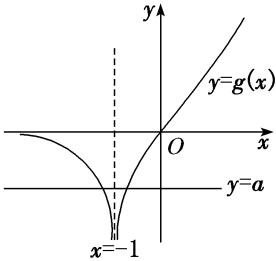
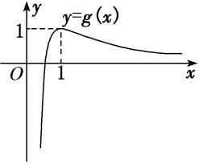
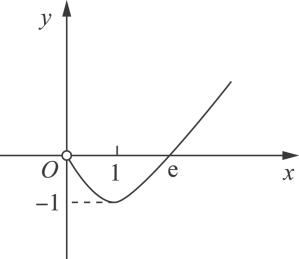

专题38　由函数零点或方程根的个数求参数范围问题

【例题选讲】

<strong>[例1]</strong>　已知函数<em>f</em>(<em>x</em>)＝<em>x</em>2＋－<em>a</em>ln <em>x</em>(<em>a</em>∈<strong>R</strong>)．  
（1）若*f*(*x*)在*x*＝2处取得极值，求曲线*y*＝*f*(*x*)在点(1，*f*（1）)处的切线方程；  
（2）当<em>a</em>&gt;0时，若<em>f</em>(<em>x</em>)有唯一的零点<em>x</em>0，求[<em>x</em>0]．

注：[*x*]表示不超过*x*的最大整数，如[0.6]＝0，[2.1]＝2，[－1.5]＝－2．

(参考数据：ln 2＝0.693，ln 3＝1.099，ln 5＝1.609，ln 7＝1.946)

<strong>[规范解答]</strong>　（1）∵<em>f</em>(<em>x</em>)＝<em>x</em>2＋－<em>a</em>ln <em>x</em>，∴<em>f</em>′(<em>x</em>)＝(<em>x</em>&gt;0)，
由题意得<em>f</em>′（2）＝0，则2×23－2<em>a</em>－2＝0，<em>a</em>＝7，
经验证，当<em>a</em>＝7时，<em>f</em>(<em>x</em>)在<em>x</em>＝2处取得极值，∴<em>f</em>(<em>x</em>)＝<em>x</em>2＋－7ln <em>x</em>，

*f*′(*x*)＝2*x*－－，∴*f*′（1）＝－7，*f*（1）＝3，
则曲线*y*＝*f*(*x*)在点(1，*f*（1）)处的切线方程为*y*－3＝－7(*x*－1)，即7*x*＋*y*－10＝0．  
（2）令<em>g</em>(<em>x</em>)＝2<em>x</em>3－<em>ax</em>－2(<em>x</em>&gt;0)，则<em>g</em>′(<em>x</em>)＝6<em>x</em>2－<em>a</em>，由<em>a</em>&gt;0，<em>g</em>′(<em>x</em>)＝0，可得<em>x</em>＝，
∴*g*(*x*)在上单调递减，在上单调递增．
由于*g*（0）＝－2<0，故当*x*∈时，*g*(*x*)<0，又*g*（1）＝－*a*<0，
故<em>g</em>(<em>x</em>)在(1，＋∞)上有唯一零点，设为<em>x</em>1，
从而可知<em>f</em>(<em>x</em>)在(0，<em>x</em>1)上单调递减，在(<em>x</em>1，＋∞)上单调递增，
由于<em>f</em>(<em>x</em>)有唯一零点<em>x</em>0，故<em>x</em>1＝<em>x</em>0，且<em>x</em>0&gt;1，则<em>g</em>(<em>x</em>0)＝0，<em>f</em>(<em>x</em>0)＝0，可得2ln <em>x</em>0－－1＝0．
令*h*(*x*)＝2ln *x*－－1(*x*>1)，易知*h*(*x*)在(1，＋∞)上单调递增，
由于<em>h</em>（2）＝2ln 2－&lt;2×0.7－&lt;0，<em>h</em>（3）＝2ln 3－&gt;0，故<em>x</em>0∈(2，3)，[<em>x</em>0]＝2．

<strong>[例2]</strong>　已知函数<em>f</em> (<em>x</em>)＝<em>x</em>e<em>x</em>－<em>a</em>(<em>x</em>＋1)2．  
（1）若*a*＝e，求函数*f* (*x*)的极值；  
（2）若函数*f* (*x*)有两个零点，求实数*a*的取值范围．

<strong>[破题思路]</strong>　第（1）问求<em>f</em> (<em>x</em>)的极值，想到求<em>f</em> ′(<em>x</em>)＝0的解，然后根据单调性求极值；第（2）问求实数<em>a</em>的取值范围，想到建立关于<em>a</em>的不等式，给出函数<em>f</em> (<em>x</em>)的解析式，并已知<em>f</em> (<em>x</em>)有两个零点，利用<em>f</em> (<em>x</em>)的图象与<em>x</em>轴有两个交点求解．

<strong>[规范解答]</strong>　（1）由题意知，当<em>a</em>＝e时，<em>f</em> (<em>x</em>)＝<em>x</em>e<em>x</em>－e(<em>x</em>＋1)2，函数<em>f</em> (<em>x</em>)的定义域为(－∞，＋∞)，

<em>f</em> ′(<em>x</em>)＝(<em>x</em>＋1)e<em>x</em>－e(<em>x</em>＋1)＝(<em>x</em>＋1)(e<em>x</em>－e)．令<em>f</em> ′(<em>x</em>)＝0，解得<em>x</em>＝－1或<em>x</em>＝1．
当*x*变化时，*f* ′(*x*)，*f* (*x*)的变化情况如下表所示：

<table><tr><td>
<em>x</em>
</td><td>
(－∞，－1)
</td><td>
－1
</td><td>
(－1，1)
</td><td>
1
</td><td>
(1，＋∞)
</td></tr><tr><td>
<em>f </em>′(<em>x</em>)
</td><td>
＋
</td><td>
0
</td><td>
－
</td><td>
0
</td><td>
＋
</td></tr><tr><td>
<em>f </em>(<em>x</em>)
</td><td></td><td>
极大值－
</td><td></td><td>
极小值－e
</td><td></td></tr></table>
所以当*x*＝－1时，*f* (*x*)取得极大值－；当*x*＝1时，*f* (*x*)取得极小值－e．  
（2）法一：分类讨论法　<em>f</em> ′(<em>x</em>)＝(<em>x</em>＋1)e<em>x</em>－<em>a</em>(<em>x</em>＋1)＝(<em>x</em>＋1)(e<em>x</em>－<em>a</em>)，
若*a*＝0，易知函数*f* (*x*)在(－∞，＋∞)上只有一个零点，故不符合题意．
若*a*<0，当*x*∈(－∞，－1)时，*f* ′(*x*)<0，*f* (*x*)单调递减；
当*x*∈(－1，＋∞)时，*f* ′(*x*)>0，*f* (*x*)单调递增．
由*f* (－1)＝－<0，且*f* （1）＝e－2*a*>0，当*x*→－∞时，*f* (*x*)→＋∞，
所以函数*f* (*x*)在(－∞，＋∞)上有两个零点．
若ln *a*<－1，即0<*a*<，当*x*∈(－∞，ln *a*)∪(－1，＋∞)时，*f* ′(*x*)>0，*f* (*x*)单调递增；
当*x*∈(ln *a*，－1)时，*f* ′(*x*)<0，*f* (*x*)单调递减．
又<em>f</em> (ln <em>a</em>)＝<em>a</em>ln <em>a</em>－<em>a</em>(ln <em>a</em>＋1)2&lt;0，所以函数<em>f</em> (<em>x</em>)在(－∞，＋∞)上至多有一个零点，故不符合题意．
若ln *a*＝－1，即*a*＝，当*x*∈(－∞，＋∞)时，*f* ′(*x*)≥0，*f* (*x*)单调递增，故不符合题意．
若ln *a*>－1，即*a*>，当*x*∈(－∞，－1)∪(ln *a*，＋∞)时，*f* ′(*x*)>0，*f* (*x*)单调递增；
当*x*∈(－1，ln *a*)时，*f* ′(*x*)<0，*f* (*x*)单调递减．
又*f* (－1)＝－<0，所以函数*f* (*x*)在(－∞，＋∞)上至多有一个零点，故不符合题意．

综上，实数*a*的取值范围是(－∞，0)．

法二：数形结合法　令<em>f</em> (<em>x</em>)＝0，即<em>x</em>e<em>x</em>－<em>a</em>(<em>x</em>＋1)2＝0，得<em>x</em>e<em>x</em>＝<em>a</em>(<em>x</em>＋1)2．
当<em>x</em>＝－1时，方程为－e－1＝<em>a</em>×0，显然不成立，
所以*x*＝－1不是方程的解，即－1不是函数*f* (*x*)的零点．
当*x*≠－1时，分离参数得*a*＝．

记*g*(*x*)＝(*x*≠－1)，则*g*′(*x*)＝＝．
当*x*<－1时，*g*′(*x*)<0，函数*g*(*x*)单调递减；当*x*>－1时，*g*′(*x*)>0，函数*g*(*x*)单调递增．
当*x*＝0时，*g*(*x*)＝0；当*x*→－∞时，*g*(*x*)→0；当*x*→－1时，*g*(*x*)→－∞；当*x*→＋∞时，*g*(*x*)→＋∞．
故函数*g*(*x*)的图象如图所示．

作出直线*y*＝*a*，由图可知，当*a*<0时，直线*y*＝*a*和函数*g*(*x*)的图象有两个交点，此时函数*f* (*x*)有两个零点．故实数*a*的取值范围是(－∞，0)．

[题后悟通]　利用函数零点的情况求参数范围的方法  
（1）分离参数(*a*＝*g*(*x*))后，将原问题转化为*y*＝*g*(*x*)的值域(最值)问题或转化为直线*y*＝*a*与*y*＝*g*(*x*)的图象的交点个数问题(优选分离、次选分类)求解；  
（2）利用零点的存在性定理构建不等式求解；  
（3）转化为两个熟悉的函数图象的位置关系问题，从而构建不等式求解

<strong>[例3]</strong>　已知函数<em>f</em>(<em>x</em>)＝e<em>x</em>－2<em>x</em>－1．  
（1）求曲线*y*＝*f*(*x*)在(0，*f*（0）)处的切线方程；  
（2）设<em>g</em>(<em>x</em>)＝<em>af</em>(<em>x</em>)＋(1－<em>a</em>)e<em>x</em>，若<em>g</em>(<em>x</em>)有两个零点，求实数<em>a</em>的取值范围．

<strong>[规范解答]</strong>　（1）由题意知<em>f</em>′(<em>x</em>)＝e<em>x</em>－2，<em>k</em>＝<em>f</em>′（0）＝1－2＝－1，又<em>f</em>（0）＝e0－2×0－1＝0，
∴*f*(*x*)在(0，*f*（0）)处的切线方程为*y*＝－*x*．  
（2）<em>g</em>(<em>x</em>)＝e<em>x</em>－2<em>ax</em>－<em>a</em>，<em>g</em>′(<em>x</em>)＝e<em>x</em>－2<em>a</em>．当<em>a</em>≤0时，<em>g</em>′(<em>x</em>)&gt;0，∴<em>g</em>(<em>x</em>)在<strong>R</strong>上单调递增，不符合题意．
当*a*>0时，令*g*′(*x*)＝0，得*x*＝ln(2*a*)，在(－∞，ln(2*a*))上，*g*′(*x*)<0，在(ln(2*a*)，＋∞)上，*g*′(*x*)>0，
∴*g*(*x*)在(－∞，ln(2*a*))上单调递减，在(ln(2*a*)，＋∞)上单调递增，
∴<em>g</em>(<em>x</em>)极小值＝<em>g</em>(ln(2<em>a</em>))＝2<em>a</em>－2<em>a</em>ln(2<em>a</em>)－<em>a</em>＝<em>a</em>－2<em>a</em>ln(2<em>a</em>)．
∵<em>g</em>(<em>x</em>)有两个零点，∴<em>g</em>(<em>x</em>)极小值&lt;0，即<em>a</em>－2<em>a</em>ln(2<em>a</em>)&lt;0，∵<em>a</em>&gt;0，∴ln(2<em>a</em>)&gt;，解得<em>a</em>&gt;，
∴实数*a*的取值范围为．

<strong>[例4]</strong>　已知函数<em>f</em> (<em>x</em>)＝ln <em>x</em>－<em>ax</em>2＋<em>x</em>，<em>a</em>∈<strong>R</strong>．  
（1）当*a*＝0时，求曲线*y*＝*f* (*x*)在点(e，*f* (e))处的切线方程；  
（2）讨论*f* (*x*)的单调性；  
（3）若*f* (*x*)有两个零点，求*a*的取值范围．

<strong>[规范解答]</strong>　（1）当<em>a</em>＝0时，<em>f</em> (<em>x</em>)＝ln <em>x</em>＋<em>x</em>，<em>f</em> (e)＝e＋1，<em>f</em> ′(<em>x</em>)＝＋1，<em>f</em> ′(e)＝1＋，
∴曲线*y*＝*f* (*x*)在点(e，*f* (e))处的切线方程为*y*－(e＋1)＝(*x*－e)，即*y*＝*x*．  
（2）*f* ′(*x*)＝－2*ax*＋1＝，*x*>0，

①当*a*≤0时，显然*f* ′(*x*)>0，∴*f* (*x*)在(0，＋∞)上单调递增；
②当<em>a</em>&gt;0时，令<em>f</em> ′(<em>x</em>)＝＝0，则－2<em>ax</em>2＋<em>x</em>＋1＝0，易知其判别式为正，
设方程的两根分别为<em>x</em>1，<em>x</em>2(<em>x</em>1&lt;<em>x</em>2)，则<em>x</em>1<em>x</em>2＝－&lt;0，∴<em>x</em>1&lt;0&lt;<em>x</em>2，
∴*f* ′(*x*)＝＝，*x*>0．
令<em>f</em> ′(<em>x</em>)&gt;0，得<em>x</em>∈(0，<em>x</em>2)；令<em>f</em> ′(<em>x</em>)&lt;0，得<em>x</em>∈(<em>x</em>2，＋∞)，其中<em>x</em>2＝，
∴函数*f* (*x*)在上单调递增，在上单调递减．  
（3）法一：由（2）知，

①当*a*≤0时，*f* (*x*)在(0，＋∞)上单调递增，至多一个零点，不符合题意；
②当<em>a</em>&gt;0时，函数<em>f</em> (<em>x</em>)在(0，<em>x</em>2)上单调递增，在(<em>x</em>2，＋∞)上单调递减，∴<em>f</em> (<em>x</em>)max＝<em>f</em> (<em>x</em>2)．

要使<em>f</em> (<em>x</em>)有两个零点，需<em>f</em> (<em>x</em>2)&gt;0，即ln <em>x</em>2－<em>ax</em>＋<em>x</em>2&gt;0，
又由<em>f</em> ′(<em>x</em>2)＝0得<em>ax</em>＝，代入上面的不等式得2ln <em>x</em>2＋<em>x</em>2&gt;1，解得<em>x</em>2&gt;1，∴<em>a</em>＝＝&lt;1．

下面证明：当*a*∈(0，1)时，*f* (*x*)有两个零点．

<em>f</em> ＝ln－<em>a</em>e－2＋&lt;0，<em>f</em> ＝ln－<em>a</em>·＋&lt;－<em>a</em>·＋＝0(∵ln <em>x</em>&lt;<em>x</em>)．
又<em>x</em>2＝&lt;＝&lt;，且<em>x</em>2＝＝&gt;＝1&gt;，

<em>f</em> (<em>x</em>2)＝ln <em>x</em>2－<em>ax</em>＋<em>x</em>2＝(2ln <em>x</em>2＋<em>x</em>2－1)&gt;0，∴<em>f</em> (<em>x</em>)在与上各有一个零点．
∴*a*的取值范围为(0，1)．

法二：函数*f* (*x*)有两个零点，等价于方程*a*＝有两解．令*g*(*x*)＝，*x*>0，则*g*′(*x*)＝．
由*g*′(*x*)＝>0，得2ln *x*＋*x*<1，解得0<*x*<1，∴*g*(*x*)在(0，1)单调递增，在(1，＋∞)单调递减，

又当*x*≥1时，*g*(*x*)>0，当*x*→0时，*g*(*x*)→－∞，
∴作出函数*g*(*x*)的简图如图，结合函数值的变化趋势猜想：当*a*∈(0，1)时符合题意．

下面给出证明：
当<em>a</em>≥1时，<em>a</em>≥<em>g</em>(<em>x</em>)max，方程至多一解，不符合题意；当<em>a</em>≤0时，方程至多一解，不符合题意；
当*a*∈(0，1)时，*g*<0，∴*g*－*a*<0，*g*＝<＝*a*，∴*g*－*a*<0．
∴方程在与上各有一个根，∴*f* (*x*)有两个零点．∴*a*的取值范围为(0，1)．

<strong>[例5]</strong>　(2017·全国Ⅰ)已知函数<em>f</em>(<em>x</em>)＝<em>a</em>e2<em>x</em>＋(<em>a</em>－2)·e<em>x</em>－<em>x</em>．  
（1）讨论*f*(*x*)的单调性；  
（2）若*f*(*x*)有两个零点，求*a*的取值范围．

<strong>[规范解答]</strong>　（1）<em>f</em>(<em>x</em>)的定义域为(－∞，＋∞)，<em>f</em>′(<em>x</em>)＝2<em>a</em>e2<em>x</em>＋(<em>a</em>－2)e<em>x</em>－1＝(<em>a</em>e<em>x</em>－1)(2e<em>x</em>＋1)．

(ⅰ)若*a*≤0，则*f*′(*x*)＜0，所以*f*(*x*)在(－∞，＋∞)单调递减．

(ⅱ)若*a*＞0，则由*f*′(*x*)＝0得*x*＝－ln *a*．
当*x*∈(－∞，－ln *a*)时，*f*′(*x*)＜0；当*x*∈(－ln *a*，＋∞)时，*f*′(*x*)＞0．所以*f*(*x*)在(－∞，－ln *a*)单调递减，在(－ln *a*，＋∞)单调递增．  
（2）(ⅰ)若*a*≤0，由（1）知，*f*(*x*)至多有一个零点．

(ⅱ)若*a*＞0，由（1）知，当*x*＝－ln *a*时，*f*(*x*)取得最小值，最小值为*f*(－ln *a*)＝1－＋ln *a*．

①当*a*＝1时，由于*f*(－ln *a*)＝0，故*f*(*x*)只有一个零点；
②当*a*∈(1，＋∞)时，由于1－＋ln *a*＞0，即*f*(－ln *a*)＞0，故*f*(*x*)没有零点；
③当*a*∈(0，1)时，1－＋ln *a*＜0，即*f*(－ln *a*)＜0．
又<em>f</em>(－2)＝<em>a</em>e－4＋(<em>a</em>－2)e－2＋2＞－2e－2＋2＞0，故<em>f</em>(<em>x</em>)在(－∞，－ln <em>a</em>)有一个零点．
设正整数<em>n</em>0满足<em>n</em>0＞ln，则<em>f</em>(<em>n</em>0)＝e<em>n</em>0(<em>a</em>e<em>n</em>0＋<em>a</em>－2)－<em>n</em>0＞e<em>n</em>0－<em>n</em>0＞2<em>n</em>0－<em>n</em>0＞0．
由于ln＞－ln *a*，因此*f*(*x*)在(－ln *a*，＋∞)有一个零点．

综上，*a*的取值范围为(0，1)．

<strong>[例6]</strong>　已知<em>a</em>∈<strong>R</strong>，函数<em>f</em>(<em>x</em>)＝e<em>x</em>－<em>ax</em>(e＝2.718 28…是自然对数的底数)．  
（1）若函数*f*(*x*)在区间(－e，－1)上是减函数，求实数*a*的取值范围；  
（2）若函数<em>F</em>(<em>x</em>)＝<em>f</em>(<em>x</em>)－(e<em>x</em>－2<em>ax</em>＋2ln <em>x</em>＋<em>a</em>)在区间内无零点，求实数<em>a</em>的最大值．

<strong>[规范解答]</strong>　（1）由<em>f</em>(<em>x</em>)＝e<em>x</em>－<em>ax</em>，得<em>f</em>′(<em>x</em>)＝e<em>x</em>－<em>a</em>且<em>f</em>′(<em>x</em>)在<strong>R</strong>上单调递增．
若*f*(*x*)在区间(－e，－1)上是减函数，只需*f*′(*x*)≤0在(－e，－1)上恒成立．
因此只需<em>f</em>′(－1)＝e－1－<em>a</em>≤0，解得<em>a</em>≥．又当<em>a</em>＝时，<em>f</em>′(<em>x</em>)＝e<em>x</em>－≤0，当且仅当<em>x</em>＝－1时取等号．
所以实数*a*的取值范围是．  
（2）由已知得*F*(*x*)＝*a*(*x*－1)－2ln *x*，且*F*（1）＝0，则*F*′(*x*)＝*a*－＝＝，*x*>0．

①当*a*≤0时，*F*′(*x*)<0，*F*(*x*)在区间(0，＋∞)上单调递减，

结合*F*（1）＝0知，当*x*∈时，*F*(*x*)>0．所以*F*(*x*)在内无零点．

②当*a*>0时，令*F*′(*x*)＝0，得*x*＝．若≥，即*a*∈(0，4]时，*F*(*x*)在上是减函数．
又*x*→0时，*F*(*x*)→＋∞．要使*F*(*x*)在内无零点，只需*F*＝－－2ln≥0，则0<*a*≤4ln 2．
若<，即*a*>4时，则*F*(*x*)在上是减函数，在上是增函数．
所以<em>F</em>(<em>x</em>)min＝<em>F</em>＝2－<em>a</em>－2ln，令<em>φ</em>(<em>a</em>)＝2－<em>a</em>－2ln，则<em>φ</em>′(<em>a</em>)＝－1＋＝&lt;0．
所以*φ*(*a*)在(4，＋∞)上是减函数，则*φ*(*a*)<*φ*（4）＝2ln 2－2<0．
因此*F*<0，所以*F*(*x*)在*x*∈内一定有零点，不合题意，舍去．

综上，函数*F*(*x*)在内无零点，应有*a*≤4ln 2，所以实数*a*的最大值为4ln 2．

【对点训练】

1．(2018·全国Ⅱ)已知函数<em>f</em>(<em>x</em>)＝e<em>x</em>－<em>ax</em>2．  
（1）若*a*＝1，证明：当*x*≥0时，*f*(*x*)≥1；  
（2）若*f*(*x*)在(0，＋∞)只有一个零点，求*a*．

1．<strong>解析</strong>　（1）当<em>a</em>＝1时，<em>f</em>(<em>x</em>)≥1等价于(<em>x</em>2＋1)e－<em>x</em>－1≤0．
设函数<em>g</em>(<em>x</em>)＝(<em>x</em>2＋1)e－<em>x</em>－1，则<em>g</em>′(<em>x</em>)＝－(<em>x</em>2－2<em>x</em>＋1)e－<em>x</em>＝－(<em>x</em>－1)2e－<em>x</em>．
当*x*≠1时，*g*′(*x*)<0，所以*g*(*x*)在(0，＋∞)单调递减．而*g*（0）＝0，故当*x*≥0时，*g*(*x*)≤0，即*f*(*x*)≥1．  
（2）设函数<em>h</em>(<em>x</em>)＝1－<em>ax</em>2e－<em>x</em>．当且仅当<em>h</em>(<em>x</em>)在(0，＋∞)只有一个零点时，<em>f</em>(<em>x</em>)在(0，＋∞)只有一个零点．

①当*a*≤0时，*h*(*x*)>0，*h*(*x*)没有零点；
②当<em>a</em>&gt;0时，<em>h</em>′(<em>x</em>)＝<em>ax</em>(<em>x</em>－2)e－<em>x</em>．当<em>x</em>∈(0，2)时，<em>h</em>′(<em>x</em>)&lt;0；当<em>x</em>∈(2，＋∞)时，<em>h</em>′(<em>x</em>)&gt;0．
所以*h*(*x*)在(0，2)单调递减，在(2，＋∞)单调递增．故*h*（2）＝1－是*h*(*x*)在[0，＋∞)的最小值．

1)若*h*（2）>0，即*a*<，*h*(*x*)在(0，＋∞)没有零点；
2)若*h*（2）＝0，即*a*＝，*h*(*x*)在(0，＋∞)只有一个零点；
3)若*h*（2）<0，即*a*>，由于*h*（0）＝1，
所以<em>h</em>(<em>x</em>)在(0，2)有一个零点．由（1）知，当<em>x</em>&gt;0时，e<em>x</em>&gt;<em>x</em>2，
所以*h*(4*a*)＝1－＝1－>1－＝1－>0．
故*h*(*x*)在(2，4*a*)有一个零点．因此*h*(*x*)在(0，＋∞)有两个零点．

综上，*f*(*x*)在(0，＋∞)只有一个零点时，*a*＝．

2．设函数*f*(*x*)＝ln *x*＋*x*.  
（1）令<em>F</em>(<em>x</em>)＝<em>f</em>(<em>x</em>)＋－<em>x</em>(0&lt;<em>x</em>≤3)，若<em>F</em>(<em>x</em>)的图象上任意一点<em>P</em>(<em>x</em>0，<em>y</em>0)处切线的斜率<em>k</em>≤恒成立，求实数<em>a</em>的取值范围；  
（2）若方程2<em>mf</em>(<em>x</em>)＝<em>x</em>2有唯一实数解，求正数<em>m</em>的值．

2．<strong>解析</strong>　（1）∵<em>F</em>(<em>x</em>)＝ln <em>x</em>＋，<em>x</em>∈(0，3]，∴<em>F</em>′(<em>x</em>)＝－＝，∴<em>k</em>＝<em>F</em>′(<em>x</em>0)＝，
∵<em>F</em>(<em>x</em>)的图象上任意一点<em>P</em>(<em>x</em>0，<em>y</em>0)处切线的斜率<em>k</em>≤恒成立，∴<em>k</em>＝≤在<em>x</em>0∈(0，3]上恒成立，
∴<em>a</em>≥max，<em>x</em>0∈(0，3]，当<em>x</em>0＝1时，－<em>x</em>＋<em>x</em>0取得最大值，
∴*a*≥，即实数*a*的取值范围为.  
（2）∵方程2<em>mf</em>(<em>x</em>)＝<em>x</em>2有唯一实数解，∴<em>x</em>2－2<em>m</em>ln <em>x</em>－2<em>mx</em>＝0有唯一实数解．
设<em>g</em>(<em>x</em>)＝<em>x</em>2－2<em>m</em>ln <em>x</em>－2<em>mx</em>，则<em>g</em>′(<em>x</em>)＝．令<em>g</em>′(<em>x</em>)＝0，则<em>x</em>2－<em>mx</em>－<em>m</em>＝0.
∵<em>m</em>&gt;0，∴<em>Δ</em>＝<em>m</em>2＋4<em>m</em>&gt;0，∵<em>x</em>&gt;0，∴<em>x</em>1＝&lt;0(舍去)，<em>x</em>2＝，
当<em>x</em>∈(0，<em>x</em>2)时，<em>g</em>′(<em>x</em>)&lt;0，<em>g</em>(<em>x</em>)在(0，<em>x</em>2)上单调递减，
当<em>x</em>∈(<em>x</em>2，＋∞)时，<em>g</em>′(<em>x</em>)&gt;0，<em>g</em>(<em>x</em>)在(<em>x</em>2，＋∞)单调递增，
当<em>x</em>＝<em>x</em>2时，<em>g</em>′(<em>x</em>2)＝0，<em>g</em>(<em>x</em>)取最小值<em>g</em>(<em>x</em>2)．∵<em>g</em>(<em>x</em>)＝0有唯一解，∴<em>g</em>(<em>x</em>2)＝0，
则即<em>x</em>－2<em>m</em>ln <em>x</em>2－2<em>mx</em>2＝<em>x</em>－<em>mx</em>2－<em>m</em>，∴2<em>m</em>ln <em>x</em>2＋<em>mx</em>2－<em>m</em>＝0，
∵<em>m</em>&gt;0，∴2ln <em>x</em>2＋<em>x</em>2－1＝0.(\*)
设函数*h*(*x*)＝2ln *x*＋*x*－1，∵当*x*>0时，*h*(*x*)是增函数，∴*h*(*x*)＝0至多有一解．
∵<em>h</em>（1）＝0，∴方程(\*)的解为<em>x</em>2＝1，即1＝，解得<em>m</em>＝.

3．函数*f*(*x*)＝*ax*＋*x*ln *x*在*x*＝1处取得极值．  
（1）求*f*(*x*)的单调区间；  
（2）若*y*＝*f*(*x*)－*m*－1在定义域内有两个不同的零点，求实数*m*的取值范围．

3．<strong>解析</strong>　（1）由题意知，<em>f</em>′(<em>x</em>)＝<em>a</em>＋ln <em>x</em>＋1(<em>x</em>&gt;0)，<em>f</em>′（1）＝<em>a</em>＋1＝0，解得<em>a</em>＝－1，
当*a*＝－1时，*f*(*x*)＝－*x*＋*x*ln *x*，即*f*′(*x*)＝ln *x*，令*f*′(*x*)>0，解得*x*>1；令*f*′(*x*)<0，解得0<*x*<1．
∴*f*(*x*)在*x*＝1处取得极小值，*f*(*x*)的单调递增区间为(1，＋∞)，单调递减区间为(0，1)．  
（2）*y*＝*f*(*x*)－*m*－1在(0，＋∞)上有两个不同的零点，可转化为*f*(*x*)＝*m*＋1在(0，＋∞)上有两个不同的根，

也可转化为*y*＝*f*(*x*)与*y*＝*m*＋1的图象有两个不同的交点，
由（1）知，<em>f</em>(<em>x</em>)在(0，1)上单调递减，在(1，＋∞)上单调递增，<em>f</em>(<em>x</em>)min＝<em>f</em>（1）＝－1，
由题意得，*m*＋1>－1，即*m*>－2，①
当0<*x*<1时，*f*(*x*)＝*x*(－1＋ln *x*)<0；当*x*>0且*x*→0时，*f*(*x*)→0；当*x*→＋∞时，显然*f*(*x*)→＋∞．
如图，由图象可知，*m*＋1<0，即*m*<－1，②

由①②可得－2<*m*<－1．故实数*m*的取值范围为(－2，－1)．

4．设函数<em>f</em>(<em>x</em>)＝－<em>x</em>2＋<em>ax</em>＋ln <em>x</em>(<em>a</em>∈<strong>R</strong>)．  
（1）当*a*＝－1时，求函数*f*(*x*)的单调区间；  
（2）设函数*f*(*x*)在上有两个零点，求实数*a*的取值范围．

4．<strong>解析</strong>　（1）函数<em>f</em>(<em>x</em>)的定义域为(0，＋∞)，当<em>a</em>＝－1时，

*f*′(*x*)＝－2*x*－1＋＝，令*f*′(*x*)＝0，得*x*＝(负值舍去)，当0<*x*<时，*f*′(*x*)>0；当*x*>时，*f*′(*x*)<0，
∴*f*(*x*)的单调递增区间为，单调递减区间为．  
（2）令<em>f</em>(<em>x</em>)＝－<em>x</em>2＋<em>ax</em>＋ln <em>x</em>＝0，得<em>a</em>＝<em>x</em>－，令<em>g</em>(<em>x</em>)＝<em>x</em>－，其中<em>x</em>∈，
则*g*′(*x*)＝1－＝，令*g*′(*x*)＝0，得*x*＝1，当≤*x*<1时，*g*′(*x*)<0；当1<*x*≤3时，*g*′(*x*)>0，
∴<em>g</em>(<em>x</em>)的单调递减区间为，单调递增区间为(1，3]，∴<em>g</em>(<em>x</em>)min＝<em>g</em>（1）＝1，
由于函数*f*(*x*)在上有两个零点，*g*＝3ln 3＋，*g*（3）＝3－，3ln 3＋>3－，
∴实数*a*的取值范围是．

5．已知函数<em>f</em>(<em>x</em>)＝(<em>x</em>－2)e<em>x</em>＋<em>a</em>(<em>x</em>－1)2．  
（1）讨论*f*(*x*)的单调性；  
（2）若*f*(*x*)有两个零点，求*a*的取值范围．

5．<strong>解析</strong>　（1）<em>f</em>′(<em>x</em>)＝(<em>x</em>－1)e<em>x</em>＋2<em>a</em>(<em>x</em>－1)＝(<em>x</em>－1)(e<em>x</em>＋2<em>a</em>)．

①设*a*≥0，则当*x*∈(－∞，1)时，*f*′(*x*)<0；当*x*∈(1，＋∞)时，*f*′(*x*)>0．
所以*f*(*x*)在(－∞，1)上单调递减，在(1，＋∞)上单调递增．

②设*a*<0，由*f*′(*x*)＝0得*x*＝1或*x*＝ln(－2*a*)．
若<em>a</em>＝－，则<em>f</em>′(<em>x</em>)＝(<em>x</em>－1)(e<em>x</em>－e)，所以<em>f</em>(<em>x</em>)在(－∞，＋∞)上单调递增．
若*a*>－，则ln(－2*a*)<1，故当*x*∈(－∞，ln(－2*a*))∪(1，＋∞)时，*f*′(*x*)>0；
当*x*∈(ln(－2*a*)，1)时，*f*′(*x*)<0．
所以*f*(*x*)在(－∞，ln(－2*a*))，(1，＋∞)上单调递增，在(ln(－2*a*)，1)上单调递减．
若*a*<－，则ln(－2*a*)>1，故当*x*∈(－∞，1)∪(ln(－2*a*)，＋∞)时，*f*′(*x*)>0；
当*x*∈(1，ln(－2*a*))时，*f*′(*x*)<0．
所以*f*(*x*)在(－∞，1)，(ln(－2*a*)，＋∞)上单调递增，在(1，ln(－2*a*))上单调递减．  
（2）①设*a*>0，则由（1）知，*f*(*x*)在(－∞，1)上单调递减，在(1，＋∞)上单调递增．
又<em>f</em>（1）＝－e，<em>f</em>（2）＝<em>a</em>，取<em>b</em>满足<em>b</em>&lt;0且<em>b</em>&lt;ln，则<em>f</em>(<em>b</em>)&gt;(<em>b</em>－2)＋<em>a</em>(<em>b</em>－1)2＝<em>a</em>&gt;0，
所以*f*(*x*)有两个零点．

②设<em>a</em>＝0，则<em>f</em>(<em>x</em>)＝(<em>x</em>－2)e<em>x</em>，所以<em>f</em>(<em>x</em>)只有一个零点．

③设*a*<0，若*a*≥－，则由（1）知，*f*(*x*)在(1，＋∞)上单调递增．又当*x*≤1时，*f*(*x*)<0，故*f*(*x*)不存在两个

零点；
若*a*<－，则由（1）知，*f*(*x*)在(1，ln(－2*a*))上单调递减，在(ln(－2*a*)，＋∞)上单调递增．又当*x*≤1时，

*f*(*x*)<0，故*f*(*x*)不存在两个零点．

综上，*a*的取值范围为(0，＋∞)．

6．已知函数<em>f</em>(<em>x</em>)＝(<em>x</em>－1)e<em>x</em>＋<em>ax</em>2，<em>a</em>∈<strong>R</strong>．  
（1）讨论函数*f*(*x*)的单调区间；  
（2）若*f*(*x*)有两个零点，求*a*的取值范围．

6．<strong>解析</strong>　（1）<em>f</em>′(<em>x</em>)＝e<em>x</em>＋(<em>x</em>－1)e<em>x</em>＋2<em>ax</em>＝<em>x</em>(e<em>x</em>＋2<em>a</em>)．

①若*a*≥0，则当*x*>0时，*f*′(*x*)>0；当*x*<0时，*f*′(*x*)<0．
故函数*f*(*x*)在(－∞，0)上单调递减，在(0，＋∞)上单调递增．

②当*a*<0时，由*f*′(*x*)＝0，解得*x*＝0或*x*＝ln(－2*a*)．

(ⅰ)若ln(－2<em>a</em>)＝0，即<em>a</em>＝－，则∀<em>x</em>∈<strong>R</strong>，<em>f</em>′(<em>x</em>)＝<em>x</em>(e<em>x</em>－1)≥0，故<em>f</em>(<em>x</em>)在(－∞，＋∞)上单调递增；
(ⅱ)若ln(－2*a*)<0，即－<*a*<0，则当*x*∈(－∞，ln(－2*a*))∪(0，＋∞)时，*f*′(*x*)>0；当*x*∈(ln(－2*a*)，0)时，*f*′(*x*)<0．故函数*f*(*x*)在(－∞，ln(－2*a*))，(0，＋∞)上单调递增，在(ln(－2*a*)，0)上单调递减．

(ⅲ)若ln(－2*a*)>0，即*a*<－，则当*x*∈(－∞，0)∪(ln(－2*a*)，＋∞)时，*f*′(*x*)>0；当*x*∈(0，ln(－2*a*))时，*f*′(*x*)<0．故函数*f*(*x*)在(－∞，0)，(ln(－2*a*)，＋∞)上单调递增，在(0，ln(－2*a*))上单调递减．  
（2）①当*a*>0时，由（1）知，函数*f*(*x*)在(－∞，0)上单调递减，在(0，＋∞)上单调递增．
因为<em>f</em>（0）＝－1&lt;0，<em>f</em>（2）＝e2＋4<em>a</em>&gt;0，取实数<em>b</em>满足<em>b</em>&lt;－2且<em>b</em>&lt;ln <em>a</em>，则

<em>f</em>(<em>b</em>)&gt;<em>a</em>(<em>b</em>－1)＋<em>ab</em>2＝<em>a</em>(<em>b</em>2＋<em>b</em>－1)&gt;<em>a</em>(4－2－1)&gt;0，所以<em>f</em>(<em>x</em>)有两个零点；
②若<em>a</em>＝0，则<em>f</em>(<em>x</em>)＝(<em>x</em>－1)e<em>x</em>，故<em>f</em>(<em>x</em>)只有一个零点．

③若*a*<0，由（1）知，
当*a*≥－时，则*f*(*x*)在(0，＋∞)上单调递增，又当*x*≤0时，*f*(*x*)<0，故*f*(*x*)不存在两个零点；
当*a*<－时，则*f*(*x*)在(－∞，0)，(ln(－2*a*)，＋∞)上单调递增；
在(0，ln(－2*a*))上单调递减．又*f*（0）＝－1，故不存在两个零点．
综上所述，*a*的取值范围是(0，＋∞)．

7．已知函数*f*(*x*)＝(2－*a*)*x*－2(1＋ln *x*)＋*a*．  
（1）当*a*＝1时，求*f*(*x*)的单调区间．  
（2）若函数*f*(*x*)在区间上无零点，求*a*的最小值．

7．<strong>解析</strong>　（1）当<em>a</em>＝1时，<em>f</em>(<em>x</em>)＝<em>x</em>－1－2ln <em>x</em>，则<em>f</em>′(<em>x</em>)＝1－，其中<em>x</em>∈(0，＋∞)．
由*f*′(*x*)＞0，得*x*＞2，由*f*′(*x*)＜0，得0＜*x*＜2，
故*f*(*x*)的单调递减区间为(0，2)，单调递增区间为(2，＋∞)．  
（2）*f*(*x*)＝(2－*a*)*x*－2(1＋ln *x*)＋*a*＝(2－*a*)(*x*－1)－2ln *x*，
令*m*(*x*)＝(2－*a*)(*x*－1)，*h*(*x*)＝2ln *x*，其中*x*＞0，则*f*(*x*)＝*m*(*x*)－*h*(*x*)．

①当*a*＜2时，*m*(*x*)在上为增函数，*h*(*x*)在上为增函数，

结合图象知，若*f*(*x*)在上无零点，则*m*≥*h*，即(2－*a*)≥2ln ，
所以*a*≥2－4ln 2，所以2－4ln 2≤*a*＜2．

②当*a*≥2时，在上*m*(*x*)≥0，*h*(*x*)＜0，所以*f*(*x*)＞0，所以*f*(*x*)在上无零点．
由①②得<em>a</em>≥2－4ln 2，所以<em>a</em>min＝2－4ln 2．

8．已知函数*F*(*x*)＝－．  
（1）设函数*h*(*x*)＝(*x*－1)*F*(*x*)，当*a*＝2时，证明：当*x*>1时，*h*(*x*)>0；  
（2）若*F*(*x*)有两个不同的零点，求*a*的取值范围．

8．解析　（1）当*a*＝2，*x*>1时，*h*′(*x*)＝>0，
所以*h*(*x*)在(1，＋∞)上单调递增，且*h*（1）＝0，所以当*x*>1时，*h*(*x*)>0．  
（2）设函数*f*(*x*)＝ln *x*－，则*f*′(*x*)＝．
令<em>g</em>(<em>x</em>)＝<em>x</em>2＋2(1－<em>a</em>)<em>x</em>＋1，
当*a*≤1，*x*>0时，*g*(*x*)>0，
当1&lt;<em>a</em>≤2时，<em>Δ</em>＝4<em>a</em>2－8<em>a</em>≤0，得<em>g</em>(<em>x</em>)≥0，
所以当*a*≤2时，*f*′(*x*)≥0，*f*(*x*)在(0，＋∞)上单调递增，
此时*f*(*x*)至多有一个零点，*F*(*x*)＝*f*(*x*)至多有一个零点，不符合题意，舍去．
当<em>a</em>&gt;2时，<em>Δ</em>＝4<em>a</em>2－8<em>a</em>&gt;0，此时<em>g</em>(<em>x</em>)有两个零点，设为<em>t</em>1，<em>t</em>2，且<em>t</em>1&lt;<em>t</em>2．
又<em>t</em>1＋<em>t</em>2＝2(<em>a</em>－1)&gt;0，<em>t</em>1<em>t</em>2＝1，所以0&lt;<em>t</em>1&lt;1&lt;<em>t</em>2．
所以<em>f</em>(<em>x</em>)在(0，<em>t</em>1)，(<em>t</em>2，＋∞)上单调递增，在(<em>t</em>1，<em>t</em>2)上单调递减，

且<em>f</em>（1）＝0，所以<em>f</em>(<em>t</em>1)&gt;0，<em>f</em>(<em>t</em>2)&lt;0，
又<em>f</em>(e－<em>a</em>)＝－&lt;0，<em>f</em>(e<em>a</em>)＝&gt;0，且<em>f</em>(<em>x</em>)的图象连续不断，
所以存在唯一<em>x</em>1∈(e－<em>a</em>，<em>t</em>1)，使得<em>f</em>(<em>x</em>1)＝0，存在唯一<em>x</em>2∈(<em>t</em>2，e<em>a</em>)，使得<em>f</em>(<em>x</em>2)＝0．
又*F*(*x*)＝*f*(*x*)，所以当*F*(*x*)有两个不同零点时，*a*的取值范围为(2，＋∞)．

9．已知函数<em>f</em>(<em>x</em>)＝<em>x</em>e<em>x</em>－<em>a</em>(ln<em>x</em>＋<em>x</em>)，<em>a</em>∈<strong>R</strong>．  
（1）当*a*＝e时，求*f*(*x*)的单调区间；  
（2）若*f*(*x*)有两个零点，求实数*a*的取值范围．

9．解析　（1）函数的定义域为(0，＋∞)，当*a*＝e时，*f*′(*x*)＝．
令*f*′(*x*)>0，得*x*>1，令*f*′(*x*)<0，得0<*x*<1，∴*f*(*x*)在(0，1)上单调递减；在(1，＋∞)上单调递增．  
（2）记<em>t</em>＝ln <em>x</em>＋<em>x</em>，则<em>t</em>＝ln <em>x</em>＋<em>x</em>在(0，＋∞)上单调递增，且<em>t</em>∈<strong>R</strong>．
∴<em>f</em>(<em>x</em>)＝<em>x</em>e<em>x</em>－<em>a</em>(ln <em>x</em>＋<em>x</em>)＝e<em>t</em>－<em>at</em>．设<em>g</em>(<em>t</em>)＝e<em>t</em>－<em>at</em>，
∴<em>f</em>(<em>x</em>)在<em>x</em>&gt;0时有两个零点等价于<em>g</em>(<em>t</em>)＝e<em>t</em>－<em>at</em>在<em>t</em>∈<strong>R</strong>上有两个零点．

①当<em>a</em>＝0时，<em>g</em>(<em>t</em>)＝e<em>t</em>在<strong>R</strong>上单调递增，且<em>g</em>(<em>t</em>)&gt;0，故<em>g</em>(<em>t</em>)无零点；
②当<em>a</em>&lt;0时，<em>g</em>′(<em>t</em>)＝e<em>t</em>－<em>a</em>在<strong>R</strong>上单调递增，

又<em>g</em>（0）＝1&gt;0，<em>g</em>＝－1&lt;0，故<em>g</em>(<em>t</em>)在<strong>R</strong>上只有一个零点；
③当<em>a</em>&gt;0时，由<em>g</em>′(<em>t</em>)＝e<em>t</em>－<em>a</em>＝0可知<em>g</em>(<em>t</em>)在<em>t</em>＝ln <em>a</em>时有唯一的一个极小值且为最小值<em>g</em>(ln <em>a</em>)＝<em>a</em>(1－ln <em>a</em>)．
若0<*a*<e，*g*(ln *a*)＝*a*(1－ln *a*)>0，*g*(*t*)无零点；
若*a*＝e，*g*(ln *a*)＝0，*g*(*t*)只有一个零点；
若*a*>e时，*g*(ln *a*)＝*a*(1－ln *a*)<0，而*g*（0）＝1>0，
由于<em>f</em>(<em>x</em>)＝在<em>x</em>&gt;e时单调递减，可知<em>a</em>&gt;e时，e<em>a</em>&gt;<em>a</em>e&gt;<em>a</em>2．从而<em>g</em>(<em>a</em>)＝e<em>a</em>－<em>a</em>2&gt;0，
∴*g*(*x*)在(0，ln *a*)和(ln *a*，＋∞)上各有一个零点．

综上可知当*a*>e时，*f*(*x*)有两个零点，即所求*a*的取值范围是(e，＋∞)．

10．已知函数<em>f</em>(<em>x</em>)＝，<em>g</em>(<em>x</em>)＝<em>a</em>(<em>x</em>－ln<em>x</em>)(<em>a</em>∈<strong>R</strong>)．  
（1）求函数*g*(*x*)的极值；  
（2）若*h*(*x*)＝*f*(*x*)－*g*(*x*) 在[1，＋∞)上有且只有一个零点，求实数*a*的取值范围．

10．解析　（1）函数*g*(*x*)的定义域为(0，＋∞)，
当*a*＝0时，函数*g*(*x*)＝0无极值，
当*a*≠0时，*g*′(*x*)＝*a*＝．
若*a*>0，令*g*′(*x*)>0，则*x*>1；令*g*′(*x*)<0，则0<*x*<1，
所以函数*g*(*x*)在(1，＋∞)上单调递增，在(0，1)上单调递减，
所以*g*(*x*)的极小值为*g*（1）＝*a*，无极大值．
若*a*<0，令*g*′(*x*)>0，则0<*x*<1；令*g*′(*x*)<0，则*x*>1，
所以函数*g*(*x*)在(0，1)上单调递增，在(1，＋∞)上单调递减，
所以*g*(*x*)的极大值为*g*（1）＝*a*，无极小值．  
（2）令*M*(*x*)＝*x*－ln*x*，*M*′(*x*)＝1－，
当*x*∈时，*M*′(*x*)≥0，所以*M*(*x*)在[1，＋∞)上单调递增，所以*M*(*x*)≥*M*（1）＝1，所以*x*－ln *x*>0．
由题可知，*h*(*x*)＝*f*(*x*)－*g*(*x*)在[1，＋∞)上有且只有一个零点，即*h*(*x*)＝0在[1，＋∞)上有且只有一个根，

等价于*a*＝在[1，＋∞)上有且只有一个根，

等价于函数*y*＝*a*与函数*t*(*x*)＝的图象在[1，＋∞)上只有一个交点，

<em>t</em>′(<em>x</em>)＝，令<em>m</em>(<em>x</em>)＝<em>x</em>2－<em>x</em>ln <em>x</em>－2<em>x</em>＋ln <em>x</em>＋1，
则*m*′(*x*)＝2*x*－ln *x*＋－3，令*μ*(*x*)＝*m*′(*x*)，则*μ*′(*x*)＝2－－＝，
当*x*∈[1，＋∞)时，*μ*′(*x*)≥0，所以*m*′(*x*)在[1，＋∞)上单调递增，
则*m*′(*x*)≥*m*′（1）＝0，所以*m*(*x*)在[1，＋∞)上单调递增，则*m*(*x*)≥*m*（1）＝0，
所以*t*(*x*)在[1，＋∞)上单调递增，
所以*t*(*x*)≥e，所以*a*≥e．

