# 专题一 平面向量的线性运算

#### 1. 向量的线性运算

<table><tr><td>向量运算</td><td colspan="2">加法</td><td>减法</td><td>数乘</td></tr><tr><td>几何表示</td><td>三角形法则首尾相接指向终点</td><td>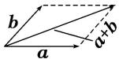平行四边形法则起点重合指向对顶点</td><td>三角形法则起点重合指向被减向量</td><td>（1） $|\lambda a| = |\lambda||a|$ , （2）当 $\lambda >0$ 时, $\lambda a$ 与 $a$ 的方向相同;当 $\lambda < 0$ 时, $\lambda a$ 与 $a$ 的方向相反;当 $\lambda = 0$ 时, $\lambda a = 0$ </td></tr><tr><td>坐标表示 $a=(x_1, y_1)$  $b=(x_2, y_2)$ </td><td colspan="2"> $a+b=(x_1+x_2, y_1+y_2)$ </td><td> $a-b=(x_1-x_2, y_1-y_2)$ </td><td> $\lambda a=(\lambda x_1, \lambda y_1)$ </td></tr></table>

#### 2. 多边形法则

一般地，首尾顺次相接的多个向量的和等于从第一个向量起点指向最后一个向量终点的向量，即 $A_{1}\overrightarrow{A}_{2} + A_{2}\overrightarrow{A}_{3} + A_{3}\overrightarrow{A}_{4} + \ldots +A_{n - 1}A_{n} = A_{1}\overrightarrow{A}_{n}$ ，特别地，一个封闭图形，首尾连接而成的向量和为零向量.

#### 3. 平面向量基本定理

定理：如果 $e_1, e_2$ 是同一平面内的两个不共线向量，那么对于这一平面内的任意向量 $\pmb{a}$ ，存在唯一的一对实数 $\lambda_1, \lambda_2$ ，使 $a = \lambda_1 e_1 + \lambda_2 e_2$ ，其中，不共线的向量 $e_1, e_2$ 叫作表示这一平面内所有向量的一组基底，记为 $\{e_1, e_2\}$ .

#### 4. “爪”子定理

形式1：在 $\triangle ABC$ 中， $D$ 是 $BC$ 上的点，如果 $|BD| = m$ ， $|DC| = n$ ，则 $\overrightarrow{AD} = \frac{m}{m + n}\overrightarrow{AC} +\frac{n}{m + n}\overrightarrow{AB}$ ，其中 $\overrightarrow{AD}$ $\overrightarrow{AB}$ ， $\overrightarrow{AC}$ 知二可求一．特别地，若 $D$ 为线段 $BC$ 的中点，则 $\overrightarrow{AD} = \frac{1}{2} (\overrightarrow{AC} +\overrightarrow{AB})$

形式1

形式2

形式2：在 $\triangle ABC$ 中， $D$ 是 $BC$ 上的点，且 $\overrightarrow{BD} = \lambda \overrightarrow{BC}$ ，则 $\overrightarrow{AD} = \lambda \overrightarrow{AC} + (1 - \lambda)\overrightarrow{AB}$ ，其中 $\overrightarrow{AD},\overrightarrow{AB}$ ， $\overrightarrow{AC}$ 知二可求一．特别地，若 $D$ 为线段 $BC$ 的中点，则 $\overrightarrow{AD} = \frac{1}{2} (\overrightarrow{AC} +\overrightarrow{AB})$

形式 1 与形式 2 中 $\overrightarrow{AC}$ 与 $\overrightarrow{AB}$ 的系数的记忆可总结为：对面的女孩看过来(歌名，原唱任贤齐)

# 考点一 向量的线性运算

# 【方法总结】

# 利用平面向量的线性运算把一个向量表示为两个基向量的一般方法

向量 $\overrightarrow{AD}=f(\overrightarrow{AB},\overrightarrow{AC})$ 的确定方法  
（1）在几何图形中通过三点共线即可考虑使用“爪”子定理完成向量 $\overrightarrow{AD}$ 用 $\overrightarrow{AB}$ , $\overrightarrow{AC}$ 的表示.  
（2）若所给图形比较特殊(正方形、矩形、直角梯形、等边三角形、等腰三角形或直角三角形等)，则可通过建系将向量坐标化，从而得到 $\overrightarrow{AD}=f(\overrightarrow{AB},\overrightarrow{AC})$ 与 $\overrightarrow{AD}=g(\overrightarrow{AB},\overrightarrow{AC})$ 的方程组，再进行求解.

# 【例题选讲】

[例1]（1）(2015·全国I)设 $D$ 为 $\triangle ABC$ 所在平面内一点， $\overrightarrow{BC} = 3\overrightarrow{CD}$ ，则( )

A. $\overrightarrow{AD} = -\frac{1}{3}\overrightarrow{AB} + \frac{4}{3}\overrightarrow{AC}$

B. $\overrightarrow{AD} = \frac{1}{3}\overrightarrow{AB} -\frac{4}{3}\overrightarrow{AC}$

C. $\overrightarrow{AD}=\frac{4}{3}\overrightarrow{AB}+\frac{1}{3}\overrightarrow{AC}$

D. $\overrightarrow{AD} = \frac{4}{3}\overrightarrow{AB} -\frac{1}{3}\overrightarrow{AC}$  
（2）(2014·全国I)设 $D$ ， $E$ ， $F$ 分别为 $\triangle ABC$ 的三边 $BC$ ， $CA$ ， $AB$ 的中点，则 $\overrightarrow{EB} +\overrightarrow{FC} = (\quad)$

A. $\overrightarrow{AD}$

B. $\frac{1}{2}\overrightarrow{AD}$

C. $\overrightarrow{BC}$

D. $\frac{1}{2}\overrightarrow{BC}$  
（3） (2018·全国I)在 $\triangle ABC$ 中， $AD$ 为 $BC$ 边上的中线， $E$ 为 $AD$ 的中点，则 $\overrightarrow{EB}=(\quad)$

A. $\frac{3}{4}\overrightarrow{AB} -\frac{1}{4}\overrightarrow{AC}$

B. $\frac{1}{4}\overrightarrow{AB} -\frac{3}{4}\overrightarrow{AC}$

C. $\frac{3}{4}\overrightarrow{AB}+\frac{1}{4}\overrightarrow{AC}$

D. $\frac{1}{4}\overrightarrow{AB}+\frac{3}{4}\overrightarrow{AC}$  
（4）如图，在 $\triangle ABC$ 中，点 $D$ 在 $BC$ 边上，且 $CD = 2DB$ ，点 $E$ 在 $AD$ 边上，且 $AD = 3AE$ ，则用向量 $\overrightarrow{AB}$ ， $\overrightarrow{AC}$ 表示 $\overrightarrow{CE}$ 为（）

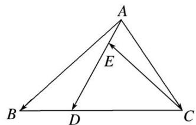

A. $\frac{2}{9}\overrightarrow{AB}+\frac{8}{9}\overrightarrow{AC}$

B. $\frac{2}{9}\overrightarrow{AB}-\frac{8}{9}\overrightarrow{AC}$

C. $\frac{2}{9}\overrightarrow{AB}+\frac{7}{9}\overrightarrow{AC}$

D. $\frac{2}{9}\overrightarrow{AB} -\frac{7}{9}\overrightarrow{AC}$  
（5）如图所示，下列结论正确的是()

① $\overrightarrow{PQ}=\frac{3}{2}\boldsymbol{a}+\frac{3}{2}\boldsymbol{b};$ ② $\overrightarrow{PT}=\frac{3}{2}\boldsymbol{a}-\boldsymbol{b};$ ③ $\overrightarrow{PS}=\frac{3}{2}\boldsymbol{a}-\frac{1}{2}\boldsymbol{b};$ ④ $\overrightarrow{PR}=\frac{3}{2}\boldsymbol{a}+\boldsymbol{b}.$

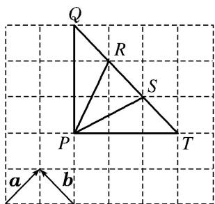

A. ①②

B. ③④

C. ①③

D. ②④  
（6）如图所示，在 $\triangle ABO$ 中， $\overrightarrow{OC}=\frac{1}{4}\overrightarrow{OA}$ ， $\overrightarrow{OD}=\frac{1}{2}\overrightarrow{OB}$ ， $AD$ 与 $BC$ 相交于 $M$ ，设 $\overrightarrow{OA}=a$ ， $\overrightarrow{OB}=b$ ．则用 $a$

和 b 表示向量 $\overrightarrow{OM}=$ \_\_\_\_.

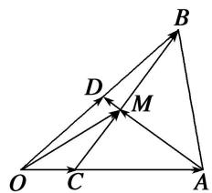  
（7）在平行四边形ABCD中，AC与BD相交于点O，点E是线段OD的中点，AE的延长线与CD交于点F，若 $\overrightarrow{AC} = \boldsymbol{a}$ ， $\overrightarrow{BD} = \boldsymbol{b}$ ，则 $\overrightarrow{AF} = (\quad)$

A. $\frac{1}{4}a+\frac{1}{2}b$

B. $\frac{2}{3}a+\frac{1}{3}b$

C. $\frac{1}{2} a + \frac{1}{4} b$

D. $\frac{1}{3} a + \frac{2}{3} b$

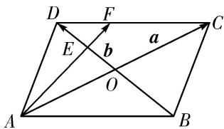  
（8）在平行四边形 ABCD 中，E, F 分别是 BC, CD 的中点，DE 交 AF 于 H，记 $\overrightarrow{AB}$ ， $\overrightarrow{BC}$ 分别为 a, b，则 $\overrightarrow{AH} = (\quad)$

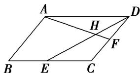

A. $\frac{2}{5}a-\frac{4}{5}b$

B. $\frac{2}{5}a+\frac{4}{5}b$

C. $-\frac{2}{5}a + \frac{4}{5}b$

D. $-\frac{2}{5}a-\frac{4}{5}b$

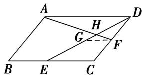  
（9）如图, 在直角梯形 $ABCD$ 中, $AB = 2AD = 2DC$ , $E$ 为 $BC$ 边上一点, $\overrightarrow{BC} = 3\overrightarrow{EC}$ , $F$ 为 $AE$ 的中点, 则 $\overrightarrow{BF} = (\quad)$

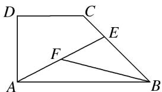

A. $\frac{2}{3}\overrightarrow{AB}-\frac{1}{3}\overrightarrow{AD}$

B. $\frac{1}{3}\overrightarrow{AB} -\frac{2}{3}\overrightarrow{AD}$

C. $-\frac{2}{3}\overrightarrow{AB} + \frac{1}{3}\overrightarrow{AD}$

D. $-\frac{1}{3}\overrightarrow{AB} + \frac{2}{3}\overrightarrow{AD}$  
（10）如图，已知 AB 是圆 O 的直径，点 C，D 是半圆弧的两个三等分点， $\overrightarrow{AB} = a,\quad \overrightarrow{AC} = b$ ，则 $\overrightarrow{AD}$ 等于（）

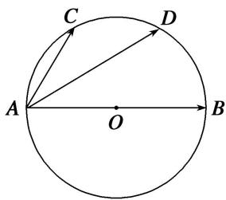

A. $a - \frac{1}{2}b$

B. $\frac{1}{2} a - b$

C. $a+\frac{1}{2}b$

D. $\frac{1}{2} a + b$

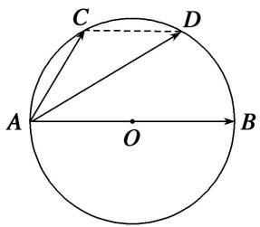

# 【对点训练】

1. 已知 $O, A, B$ 是平面上的三个点，直线 $AB$ 上有一点 $C$ ，满足 $2\overrightarrow{AC} + \overrightarrow{CB} = 0$ ，则 $\overrightarrow{OC}$ 等于（）

A. $2\overrightarrow{OA}-\overrightarrow{OB}$

B. $-\overrightarrow{OA} + 2\overrightarrow{OB}$

C. $\frac{2}{3}\overrightarrow{OA}-\frac{1}{3}\overrightarrow{OB}$

D. $-\frac{1}{3}\overrightarrow{OA} +\frac{2}{3}\overrightarrow{OB}$

2. 如图，在 $\triangle ABC$ 中，点 $D$ 是 $BC$ 边上靠近 $B$ 的三等分点，则 $\overrightarrow{AD}$ 等于( )

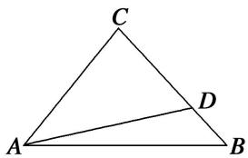

A. $\frac{2}{3}\overrightarrow{AB}-\frac{1}{3}\overrightarrow{AC}$

B. $\frac{1}{3}\overrightarrow{AB} +\frac{2}{3}\overrightarrow{AC}$

C. $\frac{2}{3}\overrightarrow{AB}+\frac{1}{3}\overrightarrow{AC}$

D. $\frac{1}{3}\overrightarrow{AB} -\frac{2}{3}\overrightarrow{AC}$

3. 在 $\triangle ABC$ 中， $\overrightarrow{AB} = c$ ， $\overrightarrow{AC} = b$ ，若点 $D$ 满足 $\overrightarrow{BD} = 2\overrightarrow{DC}$ ，若将 $b$ 与 $c$ 作为基底，则 $\overrightarrow{AD}$ 等于（）

A. $\frac{2}{3}b+\frac{1}{3}c$

B. $\frac{3}{5}c-\frac{2}{3}b$

C. $\frac{2}{3}b-\frac{1}{3}c$

D. $\frac{1}{3}b+\frac{2}{3}c$

4. 如图所示，在 $\triangle ABC$ 中，若 $\overrightarrow{BC} = 3\overrightarrow{DC}$ ，则 $\overrightarrow{AD} = (\quad)$

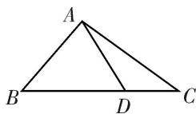

A. $\frac{2}{3}\overrightarrow{AB}+\frac{1}{3}\overrightarrow{AC}$

B. $\frac{2}{3}\overrightarrow{AB} -\frac{1}{3}\overrightarrow{AC}$

C. $\frac{1}{3}\overrightarrow{AB}+\frac{2}{3}\overrightarrow{AC}$

D. $\frac{1}{3}\overrightarrow{AB} -\frac{2}{3}\overrightarrow{AC}$

5. 设 D, E, F 分别为 $\triangle ABC$ 三边 BC, CA, AB 的中点，则 $\overrightarrow{DA} + 2\overrightarrow{EB} + 3\overrightarrow{FC} = (\quad)$

A. $\frac{1}{2}\overrightarrow{AD}$

B. $\frac{3}{2}\overrightarrow{AD}$

C. $\frac{1}{2}\overrightarrow{AC}$

D. $\frac{3}{2}\overrightarrow{AC}$

6. 已知点 $M$ 是 $\triangle ABC$ 的边 $BC$ 的中点，点 $E$ 在边 $AC$ 上，且 $\overrightarrow{EC} = 2\overrightarrow{AE}$ ，则 $\overrightarrow{EM} = (\quad)$

A. $\frac{1}{2}\overrightarrow{AC}+\frac{1}{3}\overrightarrow{AB}$

B. $\frac{1}{2}\overrightarrow{AC}+\frac{1}{6}\overrightarrow{AB}$

C. $\frac{1}{6}\overrightarrow{AC} +\frac{1}{2}\overrightarrow{AB}$

D. $\frac{1}{6}\overrightarrow{AC} +\frac{3}{2}\overrightarrow{AB}$

7. 在 $\triangle ABC$ 中， $P, Q$ 分别是边 $AB, BC$ 上的点，且 $AP = \frac{1}{3} AB, BQ = \frac{1}{3} BC$ 。若 $\overrightarrow{AB} = a, \overrightarrow{AC} = b$ ，则 $\overrightarrow{PQ} = (\quad)$

A. $\frac{1}{3}a+\frac{1}{3}b$

B. $-\frac{1}{3}a+\frac{1}{3}b$

C. $\frac{1}{3} a - \frac{1}{3} b$

D. $-\frac{1}{3}a-\frac{1}{3}b$

8. 已知 D, E, F 分别为 $\triangle ABC$ 的边 BC, CA, AB 的中点，且 $\overrightarrow{BC} = a$ , $\overrightarrow{CA} = b$ ，给出下列命题：① $\overrightarrow{AD} = \frac{1}{2}$
$\boldsymbol {a} - \boldsymbol {b}; ② \overrightarrow {B E} = \boldsymbol {a} + \frac {1}{2} \boldsymbol {b}; ③ \overrightarrow {C F} = - \frac {1}{2} \boldsymbol {a} + \frac {1}{2} \boldsymbol {b}; ④ \overrightarrow {A D} + \overrightarrow {B E} + \overrightarrow {C F} = \mathbf {0}.$
其中正确命题的序号为\_\_\_\_。

9. (多选)在 $\triangle ABC$ 中， $D, E, F$ 分别是边 $BC, CA, AB$ 的中点， $AD, BE, CF$ 交于点 $G$ ，则( )

A. $\overrightarrow{EF} = \frac{1}{2}\overrightarrow{CA} -\frac{1}{2}\overrightarrow{BC}$

B. $\overrightarrow{BE} = -\frac{1}{2}\overrightarrow{BA} +\frac{1}{2}\overrightarrow{BC}$

C. $\overrightarrow{AD} +\overrightarrow{BE} = \overrightarrow{FC}$

D. $\overrightarrow{GA} +\overrightarrow{GB} +\overrightarrow{GC} = 0$

10. 如图所示, 在 $\triangle ABC$ 中, $D$ , $F$ 分别是 $AB$ , $AC$ 的中点, $BF$ 与 $CD$ 交于点 $O$ , 设 $\overrightarrow{AB} = a$ , $\overrightarrow{AC} = b$ , 则用 $a$ , $b$ 表示向量 $\overrightarrow{AO}$ 为 \_\_\_\_.

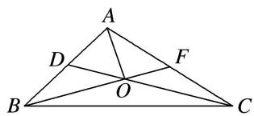

11. 如图，正方形 $ABCD$ 中，点 $E$ 是 $DC$ 的中点，点 $F$ 是 $BC$ 的一个三等分点，那么 $\overrightarrow{EF}$ 等于( )

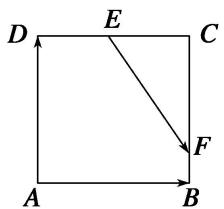

A. $\frac{1}{2}\overrightarrow{AB} -\frac{1}{3}\overrightarrow{AD}$

B. $\frac{1}{4}\overrightarrow{AB} +\frac{1}{2}\overrightarrow{AD}$

C. $\frac{1}{3}\overrightarrow{AB} +\frac{1}{2}\overrightarrow{DA}$

D. $\frac{1}{2}\overrightarrow{AB} -\frac{2}{3}\overrightarrow{AD}$

12. 如图, 在平行四边形 $ABCD$ 中, $E$ 为 $DC$ 边的中点, 且 $\overrightarrow{AB} = a$ , $\overrightarrow{AD} = b$ , 则 $\overrightarrow{BE} = (\quad)$

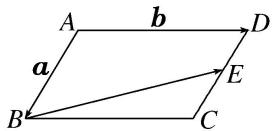

A. $\frac{1}{2} b - a$

B. $\frac{1}{2} a - b$

C. $-\frac{1}{2}a+b$

D. $\frac{1}{2}\boldsymbol{b} + \boldsymbol{a}$

13. 在平行四边形 ABCD 中， $\overrightarrow{AB} = a$ ， $\overrightarrow{AD} = b$ ， $\overrightarrow{AN} = 3\overrightarrow{NC}$ ，M 为 BC 的中点，则 $\overrightarrow{MN} =$ \_\_\_\_。（用 a，b 表示）

14. 在平行四边形 $ABCD$ 中， $\overrightarrow{AB} = \boldsymbol{e}_1$ ， $\overrightarrow{AC} = \boldsymbol{e}_2$ ， $\overrightarrow{NC} = \frac{1}{4}\overrightarrow{AC}$ ， $\overrightarrow{BM} = \frac{1}{2}\overrightarrow{MC}$ ，则 $\overrightarrow{MN} =$ \_\_\_\_．(用 $\boldsymbol{e}_1$ ， $\boldsymbol{e}_2$ 表示)

15. 在平行四边形 ABCD 中，E, F 分别是 BC, CD 的中点，DE 交 AF 于 H，记 $\overrightarrow{AB}$ ， $\overrightarrow{BC}$ 分别为 a, b，则 $\overrightarrow{AH} = (\quad)$

A. $\frac{2}{5} a - \frac{4}{5} b$

B. $\frac{2}{5}a+\frac{4}{5}b$

C. $-\frac{2}{5}a+\frac{4}{5}b$

D. $-\frac{2}{5}a-\frac{4}{5}b$

16. 在梯形 ABCD 中， $\overrightarrow{AB}=3\overrightarrow{DC}$ ，则 $\overrightarrow{BC}=(\quad)$

A. $-\frac{2}{3}\overrightarrow{AB}+\overrightarrow{AD}$

B. $-\frac{2}{3}\overrightarrow{AB} + \frac{4}{3}\overrightarrow{AD}$

C. $-\frac{1}{3}\overrightarrow{AB} + \frac{2}{3}\overrightarrow{AD}$

D. $-\frac{2}{3}\overrightarrow{AB} -\overrightarrow{AD}$

# 考点二 根据向量线性运算求参数

# 【方法总结】

# 利用平面向量的线性运算求参数的一般方法

向量方程 $\overrightarrow{AD}=x\overrightarrow{AB}+y\overrightarrow{AC}$ 中x，y的确定方法  
（1）在几何图形中通过三点共线即可考虑使用“爪”子定理完成向量的表示，进而确定 $x, y$ .  
（2）若所给图形比较特殊(正方形、矩形、直角梯形、等边三角形、等腰三角形或直角三角形等)，则可通过建系将向量坐标化，从而得到关于 $x, y$ 的方程组，再进行求解.  
（3）若题目中某些向量的数量积已知，则对于向量方程 $\overrightarrow{AD}=x\overrightarrow{AB}+y\overrightarrow{AC}$ ，可考虑两边对同一向量作数量积运算，从而得到关于于x，y的方程组，再进行求解.  
（4）对于求 $x + y$ 的值的有关问题可考虑平面向量的等和线定理法，见《平面向量特训之满分必杀篇》第一讲平面向量的等和线.

# 【例题选讲】

[例 1]（1）如图，在 $\triangle OAB$ 中，P为线段AB上的一点， $\overrightarrow{OP}=x\overrightarrow{OA}+y\overrightarrow{OB}$ ，且 $\overrightarrow{BP}=2\overrightarrow{PA}$ ，则()

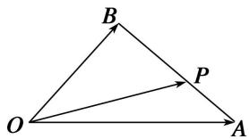

A. $x=\frac{2}{3}$ , $y=\frac{1}{3}$

B. $x=\frac{1}{3}$ , $y=\frac{2}{3}$

C. $x=\frac{1}{4}$ , $y=\frac{3}{4}$

D. $x=\frac{3}{4}$ , $y=\frac{1}{4}$  
（2）(2013·江苏)设 D, E 分别是 $\triangle ABC$ 的边 AB, BC 上的点, $AD = \frac{1}{2} AB$ , $BE = \frac{2}{3} BC$ . 若 $\overrightarrow{DE} = \lambda_{1} \overrightarrow{AB} + \lambda_{2} \overrightarrow{AC} (\lambda_{1}, \lambda_{2}$ 为实数), 则 $\lambda_{1} + \lambda_{2}$ 的值为 \_\_\_\_.  
（3）如图, 在 $\triangle ABC$ 中, 点 $D$ 在线段 $BC$ 上, 且满足 $BD = \frac{1}{2} DC$ , 过点 $D$ 的直线分别交直线 $AB$ , $AC$ 于不同的两点 $M$ , $N$ , 若 $\overrightarrow{AM} = m\overrightarrow{AB}$ , $\overrightarrow{AN} = n\overrightarrow{AC}$ , 则 ( )

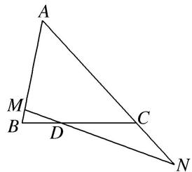

A. $m+n$ 是定值，定值为 2

B. $2m+n$ 是定值，定值为 3

C. $\frac{1}{m} + \frac{1}{n}$ 是定值，定值为 2

D. $\frac{2}{m} + \frac{1}{n}$ 是定值，定值为 3

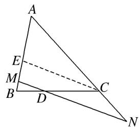  
（4）如图，在 $\triangle ABC$ 中， $\overrightarrow{AD}=\frac{2}{3}\overrightarrow{AC}$ ， $\overrightarrow{BP}=\frac{1}{3}\overrightarrow{BD}$ ，若 $\overrightarrow{AP}=\lambda\overrightarrow{AB}+\mu\overrightarrow{AC}$ ，则 $\lambda+\mu$ 的值为()

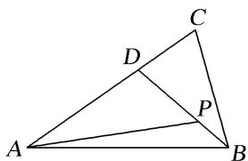

A. $\frac{8}{9}$

B. $\frac{4}{9}$

C. $\frac{8}{3}$

D. $\frac{4}{3}$  
（5）已知在 Rt△ABC 中，∠BAC=90°，AB=1，AC=2，D 是△ABC 内一点，且 ∠DAB=60°，设 $\overrightarrow{AD}=\lambda\overrightarrow{AB}+\mu\overrightarrow{C}(\lambda,\mu\in\mathbf{R})$ ，则 $\frac{\lambda}{\mu}=(\quad)$

A. $\frac{2\sqrt{3}}{3}$

B. $\frac{\sqrt{3}}{3}$

C. 3

D. $2\sqrt{3}$  
（6）如图，在 $\triangle ABC$ 中，设 $\overrightarrow{AB}=\boldsymbol{a}$ ， $\overrightarrow{AC}=\boldsymbol{b}$ ， $AP$ 的中点为 $Q$ ， $BQ$ 的中点为 $R$ ， $CR$ 的中点为 $P$ ，若 $\overrightarrow{AP}=ma+nb$ ，则 $m+n=$ \_\_\_\_.

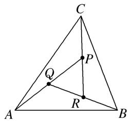  
（7）如图所示，点 $P$ 在矩形ABCD内，且满足 $\angle DAP = 30^{\circ}$ ，若 $|\overrightarrow{AD}| = 1$ ， $|\overrightarrow{AB}| = \sqrt{3}$ ， $\overrightarrow{AP} = m\overrightarrow{AD} + n\overrightarrow{AB}(m, n \in \mathbf{R})$ ，则 $\frac{m}{n}$ 等于（）

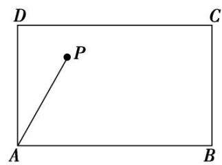

A. $\frac{1}{3}$

B. 3

C. $\frac{\sqrt{3}}{3}$

D. $\sqrt{3}$
> 

> 
> | 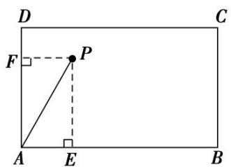 | 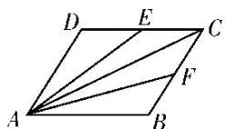 |
> | --- | --- |
> | （8）在平行四边形 ABCD 中，点 E 和 F 分别是边 CD 和 BC 的中点．若 $\overrightarrow{AC} = \lambda \overrightarrow{AE} + \mu \overrightarrow{AF}$ ，其中 $\lambda, \mu \in R$ ，则 $\lambda + \mu =$ \_\_\_\_ . | （9）如图，在直角梯形ABCD中， $\overrightarrow{DC}=\frac{1}{4}\overrightarrow{AB}$ ， $\overrightarrow{BE}=2\overrightarrow{EC}$ ，且 $\overrightarrow{AE}=r\overrightarrow{AB}+s\overrightarrow{AD}$ ，则 $2r+3s=(\quad)$ |
> 

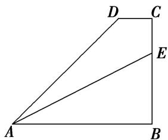

A. 1

B. 2

C. 3

D. 4

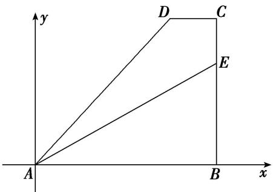  
（10）(2017·江苏)如图，在同一个平面内，向量 $\overrightarrow{OA},\overrightarrow{OB}$ ， $\overrightarrow{OC}$ 的模分别为 $1,1,\sqrt{2}$ ， $\overrightarrow{OA}$ 与 $\overrightarrow{OC}$ 的夹角为 $\alpha$ 且 $\tan \alpha = 7$ ， $\overrightarrow{OB}$ 与 $\overrightarrow{OC}$ 的夹角为 $45^{\circ}$ .若 $\overrightarrow{OC} = m\overrightarrow{OA} +n\overrightarrow{OB}(m,n\in \mathbf{R})$ ，则 $m + n =$

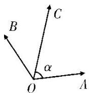

# 【对点训练】

1. 在 $\triangle ABC$ 中，已知 $D$ 是 $AB$ 边上一点，若 $\overrightarrow{AD}=2\overrightarrow{DB}$ ， $\overrightarrow{CB}=\frac{1}{3}\overrightarrow{CA}+\lambda\overrightarrow{CB}$ ，则 $\lambda=$ \_\_\_\_.  
2. 如图所示，在 $\triangle ABC$ 中， $D$ 为 $BC$ 边上的一点，且 $BD = 2DC$ ，若 $\overrightarrow{AC} = m\overrightarrow{AB} + n\overrightarrow{AD}(m, n \in \mathbf{R})$ ，则 $m - n =$ \_\_\_\_.

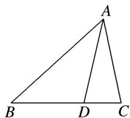

3. 已知 $\triangle ABC$ 中，点 $D$ 在 $BC$ 边上，且 $\overrightarrow{CD} = 2\overrightarrow{DB}$ ， $\overrightarrow{CD} = r\overrightarrow{AB} + s\overrightarrow{AC}$ ，则 $r + s$ 的值是（）

A. $\frac{2}{3}$

B. $\frac{4}{3}$

C.-3

D. 0

4. 在锐角 $\triangle ABC$ 中， $\overrightarrow{CM} = 3\overrightarrow{MB}$ ， $\overrightarrow{AM} = x\overrightarrow{AB} + y\overrightarrow{AC}(x, y \in \mathbf{R})$ ，则 $\frac{x}{y} =$ \_\_\_\_.  
5. 在 $\triangle ABC$ 中，点 $M$ ， $N$ 满足 $\overrightarrow{AM}=2\overrightarrow{MC}$ ， $\overrightarrow{BN}=\overrightarrow{NC}$ 。若 $\overrightarrow{MN}=x\overrightarrow{AB}+y\overrightarrow{AC}$ ，则 $x=$ ， $y=$   
6. 如图所示，在 $\triangle ABC$ 中，点 $O$ 是 $BC$ 的中点．过点 $O$ 的直线分别交直线 $AB$ 、 $AC$ 于不同的两点 $M$ 、 $N$ ，若 $\overrightarrow{AB} = m\overrightarrow{AM}$ ， $\overrightarrow{AC} = n\overrightarrow{AN}$ ，则 $m + n$ 的值为 \_\_\_\_.

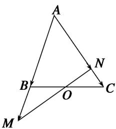

7. 已知点 $G$ 是 $\triangle ABC$ 的重心, 过 $G$ 作一条直线与 $AB$ , $AC$ 两边分别交于 $M$ , $N$ 两点, 且 $\overrightarrow{AM} = x\overrightarrow{AB}$ , $\overrightarrow{AN} = y\overrightarrow{AC}$ , 则 $\frac{xy}{x + y}$ 的值为 ( )

A. $\frac{1}{2}$

B. $\frac{1}{3}$

C. 2

D. 3

8. 如图所示, $AD$ 是 $\triangle ABC$ 的中线, $O$ 是 $AD$ 的中点, 若 $\overrightarrow{CO} = \lambda \overrightarrow{AB} + \mu \overrightarrow{AC}$ , 其中 $\lambda$ , $\mu \in \mathbf{R}$ , 则 $\lambda + \mu$ 的值为 ( )

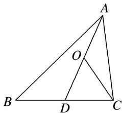

A. $-\frac{1}{2}$

B. $\frac{1}{2}$

C. $-\frac{1}{4}$

D. $\frac{1}{4}$

9. 如图, 在 $\triangle ABC$ 中, $\overrightarrow{AN} = \frac{1}{3}\overrightarrow{NC}$ , $P$ 是 $BN$ 上的一点, 若 $\overrightarrow{AP} = m\overrightarrow{AB} + \frac{2}{11}\overrightarrow{AC}$ , 则实数 $m$ 的值为 \_\_\_\_.

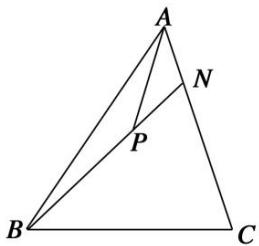

10. 在 $\triangle ABC$ 中， $\overrightarrow{AN}=\frac{1}{4}\overrightarrow{NC}$ ，若 $P$ 是直线 $BN$ 上的一点，且满足 $\overrightarrow{AP}=m\overrightarrow{AB}+\frac{2}{5}\overrightarrow{AC}$ ，则实数 $m$ 的值为( )

A. -4

B.-1

C. 1

D. 4

11. 在 $\triangle ABC$ 中， $M$ 为边 $BC$ 上任意一点， $N$ 为 $AM$ 的中点， $\overrightarrow{AN}=\lambda\overrightarrow{AB}+\mu\overrightarrow{AC}$ ，则 $\lambda+\mu$ 的值为( )

A. $\frac{1}{2}$

B. $\frac{1}{3}$

C. $\frac{1}{4}$

D. 1

12. 在 $\triangle ABC$ 中， $AB=2, BC=3$ ， $\angle ABC=60^{\circ}$ ， $AD$ 为 $BC$ 边上的高， $O$ 为 $AD$ 的中点，若 $\overrightarrow{AO}=\lambda\overrightarrow{AB}+\mu\overrightarrow{BC}$ ，则 $\lambda+\mu$ 等于（）

A. 1

B. $\frac{1}{2}$

C. $\frac{1}{3}$

D. $\frac{2}{3}$

13. 在 $\triangle ABC$ 中， $D$ 为三角形所在平面内一点，且 $\overrightarrow{AD}=\frac{1}{3}\overrightarrow{AB}+\frac{1}{2}\overrightarrow{AC}$ . 延长 $AD$ 交 $BC$ 于 $E$ ，若 $\overrightarrow{AE}=\lambda\overrightarrow{AB}+\mu\overrightarrow{AC}$ ，则 $\lambda-\mu$ 的值是\_\_\_\_.

14. 如图，正方形 $ABCD$ 中， $E$ 为 $DC$ 的中点，若 $\overrightarrow{AE} = \lambda \overrightarrow{AB} + \mu \overrightarrow{AC}$ ，则 $\lambda + \mu$ 的值为（）

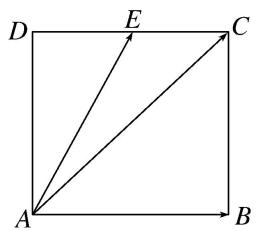

A. $\frac{1}{2}$

B. $-\frac{1}{2}$

C. 1

D.-1

15. 如图所示，正方形 $ABCD$ 中， $M$ 是 $BC$ 的中点，若 $\overrightarrow{AC} = \lambda \overrightarrow{AM} + \mu \overrightarrow{BD}$ ，则 $\lambda + \mu = (\quad)$

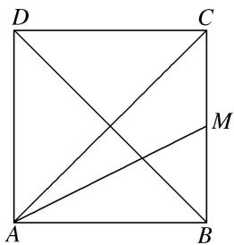

A. $\frac{4}{3}$

B. $\frac{5}{3}$

C. $\frac{15}{8}$

D. 2

16. 如图所示，矩形 $ABCD$ 的对角线相交于点 $O$ ， $E$ 为 $AO$ 的中点，若 $\overrightarrow{DE} = \lambda \overrightarrow{AB} + \mu \overrightarrow{AD} (\lambda, \mu$ 为实数)，则 $\lambda^2 + \mu^2$ 等于（）

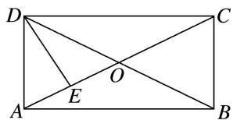

A. $\frac{5}{8}$

B. $\frac{1}{4}$

C. 1

D. $\frac{5}{16}$

17. 如图，直线 EF 与平行四边形 ABCD 的两边 AB，AD 分别交于 E，F 两点，且与对角线 AC 交于点 K，其中， $\overrightarrow{AE}=\frac{2}{5}\overrightarrow{AB}$ ， $\overrightarrow{AF}=\frac{1}{2}\overrightarrow{AD}$ ， $\overrightarrow{AK}=\lambda\overrightarrow{AC}$ ，则 $\lambda$ 的值为 \_\_\_\_.

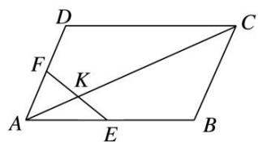

18. 如图，在平行四边形 $ABCD$ 中， $AC, BD$ 相交于点 $O, E$ 为线段 $AO$ 的中点．若 $\overrightarrow{BE} = \lambda \overrightarrow{BA} + \mu \overrightarrow{BD} (\lambda, \mu \in \mathbf{R})$ ，则 $\lambda + \mu$ 等于（）

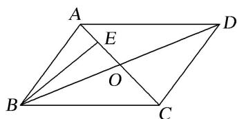

A. 1

B. $\frac{3}{4}$

C. $\frac{2}{3}$

D. $\frac{1}{2}$

19. 一直线 $l$ 与平行四边形ABCD中的两边 $AB, AB$ 分别交于点 $E, F$ , 且交其对角线 $AC$ 于点 $M$ , 若 $\overrightarrow{AB} = 2\overrightarrow{AE}, \overrightarrow{AD} = 3\overrightarrow{AF}, \overrightarrow{AM} = \lambda \overrightarrow{AB} - \mu \overrightarrow{AC} (\lambda, \mu \in \mathbf{R})$ , 则 $\frac{5}{2}\mu - \lambda = (\quad)$

A. $-\frac{1}{2}$

B. 1

C. $\frac{3}{2}$

D.-3

20. 如图，在平行四边形 $ABCD$ 中， $E, F$ 分别为边 $AB, BC$ 的中点，连接 $CE, DF$ ，交于点 $G$ 。若 $\overrightarrow{CG} = \lambda \overrightarrow{CD}$
$+\mu\overrightarrow{CB}(\lambda,\ \mu\in\mathbf{R})$ ，则 $\frac{\lambda}{\mu}=$ \_\_\_\_.

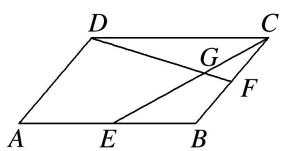

21. 如图，在直角梯形 $ABCD$ 中， $AB \parallel DC$ ， $AD \perp DC$ ， $AD = DC = 2AB$ ， $E$ 为 $AD$ 的中点，若 $\overrightarrow{CA} = \lambda \overrightarrow{CE} + \mu \overrightarrow{DB} (\lambda, \mu \in \mathbf{R})$ ，则 $\lambda + \mu$ 的值为（）

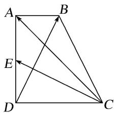

A. $\frac{6}{5}$

B. $\frac{8}{5}$

C. 2

D. $\frac{8}{3}$

22. 在梯形 ABCD 中，已知 $AB \parallel CD$ ，AB = 2CD，M，N 分别为 CD，BC 的中点．若 $\overrightarrow{AB} = \lambda \overrightarrow{AM} + \mu \overrightarrow{AN}$ ，则 $\lambda + \mu$ 的值为（）

A. $\frac{1}{4}$

B. $\frac{1}{5}$

C. $\frac{4}{5}$

D. $\frac{5}{4}$

23. 已知 $|\overrightarrow{OA}| = 1$ , $|\overrightarrow{OB}| = \sqrt{3}$ , $\overrightarrow{OA} \cdot \overrightarrow{OB} = 0$ , 点 $C$ 在 $\angle AOB$ 内, 且 $\overrightarrow{OC}$ 与 $\overrightarrow{OA}$ 的夹角为 $30^\circ$ , 设 $\overrightarrow{OC} = m\overrightarrow{OA} + n\overrightarrow{OB}$ ( $m$ , $n \in \mathbf{R}$ ), 则 $\frac{m}{n}$ 的值为 ( )

A. 2

B. $\frac{5}{2}$

C. 3

D. 4

# 考点三 根据向量线性运算求参数的取值范围(最值)

# 【方法总结】

# 向量线性运算求参数的取值范围(最值)问题的 2 种求解方法  
（1）几何法：即临界位置法，结合图形，确定临界位置的动态分析求出范围.  
（2）代数法：即目标函数法，将参数表示为某一个变量或两个变量的函数，建立函数关系式，再利用三角函数有界性、二次函数或基本不等式求最值或范围.

# 【例题选讲】

[例 1]（1）已知在 $\triangle ABC$ 中，点 D 满足 $2\overrightarrow{BD}+\overrightarrow{CD}=0$ ，过点 D 的直线 l 与直线 AB，AC 分别交于点 M，N， $\overrightarrow{AM}=\lambda\overrightarrow{AB}$ ， $\overrightarrow{AN}=\mu\overrightarrow{AC}$ 。若 $\lambda>0,\mu>0$ ，则 $\lambda+\mu$ 的最小值为 \_\_\_\_。  
（2）如图，圆 $O$ 是边长为 $2\sqrt{3}$ 的等边三角形 $ABC$ 的内切圆，其与 $BC$ 边相切于点 $D$ ，点 $M$ 为圆上任意一点， $\overrightarrow{BM} = x\overrightarrow{BA} +y\overrightarrow{BD}(x,y\in \mathbf{R})$ ，则 $2x + y$ 的最大值为（）

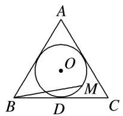

A. $\sqrt{2}$

B. $\sqrt{3}$

C. 2

D. $2\sqrt{2}$  
（3） (2017·全国III)在矩形ABCD中， $AB = 1$ ， $AD = 2$ ，动点 $P$ 在以点 $C$ 为圆心且与BD相切的圆上．若 $\overrightarrow{AP} = \lambda \overrightarrow{AB} +\mu \overrightarrow{AD}$ ，则 $\lambda +\mu$ 的最大值为（）

A. 3

B. $2\sqrt{2}$

C. $\sqrt{5}$

D. 2

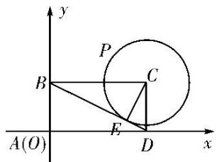  
（4）如图，在扇形 OAB 中， $\angle AOB=\frac{\pi}{3}$ ，C 为弧 AB 上的一个动点，若 $\overrightarrow{OC}=x\overrightarrow{OA}+y\overrightarrow{OB}$ ，则 $x+3y$ 的取值范围是 \_\_\_\_.

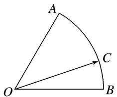

# 【对点训练】

1. 在 $\triangle ABC$ 中，点 $D$ 在线段 $BC$ 的延长线上，且 $\overrightarrow{BC}=3\overrightarrow{CD}$ ，点 $O$ 在线段 $CD$ 上(与点 $C, D$ 不重合)，若 $\overrightarrow{AO}=x\overrightarrow{AB}+(1-x)\overrightarrow{AC}$ ，则 $x$ 的取值范围是（）

A. $\left(0,\frac{1}{2}\right)$

B. $\left(0,\frac{1}{3}\right)$

C. $\left(-\frac{1}{2},0\right)$

D. $\left(-\frac{1}{3},0\right)$

2. 在 $\triangle ABC$ 中，点 $D$ 满足 $\overrightarrow{BD}=\overrightarrow{DC}$ ，当点 $E$ 在线段 $AD$ 上移动时，若 $\overrightarrow{AE}=\lambda\overrightarrow{AB}+\mu\overrightarrow{AC}$ ，则 $t=(\lambda-1)^{2}+\mu^{2}$ 的最小值是\_\_\_\_。

3. 如图所示, 在 $\triangle ABC$ 中, 点 $O$ 是 $BC$ 的中点, 过点 $O$ 的直线分别交直线 $AB$ , $AC$ 于不同的两点 $M$ , $N$ , 若 $\overrightarrow{AB} = m\overrightarrow{AM}$ , $\overrightarrow{AC} = n\overrightarrow{AN}$ , 则 $mn$ 的最大值为 \_\_\_\_.

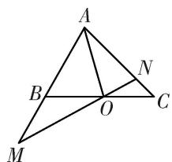

4. 在锐角三角形 $ABC$ 中, 角 $A, B, C$ 所对的边分别为 $a, b, c$ , 点 $O$ 为 $\triangle ABC$ 的外接圆的圆心, $A = \frac{\pi}{3}$ , 且 $\overrightarrow{AO} = \lambda \overrightarrow{AB} + \mu \overrightarrow{AC}$ , 则 $\lambda \mu$ 的最大值为 \_\_\_\_.

5. 在矩形 ABCD 中， $AB=\sqrt{5}$ ， $BC=\sqrt{3}$ ，P 为矩形内一点，且 $AP=\frac{\sqrt{5}}{2}$ ，若 $\overrightarrow{AP}=\lambda\overrightarrow{AB}+\mu\overrightarrow{AD}(\lambda,\mu\in\mathbf{R})$ ，则 $\sqrt{5}\lambda+\sqrt{3}\mu$ 的最大值为 \_\_\_\_.

6. 平行四边形 $ABCD$ 中, $AB=3$ , $AD=2$ , $\angle BAD=120^{\circ}$ , $P$ 是平行四边形 $ABCD$ 内一点, 且 $AP=1$ , 若 $\overrightarrow{AP}=x\overrightarrow{AB}+y\overrightarrow{AD}$ , 则 $3x+2y$ 的最大值为 \_\_\_\_.

7. 在直角梯形 ABCD 中， $\angle A=90^{\circ}$ ， $\angle B=30^{\circ}$ ， $AB=2\sqrt{3}$ ，BC=2，点 E 在线段 CD 上，若 $\overrightarrow{AE}=\overrightarrow{AD}+\mu\overrightarrow{AB}$ ，则 $\mu$ 的取值范围是 \_\_\_\_.

8. 如图所示, $A, B, C$ 是圆 $O$ 上的三点, 线段 $CO$ 的延长线与 $BA$ 的延长线交于圆 $O$ 外的一点 $D$ , 若 $\overrightarrow{OC} = m\overrightarrow{OA} + n\overrightarrow{OB}$ , 则 $m + n$ 的取值范围是 \_\_\_\_.

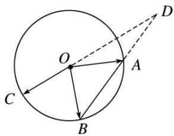

9. 给定两个长度为 1 的平面向量 $\overrightarrow{OA}$ 和 $\overrightarrow{OB}$ , 它们的夹角为 $90^{\circ}$ , 如图所示, 点 $C$ 在以 $O$ 为圆心的圆弧 $\widehat{AB}$ 上运动, 若 $\overrightarrow{OC} = x\overrightarrow{OA} + y\overrightarrow{OB}$ , 其中 $x, y \in \mathbf{R}$ , 则 $x + y$ 的最大值是( )

A. 1

B. $\sqrt{2}$

C. $\sqrt{3}$

D. 2

10. 给定两个长度为 1 的平面向量 $\overrightarrow{OA}$ 和 $\overrightarrow{OB}$ ，它们的夹角为 $\frac{2\pi}{3}$ 。如图所示，点 $C$ 在以 $O$ 为圆心的圆弧 $\widehat{AB}$ 上运动。若 $\overrightarrow{OC} = x\overrightarrow{OA} + y\overrightarrow{OB}$ ，其中 $x, y \in \mathbf{R}$ ，则 $x + y$ 的最大值为 \_\_\_\_。

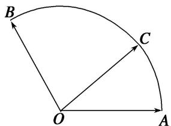

