# 专题一 平面向量的线性运算

#### 1. 向量的线性运算

<table><tr><td>向量运算</td><td colspan="2">加法</td><td>减法</td><td>数乘</td></tr><tr><td>几何表示</td><td>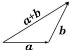三角形法则首尾相接指向终点</td><td>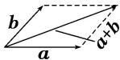平行四边形法则起点重合指向对顶点</td><td>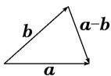三角形法则起点重合指向被减向量</td><td>（1） $|\lambda a| = |\lambda||a|$ , （2）当 $\lambda >0$ 时,  $\lambda a$ 与 $a$ 的方向相同; 当 $\lambda < 0$ 时,  $\lambda a$ 与 $a$ 的方向相反; 当 $\lambda = 0$ 时, $\lambda a = 0$ </td></tr><tr><td>坐标表示 $a=(x_1,y_1)$  $b=(x_2,y_2)$ </td><td colspan="2"> $a+b=(x_1+x_2,y_1+y_2)$ </td><td> $a-b=(x_1-x_2,y_1-y_2)$ </td><td> $\lambda a=(\lambda x_1,\lambda y_1)$ </td></tr></table>

#### 2. 多边形法则

一般地，首尾顺次相接的多个向量的和等于从第一个向量起点指向最后一个向量终点的向量，即 $A_{1}\overrightarrow{A}_{2} + A_{2}\overrightarrow{A}_{3} + A_{3}\overrightarrow{A}_{4} + \ldots +A_{n - 1}A_{n} = A_{1}\overrightarrow{A}_{n}$ ，特别地，一个封闭图形，首尾连接而成的向量和为零向量.

#### 3. 平面向量基本定理

定理：如果 $e_1, e_2$ 是同一平面内的两个不共线向量，那么对于这一平面内的任意向量 $\pmb{a}$ ，存在唯一的一对实数 $\lambda_1, \lambda_2$ ，使 $a = \lambda_1 e_1 + \lambda_2 e_2$ ，其中，不共线的向量 $e_1, e_2$ 叫作表示这一平面内所有向量的一组基底，记为 $\{e_1, e_2\}$ .

#### 4. “爪”子定理

形式1：在 $\triangle ABC$ 中， $D$ 是 $BC$ 上的点，如果 $|BD| = m$ ， $|DC| = n$ ，则 $\overrightarrow{AD} = \frac{m}{m + n}\overrightarrow{AC} +\frac{n}{m + n}\overrightarrow{AB}$ ，其中 $\overrightarrow{AD}$ $\overrightarrow{AB}$ ， $\overrightarrow{AC}$ 知二可求一．特别地，若 $D$ 为线段 $BC$ 的中点，则 $\overrightarrow{AD} = \frac{1}{2} (\overrightarrow{AC} +\overrightarrow{AB})$

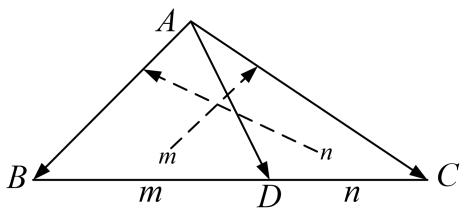

形式1

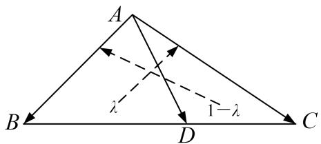

形式2

形式2：在 $\triangle ABC$ 中， $D$ 是 $BC$ 上的点，且 $\overrightarrow{BD} = \lambda \overrightarrow{BC}$ ，则 $\overrightarrow{AD} = \lambda \overrightarrow{AC} + (1 - \lambda)\overrightarrow{AB}$ ，其中 $\overrightarrow{AD},\overrightarrow{AB}$ ， $\overrightarrow{AC}$ 知二可求一．特别地，若 $D$ 为线段 $BC$ 的中点，则 $\overrightarrow{AD} = \frac{1}{2} (\overrightarrow{AC} +\overrightarrow{AB})$

形式 1 与形式 2 中 $\overrightarrow{AC}$ 与 $\overrightarrow{AB}$ 的系数的记忆可总结为：对面的女孩看过来(歌名，原唱任贤齐)

# 考点一 向量的线性运算

# 【方法总结】

# 利用平面向量的线性运算把一个向量表示为两个基向量的一般方法

向量 $\overrightarrow{AD}=f(\overrightarrow{AB},\overrightarrow{AC})$ 的确定方法  
（1）在几何图形中通过三点共线即可考虑使用“爪”子定理完成向量 $\overrightarrow{AD}$ 用 $\overrightarrow{AB}$ ， $\overrightarrow{AC}$ 的表示.  
（2）若所给图形比较特殊(正方形、矩形、直角梯形、等边三角形、等腰三角形或直角三角形等)，则可通过建系将向量坐标化，从而得到 $\overrightarrow{AD}=f(\overrightarrow{AB},\overrightarrow{AC})$ 与 $\overrightarrow{AD}=g(\overrightarrow{AB},\overrightarrow{AC})$ 的方程组，再进行求解.

# 【例题选讲】

[例 1]（1）(2015·全国I)设 D 为△ABC 所在平面内一点， $\overrightarrow{BC}=3\overrightarrow{CD}$ ，则()

A. $\overrightarrow{AD} = -\frac{1}{3}\overrightarrow{AB} + \frac{4}{3}\overrightarrow{AC}$   
B. $\overrightarrow{AD} = \frac{1}{3}\overrightarrow{AB} -\frac{4}{3}\overrightarrow{AC}$   
C. $\overrightarrow{AD}=\frac{4}{3}\overrightarrow{AB}+\frac{1}{3}\overrightarrow{AC}$   
D. $\overrightarrow{AD}=\frac{4}{3}\overrightarrow{AB}-\frac{1}{3}\overrightarrow{AC}$
答案 A 解析 $\overrightarrow{AD}=\overrightarrow{AC}+\overrightarrow{CD}=\overrightarrow{AC}+\frac{1}{3}\overrightarrow{BC}=\overrightarrow{AC}+\frac{1}{3}(\overrightarrow{AC}-\overrightarrow{AB})=\frac{4}{3}\overrightarrow{AC}-\frac{1}{3}\overrightarrow{AB}=-\frac{1}{3}\overrightarrow{AB}+\frac{4}{3}\overrightarrow{AC}$ ，故选 A.  
（2）(2014·全国I)设 D, E, F 分别为 $\triangle ABC$ 的三边 BC, CA, AB 的中点，则 $\overrightarrow{EB} + \overrightarrow{FC} = (\quad)$

A. $\overrightarrow{AD}$

B. $\frac{1}{2}\overrightarrow{AD}$

C. $\overrightarrow{BC}$

D. $\frac{1}{2}\overrightarrow{BC}$
答案 A 解析 $\overrightarrow{EB} + \overrightarrow{FC} = \frac{1}{2} (\overrightarrow{AB} + \overrightarrow{CB}) + \frac{1}{2} (\overrightarrow{AC} + \overrightarrow{BC}) = \frac{1}{2} (\overrightarrow{AB} + \overrightarrow{AC}) = \overrightarrow{AD}$ ，故选 A.  
（3） (2018·全国I)在 $\triangle ABC$ 中， $AD$ 为 $BC$ 边上的中线， $E$ 为 $AD$ 的中点，则 $\overrightarrow{EB}=(\quad)$

A. $\frac{3}{4}\overrightarrow{AB}-\frac{1}{4}\overrightarrow{AC}$

B. $\frac{1}{4}\overrightarrow{AB}-\frac{3}{4}\overrightarrow{AC}$

C. $\frac{3}{4}\overrightarrow{AB}+\frac{1}{4}\overrightarrow{AC}$

D. $\frac{1}{4}\overrightarrow{AB} +\frac{3}{4}\overrightarrow{AC}$
答案 A 解析 $\because E$ 是 AD 的中点， $\therefore \overrightarrow{EA} = -\frac{1}{2}\overrightarrow{AD}, \therefore \overrightarrow{EB} = \overrightarrow{EA} + \overrightarrow{AB} = -\frac{1}{2}\overrightarrow{AD} + \overrightarrow{AB}$ ，又知 D 是 BC 的中点， $\therefore \overrightarrow{AD} = \frac{1}{2} (\overrightarrow{AB} + \overrightarrow{AC})$ ，因此 $\overrightarrow{EB} = -\frac{1}{4} (\overrightarrow{AB} + \overrightarrow{AC}) + \overrightarrow{AB} = \frac{3}{4}\overrightarrow{AB} - \frac{1}{4}\overrightarrow{AC}$ .  
（4）如图，在 $\triangle ABC$ 中，点 $D$ 在 $BC$ 边上，且 $CD=2DB$ ，点 $E$ 在 $AD$ 边上，且 $AD=3AE$ ，则用向量 $\overrightarrow{AB}$ ， $\overrightarrow{AC}$ 表示 $\overrightarrow{CE}$ 为（）

A. $\frac{2}{9}\overrightarrow{AB}+\frac{8}{9}\overrightarrow{AC}$

B. $\frac{2}{9}\overrightarrow{AB} -\frac{8}{9}\overrightarrow{AC}$

C. $\frac{2}{9}\overrightarrow{AB}+\frac{7}{9}\overrightarrow{AC}$

D. $\frac{2}{9}\overrightarrow{AB} -\frac{7}{9}\overrightarrow{AC}$
答案 B 解析 由平面向量的三角形法则及向量共线的性质可得 $\overrightarrow{CE} = \overrightarrow{AE} -\overrightarrow{AC} = \frac{1}{3}\overrightarrow{AD} -\overrightarrow{AC} = \frac{1}{3} (\overrightarrow{AB} +$ $\frac{1}{3}\overrightarrow{BC}) - \overrightarrow{AC} = \frac{1}{3}\left[\overrightarrow{AB} +\frac{1}{3} (\overrightarrow{AC} -\overrightarrow{AB})\right] - \overrightarrow{AC} = \frac{2}{9}\overrightarrow{AB} -\frac{8}{9}\overrightarrow{AC}.$  
（5）如图所示，下列结论正确的是()

① $\overrightarrow{PQ}=\frac{3}{2}\boldsymbol{a}+\frac{3}{2}\boldsymbol{b};$ ② $\overrightarrow{PT}=\frac{3}{2}\boldsymbol{a}-\boldsymbol{b};$ ③ $\overrightarrow{PS}=\frac{3}{2}\boldsymbol{a}-\frac{1}{2}\boldsymbol{b};$ ④ $\overrightarrow{PR}=\frac{3}{2}\boldsymbol{a}+\boldsymbol{b}.$

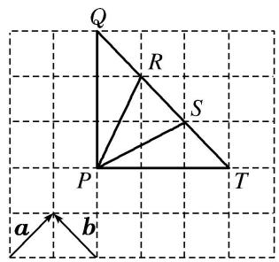

A. ①②

B. ③④

C. ①③

D. ②④
答案 C 解析 ①根据向量的加法法则，得 $\overrightarrow{PQ}=\frac{3}{2}a+\frac{3}{2}b$ ，故①正确；②根据向量的减法法则，得 $\overrightarrow{PT}=\frac{3}{2}a-\frac{3}{2}b$ ，故②错误；③ $\overrightarrow{PS}=\overrightarrow{PQ}+\overrightarrow{QS}=\frac{3}{2}a+\frac{3}{2}b-2b=\frac{3}{2}a-\frac{1}{2}b$ ，故③正确；④ $\overrightarrow{PR}=\overrightarrow{PQ}+\overrightarrow{QR}=\frac{3}{2}a+\frac{3}{2}b-b=\frac{3}{2}a+\frac{1}{2}b$ ，故④错误，故选C.  
（6）如图所示，在 $\triangle ABO$ 中， $\overrightarrow{OC}=\frac{1}{4}\overrightarrow{OA}$ ， $\overrightarrow{OD}=\frac{1}{2}\overrightarrow{OB}$ ， $AD$ 与 $BC$ 相交于 $M$ ，设 $\overrightarrow{OA}=a$ ， $\overrightarrow{OB}=b$ ．则用 $a$ 和 $b$ 表示向量 $\overrightarrow{OM}=$ \_\_\_\_.

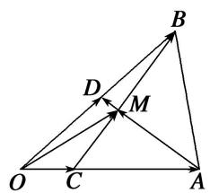
答案 $\overrightarrow{OM} = \frac{1}{7} a + \frac{3}{7} b$ 解析 设 $\overrightarrow{OM} = ma + nb$ ，则 $\overrightarrow{AM} = \overrightarrow{OM} - \overrightarrow{OA} = ma + nb - a = (m - 1)a + nb$ . $\overrightarrow{AD} = \overrightarrow{OD} - \overrightarrow{OA} = \frac{1}{2}\overrightarrow{OB} - \overrightarrow{OA} = -a + \frac{1}{2}b$ 。又 $\because A, M, D$ 三点共线， $\therefore \overrightarrow{AM}$ 与 $\overrightarrow{AD}$ 共线。 $\therefore$ 存在实数 $t$ ，使得 $\overrightarrow{AM} = t\overrightarrow{AD}$ ，即 $(m - 1)a + nb = t\left(-a + \frac{1}{2}b\right)$ . $\therefore (m - 1)a + nb = -ta + \frac{1}{2}tb$ . $\therefore \begin{cases} m - 1 = -t, \\ n = \frac{t}{2}, \end{cases}$ 消去 $t$ 得， $m - 1 = -2n$ ，即 $m + 2n = 1$ . ①. 又 $\because \overrightarrow{CM} = \overrightarrow{OM} - \overrightarrow{OC} = ma + nb - \frac{1}{4}a = \left(m - \frac{1}{4}\right)a + nb$ , $\overrightarrow{CB} = \overrightarrow{OB} - \overrightarrow{OC}$ $= b - \frac{1}{4}a = -\frac{1}{4}a + b$ . 又 $\because C, M, B$ 三点共线， $\therefore \overrightarrow{CM}$ 与 $\overrightarrow{CB}$ 共线。 $\therefore$ 存在实数 $t_1$ ，使得 $\overrightarrow{CM} = t_1\overrightarrow{CB}$ , $\therefore \left(m - \frac{1}{4}\right)a + nb = t_1\left(-\frac{1}{4}a + b\right)$ , $\therefore \begin{cases} m - \frac{1}{4} = -\frac{1}{4}t_1, \\ n = t_1. \end{cases}$ 消去 $t_1$ 得， $4m + n = 1$ ，②. 由①②得 $m = \frac{1}{7}$ , $n = \frac{3}{7}$ , $\therefore \overrightarrow{OM} = \frac{1}{7}a + \frac{3}{7}b$ .

另解 因为 A, M, D 三点共线，所以 $\overrightarrow{OM} = \lambda_{1}\overrightarrow{OD} + (1 - \lambda_{1})\overrightarrow{OA} = \frac{1}{2}\lambda_{1}\boldsymbol{b} + (1 - \lambda_{1})\boldsymbol{a}$ ，①，因为 C, M, B

三点共线，所以 $\overrightarrow{OM} = \lambda_2\overrightarrow{OB} + (1 - \lambda_2)\overrightarrow{OC} = \lambda_2\boldsymbol {b} + (\frac{1 - \lambda_2}{4})\boldsymbol {a}$ ，②，由①②可得 $\left\{ \begin{array}{ll}\frac{1}{2}\lambda_1 = \lambda_2,\\ 1 - \lambda_1 = \frac{1 - \lambda_2}{4}, \end{array} \right.$ 解得 $\left\{ \begin{array}{ll}\lambda_{1} = \frac{6}{7},\\ \lambda_{2} = \frac{3}{7}. \end{array} \right.$ 故 $\overrightarrow{OM} = \frac{1}{7}\boldsymbol {a} + \frac{3}{7}\boldsymbol {b}.$  
（7）在平行四边形ABCD中，AC与BD相交于点O，点E是线段OD的中点，AE的延长线与CD交于点F，若 $\overrightarrow{AC} = \boldsymbol{a}$ ， $\overrightarrow{BD} = \boldsymbol{b}$ ，则 $\overrightarrow{AF} = (\quad)$

A. $\frac{1}{4}a+\frac{1}{2}b$

B. $\frac{2}{3} a + \frac{1}{3} b$

C. $\frac{1}{2}a+\frac{1}{4}b$

D. $\frac{1}{3} a + \frac{2}{3} b$
答案 B 解析 如图，根据题意，得 $\overrightarrow{AB} = \frac{1}{2}\overrightarrow{AC} +\frac{1}{2}\overrightarrow{DB} = \frac{1}{2} (a - b)$ ， $\overrightarrow{AD} = \frac{1}{2}\overrightarrow{AC} +\frac{1}{2}\overrightarrow{BD} = \frac{1}{2} (a + b)$ .令 $\overrightarrow{AF} =$ $t\overrightarrow{AE}$ ，则 $\overrightarrow{AF} = t(\overrightarrow{AB} +\overrightarrow{BE}) = t\left( \begin{array}{cc}\overrightarrow{AB} +\frac{3}{4}\overrightarrow{BE} \end{array} \right) = \frac{t}{2}\pmb {a} + \frac{t}{4}\pmb {b}$ 由 $\overrightarrow{AF} = \overrightarrow{AD} +\overrightarrow{DF}$ ，令 $\overrightarrow{DF} = s\overrightarrow{DC}$ ，又 $\overrightarrow{AD} = \frac{1}{2} (\pmb {a} + \pmb {b})$ ， $\overrightarrow{DF} =$ $\frac{s}{2}\pmb {a} - \frac{s}{2}\pmb {b}$ ，所以 $\overrightarrow{AF} = \frac{s + 1}{2}\pmb {a} + \frac{1 - s}{2}\pmb {b}$ ，所以 $\left\{ \begin{array}{ll}\frac{t}{2} = \frac{s + 1}{2},\\ \frac{t}{4} = \frac{1 - s}{2}, \end{array} \right.$ 解方程组得 $\left\{ \begin{array}{ll}s = \frac{1}{3},\\ t = \frac{4}{3}, \end{array} \right.$ 把 $s$ 代入即可得到 $\overrightarrow{AF} = \frac{2}{3}\pmb {a}$ $+\frac{1}{3}\pmb {b}$ ，故选B.

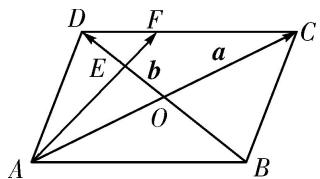

另解 如图， $\overrightarrow{AF} = \overrightarrow{AD} + \overrightarrow{DF}$ ，由题意知， $DE:BE = 1:3 = DF:AB$ ，故 $\overrightarrow{DF} = \frac{1}{3}\overrightarrow{AB}$ ，则 $\overrightarrow{AF} = \frac{1}{2} a + \frac{1}{2} b + \frac{1}{3}$ ( $\frac{1}{2} a - \frac{1}{2} b$ ) $= \frac{2}{3} a + \frac{1}{3} b$ .  
（8）在平行四边形 ABCD 中，E, F 分别是 BC, CD 的中点，DE 交 AF 于 H，记 $\overrightarrow{AB}$ ， $\overrightarrow{BC}$ 分别为 a, b，则 $\overrightarrow{AH} = (\quad)$

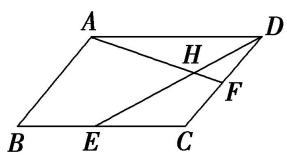

A. $\frac{2}{5}a-\frac{4}{5}b$

B. $\frac{2}{5}a+\frac{4}{5}b$

C. $-\frac{2}{5}a + \frac{4}{5}b$

D. $-\frac{2}{5}a-\frac{4}{5}b$
答案 B 解析 如图，过点 F 作 BC 的平行线交 DE 于 G，则 G 是 DE 的中点，且 $\overrightarrow{GF} = \frac{1}{2}\overrightarrow{EC} = \frac{1}{4}\overrightarrow{BC}$ ，
∴ $\overrightarrow{GF} = \frac{1}{4}\overrightarrow{AD}$ ，易知△AHD∽△FHG，从而 $\overrightarrow{HF} = \frac{1}{4}\overrightarrow{AH}$ ，∴ $\overrightarrow{AH} = \frac{4}{5}\overrightarrow{AF}$ ， $\overrightarrow{AF} = \overrightarrow{AD} + \overrightarrow{DF} = b + \frac{1}{2}a$ ，∴ $\overrightarrow{AH} = \frac{4}{5}\left(b + \frac{1}{2}a\right) = \frac{2}{5}a + \frac{4}{5}b$ ，故选 B.

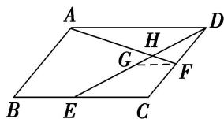  
（9）如图，在直角梯形 ABCD 中，AB=2AD=2DC，E 为 BC 边上一点， $\overrightarrow{BC}=3\overrightarrow{EC}$ ，F 为 AE 的中点，则 $\overrightarrow{BF}=(\quad)$

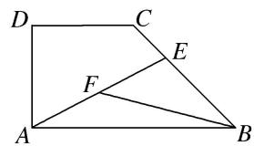

A. $\frac{2}{3}\overrightarrow{AB}-\frac{1}{3}\overrightarrow{AD}$

B. $\frac{1}{3}\overrightarrow{AB} -\frac{2}{3}\overrightarrow{AD}$

C. $-\frac{2}{3}\overrightarrow{AB}+\frac{1}{3}\overrightarrow{AD}$

D. $-\frac{1}{3}\overrightarrow{AB} +\frac{2}{3}\overrightarrow{AD}$
答案 C 解析 $\overrightarrow{BF} = \overrightarrow{BA} +\overrightarrow{AF} = \overrightarrow{BA} +\frac{1}{2}\overrightarrow{AE} = -\overrightarrow{AB} +\frac{1}{2} (\overrightarrow{AD} +\frac{1}{2}\overrightarrow{AB} +\overrightarrow{CE}) = -\overrightarrow{AB} +\frac{1}{2} (\overrightarrow{AD} +\frac{1}{2}\overrightarrow{AB} +\frac{1}{3}\overrightarrow{CB}) =$ $-\overrightarrow{AB} +\frac{1}{2}\overrightarrow{AD} +\frac{1}{4}\overrightarrow{AB} +\frac{1}{6} (\overrightarrow{CD} +\overrightarrow{DA} +\overrightarrow{AB}) = -\frac{2}{3}\overrightarrow{AB} +\frac{1}{3}\overrightarrow{AD}.$  
（10）如图，已知 $AB$ 是圆 $O$ 的直径，点 $C, D$ 是半圆弧的两个三等分点， $\overrightarrow{AB} = \boldsymbol{a}$ ， $\overrightarrow{AC} = \boldsymbol{b}$ ，则 $\overrightarrow{AD}$ 等于（）

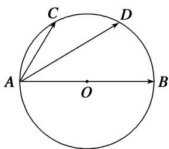

A. $a - \frac{1}{2} b$

B. $\frac{1}{2} a - b$

C. $a+\frac{1}{2}b$

D. $\frac{1}{2}a+b$
答案 D 解析 连接 CD，由点 C, D 是半圆弧的三等分点，得 $CD \parallel AB$ 且 $\overrightarrow{CD} = \frac{1}{2}\overrightarrow{AB} = \frac{1}{2}\overrightarrow{a}$ ，所以 $\overrightarrow{AD} = \overrightarrow{AC} + \overrightarrow{CD} = \overrightarrow{b} + \frac{1}{2}\overrightarrow{a}$ .

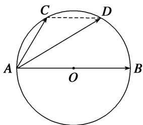

# 【对点训练】

1. 已知 $O, A, B$ 是平面上的三个点，直线 $AB$ 上有一点 $C$ ，满足 $2\overrightarrow{AC} + \overrightarrow{CB} = 0$ ，则 $\overrightarrow{OC}$ 等于（）

A. $2\overrightarrow{OA} -\overrightarrow{OB}$

B. $-\overrightarrow{OA} + 2\overrightarrow{OB}$

C. $\frac{2}{3}\overrightarrow{OA} -\frac{1}{3}\overrightarrow{OB}$

D. $-\frac{1}{3}\overrightarrow{OA} +\frac{2}{3}\overrightarrow{OB}$

1. 答案 A 解析 由 $2\overrightarrow{AC} + \overrightarrow{CB} = 0$ 得 $2\overrightarrow{OC} - 2\overrightarrow{OA} + \overrightarrow{OB} - \overrightarrow{OC} = 0$ ，故 $\overrightarrow{OC} = 2\overrightarrow{OA} - \overrightarrow{OB}$ .

2. 如图, 在 $\triangle ABC$ 中, 点 $D$ 是 $BC$ 边上靠近 $B$ 的三等分点, 则 $\overrightarrow{AD}$ 等于( )

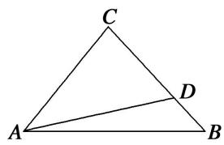

A. $\frac{2}{3}\overrightarrow{AB} -\frac{1}{3}\overrightarrow{AC}$

B. $\frac{1}{3}\overrightarrow{AB} +\frac{2}{3}\overrightarrow{AC}$

C. $\frac{2}{3}\overrightarrow{AB} +\frac{1}{3}\overrightarrow{AC}$

D. $\frac{1}{3}\overrightarrow{AB} -\frac{2}{3}\overrightarrow{AC}$

2. 答案 C 解析 由平面向量的三角形法则，得 $\overrightarrow{AD} = \overrightarrow{AB} + \overrightarrow{BD}$ 。又因为点 $D$ 是 $BC$ 边上靠近 $B$ 的三等分点，所以 $\overrightarrow{AD} = \overrightarrow{AB} + \frac{1}{3}\overrightarrow{BC} = \overrightarrow{AB} + \frac{1}{3} (\overrightarrow{AC} - \overrightarrow{AB}) = \frac{2}{3}\overrightarrow{AB} + \frac{1}{3}\overrightarrow{AC}$ .

3. 在 $\triangle ABC$ 中， $\overrightarrow{AB} = c$ ， $\overrightarrow{AC} = b$ ，若点 $D$ 满足 $\overrightarrow{BD} = 2\overrightarrow{DC}$ ，若将 $b$ 与 $c$ 作为基底，则 $\overrightarrow{AD}$ 等于（）

A. $\frac{2}{3}b+\frac{1}{3}c$

B. $\frac{3}{5}c-\frac{2}{3}b$

C. $\frac{2}{3}b-\frac{1}{3}c$

D. $\frac{1}{3}b+\frac{2}{3}c$

3. 答案 A 解析 $\because \overrightarrow{BD}=2\overrightarrow{DC}, \therefore \overrightarrow{AD}-\overrightarrow{AB}=2(\overrightarrow{AC}-\overrightarrow{AD}), \therefore \overrightarrow{AD}-c=2(b-\overrightarrow{AD}), \therefore \overrightarrow{AD}=\frac{1}{3}c+\frac{2}{3}b.$

4. 如图所示，在 $\triangle ABC$ 中，若 $\overrightarrow{BC} = 3\overrightarrow{DC}$ ，则 $\overrightarrow{AD} = (\quad)$

A. $\frac{2}{3}\overrightarrow{AB}+\frac{1}{3}\overrightarrow{AC}$

B. $\frac{2}{3}\overrightarrow{AB} -\frac{1}{3}\overrightarrow{AC}$

C. $\frac{1}{3}\overrightarrow{AB} +\frac{2}{3}\overrightarrow{AC}$

D. $\frac{1}{3}\overrightarrow{AB} -\frac{2}{3}\overrightarrow{AC}$

4. 答案 C 解析 $\overrightarrow{AD}=\overrightarrow{CD}-\overrightarrow{CA}=\frac{1}{3}\overrightarrow{CB}-\overrightarrow{CA}=\frac{1}{3}(\overrightarrow{AB}-\overrightarrow{AC})+\overrightarrow{AC}=\frac{1}{3}\overrightarrow{AB}+\frac{2}{3}\overrightarrow{AC}$ . 故选 C.

5. 设 D, E, F 分别为 $\triangle ABC$ 三边 BC, CA, AB 的中点，则 $\overrightarrow{DA} + 2\overrightarrow{EB} + 3\overrightarrow{FC} = (\quad)$

A. $\frac{1}{2}\overrightarrow{AD}$

B. $\frac{3}{2}\overrightarrow{AD}$

C. $\frac{1}{2}\overrightarrow{A}\overrightarrow{C}$

D. $\frac{3}{2}\overrightarrow{A}\overrightarrow{C}$

5. 答案 D 解析 因为 $D, E, F$ 分别为 $\triangle ABC$ 三边 $BC, CA, AB$ 的中点，所以 $\overrightarrow{DA} + 2\overrightarrow{EB} + 3\overrightarrow{FC} = \frac{1}{2} (\overrightarrow{BA} + \overrightarrow{CA}) + 2 \times \frac{1}{2} (\overrightarrow{AB} + \overrightarrow{CB}) + 3 \times \frac{1}{2} \times (\overrightarrow{AC} + \overrightarrow{BC}) = \frac{1}{2}\overrightarrow{BA} + \overrightarrow{AB} + \overrightarrow{CB} + \frac{3}{2}\overrightarrow{BC} + \frac{3}{2}\overrightarrow{AC} + \frac{1}{2}\overrightarrow{CA} = \frac{1}{2}\overrightarrow{AB} + \frac{1}{2}\overrightarrow{BC} + \overrightarrow{AC} = \frac{1}{2}\overrightarrow{AC} + \overrightarrow{AC} = \frac{3}{2}\overrightarrow{AC}$ .

6. 已知点 $M$ 是 $\triangle ABC$ 的边 $BC$ 的中点，点 $E$ 在边 $AC$ 上，且 $\overrightarrow{EC} = 2\overrightarrow{AE}$ ，则 $\overrightarrow{EM} = (\quad)$

A. $\frac{1}{2}\overrightarrow{AC} +\frac{1}{3}\overrightarrow{AB}$

B. $\frac{1}{2}\overrightarrow{AC} +\frac{1}{6}\overrightarrow{AB}$

C. $\frac{1}{6}\overrightarrow{AC} +\frac{1}{2}\overrightarrow{AB}$

D. $\frac{1}{6}\overrightarrow{AC} +\frac{3}{2}\overrightarrow{AB}$

6. 答案 C 解析 如图，∵ $\overrightarrow{EC}=2\overrightarrow{AE}$ ，∴ $\overrightarrow{EM}=\overrightarrow{EC}+\overrightarrow{CM}=\frac{2}{3}\overrightarrow{AC}+\frac{1}{2}\overrightarrow{CB}=\frac{2}{3}\overrightarrow{AC}+\frac{1}{2}(\overrightarrow{AB}-\overrightarrow{AC})=\frac{1}{2}\overrightarrow{AB}+\frac{1}{6}\overrightarrow{AC}$ .

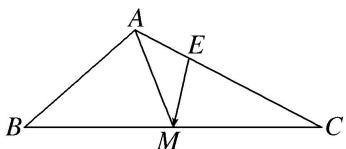

7. 在 $\triangle ABC$ 中， $P, Q$ 分别是边 $AB, BC$ 上的点，且 $AP = \frac{1}{3} AB, BQ = \frac{1}{3} BC$ . 若 $\overrightarrow{AB} = a, \overrightarrow{AC} = b$ ，则 $\overrightarrow{PQ} = (\quad)$

A. $\frac{1}{3}a+\frac{1}{3}b$

B. $-\frac{1}{3}a+\frac{1}{3}b$

C. $\frac{1}{3} a - \frac{1}{3} b$

D. $-\frac{1}{3}a-\frac{1}{3}b$

7. 答案 A 解析 $\overrightarrow{PQ} = \overrightarrow{PB} + \overrightarrow{BQ} = \frac{2}{3}\overrightarrow{AB} + \frac{1}{3}\overrightarrow{BC} = \frac{2}{3}\overrightarrow{AB} + \frac{1}{3} (\overrightarrow{AC} -\overrightarrow{AB}) = \frac{1}{3}\overrightarrow{AB} +\frac{1}{3}\overrightarrow{AC} = \frac{1}{3}\boldsymbol {a} + \frac{1}{3}\boldsymbol {b},$ 故选A.

8. 已知 $D, E, F$ 分别为 $\triangle ABC$ 的边 $BC, CA, AB$ 的中点，且 $\overrightarrow{BC} = a, \overrightarrow{CA} = b$ ，给出下列命题：① $\overrightarrow{AD} = \frac{1}{2}$ $a - b$ ; ② $\overrightarrow{BE} = a + \frac{1}{2} b$ ; ③ $\overrightarrow{CF} = -\frac{1}{2} a + \frac{1}{2} b$ ; ④ $\overrightarrow{AD} + \overrightarrow{BE} + \overrightarrow{CF} = 0$ .
其中正确命题的序号为\_\_\_\_。

8. 答案 ②③④ 解析 $\overrightarrow{BC} = a, \overrightarrow{CA} = b, \overrightarrow{AD} = \frac{1}{2}\overrightarrow{CB} + \overrightarrow{AC} = -\frac{1}{2}a - b, \overrightarrow{BE} = \overrightarrow{BC} + \frac{1}{2}\overrightarrow{CA} = a + \frac{1}{2}b, \overrightarrow{CF} = \frac{1}{2}(\overrightarrow{CB} + \overrightarrow{CA}) = \frac{1}{2}(-a + b) = -\frac{1}{2}a + \frac{1}{2}b,$ 所以 $A\overrightarrow{D} +\overrightarrow{BE} +\overrightarrow{CF} = -b - \frac{1}{2}a + a + \frac{1}{2}b + \frac{1}{2}b - \frac{1}{2}a = 0.$ 所以正确命题的序号为②③④.

9. (多选)在 $\triangle ABC$ 中， $D, E, F$ 分别是边 $BC, CA, AB$ 的中点， $AD, BE, CF$ 交于点 $G$ ，则( )

A. $\overrightarrow{EF} = \frac{1}{2}\overrightarrow{CA} -\frac{1}{2}\overrightarrow{BC}$

B. $\overrightarrow{BE} = -\frac{1}{2}\overrightarrow{BA} +\frac{1}{2}\overrightarrow{BC}$

C. $\overrightarrow{AD} +\overrightarrow{BE} = \overrightarrow{FC}$

D. $\overrightarrow{GA} +\overrightarrow{GB} +\overrightarrow{GC} = 0$

9. 答案 CD 解析 如图，因为点 D, E, F 分别是边 BC, CA, AB 的中点，所以 $\overrightarrow{EF} = \frac{1}{2}\overrightarrow{CB} = -\frac{1}{2}\overrightarrow{BC}$ ，故 A 不正确； $\overrightarrow{BE} = \overrightarrow{BC} + \overrightarrow{CE} = \overrightarrow{BC} + \frac{1}{2}\overrightarrow{CA} = \overrightarrow{BC} + \frac{1}{2} (\overrightarrow{CB} + \overrightarrow{BA}) = \overrightarrow{BC} - \frac{1}{2}\overrightarrow{BC} - \frac{1}{2}\overrightarrow{AB} = -\frac{1}{2}\overrightarrow{AB} + \frac{1}{2}\overrightarrow{BC}$ ，故 B 不正确； $\overrightarrow{FC} = \overrightarrow{AC} - \overrightarrow{AF} = \overrightarrow{AD} + \overrightarrow{DC} + \overrightarrow{FA} = \overrightarrow{AD} + \frac{1}{2}\overrightarrow{BC} + \overrightarrow{FA} = \overrightarrow{AD} + \overrightarrow{FE} + \overrightarrow{FA} = \overrightarrow{AD} + \overrightarrow{FB} + \overrightarrow{BE} + \overrightarrow{FA} = \overrightarrow{AD} + \overrightarrow{BE}$ ，故 C 正确；由题意知，点 G 为 $\triangle ABC$ 的重心，所以 $\overrightarrow{AG} + \overrightarrow{BG} + \overrightarrow{CG} = \frac{2}{3}\overrightarrow{AD} + \frac{2}{3}\overrightarrow{BE} + \frac{2}{3}\overrightarrow{CF} = \frac{2}{3} \times \frac{1}{2} (\overrightarrow{AB} + \overrightarrow{AC}) + \frac{2}{3} \times \frac{1}{2} (\overrightarrow{BA} + \overrightarrow{BC}) + \frac{2}{3} \times \frac{1}{2} (\overrightarrow{CB} + \overrightarrow{CA}) = 0$ ，即 $\overrightarrow{GA} + \overrightarrow{GB} + \overrightarrow{GC} = 0$ ，故 D 正确。故选 CD。

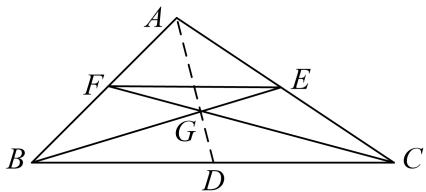

10. 如图所示，在 $\triangle ABC$ 中， $D, F$ 分别是 $AB, AC$ 的中点， $BF$ 与 $CD$ 交于点 $O$ ，设 $\overrightarrow{AB} = a, \overrightarrow{AC} = b$ ，则用 $a, b$ 表示向量 $\overrightarrow{AO}$ 为 \_\_\_\_.

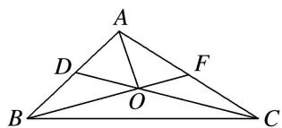

10. 答案 $\overrightarrow{AO} = \frac{1}{3} (\pmb {a} + \pmb {b})$ 解析 由 $D, O, C$ 三点共线，可设 $\overrightarrow{DO} = k_1\overrightarrow{DC} = k_1(\overrightarrow{AC} -\overrightarrow{AD}) = k_1\left(\frac{b - \frac{1}{2}a}{2}\right) = -\frac{1}{2} k_1a$ $+k_{1}\pmb {b}(k_{1}$ 为实数)，同理，可设 $\overrightarrow{BO} = k_2\overrightarrow{BF} = k_2(\overrightarrow{AF} -\overrightarrow{AB}) = k_2\left(\frac{1}{2}\pmb {b} - \pmb {a}\right) = -k_2\pmb {a} + \frac{1}{2} k_2\pmb {b}(k_2$ 为实数），①，又 $\overrightarrow{BO} =$ $\overrightarrow{BD} +\overrightarrow{DO} = -\frac{1}{2}\pmb {a} + \left(-\frac{1}{2} k_{1}\pmb {a} + k_{1}\pmb {b}\right) = -\frac{1}{2} (1 + k_{1})\pmb {a} + k_{1}\pmb {b},$ ②，所以由①②，得 $-k_{2}\pmb {a} + \frac{1}{2} k_{2}\pmb {b} = -\frac{1}{2} (1 + k_{1})\pmb {a}+$
$k_{1}b$ ，即 $\frac{1}{2}(1+k_{1}-2k_{2})a+\left(\frac{1}{2}k_{2}-k_{1}\right)b=0$ 。又a，b不共线，所以 $\left\{\begin{aligned}&\frac{1}{2}(1+k_{1}-2k_{2})=0,\\&\frac{1}{2}k_{2}-k_{1}=0,\end{aligned}\right.$ 解得 $\left\{\begin{aligned}&k_{1}=\frac{1}{3},\\&k_{2}=\frac{2}{3}.\end{aligned}\right.$
所以 $\overrightarrow{BO} = -\frac{2}{3}\boldsymbol{a} + \frac{1}{3}\boldsymbol{b}$ . 所以 $\overrightarrow{AO} = \overrightarrow{AB} + \overrightarrow{BO} = \boldsymbol{a} + \left(-\frac{2}{3}\boldsymbol{a} + \frac{1}{3}\boldsymbol{b}\right) = \frac{1}{3} (\boldsymbol{a} + \boldsymbol{b})$ .

另解 因为 B, O, F 三点共线，所以 $\overrightarrow{AO} = \lambda_{1}\overrightarrow{AB} + (1 - \lambda_{1})\overrightarrow{AF} = \lambda_{1}a + \frac{1}{2}(1 - \lambda_{1})b$ ，①，因为 D, O, C 三点共线，所以 $\overrightarrow{AO}=\lambda_{2}\overrightarrow{AC}+(1-\lambda_{2})\overrightarrow{AD}=\lambda_{2}\boldsymbol{b}+\frac{1}{2}(1-\lambda_{2})\boldsymbol{a}$ ，②，由①②可得 $\left\{\begin{aligned}\frac{1}{2}(1-\lambda_{1})&=\lambda_{2},\\ \lambda_{1}&=\frac{1-\lambda_{2}}{2},\end{aligned}\right.$ 解得
$\left\{ \begin{array}{l} \lambda_{1} = \frac{1}{3}, \\ \lambda_{2} = \frac{1}{3}. \end{array} \right.$ 故 $\overrightarrow{AO} = \frac{1}{3} (\pmb {a} + \pmb {b})$

11. 如图，正方形 $ABCD$ 中，点 $E$ 是 $DC$ 的中点，点 $F$ 是 $BC$ 的一个三等分点，那么 $\overrightarrow{EF}$ 等于（ ）

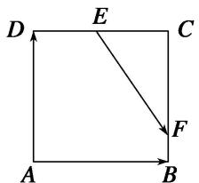

A. $\frac{1}{2}\overrightarrow{AB} -\frac{1}{3}\overrightarrow{AD}$

B. $\frac{1}{4}\overrightarrow{AB} +\frac{1}{2}\overrightarrow{AD}$

C. $\frac{1}{3}\overrightarrow{AB} +\frac{1}{2}\overrightarrow{DA}$

D. $\frac{1}{2}\overrightarrow{AB} -\frac{2}{3}\overrightarrow{AD}$

11. 答案 D 解析 在 $\triangle CEF$ 中，有 $\overrightarrow{EF} = \overrightarrow{EC} + \overrightarrow{CF}$ 。因为点 $E$ 为 $DC$ 的中点，所以 $\overrightarrow{EC} = \frac{1}{2}\overrightarrow{DC}$ 。因为点 $F$ 为 $BC$ 的一个三等分点，所以 $\overrightarrow{CF} = \frac{2}{3}\overrightarrow{CB}$ 。所以 $\overrightarrow{EF} = \frac{1}{2}\overrightarrow{DC} + \frac{2}{3}\overrightarrow{CB} = \frac{1}{2}\overrightarrow{AB} + \frac{2}{3}\overrightarrow{DA} = \frac{1}{2}\overrightarrow{AB} - \frac{2}{3}\overrightarrow{AD}$ ，故选 D。

12. 如图, 在平行四边形 $ABCD$ 中, $E$ 为 $DC$ 边的中点, 且 $\overrightarrow{AB} = a$ , $\overrightarrow{AD} = b$ , 则 $\overrightarrow{BE} = (\quad)$

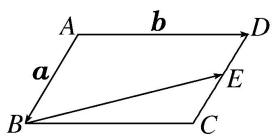

A. $\frac{1}{2}b-a$

B. $\frac{1}{2} a - b$

C. $-\frac{1}{2}a+b$

D. $\frac{1}{2}b+a$

12. 答案 C 解析 $\overrightarrow{BE}=\overrightarrow{BA}+\overrightarrow{AD}+\frac{1}{2}\overrightarrow{DC}=-a+b+\frac{1}{2}a=b-\frac{1}{2}a$ ，故选 C.

13. 在平行四边形 ABCD 中， $\overrightarrow{AB}=a,\quad\overrightarrow{AD}=b,\quad\overrightarrow{AN}=3\overrightarrow{NC},M$ 为 BC 的中点，则 $\overrightarrow{MN}=$ \_\_\_\_. (用 a, b 表示)

13. 答案 $-\frac{1}{4}a+\frac{1}{4}b$ 解析 由 $\overrightarrow{AN}=3\overrightarrow{NC}$ 得， $\overrightarrow{AN}=\frac{3}{4}\overrightarrow{AC}=\frac{3}{4}(a+b)$ ， $\overrightarrow{AM}=a+\frac{1}{2}b$ ，所以 $\overrightarrow{MN}=\overrightarrow{AN}-\overrightarrow{AM}=\frac{3}{4}(a+b)-\left(a+\frac{1}{2}b\right)=-\frac{1}{4}a+\frac{1}{4}b$ .

14. 在平行四边形 $ABCD$ 中, $\overrightarrow{AB} = e_1$ , $\overrightarrow{AC} = e_2$ , $\overrightarrow{NC} = \frac{1}{4}\overrightarrow{AC}$ , $\overrightarrow{BM} = \frac{1}{2}\overrightarrow{MC}$ , 则 $\overrightarrow{MN} =$ \_\_\_\_. (用 $e_1$ , $e_2$ 表

示)

14. 答案 $-\frac{2}{3}e_{1}+\frac{5}{12}e_{2}$ 解析 如图， $\overrightarrow{MN}=\overrightarrow{CN}-\overrightarrow{CM}=\overrightarrow{CN}+2\overrightarrow{BM}=\overrightarrow{CN}+\frac{2}{3}\overrightarrow{BC}=-\frac{1}{4}\overrightarrow{AC}+\frac{2}{3}(\overrightarrow{AC}-\overrightarrow{AB})=-\frac{1}{4}e_{2}+\frac{2}{3}(e_{2}-e_{1})=-\frac{2}{3}e_{1}+\frac{5}{12}e_{2}.$

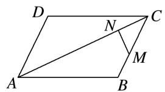

15. 在平行四边形 ABCD 中，E, F 分别是 BC, CD 的中点，DE 交 AF 于 H，记 $\overrightarrow{AB}$ ， $\overrightarrow{BC}$ 分别为 a, b，则 $\overrightarrow{AH} = (\quad)$

A. $\frac{2}{5} a - \frac{4}{5} b$

B. $\frac{2}{5} a + \frac{4}{5} b$

C. $-\frac{2}{5}a + \frac{4}{5}b$

D. $-\frac{2}{5} a - \frac{4}{5} b$

15. 答案 B 解析 设 $\overrightarrow{AH} = \lambda \overrightarrow{AF}, \overrightarrow{DH} = \mu \overrightarrow{DE}$ . 而 $\overrightarrow{DH} = \overrightarrow{DA} + \overrightarrow{AH} = -b + \lambda \overrightarrow{AF} = -b + \lambda \left( b + \frac{1}{2} a \right)$ , $\overrightarrow{DH} = \mu \overrightarrow{DE} = \mu \left( a - \frac{1}{2} b \right)$ . 因此， $\mu \left( a - \frac{1}{2} b \right) = -b + \lambda \left( b + \frac{1}{2} a \right)$ . 由于 a, b 不共线，因此由平面向量的基本定理，得 $\left\{\begin{aligned}\mu &= \frac{1}{2}\lambda, \\-\frac{1}{2}\mu &= -1 + \lambda.\end{aligned}\right.$ 解之得 $\lambda = \frac{4}{5}, \mu = \frac{2}{5}$ . 故 $\overrightarrow{AH} = \lambda \overrightarrow{AF} = \lambda \left( b + \frac{1}{2} a \right) = \frac{2}{5} a + \frac{4}{5} b$ .

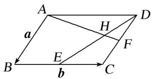

16. 在梯形 $ABCD$ 中， $\overrightarrow{AB} = 3\overrightarrow{DC}$ ，则 $\overrightarrow{BC} = (\quad)$

A. $-\frac{2}{3}\overrightarrow{AB} +\overrightarrow{AD}$

B. $-\frac{2}{3}\overrightarrow{AB}+\frac{4}{3}\overrightarrow{AD}$

C. $-\frac{1}{3}\overrightarrow{AB}+\frac{2}{3}\overrightarrow{AD}$

D. $-\frac{2}{3}\overrightarrow{AB}-\overrightarrow{AD}$

16. 答案 A 解析 因为在梯形 ABCD 中， $\overrightarrow{AB}=3\overrightarrow{DC}$ ，所以 $\overrightarrow{BC}=\overrightarrow{BA}+\overrightarrow{AD}+\overrightarrow{DC}=-\overrightarrow{AB}+\overrightarrow{AD}+\frac{1}{3}\overrightarrow{AB}=-\frac{2}{3}$ $\overrightarrow{AB}+\overrightarrow{AD}$ ，故选 A.

# 考点二 根据向量线性运算求参数

# 【方法总结】

# 利用平面向量的线性运算求参数的一般方法

向量方程 $\overrightarrow{AD}=x\overrightarrow{AB}+y\overrightarrow{AC}$ 中x，y的确定方法  
（1）在几何图形中通过三点共线即可考虑使用“爪”子定理完成向量的表示，进而确定 $x$ ， $y$   
（2）若所给图形比较特殊(正方形、矩形、直角梯形、等边三角形、等腰三角形或直角三角形等)，则可通过建系将向量坐标化，从而得到关于 $x, y$ 的方程组，再进行求解.  
（3）若题目中某些向量的数量积已知，则对于向量方程 $\overrightarrow{AD}=x\overrightarrow{AB}+y\overrightarrow{AC}$ ，可考虑两边对同一向量作数量积运算，从而得到关于于x，y的方程组，再进行求解.  
（4）对于求 $x + y$ 的值的有关问题可考虑平面向量的等和线定理法，见《平面向量特训之满分必杀篇》

第一讲平面向量的等和线.

# 【例题选讲】

[例 1]（1）如图，在 $\triangle OAB$ 中，P为线段AB上的一点， $\overrightarrow{OP}=x\overrightarrow{OA}+y\overrightarrow{OB}$ ，且 $\overrightarrow{BP}=2\overrightarrow{PA}$ ，则()

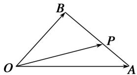

A. $x=\frac{2}{3}$ , $y=\frac{1}{3}$

B. $x=\frac{1}{3}$ , $y=\frac{2}{3}$

C. $x=\frac{1}{4}$ , $y=\frac{3}{4}$

D. $x=\frac{3}{4}$ , $y=\frac{1}{4}$
答案 A 解析 由题意知 $\overrightarrow{OP} = \overrightarrow{OB} + \overrightarrow{BP}$ , 又 $\overrightarrow{BP} = 2\overrightarrow{PA}$ , 所以 $\overrightarrow{OP} = \overrightarrow{OB} + \frac{2}{3}\overrightarrow{BA} = \overrightarrow{OB} + \frac{2}{3} (\overrightarrow{OA} - \overrightarrow{OB}) = \frac{2}{3}\overrightarrow{OA} + \frac{1}{3}\overrightarrow{OB}$ , 所以 $x = \frac{2}{3}, y = \frac{1}{3}$ .  
（2）(2013·江苏)设 D, E 分别是 $\triangle ABC$ 的边 AB, BC 上的点, $AD = \frac{1}{2} AB$ , $BE = \frac{2}{3} BC$ . 若 $\overrightarrow{DE} = \lambda_{1} \overrightarrow{AB} + \lambda_{2} \overrightarrow{AC} (\lambda_{1}, \lambda_{2}$ 为实数), 则 $\lambda_{1} + \lambda_{2}$ 的值为 \_\_\_\_.
答案 $\frac{1}{2}$ 解析 由题意，得 $\overrightarrow{DE} = \overrightarrow{DB} +\overrightarrow{BE} = \frac{1}{2}\overrightarrow{AB} +\frac{2}{3}\overrightarrow{BC} = \frac{1}{2}\overrightarrow{AB} +\frac{2}{3} (\overrightarrow{AC} -\overrightarrow{AB}) = -\frac{1}{6}\overrightarrow{AB} +\frac{2}{3}\overrightarrow{AC}$ ，则 $\lambda_1 = -\frac{1}{6},$ $\lambda_{2} = \frac{2}{3}$ ，即 $\lambda_1 + \lambda_2 = \frac{1}{2}$  
（3）如图，在 $\triangle ABC$ 中，点 $D$ 在线段 $BC$ 上，且满足 $BD=\frac{1}{2}DC$ ，过点 $D$ 的直线分别交直线 $AB$ ， $AC$ 于不同的两点 $M$ ， $N$ ，若 $\overrightarrow{AM}=m\overrightarrow{AB}$ ， $\overrightarrow{AN}=n\overrightarrow{AC}$ ，则（）

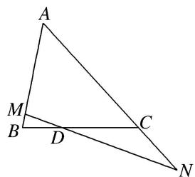

A. $m + n$ 是定值，定值为2

B. $2 m + n$ 是定值，定值为3

C. $\frac{1}{m} + \frac{1}{n}$ 是定值，定值为 2

D. $\frac{2}{m} + \frac{1}{n}$ 是定值，定值为3
答案 D 解析 法一：如图，过点 C 作 CE 平行于 MN 交 AB 于点 E．由 $\overrightarrow{AN}=n\overrightarrow{AC}$ 可得 $\frac{AC}{AN}=\frac{1}{n}$ ，所以 $\frac{AE}{EM}=\frac{AC}{CN}=\frac{1}{n-1}$ ，由 $BD=\frac{1}{2}DC$ 可得 $\frac{BM}{ME}=\frac{1}{2}$ ，所以 $\frac{AM}{AB}=\frac{n}{n+\frac{n-1}{2}}=\frac{2n}{3n-1}$ ，因为 $\overrightarrow{AM}=m\overrightarrow{AB}$ ，所以 $m=\frac{2n}{3n-1}$ ，整理可得 $\frac{2}{m}+\frac{1}{n}=3$ ．故选 D.

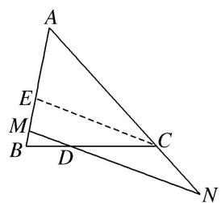

法二：因为 M, D, N 三点共线，所以 $\overrightarrow{AD} = \lambda \overrightarrow{AM} + (1 - \lambda) \cdot \overrightarrow{AN}$ . 又 $\overrightarrow{AM} = m \overrightarrow{AB}$ , $\overrightarrow{AN} = n \overrightarrow{AC}$ ，所以 $\overrightarrow{AD} = \lambda m \overrightarrow{AB} + (1 - \lambda) \cdot n \overrightarrow{AC}$ . 又 $\overrightarrow{BD} = \frac{1}{2} \overrightarrow{DC}$ ，所以 $\overrightarrow{AD} - \overrightarrow{AB} = \frac{1}{2} \overrightarrow{AC} - \frac{1}{2} \overrightarrow{AD}$ ，所以 $\overrightarrow{AD} = \frac{1}{3} \overrightarrow{AC} + \frac{2}{3} \overrightarrow{AB}$ . 比较系数知 $\lambda m = \frac{2}{3}$ ，(1 - $\lambda$ ) n = $\frac{1}{3}$ ，所以 $\frac{2}{m} + \frac{1}{n} = 3$ ，故选 D.  
（4）如图，在 $\triangle ABC$ 中， $\overrightarrow{AD}=\frac{2}{3}\overrightarrow{AC}$ ， $\overrightarrow{BP}=\frac{1}{3}\overrightarrow{BD}$ ，若 $\overrightarrow{AP}=\lambda\overrightarrow{AB}+\mu\overrightarrow{AC}$ ，则 $\lambda+\mu$ 的值为()

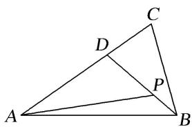

A. $\frac{8}{9}$

B. $\frac{4}{9}$

C. $\frac{8}{3}$

D. $\frac{4}{3}$
答案 A 解析 $\overrightarrow{AP} = \overrightarrow{AB} + \overrightarrow{BP} = \overrightarrow{AB} + \frac{1}{3}\overrightarrow{BD} = \overrightarrow{AB} + \frac{1}{3} (\overrightarrow{AD} -\overrightarrow{AB}) = \frac{2}{3}\overrightarrow{AB} +\frac{1}{3}\times \frac{2}{3}\overrightarrow{AC} = \frac{2}{3}\overrightarrow{AB} +\frac{2}{9}\overrightarrow{AC}$ 因为 $\overrightarrow{AP} =$ $\lambda \overrightarrow{AB} +\mu \overrightarrow{AC}$ ，所以 $\lambda = \frac{2}{3},\mu = \frac{2}{9}$ ，则 $\lambda +\mu = \frac{2}{3} +\frac{2}{9} = \frac{8}{9}$  
（5）已知在 Rt△ABC 中，∠BAC=90°，AB=1，AC=2，D 是△ABC 内一点，且 ∠DAB=60°，设 $\overrightarrow{AD}=\lambda\overrightarrow{AB}+\mu\overrightarrow{AC}(\lambda,\mu\in\mathbf{R})$ ，则 $\frac{\lambda}{\mu}=(\quad)$

A. $\frac{2\sqrt{3}}{3}$

B. $\frac{\sqrt{3}}{3}$

C. 3

D. $2 \sqrt{3}$
答案 A 解析 如图，以 A 为原点，AB 所在直线为 x 轴，AC 所在直线为 y 轴建立平面直角坐标系，则 B 点的坐标为 $(1, 0)$ ，C 点的坐标为 $(0, 2)$ ，因为 $\angle DAB = 60^{\circ}$ ，所以设 D 点的坐标为 $(m, \sqrt{3}m)(m \neq 0)$ 。 $\overrightarrow{AD} = (m, \sqrt{3}m) = \lambda \overrightarrow{AB} + \mu \overrightarrow{AC} = \lambda (1, 0) + \mu (0, 2) = (\lambda, 2\mu)$ ，则 $\lambda = m$ ，且 $\mu = \frac{\sqrt{3}}{2}m$ ，所以 $\frac{\lambda}{\mu} = \frac{2\sqrt{3}}{3}$ 。

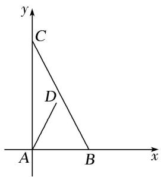  
（6）如图，在 $\triangle ABC$ 中，设 $\overrightarrow{AB}=\boldsymbol{a}$ ， $\overrightarrow{AC}=\boldsymbol{b}$ ， $AP$ 的中点为 $Q$ ， $BQ$ 的中点为 $R$ ， $CR$ 的中点为 $P$ ，若 $\overrightarrow{AP}=ma+nb$ ，则 $m+n=$ \_\_\_\_.

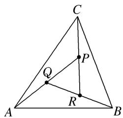
答案 $\frac{6}{7}$ 解析 根据已知条件得， $\overrightarrow{BQ}=\overrightarrow{AQ}-\overrightarrow{AB}=\frac{1}{2}\overrightarrow{AP}-\overrightarrow{AB}=\frac{1}{2}(ma+nb)-a=\left(\frac{m}{2}-1\right)a+\frac{n}{2}b,\quad\overrightarrow{CR}=\overrightarrow{BR}$
$- \overrightarrow {B C} = \frac {1}{2} \overrightarrow {B Q} - \overrightarrow {A C} + \overrightarrow {A B} = \frac {1}{2} \left[ \left(\frac {m}{2} - 1\right) _ {a} + \frac {n}{2} b \right] - b + a = \left(\frac {m}{4} + \frac {1}{2}\right) _ {a} + \left(\frac {n}{4} - 1\right) _ {b}, \therefore \overrightarrow {Q P} = \frac {m}{2} a + \frac {n}{2} b, \overrightarrow {R Q} = \left(\frac {m}{4} - \frac {1}{2}\right) _ {a} + \frac {n}{4} b,$
$\overrightarrow {R P} = - \left(\frac {m}{8} + \frac {1}{4}\right) a + \left(\frac {1}{2} - \frac {n}{8}\right) b. \quad \because \overrightarrow {R Q} + \overrightarrow {Q P} = \overrightarrow {R P}, \quad \therefore \left(\frac {3 m}{4} - \frac {1}{2}\right) a + \frac {3 n}{4} b = \left(- \frac {m}{8} - \frac {1}{4}\right) a + \left(\frac {1}{2} - \frac {n}{8}\right) b, \quad \therefore$
$\left\{ \begin{array}{l} \frac {3 m}{4} - \frac {1}{2} = - \frac {m}{8} - \frac {1}{4}, \\ \frac {3 n}{4} = \frac {1}{2} - \frac {n}{8}, \end{array} \right.$
$\text {解得} \left\{ \begin{array}{l l} m = \frac {2}{7}, \\ n = \frac {4}{7}, \end{array} \right.$
$\text {   故   } m + n = \frac {6}{7}.$  
（7）如图所示，点 $P$ 在矩形ABCD内，且满足 $\angle DAP = 30^{\circ}$ ，若 $|\overrightarrow{AD}| = 1$ ， $|\overrightarrow{AB}| = \sqrt{3}$ ， $\overrightarrow{AP} = m\overrightarrow{AD} + n\overrightarrow{AB}(m, n \in \mathbf{R})$ ，则 $\frac{m}{n}$ 等于（）

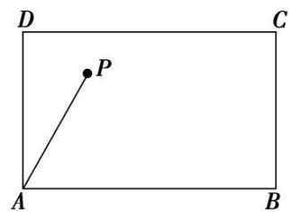

A. $\frac{1}{3}$

B. 3

C. $\frac{\sqrt{3}}{3}$

D. $\sqrt{3}$
答案 B 解析 如图，过点 P 作 $PE \perp AB$ 于点 E，作 $PF \perp AD$ 于点 F，则结合图形及题设得 $\overrightarrow{AP} = \overrightarrow{AF} + \overrightarrow{AE} = m\overrightarrow{AD} + n\overrightarrow{AB}$ ，所以可得 $|\overrightarrow{AF}| = m, |\overrightarrow{PF}| = |\overrightarrow{AE}| = \sqrt{3}n$ 。又 $\angle DAP = 30^{\circ}$ ，在 Rt△APF 中， $\tan \angle FAP = \tan 30^{\circ} = \frac{|\overrightarrow{PF}|}{|\overrightarrow{AF}|} = \frac{\sqrt{3}}{3}$ ，则 $\frac{\sqrt{3}}{3} = \frac{\sqrt{3}n}{m}$ ，化简得 $\frac{m}{n} = 3$ 。故选 B.

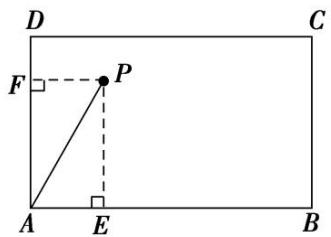

优解：如图所示，假设点 P 在矩形的对角线 BD 上，由题意易知 $\left|\overrightarrow{DB}\right|=2,\quad\angle ADB=60^{\circ}$ ，又 $\angle DAP=30^{\circ}$ ，所以 $\angle DPA=90^{\circ}$ 。由 $\left|\overrightarrow{AD}\right|=1$ ，可得 $\left|\overrightarrow{DP}\right|=\frac{1}{2}=\frac{1}{4}\left|\overrightarrow{DB}\right|$ ，从而可得 $\overrightarrow{AP}=\overrightarrow{AD}+\overrightarrow{DP}=\overrightarrow{AD}+\frac{1}{4}\overrightarrow{DB}=\overrightarrow{AD}+\frac{1}{4}\left(\overrightarrow{AB}-\overrightarrow{AD}\right)=\frac{3}{4}\overrightarrow{AD}+\frac{1}{4}\overrightarrow{AB}$ 。又 $\overrightarrow{AP}=m\overrightarrow{AD}+n\overrightarrow{AB}$ ，所以 $m=\frac{3}{4},\quad n=\frac{1}{4}$ ，则 $\frac{m}{n}=3$ 。故选 B.  
（8）在平行四边形 ABCD 中，点 E 和 F 分别是边 CD 和 BC 的中点．若 $\overrightarrow{AC} = \lambda \overrightarrow{AE} + \mu \overrightarrow{AF}$ ，其中 $\lambda, \mu \in R$ ，则 $\lambda + \mu =$ \_\_\_\_ .

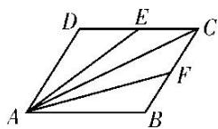
答案 $\frac{4}{3}$ 解析 选择 $\overrightarrow{AB}, \overrightarrow{AD}$ 作为平面向量的一组基底，则 $\overrightarrow{AC} = \overrightarrow{AB} + \overrightarrow{AD}, \overrightarrow{AE} = \frac{1}{2}\overrightarrow{AB} + \overrightarrow{AD}, \overrightarrow{AF} = \overrightarrow{AB} +$
$\frac{1}{2}\overrightarrow{AD}$ ，又 $\overrightarrow{AC}=\lambda\overrightarrow{AE}+\mu\overrightarrow{AF}=\left(\frac{1}{2}\lambda+\mu\right)\overrightarrow{AB}+\left(\lambda+\frac{1}{2}\mu\right)\overrightarrow{AD}$ ，于是得 $\left\{\begin{aligned}&\frac{1}{2}\lambda+\mu=1,\\&\lambda+\frac{1}{2}\mu=1,\end{aligned}\right.$ 即 $\left\{\begin{aligned}&\lambda=\frac{2}{3},\\&\mu=\frac{2}{3},\end{aligned}\right.$ 故 $\lambda+\mu=\frac{4}{3}.$  
（9）如图，在直角梯形ABCD中， $\overrightarrow{DC}=\frac{1}{4}\overrightarrow{AB}$ ， $\overrightarrow{BE}=2\overrightarrow{EC}$ ，且 $\overrightarrow{AE}=r\overrightarrow{AB}+s\overrightarrow{AD}$ ，则 $2r+3s=(\quad)$

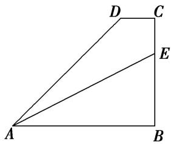

A. 1

B. 2

C. 3

D. 4
答案 C 解析 根据图形，由题意可得 $\overrightarrow{AE} = \overrightarrow{AB} + \overrightarrow{BE} = \overrightarrow{AB} + \frac{2}{3}\overrightarrow{BC} = \overrightarrow{AB} + \frac{2}{3} (\overrightarrow{BA} + \overrightarrow{AD} + \overrightarrow{DC}) = \frac{1}{3}\overrightarrow{AB} + \frac{2}{3} (\overrightarrow{AD} + \overrightarrow{DC}) = \frac{1}{3}\overrightarrow{AB} + \frac{2}{3}\left(\overrightarrow{AD} + \frac{1}{4}\overrightarrow{AB}\right) = \frac{1}{2}\overrightarrow{AB} + \frac{2}{3}\overrightarrow{AD}$ . 因为 $\overrightarrow{AE} = r\overrightarrow{AB} + s\overrightarrow{AD}$ ，所以 $r = \frac{1}{2}, s = \frac{2}{3}$ ，则 $2r + 3s = 1 + 2 = 3$ ，故选 C.

优解：如图，建立平面直角坐标系 $xAy$ ，依题意可设点 $B(4m,0)$ ， $D(3m,3h)$ ， $\mathrm{E}(4m,2h)$ ，其中 $m>$ 0， $h > 0$

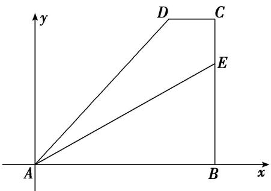
由 $\overrightarrow{AE}=r\overrightarrow{AB}+s\overrightarrow{AD}$ ，得(4m, 2h)=r(4m, 0)+s(3m, 3h)，∴ $\left\{\begin{aligned}&4m=4mr+3ms\\ &2h=3hs\end{aligned}\right.$ ，解得 $\left\{\begin{aligned}&r=\frac{1}{2},\\ &s=\frac{2}{3}.\end{aligned}\right.$ $\therefore2r+3s=3.$  
（10）(2017·江苏)如图，在同一个平面内，向量 $\overrightarrow{OA},\overrightarrow{OB}$ ， $\overrightarrow{OC}$ 的模分别为 $1,1,\sqrt{2}$ ， $\overrightarrow{OA}$ 与 $\overrightarrow{OC}$ 的夹角为 $\alpha$ 且 $\tan \alpha = 7$ ， $\overrightarrow{OB}$ 与 $\overrightarrow{OC}$ 的夹角为 $45^{\circ}$ .若 $\overrightarrow{OC} = m\overrightarrow{OA} +n\overrightarrow{OB}(m,n\in \mathbf{R})$ ，则 $m + n =$

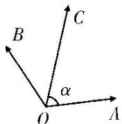
答案3 解析 以 $O$ 为坐标原点， $OA$ 所在直线为 $x$ 轴建立平面直角坐标系，则 $A(1,0)$ ，由 $\tan \alpha = 7, \alpha \in \left(0, \frac{\pi}{2}\right)$ ，得 $\sin \alpha = \frac{7}{5\sqrt{2}}, \cos \alpha = \frac{1}{5\sqrt{2}}$ ，设 $C(x_{C}, y_{C}), B(x_{B}, y_{B})$ ，则 $x_{C} = |\overrightarrow{OC}| \cos \alpha = \sqrt{2} \times \frac{1}{5\sqrt{2}} = \frac{1}{5}, y_{C} = |\overrightarrow{OC}| \sin \alpha = \sqrt{2} \times \frac{7}{5\sqrt{2}} = \frac{7}{5}$ ，即 $C\left(\frac{1}{5}, \frac{7}{5}\right)$ 。又 $\cos (\alpha + 45^{\circ}) = \frac{1}{5\sqrt{2}} \times \frac{1}{\sqrt{2}} - \frac{7}{5\sqrt{2}} \times \frac{1}{\sqrt{2}} = -\frac{3}{5}, \sin (\alpha + 45^{\circ}) = \frac{4}{5}$ ，则 $x_{B} = |\overrightarrow{OB}| \cos (\alpha + 45^{\circ}) = \frac{1}{5}$ 。
$+45^{\circ})=-\frac{3}{5},\quad y_{B}=|\overrightarrow{OB}|\sin(\alpha+45^{\circ})=\frac{4}{5},\quad \text{即 } B\left(-\frac{3}{5},\quad\frac{4}{5}\right),\quad \text{由 }\overrightarrow{OC}=m\overrightarrow{OA}+n\overrightarrow{OB},\quad \text{可得 }\left\{\begin{aligned}&\frac{1}{5}=m-\frac{3}{5}n,\\&\frac{7}{5}=\frac{4}{5}n,\end{aligned}\right.$ 解得
$\left\{ \begin{array}{l} m = \frac{5}{4}, \\ n = \frac{7}{4}, \end{array} \right.$ 所以 $m + n = \frac{5}{4} + \frac{7}{4} = 3$ .

# 【对点训练】

1. 在 $\triangle ABC$ 中，已知 $D$ 是 $AB$ 边上一点，若 $\overrightarrow{AD}=2\overrightarrow{DB}$ ， $\overrightarrow{CB}=\frac{1}{3}\overrightarrow{CA}+\lambda\overrightarrow{CB}$ ，则 $\lambda=$ \_\_\_\_.

1. 答案 $\frac{2}{3}$ 解析 由图知 $\overrightarrow{CD} = \overrightarrow{CA} + \overrightarrow{AD}$ , ①. $\overrightarrow{CD} = \overrightarrow{CB} + \overrightarrow{BD}$ , ②. 且 $\overrightarrow{AD} + 2\overrightarrow{BD} = 0$ . ① + ② × 2 得: $3\overrightarrow{CD} = \overrightarrow{CA} + 2\overrightarrow{CB}$ , $\therefore \overrightarrow{CD} = \frac{1}{3}\overrightarrow{CA} + \frac{2}{3}\overrightarrow{CB}$ , $\therefore \lambda = \frac{2}{3}$ .

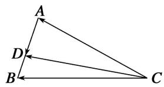

2. 如图所示，在 $\triangle ABC$ 中， $D$ 为 $BC$ 边上的一点，且 $BD = 2DC$ ，若 $\overrightarrow{AC} = m\overrightarrow{AB} + n\overrightarrow{AD}(m, n \in \mathbf{R})$ ，则 $m - n =$ \_\_\_\_.

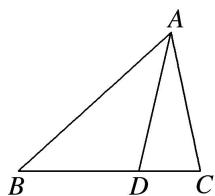

2. 答案 -2 解析 由于 $BD = 2DC$ ，则 $\overrightarrow{BC} = -3\overrightarrow{CD}$ ，其中 $\overrightarrow{BC} = \overrightarrow{AC} - \overrightarrow{AB}$ ， $\overrightarrow{CD} = \overrightarrow{AD} - \overrightarrow{AC}$ ，那么 $\overrightarrow{BC} = -3\overrightarrow{CD}$ 可转化为 $\overrightarrow{AC} - \overrightarrow{AB} = -3(\overrightarrow{AD} - \overrightarrow{AC})$ ，可以得到 $-2\overrightarrow{AC} = -3\overrightarrow{AD} + \overrightarrow{AB}$ ，即 $\overrightarrow{AC} = -\frac{1}{2}\overrightarrow{AB} + \frac{3}{2}\overrightarrow{AD}$ ，则 $m = -\frac{1}{2}$ ， $n = \frac{3}{2}$ ，那么 $m - n = -\frac{1}{2} - \frac{3}{2} = -2$ 。

3. 已知 $\triangle ABC$ 中，点 $D$ 在 $BC$ 边上，且 $\overrightarrow{CD} = 2\overrightarrow{DB}$ ， $\overrightarrow{CD} = r\overrightarrow{AB} + s\overrightarrow{AC}$ ，则 $r + s$ 的值是（）

A. $\frac{2}{3}$

B. $\frac{4}{3}$

C. -3

D. 0

3. 答案 D 解析 $\because \overrightarrow{DB} = \overrightarrow{AB} - \overrightarrow{AD}, \therefore \overrightarrow{CD} = \overrightarrow{AB} - \overrightarrow{DB} - \overrightarrow{AC} = \overrightarrow{AB} - \frac{1}{2}\overrightarrow{CD} - \overrightarrow{AC}, \therefore \frac{3}{2}\overrightarrow{CD} = \overrightarrow{AB} - \overrightarrow{AC}, \therefore \overrightarrow{CD} = \frac{2}{3}\overrightarrow{AB} - \frac{2}{3}\overrightarrow{AC}$ . 又 $\overrightarrow{CD} = r\overrightarrow{AB} + s\overrightarrow{AC}, \therefore r = \frac{2}{3}, s = -\frac{2}{3}, \therefore r + s = 0$ ，故选 D.

4. 在锐角 $\triangle ABC$ 中， $\overrightarrow{CM} = 3\overrightarrow{MB}$ ， $\overrightarrow{AM} = x\overrightarrow{AB} + y\overrightarrow{AC}(x, y \in \mathbf{R})$ ，则 $\frac{x}{y} =$ \_\_\_\_.

4. 答案 3 解析 由题设可得 $\overrightarrow{AM} = \overrightarrow{CM} - \overrightarrow{CA} = \frac{3}{4}\overrightarrow{CB} + \overrightarrow{AC} = \frac{3}{4} (\overrightarrow{AB} - \overrightarrow{AC}) + \overrightarrow{AC} = \frac{3}{4}\overrightarrow{AB} + \frac{1}{4}\overrightarrow{AC}$ ，则 $x = \frac{3}{4}, y = \frac{1}{4}$ . 故 $\frac{x}{y} = 3$ .

5. 在 $\triangle ABC$ 中，点 $M, N$ 满足 $\overrightarrow{AM} = 2\overrightarrow{MC}$ ， $\overrightarrow{BN} = \overrightarrow{NC}$ 。若 $\overrightarrow{MN} = x\overrightarrow{AB} + y\overrightarrow{AC}$ ，则 $x = \_$ ， $y = \_$ .

5. 答案 $\frac{1}{2} - \frac{1}{6}$ 解析 $\overrightarrow{MN} = \overrightarrow{MC} + \overrightarrow{CN} = \frac{1}{3}\overrightarrow{AC} + \frac{1}{2}\overrightarrow{CB} = \frac{1}{3}\overrightarrow{AC} + \frac{1}{2} (\overrightarrow{AB} -\overrightarrow{AC}) = \frac{1}{2}\overrightarrow{AB} -\frac{1}{6}\overrightarrow{AC} = x\overrightarrow{AB} +y\overrightarrow{AC},$ $\therefore x$ $= \frac{1}{2}, y = -\frac{1}{6}.$

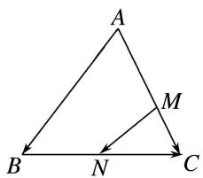

6. 如图所示，在 $\triangle ABC$ 中，点 $O$ 是 $BC$ 的中点．过点 $O$ 的直线分别交直线 $AB$ 、 $AC$ 于不同的两点 $M$ 、 $N$ ，若 $\overrightarrow{AB} = m\overrightarrow{AM}$ ， $\overrightarrow{AC} = n\overrightarrow{AN}$ ，则 $m + n$ 的值为 \_\_\_\_.

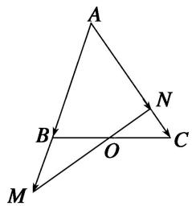

6. 答案 2 解析 $\because O$ 是 $BC$ 的中点， $\therefore \overrightarrow{AO} = \frac{1}{2} (\overrightarrow{AB} + \overrightarrow{AC})$ 。又 $\because \overrightarrow{AB} = m\overrightarrow{AM}, \overrightarrow{AC} = n\overrightarrow{AN}, \therefore \overrightarrow{AO} = \frac{m}{2}\overrightarrow{AM} + \frac{n}{2}\overrightarrow{AN}$ 。 $\overrightarrow{AN}$ 。 $\because M, O, N$ 三点共线， $\therefore \frac{m}{2} + \frac{n}{2} = 1$ 。则 $m + n = 2$ 。

7. 已知点 $G$ 是 $\triangle ABC$ 的重心, 过 $G$ 作一条直线与 $AB$ , $AC$ 两边分别交于 $M$ , $N$ 两点, 且 $\overrightarrow{AM} = x\overrightarrow{AB}$ , $\overrightarrow{AN} = y\overrightarrow{AC}$ , 则 $\frac{xy}{x + y}$ 的值为 ( )

A. $\frac{1}{2}$

B. $\frac{1}{3}$

C. 2

D. 3

7. 答案 B 解析 由已知得 M, G, N 三点共线, $\therefore \overrightarrow{AG} = \lambda \overrightarrow{AM} + (1 - \lambda) \overrightarrow{AN} = \lambda x \overrightarrow{AB} + (1 - \lambda) y \overrightarrow{AC}$ .

点 G 是 $\triangle ABC$ 的重心， $\therefore \overrightarrow{AG} = \frac{2}{3} \times \frac{1}{2} (\overrightarrow{AB} + \overrightarrow{AC}) = \frac{1}{3} \cdot (\overrightarrow{AB} + \overrightarrow{AC})$ ， $\therefore \left\{\begin{aligned}\lambda x &= \frac{1}{3}, \\ (1 - \lambda)y &= \frac{1}{3},\end{aligned}\right.$ 即 $\left\{\begin{aligned}\lambda &= \frac{1}{3x}, \\ 1 - \lambda &= \frac{1}{3y},\end{aligned}\right.$ 得 $\frac{1}{3x} + \frac{1}{3y} = 1$ ，即 $\frac{1}{x} + \frac{1}{y} = 3$ ，通分变形得， $\frac{x + y}{xy} = 3$ ， $\therefore \frac{xy}{x + y} = \frac{1}{3}$ .

8. 如图所示, $AD$ 是 $\triangle ABC$ 的中线, $O$ 是 $AD$ 的中点, 若 $\overrightarrow{CO} = \lambda \overrightarrow{AB} + \mu \overrightarrow{AC}$ , 其中 $\lambda$ , $\mu \in \mathbf{R}$ , 则 $\lambda + \mu$ 的值为 ( )

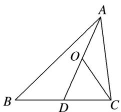

A. $-\frac{1}{2}$

B. $\frac{1}{2}$

C. $-\frac{1}{4}$

D. $\frac{1}{4}$

8. 答案 A 解析 由题意知， $\overrightarrow{CO} = \frac{1}{2} (\overrightarrow{CD} + \overrightarrow{CA}) = \frac{1}{2} \times \left(\frac{1}{2}\overrightarrow{CB} + \overrightarrow{CA}\right) = \frac{1}{4} (\overrightarrow{AB} - \overrightarrow{AC}) + \frac{1}{2}\overrightarrow{CA} = \frac{1}{4}\overrightarrow{AB} - \frac{3}{4}\overrightarrow{AC}$ ，则 $\lambda = \frac{1}{4}, \mu = -\frac{3}{4}$ ，故 $\lambda + \mu = -\frac{1}{2}$ .

9. 如图, 在 $\triangle ABC$ 中, $\overrightarrow{AN} = \frac{1}{3}\overrightarrow{NC}$ , $P$ 是 $BN$ 上的一点, 若 $\overrightarrow{AP} = m\overrightarrow{AB} + \frac{2}{11}\overrightarrow{AC}$ , 则实数 $m$ 的值为 \_\_\_\_.

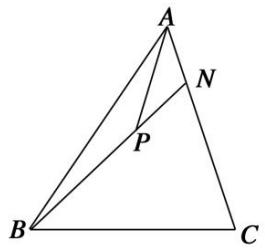

9. 答案 $\frac{3}{11}$ 解析 设 $\overrightarrow{BP}=k\overrightarrow{BN}, k\in\mathbb{R}$ . 因为 $\overrightarrow{AP}=\overrightarrow{AB}+\overrightarrow{BP}=\overrightarrow{AB}+k\overrightarrow{BN}=\overrightarrow{AB}+k(\overrightarrow{AN}-\overrightarrow{AB})=\overrightarrow{AB}+k(\frac{1}{4}\overrightarrow{AC}-\overrightarrow{AB})$ $=(1-k)\overrightarrow{AB}+\frac{k}{4}\overrightarrow{AC}$ ，且 $\overrightarrow{AP}=m\overrightarrow{AB}+\frac{2}{11}\overrightarrow{AC}$ ，所以 1-k=m， $\frac{k}{4}=\frac{2}{11}$ ，解得 $k=\frac{8}{11}$ ， $m=\frac{3}{11}$ .

10. 在 $\triangle ABC$ 中， $\overrightarrow{AN}=\frac{1}{4}\overrightarrow{NC}$ ，若 $P$ 是直线 $BN$ 上的一点，且满足 $\overrightarrow{AP}=m\overrightarrow{AB}+\frac{2}{5}\overrightarrow{AC}$ ，则实数 $m$ 的值为( )

A. -4

B.-1

C. 1

D. 4

10. 答案 B 解析 根据题意设 $\overrightarrow{BP}=n\overrightarrow{BN}(n\in\mathbf{R})$ ，则 $\overrightarrow{AP}=\overrightarrow{AB}+\overrightarrow{BP}=\overrightarrow{AB}+n\overrightarrow{BN}=\overrightarrow{AB}+n(\overrightarrow{AN}-\overrightarrow{AB})=\overrightarrow{AB}+$ $n(\frac{2}{5}\overrightarrow{AC}-\overrightarrow{AB})=(1-n)\overrightarrow{AB}+\frac{n}{5}\overrightarrow{AC}$ . 又 $\overrightarrow{AP}=m\overrightarrow{AB}+\frac{2}{5}\overrightarrow{AC},$ $\therefore\left\{\begin{aligned}&1-n=m,\\ &\frac{n}{5}=\frac{2}{5},\end{aligned}\right.$ 解得 $\left\{\begin{aligned}&n=2,\\ &m=-1.\end{aligned}\right.$

11. 在 $\triangle ABC$ 中， $M$ 为边 $BC$ 上任意一点， $N$ 为 $AM$ 的中点， $\overrightarrow{AN}=\lambda\overrightarrow{AB}+\mu\overrightarrow{AC}$ ，则 $\lambda+\mu$ 的值为( )

A. $\frac{1}{2}$

B. $\frac{1}{3}$

C. $\frac{1}{4}$

D. 1

11. 答案 A 解析 设 $\overrightarrow{BM}=t\overrightarrow{BC}$ ，则 $\overrightarrow{AN}=\frac{1}{2}\overrightarrow{AM}=\frac{1}{2}(\overrightarrow{AB}+\overrightarrow{BM})=\frac{1}{2}\overrightarrow{AB}+\frac{1}{2}\overrightarrow{BM}=\frac{1}{2}\overrightarrow{AB}+\frac{t}{2}\overrightarrow{BC}=\frac{1}{2}\overrightarrow{AB}+\frac{t}{2}(\overrightarrow{AC}-\overrightarrow{AB})=$ $\left(\frac{1}{2}-\frac{t}{2}\right)\overrightarrow{AB}+\frac{t}{2}\overrightarrow{AC},\quad\therefore\lambda=\frac{1}{2}-\frac{t}{2},\quad\mu=\frac{t}{2},\quad\therefore\lambda+\mu=\frac{1}{2}$ ，故选 A.

12. 在 $\triangle ABC$ 中， $AB=2, BC=3$ ， $\angle ABC=60^{\circ}$ ， $AD$ 为 $BC$ 边上的高， $O$ 为 $AD$ 的中点，若 $\overrightarrow{AO}=\lambda\overrightarrow{AB}+\mu\overrightarrow{BC}$ ，则 $\lambda+\mu$ 等于（）

A. 1

B. $\frac{1}{2}$

C. $\frac{1}{3}$

D. $\frac{2}{3}$

12. 答案 D 解析 $\because \overrightarrow{AD} = \overrightarrow{AB} + \overrightarrow{BD} = \overrightarrow{AB} + \frac{1}{3}\overrightarrow{BC}, \therefore 2\overrightarrow{AO} = \overrightarrow{AB} + \frac{1}{3}\overrightarrow{BC}$ , 即 $\overrightarrow{AO} = \frac{1}{2}\overrightarrow{AB} + \frac{1}{6}\overrightarrow{BC}$ . 故 $\lambda + \mu = \frac{1}{2} + \frac{1}{6} = \frac{2}{3}$ .

13. 在 $\triangle ABC$ 中， $D$ 为三角形所在平面内一点，且 $\overrightarrow{AD}=\frac{1}{3}\overrightarrow{AB}+\frac{1}{2}\overrightarrow{AC}$ . 延长 $AD$ 交 $BC$ 于 $E$ ，若 $\overrightarrow{AE}=\lambda\overrightarrow{AB}+\mu\overrightarrow{AC}$ ，则 $\lambda-\mu$ 的值是\_\_\_\_.

13. 答案 $-\frac{1}{5}$ 解析 设 $\overrightarrow{AE}=x\overrightarrow{AD}$ ，∵ $\overrightarrow{AD}=\frac{1}{3}\overrightarrow{AB}+\frac{1}{2}\overrightarrow{AC}$ ，∴ $\overrightarrow{AE}=\frac{x}{3}\overrightarrow{AB}+\frac{x}{2}\overrightarrow{AC}$ 。由于 E, B, C 三点共线，
$\therefore\frac{x}{3}+\frac{x}{2}=1,\quad x=\frac{6}{5}.$ 根据平面向量基本定理，得 $\lambda=\frac{x}{3},\quad\mu=\frac{x}{2}.$ 因此 $\lambda-\mu=\frac{x}{3}-\frac{x}{2}=-\frac{x}{6}=-\frac{1}{5}.$

14. 如图，正方形 $ABCD$ 中， $E$ 为 $DC$ 的中点，若 $\overrightarrow{AE} = \lambda \overrightarrow{AB} + \mu \overrightarrow{AC}$ ，则 $\lambda + \mu$ 的值为（）

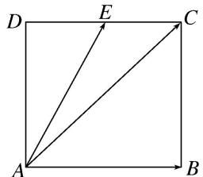

A. $\frac{1}{2}$

B. $-\frac{1}{2}$

C. 1

D. -1

14. 答案 A 解析 由题意得 $\overrightarrow{AE} = \overrightarrow{AD} + \frac{1}{2}\overrightarrow{AB} = \overrightarrow{BC} + \overrightarrow{AB} - \frac{1}{2}\overrightarrow{AB} = \overrightarrow{AC} - \frac{1}{2}\overrightarrow{AB}, \therefore \lambda = -\frac{1}{2}, \mu = 1, \therefore \lambda + \mu = \frac{1}{2}$ , 故选 A.

15. 如图所示，正方形 ABCD 中，M 是 BC 的中点，若 $\overrightarrow{AC} = \lambda \overrightarrow{AM} + \mu \overrightarrow{BD}$ ，则 $\lambda + \mu = (\quad)$

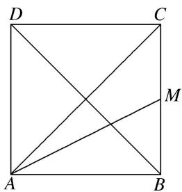

A. $\frac{4}{3}$

B. $\frac{5}{3}$

C. $\frac{15}{8}$

D. 2

15. 答案 B 解析 因为 $\overrightarrow{AC} = \lambda \overrightarrow{AM} + \mu \overrightarrow{BD} = \lambda (\overrightarrow{AB} + \overrightarrow{BM}) + \mu (\overrightarrow{BA} + \overrightarrow{AD}) = \lambda (\overrightarrow{AB} + \frac{1}{2} \overrightarrow{AD}) + \mu (-\overrightarrow{AB} + \overrightarrow{AD}) = (\lambda - \mu) \overrightarrow{AB} + \left(\frac{1}{2} \lambda + \mu\right) \overrightarrow{AD}$ ，且 $\overrightarrow{AC} = \overrightarrow{AB} + \overrightarrow{AD}$ ，所以 $\left\{\begin{aligned}\lambda - \mu &= 1, \\ \frac{1}{2} \lambda + \mu &= 1,\end{aligned}\right.$ 得 $\left\{\begin{aligned}\lambda &= \frac{4}{3}, \\ \mu &= \frac{1}{3},\end{aligned}\right.$ 所以 $\lambda + \mu = \frac{5}{3}$ ，故选 B.

16. 如图所示，矩形 $ABCD$ 的对角线相交于点 $O$ ， $E$ 为 $AO$ 的中点，若 $\overrightarrow{DE} = \lambda \overrightarrow{AB} + \mu \overrightarrow{AD} (\lambda, \mu$ 为实数)，则 $\lambda^2 + \mu^2$ 等于（）

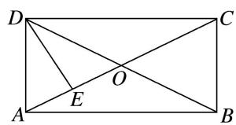

A. $\frac{5}{8}$

B. $\frac{1}{4}$

C. 1

D. $\frac{5}{16}$

16. 答案 A 解析 $\overrightarrow{DE} = \frac{1}{2}\overrightarrow{DA} +\frac{1}{2}\overrightarrow{DO} = \frac{1}{2}\overrightarrow{DA} +\frac{1}{4}\overrightarrow{DB} = \frac{1}{2}\overrightarrow{DA} +\frac{1}{4} (\overrightarrow{DA} +\overrightarrow{AB}) = \frac{1}{4}\overrightarrow{AB} -\frac{3}{4}\overrightarrow{AD}$ ，所以 $\lambda = \frac{1}{4},\mu = -\frac{3}{4},$ 故 $\lambda^2 +\mu^2 = \frac{5}{8}$ ，故选A.

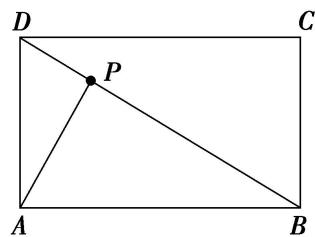

17. 如图，直线 EF 与平行四边形 ABCD 的两边 AB，AD 分别交于 E，F 两点，且与对角线 AC 交于点 K，其中， $\overrightarrow{AE}=\frac{2}{5}\overrightarrow{AB}$ ， $\overrightarrow{AF}=\frac{1}{2}\overrightarrow{AD}$ ， $\overrightarrow{AK}=\lambda\overrightarrow{AC}$ ，则 $\lambda$ 的值为 \_\_\_\_.

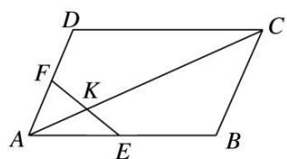

17. 答案 $\frac{2}{9}$ 解析 $\because \overrightarrow{AE} = \frac{2}{5}\overrightarrow{AB}, \overrightarrow{AF} = \frac{1}{2}\overrightarrow{AD}, \therefore \overrightarrow{AB} = \frac{5}{2}\overrightarrow{AE}, \overrightarrow{AD} = 2\overrightarrow{AF}$ . 由向量加法的平行四边形法则可知， $\overrightarrow{AC} = \overrightarrow{AB} + \overrightarrow{AD}, \therefore \overrightarrow{AK} = \lambda \overrightarrow{AC} = \lambda (\overrightarrow{AB} + \overrightarrow{AD}) = \lambda (\frac{5}{2}\overrightarrow{AE} + 2\overrightarrow{AF}) = \frac{5}{2}\lambda \overrightarrow{AE} + 2\lambda \overrightarrow{AF}, \because E, F, K$ 三点共线， $\therefore \frac{5}{2}\lambda + 2\lambda = 1, \therefore \lambda = \frac{2}{9}$ .

18. 如图，在平行四边形 $ABCD$ 中， $AC, BD$ 相交于点 $O, E$ 为线段 $AO$ 的中点．若 $\overrightarrow{BE} = \lambda \overrightarrow{BA} + \mu \overrightarrow{BD} (\lambda, \mu \in \mathbf{R})$ ，则 $\lambda + \mu$ 等于（）

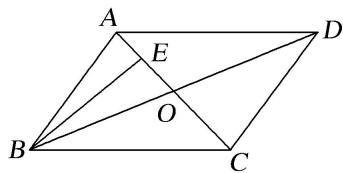

A. 1

B. $\frac{3}{4}$

C. $\frac{2}{3}$

D. $\frac{1}{2}$

18. 答案 B 解析 $\because E$ 为线段 AO 的中点， $\therefore \overrightarrow{BE} = \frac{1}{2} \overrightarrow{BA} + \frac{1}{2} \overrightarrow{BO} = \frac{1}{2} \overrightarrow{BA} + \frac{1}{2} \times \frac{1}{2} \overrightarrow{BD} = \frac{1}{2} \overrightarrow{BA} + \frac{1}{4} \overrightarrow{BD} = \lambda \overrightarrow{BA} + \mu \overrightarrow{BD},$ $\therefore \lambda + \mu = \frac{1}{2} + \frac{1}{4} = \frac{3}{4}.$

19. 一直线 $l$ 与平行四边形ABCD中的两边 $AB, AB$ 分别交于点 $E, F$ , 且交其对角线 $AC$ 于点 $M$ , 若 $\overrightarrow{AB} = 2\overrightarrow{AE}, \overrightarrow{AD} = 3\overrightarrow{AF}, \overrightarrow{AM} = \lambda \overrightarrow{AB} - \mu \overrightarrow{AC} (\lambda, \mu \in \mathbf{R})$ , 则 $\frac{5}{2}\mu - \lambda = (\quad)$

A. $-\frac{1}{2}$

B. 1

C. $\frac{3}{2}$

D. -3

19. 答案 A 解析 $\overrightarrow{AM}=\lambda\overrightarrow{AB}-\mu\overrightarrow{AC}=\lambda\overrightarrow{AB}-\mu(\overrightarrow{AB}+\overrightarrow{AD})=(\lambda-\mu)\overrightarrow{AB}-\mu\overrightarrow{AD}=2(\lambda-\mu)\overrightarrow{AE}-3\mu\overrightarrow{AF}$ . 因为 E, M, F 三点共线，所以 $2(\lambda-\mu)+(-3\mu)=1$ ，即 $2\lambda-5\mu=1$ ，∴ $\frac{5}{2}\mu-\lambda=-\frac{1}{2}$ .

20. 如图，在平行四边形 $ABCD$ 中， $E, F$ 分别为边 $AB, BC$ 的中点，连接 $CE, DF$ ，交于点 $G$ 。若 $\overrightarrow{CG} = \lambda \overrightarrow{CD}$
$+\mu\overrightarrow{CB}(\lambda,\ \mu\in\mathbf{R})$ ，则 $\frac{\lambda}{\mu}=$ \_\_\_\_.

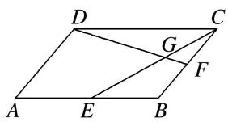

20. 答案 $\frac{1}{2}$ 解析 由题意可设 $\overrightarrow{CG} = x\overrightarrow{CE}(0 < x < 1)$ ，则 $\overrightarrow{CG} = x(\overrightarrow{CB} + \overrightarrow{BE}) = x\left(\overrightarrow{CB} + \frac{1}{2}\overrightarrow{CD}\right) = \frac{x}{2}\overrightarrow{CD} + x\overrightarrow{CB}$ . 因为 $\overrightarrow{CG} = \lambda \overrightarrow{CD} + \mu \overrightarrow{CB}$ ， $\overrightarrow{CD}$ 与 $\overrightarrow{CB}$ 不共线，所以 $\lambda = \frac{x}{2}$ ， $\mu = x$ ，所以 $\frac{\lambda}{\mu} = \frac{1}{2}$ .

21. 如图，在直角梯形 ABCD 中， $AB \parallel DC$ ， $AD \perp DC$ ，AD = DC = 2AB，E 为 AD 的中点，若 $\overrightarrow{CA} = \lambda \overrightarrow{CE} + \mu \overrightarrow{DB} (\lambda, \mu \in \mathbb{R})$ ，则 $\lambda + \mu$ 的值为（）

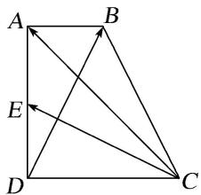

A. $\frac{6}{5}$

B. $\frac{8}{5}$

C. 2

D. $\frac{8}{3}$

21. 答案 B 解析 建立如图所示的平面直角坐标系，则 $D(0, 0)$ .

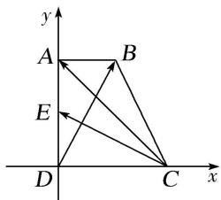
不妨设 AB=1，则 CD=AD=2，所以 $C(2,0)$ ， $A(0,2)$ ， $B(1,2)$ ， $E(0,1)$ ，∴ $\overrightarrow{CA}=(-2,2)$ ， $\overrightarrow{CE}=(-2,1)$ ， $\overrightarrow{DB}=(1,2)$ ，∵ $\overrightarrow{CA}=\lambda\overrightarrow{CE}+\mu\overrightarrow{DB}$ ，∴ $(-2,2)=\lambda(-2,1)+\mu(1,2)$ ，∴ $\left\{\begin{aligned}-2\lambda+\mu&=-2,\\ \lambda+2\mu&=2,\end{aligned}\right.$ 解得 $\left\{\begin{aligned}\lambda&=\frac{6}{5},\\ \mu&=\frac{2}{5},\end{aligned}\right.$ 则 $\lambda+\mu=\frac{8}{5}$ .

22. 在梯形 ABCD 中，已知 $AB \parallel CD$ ，AB = 2CD，M，N 分别为 CD，BC 的中点．若 $\overrightarrow{AB} = \lambda \overrightarrow{AM} + \mu \overrightarrow{AN}$ ，则 $\lambda + \mu$ 的值为（）

A. $\frac{1}{4}$

B. $\frac{1}{5}$

C. $\frac{4}{5}$

D. $\frac{5}{4}$

22. 答案 C 解析 法一：连接 AC(图略)，由 $\overrightarrow{AB} = \lambda \overrightarrow{AM} + \mu \overrightarrow{AN}$ ，得 $\overrightarrow{AB} = \lambda \cdot \frac{1}{2} (\overrightarrow{AD} + \overrightarrow{AC}) + \mu \cdot \frac{1}{2} (\overrightarrow{AC} + \overrightarrow{AB})$ ，则 $\left(\frac{\mu}{2} - 1\right)_{\overrightarrow{AB}} + \frac{\lambda}{2} \overrightarrow{AD} + \left[\frac{\lambda}{2} + \frac{\mu}{2}\right)_{\overrightarrow{AC}} = 0$ ，得 $\left(\frac{\mu}{2} - 1\right)_{\overrightarrow{AB}} + \frac{\lambda}{2} \overrightarrow{AD} + \left[\frac{\lambda}{2} + \frac{\mu}{2}\right)_{[\overrightarrow{AD} + \frac{1}{2} \overrightarrow{AB}]} = 0$ ，得 $\left(\frac{1}{4} \lambda + \frac{3}{4} \mu - 1\right)_{\overrightarrow{AB}} +$
$\left[\lambda + \frac{\mu}{2}\right]_{\overrightarrow{AD}} = 0.$ 又 $\overrightarrow{AB}, \overrightarrow{AD}$ 不共线，所以由平面向量基本定理得 $\left\{ \begin{array}{l} \frac{1}{4} \lambda + \frac{3}{4} \mu - 1 = 0, \\ \lambda + \frac{\mu}{2} = 0, \end{array} \right.$ 解得 $\left\{ \begin{array}{l} \lambda = -\frac{4}{5}, \\ \mu = \frac{8}{5}. \end{array} \right.$
所以 $\lambda+\mu=\frac{4}{5}$ .

法二：因为 $\overrightarrow{AB} = \overrightarrow{AN} + \overrightarrow{NB} = \overrightarrow{AN} + \overrightarrow{CN} = \overrightarrow{AN} + (\overrightarrow{CA} + \overrightarrow{AN}) = 2\overrightarrow{AN} + \overrightarrow{CM} + \overrightarrow{MA} = 2\overrightarrow{AN} - \frac{1}{4}\overrightarrow{AB} - \overrightarrow{AM}$ ，所以 $\overrightarrow{AB} = \frac{8}{5}\overrightarrow{AN} - \frac{4}{5}\overrightarrow{AM}$ ，所以 $\lambda + \mu = \frac{4}{5}$ .

法三：根据题意作出图形如图所示，连接 MN 并延长，交 AB 的延长线于点 T，由已知易得 $AB=\frac{4}{5}AT$ ，所以 $\frac{4}{5}\overrightarrow{AT}=\overrightarrow{AB}=\lambda\overrightarrow{AM}+\mu\overrightarrow{AN}$ ，因为 T，M，N 三点共线，所以 $\lambda+\mu=\frac{4}{5}$ .

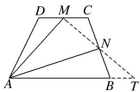

23. 已知 $|\overrightarrow{OA}| = 1$ ， $|\overrightarrow{OB}| = \sqrt{3}$ ， $\overrightarrow{OA} \cdot \overrightarrow{OB} = 0$ ，点 $C$ 在 $\angle AOB$ 内，且 $\overrightarrow{OC}$ 与 $\overrightarrow{OA}$ 的夹角为 $30^{\circ}$ ，设 $\overrightarrow{OC} = m\overrightarrow{OA} + n\overrightarrow{OB}$ $(m, n \in \mathbf{R})$ ，则 $\frac{m}{n}$ 的值为（）

A. 2

B. $\frac{5}{2}$

C. 3

D. 4

23. 答案 C 解析 $\because \overrightarrow{OA} \cdot \overrightarrow{OB} = 0, \therefore \overrightarrow{OA} \perp \overrightarrow{OB}$ , 以 $\overrightarrow{OA}$ 所在直线为 $x$ 轴, $\overrightarrow{OB}$ 所在直线为 $y$ 轴建立平面直角坐标系(图略), $\overrightarrow{OA} = (1, 0)$ , $\overrightarrow{OB} = (0, \sqrt{3})$ , $\overrightarrow{OC} = m\overrightarrow{OA} + n\overrightarrow{OB} = (m, \sqrt{3}n)$ . $\because \tan 30^\circ = \frac{\sqrt{3}n}{m} = \frac{\sqrt{3}}{3}, \therefore m = 3n$ , 即 $\frac{m}{n} = 3$ , 故选 C.

# 考点三 根据向量线性运算求参数的取值范围(最值)

# 【方法总结】

# 向量线性运算求参数的取值范围(最值)问题的2种求解方法  
（1）几何法：即临界位置法，结合图形，确定临界位置的动态分析求出范围.  
（2）代数法：即目标函数法，将参数表示为某一个变量或两个变量的函数，建立函数关系式，再利用三角函数有界性、二次函数或基本不等式求最值或范围.

# 【例题选讲】

[例 1]（1）已知在 $\triangle ABC$ 中，点 D 满足 $2\overrightarrow{BD}+\overrightarrow{CD}=0$ ，过点 D 的直线 l 与直线 AB，AC 分别交于点 M，N， $\overrightarrow{AM}=\lambda\overrightarrow{AB}$ ， $\overrightarrow{AN}=\mu\overrightarrow{AC}$ 。若 $\lambda>0,\mu>0$ ，则 $\lambda+\mu$ 的最小值为 \_\_\_\_。
答案 $\frac{3 + 2\sqrt{2}}{3}$ 解析 连接 $AD$ 。因为 $2\overrightarrow{BD} + \overrightarrow{CD} = \mathbf{0}$ ，所以 $B\overrightarrow{D} = \frac{1}{3} B\overrightarrow{C}$ ， $A\overrightarrow{D} = A\overrightarrow{B} + B\overrightarrow{D} = A\overrightarrow{B} + \frac{1}{3} B\overrightarrow{C} = A\overrightarrow{B} + \frac{1}{3}(A\overrightarrow{C} - A\overrightarrow{B}) = \frac{2}{3} A\overrightarrow{B} + \frac{1}{3} A\overrightarrow{C}$ 。因为 $D, M, N$ 三点共线，所以存在 $x \in \mathbb{R}$ ，使 $A\overrightarrow{D} = xA\overrightarrow{M} + (1 - x)\overrightarrow{AN}$ ，则 $A\overrightarrow{D} = x\lambda A\overrightarrow{B} + (1 - x)\mu A\overrightarrow{C}$ ，所以 $x\lambda A\overrightarrow{B} + (1 - x)\mu A\overrightarrow{C} = \frac{2}{3} A\overrightarrow{B} + \frac{1}{3} A\overrightarrow{C}$ ，所以 $x\lambda = \frac{2}{3}$ ， $(1 - x)\mu = \frac{1}{3}$ ，所以 $x = \frac{2}{3\lambda}$ ， $1 - x = \frac{1}{3\mu}$ ，所

以 $\frac{2}{3\lambda}+\frac{1}{3\mu}=1$ ，所以 $\lambda+\mu=\frac{1}{3}(\lambda+\mu)\left(\frac{2}{\lambda}+\frac{1}{\mu}\right)=\frac{1}{3}\left(3+\frac{2\mu}{\lambda}+\frac{\lambda}{\mu}\right)\geq\frac{3+2\sqrt{2}}{3}$ ，当且仅当 $\lambda=\sqrt{2}\mu$ 时等号成立，所以 $\lambda+\mu$ 的最小值为 $\frac{3+2\sqrt{2}}{3}$ .  
（2）如图，圆 $O$ 是边长为 $2\sqrt{3}$ 的等边三角形 $ABC$ 的内切圆，其与 $BC$ 边相切于点 $D$ ，点 $M$ 为圆上任意一点， $\overrightarrow{BM} = x\overrightarrow{BA} +y\overrightarrow{BD}(x,y\in \mathbf{R})$ ，则 $2x + y$ 的最大值为（）

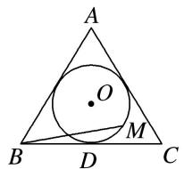

A. $\sqrt{2}$

B. $\sqrt{3}$

C. 2

D. $2\sqrt{2}$
答案 C 解析 方法一 如图，连接 DA，以 D 点为原点，BC 所在直线为 x 轴，DA 所在直线为 y 轴，建立如图所示的平面直角坐标系．设内切圆的半径为 r，则圆心为坐标 $(0, r)$ ，

根据三角形面积公式，得 $\frac{1}{2} \times l_{\triangle ABC} \times r = \frac{1}{2} \times AB \times AC \times \sin 60^\circ (l_{\triangle ABC}$ 为 $\triangle ABC$ 的周长)，解得 $r = 1$ 。易得 $B(-\sqrt{3}, 0)$ ， $C(\sqrt{3}, 0)$ ， $A(0, 3)$ ， $D(0, 0)$ ，设 $M(\cos \theta, 1 + \sin \theta)$ ， $\theta \in [0, 2\pi)$ ，则 $\overrightarrow{BM} = (\cos \theta + \sqrt{3}, 1 + \sin \theta)$ ， $\overrightarrow{BA} = (\sqrt{3}, 3)$ ， $\overrightarrow{BD} = (\sqrt{3}, 0)$ ，故 $\overrightarrow{BM} = (\cos \theta + \sqrt{3}, 1 + \sin \theta) = (\sqrt{3}x + \sqrt{3}y, 3x)$ ，故 $\left\{ \begin{array}{l} \cos \theta = \sqrt{3}x + \sqrt{3}y - \sqrt{3}, \\ \sin \theta = 3x - 1, \end{array} \right.$ 则 $\left\{ \begin{array}{l} x = \frac{1 + \sin \theta}{3}, \\ y = \frac{\sqrt{3}\cos \theta}{3} - \frac{\sin \theta}{3} + \frac{2}{3}, \end{array} \right.$ 所以 $2x + y = \frac{\sqrt{3}\cos \theta}{3} + \frac{\sin \theta}{3} + \frac{4}{3} = \frac{2}{3}\sin\left[\theta + \frac{\pi}{3}\right] + \frac{4}{3} \leq 2$ 。当 $\theta = \frac{\pi}{6}$ 时等号成立。故 $2x + y$ 的最大值为 2.
方法二 因为 $\overrightarrow{BM} = x\overrightarrow{BA} + y\overrightarrow{BD}$ ，所以 $|\overrightarrow{BM}|^2 = 3(4x^2 + 2xy + y^2) = 3[(2x + y)^2 - 2xy]$ 。由题意知， $x \geq 0$ ， $y \geq 0$ ， $|\overrightarrow{BM}|$ 的最大值为 $\sqrt{(2\sqrt{3})^2 - (\sqrt{3})^2} = 3$ ，又 $\frac{(2x + y)^2}{4} \geq 2xy$ ，即 $\frac{-(2x + y)^2}{4} \leq -2xy$ ，所以 $3 \times \frac{3}{4}(2x + y)^2 \leq 9$ ，得 $2x + y \leq 2$ ，当且仅当 $2x = y = 1$ 时取等号。  
（3） (2017·全国Ⅲ)在矩形ABCD中， $AB = 1$ ， $AD = 2$ ，动点 $P$ 在以点 $C$ 为圆心且与BD相切的圆上．若 $\overrightarrow{AP} = \lambda \overrightarrow{AB} +\mu \overrightarrow{AD}$ ，则 $\lambda +\mu$ 的最大值为（）

A. 3

B. $2\sqrt{2}$

C. $\sqrt{5}$

D. 2
答案 A 解析 建立如图所示的直角坐标系，则 C 点坐标为 $(2, 1)$ 。设 BD 与圆 C 切于点 E，连接 CE，则 $CE \perp BD$ 。因为 CD = 1，BC = 2，所以 $BD = \sqrt{1^{2} + 2^{2}} = \sqrt{5}$ ， $EC = \frac{BC \cdot CD}{BD} = \frac{2}{\sqrt{5}} = \frac{2\sqrt{5}}{5}$ ，所以 P 点的轨

迹方程为 $(x - 2)^{2} + (y - 1)^{2} = \frac{4}{5}$ . 设 $P(x_0, y_0)$ , 则 $\left\{ \begin{array}{l} x_0 = 2 + \frac{2\sqrt{5}}{5}\cos \theta, \\ y_0 = 1 + \frac{2\sqrt{5}}{5}\sin \theta \end{array} \right.$ ( $\theta$ 为参数), 而 $\overrightarrow{AP} = (x_0, y_0), \overrightarrow{AB} = (0, 1)$ , $\overrightarrow{AD} = (2, 0)$ . 因为 $\overrightarrow{AP} = \lambda \overrightarrow{AB} + \mu \overrightarrow{AD} = \lambda (0, 1) + \mu (2, 0) = (2\mu, \lambda)$ , 所以 $\mu = \frac{1}{2} x_0 = 1 + \frac{\sqrt{5}}{5}\cos \theta, \lambda = y_0 = 1 + \frac{2\sqrt{5}}{5}\sin \theta$ . 两式相加, 得 $\lambda + \mu = 1 + \frac{2\sqrt{5}}{5}\sin \theta + 1 + \frac{\sqrt{5}}{5}\cos \theta = 2 + \sin (\theta + \varphi) \leq 3$ (其中 $\sin \varphi = \frac{\sqrt{5}}{5}, \cos \varphi = \frac{2\sqrt{5}}{5}$ ), 当且仅当 $\theta = \frac{\pi}{2} + 2k\pi - \varphi, k \in \mathbf{Z}$ 时, $\lambda + \mu$ 取得最大值3. 故选A.

  
（4）如图，在扇形 OAB 中， $\angle AOB=\frac{\pi}{3}$ ，C 为弧 AB 上的一个动点，若 $\overrightarrow{OC}=x\overrightarrow{OA}+y\overrightarrow{OB}$ ，则 $x+3y$ 的取值范围是 \_\_\_\_.

答案 [1, 3] 解析 设扇形的半径为 1，以 OB 所在直线为 x 轴，O 为坐标原点建立平面直角坐标系（图略），则 $B(1,0)$ ， $A\left(\frac{1}{2}, \frac{\sqrt{3}}{2}\right)$ ， $C(\cos \theta, \sin \theta)\left[\text{其中} \angle BOC = \theta, 0 \leq \theta \leq \frac{\pi}{3}\right]$ 。则 $\overrightarrow{OC} = (\cos \theta, \sin \theta) = x\left(\frac{1}{2}, \frac{\sqrt{3}}{2}\right) + y(1,0)$ ，即 $\left\{\begin{aligned}&\frac{x}{2}+y=\cos \theta,\\&\frac{\sqrt{3}}{2}x=\sin \theta,\end{aligned}\right.$ 解得 $x=\frac{2\sqrt{3}\sin \theta}{3}$ ， $y=\cos \theta-\frac{\sqrt{3}\sin \theta}{3}$ ，故 $x+3y=\frac{2\sqrt{3}\sin \theta}{3}+3\cos \theta-\sqrt{3}\sin \theta=3\cos \theta-\frac{\sqrt{3}}{3}\sin \theta, 0 \leq \theta \leq \frac{\pi}{3}$ 。令 $g(\theta)=3\cos \theta-\frac{\sqrt{3}}{3}\sin \theta$ ，易知 $g(\theta)=3\cos \theta-\frac{\sqrt{3}}{3}\sin \theta$ 在 $\left[0, \frac{\pi}{3}\right]$ 上单调递减，故当 $\theta=0$ 时， $g(\theta)$ 取得最大值为 3，当 $\theta=\frac{\pi}{3}$ 时， $g(\theta)$ 取得最小值为 1，故 $x+3y$ 的取值范围为 [1,3]。

# 【对点训练】

1. 在 $\triangle ABC$ 中，点 $D$ 在线段 $BC$ 的延长线上，且 $\overrightarrow{BC}=3\overrightarrow{CD}$ ，点 $O$ 在线段 $CD$ 上(与点 $C, D$ 不重合)，若 $\overrightarrow{AO}=x\overrightarrow{AB}+(1-x)\overrightarrow{AC}$ ，则 $x$ 的取值范围是（）

A. $\left(0,\frac{1}{2}\right)$

B. $\left(0,\frac{1}{3}\right)$

C. $\left(-\frac{1}{2},0\right)$

D. $\left(-\frac{1}{3},0\right)$

1. 答案 D 解析 设 $\overrightarrow{CO}=y\overrightarrow{BC}, \because \overrightarrow{AO}=\overrightarrow{AC}+\overrightarrow{CO}=\overrightarrow{AC}+y\overrightarrow{BC}=\overrightarrow{AC}+y(\overrightarrow{AC}-\overrightarrow{AB})=-y\overrightarrow{AB}+(1+y)\overrightarrow{AC}.$ $\because \overrightarrow{BC}=3\overrightarrow{CD}$ ，点 O 在线段 CD 上（与点 C, D 不重合）， $\therefore y\in\left(0,\frac{1}{3}\right)$ ， $\because \overrightarrow{AO}=x\overrightarrow{AB}+(1-x)\overrightarrow{AC}, \therefore x=-y,$
$x \in \left[ - \frac {1}{3}, 0 \right].$

2. 在 $\triangle ABC$ 中，点 $D$ 满足 $\overrightarrow{BD}=\overrightarrow{DC}$ ，当点 $E$ 在线段 $AD$ 上移动时，若 $\overrightarrow{AE}=\lambda\overrightarrow{AB}+\mu\overrightarrow{AC}$ ，则 $t=(\lambda-1)^{2}+\mu^{2}$ 的最小值是\_\_\_\_。

2. 答案 $\frac{1}{2}$ 解析 因为 $\overrightarrow{BD} = \overrightarrow{DC}$ ，所以 $\overrightarrow{AD} = \frac{1}{2}\overrightarrow{AB} + \frac{1}{2}\overrightarrow{AC}$ 。又 $\overrightarrow{AE} = \lambda \overrightarrow{AB} + \mu \overrightarrow{AC}$ ，点 $E$ 在线段 $AD$ 上移动，所以 $\overrightarrow{AE} // \overrightarrow{AD}$ ，则 $\frac{1}{2} = \frac{1}{2}$ ，即 $\lambda = \mu \left(0 \leq \lambda \leq \frac{1}{2}\right)$ 。所以 $t = (\lambda - 1)^2 + \lambda^2 = 2\lambda^2 - 2\lambda + 1 = 2\left[\lambda - \frac{1}{2}\right]^2 + \frac{1}{2}$ 。当 $\lambda = \frac{1}{2}$ 时， $t$ 的最小值是 $\frac{1}{2}$ 。

3. 如图所示, 在 $\triangle ABC$ 中, 点 $O$ 是 $BC$ 的中点, 过点 $O$ 的直线分别交直线 $AB$ , $AC$ 于不同的两点 $M$ , $N$ , 若 $\overrightarrow{AB} = m\overrightarrow{AM}$ , $\overrightarrow{AC} = n\overrightarrow{AN}$ , 则 $mn$ 的最大值为 \_\_\_\_.

3. 答案 解析 因为点 O 是 BC 的中点，所以 $\overrightarrow{AO} = \frac{1}{2} (\overrightarrow{AB} + \overrightarrow{AC})$ 。又因为 $\overrightarrow{AB} = m\overrightarrow{AM}, \overrightarrow{AC} = n\overrightarrow{AN}$ ，所以 $\overrightarrow{AO} = \frac{m}{2}\overrightarrow{AM} + \frac{n}{2}\overrightarrow{AN}$ 。又因为 M, O, N 三点共线，所以 $\frac{m}{2} + \frac{n}{2} = 1$ ，即 $m + n = 2$ ，所以 $mn \leq \left(\frac{m}{2} + \frac{n}{2}\right)^2 = 1$ ，当且仅当 m = n = 1 时，等号成立，故 mn 的最大值为 1

4. 在锐角三角形 $ABC$ 中, 角 $A, B, C$ 所对的边分别为 $a, b, c$ , 点 $O$ 为 $\triangle ABC$ 的外接圆的圆心, $A = \frac{\pi}{3}$ , 且 $\overrightarrow{AO} = \lambda \overrightarrow{AB} + \mu \overrightarrow{AC}$ , 则 $\lambda \mu$ 的最大值为 \_\_\_\_.

4. 答案 $\frac{1}{9}$ 解析 $\because \triangle ABC$ 是锐角三角形， $\therefore O$ 在 $\triangle ABC$ 的内部， $\therefore 0 < \lambda < 1, 0 < \mu < 1$ 。由 $\overrightarrow{AO} = \lambda (\overrightarrow{OB} - \overrightarrow{OA}) + \mu (\overrightarrow{OC} - \overrightarrow{OA})$ ，得 $(1 - \lambda - \mu)\overrightarrow{AO} = \lambda \overrightarrow{OB} + \mu \overrightarrow{OC}$ ，两边平方后得， $(1 - \lambda - \mu)^2 \overrightarrow{AO}^2 = (\lambda \overrightarrow{OB} + \mu \overrightarrow{OC})^2 = \lambda^2 \overrightarrow{OB}^2 + \mu^2 \overrightarrow{OC}^2 + 2\lambda \mu \overrightarrow{OB} \cdot \overrightarrow{OC}$ ， $\because A = \frac{\pi}{3}$ ， $\therefore \angle BOC = \frac{2\pi}{3}$ ，又 $|\overrightarrow{AO}| = |\overrightarrow{BO}| = |\overrightarrow{CO}|$ 。 $\therefore (1 - \lambda - \mu)^2 = \lambda^2 + \mu^2 - \lambda \mu$ ， $\therefore 1 + 3\lambda \mu = 2(\lambda + \mu)$ ， $\because 0 < \lambda < 1, 0 < \mu < 1$ ， $\therefore 1 + 3\lambda \mu \geq 4\sqrt{\lambda\mu}$ ，设 $\sqrt{\lambda\mu} = t$ ， $\therefore 3t^2 - 4t + 1 \geq 0$ ，解得 $t \geq 1$ （舍）或 $t \leq \frac{1}{3}$ ，即 $\sqrt{\lambda\mu} \leq \frac{1}{3} \Rightarrow \lambda\mu \leq \frac{1}{9}$ ， $\therefore \lambda\mu$ 的最大值是 $\frac{1}{9}$ 。

5. 在矩形 $ABCD$ 中, $AB = \sqrt{5}$ , $BC = \sqrt{3}$ , $P$ 为矩形内一点, 且 $AP = \frac{\sqrt{5}}{2}$ , 若 $\overrightarrow{AP} = \lambda \overrightarrow{AB} + \mu \overrightarrow{AD} (\lambda, \mu \in \mathbf{R})$ , 则 $\sqrt{5}\lambda + \sqrt{3}\mu$ 的最大值为 \_\_\_\_.

5. 答案 $\frac{\sqrt{10}}{2}$ 解析 建立如图所示的平面直角坐标系，设 $P(x, y), B(\sqrt{5}, 0), C(\sqrt{5}, \sqrt{3}), D(0, \sqrt{3})$ .
$AP = \frac{\sqrt{5}}{2},\therefore x^{2} + y^{2} = \frac{5}{4}.$ 点 $P$ 满足的约束条件为 $\left\{ \begin{array}{l}0\leq x\leq \sqrt{5},\\ 0\leq y\leq \sqrt{3},\\ x^2 +y^2 = \frac{5}{4}, \end{array} \right.$ $\because \overrightarrow{AP} = \lambda \overrightarrow{AB} +\mu \overrightarrow{AD} (\lambda ,\mu \in \mathbf{R}),\therefore (x,y)$
$= \lambda (\sqrt{5},0) + \mu (0,\sqrt{3}),\therefore \left\{ \begin{array}{ll}x = \sqrt{5}\lambda ,\\ y = \sqrt{3}\mu , \end{array} \right.\therefore x + y = \sqrt{5}\lambda +\sqrt{3}\mu .\because x + y\leq \sqrt{2(x^2 + y^2)} = \sqrt{2\times\frac{5}{4}} = \frac{\sqrt{10}}{2},$ 当且仅当 $x = y$ 时取等号， $\therefore \sqrt{5}\lambda +\sqrt{3}\mu$ 的最大值为 $\frac{\sqrt{10}}{2}$

6. 平行四边形 $ABCD$ 中, $AB = 3$ , $AD = 2$ , $\angle BAD = 120^{\circ}$ , $P$ 是平行四边形 $ABCD$ 内一点, 且 $AP = 1$ , 若 $\overrightarrow{AP} = x\overrightarrow{AB} + y\overrightarrow{AD}$ , 则 $3x + 2y$ 的最大值为 \_\_\_\_.

6. 答案 2 解析 $|\overrightarrow{AP}|^2 = (x\overrightarrow{AB} + y\overrightarrow{AD})^2 = 9x^2 + 4y^2 + 2xy \times 3 \times 2 \times \left(-\frac{1}{2}\right) = (3x + 2y)^2 - 3(3x) \cdot (2y) \geq (3x + 2y)^2 - \frac{3}{4}$ $(3x + 2y)^2 = \frac{1}{4}(3x + 2y)^2$ . 又 $|\overrightarrow{AP}|^2 = 1$ ，因此 $\frac{1}{4}(3x + 2y)^2 \leq 1$ ，故 $3x + 2y \leq 2$ ，当且仅当 $3x = 2y$ ，即 $x = \frac{1}{3}$ ， $y = \frac{1}{2}$ 时， $3x + 2y$ 取得最大值 2.

7. 在直角梯形 ABCD 中， $\angle A=90^{\circ}$ ， $\angle B=30^{\circ}$ ， $AB=2\sqrt{3}$ ，BC=2，点 E 在线段 CD 上，若 $\overrightarrow{AE}=\overrightarrow{AD}+\mu\overrightarrow{AB}$ ，则 $\mu$ 的取值范围是 \_\_\_\_.

7. 答案 $\left[0, \frac{1}{2}\right]$ 解析 由题意可求得 $AD = 1$ , $CD = \sqrt{3}$ , 所以 $\overrightarrow{AB} = 2\overrightarrow{DC}$ . $\because$ 点 $E$ 在线段 $CD$ 上, $\therefore \overrightarrow{DE} = \lambda \overrightarrow{DC} (0 \leq \lambda \leq 1)$ . $\because \overrightarrow{AE} = \overrightarrow{AD} + \overrightarrow{DE}$ , 又 $\overrightarrow{AE} = \overrightarrow{AD} + \mu \overrightarrow{AB} = \overrightarrow{AD} + 2\mu \overrightarrow{DC} = \overrightarrow{AD} + \frac{2\mu}{\lambda} \overrightarrow{DE}$ , $\therefore \frac{2\mu}{\lambda} = 1$ , 即 $\mu = \frac{\lambda}{2}$ . $\because 0 \leq \lambda \leq 1$ , $\therefore 0 \leq \mu \leq \frac{1}{2}$ , 即 $\mu$ 的取值范围是 $\left[0, \frac{1}{2}\right]$ .

8. 如图所示, $A, B, C$ 是圆 $O$ 上的三点, 线段 $CO$ 的延长线与 $BA$ 的延长线交于圆 $O$ 外的一点 $D$ , 若 $\overrightarrow{OC} = m\overrightarrow{OA} + n\overrightarrow{OB}$ , 则 $m + n$ 的取值范围是 \_\_\_\_.

8. 答案 $(-1, 0)$ 解析 由题意得， $\overrightarrow{OC}=k\overrightarrow{OD}(k<0)$ ，又 $|k|=\frac{|\overrightarrow{OC}|}{|\overrightarrow{OD}|}<1,\therefore-1<k<0$ 。又 $\because B, A, D$ 三点共线， $\therefore\overrightarrow{OD}=\lambda\overrightarrow{OA}+(1-\lambda)\overrightarrow{OB},\therefore m\overrightarrow{OA}+n\overrightarrow{OB}=k\lambda\overrightarrow{OA}+k(1-\lambda)\overrightarrow{OB},\therefore m=k\lambda,n=k(1-\lambda),\therefore m+n=k$ ，从而 $m+n\in(-1, 0)$ 。

9. 给定两个长度为 1 的平面向量 $\overrightarrow{OA}$ 和 $\overrightarrow{OB}$ , 它们的夹角为 $90^{\circ}$ , 如图所示, 点 $C$ 在以 $O$ 为圆心的圆弧 $\widehat{AB}$ 上运动, 若 $\overrightarrow{OC} = x\overrightarrow{OA} + y\overrightarrow{OB}$ , 其中 $x, y \in \mathbf{R}$ , 则 $x + y$ 的最大值是( )

A. 1

B. $\sqrt{2}$

C. $\sqrt{3}$

D. 2

9. 答案 B 解析 因为点 C 在以 O 为圆心的圆弧 $\widehat{AB}$ 上，所以 $|\overrightarrow{OC}|^{2}=|x\overrightarrow{OA}+y\overrightarrow{OB}|^{2}=x^{2}+y^{2}+2xy\overrightarrow{OA}\cdot\overrightarrow{OB}=x^{2}+y^{2}, \therefore x^{2}+y^{2}=1$ ，则 $2xy\leq x^{2}+y^{2}=1$ ．又 $(x+y)^{2}=x^{2}+y^{2}+2xy\leq2$ ，故 $x+y$ 的最大值为 $\sqrt{2}$ .

10. 给定两个长度为 1 的平面向量 $\overrightarrow{OA}$ 和 $\overrightarrow{OB}$ ，它们的夹角为 $\frac{2\pi}{3}$ 。如图所示，点 $C$ 在以 $O$ 为圆心的圆弧 $\widehat{AB}$ 上运动。若 $\overrightarrow{OC} = x\overrightarrow{OA} + y\overrightarrow{OB}$ ，其中 $x, y \in \mathbf{R}$ ，则 $x + y$ 的最大值为 \_\_\_\_.

10. 答案 2 解析 以 O 为坐标原点， $\overrightarrow{OA}$ 所在的直线为 x 轴建立平面直角坐标系，如图所示，则 A(1, 0),

$B(-\frac{1}{2}, \frac{\sqrt{3}}{2})$ ，设 $\angle AOC = \alpha (\alpha \in [0, \frac{2\pi}{3}])$ ，则 $C(\cos \alpha, \sin \alpha)$ ，由 $\overrightarrow{OC} = x\overrightarrow{OA} + y\overrightarrow{OB}$ ，得 $\left\{ \begin{array}{l} \cos \alpha = x - \frac{1}{2}y \\ \sin \alpha = \frac{\sqrt{3}}{2}y \end{array} \right.$ ，所以 $x = \cos \alpha + \frac{\sqrt{3}}{3}\sin \alpha$ ， $y = \frac{2\sqrt{3}}{3}\sin \alpha$ ，所以 $x + y = \cos \alpha + \sqrt{3}\sin \alpha = 2\sin (\alpha + \frac{\pi}{6})$ ，又 $\alpha \in [0, \frac{2\pi}{3}]$ ，所以当 $\alpha = \frac{\pi}{3}$ 时， $x + y$ 取得最大值 2.

