**专题一　平面向量的线性运算**

**1．向量的线性运算**

<table><tr><td>
向量运算
</td><td colspan="2">
加法
</td><td>
减法
</td><td>
数乘
</td></tr><tr><td>
几何表示
</td><td>
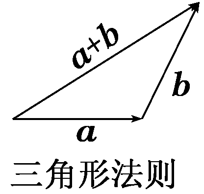

首尾相接

指向终点
</td><td>
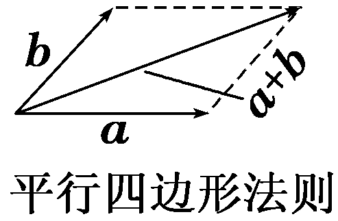

起点重合

指向对顶点
</td><td>
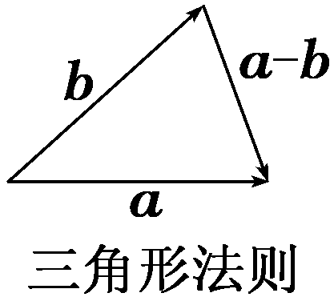

起点重合

指向被减向量
</td><td>
(1)|<em>λ</em><strong><em>a</em></strong>|＝|<em>λ</em>||<strong><em>a</em></strong>|，

(2)当<em>λ</em>＞0时，

<em>λ</em><strong><em>a</em></strong>与<strong><em>a</em></strong>的方向相同；

当<em>λ</em>＜0时，

<em>λ</em><strong><em>a</em></strong>与<strong><em>a</em></strong>的方向相反；

当<em>λ</em>＝0时，<em>λ</em><strong><em>a</em></strong>＝0
</td></tr><tr><td>
坐标表示

<strong><em>a</em></strong>＝(<em>x</em>1，<em>y</em>1)

<strong><em>b</em></strong>＝(<em>x</em>2，<em>y</em>2)
</td><td colspan="2">
<strong><em>a</em></strong>＋<strong><em>b</em></strong>＝(<em>x</em>1＋<em>x</em>2，<em>y</em>1＋<em>y</em>2)
</td><td>
<strong><em>a</em></strong>－<strong><em>b</em></strong>＝(<em>x</em>1－<em>x</em>2，<em>y</em>1－<em>y</em>2)
</td><td>
<em>λ</em><strong><em>a</em></strong>＝(<em>λx</em>1，<em>λy</em>1)
</td></tr></table>

2．多边形法则

一般地，首尾顺次相接的多个向量的和等于从第一个向量起点指向最后一个向量终点的向量，即＋＋＋…＋<em>An</em>－1<em>An</em>＝，特别地，一个封闭图形，首尾连接而成的向量和为零向量．

3．平面向量基本定理

定理：如果<em><strong>e</strong></em>1，<em><strong>e</strong></em>2是同一平面内的两个不共线向量，那么对于这一平面内的任意向量<em><strong>a</strong></em>，存在唯一的一对实数<em>λ</em>1，<em>λ</em>2，使<em><strong>a</strong></em>＝<em>λ</em>1<em><strong>e</strong></em>1＋<em>λ</em>2<em><strong>e</strong></em>2，其中，不共线的向量<em><strong>e</strong></em>1，<em><strong>e</strong></em>2叫作表示这一平面内所有向量的一组基底，记为{<em><strong>e</strong></em>1，<em><strong>e</strong></em>2}．

4．“爪”子定理

形式1：在△*ABC*中，*D*是*BC*上的点，如果|*BD*|＝*m*，|*DC*|＝*n*，则＝＋，其中，，知二可求一．特别地，若*D*为线段*BC*的中点，则＝(＋)．

形式2：在△*ABC*中，*D*是*BC*上的点，且＝λ，则＝λ＋(1－λ)，其中，，知二可求一．特别地，若*D*为线段*BC*的中点，则＝(＋)．

形式1与形式2中与的系数的记忆可总结为：对面的女孩看过来(歌名，原唱任贤齐)

**考点一　向量的线性运算**

【**方法总结**】

利用平面向量的线性运算把一个向量表示为两个基向量的一般方法

向量＝*f*(，)的确定方法

(1)在几何图形中通过三点共线即可考虑使用“爪”子定理完成向量用，的表示．

(2)若所给图形比较特殊(正方形、矩形、直角梯形、等边三角形、等腰三角形或直角三角形等)，则可通过建系将向量坐标化，从而得到＝*f*(，)与＝*g*(，)的方程组，再进行求解．

**【例题选讲】**

<strong>[例1]</strong>(1)(2015·全国Ⅰ)设<em>D</em>为△<em>ABC</em>所在平面内一点，＝3，则(　　)

A．＝－＋　　　　　　　　　　B．＝－

C．＝＋　　　　　　　　　　　D．＝－

答案　A　解析　＝＋＝＋＝＋(－)＝－＝－＋，故选A．

(2) (2014·全国Ⅰ)设*D*，*E*，*F*分别为△*ABC*的三边*BC*，*CA*，*AB*的中点，则＋＝(　　)

A．　　　　　　B．　　　　　　C．　　　　　　D．

答案　A　解析　＋＝(＋)＋(＋)＝(＋)＝，故选A．

(3) (2018·全国Ⅰ)在△*ABC*中，*AD*为*BC*边上的中线，*E*为*AD*的中点，则＝(　　)

A．－　　　　B．－　　　　C．＋　　　　D．＋

答案　A　解析　∵*E*是*AD*的中点，∴＝－，∴＝＋＝－＋，又知*D*是*BC*的中点，∴＝(＋)，因此＝－(＋)＋＝－．

(4)如图，在△*ABC*中，点*D*在*BC*边上，且*CD*＝2*DB*，点*E*在*AD*边上，且*AD*＝3*AE*，则用向量，表示为(　　)

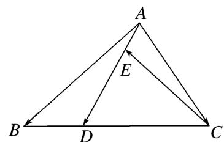

A．＋　　　　　B．－　　　　　C．＋　　　　　D．－

答案　B　解析　由平面向量的三角形法则及向量共线的性质可得＝－＝－＝(＋)－＝－＝－．

(5)如图所示，下列结论正确的是(　　)

①＝***a***＋***b***；②＝***a***－***b***；③＝***a***－***b***；④＝***a***＋***b***．

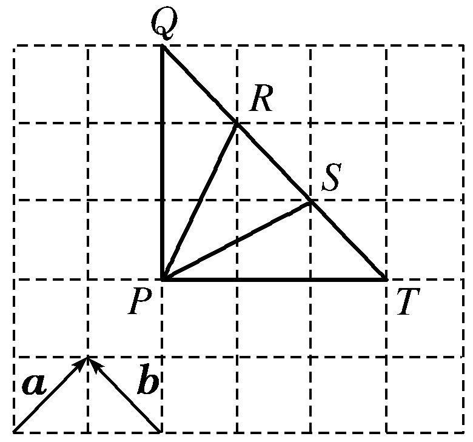

A．①②　　　　　　　　B．③④　　　　　　　　C．①③　　　　　　　　D．②④

答案　C　解析　①根据向量的加法法则，得＝***a***＋***b***，故①正确；②根据向量的减法法则，得＝***a***－***b***，故②错误；③＝＋＝***a***＋***b***－2***b***＝***a***－***b***，故③正确；④＝＋＝***a***＋***b***－***b***＝***a***＋***b***，故④错误，故选C．

(6)如图所示，在△<em>ABO</em>中，＝，＝，<em>AD</em>与<em>BC</em>相交于<em>M</em>，设＝<em><strong>a</strong></em>，＝<em><strong>b．</strong></em>则用<em><strong>a</strong></em>和<em><strong>b</strong></em>表示向量＝\_\_\_\_\_\_\_\_\_\_\_．

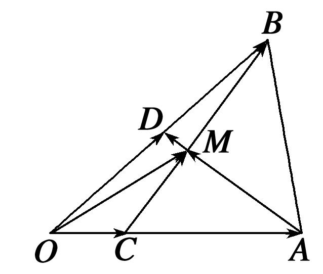

答案　＝<em><strong>a</strong></em>＋<em><strong>b</strong></em>　解析　设＝<em>m<strong>a</strong></em>＋<em>n<strong>b</strong></em>，则＝－＝<em>m<strong>a</strong></em>＋<em>n<strong>b</strong></em>－<em><strong>a</strong></em>＝(<em>m</em>－1)<em><strong>a</strong></em>＋<em>n<strong>b</strong></em>．＝－＝－＝－<em><strong>a</strong></em>＋<em><strong>b</strong></em>．又∵<em>A</em>、<em>M</em>、<em>D</em>三点共线，∴与共线．∴存在实数<em>t</em>，使得＝<em>t</em>，即(<em>m</em>－1)<em><strong>a</strong></em>＋<em>n<strong>b</strong></em>＝<em>t</em>．∴(<em>m</em>－1)<em><strong>a</strong></em>＋<em>n<strong>b</strong></em>＝－<em>t<strong>a</strong></em>＋<em>t<strong>b</strong></em>．∴消去<em>t</em>得，<em>m</em>－1＝－2<em>n</em>，即<em>m</em>＋2<em>n</em>＝1．①．又∵＝－＝<em>m<strong>a</strong></em>＋<em>n<strong>b</strong></em>－<em><strong>a</strong></em>＝<em><strong>a</strong></em>＋<em>n<strong>b</strong></em>，＝－＝<em><strong>b</strong></em>－<em><strong>a</strong></em>＝－<em><strong>a</strong></em>＋<em><strong>b</strong></em>．又∵<em>C</em>、<em>M</em>、<em>B</em>三点共线，∴与共线．∴存在实数<em>t</em>1，使得＝<em>t</em>1，∴<em><strong>a</strong></em>＋<em>n<strong>b</strong></em>＝<em>t</em>1，∴消去<em>t</em>1得，4<em>m</em>＋<em>n</em>＝1，②．由①②得<em>m</em>＝，<em>n</em>＝，∴＝<em><strong>a</strong></em>＋<em><strong>b</strong></em>．

另解　因为<em>A</em>，<em>M</em>，<em>D</em>三点共线，所以＝<em>λ</em>1＋(1－<em>λ</em>1)＝<em>λ</em>1<em><strong>b</strong></em>＋(1－<em>λ</em>1)<em><strong>a</strong></em>，①，因为<em>C</em>，<em>M</em>，<em>B</em>三点共线，所以＝<em>λ</em>2＋(1－<em>λ</em>2)＝<em>λ</em>2<em><strong>b</strong></em>＋()<em><strong>a</strong></em>，②，由①②可得解得故＝<em><strong>a</strong></em>＋<em><strong>b</strong></em>．

(7)在平行四边形<em>ABCD</em>中，<em>AC</em>与<em>BD</em>相交于点<em>O</em>，点<em>E</em>是线段<em>OD</em>的中点，<em>AE</em>的延长线与<em>CD</em>交于点<em>F</em>，若＝<em><strong>a</strong></em>，＝<em><strong>b</strong></em>，则＝(　　)

A．***a***＋***b***　　　　　B．***a***＋***b***　　　　　C．***a***＋***b***　　　　　D．***a***＋***b***

答案　B　解析　如图，根据题意，得＝＋＝(<em><strong>a</strong></em>－<em><strong>b</strong></em>)，＝＋＝(<em><strong>a</strong></em>＋<em><strong>b</strong></em>)．令＝<em>t</em>，则＝<em>t</em>(＋)＝<em>t</em>＝<em><strong>a</strong></em>＋<em><strong>b</strong></em>．由＝＋，令＝<em>s</em>，又＝(<em><strong>a</strong></em>＋<em><strong>b</strong></em>)，＝<em><strong>a</strong></em>－<em><strong>b</strong></em>，所以＝<em><strong>a</strong></em>＋<em><strong>b</strong></em>，所以解方程组得把<em>s</em>代入即可得到＝<em><strong>a</strong></em>＋<em><strong>b</strong></em>，故选B．

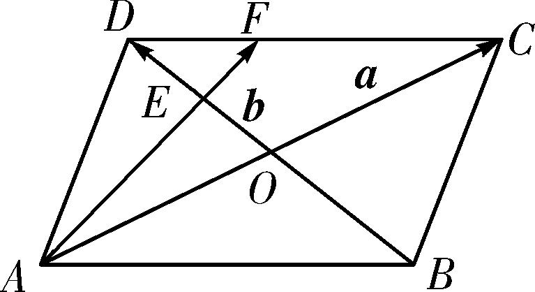

另解　如图，＝＋，由题意知，<em>DE</em>∶<em>BE</em>＝1∶3＝<em>DF</em>∶<em>AB</em>，故＝，则＝<em><strong>a</strong></em>＋<em><strong>b</strong></em>＋ (<em><strong>a－b</strong></em>)＝<em><strong>a</strong></em>＋<em><strong>b</strong></em>．

(8)在平行四边形<em>ABCD</em>中，<em>E</em>，<em>F</em>分别是<em>BC</em>，<em>CD</em>的中点，<em>D</em>E交<em>AF</em>于<em>H</em>，记，分别为<em><strong>a</strong></em>，<em><strong>b</strong></em>，则＝(　　)

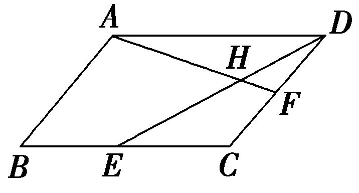

A．***a***－***b***　　　　　B．***a***＋***b***　　　　　C．－***a***＋***b***　　　　　D．－***a***－***b***

答案　B　解析　如图，过点<em>F</em>作<em>BC</em>的平行线交<em>DE</em>于<em>G</em>，则<em>G</em>是<em>DE</em>的中点，且＝＝，∴＝，易知△<em>AHD</em>∽△<em>FHG</em>，从而＝，∴＝，＝＋＝<em><strong>b</strong></em>＋<em><strong>a</strong></em>，∴＝＝<em><strong>a</strong></em>＋<em><strong>b</strong></em>，故选B．

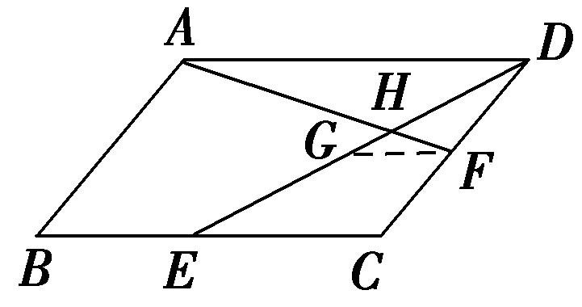

(9)如图，在直角梯形*ABCD*中，*AB*＝2*AD*＝2*DC*，*E*为*BC*边上一点，＝3，*F*为*AE*的中点，则＝(　　)

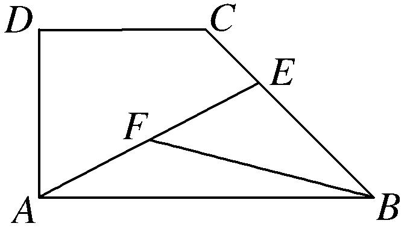

A．－　　B．－　　C．－＋　　D．－＋

答案　C　解析　＝＋＝＋＝－＋(＋＋)＝－＋(＋＋)＝－＋＋＋(＋＋)＝－＋．

(10)如图，已知<em>AB</em>是圆<em>O</em>的直径，点<em>C</em>，<em>D</em>是半圆弧的两个三等分点，＝<em><strong>a</strong></em>，＝<em><strong>b</strong></em>，则等于(　　)

A．***a***－***b***　　　　　　　B．***a***－***b***　　　　　　　C．***a***＋***b***　　　　　　　D．***a***＋***b***

答案　D　解析　连接<em>CD</em>，由点<em>C</em>，<em>D</em>是半圆弧的三等分点，得<em>CD</em>∥<em>AB</em>且＝＝<em><strong>a</strong></em>，所以＝＋＝<em><strong>b</strong></em>＋<em><strong>a</strong></em>．

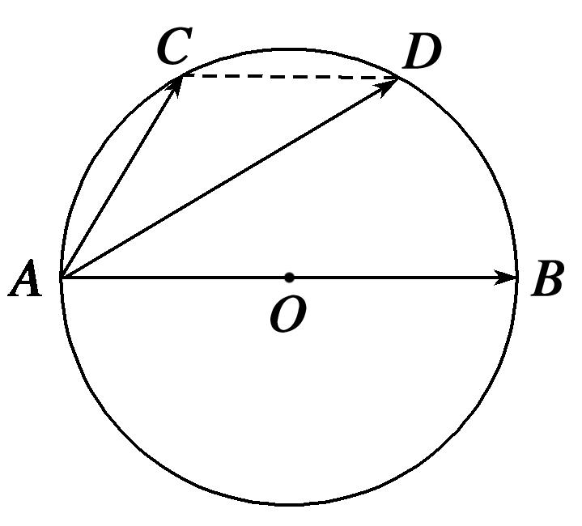

【**对点训练**】

1．已知*O*，*A*，*B*是平面上的三个点，直线*AB*上有一点*C*，满足2＋＝0，则等于(　　)

A．2－　　　　B．－＋2　　　　C．－　　　　D．－＋

1．答案　A　解析　由2＋＝0得2－2＋－＝0，故＝2－．

2．如图，在△*ABC*中，点*D*是*BC*边上靠近*B*的三等分点，则等于(　　)

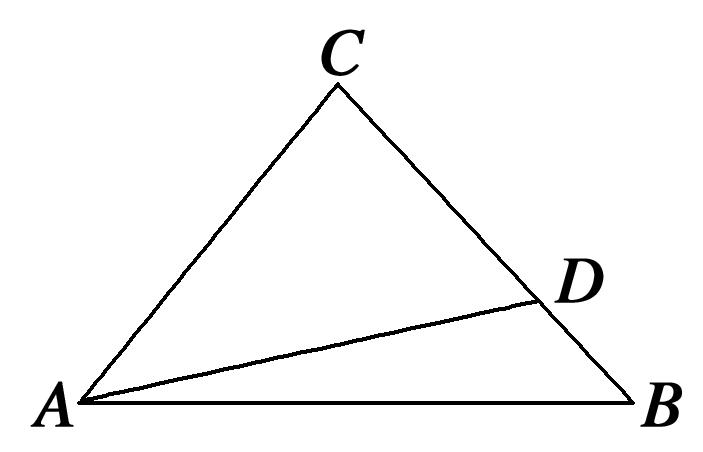

A．－　　　　B．＋　　　　C．＋　　　　D．－

2．答案　C　解析　由平面向量的三角形法则，得＝＋．又因为点*D*是*BC*边上靠近*B*的三等分

点，所以＝＋＝＋(－)＝＋．

3．在△<em>ABC</em>中，＝<em><strong>c</strong></em>，＝<em><strong>b</strong></em>，若点<em>D</em>满足＝2，若将<em><strong>b</strong></em>与<em><strong>c</strong></em>作为基底，则等于(　　)

A．***b***＋***c***　　　　　　B．***c***－***b***　　　　　　C．***b***－***c***　　　　　　D．***b***＋***c***

3．答案　A　解析　∵＝2，∴－＝2(－)，∴－***c***＝2(***b***－)，∴＝***c***＋***b***．

4．如图所示，在△*ABC*中，若＝3，则＝(　　)

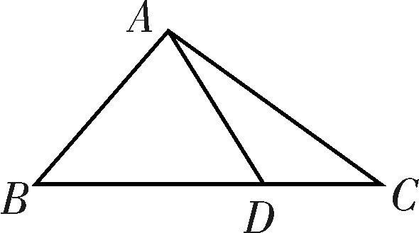

A．＋　　　　B．－　　　　C．＋　　　　D．－

4．答案　C　解析　＝－＝－＝(－)＋＝＋．故选C．

5．设*D*，*E*，*F*分别为△*ABC*三边*BC*，*CA*，*AB*的中点，则＋2＋3＝(　　)

A．　　　　　　B．　　　　　　C．　　　　　　D．

5．答案　D　解析　因为*D*，*E*，*F*分别为△*ABC*三边*BC*，*CA*，*AB*的中点，所以＋2＋3＝(

＋)＋2×(＋)＋3××(＋)＝＋＋＋＋＋＝＋＋＝＋＝．

6．已知点*M*是△*ABC*的边*BC*的中点，点*E*在边*AC*上，且＝2，则＝(　　)

A．＋　　　B．＋　　　C．＋　　　D．＋

6．答案　C　解析　如图，∵＝2，∴＝＋＝＋＝＋(－)＝＋．

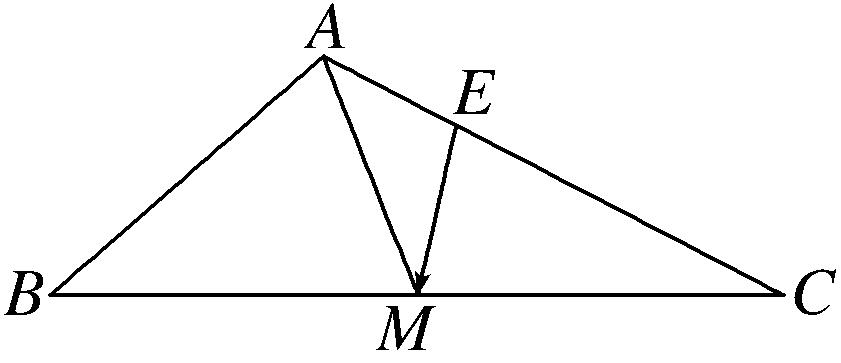

7．在△<em>ABC</em>中，<em>P</em>，<em>Q</em>分别是边<em>AB</em>，<em>BC</em>上的点，且<em>AP</em>＝<em>AB</em>，<em>BQ</em>＝<em>BC．</em>若＝<em><strong>a</strong></em>，＝<em><strong>b</strong></em>，则

＝(　　)

A．***a***＋***b***　　　　　　B．－***a***＋***b***　　　　　　C．***a***－***b***　　　　　　D．－***a***－***b***

7．答案　A　解析　＝＋＝＋＝＋(－)＝＋＝***a***＋***b***，故选A．

8．已知<em>D</em>，<em>E</em>，<em>F</em>分别为△<em>ABC</em>的边<em>BC</em>，<em>CA</em>，<em>AB</em>的中点，且＝<em><strong>a</strong></em>，＝<em><strong>b</strong></em>，给出下列命题：①＝

<em><strong>a</strong></em>－<em><strong>b</strong></em>；②＝<em><strong>a</strong></em>＋<em><strong>b</strong></em>；③＝－<em><strong>a</strong></em>＋<em><strong>b</strong></em>；④＋＋＝<strong>0</strong>．

其中正确命题的序号为\_\_\_\_\_\_\_\_．

8．答案　②③④　解析　＝***a***，＝***b***，＝＋＝－***a***－***b***，＝＋＝***a***＋***b***，＝(

＋)＝(－<em><strong>a</strong></em>＋<em><strong>b</strong></em>)＝－<em><strong>a</strong></em>＋<em><strong>b</strong></em>，所以＋＋＝－<em><strong>b</strong></em>－<em><strong>a</strong></em>＋<em><strong>a</strong></em>＋<em><strong>b</strong></em>＋<em><strong>b</strong></em>－<em><strong>a</strong></em>＝<strong>0</strong>．所以正确命题的序号为②③④．

9．(多选)在△*ABC*中，*D*，*E*，*F*分别是边*BC*，*CA*，*AB*的中点，*AD*，*BE*，*CF*交于点*G*，则(　　)

A．＝－　　B．＝－＋　　C．＋＝　　D．＋＋＝**0**

9．答案　CD　解析　如图，因为点*D*，*E*，*F*分别是边*BC*，*CA*，*AB*的中点，所以＝＝－，

故A不正确；＝＋＝＋＝＋(＋)＝－－＝－＋，故B不正确；＝－＝＋＋＝＋＋＝＋＋＝＋＋＋＝＋，故C正确；由题意知，点<em>G</em>为△<em>ABC</em>的重心，所以＋＋＝＋＋＝×(＋)＋×(＋)＋×(＋)＝<strong>0</strong>，即＋＋＝<strong>0</strong>，故D正确．故选CD．

10．如图所示，在△<em>ABC</em>中，<em>D</em>，<em>F</em>分别是<em>AB</em>，<em>AC</em>的中点，<em>BF</em>与<em>CD</em>交于点<em>O</em>，设＝<em><strong>a</strong></em>，＝<em><strong>b</strong></em>，则用

***a***，***b***表示向量为\_\_\_\_\_\_\_\_\_\_\_\_．

10．答案　＝(<em><strong>a</strong></em>＋<em><strong>b</strong></em>)　解析　由<em>D</em>，<em>O</em>，<em>C</em>三点共线，可设＝<em>k</em>1＝<em>k</em>1(－)＝<em>k</em>1＝－<em>k</em>1<em><strong>a</strong></em>

＋<em>k</em>1<em><strong>b</strong></em>(<em>k</em>1为实数)，同理，可设＝<em>k</em>2＝<em>k</em>2(－)＝<em>k</em>2＝－<em>k</em>2<em><strong>a</strong></em>＋<em>k</em>2<em><strong>b</strong></em>(<em>k</em>2为实数)，①，又＝＋＝－<em><strong>a</strong></em>＋＝－(1＋<em>k</em>1)<em><strong>a</strong></em>＋<em>k</em>1<em><strong>b</strong></em>，②，所以由①②，得－<em>k</em>2<em><strong>a</strong></em>＋<em>k</em>2<em><strong>b</strong></em>＝－(1＋<em>k</em>1)<em><strong>a</strong></em>＋<em>k</em>1<em><strong>b</strong></em>，即(1＋<em>k</em>1－2<em>k</em>2)<em><strong>a</strong></em>＋<em><strong>b</strong></em>＝<strong>0</strong>．又<em><strong>a</strong></em>，<em><strong>b</strong></em>不共线，所以解得所以＝－<em><strong>a</strong></em>＋<em><strong>b</strong></em>．所以＝＋＝<em><strong>a</strong></em>＋＝(<em><strong>a</strong></em>＋<em><strong>b</strong></em>)．

另解　因为<em>B</em>，<em>O</em>，<em>F</em>三点共线，所以＝<em>λ</em>1＋(1－<em>λ</em>1)＝<em>λ</em>1<em><strong>a</strong></em>＋(1－<em>λ</em>1)<em><strong>b</strong></em>，①，因为<em>D</em>，<em>O</em>，<em>C</em>三

点共线，所以＝<em>λ</em>2＋(1－<em>λ</em>2)＝<em>λ</em>2<em><strong>b</strong></em>＋(1－<em>λ</em>2)<em><strong>a</strong></em>，②，由①②可得解得

故＝(***a***＋***b***)．

11．如图，正方形*ABCD*中，点*E*是*DC*的中点，点*F*是*BC*的一个三等分点，那么等于(　　)

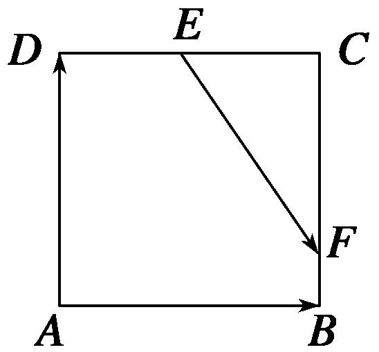

A．－　　　　B．＋　　　　C．＋　　　　D．－

11．答案　D　解析　在△*CEF*中，有＝＋．因为点*E*为*DC*的中点，所以＝．因为点*F*

为*BC*的一个三等分点，所以＝．所以＝＋＝＋＝－，故选D．

12．如图，在平行四边形<em>ABCD</em>中，<em>E</em>为<em>DC</em>边的中点，且＝<em><strong>a</strong></em>，＝<em><strong>b</strong></em>，则＝(　　)

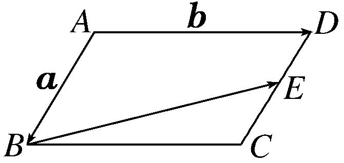

A．***b***－***a***　　　　　　B．***a***－***b***　　　　　　C．－***a***＋***b***　　　　　　D．***b***＋***a***

12．答案　C　解析　＝＋＋＝－***a***＋***b***＋***a***＝***b***－***a***，故选C．

13．在平行四边形<em>ABCD</em>中，＝<em><strong>a</strong></em>，＝<em><strong>b</strong></em>，＝3，<em>M</em>为<em>BC</em>的中点，则＝\_\_\_\_\_\_\_\_\_\_\_\_．(用

***a***，***b***表示)

13．答案　－***a***＋***b***　解析　由＝3得，＝＝(***a***＋***b***)，＝***a***＋***b***，所以＝－＝(***a***

＋***b***)－＝－***a***＋***b***．

14．在平行四边形<em>ABCD</em>中，＝<em><strong>e</strong></em>1，＝<em><strong>e</strong></em>2，＝，＝，则＝\_\_\_\_\_\_\_\_\_．(用<em><strong>e</strong></em>1，<em><strong>e</strong></em>2表

示)

14．答案　－<em><strong>e</strong></em>1＋<em><strong>e</strong></em>2　　解析　如图，＝－＝＋2＝＋＝－＋(－)＝－<em><strong>e</strong></em>2

＋(<em><strong>e</strong></em>2－<em><strong>e</strong></em>1)＝－<em><strong>e</strong></em>1＋<em><strong>e</strong></em>2．

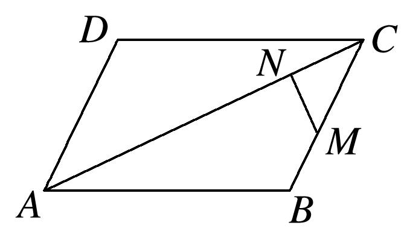

15．在平行四边形<em>ABCD</em>中，<em>E</em>，<em>F</em>分别是<em>BC</em>，<em>CD</em>的中点，<em>DE</em>交<em>AF</em>于<em>H</em>，记，分别为<em><strong>a</strong></em>，<em><strong>b</strong></em>，则

＝(　　)

A．***a***－***b***　　　　　B．***a***＋***b***　　　　　C．－***a***＋***b***　　　　　D．－***a***－***b***

15．答案　B　解析　设＝<em>λ</em>，＝<em>μ</em>．而＝＋＝－<em><strong>b</strong></em>＋<em>λ</em>＝－<em><strong>b</strong></em>＋<em>λ</em>，＝<em>μ</em>＝

<em>μ</em>．因此，<em>μ</em>＝－<em><strong>b</strong></em>＋<em>λ</em>．由于<em><strong>a</strong></em>，<em><strong>b</strong></em>不共线，因此由平面向量的基本定理，得解之得<em>λ</em>＝，<em>μ</em>＝．故＝<em>λ</em>＝<em>λ</em>＝<em><strong>a</strong></em>＋<em><strong>b</strong></em>．

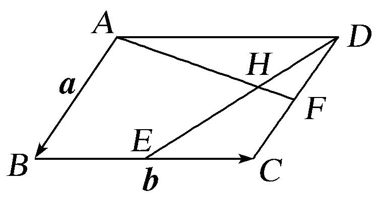

16．在梯形*ABCD*中，＝3，则＝(　　)

A．－＋　　B．－＋　　C．－＋　　D．－－

16．答案　A　解析　因为在梯形*ABCD*中，＝3，所以＝＋＋＝－＋＋＝－

＋，故选A．

**考点二　根据向量线性运算求参数**

【**方法总结**】

利用平面向量的线性运算求参数的一般方法

向量方程＝*x*＋*y*中*x*，*y*的确定方法

(1)在几何图形中通过三点共线即可考虑使用“爪”子定理完成向量的表示，进而确定*x*，*y*．

(2)若所给图形比较特殊(正方形、矩形、直角梯形、等边三角形、等腰三角形或直角三角形等)，则可通过建系将向量坐标化，从而得到关于*x*，*y*的方程组，再进行求解．

(3)若题目中某些向量的数量积已知，则对于向量方程＝*x*＋*y*，可考虑两边对同一向量作数量积运算，从而得到关于于*x*，*y*的方程组，再进行求解．

(4)对于求*x*＋*y*的值的有关问题可考虑平面向量的等和线定理法，见《平面向量特训之满分必杀篇》第一讲平面向量的等和线．

**【例题选讲】**

<strong>[例1]</strong>(1)如图，在△<em>OAB</em>中，<em>P</em>为线段<em>AB</em>上的一点，＝<em>x</em>＋<em>y</em>，且＝2，则(　　)

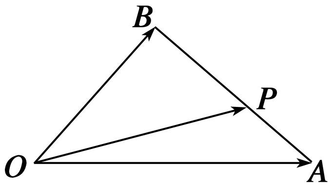

A．*x*＝，*y*＝　　　　B．*x*＝，*y*＝　　　　C．*x*＝，*y*＝　　　　D．*x*＝，*y*＝

答案　A　解析　由题意知＝＋，又＝2，所以＝＋＝＋(－)＝＋，所以*x*＝，*y*＝．

(2)(2013·江苏)设<em>D</em>，<em>E</em>分别是△<em>ABC</em>的边<em>AB</em>，<em>BC</em>上的点，<em>AD</em>＝<em>AB</em>，<em>BE</em>＝<em>BC</em>．若＝<em>λ</em>1＋<em>λ</em>2(<em>λ</em>1，<em>λ</em>2为实数)，则<em>λ</em>1＋<em>λ</em>2的值为\_\_\_\_\_\_\_\_．

答案　　解析　由题意，得＝＋＝＋＝＋(－)＝－＋，则<em>λ</em>1＝－，<em>λ</em>2＝，即<em>λ</em>1＋<em>λ</em>2＝．

(3)如图，在△*ABC*中，点*D*在线段*BC*上，且满足*BD*＝*DC*，过点*D*的直线分别交直线*AB*，*AC*于不同的两点*M*，*N*，若＝*m*，＝*n*，则(　　)

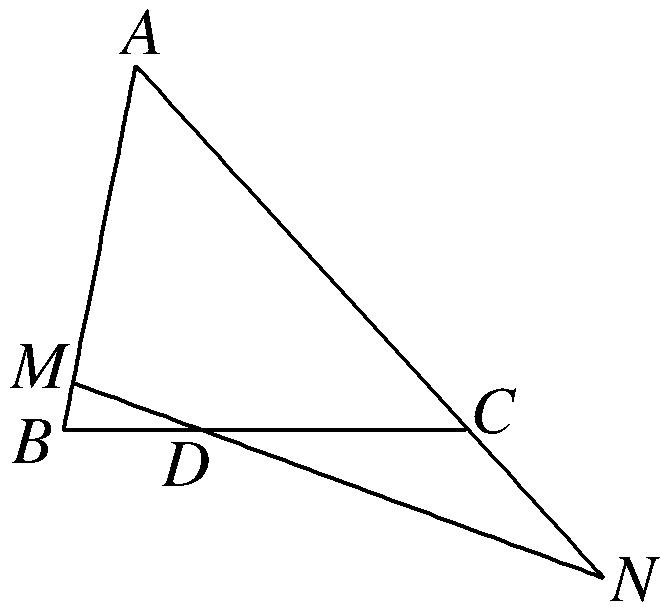

A．*m*＋*n*是定值，定值为2　　　　　　　　　　B．2*m*＋*n*是定值，定值为3

C．＋是定值，定值为2　　　　　　　　　　D．＋是定值，定值为3

答案　D　解析　法一：如图，过点*C*作*CE*平行于*MN*交*AB*于点*E*．由＝*n*可得＝，所以＝＝，由*BD*＝*DC*可得＝，所以＝＝，因为＝*m*，所以*m*＝，整理可得＋＝3．故选D．

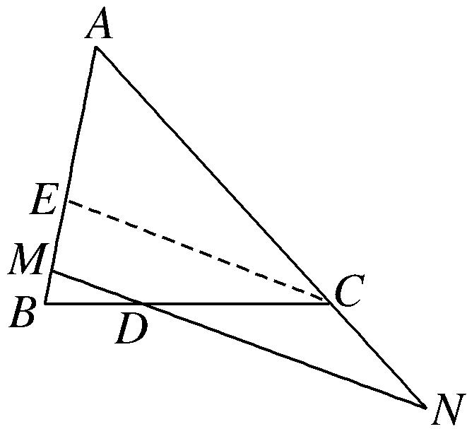

法二：因为*M*，*D*，*N*三点共线，所以＝*λ*＋(1－*λ*)·．又＝*m*，＝*n*，所以＝*λm*＋(1－*λ*)·*n*．又＝，所以－＝－，所以＝＋．比较系数知*λm*＝，(1－*λ*)*n*＝，所以＋＝3，故选D．

(4)如图，在△*ABC*中，＝，＝，若＝*λ*＋*μ*，则*λ*＋*μ*的值为(　　)

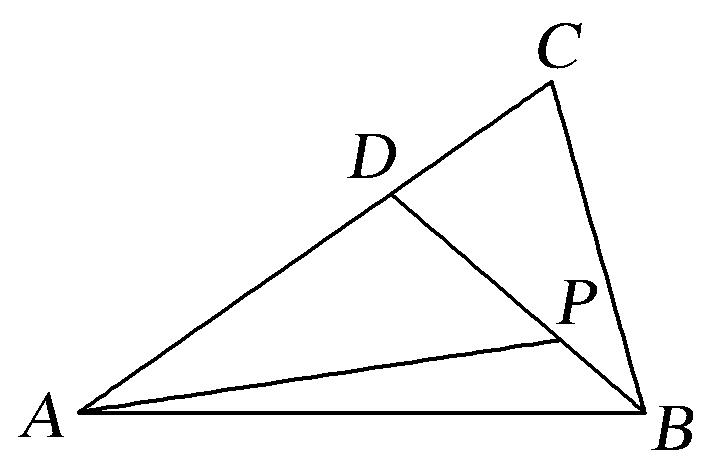

A．　　　　　　　　B．　　　　　　　　C．　　　　　　　　D．

答案　A　解析　＝＋＝＋＝＋(－)＝＋×＝＋．因为＝*λ*＋*μ*，所以*λ*＝，*μ*＝，则*λ*＋*μ*＝＋＝．

(5)已知在Rt△<em>ABC</em>中，∠<em>BAC</em>＝90°，<em>AB</em>＝1，<em>AC</em>＝2，<em>D</em>是△<em>ABC</em>内一点，且∠<em>DAB</em>＝60°，设＝<em>λ</em>＋<em>μ</em>(<em>λ</em>，<em>μ</em>∈<strong>R</strong>)，则＝(　　)

A．　　　　　　　　B．　　　　　　　　C．3　　　　　　　　D．2

答案　A　解析　如图，以*A*为原点，*AB*所在直线为*x*轴，*AC*所在直线为*y*轴建立平面直角坐标系，则*B*点的坐标为(1，0)，*C*点的坐标为(0，2)，因为∠*DAB*＝60°，所以设*D*点的坐标为(*m*，*m*)(*m*≠0)．＝(*m*，*m*)＝*λ*＋*μ*＝*λ*(1，0)＋*μ*(0，2)＝(*λ*，2*μ*)，则*λ*＝*m*，且*μ*＝*m*，所以＝．

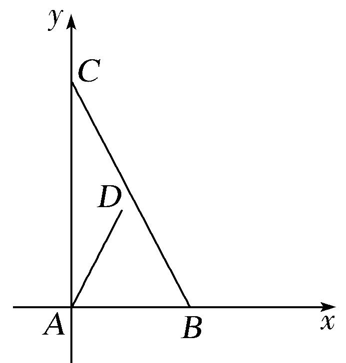

(6)如图，在△<em>ABC</em>中，设＝<em><strong>a</strong></em>，＝<em><strong>b</strong></em>，<em>AP</em>的中点为<em>Q</em>，<em>BQ</em>的中点为<em>R</em>，<em>CR</em>的中点为<em>P</em>，若＝<em>m<strong>a</strong></em>＋<em>nb</em>，则<em>m</em>＋<em>n</em>＝\_\_\_\_\_\_\_\_．

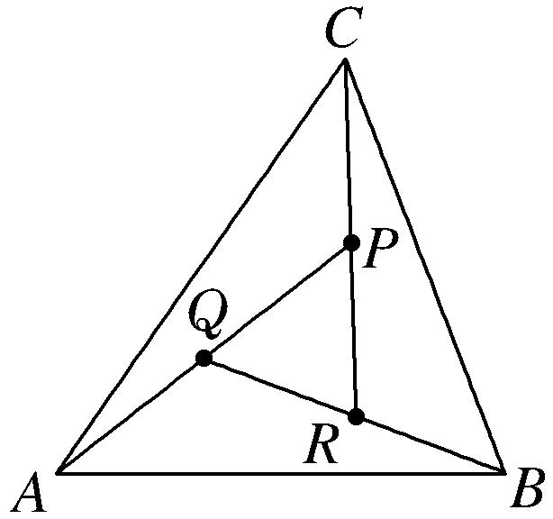

答案　　解析　根据已知条件得，＝－＝－＝(<em>m<strong>a</strong></em>＋<em>n<strong>b</strong></em>)－<em><strong>a</strong></em>＝<em><strong>a</strong></em>＋<em><strong>b</strong></em>，＝－＝－＋＝－<em><strong>b</strong></em>＋<em><strong>a</strong></em>＝<em><strong>a</strong></em>＋<em><strong>b</strong></em>，∴＝<em><strong>a</strong></em>＋<em><strong>b</strong></em>，＝<em><strong>a</strong></em>＋<em><strong>b</strong></em>，＝－<em><strong>a</strong></em>＋b．∵＋＝，∴<em><strong>a</strong></em>＋<em><strong>b</strong></em>＝<em><strong>a</strong></em>＋<em><strong>b</strong></em>，∴解得故<em>m</em>＋<em>n</em>＝．

(7)如图所示，点<em>P</em>在矩形<em>ABCD</em>内，且满足∠<em>DAP</em>＝30°，若||＝1，||＝，＝<em>m</em>＋<em>n</em>(<em>m</em>，<em>n</em>∈<strong>R</strong>)，则等于(　　)

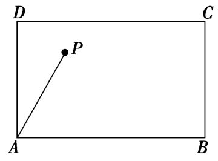

A．　　　　　　　　B．3　　　　　　　　C．　　　　　　　　D．

答案　B　解析　如图，过点*P*作*P*E⊥*AB*于点E，作*PF*⊥*AD*于点*F*，则结合图形及题设得＝＋＝*m*＋*n*，所以可得||＝*m*，||＝||＝*n*．又∠*DAP*＝30°，在Rt△*APF*中，t*a*n∠*FAP*＝t*a*n 30°＝＝，则＝，化简得＝3．故选B．

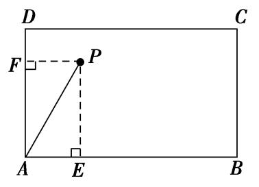

优解：如图所示，假设点*P*在矩形的对角线*BD*上，由题意易知||＝2，∠*ADB*＝60°，又∠*DAP*＝30°，所以∠*DPA*＝90°．由||＝1，可得||＝＝||，从而可得＝＋＝＋＝＋(－)＝＋．又＝*m*＋n，所以*m*＝，*n*＝，则＝3．故选B．

(8)在平行四边形<em>ABCD</em>中，点<em>E</em>和<em>F</em>分别是边<em>CD</em>和<em>BC</em>的中点．若＝<em>λ</em>＋<em>μ</em>，其中<em>λ</em>，<em>μ</em>∈<strong>R</strong>，则<em>λ</em>＋<em>μ</em>＝\_\_\_\_\_\_\_\_\_\_．

答案　　解析　选择，作为平面向量的一组基底，则＝＋，＝＋，＝＋，又＝*λ*＋*μ*＝＋，于是得即故*λ*＋*μ*＝．

(9)如图，在直角梯形*ABCD*中，＝，＝2，且＝*r*＋*s*，则2*r*＋3*s*＝(　　)

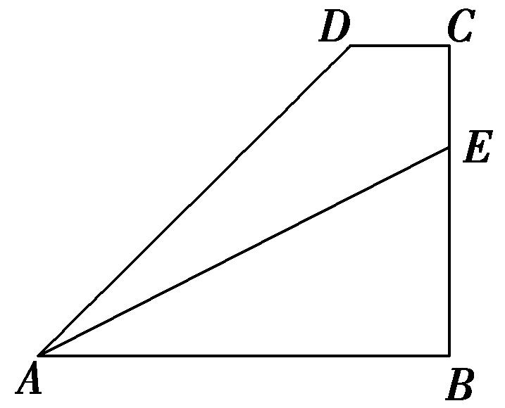

A．1　　　　　　　　B．2　　　　　　　　C．3　　　　　　　　D．4

答案　C　解析　根据图形，由题意可得＝＋＝＋＝＋(＋＋)＝＋(＋)＝＋＝＋．因为＝*r*＋*s*，所以*r*＝，*s*＝，则2*r*＋3*s*＝1＋2＝3，故选C．

优解：如图，建立平面直角坐标系*xAy*，依题意可设点*B*(4*m*，0)，*D*(3*m*，3*h*)，E(4*m*，2*h*)，其中*m*＞0，*h*＞0．

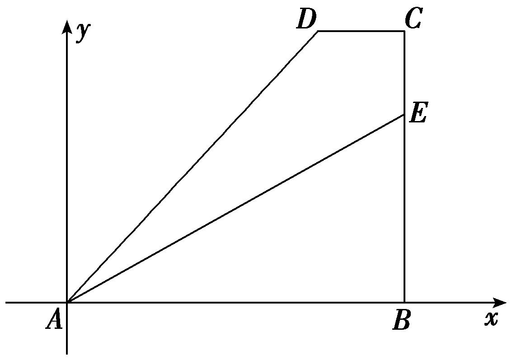

由＝*r*＋*s*，得(4*m*，2*h*)＝*r*(4*m*，0)＋*s*(3*m*，3*h*)，∴，解得∴2*r*＋3*s*＝3．

(10) (2017·江苏)如图，在同一个平面内，向量，，的模分别为1，1，，与的夹角为<em>α</em>，且tan <em>α</em>＝7，与的夹角为45°．若＝<em>m</em>＋<em>n</em>(<em>m</em>，<em>n</em>∈<strong>R</strong>)，则<em>m</em>＋<em>n</em>＝\_\_\_\_\_\_\_\_\_\_．

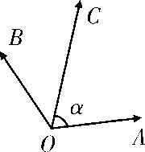

答案　3　解析　以<em>O</em>为坐标原点，<em>OA</em>所在直线为<em>x</em>轴建立平面直角坐标系，则<em>A</em>(1，0)，由tan <em>α</em>＝7，<em>α</em>∈，得sin<em>α</em>＝，cos<em>α</em>＝，设<em>C</em>(<em>xC</em>，<em>yC</em>)，<em>B</em>(<em>xB</em>，<em>yB</em>)，则<em>xC</em>＝||cos<em>α</em>＝×＝，<em>yC</em>＝||sin <em>α</em>＝×＝，即<em>C</em>．又cos(<em>α</em>＋45°)＝×－×＝－，sin(<em>α</em>＋45°)＝，则<em>xB</em>＝||cos(<em>α</em>＋45°)＝－，<em>yB</em>＝||sin(<em>α</em>＋45°)＝，即<em>B</em>，由＝<em>m</em>＋<em>n</em>，可得解得所以<em>m</em>＋<em>n</em>＝＋＝3．

【**对点训练**】

1．在△*ABC*中，已知*D*是*AB*边上一点，若＝2，＝＋*λ*，则*λ*＝\_\_\_\_\_\_\_\_．

1．答案　　解析　由图知＝＋，①．＝＋，②．且＋2＝0．①＋②×2得：3

＝＋2，∴＝＋，∴*λ*＝．

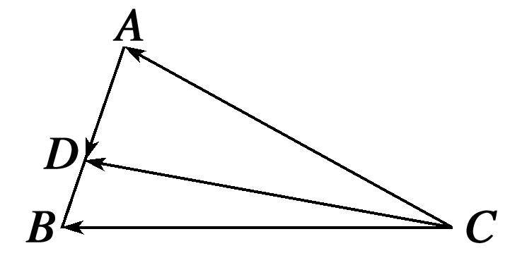

2．如图所示，在△<em>ABC</em>中，<em>D</em>为<em>BC</em>边上的一点，且<em>BD</em>＝2<em>DC</em>，若＝<em>m</em>＋<em>n</em>(<em>m</em>，<em>n</em>∈<strong>R</strong>)，则<em>m</em>－<em>n</em>

＝\_\_\_\_\_\_\_\_．

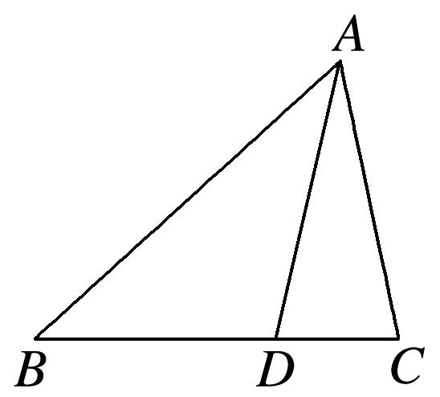

2．答案　－2　解析　由于*BD*＝2*DC*，则＝－3，其中＝－，＝－，那么＝－

3可转化为－＝－3(－)，可以得到－2＝－3＋，即＝－＋，则*m*＝－，*n*＝，那么*m*－*n*＝－－＝－2．

3．已知△*ABC*中，点*D*在*BC*边上，且＝2，＝*r*＋*s*，则*r*＋*s*的值是(　　)

A．　　　　　　　　　B．　　　　　　　　　C．－3　　　　　　　　　D．0

3．答案　D　解析　∵＝－，∴＝－－＝－－，∴＝－，∴＝

－．又＝*r*＋*s*，∴*r*＝，*s*＝－，∴*r*＋*s*＝0，故选D．

4．在锐角△<em>ABC</em>中，＝3，＝<em>x</em>＋<em>y</em>(<em>x</em>，<em>y</em>∈<strong>R</strong>)，则＝\_\_\_\_\_\_\_\_．

4．答案　3　解析　由题设可得＝－＝＋＝(－*A*)＋＝＋，则*x*＝，*y*

＝．故＝3．

5．在△*ABC*中，点*M*，*N*满足＝2，＝．若＝*x*＋*y*，则*x*＝\_\_\_\_\_\_\_\_，*y*＝\_\_\_\_\_\_．

5．答案　　－　解析　＝＋＝＋＝＋(－)＝－＝*x*＋*y*，∴*x*

＝，*y*＝－．

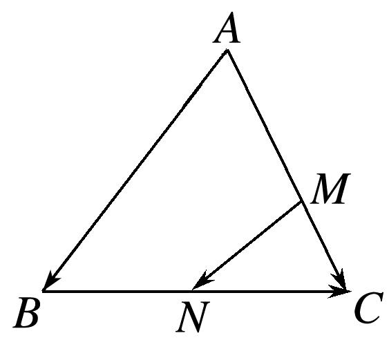

6．如图所示，在△*ABC*中，点*O*是*BC*的中点．过点*O*的直线分别交直线*AB*、*AC*于不同的两点*M*、*N*，

若＝*m*，＝*n*，则*m*＋*n*的值为\_\_\_\_\_\_\_\_．

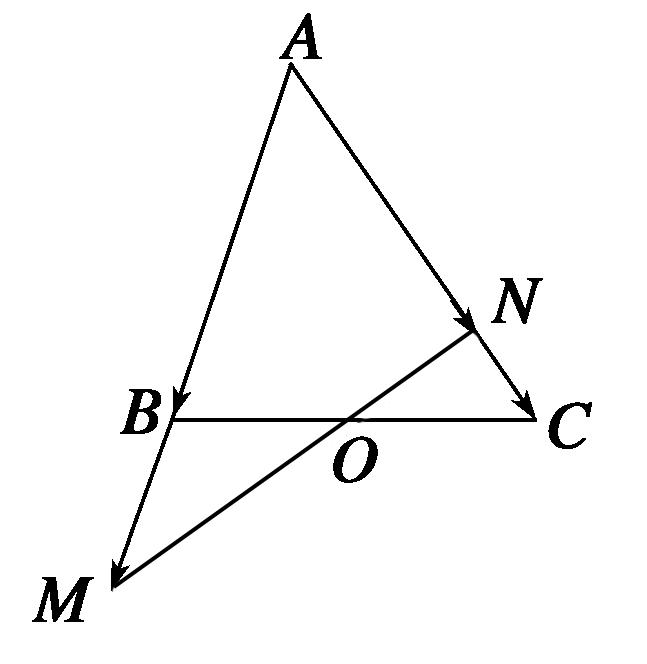

6．答案　2　解析　∵*O*是*BC*的中点，∴＝(＋)．又∵＝*m*，＝*n*，∴＝＋

．∵*M*，*O*，*N*三点共线，∴＋＝1．则*m*＋*n*＝2．

7．已知点*G*是△*ABC*的重心，过*G*作一条直线与*AB*，*AC*两边分别交于*M*，*N*两点，且＝*x*，

＝*y*，则的值为(　　)

A．　　　　　　　　B．　　　　　　　　C．2　　　　　　　　D．3

7．答案　B　解析　由已知得*M*，*G*，*N*三点共线，∴＝*λ*＋(1－*λ*)＝*λx*＋(1－*λ*)*y*．∵

点*G*是△*ABC*的重心，∴＝×(＋)＝·(＋)，∴即得＋＝1，即＋＝3，通分变形得，＝3，∴＝．

8．如图所示，<em>AD</em>是△<em>ABC</em>的中线，<em>O</em>是<em>AD</em>的中点，若＝<em>λ</em>＋<em>μ</em>，其中<em>λ</em>，<em>μ</em>∈<strong>R</strong>，则<em>λ</em>＋<em>μ</em>的值为

(　　)

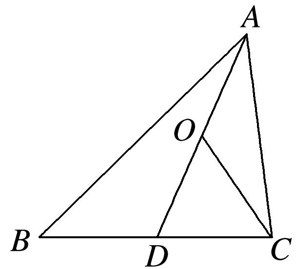

A．－　　　　　　　　B．　　　　　　　　C．－　　　　　　　　D．

8．答案　A　解析　由题意知，＝(＋)＝×＝(－)＋＝－，则*λ*＝

，*μ*＝－，故*λ*＋*μ*＝－．

9．如图，在△*ABC*中，＝，*P*是*BN*上的一点，若＝*m*＋，则实数*m*的值为\_\_\_\_\_\_\_\_．

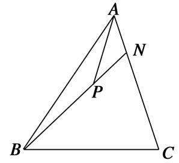

9．答案　　解析　设＝<em>k</em>，<em>k</em>∈<strong>R</strong>．因为＝＋＝＋<em>k</em>＝＋<em>k</em>(－)＝＋<em>k</em>(－)

＝(1－*k*)＋，且＝*m*＋，所以1－*k*＝*m*，＝，解得*k*＝，*m*＝．

10．在△*ABC*中，＝，若*P*是直线*BN*上的一点，且满足＝*m*＋，则实数*m*的值为(　　)

A．－4　　　　　　　　B．－1　　　　　　　　C．1　　　　　　　　D．4

10．答案　B　解析　根据题意设＝<em>n</em>(<em>n</em>∈<strong>R</strong>)，则＝＋＝＋<em>n</em>＝＋<em>n</em>(－)＝＋

*n*(－)＝(1－*n*)＋．又＝*m*＋，∴解得

11．在△*ABC*中，*M*为边*BC*上任意一点，*N*为*AM*的中点，＝*λ*＋*μ*，则*λ*＋*μ*的值为(　　)

A．　　　　　　　　B．　　　　　　　　C．　　　　　　　　D．1

11．答案　A　解析　设＝*t*，则＝＝(＋)＝＋＝＋＝＋(－)

＝＋，∴*λ*＝－，*μ*＝，∴*λ*＋*μ*＝，故选A．

12．在△*ABC*中，*AB*＝2，*BC*＝3，∠*ABC*＝60°，*AD*为*BC*边上的高，*O*为*AD*的中点，若＝*λ*＋*μ*，

则*λ*＋*μ*等于(　　)

A．1　　　　　　　　　B．　　　　　　　　　C．　　　　　　　　　D．

12．答案　D　解析　∵＝＋＝＋，∴2＝＋，即＝＋．故*λ*＋*μ*＝＋

＝．

13．在△*ABC*中，*D*为三角形所在平面内一点，且＝＋．延长*AD*交*BC*于*E*，若＝*λ*＋*μ*，

则*λ*－*μ*的值是\_\_\_\_\_\_\_\_．

13．答案　－　解析　设＝*x*，∵＝＋，∴＝＋．由于*E*，*B*，*C*三点共线，

∴＋＝1，*x*＝．根据平面向量基本定理，得*λ*＝，*μ*＝．因此*λ*－*μ*＝－＝－＝－．

14．如图，正方形*ABCD*中，*E*为*DC*的中点，若＝*λ*＋*μ*，则*λ*＋*μ*的值为(　　)

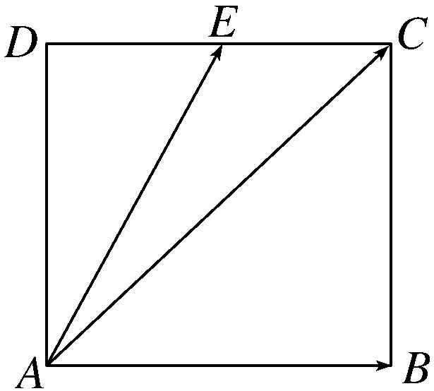

A．　　　　　　　　B．－　　　　　　　　C．1　　　　　　　　D．－1

14．答案　A　解析　由题意得＝＋＝＋－＝－，∴*λ*＝－，*μ*＝1，∴*λ*＋*μ*＝，

故选A．

15．如图所示，正方形*ABCD*中，*M*是*BC*的中点，若＝*λ*＋*μ*，则*λ*＋*μ*＝(　　)

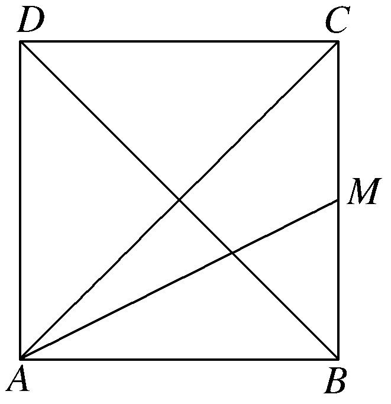

A．　　　　　　　　B．　　　　　　　　C．　　　　　　　　D．2

15．答案　B　解析　因为＝*λ*＋*μ*＝*λ*(＋)＋*μ*(＋)＝*λ* (＋)＋*μ*(－＋)＝(*λ*－

*μ*) ＋，且＝＋，所以得所以*λ*＋*μ*＝，故选B．

16．如图所示，矩形<em>ABCD</em>的对角线相交于点<em>O</em>，<em>E</em>为<em>AO</em>的中点，若＝<em>λ</em>＋<em>μ</em>(<em>λ</em>，<em>μ</em>为实数)，则<em>λ</em>2

＋<em>μ</em>2等于(　　)

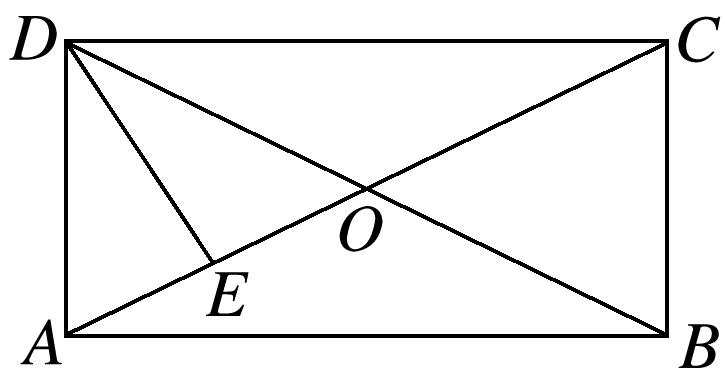

A．　　　　　　　　B．　　　　　　　　C．1　　　　　　　　D．

16．答案　A　解析　＝＋＝＋＝＋(＋)＝－，所以*λ*＝，*μ*＝－，

故<em>λ</em>2＋<em>μ</em>2＝，故选A．

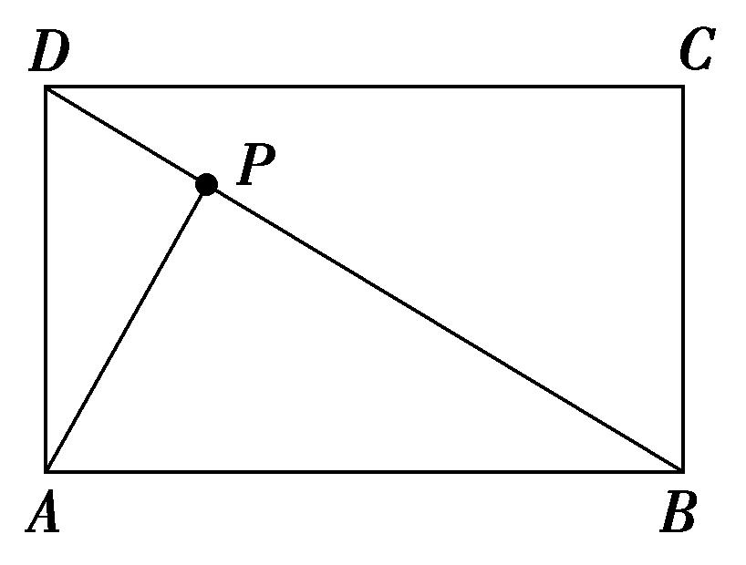

17．如图，直线*EF*与平行四边形*ABCD*的两边*AB*，*AD*分别交于*E*，*F*两点，且与对角线*AC*交于点*K*，

其中，＝，＝，＝*λ*，则*λ*的值为\_\_\_\_\_\_．

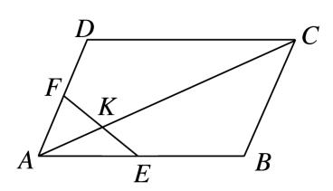

17．答案　　解析　∵＝，＝，∴＝，＝2．由向量加法的平行四边形法则可

知，＝＋，∴＝*λ*＝*λ*(＋)＝*λ*(＋2)＝*λ*＋2*λ*，∵*E*，*F*，*K*三点共线，∴*λ*＋2*λ*＝1，∴*λ*＝．

18．如图，在平行四边形*ABCD*中，*AC*，*BD*相交于点*O*，*E*为线段*AO*的中点．若＝*λ*＋*μ*(*λ*，*μ*

∈<strong>R</strong>)，则<em>λ</em>＋<em>μ</em>等于(　　)

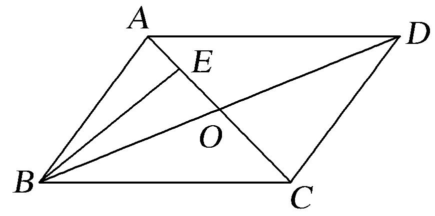

A．1　　　　　　　　B．　　　　　　　　C．　　　　　　　　D．

18．答案　B　解析　∵*E*为线段*AO*的中点，∴＝＋＝＋×＝＋＝*λ*＋*μ*，

∴*λ*＋*μ*＝＋＝．

19．一直线*l*与平行四边形*ABCD*中的两边*AB*，*AD*分别交于点*E*，*F*，且交其对角线*AC*于点*M*，若＝

2，＝3，＝<em>λ</em>－<em>μ</em>(<em>λ</em>，<em>μ</em>∈<strong>R</strong>)，则<em>μ</em>－<em>λ</em>＝(　　)

A．－　　　　　　　　B．1　　　　　　　　C．　　　　　　　　D．－3

19．答案　A　解析　＝*λ*－*μ*＝*λ*－*μ*(＋)＝(*λ*－*μ*)－*μ*＝2(*λ*－*μ*)－3*μ*．因为*E*，

*M*，*F*三点共线，所以2(*λ*－*μ*)＋(－3*μ*)＝1，即2*λ*－5*μ*＝1，∴*μ*－*λ*＝－．

20．如图，在平行四边形*ABCD*中，*E*，*F*分别为边*AB*，*BC*的中点，连接*CE*，*DF*，交于点*G*．若＝*λ*

＋<em>μ</em>(<em>λ</em>，<em>μ</em>∈<strong>R</strong>)，则＝\_\_\_\_\_\_\_\_．

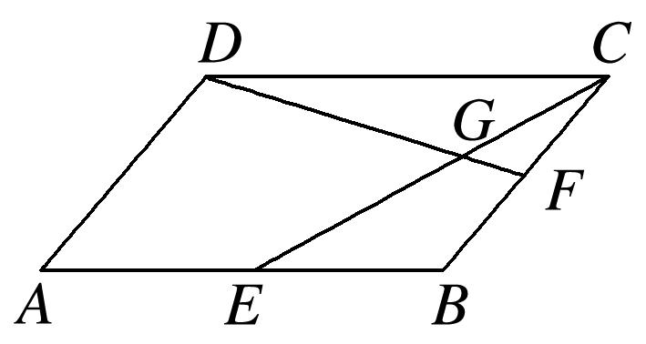

20．答案　　解析　由题意可设＝*x*(0<*x*<1)，则＝*x*(＋)＝*x*＝＋*x*．因为

＝*λ*＋*μ*，与不共线，所以*λ*＝，*μ*＝*x*，所以＝．

21．如图，在直角梯形*ABCD*中，*AB*∥*DC*，*AD*⊥*DC*，*AD*＝*DC*＝2*AB*，*E*为*AD*的中点，若＝*λ*＋

<em>μ</em>(<em>λ</em>，<em>μ</em>∈<strong>R</strong>)，则<em>λ</em>＋<em>μ</em>的值为(　　)

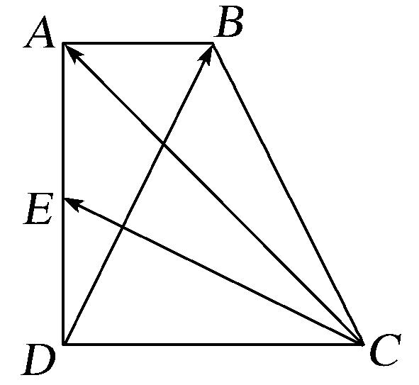

A．　　　　　　　　B．　　　　　　　　C．2　　　　　　　　D．

21．答案　B　解析　建立如图所示的平面直角坐标系，则*D*(0，0)．

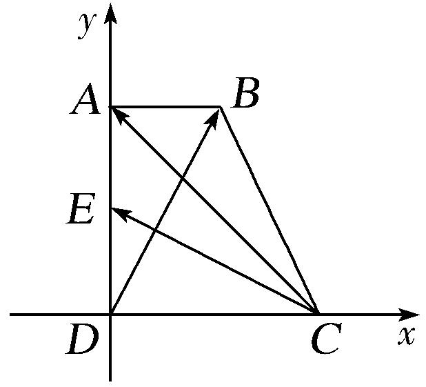

不妨设*AB*＝1，则*CD*＝*AD*＝2，所以*C*(2，0)，*A*(0，2)，*B*(1，2)，*E*(0，1)，∴＝(－2，2)，＝(－2，1)，＝(1，2)，∵＝*λ*＋*μ*，∴(－2，2)＝*λ*(－2，1)＋*μ*(1，2)，∴解得则*λ*＋*μ*＝．

22．在梯形*ABCD*中，已知*AB*∥*CD*，*AB*＝2*CD*，*M*，*N*分别为*CD*，*BC*的中点．若＝*λ*＋*μ*，

则*λ*＋*μ*的值为(　　)

A．　　　　　　　　　B．　　　　　　　　　C．　　　　　　　　　D．

22．答案　C　解析　法一：连接*AC*(图略)，由＝*λ*＋*μ*，得＝*λ*·(＋)＋*μ*·(＋)，则

＋＋＝0，得＋＋ [＋]＝0，得＋＝0．又，不共线，所以由平面向量基本定理得解得所以*λ*＋*μ*＝．

法二：因为＝＋＝＋＝＋(＋)＝2＋＋＝2－－，所以＝－，所以*λ*＋*μ*＝．

法三：根据题意作出图形如图所示，连接*MN*并延长，交*AB*的延长线于点*T*，由已知易得*AB*＝*AT*，所以＝＝*λ*＋*μ*，因为*T*，*M*，*N*三点共线，所以*λ*＋*μ*＝．

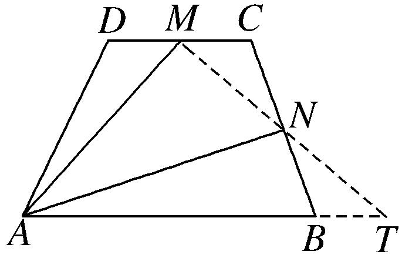

23．已知||＝1，||＝，·＝0，点*C*在∠*AOB*内，且与的夹角为30°，设＝*m*＋*n*

(<em>m</em>，<em>n</em>∈<strong>R</strong>)，则的值为(　　)

A．2　　　　　　　　B．　　　　　　　　C．3　　　　　　　　D．4

23．答案　C　解析　∵·＝0，∴⊥，以所在直线为*x*轴，所在直线为*y*轴建立平面直角

坐标系(图略)，＝(1，0)，＝(0，)，＝*m*＋*n*＝(*m*，*n*)．∵tan 30°＝＝，∴*m*＝3*n*，即＝3，故选C．

**考点三　根据向量线性运算求参数的取值范围(最值)**

【**方法总结**】

**向量线性运算求参数的取值范围(最值)问题的2种求解方法**

(1)几何法：即临界位置法，结合图形，确定临界位置的动态分析求出范围．

(2)代数法：即目标函数法，将参数表示为某一个变量或两个变量的函数，建立函数关系式，再利用三角函数有界性、二次函数或基本不等式求最值或范围．

**【例题选讲】**

<strong>[例1]</strong>(1)已知在△<em>ABC</em>中，点<em>D</em>满足2＋＝<strong>0</strong>，过点<em>D</em>的直线<em>l</em>与直线<em>AB</em>，<em>AC</em>分别交于点<em>M</em>，<em>N</em>，＝<em>λ</em>，＝<em>μ</em>．若<em>λ</em>&gt;0，<em>μ</em>&gt;0，则<em>λ</em>＋<em>μ</em>的最小值为\_\_\_\_\_\_\_\_．

答案　　解析　连接<em>AD</em>．因为2＋＝<strong>0</strong>，所以＝，＝＋＝＋＝＋(－)＝＋．因为<em>D</em>，<em>M</em>，<em>N</em>三点共线，所以存在<em>x</em>∈<strong>R</strong>，使＝<em>x</em>＋(1－<em>x</em>)，则＝<em>xλ</em>＋(1－<em>x</em>)<em>μ</em>，所以<em>xλ</em>＋(1－<em>x</em>)<em>μ</em>＝＋，所以<em>xλ</em>＝，(1－<em>x</em>)<em>μ</em>＝，所以<em>x</em>＝，1－<em>x</em>＝，所以＋＝1，所以<em>λ</em>＋<em>μ</em>＝(<em>λ</em>＋<em>μ</em>)＝≥，当且仅当<em>λ</em>＝<em>μ</em>时等号成立，所以<em>λ</em>＋<em>μ</em>的最小值为．

(2)如图，圆<em>O</em>是边长为2的等边三角形<em>ABC</em>的内切圆，其与<em>BC</em>边相切于点<em>D</em>，点<em>M</em>为圆上任意一点，＝<em>x</em>＋<em>y</em>(<em>x</em>，<em>y</em>∈<strong>R</strong>)，则2<em>x</em>＋<em>y</em>的最大值为(　　)

A．　　　　　　　　B．　　　　　　　　C．2　　　　　　　　D．2

答案　C　解析　方法一　如图，连接*DA*，以*D*点为原点，*BC*所在直线为*x*轴，*DA*所在直线为*y*轴，建立如图所示的平面直角坐标系．设内切圆的半径为*r*，则圆心为坐标(0，*r*)，

根据三角形面积公式，得×<em>l</em>△<em>ABC</em>×<em>r</em>＝×<em>AB</em>×<em>AC</em>×sin 60°(<em>l</em>△<em>ABC</em>为△<em>ABC</em>的周长)，解得<em>r</em>＝1．易得<em>B</em>(－，0)，<em>C</em>(，0)，<em>A</em>(0，3)，<em>D</em>(0，0)，设<em>M</em>(cos <em>θ</em>，1＋sin <em>θ</em>)，<em>θ</em>∈[0，2π)，则＝(cos <em>θ</em>＋，1＋sin <em>θ</em>)，＝(，3)，＝(，0)，故＝(cos <em>θ</em>＋，1＋sin <em>θ</em>)＝(<em>x</em>＋<em>y</em>,3<em>x</em>)，故则所以2<em>x</em>＋<em>y</em>＝＋＋＝sin＋≤2．当<em>θ</em>＝时等号成立．故2<em>x</em>＋<em>y</em>的最大值为2．

方法二　因为＝<em>x</em>＋<em>y</em>，所以||2＝3(4<em>x</em>2＋2<em>xy</em>＋<em>y</em>2)＝3[(2<em>x</em>＋<em>y</em>)2－2<em>xy</em>]．由题意知，<em>x</em>≥0，<em>y</em>≥0，||的最大值为＝3，又≥2<em>xy</em>，即≤－2<em>xy</em>，所以3×(2<em>x</em>＋<em>y</em>)2≤9，得2<em>x</em>＋<em>y</em>≤2，当且仅当2<em>x</em>＝<em>y</em>＝1时取等号．

(3) (2017·全国Ⅲ)在矩形*ABCD*中，*AB*＝1，*AD*＝2，动点*P*在以点*C*为圆心且与*BD*相切的圆上．若＝*λ*＋*μ*，则*λ*＋*μ*的最大值为(　　)

A．3　　　　　　　　B．2　　　　　　　　C．　　　　　　　　D．2

答案　A　解析　建立如图所示的直角坐标系，则<em>C</em>点坐标为(2，1)．设<em>BD</em>与圆<em>C</em>切于点<em>E</em>，连接<em>CE</em>，则<em>CE</em>⊥<em>BD．</em>因为<em>CD</em>＝1，<em>BC</em>＝2，所以<em>BD</em>＝＝，<em>EC</em>＝＝＝，所以<em>P</em>点的轨迹方程为(<em>x</em>－2)2＋(<em>y</em>－1)2＝．设<em>P</em>(<em>x</em>0，<em>y</em>0)，则(<em>θ</em>为参数)，而＝(<em>x</em>0，<em>y</em>0)，＝(0，1)，＝(2，0)．因为＝<em>λ</em>＋<em>μ</em>＝<em>λ</em>(0，1)＋<em>μ</em>(2，0)＝(2<em>μ</em>，<em>λ</em>)，所以<em>μ</em>＝<em>x</em>0＝1＋cos <em>θ</em>，<em>λ</em>＝<em>y</em>0＝1＋sin<em>θ</em>．两式相加，得<em>λ</em>＋<em>μ</em>＝1＋sin<em>θ</em>＋1＋cos<em>θ</em>＝2＋sin(<em>θ</em>＋<em>φ</em>)≤3，当且仅当<em>θ</em>＝＋2<em>k</em>π－<em>φ</em>，<em>k</em>∈<strong>Z</strong>时，<em>λ</em>＋<em>μ</em>取得最大值3．故选A．

(4)如图，在扇形*OAB*中，∠*AOB*＝，*C*为弧*AB*上的一个动点，若＝*x*＋*y*，则*x*＋3*y*的取值范围是\_\_\_\_\_\_\_\_．

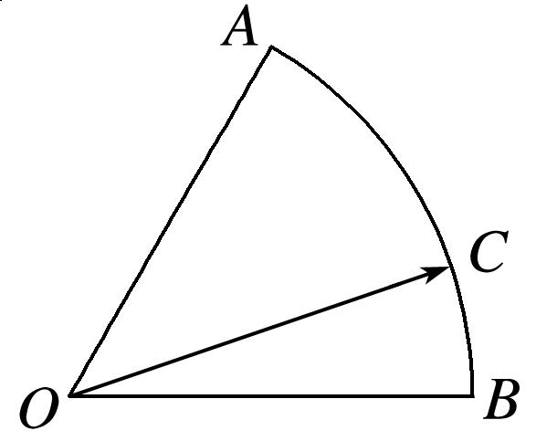

答案　[1，3]　解析　设扇形的半径为1，以*OB*所在直线为*x*轴，*O*为坐标原点建立平面直角坐标系(图略)，则*B*(1,0)，*A*，*C*(cos *θ*，sin *θ*)．则＝(cos *θ*，sin *θ*)＝*x*＋*y*(1,0)，即解得*x*＝，*y*＝cos *θ*－，故*x*＋3*y*＝＋3cos *θ*－sin *θ*＝3cos *θ*－sin *θ*，0≤*θ*≤．令*g*(*θ*)＝3cos *θ*－sin *θ*，易知*g*(*θ*)＝3cos *θ*－sin *θ*在上单调递减，故当*θ*＝0时，*g*(*θ*)取得最大值为3，当*θ*＝时，*g*(*θ*)取得最小值为1，故*x*＋3*y*的取值范围为[1,3]．

【**对点训练**】

1．在△*ABC*中，点*D*在线段*BC*的延长线上，且＝3，点*O*在线段*CD*上(与点*C*，*D*不重合)，若

＝*x*＋(1－*x*)，则*x*的取值范围是(　　)

A．　　　　　　B．　　　　　　C．　　　　　　D．

1．答案　D　解析　设＝*y*，∵＝＋＝＋*y*＝＋*y*(－)＝－*y*＋(1＋*y*)．∵

＝3，点*O* 在线段*CD*上(与点*C*，*D*不重合)，∴*y*∈，∵＝*x*＋(1－*x*)，∴*x*＝－*y*，∴*x*∈．

2．在△<em>ABC</em>中，点<em>D</em>满足＝，当点<em>E</em>在线段<em>AD</em>上移动时，若＝<em>λ</em>＋<em>μ</em>，则<em>t</em>＝(<em>λ</em>－1)2＋<em>μ</em>2

的最小值是\_\_\_\_\_\_\_\_．

2．答案　　解析　因为＝，所以＝＋．又＝*λ*＋*μ*，点*E*在线段*AD*上移动，所

以∥，则＝，即<em>λ</em>＝<em>μ</em>．所以<em>t</em>＝(<em>λ</em>－1)2＋<em>λ</em>2＝2<em>λ</em>2－2<em>λ</em>＋1＝2＋．当<em>λ</em>＝时，<em>t</em>的最小值是．

3．如图所示，在△*ABC*中，点*O*是*BC*的中点，过点*O*的直线分别交直线*AB*，*AC*于不同的两点*M*，*N*，

若＝*m*，＝*n*，则*mn*的最大值为\_\_\_\_\_\_\_\_\_\_．

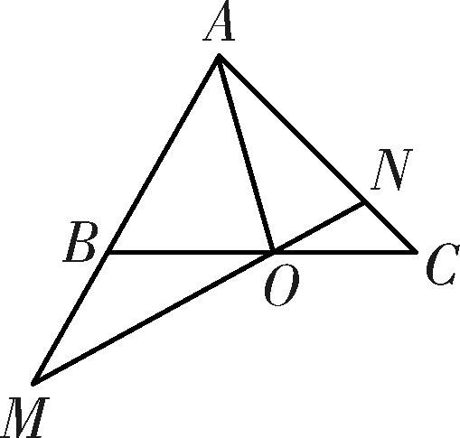

3．答案　　解析　因为点*O*是*BC*的中点，所以＝(＋)．又因为＝*m*，＝*n*，所以

＝＋．又因为<em>M</em>，<em>O</em>，<em>N</em>三点共线，所以＋＝1，即<em>m</em>＋<em>n</em>＝2，所以<em>mn</em>≤2＝1，当且仅当<em>m</em>＝<em>n</em>＝1时，等号成立，故<em>mn</em>的最大值为1

4．在锐角三角形*ABC*中，角*A*，*B*，*C*所对的边分别为*a*，*b*，*c*，点*O*为△*ABC*的外接圆的圆心，*A*＝，

且＝*λ*＋*μ*，则*λμ*的最大值为\_\_\_\_\_\_\_\_．

4．答案　　解析　∵△*ABC*是锐角三角形，∴*O*在△*ABC*的内部，∴0<*λ*<1,0<*μ*<1．由＝*λ*(－)

＋<em>μ</em>(－)，得(1－<em>λ</em>－<em>μ</em>)＝<em>λ</em>＋<em>μ</em>，两边平方后得，(1－<em>λ</em>－<em>μ</em>)22＝(<em>λ</em>＋<em>μ</em>)2＝<em>λ</em>22＋<em>μ</em>22＋2<em>λμ</em>·，∵<em>A</em>＝，∴∠<em>BOC</em>＝，又||＝||＝||．∴(1－<em>λ</em>－<em>μ</em>)2＝<em>λ</em>2＋<em>μ</em>2－<em>λμ</em>，∴1＋3<em>λμ</em>＝2(<em>λ</em>＋<em>μ</em>)，∵0&lt;<em>λ</em>&lt;1,0&lt;<em>μ</em>&lt;1，∴1＋3<em>λμ</em>≥4，设＝<em>t</em>，∴3<em>t</em>2－4<em>t</em>＋1≥0，解得<em>t</em>≥1(舍)或<em>t</em>≤，即≤⇒<em>λμ</em>≤，∴<em>λμ</em>的最大值是．

5．在矩形<em>ABCD</em>中，<em>AB</em>＝，<em>BC</em>＝，<em>P</em>为矩形内一点，且<em>AP</em>＝，若＝<em>λ</em>＋<em>μ</em>(<em>λ</em>，<em>μ</em>∈<strong>R</strong>)，则

*λ*＋*μ*的最大值为\_\_\_\_\_\_．

5．答案　　解析　建立如图所示的平面直角坐标系，设*P*(*x*，*y*)，*B*(，0)，*C*(，)，*D*(0，)．∵

<em>AP</em>＝，∴<em>x</em>2＋<em>y</em>2＝．点<em>P</em>满足的约束条件为∵＝<em>λ</em>＋<em>μ</em>(<em>λ</em>，<em>μ</em>∈<strong>R</strong>)，∴(<em>x</em>，<em>y</em>)＝<em>λ</em>(，0)＋<em>μ</em>(0，)，∴∴<em>x</em>＋<em>y</em>＝<em>λ</em>＋<em>μ</em>．∵<em>x</em>＋<em>y</em>≤＝＝，当且仅当<em>x</em>＝<em>y</em>时取等号，∴<em>λ</em>＋<em>μ</em>的最大值为．

6．平行四边形*ABCD*中，*AB*＝3，*AD*＝2，∠*BAD*＝120°，*P*是平行四边形*ABCD*内一点，且*AP*＝1，若

＝*x*＋*y*，则3*x*＋2*y*的最大值为\_\_\_\_\_\_\_\_．

6．答案　2　解析　||2＝(<em>x</em>＋<em>y</em>)2＝9<em>x</em>2＋4<em>y</em>2＋2<em>xy</em>×3×2×＝(3<em>x</em>＋2<em>y</em>)2－3(3<em>x</em>)·(2<em>y</em>)≥(3<em>x</em>＋2<em>y</em>)2－

(3<em>x</em>＋2<em>y</em>)2＝(3<em>x</em>＋2<em>y</em>)2．又||2＝1，因此(3<em>x</em>＋2<em>y</em>)2≤1，故3<em>x</em>＋2<em>y</em>≤2，当且仅当3<em>x</em>＝2<em>y</em>，即<em>x</em>＝，<em>y</em>＝时，3<em>x</em>＋2<em>y</em>取得最大值2．

7．在直角梯形*ABCD*中，∠*A*＝90°，∠*B*＝30°，*AB*＝2，*BC*＝2，点*E*在线段*CD*上，若＝＋*μ*，

则*μ*的取值范围是\_\_\_\_\_\_\_\_．

7．答案　　解析　由题意可求得*AD*＝1，*CD*＝，所以＝2．∵点*E* 在线段*CD*上，∴＝

*λ* (0≤*λ*≤1)．∵＝＋，又＝＋*μ*＝＋2*μ*＝＋，∴＝1，即*μ*＝．∵0≤*λ*≤1，∴0≤*μ*≤，即*μ*的取值范围是．

8．如图所示，*A*，*B*，*C*是圆*O*上的三点，线段*CO*的延长线与*BA*的延长线交于圆*O*外的一点*D*，若

＝*m*＋*n*，则*m*＋*n*的取值范围是\_\_\_\_\_\_\_\_．

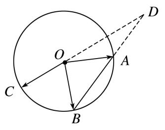

8．答案　(－1，0)　解析　由题意得，＝*k*(*k*＜0)，又|*k*|＝＜1，∴－1＜*k*＜0．又∵*B*，*A*，

*D*三点共线，∴＝*λ*＋(1－*λ*)，∴*m*＋*n*＝*kλ*＋*k*(1－*λ*)，∴*m*＝*kλ*，*n*＝*k*(1－*λ*)，∴*m*＋*n*＝*k*，从而*m*＋*n*∈(－1，0)．

9．给定两个长度为1的平面向量和，它们的夹角为90°，如图所示，点*C*在以*O*为圆心的圆弧上

运动，若＝<em>x</em>＋<em>y</em>，其中<em>x</em>，<em>y</em>∈<strong>R</strong>，则<em>x</em>＋<em>y</em>的最大值是(　　)

A．1　　　　　　　　B．　　　　　　　　C．　　　　　　　D．2

9．答案　B　解析　因为点<em>C</em>在以<em>O</em>为圆心的圆弧上，所以||2＝|<em>x</em>＋<em>y</em>|2＝<em>x</em>2＋<em>y</em>2＋2<em>xy</em>·＝

<em>x</em>2＋<em>y</em>2，∴<em>x</em>2＋<em>y</em>2＝1，则2<em>xy</em>≤<em>x</em>2＋<em>y</em>2＝1．又(<em>x</em>＋<em>y</em>)2＝<em>x</em>2＋<em>y</em>2＋2<em>xy</em>≤2，故<em>x</em>＋<em>y</em>的最大值为．

10．给定两个长度为1的平面向量和，它们的夹角为．如图所示，点*C*在以*O*为圆心的圆弧

上运动．若＝<em>x</em>＋<em>y</em>，其中<em>x</em>，<em>y</em>∈<strong>R</strong>，则<em>x</em>＋<em>y</em>的最大值为\_\_\_\_\_\_\_\_．．

10．答案　2　解析　以*O*为坐标原点，所在的直线为*x*轴建立平面直角坐标系，如图所示，则*A*(1，

0)，

*B*(－，)，设∠*AOC*＝*α*(*α*∈[0，])，则*C*(cos*α*，sin*α*)，由＝*x*＋*y*，得，

所以*x*＝cos*α*＋sin*α*，*y*＝sin*α*，所以*x*＋*y*＝cos*α*＋sin*α*＝2sin(*α*＋)，又*α*∈[0，]，

所以当*α*＝时，*x*＋*y*取得最大值2．

