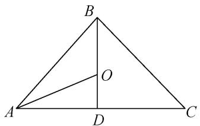
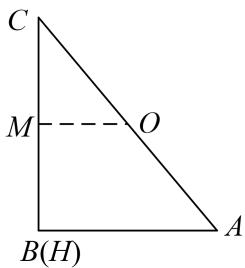
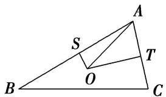

# 专题十 平面向量与三角形的四心

# 三角形四心的向量式

三角形“四心”向量形式的充要条件

设 O 为 $\triangle ABC$ 所在平面上一点，内角 A, B, C 所对的边分别为 a, b, c，则

(1) $O$ 为 $\triangle ABC$ 的重心 $\Leftrightarrow \overrightarrow{OA} +\overrightarrow{OB} +\overrightarrow{OC} = \mathbf{0}$   
(2) $O$ 为 $\triangle ABC$ 的外心 $\Leftrightarrow |\overrightarrow{OA}| = |\overrightarrow{OB}| = |\overrightarrow{OC}| = \frac{a}{2\sin A} \Leftrightarrow \sin 2A \cdot \overrightarrow{OA} + \sin 2B \cdot \overrightarrow{OB} + \sin 2C \cdot \overrightarrow{OC} = 0.$   
(3) $O$ 为 $\triangle ABC$ 的内心 $\Leftrightarrow a\overrightarrow{OA} + b\overrightarrow{OB} + c\overrightarrow{OC} = 0\Leftrightarrow \sin A\cdot \overrightarrow{OA} +\sin B\cdot \overrightarrow{OB} +\sin C\cdot \overrightarrow{OC} = 0.$   
(4)O 为△ABC 的垂心 $\Leftrightarrow \overrightarrow{OA} \cdot \overrightarrow{OB} = \overrightarrow{OB} \cdot \overrightarrow{OC} = \overrightarrow{OC} \cdot \overrightarrow{OA} \Leftrightarrow \tan A \cdot \overrightarrow{OA} + \tan B \cdot \overrightarrow{OB} + \tan C \cdot \overrightarrow{OC} = 0.$

关于四心的概念及性质：

(1)重心: 三角形的重心是三角形三条中线的交点.

性质：①重心到顶点的距离与重心到对边中点的距离之比为2:1.

②重心和三角形 3 个顶点组成的 3 个三角形面积相等.

③在平面直角坐标系中，重心的坐标是顶点坐标的算术平均数. 即 G 为 $\triangle ABC$ 的重心， $A(x_{1}, y_{1})$ ， $B(x_{2}, y_{2})$ ， $C(x_{3}, y_{3})$ ，则 $G\left(\frac{x_{1}+x_{2}+x_{3}}{3}, \frac{y_{1}+y_{2}+y_{3}}{3}\right)$ .

④重心到三角形3个顶点距离的平方和最小.

(2)垂心: 三角形的垂心是三角形三边上的高的交点.

性质：锐角三角形的垂心在三角形内，直角三角形的垂心在直角顶点上，钝角三角形的垂心在三角形外。

(3)内心：三角形的内心是三角形三条内角平分线的交点(或内切圆的圆心).

性质：①三角形的内心到三边的距离相等，都等于内切圆半径 r.

② $r=\frac{2S}{a+b+c}$ ，特别地，在Rt△ABC中， $\angle C=90^{\circ}$ ， $r=\frac{a+b-c}{2}$ .

(4)外心：三角形三边的垂直平分线的交点(或三角形外接圆的圆心).

性质：外心到三角形各顶点的距离相等.

# 考点一 三角形四心的判断

# 【例题选讲】

[例 1] (1) 已知 A, B, C 是平面上不共线的三点，O 为坐标原点，动点 P 满足 $\overrightarrow{OP} = \frac{1}{3}[(1 - \lambda)\overrightarrow{OA} + (1 - \lambda)\overrightarrow{OB} + (1 + 2\lambda)\cdot\overrightarrow{OC}]$ ， $\lambda \in R$ ，则点 P 的轨迹一定经过()

A. $\triangle ABC$ 的内心

B. $\triangle ABC$ 的垂心

C. $\triangle ABC$ 的重心

D. $AB$ 边的中点

(2)已知 O 是平面上的一定点，A，B，C 是平面上不共线的三个动点，若动点 P 满足 $\overrightarrow{OP} = \overrightarrow{OA} + \lambda \left( \frac{\overrightarrow{AB}}{|\overrightarrow{AB}|} + \frac{\overrightarrow{AC}}{|\overrightarrow{AC}|} \right)$ ， $\lambda \in (0, +\infty)$ ，则点 P 的轨迹一定通过 $\triangle ABC$ 的 \_\_\_\_.

text_image

B
O
A
D
C

(3)在 $\triangle ABC$ 中，设 $\overrightarrow{AC}^{2}-\overrightarrow{AB}^{2}=2\overrightarrow{AM}\cdot\overrightarrow{BC}$ ，那么动点 $M$ 的轨迹必经过 $\triangle ABC$ 的()

A. 垂心

B. 内心

C. 外心

D. 重心

(4)已知 O 是平面上的一个定点，A, B, C 是平面上不共线的三个点，动点 P 满足 $\overrightarrow{OP} = \overrightarrow{OA} + \lambda \left( \frac{\overrightarrow{AB}}{|\overrightarrow{AB}| \cos B} + \frac{\overrightarrow{AC}}{|\overrightarrow{AC}| \cos C} \right)$ ， $\lambda \in (0, +\infty)$ ，则动点 P 的轨迹一定通过 $\triangle ABC$ 的（）

A. 重心

B. 垂心

C. 外心

D. 内心

(5)已知 $\Delta ABC$ 的内角 $A$ 、 $B$ 、 $C$ 的对边分别为 $a$ 、 $b$ 、 $c$ ， $O$ 为 $\Delta ABC$ 内一点，若分别满足下列四个条件：

① $a\overrightarrow{OA} + b\overrightarrow{OB} + c\overrightarrow{OC} = 0$ ，② $\tan A \cdot \overrightarrow{OA} + \tan B \cdot \overrightarrow{OB} + \tan C \cdot \overrightarrow{OC} = 0$ ，  
③ $\sin 2A \cdot \overrightarrow{OA} + \sin 2B \cdot \overrightarrow{OB} + \sin 2C \cdot \overrightarrow{OC} = 0$ ，④ $\overrightarrow{OA} + \overrightarrow{OB} + \overrightarrow{OC} = 0$

则点 O 分别为 $\Delta ABC$ 的()

A. 外心、内心、垂心、重心

B. 内心、外心、垂心、重心

C. 垂心、内心、重心、外心

D. 内心、垂心、外心、重心

(6)下列叙述正确的是\_\_\_\_.

① $\overrightarrow{PG}=\frac{1}{3}(\overrightarrow{PA}+\overrightarrow{PB}+\overrightarrow{PC})\Leftrightarrow G$ 为 $\Delta ABC$ 的重心.  
② $\overrightarrow{PA} \cdot \overrightarrow{PB} = \overrightarrow{PB} \cdot \overrightarrow{PC} = \overrightarrow{PC} \cdot \overrightarrow{PA} \Leftrightarrow P$ 为 $\Delta ABC$ 的垂心.  
③ $|\overrightarrow{AB}|\overrightarrow{PC}+|\overrightarrow{BC}|\overrightarrow{PA}+|\overrightarrow{CA}|\overrightarrow{PB}=\vec{0}\Leftrightarrow P$ 为 $\Delta ABC$ 的外心.  
④ $(\overrightarrow{OA} +\overrightarrow{OB})\cdot \overrightarrow{AB} = (\overrightarrow{OB} +\overrightarrow{OC})\cdot \overrightarrow{BC} = (\overrightarrow{OC} +\overrightarrow{OA})\cdot \overrightarrow{CA} = 0\Leftrightarrow O$ 为 $\Delta ABC$ 的内心.

# 【对点训练】

1. 已知 O 是平面上的一定点，A, B, C 是平面上不共线的三个动点，若动点 P 满足 $\overrightarrow{OP} = \overrightarrow{OA} + \lambda (\overrightarrow{AB} + \overrightarrow{AC})$ ， $\lambda \in (0, +\infty)$ ，则点 P 的轨迹一定通过 $\triangle ABC$ 的（）

A. 内心

B. 外心

C. 重心

D. 垂心

2. O 是平面上一定点，A，B，C 是平面上不共线的三个点，动点 P 满足 $\overrightarrow{OP} = \frac{\overrightarrow{OB} + \overrightarrow{OC}}{2} + \lambda \overrightarrow{AP}$ ，且 $\lambda \neq 1$ ，则点 P 的轨迹一定通过 $\Delta ABC$ 的（）

A. 内心

B. 外心

C. 重心

D. 垂心

3. 已知 $O$ 是 $\triangle ABC$ 所在平面上的一定点，若动点 $P$ 满足 $\overrightarrow{OP} = \overrightarrow{OA} + \lambda \left[ \frac{\overrightarrow{AB}}{|AB|\sin B} + \frac{\overrightarrow{AC}}{|AC|\sin C} \right]$ ， $\lambda \in (0, +\infty)$ ，则点 $P$ 的轨迹一定通过 $\triangle ABC$ 的（）

A. 内心

B. 外心

C. 重心

D. 垂心

4. O 为 $\Delta ABC$ 所在平面内一点，A，B，C 为 $\Delta ABC$ 的角，若 $\sin A \cdot \overrightarrow{OA} + \sin B \cdot \overrightarrow{OB} + \sin C \cdot \overrightarrow{OC} = \overrightarrow{O}$ ，则点 O 为 $\Delta ABC$ 的（）

A. 垂心

B. 外心

C. 内心

D. 重心

5. 在 $\Delta ABC$ 中， $AB = 3$ ， $AC = 2$ ， $\overrightarrow{AD} = \frac{1}{2}\overrightarrow{AB} + \frac{3}{4}\overrightarrow{AC}$ ，则直线 $AD$ 通过 $\Delta ABC$ 的（）

A. 垂心

B. 外心

C. 内心

D. 重心

6. 已知 $\Delta ABC$ 所在的平面上的动点 M 满足 $\overrightarrow{AP} = |\overrightarrow{AB}| \overrightarrow{AC} + |\overrightarrow{AC}| \overrightarrow{AB}$ ，则直线 AP 一定经过 $\Delta ABC$ 的（）

A. 重心

B. 外心

C. 内心

D. 垂心

7. 设 $\Delta ABC$ 的角 A、B、C 的对边长分别为 a, b, c, P 是 $\Delta ABC$ 所在平面上的一点， $\overrightarrow{PA} \cdot \overrightarrow{PB} = \frac{c}{b} \overrightarrow{PA} \cdot \overrightarrow{PC} + \frac{b - c}{b} \overrightarrow{PA}^{2} = \frac{c}{a} \overrightarrow{PB} \cdot \overrightarrow{PC} + \frac{a - c}{a} \overrightarrow{PB}^{2}$ ，则点 P 是 $\Delta ABC$ 的（）

A. 重心

B. 外心

C. 内心

D. 垂心

8. 已知 O 是 $\triangle ABC$ 所在平面上一点，若 $\overrightarrow{OA^{2}} = \overrightarrow{OB^{2}} = \overrightarrow{OC^{2}}$ ，则 O 是 $\triangle ABC$ 的（）.

A. 重点

B. 外心

C. 内心

D. 垂心

9. $P$ 是 $\triangle ABC$ 所在平面内一点，若 $\overrightarrow{PA} \cdot \overrightarrow{PB} = \overrightarrow{PB} \cdot \overrightarrow{PC} = \overrightarrow{PC} \cdot \overrightarrow{PA}$ ，则 $P$ 是 $\triangle ABC$ 的（ ）

A. 外心

B. 内心

C. 重心

D. 垂心

10. 若 $H$ 为 $\triangle ABC$ 所在平面内一点，且 $\left|\overrightarrow{HA}\right|^2 +\left|\overrightarrow{BC}\right|^2 = \left|\overrightarrow{HB}\right|^2 +\left|\overrightarrow{CA}\right|^2 = \left|\overrightarrow{HC}\right|^2 +\left|\overrightarrow{AB}\right|^2$ 则点 $H$ 是 $\triangle ABC$ 的（

A. 外心

B. 内心

C. 重心

D. 垂心

11. 已知 $O$ 是 $\Delta ABC$ 所在平面内一点，且满足 $\overrightarrow{BA} \cdot \overrightarrow{OA} + |\overrightarrow{BC}|^2 = \overrightarrow{AB} \cdot \overrightarrow{OB} + |\overrightarrow{AC}|^2$ ，则点 $O(\quad)$

A. 在 $AB$ 边的高所在的直线上

B. 在 $\angle C$ 平分线所在的直线上

C. 在 $AB$ 边的中线所在的直线上

D. 是 $\Delta ABC$ 的外心

12. 已知 $O$ 为 $\Delta ABC$ 所在平面内一点，且满足 $\overrightarrow{OA}^2 + \overrightarrow{BC}^2 = \overrightarrow{OB}^2 + \overrightarrow{CA}^2 = \overrightarrow{OC}^2 + \overrightarrow{AB}^2$ ，则 $O$ 点的轨迹一定通过 $\Delta ABC$ 的（）

A. 外心

B. 内心

C. 重心

D. 垂心

13. 已知 $O$ ， $N$ ， $P$ 在所在 $\Delta ABC$ 的平面内，且 $|\overrightarrow{OA}| = |\overrightarrow{OB}| = |\overrightarrow{OC}|$ ， $\overrightarrow{NA} + \overrightarrow{NB} + \overrightarrow{NC} = 0$ ，且 $\overrightarrow{PA} \cdot \overrightarrow{PB} = \overrightarrow{PB} \cdot \overrightarrow{PC} = \overrightarrow{PA} \cdot \overrightarrow{PC}$ ，则 $O$ ， $N$ ， $P$ 分别是 $\Delta ABC$ 的（）

A. 重心、外心、垂心

B. 重心、外心、内心

C. 外心、重心、垂心

D. 外心、重心、内心

14. 点 $O$ 是平面上一定点, $A 、 B 、 C$ 是平面上 $\Delta ABC$ 的三个顶点, 以下命题正确的是 \_\_\_\_. (把你认为正确的序号全部写上). ①②③④⑤

①动点 P 满足 $\overrightarrow{OP} = \overrightarrow{OA} + \overrightarrow{PB} + \overrightarrow{PC}$ ，则 $\Delta ABC$ 的重心一定在满足条件的 P 点集合中；

②动点 P 满足 $\overrightarrow{OP} = \overrightarrow{OA} + \lambda \left( \frac{\overrightarrow{AB}}{|\overrightarrow{AB}|} + \frac{\overrightarrow{AC}}{|\overrightarrow{AC}|} \right) (\lambda > 0)$ ，则 $\Delta ABC$ 的内心一定在满足条件的 P 点集合中；

③动点 P 满足 $\overrightarrow{OP} = \overrightarrow{OA} + \lambda \left( \frac{\overrightarrow{AB}}{|\overrightarrow{AB}| \sin B} + \frac{\overrightarrow{AC}}{|\overrightarrow{AC}| \sin C} \right) (\lambda > 0)$ ，则 $\Delta ABC$ 的重心一定在满足条件的 P 点集合中；

④动点 P 满足 $\overrightarrow{OP} = \overrightarrow{OA} + \lambda \left( \frac{\overrightarrow{AB}}{|\overrightarrow{AB}| \cos B} + \frac{\overrightarrow{AC}}{|\overrightarrow{AC}| \cos C} \right) (\lambda > 0)$ ，则 $\Delta ABC$ 的垂心一定在满足条件的 P 点集合中；

⑤动点 P 满足 $\overrightarrow{OP} = \frac{\overrightarrow{OB} + \overrightarrow{OC}}{2} + \lambda \left( \frac{\overrightarrow{AB}}{|\overrightarrow{AB}| \cos B} + \frac{\overrightarrow{AC}}{|\overrightarrow{AC}| \cos C} \right) (\lambda > 0)$ ，则 $\Delta ABC$ 的外心一定在满足条件的 P 点集合中.

# 考点二 三角形四心的应用

# 【例题选讲】

[例 2] (1) 在 $\triangle ABC$ 中，角 A, B, C 的对边分别为 a, b, c，重心为 G，若 $a\overrightarrow{GA} + b\overrightarrow{GB} + \frac{\sqrt{3}}{3}c\overrightarrow{GC} = 0$ ，则 A = \_\_\_\_.

(2)在 $\triangle ABC$ 中， $AB=BC=2$ ， $AC=3$ ，设 $O$ 是 $\triangle ABC$ 的内心．若 $\overrightarrow{AO}=p\overrightarrow{AB}+q\overrightarrow{AC}$ ，则 $\frac{p}{q}=$ \_\_\_\_.

text_image

B
O
A
D
C

(3)已知在 $\triangle ABC$ 中， $AB = 1$ ， $BC = \sqrt{6}$ ， $AC = 2$ ，点 $O$ 为 $\triangle ABC$ 的外心，若 $\overrightarrow{AO} = x\overrightarrow{AB} +y\overrightarrow{AC}$ ，则有序实数对 $(x,y)$ 为（）

A. $\left(\frac{4}{5},\frac{3}{5}\right)$

B. $\left(\frac{3}{5},\frac{4}{5}\right)$

C. $\left(-\frac{4}{5},\frac{3}{5}\right)$

D. $\left(-\frac{3}{5},\frac{4}{5}\right)$

(4)在 $\triangle ABC$ 中， $O$ 是 $\triangle ABC$ 的垂心，点 $P$ 满足： $3\overrightarrow{OP}=\frac{1}{2}\overrightarrow{OA}+\frac{1}{2}\overrightarrow{OB}+2\overrightarrow{OC}$ ，则 $\triangle ABP$ 的面积与 $\triangle ABC$ 的面积之比是\_\_\_\_.

(5)著名数学家欧拉提出了如下定理：三角形的外心、重心、垂心依次位于同一直线上，且重心到外心的距离是重心到垂心距离的一半．此直线被称为三角形的欧拉线，该定理则被称为欧拉线定理．设点 O，H 分别是 $\Delta ABC$ 的外心、垂心，且 M 为 BC 中点，则（）

A. $\overrightarrow{AB} +\overrightarrow{AC} = \overrightarrow{3HM} +3\overrightarrow{MO}$

B. $\overrightarrow{AB} +\overrightarrow{AC} = \overrightarrow{3HM} -3\overrightarrow{MO}$

C. $\overrightarrow{AB} + \overrightarrow{AC} = 2\overrightarrow{HM} + 4\overrightarrow{MO}$

D. $\overrightarrow{AB} +\overrightarrow{AC} = 2\overrightarrow{HM} -4\overrightarrow{MO}$

text_image

C
M —— O
B(H)
A

# 【对点训练】

1. 在 $\triangle ABC$ 中， $O$ 为 $\triangle ABC$ 的重心， $AB=2$ ， $AC=3$ ， $A=60^{\circ}$ ，则 $\overrightarrow{AO}\cdot\overrightarrow{AC}=$ \_\_\_\_.

2. 设 G 为 $\triangle ABC$ 的重心，且 $\sin A \cdot \overrightarrow{GA} + \sin B \cdot \overrightarrow{GB} + \sin C \cdot \overrightarrow{GC} = 0$ ，则 B 的大小为 \_\_\_\_.

3. 已知 $\triangle ABC$ 的三个内角为 $A, B, C$ , 重心为 $G$ , 若 $2 \sin A \cdot \overrightarrow{GA} + \sqrt{3} \sin B \cdot \overrightarrow{GB} + 3 \sin C \cdot \overrightarrow{GC} = 0$ , 则 $\cos B =$ \_\_\_\_.

4. 在 $\triangle ABC$ 中， $AB=1$ ， $\angle ABC=60^{\circ}$ ， $\overrightarrow{AC}\cdot\overrightarrow{AB}=-1$ ，若 $O$ 是 $\triangle ABC$ 的重心，则 $\overrightarrow{BO}\cdot\overrightarrow{AC}=$ \_\_\_\_.

5. 过△ABC 重心 O 的直线 PQ 交 AC 于点 P，交 BC 于点 Q， $\overrightarrow{PC}=\frac{3}{4}\overrightarrow{AC}$ ， $\overrightarrow{QC}=n\overrightarrow{BC}$ ，则 n 的值为 \_\_\_\_.

6. 已知 $\triangle ABC$ 和点 $M$ 满足 $\overrightarrow{MA} + \overrightarrow{MB} + \overrightarrow{MC} = 0$ ，若存在实数 $m$ ，使得 $\overrightarrow{AB} + \overrightarrow{AC} = m\overrightarrow{AM}$ 成立，则 $m$ 等于（）

A. 2

B. 3

C. 4

D. 5

7. 已知 $O$ 是 $\triangle ABC$ 内一点， $\overrightarrow{OA} + \overrightarrow{OB} + \overrightarrow{OC} = 0$ ， $\overrightarrow{AB} \cdot \overrightarrow{AC} = 2$ 且 $\angle BAC = 60^\circ$ ，则 $\triangle OBC$ 的面积为（）

A. $\frac{\sqrt{3}}{3}$

B. $\sqrt{3}$

C. $\frac{\sqrt{3}}{2}$

D. $\frac{2}{3}$

8. 已知在 $\triangle ABC$ 中，点 $O$ 满足 $\overrightarrow{OA} + \overrightarrow{OB} + \overrightarrow{OC} = 0$ ，点 $P$ 是 $OC$ 上异于端点的任意一点，且 $\overrightarrow{OP} = m\overrightarrow{OA} + n\overrightarrow{OB}$ ，则 $m + n$ 的取值范围是 \_\_\_\_.

9. 已知点 O 为 $\triangle ABC$ 外接圆的圆心，且 $\overrightarrow{OA} + \overrightarrow{OB} + \overrightarrow{OC} = 0$ ，则 $\triangle ABC$ 的内角 A 等于()

A. $30^{\circ}$

B. $60^{\circ}$

C. $90^{\circ}$

D. $120^{\circ}$

10. 已知 $O$ 是 $\triangle ABC$ 的外心， $|\overrightarrow{AB}| = 4$ ， $|\overrightarrow{AC}| = 2$ ，则 $\overrightarrow{AO} \cdot (\overrightarrow{AB} + \overrightarrow{AC}) = (\quad)$

text_image

A
S
T
B
O
C

A. 10

B. 9

C. 8

D. 6

11. 若点 $P$ 是 $\triangle ABC$ 的外心，且 $\overrightarrow{PA} +\overrightarrow{PB} +\lambda \overrightarrow{PC} = 0$ ， $\angle ACB = 120^{\circ}$ ，则实数 $\lambda$ 的值为( )

A. $\frac{1}{2}$

B. $-\frac{1}{2}$

C. -1

D. 1

12. $\triangle ABC$ 的外接圆的圆心为 $O$ ，半径为 1，若 $\overrightarrow{OA} + \overrightarrow{AB} + \overrightarrow{OC} = 0$ ，且 $|\overrightarrow{OA}| = |\overrightarrow{AB}|$ ，则 $\overrightarrow{CA} \cdot \overrightarrow{CB}$ 等于（）

A. $\frac{3}{2}$

B. $\sqrt{3}$

C. 3

D. $2 \sqrt{3}$

13. 若 $\triangle ABC$ 的面积为 $\sqrt{3}$ , $\overrightarrow{AB} \cdot \overrightarrow{AC} = 2$ , 则 $\triangle ABC$ 外接圆面积的最小值为( )

A. $\pi$

B. $\frac{4\pi}{3}$

C. $2\pi$

D. $\frac{8\pi}{3}$

14. 已知 $O$ 为锐角 $\triangle ABC$ 的外心， $|\overrightarrow{AB}| = 3$ ， $|\overrightarrow{AC}| = 2\sqrt{3}$ ，若 $\overrightarrow{AO} = x\overrightarrow{AB} + y\overrightarrow{AC}$ ，且 $9x + 12y = 8$ ，记 $I_1 = \overrightarrow{OA} \cdot \overrightarrow{OB}$ ， $I_2 = \overrightarrow{OB} \cdot \overrightarrow{OC}$ ， $I_3 = \overrightarrow{OA} \cdot \overrightarrow{OC}$ ，则（）

A. $I_{2}<I_{1}<I_{3}$

B. $I_{3}<I_{2}<I_{1}$

C. $I_{3}< I_{1}< I_{2}$

D. $I_{2}<I_{3}<I_{1}$

15. 已知 O 是 $\triangle ABC$ 的外心， $\angle C = 45^{\circ}$ ，则 $\overrightarrow{OC} = m\overrightarrow{OA} + n\overrightarrow{OB}(m, n \in \mathbf{R})$ ，则 $m + n$ 的取值范围是()

A. $\left[-\sqrt{2},\sqrt{2}\right]$

B. $\left[-\sqrt{2},1\right)$

C. $[-\sqrt{2}, -1]$

D. $(1, \sqrt{2}]$

16. 已知点 $G$ 是 $\triangle ABC$ 的外心, $\overrightarrow{GA}, \overrightarrow{GB}$ , $\overrightarrow{GC}$ 是三个单位向量, 且 $2\overrightarrow{GA} + \overrightarrow{AB} + \overrightarrow{AC} = 0$ , $\triangle ABC$ 的顶点 $B$ , $C$ 分别在 $x$ 轴的非负半轴和 $y$ 轴的非负半轴上移动, 如图所示, 点 $O$ 是坐标原点, 则 $|\overrightarrow{OA}|$ 的最大值为( )

A. 1

B. 2

C. 3

D. 4

17. 在锐角三角形 ABC 中，角 A, B, C 所对的边分别为 a, b, c，点 O 为 $\triangle ABC$ 的外接圆的圆心， $A=\frac{\pi}{3}$ ，且 $\overrightarrow{AO}=\lambda\overrightarrow{AB}+\mu\overrightarrow{AC}$ ，则 $\lambda\mu$ 的最大值为 \_\_\_\_.

18. 已知 $P$ 是边长为 3 的等边三角形 $ABC$ 外接圆上的动点，则 $\left|\overrightarrow{PA} + \overrightarrow{PB} + 2\overrightarrow{PC}\right|$ 的最大值为（）

A. $2 \sqrt{3}$

B. $3\sqrt{3}$

C. $4\sqrt{3}$

D. $5\sqrt{3}$

19. 已知 O 是锐角三角形 $\Delta ABC$ 的外接圆的圆心，且 $\angle A = \theta$ ，若 $\frac{\cos B}{\sin C} \overrightarrow{AB} + \frac{\cos C}{\sin B} \overrightarrow{AC} = 2m \overrightarrow{AO}$ ，则 $m = (\quad)$

A. $\sin \theta$

B. $\cos \theta$

C. $\tan \theta$

D. 不能确定

20. 在 $\Delta ABC$ 中, $BC = 5$ , $G$ , $O$ 分别为 $\Delta ABC$ 的重心和外心, 且 $\overrightarrow{OG} \cdot \overrightarrow{BC} = 5$ , 则 $\Delta ABC$ 的形状是( )

A. 锐角三角形

B. 钝角三角形

C. 直角三角形

D. 上述三种情况都有可能

21. 在 $\Delta ABC$ 中， $AB = 3$ ， $BC = \sqrt{7}$ ， $AC = 2$ ，若点 $O$ 为 $\Delta ABC$ 的内心，则 $\overrightarrow{AO} \cdot \overrightarrow{AC}$ 的值为（）

A. 2

B. $\frac{7}{3}$

C. 3

D. $5 - \sqrt{7}$

22. 设 $O$ 是 $\triangle ABC$ 的内心, $AB = c$ , $AC = b$ , 若 $\overrightarrow{AO} = \lambda_1\overrightarrow{AB} + \lambda_2\overrightarrow{AC}$ , 则( )

A. $\frac{\lambda_1}{\lambda_2} = \frac{b}{c}$

B. $\frac{\lambda_1^2}{\lambda_2^2} = \frac{b}{c}$

C. $\frac{\lambda_1}{\lambda_2} = \frac{c^2}{b^2}$

D. $\frac{\lambda_1^2}{\lambda_2^2} = \frac{c}{b}$

23. 在 $\triangle ABC$ 中， $AB = 5$ ， $AC = 6$ ， $\cos A = \frac{1}{5}$ ， $O$ 是 $\triangle ABC$ 的内心，若 $\overrightarrow{OP} = x\overrightarrow{OB} + y\overrightarrow{OC}$ ，其中 $x, y \in [0, 1]$ ，则动点 $P$ 的轨迹所覆盖图形的面积为（）

A. $\frac{10\sqrt{6}}{3}$

B. $\frac{14\sqrt{6}}{3}$

C. $4\sqrt{3}$

D. $6\sqrt{2}$

24. 在 $\triangle ABC$ 中，已知向量 $\overrightarrow{AB}$ 与 $\overrightarrow{AC}$ 满足 $\left[\frac{\overrightarrow{AB}}{|\overrightarrow{AB}|} +\frac{\overrightarrow{AC}}{|\overrightarrow{AC}|}\right] \cdot \overrightarrow{BC} = 0$ ，且 $\frac{\overrightarrow{AB}}{|\overrightarrow{AB}|}\cdot \frac{\overrightarrow{AC}}{|\overrightarrow{AC}|} = \frac{1}{2}$ ，则 $\triangle ABC$ 为( )

A. 等边三角形

B. 直角三角形

C. 等腰非等边三角形

D. 三边均不相等的三角形

25. $\Delta ABC$ 外接圆的圆心为 $O$ ，两条边上的高的交点为 $H$ ， $\overrightarrow{OH} = m(\overrightarrow{OA} + \overrightarrow{OB} + \overrightarrow{OC})$ ，则实数 $m$ 的值（ ）

A. $\frac{1}{2}$

B. 2

C. 1

D. $\frac{3}{4}$

