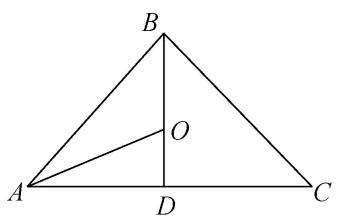
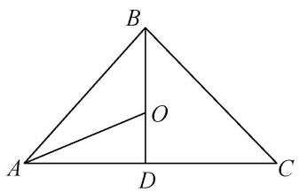
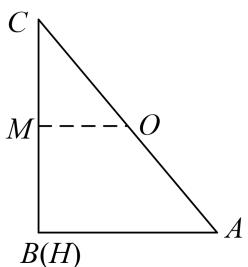
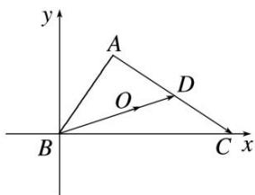
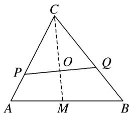
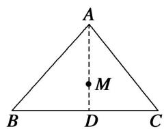
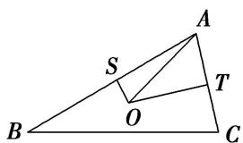
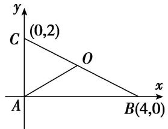
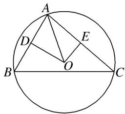
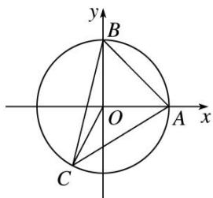

# 专题十 平面向量与三角形的四心

# 三角形四心的向量式

三角形“四心”向量形式的充要条件

设 O 为 $\triangle ABC$ 所在平面上一点，内角 A, B, C 所对的边分别为 a, b, c，则

(1) $O$ 为 $\triangle ABC$ 的重心 $\Leftrightarrow \overrightarrow{OA} +\overrightarrow{OB} +\overrightarrow{OC} = \mathbf{0}$   
(2) $O$ 为 $\triangle ABC$ 的外心 $\Leftrightarrow |\overrightarrow{OA}| = |\overrightarrow{OB}| = |\overrightarrow{OC}| = \frac{a}{2\sin A} \Leftrightarrow \sin 2A \cdot \overrightarrow{OA} + \sin 2B \cdot \overrightarrow{OB} + \sin 2C \cdot \overrightarrow{OC} = 0.$   
(3) $O$ 为 $\triangle ABC$ 的内心 $\Leftrightarrow a\overrightarrow{OA} + b\overrightarrow{OB} + c\overrightarrow{OC} = 0\Leftrightarrow \sin A\cdot \overrightarrow{OA} +\sin B\cdot \overrightarrow{OB} +\sin C\cdot \overrightarrow{OC} = 0.$   
(4)O 为△ABC 的垂心 $\Leftrightarrow \overrightarrow{OA} \cdot \overrightarrow{OB} = \overrightarrow{OB} \cdot \overrightarrow{OC} = \overrightarrow{OC} \cdot \overrightarrow{OA} \Leftrightarrow \tan A \cdot \overrightarrow{OA} + \tan B \cdot \overrightarrow{OB} + \tan C \cdot \overrightarrow{OC} = 0.$

关于四心的概念及性质：

(1)重心: 三角形的重心是三角形三条中线的交点.

性质：①重心到顶点的距离与重心到对边中点的距离之比为2:1.

②重心和三角形 3 个顶点组成的 3 个三角形面积相等.

③在平面直角坐标系中，重心的坐标是顶点坐标的算术平均数. 即 G 为 $\triangle ABC$ 的重心， $A(x_{1}, y_{1})$ ， $B(x_{2}, y_{2})$ ， $C(x_{3}, y_{3})$ ，则 $G\left(\frac{x_{1}+x_{2}+x_{3}}{3}, \frac{y_{1}+y_{2}+y_{3}}{3}\right)$ .

④重心到三角形3个顶点距离的平方和最小.

(2)垂心: 三角形的垂心是三角形三边上的高的交点.

性质：锐角三角形的垂心在三角形内，直角三角形的垂心在直角顶点上，钝角三角形的垂心在三角形外。

(3)内心：三角形的内心是三角形三条内角平分线的交点(或内切圆的圆心).

性质：①三角形的内心到三边的距离相等，都等于内切圆半径 r.

② $r=\frac{2S}{a+b+c}$ ，特别地，在Rt△ABC中， $\angle C=90^{\circ}$ ， $r=\frac{a+b-c}{2}$ .

(4)外心：三角形三边的垂直平分线的交点(或三角形外接圆的圆心).

性质：外心到三角形各顶点的距离相等.

# 考点一 三角形四心的判断

# 【例题选讲】

[例 1] (1) 已知 A, B, C 是平面上不共线的三点，O 为坐标原点，动点 P 满足 $\overrightarrow{OP} = \frac{1}{3}[(1 - \lambda)\overrightarrow{OA} + (1 - \lambda)\overrightarrow{OB} + (1 + 2\lambda)\cdot\overrightarrow{OC}]$ ， $\lambda \in R$ ，则点 P 的轨迹一定经过()

A. $\triangle ABC$ 的内心

B. $\triangle ABC$ 的垂心

C. $\triangle ABC$ 的重心

D. $AB$ 边的中点

答案 C 解析 取 AB 的中点 D，则 $2\overrightarrow{OD}=\overrightarrow{OA}+\overrightarrow{OB}$ ，∵ $\overrightarrow{OP}=\frac{1}{3}[(1-\lambda)\overrightarrow{OA}+(1-\lambda)\overrightarrow{OB}+(1+2\lambda)\overrightarrow{OC}]$ ，∴ $\overrightarrow{OP}=\frac{1}{3}[2(1-\lambda)\overrightarrow{OD}+(1+2\lambda)\overrightarrow{OC}]=\frac{2(1-\lambda)}{3}\overrightarrow{OD}+\frac{1+2\lambda}{3}\overrightarrow{OC}$ ，而 $\frac{2(1-\lambda)}{3}+\frac{1+2\lambda}{3}=1$ ，∴ P，C，D 三点共线，∴ 点 P 的轨迹一定经过 $\triangle ABC$ 的重心.

(2)已知 O 是平面上的一定点，A，B，C 是平面上不共线的三个动点，若动点 P 满足 $\overrightarrow{OP} = \overrightarrow{OA} + \lambda \left( \frac{\overrightarrow{AB}}{|\overrightarrow{AB}|} + \frac{\overrightarrow{AC}}{|\overrightarrow{AC}|} \right)$ ， $\lambda \in (0, +\infty)$ ，则点 P 的轨迹一定通过 $\triangle ABC$ 的 \_\_\_\_.

答案 内心 解析 由条件，得 $\overrightarrow{OP} -\overrightarrow{OA} = \lambda \left(\frac{\overrightarrow{AB}}{|\overrightarrow{AB}|} +\frac{\overrightarrow{AC}}{|\overrightarrow{AC}|}\right)$ 即 $\overrightarrow{AP} = \lambda \left(\frac{\overrightarrow{AB}}{|\overrightarrow{AB}|} +\frac{\overrightarrow{AC}}{|\overrightarrow{AC}|}\right)$ 而 $\frac{\overrightarrow{AB}}{|\overrightarrow{AB}|}$ 和 $\frac{\overrightarrow{AC}}{|\overrightarrow{AC}|}$ 分别表示平行于 $\overrightarrow{AB}$ ， $\overrightarrow{AC}$ 的单位向量，故 $\frac{\overrightarrow{AB}}{|\overrightarrow{AB}|} +\frac{\overrightarrow{AC}}{|\overrightarrow{AC}|}$ 平分∠BAC，即 $\overrightarrow{AP}$ 平分∠BAC，所以点 $P$ 的轨迹必过△ABC的内心.

text_image

B
O
A
D
C

(3)在 $\triangle ABC$ 中，设 $\overrightarrow{AC}^2 -\overrightarrow{AB}^2 = 2\overrightarrow{AM}\cdot \overrightarrow{BC}$ ，那么动点 $M$ 的轨迹必经过 $\triangle ABC$ 的（

A. 垂心

B. 内心

C. 外心

D. 重心

答案 C 解析 设 BC 边中点为 D，∵ $\overrightarrow{AC}^{2}-\overrightarrow{AB}^{2}=2\overrightarrow{AM}\cdot\overrightarrow{BC}$ ，∴ $(\overrightarrow{AC}+\overrightarrow{AB})\cdot(\overrightarrow{AC}-\overrightarrow{AB})=2\overrightarrow{AM}\cdot\overrightarrow{BC}$ ，即 $\overrightarrow{AD}\cdot\overrightarrow{BC}=\overrightarrow{AM}\cdot\overrightarrow{BC}$ ，∴ $\overrightarrow{MD}\cdot\overrightarrow{BC}=0$ ，则 $\overrightarrow{MD}\perp\overrightarrow{BC}$ ，即 $MD\perp BC$ ，∴ MD 为 BC 的垂直平分线，∴ 动点 M 的轨迹必经过 $\triangle ABC$ 的外心，故选 C.

(4)已知 O 是平面上的一个定点，A, B, C 是平面上不共线的三个点，动点 P 满足 $\overrightarrow{OP} = \overrightarrow{OA} + \lambda \left( \frac{\overrightarrow{AB}}{|\overrightarrow{AB}| \cos B} + \frac{\overrightarrow{AC}}{|\overrightarrow{AC}| \cos C} \right)$ ， $\lambda \in (0, +\infty)$ ，则动点 P 的轨迹一定通过 $\triangle ABC$ 的（）

A. 重心

B. 垂心

C. 外心

D. 内心

答案 B 解析 因为 $\overrightarrow{OP} = \overrightarrow{OA} + \lambda \left( \frac{\overrightarrow{AB}}{|\overrightarrow{AB}| \cos B} + \frac{\overrightarrow{AC}}{|\overrightarrow{AC}| \cos C} \right)$ ，所以 $\overrightarrow{AP} = \overrightarrow{OP} - \overrightarrow{OA} = \lambda \left( \frac{\overrightarrow{AB}}{|\overrightarrow{AB}| \cos B} + \frac{\overrightarrow{AC}}{|\overrightarrow{AC}| \cos C} \right)$ ，所以 $\overrightarrow{BC} \cdot \overrightarrow{AP} = \overrightarrow{BC} \cdot \lambda \left( \frac{\overrightarrow{AB}}{|\overrightarrow{AB}| \cos B} + \frac{\overrightarrow{AC}}{|\overrightarrow{AC}| \cos C} \right) = \lambda (-|\overrightarrow{BC}| + |\overrightarrow{BC}|) = 0$ ，所以 $\overrightarrow{BC} \perp \overrightarrow{AP}$ ，所以点 P 在 BC 的高线上，即动点 P 的轨迹一定通过 $\triangle ABC$ 的垂心.

(5)已知 $\Delta ABC$ 的内角 $A$ 、 $B$ 、 $C$ 的对边分别为 $a$ 、 $b$ 、 $c$ ， $O$ 为 $\Delta ABC$ 内一点，若分别满足下列四个条件：

① $a\overrightarrow{OA} + b\overrightarrow{OB} + c\overrightarrow{OC} = 0$ ，② $\tan A \cdot \overrightarrow{OA} + \tan B \cdot \overrightarrow{OB} + \tan C \cdot \overrightarrow{OC} = 0$ ，  
③ $\sin 2A \cdot \overrightarrow{OA} + \sin 2B \cdot \overrightarrow{OB} + \sin 2C \cdot \overrightarrow{OC} = 0$ ，④ $\overrightarrow{OA} + \overrightarrow{OB} + \overrightarrow{OC} = 0$

则点 O 分别为 $\Delta ABC$ 的()

A. 外心、内心、垂心、重心  
B. 内心、外心、垂心、重心  
C. 垂心、内心、重心、外心  
D. 内心、垂心、外心、重心

答案 D

(6)下列叙述正确的是\_\_\_\_.

① $\overrightarrow{PG}=\frac{1}{3}(\overrightarrow{PA}+\overrightarrow{PB}+\overrightarrow{PC})\Leftrightarrow G$ 为 $\Delta ABC$ 的重心.  
② $\overrightarrow{PA} \cdot \overrightarrow{PB} = \overrightarrow{PB} \cdot \overrightarrow{PC} = \overrightarrow{PC} \cdot \overrightarrow{PA} \Leftrightarrow P$ 为 $\Delta ABC$ 的垂心.  
③ $|\overrightarrow{AB}|\overrightarrow{PC}+|\overrightarrow{BC}|\overrightarrow{PA}+|\overrightarrow{CA}|\overrightarrow{PB}=\vec{0}\Leftrightarrow P$ 为 $\Delta ABC$ 的外心.

④ $(\overrightarrow{OA} +\overrightarrow{OB})\cdot \overrightarrow{AB} = (\overrightarrow{OB} +\overrightarrow{OC})\cdot \overrightarrow{BC} = (\overrightarrow{OC} +\overrightarrow{OA})\cdot \overrightarrow{CA} = 0\Leftrightarrow O$ 为 $\Delta ABC$ 的内心.

答 案 ① ② 解 析 ① G 为 $\Delta ABC$ 的重心

$\Leftrightarrow \overrightarrow{GA} + \overrightarrow{GB} + \overrightarrow{GC} = \mathbf{0} \Leftrightarrow \overrightarrow{PA} - \overrightarrow{PG} + \overrightarrow{PB} - \overrightarrow{PG} + \overrightarrow{PC} - \overrightarrow{PG} = \mathbf{0} \Leftrightarrow \overrightarrow{PG} = \frac{1}{3} (\overrightarrow{PA} + \overrightarrow{PB} + \overrightarrow{PC})$ ，①正确；②由 $\overrightarrow{PA} \cdot \overrightarrow{PB} = \overrightarrow{PB} \cdot \overrightarrow{PC} \Leftrightarrow (\overrightarrow{PA} - \overrightarrow{PC}) \cdot \overrightarrow{PB} = 0 \Leftrightarrow \overrightarrow{CA} \cdot \overrightarrow{PB} = 0 \Leftrightarrow AC \perp PB$ ，同理 $AB \perp PC$ ， $BC \perp PA$ ，②正确；③

$$
| \overrightarrow {A B} | \overrightarrow {P C} + | \overrightarrow {B C} | \overrightarrow {P A} + | \overrightarrow {C A} | \overrightarrow {P B} = \mathbf {0} \quad \Leftrightarrow \quad | \overrightarrow {A B} | \overrightarrow {P C} + | \overrightarrow {B C} | (\overrightarrow {P C} + \overrightarrow {C A}) \quad + | \overrightarrow {C A} | (\overrightarrow {P C} + \overrightarrow {C B}) = \mathbf {0}
$$

$$
\Leftrightarrow (| \overrightarrow {A B} | + | \overrightarrow {B C} | + | \overrightarrow {C A} |) \overrightarrow {P C} + | \overrightarrow {B C} | \overrightarrow {C A} + | \overrightarrow {C A} | \overrightarrow {C B} = \mathbf {0}. \quad \because \| \overrightarrow {B C} | \overrightarrow {C A} | = \| \overrightarrow {C A} | \overrightarrow {C B} |, \quad \therefore | \overrightarrow {B C} |
$$

$\overrightarrow{CA} + |\overrightarrow{CA}| \overrightarrow{CB}$ 与角 $C$ 的平分线平行，∴ $P$ 必然落在角 $C$ 的角平分线上，③错误；④ $(\overrightarrow{OA} + \overrightarrow{OB}) \cdot \overrightarrow{AB} = (\overrightarrow{OB} + \overrightarrow{OC}) \cdot \overrightarrow{BC} = (\overrightarrow{OC} + \overrightarrow{OA}) \cdot \overrightarrow{CA} = 0 \Leftrightarrow |\overrightarrow{OA}| = |\overrightarrow{OB}| = |\overrightarrow{OC}| \Leftrightarrow \overrightarrow{OA^2} = \overrightarrow{OB^2} = \overrightarrow{OC^2} \Leftrightarrow O$ 为 $\Delta ABC$ 的外心，④错误．∴ 正确的叙述是①②．故答案为：①②．

# 【对点训练】

1. 已知 $O$ 是平面上的一定点， $A, B, C$ 是平面上不共线的三个动点，若动点 $P$ 满足 $\overrightarrow{OP} = \overrightarrow{OA} + \lambda (\overrightarrow{AB} + \overrightarrow{AC})$ ， $\lambda \in (0, +\infty)$ ，则点 $P$ 的轨迹一定通过 $\triangle ABC$ 的（）

A. 内心

B. 外心

C. 重心

D. 垂心

1. 答案 C 解析 由原等式，得 $\overrightarrow{OP} - \overrightarrow{OA} = \lambda (\overrightarrow{AB} + \overrightarrow{AC})$ ，即 $\overrightarrow{AP} = \lambda (\overrightarrow{AB} + \overrightarrow{AC})$ ，根据平行四边形法则，知 $\overrightarrow{AB} + \overrightarrow{AC}$ 是 $\triangle ABC$ 的中线 $AD(D$ 为 $BC$ 的中点)所对应向量 $\overrightarrow{AD}$ 的2倍，所以点 $P$ 的轨迹必过 $\triangle ABC$ 的重心.

2. $O$ 是平面上一定点， $A, B, C$ 是平面上不共线的三个点，动点 $P$ 满足 $\overrightarrow{OP} = \frac{\overrightarrow{OB} + \overrightarrow{OC}}{2} + \lambda \overrightarrow{AP}$ ，且 $\lambda \neq 1$ ，则点 $P$ 的轨迹一定通过 $\Delta ABC$ 的（）

A. 内心

B. 外心

C. 重心

D. 垂心

2. 答案 C 解析 设 $BC$ 的中点为 $M$ 。由已知原式可化为 $2\lambda \overrightarrow{PA} = \overrightarrow{OB} - \overrightarrow{OP} + \overrightarrow{OC} - \overrightarrow{OP}$ 。即 $2\lambda \overrightarrow{PA} = \overrightarrow{PB} + \overrightarrow{PC} = 2\overrightarrow{PM}$ ，所以 $\overrightarrow{PM} = \lambda \overrightarrow{PA}$ ，所以 $P$ ， $A$ ， $M$ 三点共线。所以 $P$ 点在边 $BC$ 的中线 $AM$ 上。故 $P$ 点的轨迹一定过 $\Delta ABC$ 的重心。

3. 已知 $O$ 是 $\triangle ABC$ 所在平面上的一定点，若动点 $P$ 满足 $\overrightarrow{OP} = \overrightarrow{OA} + \lambda \left[ \frac{\overrightarrow{AB}}{|AB|\sin B} + \frac{\overrightarrow{AC}}{|AC|\sin C} \right]$ ， $\lambda \in (0, +\infty)$ ，则点 $P$ 的轨迹一定通过 $\triangle ABC$ 的（）

A. 内心

B. 外心

C. 重心

D. 垂心

3. 答案 C 解析 $\because |AB|\sin B = |AC|\sin C$ ，设它们等于 $t$ ， $\therefore \overrightarrow{OP} = \overrightarrow{OA} + \lambda \cdot \frac{1}{t} (\overrightarrow{AB} + \overrightarrow{AC})$ ，设 $BC$ 的中点为 $D$ ，则 $\overrightarrow{AB} + \overrightarrow{AC} = 2\overrightarrow{AD}$ ， $\lambda \cdot \frac{1}{t} (\overrightarrow{AB} + \overrightarrow{AC})$ 表示与 $\overrightarrow{AD}$ 共线的向量 $\overrightarrow{AP}$ ，而点 $D$ 是 $BC$ 的中点，即 $AD$ 是 $\triangle ABC$ 的中线， $\therefore$ 点 $P$ 的轨迹一定通过三角形的重心。故选 C.

4. O 为 $\Delta ABC$ 所在平面内一点，A，B，C 为 $\Delta ABC$ 的角，若 $\sin A \cdot \overrightarrow{OA} + \sin B \cdot \overrightarrow{OB} + \sin C \cdot \overrightarrow{OC} = \vec{O}$ ，则点 O 为 $\Delta ABC$ 的（）

A. 垂心

B. 外心

C. 内心

D. 重心

4. 答案 C 解析 由正弦定理得 $2R\sin A\overrightarrow{OA} + 2R\sin B\overrightarrow{OB} + 2R\sin C\overrightarrow{OC} = \vec{0}$ ，即 $a\overrightarrow{OA} + b\overrightarrow{OB} + c\overrightarrow{OC} = \vec{0}$ ，由上式可得 $c\overrightarrow{OC} = -a\overrightarrow{OA} - b\overrightarrow{OB} = -a(\overrightarrow{OC} + \overrightarrow{CA}) - b(\overrightarrow{OC} + \overrightarrow{CB})$ ，所以 $(a + b + c)\overrightarrow{OC} = -a\overrightarrow{CA} - b\overrightarrow{CB} = -ab$

$\left(\frac{\overrightarrow{CA}}{|\overrightarrow{CA}|} + \frac{\overrightarrow{CB}}{|\overrightarrow{CB}|}\right)$ ，所以 $OC$ 与 $\angle C$ 的平分线共线，即 $O$ 在 $\angle C$ 的平分线上，同理可证， $O$ 也在 $\angle A$ ， $\angle B$ 的平分线上，故 $O$ 是 $\triangle ABC$ 的内心.

5. 在 $\Delta ABC$ 中， $AB = 3$ ， $AC = 2$ ， $\overrightarrow{AD} = \frac{1}{2}\overrightarrow{AB} + \frac{3}{4}\overrightarrow{AC}$ ，则直线 $AD$ 通过 $\Delta ABC$ 的（）

A. 垂心

B. 外心

C. 内心

D. 重心

5. 答案 C 解析 $\because AB = 3, AC = 2, \therefore \left| \frac{1}{2} \overrightarrow{AB} \right| = \frac{3}{2}, \left| \frac{3}{4} \overrightarrow{AC} \right| = \frac{3}{2}$ . 即 $\left| \frac{1}{2} \overrightarrow{AB} \right| = \left| \frac{3}{4} \overrightarrow{AC} \right| = \frac{3}{2}$ , 设 $\overrightarrow{AE} = \frac{1}{2} \overrightarrow{AB}$ , $\overrightarrow{AF} = \frac{3}{4} \overrightarrow{AC}$ , 则 $|\overrightarrow{AE}| = |\overrightarrow{AF}|$ , $\therefore \overrightarrow{AD} = \frac{1}{2} \overrightarrow{AB} + \frac{3}{4} \overrightarrow{AC} = \overrightarrow{AE} + \overrightarrow{AF}$ . 由向量加法的平行四边形法则可知, 四边形 $AEDF$ 为菱形. $\therefore AD$ 为菱形的对角线, $\therefore AD$ 平分 $\angle EAF$ . $\therefore$ 直线 $AD$ 通过 $\triangle ABC$ 的内心. 故选 C.

6. 已知 $\Delta ABC$ 所在的平面上的动点 M 满足 $\overrightarrow{AP} = |\overrightarrow{AB}| \overrightarrow{AC} + |\overrightarrow{AC}| \overrightarrow{AB}$ ，则直线 AP 一定经过 $\Delta ABC$ 的（）

A. 重心

B. 外心

C. 内心

D. 垂心

6. 答案 C 解析 $\because \overrightarrow{AP} = |\overrightarrow{AB}| \overrightarrow{AC} + |\overrightarrow{AC}| \overrightarrow{AB} \therefore \overrightarrow{AP} = |\overrightarrow{AB}| \overrightarrow{AC}| (\frac{1}{|\overrightarrow{AC}|} \overrightarrow{AC} + \frac{1}{|\overrightarrow{AB}|} \overrightarrow{AB})$ ， $\therefore$ 根据平行四边形法则知 $\frac{1}{|\overrightarrow{AC}|} \overrightarrow{AC} + \frac{1}{|\overrightarrow{AB}|} \overrightarrow{AB}$ 表示的向量在三角形角 $A$ 的平分线上，而向量 $\overrightarrow{AP}$ 与 $\frac{1}{|\overrightarrow{AC}|} \overrightarrow{AC} + \frac{1}{|\overrightarrow{AB}|} \overrightarrow{AB}$ 共线， $\therefore P$ 点的轨迹过 $\Delta ABC$ 的内心，故选 C.

7. 设 $\Delta ABC$ 的角 A、B、C 的对边长分别为 a, b, c, P 是 $\Delta ABC$ 所在平面上的一点， $\overrightarrow{PA} \cdot \overrightarrow{PB} = \frac{c}{b} \overrightarrow{PA} \cdot \overrightarrow{PC} + \frac{b - c}{b} \overrightarrow{PA}^{2} = \frac{c}{a} \overrightarrow{PB} \cdot \overrightarrow{PC} + \frac{a - c}{a} \overrightarrow{PB}^{2}$ ，则点 P 是 $\Delta ABC$ 的（）

A. 重心

B. 外心

C. 内心

D. 垂心

7. 答案 C 解析 因为 $\overrightarrow{PA} \cdot \overrightarrow{PB} = \frac{c}{b} \overrightarrow{PA} \cdot \overrightarrow{PC} + \frac{b - c}{b} \overrightarrow{PA}^{2} = \frac{c}{a} \overrightarrow{PB} \cdot \overrightarrow{PC} + \frac{a - c}{a} \overrightarrow{PB}^{2}$ ，所以 $\overrightarrow{PA} \cdot \overrightarrow{PB} - \overrightarrow{PA}^{2} = \frac{c}{b} \overrightarrow{PA} \cdot (\overrightarrow{PC} - \overrightarrow{PA})$ ， $\overrightarrow{PA} \cdot \overrightarrow{PB} - \overrightarrow{PB}^{2} = \frac{c}{a} \overrightarrow{PB} \cdot (\overrightarrow{PC} - \overrightarrow{PB})$ ，所以 $\overrightarrow{PA} \cdot \overrightarrow{AB} = \frac{c}{b} \overrightarrow{PA} \cdot \overrightarrow{AC}$ ， $\overrightarrow{BA} \cdot \overrightarrow{PB} = \frac{c}{a} \overrightarrow{PB} \cdot \overrightarrow{BC}$ ，所以 $|\overrightarrow{PA}| c \cdot \cos \angle PAB = \frac{c}{b} |\overrightarrow{PA}| b \cos \angle PAC, |\overrightarrow{PB}| c \cdot \cos \angle PBA = \frac{c}{a} |\overrightarrow{PB}| a \cos \angle PBC$ ，所以 $\angle PAB = \angle PAC, \angle PBA = \angle PBC$ ，所以 AP 是 $\angle BAC$ 的平分线，BP 是 $\angle ABC$ 的平分线，所以点 P 是 $\Delta ABC$ 的内心，故选 C.

8. 已知 O 是 $\triangle ABC$ 所在平面上一点，若 $\overrightarrow{OA^{2}} = \overrightarrow{OB^{2}} = \overrightarrow{OC^{2}}$ ，则 O 是 $\triangle ABC$ 的（）.

A. 重点

B. 外心

C. 内心

D. 垂心

8. 答案 B 解析

9. $P$ 是 $\triangle ABC$ 所在平面内一点，若 $\overrightarrow{PA} \cdot \overrightarrow{PB} = \overrightarrow{PB} \cdot \overrightarrow{PC} = \overrightarrow{PC} \cdot \overrightarrow{PA}$ ，则 $P$ 是 $\triangle ABC$ 的（ ）

A. 外心

B. 内心

C. 重心

D. 垂心

9. 答案 D 解析 由 $\overrightarrow{PA} \cdot \overrightarrow{PB} = \overrightarrow{PB} \cdot \overrightarrow{PC}$ , 可得 $\overrightarrow{PB} \cdot (\overrightarrow{PA} - \overrightarrow{PC}) = 0$ , 即 $\overrightarrow{PB} \cdot \overrightarrow{CA} = 0$ , $\therefore \overrightarrow{PB} \perp \overrightarrow{CA}$ , 同理可证 $\overrightarrow{PC} \perp \overrightarrow{AB}$ , $\overrightarrow{PA} \perp \overrightarrow{BC}$ . $\therefore P$ 是 $\triangle ABC$ 的垂心.

10. 若 $H$ 为 $\triangle ABC$ 所在平面内一点，且 $\left|\overrightarrow{HA}\right|^2 +\left|\overrightarrow{BC}\right|^2 = \left|\overrightarrow{HB}\right|^2 +\left|\overrightarrow{CA}\right|^2 = \left|\overrightarrow{HC}\right|^2 +\left|\overrightarrow{AB}\right|^2$ 则点 $H$ 是 $\triangle ABC$ 的（

A. 外心

B. 内心

C. 重心

D. 垂心

10. 答案 D 解析

11. 已知 $O$ 是 $\Delta ABC$ 所在平面内一点，且满足 $\overrightarrow{BA} \cdot \overrightarrow{OA} + |\overrightarrow{BC}|^2 = \overrightarrow{AB} \cdot \overrightarrow{OB} + |\overrightarrow{AC}|^2$ ，则点 $O(\quad)$

A. 在 $AB$ 边的高所在的直线上

B. 在 $\angle C$ 平分线所在的直线上

C. 在 $AB$ 边的中线所在的直线上

D. 是 $\Delta ABC$ 的外心

11. 答案 A 解析 取 AB 的中点 D，则 $\because \overrightarrow{BA} \cdot \overrightarrow{OA} + |\overrightarrow{BC}|^{2} = \overrightarrow{AB} \cdot \overrightarrow{OB} + |\overrightarrow{AC}|^{2}$ ， $\therefore \overrightarrow{BA} \cdot (\overrightarrow{OA} + \overrightarrow{OB}) = -|\overrightarrow{BC}|^{2} + |\overrightarrow{AC}|^{2}$ ， $\therefore \overrightarrow{BA} \cdot 2\overrightarrow{OD} = \overrightarrow{AB} \cdot (-2\overrightarrow{CD})$ ， $\therefore \overrightarrow{BA} \cdot 2\overrightarrow{OC} = 0$ ， $\therefore \overrightarrow{BA} \perp \overrightarrow{OC}$ ，∴ 点 O 在 AB 边的高所在的直线上，故选 A.

12. 已知 $O$ 为 $\Delta ABC$ 所在平面内一点，且满足 $\overrightarrow{OA}^2 + \overrightarrow{BC}^2 = \overrightarrow{OB}^2 + \overrightarrow{CA}^2 = \overrightarrow{OC}^2 + \overrightarrow{AB}^2$ ，则 $O$ 点的轨迹一定通过 $\Delta ABC$ 的（）

A. 外心

B. 内心

C. 重心

D. 垂心

12. 答案 D 解析 $\because \overrightarrow{BC} = \overrightarrow{OC} - \overrightarrow{OB}, \overrightarrow{CA} = \overrightarrow{OA} - \overrightarrow{OC}, \overrightarrow{AB} = \overrightarrow{OB} - \overrightarrow{OA}$ , $\therefore$ 由 $\overrightarrow{OA}^2 + \overrightarrow{BC}^2 = \overrightarrow{OB}^2 + \overrightarrow{CA}^2 = \overrightarrow{OC}^2 + \overrightarrow{AB}^2$ , 得 $\overrightarrow{OA}^2 + (\overrightarrow{OC} - \overrightarrow{OB})^2 = \overrightarrow{OB}^2 + (\overrightarrow{OA} - \overrightarrow{OC})^2 = \overrightarrow{OC}^2 + (\overrightarrow{OB} - \overrightarrow{OA})^2$ , $\therefore \overrightarrow{OB} \cdot \overrightarrow{OC} = \overrightarrow{OA} \cdot \overrightarrow{OC} = \overrightarrow{OA} \cdot \overrightarrow{OB}$ , 即 $\overrightarrow{OC} \cdot (\overrightarrow{OB} - \overrightarrow{OA}) = \overrightarrow{OA} \cdot (\overrightarrow{OC} - \overrightarrow{OB}) = \overrightarrow{OB} \cdot (\overrightarrow{OC} - \overrightarrow{OA})$ , $\therefore \overrightarrow{OC} \cdot \overrightarrow{AB} = \overrightarrow{OA} \cdot \overrightarrow{BC} = \overrightarrow{OB} \cdot \overrightarrow{AC}$ , 则 $OC \perp AB$ , $OA \perp BC$ , $OB \perp AC$ . $\therefore O$ 是 $\triangle ABC$ 的垂心. 故选 D.

13. 已知 O, N, P 在所在 $\Delta ABC$ 的平面内，且 $|\overrightarrow{OA}| = |\overrightarrow{OB}| = |\overrightarrow{OC}|$ ， $\overrightarrow{NA} + \overrightarrow{NB} + \overrightarrow{NC} = 0$ ，且 $\overrightarrow{PA} \cdot \overrightarrow{PB} = \overrightarrow{PB} \cdot \overrightarrow{PC} = \overrightarrow{PA} \cdot \overrightarrow{PC}$ ，则 O, N, P 分别是 $\Delta ABC$ 的（）

A. 重心、外心、垂心

B. 重心、外心、内心

C. 外心、重心、垂心

D. 外心、重心、内心

13. 答案 C

14. 点 $O$ 是平面上一定点, $A 、 B 、 C$ 是平面上 $\Delta ABC$ 的三个顶点, 以下命题正确的是 \_\_\_\_. (把你认为正确的序号全部写上). ①②③④⑤

①动点 P 满足 $\overrightarrow{OP} = \overrightarrow{OA} + \overrightarrow{PB} + \overrightarrow{PC}$ ，则 $\Delta ABC$ 的重心一定在满足条件的 P 点集合中；

②动点 P 满足 $\overrightarrow{OP} = \overrightarrow{OA} + \lambda \left( \frac{\overrightarrow{AB}}{|\overrightarrow{AB}|} + \frac{\overrightarrow{AC}}{|\overrightarrow{AC}|} \right) (\lambda > 0)$ ，则 $\Delta ABC$ 的内心一定在满足条件的 P 点集合中；

③动点 P 满足 $\overrightarrow{OP} = \overrightarrow{OA} + \lambda \left( \frac{\overrightarrow{AB}}{|\overrightarrow{AB}| \sin B} + \frac{\overrightarrow{AC}}{|\overrightarrow{AC}| \sin C} \right) (\lambda > 0)$ ，则 $\Delta ABC$ 的重心一定在满足条件的 P 点集合中；

④动点 P 满足 $\overrightarrow{OP} = \overrightarrow{OA} + \lambda \left( \frac{\overrightarrow{AB}}{|\overrightarrow{AB}| \cos B} + \frac{\overrightarrow{AC}}{|\overrightarrow{AC}| \cos C} \right) (\lambda > 0)$ ，则 $\Delta ABC$ 的垂心一定在满足条件的 P 点集合中；

⑤动点 P 满足 $\overrightarrow{OP} = \frac{\overrightarrow{OB} + \overrightarrow{OC}}{2} + \lambda \left( \frac{\overrightarrow{AB}}{|\overrightarrow{AB}| \cos B} + \frac{\overrightarrow{AC}}{|\overrightarrow{AC}| \cos C} \right) (\lambda > 0)$ ，则 $\Delta ABC$ 的外心一定在满足条件的 P 点集合中.

14. 答案 ①②③④⑤ 解析 对于①，∵动点P满足 $\overrightarrow{OP}=\overrightarrow{OA}+\overrightarrow{PB}+\overrightarrow{PC}$ ，∴ $\overrightarrow{AP}=\overrightarrow{PB}+\overrightarrow{PC}$ ，则点P是 $\Delta ABC$ 的心，故①正确；对于②，∵动点P满足 $\overrightarrow{OP}=\overrightarrow{OA}+\lambda(\frac{\overrightarrow{AB}}{|\overrightarrow{AB}|}+\frac{\overrightarrow{AC}}{|\overrightarrow{AC}|})(\lambda>0)$ ，∴ $\overrightarrow{AP}=\lambda(\frac{\overrightarrow{AB}}{|\overrightarrow{AB}|}+$

$\frac{\overrightarrow{AC}}{|\overrightarrow{AC}|}) (\lambda > 0)$ ，又 $\frac{\overrightarrow{AB}}{|\overrightarrow{AB}|} + \frac{\overrightarrow{AC}}{|\overrightarrow{AC}|}$ 在 $\angle BAC$ 的平分线上， $\therefore \overrightarrow{AP}$ 与 $\angle BAC$ 的平分线所在向量共线， $\therefore \Delta ABC$ 的内心在满足条件的 P 点集合中，②正确；对于③，动点 P 满足 $\overrightarrow{OP} = \overrightarrow{OA} + \lambda \left( \frac{\overrightarrow{AB}}{|\overrightarrow{AB}| \sin B} + \frac{\overrightarrow{AC}}{|\overrightarrow{AC}| \sin C} \right)$ $(\lambda >0)$ ， $\therefore \overrightarrow{AP} = \lambda (\frac{\overrightarrow{AB}}{|\overrightarrow{AB}|\sin B} +\frac{\overrightarrow{AC}}{|\overrightarrow{AC}|\sin C})$ ， $(\lambda >0)$ ，过点 $A$ 作 $AD\bot BC$ ，垂足为 $D$ ，则 $|\overrightarrow{AB} |\sin B =$ $\left|\overrightarrow{AC}\right|\sin C=AD,\quad\overrightarrow{AP}=\frac{\lambda}{AD}(\overrightarrow{AB}+\overrightarrow{AC})$ ，向量 $\overrightarrow{AB}+\overrightarrow{AC}$ 与BC边的中线共线，因此 $\Delta ABC$ 的重心一定在满足条件的 $P$ 点集合中，③正确；对于④，动点 $P$ 满足 $\overrightarrow{OP} = \overrightarrow{OA} +\lambda (\frac{\overrightarrow{AB}}{|\overrightarrow{AB}|\cos B} +\frac{\overrightarrow{AC}}{|\overrightarrow{AC}|\cos C})(\lambda >0)$

$$
\overrightarrow {A P} = \lambda (\therefore \frac {\overrightarrow {A B}}{| \overrightarrow {A B} | \cos B} + \frac {\overrightarrow {A C}}{| \overrightarrow {A C} | \cos C}) (\lambda > 0), \quad \therefore \overrightarrow {A P} \cdot \overrightarrow {B C} = \lambda (\frac {\overrightarrow {A B}}{| \overrightarrow {A B} | \cos B} + \frac {\overrightarrow {A C}}{| \overrightarrow {A C} | \cos C}) \cdot \overrightarrow {B C} = \lambda (| \overrightarrow {B C} | -
$$

$|\overrightarrow{BC}|)=0,\therefore\overrightarrow{AP}\perp\overrightarrow{BC},\therefore\Delta ABC$ 的垂心一定在满足条件的 P 点集合中，④正确；对于⑤，动点 P 满足 $\overrightarrow{OP}=\frac{\overrightarrow{OB}+\overrightarrow{OC}}{2}+\lambda(\frac{\overrightarrow{AB}}{|\overrightarrow{AB}|\cos B}+\frac{\overrightarrow{AC}}{|\overrightarrow{AC}|\cos C})(\lambda>0)$ ，设 $\frac{\overrightarrow{OB}+\overrightarrow{OC}}{2}=\overrightarrow{OE}$ ，则 $\overrightarrow{EP}=\lambda(\frac{\overrightarrow{AB}}{|\overrightarrow{AB}|\cos B}+$ $\frac{\overrightarrow{AC}}{|\overrightarrow{AC}|\cos C})$ ，由④知 $(\frac{\overrightarrow{AB}}{|\overrightarrow{AB}|\cos B} +\frac{\overrightarrow{AC}}{|\overrightarrow{AC}|\cos C})\cdot \overrightarrow{BC} = 0$ ，∴ $\overrightarrow{EP}\bullet \overrightarrow{BC} = 0$ ，∴ $\overrightarrow{EP}\perp \overrightarrow{BC}$ ，∴ $P$ 点的轨迹为过 $E$ 的 $BC$ 的垂线，即 $BC$ 的中垂线； $\therefore \triangle ABC$ 的外心一定在满足条件的 $P$ 点集合，⑤正确。故正确的命题是①②③④⑤。

# 考点二 三角形四心的应用

# 【例题选讲】

[例 2] (1) 在 $\triangle ABC$ 中，角 A, B, C 的对边分别为 a, b, c，重心为 G，若 $a\overrightarrow{GA} + b\overrightarrow{GB} + \frac{\sqrt{3}}{3}c\overrightarrow{GC} = 0$ ，则 A = \_\_\_\_.

答案 $\frac{\pi}{6}$ 解析 由 $G$ 为 $\triangle ABC$ 的重心知 $\overrightarrow{GA} + \overrightarrow{GB} + \overrightarrow{GC} = 0$ ，则 $\overrightarrow{GC} = -\overrightarrow{GA} - \overrightarrow{GB}$ ，因此 $a\overrightarrow{GA} + b\overrightarrow{GB} + \frac{\sqrt{3}}{3} c(-\overrightarrow{GA} - \overrightarrow{GB}) = \left(a - \frac{\sqrt{3}}{3} c\right)\overrightarrow{GA} + \left(b - \frac{\sqrt{3}}{3} c\right)\overrightarrow{GB} = 0$ ，又 $\overrightarrow{GA}$ ， $\overrightarrow{GB}$ 不共线，所以 $a - \frac{\sqrt{3}}{3} c = b - \frac{\sqrt{3}}{3} c = 0$ ，即 $a = b = \frac{\sqrt{3}}{3} c$ 。由余弦定理得 $\cos A = \frac{b^2 + c^2 - a^2}{2bc} = \frac{c^2}{2\times\frac{\sqrt{3}}{3}c^2} = \frac{\sqrt{3}}{2}$ ，又 $0 < A < \pi$ ，所以 $A = \frac{\pi}{6}$ 。

(2)在 $\triangle ABC$ 中， $AB=BC=2$ ， $AC=3$ ，设 $O$ 是 $\triangle ABC$ 的内心．若 $\overrightarrow{AO}=p\overrightarrow{AB}+q\overrightarrow{AC}$ ，则 $\frac{p}{q}=$ \_\_\_\_.

答案 $\frac{3}{2}$ 解析 如图， $O$ 为 $\triangle ABC$ 的内心， $D$ 为 $AC$ 中点，则 $O$ 在线段 $BD$ 上， $\cos \angle DAO = \frac{\frac{1}{2} |\overrightarrow{AC}|}{|\overrightarrow{AO}|} = \frac{3}{2|\overrightarrow{AO}|}$ ，根据余弦定理 $\cos \angle BAC = \frac{4 + 9 - 4}{2 \times 2 \times 3} = \frac{3}{4}$ ；由 $\overrightarrow{AO} = p\overrightarrow{AB} + q\overrightarrow{AC}$ 得 $\overrightarrow{AO} \cdot \overrightarrow{AB} = p\overrightarrow{AB}^2 + q\overrightarrow{AB} \cdot \overrightarrow{AC}$ ，所以 $|AO, \vec{\rightarrow}| |AB, \vec{\rightarrow}| \cos \angle BAO = p\overrightarrow{AB}^2 + q |\overrightarrow{AB}| |\overrightarrow{AC}| \cos \angle BAC$ ，所以 $3 = 4p + \frac{9}{2}q$ ①；同理 $\overrightarrow{AO} \cdot \overrightarrow{AC} = p\overrightarrow{AB} \cdot \overrightarrow{AC} + q\overrightarrow{AC}^2$ ，所以可以得到 $\frac{9}{2} = \frac{9}{2}p + 9q$ ②。①②联立可求得 $p = \frac{3}{7}$ ， $q = \frac{2}{7}$ ，所以 $\frac{p}{q} = \frac{3}{2}$ 。

text_image

B
O
A
D
C

(3)已知在 $\triangle ABC$ 中， $AB=1$ ， $BC=\sqrt{6}$ ， $AC=2$ ，点 $O$ 为 $\triangle ABC$ 的外心，若 $\overrightarrow{AO}=x\overrightarrow{AB}+y\overrightarrow{AC}$ ，则有序实数对 $(x,y)$ 为（）

A. $\left(\frac{4}{5},\frac{3}{5}\right)$

B. $\left(\frac{3}{5},\frac{4}{5}\right)$

C. $\left(-\frac{4}{5},\frac{3}{5}\right)$

D. $\left(-\frac{3}{5},\frac{4}{5}\right)$

答案 A 解析 取 AB 的中点 M 和 AC 的中点 N，连接 OM，ON，则 $\overrightarrow{OM} \perp \overrightarrow{AB}$ ， $\overrightarrow{ON} \perp \overrightarrow{AC}$ ， $\overrightarrow{OM} = \overrightarrow{AM} - \overrightarrow{AO} = \frac{1}{2}\overrightarrow{AB} - (x\overrightarrow{AB} + y\overrightarrow{AC}) = \left(\frac{1}{2} - x\right)\overrightarrow{AB} - y\overrightarrow{AC}, \overrightarrow{ON} = \overrightarrow{AN} - \overrightarrow{AO} = \frac{1}{2}\overrightarrow{AC} - (x\overrightarrow{AB} + y\overrightarrow{AC}) = \left(\frac{1}{2} - y\right)\overrightarrow{AC} - x\overrightarrow{AB}.$ 由 $\overrightarrow{OM} \perp \overrightarrow{AB}$ ，得 $\left(\frac{1}{2} - x\right)\overrightarrow{AB}^2 - y\overrightarrow{AC} \cdot \overrightarrow{AB} = 0,$ ①，由 $\overrightarrow{ON} \perp \overrightarrow{AC}$ ，得 $\left(\frac{1}{2} - y\right)\overrightarrow{AC}^2 - x\overrightarrow{AC} \cdot \overrightarrow{AB} = 0,$ ②，又因为 $\overrightarrow{BC}^2 = (\overrightarrow{AC} - \overrightarrow{AB})^2 = \overrightarrow{AC}^2 - 2\overrightarrow{AC} \cdot \overrightarrow{AB} + \overrightarrow{AB}^2,$ 所以 $\overrightarrow{AC} \cdot \overrightarrow{AB} = \frac{\overrightarrow{AC}^2 + \overrightarrow{AB}^2 - \overrightarrow{BC}^2}{2} = -\frac{1}{2},$ ③，把③代入①、②得 $\left\{\begin{aligned}&1-2x+y=0,\\&4+x-8y=0,\end{aligned}\right.$ 解得 x $=\frac{4}{5}, y=\frac{3}{5}.$ 故实数对 $(x, y)$ 为 $\left(\frac{4}{5}, \frac{3}{5}\right).$

(4)在 $\triangle ABC$ 中， $O$ 是 $\triangle ABC$ 的垂心，点 $P$ 满足： $3\overrightarrow{OP}=\frac{1}{2}\overrightarrow{OA}+\frac{1}{2}\overrightarrow{OB}+2\overrightarrow{OC}$ ，则 $\triangle ABP$ 的面积与 $\triangle ABC$ 的面积之比是\_\_\_\_.

答案 $\frac{2}{3}$ 解析 如图，设 $AB$ 的中点为 $M$ ，设 $\frac{1}{2}\overrightarrow{OA} +\frac{1}{2}\overrightarrow{OB} = \overrightarrow{ON}$ ，则 $N$ 是 $AB$ 的中点，点 $N$ 与 $M$ 重合，故由 $3\overrightarrow{OP} = \frac{1}{2}\overrightarrow{OA} +\frac{1}{2}\overrightarrow{OB} +2\overrightarrow{OC}$ ，可得 $2\overrightarrow{OP} = \overrightarrow{OM} -\overrightarrow{OP} +2\overrightarrow{OC}$ ，即 $2\overrightarrow{OP} -2\overrightarrow{OC} = \overrightarrow{OM} -\overrightarrow{OP}$ ，也即 $\overrightarrow{PM} = 2\overrightarrow{CP}$ 由向量的共线定理可得 $C$ 、 $P$ 、 $M$ 共线，且 $MP = \frac{2}{3} MC$ ，所以结合图形可得△ABP的面积与△ABC的面积之比是 $\frac{2}{3}$

(5)著名数学家欧拉提出了如下定理：三角形的外心、重心、垂心依次位于同一直线上，且重心到外心的距离是重心到垂心距离的一半．此直线被称为三角形的欧拉线，该定理则被称为欧拉线定理．设点 O，H 分别是 $\Delta ABC$ 的外心、垂心，且 M 为 BC 中点，则（）

A. $\overrightarrow{AB} +\overrightarrow{AC} = \overrightarrow{3HM} +3\overrightarrow{MO}$

B. $\overrightarrow{AB} +\overrightarrow{AC} = \overrightarrow{3HM} -3\overrightarrow{MO}$

C. $\overrightarrow{AB} + \overrightarrow{AC} = 2\overrightarrow{HM} + 4\overrightarrow{MO}$

D. $\overrightarrow{AB} +\overrightarrow{AC} = 2\overrightarrow{HM} -4\overrightarrow{MO}$

答案 D 解析 如图所示的 RtΔABC，其中角 B 为直角，则垂心 H 与 B 重合，∵ O 为 ΔABC 的外心，∴ OA = OC，即 O 为斜边 AC 的中点，又 ∵ M 为 BC 中点，∴ $\overrightarrow{AH} = 2\overrightarrow{OM}$ ，∵ M 为 BC 中点，∴ $\overrightarrow{AB} + \overrightarrow{AC} = 2\overrightarrow{AM} = 2(\overrightarrow{AH} + \overrightarrow{HM}) = 2(2\overrightarrow{OM} + \overrightarrow{HM}) = 4\overrightarrow{OM} + 2\overrightarrow{HM} = 2\overrightarrow{HM} - 4\overrightarrow{MO}$ 。故选 D.

text_image

C
M
O
B(H)
A

# 【对点训练】

1. 在 $\triangle ABC$ 中， $O$ 为 $\triangle ABC$ 的重心， $AB=2$ ， $AC=3$ ， $A=60^{\circ}$ ，则 $\overrightarrow{AO}\cdot\overrightarrow{AC}=$ \_\_\_\_.

1. 答案 4 解析 设 BC 边中点为 D，则 $\overrightarrow{AO} = \frac{2}{3}\overrightarrow{AD}$ ， $\overrightarrow{AD} = \frac{1}{2} (\overrightarrow{AB} + \overrightarrow{AC})$ ，∴ $\overrightarrow{AO} \cdot \overrightarrow{AC} = \frac{1}{3} (\overrightarrow{AB} + \overrightarrow{AC}) \cdot \overrightarrow{AC} = \frac{1}{3} (3 \times 2 \times \cos 60^\circ + 3^2) = 4$ .

2. 设 G 为 $\triangle ABC$ 的重心，且 $\sin A \cdot \overrightarrow{GA} + \sin B \cdot \overrightarrow{GB} + \sin C \cdot \overrightarrow{GC} = 0$ ，则 B 的大小为 \_\_\_\_.

2. 答案 $60^{\circ}$ 解析 $\because G$ 是 $\triangle ABC$ 的重心， $\therefore \overrightarrow{GA} + \overrightarrow{GB} + \overrightarrow{GC} = 0$ ， $\overrightarrow{GA} = -(\overrightarrow{GB} + \overrightarrow{GC})$ ，将其代入 $\sin A \cdot \overrightarrow{GA} + \sin B \cdot \overrightarrow{GB} + \sin C \cdot \overrightarrow{GC} = 0$ ，得 $(\sin B - \sin A)\overrightarrow{GB} + (\sin C - \sin A)\overrightarrow{GC} = 0$ 。又 $\overrightarrow{GB}$ ， $\overrightarrow{GC}$ 不共线， $\therefore \sin B - \sin A = 0$ ， $\sin C - \sin A = 0$ ，则 $\sin B = \sin A = \sin C$ 。根据正弦定理知 $b = a = c$ ， $\therefore$ 三角形 $ABC$ 是等边三角形，则角 $B = 60^{\circ}$ 。

秒杀 $\because G$ 为 $\triangle ABC$ 的重心， $\therefore \overrightarrow{OA} + \overrightarrow{OB} + \overrightarrow{OC} = 0$ ，又 $\because \sin A \cdot \overrightarrow{GA} + \sin B \cdot \overrightarrow{GB} + \sin C \cdot \overrightarrow{GC} = 0$ ， $\therefore \sin A = \sin B = \sin C$ ， $\therefore$ 三角形 $ABC$ 是等边三角形，则角 $B = 60^\circ$ 。

3. 已知 $\triangle ABC$ 的三个内角为 $A, B, C$ , 重心为 $G$ , 若 $2 \sin A \cdot \overrightarrow{GA} + \sqrt{3} \sin B \cdot \overrightarrow{GB} + 3 \sin C \cdot \overrightarrow{GC} = 0$ , 则 $\cos B =$ \_\_\_\_.

3. 答案 $\frac{1}{12}$ 解析 设 $a, b, c$ 分别为角 $A, B, C$ 所对的边，由正弦定理得 $2a \cdot \overrightarrow{GA} + \sqrt{3}b \cdot \overrightarrow{GB} + 3c \cdot \overrightarrow{GC} = 0$ 则 $2a \cdot \overrightarrow{GA} + \sqrt{3}b \cdot \overrightarrow{GB} = -3c \cdot \overrightarrow{GC} = -3c(-\overrightarrow{GA} - \overrightarrow{GB})$ ，即 $(2a - 3c) \overrightarrow{GA} + (\sqrt{3}b - 3c) \overrightarrow{GB} = 0$ 。又 $\overrightarrow{GA}, \overrightarrow{GB}$ 不共线，所以 $\left\{\begin{array}{l} 2a - 3c = 0, \\ \sqrt{3}b - 3c = 0, \end{array}\right.$ 由此得 $2a = \sqrt{3}b = 3c$ ，所以 $a = \frac{\sqrt{3}}{2}b, c = \frac{\sqrt{3}}{3}b$ ，于是由余弦定理得 $\cos B = \frac{a^2 + c^2 - b^2}{2ac} = \frac{1}{12}$ .

秒杀 $\because G$ 为 $\triangle ABC$ 的重心， $\therefore \overrightarrow{OA} + \overrightarrow{OB} + \overrightarrow{OC} = 0$ ，又 $\because 2\sin A \cdot \overrightarrow{GA} + \sqrt{3}\sin B \cdot \overrightarrow{GB} + 3\sin C \cdot \overrightarrow{GC} = 0, \therefore 2\sin A = \sqrt{3}\sin B = 3\sin C, \therefore 2a = \sqrt{3}b = 3c$ ，所以 $a = \frac{\sqrt{3}}{2}b, c = \frac{\sqrt{3}}{3}b$ ，于是由余弦定理得 $\cos B = \frac{a^2 + c^2 - b^2}{2ac} = \frac{1}{12}$ .

4. 在 $\triangle ABC$ 中， $AB=1$ ， $\angle ABC=60^{\circ}$ ， $\overrightarrow{AC}\cdot\overrightarrow{AB}=-1$ ，若 $O$ 是 $\triangle ABC$ 的重心，则 $\overrightarrow{BO}\cdot\overrightarrow{AC}=$ \_\_\_\_.

4. 答案 5 解析 如图所示，以 B 为坐标原点，BC 所在直线为 x 轴，建立平面直角坐标系.

text_image

y
A
O
D
B
C x

$\because AB = 1, \angle ABC = 60^{\circ}, \therefore A\left(\frac{1}{2}, \frac{\sqrt{3}}{2}\right)$ . 设 $C(a, 0)$ . $\because \overrightarrow{AC} \cdot \overrightarrow{AB} = -1, \therefore \left(a - \frac{1}{2}, -\frac{\sqrt{3}}{2}\right) \cdot \left(-\frac{1}{2}, -\frac{\sqrt{3}}{2}\right) = -\frac{1}{2}\left(a - \frac{1}{2}\right) + \frac{3}{4} = -1$ , 解得 $a = 4$ . $\because O$ 是 $\triangle ABC$ 的重心, 延长 $BO$ 交 $AC$ 于点 $D$ , $\therefore \overrightarrow{BO} = \frac{2}{3}\overrightarrow{BD} = \frac{2}{3} \times \frac{1}{2} (\overrightarrow{BA} + \overrightarrow{BC}) = \frac{1}{3}\left[\left(\frac{1}{2}, \frac{\sqrt{3}}{2}\right) + (4, 0)\right] = \left(\frac{3}{2}, \frac{\sqrt{3}}{6}\right)$ . $\therefore \overrightarrow{BO} \cdot \overrightarrow{AC} = \left(\frac{3}{2}, \frac{\sqrt{3}}{6}\right) \cdot \left(\frac{7}{2}, -\frac{\sqrt{3}}{2}\right) = 5$ .

5. 过△ABC 重心 O 的直线 PQ 交 AC 于点 P，交 BC 于点 Q， $\overrightarrow{PC}=\frac{3}{4}\overrightarrow{AC}$ ， $\overrightarrow{QC}=n\overrightarrow{BC}$ ，则 n 的值为 \_\_\_\_.

5. 答案 $\frac{3}{5}$ 解析 因为 $O$ 是重心，所以 $\overrightarrow{OA} + \overrightarrow{OB} + \overrightarrow{OC} = 0$ ，即 $\overrightarrow{OA} = -\overrightarrow{OB} - \overrightarrow{OC}$ ， $\overrightarrow{PC} = \frac{3}{4}\overrightarrow{AC} \Rightarrow \overrightarrow{OC} - \overrightarrow{OP} = \frac{3}{4}$

$$
(\overrightarrow {O C} - \overrightarrow {O A}) \Rightarrow \overrightarrow {O P} = \frac {3}{4} \overrightarrow {O A} + \frac {1}{4} \overrightarrow {O C} = - \frac {3}{4} \overrightarrow {O B} - \frac {1}{2} \overrightarrow {O C}, \quad \overrightarrow {Q C} = n \overrightarrow {B C} \Rightarrow \overrightarrow {O C} - \overrightarrow {O Q} = n (\overrightarrow {O C} - \overrightarrow {O B}) \Rightarrow \overrightarrow {O Q} = n \overrightarrow {O B} + (1 - n)
$$

$\overrightarrow{OC}$ ，因为 P，O，Q 三点共线，所以 $\overrightarrow{OP} \parallel \overrightarrow{OQ}$ ，所以 $-\frac{3}{4}(1-n)=-\frac{1}{2}n$ ，解得 $n=\frac{3}{5}$ .

text_image

C
P O Q
A M B

6. 已知 $\triangle ABC$ 和点 $M$ 满足 $\overrightarrow{MA} + \overrightarrow{MB} + \overrightarrow{MC} = 0$ ，若存在实数 $m$ ，使得 $\overrightarrow{AB} + \overrightarrow{AC} = m\overrightarrow{AM}$ 成立，则 $m$ 等于（）

A. 2

B. 3

C. 4

D. 5

6. 答案 B 解析 $\because \overrightarrow{MA} + \overrightarrow{MB} + \overrightarrow{MC} = 0, \therefore M$ 为 $\triangle ABC$ 的重心．连接 $AM$ 并延长交 $BC$ 于 $D$ ，则 $D$ 为 $BC$ 的中点． $\therefore \overrightarrow{AM} = \frac{2}{3}\overrightarrow{AD}$ ．又 $\overrightarrow{AD} = \frac{1}{2} (\overrightarrow{AB} + \overrightarrow{AC})$ ， $\therefore \overrightarrow{AM} = \frac{1}{3} (\overrightarrow{AB} + \overrightarrow{AC})$ ，即 $\overrightarrow{AB} + \overrightarrow{AC} = 3\overrightarrow{AM}$ ， $\therefore m = 3$ ，故选 B.

text_image

A
M
B D C

7. 已知 $O$ 是 $\triangle ABC$ 内一点， $\overrightarrow{OA} + \overrightarrow{OB} + \overrightarrow{OC} = 0$ ， $\overrightarrow{AB} \cdot \overrightarrow{AC} = 2$ 且 $\angle BAC = 60^\circ$ ，则 $\triangle OBC$ 的面积为（）

A. $\frac{\sqrt{3}}{3}$

B. $\sqrt{3}$

C. $\frac{\sqrt{3}}{2}$

D. $\frac{2}{3}$

7. 答案 A 解析 $\because \overrightarrow{OA} + \overrightarrow{OB} + \overrightarrow{OC} = 0, \therefore O$ 是 $\triangle ABC$ 的重心，于是 $S_{\triangle OBC} = \frac{1}{3} S_{\triangle ABC}$ . $\because \overrightarrow{AB} \cdot \overrightarrow{AC} = 2, \therefore |\overrightarrow{AB}| \cdot |\overrightarrow{AC}| \cdot \cos \angle BAC = 2, \because \angle BAC = 60^\circ, \therefore |\overrightarrow{AB}| \cdot |\overrightarrow{AC}| = 4.$ 又 $S_{\triangle ABC} = \frac{1}{2} |\overrightarrow{AB}| \cdot |\overrightarrow{AC}| \sin \angle BAC = \sqrt{3}, \therefore \triangle OBC$ 的面积为 $\frac{\sqrt{3}}{3}$ ，故选 A.

8. 已知在 $\triangle ABC$ 中，点 $O$ 满足 $\overrightarrow{OA} + \overrightarrow{OB} + \overrightarrow{OC} = 0$ ，点 $P$ 是 $OC$ 上异于端点的任意一点，且 $\overrightarrow{OP} = m\overrightarrow{OA} + n\overrightarrow{OB}$ ，则 $m + n$ 的取值范围是 \_\_\_\_.

8. 答案 $(-2, 0)$ 解析 依题意，设 $\overrightarrow{OP} = \lambda \overrightarrow{OC} (0 < \lambda < 1)$ ，由 $\overrightarrow{OA} + \overrightarrow{OB} + \overrightarrow{OC} = 0$ ，知 $\overrightarrow{OC} = -(\overrightarrow{OA} + \overrightarrow{OB})$ ，
所以 $\overrightarrow{OP} = -\lambda\overrightarrow{OA} - \lambda\overrightarrow{OB}$ ，由平面向量基本定理可知， $m + n = -2\lambda$ ，所以 $m + n \in (-2, 0)$ .

9. 已知点 $O$ 为 $\triangle ABC$ 外接圆的圆心，且 $\overrightarrow{OA} + \overrightarrow{OB} + \overrightarrow{OC} = 0$ ，则 $\triangle ABC$ 的内角 $A$ 等于( )

A. $30^{\circ}$

B. $60^{\circ}$

C. $90^{\circ}$

D. $120^{\circ}$

9. 答案 B 解析 由 $\overrightarrow{OA} + \overrightarrow{OB} + \overrightarrow{OC} = 0$ ，知点 $O$ 为 $\triangle ABC$ 的重心，又 $O$ 为 $\triangle ABC$ 外接圆的圆心， $\therefore \triangle ABC$ 为等边三角形， $A = 60^{\circ}$ .

10. 已知 $O$ 是 $\triangle ABC$ 的外心， $|\overrightarrow{AB}| = 4$ ， $|\overrightarrow{AC}| = 2$ ，则 $\overrightarrow{AO} \cdot (\overrightarrow{AB} + \overrightarrow{AC}) = (\quad)$

text_image

A
S
T
B
O
C

A. 10

B. 9

C. 8

D. 6

10. 答案 A 解析 作 $OS \perp AB, OT \perp AC \because O$ 为 $\triangle ABC$ 的外接圆圆心. $\therefore S, T$ 为 $AB, AC$ 的中点, 且 $\overrightarrow{AS} \cdot \overrightarrow{SO}$ $= 0$ , $\overrightarrow{AT} \cdot \overrightarrow{TO} = 0$ , $\overrightarrow{AO} = \overrightarrow{AS} + \overrightarrow{SO}$ , $\overrightarrow{AO} = \overrightarrow{AT} + \overrightarrow{TO}$ , $\therefore \overrightarrow{AO} \cdot (\overrightarrow{AB} + \overrightarrow{AC}) = \overrightarrow{AO} \cdot \overrightarrow{AB} + \overrightarrow{AO} \cdot \overrightarrow{AC} = (\overrightarrow{AS} + \overrightarrow{SO}) \cdot \overrightarrow{AB} + (\overrightarrow{AT} + \overrightarrow{TO}) \cdot \overrightarrow{AC} = \overrightarrow{AS} \cdot \overrightarrow{AB} + \overrightarrow{SO} \cdot \overrightarrow{AB} + \overrightarrow{AT} \cdot \overrightarrow{AC} + \overrightarrow{TO} \cdot \overrightarrow{AC} = \frac{1}{2}\overrightarrow{AB} \cdot \overrightarrow{AB} + \frac{1}{2}\overrightarrow{AC} \cdot \overrightarrow{AC} = \frac{1}{2} |\overrightarrow{AB}|^2 + \frac{1}{2} |\overrightarrow{AC}|^2 = 8 + 2 = 10$ . 故选 A. 优解: 不妨设 $\angle A = 90^\circ$ , 建立如图所示平面直角坐标系. 设 $B(4, 0)$ , $C(0, 2)$ , 则 $O$ 为 $BC$ 的中点 $O(2, 1)$ , $\therefore \overrightarrow{AB} + \overrightarrow{AC} = 2\overrightarrow{AO}$ , $\therefore \overrightarrow{AO} \cdot (\overrightarrow{AB} + \overrightarrow{AC}) = 2|\overrightarrow{AO}|^2 = 2(4 + 1) = 10$ . 故选 A.

text_image

y
(0,2)
C
O
A
x
B(4,0)

11. 若点 $P$ 是 $\triangle ABC$ 的外心，且 $\overrightarrow{PA} +\overrightarrow{PB} +\lambda \overrightarrow{PC} = 0$ ， $\angle ACB = 120^{\circ}$ ，则实数 $\lambda$ 的值为( )

A. $\frac{1}{2}$

B. $-\frac{1}{2}$

C. -1

D. 1

11. 答案 C 解析 设 AB 的中点为 D，则 $\overrightarrow{PA} + \overrightarrow{PB} = 2\overrightarrow{PD}$ 。因为 $\overrightarrow{PA} + \overrightarrow{PB} + \lambda\overrightarrow{PC} = 0$ ，所以 $2\overrightarrow{PD} + \lambda\overrightarrow{PC} = 0$ ，所以向量 $\overrightarrow{PD}$ ， $\overrightarrow{PC}$ 共线。又 P 是 $\triangle ABC$ 的外心，所以 PA = PB，所以 $PD \perp AB$ ，所以 $CD \perp AB$ 。因为 $\angle ACB = 120^{\circ}$ ，所以 $\angle APB = 120^{\circ}$ ，所以四边形 APBC 是菱形，从而 $\overrightarrow{PA} + \overrightarrow{PB} = 2\overrightarrow{PD} = \overrightarrow{PC}$ ，所以 $2\overrightarrow{PD} + \lambda\overrightarrow{PC} = \overrightarrow{PC} + \lambda\overrightarrow{PC} = 0$ ，所以 $\lambda = -1$ ，故选 C。

12. $\triangle ABC$ 的外接圆的圆心为 $O$ ，半径为 1，若 $\overrightarrow{OA} + \overrightarrow{AB} + \overrightarrow{OC} = 0$ ，且 $|\overrightarrow{OA}| = |\overrightarrow{AB}|$ ，则 $\overrightarrow{CA} \cdot \overrightarrow{CB}$ 等于（）

A. $\frac{3}{2}$

B. $\sqrt{3}$

C. 3

D. $2\sqrt{3}$

12. 答案 C 解析 $\because \overrightarrow{OA} + \overrightarrow{AB} + \overrightarrow{OC} = 0, \therefore \overrightarrow{OB} = -\overrightarrow{OC}$ , 故点 $O$ 是 $BC$ 的中点, 且 $\triangle ABC$ 为直角三角形, 又 $\triangle ABC$ 的外接圆的半径为 $1, |\overrightarrow{OA}| = |\overrightarrow{AB}|$ , $\therefore BC = 2, AB = 1, CA = \sqrt{3}, \angle BCA = 30^\circ, \therefore \overrightarrow{CA} \cdot \overrightarrow{CB} = |\overrightarrow{CA}||\overrightarrow{CB}|\cdot \cos 30^\circ = \sqrt{3} \times 2 \times \frac{\sqrt{3}}{2} = 3$ .

13. 若 $\triangle ABC$ 的面积为 $\sqrt{3}$ , $\overrightarrow{AB} \cdot \overrightarrow{AC} = 2$ , 则 $\triangle ABC$ 外接圆面积的最小值为( )

A. $\pi$

B. $\frac{4\pi}{3}$

C. $2\pi$

D. $\frac{8\pi}{3}$

13. 答案 B 解析 设 $\triangle ABC$ 内角 $A, B, C$ 所对的边分别为 $a, b, c$ . 由题意可得 $\frac{1}{2} bc\sin A = \sqrt{3}$ , $bc\cos A = 2$ , $\therefore \tan A = \sqrt{3}$ . 又 $A \in (0, \pi)$ , $\therefore A = \frac{\pi}{3}$ . $\therefore bc\cos \frac{\pi}{3} = 2$ , 即 $bc = 4$ . 由余弦定理可得 $a^2 = b^2 + c^2 - 2bc\cos A = b^2 + c^2 - bc \geq bc = 4$ , 即 $a \geq 2$ . 又由正弦定理得 $\frac{a}{\sin A} = 2R$ ( $R$ 为 $\triangle ABC$ 外接圆的半径), $\therefore 2R\sin A = a \geq 2$ , 即 $\sqrt{3} R \geq 2$ , $\therefore R^2 \geq \frac{4}{3}$ , $\therefore$ 三角形外接圆面积的最小值为 $\frac{4\pi}{3}$ .

14. 已知 $O$ 为锐角 $\triangle ABC$ 的外心， $|\overrightarrow{AB}| = 3$ ， $|\overrightarrow{AC}| = 2\sqrt{3}$ ，若 $\overrightarrow{AO} = x\overrightarrow{AB} + y\overrightarrow{AC}$ ，且 $9x + 12y = 8$ ，记 $I_1 = \overrightarrow{OA} \cdot \overrightarrow{OB}$ ， $I_2 = \overrightarrow{OB} \cdot \overrightarrow{OC}$ ， $I_3 = \overrightarrow{OA} \cdot \overrightarrow{OC}$ ，则（）

A. $I_{2}<I_{1}<I_{3}$

B. $I_{3} <   I_{2} <   I_{1}$

C. $I_{3}<I_{1}<I_{2}$

D. $I_{2} <   I_{3} <   I_{1}$

14. 解析：选 D 如图，分别取 AB, AC 的中点，为 D, E，并连接 OD, OE，根据条件有 $OD \perp AB$ , OE

⊥AC, ∴ $\overrightarrow{AO}\cdot\overrightarrow{AB}=\frac{1}{2}|\overrightarrow{AB}|^{2}=\frac{9}{2}$ , $\overrightarrow{AO}\cdot\overrightarrow{AC}=\frac{1}{2}|\overrightarrow{AC}|^{2}=6$ ,

text_image

A
D
E
B
O
C

$\therefore \overrightarrow{AO} \cdot \overrightarrow{AB} = (x\overrightarrow{AB} + y\overrightarrow{AC}) \cdot \overrightarrow{AB} = 9x + 6\sqrt{3}y \cdot \cos \angle BAC = \frac{9}{2},$ ①, $\overrightarrow{AO} \cdot \overrightarrow{AC} = (x\overrightarrow{AB} + y\overrightarrow{AC}) \cdot \overrightarrow{AC} = 6\sqrt{3}x\cos \angle BAC + 12y = 6,$ ②，又 $9x + 12y = 8$ ，③，∴由①②③解得 $\cos \angle BAC = \frac{3\sqrt{3} - \sqrt{7}}{8}$ ．由余弦定理得， $BC = \sqrt{9 + 12 - 2 \times 3 \times 2\sqrt{3} \times \frac{3\sqrt{3} - \sqrt{7}}{8}} = \sqrt{\frac{15 + 3\sqrt{21}}{2}}.$ ∴ $BC > AC > AB$ .在△ABC中，由大边对大角得，∠BAC>∠ABC>∠ACB，∴∠BOC>∠AOC>∠AOB，∵ $|\overrightarrow{OA}| = |\overrightarrow{OB}| = |\overrightarrow{OC}|$ ，且余弦函数在(0，π)上为减函数，∴ $\overrightarrow{OB} \cdot \overrightarrow{OC} <   \overrightarrow{OA} \cdot   \overrightarrow{OC} <   \overrightarrow{OA} \cdot   \overrightarrow{OB}$ ，即 $I_2 <   I_3 <   I_1$

15. 已知 $O$ 是 $\triangle ABC$ 的外心， $\angle C = 45^{\circ}$ ，则 $\overrightarrow{OC} = m\overrightarrow{OA} + n\overrightarrow{OB}(m, n \in \mathbf{R})$ ，则 $m + n$ 的取值范围是（）

A. $\left[-\sqrt{2},\sqrt{2}\right]$

B. $[- \sqrt{2}, 1)$

C. $[- \sqrt{2}, -1]$

D. $(1, \sqrt{2}]$

15. 答案 B 解析 由题意 $\angle C = 45^{\circ}$ , 所以 $\angle AOB = 90^{\circ}$ , 以 $OA$ , $OB$ 为 $x$ , $y$ 轴建立平面直角坐标系, 如图, 不妨设 $A(1,0)$ , $B(0,1)$ , 则 $C$ 在圆 $O$ 的优弧 $AB$ 上, 设 $C(\cos \alpha, \sin \alpha)$ , 则 $\alpha \in \left[\frac{\pi}{2}, 2\pi\right]$ , 显然 $\overrightarrow{OC} = \cos \alpha \overrightarrow{OA} + \sin \alpha \overrightarrow{OB}$ ,

text_image

y
B
O
A x
C

即 $m=\cos\alpha,\quad n=\sin\alpha,\quad m+n=\cos\alpha+\sin\alpha=\sqrt{2}\sin\left(\alpha+\frac{\pi}{4}\right)$ ，由于 $\alpha\in\left(\frac{\pi}{2},\quad2\pi\right)$ ，所以 $\alpha+\frac{\pi}{4}\in\left(\frac{3\pi}{4},\quad\frac{9\pi}{4}\right)$ ， $\sin\left(\alpha+\frac{\pi}{4}\right)\in\left[-1,\quad\frac{\sqrt{2}}{2}\right]$ ，所以 $m+n\in[-\sqrt{2},1)$ ，故选 B.

16. 已知点 $G$ 是 $\triangle ABC$ 的外心， $\overrightarrow{GA}, \overrightarrow{GB}$ ， $\overrightarrow{GC}$ 是三个单位向量，且 $2\overrightarrow{GA} + \overrightarrow{AB} + \overrightarrow{AC} = 0$ ， $\triangle ABC$ 的顶

点 B, C 分别在 x 轴的非负半轴和 y 轴的非负半轴上移动，如图所示，点 O 是坐标原点，则 $\left|\overrightarrow{OA}\right|$ 的最大值为（）

A. 1

B. 2

C. 3

D. 4

16. 答案 B 解析 因为点 G 是 $\triangle ABC$ 的外心，且 $2\overrightarrow{GA} + \overrightarrow{AB} + \overrightarrow{AC} = 0$ ，所以点 G 是 BC 的中点， $\triangle ABC$ 是直角三角形，且 $\angle BAC$ 是直角。又 $\overrightarrow{GA}, \overrightarrow{GB}, \overrightarrow{GC}$ 是三个单位向量，所以 BC = 2，又 $\triangle ABC$ 的顶点 B，C 分别在 x 轴的非负半轴和 y 轴的非负半轴上移动，在 Rt $\triangle BOC$ 中，OG 是斜边 BC 上的中线，则 $|OG| = \frac{1}{2}|BC| = 1$ ，所以点 G 的轨迹是以原点为圆心、1 为半径的圆弧。又 $|\overrightarrow{GA}| = 1$ ，所以当 OA 经过 BC 的中点 G 时， $|\overrightarrow{OA}|$ 取得最大值，且最大值为 $2|\overrightarrow{GA}| = 2$ 。

17. 在锐角三角形 $ABC$ 中, 角 $A, B, C$ 所对的边分别为 $a, b, c$ , 点 $O$ 为 $\triangle ABC$ 的外接圆的圆心, $A = \frac{\pi}{3}$ , 且 $\overrightarrow{AO} = \lambda \overrightarrow{AB} + \mu \overrightarrow{AC}$ , 则 $\lambda \mu$ 的最大值为 \_\_\_\_.

17. 答案 $\frac{1}{9}$ 解析 $\because \triangle ABC$ 是锐角三角形， $\therefore O$ 在 $\triangle ABC$ 的内部， $\therefore 0 < \lambda < 1, 0 < \mu < 1$ 。由 $\overrightarrow{AO} = \lambda (\overrightarrow{OB} - \overrightarrow{OA}) + \mu (\overrightarrow{OC} - \overrightarrow{OA})$ ，得 $(1 - \lambda - \mu)\overrightarrow{AO} = \lambda \overrightarrow{OB} + \mu \overrightarrow{OC}$ ，两边平方后得， $(1 - \lambda - \mu)^2 \overrightarrow{AO}^2 = (\lambda \overrightarrow{OB} + \mu \overrightarrow{OC})^2 = \lambda^2 \overrightarrow{OB}^2 + \mu^2 \overrightarrow{OC}^2 + 2\lambda \mu \overrightarrow{OB} \cdot \overrightarrow{OC}$ ， $\because A = \frac{\pi}{3}$ ， $\therefore \angle BOC = \frac{2\pi}{3}$ ，又 $|\overrightarrow{AO}| = |\overrightarrow{BO}| = |\overrightarrow{CO}|$ 。 $\therefore (1 - \lambda - \mu)^2 = \lambda^2 + \mu^2 - \lambda \mu$ ， $\therefore 1 + 3\lambda \mu = 2(\lambda + \mu)$ ， $\because 0 < \lambda < 1, 0 < \mu < 1$ ， $\therefore 1 + 3\lambda \mu \geq 4\sqrt{\lambda\mu}$ ，设 $\sqrt{\lambda\mu} = t$ ， $\therefore 3t^2 - 4t + 1 \geq 0$ ，解得 $t \geq 1$ （舍）或 $t \leq \frac{1}{3}$ ，即 $\sqrt{\lambda\mu} \leq \frac{1}{3} \Rightarrow \lambda\mu \leq \frac{1}{9}$ ， $\therefore \lambda\mu$ 的最大值是 $\frac{1}{9}$ 。

18. 已知 $P$ 是边长为 3 的等边三角形 $ABC$ 外接圆上的动点，则 $\left|\overrightarrow{PA} + \overrightarrow{PB} + 2\overrightarrow{PC}\right|$ 的最大值为（）

A. $2 \sqrt{3}$

B. $3 \sqrt{3}$

C. $4\sqrt{3}$

D. $5\sqrt{3}$

18. 答案 D 解析 设 $\triangle ABC$ 的外接圆的圆心为 $O$ ，则圆的半径为 $\frac{3}{\sqrt{3}} \times \frac{1}{2} = \sqrt{3}$ ， $\overrightarrow{OA} + \overrightarrow{OB} + \overrightarrow{OC} = 0$ ，故 $\overrightarrow{PA} + \overrightarrow{PB} + 2\overrightarrow{PC} = 4\overrightarrow{PO} + \overrightarrow{OC}$ 。又 $|4\overrightarrow{PO} + \overrightarrow{OC}|^2 = 51 + 8\overrightarrow{PO} \cdot \overrightarrow{OC} \leq 51 + 24 = 75$ ，故 $|\overrightarrow{PA} + \overrightarrow{PB} + 2\overrightarrow{PC}| \leq 5\sqrt{3}$ ，当 $\overrightarrow{PO}$ ， $\overrightarrow{OC}$ 同向共线时取最大值。

19. 已知 O 是锐角三角形 $\Delta ABC$ 的外接圆的圆心，且 $\angle A = \theta$ ，若 $\frac{\cos B}{\sin C} \overrightarrow{AB} + \frac{\cos C}{\sin B} \overrightarrow{AC} = 2m \overrightarrow{AO}$ ，则 $m = (\quad)$

A. $\sin \theta$

B. $\cos \theta$

C. $\tan \theta$

D. 不能确定

19. 答案 A 解析 设外接圆半径为 R，则： $\frac{\cos B}{\sin C}\overrightarrow{AB}+\frac{\cos C}{\sin B}\overrightarrow{AC}=2m\overrightarrow{AO}$ 可化为： $\frac{\cos B}{\sin C}\cdot(\overrightarrow{OB}-\overrightarrow{OA})+\frac{\cos C}{\sin B}\cdot(\overrightarrow{OC}-\overrightarrow{OA})=2m\cdot\overrightarrow{AO}$ (\*)．易知 $\overrightarrow{OA}$ 与 $\overrightarrow{OB}$ 的夹角为 $2\angle C$ ， $\overrightarrow{OC}$ 与 $\overrightarrow{OA}$ 的夹角为 $2\angle B$ ， $\overrightarrow{OA}$ 与 $\overrightarrow{OA}$ 的夹角为 0， $|\overrightarrow{OA}|=|\overrightarrow{OB}|=|\overrightarrow{OC}|=R$ ．则对 (\*) 式左右分别与 $\overrightarrow{OA}$ 作数量积，可得： $\frac{\cos B}{\sin C}\cdot\overrightarrow{OA}\cdot\overrightarrow{OB}-\frac{\cos B}{\sin C}\cdot\overrightarrow{OA}^{2}+\frac{\cos C}{\sin B}\cdot\overrightarrow{OC}\cdot\overrightarrow{OA}-\frac{\cos C}{\sin B}\cdot\overrightarrow{OA}^{2}=-2m\overrightarrow{OA}^{2}$ ．即 $\frac{\cos B}{\sin C}\cdot R^{2}(\cos 2C-1)+\frac{\cos C}{\sin B}\cdot R^{2}(\cos 2B-1)=-2mR^{2}$ ∴ $-2\sin C\cos B+(-2\sin B\cos C)=-2m$ ，∴ $\sin C\cos B+\sin B\cos C=m$ ，即 $\sin(B+C)=m$ ．因为 $\sin A=\sin[\pi-(B+C)]=\sin(B+C)$ 且 $\angle A=\theta$ ，所以， $m=\sin A=\sin\theta$ ，故选 A.

20. 在 $\Delta ABC$ 中， $BC = 5$ ， $G$ ， $O$ 分别为 $\Delta ABC$ 的重心和外心，且 $\overrightarrow{OG} \cdot \overrightarrow{BC} = 5$ ，则 $\Delta ABC$ 的形状是（）

A. 锐角三角形

B. 钝角三角形

C. 直角三角形

D. 上述三种情况都有可能

20. 答案 B 解析 在 $\Delta ABC$ 中，G，O 分别为 $\Delta ABC$ 的重心和外心，取 BC 的中点为 D，连接 AD、OD、GD，如图：则 $OD \perp BC$ ， $GD = \frac{1}{3} AD$ ，∵ $\overrightarrow{OG} = \overrightarrow{OD} + \overrightarrow{DG}$ ， $\overrightarrow{AD} = \frac{1}{2} (\overrightarrow{AB} + \overrightarrow{AC})$ ，由 $\overrightarrow{OG} \cdot \overrightarrow{BC} = 5$ ，则 $(\overrightarrow{OD} + \overrightarrow{DG}) \cdot \overrightarrow{BC} = \overrightarrow{DG} \cdot \overrightarrow{BC} = -\frac{1}{6} (\overrightarrow{AB} + \overrightarrow{AC}) \cdot \overrightarrow{BC} = 5$ ，即 $-\frac{1}{6} (\overrightarrow{AB} + \overrightarrow{AC}) \cdot (\overrightarrow{AC} - \overrightarrow{AB}) = 5$ ，则 $\overrightarrow{AC}^{2} - \overrightarrow{AB}^{2} = -30$ ，

又 BC = 5，则有 $\left|\overrightarrow{AB}\right|^{2} = \left|\overrightarrow{AC}\right|^{2} + \frac{6}{5}\left|\overrightarrow{BC}\right|^{2} > \left|\overrightarrow{AC}\right|^{2} + \left|\overrightarrow{BC}\right|^{2}$ ，由余弦定理可得 $\cos C < 0$ ，即有 C 为钝角．则三角形 ABC 为钝角三角形．故选 B.

21. 在 $\Delta ABC$ 中， $AB = 3$ ， $BC = \sqrt{7}$ ， $AC = 2$ ，若点 $O$ 为 $\Delta ABC$ 的内心，则 $\overrightarrow{AO} \cdot \overrightarrow{AC}$ 的值为（）

A. 2

B. $\frac{7}{3}$

C. 3

D. $5 - \sqrt{7}$

21. 答案 D 解析 $\because AB = 3, BC = \sqrt{7}, AC = 2$ 由 $O$ 为 $\Delta ABC$ 的内心可知， $AO$ 平分 $A$ ，设圆 $O$ 交 $AC$ 与 $D$ ，由余弦定理可得 $\cos \angle CAB = \frac{4 + 9 - 7}{2 \times 3 \times 2} = \frac{1}{2} \therefore \angle CAB = 60^\circ, \therefore \sin \angle CAB = \frac{\sqrt{3}}{2}, \therefore S_{\Delta ABC} = \frac{1}{2} \times 2 \times 3 \times \frac{\sqrt{3}}{2} = \frac{3\sqrt{3}}{2}$ ，内切圆的半径为 $r$ ，则根据内切圆的半径公式 $r = \frac{2s}{a + b + c} = \frac{\frac{3\sqrt{3}}{2}}{3 + 2 + \sqrt{7}} \times 2 = \frac{3\sqrt{3}}{10 + 2\sqrt{7}} \times 2, = \frac{6\sqrt{3}}{10 + 2\sqrt{7}}, \therefore$ 在三角形 $AOD$ 中， $AO = 2r = \frac{6\sqrt{3}}{10 + 2\sqrt{7}} \times 2, \therefore \overrightarrow{AO} \cdot \overrightarrow{AC} = \frac{6\sqrt{3}}{10 + 2\sqrt{7}} \times 2 \times \frac{\sqrt{3}}{2} \times 2 = 5 - \sqrt{7}$ ，故选 D.

22. 设 $O$ 是 $\triangle ABC$ 的内心， $AB = c$ ， $AC = b$ ，若 $\overrightarrow{AO} = \lambda_1\overrightarrow{AB} + \lambda_2\overrightarrow{AC}$ ，则（ ）

A. $\frac{\lambda_1}{\lambda_2} = \frac{b}{c}$

B. $\frac{\lambda_1^2}{\lambda_2^2} = \frac{b}{c}$

C. $\frac{\lambda_1}{\lambda_2} = \frac{c^2}{b^2}$

D. $\frac{\lambda_1^2}{\lambda_2^2} = \frac{c}{b}$

22. 答案 A 解析 设 $\overrightarrow{AM} = \lambda_{1}\overrightarrow{AB}, \overrightarrow{AN} = \lambda_{2}\overrightarrow{AC}$ . 因为 O 是 $\triangle ABC$ 的内心，所以 AO 平分 $\angle BAC$ ，所以平行四边形 AMON 为菱形，且 $\lambda_{1} > 0, \lambda_{2} > 0$ ，由 $|\overrightarrow{AM}| = |\overrightarrow{AN}|$ ，得 $|\lambda_{1}\overrightarrow{AB}| = |\lambda_{2}\overrightarrow{AC}|$ ，即 $\lambda_{1}c = \lambda_{2}b$ ，亦即 $\frac{\lambda_{1}}{\lambda_{2}} = \frac{b}{c}$ ，故选 A.

23. 在 $\triangle ABC$ 中, $AB = 5$ , $AC = 6$ , $\cos A = \frac{1}{5}$ , $O$ 是 $\triangle ABC$ 的内心, 若 $\overrightarrow{OP} = x\overrightarrow{OB} + y\overrightarrow{OC}$ , 其中 $x, y \in [0, 1]$ , 则动点 $P$ 的轨迹所覆盖图形的面积为( )

A. $\frac{10\sqrt{6}}{3}$

B. $\frac{14\sqrt{6}}{3}$

C. $4\sqrt{3}$

D. $6\sqrt{2}$

23. 答案 B 解析 根据向量加法的平行四边形法则可知，动点 P 的轨迹是以 OB, OC 为邻边的平行四边形及其内部，其面积为 $\triangle BOC$ 的面积的 2 倍．在 $\triangle ABC$ 中，设内角 A, B, C 所对的边分别为 a, b, c，由余弦定理 $a^{2}=b^{2}+c^{2}-2bc\cos A$ ，得 a=7．设 $\triangle ABC$ 的内切圆的半径为 r，则 $\frac{1}{2}bc\sin A=\frac{1}{2}(a+b+c)r$ ，解得 $r=\frac{2\sqrt{6}}{3}$ ，所以 $S_{\triangle BOC}=\frac{1}{2}\times a\times r=\frac{1}{2}\times7\times\frac{2\sqrt{6}}{3}=\frac{7\sqrt{6}}{3}$ 。故动点 P 的轨迹所覆盖图形的面积为 $2S_{\triangle BOC}=\frac{14\sqrt{6}}{3}$ .

24. 在 $\triangle ABC$ 中，已知向量 $\overrightarrow{AB}$ 与 $\overrightarrow{AC}$ 满足 $\left(\frac{\overrightarrow{AB}}{|\overrightarrow{AB}|} +\frac{\overrightarrow{AC}}{|\overrightarrow{AC}|}\right)\cdot \overrightarrow{BC} = 0$ ，且 $\frac{\overrightarrow{AB}}{|\overrightarrow{AB}|}\cdot \frac{\overrightarrow{AC}}{|\overrightarrow{AC}|} = \frac{1}{2}$ ，则 $\triangle ABC$ 为（

A. 等边三角形

B. 直角三角形

C. 等腰非等边三角形

D. 三边均不相等的三角形

24. 答案 A 解析 $\frac{\overrightarrow{AB}}{|\overrightarrow{AB}|}$ ， $\frac{\overrightarrow{AC}}{|\overrightarrow{AC}|}$ 分别为平行于 $\overrightarrow{AB}$ ， $\overrightarrow{AC}$ 的单位向量，由平行四边形法则可知 $\frac{\overrightarrow{AB}}{|\overrightarrow{AB}|} + \frac{\overrightarrow{AC}}{|\overrightarrow{AC}|}$ 为

$\angle BAC$ 的平分线. 因为 $\left[\frac{\overrightarrow{AB}}{|\overrightarrow{AB}|} + \frac{\overrightarrow{AC}}{|\overrightarrow{AC}|}\right] \cdot \overrightarrow{BC} = 0$ , 所以 $\angle BAC$ 的平分线垂直于 $BC$ , 所以 $AB = AC$ . 又 $\frac{\overrightarrow{AB}}{|\overrightarrow{AB}|} \cdot \frac{\overrightarrow{AC}}{|\overrightarrow{AC}|} = \frac{\overrightarrow{AB} \cdot \overrightarrow{AC}}{|\overrightarrow{AB}| |\overrightarrow{AC}|} \cdot \cos \angle BAC = \frac{1}{2}$ , 所以 $\cos \angle BAC = \frac{1}{2}$ , 又 $0 < \angle BAC < \pi$ , 故 $\angle BAC = \frac{\pi}{3}$ , 所以 $\triangle ABC$ 为等边三角形.

25. $\Delta ABC$ 外接圆的圆心为 $O$ ，两条边上的高的交点为 $H$ ， $\overrightarrow{OH} = m(\overrightarrow{OA} + \overrightarrow{OB} + \overrightarrow{OC})$ ，则实数 $m$ 的值（ ）

A. $\frac{1}{2}$

B. 2

C. 1

D. $\frac{3}{4}$

25. 答案 C 解析 如图， $\because \overrightarrow{OH} = \overrightarrow{AH} - \overrightarrow{AO}$ ， $\overrightarrow{OH} = m(\overrightarrow{OA} + \overrightarrow{OB} + \overrightarrow{OC})$ ， $\therefore \overrightarrow{AH} - \overrightarrow{AO} = m(\overrightarrow{OA} + \overrightarrow{OB} + \overrightarrow{OC})$ ， $\therefore \overrightarrow{AH} = (m - 1)\overrightarrow{OA} + m(\overrightarrow{OB} + \overrightarrow{OC})$ ，取 $BC$ 边的中点 $D$ ，连接 $OD$ ，则 $OD \perp BC$ ， $\therefore \overrightarrow{OB} + \overrightarrow{OC} = 2\overrightarrow{OD}$ ， $\overrightarrow{OD} \cdot \overrightarrow{BC} = 0$ 。又 $AH \perp BC$ ， $\therefore \overrightarrow{AH} \cdot \overrightarrow{BC} = 0$ 。 $\therefore \overrightarrow{AH} \cdot \overrightarrow{BC} = (m - 1)\overrightarrow{OA} \cdot \overrightarrow{BC} + 2m\overrightarrow{OD} \cdot \overrightarrow{BC}$ ， $\therefore (m - 1)\overrightarrow{OA} \cdot \overrightarrow{BC} = 0$ ，又 $\overrightarrow{OA} \cdot \overrightarrow{BC}$ 不恒为 $0$ ， $\therefore$ 必有 $m - 1 = 0$ ，解得 $m = 1$ 。故选 C.

