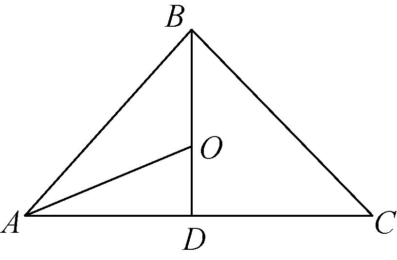
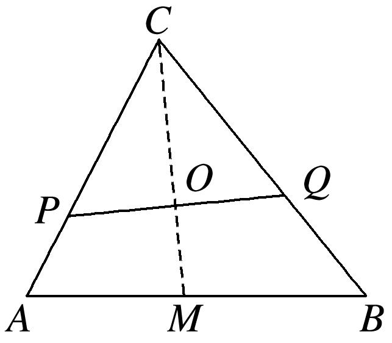
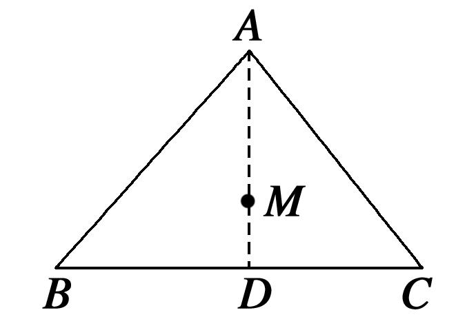
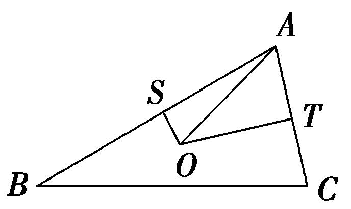
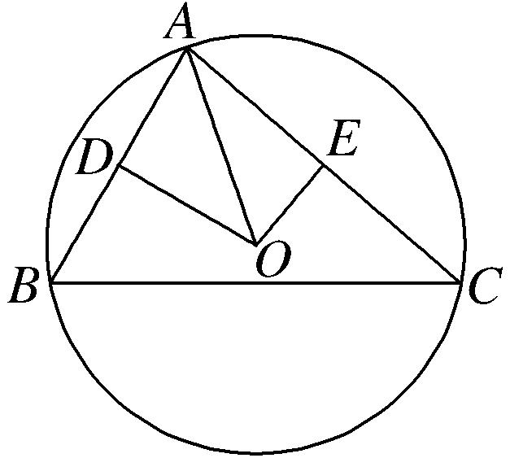
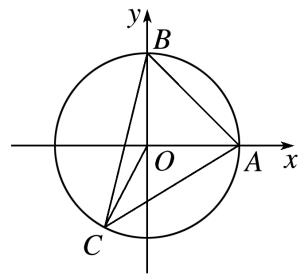

专题十　平面向量与三角形的四心

三角形四心的向量式

三角形“四心”向量形式的充要条件
设*O*为△*ABC*所在平面上一点，内角*A*，*B*，*C*所对的边分别为*a*，*b*，*c*，则  
（1）<em>O</em>为△<em>ABC</em>的重心⇔＋＋＝<strong>0</strong>．  
（2）<em>O</em>为△<em>ABC</em>的外心⇔||＝||＝||＝⇔sin 2<em>A</em>·＋sin 2<em>B</em>·＋sin 2<em>C</em>·＝<strong>0</strong>．  
（3）<em>O</em>为△<em>ABC</em>的内心⇔<em>a</em>＋<em>b</em>＋<em>c</em>＝0⇔ sin <em>A</em>·＋sin <em>B</em>·＋sin <em>C</em>·＝<strong>0</strong>．  
（4）<em>O</em>为△<em>ABC</em>的垂心⇔·＝·＝·⇔ tan <em>A</em>·＋tan <em>B</em>·＋tan <em>C</em>·＝<strong>0</strong>．

关于四心的概念及性质：  
（1）重心：三角形的重心是三角形三条中线的交点．

性质：①重心到顶点的距离与重心到对边中点的距离之比为2∶1．

②重心和三角形3个顶点组成的3个三角形面积相等．

③在平面直角坐标系中，重心的坐标是顶点坐标的算术平均数．即<em>G</em>为△<em>ABC</em>的重心，<em>A</em>(<em>x</em>1，<em>y</em>1)，<em>B</em>(<em>x</em>2，<em>y</em>2)，<em>C</em>(<em>x</em>3，<em>y</em>3)，则<em>G</em>．

④重心到三角形3个顶点距离的平方和最小．  
（2）垂心：三角形的垂心是三角形三边上的高的交点．

性质：锐角三角形的垂心在三角形内，直角三角形的垂心在直角顶点上，钝角三角形的垂心在三角形外．  
（3）内心：三角形的内心是三角形三条内角平分线的交点(或内切圆的圆心)．

性质：①三角形的内心到三边的距离相等，都等于内切圆半径*r*．

②，特别地，在Rt△*ABC*中，∠*C*=90°，．  
（4）外心：三角形三边的垂直平分线的交点(或三角形外接圆的圆心)．

性质：外心到三角形各顶点的距离相等．

考点一　三角形四心的判断

【例题选讲】

<strong>[例1]</strong> （1） 已知<em>A</em>，<em>B</em>，<em>C</em>是平面上不共线的三点，<em>O</em>为坐标原点，动点<em>P</em>满足＝[(1－<em>λ</em>)＋(1－<em>λ</em>)＋(1＋2<em>λ</em>)·]，<em>λ</em>∈<strong>R</strong>，则点<em>P</em>的轨迹一定经过(　　)

A．△*ABC*的内心　　　
B．△*ABC*的垂心　　　
C．△*ABC*的重心　　　
D．*AB*边的中点
答案　C　解析　取*AB*的中点*D*，则2＝＋，∵＝[(1－*λ*)＋(1－*λ*)＋(1＋2*λ*)]，∴＝[2(1－*λ*)＋(1＋2*λ*)]＝＋，而＋＝1，∴*P*，*C*，*D*三点共线，∴点*P*的轨迹一定经过△*ABC*的重心．  
（2）已知*O*是平面上的一定点，*A*，*B*，*C*是平面上不共线的三个动点，若动点*P*满足＝＋*λ*，*λ*∈(0，＋∞)，则点*P*的轨迹一定通过△*ABC*的\_\_\_\_\_\_\_\_．
答案　内心　解析　由条件，得－＝*λ*，即＝*λ*，而和分别表示平行于，的单位向量，故＋平分∠*BAC*，即平分∠*BAC*，所以点*P*的轨迹必过△*ABC*的内心．

  
（3）在△<em>ABC</em>中，设2－2＝2·，那么动点<em>M</em>的轨迹必经过△<em>ABC</em>的(　　)

A．垂心　　　　　　　　
B．内心　　　　　　　　
C．外心　　　　　　　　
D．重心
答案　C　解析　设<em>BC</em>边中点为<em>D</em>，∵2－2＝2 ·，∴(＋)·(－)＝2 ·，即·＝·，∴·＝0，则⊥，即<em>MD</em>⊥<em>BC</em>，∴<em>MD</em>为<em>BC</em>的垂直平分线，∴动点<em>M</em>的轨迹必经过△<em>ABC</em>的外心，故选C．  
（4）已知*O*是平面上的一个定点，*A*，*B*，*C*是平面上不共线的三个点，动点*P*满足＝＋*λ*(＋)，*λ*∈(0，＋∞)，则动点*P*的轨迹一定通过△*ABC*的(　　)

A．重心　　　　　　　　
B．垂心　　　　　　　　
C．外心　　　　　　　　
D．内心
答案　B　解析　因为＝＋*λ*(＋)，所以＝－＝*λ*(＋)，所以·＝·*λ*(＋)＝*λ*(－||＋||)＝0，所以⊥，所以点*P*在*BC*的高线上，即动点*P*的轨迹一定通过△*ABC*的垂心．

  
（5）已知的内角、、的对边分别为、、，为内一点，若分别满足下列四个条件：

①，②，

③，④

则点分别为的

A．外心、内心、垂心、重心　　　　　　　　
B．内心、外心、垂心、重心

C．垂心、内心、重心、外心　　　　　　　　
D．内心、垂心、外心、重心
答案　D  
（6）下列叙述正确的是\_\_\_\_\_\_\_\_．

①为的重心．

②为的垂心．

③为的外心．

④为的内心．

答案　①②　解析　①为的重心，①正确；②由，同理，，②正确；③．，

与角的平分线平行，必然落在角的角平分线上，③错误；④

为的外心，④错误．正确的叙述是①②．故答案为：①②．

【对点训练】

1．已知*O*是平面上的一定点，*A*，*B*，*C*是平面上不共线的三个动点，若动点*P*满足＝＋*λ*(＋)，

*λ*∈(0，＋∞)，则点*P*的轨迹一定通过△*ABC*的(　　)

A．内心　　　　　　
B．外心　　　　　　
C．重心　　　　　　
D．垂心

1．答案　C　解析　由原等式，得－＝*λ*(＋)，即＝*λ*(＋)，根据平行四边形法则，知＋是

△*ABC*的中线*AD*(*D*为*BC*的中点)所对应向量的2倍，所以点*P*的轨迹必过△*ABC*的重心．

2．是平面上一定点，，，是平面上不共线的三个点，动点满足，且，则点的轨迹一定通过的(　　)

A．内心　　　　　　
B．外心　　　　　　
C．重心　　　　　　
D．垂心

2．答案　C　解析　设的中点为．由已知原式可化为．即

，所以，所以，，三点共线．所以点在边的中线上．故点

的轨迹一定过的重心．

3．已知*O*是△*ABC*所在平面上的一定点，若动点*P*满足＝＋*λ*，*λ*∈(0，＋∞)，
则点*P*的轨迹一定通过△*ABC*的(　　)

A．内心　　　　　　
B．外心　　　　　　
C．重心　　　　　　
D．垂心

3．答案　C　解析　∵|*AB*|sin *B*＝|*AC*|sin *C*，设它们等于*t*，∴＝＋*λ*·(＋)，设*BC*的中点为*D*，
则＋＝2，*λ*·(＋)表示与共线的向量，而点*D*是*BC*的中点，即*AD*是△*ABC*的中线，∴点*P*的轨迹一定通过三角形的重心．故选C．

4．为所在平面内一点，，，为的角，若，则点

为的(　　)

A．垂心　　　　　　　　
B．外心　　　　　　　　
C．内心　　　　　　　　
D．重心

4．答案　C　解析　由正弦定理得，即，

由上式可得，所以

，所以与的平分线共线，即在的平分线上，同理可证，也在，的

平分线上，故是的内心．

5．在中，，，，则直线通过的

A．垂心　　　　　　　　
B．外心　　　　　　　　
C．内心　　　　　　　　
D．重心

5．答案　C　解析　，，，．即，设，

，则，．由向量加法的平行四边形法则可知，四边形为菱形．为菱形的对角线，平分．直线通过的内心．故选C．

6．已知所在的平面上的动点满足，则直线一定经过的

A．重心　　　　　　　　
B．外心　　　　　　　　
C．内心　　　　　　　　
D．垂心

6．答案　C　解析　，根据平行四边

形法则知表示的向量在三角形角的平分线上，而向量与共线，点的轨迹过的内心，故选C．

7．设的角、、的对边长分别为，，，是所在平面上的一点，

，则点是的

A．重心　　　　　　　　
B．外心　　　　　　　　
C．内心　　　　　　　　
D．垂心

7．答案　C　解析　因为，所以

，，所以，，所以，，所以，，所以是的平分线，是的平分线，所以点是的内心，故选C．

8．已知是所在平面上一点，若，则是的(  )．

A．重点　　　　　　　　
B．外心　　　　　　　　
C．内心　　　　　　　　
D．垂心

8．答案　B　解析

9．*P*是△*ABC*所在平面内一点，若·＝·＝·，则*P*是△*ABC*的(　　)

A．外心　　　　　　　　
B．内心　　　　　　　　
C．重心　　　　　　　　
D．垂心

9．答案　D　解析　由·＝·，可得·(－)＝0，即·＝0，∴⊥，同理可证⊥

，⊥．∴*P*是△*ABC*的垂心．

10．若为所在平面内一点，且则点是的(　　)

A．外心　　　　　　　　
B．内心　　　　　　　　
C．重心　　　　　　　　
D．垂心

10．答案　D　解析

11．已知是所在平面内一点，且满足，则点

A．在边的高所在的直线上　　　　　　　　
B．在平分线所在的直线上

C．在边的中线所在的直线上　　　　　　　　
D．是的外心

11．答案　A　解析　取的中点，则，

，，，，点在边的高所在的直线上，故选A．

12．已知为所在平面内一点，且满足，则点的轨迹一定通

过的

A．外心　　　　　　　　
B．内心　　　　　　　　
C．重心　　　　　　　　
D．垂心

12．答案　D　解析　，、，由

，得，，

即，，则，

，．是的垂心．故选D．

13．已知，，在所在的平面内，且，且

，则，，分别是的

A．重心、外心、垂心　　　　　　　　　　
B．重心、外心、内心

C．外心、重心、垂心　　　　　　　　　　
D．外心、重心、内心

13．答案　C

14．点是平面上一定点，、、是平面上的三个顶点，以下命题正确的是\_\_\_\_\_\_\_\_．（把你

认为正确的序号全部写上）．①②③④⑤

①动点满足，则的重心一定在满足条件的点集合中；

②动点满足，则的内心一定在满足条件的点集合中；

③动点满足，则的重心一定在满足条件的点集合中；

④动点满足，则的垂心一定在满足条件的点集合中；

⑤动点满足，则的外心一定在满足条件的点集合中．

14．答案　①②③④⑤　解析　对于①，动点满足，，则点是

的心，故①正确；对于②，动点满足，

，又在的平分线上，与的平分线所在向量共线，

的内心在满足条件的点集合中，②正确；对于③，动点满足

，，，过点作，垂足为，则

，，向量与边的中线共线，因此的重心一定

在满足条件的点集合中，③正确；对于④，动点满足，

，

，，的垂心一定在满足条件的点集合中，④正确；对于⑤，动点满

足，设，则

，由④知，，，点的轨迹为

过的的垂线，即的中垂线；的外心一定在满足条件的点集合，⑤正确．故正确的

命题是①②③④⑤．

考点二　三角形四心的应用

【例题选讲】

<strong>[例2]</strong> （1）在△<em>ABC</em>中，角<em>A</em>，<em>B</em>，<em>C</em>的对边分别为<em>a</em>，<em>b</em>，<em>c</em>，重心为<em>G</em>，若<em>a</em>＋<em>b</em>＋<em>c</em>＝0，则<em>A</em>＝\_\_\_\_\_\_\_\_\_\_．
答案　　解析　由*G*为△*ABC*的重心知＋＋＝0，则＝－－，因此*a* ＋*b* ＋

*c*(－－)＝＋＝0，又，不共线，所以*a*－*c*＝*b*－*c*＝0，即*a*＝*b*＝*c*．由余弦定理得cos *A*＝＝＝，又0<*A*<π，所以*A*＝．  
（2）在△*ABC*中，*AB*＝*BC*＝2，*AC*＝3，设*O*是△*ABC*的内心．若＝*p*＋*q*，则＝\_\_\_\_\_\_\_\_．
答案　　解析　如图，<em>O</em>为△<em>ABC</em>的内心，<em>D</em>为<em>AC</em>中点，则<em>O</em>在线段<em>BD</em>上，cos∠<em>DAO</em>＝＝，根据余弦定理cos∠<em>BAC</em>＝＝；由＝<em>p</em>＋<em>q</em>得·＝<em>p</em>2＋<em>q</em>·，所以cos∠<em>BAO</em>＝<em>p</em>2＋<em>q</em>cos∠<em>BAC</em>，所以3＝4<em>p</em>＋<em>q</em>　①；同理·＝<em>p</em>·＋<em>q</em>2，所以可以得到＝<em>p</em>＋9<em>q</em> ②．①②联立可求得<em>p</em>＝，<em>q</em>＝，所以＝．

  
（3）已知在△*ABC*中，*AB*＝1，*BC*＝，*AC*＝2，点*O*为△*ABC*的外心，若＝*x*＋*y*，则有序实数对(*x*，*y*)为(　　)

A．　　　　　　
B．　　　　　　
C．　　　　　　
D．
答案　A　解析　取<em>AB</em>的中点<em>M</em>和<em>AC</em>的中点<em>N</em>，连接<em>OM</em>，<em>ON</em>，则⊥，⊥，＝－＝－(<em>x</em>＋<em>y</em>)＝－<em>y</em>，＝－＝－(<em>x</em>＋<em>y</em>)＝－<em>x</em>．由⊥，得2－<em>y</em>·＝0，①，由⊥，得2－<em>x</em>·＝0，②，又因为2＝(－)2＝2－2·＋2，所以·＝＝－，③，把③代入①、②得解得<em>x</em>＝，<em>y</em>＝．故实数对(<em>x</em>，<em>y</em>)为．  
（4）在△*ABC*中，*O*是△*ABC*的垂心，点*P*满足：3＝＋＋2，则△*ABP*的面积与△*ABC*的面积之比是\_\_\_\_\_\_\_\_．
答案　　解析　如图，设*AB*的中点为*M*，设＋＝，则*N*是*AB*的中点，点*N*与*M*重合，故由3＝＋＋2，可得2＝*－*＋2，即2*－* 2＝*－*，也即＝2，由向量的共线定理可得*C*、*P*、*M*共线，且*MP*＝*MC*，所以结合图形可得△*ABP*的面积与△*ABC*的面积之比是．

  
（5）著名数学家欧拉提出了如下定理：三角形的外心、重心、垂心依次位于同一直线上，且重心到外心的距离是重心到垂心距离的一半．此直线被称为三角形的欧拉线，该定理则被称为欧拉线定理．设点*O*，*H*分别是的外心、垂心，且为中点，则

A．　　　　　　　　
B．

C．　　　　　　　　
D．

答案　D　解析　如图所示的，其中角为直角，则垂心与重合，为的外心，，即为斜边的中点，又为中点，，为中点，  ．故选D．

【对点训练】

1．在△*ABC*中，*O*为△*ABC*的重心，*AB*＝2，*AC*＝3，*A*＝60°，则·＝\_\_\_\_\_\_\_\_．

1．答案　4　解析　设*BC*边中点为*D*，则＝，＝(＋)，∴ ·＝(＋)·＝

(3×2×cos 60°＋32)＝4．

2．设*G*为△*ABC*的重心，且sin*A*·＋sin*B*·＋sin*C*·＝0，则*B*的大小为\_\_\_\_\_\_\_\_．

2．答案　60°　解析　∵*G*是△*ABC*的重心，∴＋＋＝0，＝－(＋)，将其代入sin*A*·

＋sin*B*·＋sin*C*·＝0，得(sin*B*－sin*A*)＋(sin*C*－sin*A*)＝0．又，不共线，∴sin*B*－sin*A*＝0，sin*C*－sin*A*＝0，则sin*B*＝sin*A*＝sin*C*．根据正弦定理知*b*＝*a*＝*c*，∴三角形*ABC*是等边三角形，则角*B*＝60°．

秒杀　∵<em>G</em>为△<em>ABC</em>的重心，∴＋＋＝<strong>0</strong>，又∵sin<em>A</em>·＋sin<em>B</em>·＋sin<em>C</em>·＝0，∴sin<em>A</em>＝sin<em>B</em>＝sin<em>C</em>，∴三角形<em>ABC</em>是等边三角形，则角<em>B</em>＝60°．

3．已知△*ABC*的三个内角为*A*，*B*，*C*，重心为*G*，若2sin *A*·＋sin *B*·＋3sin *C*·＝0，则cos *B*＝

\_\_\_\_\_\_\_\_．

3．答案　　解析　设*a*，*b*，*c*分别为角*A*，*B*，*C*所对的边，由正弦定理得2*a*·＋*b*·＋3*c*·＝0，
则2*a*·＋*b*·＝－3*c*·＝－3*c*(－－)，即(2*a*－3*c*) ＋(*b*－3*c*) ＝0．又，不共线，所以由此得2*a*＝*b*＝3*c*，所以*a*＝*b*，*c*＝*b*，于是由余弦定理得cos *B*＝＝．

秒杀　∵<em>G</em>为△<em>ABC</em>的重心，∴＋＋＝<strong>0</strong>，又∵2sin <em>A</em>·＋sin <em>B</em>·＋3sin <em>C</em>·＝0，∴2sin<em>A</em>＝sin<em>B</em>＝3sin<em>C</em>，∴2<em>a</em>＝<em>b</em>＝3<em>c</em>，所以<em>a</em>＝<em>b</em>，<em>c</em>＝<em>b</em>，于是由余弦定理得cos <em>B</em>＝＝．

4．在△*ABC*中，*AB*＝1，∠*ABC*＝60°，·＝－1，若*O*是△*ABC*的重心，则·＝\_\_\_\_\_\_\_\_．

4．答案　5　解析　如图所示，以*B*为坐标原点，*BC*所在直线为*x*轴，建立平面直角坐标系．

∵*AB*＝1，∠*ABC*＝60°，∴*A*．设*C*(*a，* 0)．∵·＝－1，∴·＝

－＋＝－1，解得*a*＝4．∵*O*是△*ABC*的重心，延长*BO*交*AC*于点*D*，∴＝＝×(

＋)＝＝．∴·＝·＝5．

5．过△*ABC*重心*O*的直线*PQ*交*AC*于点*P*，交*BC*于点*Q*，＝，＝*n*，则*n*的值为\_\_\_\_．

5．答案　　解析　因为<em>O</em>是重心，所以＋＋＝<strong>0</strong>，即＝－－，＝⇒－＝

(－)⇒＝＋＝－－，＝*n*⇒－＝*n*(－)⇒＝*n*＋(1－*n*) ，因为*P*，*O*，*Q*三点共线，所以∥，所以－(1－*n*)＝－*n*，解得*n*＝．

6．已知△<em>ABC</em>和点<em>M</em>满足＋＋＝<strong>0，</strong>若存在实数<em>m</em>，使得＋＝<em>m</em>成立，则<em>m</em>等于(　　)

A．2　　　　　　　　　
B．3　　　　　　　　　
C．4　　　　　　　　　
D．5

6．答案　B　解析　∵＋＋＝0，∴*M*为△*ABC*的重心．连接*AM*并延长交*BC*于*D*，则*D*为

*BC*的中点．∴＝．又＝(＋)，∴＝(＋)，即＋＝3，∴*m*＝3，故选B．

7．已知*O*是△*ABC*内一点，＋＋＝0，·＝2且∠*BAC*＝60˚，则△*OBC*的面积为(　　)

A．　　　　　　　
B．　　　　　　　　
C．　　　　　　　　
D．

7．答案　A　解析　∵＋＋＝0，∴<em>O</em>是△<em>ABC</em>的重心，于是<em>S</em>△<em>OBC</em>＝<em>S</em>△<em>ABC</em>．∵·＝2，∴

||·||·cos∠<em>BAC</em>＝2，∵∠<em>BAC</em>＝60˚，∴||·||＝4．又<em>S</em>△<em>ABC</em>＝||·||sin∠<em>BAC</em>＝，∴△<em>OBC</em>的面积为，故选A．

8．已知在△<em>ABC</em>中，点<em>O</em>满足＋＋＝<strong>0</strong>，点<em>P</em>是<em>OC</em>上异于端点的任意一点，且＝<em>m</em>＋<em>n</em>，
则*m*＋*n*的取值范围是\_\_\_\_\_\_\_\_．

8．答案　(－2，0)　解析　依题意，设＝*λ* (0<*λ*<1)，由＋＋＝0，知＝－(＋)，
所以＝－*λ*－*λ*，由平面向量基本定理可知，*m*＋*n*＝－2*λ*，所以*m*＋*n*∈(－2，0)．

9．已知点*O*为△*ABC*外接圆的圆心，且＋＋＝0，则△*ABC*的内角*A*等于(　　)

A．30°　　　　　　　　　
B．60°　　　　　　　　　
C．90°　　　　　　　　　
D．120°

9．答案　B　解析　由＋＋＝0，知点*O*为△*ABC*的重心，又*O*为△*ABC*外接圆的圆心，∴△

*ABC*为等边三角形，*A*＝60°．

10．已知*O*是△*ABC*的外心，||＝4，||＝2，则·(＋)＝(　　)

A．10　　　　　　　　
B．9　　　　　　　　
C．8　　　　　　　　
D．6

10．答案　A　解析　作*OS*⊥*AB*，*OT*⊥*AC*∵*O*为△*ABC*的外接圆圆心．∴*S*、*T*为*AB*，*AC*的中点，且·

＝0，·＝0，＝＋，＝＋，∴·(＋)＝·＋·＝(＋)·＋(＋)·＝·＋·＋·＋·＝·＋·＝||2＋||2＝8＋2＝10．故选A．

优解：不妨设∠*A*＝90°，建立如图所示平面直角坐标系．设*B*(4，0)，*C*(0，2)，则*O*为*BC*的中点*O*(2，

1)，∴＋＝2，∴·(＋)＝2||2＝2(4＋1)＝10．故选A．

11．若点*P*是△*ABC*的外心，且＋＋*λ*＝0，∠*ACB*＝120°，则实数*λ*的值为(　　)

A．　　　　　　　　
B．－　　　　　　　　
C．－1　　　　　　　　
D．1

11．答案　C　解析　设*AB*的中点为*D*，则＋＝2．因为＋＋*λ*＝0，所以2＋*λ*＝0，
所以向量，共线．又*P*是△*ABC*的外心，所以*PA*＝*PB*，所以*PD*⊥*AB*，所以*CD*⊥*AB*．因为∠*ACB*＝120°，所以∠*APB*＝120°，所以四边形*APBC*是菱形，从而＋＝2＝，所以2＋*λ*＝＋*λ*＝0，所以*λ*＝－1，故选C．

12．△<em>ABC</em>的外接圆的圆心为<em>O</em>，半径为1，若＋＋＝<strong>0</strong>，且||＝||，则·等于(　　)

A．　　　　　　　　
B．　　　　　　　　
C．3　　　　　　　　
D．2

12．答案　C　解析　∵＋＋＝<strong>0</strong>，∴＝－，故点<em>O</em>是<em>BC</em>的中点，且△<em>ABC</em>为直角三角形，
又△*ABC*的外接圆的半径为1，||＝||，∴*BC*＝2，*AB*＝1，*CA*＝，∠*BCA*＝30°，∴·＝||||·cos 30°＝×2×＝3．

13．若△*ABC*的面积为，·＝2，则△*ABC*外接圆面积的最小值为(　　)

A．π　　　　　　　　
B．　　　　　　　　
C．2π　　　　　　　　
D．

13．答案　B　解析　设△*ABC*内角*A*，*B*，*C*所对的边分别为*a*，*b*，*c*．由题意可得*bc*sin *A*＝，*bc*cos *A*

＝2，∴tan <em>A</em>＝．又<em>A</em>∈(0，π)，∴<em>A</em>＝．∴<em>bc</em>cos＝2，即<em>bc</em>＝4．由余弦定理可得<em>a</em>2＝<em>b</em>2＋<em>c</em>2－2<em>bc</em>cos <em>A</em>＝<em>b</em>2＋<em>c</em>2－<em>bc</em>≥<em>bc</em>＝4，即<em>a</em>≥2．又由正弦定理得＝2<em>R</em>(<em>R</em>为△<em>ABC</em>外接圆的半径)，∴2<em>R</em>sin <em>A</em>＝<em>a</em>≥2，即<em>R</em>≥2，∴<em>R</em>2≥，∴三角形外接圆面积的最小值为．

14．已知<em>O</em>为锐角△<em>ABC</em>的外心，||＝3，||＝2，若＝<em>x</em>＋<em>y</em>，且9<em>x</em>＋12<em>y</em>＝8，记<em>I</em>1＝·，

<em>I</em>2＝·，<em>I</em>3＝·，则(　　)

A．<em>I</em>2&lt;<em>I</em>1&lt;<em>I</em>3　　　　　
B．<em>I</em>3&lt;<em>I</em>2&lt;<em>I</em>1　　　　　
C．<em>I</em>3&lt;<em>I</em>1&lt;<em>I</em>2　　　　　
D．<em>I</em>2&lt;<em>I</em>3&lt;<em>I</em>1

14．解析：选D　如图，分别取*AB*，*AC*的中点，为*D*，*E*，并连接*OD*，*OE*，根据条件有*OD*⊥*AB*，*OE*

⊥<em>AC</em>，∴·＝||2＝，·＝||2＝6，

∴·＝(<em>x</em>＋<em>y</em>)·＝9<em>x</em>＋6<em>y</em>·cos∠<em>BAC</em>＝，①，·＝(<em>x</em>＋<em>y</em>)·＝6<em>x</em>cos∠<em>BAC</em>＋12<em>y</em>＝6，②，又9<em>x</em>＋12<em>y</em>＝8，③，∴由①②③解得cos∠<em>BAC</em>＝．由余弦定理得，<em>BC</em>＝＝．∴<em>BC</em>&gt;<em>AC</em>&gt;<em>AB</em>．在△<em>ABC</em>中，由大边对大角得，∠<em>BAC</em>&gt;∠<em>ABC</em>&gt;∠<em>ACB</em>，∴∠<em>BOC</em>&gt;∠<em>AOC</em>&gt;∠<em>AOB</em>，∵||＝||＝||，且余弦函数在(0，π)上为减函数，∴·&lt;·&lt;·，即<em>I</em>2&lt;<em>I</em>3&lt;<em>I</em>1<strong>．</strong>

15．已知<em>O</em>是△<em>ABC</em>的外心，∠<em>C</em>＝45°，则＝<em>m</em>＋<em>n</em>(<em>m</em>，<em>n</em>∈<strong>R</strong>)，则<em>m</em>＋<em>n</em>的取值范围是(　　)

A．[－，]　　　　
B．[－，1)　　　　
C．[－，－1]　　　　
D．(1，]

15．答案　B　解析　由题意∠*C*＝45°，所以∠*AOB*＝90°，以*OA*，*OB*为*x*，*y*轴建立平面直角坐标系，
如图，不妨设*A*(1,0)，*B*(0,1)，则*C*在圆*O*的优弧*AB*上，设*C*(cos*α*，sin*α*)，则*α*∈，显然＝cos *α*＋sin *α*，

即*m*＝cos*α*，*n*＝sin*α*，*m*＋*n*＝cos*α*＋sin*α*＝sin，由于*α*∈，所以*α*＋∈， sin∈，所以*m*＋*n*∈[－，1)，故选B．

16．已知点*G*是△*ABC*的外心，，，是三个单位向量，且2＋＋＝0，△*ABC*的顶

点*B*，*C*分别在*x*轴的非负半轴和*y*轴的非负半轴上移动，如图所示，点*O*是坐标原点，则||的最大值为(　　)

A．1　　　　　　　　
B．2　　　　　　　　
C．3　　　　　　　　
D．4

16．答案　B　解析　因为点*G*是△*ABC*的外心，且2＋＋＝0，所以点*G*是*BC*的中点，△*ABC*

是直角三角形，且∠*BAC*是直角．又，，是三个单位向量，所以*BC*＝2，又△*ABC*的顶点*B*，*C*分别在*x*轴的非负半轴和*y*轴的非负半轴上移动，在Rt△*BOC*中，*OG*是斜边*BC*上的中线，则|*OG*|＝|*BC*|＝1，所以点*G*的轨迹是以原点为圆心、1为半径的圆弧．又||＝1，所以当*OA*经过*BC*的中点*G*时，||取得最大值，且最大值为2||＝2．

17．在锐角三角形*ABC*中，角*A*，*B*，*C*所对的边分别为*a*，*b*，*c*，点*O*为△*ABC*的外接圆的圆心，*A*＝，

且＝*λ*＋*μ*，则*λμ*的最大值为\_\_\_\_\_\_\_\_．

17．答案　　解析　∵△*ABC*是锐角三角形，∴*O*在△*ABC*的内部，∴0<*λ*<1,0<*μ*<1．由＝*λ*(－)

＋<em>μ</em>(－)，得(1－<em>λ</em>－<em>μ</em>)＝<em>λ</em>＋<em>μ</em>，两边平方后得，(1－<em>λ</em>－<em>μ</em>)22＝(<em>λ</em>＋<em>μ</em>)2＝<em>λ</em>22＋<em>μ</em>22＋2<em>λμ</em>·，∵<em>A</em>＝，∴∠<em>BOC</em>＝，又||＝||＝||．∴(1－<em>λ</em>－<em>μ</em>)2＝<em>λ</em>2＋<em>μ</em>2－<em>λμ</em>，∴1＋3<em>λμ</em>＝2(<em>λ</em>＋<em>μ</em>)，∵0&lt;<em>λ</em>&lt;1,0&lt;<em>μ</em>&lt;1，∴1＋3<em>λμ</em>≥4，设＝<em>t</em>，∴3<em>t</em>2－4<em>t</em>＋1≥0，解得<em>t</em>≥1(舍)或<em>t</em>≤，即≤⇒<em>λμ</em>≤，∴<em>λμ</em>的最大值是．

18．已知*P*是边长为3的等边三角形*ABC*外接圆上的动点，则的最大值为(　　)

A．2　　　　　　　　
B．3　　　　　　　　
C．4　　　　　　　　
D．5

18．答案　D　解析　设△<em>ABC</em>的外接圆的圆心为<em>O</em>，则圆的半径为×＝，＋＋＝<strong>0</strong>，故

＋＋2＝4＋．又2＝51＋8·≤51＋24＝75，故≤5，当，同向共线时取最大值．

19．已知是锐角三角形的外接圆的圆心，且，若，则*m*＝(　　)

A．　　　　　　　
B．　　　　　　　
C．　　　　　　　　
D．不能确定

19．答案　A　解析　设外接圆半径为，则：可化为：

．易知与的夹角为，与的夹角为，与的夹角为0，．则对式左右分别与作数量积，可得：

．即．

，，即．因为

且，所以，，故选A．

20．在中，，，分别为的重心和外心，且，则的形状是(　　)

A．锐角三角形　　　
B．钝角三角形　　　
C．直角三角形　　　
D．上述三种情况都有可能

20．答案　B　解析　在中，，分别为的重心和外心，取的中点为，连接、、，如图：则，，，，由，则，即，则，又，则有，由余弦定理可得，即有为钝角．则三角形为钝角三角形．故选B．

21．在中，，，，若点为的内心，则的值为

A．2　　　　　　　　
B．　　　　　　　　
C．3　　　　　　　　
D．

21．答案　D　解析　，，由为的内心可知，平分，设圆交

与，由余弦定理可得，，

，内切圆的半径为，则根据内切圆的半径公式，

，在三角形中，，，
故选D．

22．设<em>O</em>是△<em>ABC</em>的内心，<em>AB</em>＝<em>c</em>，<em>AC</em>＝<em>b</em>，若＝<em>λ</em>1＋<em>λ</em>2，则(　　)

A．＝　　　　　　
B．＝　　　　　　
C．＝　　　　　　
D．＝

22．答案　A　解析　设＝<em>λ</em>1，＝<em>λ</em>2．因为<em>O</em>是△<em>ABC</em>的内心，所以<em>AO</em>平分∠<em>BAC</em>，所以平

行四边形<em>AMON</em>为菱形，且<em>λ</em>1&gt;0，<em>λ</em>2&gt;0，由||＝||，得|<em>λ</em>1|＝|<em>λ</em>2|，即<em>λ</em>1<em>c</em>＝<em>λ</em>2<em>b</em>，亦即＝，故选A．

23．在△*ABC*中，*AB*＝5，*AC*＝6，cos *A*＝，*O*是△*ABC*的内心，若＝*x*＋*y*，其中*x*，*y*∈[0，1]，
则动点*P*的轨迹所覆盖图形的面积为(　　)

A．　　　　　　　　
B．　　　　　　　　
C．4　　　　　　　　
D．6

23．答案　B　解析　根据向量加法的平行四边形法则可知，动点*P*的轨迹是以*OB*，*OC*为邻边的平行四

边形及其内部，其面积为△<em>BOC</em>的面积的2倍．在△<em>ABC</em>中，设内角<em>A</em>，<em>B</em>，<em>C</em>所对的边分别为<em>a</em>，<em>b</em>，<em>c</em>，由余弦定理<em>a</em>2＝<em>b</em>2＋<em>c</em>2－2<em>bc</em>cos <em>A</em>，得<em>a</em>＝7．设△<em>ABC</em>的内切圆的半径为<em>r</em>，则<em>bc</em>sin <em>A</em>＝(<em>a</em>＋<em>b</em>＋<em>c</em>)<em>r</em>，解得<em>r</em>＝，所以<em>S</em>△<em>BOC</em>＝×<em>a</em>×<em>r</em>＝×7×＝．故动点<em>P</em>的轨迹所覆盖图形的面积为2<em>S</em>△<em>BOC</em>＝．

24．在△*ABC*中，已知向量与满足·＝0，且·＝，则△*ABC*为(　　)

A．等边三角形　
B．直角三角形　
C．等腰非等边三角形　
D．三边均不相等的三角形

24．答案　A　解析　，分别为平行于，的单位向量，由平行四边形法则可知＋为

∠*BAC*的平分线．因为·＝0，所以∠*BAC*的平分线垂直于*BC*，所以*AB*＝*AC*．又·＝·cos∠*BAC*＝，所以cos∠*BAC*＝，又0<∠*BAC*<π，故∠*BAC*＝，所以△*ABC*为等边三角形．

25．外接圆的圆心为，两条边上的高的交点为，，则实数的值(　　)

A．　　　　　　　　
B．2　　　　　　　　
C．1　　　　　　　　
D．

25．答案　C　解析　如图，，，，

，取边的中点，连接，则，，

．又，．，

，又不恒为0，必有，解得．故选C．

