# 专题二 平面向量的数量积

# 1. 向量的夹角

(1)定义：已知两个非零向量 a 和 b，作 $\overrightarrow{OA}=a,\quad\overrightarrow{OB}=b$ ，则 $\angle AOB$ 就是向量 a 与 b 的夹角.

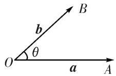

(2)范围：设 $\theta$ 是向量a与b的夹角，则 $0^{\circ}\leq\theta\leq180^{\circ}$ .  
(3)共线与垂直：若 $\theta=0^{\circ}$ ，则a与b同向；若 $\theta=180^{\circ}$ ，则a与b反向；若 $\theta=90^{\circ}$ ，则a与b垂直.

# 2. 平面向量的数量积

(1)定义: 已知两个非零向量 $a$ 与 $b$ , 它们的夹角为 $\theta$ , 则数量 $|a||b|\cos \theta$ 叫做 $a$ 与 $b$ 的数量积 (或内积), 记作 $a \cdot b$ , 即 $a \cdot b = |a||b|\cos \theta$ , 规定零向量与任一向量的数量积为 0, 即 $0 \cdot a = 0$ .

投影向量：向量 a 在向量 b 上的投影向量为 $\left|a\right|\cos\theta\frac{b}{\left|b\right|}=\frac{(a\cdot b)b}{\left|b\right|^{2}}$ .

(2)坐标表示：若 $\boldsymbol{a}=(x_{1},y_{1})$ ， $\boldsymbol{b}=(x_{2},y_{2})$ ，则 $a\cdot b=x_{1}x_{2}+y_{1}y_{2}$ .

# 3. 平面向量数量积的运算律

(1) $a\cdot b=b\cdot a$ (交换律); (2) $\lambda a\cdot b=\lambda(a\cdot b)=a\cdot(\lambda b)$ (结合律); (3) $(a+b)\cdot c=a\cdot c+b\cdot c$ (分配律).

# 4. 平面向量数量积运算的常用公式

(1) $(a + b)\cdot (a - b) = a^2 -b^2$ . (2) $(a + b)^{2} = a^{2} + 2a\cdot b + b^{2}$ . (3) $(a - b)^{2} = a^{2} - 2a\cdot b + b^{2}$

# 考点一 求平面向量数量积

# 【方法总结】

# 平面向量数量积的两种求法

(1)若已知向量的模和夹角时, 则利用定义法求解, 即 $a \cdot b = |a||b|\cos < a$ , $b>$ . 若未知向量的模和夹角时, 则可通过向量加法(减法)的三角形法则转化为已知模和夹角的向量的数量积进行求解;  
(2)若已知向量的坐标时，则利用坐标法求解，即若 $a = (x_{1}, y_{1})$ ， $b = (x_{2}, y_{2})$ ，则 $a \cdot b = x_{1}x_{2} + y_{1}y_{2}$ 。若未知向量的坐标时，如已知图形为矩形、正方形、直角梯形、等边三角形、等腰三角形或直角三角形时，则可建立平面直角坐标系求出未知向量的坐标进行求解。

# 【例题选讲】

[例 1](1)(2018·全国 II)已知向量 a, b 满足 $|a|=1$ , $a\cdot b=-1$ ，则 $a\cdot(2a-b)=(\quad)$

A. 4

B. 3

C. 2

D. 0

(2)若向量 $\boldsymbol{m}=(2k-1,\ k)$ 与向量 $\boldsymbol{n}=(4,\ 1)$ 共线，则 $\boldsymbol{m}\cdot\boldsymbol{n}=()$

A. 0

B. 4

C. $-\frac{9}{2}$

D. $-\frac{17}{2}$

(3)如图，已知非零向量 $\overrightarrow{AB}$ 与 $\overrightarrow{AC}$ 满足 $(\frac{\overrightarrow{AB}}{|\overrightarrow{AB}|} +\frac{\overrightarrow{AC}}{|\overrightarrow{AC}|})\cdot \overrightarrow{BC} = 0$ ，且 $|\overrightarrow{AB} -\overrightarrow{AC}| = 2\sqrt{3}$ ， $|\overrightarrow{AB} +\overrightarrow{AC}| = 2\sqrt{6}$ ，点 $D$ 是 $\triangle ABC$ 中边 $BC$ 的中点，则 $\overrightarrow{AB}\cdot \overrightarrow{BD} = \_$ .

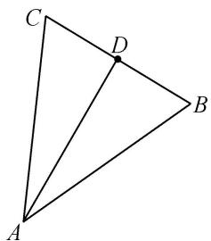

natural_image

Geometric diagram of triangle ABC with point D on side BC (no labels or measurements)

(4)(2016·天津)如图，已知 $\triangle ABC$ 是边长为 1 的等边三角形，点 $D$ ， $E$ 分别是边 $AB$ ， $BC$ 的中点，连接 $DE$ 并延长到点 $F$ ，使得 $DE = 2EF$ ，则 $\overrightarrow{AF} \cdot \overrightarrow{BC}$ 的值为（）

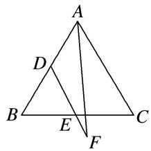

text_image

A
D
B
E
F
C

A. $-\frac{5}{8}$

B. $\frac{1}{8}$

C. $\frac{1}{4}$

D. $\frac{11}{8}$

(5)(2018·天津)在如图的平面图形中，已知 $OM = 1$ ， $ON = 2$ ， $\angle MON = 120^{\circ}$ ， $\vec{BM} = 2\vec{MA}$ ， $\vec{CN} = 2\vec{NA}$ 则 $\vec{BC}\cdot \vec{OM}$ 的值为（）

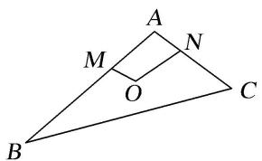

text_image

A
M
N
O
B
C

A. -15

B. -9

C. -6

D. 0

(6)在 $\triangle ABC$ 中， $AB=4$ ， $BC=6$ ， $\angle ABC=\frac{\pi}{2}$ ， $D$ 是 $AC$ 的中点， $E$ 在 $BC$ 上，且 $AE\perp BD$ ，则 $\overrightarrow{AE}\cdot\overrightarrow{BC}$ 等于（）

A. 16

B. 12

C. 8

D. -4

(7)已知在直角三角形 ABC 中， $\angle ACB=90^{\circ}, AC=BC=2$ ，点 P 是斜边 AB 上的中点，则 $\overrightarrow{CP}\cdot\overrightarrow{CB}+\overrightarrow{CP}\cdot\overrightarrow{CA}=$ \_\_\_\_.

(8)如图， $\triangle AOB$ 为直角三角形， $OA=1$ ， $OB=2$ ， $C$ 为斜边 $AB$ 的中点， $P$ 为线段 $OC$ 的中点，则 $\overrightarrow{AP} \cdot \overrightarrow{OP} = (\quad)$

A. 1

B. $\frac{1}{16}$

C. $\frac{1}{4}$

D. $-\frac{1}{2}$

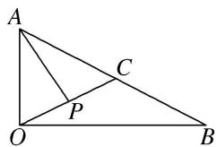

text_image

A
C
P
O
B

(9)如图，平行四边形ABCD中， $AB = 2$ ， $AD = 1$ ， $A = 60^{\circ}$ ，点 $M$ 在 $AB$ 边上，且 $AM = \frac{1}{3} AB$ ，则 $\overrightarrow{DM}\cdot \overrightarrow{DB}$ $=$ \_\_\_\_.

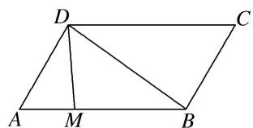

text_image

D
C
A M B

(10)如图所示，在平面四边形ABCD中，若AC=3，BD=2，则 $(\overrightarrow{AB}+\overrightarrow{DC})\cdot(\overrightarrow{AC}+\overrightarrow{BD})=$ \_\_\_\_.

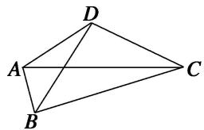

natural_image

Geometric diagram of a tetrahedron with vertices labeled A, B, C, D (no text or symbols beyond labels)

(11)在平面四边形ABCD中，已知 $AB = 3$ ， $DC = 2$ ，点 $E$ ， $F$ 分别在边 $AD$ ， $BC$ 上，且 $\overrightarrow{AD} = 3\overrightarrow{AE}$ ， $\overrightarrow{BC} = 3\overrightarrow{BF}$ ，若向量 $\overrightarrow{AB}$ 与 $\overrightarrow{DC}$ 的夹角为 $60^{\circ}$ ，则 $\overrightarrow{AB} \cdot \overrightarrow{EF}$ 的值为\_\_\_\_.

(12)如图，在四边形ABCD中，点E，F分别是边AD，BC的中点，设 $\overrightarrow{AD}\cdot\overrightarrow{BC}=m,\quad\overrightarrow{AC}\cdot\overrightarrow{BD}=n$ 。若 $AB=\sqrt{2},EF=1,CD=\sqrt{3}$ ，则()

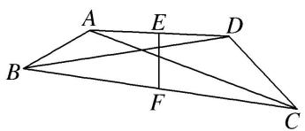

text_image

A
E
D
B
F
C

A. 2m-n=1

B. $2m - 2n = 1$

C. $m - 2n = 1$

D. 2n-2m=1

(13)(2017·浙江)如图，已知平面四边形 $ABCD$ ， $AB\bot BC$ ， $AB = BC = AD = 2$ ， $CD = 3$ ， $AC$ 与 $BD$ 交于点 $O$ 。记 $I_{1} = \overrightarrow{OA}\cdot \overrightarrow{OB}$ ， $I_{2} = \overrightarrow{OB}\cdot \overrightarrow{OC}$ ， $I_{3} = \overrightarrow{OC}\cdot \overrightarrow{OD}$ ，则（）

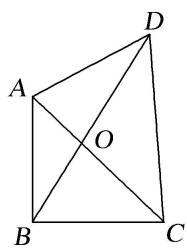

text_image

Geometric diagram of quadrilateral ABCD with diagonals intersecting at point O

A. $I_{1}<I_{2}<I_{3}$

B. $I_{1}<I_{3}<I_{2}$

C. $I_{3}<I_{1}<I_{2}$

D. $I_{2} <   I_{1} <   I_{3}$

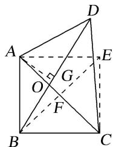

text_image

Geometric diagram of a square ABCD with diagonals and auxiliary lines, labeled points A, B, C, D, E, F, G, O

(14)已知扇形 OAB 的半径为 2，圆心角为 $\frac{2\pi}{3}$ ，点 C 是弧 AB 的中点， $\overrightarrow{OD} = -\frac{1}{2}\overrightarrow{OB}$ ，则 $\overrightarrow{CD} \cdot \overrightarrow{AB}$ 的值为（）

A. 3

B. 4

C.-3

D. -4

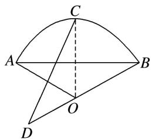

text_image

Geometric diagram with labeled points A, B, C, D, O and lines forming a semicircle and quadrilateral

【对点训练】

1. 已知 $|a|=|b|=1$ ，向量a与b的夹角为 $45^{\circ}$ ，则 $(a+2b)\cdot a=$ \_\_\_\_.  
2. 已知向量 a, b 的夹角为 $\frac{3\pi}{4}$ ， $|a| = \sqrt{2}$ ， $|b| = 2$ ，则 $a \cdot (a - 2b) =$ \_\_\_\_.  
3. 已知 $|a|=6$ ， $|b|=3$ ，向量 a 在 b 方向上的投影是 4，则 $a \cdot b$ 为()

A. 12

B. 8

C.-8

D. 2

4. 设 $x \in \mathbf{R}$ , 向量 $a = (1, x)$ , $b = (2, -4)$ , 且 $a // b$ , 则 $a \cdot b = (\quad)$

A. -6

B. $\sqrt{10}$

C. $\sqrt{5}$

D. 10

5. (2014·全国Ⅱ)设向量 a, b 满足 $\left|a+b\right|=\sqrt{10}$ ， $\left|a-b\right|=\sqrt{6}$ ，则 $a\cdot b=(\quad)$

A. 1

B. 2

C. 3

D. 5

6. 在边长为 1 的等边三角形 ABC 中，设 $\overrightarrow{BC}=a,\quad\overrightarrow{CA}=b,\quad\overrightarrow{AB}=c$ ，则 $a\cdot b+b\cdot c+c\cdot a=(\quad)$

A. $-\frac{3}{2}$

B. 0

C. $\frac{3}{2}$

D. 3

7. 如图，三个边长为 2 的等边三角形有一条边在同一条直线上，边 $B_{3}C_{3}$ 上有 10 个不同的点 $P_{1}, P_{2}, \ldots, P_{10}$ ，记 $m_{i} = \overrightarrow{AB_{2}} \cdot \overrightarrow{AP_{i}} (i = 1, 2, \ldots, 10)$ ，则 $m_{1} + m_{2} + \ldots + m_{10}$ 的值为（）

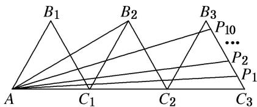

text_image

B₁ B₂ B₃
P₁₀
...
P₂
A C₁ C₂ C₃ P₁

A. 180

B. $60\sqrt{3}$

C. 45

D. $15\sqrt{3}$

8. 在 $\triangle ABC$ 中， $AB=3$ ， $AC=2$ ， $BC=\sqrt{10}$ ，则 $\overrightarrow{AB} \cdot \overrightarrow{AC}$ 等于( )

A. $-\frac{3}{2}$

B. $-\frac{2}{3}$

C. $\frac{2}{3}$

D. $\frac{3}{2}$

9. 在 Rt△ABC 中，∠B=90°，BC=2，AB=1，D 为 BC 的中点，E 在斜边 AC 上，若 $\overrightarrow{AE}=2\overrightarrow{EC}$ ，则 $\overrightarrow{DE}\cdot\overrightarrow{AC}=$ \_\_\_\_.

10. 已知 $P$ 是边长为 2 的正三角形 $ABC$ 的边 $BC$ 上的动点，则 $\overrightarrow{AP} \cdot (\overrightarrow{AB} + \overrightarrow{AC}) =$ \_\_\_\_.

11. 在 $\triangle ABC$ 中， $|\overrightarrow{AB} + \overrightarrow{AC}| = |\overrightarrow{AB} - \overrightarrow{AC}|$ ， $AB = 2$ ， $AC = 1$ ， $E$ ， $F$ 为 $BC$ 的三等分点，则 $\overrightarrow{AE} \cdot \overrightarrow{AF}$ 等于（）

A. $\frac{8}{9}$

B. $\frac{10}{9}$

C. $\frac{25}{9}$

D. $\frac{26}{9}$

12. $\triangle ABC$ 的外接圆的圆心为 $O$ , 半径为 1, 若 $\overrightarrow{OA} + \overrightarrow{AB} + \overrightarrow{OC} = 0$ , 且 $|\overrightarrow{OA}| = |\overrightarrow{AB}|$ , 则 $\overrightarrow{CA} \cdot \overrightarrow{CB}$ 等于 ( )

A. $\frac{3}{2}$

B. $\sqrt{3}$

C. 3

D. $2 \sqrt{3}$

13. 如图，在 $\triangle ABC$ 中， $AD \perp AB$ ， $\overrightarrow{BC} = \sqrt{3}\overrightarrow{BD}$ ， $|\overrightarrow{AD}| = 1$ ，则 $\overrightarrow{AC} \cdot \overrightarrow{AD}$ 的值为（）

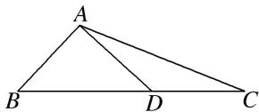

A. $2 \sqrt{3}$

B. $\frac{\sqrt{3}}{2}$

C. $\frac{\sqrt{3}}{3}$

D. $\sqrt{3}$

14. 在 $\triangle ABC$ 中， $AB=1$ ， $\angle ABC=60^{\circ}$ ， $\overrightarrow{AC}\cdot\overrightarrow{AB}=-1$ ，若 $O$ 是 $\triangle ABC$ 的重心，则 $\overrightarrow{BO}\cdot\overrightarrow{AC}=$ \_\_\_\_.

15. 已知 $O$ 是 $\triangle ABC$ 的外心， $|\overrightarrow{AB}| = 4$ ， $|\overrightarrow{AC}| = 2$ ，则 $\overrightarrow{AO} \cdot (\overrightarrow{AB} + \overrightarrow{AC}) = (\quad)$

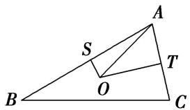

text_image

A
S
T
O
B
C

A. 10

B. 9

C. 8

D. 6

16. 在 $\triangle ABC$ 中, 已知 $\overrightarrow{AB} \cdot \overrightarrow{AC} = \frac{9}{2}$ , $|\overrightarrow{AC}| = 3$ , $|\overrightarrow{AB}| = 3$ , $M$ , $N$ 分别是 $BC$ 边上的三等分点, 则 $\overrightarrow{AM} \cdot \overrightarrow{AN}$ 的值是 ( )

A. $\frac{11}{2}$

B. $\frac{13}{2}$

C. 6

D. 7

17. 在 $\triangle ABC$ 中， $AB=2AC=6$ ， $\vec{BA}\cdot\vec{BC}=\vec{BA}^{2}$ ，点 $P$ 是 $\triangle ABC$ 所在平面内一点，则当 $\vec{PA}^{2}+\vec{PB}^{2}+\vec{PC}^{2}$ 取得最小值时， $\vec{AP}\cdot\vec{BC}=$ \_\_\_\_.

18. 已知在 $\triangle ABC$ 所在平面内有两点 $P, Q$ , 满足 $\overrightarrow{PA} + \overrightarrow{PC} = 0$ , $\overrightarrow{QA} + \overrightarrow{QB} + \overrightarrow{QC} = \overrightarrow{BC}$ , 若 $|\overrightarrow{AB}| = 4$ , $|\overrightarrow{AC}| = 2$ , $S_{\triangle APQ} = \frac{2}{3}$ , 则 $\overrightarrow{AB} \cdot \overrightarrow{AC}$ 的值为 \_\_\_\_.

19. (2013·全国Ⅱ)已知正方形 ABCD 的边长为 2，E 为 CD 的中点，则 $\overrightarrow{AE} \cdot \overrightarrow{BD} =$ \_\_\_\_ .

20. 已知平行四边形 ABCD 中，AB=1，AD=2， $\angle DAB=60^{\circ}$ ，则 $\overrightarrow{AC}\cdot\overrightarrow{AB}=(\quad)$

A. 1

B. $\sqrt{3}$

C. 2

D. $2\sqrt{3}$

21. 在平行四边形 $ABCD$ 中， $|\overrightarrow{AB}| = 8$ ， $|\overrightarrow{AD}| = 6$ ， $N$ 为 $DC$ 的中点， $\overrightarrow{BM} = 2\overrightarrow{MC}$ ，则 $\overrightarrow{AM} \cdot \overrightarrow{NM} = (\quad)$

A. 48

B. 36

C. 24

D. 12

22. 设四边形 ABCD 为平行四边形， $|\overrightarrow{AB}|=6$ ， $|\overrightarrow{AD}|=4$ ，若点 M，N 满足 $\overrightarrow{BM}=3\overrightarrow{MC}$ ， $\overrightarrow{DN}=2\overrightarrow{NC}$ ，则 $\overrightarrow{AM}\cdot\overrightarrow{NM}$ 等于（）

A. 20

B. 15

C. 9

D. 6

23. 在四边形 $ABCD$ 中, $\overrightarrow{AB} = \overrightarrow{DC}$ , $P$ 为 $CD$ 上一点, 已知 $|\overrightarrow{AB}| = 8$ , $|\overrightarrow{AD}| = 5$ , $\overrightarrow{AB}$ 与 $\overrightarrow{AD}$ 的夹角为 $\theta$ , 且 $\cos \theta = \frac{11}{20}$ , $\overrightarrow{CP} = 3\overrightarrow{PD}$ , 则 $\overrightarrow{AP} \cdot \overrightarrow{BP} =$ \_\_\_\_.

25. 在平面四边形 ABCD 中， $|AC|=3$ ， $|BD|=4$ ，则 $(\overrightarrow{AB}+\overrightarrow{DC})\cdot(\overrightarrow{BC}+\overrightarrow{AD})=$ \_\_\_\_.

26. 如图, 在四边形 $ABCD$ 中, $AB = 6$ , $AD = 2$ , $\overrightarrow{DC} = \frac{1}{3}\overrightarrow{AB}$ , $AC$ 与 $BD$ 相交于点 $O$ , $E$ 是 $BD$ 的中点, 若 $\overrightarrow{AO} \cdot \overrightarrow{AE} = 8$ , 则 $\overrightarrow{AC} \cdot \overrightarrow{BD} = (\quad)$

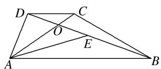

text_image

Geometric diagram of quadrilateral ABCD with diagonals and internal points labeled A, B, C, D, E, and O

A. -9

B. $-\frac{29}{3}$

C. -10

D. $-\frac{32}{3}$

27. 设 $\triangle ABC$ 的外接圆的圆心为 $P$ , 半径为 3, 若 $\overrightarrow{PA} + \overrightarrow{PB} = \overrightarrow{CP}$ , 则 $\overrightarrow{PA} \cdot \overrightarrow{PB} = (\quad)$

A. $-\frac{9}{2}$

B. $-\frac{3}{2}$

C. 3

D. 9

28. 如图，B，D 是以 AC 为直径的圆上的两点，其中 $AB=\sqrt{t+1}$ ， $AD=\sqrt{t+2}$ ，则 $\overrightarrow{AC}\cdot\overrightarrow{BD}=(\quad)$

A. 1

B. 2

C. t

D. 2t

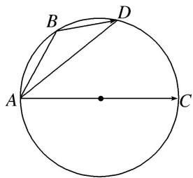

text_image

A
B
D
C

# 考点二 已知平面向量数量积，求参数的值或判断多边形的形状

# 【例题选讲】

[例 1](1)在 $\triangle ABC$ 中， $A=90^{\circ}$ ， $AB=1$ ， $AC=2$ 。设点 $P$ ， $Q$ 满足 $\overrightarrow{AP}=\lambda\overrightarrow{AB}$ ， $\overrightarrow{AQ}=(1-\lambda)\overrightarrow{AC}$ ， $\lambda\in\mathbf{R}$ 。若 $\overrightarrow{BQ}\cdot\overrightarrow{CP}=-2$ ，则 $\lambda$ 等于( )

A. $\frac{1}{3}$

B. $\frac{2}{3}$

C. $\frac{4}{3}$

D. 2

(2)已知 $\triangle ABC$ 为等边三角形， $AB = 2$ ，设点 $P,Q$ 满足 $\overrightarrow{AP} = \lambda \overrightarrow{AB},\overrightarrow{AQ} = (1 - \lambda)\overrightarrow{AC},\lambda \in \mathbf{R}$ ，若 $\overrightarrow{BQ}\cdot \overrightarrow{CP}$ $= -\frac{3}{2}$ ，则 $\lambda = (\quad)$

A. $\frac{1}{2}$

B. $\frac{1\pm\sqrt{2}}{2}$

C. $\frac{1 \pm \sqrt{10}}{2}$

D. $\frac{-3\pm2\sqrt{2}}{2}$

(3)已知菱形ABCD的边长为6， $\angle ABD = 30^{\circ}$ ，点 $E, F$ 分别在边 $BC, DC$ 上， $BC = 2BE, CD = \lambda CF$ . 若 $\overrightarrow{AE} \cdot \overrightarrow{BF} = -9$ ，则 $\lambda$ 的值为（）

A. 2

B. 3

C. 4

D. 5

(4)已知菱形 ABCD 边长为 2， $\angle B=\frac{\pi}{3}$ ，点 P 满足 $\overrightarrow{AP}=\lambda\overrightarrow{AB}$ ， $\lambda\in R$ ，若 $\overrightarrow{BD}\cdot\overrightarrow{CP}=-3$ ，则 $\lambda$ 的值为()

A. $\frac{1}{2}$

B. $-\frac{1}{2}$

C. $\frac{1}{3}$

D. $-\frac{1}{3}$

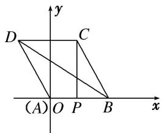

text_image

y
D C
(A) O P B x

(5)若 $O$ 为 $\triangle ABC$ 所在平面内任一点，且满足 $(\overrightarrow{OB} -\overrightarrow{OC})\cdot (\overrightarrow{OB} +\overrightarrow{OC} -2\overrightarrow{OA}) = 0$ ，则 $\triangle ABC$ 的形状为（

A. 正三角形

B. 直角三角形

C. 等腰三角形

D. 等腰直角三角形

(6)若 $\triangle ABC$ 的三个内角 $A$ ， $B$ ， $C$ 的度数成等差数列，且 $(\overrightarrow{AB}+\overrightarrow{AC})\cdot\overrightarrow{BC}=0$ ，则 $\triangle ABC$ 一定是()

A. 等腰直角三角形

B. 非等腰直角三角形

C. 等边三角形

D. 钝角三角形

(7)平面四边形ABCD中， $\overrightarrow{AB} +\overrightarrow{CD} = 0$ ， $(\overrightarrow{AB} -\overrightarrow{AD})\cdot \overrightarrow{AC} = 0$ ，则四边形ABCD是（

A. 矩形

B. 正方形

C. 菱形

D. 梯形

(8)已知平面向量 $\boldsymbol{a}=(x_{1},y_{1})$ ， $\boldsymbol{b}=(x_{2},y_{2})$ ，若 $|a|=2$ ， $|b|=3$ ， $a\cdot b=-6$ 。则 $\frac{x_{1}+y_{1}}{x_{2}+y_{2}}$ 的值为（）

A. $\frac{2}{3}$

B. $-\frac{2}{3}$

C. $\frac{5}{6}$

D. $-\frac{5}{6}$

# 考点三 平面向量数量积的最值(范围)问题

# 【方法总结】

# 数量积的最值或范围问题的2种求解方法

(1)几何法：即临界位置法，结合图形，确定临界位置的动态分析求出范围.

(2)代数法：即目标函数法，将数量积表示为某一个变量或两个变量的函数，建立函数关系式，再利用三角函数有界性、二次函数或基本不等式求最值或范围.

# 【例题选讲】

[例 1](1) 若 a, b, c 是单位向量，且 $a \cdot b = 0$ ，则 $(a - c) \cdot (b - c)$ 的最大值为 \_\_\_\_.

(2)(2016·浙江)已知向量 a, b, $|a|=1$ , $|b|=2$ . 若对任意单位向量 e，均有 $|a\cdot e|+|b\cdot e|\leqslant\sqrt{6}$ ，则 $a\cdot b$ 的最大值是 \_\_\_\_.

(3)(2017·全国Ⅱ)已知△ABC是边长为2的等边三角形，P为平面ABC内一点，则 $\overrightarrow{PA}\cdot(\overrightarrow{PB}+\overrightarrow{PC})$ 的最小值是()

A. -2

B. $-\frac{3}{2}$

C. $-\frac{4}{3}$

D. -1

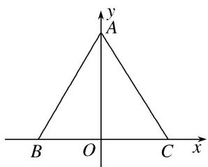

text_image

y
A
B O C x

图①  

text_image

Geometric diagram with labeled points A, B, C, D, P and intersecting lines forming triangles and quadrilaterals

图②

(4)已知 $\overrightarrow{AB} \perp \overrightarrow{AC}$ , $|\overrightarrow{AB}| = \frac{1}{t}$ , $|\overrightarrow{AC}| = t$ , 若点 $P$ 是 $\triangle ABC$ 所在平面内的一点, 且 $\overrightarrow{AP} = \frac{\overrightarrow{AB}}{|\overrightarrow{AB}|} + \frac{4\overrightarrow{AC}}{|\overrightarrow{AC}|}$ , 则 $\overrightarrow{PB} \cdot \overrightarrow{PC}$ 的最大值等于( )

A. 13

B. 15

C. 19

D. 21

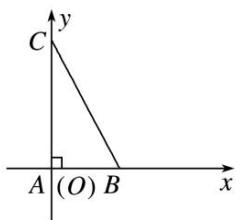

text_image

C
y
A (O) B
x

(5)如图, 已知 $P$ 是半径为 2 , 圆心角为 $\frac{\pi}{3}$ 的一段圆弧 $AB$ 上的一点, 若 $\overrightarrow{AB} = 2\overrightarrow{BC}$ , 则 $\overrightarrow{PC} \cdot \overrightarrow{PA}$ 的最小值为 \_\_\_\_.

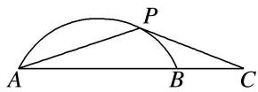

(6)(2020·天津)如图，在四边形ABCD中， $\angle B=60^{\circ}$ ， $AB=3$ ， $BC=6$ ，且 $\overrightarrow{AD}=\lambda\overrightarrow{BC}$ ， $\overrightarrow{AD}\cdot\overrightarrow{AB}=-\frac{3}{2}$ ，则实数 $\lambda$ 的值为\_\_\_\_，若M，N是线段BC上的动点，且 $|\overrightarrow{MN}|=1$ ，则 $\overrightarrow{DM}\cdot\overrightarrow{DN}$ 的最小值为\_\_\_\_。

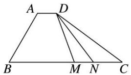

text_image

A
D
B
M
N
C

(7) (2020·新高考I)已知 P 是边长为 2 的正六边形 ABCDEF 内的一点，则 $\overrightarrow{AP} \cdot \overrightarrow{AB}$ 的取值范围是()

A. $(-2, 6)$

B. $(-6, 2)$

C. $(-2, 4)$

D. $(-4, 6)$

(8)如图所示, 半圆的直径 $AB = 6$ , $O$ 为圆心, $C$ 为半圆上不同于 $A$ , $B$ 的任意一点, 若 $P$ 为半径 $OC$ 上的动点, 则 $(\overrightarrow{PA} + \overrightarrow{PB}) \cdot \overrightarrow{PC}$ 的最小值为 \_\_\_\_.

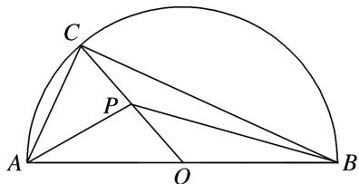

text_image

Geometric diagram of a semicircle with inscribed triangle ABC and internal points P and O labeled

# 【对点训练】

1. 在 $\triangle ABC$ 中， $\angle C = 90^{\circ}$ ， $AB = 6$ ，点 $P$ 满足 $CP = 2$ ，则 $\overrightarrow{PA} \cdot \overrightarrow{PB}$ 的最大值为（）

A. 9

B. 16

C. 18

D. 25

2. 在等腰直角 $\triangle ABC$ 中, $\angle ABC = 90^{\circ}$ , $AB = BC = 2$ , $M$ , $N$ (不与 $A$ , $C$ 重合)为 $AC$ 边上的两个动点, 且满足 $|\overrightarrow{MN}| = \sqrt{2}$ , 则 $\overrightarrow{BM} \cdot \overrightarrow{BN}$ 的取值范围为( )

A. $\left[\frac{3}{2},2\right]$

B. $\left(\frac{3}{2},2\right)$

C. $\left[\frac{3}{2},2\right]$

D. $\left[\frac{3}{2}, +\infty\right]$

3. 在等腰三角形 $ABC$ 中, $AB = AC = 1$ , $\angle BAC = 90^{\circ}$ , 点 $E$ 为斜边 $BC$ 的中点, 点 $M$ 在线段 $AB$ 上运动, 则 $\overrightarrow{ME} \cdot \overrightarrow{MC}$ 的取值范围是 ( )

A. $\left[\frac{7}{16},\frac{1}{2}\right]$

B. $\left[\frac{7}{16},\ 1\right]$

C. $\left[\frac{1}{2},\quad1\right]$

D. $[0, 1]$

4. 在 $\triangle ABC$ 中，满足 $\overrightarrow{AB} \perp \overrightarrow{AC}$ ， $M$ 是 $BC$ 的中点，若 $O$ 是线段 $AM$ 上任意一点，且 $|\overrightarrow{AB}| = |\overrightarrow{AC}| = \sqrt{2}$ ，则 $\overrightarrow{OA} \cdot (\overrightarrow{OB} + \overrightarrow{OC})$ 的最小值为\_\_\_\_。

5. 已知在 $\triangle ABC$ 中， $AB = 4$ ， $AC = 2$ ， $AC \perp BC$ ， $D$ 为 $AB$ 的中点，点 $P$ 满足 $\overrightarrow{AP} = \frac{1}{a}\overrightarrow{AC} + \frac{a - 1}{a}\overrightarrow{AD}$ ，则 $\overrightarrow{PA} \cdot (\overrightarrow{PB} + \overrightarrow{PC})$ 的最小值为（）

A. -2

B. $-\frac{28}{9}$

C. $-\frac{25}{8}$

D. $-\frac{7}{2}$

6. 如图, 线段 $AB$ 的长度为 2 , 点 $A$ , $B$ 分别在 $x$ 轴的正半轴和 $y$ 轴的正半轴上滑动, 以线段 $AB$ 为一边, 在第一象限内作等边三角形 $ABC$ , $O$ 为坐标原点, 则 $\overrightarrow{OC} \cdot \overrightarrow{OB}$ 的取值范围是 \_\_\_\_.

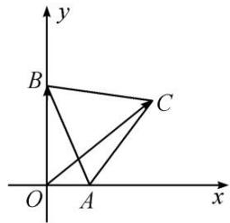

text_image

y
B
C
O
A
x

7. 已知正方形 $ABCD$ 的边长为 1，点 $E$ 是 $AB$ 边上的动点，则 $\overrightarrow{DE} \cdot \overrightarrow{CB}$ 的值为 \_\_\_\_； $\overrightarrow{DE} \cdot \overrightarrow{DC}$ 的最大值为 \_\_\_\_.

8. 在边长为 1 的正方形 $ABCD$ 中, $M$ 为 $BC$ 的中点, 点 $E$ 在线段 $AB$ 上运动, 则 $\overrightarrow{EC} \cdot \overrightarrow{EM}$ 的取值范围是 ( )

A. $\left[\frac{1}{2},2\right]$

B. $\begin{bmatrix}0,\frac{3}{2}\end{bmatrix}$

C. $\left[\frac{1}{2},\frac{3}{2}\right]$

D. $[0, 1]$

9. 如图所示, 已知正方形 $ABCD$ 的边长为 1 , 点 $E$ 从点 $D$ 出发, 按字母顺序 $D \to A \to B \to C$ 沿线段 $DA$ , $AB$ , $BC$ 运动到点 $C$ , 在此过程中 $\overrightarrow{DE} \cdot \overrightarrow{CD}$ 的取值范围为 \_\_\_\_.

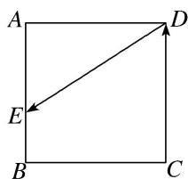

text_image

A
D
E
B
C

10. 如图, 菱形 $ABCD$ 的边长为 2, $\angle BAD = 60^{\circ}$ , $M$ 为 $DC$ 的中点, 若 $N$ 为菱形内任意一点 (含边界), 则 $\overrightarrow{AM} \cdot \overrightarrow{AN}$ 的最大值为 \_\_\_\_.

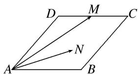

text_image

D
M
C
A
N
B

11. 在平行四边形 $ABCD$ 中, 若 $AB = 2$ , $AD = 1$ , $\overrightarrow{AB} \cdot \overrightarrow{AD} = -1$ , 点 $M$ 在边 $CD$ 上, 则 $\overrightarrow{MA} \cdot \overrightarrow{MB}$ 的最大值为 \_\_\_\_.

12. 如图, 在直角梯形 $ABCD$ 中, $DA = AB = 1$ , $BC = 2$ , 点 $P$ 在阴影区域(含边界)中运动, 则 $\overrightarrow{PA} \cdot \overrightarrow{BD}$ 的取值范围是( )

A. $\left[-\frac{1}{2},1\right]$

B. $\left[-1,\frac{1}{2}\right]$

C. $[-1, 1]$

D. $[-1, 0]$

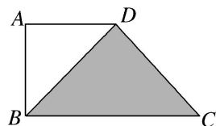

natural_image

Geometric diagram of a square ABCD with an inscribed triangle BDC shaded gray (no text or labels)

13. 如图, 在等腰梯形 $ABCD$ 中, 已知 $DC \parallel AB$ , $\angle ADC = 120^{\circ}$ , $AB = 4$ , $CD = 2$ , 动点 $E$ 和 $F$ 分别在线段 $BC$ 和 $DC$ 上, 且 $\overrightarrow{BE} = \frac{1}{2\lambda}\overrightarrow{BC}$ , $\overrightarrow{DF} = \lambda \overrightarrow{DC}$ , 则 $\overrightarrow{AE} \cdot \overrightarrow{BF}$ 的最小值是( )

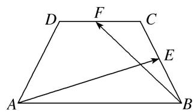

text_image

Geometric diagram of a trapezoid with labeled vertices and internal points, showing directional arrows.

A. $4 \sqrt{6} + 13$

B. $4 \sqrt{6} - 13$

C. $4\sqrt{6}+\frac{13}{2}$

D. $4\sqrt{6}-\frac{13}{2}$

14. (2018·天津)如图, 在平面四边形 $ABCD$ 中, $AB \perp BC$ , $AD \perp CD$ , $\angle BAD = 120^{\circ}$ , $AB = AD = 1$ . 若点 $E$ 为边 $CD$ 上的动点, 则 $\overrightarrow{AE} \cdot \overrightarrow{BE}$ 的最小值为 \_\_\_\_.

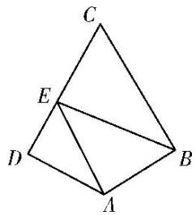

text_image

Geometric diagram with labeled points A, B, C, D, E forming triangles and quadrilaterals

15. 设 $A, B, C$ 是半径为 1 的圆 $O$ 上的三点，且 $\overrightarrow{OA} \perp \overrightarrow{OB}$ ，则 $(\overrightarrow{OC} - \overrightarrow{OA}) \cdot (\overrightarrow{OC} - \overrightarrow{OB})$ 的最大值是（）

A. $1 + \sqrt{2}$

B. $1 - \sqrt{2}$

C. $\sqrt{2}-1$

D. 1

16. 已知平面向量 a, b, e 满足 $|e|=1$ , $a \cdot e=1$ , $b \cdot e=-2$ , $|a+b|=2$ , 则 $a \cdot b$ 的最大值为 \_\_\_\_.

