# 专题二 平面向量的数量积

#### 1. 向量的夹角  
（1）定义：已知两个非零向量 a 和 b，作 $\overrightarrow{OA}=a,\quad\overrightarrow{OB}=b$ ，则 $\angle AOB$ 就是向量 a 与 b 的夹角.

  
（2）范围：设 $\theta$ 是向量a与b的夹角，则 $0^{\circ}\leq\theta\leq180^{\circ}$ .  
（3）共线与垂直：若 $\theta=0^{\circ}$ ，则a与b同向；若 $\theta=180^{\circ}$ ，则a与b反向；若 $\theta=90^{\circ}$ ，则a与b垂直.

#### 2. 平面向量的数量积  
（1）定义: 已知两个非零向量 $a$ 与 $b$ , 它们的夹角为 $\theta$ , 则数量 $|a||b|\cos \theta$ 叫做 $a$ 与 $b$ 的数量积 (或内积), 记作 $a \cdot b$ , 即 $a \cdot b = |a||b|\cos \theta$ , 规定零向量与任一向量的数量积为 0, 即 $0 \cdot a = 0$ .

投影向量：向量 a 在向量 b 上的投影向量为 $\left|a\right|\cos\theta\frac{b}{\left|b\right|}=\frac{(a\cdot b)b}{\left|b\right|^{2}}$ .  
（2）坐标表示：若 $\boldsymbol{a}=(x_{1},y_{1})$ ， $\boldsymbol{b}=(x_{2},y_{2})$ ，则 $a\cdot b=x_{1}x_{2}+y_{1}y_{2}$ .

#### 3. 平面向量数量积的运算律  
（1） $a\cdot b=b\cdot a$ (交换律); （2） $\lambda a\cdot b=\lambda(a\cdot b)=a\cdot(\lambda b)$ (结合律); （3） $(a+b)\cdot c=a\cdot c+b\cdot c$ (分配律).

#### 4. 平面向量数量积运算的常用公式  
（1） $(a + b)\cdot (a - b) = a^2 -b^2$ . （2） $(a + b)^{2} = a^{2} + 2a\cdot b + b^{2}$ . （3） $(a - b)^{2} = a^{2} - 2a\cdot b + b^{2}$

# 考点一 求平面向量数量积

# 【方法总结】

# 平面向量数量积的两种求法  
（1）若已知向量的模和夹角时, 则利用定义法求解, 即 $a \cdot b = |a||b|\cos < a$ , $b>$ . 若未知向量的模和夹角时, 则可通过向量加法(减法)的三角形法则转化为已知模和夹角的向量的数量积进行求解;  
（2）若已知向量的坐标时，则利用坐标法求解，即若 $a = (x_{1}, y_{1})$ ， $b = (x_{2}, y_{2})$ ，则 $a \cdot b = x_{1}x_{2} + y_{1}y_{2}$ 。若未知向量的坐标时，如已知图形为矩形、正方形、直角梯形、等边三角形、等腰三角形或直角三角形时，则可建立平面直角坐标系求出未知向量的坐标进行求解。

# 【例题选讲】

[例 1]（1）(2018·全国 II)已知向量 a, b 满足 $|a|=1$ , $a\cdot b=-1$ ，则 $a\cdot(2a-b)=(\quad)$

A. 4

B. 3

C. 2

D. 0
答案 B 解析 $a \cdot (2a - b) = 2 |a|^{2} - a \cdot b = 2 \times 1 - (-1) = 3.$  
（2）若向量 $\boldsymbol{m}=(2k-1,\ k)$ 与向量 $\boldsymbol{n}=(4,\ 1)$ 共线，则 $\boldsymbol{m}\cdot\boldsymbol{n}=()$

A. 0

B. 4

C. $-\frac{9}{2}$

D. $-\frac{17}{2}$
答案 D 解析 由题意得 $2k - 1 - 4k = 0$ ，解得 $k = -\frac{1}{2}$ ，即 $\boldsymbol{m} = \begin{bmatrix} -2, & -\frac{1}{2} \end{bmatrix}$ ，所以 $\boldsymbol{m} \cdot \boldsymbol{n} = -2 \times 4 + \begin{bmatrix} -\frac{1}{2} \end{bmatrix} \times 1 = -\frac{17}{2}$ .  
（3）如图，已知非零向量 $\overrightarrow{AB}$ 与 $\overrightarrow{AC}$ 满足 $(\frac{\overrightarrow{AB}}{|\overrightarrow{AB}|} +\frac{\overrightarrow{AC}}{|\overrightarrow{AC}|})\cdot \overrightarrow{BC} = 0$ ，且 $|\overrightarrow{AB} -\overrightarrow{AC}| = 2\sqrt{3}$ ， $|\overrightarrow{AB} +\overrightarrow{AC}| = 2\sqrt{6}$ ，点 $D$ 是 $\triangle ABC$ 中边 $BC$ 的中点，则 $\overrightarrow{AB}\cdot \overrightarrow{BD} =$

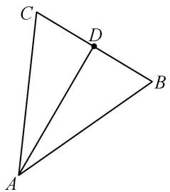
答案 -3 解析 由 $(\frac{\overrightarrow{AB}}{|\overrightarrow{AB}|} + \frac{\overrightarrow{AC}}{|\overrightarrow{AC}|}) \cdot \overrightarrow{BC} = 0$ 得 $\overrightarrow{BC}$ 与 $\angle A$ 的平分线所在的向量垂直，所以 $AB = AC$ ， $\overrightarrow{BC} \perp \overrightarrow{AD}$ 。又 $|\overrightarrow{AB} - \overrightarrow{AC}| = 2\sqrt{3}$ ，所以 $|\overrightarrow{CB}| = 2\sqrt{3}$ ，所以 $|\overrightarrow{BD}| = \sqrt{3}$ ， $\overrightarrow{AB} \cdot \overrightarrow{BD} = |\overrightarrow{AB}||\overrightarrow{BD}|\cos (\pi - B) = \sqrt{AD^2 + BD^2} \cdot \sqrt{3} \cdot (-\cos B) = 3\sqrt{3} \times (-\frac{\sqrt{3}}{3}) = -3$ 。  
（4）(2016·天津)如图, 已知 $\triangle ABC$ 是边长为 1 的等边三角形, 点 $D$ , $E$ 分别是边 $AB$ , $BC$ 的中点, 连接 $DE$ 并延长到点 $F$ , 使得 $DE = 2EF$ , 则 $\overrightarrow{AF} \cdot \overrightarrow{BC}$ 的值为 ( )

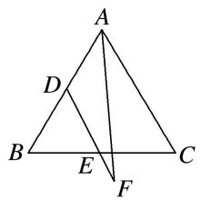

A. $-\frac{5}{8}$

B. $\frac{1}{8}$

C. $\frac{1}{4}$

D. $\frac{11}{8}$
答案 B 解析 由条件可知 $\overrightarrow{BC} = \overrightarrow{AC} -\overrightarrow{AB},\overrightarrow{AF} = \overrightarrow{AD} +\overrightarrow{DF} = \frac{1}{2}\overrightarrow{AB} +\frac{3}{2}\overrightarrow{DE} = \frac{1}{2}\overrightarrow{AB} +\frac{3}{4}\overrightarrow{AC}$ 所以 $\overrightarrow{BC}\cdot \overrightarrow{AF} = (\overrightarrow{AC}$ $-\overrightarrow{AB})\cdot (\frac{1}{2}\overrightarrow{AB} +\frac{3}{4}\overrightarrow{AC}) = \frac{3}{4}\overrightarrow{AC}^2 -\frac{1}{4}\overrightarrow{AB}\cdot \overrightarrow{AC} -\frac{1}{2}\overrightarrow{AB}^2.$ 因为 $\triangle ABC$ 是边长为1的等边三角形，所以 $|\overrightarrow{AC}| = |\overrightarrow{AB}| = 1,$ $\angle BAC = 60^{\circ}$ ，所以 $\overrightarrow{BC}\cdot \overrightarrow{AF} = \frac{3}{4} -\frac{1}{8} -\frac{1}{2} = \frac{1}{8}.$  
（5）(2018·天津)在如图的平面图形中，已知 $OM = 1$ ， $ON = 2$ ， $\angle MON = 120^{\circ}$ ， $\vec{BM} = 2\vec{MA}$ ， $\vec{CN} = 2\vec{NA}$ 则 $\vec{BC}\cdot \vec{OM}$ 的值为（）

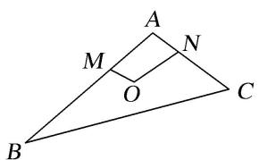

A. -15

B. -9

C.-6

D. 0
答案 C 解析 连接 OA. 在 $\triangle ABC$ 中， $\overrightarrow{BC} = \overrightarrow{AC} - \overrightarrow{AB} = 3\overrightarrow{AN} - 3\overrightarrow{AM} = 3(\overrightarrow{ON} - \overrightarrow{OA}) - 3(\overrightarrow{OM} - \overrightarrow{OA}) = 3(\overrightarrow{ON} - \overrightarrow{OM})$ ，∴ $\overrightarrow{BC} \cdot \overrightarrow{OM} = 3(\overrightarrow{ON} - \overrightarrow{OM}) \cdot \overrightarrow{OM} = 3(\overrightarrow{ON} \cdot \overrightarrow{OM} - \overrightarrow{OM}^2) = 3 \times (2 \times 1 \times \cos 120^\circ - 1^2) = 3 \times (-2) = -6$ .  
（6）在 $\triangle ABC$ 中， $AB=4$ ， $BC=6$ ， $\angle ABC=\frac{\pi}{2}$ ， $D$ 是 $AC$ 的中点， $E$ 在 $BC$ 上，且 $AE\perp BD$ ，则 $\overrightarrow{AE}\cdot\overrightarrow{BC}$ 等

于( )

A. 16

B. 12

C. 8

D. -4
答案 A 解析 以 B 为原点，BA, BC 所在直线分别为 x, y 轴建立平面直角坐标系(图略)， $A(4,0)$ ， $B(0,0)$ ， $C(0,6)$ ， $D(2,3)$ 。设 $E(0,t)$ ， $\overrightarrow{BD}\cdot\overrightarrow{AE}=(2,3)\cdot(-4,t)=-8+3t=0$ ， $\therefore t=\frac{8}{3}$ ，即 $E\left(0,\frac{8}{3}\right)$ ， $\overrightarrow{AE}\cdot\overrightarrow{BC}=(-4,\frac{8}{3})\cdot(0,6)=16$ 。  
（7）已知在直角三角形 ABC 中， $\angle ACB=90^{\circ}, AC=BC=2$ ，点 P 是斜边 AB 上的中点，则 $\overrightarrow{CP}\cdot\overrightarrow{CB}+\overrightarrow{CP}\cdot\overrightarrow{CA}=$ \_\_\_\_.
答案 4 解析 由题意可建立如图所示的坐标系. 可得 $A(2,0), B(0,2), P(1,1), C(0,0)$ , 则 $\overrightarrow{CP} \cdot \overrightarrow{CB} + \overrightarrow{CP} \cdot \overrightarrow{CA} = (1,1) \cdot (0,2) + (1,1) \cdot (2,0) = 2 + 2 = 4$ .

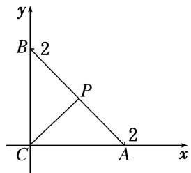  
（8）如图， $\triangle AOB$ 为直角三角形， $OA=1, OB=2, C$ 为斜边 $AB$ 的中点， $P$ 为线段 $OC$ 的中点，则 $\overrightarrow{AP} \cdot \overrightarrow{OP} = (\quad)$

A. 1

B. $\frac{1}{16}$

C. $\frac{1}{4}$

D. $-\frac{1}{2}$

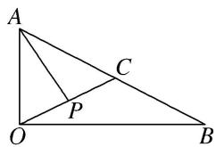
答案 B 解析 法一：因为 $\triangle AOB$ 为直角三角形， $OA = 1$ ， $OB = 2$ ， $C$ 为斜边 $AB$ 的中点，所以 $\overrightarrow{OC} = \frac{1}{2}\overrightarrow{OA} + \frac{1}{2}\overrightarrow{OB}$ ，所以 $\overrightarrow{OP} = \frac{1}{2}\overrightarrow{OC} = \frac{1}{4} (\overrightarrow{OA} + \overrightarrow{OB})$ ，则 $\overrightarrow{AP} = \overrightarrow{OP} - \overrightarrow{OA} = \frac{1}{4}\overrightarrow{OB} - \frac{3}{4}\overrightarrow{OA}$ ，所以 $\overrightarrow{AP} \cdot \overrightarrow{OP} = \frac{1}{4} (\overrightarrow{OB} - 3\overrightarrow{OA}) \cdot \frac{1}{4} (\overrightarrow{OA} + \overrightarrow{OB}) = \frac{1}{16} (\overrightarrow{OB^2} - 3\overrightarrow{OA^2}) = \frac{1}{16}$ .

法二：以 O 为坐标原点， $\overrightarrow{OB}$ 的方向为 x 轴正方向， $\overrightarrow{OA}$ 的方向为 y 轴正方向建立平面直角坐标系(如图)，则 $A(0,1)$ ， $B(2,0)$ ， $C\left(1,\frac{1}{2}\right)$ ， $P\left(\frac{1}{2},\frac{1}{4}\right)$ ，所以 $\overrightarrow{OP}=\left(\frac{1}{2},\frac{1}{4}\right)$ ， $\overrightarrow{AP}=\left(\frac{1}{2},-\frac{3}{4}\right)$ ，故 $\overrightarrow{AP}\cdot\overrightarrow{OP}=\frac{1}{2}\times\frac{1}{2}-\frac{3}{4}\times\frac{1}{4}=\frac{1}{16}$ .

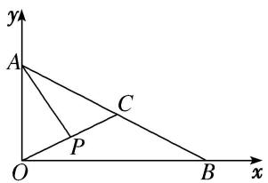  
（9）如图，平行四边形ABCD中， $AB = 2$ ， $AD = 1$ ， $A = 60^{\circ}$ ，点 $M$ 在 $AB$ 边上，且 $AM = \frac{1}{3} AB$ ，则 $\overrightarrow{DM}\cdot \overrightarrow{DB}$ $=$ \_\_\_\_.

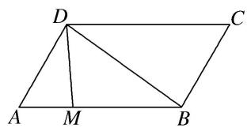
答案 1 解析 因为 $\overrightarrow{DM}=\overrightarrow{DA}+\overrightarrow{AM}=\overrightarrow{DA}+\frac{1}{3}\overrightarrow{AB},\quad\overrightarrow{DB}=\overrightarrow{DA}+\overrightarrow{AB}$ ，所以 $\overrightarrow{DM}\cdot\overrightarrow{DB}=(\overrightarrow{DA}+\frac{1}{3}\overrightarrow{AB})\cdot(\overrightarrow{DA}+\overrightarrow{AB})=|\overrightarrow{DA}|^{2}+\frac{1}{3}|\overrightarrow{AB}|^{2}+\frac{4}{3}\overrightarrow{DA}\cdot\overrightarrow{AB}=1+\frac{4}{3}-\frac{4}{3}\overrightarrow{AD}\cdot\overrightarrow{AB}=\frac{7}{3}-\frac{4}{3}|\overrightarrow{AD}|\cdot|\overrightarrow{AB}|\cdot\cos60^{\circ}=\frac{7}{3}-\frac{4}{3}\times1\times2\times\frac{1}{2}=1.$  
（10）如图所示，在平面四边形ABCD中，若AC=3，BD=2，则 $(\overrightarrow{AB}+\overrightarrow{DC})\cdot(\overrightarrow{AC}+\overrightarrow{BD})=$ \_\_\_\_.

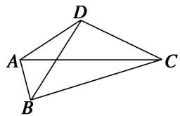
答案 5 解析 由于 $\overrightarrow{AB} = \overrightarrow{AC} +\overrightarrow{CB},\overrightarrow{DC} = \overrightarrow{DB} +\overrightarrow{BC}$ ，所以 $\overrightarrow{AB} +\overrightarrow{DC} = \overrightarrow{AC} +\overrightarrow{CB} +\overrightarrow{DB} +\overrightarrow{BC} = \overrightarrow{AC} -\overrightarrow{BD}.(\overrightarrow{AB}$ $+\overrightarrow{DC})\cdot (\overrightarrow{AC} +\overrightarrow{BD}) = (\overrightarrow{AC} -\overrightarrow{BD})\cdot (\overrightarrow{AC} +\overrightarrow{BD}) = |\overrightarrow{AC}|^2 -|\overrightarrow{BD}|^2 = 9 - 4 = 5.$  
（11）在平面四边形 ABCD 中，已知 AB=3, DC=2，点 E, F 分别在边 AD, BC 上，且 $\overrightarrow{AD}=3\overrightarrow{AE}$ , $\overrightarrow{BC}=3\overrightarrow{BF}$ ，若向量 $\overrightarrow{AB}$ 与 $\overrightarrow{DC}$ 的夹角为 $60^{\circ}$ ，则 $\overrightarrow{AB}\cdot\overrightarrow{EF}$ 的值为 \_\_\_\_.
答案 7 解析 $\overrightarrow{EF} = \overrightarrow{EA} + \overrightarrow{AB} + \overrightarrow{BF}$ ①, $\overrightarrow{EF} = \overrightarrow{ED} + \overrightarrow{DC} + \overrightarrow{CF}$ ②, 由 $\overrightarrow{AD} = 3\overrightarrow{AE}$ , $\overrightarrow{BC} = 3\overrightarrow{BF}$ , 有 $2\overrightarrow{EA} + \overrightarrow{ED} = 0$ , $2\overrightarrow{BF} + \overrightarrow{CF} = 0$ , ① $\times 2 +$ ②得 $2\overrightarrow{AB} + \overrightarrow{DC} = 3\overrightarrow{EF}$ , 所以 $\overrightarrow{EF} = \frac{2}{3}\overrightarrow{AB} + \frac{1}{3}\overrightarrow{DC}$ , 则 $\overrightarrow{AB} \cdot \overrightarrow{EF} = \overrightarrow{AB} \cdot (\frac{2}{3}\overrightarrow{AB} + \frac{1}{3}\overrightarrow{DC}) = \frac{2}{3}\overrightarrow{AB}^2 + \frac{1}{3}\overrightarrow{AB} \cdot \overrightarrow{DC} = \frac{2}{3} \times 3^2 + \frac{1}{3} \times 3 \times 2\cos 60^\circ = 7$ .  
（12）如图，在四边形ABCD中，点E，F分别是边AD，BC的中点，设 $\overrightarrow{AD}\cdot\overrightarrow{BC}=m,\quad\overrightarrow{AC}\cdot\overrightarrow{BD}=n$ 。若AB= $\sqrt{2}$ ，EF=1， $CD=\sqrt{3}$ ，则()

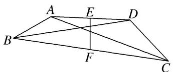

A. $2m - n = 1$

B. $2m - 2n = 1$

C. $m - 2n = 1$

D. $2n - 2m = 1$
答案 D 解析 $\overrightarrow{AC} \cdot \overrightarrow{BD} = (\overrightarrow{AB} + \overrightarrow{BC}) \cdot (-\overrightarrow{AB} + \overrightarrow{AD}) = -\overrightarrow{AB}^2 + \overrightarrow{AB} \cdot \overrightarrow{AD} - \overrightarrow{AB} \cdot \overrightarrow{BC} + \overrightarrow{AD} \cdot \overrightarrow{BC} = -\overrightarrow{AB}^2 + \overrightarrow{AB} \cdot (\overrightarrow{AD} - \overrightarrow{BC}) + m = -\overrightarrow{AB}^2 + \overrightarrow{AB} \cdot (\overrightarrow{AB} + \overrightarrow{BC} + \overrightarrow{CD} - \overrightarrow{BC}) + m = \overrightarrow{AB} \cdot \overrightarrow{CD} + m.$ 又 $EF = EA + AB + BF, EF = ED + DC + CF$ ，两式相加，再根据点 $E, F$ 分别是边 $AD, BC$ 的中点，化简得 $2\overrightarrow{EF} = \overrightarrow{AB} + \overrightarrow{DC}$ ，两边同时平方得 $4 = 2 + 3 + 2\overrightarrow{AB} \cdot \overrightarrow{DC}$ ，所以 $\overrightarrow{AB} \cdot \overrightarrow{DC} = -\frac{1}{2}$ ，则 $\overrightarrow{AB} \cdot \overrightarrow{CD} = \frac{1}{2}$ ，所以 $n = \frac{1}{2} + m$ ，即 $2n - 2m = 1$ ，故选D.  
（13）(2017·浙江)如图，已知平面四边形 $ABCD$ ， $AB \perp BC$ ， $AB = BC = AD = 2$ ， $CD = 3$ ， $AC$ 与 $BD$ 交于点 $O$ 。记 $I_{1} = \overrightarrow{OA} \cdot \overrightarrow{OB}$ ， $I_{2} = \overrightarrow{OB} \cdot \overrightarrow{OC}$ ， $I_{3} = \overrightarrow{OC} \cdot \overrightarrow{OD}$ ，则（）

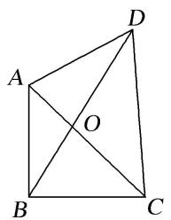

A. $I_{1} <   I_{2} <   I_{3}$

B. $I_{1} <   I_{3} <   I_{2}$

C. $I_{3} <   I_{1} <   I_{2}$

D. $I_{2} <   I_{1} <   I_{3}$
答案 C 解析 如图所示，四边形 ABCE 是正方形，F 为正方形的对角线的交点，易得 AO<AF，而 $\angle AFB=90^{\circ}$ ，∴ $\angle AOB$ 与 $\angle COD$ 为钝角， $\angle AOD$ 与 $\angle BOC$ 为锐角，根据题意， $I_{1}-I_{2}=\overrightarrow{OA}\cdot\overrightarrow{OB}-\overrightarrow{OB}\cdot\overrightarrow{OC}=\overrightarrow{OB}\cdot(\overrightarrow{OA}-\overrightarrow{OC})=\overrightarrow{OB}\cdot\overrightarrow{CA}=|\overrightarrow{OB}||\overrightarrow{CA}|\cdot\cos\angle AOB<0$ ，∴ $I_{1}<I_{2}$ ，同理 $I_{2}>I_{3}$ ，作 $AG\perp BD$ 于 G，又 AB=AD，∴ OB<BG=GD<OD，而 OA<AF=FC<OC，∴ $|\overrightarrow{OA}||\overrightarrow{OB}|<|\overrightarrow{OC}||\overrightarrow{OD}|$ ，而 $\cos\angle AOB=\cos\angle COD<0$ ，∴ $\overrightarrow{OA}\cdot\overrightarrow{OB}>\overrightarrow{OC}\cdot\overrightarrow{OD}$ ，即 $I_{1}>I_{3}$ 。∴ $I_{3}<I_{1}<I_{2}$ 。

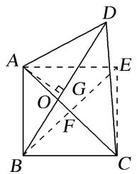  
（14）已知扇形 OAB 的半径为 2，圆心角为 $\frac{2\pi}{3}$ ，点 C 是弧 AB 的中点， $\overrightarrow{OD} = -\frac{1}{2}\overrightarrow{OB}$ ，则 $\overrightarrow{CD} \cdot \overrightarrow{AB}$ 的值为（）

A. 3

B. 4

C.-3

D. -4
答案 C 解析 如图, 连接 $CO$ , $\because$ 点 $C$ 是弧 $AB$ 的中点, $\therefore CO \perp AB$ , 又 $\because OA = OB = 2$ , $\overrightarrow{OD} = -\frac{1}{2}\overrightarrow{OB}$ , $\angle AOB = \frac{2\pi}{3}$ , $\therefore \overrightarrow{CD} \cdot \overrightarrow{AB} = (\overrightarrow{OD} - \overrightarrow{OC}) \cdot \overrightarrow{AB} = -\frac{1}{2}\overrightarrow{OB} \cdot \overrightarrow{AB} = -\frac{1}{2}\overrightarrow{OB} \cdot (\overrightarrow{OB} - \overrightarrow{OA}) = \frac{1}{2}\overrightarrow{OA} \cdot \overrightarrow{OB} - \frac{1}{2}\overrightarrow{OB}^2 = \frac{1}{2} \times 2 \times 2 \times \left(-\frac{1}{2}\right) - \frac{1}{2} \times 4 = -3$ .

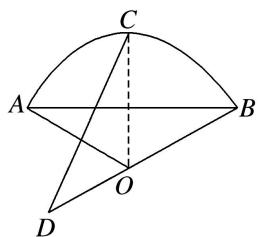

# 【对点训练】

1. 已知 $|a|=|b|=1$ ，向量 a 与 b 的夹角为 $45^{\circ}$ ，则 $(a+2b)\cdot a=$ \_\_\_\_.

1. 答案 $1 + \sqrt{2}$ 解析 因为 $|a| = |b| = 1$ ，向量 $a$ 与 $b$ 的夹角为 $45^{\circ}$ ，所以 $(a + 2b) \cdot a = a^{2} + 2a \cdot b = |a|^{2} + 2|a| \cdot |b| \cos 45^{\circ} = 1 + \sqrt{2}$ .

2. 已知向量 $a, b$ 的夹角为 $\frac{3\pi}{4}$ , $|a| = \sqrt{2}$ , $|b| = 2$ , 则 $a \cdot (a - 2b) = \_$ .

2. 答案 6 解析 $a \cdot (a - 2b) = a^2 - 2a \cdot b = 2 - 2 \times \sqrt{2} \times 2 \times \left(-\frac{\sqrt{2}}{2}\right) = 6.$

3. 已知 $|a|=6$ ， $|b|=3$ ，向量 a 在 b 方向上的投影是 4，则 $a \cdot b$ 为()

A. 12

B. 8

C.-8

D. 2

3. 答案 A 解析 $\because |a|\cos<a,\quad b>=4,\quad |b|=3,\quad \therefore a\cdot b=|a||b|\cdot\cos<a,\quad b>=3\times4=12.$

4. 设 $x \in \mathbf{R}$ , 向量 $a = (1, x)$ , $b = (2, -4)$ , 且 $a // b$ , 则 $a \cdot b = (\quad)$

A. -6

B. $\sqrt{10}$

C. $\sqrt{5}$

D. 10

4. 答案 D 解析 $\because a = (1, x), b = (2, -4)$ 且 $a // b$ , $\therefore -4 - 2x = 0$ , $x = -2$ , $\therefore a = (1, -2)$ , $a \cdot b = 10$ , 故选 D.

5. (2014·全国Ⅱ)设向量 a, b 满足 $\left|a+b\right|=\sqrt{10}$ ， $\left|a-b\right|=\sqrt{6}$ ，则 $a\cdot b=(\quad)$

A. 1

B. 2

C. 3

D. 5

5. 答案 A 解析 由条件可得， $(a + b)^2 = 10$ ， $(a - b)^2 = 6$ ，两式相减得 $4a \cdot b = 4$ ，所以 $a \cdot b = 1$ .

6. 在边长为 1 的等边三角形 $ABC$ 中，设 $\overrightarrow{BC} = a$ ， $\overrightarrow{CA} = b$ ， $\overrightarrow{AB} = c$ ，则 $a \cdot b + b \cdot c + c \cdot a = (\quad)$

A. $-\frac{3}{2}$

B. 0

C. $\frac{3}{2}$

D. 3

6. 答案 A 解析 依题意有 $a \cdot b + b \cdot c + c \cdot a = 1 \times 1 \times \left(-\frac{1}{2}\right) + 1 \times 1 \times \left(-\frac{1}{2}\right) + 1 \times 1 \times \left(-\frac{1}{2}\right) = -\frac{3}{2}$ .

7. 如图, 三个边长为 2 的等边三角形有一条边在同一条直线上, 边 $B_{3}C_{3}$ 上有 10 个不同的点 $P_{1}, P_{2}, \ldots, P_{10}$ , 记 $m_{i} = \overrightarrow{AB_{2}} \cdot \overrightarrow{AP_{i}} (i = 1, 2, \ldots, 10)$ , 则 $m_{1} + m_{2} + \ldots + m_{10}$ 的值为( )

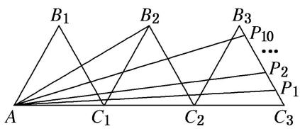

A. 180

B. $60\sqrt{3}$

C. 45

D. $15\sqrt{3}$

7. 答案 A 解析 由题意可知， $\angle B_{2}AC_{3}=30^{\circ}$ ， $\angle AC_{3}B_{3}=60^{\circ}$ ， $\therefore \overrightarrow{AB_{2}} \perp \overrightarrow{B_{3}C_{3}}$ ，即 $\overrightarrow{AB_{2}} \cdot \overrightarrow{B_{3}C_{3}}=0$ 。则 $m_{i}=\overrightarrow{AB_{2}} \cdot \overrightarrow{AP_{i}}=\overrightarrow{AB_{2}} \cdot (\overrightarrow{AC_{3}}+\overrightarrow{C_{3}P_{i}})=\overrightarrow{AB_{2}} \cdot \overrightarrow{AC_{3}}=2\sqrt{3} \times 6 \times \frac{\sqrt{3}}{2}=18$ ， $\therefore m_{1}+m_{2}+\ldots+m_{10}=18 \times 10=180.$

8. 在 $\triangle ABC$ 中， $AB = 3$ ， $AC = 2$ ， $BC = \sqrt{10}$ ，则 $\overrightarrow{AB} \cdot \overrightarrow{AC}$ 等于（）

A. $-\frac{3}{2}$

B. $-\frac{2}{3}$

C. $\frac{2}{3}$

D. $\frac{3}{2}$

8. 答案 D 解析 在 $\triangle ABC$ 中, $\cos \angle BAC = \frac{AB^2 + AC^2 - BC^2}{2AB \cdot AC} = \frac{9 + 4 - 10}{2 \times 3 \times 2} = \frac{1}{4}$ , $\therefore \overrightarrow{AB} \cdot \overrightarrow{AC} = |\overrightarrow{AB}| |\overrightarrow{AC}| \cos \angle BAC = 3 \times 2 \times \frac{1}{4} = \frac{3}{2}$ .

9. 在 Rt△ABC 中，∠B=90°，BC=2，AB=1，D 为 BC 的中点，E 在斜边 AC 上，若 $\overrightarrow{AE}=2\overrightarrow{EC}$ ，则 $\overrightarrow{DE}\cdot\overrightarrow{AC}=$ \_\_\_\_.

9. 答案 $\frac{1}{3}$ 解析 如图，以 $B$ 为坐标原点， $AB$ 所在直线为 $x$ 轴， $BC$ 所在直线为 $y$ 轴，建立平面直角坐标系，则 $B(0,0), A(1,0), C(0,2)$ ，所以 $\overrightarrow{AC} = (-1,2)$ .

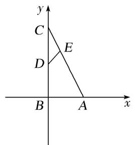
因为 D 为 BC 的中点，所以 $D(0, 1)$ ，因为 $\overrightarrow{AE}=2\overrightarrow{EC}$ ，所以 $E\left(\frac{1}{3}, \frac{4}{3}\right)$ ，所以 $\overrightarrow{DE}=\left(\frac{1}{3}, \frac{1}{3}\right)$ ，所以 $\overrightarrow{DE}\cdot\overrightarrow{AC}=\left(\frac{1}{3}, \frac{1}{3}\right)\cdot(-1, 2)=-\frac{1}{3}+\frac{2}{3}=\frac{1}{3}$ .

10. 已知 $P$ 是边长为 2 的正三角形 $ABC$ 的边 $BC$ 上的动点，则 $\overrightarrow{AP} \cdot (\overrightarrow{AB} + \overrightarrow{AC}) =$ \_\_\_\_.  
10. 答案 6 解析 如图，设 BC 的中点为 D，则 $AD \perp BC$ ，∴ $|AP| \cos \angle PAD = AD$ ， $\overrightarrow{AB} + \overrightarrow{AC} = 2 \overrightarrow{AD}$ 。∵ $\triangle ABC$ 是边长为 2 的等边三角形，∴ $AD = \sqrt{3}$ ，∴ $\overrightarrow{AP} \cdot (\overrightarrow{AB} + \overrightarrow{AC}) = \overrightarrow{AP} \cdot 2 \overrightarrow{AD} = 2 \times |\overrightarrow{AD}| \times |\overrightarrow{AP}| \times \cos \angle PAD = 2 |\overrightarrow{AD}|^{2} = 2 \times (\sqrt{3})^{2} = 6$ 。

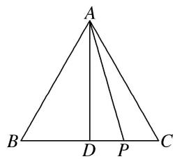

11. 在 $\triangle ABC$ 中， $|\overrightarrow{AB} + \overrightarrow{AC}| = |\overrightarrow{AB} - \overrightarrow{AC}|$ ， $AB = 2$ ， $AC = 1$ ， $E$ ， $F$ 为 $BC$ 的三等分点，则 $\overrightarrow{AE} \cdot \overrightarrow{AF}$ 等于（）

A. $\frac{8}{9}$

B. $\frac{10}{9}$

C. $\frac{25}{9}$

D. $\frac{26}{9}$

11. 答案 B 解析 由 $|\overrightarrow{AB}+\overrightarrow{AC}|=|\overrightarrow{AB}-\overrightarrow{AC}|$ ，化简得 $\overrightarrow{AB}\cdot\overrightarrow{AC}=0$ ，又因为AB和AC为三角形的两条边，它们的长不可能为0，所以AB与AC垂直，所以 $\triangle ABC$ 为直角三角形。以A为原点，以AC所在直线为x轴，以AB所在直线为y轴建立平面直角坐标系，如图所示，则 $A(0,0)$ ， $B(0,2)$ ， $C(1,0)$ 。不妨令E为BC的靠近C的三等分点，则 $E\left(\frac{2}{3},\frac{2}{3}\right)$ ， $F\left(\frac{1}{3},\frac{4}{3}\right)$ ，所以 $\overrightarrow{AE}=\left(\frac{2}{3},\frac{2}{3}\right)$ ， $\overrightarrow{AF}=\left(\frac{1}{3},\frac{4}{3}\right)$ ，所以 $\overrightarrow{AE}\cdot\overrightarrow{AF}=\frac{2}{3}\times\frac{1}{3}+\frac{2}{3}\times\frac{4}{3}=\frac{10}{9}$ 。

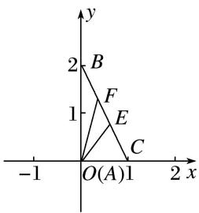

12. $\triangle ABC$ 的外接圆的圆心为 $O$ ，半径为 1，若 $\overrightarrow{OA} + \overrightarrow{AB} + \overrightarrow{OC} = 0$ ，且 $|\overrightarrow{OA}| = |\overrightarrow{AB}|$ ，则 $\overrightarrow{CA} \cdot \overrightarrow{CB}$ 等于（）

A. $\frac{3}{2}$

B. $\sqrt{3}$

C. 3

D. $2\sqrt{3}$

12. 答案 C 解析 $\because \overrightarrow{OA} + \overrightarrow{AB} + \overrightarrow{OC} = 0, \therefore \overrightarrow{OB} = -\overrightarrow{OC}$ , 故点 $O$ 是 $BC$ 的中点, 且 $\triangle ABC$ 为直角三角形, 又 $\triangle ABC$ 的外接圆的半径为 $1, |\overrightarrow{OA}| = |\overrightarrow{AB}|$ , $\therefore BC = 2, AB = 1, CA = \sqrt{3}, \angle BCA = 30^\circ, \therefore \overrightarrow{CA} \cdot \overrightarrow{CB} = |\overrightarrow{CA}||\overrightarrow{CB} | \cdot \cos 30^\circ = \sqrt{3} \times 2 \times \frac{\sqrt{3}}{2} = 3$ .

13. 如图，在 $\triangle ABC$ 中， $AD \perp AB$ ， $\overrightarrow{BC} = \sqrt{3}\overrightarrow{BD}$ ， $|\overrightarrow{AD}| = 1$ ，则 $\overrightarrow{AC} \cdot \overrightarrow{AD}$ 的值为（）

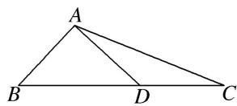

A. $2 \sqrt{3}$

B. $\frac{\sqrt{3}}{2}$

C. $\frac{\sqrt{3}}{3}$

D. $\sqrt{3}$

13. 答案 D 解析 $\because$ 在 $\triangle ABC$ 中， $AD \perp AB$ ， $\therefore \overrightarrow{AB} \cdot \overrightarrow{AD} = 0$ ， $\overrightarrow{AC} \cdot \overrightarrow{AD} = (\overrightarrow{AB} + \overrightarrow{BC}) \cdot \overrightarrow{AD} = \overrightarrow{AB} \cdot \overrightarrow{AD} + \overrightarrow{BC} \cdot \overrightarrow{AD} = \overrightarrow{BC} \cdot \overrightarrow{AD} = \sqrt{3}$ 。 $\overrightarrow{BD} \cdot \overrightarrow{AD} = \sqrt{3} (\overrightarrow{AD} - \overrightarrow{AB}) \cdot \overrightarrow{AD} = \sqrt{3}$ 。 $\overrightarrow{AD} \cdot \overrightarrow{AD} - \sqrt{3}$ 。 $\overrightarrow{AB} \cdot \overrightarrow{AD} = \sqrt{3}$ .

14. 在 $\triangle ABC$ 中， $AB = 1$ ， $\angle ABC = 60^\circ$ ， $\overrightarrow{AC} \cdot \overrightarrow{AB} = -1$ ，若 $O$ 是 $\triangle ABC$ 的重心，则 $\overrightarrow{BO} \cdot \overrightarrow{AC} =$ \_\_\_\_.

14. 答案 5 解析 如图所示，以 B 为坐标原点，BC 所在直线为 x 轴，建立平面直角坐标系.

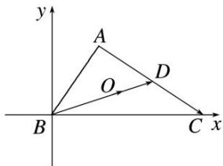
$\because AB = 1, \angle ABC = 60^{\circ}, \therefore A\left(\frac{1}{2}, \frac{\sqrt{3}}{2}\right)$ . 设 $C(a, 0)$ . $\because \overrightarrow{AC} \cdot \overrightarrow{AB} = -1, \therefore \left(a - \frac{1}{2}, -\frac{\sqrt{3}}{2}\right) \cdot \left(-\frac{1}{2}, -\frac{\sqrt{3}}{2}\right) = -\frac{1}{2}\left(a - \frac{1}{2}\right) + \frac{3}{4} = -1$ , 解得 $a = 4$ . $\because O$ 是 $\triangle ABC$ 的重心, 延长 $BO$ 交 $AC$ 于点 $D$ , $\therefore \overrightarrow{BO} = \frac{2}{3}\overrightarrow{BD} = \frac{2}{3} \times \frac{1}{2} (\overrightarrow{BA} + \overrightarrow{BC}) = \frac{1}{3}\left[\left(\frac{1}{2}, \frac{\sqrt{3}}{2}\right) + (4, 0)\right] = \left(\frac{3}{2}, \frac{\sqrt{3}}{6}\right)$ . $\therefore \overrightarrow{BO} \cdot \overrightarrow{AC} = \left(\frac{3}{2}, \frac{\sqrt{3}}{6}\right) \cdot \left(\frac{7}{2}, -\frac{\sqrt{3}}{2}\right) = 5$ .

15. 已知 $O$ 是 $\triangle ABC$ 的外心， $|\overrightarrow{AB}| = 4$ ， $|\overrightarrow{AC}| = 2$ ，则 $\overrightarrow{AO} \cdot (\overrightarrow{AB} + \overrightarrow{AC}) = (\quad)$

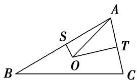

A. 10

B. 9

C. 8

D. 6

15. 答案 A 解析 作 $OS \perp AB, OT \perp AC \because O$ 为 $\triangle ABC$ 的外接圆圆心. $\therefore S, T$ 为 $AB, AC$ 的中点, 且 $\overrightarrow{AS} \cdot \overrightarrow{SO}$ $=0$ , $\overrightarrow{AT} \cdot \overrightarrow{TO} = 0$ , $\overrightarrow{AO} = \overrightarrow{AS} + \overrightarrow{SO}$ , $\overrightarrow{AO} = \overrightarrow{AT} + \overrightarrow{TO}$ , $\therefore \overrightarrow{AO} \cdot (\overrightarrow{AB} + \overrightarrow{AC}) = \overrightarrow{AO} \cdot \overrightarrow{AB} + \overrightarrow{AO} \cdot \overrightarrow{AC} = (\overrightarrow{AS} + \overrightarrow{SO}) \cdot \overrightarrow{AB} + (\overrightarrow{AT} + \overrightarrow{TO}) \cdot \overrightarrow{AC} = \overrightarrow{AS} \cdot \overrightarrow{AB} + \overrightarrow{SO} \cdot \overrightarrow{AB} + \overrightarrow{AT} \cdot \overrightarrow{AC} + \overrightarrow{TO} \cdot \overrightarrow{AC} = \frac{1}{2}\overrightarrow{AB} \cdot \overrightarrow{AB} + \frac{1}{2}\overrightarrow{AC} \cdot \overrightarrow{AC} = \frac{1}{2} |\overrightarrow{AB}|^2 + \frac{1}{2} |\overrightarrow{AC}|^2 = 8 + 2 = 10$ . 故选 A. 优解: 不妨设 $\angle A = 90^\circ$ , 建立如图所示平面直角坐标系. 设 $B(4, 0)$ , $C(0, 2)$ , 则 $O$ 为 $BC$ 的中点 $O(2, 1)$ , $\therefore \overrightarrow{AB} + \overrightarrow{AC} = 2\overrightarrow{AO}$ , $\therefore \overrightarrow{AO} \cdot (\overrightarrow{AB} + \overrightarrow{AC}) = 2|\overrightarrow{AO}|^2 = 2(4 + 1) = 10$ . 故选 A.

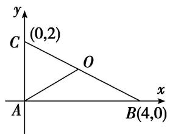

16. 在 $\triangle ABC$ 中, 已知 $\overrightarrow{AB} \cdot \overrightarrow{AC} = \frac{9}{2}$ , $|\overrightarrow{AC}| = 3$ , $|\overrightarrow{AB}| = 3$ , $M$ , $N$ 分别是 $BC$ 边上的三等分点, 则 $\overrightarrow{AM} \cdot \overrightarrow{AN}$ 的值是 ( )

A. $\frac{11}{2}$

B. $\frac{13}{2}$

C. 6

D. 7

16. 答案 B 解析 不妨设 $\overrightarrow{AM} = \frac{2}{3}\overrightarrow{AB} +\frac{1}{3}\overrightarrow{AC}$ ， $\overrightarrow{AN} = \frac{1}{3}\overrightarrow{AB} +\frac{2}{3}\overrightarrow{AC}$ ，所以 $\overrightarrow{AM}\cdot \overrightarrow{AN} = (\frac{2}{3}\overrightarrow{AB} +\frac{1}{3}\overrightarrow{AC})\cdot (\frac{1}{3}\overrightarrow{AB} +\frac{2}{3}\overrightarrow{AC})$ $= \frac{2}{9}\overrightarrow{AB}^2 +\frac{5}{9}\overrightarrow{AB}\cdot \overrightarrow{AC} +\frac{2}{9}\overrightarrow{AC}^2 = \frac{2}{9} (\overrightarrow{AB} ^2 +\overrightarrow{AC} ^2) + \frac{5}{9}\overrightarrow{AB}\cdot \overrightarrow{AC} = \frac{2}{9}\times (3^{2} + 3^{2}) + \frac{5}{9}\times \frac{9}{2} = \frac{13}{2},$ 故选B.

17. 在 $\triangle ABC$ 中, $AB=2AC=6$ , $\vec{BA}\cdot\vec{BC}=\vec{BA}^{2}$ , 点 $P$ 是 $\triangle ABC$ 所在平面内一点, 则当 $\vec{PA}^{2}+\vec{PB}^{2}+\vec{PC}^{2}$ 取得最小值时, $\vec{AP}\cdot\vec{BC}=$ \_\_\_\_.

17. 答案 -9 解析 $\because \overrightarrow{BA} \cdot \overrightarrow{BC} = |\overrightarrow{BA}| \cdot |\overrightarrow{BC}| \cdot \cos B = |\overrightarrow{BA}|^2, \therefore |\overrightarrow{BC}| \cdot \cos B = |\overrightarrow{BA}| = 6, \therefore \overrightarrow{CA} \perp \overrightarrow{AB}$ , 即 $A = \frac{\pi}{2}$ , 以 $A$ 为坐标原点建立如图所示的坐标系,

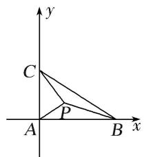
则 $B(6, 0)$ , $C(0, 3)$ , 设 $P(x, y)$ , 则 $\overrightarrow{PA}^2 + \overrightarrow{PB}^2 + \overrightarrow{PC}^2 = x^2 + y^2 + (x - 6)^2 + y^2 + x^2 + (y - 3)^2 = 3x^2 - 12x + 3y^2 - 6y + 45 = 3[(x - 2)^2 + (y - 1)^2 + 10]$ . 当 $x = 2$ , $y = 1$ 时, $\overrightarrow{PA}^2 + \overrightarrow{PB}^2 + \overrightarrow{PC}^2$ 取得最小值, 此时 $P(2, 1)$ , $\overrightarrow{AP} = (2, 1)$ , 此时 $\overrightarrow{AP} \cdot \overrightarrow{BC} = (2, 1) \cdot (-6, 3) = -9$ .

18. 已知在 $\triangle ABC$ 所在平面内有两点 $P, Q$ , 满足 $\overrightarrow{PA} + \overrightarrow{PC} = 0$ , $\overrightarrow{QA} + \overrightarrow{QB} + \overrightarrow{QC} = \overrightarrow{BC}$ , 若 $|\overrightarrow{AB}| = 4$ , $|\overrightarrow{AC}| = 2$ , $S_{\triangle APQ} = \frac{2}{3}$ , 则 $\overrightarrow{AB} \cdot \overrightarrow{AC}$ 的值为 \_\_\_\_.

18. 答案 $\pm 4\sqrt{3}$ 解析 由 $\overrightarrow{PA} + \overrightarrow{PC} = 0$ 知， $P$ 是 $AC$ 的中点，由 $\overrightarrow{QA} + \overrightarrow{QB} + \overrightarrow{QC} = \overrightarrow{BC}$ ，可得 $\overrightarrow{QA} + \overrightarrow{QB} = \overrightarrow{BC} - \overrightarrow{QC}$ ，即 $\overrightarrow{QA} + \overrightarrow{QB} = \overrightarrow{BQ}$ ，即 $\overrightarrow{QA} = 2\overrightarrow{BQ}$ ， $\therefore Q$ 是 $AB$ 边靠近 $B$ 的三等分点， $\therefore S_{\triangle APQ} = \frac{2}{3} \times \frac{1}{2} \times S_{\triangle ABC} = \frac{1}{3} S_{\triangle ABC}$ ， $\therefore S_{\triangle ABC} = 3S_{\triangle APQ} = 3 \times \frac{2}{3} = 2$ 。 $\because S_{\triangle ABC} = \frac{1}{2} |\overrightarrow{AB}| |\overrightarrow{AC}| \sin A = \frac{1}{2} \times 4 \times 2 \times \sin A = 2$ ， $\therefore \sin A = \frac{1}{2}$ ， $\therefore \cos A = \pm \frac{\sqrt{3}}{2}$ ， $\therefore \overrightarrow{AB} \cdot \overrightarrow{AC} = |\overrightarrow{AB}| |\overrightarrow{AC}| \cdot \cos A = \pm 4\sqrt{3}$ .

19. (2013·全国Ⅱ)已知正方形 ABCD 的边长为 2，E 为 CD 的中点，则 $\overrightarrow{AE} \cdot \overrightarrow{BD} =$ \_\_\_\_ .

19. 答案 2 解析 因为 $\overrightarrow{AE} = \overrightarrow{AD} + \frac{1}{2}\overrightarrow{AB}$ , $\overrightarrow{BD} = \overrightarrow{AD} - \overrightarrow{AB}$ , 所以 $\overrightarrow{AE} \cdot \overrightarrow{BD} = (\overrightarrow{AD} + \frac{1}{2}\overrightarrow{AB}) \cdot (\overrightarrow{AD} - \overrightarrow{AB})$
$= \overrightarrow {A D} ^ {2} - \frac {1}{2} \overrightarrow {A D} \cdot \overrightarrow {A B} - \frac {1}{2} \overrightarrow {A B} ^ {2} = 2.$

20. 已知平行四边形 ABCD 中，AB=1，AD=2， $\angle DAB=60^{\circ}$ ，则 $\overrightarrow{AC}\cdot\overrightarrow{AB}=(\quad)$

A. 1

B. $\sqrt{3}$

C. 2

D. $2\sqrt{3}$

20. 答案 C 解析 因为 $\overrightarrow{AC} = \overrightarrow{AB} + \overrightarrow{AD}$ ，所以 $\overrightarrow{AC} \cdot \overrightarrow{AB} = (\overrightarrow{AB} + \overrightarrow{AD}) \cdot \overrightarrow{AB} = |\overrightarrow{AB}|^{2} + \overrightarrow{AD} \cdot \overrightarrow{AB} = 1 + |\overrightarrow{AD}| |\overrightarrow{AB}| \cos 60^{\circ} = 2.$

21. 在平行四边形 $ABCD$ 中， $|\overrightarrow{AB}| = 8$ ， $|\overrightarrow{AD}| = 6$ ， $N$ 为 $DC$ 的中点， $\overrightarrow{BM} = 2\overrightarrow{MC}$ ，则 $\overrightarrow{AM} \cdot \overrightarrow{NM} = (\quad)$

A. 48

B. 36

C. 24

D. 12

21. 答案 C 解析 $\vec{AM}\cdot\vec{NM}=(\vec{AB}+\vec{BM})\cdot(\vec{NC}+\vec{CM})=(\vec{AB}+\frac{2}{3}\vec{AD})\cdot(\frac{1}{2}\vec{AB}-\frac{1}{3}\vec{AD})=\frac{1}{2}\vec{AB}^{2}-\frac{2}{9}\vec{AD}^{2}=\frac{1}{2}\times8^{2}-\frac{2}{9}\times6^{2}=24.$

22. 设四边形 ABCD 为平行四边形， $|\overrightarrow{AB}|=6$ ， $|\overrightarrow{AD}|=4$ ，若点 M，N 满足 $\overrightarrow{BM}=3\overrightarrow{MC}$ ， $\overrightarrow{DN}=2\overrightarrow{NC}$ ，则 $\overrightarrow{AM}\cdot\overrightarrow{NM}$ 等于（）

A. 20

B. 15

C. 9

D. 6

22. 答案 C 解析 $\overrightarrow{AM} = \overrightarrow{AB} + \frac{3}{4}\overrightarrow{AD}, \overrightarrow{NM} = \overrightarrow{CM} - \overrightarrow{CN} = -\frac{1}{4}\overrightarrow{AD} + \frac{1}{3}\overrightarrow{AB}, \therefore \overrightarrow{AM} \cdot \overrightarrow{NM} = \frac{1}{4}(4\overrightarrow{AB} + 3\overrightarrow{AD}) \cdot \frac{1}{12}(4\overrightarrow{AB} - 3\overrightarrow{AD}) = \frac{1}{48}(16\overrightarrow{AB^2} - 9\overrightarrow{AD^2}) = \frac{1}{48}(16 \times 6^2 - 9 \times 4^2) = 9$ ，故选 C.

23. 在四边形 $ABCD$ 中, $\overrightarrow{AB} = \overrightarrow{DC}$ , $P$ 为 $CD$ 上一点, 已知 $|\overrightarrow{AB}| = 8$ , $|\overrightarrow{AD}| = 5$ , $\overrightarrow{AB}$ 与 $\overrightarrow{AD}$ 的夹角为 $\theta$ , 且 $\cos \theta = \frac{11}{20}$ , $\overrightarrow{CP} = 3\overrightarrow{PD}$ , 则 $\overrightarrow{AP} \cdot \overrightarrow{BP} =$ \_\_\_\_.

23. 答案 2 解析 $\because \overrightarrow{AB} = \overrightarrow{DC}$ , $\therefore$ 四边形 $ABCD$ 为平行四边形, 又 $\overrightarrow{CP} = 3\overrightarrow{PD}$ , $\therefore \overrightarrow{AP} = \overrightarrow{AD} + \overrightarrow{DP} = \overrightarrow{AD} + \frac{1}{4}$ $\overrightarrow{AB}$ , $\overrightarrow{BP} = \overrightarrow{BC} + \overrightarrow{CP} = \overrightarrow{AD} - \frac{3}{4}\overrightarrow{AB}$ , 又 $|\overrightarrow{AB}| = 8$ , $|\overrightarrow{AD}| = 5$ , $\cos \theta = \frac{11}{20}$ , $\therefore \overrightarrow{AD} \cdot \overrightarrow{AB} = 8 \times 5 \times \frac{11}{20} = 22$ , $\therefore \overrightarrow{AP} \cdot \overrightarrow{BP} = (\overrightarrow{AD} + \frac{1}{4}\overrightarrow{AB}) \cdot (\overrightarrow{AD} - \frac{3}{4}\overrightarrow{AB}) = |\overrightarrow{AD}|^2 - \frac{1}{2}\overrightarrow{AD} \cdot \overrightarrow{AB} - \frac{3}{16}|\overrightarrow{AB}|^2 = 5^2 - 11 - \frac{3}{16} \times 8^2 = 2$ .

25. 在平面四边形 ABCD 中， $|AC|=3$ ， $|BD|=4$ ，则 $(\overrightarrow{AB}+\overrightarrow{DC})\cdot(\overrightarrow{BC}+\overrightarrow{AD})=$ \_\_\_\_.

25. 答案 -7 解析 $\because$ 在平面四边形 $ABCD$ 中， $|AC| = 3, |BD| = 4, \therefore \overrightarrow{AB} + \overrightarrow{DC} = \overrightarrow{AC} + \overrightarrow{CB} + \overrightarrow{DB} + \overrightarrow{BC} = \overrightarrow{AC}$ $+\overrightarrow{DB} = \overrightarrow{AC} - \overrightarrow{BD}, \overrightarrow{BC} + \overrightarrow{AD} = \overrightarrow{BD} + \overrightarrow{DC} + \overrightarrow{AC} + \overrightarrow{CD} = \overrightarrow{AC} + \overrightarrow{BD}, \therefore (\overrightarrow{AB} + \overrightarrow{DC}) \cdot (\overrightarrow{BC} + \overrightarrow{AD}) = (\overrightarrow{AC} - \overrightarrow{BD})(\overrightarrow{AC} + \overrightarrow{BD}) = \overrightarrow{AC^2} - \overrightarrow{BD^2} = 9 - 16 = -7.$

26. 如图, 在四边形 $ABCD$ 中, $AB = 6$ , $AD = 2$ , $\overrightarrow{DC} = \frac{1}{3}\overrightarrow{AB}$ , $AC$ 与 $BD$ 相交于点 $O$ , $E$ 是 $BD$ 的中点, 若 $\overrightarrow{AO} \cdot \overrightarrow{AE} = 8$ , 则 $\overrightarrow{AC} \cdot \overrightarrow{BD} = (\quad)$

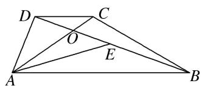

A. -9

B. $-\frac{29}{3}$

C. -10

D. $-\frac{32}{3}$

26. 答案 解析 由 $\overrightarrow{DC} = \frac{1}{3}\overrightarrow{AB}$ , 可得 $DC \parallel AB$ , 且 $DC = 2$ , 则 $\triangle AOB \sim \triangle COD$ , $\overrightarrow{AO} = \frac{3}{4}\overrightarrow{AC} = \frac{3}{4} (\overrightarrow{AD} + \frac{1}{3}\overrightarrow{AB}) = \frac{3}{4}\overrightarrow{AD} + \frac{1}{4}\overrightarrow{AB}$ , 又 $E$ 是 $BD$ 的中点, 所以 $\overrightarrow{AE} = \frac{1}{2}\overrightarrow{AD} + \frac{1}{2}\overrightarrow{AB}$ , 则 $\overrightarrow{AO} \cdot \overrightarrow{AE} = (\frac{3}{4}\overrightarrow{AD} + \frac{1}{4}\overrightarrow{AB})(\frac{1}{2}\overrightarrow{AD} + \frac{1}{2}\overrightarrow{AB}) = \frac{3}{8}\overrightarrow{AD}^2 + \frac{1}{8}\overrightarrow{AB}^2 + \frac{1}{2}\overrightarrow{AD} \cdot \overrightarrow{AB} = \frac{3}{2} + \frac{9}{2} + \frac{1}{2}\overrightarrow{AD} \cdot \overrightarrow{AB} = 8$ , 则 $\overrightarrow{AD} \cdot \overrightarrow{AB} = 4$ , 则 $\overrightarrow{AC} \cdot \overrightarrow{BD} = (\overrightarrow{AD} + \frac{1}{3}\overrightarrow{AB}) \cdot (\overrightarrow{AD} - \frac{1}{3}\overrightarrow{AB}) = \overrightarrow{AD}^2 - \frac{1}{3}\overrightarrow{AB}^2 - \frac{2}{3}\overrightarrow{AD} \cdot \overrightarrow{AB} = 4 - \frac{1}{3} \times 36 - \frac{2}{3} \times 4 = -\frac{32}{3}$ .

27. 设 $\triangle ABC$ 的外接圆的圆心为 $P$ ，半径为 3，若 $\overrightarrow{PA} + \overrightarrow{PB} = \overrightarrow{CP}$ ，则 $\overrightarrow{PA} \cdot \overrightarrow{PB} = (\quad)$

A. $-\frac{9}{2}$

B. $-\frac{3}{2}$

C. 3

D. 9

27. 答案 A 解析 由题意 $\overrightarrow{PA} + \overrightarrow{PB} = \overrightarrow{CP}$ , $\triangle ABC$ 的外接圆的圆心为 $P$ , 半径为 3, 故 $\overrightarrow{PA}$ , $\overrightarrow{PB}$ 两向量的和向量的模是 3, 由向量加法的平行四边形法则知, $\overrightarrow{PA}$ , $\overrightarrow{PB}$ 的夹角为 $120^{\circ}$ , 所以 $\overrightarrow{PA} \cdot \overrightarrow{PB} = 3 \times 3 \times \cos 120^{\circ} = 9 \times \left(-\frac{1}{2}\right) = -\frac{9}{2}$ . 故选 A.

28. 如图，B，D 是以 AC 为直径的圆上的两点，其中 $AB=\sqrt{t+1}$ ， $AD=\sqrt{t+2}$ ，则 $\overrightarrow{AC}\cdot\overrightarrow{BD}=(\quad)$

A. 1

B. 2

C. t

D. 2t

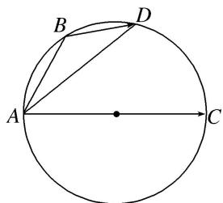

28. 答案 A 解析 因为 $\overrightarrow{BD} = \overrightarrow{AD} - \overrightarrow{AB}$ ，所以 $\overrightarrow{AC} \cdot \overrightarrow{BD} = \overrightarrow{AC} \cdot (\overrightarrow{AD} - \overrightarrow{AB}) = \overrightarrow{AC} \cdot \overrightarrow{AD} - \overrightarrow{AC} \cdot \overrightarrow{AB} = |\overrightarrow{AC}| \cdot |\overrightarrow{AD}| \cos \angle CAD - |\overrightarrow{AC}| \cdot |\overrightarrow{AB}| \cos \angle CAB$ 。又 $AC$ 为圆的直径，所以连接 $BC$ ， $DC$ （图略），则 $\angle ADC = \angle ABC = \frac{\pi}{2}$ ，所以 $\cos \angle CAD = \frac{|\overrightarrow{AD}|}{|\overrightarrow{AC}|}$ ， $\cos \angle CAB = \frac{|\overrightarrow{AB}|}{|\overrightarrow{AC}|}$ ，则 $\overrightarrow{AC} \cdot \overrightarrow{BD} = |\overrightarrow{AD}|^2 - |\overrightarrow{AB}|^2 = t + 2 - (t + 1) = 1$ ，故选 A.

# 考点二 已知平面向量数量积，求参数的值或判断多边形的形状

# 【例题选讲】

[例 1]（1）在 $\triangle ABC$ 中， $A=90^{\circ}$ ， $AB=1$ ， $AC=2$ 。设点 $P$ ， $Q$ 满足 $\overrightarrow{AP}=\lambda \overrightarrow{AB}$ ， $\overrightarrow{AQ}=(1-\lambda) \overrightarrow{AC}$ ， $\lambda \in \mathbf{R}$ 。若 $\overrightarrow{BQ} \cdot \overrightarrow{CP}=-2$ ，则 $\lambda$ 等于( )

A. $\frac{1}{3}$

B. $\frac{2}{3}$

C. $\frac{4}{3}$

D. 2
答案 B 解析 $\vec{BQ}=\vec{AQ}-\vec{AB}=(1-\lambda)\vec{AC}-\vec{AB},\quad\vec{CP}=\vec{AP}-\vec{AC}=\lambda\vec{AB}-\vec{AC},\quad\vec{BQ}\cdot\vec{CP}=(\lambda-1)\vec{AC}^{2}-\lambda\vec{AB}^{2}=4(\lambda-1)-\lambda=3\lambda-4=-2$ ，即 $\lambda=\frac{2}{3}$ .  
（2）已知 $\triangle ABC$ 为等边三角形， $AB=2$ ，设点 $P, Q$ 满足 $\overrightarrow{AP}=\lambda\overrightarrow{AB}$ ， $\overrightarrow{AQ}=(1-\lambda)\overrightarrow{AC}, \lambda\in\mathbf{R}$ ，若 $\overrightarrow{BQ}\cdot\overrightarrow{CP}$
$= -\frac{3}{2}$ ，则 $\lambda = ()$

A. $\frac{1}{2}$

B. $\frac{1 \pm \sqrt{2}}{2}$

C. $\frac{1 \pm \sqrt{10}}{2}$

D. $\frac{-3 \pm 2\sqrt{2}}{2}$
答案 A 解析 $\because \overrightarrow{BQ} = \overrightarrow{AQ} - \overrightarrow{AB} = (1 - \lambda)\overrightarrow{AC} - \overrightarrow{AB},\overrightarrow{CP} = \overrightarrow{AP} - \overrightarrow{AC} = \lambda \overrightarrow{AB} - \overrightarrow{AC}$ ，又 $\overrightarrow{BQ}\cdot \overrightarrow{CP}$ $= -\frac{3}{2},|\overrightarrow{AB}| = |\overrightarrow{AC}| = 2,A = 60^{\circ},\overrightarrow{AB}\cdot \overrightarrow{AC} = |\overrightarrow{AB}|\cdot |\overrightarrow{AC}|\cos 60^{\circ} = 2,\therefore [(1 - \lambda)\overrightarrow{AC} - \overrightarrow{AB} ]\cdot (\lambda \overrightarrow{AB} -\overrightarrow{AC})$ $= -\frac{3}{2}$ ，即 $\lambda |\overrightarrow{AB}|^2 +(\lambda^2 -\lambda -1)\overrightarrow{AB}\cdot \overrightarrow{AC} +(1 - \lambda)|\overrightarrow{AC}|^2 = \frac{3}{2}$ ，所以 $4\lambda +2(\lambda^2 -\lambda -1) + 4(1 - \lambda) = \frac{3}{2}$ ，解得 $\lambda = \frac{1}{2}$  
（3）已知菱形ABCD的边长为6， $\angle ABD = 30^{\circ}$ ，点 $E$ ， $F$ 分别在边BC，DC上， $BC = 2BE$ ， $CD = \lambda CF$ .若 $\overrightarrow{AE}\cdot \overrightarrow{BF} = -9$ ，则 $\lambda$ 的值为（）

A. 2

B. 3

C. 4

D. 5
答案 B 解析 依题意得 $\overrightarrow{AE} = \overrightarrow{AB} +\overrightarrow{BE} = \frac{1}{2}\overrightarrow{BC} -\overrightarrow{BA}$ ， $\overrightarrow{BF} = \overrightarrow{BC} +\frac{1}{\lambda}\overrightarrow{BA}$ ，因此 $\overrightarrow{AE}\cdot \overrightarrow{BF} = (\frac{1}{2}\overrightarrow{BC} -\overrightarrow{BA})(\overrightarrow{BC}+$ $\frac{1}{\lambda}\overrightarrow{BA}) = \frac{1}{2}\overrightarrow{BC}^2 -\frac{1}{\lambda}\overrightarrow{BA}^2 +\left(\frac{1}{2\lambda} -1\right)\overrightarrow{BC}\cdot \overrightarrow{BA}$ ，于是有 $\left(\frac{1}{2} -\frac{1}{\lambda}\right)\times 6^2 +\left(\frac{1}{2\lambda} -1\right)\times 6^2\times \cos 60^\circ = -9$ .由此解得 $\lambda = 3$ ，故选B.  
（4）已知菱形 ABCD 边长为 2， $\angle B=\frac{\pi}{3}$ ，点 P 满足 $\overrightarrow{AP}=\lambda\overrightarrow{AB}$ ， $\lambda\in R$ ，若 $\overrightarrow{BD}\cdot\overrightarrow{CP}=-3$ ，则 $\lambda$ 的值为()

A. $\frac{1}{2}$

B. $-\frac{1}{2}$

C. $\frac{1}{3}$

D. $-\frac{1}{3}$
答案 A 解析 法一：由题意可得 $\overrightarrow{BA} \cdot \overrightarrow{BC} = 2 \times 2\cos \frac{\pi}{3} = 2$ ， $\overrightarrow{BD} \cdot \overrightarrow{CP} = (\overrightarrow{BA} + \overrightarrow{BC}) \cdot (\overrightarrow{BP} - \overrightarrow{BC}) = (\overrightarrow{BA} + \overrightarrow{BC}) \cdot [(\overrightarrow{AP} - \overrightarrow{AB}) - \overrightarrow{BC}] = (\overrightarrow{BA} + \overrightarrow{BC}) \cdot [(\lambda - 1) \cdot \overrightarrow{AB} - \overrightarrow{BC}] = (1 - \lambda)\overrightarrow{BA}^2 - \overrightarrow{BA} \cdot \overrightarrow{BC} + (1 - \lambda)\overrightarrow{BA} \cdot \overrightarrow{BC} - \overrightarrow{BC}^2 = (1 - \lambda) \cdot 4 - 2 + 2(1 - \lambda) - 4 = -6\lambda = -3$ ， $\therefore \lambda = \frac{1}{2}$ ，故选 A.

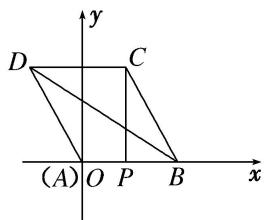

法二：建立如图所示的平面直角坐标系，则 $B(2,0)$ ， $C(1,\sqrt{3})$ ， $D(-1,\sqrt{3})$ 。令 $P(x,0)$ ，由 $\overrightarrow{BD} \cdot \overrightarrow{CP} = (-3, \sqrt{3}) \cdot (x - 1, -\sqrt{3}) = -3x + 3 - 3 = -3x = -3$ 得 $x = 1$ 。 $\because \overrightarrow{AP} = \lambda \overrightarrow{AB}$ ， $\therefore \lambda = \frac{1}{2}$ 。故选A.  
（5）若 $O$ 为 $\triangle ABC$ 所在平面内任一点，且满足 $(\overrightarrow{OB} -\overrightarrow{OC})\cdot (\overrightarrow{OB} +\overrightarrow{OC} -2\overrightarrow{OA}) = 0$ ，则 $\triangle ABC$ 的形状为（

A. 正三角形

B. 直角三角形

C. 等腰三角形

D. 等腰直角三角形
答案 C 解析 因为 $(\overrightarrow{OB} -\overrightarrow{OC})\cdot (\overrightarrow{OB} +\overrightarrow{OC} -2\overrightarrow{OA}) = 0$ ，即 $\overrightarrow{CB}\cdot (\overrightarrow{AB} +\overrightarrow{AC}) = 0$ ，因为 $\overrightarrow{AB} -\overrightarrow{AC} = \overrightarrow{CB}$ ，所以 $(\overrightarrow{AB} -\overrightarrow{AC})\cdot (\overrightarrow{AB} +\overrightarrow{AC}) = 0$ ，即 $|\overrightarrow{AB}| = |\overrightarrow{AC} |$ ，所以△ABC是等腰三角形，故选C.  
（6）若 $\triangle ABC$ 的三个内角 $A$ ， $B$ ， $C$ 的度数成等差数列，且 $(\overrightarrow{AB}+\overrightarrow{AC})\cdot\overrightarrow{BC}=0$ ，则 $\triangle ABC$ 一定是()

A. 等腰直角三角形

B. 非等腰直角三角形

C. 等边三角形

D. 钝角三角形
答案 C 解析 因为 $(\overrightarrow{AB}+\overrightarrow{AC})\cdot\overrightarrow{BC}=0$ ，所以 $(\overrightarrow{AB}+\overrightarrow{AC})\cdot(\overrightarrow{AC}-\overrightarrow{AB})=0$ ，所以 $\overrightarrow{AC^{2}}-\overrightarrow{AB^{2}}=0$ ，即 $|\overrightarrow{AC}|=|\overrightarrow{AB}|$
又 A, B, C 度数成等差数列，故 $2B = A + C$ , $A + B + C = 3B = \pi$ ，所以 $B = \frac{\pi}{3}$ ，故 $\triangle ABC$ 是等边三角形.  
（7）平面四边形ABCD中， $\overrightarrow{AB} +\overrightarrow{CD} = 0$ ， $(\overrightarrow{AB} -\overrightarrow{AD})\cdot \overrightarrow{AC} = 0$ ，则四边形ABCD是（

A. 矩形

B. 正方形

C. 菱形

D. 梯形
答案 C 解析 因为 $\overrightarrow{AB} +\overrightarrow{CD} = 0$ ，所以 $\overrightarrow{AB} = -\overrightarrow{CD} = \overrightarrow{DC}$ ，所以四边形ABCD是平行四边形．又 $(\overrightarrow{AB}-$ $\overrightarrow{AD})\cdot \overrightarrow{AC} = \overrightarrow{DB}\cdot \overrightarrow{AC} = 0$ ，所以四边形对角线互相垂直，所以四边形ABCD是菱形.  
（8）已知平面向量 $\boldsymbol{a}=(x_{1},y_{1})$ ， $\boldsymbol{b}=(x_{2},y_{2})$ ，若 $|a|=2,\quad|b|=3,\quad a\cdot b=-6$ 。则 $\frac{x_{1}+y_{1}}{x_{2}+y_{2}}$ 的值为()

A. $\frac{2}{3}$

B. $-\frac{2}{3}$

C. $\frac{5}{6}$

D. $-\frac{5}{6}$
答案 B 解析 由已知得，向量 $a = (x_{1}, y_{1})$ 与 $b = (x_{2}, y_{2})$ 反向， $3a + 2b = 0$ ，即 $3(x_{1}, y_{1}) + 2(x_{2}, y_{2}) = (0, 0)$ ，得 $x_{1} = -\frac{2}{3} x_{2}$ ， $y_{1} = -\frac{2}{3} y_{2}$ ，故 $\frac{x_{1} + y_{1}}{x_{2} + y_{2}} = -\frac{2}{3}$ .

# 考点三 平面向量数量积的最值(范围)问题

# 【方法总结】

# 数量积的最值或范围问题的2种求解方法  
（1）几何法：即临界位置法，结合图形，确定临界位置的动态分析求出范围.  
（2）代数法：即目标函数法，将数量积表示为某一个变量或两个变量的函数，建立函数关系式，再利用三角函数有界性、二次函数或基本不等式求最值或范围.

# 【例题选讲】

[例 1]（1） 若 a, b, c 是单位向量，且 $a \cdot b = 0$ ，则 $(a - c) \cdot (b - c)$ 的最大值为 \_\_\_\_.
答案 $1 + \sqrt{2}$ 解析 依题意可设 $a = (1,0)$ ， $b = (0,1)$ ， $c = (\cos \theta, \sin \theta)$ ，则 $(a - c) \cdot (b - c) = 1 - (\sin \theta + \cos \theta) = 1 - \sqrt{2} \sin \left(\theta + \frac{\pi}{4}\right)$ ，所以 $(a - c) \cdot (b - c)$ 的最大值为 $1 + \sqrt{2}$ .  
（2）(2016·浙江)已知向量 a, b, $|a|=1$ , $|b|=2$ . 若对任意单位向量 e，均有 $|a\cdot e|+|b\cdot e|\leqslant\sqrt{6}$ ，则 $a\cdot b$ 的最大值是 \_\_\_\_.
答案 $\frac{1}{2}$ 解析 由已知可得 $\sqrt{6} \geqslant |a \cdot e| + |b \cdot e| \geqslant |a \cdot e + b \cdot e| = |(a + b) \cdot e|$ ，由于上式对任意单位向量 $e$ 都成立． $\therefore \sqrt{6} \geqslant |a + b|$ 成立． $\therefore 6 \geqslant (a + b)^2 = a^2 + b^2 + 2a \cdot b = 1^2 + 2^2 + 2a \cdot b$ ．即 $6 \geqslant 5 + 2a \cdot b$ ， $\therefore a \cdot b \leqslant \frac{1}{2}$ ． $\therefore a \cdot b$ 的最大值为 $\frac{1}{2}$ .  
（3）(2017·全国Ⅱ)已知△ABC是边长为2的等边三角形，P为平面ABC内一点，则 $\overrightarrow{PA}\cdot(\overrightarrow{PB}+\overrightarrow{PC})$ 的最小值是()

A. -2

B. $-\frac{3}{2}$

C. $-\frac{4}{3}$

D. -1
答案 B 解析 方法一（解析法）建立坐标系如图①所示，则 A, B, C 三点的坐标分别为 $A(0, \sqrt{3})$ , $B(-1, 0)$ , $C(1, 0)$ . 设 P 点的坐标为 $(x, y)$ ,

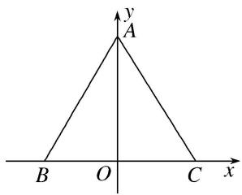

图①
则 $\overrightarrow{PA} = (-x, \sqrt{3} - y)$ , $\overrightarrow{PB} = (-1 - x, -y)$ , $\overrightarrow{PC} = (1 - x, -y)$ , $\therefore \overrightarrow{PA} \cdot (\overrightarrow{PB} + \overrightarrow{PC}) = (-x, \sqrt{3} - y) \cdot (-2x, -2y) = 2(x^2 + y^2 - \sqrt{3}y) = 2\left[x^2 + \left(y - \frac{\sqrt{3}}{2}\right)_2 - \frac{3}{4}\right] \geqslant 2 \times \left(-\frac{3}{4}\right) = -\frac{3}{2}$ . 当且仅当 $x = 0$ , $y = \frac{\sqrt{3}}{2}$ 时, $\overrightarrow{PA} \cdot (\overrightarrow{PB} + \overrightarrow{PC})$ 取得最小值, 最小值为 $-\frac{3}{2}$ . 故选 B.
方法二 （几何法） 如图②所示， $\vec{PB} + \vec{PC} = 2\vec{PD}$ (D 为 BC 的中点)，则 $\vec{PA} \cdot (\vec{PB} + \vec{PC}) = 2\vec{PA} \cdot \vec{PD}$ .

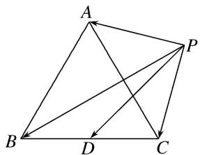

图②

要使 $\vec{PA} \cdot \vec{PD}$ 最小，则 $\vec{PA}$ 与 $\vec{PD}$ 方向相反，即点 $P$ 在线段 $AD$ 上，则 $(2\vec{PA} \cdot \vec{PD})_{\min} = -2|\vec{PA}||\vec{PD}|$ ，问题转化为求 $|\vec{PA}||\vec{PD}|$ 的最大值。又当点 $P$ 在线段 $AD$ 上时， $|\vec{PA}| + |\vec{PD}| = |\vec{AD}| = 2 \times \frac{\sqrt{3}}{2} = \sqrt{3}$ ， $\therefore |\vec{PA}||\vec{PD}| \leqslant \left(\frac{|\vec{PA}| + |\vec{PD}|}{2}\right)^2 = \left(\frac{\sqrt{3}}{2}\right)^2 = \frac{3}{4}$ ， $\therefore [\vec{PA} \cdot (\vec{PB} + \vec{PC})]_{\min} = (2\vec{PA} \cdot \vec{PD})_{\min} = -2 \times \frac{3}{4} = -\frac{3}{2}$ 。故选 B.  
（4）已知 $\overrightarrow{AB} \perp \overrightarrow{AC}$ , $|\overrightarrow{AB}| = \frac{1}{t}$ , $|\overrightarrow{AC}| = t$ , 若点 $P$ 是 $\triangle ABC$ 所在平面内的一点, 且 $\overrightarrow{AP} = \frac{\overrightarrow{AB}}{|\overrightarrow{AB}|} + \frac{4\overrightarrow{AC}}{|\overrightarrow{AC}|}$ , 则 $\overrightarrow{PB} \cdot \overrightarrow{PC}$ 的最大值等于( )

A. 13

B. 15

C. 19

D. 21
答案 A 解析 建立如图所示的平面直角坐标系，则 $B\left(\frac{1}{t}, 0\right)$ ， $C(0, t)$ ， $\overrightarrow{AB} = \left(\frac{1}{t}, 0\right)$ ， $\overrightarrow{AC} = (0, t)$ ， $A\overrightarrow{P} = \frac{\overrightarrow{AB}}{|\overrightarrow{AB}|} + \frac{4\overrightarrow{AC}}{|\overrightarrow{AC}|} = t\left(\frac{1}{t}, 0\right) + \frac{4}{t}(0, t) = (1, 4)$ ， $\therefore P(1, 4)$ ， $\overrightarrow{PB} \cdot \overrightarrow{PC} = \left(\frac{1}{t} - 1, -4\right) \cdot (-1, t - 4) = 17 - \left(\frac{1}{t} + 4t\right) \leq 17$ $-2\sqrt{\frac{1}{t} \cdot 4t} = 13$ ，当且仅当 $t = \frac{1}{2}$ 时等号成立． $\therefore \overrightarrow{PB} \cdot \overrightarrow{PC}$ 的最大值等于 13.

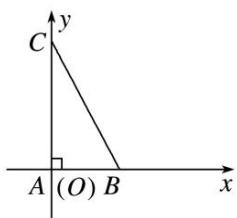  
（5）如图，已知 $P$ 是半径为 2，圆心角为 $\frac{\pi}{3}$ 的一段圆弧 $AB$ 上的一点，若 $\overrightarrow{AB} = 2\overrightarrow{BC}$ ，则 $\overrightarrow{PC} \cdot \overrightarrow{PA}$ 的最小值为 \_\_\_\_.

答案 $5 - 2\sqrt{13}$ 解析 以圆心为坐标原点，平行于 $AB$ 的直径所在直线为 $x$ 轴， $AB$ 的垂直平分线所在的直线为 $y$ 轴，建立平面直角坐标系(图略)，则 $A(-1, \sqrt{3})$ ， $C(2, \sqrt{3})$ ，设 $P(2\cos \theta, 2\sin \theta)\left(\frac{\pi}{3} < \theta < \frac{2\pi}{3}\right)$ ，则 $\overrightarrow{PC} \cdot \overrightarrow{PA} = (2 - 2\cos \theta, \sqrt{3} - 2\sin \theta) \cdot (-1 - 2\cos \theta, \sqrt{3} - 2\sin \theta) = 5 - 2\cos \theta - 4\sqrt{3}\sin \theta = 5 - 2\sqrt{13}\sin (\theta + \varphi)$ ，其中 $0 < \tan \varphi = \frac{\sqrt{3}}{6} < \frac{\sqrt{3}}{3}$ ，所以 $0 < \varphi < \frac{\pi}{6}$ ，当 $\theta = \frac{\pi}{2} - \varphi$ 时， $\overrightarrow{PC} \cdot \overrightarrow{PA}$ 取得最小值，为 $5 - 2\sqrt{13}$ .

另解：设圆心为 O，AB 的中点为 D，由题得 $AB=2\times2\times\sin\frac{\pi}{6}=2,\therefore AC=3$ 。取 AC 的中点 M，由题得 $\left\{\begin{aligned}\overrightarrow{PA}+\overrightarrow{PC}&=2\overrightarrow{PM},\\\overrightarrow{PC}-\overrightarrow{PA}&=\overrightarrow{AC},\end{aligned}\right.$ 两方程平方相减并化简得 $\overrightarrow{PC}\cdot\overrightarrow{PA}=\overrightarrow{PM}^{2}-\frac{1}{4}\overrightarrow{AC}^{2}=\overrightarrow{PM}^{2}-\frac{9}{4}$ ，要使 $\overrightarrow{PC}\cdot\overrightarrow{PA}$ 取最小值，则需 PM 最小，当圆弧 $\widehat{AB}$ 的圆心与点 P，M 共线时，PM 最小。易知 $DM=\frac{1}{2},\therefore OM=\sqrt{\left(\frac{1}{2}\right)^{2}+(\sqrt{3})^{2}}=\frac{\sqrt{13}}{2}$ ，所以 PM 有最小值为 $2-\frac{\sqrt{13}}{2}$ ，代入求得 $\overrightarrow{PC}\cdot\overrightarrow{PA}$ 的最小值为 $5-2\sqrt{13}$ 。  
（6）(2020·天津)如图，在四边形 ABCD 中， $\angle B=60^{\circ}$ ，AB=3，BC=6，且 $\overrightarrow{AD}=\lambda\overrightarrow{BC}$ ， $\overrightarrow{AD}\cdot\overrightarrow{AB}=-\frac{3}{2}$ ，则实数 $\lambda$ 的值为 \_\_\_\_，若 M，N 是线段 BC 上的动点，且 $|\overrightarrow{MN}|=1$ ，则 $\overrightarrow{DM}\cdot\overrightarrow{DN}$ 的最小值为 \_\_\_\_。

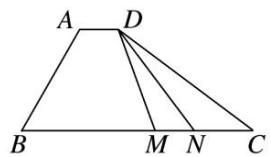
答案 $\frac{1}{6} \frac{13}{2}$ 解析 因为 $\overrightarrow{AD} = \lambda \overrightarrow{BC}$ , 所以 $AD \parallel BC$ , 则 $\angle BAD = 120^{\circ}$ , 所以 $\overrightarrow{AD} \cdot \overrightarrow{AB} = |\overrightarrow{AD}| \cdot |\overrightarrow{AB}| \cdot \cos 120^{\circ} = -\frac{3}{2}$ , 解得 $|\overrightarrow{AD}| = 1$ . 因为 $\overrightarrow{AD}, \overrightarrow{BC}$ 同向, 且 $BC = 6$ , 所以 $\overrightarrow{AD} = \frac{1}{6} \overrightarrow{BC}$ , 即 $\lambda = \frac{1}{6}$ . 在四边形 $ABCD$ 中, 作 $AO \perp BC$ 于点 $O$ , 则 $BO = AB \cdot \cos 60^{\circ} = \frac{3}{2}$ , $AO = AB \cdot \sin 60^{\circ} = \frac{3\sqrt{3}}{2}$ . 以 $O$ 为坐标原点, 以 $BC$ 和 $AO$ 所在直线分别为 $x$ , $y$ 轴建立平面直角坐标系. 如图, 设 $M(a, 0)$ , 不妨设点 $N$ 在点 $M$ 右侧,

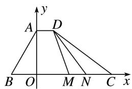
则 $N(a+1,0)$ ，且 $-\frac{3}{2} \leq a \leq \frac{7}{2}$ 。又 $D\left(1, \frac{3\sqrt{3}}{2}\right)$ ，所以 $\overrightarrow{DM} = \left(a - 1, -\frac{3\sqrt{3}}{2}\right)$ ， $\overrightarrow{DN} = \left(a, -\frac{3\sqrt{3}}{2}\right)$ ，所以 $\overrightarrow{DM} \cdot \overrightarrow{DN} = a^{2} - a + \frac{27}{4} = \left(a - \frac{1}{2}\right)^{2} + \frac{13}{2}$ 。所以当 $a = \frac{1}{2}$ 时， $\overrightarrow{DM} \cdot \overrightarrow{DN}$ 取得最小值 $\frac{13}{2}$ 。  
（7） (2020·新高考I)已知 P 是边长为 2 的正六边形 ABCDEF 内的一点，则 $\overrightarrow{AP} \cdot \overrightarrow{AB}$ 的取值范围是()

A. $(-2, 6)$

B. $(-6, 2)$

C. $(-2, 4)$

D. $(-4, 6)$
答案 A 解析 如图，取 $A$ 为坐标原点， $AB$ 所在直线为 $x$ 轴建立平面直角坐标系，则 $A(0,0)$ ， $B(2,0)$ ， $C(3,\sqrt{3})$ ， $F(-1,\sqrt{3})$ 。设 $P(x,y)$ ，则 $\overrightarrow{AP} = (x,y)$ ， $\overrightarrow{AB} = (2,0)$ ，且 $-1 < x < 3$ 。所以 $\overrightarrow{AP} \cdot \overrightarrow{AB} = (x,y) \cdot (2,0) = 2x \in (-2,6)$ 。

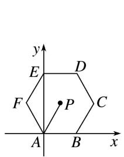

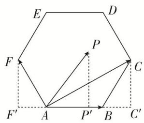

另解 $\overrightarrow{AB}$ 的模为2，根据正六边形的特征，可以得到 $\overrightarrow{AP}$ 在 $\overrightarrow{AB}$ 方向上的投影的取值范围是(-1,3)，结合向量数量积的定义式，可知 $\overrightarrow{AP} \cdot \overrightarrow{AB}$ 等于 $\overrightarrow{AB}$ 的模与 $\overrightarrow{AP}$ 在 $\overrightarrow{AB}$ 方向上的投影的乘积，所以 $\overrightarrow{AP} \cdot \overrightarrow{AB}$ 的取值范围是(-2,6)，故选A.  
（8）如图所示, 半圆的直径 $AB = 6$ , $O$ 为圆心, $C$ 为半圆上不同于 $A$ , $B$ 的任意一点, 若 $P$ 为半径 $OC$ 上的动点, 则 $(\overrightarrow{PA} + \overrightarrow{PB}) \cdot \overrightarrow{PC}$ 的最小值为 \_\_\_\_.

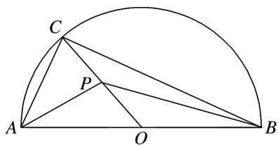
答案 $-\frac{9}{2}$ 解析 $\because$ 圆心 $O$ 是直径 $AB$ 的中点， $\therefore \overrightarrow{PA} + \overrightarrow{PB} = 2\overrightarrow{PO}, \therefore (\overrightarrow{PA} + \overrightarrow{PB}) \cdot \overrightarrow{PC} = 2\overrightarrow{PO} \cdot \overrightarrow{PC}, \because |\overrightarrow{PO}| + |\overrightarrow{PC}| = 3 \geq 2\sqrt{|\overrightarrow{PO}| \cdot |\overrightarrow{PC}|}, \therefore |\overrightarrow{PO}| \cdot |\overrightarrow{PC}| \leq \frac{9}{4}$ ，即 $(\overrightarrow{PA} + \overrightarrow{PB}) \cdot \overrightarrow{PC} = 2\overrightarrow{PO} \cdot \overrightarrow{PC} = -2|\overrightarrow{PO}| \cdot |\overrightarrow{PC}| \geq -\frac{9}{2}$ ，当且仅当 $|\overrightarrow{PO}| = |\overrightarrow{PC}| = \frac{3}{2}$ 时，等号成立，故最小值为 $-\frac{9}{2}$ .

# 【对点训练】

1. 在 $\triangle ABC$ 中， $\angle C = 90^{\circ}$ ， $AB = 6$ ，点 $P$ 满足 $CP = 2$ ，则 $\overrightarrow{PA} \cdot \overrightarrow{PB}$ 的最大值为（）

A. 9

B. 16

C. 18

D. 25

1. 答案 B 解析 $\because \angle C = 90^{\circ}, AB = 6, \therefore \overrightarrow{CA} \cdot \overrightarrow{CB} = 0, \therefore |\overrightarrow{CA} + \overrightarrow{CB}| = |\overrightarrow{CA} - \overrightarrow{CB}| = |\overrightarrow{BA}| = 6, \therefore \overrightarrow{PA} \cdot \overrightarrow{PB} = (\overrightarrow{PC} + \overrightarrow{CA}) \cdot (\overrightarrow{PC} + \overrightarrow{CB}) = \overrightarrow{PC}^{2} + \overrightarrow{PC} \cdot (\overrightarrow{CA} + \overrightarrow{CB}) + \overrightarrow{CA} \cdot \overrightarrow{CB} = \overrightarrow{PC} \cdot (\overrightarrow{CA} + \overrightarrow{CB}) + 4, \therefore$ 当 $\overrightarrow{PC}$ 与 $\overrightarrow{CA} + \overrightarrow{CB}$ 方向相同时， $\overrightarrow{PC} \cdot (\overrightarrow{CA} + \overrightarrow{CB})$ 取得最大值 $2 \times 6 = 12, \therefore \overrightarrow{PA} \cdot \overrightarrow{PB}$ 的最大值为 16.

2. 在等腰直角 $\triangle ABC$ 中, $\angle ABC = 90^{\circ}$ , $AB = BC = 2$ , $M$ , $N$ (不与 $A$ , $C$ 重合)为 $AC$ 边上的两个动点, 且满足 $|\overrightarrow{MN}| = \sqrt{2}$ , 则 $\overrightarrow{BM} \cdot \overrightarrow{BN}$ 的取值范围为( )

A. $\left[\frac{3}{2},2\right]$

B. $\left(\frac{3}{2},\ 2\right)$

C. $\left[\frac{3}{2},2\right]$

D. $\left[\frac{3}{2},+\infty\right]$

2. 答案 C 解析 以等腰直角三角形的直角边 BC 所在直线为 x 轴，BA 所在直线为 y 轴，建立平面直角坐标系如图所示，则 $B(0, 0)$ ，直线 $AC$ 的方程为 $x + y = 2$ ，设 $M(a, 2 - a)$ ，则 $0 < a < 1$ ， $N(a + 1, 1 - a)$ ， $\therefore \overrightarrow{BM} = (a, 2 - a), \overrightarrow{BN} = (a + 1, 1 - a)$ ， $\therefore \overrightarrow{BM} \cdot \overrightarrow{BN} = a(a + 1) + (2 - a)(1 - a) = 2a^2 - 2a + 2$ ， $\because 0 < a < 1$ ， $\therefore$ 当 $a = \frac{1}{2}$ 时， $\overrightarrow{BM} \cdot \overrightarrow{BN}$ 取得最小值 $\frac{3}{2}$ ，又 $\overrightarrow{BM} \cdot \overrightarrow{BN} < 2$ ，故 $\overrightarrow{BM} \cdot \overrightarrow{BN}$ 的取值范围为 $\left[\frac{3}{2}, 2\right]$ .

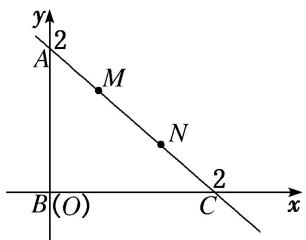

3. 在等腰三角形 $ABC$ 中, $AB = AC = 1$ , $\angle BAC = 90^{\circ}$ , 点 $E$ 为斜边 $BC$ 的中点, 点 $M$ 在线段 $AB$ 上运动, 则 $\overrightarrow{ME} \cdot \overrightarrow{MC}$ 的取值范围是 ( )

A. $\left[\frac{7}{16},\frac{1}{2}\right]$

B. $\left[\frac{7}{16},1\right]$

C. $\left[\frac{1}{2},\quad1\right]$

D. $[0, 1]$

3. 答案 B 解析 如图，以 A 为坐标原点，AC，AB 所在直线分别为 x 轴，y 轴建立平面直角坐标系，则 $A(0,0)$ ， $B(0,1)$ ， $C(1,0)$ ， $E\left(\frac{1}{2},\frac{1}{2}\right)$ 。设 $M(0,m)(0\leq m\leq1)$ ，则 $\overrightarrow{ME}=\left(\frac{1}{2},\frac{1}{2}-m\right)$ ， $\overrightarrow{MC}=(1,-m)$ 。 $\overrightarrow{ME}\cdot\overrightarrow{MC}=\frac{1}{2}-m\left(\frac{1}{2}-m\right)=m^{2}-\frac{1}{2}m+\frac{1}{2}=\left(m-\frac{1}{4}\right)^{2}+\frac{7}{16}$ ，由于 $m\in[0,1]$ ，则当 $m=\frac{1}{4}$ 时， $\overrightarrow{ME}\cdot\overrightarrow{MC}$ 取得最小值 $\frac{7}{16}$ ；当 m=1 时， $\overrightarrow{ME}\cdot\overrightarrow{MC}$ 取得最大值 1。所以 $\overrightarrow{ME}\cdot\overrightarrow{MC}$ 的取值范围是 $\left[\frac{7}{16},1\right]$ 。

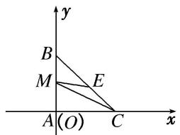

4. 在 $\triangle ABC$ 中，满足 $\overrightarrow{AB} \perp \overrightarrow{AC}$ ， $M$ 是 $BC$ 的中点，若 $O$ 是线段 $AM$ 上任意一点，且 $|\overrightarrow{AB}| = |\overrightarrow{AC}| = \sqrt{2}$ ，则 $\overrightarrow{OA} \cdot (\overrightarrow{OB} + \overrightarrow{OC})$ 的最小值为 \_\_\_\_.

4. 答案 $-\frac{1}{2}$ 解析 $\because |\overrightarrow{AB}|=|\overrightarrow{AC}|=\sqrt{2},\therefore|\overrightarrow{AM}|=1$ 。设 $|\overrightarrow{OA}|=x$ ，则 $|\overrightarrow{OM}|=1-x$ ，而 $\overrightarrow{OB}+\overrightarrow{OC}=2\overrightarrow{OM}$ ，∴ $\overrightarrow{OA}\cdot(\overrightarrow{OB}+\overrightarrow{OC})=2\overrightarrow{OA}\cdot\overrightarrow{OM}=2|\overrightarrow{OA}|\cdot|\overrightarrow{OM}|\cos\pi=-2x(1-x)=2x^{2}-2x=2^{\left(x-\frac{1}{2}\right)^{2}}-\frac{1}{2}$ ，当且仅当 $x=\frac{1}{2}$ 时， $\overrightarrow{OA}\cdot(\overrightarrow{OB}+\overrightarrow{OC})$ 取得最小值，最小值为 $-\frac{1}{2}$

5. 已知在 $\triangle ABC$ 中， $AB = 4$ ， $AC = 2$ ， $AC \perp BC$ ， $D$ 为 $AB$ 的中点，点 $P$ 满足 $\overrightarrow{AP} = \frac{1}{a}\overrightarrow{AC} + \frac{a - 1}{a}\overrightarrow{AD}$ ，则 $\overrightarrow{PA} \cdot (\overrightarrow{PB} + \overrightarrow{PC})$ 的最小值为（）

A. -2

B. $-\frac{28}{9}$

C. $-\frac{25}{8}$

D. $-\frac{7}{2}$

5. 答案 C 解析 由 $\overrightarrow{AP} = \frac{1}{a}\overrightarrow{AC} + \frac{a - 1}{a}\overrightarrow{AD}$ 知点 $P$ 在直线 $CD$ 上，以点 $C$ 为坐标原点， $CB$ 所在直线为 $x$ 轴， $CA$ 所在直线为 $y$ 轴建立如图所示的平面直角坐标系，则 $C(0, 0)$ ， $A(0, 2)$ ， $B(2\sqrt{3}, 0)$ ， $D(\sqrt{3}, 0)$

1), $\therefore$ 直线 $CD$ 的方程为 $y = \frac{\sqrt{3}}{3} x$ , 设 $P\left(x, \frac{\sqrt{3}}{3} x\right)$ , 则 $\overrightarrow{PA} = \left(-x, 2 - \frac{\sqrt{3}}{3} x\right)$ , $\overrightarrow{PB} = \left(2\sqrt{3} - x, -\frac{\sqrt{3}}{3} x\right)$ , $\overrightarrow{PC} = \left(-x, -\frac{\sqrt{3}}{3} x\right)$ , $\therefore \overrightarrow{PB} + \overrightarrow{PC} = \left(2\sqrt{3} - 2x, -\frac{2\sqrt{3}}{3} x\right)$ , $\therefore \overrightarrow{PA} \cdot (\overrightarrow{PB} + \overrightarrow{PC}) = -x (2\sqrt{3} - 2x) + \frac{2}{3} x^2 - \frac{4\sqrt{3}}{3} x = \frac{8}{3} x^2 - \frac{10\sqrt{3}}{3} x = \frac{8}{3}\left(x - \frac{5\sqrt{3}}{8}\right)^2 - \frac{25}{8}$ , $\therefore$ 当 $x = \frac{5\sqrt{3}}{8}$ 时, $\overrightarrow{PA} \cdot (\overrightarrow{PB} + \overrightarrow{PC})$ 取得最小值 $-\frac{25}{8}$ .

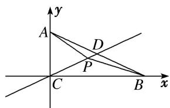

6. 如图, 线段 $AB$ 的长度为 2 , 点 $A$ , $B$ 分别在 $x$ 轴的正半轴和 $y$ 轴的正半轴上滑动, 以线段 $AB$ 为一边, 在第一象限内作等边三角形 $ABC$ , $O$ 为坐标原点, 则 $\overrightarrow{OC} \cdot \overrightarrow{OB}$ 的取值范围是 \_\_\_\_.

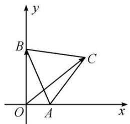

6. 答案 (0, 3] 解析 设 $\angle BAO = \theta$ , $\theta \in (0^{\circ}, 90^{\circ})$ , 则 $B(0, 2\sin \theta)$ , $C(2\cos \theta + 2\cos (120^{\circ} - \theta)$ , $2\sin (120^{\circ} - \theta))$ , 则 $\overrightarrow{OC} \cdot \overrightarrow{OB} = (0, 2\sin \theta) \cdot (2\cos \theta + 2\cos (120^{\circ} - \theta)$ , $2\sin (120^{\circ} - \theta)) = 2\sin \theta \cdot 2\sin (120^{\circ} - \theta) = 2\sqrt{3}\sin \theta\cos \theta + 2\sin^{2}\theta = 2\sin (2\theta - 30^{\circ}) + 1$ . 因为 $\theta \in (0^{\circ}, 90^{\circ})$ , 所以 $\overrightarrow{OC} \cdot \overrightarrow{OB} \in (0, 3]$ .

7. 已知正方形 $ABCD$ 的边长为 1，点 $E$ 是 $AB$ 边上的动点，则 $\overrightarrow{DE} \cdot \overrightarrow{CB}$ 的值为 \_\_\_\_； $\overrightarrow{DE} \cdot \overrightarrow{DC}$ 的最大值为 \_\_\_\_.

7. 答案 1 1 解析 方法一 以射线 $AB, AD$ 为 $x$ 轴， $y$ 轴的正方向建立平面直角坐标系，则 $A(0,0)$ ， $B(1,0), C(1,1), D(0,1)$ ，设 $E(t,0), t \in [0,1]$ ，则 $\vec{DE} = (t, -1), \vec{CB} = (0, -1)$ ，所以 $\vec{DE} \cdot \vec{CB} = (t, -1) \cdot (0, -1) = 1$ 。因为 $\vec{DC} = (1,0)$ ，所以 $\vec{DE} \cdot \vec{DC} = (t, -1) \cdot (1,0) = t \leqslant 1$ ，故 $\vec{DE} \cdot \vec{DC}$ 的最大值为 1。

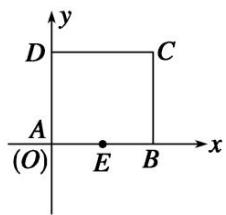
方法二 由图知，无论 $E$ 点在哪个位置， $\vec{DE}$ 在 $\vec{CB}$ 方向上的投影都是 $CB = 1$ ， $\therefore \vec{DE} \cdot \vec{CB} = |\vec{CB}| \cdot 1 = 1$ ，当 $E$ 运动到 $B$ 点时， $\vec{DE}$ 在 $\vec{DC}$ 方向上的投影最大即为 $DC = 1$ ， $\therefore (\vec{DE} \cdot \vec{DC})_{\max} = |\vec{DC}| \cdot 1 = 1$ .

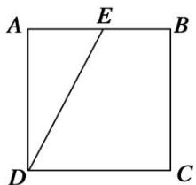

8. 在边长为 1 的正方形 ABCD 中，M 为 BC 的中点，点 E 在线段 AB 上运动，则 $\overrightarrow{EC} \cdot \overrightarrow{EM}$ 的取值范围是

( )

A. $\left[\frac{1}{2},2\right]$

B. $\begin{bmatrix}0,\frac{3}{2}\end{bmatrix}$

C. $\left[\frac{1}{2},\frac{3}{2}\right]$

D. $[0, 1]$

8. 答案 C 解析 将正方形放入如图所示的平面直角坐标系中，设 $E(x,0)$ ， $0 \leqslant x \leqslant 1$ 。又 $M\left(1,\frac{1}{2}\right)$ ， $C(1,1)$ ，所以 $\overrightarrow{EM} = \left(1 - x, \frac{1}{2}\right)$ ， $\overrightarrow{EC} = (1 - x, 1)$ ，所以 $\overrightarrow{EM} \cdot \overrightarrow{EC} = \left(1 - x, \frac{1}{2}\right) \cdot (1 - x, 1) = (1 - x)^2 + \frac{1}{2}$ 。因为 $0 \leqslant x \leqslant 1$ ，所以 $\frac{1}{2} \leqslant (1 - x)^2 + \frac{1}{2} \leqslant \frac{3}{2}$ ，即 $\overrightarrow{EM} \cdot \overrightarrow{EC}$ 的取值范围是 $\left[\frac{1}{2}, \frac{3}{2}\right]$ 。

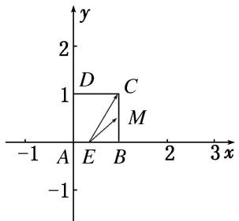

9. 如图所示, 已知正方形 $ABCD$ 的边长为 1 , 点 $E$ 从点 $D$ 出发, 按字母顺序 $D \to A \to B \to C$ 沿线段 $DA$ , $AB$ , $BC$ 运动到点 $C$ , 在此过程中 $\overrightarrow{DE} \cdot \overrightarrow{CD}$ 的取值范围为 \_\_\_\_.

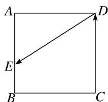

9. 答案 $[-1, 0]$ 解析 以 $BC$ , $BA$ 所在的直线为 $x$ 轴, $y$ 轴, 建立平面直角坐标系如图所示, 可得 $A(0, 1)$ , $B(0, 0)$ , $C(1, 0)$ , $D(1, 1)$ . 当 $E$ 在 $DA$ 上时, 设 $E(x, 1)$ , 其中 $0 \leq x \leq 1$ , $\because \overrightarrow{DE} = (x - 1, 0)$ , $\overrightarrow{CD} = (0, 1)$ , $\therefore \overrightarrow{DE} \cdot \overrightarrow{CD} = 0$ ; 当 $E$ 在 $AB$ 上时, 设 $E(0, y)$ , 其中 $0 \leq y \leq 1$ , $\because \overrightarrow{DE} = (-1, y - 1)$ , $\overrightarrow{CD} = (0, 1)$ , $\therefore \overrightarrow{DE} \cdot \overrightarrow{CD} = y - 1 (0 \leq y \leq 1)$ , 此时 $\overrightarrow{DE} \cdot \overrightarrow{CD}$ 的取值范围为 $[-1, 0]$ ; 当 $E$ 在 $BC$ 上时, 设 $E(x, 0)$ , 其中 $0 \leq x \leq 1$ , $\because \overrightarrow{DE} = (x - 1, -1)$ , $\overrightarrow{CD} = (0, 1)$ , $\therefore \overrightarrow{DE} \cdot \overrightarrow{CD} = -1$ . 综上所述, $\overrightarrow{DE} \cdot \overrightarrow{CD}$ 的取值范围为 $[-1, 0]$ .

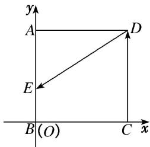

10. 如图, 菱形 $ABCD$ 的边长为 2, $\angle BAD = 60^{\circ}$ , $M$ 为 $DC$ 的中点, 若 $N$ 为菱形内任意一点 (含边界), 则 $\overrightarrow{AM} \cdot \overrightarrow{AN}$ 的最大值为 \_\_\_\_.

10. 答案 9 解析 设 $\overrightarrow{AN} = \lambda \overrightarrow{AB} + \mu \overrightarrow{AD}$ ，因为 $N$ 在菱形 $ABCD$ 内，所以 $0 \leqslant \lambda \leqslant 1, 0 \leqslant \mu \leqslant 1$ . $\overrightarrow{AM} = \overrightarrow{AD}$
$+\frac{1}{2}\overrightarrow{DC}=\frac{1}{2}\overrightarrow{AB}+\overrightarrow{AD}$ . 所以 $\overrightarrow{AM}\cdot\overrightarrow{AN}=(\frac{1}{2}\overrightarrow{AB}+\overrightarrow{AD})\cdot(\lambda\overrightarrow{AB}+\mu\overrightarrow{AD})=\frac{\lambda}{2}\overrightarrow{AB}^{2}+\left(\frac{\lambda+\frac{\mu}{2}}{2}\right)\overrightarrow{AB}\cdot\overrightarrow{AD}+\mu\overrightarrow{AD}^{2}=$ $=\frac{\lambda}{2}\times4+\left(\frac{\lambda+\frac{\mu}{2}}{2}\right)\times2\times2\times\frac{1}{2}+4\mu=4\lambda+5\mu.$ 所以 $0\leqslant\overrightarrow{AM}\cdot\overrightarrow{AN}\leqslant9$ ，所以当 $\lambda=\mu=1$ 时， $\overrightarrow{AM}\cdot\overrightarrow{AN}$ 有最大值 9，此时，N 位于 C 点.

11. 在平行四边形 $ABCD$ 中，若 $AB = 2, AD = 1, \overrightarrow{AB} \cdot \overrightarrow{AD} = -1$ ，点 $M$ 在边 $CD$ 上，则 $\overrightarrow{MA} \cdot \overrightarrow{MB}$ 的最大值为 \_\_\_\_.

11. 答案 2 解析 在平行四边形 ABCD 中，因为 AB=2, AD=1, $\overrightarrow{AB}\cdot\overrightarrow{AD}=-1$ ，点 M 在边 CD 上，所以 $|\overrightarrow{AB}|\cdot|\overrightarrow{AD}|\cdot\cos A=-1$ ，所以 $\cos A=-\frac{1}{2}$ ，所以 $A=120^{\circ}$ ，以 A 为坐标原点，AB 所在的直线为 x 轴，AB 的垂线为 y 轴，建立如图所示的平面直角坐标系，

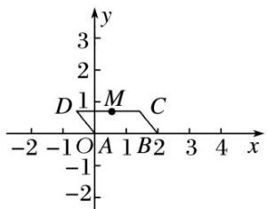
所以 $A(0,0)$ , $B(2,0)$ , $D\left(-\frac{1}{2}, \frac{\sqrt{3}}{2}\right)$ . 设 $M\left(x, \frac{\sqrt{3}}{2}\right)$ , $-\frac{1}{2} \leq x \leq \frac{3}{2}$ , 因为 $\overrightarrow{MA} = \left(-x, -\frac{\sqrt{3}}{2}\right)$ , $\overrightarrow{MB} = \left(2 - x, -\frac{\sqrt{3}}{2}\right)$ ,
所以 $\overrightarrow{MA}\cdot\overrightarrow{MB}=x(x-2)+\frac{3}{4}=x^{2}-2x+\frac{3}{4}=(x-1)^{2}-\frac{1}{4}$ . 设 $f(x)=(x-1)^{2}-\frac{1}{4}$ ，因为 $x\in\left[-\frac{1}{2},\frac{3}{2}\right]$ ，所以当 x=- $\frac{1}{2}$ 时， $f(x)$ 取得最大值2.

12. 如图, 在直角梯形 $ABCD$ 中, $DA = AB = 1$ , $BC = 2$ , 点 $P$ 在阴影区域(含边界)中运动, 则 $\overrightarrow{PA} \cdot \overrightarrow{BD}$ 的取值范围是 ( )

A. $\left[-\frac{1}{2},1\right]$

B. $\left[-1,\frac{1}{2}\right]$

C. $[-1, 1]$

D. $[-1, 0]$

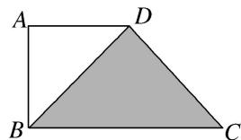

12. 答案 C 解析 ∵ 在直角梯形 ABCD 中，DA=AB=1，BC=2，∴ $BD=\sqrt{2}$ ．如图所示，过点 A 作 $AO \perp BD$ ，垂足为 O，则 $\overrightarrow{PA}=\overrightarrow{PO}+\overrightarrow{OA},\overrightarrow{OA}\cdot\overrightarrow{BD}=0,\therefore\overrightarrow{PA}\cdot\overrightarrow{BD}=(\overrightarrow{PO}+\overrightarrow{OA})\cdot\overrightarrow{BD}=\overrightarrow{PO}\cdot\overrightarrow{BD}$ ．∴ 当点 P 与点 B 重合时， $\overrightarrow{PA}\cdot\overrightarrow{BD}$ 取得最大值，即 $\overrightarrow{PA}\cdot\overrightarrow{BD}=\overrightarrow{PO}\cdot\overrightarrow{BD}=\frac{1}{2}\times\sqrt{2}\times\sqrt{2}=1$ ；当点 P 与点 D 重合时， $\overrightarrow{PA}\cdot\overrightarrow{BD}$ 取得最小值，即 $\overrightarrow{PA}\cdot\overrightarrow{BD}=-\frac{1}{2}\times\sqrt{2}\times\sqrt{2}=-1$ ．∴ $\overrightarrow{PA}\cdot\overrightarrow{BD}$ 的取值范围是 [-1, 1]．

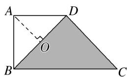

13. 如图, 在等腰梯形 $ABCD$ 中, 已知 $DC \parallel AB$ , $\angle ADC = 120^{\circ}$ , $AB = 4$ , $CD = 2$ , 动点 $E$ 和 $F$ 分别在线

段 $BC$ 和 $DC$ 上，且 $\overrightarrow{BE} = \frac{1}{2\lambda}\overrightarrow{BC}$ ， $\overrightarrow{DF} = \lambda \overrightarrow{DC}$ ，则 $\overrightarrow{AE}\cdot \overrightarrow{BF}$ 的最小值是( )

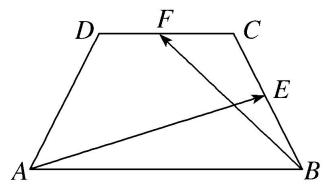

A. $4 \sqrt{6} + 13$

B. $4 \sqrt{6} - 13$

C. $4\sqrt{6}+\frac{13}{2}$

D. $4 \sqrt{6} - \frac{13}{2}$

13. 答案 B 解析 在等腰梯形 ABCD 中，AB=4, CD=2, $\angle ADC=120^{\circ}$ ，易得 AD=BC=2。由动点 E 和 F 分别在线段 BC 和 DC 上得， $\left\{\begin{aligned}&0<\frac{1}{2\lambda}<1,\\ &0<\lambda<1,\end{aligned}\right.$ 所以 $\frac{1}{2}<\lambda<1$ 。所以 $\overrightarrow{AE}\cdot\overrightarrow{BF}=(\overrightarrow{AB}+\overrightarrow{BE})\cdot(\overrightarrow{BC}+\overrightarrow{CF})=\overrightarrow{AB}\cdot\overrightarrow{BC}+\overrightarrow{BE}\cdot\overrightarrow{BC}+\overrightarrow{AB}\cdot\overrightarrow{CF}+\overrightarrow{BE}\cdot\overrightarrow{CF}=|\overrightarrow{AB}|\cdot|\overrightarrow{BC}|\cos120^{\circ}+|\overrightarrow{BE}|\cdot|\overrightarrow{BC}|-|\overrightarrow{AB}|\cdot|\overrightarrow{CF}|+|\overrightarrow{BE}|\cdot|\overrightarrow{CF}|\cos60^{\circ}=4\times2\times\left(-\frac{1}{2}\right)+\frac{1}{\lambda}\times2-4\times(1-\lambda)\times2+\frac{1}{\lambda}\times(1-\lambda)\times2\times\frac{1}{2}=-13+8\lambda+\frac{3}{\lambda}\geq-13+2\sqrt{8\lambda\times\frac{3}{\lambda}}=4\sqrt{6}-13$ ，当且仅当 $\lambda=\frac{\sqrt{6}}{4}$ 时取等号。所以 $\overrightarrow{AE}\cdot\overrightarrow{BF}$ 的最小值是 $4\sqrt{6}-13$ 。

14. (2018·天津)如图, 在平面四边形 $ABCD$ 中, $AB \perp BC$ , $AD \perp CD$ , $\angle BAD = 120^{\circ}$ , $AB = AD = 1$ . 若点 $E$ 为边 $CD$ 上的动点, 则 $\overrightarrow{AE} \cdot \overrightarrow{BE}$ 的最小值为 \_\_\_\_.

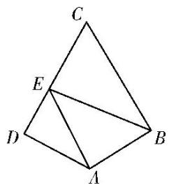

14. 答案 $\frac{21}{16}$ 解析 如图，以 $D$ 为坐标原点建立直角坐标系．连接 $AC$ ，由题意知 $\angle CAD = \angle CAB = 60^{\circ}$ $\angle ACD = \angle ACB = 30^{\circ}$ ，则 $D(0,0),A(1,0),B\left(\frac{3}{2},\frac{\sqrt{3}}{2}\right),C(0,\sqrt{3})$ .设 $E(0,y)(0\leqslant y\leqslant \sqrt{3})$ ，则 $\overrightarrow{AE} = (-1,y),\overrightarrow{BE} = \left(-\frac{3}{2},y - \frac{\sqrt{3}}{2}\right)$ 所以 $\overrightarrow{AE}\cdot \overrightarrow{BE} = \frac{3}{2} +y^{2} - \frac{\sqrt{3}}{2} y = \left(y - \frac{\sqrt{3}}{4}\right)^{2} + \frac{21}{16}$ 所以当 $y = \frac{\sqrt{3}}{4}$ 时， $\overrightarrow{AE}\cdot \overrightarrow{BE}$ 有最小值 $\frac{21}{16}$

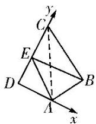

15. 设 $A, B, C$ 是半径为 1 的圆 $O$ 上的三点，且 $\overrightarrow{OA} \perp \overrightarrow{OB}$ ，则 $(\overrightarrow{OC} - \overrightarrow{OA}) \cdot (\overrightarrow{OC} - \overrightarrow{OB})$ 的最大值是（）

A. $1 + \sqrt{2}$

B. $1 - \sqrt{2}$

C. $\sqrt{2}-1$

D. 1

15. 答案 A 解析 如图, 作出 $\overrightarrow{OD}$ , 使得 $\overrightarrow{OA} + \overrightarrow{OB} = \overrightarrow{OD}$ . 则 $(\overrightarrow{OC} - \overrightarrow{OA}) \cdot (\overrightarrow{OC} - \overrightarrow{OB}) = \overrightarrow{OC}^2 - \overrightarrow{OA} \cdot \overrightarrow{OC} - \overrightarrow{OB} \cdot \overrightarrow{OC} + \overrightarrow{OA} \cdot \overrightarrow{OB} = 1 - (\overrightarrow{OA} + \overrightarrow{OB}) \cdot \overrightarrow{OC} = 1 - \overrightarrow{OD} \cdot \overrightarrow{OC}$ , 由图可知, 当点 $C$ 在 $OD$ 的反向延长线与圆 $O$ 的交点处时， $\overrightarrow{OD} \cdot \overrightarrow{OC}$ 取得最小值，最小值为 $-\sqrt{2}$ ，此时 $(\overrightarrow{OC} - \overrightarrow{OA}) \cdot (\overrightarrow{OC} - \overrightarrow{OB})$ 取得最大值，最大值为 $1 + \sqrt{2}$ 。故选 A.

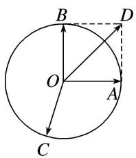

16. 已知平面向量 $a, b, e$ 满足 $|e|=1, a \cdot e=1, b \cdot e=-2, |a+b|=2$ , 则 $a \cdot b$ 的最大值为 \_\_\_\_.

16. 答案 $-\frac{5}{4}$ 解析 不妨设 $e = (1, 0)$ , $a = (1, m)$ , $b = (-2, n)(m, n \in \mathbb{R})$ , 则 $a + b = (-1, m + n)$ , 故 $|a + b| = \sqrt{1 + (m + n)^2} = 2$ , 所以 $(m + n)^2 = 3$ , 即 $3 = m^2 + n^2 + 2mn \geq 2mn + 2mn = 4mn$ , 则 $mn \leq \frac{3}{4}$ , 所以 $a \cdot b = -2 + mn \leq -\frac{5}{4}$ , 当且仅当 $m = n = \frac{\sqrt{3}}{2}$ 时等号成立, 所以 $a \cdot b$ 的最大值为 $-\frac{5}{4}$ .

