**专题二　平面向量的数量积**

1．向量的夹角

(1)定义：已知两个非零向量<em><strong>a</strong></em>和<em><strong>b</strong></em>，作＝<em><strong>a</strong></em>，＝<em><strong>b</strong></em>，则∠<em>AOB</em>就是向量<em><strong>a</strong></em>与<em><strong>b</strong></em>的夹角．

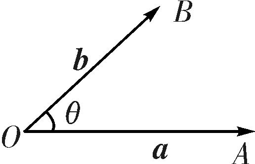

(2)范围：设<em>θ</em>是向量<em><strong>a</strong></em>与<em><strong>b</strong></em>的夹角，则0°≤<em>θ</em>≤180°．

(3)共线与垂直：若<em>θ</em>＝0°，则<em><strong>a</strong></em>与<em><strong>b</strong></em>同向；若<em>θ</em>＝180°，则<em><strong>a</strong></em>与<em><strong>b</strong></em>反向；若<em>θ</em>＝90°，则<em><strong>a</strong></em>与<em><strong>b</strong></em>垂直．

2．平面向量的数量积

(1)定义：已知两个非零向量<em><strong>a</strong></em>与<em><strong>b</strong></em>，它们的夹角为<em>θ</em>，则数量|<em><strong>a</strong></em>||<em><strong>b</strong></em>|cos <em>θ</em>叫做<em><strong>a</strong></em>与<em><strong>b</strong></em>的数量积(或内积)，记作<em><strong>a</strong></em>·<em><strong>b</strong></em>，即<em><strong>a</strong></em>·<em><strong>b</strong></em>＝|<em><strong>a</strong></em>||<em><strong>b</strong></em>|cos <em>θ</em>，规定零向量与任一向量的数量积为<strong>0</strong>，即<strong>0</strong>·<em><strong>a</strong></em>＝0．

投影向量：向量<em><strong>a</strong></em>在向量<em><strong>b</strong></em>上的投影向量为|<em><strong>a</strong></em>|cos <em>θ</em>＝．

(2)坐标表示：若<em><strong>a</strong></em>＝(<em>x</em>1，<em>y</em>1)，<em><strong>b</strong></em>＝(<em>x</em>2，<em>y</em>2)，则<em><strong>a</strong></em>·<em><strong>b</strong></em>＝<em>x</em>1<em>x</em>2＋<em>y</em>1<em>y</em>2．

3．平面向量数量积的运算律

(1)<em><strong>a</strong></em>·<em><strong>b</strong></em>＝<em><strong>b</strong></em>·<em><strong>a</strong></em>(交换律)；(2)<em>λ<strong>a</strong></em>·<em><strong>b</strong></em>＝<em>λ</em>(<em><strong>a</strong></em>·<em><strong>b</strong></em>)＝<em><strong>a</strong></em>·(<em>λ<strong>b</strong></em>)(结合律)；(3)(<em><strong>a</strong></em>＋<em><strong>b</strong></em>)·<em><strong>c</strong></em>＝<em><strong>a</strong></em>·<em><strong>c</strong></em>＋<em><strong>b</strong></em>·<em><strong>c</strong></em>(分配律)．

4．平面向量数量积运算的常用公式

(1)(<em><strong>a</strong></em>＋<em><strong>b</strong></em>)·(<em><strong>a</strong></em>－<em><strong>b</strong></em>)＝<em><strong>a</strong></em>2－<em><strong>b</strong></em>2．(2)(<em><strong>a</strong></em>＋<em><strong>b</strong></em>)2＝<em><strong>a</strong></em>2＋2<em><strong>a</strong></em>·<em><strong>b</strong></em>＋<em><strong>b</strong></em>2．(3)(<em><strong>a</strong></em>－<em><strong>b</strong></em>)2＝<em><strong>a</strong></em>2－2<em><strong>a</strong></em>·<em><strong>b</strong></em>＋<em><strong>b</strong></em>2．

**考点一　求平面向量数量积**

【**方法总结**】

平面向量数量积的两种求法

(1)若已知向量的模和夹角时，则利用定义法求解，即***a***·***b***＝|***a***||***b***|cos<***a***，***b***>．若未知向量的模和夹角时，则可通过向量加法(减法)的三角形法则转化为已知模和夹角的向量的数量积进行求解；

(2)若已知向量的坐标时，则利用坐标法求解，即若<em><strong>a</strong></em>＝(<em>x</em>1，<em>y</em>1)，<em><strong>b</strong></em>＝(<em>x</em>2，<em>y</em>2)，则<em><strong>a</strong></em>·<em><strong>b</strong></em>＝<em>x</em>1<em>x</em>2＋<em>y</em>1<em>y</em>2．若未知向量的坐标时，如已知图形为矩形、正方形、直角梯形、等边三角形、等腰三角形或直角三角形时，则可建立平面直角坐标系求出未知向量的坐标进行求解．

**【例题选讲】**

<strong>[例1]</strong>(1)(2018·全国Ⅱ)已知向量<em><strong>a</strong></em>，<em><strong>b</strong></em>满足<em><strong>|a|</strong></em>＝1，<em><strong>a·b</strong></em>＝－1，则<em><strong>a</strong></em>·(2<em><strong>a</strong></em>－<em><strong>b</strong></em>)＝(　　)

A．4　　　　　　　　B．3　　　　　　　　C．2　　　　　　　　D．0

答案　B　解析　<em><strong>a·</strong></em>(2<em><strong>a</strong></em>－<em><strong>b</strong></em>)＝2<em><strong>|a|</strong></em>2－<em><strong>a·b</strong></em>＝2×1－(－1)＝3．

(2)若向量<em><strong>m</strong></em>＝(2<em>k</em>－1，<em>k</em>)与向量<em><strong>n</strong></em>＝(4，1)共线，则<em><strong>m</strong></em>·<em><strong>n</strong></em>＝(　　)

A．0　　　　　　　　B．4　　　　　　　　C．－　　　　　　　　D．－

答案　D　解析　由题意得2<em>k</em>－1－4<em>k</em>＝0，解得<em>k</em>＝－，即<em><strong>m</strong></em>＝，所以<em><strong>m</strong></em>·<em><strong>n</strong></em>＝－2×4＋×1＝－．

(3)如图，已知非零向量与满足(＋)·＝0，且|－|＝2，|＋|＝2，点*D*是△*ABC*中边*BC*的中点，则·＝\_\_\_\_\_\_\_\_．

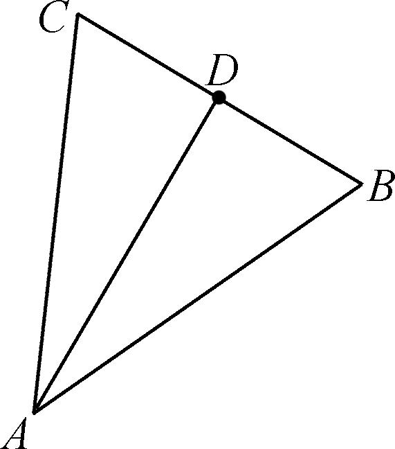

答案　－3　解析　由(＋)·＝0得与∠*A*的平分线所在的向量垂直，所以*AB*＝*AC*，⊥．又|－|＝2，所以||＝2，所以||＝，·＝||||cos(π－*B*)＝··(－cos *B*)＝3×(－)＝－3．

(4)(2016·天津)如图，已知△*ABC*是边长为1的等边三角形，点*D*，*E*分别是边*AB*，*BC*的中点，连接*DE*并延长到点*F*，使得*DE*＝2*EF*，则·的值为(　　)

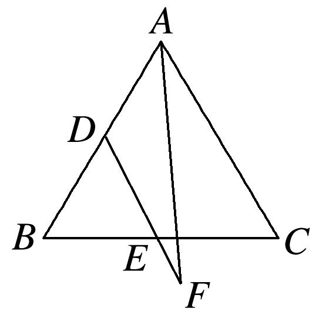

A．－　　　　　　　　B．　　　　　　　　C．　　　　　　　　D．

答案　B　解析　由条件可知＝－，＝＋＝＋＝＋，所以·＝(－)·(＋)＝2－·－2．因为△<em>ABC</em>是边长为1的等边三角形，所以||＝||＝1，∠<em>BAC</em>＝60°，所以·＝－－＝．

(5)(2018·天津)在如图的平面图形中，已知*OM*＝1，*ON*＝2，∠*MON*＝120°，＝2，＝2，则·的值为(　　)

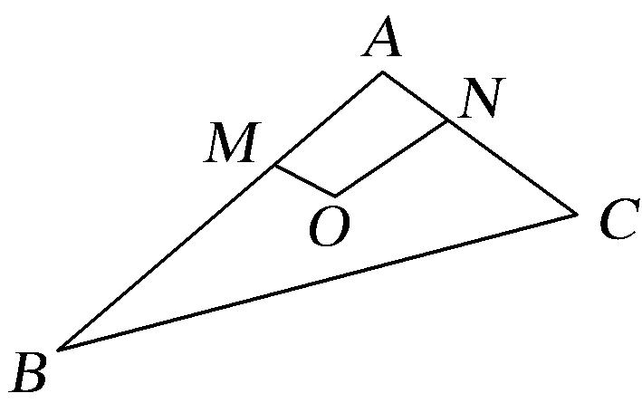

A．－15　　　　　　　　B．－9　　　　　　　　C．－6　　　　　　　　D．0

答案　C　解析　连接<em>OA</em>．在△<em>ABC</em>中，＝－＝3－3＝3(－)－3(－)＝3(－)，∴·＝3(－)·＝3(·－2)＝3×(2×1×cos 120°－12)＝3×(－2)＝－6．

(6)在△*ABC*中，*AB*＝4，*BC*＝6，∠*ABC*＝，*D*是*AC*的中点，*E*在*BC*上，且*AE*⊥*BD*，则·等于(　　)

A．16　　　　　　　　B．12　　　　　　　　C．8　　　　　　　　D．－4

答案　A　解析　以*B*为原点，*BA*，*BC*所在直线分别为*x*，*y*轴建立平面直角坐标系(图略)，*A*(4，0)，*B*(0，0)，*C*(0，6)，*D*(2，3)．设*E*(0，*t*)，·＝(2，3)·(－4，*t*)＝－8＋3*t*＝0，∴*t*＝，即*E*，·＝·(0，6)＝16．

(7)已知在直角三角形*ABC*中，∠*ACB*＝90°，*AC*＝*BC*＝2，点*P*是斜边*AB*上的中点，则·＋·＝\_\_\_\_\_\_\_\_．

答案　4　解析　由题意可建立如图所示的坐标系．可得*A*(2，0)，*B*(0，2)，*P*(1，1)，*C*(0，0)，则·＋·＝(1，1)·(0，2)＋(1，1)·(2，0)＝2＋2＝4．

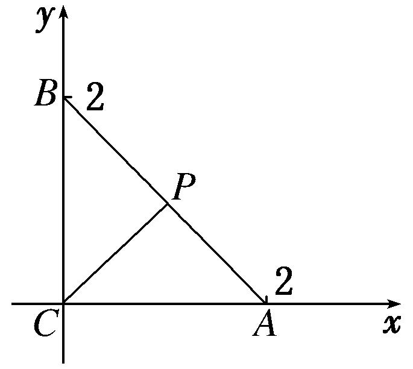

(8)如图，△*AOB*为直角三角形，*OA*＝1，*OB*＝2，*C*为斜边*AB*的中点，*P*为线段*OC*的中点，则·＝(　　)

A．1　　　　　　　　B．　　　　　　　　C．　　　　　　　　D．－

答案　B　解析　法一：因为△<em>AOB</em>为直角三角形，<em>OA</em>＝1，<em>OB</em>＝2，<em>C</em>为斜边<em>AB</em>的中点，所以＝＋，所以＝＝(＋)，则＝－＝－，所以·＝(－3 )·(＋)＝(2－32)＝．

法二：以*O*为坐标原点，的方向为*x*轴正方向，的方向为*y*轴正方向建立平面直角坐标系(如图)，则*A*(0，1)，*B*(2，0)，*C*，*P*，所以＝，＝，故·＝×－×＝．

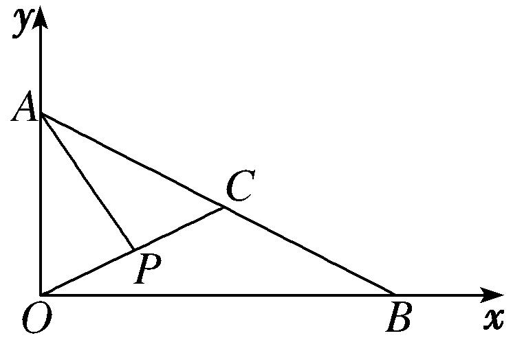

(9)如图，平行四边形*ABCD*中，*AB*＝2，*AD*＝1，*A*＝60°，点*M*在*AB*边上，且*AM*＝*AB*，则·＝\_\_\_\_\_\_\_\_．

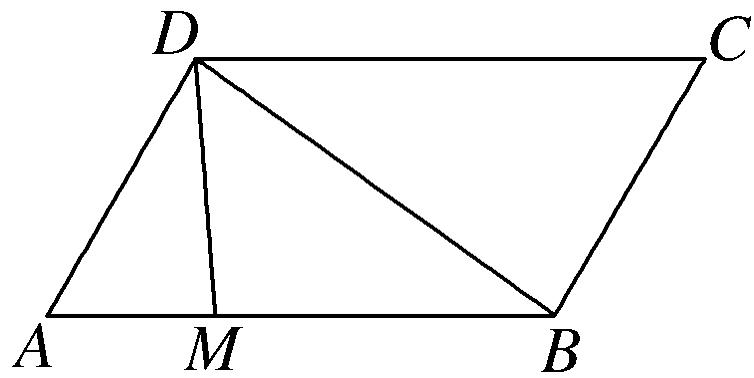

答案　1　解析　因为＝＋＝＋，＝＋，所以·＝(＋)·(＋)＝||2＋||2＋·＝1＋－·＝－||·||·cos 60°＝－×1×2×＝1．

(10)如图所示，在平面四边形*ABCD*中，若*AC*＝3，*BD*＝2，则(＋)·(＋)＝\_\_\_\_\_\_\_\_．

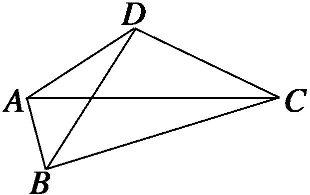

答案　5　解析　由于＝＋，＝＋，所以＋＝＋＋＋＝－．(＋)·(＋)＝(－)·(＋)＝||2－||2＝9－4＝5．

(11)在平面四边形*ABCD*中，已知*AB*＝3，*DC*＝2，点*E*，*F*分别在边*AD*，*BC*上，且＝3，＝3，若向量与的夹角为60°，则·的值为\_\_\_\_\_\_\_\_．

答案　7　解析　＝＋＋　①，＝＋＋　②，由＝3，＝3，有2＋＝0<em>，</em>，2＋＝0<em>，</em>，①×2＋②得2＋＝3，所以＝＋，则·＝·(＋)＝2＋·＝×32＋×3×2cos 60°＝7．

(12)如图，在四边形*ABCD*中，点*E*，*F*分别是边*AD*，*BC*的中点，设·＝*m*，·＝*n*．若*AB*＝，*EF*＝1，*CD*＝，则(　　)

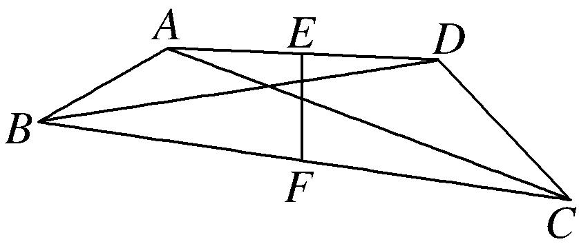

A．2*m*－*n*＝1　　　　B．2*m*－2*n*＝1　　　　C．*m*－2*n*＝1　　　　D．2*n*－2*m*＝1

答案　D　解析　·＝(＋)·(－＋)＝－2＋·－·＋·＝－2＋·(－)＋<em>m</em>＝－2＋·(＋＋－)＋<em>m</em>＝·＋<em>m</em>．又＝＋＋，＝＋＋，两式相加，再根据点<em>E</em>，<em>F</em>分别是边<em>AD</em>，<em>BC</em>的中点，化简得2＝＋，两边同时平方得4＝2＋3＋2·，所以·＝－，则·＝，所以<em>n</em>＝＋<em>m</em>，即2<em>n</em>－2<em>m</em>＝1，故选D．

(13)(2017·浙江)如图，已知平面四边形<em>ABCD</em>，<em>AB</em>⊥<em>BC</em>，<em>AB</em>＝<em>BC</em>＝<em>AD</em>＝2，<em>CD</em>＝3，<em>AC</em>与<em>BD</em>交于点<em>O</em>．记<em>I</em>1＝·，<em>I</em>2＝·，<em>I</em>3＝·，则(　　)

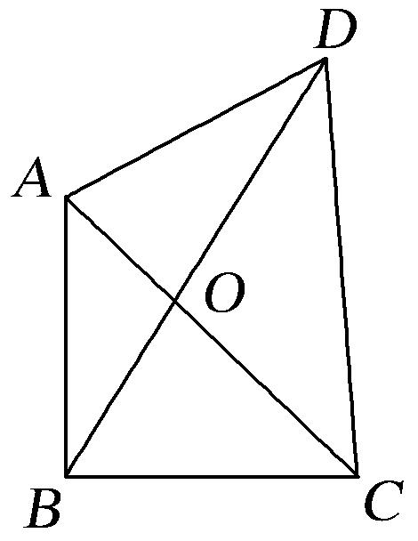

A．<em>I</em>1＜<em>I</em>2＜<em>I</em>3　　　　　B．<em>I</em>1＜<em>I</em>3＜<em>I</em>2　　　　　C．<em>I</em>3＜<em>I</em>1＜<em>I</em>2　　　　　D．<em>I</em>2＜<em>I</em>1＜<em>I</em>3

答案　C　解析　如图所示，四边形<em>ABCE</em>是正方形，<em>F</em>为正方形的对角线的交点，易得<em>AO</em>&lt;<em>AF</em>，而∠<em>AFB</em>＝90°，∴∠<em>AOB</em>与∠<em>COD</em>为钝角，∠<em>AOD</em>与∠<em>BOC</em>为锐角，根据题意，<em>I</em>1－<em>I</em>2＝·－·＝·(－)＝·＝||||·cos∠<em>AOB</em>&lt;0，∴<em>I</em>1&lt;<em>I</em>2，同理<em>I</em>2&gt;<em>I</em>3，作<em>AG</em>⊥<em>BD</em>于<em>G</em>，又<em>AB</em>＝<em>AD</em>，∴<em>OB</em>&lt;<em>BG</em>＝<em>GD</em>&lt;<em>OD</em>，而<em>OA</em>&lt;<em>AF</em>＝<em>FC</em>&lt;<em>OC</em>，∴||||&lt;||||，而cos∠<em>AOB</em>＝cos∠<em>COD</em>&lt;0，∴·&gt;·，即<em>I</em>1&gt;<em>I</em>3．∴<em>I</em>3&lt;<em>I</em>1&lt;<em>I</em>2．

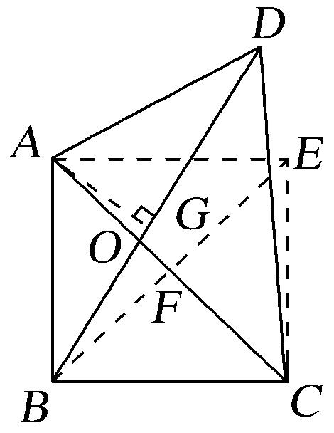

(14)已知扇形*OAB*的半径为2，圆心角为，点*C*是弧*AB*的中点，＝－，则·的值为(　　)

A．3　　　　　　　　B．4　　　　　　　　C．－3　　　　　　　　D．－4

答案　C　解析　如图，连接<em>CO</em>，∵点<em>C</em>是弧<em>AB</em>的中点，∴<em>CO</em>⊥<em>AB</em>，又∵<em>OA</em>＝<em>OB</em>＝2，＝－，∠<em>AOB</em>＝，∴·＝(－)·＝－·＝－·(－)＝·－2＝×2×2×－×4＝－3．

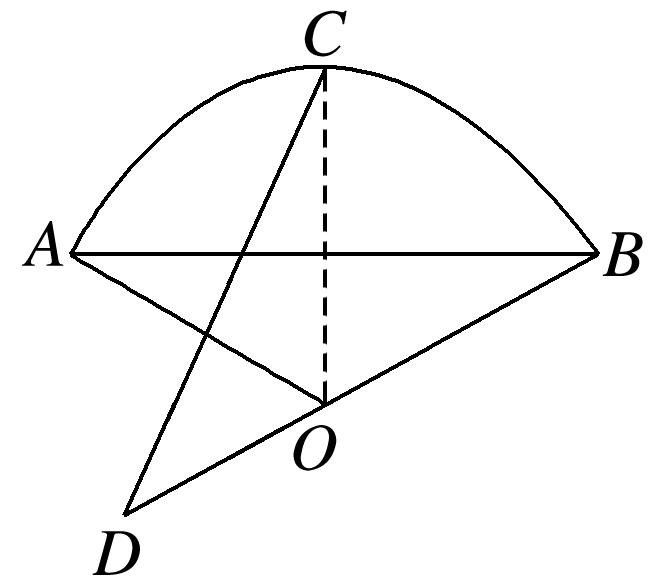

【**对点训练**】

1．已知|***a***|＝|***b***|＝1，向量***a***与***b***的夹角为45°，则(***a***＋2***b***)·***a***＝\_\_\_\_\_\_\_\_．

1．答案　1＋　解析　因为|<em><strong>a</strong></em>|＝|<em><strong>b</strong></em>|＝1，向量<em><strong>a</strong></em>与<em><strong>b</strong></em>的夹角为45°，所以(<em><strong>a</strong></em>＋2<em><strong>b</strong></em>)·<em><strong>a</strong></em>＝<em><strong>a</strong></em>2＋2<em><strong>a</strong></em>·<em><strong>b</strong></em>＝|<em><strong>a</strong></em>|2＋

2|***a***|·|***b***|cos 45°＝1＋．

2．已知向量***a***，***b***的夹角为，|***a***|＝，|***b***|＝2，则***a·***(***a***－2***b***)＝\_\_\_\_\_\_\_\_．

2．答案　6　解析　<em><strong>a</strong></em>·(<em><strong>a</strong></em>－2<em><strong>b</strong></em>)＝<em><strong>a</strong></em>2－2<em><strong>a</strong></em>·<em><strong>b</strong></em>＝2－2××2×＝6．

3．已知|***a***|＝6，|***b***|＝3，向量***a***在***b***方向上的投影是4，则***a***·***b***为(　　)

A．12　　　　　　　　B．8　　　　　　　　C．－8　　　　　　　　D．2

3．答案　A　解析　∵|***a***|cos<***a***，***b***>＝4，|***b***|＝3，∴***a***·***b***＝***|a***||***b***|·cos<***a***，***b***>＝3×4＝12．

4．设<em>x</em>∈<strong>R</strong>，向量<em><strong>a</strong></em>＝(1，<em>x</em>)，<em><strong>b</strong></em>＝(2，－4)，且<em><strong>a</strong></em>∥<em><strong>b</strong></em>，则<em><strong>a</strong></em>·<em><strong>b</strong></em>＝(　　)

A．－6　　　　　　　　B．　　　　　　　　C．　　　　　　　　D．10

4．答案　D　解析　∵<em><strong>a</strong></em>＝(1，<em>x</em>)，<em><strong>b</strong></em>＝(2，－4)且<em><strong>a</strong></em>∥<em><strong>b</strong></em>，∴－4－2<em>x</em>＝0，<em>x</em>＝－2，∴<em><strong>a</strong></em>＝(1，－2)，<em><strong>a</strong></em>·<em><strong>b</strong></em>＝

10，故选D．

5．(2014·全国Ⅱ)设向量***a***，***b***满足|***a***＋***b***|＝，|***a***－***b***|＝，则***a***·***b***＝(　　)

A．1　　　　　　　　B．2　　　　　　　　C．3　　　　　　　　D．5

5．答案　A　解析　由条件可得，(<em><strong>a</strong></em>＋<em><strong>b</strong></em>)2＝10，(<em><strong>a</strong></em>－<em><strong>b</strong></em>)2＝6，两式相减得4<em><strong>a·b</strong></em>＝4，所以<em><strong>a</strong></em>·<em><strong>b</strong></em>＝1．

6．在边长为1的等边三角形<em>ABC</em>中，设＝<em><strong>a</strong></em>，＝<em><strong>b</strong></em>，＝<em><strong>c</strong></em>，则<em><strong>a</strong>·<strong>b</strong></em>＋<em><strong>b</strong>·<strong>c</strong></em>＋<em><strong>c</strong>·<strong>a</strong></em>＝(　　)

A．－　　　　　　　　B．0　　　　　　　　C．　　　　　　　　D．3

6．答案　A　解析　依题意有<em><strong>a</strong>·<strong>b</strong></em>＋<em><strong>b</strong>·<strong>c</strong></em>＋<em><strong>c</strong>·<strong>a</strong></em>＝1×1×＋1×1×＋1×1×＝－．

7．如图，三个边长为2的等边三角形有一条边在同一条直线上，边<em>B</em>3<em>C</em>3上有10个不同的点<em>P</em>1，<em>P</em>2，…，

<em>P</em>10，记<em>mi</em>＝· (<em>i</em>＝1,2，…，10)，则<em>m</em>1＋<em>m</em>2＋…＋<em>m</em>10的值为(　　)

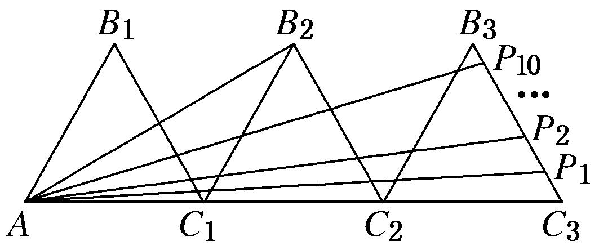

A．180　　　　　　　　B．60　　　　　　　　C．45　　　　　　　　D．15

7．答案　A　解析　由题意可知，∠<em>B</em>2<em>AC</em>3＝30°，∠<em>AC</em>3<em>B</em>3＝60°，∴⊥，即·＝0．则<em>mi</em>

＝·＝·(＋)＝·＝2×6×＝18，∴<em>m</em>1＋<em>m</em>2＋…＋<em>m</em>10＝18×10＝180．

8．在△*ABC*中，*AB*＝3，*AC*＝2，*BC*＝，则·等于(　　)

A．－　　　　　　　　B．－　　　　　　　　C．　　　　　　　　D．

8．答案　D　解析　在△*ABC*中，cos∠*BAC*＝＝＝，∴·＝||||cos∠*BAC*

＝3×2×＝．

9．在Rt△*ABC*中，∠*B*＝90°，*BC*＝2，*AB*＝1，*D*为*BC*的中点，*E*在斜边*AC*上，若＝2，则·

＝\_\_\_\_\_\_\_\_．

9．答案　　解析　如图，以*B*为坐标原点，*AB*所在直线为*x*轴，*BC*所在直线为*y*轴，建立平面直角坐

标系，则*B*(0，0)，*A*(1，0)，*C*(0，2)，所以＝(－1，2)．

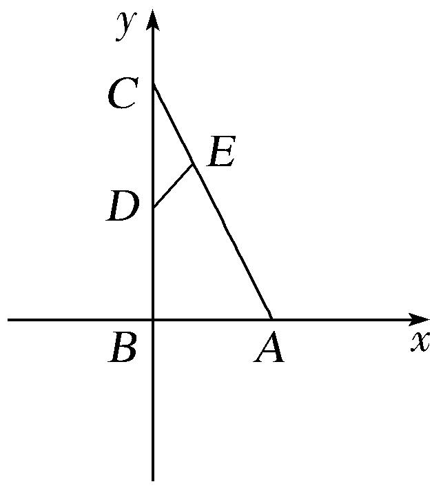

因为*D*为*BC*的中点，所以*D*(0，1)，因为＝2，所以*E*，所以＝，所以·＝·(－1，2)＝－＋＝．

10．已知*P*是边长为2的正三角形*ABC*的边*BC*上的动点，则·(＋)＝\_\_\_\_\_\_\_\_．

10．答案　6　解析　如图，设*BC*的中点为*D*，则*AD*⊥*BC*，∴|*AP*|cos∠*PAD*＝*AD*，＋＝2．∵

△<em>ABC</em>是边长为2的等边三角形，∴<em>AD</em>＝，∴·(＋)＝·2＝2×||×||×cos∠<em>PAD</em>＝2||2＝2×()2＝6．

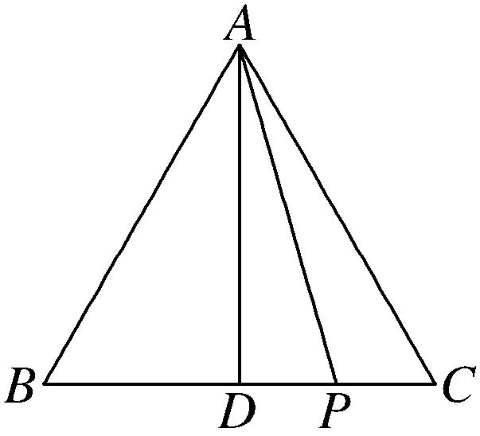

11．在△*ABC*中，|＋|＝|－|，*AB*＝2，*AC*＝1，*E*，*F*为*BC*的三等分点，则·等于(　　)

A．　　　　　　　　B．　　　　　　　　C．　　　　　　　　D．

11．答案　B　解析　由|＋|＝|－|，化简得·＝0，又因为*AB*和*AC*为三角形的两条边，它

们的长不可能为0，所以*AB*与*AC*垂直，所以△*ABC*为直角三角形．以*A*为原点，以*AC*所在直线为*x*轴，以*AB*所在直线为*y*轴建立平面直角坐标系，如图所示，则*A*(0，0)，*B*(0，2)，*C*(1，0)．不妨令*E*为*BC*的靠近*C*的三等分点，则*E*，*F*，所以＝，＝，所以·＝×＋×＝．

12．△<em>ABC</em>的外接圆的圆心为<em>O</em>，半径为1，若＋＋＝<strong>0</strong>，且||＝||，则·等于(　　)

A．　　　　　　　　B．　　　　　　　　C．3　　　　　　　　D．2

12．答案　C　解析　∵＋＋＝<strong>0</strong>，∴＝－，故点<em>O</em>是<em>BC</em>的中点，且△<em>ABC</em>为直角三角形，

又△*ABC*的外接圆的半径为1，||＝||，∴*BC*＝2，*AB*＝1，*CA*＝，∠*BCA*＝30°，∴·＝||||·cos 30°＝×2×＝3．

13．如图，在△*ABC*中，*AD*⊥*AB*，＝，||＝1，则·的值为(　　)

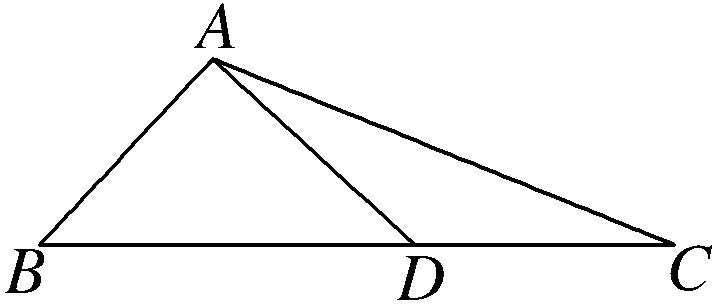

A．2　　　　　　　　B．　　　　　　　　C．　　　　　　　　D．

13．答案　D　解析　∵在△*ABC*中，*AD*⊥*AB*，∴·＝0，·＝(＋)·＝·＋·＝

·＝ ·＝(－)·＝ ·－ ·＝．

14．在△*ABC*中，*AB*＝1，∠*ABC*＝60°，·＝－1，若*O*是△*ABC*的重心，则·＝\_\_\_\_\_\_\_\_．

14．答案　5　解析　如图所示，以*B*为坐标原点，*BC*所在直线为*x*轴，建立平面直角坐标系．

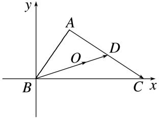

∵*AB*＝1，∠*ABC*＝60°，∴*A*．设*C*(*a，* 0)．∵·＝－1，∴·＝－＋＝－1，解得*a*＝4．∵*O*是△*ABC*的重心，延长*BO*交*AC*于点*D*，∴＝＝×(＋)＝＝．∴·＝·＝5．

15．已知*O*是△*ABC*的外心，||＝4，||＝2，则·(＋)＝(　　)

A．10　　　　　　　　B．9　　　　　　　　C．8　　　　　　　　D．6

15．答案　A　解析　作*OS*⊥*AB*，*OT*⊥*AC*∵*O*为△*ABC*的外接圆圆心．∴*S*、*T*为*AB*，*AC*的中点，且·

＝0，·＝0，＝＋，＝＋，∴·(＋)＝·＋·＝(＋)·＋(＋)·＝·＋·＋·＋·＝·＋·＝||2＋||2＝8＋2＝10．故选A．

优解：不妨设∠*A*＝90°，建立如图所示平面直角坐标系．设*B*(4，0)，*C*(0，2)，则*O*为*BC*的中点*O*(2，

1)，∴＋＝2，∴·(＋)＝2||2＝2(4＋1)＝10．故选A．

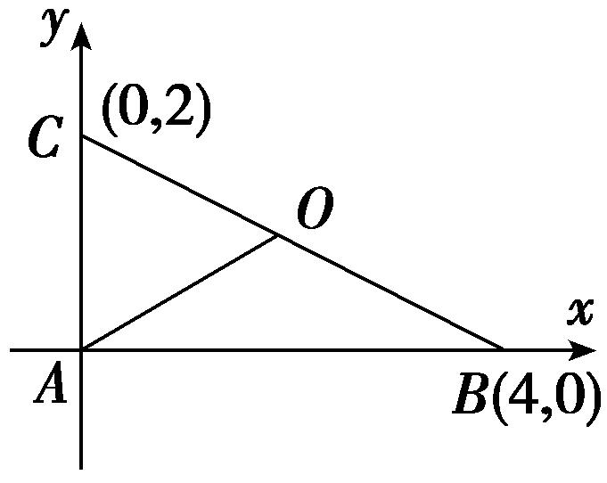

16．在△*ABC*中，已知·＝，||＝3，||＝3，*M*，*N*分别是*BC*边上的三等分点，则·的值是

(　　)

A．　　　　　　　　B．　　　　　　　　C．6　　　　　　　　D．7

16．答案　B　解析　不妨设＝＋，＝＋，所以·＝(＋)·(＋)

＝＋·＋＝(＋)＋·＝×(32＋32)＋×＝，故选B．

17．在△<em>ABC</em>中，<em>AB</em>＝2<em>AC</em>＝6，·＝2，点<em>P</em>是△<em>ABC</em>所在平面内一点，则当2＋2＋2取得

最小值时，·＝\_\_\_\_\_\_\_\_．

17．答案　－9　解析　∵·＝||·||·cos <em>B</em>＝||2，∴||·cos <em>B</em>＝||＝6，∴⊥，即<em>A</em>＝，

以*A*为坐标原点建立如图所示的坐标系，

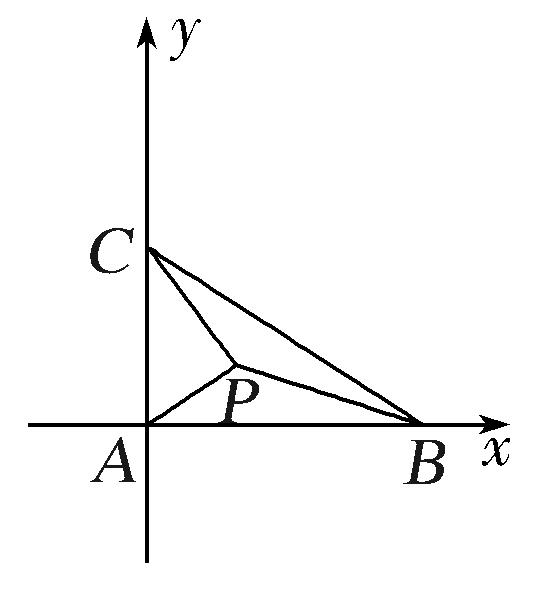

则<em>B</em>(6，0)，<em>C</em>(0，3)，设<em>P</em>(<em>x</em>，<em>y</em>)，则2＋2＋2＝<em>x</em>2＋<em>y</em>2＋(<em>x</em>－6)2＋<em>y</em>2＋<em>x</em>2＋(<em>y</em>－3)2＝3<em>x</em>2－12<em>x</em>＋3<em>y</em>2－6<em>y</em>＋45＝3[(<em>x</em>－2)2＋(<em>y</em>－1)2＋10]∴当<em>x</em>＝2，<em>y</em>＝1时，2＋2＋2取得最小值，此时<em>P</em>(2，1)，＝(2，1)，此时·＝(2，1)·(－6，3)＝－9．

18．已知在△<em>ABC</em>所在平面内有两点<em>P</em>，<em>Q</em>，满足＋＝<strong>0</strong>，＋＋＝，若||＝4，||＝2，

<em>S</em>△<em>APQ</em>＝，则·的值为\_\_\_\_\_\_．

18．答案　±4　解析　由＋＝<strong>0</strong>知，<em>P</em>是<em>AC</em>的中点，由＋＋＝，可得＋＝－

，即＋＝，即＝2，∴<em>Q</em>是<em>AB</em>边靠近<em>B</em>的三等分点，∴<em>S</em>△<em>APQ</em>＝××<em>S</em>△<em>ABC</em>＝<em>S</em>△<em>ABC</em>，∴<em>S</em>△<em>ABC</em>＝3<em>S</em>△<em>APQ</em>＝3×＝2．∵<em>S</em>△<em>ABC</em>＝||||sin <em>A</em>＝×4×2×sin <em>A</em>＝2，∴sin <em>A</em>＝，∴cos <em>A</em>＝±，∴·＝||||·cos <em>A</em>＝±4．

19．(2013·全国Ⅱ)已知正方形*ABCD*的边长为2，*E*为*CD*的中点，则·＝\_\_\_\_\_\_\_\_．

19．答案　2　解析　因为＝＋，＝－，所以·＝(＋)·(－)

＝2－·－2＝2．

20．已知平行四边形*ABCD*中，*AB*＝1，*AD*＝2，∠*DAB*＝60°，则·＝(　　)

A．1　　　　　　　　B．　　　　　　　　C．2　　　　　　　　D．2

20．答案　C　解析　因为＝＋，所以·＝(＋)·＝||2＋·＝1＋||||cos 60°

＝2．

21．在平行四边形*ABCD*中，||＝8，||＝6，*N*为*DC*的中点，＝2，则·＝(　　)

A．48　　　　　　　　B．36　　　　　　　　C．24　　　　　　　　D．12

21．答案　C　解析　·＝(＋)·(＋)＝(＋)·(－)＝2－2＝×82－

×62＝24．

22．设四边形*ABCD*为平行四边形，||＝6，||＝4，若点*M*，*N*满足＝3，＝2，则·

等于(　　)

A．20　　　　　　　　B．15　　　　　　　　C．9　　　　　　　　D．6

22．答案　C　解析　＝＋，＝－＝－＋，∴·＝(4＋3)·(4－

3)＝(162－92)＝(16×62－9×42)＝9，故选C．

23．在四边形*ABCD*中，＝，*P*为*CD*上一点，已知||＝8，||＝5，与的夹角为*θ*，且cos*θ*

＝，＝3，则·＝\_\_\_\_\_\_\_\_．

23．答案　2　解析　∵＝，∴四边形*ABCD*为平行四边形，又＝3，∴＝＋＝＋

，＝＋＝－，又||＝8，||＝5，cos <em>θ</em>＝，∴·＝8×5×＝22，∴·＝(＋)·(－)＝||2－·－||2＝52－11－×82＝2．

25．在平面四边形*ABCD*中，|*AC*|＝3，|*BD*|＝4，则(＋)·(＋)＝\_\_\_\_\_\_\_\_．

25．答案　－7　解析　∵在平面四边形*ABCD*中，|*AC*|＝3，|*BD*|＝4，∴＋＝＋＋＋＝

＋＝－，＋＝＋＋＋＝＋，∴(＋)·(＋)＝(－)(＋)＝2－2＝9－16＝－7．

26．如图，在四边形*ABCD*中，*AB*＝6，*AD*＝2，＝，*AC*与*BD*相交于点*O*，*E*是*BD*的中点，若·

＝8，则·＝(　　)

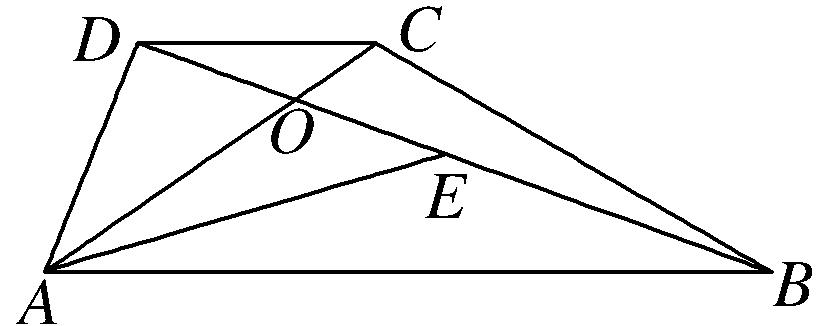

A．－9　　　　　　　　B．－　　　　　　　　C．－10　　　　　　　　D．－

26．答案　　解析　由＝，可得*DC*∥*AB*，且*DC*＝2，则△*AOB*∽△*COD*，＝＝ (＋)

＝＋，又*E*是*BD*的中点，所以＝＋，则·＝(＋)(＋)＝＋＋·＝＋＋·＝8，则·＝4，则·＝(＋)·(－)＝－－·＝4－×36－×4＝－．

27．设△*ABC*的外接圆的圆心为*P*，半径为3，若＋＝，则·＝(　　)

A．－　　　　　　　　B．－　　　　　　　　C．3　　　　　　　　D．9

27．答案　A　解析　由题意＋＝，△*ABC*的外接圆的圆心为*P*，半径为3，故，两向量的和

向量的模是3，由向量加法的平行四边形法则知，，的夹角为120°，所以·＝3×3×cos 120°＝9×＝－．故选A．

28．如图，*B*，*D*是以*AC*为直径的圆上的两点，其中*AB*＝，*AD*＝，则·＝(　　)

A．1　　　　　　　　B．2　　　　　　　　C．*t*　　　　　　　　D．2*t*

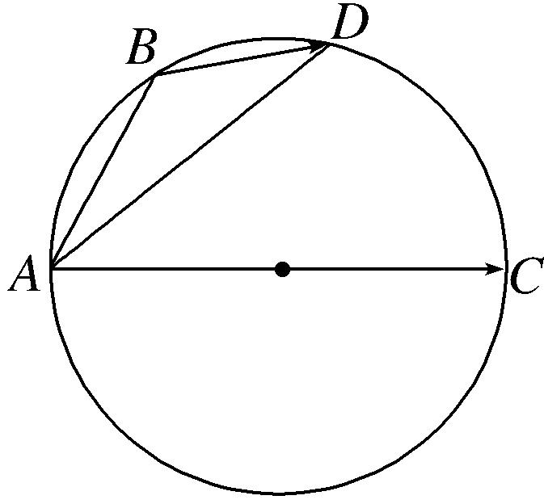

28．答案　A　解析　因为＝－，所以·＝·(－)＝·－·＝||·||cos∠

<em>CAD</em>－||·||cos∠<em>CAB．</em>又<em>AC</em>为圆的直径，所以连接<em>BC</em>，<em>DC</em>(图略)，则∠<em>ADC</em>＝∠<em>ABC</em>＝，所以cos∠<em>CAD</em>＝，cos∠<em>CAB</em>＝，则·＝||2－||2＝<em>t</em>＋2－(<em>t</em>＋1)＝1，故选A．

**考点二　已知平面向量数量积，求参数的值或判断多边形的形状**

**【例题选讲】**

<strong>[例1]</strong>(1)在△<em>ABC</em>中，<em>A</em>＝90°，<em>AB</em>＝1，<em>AC</em>＝2．设点<em>P</em>，<em>Q</em>满足＝<em>λ</em>，＝(1－<em>λ</em>)，<em>λ</em>∈<strong>R</strong>．若·＝－2，则<em>λ</em>等于(　　)

A．　　　　　　　　　B．　　　　　　　　　C．　　　　　　　　　D．2

答案　B　解析　＝－＝(1－<em>λ</em>)－，＝－＝<em>λ</em>－，·＝(<em>λ</em>－1)2－<em>λ</em>2＝4(<em>λ</em>－1)－<em>λ</em>＝3<em>λ</em>－4＝－2，即<em>λ</em>＝．

(2)已知△<em>ABC</em>为等边三角形，<em>AB</em>＝2，设点<em>P</em>，<em>Q</em>满足＝<em>λ</em>，＝(1－<em>λ</em>) ，<em>λ</em>∈<strong>R</strong>，若·＝－，则<em>λ</em>＝(　　)

A．　　　　　　B．　　　　　　C．　　　　　　D．

答案　A　解析　∵＝－＝(1－<em>λ</em>) －，＝－＝<em>λ</em>－，又·＝－，||＝||＝2，<em>A</em>＝60°，·＝||·||cos 60°＝2，∴[(1－<em>λ</em>) －]·(<em>λ</em>－)＝－，即<em>λ</em>||2＋(<em>λ</em>2－<em>λ</em>－1) ·＋(1－<em>λ</em>)| |2＝，所以4<em>λ</em>＋2(<em>λ</em>2－<em>λ</em>－1)＋4(1－<em>λ</em>)＝，解得<em>λ</em>＝．

(3)已知菱形*ABCD*的边长为6，∠*ABD*＝30°，点*E*，*F*分别在边*BC*，*DC*上，*BC*＝2*BE*，*CD*＝*λCF*．若·＝－9，则*λ*的值为(　　)

A．2　　　　　　　　B．3　　　　　　　　C．4　　　　　　　　D．5

答案　B　解析　依题意得＝＋＝－，＝＋，因此·＝(－)(＋)＝2－2＋·，于是有×62＋×62×cos 60°＝－9．由此解得<em>λ</em>＝3，故选B．

(4)已知菱形<em>ABCD</em>边长为2，∠<em>B</em>＝，点<em>P</em>满足＝<em>λ</em>，<em>λ</em>∈<strong>R</strong>，若·＝－3，则<em>λ</em>的值为(　　)

A．　　　　　　　　B．－　　　　　　　　C．　　　　　　　　D．－

答案　A　解析　法一：由题意可得·＝2×2cos ＝2，·＝(＋) ·(－)＝(＋)·[(－)－]＝(＋)·[(<em>λ</em>－1)·－]＝(1－<em>λ</em>)2－·＋(1－<em>λ</em>)·－2＝(1－<em>λ</em>)·4－2＋2(1－<em>λ</em>)－4＝－6<em>λ</em>＝－3，∴<em>λ</em>＝，故选A．

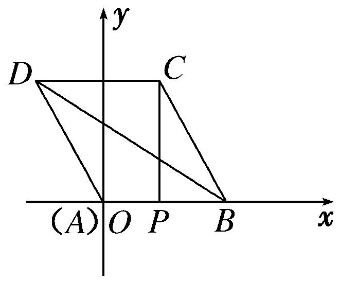

法二：建立如图所示的平面直角坐标系，则*B*(2，0)，*C*(1，)，*D*(－1，)．令*P*(*x，* 0)，由·＝(－3，)·(*x*－1，－)＝－3*x*＋3－3＝－3*x*＝－3得*x*＝1．∵＝*λ*，∴*λ*＝．故选A．

(5)若*O*为△*ABC*所在平面内任一点，且满足(－)·(＋－2)＝0，则△*ABC*的形状为(　　)

A．正三角形　　　　B．直角三角形　　　　C．等腰三角形　　　　D．等腰直角三角形

答案　C　解析　因为(－)·(＋－2)＝0，即·(＋)＝0，因为－＝，所以(－)·(＋)＝0，即||＝||，所以△*ABC*是等腰三角形，故选C．

(6)若△*ABC*的三个内角*A*，*B*，*C*的度数成等差数列，且(＋)·＝0，则△*ABC*一定是(　　)

A．等腰直角三角形　　B．非等腰直角三角形　　C．等边三角形　　D．钝角三角形

答案　C　解析　因为(＋)·＝0，所以(＋)·(－)＝0，所以2－2＝0，即||＝||，又<em>A</em>，<em>B</em>，<em>C</em>度数成等差数列，故2<em>B</em>＝<em>A</em>＋<em>C</em>，<em>A</em>＋<em>B</em>＋<em>C</em>＝3<em>B</em>＝π，所以<em>B</em>＝，故△<em>ABC</em>是等边三角形．

(7)平面四边形*ABCD*中，＋＝0，(－)·＝0，则四边形*ABCD*是(　　)

A．矩形　　　　　　　　B．正方形　　　　　　　　C．菱形　　　　　　　　D．梯形

答案　C　解析　因为＋＝0，所以＝－＝，所以四边形*ABCD*是平行四边形．又(－)·＝·＝0，所以四边形对角线互相垂直，所以四边形*ABCD*是菱形．

(8)已知平面向量<em><strong>a</strong></em>＝(<em>x</em>1，<em>y</em>1)，<em><strong>b</strong></em>＝(<em>x</em>2，<em>y</em>2)，若|<em><strong>a</strong></em>|＝2，|<em><strong>b</strong></em>|＝3，<em><strong>a</strong></em>·<em><strong>b</strong></em>＝－6．则的值为(　　)

A．　　　　　　　　B．－　　　　　　　　C．　　　　　　　　D．－

答案　B　解析　由已知得，向量<em><strong>a</strong></em>＝(<em>x</em>1，<em>y</em>1)与<em><strong>b</strong></em>＝(<em>x</em>2，<em>y</em>2)反向，3<em><strong>a</strong></em>＋2<em><strong>b</strong></em>＝0，即3(<em>x</em>1，<em>y</em>1)＋2(<em>x</em>2，<em>y</em>2)＝(0，0)，得<em>x</em>1＝－<em>x</em>2，<em>y</em>1＝－<em>y</em>2，故＝－．

**考点三　平面向量数量积的最值(范围)问题**

【**方法总结**】

**数量积的最值或范围问题的2种求解方法**

(1)几何法：即临界位置法，结合图形，确定临界位置的动态分析求出范围．

(2)代数法：即目标函数法，将数量积表示为某一个变量或两个变量的函数，建立函数关系式，再利用三角函数有界性、二次函数或基本不等式求最值或范围．

**【例题选讲】**

<strong>[例1]</strong>(1)若<em><strong>a</strong></em>，<em><strong>b</strong></em>，<em><strong>c</strong></em>是单位向量，且<em><strong>a</strong></em>·<em><strong>b</strong></em>＝0，则(<em><strong>a</strong></em>－<em><strong>c</strong></em>)·(<em><strong>b</strong></em>－<em><strong>c</strong></em>)的最大值为\_\_\_\_\_\_\_\_．

答案　1＋　解析　依题意可设<em><strong>a</strong></em>＝(1，0)，<em><strong>b</strong></em>＝(0，1)，<em><strong>c</strong></em>＝(cos <em>θ</em>，sin <em>θ</em>)，则(<em><strong>a</strong></em>－<em><strong>c</strong></em>)·(<em><strong>b</strong></em>－<em><strong>c</strong></em>)＝1－(sin<em>θ</em>＋cos <em>θ</em>)＝1－sin，所以(<em><strong>a</strong></em>－<em><strong>c</strong></em>)<em><strong>·</strong></em>(<em><strong>b</strong></em>－<em><strong>c</strong></em>)的最大值为1＋．

(2)(2016·浙江)已知向量***a***，***b***，|***a***|＝1，|***b***|＝2．若对任意单位向量***e***，均有|***a***·***e***|＋|***b***·***e***|≤，则***a***·***b***的最大值是\_\_\_\_\_\_\_\_．

答案　　解析　由已知可得≥|<em><strong>a</strong></em>·<em><strong>e</strong></em>|＋|<em><strong>b</strong></em>·<em><strong>e</strong></em>|≥|<em><strong>a</strong></em>·<em><strong>e</strong></em>＋<em><strong>b</strong></em>·<em><strong>e</strong></em>|＝|(<em><strong>a</strong></em>＋<em><strong>b</strong></em>)·<em><strong>e</strong></em>|，由于上式对任意单位向量<em><strong>e</strong></em>都成立．∴≥|<em><strong>a</strong></em>＋<em><strong>b</strong></em>|成立．∴6≥(<em><strong>a</strong></em>＋<em><strong>b</strong></em>)2＝<em><strong>a</strong></em>2＋<em><strong>b</strong></em>2＋2<em><strong>a</strong></em>·<em><strong>b</strong></em>＝12＋22＋2<em><strong>a</strong></em>·<em><strong>b</strong></em>．即6≥5＋2<em><strong>a</strong></em>·<em><strong>b</strong></em>，∴<em><strong>a</strong></em>·<em><strong>b</strong></em>≤．∴<em><strong>a</strong></em>·<em><strong>b</strong></em>的最大值为．

(3)(2017·全国Ⅱ)已知△*ABC*是边长为2的等边三角形，*P*为平面*ABC*内一点，则·(＋)的最小值是(　　)

A．－2　　　　　　　　B．－　　　　　　　　C．－　　　　　　　　D．－1

答案　B　解析　方法一　(解析法)　建立坐标系如图①所示，则*A*，*B*，*C*三点的坐标分别为*A*(0，)，*B*(－1，0)，*C*(1，0)．设*P*点的坐标为(*x*，*y*)，

  
图①

则＝(－<em>x</em>，－<em>y</em>)，＝(－1－<em>x</em>，－<em>y</em>)，＝(1－<em>x</em>，－<em>y</em>)，∴·(＋)＝(－<em>x</em>，－<em>y</em>)·(－2<em>x</em>，－2<em>y</em>)＝2(<em>x</em>2＋<em>y</em>2－<em>y</em>)＝2≥2×＝－．当且仅当<em>x</em>＝0，<em>y</em>＝时，·(＋)取得最小值，最小值为－．故选B．

方法二　(几何法)　如图②所示，＋＝2(*D*为*BC*的中点)，则·(＋)＝2·．

  
图②

要使·最小，则与方向相反，即点<em>P</em>在线段<em>AD</em>上，则(2·)min＝－2||||，问题转化为求||||的最大值．又当点<em>P</em>在线段<em>AD</em>上时，||＋||＝||＝2×＝，∴||||≤2＝2＝，∴[·(＋)]min＝(2·)min＝－2×＝－．故选B．

(4)已知⊥，||＝，||＝*t*，若点*P*是△*ABC*所在平面内的一点，且＝＋，则·的最大值等于(　　)

A．13　　　　　　　　B．15　　　　　　　　C．19　　　　　　　　D．21

答案　A　解析　建立如图所示的平面直角坐标系，则*B*，*C*(0，*t*)，＝，＝(0，*t*)，*A*＝＋＝*t*＋(0，*t*)＝(1，4)，∴*P*(1，4)，·＝·(－1，*t*－4)＝17－≤17－2＝13，当且仅当*t*＝时等号成立．∴·的最大值等于13．

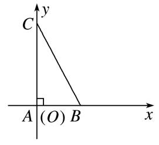

(5)如图，已知*P*是半径为2，圆心角为的一段圆弧*AB*上的一点，若＝2，则·的最小值为\_\_\_\_\_．

答案　5－2　解析　以圆心为坐标原点，平行于*AB*的直径所在直线为*x*轴，*AB*的垂直平分线所在的直线为*y*轴，建立平面直角坐标系(图略)，则*A*(－1，)，*C*(2，)，设*P*(2cos *θ*，2sin *θ*)，则·＝(2－2cos *θ*，－2sin *θ*)·(－1－2cos *θ*，－2sin *θ*)＝5－2cos *θ*－4sin *θ*＝5－2sin(*θ*＋*φ*)，其中0<tan *φ*＝<，所以0<*φ*<，当*θ*＝－*φ*时，·取得最小值，为5－2．

另解：设圆心为<em>O</em>，<em>AB</em>的中点为<em>D</em>，由题得<em>AB</em>＝2×2×sin ＝2，∴<em>AC</em>＝3．取<em>AC</em>的中点<em>M</em>，由题得两方程平方相减并化简得·＝2－2＝2－，要使·取最小值，则需<em>PM</em>最小，当圆弧的圆心与点<em>P</em>，<em>M</em>共线时，<em>PM</em>最小．易知<em>DM</em>＝，∴<em>OM</em>＝＝，所以<em>PM</em>有最小值为2－，代入求得·的最小值为5－2．

(6)(2020·天津)如图，在四边形*ABCD*中，∠*B*＝60°，*AB*＝3，*BC*＝6，且＝*λ*，·＝－，则实数*λ*的值为\_\_\_\_\_\_\_\_，若*M*，*N*是线段*BC*上的动点，且||＝1，则·的最小值为\_\_\_\_\_\_\_\_．

答案　　　解析　因为＝*λ*，所以*AD*∥*BC*，则∠*BAD*＝120°，所以·＝||·||·cos 120°＝－，解得||＝1．因为，同向，且*BC*＝6，所以＝，即*λ*＝．在四边形*ABCD*中，作*AO*⊥*BC*于点*O*，则*BO*＝*AB*·cos 60°＝，*AO*＝*AB*·sin 60°＝．以*O*为坐标原点，以*BC*和*AO*所在直线分别为*x*，*y*轴建立平面直角坐标系．如图，设*M*(*a，* 0)，不妨设点*N*在点*M*右侧，

则<em>N</em>(<em>a</em>＋1，0)，且－≤<em>a</em>≤．又<em>D</em>，所以＝，＝，所以·＝<em>a</em>2－<em>a</em>＋＝2＋．所以当<em>a</em>＝时，·取得最小值．

(7) (2020·新高考Ⅰ)已知*P*是边长为2的正六边形*ABCDEF*内的一点，则·的取值范围是(　　)

A．(－2，6)　　　　　B．(－6，2)　　　　　C．(－2，4)　　　　　D．(－4，6)

答案　A　解析　如图，取*A*为坐标原点，*AB*所在直线为*x*轴建立平面直角坐标系，则*A*(0，0)，*B*(2，0)，*C*(3，)，*F*(－1，)．设*P*(*x*，*y*)，则＝(*x*，*y*)，＝(2，0)，且－1<*x*<3．所以·＝(*x*，*y*)·(2，0)＝2*x*∈(－2，6)．

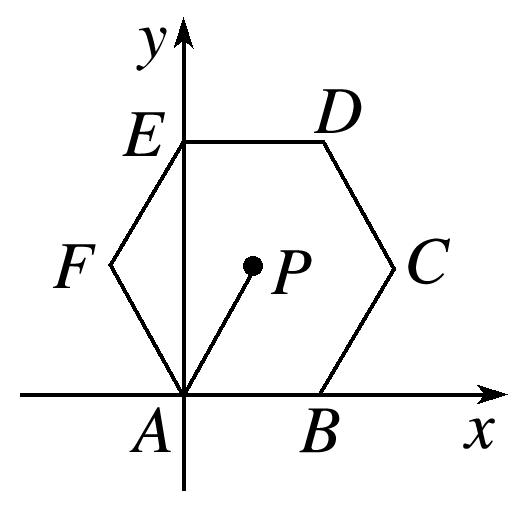

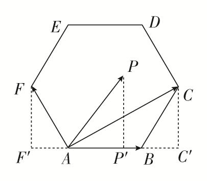

另解　的模为2，根据正六边形的特征，可以得到在方向上的投影的取值范围是(－1，3)，结合向量数量积的定义式，可知·等于的模与在方向上的投影的乘积，所以·的取值范围是(－2，6)，故选A．

(8)如图所示，半圆的直径*AB*＝6，*O*为圆心，*C*为半圆上不同于*A*，*B*的任意一点，若*P*为半径*OC*上的动点，则(＋)·的最小值为\_\_\_\_\_\_\_\_．

答案　－　解析　∵圆心*O*是直径*AB*的中点，∴＋＝2，∴(＋)·＝2·，∵||＋||＝3≥2，∴||·||≤，即(＋)·＝2·＝－2||·||≥－，当且仅当||＝||＝时，等号成立，故最小值为－．

【**对点训练**】

1．在△*ABC*中，∠*C*＝90°，*AB*＝6，点*P*满足*CP*＝2，则·的最大值为(　　)

A．9　　　　　　　　B．16　　　　　　　　C．18　　　　　　　　D．25

1．答案　B　解析　∵∠*C*＝90°，*AB*＝6，∴·＝0，∴|＋|＝|－|＝||＝6，∴·＝

(＋)·(＋)＝2＋·(＋)＋·＝·(＋)＋4，∴当与＋方向相同时，·(＋)取得最大值2×6＝12，∴·的最大值为16．

2．在等腰直角△*ABC*中，∠*ABC*＝90°，*AB*＝*BC*＝2，*M*，*N*(不与*A*，*C*重合)为*AC*边上的两个动点，且

满足||＝，则·的取值范围为(　　)

A．　　　　　　B．　　　　　　C．　　　　　　D．

2．答案　C　解析　以等腰直角三角形的直角边*BC*所在直线为*x*轴，*BA*所在直线为*y*轴，建立平面直

角坐标系如图所示，则<em>B</em>(0，0)，直线<em>AC</em>的方程为<em>x</em>＋<em>y</em>＝2，设<em>M</em>(<em>a，</em>2－<em>a</em>)，则0＜<em>a</em>＜1，<em>N</em>(<em>a</em>＋1，1－<em>a</em>)，∴＝(<em>a，</em>2－<em>a</em>)，＝(<em>a</em>＋1，1－<em>a</em>)，∴·＝<em>a</em>(<em>a</em>＋1)＋(2－<em>a</em>)(1－<em>a</em>)＝2<em>a</em>2－2<em>a</em>＋2，∵0＜<em>a</em>＜1，∴当<em>a</em>＝时，·取得最小值，又·＜2，故·的取值范围为．

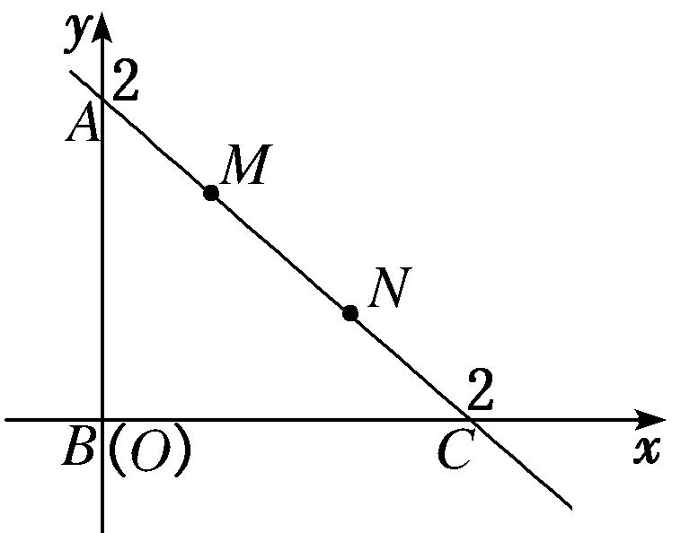

3．在等腰三角形*ABC*中，*AB*＝*AC*＝1，∠*BAC*＝90°，点*E*为斜边*BC*的中点，点*M*在线段*AB*上运动，

则·的取值范围是(　　)

A．　　　　　　B．　　　　　　C．　　　　　　　　D．[0，1]

3．答案　B　解析　如图，以*A*为坐标原点，*AC*，*AB*所在直线分别为*x*轴，*y*轴建立平面直角坐标系，

则<em>A</em>(0，0)，<em>B</em>(0，1)，<em>C</em>(1，0)，<em>E</em>．设<em>M</em>(0，<em>m</em>)(0≤<em>m</em>≤1)，则＝，＝(1，－<em>m</em>)．·＝－<em>m</em>＝<em>m</em>2－<em>m</em>＋＝2＋，由于<em>m</em>∈[0，1]，则当<em>m</em>＝时，·取得最小值；当<em>m</em>＝1时，·取得最大值1．所以·的取值范围是．

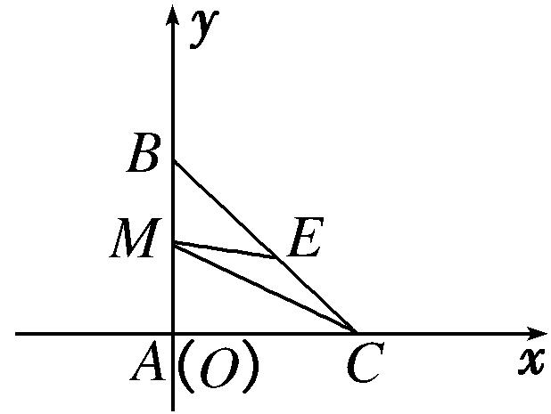

4．在△*ABC*中，满足⊥，*M*是*BC*的中点，若*O*是线段*AM*上任意一点，且||＝||＝，则·(

＋)的最小值为\_\_\_\_\_\_\_\_．

4．答案　－　解析　∵||＝||＝，∴||＝1．设||＝*x*，则||＝1－*x*，而＋＝2，∴

·(＋)＝2·＝2||·||cos π＝－2<em>x</em>(1－<em>x</em>)＝2<em>x</em>2－2<em>x</em>＝22－，当且仅当<em>x</em>＝时，·(＋)取得最小值，最小值为－．

5．已知在△*ABC*中，*AB*＝4，*AC*＝2，*AC*⊥*BC*，*D*为*AB*的中点，点*P*满足＝＋，则·(

＋)的最小值为(　　)

A．－2　　　　　　　　B．－　　　　　　　　C．－　　　　　　　　D．－

5．答案　C　解析　由＝＋知点*P*在直线*CD*上，以点*C*为坐标原点，*CB*所在直线为*x*

轴，<em>CA</em>所在直线为<em>y</em>轴建立如图所示的平面直角坐标系，则<em>C</em>(0，0)，<em>A</em>(0，2)，<em>B</em>(2，0)，<em>D</em>(，1)，∴直线<em>CD</em>的方程为<em>y</em>＝<em>x</em>，设<em>P</em>，则＝，＝，＝，∴＋＝，∴·(＋)＝－<em>x</em>(2－2<em>x</em>)＋<em>x</em>2－<em>x</em>＝<em>x</em>2－<em>x</em>＝2－，∴当<em>x</em>＝时，·(＋)取得最小值－．

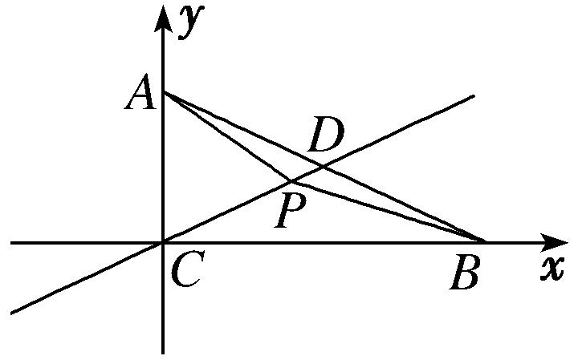

6．如图，线段*AB*的长度为2，点*A*，*B*分别在*x*轴的正半轴和*y*轴的正半轴上滑动，以线段*AB*为一边，

在第一象限内作等边三角形*ABC*，*O*为坐标原点，则·的取值范围是\_\_\_\_\_\_\_\_．

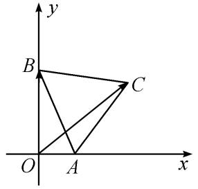

6．答案　(0，3]　解析　设∠*BAO*＝*θ*，*θ*∈(0°，90°)，则*B*(0，2sin *θ*)，*C*(2cos *θ*＋2cos(120°－*θ*)，2sin(120°

－<em>θ</em>))，则·＝(0，2sin <em>θ</em>)·(2cos <em>θ</em>＋2cos(120°－<em>θ</em>)，2sin(120°－<em>θ</em>))＝2sin <em>θ</em>·2sin(120°－<em>θ</em>)＝2sin <em>θ</em>cos <em>θ</em>＋2sin2<em>θ</em>＝2sin(2<em>θ</em>－30°)＋1．因为<em>θ</em>∈(0°，90°)，所以·∈(0，3]．

7．已知正方形*ABCD*的边长为1，点*E*是*AB*边上的动点，则·的值为\_\_\_\_\_\_\_\_；·的最大

值为\_\_\_\_\_\_\_\_．

7．答案　1　1　解析　方法一　以射线*AB*，*AD*为*x*轴，*y*轴的正方向建立平面直角坐标系，则*A*(0，0)，

*B*(1，0)，*C*(1，1)，*D*(0，1)，设*E*(*t*，0)，*t*∈[0，1]，则＝(*t*，－1)，＝(0，－1)，所以·＝(*t*，－1)·(0，－1)＝1．因为＝(1，0)，所以·＝(*t*，－1)·(1，0)＝*t*≤1，故·的最大值为1．

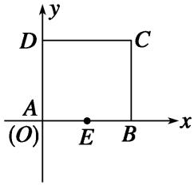

方法二　由图知，无论<em>E</em>点在哪个位置，在方向上的投影都是<em>CB</em>＝1，∴·＝||·1＝1，当<em>E</em>运动到<em>B</em>点时，在方向上的投影最大即为<em>DC</em>＝1，∴(·)max＝||·1＝1．

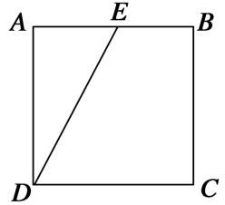

8．在边长为1的正方形*ABCD*中，*M*为*BC*的中点，点*E*在线段*AB*上运动，则·的取值范围是(　　)

A．　　　　　B．　　　　　C．　　　　　D．

8．答案　C　解析　将正方形放入如图所示的平面直角坐标系中，设*E*(*x，* 0)，0≤*x*≤1．又*M*，*C*(1，

1)，所以＝， ＝(1－<em>x，</em>1)，所以·＝·(1－<em>x，</em>1)＝(1－<em>x</em>)2＋．因为0≤<em>x</em>≤1，所以≤(1－<em>x</em>)2＋≤，即·的取值范围是．

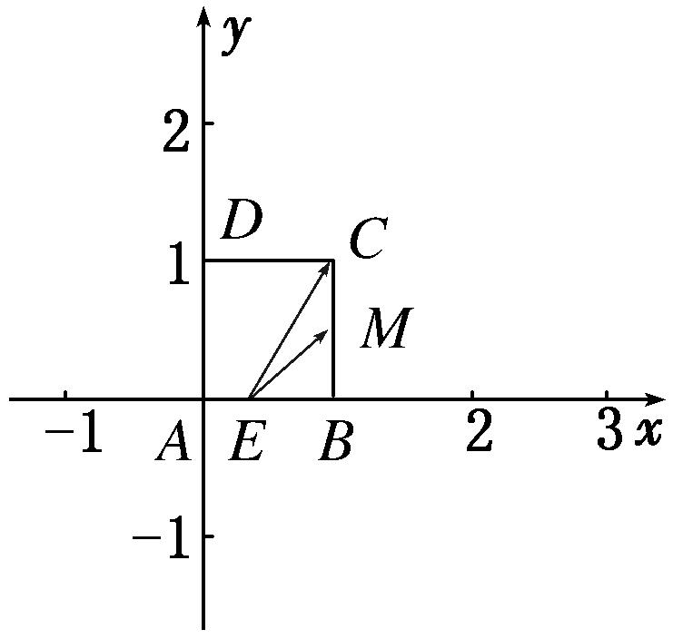

9．如图所示，已知正方形*ABCD*的边长为1，点*E*从点*D*出发，按字母顺序*D*→*A*→*B*→*C*沿线段*DA*，

*AB*，*BC*运动到点*C*，在此过程中·的取值范围为\_\_\_\_\_\_\_\_．

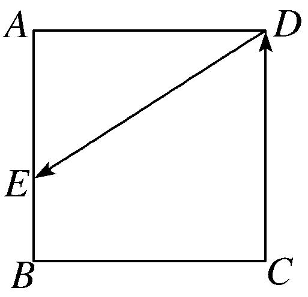

9．答案　[－1，0]　解析　以*BC*，*BA*所在的直线为*x*轴，*y*轴，建立平面直角坐标系如图所示，可得

*A*(0，1)，*B*(0，0)，*C*(1，0)，*D*(1，1)．当*E*在*DA*上时，设*E*(*x*，1)，其中0≤*x*≤1，∵＝(*x*－1，0)，＝(0，1)，∴·＝0；当*E*在*AB*上时，设*E*(0，*y*)，其中0≤*y*≤1，∵＝(－1，*y*－1)，＝(0，1)，∴·＝*y*－1(0≤*y*≤1)，此时·的取值范围为[－1，0]；当*E*在*BC*上时，设*E*(*x，* 0)，其中0≤*x*≤1，∵＝(*x*－1，－1)，＝(0，1)，∴·＝－1．综上所述，·的取值范围为[－1，0]．

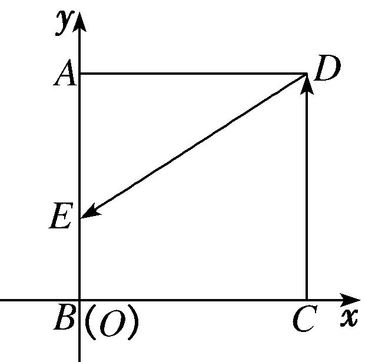

10．如图，菱形*ABCD*的边长为2，∠*BAD*＝60°，*M*为*DC*的中点，若*N*为菱形内任意一点(含边界)，则

·的最大值为\_\_\_\_\_\_\_\_．

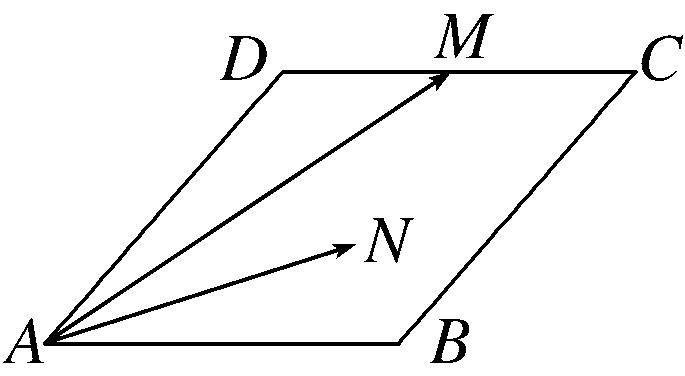

10．答案　9　解析　设＝*λ*＋*μ*，因为*N*在菱形*ABCD*内，所以0≤*λ*≤1，0≤*μ*≤1．＝

＋＝＋．所以·＝·(<em>λ</em>＋<em>μ</em>)＝2＋·＋<em>μ</em>2＝×4＋×2×2×＋4<em>μ</em>＝4<em>λ</em>＋5<em>μ</em>．所以0≤·≤9，所以当<em>λ</em>＝<em>μ</em>＝1时，·有最大值9，此时，<em>N</em>位于<em>C</em>点．

11．在平行四边形*ABCD*中，若*AB*＝2，*AD*＝1，·＝－1，点*M*在边*CD*上，则·的最大值为

\_\_\_\_\_\_\_\_．

11．答案　2　解析　在平行四边形*ABCD*中，因为*AB*＝2，*AD*＝1，·＝－1，点*M*在边*CD*上，所

以||·||·cos *A*＝－1，所以cos *A*＝－，所以*A*＝120°，以*A*为坐标原点，*AB*所在的直线为*x*轴，*AB*的垂线为*y*轴，建立如图所示的平面直角坐标系，

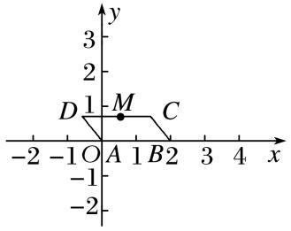

所以<em>A</em>(0，0)，<em>B</em>(2，0)，<em>D</em>．设<em>M</em>，－≤<em>x</em>≤，因为＝，＝，所以·＝<em>x</em>(<em>x</em>－2)＋＝<em>x</em>2－2<em>x</em>＋＝(<em>x</em>－1)2－．设<em>f</em>(<em>x</em>)＝(<em>x</em>－1)2－，因为<em>x</em>∈，所以当<em>x</em>＝－时，<em>f</em>(<em>x</em>)取得最大值2．

12．如图，在直角梯形*ABCD*中，*DA*＝*AB*＝1，*BC*＝2，点*P*在阴影区域(含边界)中运动，则·的

取值范围是(　　)

A．　　　　　　B．　　　　　　C．[－1，1]　　　　　　D．[－1，0]

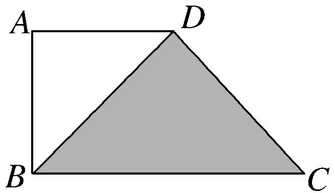

12．答案　C　解析　∵在直角梯形*ABCD*中，*DA*＝*AB*＝1，*BC*＝2，∴*BD*＝．如图所示，过点*A*作

*AO*⊥*BD*，垂足为*O*，则＝＋，·＝0，∴·＝(＋)·＝·．∴当点*P*与点*B*重合时，·取得最大值，即·＝·＝××＝1；当点*P*与点*D*重合时，·取得最小值，即·＝－××＝－1．∴·的取值范围是[－1，1]．

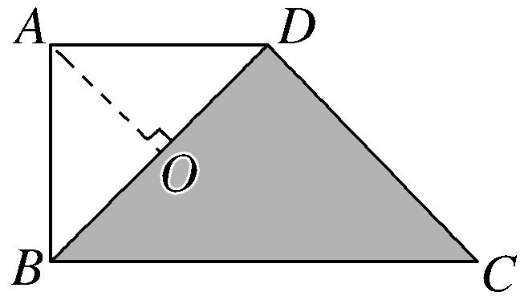

13．如图，在等腰梯形*ABCD*中，已知*DC*∥*AB*，∠*ADC*＝120°，*AB*＝4，*CD*＝2，动点*E*和*F*分别在线

段*BC*和*DC*上，且＝，＝*λ*，则·的最小值是(　　)

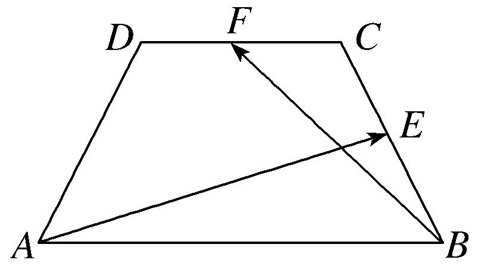

A．4＋13　　　　　B．4－13　　　　　C．4＋　　　　　D．4－

13．答案　B　解析　在等腰梯形*ABCD*中，*AB*＝4，*CD*＝2，∠*ADC*＝120°，易得*AD*＝*BC*＝2．由动点

*E*和*F*分别在线段*BC*和*DC*上得，所以<*λ*<1．所以·＝(＋)·(＋)＝·＋·＋·＋·＝||·||cos 120°＋||·||－||·||＋||·||cos 60°＝4×2×＋×2－4×(1－*λ*)×2＋×(1－*λ*)×2×＝－13＋8*λ*＋≥－13＋2＝4－13，当且仅当*λ*＝时取等号．所以·的最小值是4－13．

14．(2018·天津)如图，在平面四边形*ABCD*中，*AB*⊥*BC*，*AD*⊥*CD*，∠*BAD*＝120°，*AB*＝*AD*＝1．若点*E*

为边*CD*上的动点，则·的最小值为\_\_\_\_\_\_\_\_．

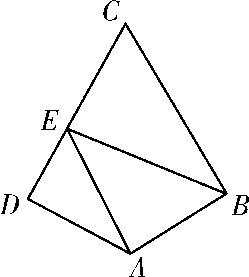

14．答案　　解析　如图，以*D*为坐标原点建立直角坐标系．连接*AC*，由题意知∠*CAD*＝∠*CAB*＝60°，

∠<em>ACD</em>＝∠<em>ACB</em>＝30°，则<em>D</em>(0，0)，<em>A</em>(1，0)，<em>B</em>，<em>C</em>(0，)．设<em>E</em>(0，<em>y</em>)(0≤<em>y</em>≤)，则＝(－1，<em>y</em>)，＝，所以·＝＋<em>y</em>2－<em>y</em>＝2＋，所以当<em>y</em>＝时，·有最小值．

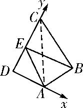

15．设*A*，*B*，*C*是半径为1的圆*O*上的三点，且⊥，则(－)·(－)的最大值是(　　)

A．1＋　　　　　　B．1－　　　　　　C．－1　　　　　　D．1

15．答案　A　解析　如图，作出，使得＋＝．则(－)·(－)＝2－·－·

＋·＝1－(＋)·＝1－·，由图可知，当点*C*在*OD*的反向延长线与圆*O*的交点处时，·取得最小值，最小值为－，此时(－)·(－)取得最大值，最大值为1＋．故选A．

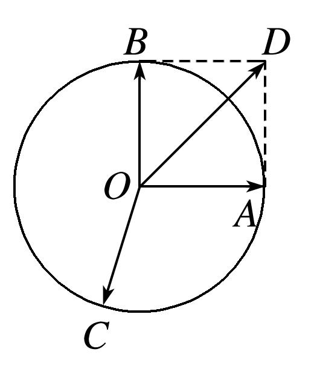

16．已知平面向量***a***，***b***，***e***满足|***e***|＝1，***a***·***e***＝1，***b***·***e***＝－2，|***a***＋***b***|＝2，则***a***·***b***的最大值为\_\_\_\_\_\_\_\_．

16．答案　－　解析　不妨设<em><strong>e</strong></em>＝(1，0)，<em><strong>a</strong></em>＝(1，<em>m</em>)，<em><strong>b</strong></em>＝(－2，<em>n</em>)(<em>m</em>，<em>n</em>∈<strong>R</strong>)，则<em><strong>a</strong></em>＋<em><strong>b</strong></em>＝(－1，<em>m</em>＋<em>n</em>)，

故|<em><strong>a</strong></em>＋<em><strong>b</strong></em>|＝＝2，所以(<em>m</em>＋<em>n</em>)2＝3，即3＝<em>m</em>2＋<em>n</em>2＋2<em>mn</em>≥2<em>mn</em>＋2<em>mn</em>＝4<em>mn</em>，则<em>mn</em>≤，所以<em><strong>a·b</strong></em>＝－2＋<em>mn</em>≤－，当且仅当<em>m</em>＝<em>n</em>＝时等号成立，所以<em><strong>a·b</strong></em>的最大值为－．

