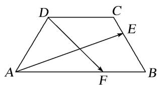

# 专题三 平面向量的平行与垂直

#### 1. 平面向量平行(共线)的充要条件的两种形式  
（1）平面向量平行(共线)充要条件的非坐标形式： $a \parallel b (b \neq 0) \Leftrightarrow a = \lambda b$ .  
（2）平面向量平行充要条件的坐标形式：若 $a=(x_{1}, y_{1})$ ， $b=(x_{2}, y_{2})$ ，则 $a \parallel b \Leftrightarrow x_{1}y_{2} - x_{2}y_{1} = 0$ ;

至于使用哪种形式，应视题目的具体条件而定，一般情况涉及坐标的用（2）. 这是代数运算，用它解决平面向量平行(共线)问题的优点在于不需要引入参数“ $\lambda$ ”，从而减少了未知数的个数，而且它使问题的解决具有代数化的特点和程序化的特征．当 $x_{2}y_{2} \neq 0$ 时， $a // b \Leftrightarrow \frac{x_1}{x_2} = \frac{y_1}{y_2}$ ，即两个向量的相应坐标成比例，这种形式不易出现搭配错误．公式 $x_{1}y_{2} - x_{2}y_{1} = 0$ 无条件 $x_{2}y_{2} \neq 0$ 的限制，便于记忆；公式 $\frac{x_1}{x_2} = \frac{y_1}{y_2}$ 有条件 $x_{2}y_{2} \neq 0$ 的限制，但不易出错．所以我们可以记比例式，但在解题时改写成乘积的形式．乘积形式可总结为：“相异坐标的乘积的差为0”.

#### 2. 三点共线的充要条件的三种形式  
（1）A, P, B 三点共线 $\Leftrightarrow \overrightarrow{AP} = \lambda \overrightarrow{AB}$ ( $\lambda \neq 0$ )   
（2） $A, P, B$ 三点共线 $\Leftrightarrow \overrightarrow{OP} = (1 - t) \cdot \overrightarrow{OA} + t\overrightarrow{OB}$ ( $O$ 为平面内异于 $A, P, B$ 的任一点， $t \in \mathbf{R}$ )  
（3） $A, P, B$ 三点共线 $\Leftrightarrow \overrightarrow{OP} = x\overrightarrow{OA} + y\overrightarrow{OB}$ ( $O$ 为平面内异于 $A, P, B$ 的任一点， $x \in \mathbf{R}, y \in \mathbf{R}, x + y = 1$ ).

#### 3. 非零向量垂直的充要条件的两种形式  
（1）平面向量垂直的非坐标形式: $a \perp b \Leftrightarrow a \cdot b = 0$ .   
（2）平面向量垂直的坐标形式：若 $a=(x_{1}, y_{1})$ ， $b=(x_{2}, y_{2})$ ，则 $a \perp b \Leftrightarrow x_{1}x_{2} + y_{1}y_{2} = 0$ ;

至于使用哪种形式, 应视题目的具体条件而定, 数量积的运算 $a \cdot b = 0 \Leftrightarrow a \perp b$ 中, 是对非零向量而言的, 若 $a = 0$ , 虽然有 $a \cdot b = 0$ , 但不能说 $a \perp b$ . 一般情况涉及坐标的用（2）. 坐标形式可总结为: “相应坐标的乘积的和为 0”.

# 考点一 平面向量的平行

# 【方法总结】

两平面向量平行的充要条件既可以判定两向量平行，也可以由平行求参数。当然也可解决三点共线的问题。高考试题中一般是考查已知两向量平行或三点共线求参数，并且以给出向量的坐标为主。解决此类问题的方法是借助两平面向量平行的充要条件列出方程(组)，求出参数的值。注意方程思想和待定系数法的运用。

# 【例题选讲】

[例1] （1） 设 $D, E, F$ 分别是 $\triangle ABC$ 的三边 $BC, CA, AB$ 上的点，且 $\overrightarrow{DC} = 2\overrightarrow{BD}, \overrightarrow{CE} = 2\overrightarrow{EA}, \overrightarrow{AF} = 2\overrightarrow{BF}$ ，则 $\overrightarrow{AD} + \overrightarrow{BE} + \overrightarrow{CF}$ 与 $\overrightarrow{BC}$ （）

A. 反向平行

B. 同向平行

C. 互相垂直

D. 既不平行也不垂直  
（2）已知向量 $\boldsymbol{m}=(1,7)$ 与向量 $\boldsymbol{n}=(k,k+18)$ 平行，则 k 的值为()

A.-6

B. 3

C. 4

D. 6  
（3）(2018·全国III)已知向量 $a=(1,2)$ ， $b=(2,-2)$ ， $c=(1,\lambda)$ 。若 $c\parallel(2a+b)$ ，则 $\lambda=$ \_\_\_\_.  
（4）已知向量 $\overrightarrow{AB}=a+3b,\quad\overrightarrow{BC}=5a+3b,\quad\overrightarrow{CD}=-3a+3b$ ，则()

A. $A, B, C$ 三点共线

B. $A, B, D$ 三点共线

C. A, C, D 三点共线

D. $B, C, D$ 三点共线  
（5）若三点 $A(1, -5)$ ， $B(a, -2)$ ， $C(-2, -1)$ 共线，则实数 a 的值为 \_\_\_\_.  
（6）已知向量 $a = (1,1)$ , 点 $A(3,0)$ , 点 $B$ 为直线 $y = 2x$ 上的一个动点. 若 $\overrightarrow{AB} // a$ , 则点 $B$ 的坐标为 \_\_\_\_.

# 【对点训练】

1. 已知向量 $a = (m, 4)$ , $b = (3, -2)$ , 且 $a \parallel b$ , 则 $m =$ \_\_\_\_.

2. 已知向量 $a = (1, 2)$ , $b = (2, -2)$ , $c = (\lambda, -1)$ , 若 $c // (2a + b)$ , 则 $\lambda$ 等于( )

A. -2

B. -1

C. $-\frac{1}{2}$

D. $\frac{1}{2}$

3. 已知向量 $a = (3, 1)$ , $b = (1, 3)$ , $c = (k, 7)$ , 若 $(a - c) // b$ , 则 $k = \_$ .

4. 已知向量 $a=(\sqrt{3},1)$ ， $b=(0,-1)$ ， $c=(k,\sqrt{3})$ ，若 a-2b 与 c 共线，则 k= \_\_\_\_.

5. 已知向量 $a=(1,3)$ ， $b=(-2,k)$ ，且 $(a+2b)\parallel(3a-b)$ ，则实数 $k=(\quad)$

A. 4

B. -5

C. 6

D.-6

6. 已知向量 $\boldsymbol{a}=(\lambda+1,1)$ ， $\boldsymbol{b}=(\lambda+2,2)$ ，若 $(\boldsymbol{a}+\boldsymbol{b})//(\boldsymbol{a}-\boldsymbol{b})$ ，则 $\lambda=$ \_\_\_\_.

7. 已知向量 $a = (2, 4)$ , $b = (-1, 1)$ , $c = (2, 3)$ , 若 $a + \lambda b$ 与 $c$ 共线, 则实数 $\lambda = (\quad)$

A. $\frac{2}{5}$

B. $-\frac{2}{5}$

C. $\frac{3}{5}$

D. $-\frac{3}{5}$

8. 已知向量 $a = (2, 3)$ , $b = (-1, 2)$ , 若 $ma + nb$ 与 $a - 3b$ 共线, 则 $\frac{m}{n} =$ \_\_\_\_.

9. 在平面直角坐标系 $xOy$ 中，已知点 $O(0, 0)$ ， $A(0, 1)$ ， $B(1, -2)$ ， $C(m, 0)$ 。若 $\overrightarrow{OB} // \overrightarrow{AC}$ ，则实数 $m$ 的值为（）

A. -2

B. $-\frac{1}{2}$

C. $\frac{1}{2}$

D. 2

10. 已知 $A(1, 1)$ , $B(3, -1)$ , $C(a, b)$ , 若 $A, B, C$ 三点共线, 则 $a, b$ 的关系式为 \_\_\_\_.

11. 已知点 $A(0, 1)$ ， $B(3, 2)$ ， $C(2, k)$ ，且 A，B，C 三点共线，则向量 $\overrightarrow{AC} = (\quad)$

A. $\left(2,\frac{2}{3}\right)$

B. $\left(2,\frac{5}{3}\right)$

C. $\left(\frac{2}{3},\ 2\right)$

D. $\left(\frac{5}{3},2\right)$

12. 已知 $e_{1}$ ， $e_{2}$ 是不共线向量， $a=me_{1}+2e_{2}$ ， $b=ne_{1}-e_{2}$ ，且 $mn\neq0$ 。若 $a//b$ ，则 $\frac{m}{n}=$ \_\_\_\_.

13. 设向量 a, b 不平行，向量 $\lambda a + b$ 与 $a + 2b$ 平行，则实数 $\lambda =$ \_\_\_\_.

14. 已知点 $A(4, 0)$ , $B(4, 4)$ , $C(2, 6)$ , 则 $AC$ 与 $OB$ 的交点 $P$ 的坐标为 \_\_\_\_.

15. 已知平面向量 a, b 满足 $|a|=1$ , $b=(1,1)$ ，且 $a \parallel b$ ，则向量 a 的坐标是 \_\_\_\_.

16. 已知点 $A(1, 3)$ , $B(4, -1)$ , 则与 $\overrightarrow{AB}$ 同方向的单位向量是 \_\_\_\_.

17. 已知 $\overrightarrow{AB}=a+2b,\quad\overrightarrow{BC}=-5a+6b,\quad\overrightarrow{CD}=7a-2b$ ，则下列一定共线的三点是()

A. A, B, C

B. $A, B, D$

C. B, C, D

D. A, C, D

18. 已知向量 $\overrightarrow{OA} = (k, 12)$ , $\overrightarrow{OB} = (4, 5)$ , $\overrightarrow{OC} = (-k, 10)$ , 且 $A, B, C$ 三点共线, 则 $k$ 的值是( )

A. $-\frac{2}{3}$

B. $\frac{4}{3}$

C. $\frac{1}{2}$

D. $\frac{1}{3}$

19. 设 a, b 不共线， $\overrightarrow{AB}=2a+pb,\quad\overrightarrow{BC}=a+b,\quad\overrightarrow{CD}=a-2b$ ，若 A, B, D 三点共线，则实数 p 的值为()

A.-2

B.-1

C. 1

D. 2

20. 设向量 $\overrightarrow{OA} = (1, -2)$ , $\overrightarrow{OB} = (2^m, -1)$ , $\overrightarrow{OC} = (-2^n, 0)$ , $m$ , $n \in \mathbb{R}$ , $O$ 为坐标原点, 若 $A$ , $B$ , $C$ 三点共线, 则 $m + n$ 的最大值为( )

A.-3

B. -2

C. 2

D. 3

# 考点二 两个非零向量的垂直

# 【方法总结】

两平面向量垂直的充要条件既可以判定两向量垂直，也可以由垂直求参数。高考试题中一般是考查已知两向量垂直求参数，如果已知向量的坐标，根据两平面向量垂直的充要条件（2），列出相应的关系式，进而求解参数。如果未知向量的坐标，则可通过向量加法(减法)的三角形法则转化为已知模和夹角的向量的数量，根据两平面向量垂直的充要条件（1），列出相应的关系式，进而求解参数。如已知图形为矩形、正方形、直角梯形、等边三角形、等腰三角形或直角三角形时，则可建立平面直角坐标系求出未知向量的坐标从而把问题转化为已知向量的坐标求参数的问题。注意方程思想和等价转化思想的运用。

# 【例题选讲】

[例 1]（1） $\triangle ABC$ 是边长为 2 的等边三角形，已知向量 a, b 满足 $\overrightarrow{AB}=2a,\quad\overrightarrow{AC}=2a+b$ ，则下列结论正确的是()

A. $|\pmb {b}| = 1$

B. $a \perp b$

C. $a \cdot b = 1$

D. $(4a + b) \perp \overrightarrow{BC}$  
（2）(2017·全国 I )已知向量 $a=(-1,2)$ ， $b=(m,1)$ 。若向量 $a+b$ 与 a 垂直，则 m= \_\_\_\_.  
（3）(2018·北京)设向量 $\boldsymbol{a}=(1,0)$ ， $\boldsymbol{b}=(-1,m)$ 。若 $\boldsymbol{a}\perp(m\boldsymbol{a}-\boldsymbol{b})$ ，则 $m=$ \_\_\_\_.  
（4）(2020·全国II)已知单位向量 a, b 的夹角为 $45^{\circ}$ ，ka-b 与 a 垂直，则 k= \_\_\_\_.  
（5）(2016·山东)已知非零向量 m，n 满足 $4|m|=3|n|$ ， $\cos<m$ ， $n>=\frac{1}{3}$ ，若 $n\perp(t\,m+n)$ ，则实数 t 的值为（）

A. 4

B. -4

C. $\frac{9}{4}$

D. $-\frac{9}{4}$  
（6）如图，在等腰梯形ABCD中， $AB = 4$ ， $BC = CD = 2$ ，若 $E$ ， $F$ 分别是边BC， $AB$ 上的点，且满足 $\frac{BE}{BC}$ $= \frac{AF}{AB} = \lambda$ ，则当 $\overrightarrow{AE}\cdot \overrightarrow{DF} = 0$ 时， $\lambda$ 的值所在的区间是（）

A. $\left(\frac{1}{8},\frac{1}{4}\right)$

B. $\left(\frac{1}{4},\frac{3}{8}\right)$

C. $\left(\frac{3}{8},\frac{1}{2}\right)$

D. $\left(\frac{1}{2},\frac{5}{8}\right)$

# 【对点训练】

1. 已知平面向量 $a = (-2, m)$ , $b = (1, \sqrt{3})$ , 且 $(a - b) \perp b$ , 则实数 $m$ 的值为( )

A. $-2\sqrt{3}$

B. $2 \sqrt{3}$

C. $4\sqrt{3}$

D. $6\sqrt{3}$

2. 已知向量 $\boldsymbol{a}=(1,\ m)$ ， $\boldsymbol{b}=(3,-2)$ ，且 $(\boldsymbol{a}+\boldsymbol{b})\perp\boldsymbol{b}$ ，则 $m=(\quad)$

A.-8

B.-6

C. 6

D. 8

3. 设向量 $a = (1, m)$ , $b = (m - 1, 2)$ , 且 $a \neq b$ , 若 $(a - b) \perp a$ , 则实数 $m = (\quad)$

A. $\frac{1}{2}$

B. $\frac{1}{3}$

C. 1

D. 2

4. 已知向量 $a = (\sqrt{3}, 1)$ , $b = (0, 1)$ , $c = (k, \sqrt{3})$ , 若 $a + 2b$ 与 $c$ 垂直, 则 $k = (\quad)$

A.-3

B.-2

C. 1

D.-1

5. 已知向量 $a = (k, 3)$ , $b = (1, 4)$ , $c = (2, 1)$ , 且 $(2a - 3b) \perp c$ , 则实数 $k = (\quad)$

A. $-\frac{9}{2}$

B. 0

C. 3

D. $\frac{15}{2}$

6. 已知向量 $a = (\sqrt{3}, 1)$ , $b = (0, 1)$ , $c = (k, \sqrt{3})$ , 若 $a + 2b$ 与 $c$ 垂直, 则 $k = (\quad)$

A.-3

B.-2

C. 1

D. -1

7. 已知向量 $a = (1, 2)$ , $b = (1, 0)$ , $c = (3, 4)$ , 若 $\lambda$ 为实数, $(b + \lambda a) \perp c$ , 则 $\lambda$ 的值为( )

A. $-\frac{3}{11}$

B. $-\frac{11}{3}$

C. $\frac{1}{2}$

D. $\frac{3}{5}$

8. 在 $\triangle ABC$ 中, 三个顶点的坐标分别为 $A(3, t)$ , $B(t, -1)$ , $C(-3, -1)$ , 若 $\triangle ABC$ 是以 $B$ 为直角顶点的直角三角形, 则 $t =$ \_\_\_\_.

9. 已知 a 与 b 为两个不共线的单位向量，k 为实数，若向量 $a + b$ 与向量 ka - b 垂直，则 k = \_\_\_\_.

10. (2013·全国 I) 已知两个单位向量 a, b 的夹角为 $60^{\circ}$ , $c = ta + (1 - t)b$ , 若 $b \cdot c = 0$ , 则 t = \_\_\_\_.

11. 已知 $\triangle ABC$ 中， $\angle A = 120^{\circ}$ ，且 $AB = 3$ ， $AC = 4$ ，若 $\overrightarrow{AP} = \lambda \overrightarrow{AB} + \overrightarrow{AC}$ ，且 $\overrightarrow{AP} \perp \overrightarrow{BC}$ ，则实数 $\lambda$ 的值为（）

A. $\frac{22}{15}$

B. $\frac{10}{3}$

C. 6

D. $\frac{12}{7}$

