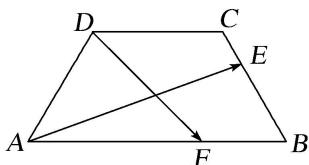

# 专题三 平面向量的平行与垂直

# 1. 平面向量平行(共线)的充要条件的两种形式

(1)平面向量平行(共线)充要条件的非坐标形式： $a \parallel b (b \neq 0) \Leftrightarrow a = \lambda b$ .  
(2)平面向量平行充要条件的坐标形式：若 $a=(x_{1}, y_{1})$ ， $b=(x_{2}, y_{2})$ ，则 $a \parallel b \Leftrightarrow x_{1}y_{2} - x_{2}y_{1} = 0$ ;

至于使用哪种形式，应视题目的具体条件而定，一般情况涉及坐标的用(2). 这是代数运算，用它解决平面向量平行(共线)问题的优点在于不需要引入参数“ $\lambda$ ”，从而减少了未知数的个数，而且它使问题的解决具有代数化的特点和程序化的特征．当 $x_{2}y_{2} \neq 0$ 时， $a // b \Leftrightarrow \frac{x_1}{x_2} = \frac{y_1}{y_2}$ ，即两个向量的相应坐标成比例，这种形式不易出现搭配错误．公式 $x_{1}y_{2} - x_{2}y_{1} = 0$ 无条件 $x_{2}y_{2} \neq 0$ 的限制，便于记忆；公式 $\frac{x_1}{x_2} = \frac{y_1}{y_2}$ 有条件 $x_{2}y_{2} \neq 0$ 的限制，但不易出错．所以我们可以记比例式，但在解题时改写成乘积的形式．乘积形式可总结为：“相异坐标的乘积的差为0”.

# 2. 三点共线的充要条件的三种形式

(1)A, P, B 三点共线 $\Leftrightarrow \overrightarrow{AP} = \lambda \overrightarrow{AB}$ ( $\lambda \neq 0$ )   
(2) $A, P, B$ 三点共线 $\Leftrightarrow \overrightarrow{OP} = (1 - t) \cdot \overrightarrow{OA} + t\overrightarrow{OB}$ ( $O$ 为平面内异于 $A, P, B$ 的任一点， $t \in \mathbf{R}$ )  
(3) $A, P, B$ 三点共线 $\Leftrightarrow \overrightarrow{OP} = x\overrightarrow{OA} + y\overrightarrow{OB}$ ( $O$ 为平面内异于 $A, P, B$ 的任一点， $x \in \mathbf{R}, y \in \mathbf{R}, x + y = 1$ ).

# 3. 非零向量垂直的充要条件的两种形式

(1)平面向量垂直的非坐标形式: $a \perp b \Leftrightarrow a \cdot b = 0$ .   
(2)平面向量垂直的坐标形式：若 $a=(x_{1}, y_{1})$ ， $b=(x_{2}, y_{2})$ ，则 $a \perp b \Leftrightarrow x_{1}x_{2} + y_{1}y_{2} = 0$ ;

至于使用哪种形式, 应视题目的具体条件而定, 数量积的运算 $a \cdot b = 0 \Leftrightarrow a \perp b$ 中, 是对非零向量而言的, 若 $a = 0$ , 虽然有 $a \cdot b = 0$ , 但不能说 $a \perp b$ . 一般情况涉及坐标的用(2). 坐标形式可总结为: “相应坐标的乘积的和为 0”.

# 考点一 平面向量的平行

# 【方法总结】

两平面向量平行的充要条件既可以判定两向量平行，也可以由平行求参数。当然也可解决三点共线的问题。高考试题中一般是考查已知两向量平行或三点共线求参数，并且以给出向量的坐标为主。解决此类问题的方法是借助两平面向量平行的充要条件列出方程(组)，求出参数的值。注意方程思想和待定系数法的运用。

# 【例题选讲】

[例 1] (1) 设 D, E, F 分别是 $\triangle ABC$ 的三边 BC, CA, AB 上的点，且 $\overrightarrow{DC}=2\overrightarrow{BD}$ , $\overrightarrow{CE}=2\overrightarrow{EA}$ , $\overrightarrow{AF}=2\overrightarrow{BF}$ ，则 $\overrightarrow{AD}+\overrightarrow{BE}+\overrightarrow{CF}$ 与 $\overrightarrow{BC}()$

A. 反向平行

B. 同向平行

C. 互相垂直

D. 既不平行也不垂直

答案 A 解析 由题意得 $\overrightarrow{AD} = \overrightarrow{AB} +\overrightarrow{BD} = \overrightarrow{AB} +\frac{1}{3}\overrightarrow{BC}$ ， $\overrightarrow{BE} = \overrightarrow{BA} +\overrightarrow{AE} = \overrightarrow{BA} +\frac{1}{3}\overrightarrow{AC}$ ， $\overrightarrow{CF} = \overrightarrow{CB} +\overrightarrow{BF}$ $= \overrightarrow{CB} +\frac{1}{3}\overrightarrow{BA}$ ，因此 $\overrightarrow{AD} +\overrightarrow{BE} +\overrightarrow{CF} = \overrightarrow{CB} +\frac{1}{3} (\overrightarrow{BC} +\overrightarrow{AC} -\overrightarrow{AB}) = \overrightarrow{CB} +\frac{2}{3}\overrightarrow{BC} = -\frac{1}{3}\overrightarrow{BC}$ ，故 $\overrightarrow{AD} +\overrightarrow{BE}+$ $\overline{CF}$ 与 $\overline{BC}$ 反向平行.

(2)已知向量 $m=(1,7)$ 与向量 $n=(k,k+18)$ 平行，则 k 的值为()

A.-6

B. 3

C. 4

D. 6

答案 B 解析 因为 $m \parallel n$ ，所以 $7k = k + 18$ ，解得 $k = 3$ 。故选 B.

(3)(2018·全国III)已知向量 $a=(1,2)$ ， $b=(2,-2)$ ， $c=(1,\lambda)$ 。若 $c\parallel(2a+b)$ ，则 $\lambda=$ \_\_\_\_.

答案 $\frac{1}{2}$ 解析 $2a+b=(4,2)$ ，因为 $c=(1,\lambda)$ ，且 $c\parallel(2a+b)$ ，所以 $1\times2=4\lambda$ ，即 $\lambda=\frac{1}{2}$ .

(4)已知向量 $\overrightarrow{AB}=a+3b,\quad\overrightarrow{BC}=5a+3b,\quad\overrightarrow{CD}=-3a+3b$ ，则()

A. $A, B, C$ 三点共线

B. $A, B, D$ 三点共线

C. $A, C, D$ 三点共线

D. $B, C, D$ 三点共线

答案 B 解析 $\because\overrightarrow{BD}=\overrightarrow{BC}+\overrightarrow{CD}=2a+6b=2(a+3b)=2\overrightarrow{AB},\therefore\overrightarrow{BD},\overrightarrow{AB}$ 共线，又有公共点 B， $\therefore A, B,D$ 三点共线．故选 B.

(5)若三点 $A(1, -5)$ , $B(a, -2)$ , $C(-2, -1)$ 共线, 则实数 $a$ 的值为 \_\_\_\_.

答案 $-\frac{5}{4}$ 解析 $\overrightarrow{AB}=(a-1,3)$ ， $\overrightarrow{AC}=(-3,4)$ ，根据题意 $\overrightarrow{AB}//\overrightarrow{AC}$ ， $\therefore4(a-1)-3\times(-3)=0$ ，即 4a=-5， $\therefore a=-\frac{5}{4}$ .

(6)已知向量 $\boldsymbol{a}=(1,1)$ ，点 $A(3,0)$ ，点 B 为直线 y=2x 上的一个动点。若 $\overrightarrow{AB} \parallel \boldsymbol{a}$ ，则点 B 的坐标为 \_\_\_\_.

答案 $(-3, -6)$ 解析 设 $B(x, 2x)$ ，则 $\overrightarrow{AB} = (x - 3, 2x)$ 。∵ $\overrightarrow{AB} // a$ ，∴ x - 3 - 2x = 0，解得 x = -3，∴ $B(-3, -6)$ .

# 【对点训练】

1. 已知向量 $a = (m, 4)$ , $b = (3, -2)$ , 且 $a \parallel b$ , 则 $m =$ \_\_\_\_.

1. 答案 6 解析 $\because a = (m, 4)$ , $b = (3, -2)$ , $a // b$ , $\therefore -2m - 4 \times 3 = 0$ , $\therefore m = -6$ .

2. 已知向量 $a = (1, 2)$ , $b = (2, -2)$ , $c = (\lambda, -1)$ , 若 $c // (2a + b)$ , 则 $\lambda$ 等于( )

A. -2

B. -1

C. $-\frac{1}{2}$

D. $\frac{1}{2}$

2. 答案 A 解析 $\because a = (1, 2)$ , $b = (2, -2)$ , $\therefore 2a + b = (4, 2)$ , 又 $c = (\lambda, -1)$ , $c // (2a + b)$ , $\therefore 2\lambda + 4 = 0$ , 解得 $\lambda = -2$ , 故选 A.

3. 已知向量 $a = (3, 1)$ , $b = (1, 3)$ , $c = (k, 7)$ , 若 $(a - c) // b$ , 则 $k =$ \_\_\_\_.

3. 答案 5 解析 因为 $a = (3, 1)$ , $b = (1, 3)$ , $c = (k, 7)$ , 所以 $a - c = (3 - k, -6)$ . 因为 $(a - c) // b$ , 所以 $1 \times (-6) = 3 \times (3 - k)$ , 解得 $k = 5$ .

4. 已知向量 $a=(\sqrt{3},1)$ ， $b=(0,-1)$ ， $c=(k,\sqrt{3})$ ，若 a-2b 与 c 共线，则 k= \_\_\_\_.

4. 答案 1 解析 $\because a - 2b = (\sqrt{3}, 3)$ ，且 $a - 2b // c$ ， $\therefore \sqrt{3} \times \sqrt{3} - 3k = 0$ ，解得 $k = 1$ .

5. 已知向量 $a=(1,3)$ ， $b=(-2,k)$ ，且 $(a+2b)\parallel(3a-b)$ ，则实数 $k=(\quad)$

A. 4

B. -5

C. 6

D. -6

5. 答案 D 解析 $a + 2b = (-3, 3 + 2k), 3a - b = (5, 9 - k)$ ，由题意可得 $-3(9 - k) = 5(3 + 2k)$ ，解得 $k = -6$ 。故选 D.

6. 已知向量 $\boldsymbol{a}=(\lambda+1,1)$ ， $\boldsymbol{b}=(\lambda+2,2)$ ，若 $(\boldsymbol{a}+\boldsymbol{b})\parallel(\boldsymbol{a}-\boldsymbol{b})$ ，则 $\lambda=$ \_\_\_\_.

6. 答案 0 解析 因为 $a + b = (2\lambda + 3, 3)$ , $a - b = (-1, -1)$ , 且 $(a + b) // (a - b)$ , 所以 $\frac{2\lambda + 3}{-1} = \frac{3}{-1}$ , 所以 $\lambda = 0$ .

7. 已知向量 $a = (2, 4)$ , $b = (-1, 1)$ , $c = (2, 3)$ , 若 $a + \lambda b$ 与 $c$ 共线, 则实数 $\lambda = (\quad)$

A. $\frac{2}{5}$

B. $-\frac{2}{5}$

C. $\frac{3}{5}$

D. $-\frac{3}{5}$

7. 答案 B 解析 解法一: $a + \lambda b = (2 - \lambda, 4 + \lambda), c = (2, 3)$ , 因为 $a + \lambda b$ 与 $c$ 共线, 所以必定存在唯一

实数 $\mu$ ，使得 $a + \lambda b = \mu c$ ，所以 $\left\{ \begin{array}{l}2 - \lambda = 2\mu ,\\ 4 + \lambda = 3\mu , \end{array} \right.$ 解得 $\left\{ \begin{array}{l}\mu = \frac{6}{5},\\ \lambda = -\frac{2}{5}. \end{array} \right.$

解法二： $a+\lambda b=(2-\lambda,4+\lambda)$ ， $c=(2,3)$ ，由 $a+\lambda b$ 与c共线可知 $3(2-\lambda)=2(4+\lambda)$ ，得 $\lambda=-\frac{2}{5}$ .

8. 已知向量 $a = (2, 3)$ , $b = (-1, 2)$ , 若 $ma + nb$ 与 $a - 3b$ 共线, 则 $\frac{m}{n} =$ \_\_\_\_.

8. 答案 $-\frac{1}{3}$ 解析 由 $\frac{2}{-1}\neq\frac{3}{2}$ ，所以 a 与 b 不共线，又 $a-3b=(2,3)-3(-1,2)=(5,-3)\neq0$ 。那么当 $ma+nb$ 与 a-3b 共线时，有 $\frac{m}{1}=\frac{n}{-3}$ ，即得 $\frac{m}{n}=-\frac{1}{3}$ 。

9. 在平面直角坐标系 $xOy$ 中，已知点 $O(0, 0)$ ， $A(0, 1)$ ， $B(1, -2)$ ， $C(m, 0)$ 。若 $\overrightarrow{OB} // \overrightarrow{AC}$ ，则实数 $m$ 的值为（）

A. -2

B. $-\frac{1}{2}$

C. $\frac{1}{2}$

D. 2

9. 答案 C 解析 因为 $\overrightarrow{OB}=(1,-2)$ , $\overrightarrow{AC}=(m,-1)$ . 又因为 $\overrightarrow{OB} \parallel \overrightarrow{AC}$ ，所以 $\frac{m}{1}=\frac{-1}{-2}$ , $m=\frac{1}{2}$ . 故选 C.

10. 已知 $A(1, 1)$ , $B(3, -1)$ , $C(a, b)$ , 若 $A, B, C$ 三点共线, 则 $a, b$ 的关系式为 \_\_\_\_.

10. 答案 $a + b = 2$ 解析 由已知得 $\overrightarrow{AB} = (2, -2)$ , $\overrightarrow{AC} = (a - 1, b - 1)$ , $\because A, B, C$ 三点共线, $\therefore \overrightarrow{AB} \parallel \overrightarrow{AC}$ . $\therefore 2(b - 1) + 2(a - 1) = 0$ , 即 $a + b = 2$ .

11. 已知点 $A(0, 1)$ , $B(3, 2)$ , $C(2, k)$ , 且 $A$ , $B$ , $C$ 三点共线, 则向量 $\overrightarrow{AC} = (\quad)$

A. $\left(2,\frac{2}{3}\right)$

B. $\left(2,\frac{5}{3}\right)$

C. $\left(\frac{2}{3},\ 2\right)$

D. $\left(\frac{5}{3},2\right)$

11. 答案 A 解析 $\overrightarrow{AB}=(3,1)$ , $\overrightarrow{AC}=(2,k-1)$ ，因为 A, B, C 三点共线，所以可设 $\overrightarrow{AB}=\lambda\overrightarrow{AC}$ ，即 $(3,1)=\lambda(2,k-1)$ ，所以 $2\lambda=3$ ，即 $\lambda=\frac{3}{2}$ ，所以 $\overrightarrow{AC}=\frac{1}{\lambda}\overrightarrow{AB}=\left(2,\frac{2}{3}\right)$ .

12. 已知 $e_1$ , $e_2$ 是不共线向量, $a = me_1 + 2e_2$ , $b = ne_1 - e_2$ , 且 $mn \neq 0$ . 若 $a // b$ , 则 $\frac{m}{n} =$ \_\_\_\_.

12. 答案 -2 解析 $\because a \parallel b, \therefore m \times (-1) = 2 \times n, \therefore \frac{m}{n} = -2.$

13. 设向量 a, b 不平行，向量 $\lambda a + b$ 与 $a + 2b$ 平行，则实数 $\lambda =$ \_\_\_\_.

13. 答案 $\frac{1}{2}$ 解析 $\because \lambda a + b$ 与 $a + 2b$ 平行， $\therefore \lambda a + b = t(a + 2b)$ ，即 $\lambda a + b = ta + 2tb$ ， $\therefore \left\{ \begin{array}{l} \lambda = t, \\ 1 = 2t, \end{array} \right.$ 解得 $\left\{ \begin{array}{l} \lambda = \frac{1}{2}, \\ t = \frac{1}{2}. \end{array} \right.$

14. 已知点 $A(4, 0)$ , $B(4, 4)$ , $C(2, 6)$ , 则 $AC$ 与 $OB$ 的交点 $P$ 的坐标为 \_\_\_\_.

14. 答案 (3, 3) 解析 法一 由 $O, P, B$ 三点共线，可设 $\overrightarrow{OP} = \lambda \overrightarrow{OB} = (4\lambda, 4\lambda)$ ，则 $\overrightarrow{AP} = \overrightarrow{OP} - \overrightarrow{OA} = (4\lambda - 4, 4\lambda)$ . 又 $\overrightarrow{AC} = \overrightarrow{OC} - \overrightarrow{OA} = (-2, 6)$ ，由 $\overrightarrow{AP}$ 与 $\overrightarrow{AC}$ 共线，得 $(4\lambda - 4) \times 6 - 4\lambda \times (-2) = 0$ ，解得 $\lambda = \frac{3}{4}$ ，所以 $\overrightarrow{OP} = \frac{3}{4}\overrightarrow{OB} = (3, 3)$ ，所以点 $P$ 的坐标为 $(3, 3)$ .

法二 设点 $P(x, y)$ ，则 $\overrightarrow{OP} = (x, y)$ ，因为 $\overrightarrow{OB} = (4, 4)$ ，且 $\overrightarrow{OP}$ 与 $\overrightarrow{OB}$ 共线，所以 $\frac{x}{4} = \frac{y}{4}$ ，即 x = y。又 $\overrightarrow{AP} = (x - 4, y)$ ， $\overrightarrow{AC} = (-2, 6)$ ，且 $\overrightarrow{AP}$ 与 $\overrightarrow{AC}$ 共线，所以 $(x - 4) \times 6 - y \times (-2) = 0$ ，解得 x = y = 3，所以点 P 的坐标为 $(3, 3)$ 。

15. 已知平面向量 a, b 满足 $|a|=1$ , $b=(1,1)$ ，且 $a \parallel b$ ，则向量 a 的坐标是 \_\_\_\_.

15. 答案 $\left(\frac{\sqrt{2}}{2}, \frac{\sqrt{2}}{2}\right)$ 或 $\left(-\frac{\sqrt{2}}{2}, -\frac{\sqrt{2}}{2}\right)$ 解析 $a=(x, y)$ ，因为平面向量 a，b 满足 $|a|=1, b=(1, 1)$ ，且 $a \parallel b$ ，所以 $\sqrt{x^{2}+y^{2}}=1$ ，且 x-y=0，解得 $x=y=\pm\frac{\sqrt{2}}{2}$ 。所以 $a=\left(\frac{\sqrt{2}}{2}, \frac{\sqrt{2}}{2}\right)$ 或 $\left(-\frac{\sqrt{2}}{2}, -\frac{\sqrt{2}}{2}\right)$ 。

16. 已知点 $A(1, 3)$ , $B(4, -1)$ , 则与 $\overrightarrow{AB}$ 同方向的单位向量是 \_\_\_\_.

16. 答案 $\left(\frac{3}{5}, -\frac{4}{5}\right)$ 解析 $\overrightarrow{AB} = \overrightarrow{OB} - \overrightarrow{OA} = (4, -1) - (1, 3) = (3, -4)$ ，∴与 $\overrightarrow{AB}$ 同方向的单位向量为 $\frac{\overrightarrow{AB}}{|\overrightarrow{AB}|} = \left(\frac{3}{5}, -\frac{4}{5}\right)$

17. 已知 $\overrightarrow{AB}=a+2b,\quad\overrightarrow{BC}=-5a+6b,\quad\overrightarrow{CD}=7a-2b$ ，则下列一定共线的三点是()

A. $A, B, C$

B. $A, B, D$

C. B, C, D

D. A, C, D

17. 答案 B 解析 因为 $\overrightarrow{AD} = \overrightarrow{AB} + \overrightarrow{BC} + \overrightarrow{CD} = 3a + 6b = 3(a + 2b) = 3\overrightarrow{AB}$ ，又 $\overrightarrow{AB}$ ， $\overrightarrow{AD}$ 有公共点 A，所以 A, B, D 三点共线.

18. 已知向量 $\overrightarrow{OA} = (k, 12)$ , $\overrightarrow{OB} = (4, 5)$ , $\overrightarrow{OC} = (-k, 10)$ , 且 $A, B, C$ 三点共线, 则 $k$ 的值是( )

A. $-\frac{2}{3}$

B. $\frac{4}{3}$

C. $\frac{1}{2}$

D. $\frac{1}{3}$

18. 答案 A 解析 $\overrightarrow{AB} = \overrightarrow{OB} - \overrightarrow{OA} = (4 - k, -7)$ , $\overrightarrow{AC} = \overrightarrow{OC} - \overrightarrow{OA} = (-2k, -2)$ . 因为 $A, B, C$ 三点共线, 所以 $\overrightarrow{AB}$ , $\overrightarrow{AC}$ 共线, 所以 $-2 \times (4 - k) = -7 \times (-2k)$ , 解得 $k = -\frac{2}{3}$ .

19. 设 a, b 不共线， $\overrightarrow{AB}=2a+pb,\quad\overrightarrow{BC}=a+b,\quad\overrightarrow{CD}=a-2b$ ，若 A, B, D 三点共线，则实数 p 的值为()

A.-2

B.-1

C. 1

D. 2

19. 答案 B 解析 $\because \overrightarrow{BC} = a + b, \overrightarrow{CD} = a - 2b, \therefore \overrightarrow{BD} = \overrightarrow{BC} + \overrightarrow{CD} = 2a - b.$ 又 $\because A, B, D$ 三点共线， $\therefore \overrightarrow{AB}, \overrightarrow{BD}$ 共线．设 $\overrightarrow{AB} = \lambda \overrightarrow{BD}, \therefore 2a + pb = \lambda (2a - b), \because a, b$ 不共线， $\therefore 2 = 2\lambda, p = -\lambda, \therefore \lambda = 1, p = -1.$

20. 设向量 $\overrightarrow{OA}=(1,-2)$ ， $\overrightarrow{OB}=(2^{m},-1)$ ， $\overrightarrow{OC}=(-2^{n},0)$ ， $m,n\in R$ ，O 为坐标原点，若 A, B, C 三点共线，则 $m+n$ 的最大值为()

A.-3

B.-2

C. 2

D. 3

20. 答案 A 解析 由题意易知， $\overrightarrow{AB} // \overrightarrow{AC}$ ，其中 $\overrightarrow{AB} = \overrightarrow{OB} - \overrightarrow{OA} = (2^m - 1, 1)$ ， $\overrightarrow{AC} = \overrightarrow{OC} - \overrightarrow{OA} = (-2^n - 1, 2)$ ，所以 $(2^m - 1) \times 2 = 1 \times (-2^n - 1)$ ，得： $2^{m+1} + 2^n = 1$ 。 $2^{m+1} + 2^n \geq 2\sqrt{2^{m+n+1}}$ ，所以 $2^{m+n+1} \leq 2^{-2}$ ，即 $m + n \leq -3$ 。

# 考点二 两个非零向量的垂直

# 【方法总结】

两平面向量垂直的充要条件既可以判定两向量垂直，也可以由垂直求参数。高考试题中一般是考查已知两向量垂直求参数，如果已知向量的坐标，根据两平面向量垂直的充要条件(2)，列出相应的关系式，进而求解参数。如果未知向量的坐标，则可通过向量加法(减法)的三角形法则转化为已知模和夹角的向量的数量，根据两平面向量垂直的充要条件(1)，列出相应的关系式，进而求解参数。如已知图形为矩形、正方形、直角梯形、等边三角形、等腰三角形或直角三角形时，则可建立平面直角坐标系求出未知向量的坐标从而把问题转化为已知向量的坐标求参数的问题。注意方程思想和等价转化思想的运用。

# 【例题选讲】

[例 1](1) $\triangle ABC$ 是边长为 2 的等边三角形，已知向量 a, b 满足 $\overrightarrow{AB}=2a,\quad\overrightarrow{AC}=2a+b$ ，则下列结论正确的是()

A. $|\pmb {b}| = 1$

B. $a \perp b$

C. $a \cdot b = 1$

D. $(4a + b) \perp \overrightarrow{BC}$

答案 D 解析 在 $\triangle ABC$ 中，由 $\overrightarrow{BC} = \overrightarrow{AC} - \overrightarrow{AB} = 2a + b - 2a = b$ ，得 $|b| = 2$ ，A错误．又 $\overrightarrow{AB} = 2a$ 且 $|\overrightarrow{AB}| = 2$ ，所以 $|a| = 1$ ，所以 $a \cdot b = |a||b|\cos 120^\circ = -1$ ，B，C错误．所以 $(4a + b) \cdot \overrightarrow{BC} = (4a + b) \cdot b = 4a \cdot b + |b|^2 = 4 \times (-1) + 4 = 0$ ，所以 $(4a + b) \perp \overrightarrow{BC}$ ，D正确，故选D.

(2)(2017·全国 I)已知向量 $a = (-1, 2)$ , $b = (m, 1)$ . 若向量 $a + b$ 与 $a$ 垂直, 则 $m = \_$ .

答案 7 解析 因为 $a+b=(m-1,3)$ ， $a+b$ 与 a 垂直，所以 $(m-1)\times(-1)+3\times2=0$ ，解得 m=7.

(3)(2018·北京)设向量 $a=(1,0)$ ， $b=(-1,m)$ 。若 $a\perp(ma-b)$ ，则 m= \_\_\_\_.

答案 -1 解析 由题意得, $ma - b = (m + 1, -m)$ , 根据向量垂直的充要条件可得 $1 \times (m + 1) + 0 \times (-m) = 0$ , 所以 $m = -1$ .

(4)(2020·全国II)已知单位向量 a, b 的夹角为 $45^{\circ}$ ，ka-b 与 a 垂直，则 k= \_\_\_\_.

答案 $\frac{\sqrt{2}}{2}$ 解析 由题意知 $(ka - b)\cdot a = 0$ ，即 $ka^2 -b\cdot a = 0$ 。因为 $\pmb{a},\pmb{b}$ 为单位向量，且夹角为 $45^{\circ}$ ，所以 $k\times 1^{2} - 1\times 1\times \frac{\sqrt{2}}{2} = 0$ ，解得 $k = \frac{\sqrt{2}}{2}$

(5)(2016·山东)已知非零向量 m，n 满足 $4|m|=3|n|$ ， $\cos<m$ ， $n>=\frac{1}{3}$ ，若 $n\perp(tm+n)$ ，则实数 t 的值为（）

A. 4

B. -4

C. $\frac{9}{4}$

D. $-\frac{9}{4}$

答案 B 解析 $\because n \perp (t m + n), \therefore n \cdot (t m + n) = 0$ ，即 $t m \cdot n + |n|^2 = 0, \therefore t|m||n|\cos < m, n> + |n|^2 = 0$ . 又 $4|m| = 3|n|$ ， $\therefore t \times \frac{3}{4} |n|^2 \times \frac{1}{3} + |n|^2 = 0$ ，解得 $t = -4$ 。故选 B.

(6)如图，在等腰梯形ABCD中， $AB = 4$ ， $BC = CD = 2$ ，若 $E$ ， $F$ 分别是边BC， $AB$ 上的点，且满足 $\frac{BE}{BC}$ $= \frac{AF}{AB} = \lambda$ ，则当 $\overrightarrow{AE}\cdot \overrightarrow{DF} = 0$ 时， $\lambda$ 的值所在的区间是（）

text_image

D
C
E
A
F
B

A. $\left(\frac{1}{8},\frac{1}{4}\right)$

B. $\left(\frac{1}{4},\frac{3}{8}\right)$

C. $\left(\frac{3}{8},\frac{1}{2}\right)$

D. $\left(\frac{1}{2},\frac{5}{8}\right)$

答案 B 解析 在等腰梯形 ABCD 中，AB=4，BC=CD=2，可得 $\langle\overrightarrow{AD},\overrightarrow{BC}\rangle=60^{\circ}$ ，所以 $\langle\overrightarrow{AB},\overrightarrow{AD}\rangle=60^{\circ}$ ， $\langle\overrightarrow{AB},\overrightarrow{BC}\rangle=120^{\circ}$ ，所以 $\overrightarrow{AB}\cdot\overrightarrow{AD}=4\times2\times\frac{1}{2}=4$ ， $\overrightarrow{AB}\cdot\overrightarrow{BC}=4\times2\times\left(-\frac{1}{2}\right)=-4$ ， $\overrightarrow{AD}\cdot\overrightarrow{BC}=2\times2\times\frac{1}{2}=2$ ，又 $\frac{BE}{BC}=\frac{AF}{AB}=\lambda$ ，所以 $\overrightarrow{BE}=\lambda\overrightarrow{BC},\overrightarrow{AF}=\lambda\overrightarrow{AB}$ ，则 $\overrightarrow{AE}=\overrightarrow{AB}+\overrightarrow{BE}=\overrightarrow{AB}+\lambda\overrightarrow{BC},\overrightarrow{DF}=\overrightarrow{AF}-\overrightarrow{AD}=\lambda\overrightarrow{AB}-\overrightarrow{AD}$ ，所以 $\overrightarrow{AE}\cdot\overrightarrow{DF}=(\overrightarrow{AB}+\lambda\overrightarrow{BC})\cdot(\lambda\overrightarrow{AB}-\overrightarrow{AD})=\lambda\overrightarrow{AB^{2}}-\overrightarrow{AB}\cdot\overrightarrow{AD}+\lambda^{2}\overrightarrow{AB}\cdot\overrightarrow{BC}-\lambda\overrightarrow{AD}\cdot\overrightarrow{BC}=0$ ，即 $2\lambda^{2}-7\lambda+2=0$ ，解得 $\lambda=\frac{7+\sqrt{33}}{4}$ （舍去）或 $\lambda=\frac{7-\sqrt{33}}{4}\in\left(\frac{1}{4},\frac{3}{8}\right)$ .

# 【对点训练】

1. 已知平面向量 $a = (-2, m)$ , $b = (1, \sqrt{3})$ , 且 $(a - b) \perp b$ , 则实数 $m$ 的值为( )

A. $-2\sqrt{3}$

B. $2 \sqrt{3}$

C. $4 \sqrt{3}$

D. $6 \sqrt{3}$

1. 答案 B 解析 因为 $a = (-2, m)$ , $b = (1, \sqrt{3})$ , 所以 $a - b = (-2, m) - (1, \sqrt{3}) = (-3, m - \sqrt{3})$ . 由 $(a - b) \perp b$ , 得 $(a - b) \cdot b = 0$ , 即 $(-3, m - \sqrt{3}) \cdot (1, \sqrt{3}) = -3 + \sqrt{3}m - 3 = \sqrt{3}m - 6 = 0$ , 解得 $m = 2\sqrt{3}$ , 故选 B.

2. 已知向量 $a = (1, m)$ , $b = (3, -2)$ , 且 $(a + b) \perp b$ , 则 $m = (\quad)$

A.-8

B.-6

C. 6

D. 8

2. 答案 D 解析 法一：因为 $a=(1, m)$ ， $b=(3, -2)$ ，所以 $a+b=(4, m-2)$ 。因为 $(a+b)\perp b$ ，所以 $(a+b)\cdot b=0$ ，所以 $12-2(m-2)=0$ ，解得 m=8。

法二：因为 $(a + b) \perp b$ ，所以 $(a + b) \cdot b = 0$ ，即 $a \cdot b + b^2 = 3 - 2m + 3^2 + (-2)^2 = 16 - 2m = 0$ ，解得 $m = 8$

3. 设向量 $a = (1, m)$ , $b = (m - 1, 2)$ , 且 $a \neq b$ , 若 $(a - b) \perp a$ , 则实数 $m = (\quad)$

A. $\frac{1}{2}$

B. $\frac{1}{3}$

C. 1

D. 2

3. 答案 C 解析 因为 $a = (1, m)$ , $b = (m - 1, 2)$ , 且 $a \neq b$ , 所以 $a - b = (1, m) - (m - 1, 2) = (2 - m, m - 2)$ , 又 $(a - b) \perp a$ , 所以 $(a - b) \cdot a = 0$ , 可得 $(2 - m) \times 1 + m(m - 2) = 0$ , 解得 $m = 1$ 或 $m = 2$ . 当 $m = 2$ 时, $a = b$ , 不符合题意, 舍去, 故选 C.

4. 已知向量 $a = (\sqrt{3}, 1)$ , $b = (0, 1)$ , $c = (k, \sqrt{3})$ , 若 $a + 2b$ 与 $c$ 垂直, 则 $k = (\quad)$

A.-3

B.-2

C. 1

D.-1

4. 答案 A 解析 因为 $a + 2b$ 与 $c$ 垂直，所以 $(a + 2b) \cdot c = 0$ ，即 $a \cdot c + 2b \cdot c = 0$ ，所以 $\sqrt{3} k + \sqrt{3} + 2\sqrt{3} = 0$ 解得 $k = -3$ .

5. 已知向量 $a = (k, 3)$ , $b = (1, 4)$ , $c = (2, 1)$ , 且 $(2a - 3b) \perp c$ , 则实数 $k = (\quad)$

A. $-\frac{9}{2}$

B. 0

C. 3

D. $\frac{15}{2}$

5. 答案 C 解析 $\because(2a-3b)\perp c,\therefore(2a-3b)\cdot c=0.\because a=(k,3),b=(1,4),c=(2,1),\therefore2a-3b=(2k-3,$

-6). $\therefore (2k - 3, - 6)\cdot (2,1) = 0$ ，即 $(2k - 3)\times 2 - 6 = 0$ . $\therefore k = 3$

6. 已知向量 $a = (\sqrt{3}, 1)$ , $b = (0, 1)$ , $c = (k, \sqrt{3})$ , 若 $a + 2b$ 与 $c$ 垂直, 则 $k = (\quad)$

A.-3

B.-2

C. 1

D. -1

6. 答案 A 解析 因为 $a + 2b$ 与 $c$ 垂直，所以 $(a + 2b) \cdot c = 0$ ，即 $a \cdot c + 2b \cdot c = 0$ ，所以 $\sqrt{3} k + \sqrt{3} + 2\sqrt{3} = 0$ 解得 $k = -3$ .

7. 已知向量 $a = (1, 2)$ , $b = (1, 0)$ , $c = (3, 4)$ , 若 $\lambda$ 为实数, $(b + \lambda a) \perp c$ , 则 $\lambda$ 的值为( )

A. $-\frac{3}{11}$

B. $-\frac{11}{3}$

C. $\frac{1}{2}$

D. $\frac{3}{5}$

7. 答案 A 解析 $b + \lambda a = (1, 0) + \lambda(1, 2) = (1 + \lambda, 2\lambda)$ ，又 $c = (3, 4)$ ，且 $(b + \lambda a) \perp c$ ，所以 $(b + \lambda a) \cdot c = 0$ ，即 $3(1 + \lambda) + 2\lambda \times 4 = 3 + 3\lambda + 8\lambda = 0$ ，解得 $\lambda = -\frac{3}{11}$ .

8. 在 $\triangle ABC$ 中, 三个顶点的坐标分别为 $A(3, t)$ , $B(t, -1)$ , $C(-3, -1)$ , 若 $\triangle ABC$ 是以 $B$ 为直角顶点的直角三角形, 则 $t=$ \_\_\_\_.

8. 答案 3 解析 由已知，得 $\overrightarrow{BA} \cdot \overrightarrow{BC} = 0$ ，则 $(3 - t, t + 1) \cdot (-3 - t, 0) = 0$ ， $\therefore (3 - t)(-3 - t) = 0$ ，解得 $t = 3$ 或 $t = -3$ ，当 $t = -3$ 时，点 $B$ 与点 $C$ 重合，舍去．故 $t = 3$ ．

9. 已知 a 与 b 为两个不共线的单位向量，k 为实数，若向量 $a + b$ 与向量 ka - b 垂直，则 k = \_\_\_\_.

9. 答案 1 解析 $\because a$ 与 $b$ 为两个不共线的单位向量, $\therefore |a| = |b| = 1$ , 又 $a + b$ 与 $ka - b$ 垂直, $\therefore (a + b) \cdot (ka - b) = 0$ , 即 $ka^2 + ka \cdot b - a \cdot b - b^2 = 0$ , $\therefore k - 1 + ka \cdot b - a \cdot b = 0$ , 即 $k - 1 + k\cos \theta - \cos \theta = 0$ ( $\theta$ 为 $a$ 与 $b$ 的夹角), $\therefore (k - 1)(1 + \cos \theta) = 0$ . 又 $a$ 与 $b$ 不共线, $\therefore \cos \theta \neq -1$ , $\therefore k = 1$ .

10. (2013·全国 I) 已知两个单位向量 $a, b$ 的夹角为 $60^\circ$ , $c = ta + (1 - t)b$ , 若 $b \cdot c = 0$ , 则 $t = \_$ .

10. 答案 2 解析 因为向量 a, b 为单位向量，所以 $b^{2}=1$ ，又向量 a, b 的夹角为 $60^{\circ}$ ，所以 $a \cdot b = \frac{1}{2}$ ，由 $b \cdot c = 0$ 得 $b \cdot [ta + (1 - t)b] = 0$ ，即 $ta \cdot b + (1 - t)b^{2} = 0$ ，所以 $\frac{1}{2}t + (1 - t) = 0$ ，所以 t = 2。

11. 已知 $\triangle ABC$ 中， $\angle A = 120^{\circ}$ ，且 $AB = 3$ ， $AC = 4$ ，若 $\overrightarrow{AP} = \lambda \overrightarrow{AB} + \overrightarrow{AC}$ ，且 $\overrightarrow{AP} \perp \overrightarrow{BC}$ ，则实数 $\lambda$ 的值为（）

A. $\frac{22}{15}$

B. $\frac{10}{3}$

C. 6

D. $\frac{12}{7}$

11. 答案 A 解析 因为 $\overrightarrow{AP} = \lambda \overrightarrow{AB} + \overrightarrow{AC}$ , 且 $\overrightarrow{AP} \perp \overrightarrow{BC}$ , 所以有 $\overrightarrow{AP} \cdot \overrightarrow{BC} = (\lambda \overrightarrow{AB} + \overrightarrow{AC}) \cdot (\overrightarrow{AC} - \overrightarrow{AB}) = \lambda \overrightarrow{AB} \cdot \overrightarrow{AC} - \lambda \overrightarrow{AB}$

$^{2}+\overrightarrow{AC}^{2}-\overrightarrow{AB}\cdot\overrightarrow{AC}=(\lambda-1)\overrightarrow{AB}\cdot\overrightarrow{AC}-\lambda\overrightarrow{AB}^{2}+\overrightarrow{AC}^{2}=0$ ，整理可得 $(\lambda-1)\times3\times4\times\cos120^{\circ}-9\lambda+16=0$ ，解得 $\lambda=\frac{22}{15}$ .

