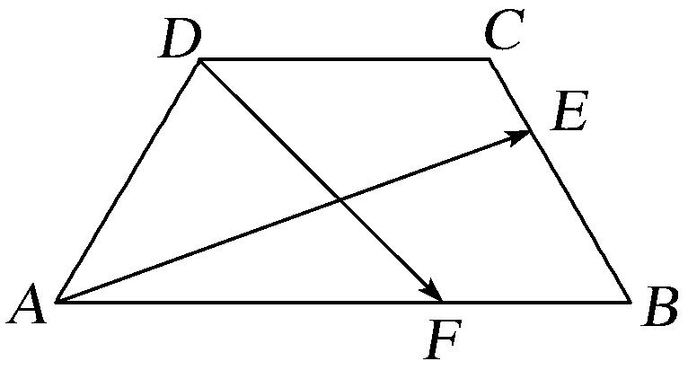

**专题三　平面向量的平行与垂直**

**1．平面向量平行(共线)的充要条件的两种形式**

(1)平面向量平行(共线)充要条件的非坐标形式：<em><strong>a</strong></em>∥<em><strong>b</strong></em>(<em><strong>b</strong></em>≠<strong>0</strong>)⇔<em><strong>a</strong></em>＝<em>λ<strong>b</strong></em>．

(2)平面向量平行充要条件的坐标形式：若<em><strong>a</strong></em>＝(<em>x</em>1，<em>y</em>1)，<em><strong>b</strong></em>＝(<em>x</em>2，<em>y</em>2)，则<em><strong>a</strong></em>∥<em><strong>b</strong></em>⇔<em>x</em>1<em>y</em>2－<em>x</em>2<em>y</em>1＝0；

至于使用哪种形式，应视题目的具体条件而定，一般情况涉及坐标的用(2)．这是代数运算，用它解决平面向量平行(共线)问题的优点在于不需要引入参数“λ”，从而减少了未知数的个数，而且它使问题的解决具有代数化的特点和程序化的特征．当<em>x</em>2<em>y</em>2≠0时，<em><strong>a</strong></em>∥<em><strong>b</strong></em>⇔＝，即两个向量的相应坐标成比例，这种形式不易出现搭配错误．公式<em>x</em>1<em>y</em>2－<em>x</em>2<em>y</em>1＝0无条件<em>x</em>2<em>y</em>2≠0的限制，便于记忆；公式＝有条件<em>x</em>2<em>y</em>2≠0的限制，但不易出错．所以我们可以记比例式，但在解题时改写成乘积的形式．乘积形式可总结为：“相异坐标的乘积的差为0”．

**2．三点共线的充要条件的三种形式**

(1)*A*，*P*，*B*三点共线⇔＝*λ* (*λ*≠0)

(2)<em>A</em>，<em>P</em>，<em>B</em>三点共线⇔＝(1－<em>t</em>)·＋<em>t</em>(<em>O</em>为平面内异于<em>A</em>，<em>P</em>，<em>B</em>的任一点，<em>t</em>∈<strong>R</strong>)

(3)<em>A</em>，<em>P</em>，<em>B</em>三点共线⇔＝<em>x</em>＋<em>y</em>(<em>O</em>为平面内异于<em>A</em>，<em>P</em>，<em>B</em>的任一点，<em>x</em>∈<strong>R</strong>，<em>y</em>∈<strong>R</strong>，<em>x</em>＋<em>y</em>＝1)．

**3．非零向量垂直的充要条件的两种形式**

(1)平面向量垂直的非坐标形式：***a***⊥***b***⇔ ***a***·***b***＝0．

(2)平面向量垂直的坐标形式：若<em><strong>a</strong></em>＝(<em>x</em>1，<em>y</em>1)，<em><strong>b</strong></em>＝(<em>x</em>2，<em>y</em>2)，则<em><strong>a</strong></em>⊥<em><strong>b</strong></em>⇔<em>x</em>1<em>x</em>2＋<em>y</em>1<em>y</em>2＝0；

至于使用哪种形式，应视题目的具体条件而定，数量积的运算<em><strong>a</strong></em>·<em><strong>b</strong></em>＝0⇔<em><strong>a</strong></em>⊥<em><strong>b</strong></em>中，是对非零向量而言的，若<em><strong>a</strong></em>＝<strong>0</strong>，虽然有<em><strong>a</strong></em>·<em><strong>b</strong></em>＝0，但不能说<em><strong>a</strong></em>⊥<em><strong>b</strong></em>．一般情况涉及坐标的用(2)．坐标形式可总结为：“相应坐标的乘积的和为0”．

**考点一　平面向量的平行**

【**方法总结**】

两平面向量平行的充要条件既可以判定两向量平行，也可以由平行求参数．当然也可解决三点共线的问题．高考试题中一般是考查已知两向量平行或三点共线求参数，并且以给出向量的坐标为主．解决此类问题的方法是借助两平面向量平行的充要条件列出方程(组)，求出参数的值．注意方程思想和待定系数法的运用．

**【例题选讲】**

<strong>[例1]</strong> (1)设<em>D</em>，<em>E</em>，<em>F</em>分别是△<em>ABC</em>的三边<em>BC</em>，<em>CA</em>，<em>AB</em>上的点，且＝2，＝2，＝2，则＋＋与(　　)

A．反向平行　　　　　B．同向平行　　　　　C．互相垂直　　　　　D．既不平行也不垂直

答案　A　解析　由题意得＝＋＝＋，＝＋＝＋，＝＋＝＋，因此＋＋＝＋(＋－)＝＋＝－，故＋＋与反向平行．

(2)已知向量<em><strong>m</strong></em>＝(1，7)与向量<em><strong>n</strong></em>＝(<em>k</em>，<em>k</em>＋18)平行，则<em>k</em>的值为(　　)

A．－6　　　　　　　　B．3　　　　　　　　C．4　　　　　　　　D．6

答案　B　解析　因为<em><strong>m</strong></em>∥<em><strong>n</strong></em>，所以7<em>k</em>＝<em>k</em>＋18，解得<em>k</em>＝3．故选B．

(3)(2018·全国Ⅲ)已知向量<em><strong>a</strong></em>＝(1，2)，<em><strong>b</strong></em>＝(2，－2)，<em><strong>c</strong></em>＝(1，<em>λ</em>)．若<em><strong>c</strong></em>∥(2<em><strong>a</strong></em>＋<em><strong>b</strong></em>)，则<em>λ</em>＝\_\_\_\_\_\_\_\_．

答案　　解析　2<em><strong>a</strong></em>＋<em><strong>b</strong></em>＝(4，2)，因为<em><strong>c</strong></em>＝(1，<em>λ</em>)，且<em><strong>c</strong></em>∥(2<em><strong>a</strong></em>＋<em><strong>b</strong></em>)，所以1×2＝4<em>λ</em>，即<em>λ</em>＝．

(4)已知向量＝***a***＋3***b***，＝5***a***＋3***b***，＝－3***a***＋3***b***，则(　　)

A．*A*，*B*，*C*三点共线 　　　　　　　　　　B．*A*，*B*，*D*三点共线

C．*A*，*C*，*D*三点共线　　　　　　　　　　D．*B*，*C*，*D*三点共线

答案　B　解析　∵＝＋＝2<em><strong>a</strong></em>＋6<em><strong>b</strong></em>＝2(<em><strong>a</strong></em>＋3<em><strong>b</strong></em>)＝2，∴，共线，又有公共点<em>B</em>，∴<em>A</em>，<em>B</em>，<em>D</em>三点共线．故选B．

(5)若三点*A*(1，－5)，*B*(*a*，－2)，*C*(－2，－1)共线，则实数*a*的值为\_\_\_\_\_\_\_\_．

答案　－　解析　＝(*a*－1，3)，＝(－3，4)，根据题意∥，∴4(*a*－1)－3×(－3)＝0，即4*a*＝－5，∴*a*＝－．

(6)已知向量<em><strong>a</strong></em>＝(1，1)，点<em>A</em>(3，0)，点<em>B</em>为直线<em>y</em>＝2<em>x</em>上的一个动点．若∥<em><strong>a</strong></em>，则点<em>B</em>的坐标为\_\_\_\_\_\_\_\_．

答案　(－3，－6)　解析　设<em>B</em>(<em>x，</em>2<em>x</em>)，则＝(<em>x</em>－3，2<em>x</em>)．∵∥<em><strong>a</strong></em>，∴<em>x</em>－3－2<em>x</em>＝0，解得<em>x</em>＝－3，∴<em>B</em>(－3，－6)．

【**对点训练**】

1．已知向量<em><strong>a</strong></em>＝(<em>m</em>，4)，<em><strong>b</strong></em>＝(3，－2)，且<em><strong>a</strong>∥<strong>b</strong></em>，则<em>m</em>＝\_\_\_\_\_\_\_\_．

1．答案　6　解析　∵<em><strong>a</strong></em>＝(<em>m，</em>4)，<em><strong>b</strong></em>＝(3，－2)，<em><strong>a</strong>∥<strong>b</strong></em>，∴－2<em>m</em>－4×3＝0，∴<em>m</em>＝－6．

2．已知向量<em><strong>a</strong></em>＝(1，2)，<em><strong>b</strong></em>＝(2，－2)，<em><strong>c</strong></em>＝(<em>λ</em>，－1)，若<em><strong>c</strong></em>∥(2<em><strong>a</strong></em>＋<em><strong>b</strong></em>)，则<em>λ</em>等于(　　)

A．－2　　　　　　　　B．－1　　　　　　　　C．－　　　　　　　　D．

2．答案　A　解析　∵<em><strong>a</strong></em>＝(1，2)，<em><strong>b</strong></em>＝(2，－2)，∴2<em><strong>a</strong></em>＋<em><strong>b</strong></em>＝(4，2)，又<em><strong>c</strong></em>＝(<em>λ</em>，－1)，<em><strong>c</strong></em>∥(2<em><strong>a</strong></em>＋<em><strong>b</strong></em>)，∴2<em>λ</em>＋4

＝0，解得*λ*＝－2，故选A．

3．已知向量<em><strong>a</strong></em>＝(3，1)，<em><strong>b</strong></em>＝(1，3)，<em><strong>c</strong></em>＝(<em>k，</em>7)，若(<em><strong>a</strong></em>－<em><strong>c</strong></em>)∥<em><strong>b</strong></em>，则<em>k</em>＝\_\_\_\_\_\_\_\_．

3．答案　5　解析　因为<em><strong>a</strong></em>＝(3<em><strong>，</strong></em>1)，<em><strong>b</strong></em>＝(1<em><strong>，</strong></em>3)，<em><strong>c</strong></em>＝(<em>k，</em>7)，所以<em><strong>a</strong></em>－<em><strong>c</strong></em>＝(3－<em>k</em>，－6)．因为(<em><strong>a</strong></em>－<em><strong>c</strong></em>)∥<em><strong>b</strong></em>，所

以1×(－6)＝3×(3－*k*)，解得*k*＝5．

4．已知向量<em><strong>a</strong></em>＝(，1)，<em><strong>b</strong></em>＝(0，－1)，<em><strong>c</strong></em>＝(<em>k</em>，)，若<em><strong>a</strong></em>－2<em><strong>b</strong></em>与<em><strong>c</strong></em>共线，则<em>k</em>＝\_\_\_\_\_\_\_\_．

4．答案　1　解析　∵<em><strong>a</strong></em>－2<em><strong>b</strong></em>＝(，3)，且<em><strong>a</strong></em>－2<em><strong>b∥c</strong></em>，∴×－3<em>k</em>＝0，解得<em>k</em>＝1．

5．已知向量<em><strong>a</strong></em>＝(1，3)，<em><strong>b</strong></em>＝(－2，<em>k</em>)，且(<em><strong>a</strong></em>＋2<em><strong>b</strong></em>)∥(3<em><strong>a</strong></em>－<em><strong>b</strong></em>)，则实数<em>k</em>＝(　　)

A．4　　　　　　　　　B．－5　　　　　　　　C．6　　　　　　　　D．－6

5．答案　D　解析　<em><strong>a</strong></em>＋2<em><strong>b</strong></em>＝(－3，3＋2<em>k</em>)，3<em><strong>a</strong></em>－<em><strong>b</strong></em>＝(5，9－<em>k</em>)，由题意可得－3(9－<em>k</em>)＝5(3＋2<em>k</em>)，解得<em>k</em>

＝－6．故选D．

6．已知向量<em><strong>a</strong></em>＝(<em>λ</em>＋1，1)，<em><strong>b</strong></em>＝(<em>λ</em>＋2，2)，若(<em><strong>a</strong></em>＋<em><strong>b</strong></em>)∥(<em><strong>a</strong></em>－<em><strong>b</strong></em>)，则<em>λ</em>＝\_\_\_\_\_\_\_\_．

6．答案　0　解析　因为<em><strong>a</strong></em>＋<em><strong>b</strong></em>＝(2<em>λ</em>＋3，3)，<em><strong>a</strong></em>－<em><strong>b</strong></em>＝(－1，－1)，且(<em><strong>a</strong></em>＋<em><strong>b</strong></em>)∥(<em><strong>a</strong></em>－<em><strong>b</strong></em>)，所以＝，所

以*λ*＝0．

7．已知向量<em><strong>a</strong></em>＝(2，4)，<em><strong>b</strong></em>＝(－1，1)，<em><strong>c</strong></em>＝(2，3)，若<em><strong>a</strong></em>＋<em>λ<strong>b</strong></em>与<em><strong>c</strong></em>共线，则实数<em>λ</em>＝(　　)

A． 　　　　　　　　B．－　　　　　　　　C．　　　　　　　　D．－

7．答案　B　解析　解法一：<em><strong>a</strong></em>＋<em>λ<strong>b</strong></em>＝(2－<em>λ</em>，4＋<em>λ</em>)，<em><strong>c</strong></em>＝(2，3)，因为<em><strong>a</strong></em>＋<em>λ<strong>b</strong></em>与<em><strong>c</strong></em>共线，所以必定存在唯一

实数<em>μ</em>，使得<em><strong>a</strong></em>＋<em>λ<strong>b</strong>μ<strong>c</strong></em>，所以解得

解法二：<em><strong>a</strong></em>＋<em>λ<strong>b</strong></em>＝(2－<em>λ</em>，4＋<em>λ</em>)，<em><strong>c</strong></em>＝(2，3)，由<em><strong>a</strong></em>＋<em>λ<strong>b</strong></em>与<em><strong>c</strong></em>共线可知3(2－<em>λ</em>)＝2(4＋<em>λ</em>)，得<em>λ</em>＝－．

8．已知向量<em><strong>a</strong></em>＝(2，3)，<em><strong>b</strong></em>＝(－1，2)，若<em>m<strong>a</strong></em>＋<em>n<strong>b</strong></em>与<em><strong>a</strong></em>－3<em><strong>b</strong></em>共线，则＝\_\_\_\_\_\_\_\_．

8．答案　－　解析　由≠，所以<em><strong>a</strong></em>与<em><strong>b</strong></em>不共线，又<em><strong>a</strong></em>－3<em><strong>b</strong></em>＝(2，3)－3(－1，2)＝(5，－3)≠<strong>0</strong>．那么

当<em>m<strong>a</strong></em>＋<em>n<strong>b</strong></em>与<em><strong>a</strong></em>－3<em><strong>b</strong></em>共线时，有＝，即得＝－．

9．在平面直角坐标系*xOy*中，已知点*O*(0，0)，*A*(0，1)，*B*(1，－2)，*C*(*m，* 0)．若∥，则实数*m*

的值为(　　)

A．－2　　　　　　　　B．－　　　　　　　　C．　　　　　　　　D．2

9．答案　C　解析　因为＝(1，－2)，＝(*m*，－1)．又因为∥，所以＝，*m*＝．故选C．

10．已知*A*(1，1)，*B*(3，－1)，*C*(*a*，*b*)，若*A*，*B*，*C*三点共线，则*a*，*b*的关系式为\_\_\_\_\_\_\_\_．

10．答案　*a*＋*b*＝2　解析　由已知得＝(2，－2)，＝(*a*－1，*b*－1)，∵*A*，*B*，*C*三点共线，∴∥．

∴2(*b*－1)＋2(*a*－1)＝0，即*a*＋*b*＝2．

11．已知点*A*(0，1)，*B*(3，2)，*C*(2，*k*)，且*A*，*B*，*C*三点共线，则向量＝(　　)

A．　　　　　B．　　　　　C．　　　　　D．

11．答案　A　解析　＝(3，1)，＝(2，*k*－1)，因为*A*，*B*，*C*三点共线，所以可设＝*λ*，即(3，

1)＝*λ*(2，*k*－1)，所以2*λ*＝3，即*λ*＝，所以＝＝．

12．已知<em><strong>e</strong></em>1，<em><strong>e</strong></em>2是不共线向量，<em><strong>a</strong></em>＝<em>m<strong>e</strong></em>1＋2<em><strong>e</strong></em>2，<em><strong>b</strong></em>＝<em>n<strong>e</strong></em>1－<em><strong>e</strong></em>2，且<em>mn</em>≠0．若<em><strong>a</strong></em>∥<em><strong>b</strong></em>，则＝\_\_\_\_\_\_\_\_．

12．答案　－2　解析　∵<em><strong>a</strong></em>∥<em><strong>b</strong></em>，∴<em>m</em>×(－1)＝2×<em>n</em>，∴＝－2．

13．设向量<em><strong>a</strong></em>，<em><strong>b</strong></em>不平行，向量<em>λ<strong>a</strong></em>＋<em><strong>b</strong></em>与<em><strong>a</strong></em>＋2<em><strong>b</strong></em>平行，则实数<em>λ</em>＝\_\_\_\_\_\_\_\_．

13．答案　　解析　∵<em>λ<strong>a</strong></em>＋<em><strong>b</strong></em>与<em><strong>a</strong></em>＋2<em><strong>b</strong></em>平行，∴<em>λ<strong>a</strong></em>＋<em><strong>b</strong></em>＝<em>t</em>(<em><strong>a</strong></em>＋2<em><strong>b</strong></em>)，即<em>λ<strong>a</strong></em>＋<em><strong>b</strong></em>＝<em>t<strong>a</strong></em>＋2<em>t<strong>b</strong></em>，∴解得

14．已知点*A*(4，0)，*B*(4，4)，*C*(2，6)，则*AC*与*OB*的交点*P*的坐标为\_\_\_\_\_\_\_\_．

14．答案　(3，3)　解析　法一　由*O*，*P*，*B*三点共线，可设＝*λ*＝(4*λ*，4*λ*)，则＝－＝(4*λ*

－4，4*λ*)．又＝－＝(－2，6)，由与共线，得(4*λ*－4)×6－4*λ*×(－2)＝0，解得*λ*＝，所以＝＝(3，3)，所以点*P*的坐标为(3，3)．

法二　设点*P*(*x*，*y*)，则＝(*x*，*y*)，因为＝(4，4)，且与共线，所以＝，即*x*＝*y*．又＝(*x*－4，*y*)，＝(－2，6)，且与共线，所以(*x*－4)×6－*y*×(－2)＝0，解得*x*＝*y*＝3，所以点*P*的坐标为(3，3)．

15．已知平面向量***a***，***b***满足|***a***|＝1，***b***＝(1，1)，且***a***∥***b***，则向量***a***的坐标是\_\_\_\_\_\_\_\_\_\_．

15．答案　或　解析　<em><strong>a</strong></em>＝(<em>x</em>，<em>y</em>)，因为平面向量<em><strong>a</strong></em>，<em><strong>b</strong></em>满足<em><strong>|a|</strong></em>＝1，<em><strong>b</strong></em>＝(1，1)，且

<em><strong>a</strong></em>∥<em><strong>b</strong></em>，所以＝1，且<em>x</em>－<em>y</em>＝0，解得<em>x</em>＝<em>y</em>＝±．所以<em><strong>a</strong></em>＝或．

16．已知点*A*(1，3)，*B*(4，－1)，则与同方向的单位向量是\_\_\_\_\_\_\_\_\_\_．

16．答案　　解析　＝－＝(4，－1)－(1，3)＝(3，－4)，∴与同方向的单位向量为

＝

17．已知＝***a***＋2***b***，＝－5***a***＋6***b***，＝7***a***－2***b***，则下列一定共线的三点是(　　)

A．*A*，*B*，*C*　　　　　B．*A*，*B*，*D*　　　　　C．*B*，*C*，*D*　　　　　D．*A*，*C*，*D*

17．答案　B　解析　因为＝＋＋＝3<em><strong>a</strong></em>＋6<em><strong>b</strong></em>＝3(<em><strong>a</strong></em>＋2<em><strong>b</strong></em>)＝3，又，有公共点<em>A</em>，所以<em>A</em>，

*B*，*D*三点共线．

18．已知向量＝(*k，* 12)，＝(4，5)，＝(－*k，* 10)，且*A*，*B*，*C*三点共线，则*k*的值是(　　)

A．－　　　　　　　　B．　　　　　　　　C．　　　　　　　　D．

18．答案　A　解析　＝－＝(4－*k*，－7)，＝－＝(－2*k*，－2)．因为*A*，*B*，*C*三点共线，

所以，共线，所以－2×(4－*k*)＝－7×(－2*k*)，解得*k*＝－．

19．设<em><strong>a</strong></em>，<em><strong>b</strong></em>不共线，＝2<em><strong>a</strong></em>＋<em>p<strong>b</strong></em>，＝<em><strong>a</strong></em>＋<em><strong>b</strong></em>，＝<em><strong>a</strong></em>－2<em><strong>b</strong></em>，若<em>A</em>，<em>B</em>，<em>D</em>三点共线，则实数<em>p</em>的值为(　　)

A．－2　　　　　　　　B．－1　　　　　　　　C．1　　　　　　　　D．2

19．答案　B　解析　∵＝<em><strong>a</strong></em>＋<em><strong>b</strong></em>，＝<em><strong>a</strong></em>－2<em><strong>b</strong></em>，∴＝＋＝2<em><strong>a</strong></em>－<em><strong>b</strong></em>．又∵<em>A</em>，<em>B</em>，<em>D</em>三点共线，∴，

共线．设＝<em>λ</em>，∴2<em><strong>a</strong></em>＋<em>p<strong>b</strong></em>＝<em>λ</em>(2<em><strong>a</strong></em>－<em><strong>b</strong></em>)，∵<em><strong>a</strong></em>，<em><strong>b</strong></em>不共线，∴2＝2<em>λ</em>，<em>p</em>＝－<em>λ</em>，∴<em>λ</em>＝1，<em>p</em>＝－1．

20．设向量＝(1，－2)，＝(2<em>m</em>，－1)，＝(－2<em>n</em>，0)，<em>m</em>，<em>n</em>∈<strong>R</strong>，<em>O</em>为坐标原点，若<em>A</em>，<em>B</em>，<em>C</em>三点

共线，则*m*＋*n*的最大值为(　　)

A．－3　　　　　　　　B．－2　　　　　　　　C．2　　　　　　　　D．3

20．答案　A　解析　由题意易知，∥，其中＝－＝(2<em>m</em>－1，1)，＝－＝(－2<em>n</em>－1，

2)，所以(2<em>m</em>－1)×2＝1×(－2<em>n</em>－1)，得：2<em>m</em>＋1＋2<em>n</em>＝1．2<em>m</em>＋1＋2<em>n</em>≥2，所以2<em>m</em>＋<em>n</em>＋1≤2－2，即<em>m</em>＋<em>n</em>≤－3．

**考点二　两个非零向量的垂直**

【**方法总结**】

两平面向量垂直的充要条件既可以判定两向量垂直，也可以由垂直求参数．高考试题中一般是考查已知两向量垂直求参数，如果已知向量的坐标，根据两平面向量垂直的充要条件(2)，列出相应的关系式，进而求解参数．如果未知向量的坐标，则可通过向量加法(减法)的三角形法则转化为已知模和夹角的向量的数量，根据两平面向量垂直的充要条件(1)，列出相应的关系式，进而求解参数．如已知图形为矩形、正方形、直角梯形、等边三角形、等腰三角形或直角三角形时，则可建立平面直角坐标系求出未知向量的坐标从而把问题转化为已知向量的坐标求参数的问题．注意方程思想和等价转化思想的运用．

**【例题选讲】**

<strong>[例1]</strong>(1)△<em>ABC</em>是边长为2的等边三角形，已知向量<em><strong>a</strong></em>，<em><strong>b</strong></em>满足＝2<em><strong>a</strong></em>，＝2<em><strong>a</strong></em>＋<em><strong>b</strong></em>，则下列结论正确的是(　　)

A．|***b***|＝1　　　　B．***a***⊥***b***　　　　C．***a***·***b***＝1　　　　D．(4***a***＋***b***)⊥

答案　D　解析　在△<em>ABC</em>中，由＝－＝2<em><strong>a</strong></em>＋<em><strong>b</strong></em>－2<em><strong>a</strong></em>＝<em><strong>b</strong></em>，得|<em><strong>b</strong></em>|＝2，A错误．又＝2<em><strong>a</strong></em>且||＝2，所以|<em><strong>a</strong></em>|＝1，所以<em><strong>a</strong></em>·<em><strong>b</strong></em>＝|<em><strong>a</strong></em>||<em><strong>b|</strong></em>cos 120°＝－1，B，C错误．所以(4<em><strong>a</strong></em>＋<em><strong>b</strong></em>)·＝(4<em><strong>a</strong></em>＋<em><strong>b</strong></em>)·<em><strong>b</strong></em>＝4<em><strong>a</strong></em>·<em><strong>b</strong></em>＋|<em><strong>b</strong></em>|2＝4×(－1)＋4＝0，所以(4<em><strong>a</strong></em>＋<em><strong>b</strong></em>)⊥，D正确，故选D．

(2)(2017·全国Ⅰ)已知向量<em><strong>a</strong></em>＝(－1，2)，<em><strong>b</strong></em>＝(<em>m，</em>1)．若向量<em><strong>a</strong></em>＋<em><strong>b</strong></em>与<em><strong>a</strong></em>垂直，则<em>m</em>＝\_\_\_\_\_\_\_\_．

答案　7　解析　因为<em><strong>a</strong></em>＋<em><strong>b</strong></em>＝(<em>m</em>－1，3)，<em><strong>a</strong></em>＋<em><strong>b</strong></em>与<em><strong>a</strong></em>垂直，所以(<em>m</em>－1)×(－1)＋3×2＝0，解得<em>m</em>＝7．

(3)(2018·北京)设向量<em><strong>a</strong></em>＝(1，0)，<em><strong>b</strong></em>＝(－1，<em>m</em>)．若<em><strong>a</strong></em>⊥(<em>m<strong>a</strong></em>－<em><strong>b</strong></em>)，则<em>m</em>＝\_\_\_\_\_\_\_\_．

答案　－1　解析　由题意得，<em>m<strong>a</strong></em>－<em><strong>b</strong></em>＝(<em>m</em>＋1，－<em>m</em>)，根据向量垂直的充要条件可得1×(<em>m</em>＋1)＋0×(－<em>m</em>)＝0，所以<em>m</em>＝－1．

(4)(2020·全国Ⅱ)已知单位向量<em><strong>a</strong></em>，<em><strong>b</strong></em>的夹角为45°，<em>k<strong>a</strong></em>－<em><strong>b</strong></em>与<em><strong>a</strong></em>垂直，则<em>k</em>＝\_\_\_\_\_\_\_\_．

答案　　解析　由题意知(<em>k<strong>a</strong></em>－<em><strong>b</strong></em>)·<em><strong>a</strong></em>＝0，即<em>k<strong>a</strong></em>2－<em><strong>b</strong></em>·<em><strong>a</strong></em>＝0．因为<em><strong>a</strong></em>，<em><strong>b</strong></em>为单位向量，且夹角为45°，所以<em>k</em>×12－1×1×＝0，解得<em>k</em>＝．

(5)(2016·山东)已知非零向量<em><strong>m</strong></em>，<em><strong>n</strong></em>满足4<em>|<strong>m</strong>|</em>＝3|<em><strong>n</strong>|</em>，cos&lt;<em><strong>m</strong></em>，<em><strong>n</strong></em>&gt;＝，若<em><strong>n</strong></em>⊥(<em>t</em> <em><strong>m</strong></em>＋<em><strong>n</strong></em>)，则实数<em>t</em>的值为(　　)

A．4　　　　　　　　B．－4　　　　　　　　C．　　　　　　　　D．－

答案　B　解析　∵<em><strong>n</strong></em>⊥(<em>t</em> <em><strong>m</strong></em>＋<em><strong>n</strong></em>)，∴<em><strong>n</strong>·</em>(<em>t</em> <em><strong>m</strong></em>＋<em><strong>n</strong></em>)＝0，即<em>t</em> <em><strong>m</strong>·<strong>n</strong></em>＋|<em><strong>n</strong></em>|2＝0，∴<em>t|<strong>m</strong>||<strong>n</strong>|</em>cos&lt;<em><strong>m</strong></em>，<em><strong>n</strong></em>&gt;＋|<em><strong>n</strong></em>|2＝0．又4|<em><strong>m</strong></em>|＝3|<em><strong>n</strong></em>|，∴<em>t</em>×|<em><strong>n</strong>|2</em>×＋|<em><strong>n</strong></em>|2＝0，解得<em>t</em>＝－4．故选B．

(6)如图，在等腰梯形*ABCD*中，*AB*＝4，*BC*＝*CD*＝2，若*E*，*F*分别是边*BC*，*AB*上的点，且满足＝＝*λ*，则当·＝0时，*λ*的值所在的区间是(　　)

A．　　　　　B．　　　　　C．　　　　　D．

答案　B　解析　在等腰梯形<em>ABCD</em>中，<em>AB</em>＝4，<em>BC</em>＝<em>CD</em>＝2，可得&lt;，&gt;＝60°，所以&lt;，&gt;＝60°，&lt;，&gt;＝120°，所以·＝4×2×＝4，·＝4×2×＝－4，·＝2×2×＝2，又＝＝<em>λ</em>，所以＝<em>λ</em>，＝<em>λ</em>，则＝＋＝＋<em>λ</em>，＝－＝<em>λ</em>－，所以·＝(＋<em>λ</em>)·(<em>λ</em>－)＝<em>λ</em>2－·＋<em>λ</em>2·－<em>λ</em>·＝0，即2<em>λ</em>2－7<em>λ</em>＋2＝0，解得<em>λ</em>＝(舍去)或<em>λ</em>＝∈．

【**对点训练**】

1．已知平面向量<em><strong>a</strong></em>＝(－2，<em>m</em>)，<em><strong>b</strong></em>＝(1，)，且(<em><strong>a</strong></em>－<em><strong>b</strong></em>)⊥<em><strong>b</strong></em>，则实数<em>m</em>的值为(　　)

A．－2　　　　　　　B．2　　　　　　　C．4　　　　　　　D．6

1．答案　B　解析　因为<em><strong>a</strong></em>＝(－2，<em>m</em>)，<em><strong>b</strong></em>＝(1，)，所以<em><strong>a</strong></em>－<em><strong>b</strong></em>＝(－2，<em>m</em>)－(1，)＝(－3，<em>m</em>－)．由

(<em><strong>a</strong></em>－<em><strong>b</strong></em>)⊥<em><strong>b</strong></em>，得(<em><strong>a</strong></em>－<em><strong>b</strong></em>)·<em><strong>b</strong></em>＝0，即(－3，<em>m</em>－)·(1，)＝－3＋<em>m</em>－3＝<em>m</em>－6＝0，解得<em>m</em>＝2，故选B．

2．已知向量<em><strong>a</strong></em>＝(1，<em>m</em>)，<em><strong>b</strong></em>＝(3，－2)，且(<em><strong>a</strong></em>＋<em><strong>b</strong></em>)⊥<em><strong>b</strong></em>，则<em>m</em>＝(　　)

A．－8　　　　　　　　B．－6　　　　　　　　C．6　　　　　　　　D．8

2．答案　D　解析　法一：因为<em><strong>a</strong></em>＝(1，<em>m</em>)，<em><strong>b</strong></em>＝(3，－2)，所以<em><strong>a</strong></em>＋<em><strong>b</strong></em>＝(4，<em>m</em>－2)．因为(<em><strong>a</strong></em>＋<em><strong>b</strong></em>)⊥<em><strong>b</strong></em>，所以

(<em><strong>a</strong></em>＋<em><strong>b</strong></em>)·<em><strong>b</strong></em>＝0，所以12－2(<em>m</em>－2)＝0，解得<em>m</em>＝8.

法二：因为(<em><strong>a</strong></em>＋<em><strong>b</strong></em>)⊥<em><strong>b</strong></em>，所以(<em><strong>a</strong></em>＋<em><strong>b</strong></em>)·<em><strong>b</strong></em>＝0，即<em><strong>a</strong></em>·<em><strong>b</strong></em>＋<em><strong>b</strong></em>2＝3－2<em>m</em>＋32＋(－2)2＝16－2<em>m</em>＝0，解得<em>m</em>＝8

3．设向量<em><strong>a</strong></em>＝(1，<em>m</em>)，<em><strong>b</strong></em>＝(<em>m</em>－1，2)，且<em><strong>a</strong></em>≠<em><strong>b</strong></em>，若(<em><strong>a</strong></em>－<em><strong>b</strong></em>)⊥<em><strong>a</strong></em>，则实数<em>m</em>＝(　　)

A．　　　　　　　　B．　　　　　　　　C．1　　　　　　　　D．2

3．答案　C　解析　因为<em><strong>a</strong></em>＝(1，<em>m</em>)，<em><strong>b</strong></em>＝(<em>m</em>－1，2)，且<em><strong>a</strong></em>≠<em><strong>b</strong></em>，所以<em><strong>a</strong></em>－<em><strong>b</strong></em>＝(1，<em>m</em>)－(<em>m</em>－1，2)＝(2－<em>m</em>，

<em>m</em>－2)，又(<em><strong>a</strong></em>－<em><strong>b</strong></em>)⊥<em><strong>a</strong></em>，所以(<em><strong>a</strong></em>－<em><strong>b</strong></em>)<em><strong>·a</strong></em>＝0，可得(2－<em>m</em>)×1＋<em>m</em>(<em>m</em>－2)＝0，解得<em>m</em>＝1或<em>m</em>＝2．当<em>m</em>＝2时，<em><strong>a</strong></em>＝<em><strong>b</strong></em>，不符合题意，舍去，故选C．

4．已知向量<em><strong>a</strong></em>＝(，1)，<em><strong>b</strong></em>＝(0，1)，<em>c</em>＝(<em>k</em>，)，若<em><strong>a</strong></em>＋2<em><strong>b</strong></em>与<em><strong>c</strong></em>垂直，则<em>k</em>＝(　　)

A．－3　　　　　　　　B．－2　　　　　　　　C．1　　　　　　　　D．－1

4．答案　A　解析　因为<em><strong>a</strong></em>＋2<em><strong>b</strong></em>与<em><strong>c</strong></em>垂直，所以(<em><strong>a</strong></em>＋2<em><strong>b</strong></em>)·<em><strong>c</strong></em>＝0，即<em><strong>a</strong></em>·<em><strong>c</strong></em>＋2<em><strong>b</strong></em>·<em><strong>c</strong></em>＝0，所以<em>k</em>＋＋2＝0，

解得*k*＝－3．

5．已知向量<em><strong>a</strong></em>＝(<em>k，</em>3)，<em><strong>b</strong></em>＝(1，4)，<em><strong>c</strong></em>＝(2，1)，且(2<em><strong>a</strong></em>－3<em><strong>b</strong></em>)⊥<em><strong>c</strong></em>，则实数<em>k</em>＝(　　)

A．－　　　　　　　　B．0　　　　　　　　C．3　　　　　　　　　D．

5．答案　C　解析　∵(2<em><strong>a</strong></em>－3<em><strong>b</strong></em>)⊥<em><strong>c</strong></em>，∴(2<em><strong>a</strong></em>－3<em><strong>b</strong></em>)·<em><strong>c</strong></em>＝0．∵<em><strong>a</strong></em>＝(<em>k,</em>3)，<em><strong>b</strong></em>＝(1,4)，<em>c</em>＝(2,1)，∴2<em><strong>a</strong></em>－3<em><strong>b</strong></em>＝(2<em>k</em>－3，

－6)．∴(2*k*－3，－6)·(2,1)＝0，即(2*k*－3)×2－6＝0．∴*k*＝3．

6．已知向量<em><strong>a</strong></em>＝(，1)，<em><strong>b</strong></em>＝(0，1)，<em>c</em>＝(<em>k</em>，)，若<em><strong>a</strong></em>＋2<em><strong>b</strong></em>与<em><strong>c</strong></em>垂直，则<em>k</em>＝(　　)

A．－3　　　　　　　　B．－2　　　　　　　　C．1　　　　　　　　D．－1

6．答案　A　解析　因为<em><strong>a</strong></em>＋2<em><strong>b</strong></em>与<em><strong>c</strong></em>垂直，所以(<em><strong>a</strong></em>＋2<em><strong>b</strong></em>)·<em><strong>c</strong></em>＝0，即<em><strong>a</strong></em>·<em><strong>c</strong></em>＋2<em><strong>b</strong></em>·<em><strong>c</strong></em>＝0，所以<em>k</em>＋＋2＝0，

解得*k*＝－3．

7．已知向量<em><strong>a</strong></em>＝(1，2)，<em><strong>b</strong></em>＝(1，0)，<em><strong>c</strong></em>＝(3，4)，若<em>λ</em>为实数，(<em><strong>b</strong></em>＋<em>λ<strong>a</strong></em>)⊥<em><strong>c</strong></em>，则<em>λ</em>的值为(　　)

A．－　　　　　　　　B．－　　　　　　　　C．　　　　　　　　D．

7．答案　A　解析　<em><strong>b</strong></em>＋<em>λ<strong>a</strong></em>＝(1，0)＋<em>λ</em>(1，2)＝(1＋<em>λ</em>，2<em>λ</em>)，又<em><strong>c</strong></em>＝(3，4)，且(<em><strong>b</strong></em>＋<em>λ<strong>a</strong></em>)⊥<em><strong>c</strong></em>，所以(<em><strong>b</strong></em>＋<em>λ<strong>a</strong></em>)·<em><strong>c</strong></em>

＝0，即3(1＋*λ*)＋2*λ*×4＝3＋3*λ*＋8*λ*＝0，解得*λ*＝－．

8．在△*ABC*中，三个顶点的坐标分别为*A*(3，*t*)，*B*(*t*，－1)，*C*(－3，－1)，若△*ABC*是以*B*为直角顶点

的直角三角形，则*t*＝\_\_\_\_\_\_\_\_．

8．答案　3　解析　由已知，得·＝0，则(3－*t*，*t*＋1)·(－3－*t*，0)＝0，∴(3－*t*)(－3－*t*)＝0，解得*t*

＝3或*t*＝－3，当*t*＝－3时，点*B*与点*C*重合，舍去．故*t*＝3．

9．已知<em><strong>a</strong></em>与<em><strong>b</strong></em>为两个不共线的单位向量，<em>k</em>为实数，若向量<em><strong>a</strong></em>＋<em><strong>b</strong></em>与向量<em>k<strong>a</strong></em>－<em><strong>b</strong></em>垂直，则<em>k</em>＝\_\_\_\_\_\_\_\_．

9．答案　1　解析　∵<em><strong>a</strong></em>与<em><strong>b</strong></em>为两个不共线的单位向量，∴|<em><strong>a|</strong></em>＝|<em><strong>b</strong></em>|＝1，又<em><strong>a</strong></em>＋<em><strong>b</strong></em>与<em>k<strong>a</strong></em>－<em><strong>b</strong></em>垂直，∴(<em><strong>a</strong></em>＋<em><strong>b</strong></em>)·(<em>k<strong>a</strong></em>

－<em><strong>b</strong></em>)＝0，即<em>k<strong>a</strong></em>2＋<em>k<strong>a</strong></em>·<em><strong>b</strong></em>－<em><strong>a</strong></em>·<em><strong>b</strong></em>－<em><strong>b</strong></em>2＝0，∴<em>k</em>－1＋<em>k<strong>a</strong></em>·<em><strong>b</strong></em>－<em><strong>a</strong></em>·<em><strong>b</strong></em>＝0，即<em>k</em>－1＋<em>k</em>cos <em>θ</em>－cos <em>θ</em>＝0(<em>θ</em>为<em><strong>a</strong></em>与<em><strong>b</strong></em>的夹角)，∴(<em>k</em>－1)(1＋cos <em>θ</em>)＝0．又<em><strong>a</strong></em>与<em><strong>b</strong></em>不共线，∴cos <em>θ</em>≠－1，∴<em>k</em>＝1．

10．(2013·全国Ⅰ)已知两个单位向量<em><strong>a</strong></em>，<em><strong>b</strong></em>的夹角为60°，<em><strong>c</strong></em>＝<em>t<strong>a</strong></em>＋(1－<em>t</em>)<em><strong>b</strong></em>，若<em><strong>b</strong></em>·<em><strong>c</strong></em>＝0，则<em>t</em>＝\_\_\_\_\_\_\_\_．

10．答案　2　解析　因为向量<em><strong>a</strong></em>，<em><strong>b</strong></em>为单位向量，所以<em><strong>b</strong></em>2＝1，又向量<em><strong>a</strong></em>，<em><strong>b</strong></em>的夹角为60°，所以<em><strong>a</strong></em>·<em><strong>b</strong></em>＝，

由<em><strong>b</strong></em>·<em><strong>c</strong></em>＝0得<em><strong>b</strong></em>·[<em>t<strong>a</strong></em>＋(1－<em>t</em>)<em><strong>b</strong></em>]＝0，即<em>t<strong>a</strong></em>·<em><strong>b</strong></em>＋(1－<em>t</em>)<em><strong>b</strong></em>2＝0，所以<em>t</em>＋(1－<em>t</em>)＝0，所以<em>t</em>＝2．

11．已知△*ABC*中，∠*A*＝120°，且*AB*＝3，*AC*＝4，若＝*λ*＋，且⊥，则实数*λ*的值为(　　)

A．　　　　　　　　B．　　　　　　　　C．6　　　　　　　　D．

11．答案　A　解析　因为＝*λ*＋，且⊥，所以有·＝(*λ*＋)·(－)＝*λ*·－*λ*

2＋2－·＝(<em>λ</em>－1)·－<em>λ</em>2＋2＝0，整理可得(<em>λ</em>－1)×3×4×cos 120°－9<em>λ</em>＋16＝0，解得<em>λ</em>＝．

