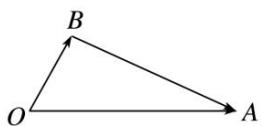
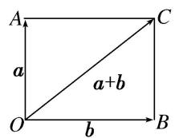
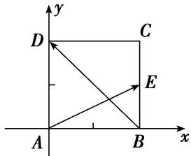
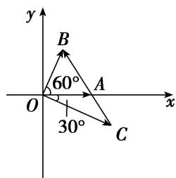

# 专题四 平面向量的夹角

# 平面向量的夹角公式

(1)平面向量夹角公式的非坐标形式： $\cos < a, b > = \frac{a \cdot b}{|a||b|}.$ $< a, b > \in [0, \pi]$ .

(2)平面向量夹角公式的坐标形式：若 $a = (x_{1}, y_{1})$ ， $b = (x_{2}, y_{2})$ ，则 $\cos < a$ ， $b > = \frac{x_{1}x_{2} + y_{1}y_{2}}{\sqrt{x_{1}^{2} + y_{1}^{2}}\cdot\sqrt{x_{2}^{2} + y_{2}^{2}}}$ . $< a$ ， $b > \in [0, \pi]$ .

# 考点一 平面向量的夹角问题

# 【方法总结】

# 求解两个非零向量之间的夹角的步骤

第一步：由坐标运算或定义计算出这两个向量的数量积；

第二步：分别求出这两个向量的模；

第三步：根据公式 $\cos<a,\quad b>=\frac{a\cdot b}{|a||b|}=\frac{x_{1}x_{2}+y_{1}y_{2}}{\sqrt{x_{1}^{2}+y_{1}^{2}}\cdot\sqrt{x_{2}^{2}+y_{2}^{2}}}$ 求解出这两个向量夹角的余弦值；

第四步：根据两个向量夹角的范围是 $[0, \pi]$ 及其夹角的余弦值，求出这两个向量的夹角.

# 【例题选讲】

[例 1] (1)(2016·北京)已知向量 $a=(1,\sqrt{3})$ , $b=(\sqrt{3},1)$ ，则 a 与 b 夹角的大小为 \_\_\_\_.

(2)已知 $|a|=1,\quad|b|=6,\quad a\cdot(b-a)=2$ ，则向量a与b的夹角为()

A. $\frac{\pi}{2}$

B. $\frac{\pi}{3}$

C. $\frac{\pi}{4}$

D. $\frac{\pi}{6}$

(3)已知 $|a|=|b|$ ，且 $|a+b|=\sqrt{3}|a-b|$ ，则向量a与b的夹角为()

A. $30^{\circ}$

B. $45^{\circ}$

C. $60^{\circ}$

D. $120^{\circ}$

(4)(2019·全国I)已知非零向量 a，b 满足 $|a|=2|b|$ ，且 $(a-b)\perp b$ ，则 a 与 b 的夹角为()

A. $\frac{\pi}{6}$

B. $\frac{\pi}{3}$

C. $\frac{2\pi}{3}$

D. $\frac{5\pi}{6}$

(5)已知非零向量 a，b 满足： $2a\cdot(2a-b)=b\cdot(b-2a)$ ， $|a-\sqrt{2}b|=3|a|$ ，则 a 与 b 的夹角为 \_\_\_\_.

(6)若两个非零向量 a, b 满足 $|a+b|=|a-b|=2|b|$ ，则向量 $a+b$ 与 a 的夹角为()

A. $\frac{\pi}{3}$

B. $\frac{2\pi}{3}$

C. $\frac{5\pi}{6}$

D. $\frac{\pi}{6}$

(7)已知平面向量 $a$ ， $b$ ， $|a| = 1$ ， $|b| = \sqrt{3}$ ，且 $|2a + b| = \sqrt{7}$ ，则向量 $a$ 与 $a + b$ 的夹角为（）

A. $\frac{\pi}{2}$

B. $\frac{\pi}{3}$

C. $\frac{\pi}{6}$

D. $\pi$

(8)(2020·全国III)已知向量 a, b 满足 $|a|=5$ , $|b|=6$ , $a\cdot b=-6$ , 则 $\cos<a$ , $a+b>$ 等于()

A. $-\frac{31}{35}$

B. $-\frac{19}{35}$

C. $\frac{17}{35}$

D. $\frac{19}{35}$

(9)已知单位向量 $e_{1}$ 与 $e_{2}$ 的夹角为 $\alpha$ ，且 $\cos\alpha=\frac{1}{3}$ ，向量 $a=3e_{1}-2e_{2}$ 与 $b=3e_{1}-e_{2}$ 的夹角为 $\beta$ ，则 $\cos\beta=$ \_\_\_\_.

(10)若平面向量 a 与平面向量 b 的夹角等于 $\frac{\pi}{3}$ ， $|a|=2$ ， $|b|=3$ ，则 2a-b 与 $a+2b$ 的夹角的余弦值等于（）

A. $\frac{1}{26}$

B. $-\frac{1}{26}$

C. $\frac{1}{12}$

D. $-\frac{1}{12}$

(11)已知正方形ABCD，点E在边BC上，且满足 $2\overrightarrow{BE}=\overrightarrow{BC}$ ，设向量 $\overrightarrow{AE},\overrightarrow{BD}$ 的夹角为 $\theta$ ，则 $\cos\theta=$ \_\_\_\_.

text_image

y
D	C
E
A	B	x

(12)(2020·浙江)已知平面单位向量 $e_{1}$ ， $e_{2}$ 满足 $|2e_{1}-e_{2}|\leq\sqrt{2}$ ，设 $a=e_{1}+e_{2}$ ， $b=3e_{1}+e_{2}$ ，向量 a，b 的夹角为 $\theta$ ，则 $\cos^{2}\theta$ 的最小值是 \_\_\_\_.

# 【对点训练】

1. (2016·全国III)已知向量 $\vec{BA} = \left(\frac{1}{2}, \frac{\sqrt{3}}{2}\right)$ , $\vec{BC} = \left(\frac{\sqrt{3}}{2}, \frac{1}{2}\right)$ , 则 $\angle ABC$ 等于( )

A. $30^{\circ}$

B. $45^{\circ}$

C. $60^{\circ}$

D. $120^{\circ}$

2. 已知向量 $a, b$ 满足 $a \cdot (a - b) = 2$ ，且 $|a| = 1$ ， $|b| = 2$ ，则 $a$ 与 $b$ 的夹角为（）

A. $\frac{\pi}{6}$

B. $\frac{\pi}{2}$

C. $\frac{5\pi}{6}$

D. $\frac{2\pi}{3}$

3. 已知向量 $a, b$ 满足 $(2a - b) \cdot (a + b) = 6$ ，且 $|a| = 2, |b| = 1$ ，则 $a$ 与 $b$ 的夹角为 \_\_\_\_.

4. 已知非零向量 a, b 满足 $|a|=|b|$ ，且 $|a+b|=|2a-b|$ ，则 a 与 b 的夹角为()

A. $\frac{2\pi}{3}$

B. $\frac{\pi}{2}$

C. $\frac{\pi}{3}$

D. $\frac{\pi}{6}$

5. 已知 $|a|=1$ ， $|b|=\sqrt{2}$ ，且 $a\perp(a-b)$ ，则向量a与向量b的夹角为()

A. $\frac{\pi}{6}$

B. $\frac{\pi}{4}$

C. $\frac{\pi}{3}$

D. $\frac{2\pi}{3}$

6. 已知 $|a|=1$ ， $|b|=2$ ， $c=a+b$ ，且 $c\perp a$ ，则向量a与b的夹角为()

A. $30^{\circ}$

B. $60^{\circ}$

C. $120^{\circ}$

D. $150^{\circ}$

7. 若非零向量 a, b 满足 $\left|a\right|=\frac{2\sqrt{2}}{3}\left|b\right|$ ，且 $(a-b)\perp(3a+2b)$ ，则 a 与 b 的夹角为()

A. $\frac{\pi}{4}$

B. $\frac{\pi}{2}$

C. $\frac{3\pi}{4}$

D. $\pi$

8. 已知非零单位向量 $a, b$ 满足 $|a + b| = |a - b|$ , 则 $a$ 与 $b - a$ 的夹角是( )

A. $\frac{\pi}{6}$

B. $\frac{\pi}{3}$

C. $\frac{\pi}{4}$

D. $\frac{3\pi}{4}$

9. 不共线向量 a, b 满足 $|a|=2|b|$ ，且 $b^{2}=a\cdot b$ ，则 a 与 b-a 的夹角为()

A. $30^{\circ}$

B. $60^{\circ}$

C. $120^{\circ}$

D. $150^{\circ}$

10. 已知非零向量 a, b 满足 $\left|a+b\right|=\left|a-b\right|=\frac{2\sqrt{3}}{3}\left|a\right|$ ，则向量 $a+b$ 与 a-b 的夹角为 \_\_\_\_.

11. 若非零向量 a, b 满足 $|a|=3|b|=|a+2b|$ ，则 a, b 夹角 $\theta$ 的余弦值为 \_\_\_\_.

12. 已知向量 $a = (3, 1)$ , $b = (1, 3)$ , $c = (k, -2)$ , 若 $(a - c) // b$ , 则向量 $a$ 与向量 $c$ 的夹角的余弦值是( )

A. $\frac{\sqrt{5}}{5}$

B. $\frac{1}{5}$

C. $-\frac{\sqrt{5}}{5}$

D. $-\frac{1}{5}$

13. 在 $\triangle ABC$ 和 $\triangle AEF$ 中， $B$ 是 $EF$ 的中点， $AB=EF=1$ ， $BC=6$ ， $CA=\sqrt{33}$ ，若 $\overrightarrow{AB}\cdot\overrightarrow{AE}+\overrightarrow{AC}\cdot\overrightarrow{AF}=2$ ，则 $\overrightarrow{EF}$ 与 $\overrightarrow{BC}$ 的夹角的余弦值等于\_\_\_\_。

14. $\triangle ABC$ 是边长为 2 的等边三角形，向量 $a, b$ 满足 $\overrightarrow{AB} = 2a, \overrightarrow{AC} = 2a + b$ ，则向量 $a, b$ 的夹角为（）

A. $30^{\circ}$

B. $60^{\circ}$

C. $120^{\circ}$

D. $150^{\circ}$

15. (2014·全国 I) 已知 A, B, C 为圆 O 上的三点，若 $\overrightarrow{AO} = \frac{1}{2} (\overrightarrow{AB} + \overrightarrow{AC})$ ，则 $\overrightarrow{AB}$ 与 $\overrightarrow{AC}$ 的夹角为 \_\_\_\_.

16. 在 $\triangle ABC$ 中， $(\overrightarrow{AB}-3\overrightarrow{AC})\perp\overrightarrow{CB}$ ，则角 $A$ 的最大值为\_\_\_\_。

# 考点二 平面向量的夹角的应用

# 【方法总结】

(1)向量 a, b 的夹角为锐角 $\Leftrightarrow a \cdot b > 0$ 且向量 a, b 不共线.

(2)向量 a, b 的夹角为钝角 $\Leftrightarrow a \cdot b < 0$ 且向量 a, b 不共线.

研究向量的夹角应注意“共起点”，两个非零共线向量的夹角可能是0或π．数量积大于0说明不共线的两向量的夹角为锐角，数量积等于0说明不共线的两向量的夹角为直角，数量积小于0且两向量不共线时两向量的夹角为钝角.

# 【例题选讲】

[例 1] (1)(2013·全国 I) 已知两个单位向量 a, b 的夹角为 $60^{\circ}, c = ta + (1 - t)b$ . 若 $b \cdot c = 0$ , 则 t = \_\_\_\_.

text_image

y
B
60° A
O x
30° C

(2)(2013·山东)已知向量 $\overrightarrow{AB}$ 与 $\overrightarrow{AC}$ 的夹角为 $120^{\circ}$ , 且 $|\overrightarrow{AB}| = 3$ , $|\overrightarrow{AC}| = 2$ . 若 $\overrightarrow{AP} = \lambda \overrightarrow{AB} + \overrightarrow{AC}$ , 且 $\overrightarrow{AP} \perp \overrightarrow{BC}$ , 则实数 $\lambda$ 的值为 \_\_\_\_.

(3)已知 $a=(\lambda, 2\lambda)$ ， $b=(3\lambda, 2)$ ，如果 a 与 b 的夹角为锐角，则 $\lambda$ 的取值范围是 \_\_\_\_.

(4)已知向量 $\overrightarrow{OA}=(3,-4)$ ， $\overrightarrow{OB}=(6,-3)$ ， $\overrightarrow{OC}=(5-m,-3-m)$ ，若 $\angle ABC$ 为锐角，则实数 m 的取值范围是 \_\_\_\_.

(5)已知 $a=(1,-1)$ ， $b=(\lambda,1)$ ，若 a 与 b 的夹角 $\alpha$ 为钝角，则实数 $\lambda$ 的取值范围是 \_\_\_\_.

(6)已知向量 $e_{1}$ ， $e_{2}$ 满足 $|e_{1}|=2$ ， $|e_{2}|=1$ ， $e_{1}$ ， $e_{2}$ 的夹角为 $60^{\circ}$ ，若 $2te_{1}+7e_{2}$ 与 $e_{1}+te_{2}$ 的夹角为钝角，则实数 t 的取值范围是 \_\_\_\_.

# 【对点训练】

1. (2017·山东)已知 $e_{1}$ ， $e_{2}$ 是互相垂直的单位向量，若 $\sqrt{3}e_{1}-e_{2}$ 与 $e_{1}+\lambda e_{2}$ 的夹角为 $60^{\circ}$ ，则实数 $\lambda$ 的值是 \_\_\_\_.

2. 平面向量 $a = (1, 2)$ , $b = (4, 2)$ , $c = ma + b (m \in \mathbb{R})$ , 且 $c$ 与 $a$ 的夹角等于 $c$ 与 $b$ 的夹角, 则 $m$ 等于( )

A. -2

B.-1

C. 1

D. 2

3. 若平面向量 a 与平面向量 b 的夹角等于 $\frac{\pi}{3}$ ， $|a|=2$ ， $|b|=3$ ，则 2a-b 与 $a+2b$ 的夹角的余弦值等于（）

A. $\frac{1}{26}$

B. $-\frac{1}{26}$

C. $\frac{1}{12}$

D. $-\frac{1}{12}$

4. 已知向量 $a = (1, 2)$ , $b = (1, 1)$ , 且 $a$ 与 $a + \lambda b$ 的夹角为锐角, 则实数 $\lambda$ 的取值范围是 \_\_\_\_.

5. 设向量 $a=(1, \sqrt{3})$ , $b=(m, \sqrt{3})$ ，且 a, b 的夹角为锐角，则实数 m 的取值范围是 \_\_\_\_.

6. 已知 $a=(2, -1)$ ， $b=(\lambda, 3)$ ，若 a 与 b 的夹角为钝角，则 $\lambda$ 的取值范围是 \_\_\_\_.

7. 若向量 $a = (k, 3)$ , $b = (1, 4)$ , $c = (2, 1)$ , 已知 $2a - 3b$ 与 $c$ 的夹角为钝角, 则 $k$ 的取值范围是 \_\_\_\_.

