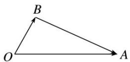
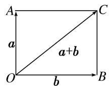
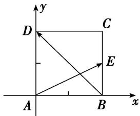
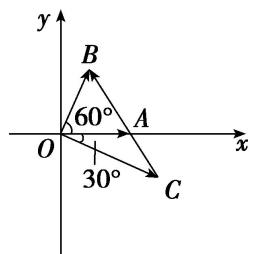

# 专题四 平面向量的夹角

# 平面向量的夹角公式  
（1）平面向量夹角公式的非坐标形式： $\cos < a, b > = \frac{a \cdot b}{|a||b|}.$ $< a, b > \in [0, \pi]$ .  
（2）平面向量夹角公式的坐标形式：若 $a = (x_{1}, y_{1})$ ， $b = (x_{2}, y_{2})$ ，则 $\cos < a$ ， $b > = \frac{x_{1}x_{2} + y_{1}y_{2}}{\sqrt{x_{1}^{2} + y_{1}^{2}}\cdot\sqrt{x_{2}^{2} + y_{2}^{2}}}$ . $< a$ ， $b > \in [0, \pi]$ .

# 考点一 平面向量的夹角问题

# 【方法总结】

# 求解两个非零向量之间的夹角的步骤

第一步：由坐标运算或定义计算出这两个向量的数量积；
第二步：分别求出这两个向量的模；
第三步：根据公式 $\cos<a,\quad b>=\frac{a\cdot b}{|a||b|}=\frac{x_{1}x_{2}+y_{1}y_{2}}{\sqrt{x_{1}^{2}+y_{1}^{2}}\cdot\sqrt{x_{2}^{2}+y_{2}^{2}}}$ 求解出这两个向量夹角的余弦值；
第四步：根据两个向量夹角的范围是 $[0, \pi]$ 及其夹角的余弦值，求出这两个向量的夹角.

# 【例题选讲】

[例 1] （1）(2016·北京)已知向量 $a=(1,\sqrt{3})$ , $b=(\sqrt{3},1)$ ，则 a 与 b 夹角的大小为 \_\_\_\_.
答案 $\frac{\pi}{6}$ 解析 因为 $\cos<a,\quad b>=\frac{a\cdot b}{|a||b|}=\frac{1\times\sqrt{3}+\sqrt{3}\times1}{2\times2}=\frac{\sqrt{3}}{2}$ ，所以 a 与 b 夹角的大小为 $\frac{\pi}{6}$ .  
（2）已知 $|a|=1,\quad|b|=6,\quad a\cdot(b-a)=2$ ，则向量a与b的夹角为()

A. $\frac{\pi}{2}$

B. $\frac{\pi}{3}$

C. $\frac{\pi}{4}$

D. $\frac{\pi}{6}$
答案 B 解析 $a \cdot (b - a) = a \cdot b - a^{2} = 2$ ，所以 $a \cdot b = 3$ ，所以 $\cos < a$ ， $b > = \frac{a \cdot b}{|a||b|} = \frac{3}{1 \times 6} = \frac{1}{2}$ ，所以向量 a 与 b 的夹角为 $\frac{\pi}{3}$ .  
（3）已知 $|a|=|b|$ ，且 $|a+b|=\sqrt{3}|a-b|$ ，则向量a与b的夹角为()

A. $30^{\circ}$

B. $45^{\circ}$

C. $60^{\circ}$

D. $120^{\circ}$
答案 C 解析 设 a 与 b 的夹角为 $\theta$ ，由已知可得 $a^{2} + 2a \cdot b + b^{2} = 3(a^{2} - 2a \cdot b + b^{2})$ ，即 $4a \cdot b = a^{2} + b^{2}$ 。因为 $|a| = |b|$ ，所以 $a \cdot b = \frac{1}{2}a^{2}$ ，所以 $\cos \theta = \frac{a \cdot b}{|a| \cdot |b|} = \frac{1}{2}$ ， $\theta = 60^{\circ}$ 。  
（4）(2019·全国I)已知非零向量 a，b 满足 $|a|=2|b|$ ，且 $(a-b)\perp b$ ，则 a 与 b 的夹角为()

A. $\frac{\pi}{6}$

B. $\frac{\pi}{3}$

C. $\frac{2\pi}{3}$

D. $\frac{5\pi}{6}$
答案 B 解析 答案 B 解析 方法一 设 a 与 b 的夹角为 $\theta$ ，因为 $(a-b)\perp b$ ，所以 $(a-b)\cdot b=a\cdot b-|b|^{2}=0$ ，又因为 $|a|=2|b|$ ，所以 $2|b|^{2}\cos\theta-|b|^{2}=0$ ，即 $\cos\theta=\frac{1}{2}$ ，又 $\theta\in[0,\pi]$ ，所以 $\theta=\frac{\pi}{3}$ ，故选 B.
方法二 如图，令 $\overrightarrow{OA}=a,\quad\overrightarrow{OB}=b$ ，则 $\overrightarrow{BA}=\overrightarrow{OA}-\overrightarrow{OB}=a-b$ .

因为 $(a-b)\perp b$ ，所以 $\angle OBA=\frac{\pi}{2}$ ，又 $|a|=2|b|$ ，所以 $\angle AOB=\frac{\pi}{3}$ ，即a与b的夹角为 $\frac{\pi}{3}$ ，故选B.  
（5）已知非零向量 a, b 满足: $2a \cdot (2a - b) = b \cdot (b - 2a)$ , $|a - \sqrt{2}b| = 3 |a|$ , 则 a 与 b 的夹角为 \_\_\_\_.
答案 $90^{\circ}$ 解析 由 $2a \cdot (2a - b) = b \cdot (b - 2a)$ ，得 $4a^{2} = b^{2}$ ，由 $|a - \sqrt{2}b| = 3|a|$ ，得 $a^{2} - 2\sqrt{2}a \cdot b + 2b^{2} = 9a^{2}$ ，则 $a \cdot b = 0$ ，即 $a \perp b$ ， $\therefore a$ 与 $b$ 的夹角为 $90^{\circ}$ .  
（6）若两个非零向量 a, b 满足 $|a+b|=|a-b|=2|b|$ ，则向量 $a+b$ 与 a 的夹角为()

A. $\frac{\pi}{3}$

B. $\frac{2\pi}{3}$

C. $\frac{5\pi}{6}$

D. $\frac{\pi}{6}$
答案 D 解析 设 $|b|=1$ ，则 $|a+b|=|a-b|=2$ 。由 $|a+b|=|a-b|$ ，得 $a\cdot b=0$ ，故以a、b为邻边的平行四边形是矩形，且 $|a|=\sqrt{3}$ ，设向量 $a+b$ 与a的夹角为 $\theta$ ，则 $\cos\theta=\frac{a\cdot(a+b)}{|a|\cdot|a+b|}=\frac{a^{2}+a\cdot b}{|a|\cdot|a+b|}=\frac{|a|}{|a+b|}=\frac{\sqrt{3}}{2}$ ，又 $0\leqslant\theta\leqslant\pi$ ，所以 $\theta=\frac{\pi}{6}$ 。  
（7）已知平面向量 a, b, $|a|=1$ , $|b|=\sqrt{3}$ ，且 $|2a+b|=\sqrt{7}$ ，则向量 a 与 $a+b$ 的夹角为()

A. $\frac{\pi}{2}$

B. $\frac{\pi}{3}$

C. $\frac{\pi}{6}$

D. $\pi$
答案 B 解析 $\because |2a + b|^2 = 4|a|^2 + 4a \cdot b + |b|^2 = 7, |a| = 1, |b| = \sqrt{3}, \therefore 4 + 4a \cdot b + 3 = 7, \therefore a \cdot b = 0, \therefore a \perp b$ . 如图所示， $a$ 与 $a + b$ 的夹角为 $\angle COA$ . $\because \tan \angle COA = \frac{|CA|}{|OA|} = \frac{|b|}{|a|} = \sqrt{3}, \therefore \angle COA = \frac{\pi}{3}$ ，即 $a$ 与 $a + b$ 的夹角为 $\frac{\pi}{3}$ .

  
（8）(2020·全国III)已知向量 a, b 满足 $|a|=5$ , $|b|=6$ , $a\cdot b=-6$ , 则 $\cos<a$ , $a+b>$ 等于()

A. $-\frac{31}{35}$

B. $-\frac{19}{35}$

C. $\frac{17}{35}$

D. $\frac{19}{35}$
答案 D 解析 $\because|a+b|^{2}=(a+b)^{2}=a^{2}+2a\cdot b+b^{2}=25-12+36=49,\quad\therefore|a+b|=7,\quad\therefore\cos<a,a+b>=\frac{a\cdot(a+b)}{|a||a+b|}=\frac{a^{2}+a\cdot b}{|a||a+b|}=\frac{25-6}{5\times7}=\frac{19}{35}.$  
（9）已知单位向量 $e_{1}$ 与 $e_{2}$ 的夹角为 $\alpha$ ，且 $\cos\alpha=\frac{1}{3}$ ，向量 $a=3e_{1}-2e_{2}$ 与 $b=3e_{1}-e_{2}$ 的夹角为 $\beta$ ，则 $\cos\beta=$ \_\_\_\_.
答案 $\frac{2\sqrt{2}}{3}$ 解析 $\because a^{2} = (3e_{1} - 2e_{2})^{2} = 9 + 4 - 2\times 3\times 2\times \frac{1}{3} = 9,b^{2} = (3e_{1} - e_{2})^{2} = 9 + 1 - 2\times 3\times 1\times \frac{1}{3} = 8,$ $a\cdot b = (3e_1 - 2e_2)\cdot (3e_1 - e_2) = 9 + 2 - 9\times 1\times 1\times \frac{1}{3} = 8,\therefore \cos \beta = \frac{a\cdot b}{|a||b|} = \frac{8}{3\times 2\sqrt{2}} = \frac{2\sqrt{2}}{3}.$  
（10）若平面向量 a 与平面向量 b 的夹角等于 $\frac{\pi}{3}$ ， $|a|=2$ ， $|b|=3$ ，则 2a-b 与 $a+2b$ 的夹角的余弦值等于（）

A. $\frac{1}{26}$

B. $-\frac{1}{26}$

C. $\frac{1}{12}$

D. $-\frac{1}{12}$
答案 B 解析 记向量 $2a - b$ 与 $a + 2b$ 的夹角为 $\theta$ ，又 $(2a - b)^{2} = 4 \times 2^{2} + 3^{2} - 4 \times 2 \times 3 \times \cos \frac{\pi}{3} = 13$ ， $(a + 2b)^{2} = 2^{2} + 4 \times 3^{2} + 4 \times 2 \times 3 \times \cos \frac{\pi}{3} = 52$ ， $(2a - b) \cdot (a + 2b) = 2a^{2} - 2b^{2} + 3a \cdot b = 8 - 18 + 9 = -1$ ，故 $\cos \theta = \frac{(2a - b) \cdot (a + 2b)}{|2a - b| \cdot |a + 2b|} = -\frac{1}{26}$ ，即 $2a - b$ 与 $a + 2b$ 的夹角的余弦值是 $-\frac{1}{26}$ .  
（11）已知正方形ABCD，点E在边BC上，且满足 $2\overrightarrow{BE}=\overrightarrow{BC}$ ，设向量 $\overrightarrow{AE},\overrightarrow{BD}$ 的夹角为 $\theta$ ，则 $\cos\theta=$ \_\_\_\_.
答案 $-\frac{\sqrt{10}}{10}$ 解析 因为 $2\overrightarrow{BE} = \overrightarrow{BC}$ ，所以 $E$ 为 $BC$ 中点。设正方形的边长为 2，则 $|\overrightarrow{AE}| = \sqrt{5}$ ， $|\overrightarrow{BD}| = 2\sqrt{2}$ ， $\overrightarrow{AE} \cdot \overrightarrow{BD} = \left(\overrightarrow{AB} + \frac{1}{2}\overrightarrow{AD}\right) \cdot (\overrightarrow{AD} - \overrightarrow{AB}) = \frac{1}{2} |\overrightarrow{AD}|^2 - |\overrightarrow{AB}|^2 + \frac{1}{2}\overrightarrow{AD} \cdot \overrightarrow{AB} = \frac{1}{2} \times 2^2 - 2^2 = -2$ ，所以 $\cos \theta = \frac{\overrightarrow{AE} \cdot \overrightarrow{BD}}{|\overrightarrow{AE}||\overrightarrow{BD}|} = \frac{-2}{\sqrt{5} \times 2\sqrt{2}} = -\frac{\sqrt{10}}{10}$ .

优解：因为 $2\overrightarrow{BE} = \overrightarrow{BC}$ ，所以E为BC中点。设正方形的边长为2，建立如图所示的平面直角坐标系 $xAy$ ，则点 $A(0,0)$ ， $B(2,0)$ ， $D(0,2)$ ，E(2,1)，所以 $\overrightarrow{AE} = (2,1)$ ， $\overrightarrow{BD} = (-2,2)$ ，所以 $\overrightarrow{AE} \cdot \overrightarrow{BD} = 2 \times (-2) + 1 \times 2 = -2$ ，故 $\cos \theta = \frac{\overrightarrow{AE} \cdot \overrightarrow{BD}}{|\overrightarrow{AE}| |\overrightarrow{BD}|} = \frac{-2}{\sqrt{5} \times 2\sqrt{2}} = -\frac{\sqrt{10}}{10}$ 。

  
（12）(2020·浙江)已知平面单位向量 $e_{1}$ ， $e_{2}$ 满足 $|2e_{1}-e_{2}| \leq \sqrt{2}$ ，设 $a = e_{1} + e_{2}$ ， $b = 3e_{1} + e_{2}$ ，向量 a，b 的夹角为 $\theta$ ，则 $\cos^{2}\theta$ 的最小值是 \_\_\_\_.
答案 $\frac{28}{29}$ 解析 设 $e_1 = (1,0)$ , $e_2 = (x,y)$ , 则 $a = (x + 1,y)$ , $b = (x + 3,y)$ . 由 $2e_1 - e_2 = (2 - x, -y)$ , 故 $|2e_1 - e_2| = \sqrt{(2 - x)^2 + y^2} \leq \sqrt{2}$ , 得 $(x - 2)^2 + y^2 \leq 2$ . 又有 $x^2 + y^2 = 1$ , 得 $(x - 2)^2 + 1 - x^2 \leq 2$ , 化简, 得 $4x \geq 3$ , 即 $x \geq \frac{3}{4}$ , 因此 $\frac{3}{4} \leq x \leq 1$ . $\cos^2\theta = \left(\frac{a \cdot b}{|a| \cdot |b|}\right)^2 = \left[\frac{(x + 1)(x + 3) + y^2}{\sqrt{(x + 1)^2 + y^2} \sqrt{(x + 3)^2 + y^2}}\right]^2 = \left(\frac{4x + 4}{\sqrt{2x + 2} \sqrt{6x + 10}}\right)^2 = \frac{4(x + 1)^2}{(x + 1)(3x + 5)} = \frac{4(x + 1)}{3x + 5} = \frac{\frac{4}{3}(3x + 5) - \frac{8}{3}}{3x + 5} = \frac{4}{3} - \frac{\frac{8}{3}}{3x + 5}$ , 当 $x = \frac{3}{4}$ 时, $\cos^2\theta$ 有最小值, 为 $\frac{4\left(\frac{3}{4} + 1\right)}{3 \times \frac{3}{4} + 5} = \frac{28}{29}$ .

# 【对点训练】

1. (2016·全国III)已知向量 $\vec{BA} = \left(\frac{1}{2}, \frac{\sqrt{3}}{2}\right)$ , $\vec{BC} = \left(\frac{\sqrt{3}}{2}, \frac{1}{2}\right)$ , 则 $\angle ABC$ 等于( )

A. $30^{\circ}$

B. $45^{\circ}$

C. $60^{\circ}$

D. $120^{\circ}$

1. 答案 A 解析 $\left|\overrightarrow{BA}\right|=1,\left|\overrightarrow{BC}\right|=1,\cos\angle ABC=\frac{\overrightarrow{BA}\cdot\overrightarrow{BC}}{\left|\overrightarrow{BA}\right|\left|\overrightarrow{BC}\right|}=\frac{\sqrt{3}}{2}$ . 又 $\because0^{\circ}\leqslant\angle ABC\leqslant180^{\circ},\therefore\angle ABC=30^{\circ}$ .

2. 已知向量 $a, b$ 满足 $a \cdot (a - b) = 2$ ，且 $|a| = 1$ ， $|b| = 2$ ，则 $a$ 与 $b$ 的夹角为（）

A. $\frac{\pi}{6}$

B. $\frac{\pi}{2}$

C. $\frac{5\pi}{6}$

D. $\frac{2\pi}{3}$

2. 答案 D 解析 由 $a \cdot (a - b) = 2$ ，得 $a^2 - a \cdot b = 2$ ，即 $|a|^2 - |a||b|\cos < a, b> = 1 - 2\cos < a, b> = 2$ 。所以 $\cos < a, b> = -\frac{1}{2}$ ，所以 $< a, b> = \frac{2\pi}{3}$ ，故选 D.

3. 已知向量 $a, b$ 满足 $(2a - b) \cdot (a + b) = 6$ ，且 $|a| = 2, |b| = 1$ ，则 $a$ 与 $b$ 的夹角为 \_\_\_\_.

3. 答案 $\frac{2\pi}{3}$ 解析 $\because (2a - b)\cdot (a + b) = 6, \therefore 2a^2 + a \cdot b - b^2 = 6,$ 又 $|a| = 2, |b| = 1, \therefore a \cdot b = -1, \therefore \cos < a,$ $b > = \frac{a \cdot b}{|a||b|} = -\frac{1}{2},$ 又 $< a, b > \in [0, \pi], \therefore a$ 与 $b$ 的夹角为 $\frac{2\pi}{3}$ .

4. 已知非零向量 $a, b$ 满足 $|a| = |b|$ , 且 $|a + b| = |2a - b|$ , 则 $a$ 与 $b$ 的夹角为( )

A. $\frac{2\pi}{3}$

B. $\frac{\pi}{2}$

C. $\frac{\pi}{3}$

D. $\frac{\pi}{6}$

4. 答案 C 解析 设 a 与 b 的夹角为 $\theta$ . 由 $|a+b|=|2a-b|$ ，得 $a\cdot b=\frac{1}{2}a^{2}$ ，所以 $\cos\theta=\frac{a\cdot b}{|a||b|}=\frac{1}{2}$ ，所以 $\theta=\frac{\pi}{3}$ .

5. 已知 $|a|=1$ ， $|b|=\sqrt{2}$ ，且 $a\perp(a-b)$ ，则向量a与向量b的夹角为()

A. $\frac{\pi}{6}$

B. $\frac{\pi}{4}$

C. $\frac{\pi}{3}$

D. $\frac{2\pi}{3}$

5. 答案 B 解析 $\because a \perp (a - b), \therefore a \cdot (a - b) = a^2 - a \cdot b = 1 - \sqrt{2} \cos < a, b > = 0, \therefore \cos < a, b > = \frac{\sqrt{2}}{2}, \therefore < a, b > = \frac{\pi}{4}$ .

6. 已知 $|a|=1$ ， $|b|=2$ ， $c=a+b$ ，且 $c\perp a$ ，则向量a与b的夹角为()

A. $30^{\circ}$

B. $60^{\circ}$

C. $120^{\circ}$

D. $150^{\circ}$

6. 答案 C 解析 设向量 a 与 b 的夹角为 $\theta$ ，∵ $c = a + b$ ， $c \perp a$ ，∴ $c \cdot a = (a + b) \cdot a = a^2 + a \cdot b = 0$ ，∴ $|a|^2 = -|a||b| \cdot \cos\theta$ ，∴ $\cos\theta = -\frac{|a|^2}{|a||b|} = -\frac{|a|}{|b|} = -\frac{1}{2}$ ，∴ $\theta = 120^\circ$ .

7. 若非零向量 $a, b$ 满足 $|a| = \frac{2\sqrt{2}}{3} |b|$ ，且 $(a - b) \perp (3a + 2b)$ ，则 $a$ 与 $b$ 的夹角为（）

A. $\frac{\pi}{4}$

B. $\frac{\pi}{2}$

C. $\frac{3\pi}{4}$

D. $\pi$

7. 答案 A 解析 由 $(a-b)\perp(3a+2b)$ ，得 $(a-b)\cdot(3a+2b)=0$ ，即 $3a^{2}-a\cdot b-2b^{2}=0$ 。又∵ $|a|=\frac{2\sqrt{2}}{3}|b|$ ，设 $<a,b>=\theta$ ，即 $3|a|^{2}-|a||b|\cos\theta-2|b|^{2}=0,\therefore\frac{8}{3}|b|^{2}-\frac{2\sqrt{2}}{3}|b|^{2}\cdot\cos\theta-2|b|^{2}=0.\therefore\cos\theta=\frac{\sqrt{2}}{2}$ 。又∵ $0\leqslant\theta\leqslant\pi$ ，∴ $\theta=\frac{\pi}{4}$ 。

8. 已知非零单位向量 $a, b$ 满足 $|a + b| = |a - b|$ ，则 $a$ 与 $b - a$ 的夹角是（）

A. $\frac{\pi}{6}$

B. $\frac{\pi}{3}$

C. $\frac{\pi}{4}$

D. $\frac{3\pi}{4}$

8. 答案 D 解析 由 $|a+b|=|a-b|$ 可得 $(a+b)^{2}=(a-b)^{2}$ ，即 $a\cdot b=0$ ，而 $a\cdot(b-a)=a\cdot b-a^{2}=-|a|^{2}<0$ ，即a与b-a的夹角为钝角，结合选项知选D.

9. 不共线向量 a, b 满足 $|a|=2|b|$ ，且 $b^{2}=a\cdot b$ ，则 a 与 b-a 的夹角为()

A. $30^{\circ}$

B. $60^{\circ}$

C. $120^{\circ}$

D. $150^{\circ}$

9. 答案 D 解析 由已知得， $b^{2}=a\cdot b,\quad\therefore b\cdot(a-b)=0$ ，令 $\overrightarrow{OA}=a,\quad\overrightarrow{OB}=b$ ，则 $\overrightarrow{BA}=a-b,\quad\because b\cdot(a-b)=0,$ $\therefore BA \perp OB$ ，又 $|a| = 2|b|$ ， $\therefore \angle OAB = 30^{\circ}$ ，故 a 与 b-a 的夹角为 $150^{\circ}$ .

10. 已知非零向量 a, b 满足 $\left|a+b\right|=\left|a-b\right|=\frac{2\sqrt{3}}{3}\left|a\right|$ ，则向量 $a+b$ 与 a-b 的夹角为 \_\_\_\_.

10. 答案 $\frac{\pi}{3}$ 解析 将 $|a + b| = |a - b|$ 两边平方，得 $a^2 + b^2 + 2a \cdot b = a^2 + b^2 - 2a \cdot b$ ， $\therefore a \cdot b = 0$ 。将 $|a + b| = \frac{2\sqrt{3}}{3} |a|$ 两边平方，得 $a^2 + b^2 + 2a \cdot b = \frac{4}{3} a^2$ ， $\therefore b^2 = \frac{1}{3} a^2$ 。设 $a + b$ 与 $a - b$ 的夹角为 $\theta$ ， $\therefore \cos \theta = \frac{(a + b) \cdot (a - b)}{|a + b| \cdot |a - b|} = \frac{a^2 - b^2}{\frac{2\sqrt{3}}{3} |a| \cdot \frac{2\sqrt{3}}{3} |a|} = \frac{\frac{2}{3} a^2}{\frac{4}{3} a^2} = \frac{1}{2}$ 。又 $\because \theta \in [0, \pi]$ ， $\therefore \theta = \frac{\pi}{3}$ 。

11. 若非零向量 a, b 满足 $|a|=3|b|=|a+2b|$ ，则 a, b 夹角 $\theta$ 的余弦值为 \_\_\_\_.

11. 答案 $-\frac{1}{3}$ 解析 $|a|=|a+2b|$ ，两边平方得， $|a|^{2}=|a|^{2}+4|b|^{2}+4a\cdot b=|a|^{2}+4|b|^{2}+4|a||b|\cos\theta$ 。又 $|a|=3|b|$ ，所以 $0=4|b|^{2}+12|b|^{2}\cos\theta$ ，得 $\cos\theta=-\frac{1}{3}$ .

12. 已知向量 $a = (3, 1)$ , $b = (1, 3)$ , $c = (k, -2)$ , 若 $(a - c) // b$ , 则向量 $a$ 与向量 $c$ 的夹角的余弦值是( )

A. $\frac{\sqrt{5}}{5}$

B. $\frac{1}{5}$

C. $-\frac{\sqrt{5}}{5}$

D. $-\frac{1}{5}$

12. 答案 A 解析 由已知得 $a - c = (3 - k, 3)$ , $\because (a - c) // b$ , $\therefore 3(3 - k) - 3 = 0$ , $\therefore k = 2$ , 即 $c = (2, -2)$ , $\therefore \cos < a$ , $c > = \frac{a \cdot c}{|a||c|} = \frac{3 \times 2 + 1 \times (-2)}{\sqrt{10} \times 2\sqrt{2}} = \frac{\sqrt{5}}{5}$ .

13. 在 $\triangle ABC$ 和 $\triangle AEF$ 中， $B$ 是 $EF$ 的中点， $AB=EF=1$ ， $BC=6$ ， $CA=\sqrt{33}$ ，若 $\overrightarrow{AB}\cdot\overrightarrow{AE}+\overrightarrow{AC}\cdot\overrightarrow{AF}=2$ ，则 $\overrightarrow{EF}$ 与 $\overrightarrow{BC}$ 的夹角的余弦值等于\_\_\_\_。

13. 答案 $\frac{2}{3}$ 解析 由题意可得 $\overrightarrow{BC}^2 = (\overrightarrow{AC} -\overrightarrow{AB})^2 = \overrightarrow{AC}^2 +\overrightarrow{AB}^2 -2\overrightarrow{AC}\cdot \overrightarrow{AB} = 33 + 1 - 2\overrightarrow{AC}\cdot \overrightarrow{AB} = 36,\therefore \overrightarrow{AC}\cdot \overrightarrow{AB}$ $= -1$ .由 $\overrightarrow{AB}\cdot \overrightarrow{AE} +\overrightarrow{AC}\cdot \overrightarrow{AF} = 2$ ，可得 $\overrightarrow{AB}\cdot (\overrightarrow{AB} +\overrightarrow{BE}) + \overrightarrow{AC}\cdot (\overrightarrow{AB} +\overrightarrow{BF}) = \overrightarrow{AB}^2 +\overrightarrow{AB}\cdot \overrightarrow{BE} +\overrightarrow{AC}\cdot \overrightarrow{AB} +\overrightarrow{AC}\cdot \overrightarrow{BF} = 1-$ $\overrightarrow{AB}\cdot \overrightarrow{BF} +(-1) + \overrightarrow{AC}\cdot \overrightarrow{BF} = \overrightarrow{BF}\cdot (\overrightarrow{AC} -\overrightarrow{AB}) = \frac{1}{2}\overrightarrow{EF}\cdot \overrightarrow{BC} = 2$ ，故有 $\overrightarrow{EF}\cdot \overrightarrow{BC} = 4.$ 再由 $\overrightarrow{EF}\cdot \overrightarrow{BC} = 1\times 6\times \cos <  \overline{\mathrm{EF}},\overline{\mathrm{BC}} >,$ 可得 $6\times \cos <  \overline{\mathrm{EF}},\overline{\mathrm{BC}} > = 4,\therefore \cos <  \overline{\mathrm{EF}},\overline{\mathrm{BC}} > = \frac{2}{3}.$

14. $\triangle ABC$ 是边长为 2 的等边三角形, 向量 $a$ , $b$ 满足 $\overrightarrow{AB} = 2a$ , $\overrightarrow{AC} = 2a + b$ , 则向量 $a$ , $b$ 的夹角为( )

A. $30^{\circ}$

B. $60^{\circ}$

C. $120^{\circ}$

D. $150^{\circ}$

14. 答案 C 解析 法一：设向量 a, b 的夹角为 $\theta$ ， $\overrightarrow{BC} = \overrightarrow{AC} - \overrightarrow{AB} = 2a + b - 2a = b$ ， $\therefore |\overrightarrow{BC}| = |b| = 2$ ， $|\overrightarrow{AB}| = 2|a| = 2$ ， $\therefore |a| = 1$ ， $\overrightarrow{AC^{2}} = (2a + b)^{2} = 4a^{2} + 4a \cdot b + b^{2} = 8 + 8\cos \theta = 4$ ， $\therefore \cos \theta = -\frac{1}{2}$ ， $\theta = 120^{\circ}$ .

法二： $\overrightarrow{BC}=\overrightarrow{AC}-\overrightarrow{AB}=2a+b-2a=b$ ，则向量a，b的夹角为向量 $\overrightarrow{AB}$ 与 $\overrightarrow{BC}$ 的夹角，故向量a，b的夹角为 $120^{\circ}$ .

15. (2014·全国 I) 已知 A, B, C 为圆 O 上的三点，若 $\overrightarrow{AO} = \frac{1}{2} (\overrightarrow{AB} + \overrightarrow{AC})$ ，则 $\overrightarrow{AB}$ 与 $\overrightarrow{AC}$ 的夹角为 \_\_\_\_.

15. 答案 $90^{\circ}$ 解析 由 $\overrightarrow{AO} = \frac{1}{2} (\overrightarrow{AB} + \overrightarrow{AC})$ ，可得 O 为 BC 的中点，故 BC 为圆 O 的直径，所以 $\overrightarrow{AB}$ 与 $\overrightarrow{AC}$ 的夹角为 $90^{\circ}$ .

16. 在 $\triangle ABC$ 中， $(\overrightarrow{AB}-3\overrightarrow{AC})\perp\overrightarrow{CB}$ ，则角 $A$ 的最大值为\_\_\_\_。

16. 答案 $\frac{\pi}{6}$ 解析 因为 $(\overrightarrow{AB} - 3\overrightarrow{AC}) \perp \overrightarrow{CB}$ , 所以 $(\overrightarrow{AB} - 3\overrightarrow{AC}) \cdot \overrightarrow{CB} = 0, (\overrightarrow{AB} - 3\overrightarrow{AC}) \cdot (\overrightarrow{AB} - \overrightarrow{AC}) = 0, \overrightarrow{AB}^2 - 4\overrightarrow{AC} \cdot \overrightarrow{AB} + 3\overrightarrow{AC}^2 = 0$ , 即 $\cos A = \frac{|\overrightarrow{AB}|^2 + 3|\overrightarrow{AC}|^2}{4|\overrightarrow{AC}| \cdot |\overrightarrow{AB}|} = \frac{|\overrightarrow{AB}|}{4|\overrightarrow{AC}|} + \frac{3|\overrightarrow{AC}|}{4|\overrightarrow{AB}|} \geqslant 2\sqrt{\frac{3}{16}} = \frac{\sqrt{3}}{2}$ , 当且仅当 $|\overrightarrow{AB}| = \sqrt{3} |\overrightarrow{AC}|$ 时等号成立. 因为 $0 < A < \pi$ , 所以 $0 < A \leqslant \frac{\pi}{6}$ , 即角 $A$ 的最大值为 $\frac{\pi}{6}$ .

# 考点二 平面向量的夹角的应用

# 【方法总结】  
（1）向量 a, b 的夹角为锐角 $\Leftrightarrow a \cdot b > 0$ 且向量 a, b 不共线.  
（2）向量 a, b 的夹角为钝角 $\Leftrightarrow a \cdot b < 0$ 且向量 a, b 不共线.

研究向量的夹角应注意“共起点”，两个非零共线向量的夹角可能是0或π。数量积大于0说明不共线的两向量的夹角为锐角，数量积等于0说明不共线的两向量的夹角为直角，数量积小于0且两向量不共线时两向量的夹角为钝角。

# 【例题选讲】

[例 1] （1）(2013·全国 I) 已知两个单位向量 a, b 的夹角为 $60^{\circ}, c = ta + (1 - t)b$ . 若 $b \cdot c = 0$ , 则 t = \_\_\_\_.
答案 2 解析 解法1 因为向量 a, b 为单位向量，所以 $b^{2}=1$ ，又向量 a, b 的夹角为 $60^{\circ}$ ，所以 $a \cdot b = \frac{1}{2}$ ，由 $b \cdot c = 0$ 得 $b \cdot [ta + (1 - t)b] = 0$ ，即 $ta \cdot b + (1 - t)b^{2} = 0$ ，所以 $\frac{1}{2}t + (1 - t) = 0$ ，所以 t = 2。
解法2 由 $t + (1 - t) = 1$ 知向量 $\pmb{a}$ 、 $\pmb{b}$ 、 $\pmb{c}$ 的终点 $A$ 、 $B$ 、 $C$ 共线，在平面直角坐标系中设 $\pmb {a} = (1,0)$ ， $\pmb{b}$ $= \left(\frac{1}{2},\frac{\sqrt{3}}{2}\right)$ ，则 $c = \left(\frac{3}{2}, - \frac{\sqrt{3}}{2}\right)$ .把 $\pmb{a}$ 、 $\pmb{b}$ 、 $\pmb{c}$ 的坐标代入 $c = ta + (1 - t)b$ ，得 $t = 2$
  
（2）(2013·山东)已知向量 $\overrightarrow{AB}$ 与 $\overrightarrow{AC}$ 的夹角为 $120^{\circ}$ ，且 $|\overrightarrow{AB}| = 3$ ， $|\overrightarrow{AC}| = 2$ 。若 $\overrightarrow{AP} = \lambda \overrightarrow{AB} + \overrightarrow{AC}$ ，且 $\overrightarrow{AP} \perp \overrightarrow{BC}$ ，则实数 $\lambda$ 的值为 \_\_\_\_。
答案 $\frac{7}{12}$ 解析 由 $\overrightarrow{AP} \perp \overrightarrow{BC}$ 知 $\overrightarrow{AP} \cdot \overrightarrow{BC} = 0$ ，即 $\overrightarrow{AP} \cdot \overrightarrow{BC} = (\lambda \overrightarrow{AB} + \overrightarrow{AC}) \cdot (\overrightarrow{AC} - \overrightarrow{AB}) = (\lambda - 1) \overrightarrow{AB} \cdot \overrightarrow{AC} - \lambda A \overrightarrow{B}^{2} +$
$\overrightarrow {A C} ^ {2} = (\lambda - 1) \times 3 \times 2 \times \left(- \frac {1}{2}\right) - \lambda \times 9 + 4 = 0, \text {解得} \lambda = \frac {7}{1 2}.$  
（3）已知 $a=(\lambda, 2\lambda)$ ， $b=(3\lambda, 2)$ ，如果 a 与 b 的夹角为锐角，则 $\lambda$ 的取值范围是 \_\_\_\_.
答案 $\left(-\infty, -\frac{4}{3}\right) \cup \left(0, \frac{1}{3}\right) \cup \left(\frac{1}{3}, +\infty\right)$ 解析 $a$ 与 $b$ 的夹角为锐角，则 $a \cdot b > 0$ 且 $a$ 与 $b$ 不共线，则 $\left\{ \begin{array}{l} 3\lambda^2 + 4\lambda > 0, \\ 2\lambda - 6\lambda^2 \neq 0, \end{array} \right.$ 解得 $\lambda < -\frac{4}{3}$ 或 $0 < \lambda < \frac{1}{3}$ 或 $\lambda > \frac{1}{3}$ ，所以 $\lambda$ 的取值范围是 $\left(-\infty, -\frac{4}{3}\right) \cup \left(0, \frac{1}{3}\right) \cup \left(\frac{1}{3}, +\infty\right)$ .  
（4）已知向量 $\overrightarrow{OA}=(3,-4)$ ， $\overrightarrow{OB}=(6,-3)$ ， $\overrightarrow{OC}=(5-m,-3-m)$ ，若 $\angle ABC$ 为锐角，则实数 m 的取值范围是 \_\_\_\_.
答案 $(- \frac{3}{4}, \frac{1}{2}) \cup (\frac{1}{2}, +\infty)$ 解析 由已知得 $\overrightarrow{AB} = \overrightarrow{OB} - \overrightarrow{OA} = (3, 1)$ , $\overrightarrow{AC} = \overrightarrow{OC} - \overrightarrow{OA} = (2 - m, 1 - m)$ . 若 $\overrightarrow{AB} // \overrightarrow{AC}$ , 则有 $3(1 - m) = 2 - m$ , 解得 $m = \frac{1}{2}$ . 由题设知, $\overrightarrow{BA} = (-3, -1)$ , $\overrightarrow{BC} = (-1 - m, -m)$ . $\because \angle ABC$ 为锐角, $\therefore \overrightarrow{BA} \cdot \overrightarrow{BC} = 3 + 3m + m > 0$ , 可得 $m > -\frac{3}{4}$ . 由题意知, 当 $m = \frac{1}{2}$ 时, $\overrightarrow{AB} // \overrightarrow{AC}$ . 故当 $\angle ABC$ 为锐角时, 实数 $m$ 的取值范围是 $(- \frac{3}{4}, \frac{1}{2}) \cup (\frac{1}{2}, +\infty)$ .  
（5）已知 $a=(1,-1)$ ， $b=(\lambda,1)$ ，若 a 与 b 的夹角 $\alpha$ 为钝角，则实数 $\lambda$ 的取值范围是 \_\_\_\_.
答案 $(- \infty, -1) \cup (-1, 1)$ 解析 因为 $a = (1, -1)$ , $b = (\lambda, 1)$ , 所以 $|a| = \sqrt{2}$ , $|b| = \sqrt{1 + \lambda^2}$ , $a \cdot b = \lambda - 1$ . 因为 $a$ , $b$ 的夹角 $\alpha$ 为钝角, 所以 $\left\{ \begin{array}{l} \lambda - 1 < 0, \\ \sqrt{2} \sqrt{1 + \lambda^2} \neq 1 - \lambda, \end{array} \right.$ 即 $\left\{ \begin{array}{l} \lambda < 1, \\ \lambda^2 + 2\lambda + 1 \neq 0. \end{array} \right.$ 所以 $\lambda < 1$ 且 $\lambda \neq -1$ , 所以 $\lambda$ 的取值范围是 $(- \infty, -1) \cup (-1, 1)$ .  
（6）已知向量 $e_1$ , $e_2$ 满足 $|e_1|=2$ , $|e_2|=1$ , $e_1$ , $e_2$ 的夹角为 $60^\circ$ , 若 $2te_1+7e_2$ 与 $e_1+te_2$ 的夹角为钝角, 则实数 $t$ 的取值范围是 \_\_\_\_.
答案 解析 因为 $2te_{1} + 7e_{2}$ 与 $e_1 + te_2$ 的夹角为钝角，所以 $(2te_{1} + 7e_{2})\cdot (e_{1} + te_{2}) < 0$ ，所以 $2te_{1}^{2} + (2t^{2} + 7)(e_{1}\cdot e_{2}) + 7te_{2}^{2} < 0$ 。因为 $|e_1| = 2$ ， $|e_2| = 1$ ， $e_1\cdot e_2 = 1$ ，所以 $2t^{2} + 15t + 7 < 0$ ，解得 $-7 < t < -\frac{1}{2}$ 。若 $2te_{1} + 7e_{2}$ 与 $e_1 + te_2$ 共线，由于 $e_1,e_2$ 不共线，所以 $\frac{2t}{1} = \frac{7}{t}$ 解得 $t = \pm \frac{\sqrt{14}}{2}$ 所以 $t\neq \pm \frac{\sqrt{14}}{2}$ 因此实数 $t$ 的取值范围为 $\left(-7, - \frac{\sqrt{14}}{2}\right)\cup \left(-\frac{\sqrt{14}}{2}, - \frac{1}{2}\right).$

# 【对点训练】

1. (2017·山东)已知 $e_{1}$ ， $e_{2}$ 是互相垂直的单位向量，若 $\sqrt{3}e_{1}-e_{2}$ 与 $e_{1}+\lambda e_{2}$ 的夹角为 $60^{\circ}$ ，则实数 $\lambda$ 的值是 \_\_\_\_.

1. 答案 $\frac{\sqrt{3}}{3}$ 解析 由题意知 $|e_1| = |e_2| = 1, e_1 \cdot e_2 = 0, |\sqrt{3}e_1 - e_2| = \sqrt{(\sqrt{3}e_1 - e_2)^2} = \sqrt{3e_1^2 - 2\sqrt{3}e_1 \cdot e_2 + e_2^2} = \sqrt{3 - 0 + 1} = 2.$ 同理 $|e_1 + \lambda e_2| = \sqrt{1 + \lambda^2}$ . 所以 $\cos 60^\circ = \frac{(\sqrt{3}e_1 - e_2) \cdot (e_1 + \lambda e_2)}{|\sqrt{3}e_1 - e_2||e_1 + \lambda e_2|} = \frac{\sqrt{3}e_1^2 + (\sqrt{3}\lambda - 1)e_1 \cdot e_2 - \lambda e_2^2}{2\sqrt{1 + \lambda^2}} = \frac{\sqrt{3} - \lambda}{2\sqrt{1 + \lambda^2}} = \frac{1}{2}$ , 解得 $\lambda = \frac{\sqrt{3}}{3}$ .

2. 平面向量 $a = (1, 2)$ , $b = (4, 2)$ , $c = ma + b (m \in \mathbf{R})$ , 且 $c$ 与 $a$ 的夹角等于 $c$ 与 $b$ 的夹角, 则 $m$ 等于( )

A.-2

B.-1

C. 1

D. 2

2. 答案 D 解析 因为 $a = (1, 2)$ , $b = (4, 2)$ , 所以 $c = ma + b = (m, 2m) + (4, 2) = (m + 4, 2m + 2)$ . 根据题意可得 $\frac{c \cdot a}{|c||a|} = \frac{c \cdot b}{|c||b|}$ , 所以 $\frac{5m + 8}{\sqrt{5}} = \frac{8m + 20}{\sqrt{20}}$ , 解得 $m = 2$ .

3. 若平面向量 a 与平面向量 b 的夹角等于 $\frac{\pi}{3}$ ， $|a|=2$ ， $|b|=3$ ，则 2a-b 与 $a+2b$ 的夹角的余弦值等于（）

A. $\frac{1}{26}$

B. $-\frac{1}{26}$

C. $\frac{1}{12}$

D. $-\frac{1}{12}$

3. 答案 B 解析 记向量 $2a - b$ 与 $a + 2b$ 的夹角为 $\theta$ ，又 $(2a - b)^2 = 4 \times 2^2 + 3^2 - 4 \times 2 \times 3 \times \cos \frac{\pi}{3} = 13, (a + 2b)^2 = 2^2 + 4 \times 3^2 + 4 \times 2 \times 3 \times \cos \frac{\pi}{3} = 52, (2a - b) \cdot (a + 2b) = 2a^2 - 2b^2 + 3a \cdot b = 8 - 18 + 9 = -1$ ，故 $\cos \theta = \frac{(2a - b) \cdot (a + 2b)}{|2a - b| \cdot |a + 2b|} = -\frac{1}{26}$ ，即向量 $2a - b$ 与 $a + 2b$ 的夹角的余弦值是 $-\frac{1}{26}$ ，因此选 B.

4. 已知向量 $a = (1, 2)$ , $b = (1, 1)$ , 且 $a$ 与 $a + \lambda b$ 的夹角为锐角, 则实数 $\lambda$ 的取值范围是 \_\_\_\_.

4. 答案 $\left(-\frac{5}{3},0\right)\cup(0,+\infty)$ 解析 $a+\lambda b=(1+\lambda,2+\lambda)$ ，由 $a\cdot(a+\lambda b)>0$ ，可得 $\lambda>\frac{5}{3}$ 。又 a 与 $a+$ $\lambda b$ 不共线， $\therefore\lambda\neq0$ 。故 $\lambda>-\frac{5}{3}$ 且 $\lambda\neq0$ 。

5. 设向量 $a = (1, \sqrt{3})$ , $b = (m, \sqrt{3})$ , 且 $a, b$ 的夹角为锐角, 则实数 $m$ 的取值范围是 \_\_\_\_.

5. 答案 $(-3, 1) \cup (1, +\infty)$ 解析 因为 $a, b$ 的夹角为锐角，所以 $a \cdot b = m + 3 > 0$ ，解得 $m > -3$ ，又当 $m = 1$ 时， $\langle a, b \rangle = 0$ 不符合题意，所以 $m > -3$ 且 $m \neq 1$ .

6. 已知 $a=(2,-1)$ ， $b=(\lambda,3)$ ，若 a 与 b 的夹角为钝角，则 $\lambda$ 的取值范围是 \_\_\_\_.

6. 答案 $(- \infty, -6) \cup \left(-6, \frac{3}{2}\right)$ 解析 由 $a \cdot b < 0$ ，即 $2\lambda - 3 < 0$ ，解得 $\lambda < \frac{3}{2}$ ，由 $a // b$ 得： $6 = -\lambda$ ，即 $\lambda = -6$ 。因此 $\lambda$ 的取值范围是 $\lambda < \frac{3}{2}$ ，且 $\lambda \neq -6$ 。

7. 若向量 $a = (k, 3)$ , $b = (1, 4)$ , $c = (2, 1)$ , 已知 $2a - 3b$ 与 $c$ 的夹角为钝角, 则 $k$ 的取值范围是 \_\_\_\_.

7. 答案 $\left[-\infty, -\frac{9}{2}\right] \cup \left[-\frac{9}{2}, 3\right]$ 解析 $\because 2a - 3b$ 与 $c$ 的夹角为钝角， $\therefore (2a - 3b) \cdot c < 0$ ，即 $(2k - 3, -6) \cdot (2, 1) < 0$ ，解得 $k < 3$ 。又若 $(2a - 3b) // c$ ，则 $2k - 3 = -12$ ，即 $k = -\frac{9}{2}$ 。当 $k = -\frac{9}{2}$ 时， $2a - 3b = (-12, -6) = -6c$ ，此时 $2a - 3b$ 与 $c$ 反向，不合题意。综上， $k$ 的取值范围为 $\left[-\infty, -\frac{9}{2}\right] \cup \left[-\frac{9}{2}, 3\right]$ .

