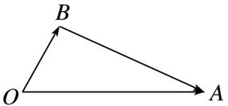
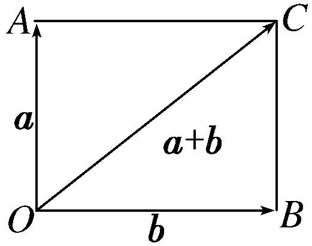
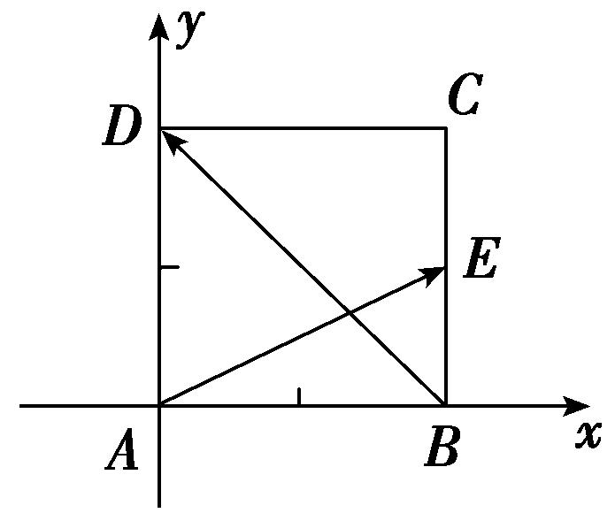
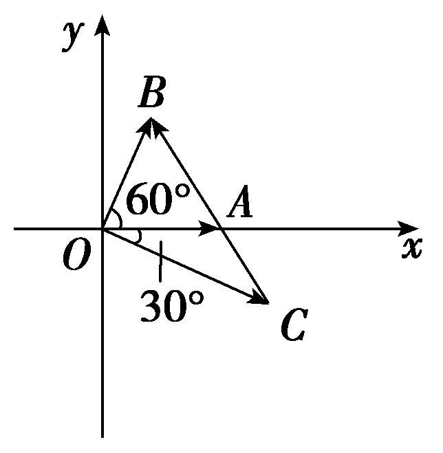

专题四　平面向量的夹角

平面向量的夹角公式  
（1）平面向量夹角公式的非坐标形式：cos<*a*，*b*>＝．<*a*，*b*>∈[0，π]．  
（2）平面向量夹角公式的坐标形式：若<em><strong>a</strong></em>＝(<em>x</em>1，<em>y</em>1)，<em><strong>b</strong></em>＝(<em>x</em>2，<em>y</em>2)，则cos&lt;<em><strong>a</strong></em>，<em><strong>b</strong></em>&gt;＝．&lt;<em><strong>a</strong></em>，<em><strong>b</strong></em>&gt;∈[0，π]．

考点一　平面向量的夹角问题

【方法总结】

求解两个非零向量之间的夹角的步骤

第一步：由坐标运算或定义计算出这两个向量的数量积；
第二步：分别求出这两个向量的模；
第三步：根据公式cos＜<em><strong>a</strong></em><strong>，</strong><em><strong>b</strong></em>＞<strong>＝＝</strong>求解出这两个向量夹角的余弦值；
第四步：根据两个向量夹角的范围是[0，π]及其夹角的余弦值，求出这两个向量的夹角．

【例题选讲】

<strong>[例1]</strong> （1）(2016·北京)已知向量<em><strong>a</strong></em>＝(1，)，<em><strong>b</strong></em>＝(，1)，则<em><strong>a</strong></em>与<em><strong>b</strong></em>夹角的大小为\_\_\_\_\_\_\_\_\_\_．
答案　　解析　因为cos<*a*，*b*>＝＝＝，所以*a*与*b*夹角的大小为．  
（2）已知|*a*|＝1，|*b*|＝6，*a*·(*b*－*a*)＝2，则向量*a*与*b*的夹角为(　　)

A．　　　　　　　　
B．　　　　　　　　
C．　　　　　　　　
D．
答案　B　解析　<em><strong>a</strong></em>·(<em><strong>b</strong></em>－<em><strong>a</strong></em>)＝<em><strong>a</strong></em>·<em><strong>b</strong></em>－<em><strong>a</strong></em>2＝2，所以<em><strong>a</strong></em>·<em><strong>b</strong></em>＝3，所以cos&lt;<em><strong>a</strong></em>，<em><strong>b</strong></em>&gt;＝＝＝，所以向量<em><strong>a</strong></em>与<em><strong>b</strong></em>的夹角为．  
（3）已知|*a*|＝|*b*|，且|*a*＋*b*|＝|*a*－*b*|，则向量*a*与*b*的夹角为(　　)

A．30°　　　　　　　　
B．45°　　　　　　　　
C．60°　　　　　　　　
D．120°
答案　C　解析　设<em><strong>a</strong></em>与<em><strong>b</strong></em>的夹角为<em>θ</em>，由已知可得<em><strong>a</strong>2</em>＋2<em><strong>a</strong>·<strong>b</strong></em>＋<em><strong>b</strong>2</em>＝3(<em><strong>a</strong>2</em>－2<em><strong>a</strong>·<strong>b</strong></em>＋<em><strong>b</strong>2</em>)，即4<em><strong>a</strong>·<strong>b</strong></em>＝<em><strong>a</strong>2</em>＋<em><strong>b</strong>2</em>．因为<em>|<strong>a</strong>|</em>＝<em>|<strong>b</strong>|</em>，所以<em><strong>a</strong>·<strong>b</strong></em>＝<em><strong>a</strong>2</em>，所以cos <em>θ</em>＝＝，<em>θ</em>＝60°．  
（4）(2019·全国Ⅰ)已知非零向量*a*，*b*满足|*a*|＝2|*b*|，且(*a*－*b*)⊥*b*，则*a*与*b*的夹角为(　　)

A．　　　　　　　　
B．　　　　　　　　
C．　　　　　　　　
D．
答案　B　解析　答案　B　解析　方法一　设<em><strong>a</strong></em>与<em><strong>b</strong></em>的夹角为<em>θ</em>，因为(<em><strong>a</strong></em>－<em><strong>b</strong></em>)⊥<em><strong>b</strong></em>，所以(<em><strong>a</strong></em>－<em><strong>b</strong></em>)·<em><strong>b</strong></em>＝<em><strong>a</strong></em>·<em><strong>b</strong></em>－|<em><strong>b</strong></em>|2＝0，又因为|<em><strong>a</strong></em>|＝2|<em><strong>b</strong></em>|，所以2|<em><strong>b</strong></em>|2cos <em>θ</em>－|<em><strong>b</strong></em>|2＝0，即cos <em>θ</em>＝，又<em>θ</em>∈[0，π]，所以<em>θ</em>＝，故选B．
方法二　如图，令＝*a*，＝*b*，则＝－＝*a*－*b*．

因为(<em><strong>a</strong></em>－<em><strong>b</strong></em>)⊥<em><strong>b</strong></em>，所以∠<em>OBA</em>＝，又|<em><strong>a</strong></em>|＝2|<em><strong>b</strong></em>|，所以∠<em>AOB</em>＝，即<em><strong>a</strong></em>与<em><strong>b</strong></em>的夹角为，故选B．  
（5）已知非零向量*a*，*b*满足：2*a·*(2*a*－*b*)＝*b·*(*b*－2*a*)，|*a*－*b*|＝3|*a*|，则*a*与*b*的夹角为\_\_\_\_\_\_\_\_．
答案　90°　解析　由2<em><strong>a</strong></em>·(2<em><strong>a</strong></em>－<em><strong>b</strong></em>)＝<em><strong>b·</strong></em>(<em><strong>b</strong></em>－2<em><strong>a</strong></em>)，得4<em><strong>a</strong></em>2＝<em><strong>b</strong></em>2，由|<em><strong>a</strong></em>－<em><strong>b</strong></em>|＝3|<em><strong>a</strong></em>|，得<em><strong>a</strong></em>2－2<em><strong>a·b</strong></em>＋2<em><strong>b</strong></em>2＝9<em><strong>a</strong></em>2，则<em><strong>a·b</strong></em>＝0，即<em><strong>a</strong></em>⊥<em><strong>b</strong></em>，∴<em><strong>a</strong></em>与<em><strong>b</strong></em>的夹角为90°．  
（6）若两个非零向量*a*，*b*满足|*a*＋*b*|＝|*a*－*b*|＝2|*b*|，则向量*a*＋*b*与*a*的夹角为(　　)

A．　　　　　　　　
B．　　　　　　　　
C．　　　　　　　　
D．
答案　D　解析　设|<em><strong>b</strong></em>|＝1，则|<em><strong>a</strong></em>＋<em><strong>b</strong></em>|＝|<em><strong>a</strong></em>－<em><strong>b</strong></em>|＝2．由|<em><strong>a</strong></em>＋<em><strong>b</strong></em>|＝|<em><strong>a</strong></em>－<em><strong>b</strong></em>|，得<em><strong>a</strong></em>·<em><strong>b</strong></em>＝0，故以<em><strong>a</strong></em>、<em><strong>b</strong></em>为邻边的平行四边形是矩形，且|<em><strong>a</strong></em>|＝，设向量<em><strong>a</strong></em>＋<em><strong>b</strong></em>与<em><strong>a</strong></em>的夹角为<em>θ</em>，则cos <em>θ</em>＝＝＝＝，又0≤<em>θ</em>≤π，所以<em>θ</em>＝．  
（7）已知平面向量*a*，*b*，|*a*|＝1，|*b*|＝，且|2*a*＋*b*|＝，则向量*a*与*a*＋*b*的夹角为(　　)

A．　　　　　　　　　
B．　　　　　　　　
C．　　　　　　　　
D．π
答案　B　解析　∵|2<em><strong>a</strong></em>＋<em><strong>b</strong></em>|2＝4|<em><strong>a</strong></em>|2＋4<em><strong>a</strong></em>·<em><strong>b</strong></em>＋|<em><strong>b</strong></em>|2＝7，|<em><strong>a</strong></em>|＝1，|<em><strong>b</strong></em>|＝，∴4＋4<em><strong>a</strong></em>·<em><strong>b</strong></em>＋3＝7，∴<em><strong>a</strong></em>·<em><strong>b</strong></em>＝0，∴<em><strong>a</strong></em>⊥<em><strong>b</strong></em>．如图所示，<em><strong>a</strong></em>与<em><strong>a</strong></em>＋<em><strong>b</strong></em>的夹角为∠<em>COA</em>．∵tan∠<em>COA</em>＝＝＝，∴∠<em>COA</em>＝，即<em><strong>a</strong></em>与<em><strong>a</strong></em>＋<em><strong>b</strong></em>的夹角为．

  
（8）(2020·全国Ⅲ)已知向量*a*，*b*满足|*a*|＝5，|*b*|＝6，*a*·*b*＝－6，则cos<*a*，*a*＋*b*>等于(　　)

A．－　　　　　　　　
B．－　　　　　　　　
C．　　　　　　　　
D．
答案　D　解析　∵|<em><strong>a</strong></em>＋<em><strong>b</strong></em>|2＝(<em><strong>a</strong></em>＋<em><strong>b</strong></em>)2＝<em><strong>a</strong></em>2＋2<em><strong>a</strong></em>·<em><strong>b</strong></em>＋<em><strong>b</strong></em>2＝25－12＋36＝49，∴|<em><strong>a</strong></em>＋<em><strong>b</strong></em>|＝7，∴cos&lt;<em><strong>a</strong></em>，<em><strong>a</strong></em>＋<em><strong>b</strong></em>&gt;＝＝＝＝．  
（9）已知单位向量<em><strong>e</strong></em>1与<em><strong>e</strong></em>2的夹角为<em>α</em>，且cos<em>α</em>＝，向量<em><strong>a</strong></em>＝3<em><strong>e</strong></em>1－2<em><strong>e</strong></em>2与<em><strong>b</strong></em>＝3<em><strong>e</strong></em>1－<em><strong>e</strong></em>2的夹角为<em>β</em>，则cos<em>β</em>＝\_\_\_\_\_\_\_\_．
答案　　解析　∵<em><strong>a</strong></em>2＝(3<em><strong>e</strong></em>1－2<em><strong>e</strong></em>2)2＝9＋4－2×3×2×＝9，<em><strong>b</strong></em>2＝(3<em><strong>e</strong></em>1－<em><strong>e</strong></em>2)2＝9＋1－2×3×1×＝8，<em><strong>a</strong></em>·<em><strong>b</strong></em>＝(3<em><strong>e</strong></em>1－2<em><strong>e</strong></em>2)·(3<em><strong>e</strong></em>1－<em><strong>e</strong></em>2)＝9＋2－9×1×1×＝8，∴cos <em>β</em>＝＝＝．  
（10）若平面向量*a*与平面向量*b*的夹角等于，|*a*|＝2，|*b*|＝3，则2*a*－*b*与*a*＋2*b*的夹角的余弦值等于(　　)

A．　　　　　　　　
B．－　　　　　　　　
C．　　　　　　　　
D．－
答案　B　解析　记向量2<em><strong>a</strong></em>－<em><strong>b</strong></em>与<em><strong>a</strong></em>＋2<em><strong>b</strong></em>的夹角为<em>θ</em>，又(2<em><strong>a</strong></em>－<em><strong>b</strong></em>)2＝4×22＋32－4×2×3×cos＝13，(<em><strong>a</strong></em>＋2<em><strong>b</strong></em>)2＝22＋4×32＋4×2×3×cos＝52，(2<em><strong>a</strong></em>－<em><strong>b</strong></em>)·(<em><strong>a</strong></em>＋2<em><strong>b</strong></em>)＝2<em><strong>a</strong></em>2－2<em><strong>b</strong></em>2＋3<em><strong>a</strong></em>·<em><strong>b</strong></em>＝8－18＋9＝－1，故cos<em>θ</em>＝＝－，即2<em><strong>a</strong></em>－<em><strong>b</strong></em>与<em><strong>a</strong></em>＋2<em><strong>b</strong></em>的夹角的余弦值是－．  
（11）已知正方形*ABCD*，点E在边*BC*上，且满足2＝，设向量，的夹角为*θ*，则cos *θ*＝\_\_\_\_\_\_\_\_．
答案　－　解析　因为2＝，所以<em>E</em>为<em>BC</em>中点．设正方形的边长为2，则||＝，||＝2，·＝·(－)＝||2－||2＋·＝×22－22＝－2，所以cos<em>θ</em>＝＝＝－．

优解：因为2＝，所以E为*BC*中点．设正方形的边长为2，建立如图所示的平面直角坐标系*xAy*，则点*A*(0，0)，*B*(2，0)，*D*(0，2)，E(2，1)，所以＝(2，1)，＝(－2，2)，所以·＝2×(－2)＋1×2＝－2，故cos *θ*＝＝＝－．

  
（12）(2020·浙江)已知平面单位向量<em><strong>e</strong></em>1，<em><strong>e</strong></em>2满足|2<em><strong>e</strong></em>1－<em><strong>e</strong></em>2|≤，设<em><strong>a</strong></em>＝<em><strong>e</strong></em>1＋<em><strong>e</strong></em>2，<em><strong>b</strong></em>＝3<em><strong>e</strong></em>1＋<em><strong>e</strong></em>2，向量<em><strong>a</strong></em>，<em><strong>b</strong></em>的夹角为<em>θ</em>，则cos2<em>θ</em>的最小值是\_\_\_\_\_\_\_\_．
答案　　解析　设<em><strong>e</strong></em>1＝(1,0)，<em><strong>e</strong></em>2＝(<em>x</em>，<em>y</em>)，则<em><strong>a</strong></em>＝(<em>x</em>＋1，<em>y</em>)，<em><strong>b</strong></em>＝(<em>x</em>＋3，<em>y</em>)．由2<em><strong>e</strong></em>1－<em><strong>e</strong></em>2＝(2－<em>x</em>，－<em>y</em>)，故|2<em><strong>e</strong></em>1－<em><strong>e</strong></em>2|＝≤，得(<em>x</em>－2)2＋<em>y</em>2≤2．又有<em>x</em>2＋<em>y</em>2＝1，得(<em>x</em>－2)2＋1－<em>x</em>2≤2，化简，得4<em>x</em>≥3，即<em>x</em>≥，因此≤<em>x</em>≤1．cos2<em>θ</em>＝2＝2＝2＝＝＝＝－，当<em>x</em>＝时，cos2<em>θ</em>有最小值，为＝．

【对点训练】

1．(2016·全国Ⅲ)已知向量＝，＝，则∠*ABC*等于(　　)

A．30°　　　　　　　　
B．45°　　　　　　　　
C．60°　　　　　　　　
D．120°

1．答案　A　解析　||＝1，||＝1，cos∠*ABC*＝＝．又∵0°≤∠*ABC*≤180°，∴∠*ABC*＝30°．

2．已知向量*a*，*b*满足*a·*(*a*－*b*)＝2，且|*a*|＝1，|*b*|＝2，则*a*与*b*的夹角为(　　)

A．　　　　　　　　
B．　　　　　　　　
C．　　　　　　　　
D．

2．答案　D　解析　由<em><strong>a·</strong></em>(<em><strong>a</strong></em>－<em><strong>b</strong></em>)＝2，得<em><strong>a</strong></em>2－<em><strong>a·b</strong></em>＝2，即|<em><strong>a</strong></em>|2－|<em><strong>a||b</strong></em>|cos&lt;<em><strong>a</strong></em>，<em><strong>b</strong></em>&gt;＝1－2cos&lt;<em><strong>a</strong></em>，<em><strong>b</strong></em>&gt;＝2．所以

cos<*a*，*b*>＝－，所以<*a*，*b*>＝，故选D．

3．已知向量<em>a</em>，<em>b</em>满足(2<em><strong>a</strong></em>－<em><strong>b</strong></em>)·(<em><strong>a</strong></em>＋<em><strong>b</strong></em>)＝6，且<strong>|</strong><em><strong>a</strong></em>|＝2，|<em><strong>b</strong></em><strong>|</strong>＝1，则<em><strong>a</strong></em>与<em><strong>b</strong></em>的夹角为\_\_\_\_\_\_\_\_．

3．答案　　解析　∵(2<em><strong>a</strong></em>－<em><strong>b</strong></em>)·(<em><strong>a</strong></em>＋<em><strong>b</strong></em>)＝6，∴2<em><strong>a</strong></em><strong>2</strong>＋<em><strong>a</strong></em><strong>·</strong><em><strong>b</strong></em>－<em><strong>b</strong></em><strong>2</strong>＝6，又<strong>|</strong><em><strong>a</strong></em><strong>|</strong>＝2，<strong>|</strong><em><strong>b</strong></em><strong>|</strong>＝1，∴<em><strong>a</strong></em><strong>·</strong><em><strong>b</strong></em>＝－1，∴cos&lt;<em><strong>a</strong></em>，

<em><strong>b</strong></em>&gt;＝＝－，又&lt;<em><strong>a</strong></em><strong>，</strong><em><strong>b</strong></em>&gt;∈[0，π]，∴<em><strong>a</strong></em>与<em><strong>b</strong></em>的夹角为．

4．已知非零向量*a*，*b*满足|*a*|＝|*b*|，且|*a*＋*b*|＝|2*a*－*b*|，则*a*与*b*的夹角为(　　)

A．　　　　　　　　
B．　　　　　　　　
C．　　　　　　　　
D．

4．答案　C　解析　设<em><strong>a</strong></em>与<em><strong>b</strong></em>的夹角为<em>θ</em>．由|<em><strong>a</strong></em>＋<em><strong>b</strong></em>|＝|2<em><strong>a</strong></em>－<em><strong>b</strong></em>|，得<em><strong>a</strong></em>·<em><strong>b</strong></em>＝<em><strong>a</strong></em>2，所以cos <em>θ</em>＝＝，所以<em>θ</em>

＝．

5．已知|*a*|＝1，|*b*|＝，且*a*⊥(*a*－*b*)，则向量*a*与向量*b*的夹角为(　　)

A．　　　　　　　　
B．　　　　　　　　
C．　　　　　　　　
D．

5．答案　B　解析　∵<em><strong>a</strong></em>⊥(<em><strong>a</strong></em>－<em><strong>b</strong></em>)，<em><strong>∴a·</strong></em>(<em><strong>a</strong></em>－<em><strong>b</strong></em>)＝<em><strong>a2</strong></em>－<em><strong>a·b</strong></em>＝1－cos＜<em><strong>a</strong></em>，<em><strong>b</strong></em>＞＝0，∴cos＜<em><strong>a</strong></em>，<em><strong>b</strong></em>＞＝，∴

＜*a*，*b*＞＝．

6．已知|*a*|＝1，|*b*|＝2，*c*＝*a*＋*b*，且*c*⊥*a*，则向量*a*与*b*的夹角为(　　)

A．30°　　　　　　　　
B．60°　　　　　　　　
C．120°　　　　　　　　
D．150°

6．答案　C　解析　设向量<em><strong>a</strong></em>与<em><strong>b</strong></em>的夹角为<em>θ</em>，∵<em><strong>c</strong></em>＝<em><strong>a</strong></em>＋<em><strong>b</strong></em>，<em><strong>c</strong></em>⊥<em><strong>a</strong></em>，∴<em><strong>c</strong></em>·<em><strong>a</strong></em>＝(<em><strong>a</strong></em>＋<em><strong>b</strong></em>)·<em><strong>a</strong></em>＝<em><strong>a</strong></em>2＋<em><strong>a</strong></em>·<em><strong>b</strong></em>＝0，∴|<em><strong>a</strong></em>|2

＝－|<em><strong>a</strong></em>||<em><strong>b</strong></em>|·cos<em>θ</em>，∴cos <em>θ</em>＝－＝－＝－，∴<em>θ</em>＝120°．

7．若非零向量*a*，*b*满足|*a*|＝|*b*|，且(*a*－*b*)⊥(3*a*＋2*b*)，则*a*与*b*的夹角为(　　)

A．　　　　　　　　　
B．　　　　　　　　　
C．　　　　　　　　　
D．π

7．答案　A　解析　由(<em><strong>a</strong></em>－<em><strong>b</strong></em>)⊥(3<em><strong>a</strong></em>＋2<em><strong>b</strong></em>)，得(<em><strong>a</strong></em>－<em><strong>b</strong></em>)·(3<em><strong>a</strong></em>＋2<em><strong>b</strong></em>)＝0，即3<em><strong>a</strong></em>2－<em><strong>a</strong></em>·<em><strong>b</strong></em>－2<em><strong>b</strong></em>2＝0．又∵|<em><strong>a</strong></em>|＝|<em><strong>b</strong></em>|，
设&lt;<em><strong>a</strong></em>，<em><strong>b</strong></em>&gt;＝<em>θ</em>，即3|<em><strong>a</strong></em>|2－|<em><strong>a</strong></em>||<em><strong>b</strong></em>|cos <em>θ</em>－2|<em><strong>b</strong></em>|2＝0，∴|<em><strong>b</strong></em>|2－|<em><strong>b</strong></em>|2·cos <em>θ</em>－2|<em><strong>b</strong></em>|2＝0．∴cos <em>θ</em>＝．又∵0≤<em>θ</em>≤π，∴<em>θ</em>＝．

8．已知非零单位向量*a*，*b*满足|*a*＋*b*|＝|*a*－*b*|，则*a*与*b*－*a*的夹角是(　　)

A．　　　　　　　　
B．　　　　　　　　
C．　　　　　　　　
D．

8．答案　D　解析　由|<em><strong>a</strong></em>＋<em><strong>b</strong></em>|＝|<em><strong>a</strong></em>－<em><strong>b</strong></em>|可得(<em><strong>a</strong></em>＋<em><strong>b</strong></em>)2＝(<em><strong>a</strong></em>－<em><strong>b</strong></em>)2，即<em><strong>a</strong></em>·<em><strong>b</strong></em>＝0，而<em><strong>a</strong></em>·(<em><strong>b</strong></em>－<em><strong>a</strong></em>)＝<em><strong>a</strong></em>·<em><strong>b</strong></em>－<em><strong>a</strong></em>2＝－|<em><strong>a</strong></em>|2＜0，
即*a*与*b*－*a*的夹角为钝角，结合选项知选D．

9．不共线向量<em><strong>a</strong></em>，<em><strong>b</strong></em>满足|<em><strong>a</strong></em>|＝2|<em><strong>b</strong></em>|，且<em><strong>b</strong></em>2＝<em><strong>a·b</strong></em>，则<em><strong>a</strong></em>与<em><strong>b</strong></em>－<em><strong>a</strong></em>的夹角为(　　)

A．30°　　　　　　　　
B．60°　　　　　　　　
C．120°　　　　　　　　
D．150°

9．答案　D　解析　由已知得，<em><strong>b</strong></em>2＝<em><strong>a·b</strong></em>，∴<em><strong>b·</strong></em>(<em><strong>a</strong></em>－<em><strong>b</strong></em>)＝0，令＝<em><strong>a</strong></em>，＝<em><strong>b</strong></em>，则＝<em><strong>a</strong></em>－<em><strong>b</strong></em>，∵<em><strong>b·</strong></em>(<em><strong>a</strong></em>－<em><strong>b</strong></em>)＝0，
∴<em>BA</em>⊥<em>OB</em>，又|<em><strong>a</strong></em>|＝2|<em><strong>b</strong></em>|，∴∠<em>OAB</em>＝30°，故<em><strong>a</strong></em>与<em><strong>b</strong></em>－<em><strong>a</strong></em>的夹角为150°．

10．已知非零向量*a*，*b*满足|*a*＋*b*|＝|*a*－*b*|＝|*a*|，则向量*a*＋*b*与*a*－*b*的夹角为\_\_\_\_\_\_\_\_．

10．答案　　解析　将|<em><strong>a</strong></em>＋<em><strong>b</strong></em>|＝|<em><strong>a</strong></em>－<em><strong>b</strong></em>|两边平方，得<em><strong>a</strong></em>2＋<em><strong>b</strong></em>2＋2<em><strong>a</strong></em>·<em><strong>b</strong></em>＝<em><strong>a</strong></em>2＋<em><strong>b</strong></em>2－2<em><strong>a</strong></em>·<em><strong>b</strong></em>，∴<em><strong>a</strong></em>·<em><strong>b</strong></em>＝0．将|<em><strong>a</strong></em>＋<em><strong>b</strong></em>|＝

|<em><strong>a</strong></em>|两边平方，得<em><strong>a</strong></em>2＋<em><strong>b</strong></em>2＋2<em><strong>a</strong></em>·<em><strong>b</strong></em>＝<em><strong>a</strong></em>2，∴<em><strong>b</strong></em>2＝<em><strong>a</strong></em>2．设<em><strong>a</strong></em>＋<em><strong>b</strong></em>与<em><strong>a</strong></em>－<em><strong>b</strong></em>的夹角为<em>θ</em>，∴cos <em>θ</em>＝＝＝＝．又∵<em>θ</em>∈[0，π]，∴<em>θ</em>＝．

11．若非零向量<em><strong>a</strong></em>，<em><strong>b</strong></em>满足|<em><strong>a</strong></em>|＝3|<em><strong>b</strong></em>|＝|<em><strong>a</strong></em>＋2<em><strong>b</strong></em>|，则<em><strong>a</strong></em>，<em><strong>b</strong></em>夹角<em>θ</em>的余弦值为\_\_\_\_\_\_\_\_．

11．答案　－　解析　|<em><strong>a</strong></em>|＝|<em><strong>a</strong></em>＋2<em><strong>b</strong></em>|，两边平方得，|<em><strong>a</strong></em>|2＝|<em><strong>a</strong></em>|2＋4|<em><strong>b</strong></em>|2＋4<em><strong>a</strong></em>·<em><strong>b</strong></em>＝|<em><strong>a</strong></em>|2＋4|<em><strong>b</strong></em>|2＋4|<em><strong>a</strong></em>||<em><strong>b</strong></em>|·cos <em>θ</em>．又|<em><strong>a</strong></em>|＝

3|<em><strong>b</strong></em>|，所以0＝4|<em><strong>b</strong></em>|2＋12|<em><strong>b</strong></em>|2cos <em>θ</em>，得cos <em>θ</em>＝－．

12．已知向量<em><strong>a</strong></em>＝(3，1)，<em><strong>b</strong></em>＝(1，3)，<em><strong>c</strong></em>＝(<em>k</em>，－2)，若(<em><strong>a</strong></em>－<em><strong>c</strong></em>)∥<em><strong>b</strong></em>，则向量<em><strong>a</strong></em>与向量<em><strong>c</strong></em>的夹角的余弦值是(　　)

A．　　　　　　　　
B．　　　　　　　　
C．－　　　　　　　　
D．－

12．答案　A　解析　由已知得<em><strong>a</strong></em>－<em><strong>c</strong></em>＝(3－<em>k</em>，3)，∵(<em><strong>a</strong></em>－<em><strong>c</strong></em>)∥<em><strong>b</strong></em>，∴3(3－<em>k</em>)－3＝0，∴<em>k</em>＝2，即<em><strong>c</strong></em>＝(2，－

2)，∴cos<*a*，*c*>＝＝＝．

13．在△*ABC*和△*AEF*中，*B*是*EF*的中点，*AB*＝*EF*＝1，*BC*＝6，*CA*＝，若·＋·＝2，则

与的夹角的余弦值等于\_\_\_\_\_\_\_\_．

13．答案　　解析　由题意可得2＝(－)2＝2＋2－2·＝33＋1－2·＝36，∴·＝

－1．由·＋·＝2，可得·(＋)＋·(＋)＝2＋·＋·＋·＝1－·＋(－1)＋·＝·(－)＝·＝2，故有·＝4．再由·＝1×6×cos&lt;，&gt;，可得6×cos&lt;，&gt;＝4，∴cos&lt;，&gt;＝．

14．△<em>ABC</em>是边长为2的等边三角形，向量<em><strong>a</strong></em>，<em><strong>b</strong></em>满足＝2<em><strong>a</strong></em>，＝2<em><strong>a</strong></em>＋<em><strong>b</strong></em>，则向量<em><strong>a</strong></em>，<em><strong>b</strong></em>的夹角为(　　)

A．30°　　　　　　　　
B．60°　　　　　　　　
C．120°　　　　　　　　
D．150°

14．答案　C　解析　法一：设向量<em><strong>a</strong></em>，<em><strong>b</strong></em>的夹角为<em>θ</em>，＝－＝2<em><strong>a</strong></em>＋<em><strong>b</strong></em>－2<em><strong>a</strong></em>＝<em><strong>b</strong></em>，∴||＝|<em><strong>b</strong></em>|＝2，|

|＝2|<em><strong>a</strong></em>|＝2，∴|<em><strong>a</strong></em>|＝1，2＝(2<em><strong>a</strong></em>＋<em><strong>b</strong></em>)2＝4<em><strong>a</strong></em>2＋4<em><strong>a</strong></em>·<em><strong>b</strong></em>＋<em><strong>b</strong></em>2＝8＋8cos <em>θ</em>＝4，∴cos <em>θ</em>＝－，<em>θ</em>＝120°．

法二：＝－＝2*a*＋*b*－2*a*＝*b*，则向量*a*，*b*的夹角为向量与的夹角，故向量*a*，*b*的夹角为120°．

15．(2014·全国Ⅰ)已知*A*，*B*，*C*为圆*O*上的三点，若＝(＋)，则与的夹角为\_\_\_\_\_\_\_\_．

15．答案　90°　解析　由＝(＋)，可得*O*为*BC*的中点，故*BC*为圆*O*的直径，所以与

的夹角为90°．

16．在△*ABC*中，(－3)⊥，则角*A*的最大值为\_\_\_\_\_\_\_\_．

16．答案　　解析　因为(－3)⊥，所以(－3)·＝0，(－3)·(－)＝0，2－4·

＋32＝0，即cos <em>A</em>＝＝＋≥2＝，当且仅当||＝||时等号成立．因为0＜<em>A</em>＜π，所以0＜<em>A</em>≤，即角<em>A</em>的最大值为．

考点二　平面向量的夹角的应用

【方法总结】  
（1）向量<em><strong>a</strong></em><strong>，</strong><em><strong>b</strong></em>的夹角为锐角⇔<em><strong>a</strong></em>·<em><strong>b</strong></em>&gt;0且向量<em><strong>a</strong></em><strong>，</strong><em><strong>b</strong></em>不共线．  
（2）向量<em><strong>a</strong></em><strong>，</strong><em><strong>b</strong></em>的夹角为钝角⇔<em><strong>a</strong></em>·<em><strong>b</strong></em>&lt;0且向量<em><strong>a</strong></em><strong>，</strong><em><strong>b</strong></em>不共线．

研究向量的夹角应注意“共起点”，两个非零共线向量的夹角可能是0或π．数量积大于0说明不共线的两向量的夹角为锐角，数量积等于0说明不共线的两向量的夹角为直角，数量积小于0且两向量不共线时两向量的夹角为钝角．

【例题选讲】

<strong>[例1]</strong> （1）(2013·全国Ⅰ)已知两个单位向量<em><strong>a</strong></em>，<em><strong>b</strong></em>的夹角为60°，<em><strong>c</strong></em>＝<em>t<strong>a</strong></em>＋(1－<em>t</em>)<em><strong>b</strong></em>．若<em><strong>b</strong></em>·<em><strong>c</strong></em>＝0，则<em>t</em>＝\_\_\_\_\_\_\_\_．
答案　2　解析　解法1　因为向量<em><strong>a</strong></em>，<em><strong>b</strong></em>为单位向量，所以<em><strong>b</strong></em>2＝1，又向量<em><strong>a</strong></em>，<em><strong>b</strong></em>的夹角为60°，所以<em><strong>a</strong></em>·<em><strong>b</strong></em>＝，由<em><strong>b</strong></em>·<em><strong>c</strong></em>＝0得<em><strong>b</strong></em>·[<em>t<strong>a</strong></em>＋(1－<em>t</em>)<em><strong>b</strong></em>]＝0，即<em>t<strong>a</strong></em>·<em><strong>b</strong></em>＋(1－<em>t</em>)<em><strong>b</strong></em>2＝0，所以<em>t</em>＋(1－<em>t</em>)＝0，所以<em>t</em>＝2．
解法2　由<em>t</em>＋(1－<em>t</em>)＝1知向量<em><strong>a</strong></em>、<em><strong>b</strong></em>、<em><strong>c</strong></em>的终点<em>A</em>、<em>B</em>、<em>C</em>共线，在平面直角坐标系中设<em><strong>a</strong></em>＝(1，0)，<em><strong>b</strong></em>＝，则<em><strong>c</strong></em>＝．把<em><strong>a</strong></em>、<em><strong>b</strong></em>、<em><strong>c</strong></em>的坐标代入<em><strong>c</strong></em>＝<em>t<strong>a</strong></em>＋(1－<em>t</em>)<em><strong>b</strong></em>，得<em>t</em>＝2．

  
（2）(2013·山东)已知向量与的夹角为120°，且||＝3，||＝2．若＝*λ*＋，且⊥，则实数*λ*的值为\_\_\_\_\_\_\_\_．
答案　　解析　由⊥知·＝0，即·＝(<em>λ</em>＋)·(－)＝(<em>λ</em>－1)·－<em>λA</em>2＋2＝(<em>λ</em>－1)×3×2×－<em>λ</em>×9＋4＝0，解得<em>λ</em>＝．  
（3）已知<em><strong>a</strong></em>＝(<em>λ</em>，2<em>λ</em>)，<em><strong>b</strong></em>＝(3<em>λ</em>，2)，如果<em><strong>a</strong></em>与<em><strong>b</strong></em>的夹角为锐角，则<em>λ</em>的取值范围是\_\_\_\_\_．
答案　∪∪　解析　<em><strong>a</strong></em>与<em><strong>b</strong></em>的夹角为锐角，则<em><strong>a·b</strong></em>&gt;0且<em><strong>a</strong></em>与<em><strong>b</strong></em>不共线，则解得<em>λ</em>&lt;－或0&lt;<em>λ</em>&lt;或<em>λ</em>&gt;，所以<em>λ</em>的取值范围是∪∪．

  
（4）已知向量＝(3，－4)，＝(6，－3)，＝(5－*m*，－3－*m*)，若∠*ABC*为锐角，则实数*m*的取值范围是\_\_\_\_\_\_\_\_．
答案　(－，)∪(，＋∞)　解析　由已知得＝－＝(3，1)，＝－＝(2－*m，* 1－*m*)．若∥，则有3(1－*m*)＝2－*m*，解得*m*＝．由题设知，＝(－3，－1)，＝(－1－*m*，－*m*)．∵∠*ABC*为锐角，∴·＝3＋3*m*＋*m*>0，可得*m*>－．由题意知，当*m*＝时，∥．故当∠*ABC*为锐角时，实数*m*的取值范围是(－，)∪(，＋∞)．  
（5）已知<em><strong>a</strong></em>＝(1，－1)，<em><strong>b</strong></em>＝(<em>λ</em>，1)，若<em><strong>a</strong></em>与<em><strong>b</strong></em>的夹角<em>α</em>为钝角，则实数<em>λ</em>的取值范围是\_\_\_\_\_\_\_\_\_\_．
答案　(－∞，－1)∪(－1，1)　解析　因为<em><strong>a</strong></em>＝(1，－1)，<em><strong>b</strong></em>＝(<em>λ</em>，1)，所以|<em><strong>a</strong></em>|＝，|<em>b</em>|＝，<em><strong>a·b</strong></em>＝<em>λ</em>－1．因为<em><strong>a</strong></em>，<em><strong>b</strong></em>的夹角<em>α</em>为钝角，所以即所以<em>λ</em>&lt;1且<em>λ</em>≠－1，所以<em>λ</em>的取值范围是(－∞，－1)∪(－1，1)．  
（6）已知向量<em><strong>e</strong></em>1，<em><strong>e</strong></em>2满足<em><strong>|e</strong></em>1<em><strong>|</strong></em>＝2，<em><strong>|e</strong></em>2<em><strong>|</strong></em>＝1，<em><strong>e</strong></em>1，<em><strong>e</strong></em>2的夹角为60°，若2<em>t<strong>e</strong></em>1＋7<em><strong>e</strong></em>2与<em><strong>e</strong></em>1＋<em>t<strong>e</strong></em>2的夹角为钝角，则实数<em>t</em>的取值范围是\_\_\_\_\_\_\_\_\_\_．
答案　　解析　因为2<em>t<strong>e</strong></em>1＋7<em><strong>e</strong></em>2与<em><strong>e</strong></em>1＋<em>t<strong>e</strong></em>2的夹角为钝角，所以(2<em>t<strong>e</strong></em>1＋7<em><strong>e</strong></em>2)·(<em><strong>e</strong></em>1＋<em>t<strong>e</strong></em>2)&lt;0，所以2<em>t<strong>e</strong></em>＋(2<em>t</em>2＋7)(<em><strong>e</strong></em>1·<em><strong>e</strong></em>2)＋7<em>t<strong>e</strong></em>&lt;0．因为|<em><strong>e</strong></em>1|＝2，|<em><strong>e</strong></em>2|＝1，<em><strong>e</strong></em>1·<em><strong>e</strong></em>2＝1，所以2<em>t</em>2＋15<em>t</em>＋7&lt;0，解得－7&lt;<em>t</em>&lt;－．若2<em>t<strong>e</strong></em>1＋7<em><strong>e</strong></em>2与<em><strong>e</strong></em>1＋<em>t<strong>e</strong></em>2共线，由于<em><strong>e</strong></em>1，<em><strong>e</strong></em>2不共线，所以＝，解得<em>t</em>＝±，所以<em>t</em>≠±，因此实数<em>t</em>的取值范围为∪．

【对点训练】

1．(2017·山东)已知<em><strong>e</strong></em>1，<em><strong>e</strong></em>2是互相垂直的单位向量，若<em><strong>e</strong></em>1－<em><strong>e</strong></em>2与<em><strong>e</strong></em>1＋<em>λ<strong>e</strong></em>2的夹角为60°，则实数<em>λ</em>的值是

\_\_\_\_\_\_\_\_．

1．答案　　解析　由题意知|<em><strong>e</strong></em>1|＝|<em><strong>e</strong></em>2|＝1，<em><strong>e</strong></em>1·<em><strong>e</strong></em>2＝0，|<em><strong>e</strong></em>1－<em><strong>e</strong></em>2|＝＝＝

＝2．同理|<em><strong>e</strong></em>1＋<em>λ<strong>e</strong></em>2|＝．所以cos60°＝＝＝＝，解得<em>λ</em>＝．

2．平面向量<em><strong>a</strong></em>＝(1，2)，<em><strong>b</strong></em>＝(4，2)，<em><strong>c</strong></em>＝<em>m<strong>a</strong></em>＋<em><strong>b</strong></em>(<em>m</em>∈<strong>R</strong>)，且<em><strong>c</strong></em>与<em><strong>a</strong></em>的夹角等于<em><strong>c</strong></em>与<em><strong>b</strong></em>的夹角，则<em>m</em>等于(　　)

A．－2　　　　　　　　
B．－1　　　　　　　　
C．1　　　　　　　　
D．2

2．答案　D　解析　因为<em><strong>a</strong></em>＝(1，2)，<em><strong>b</strong></em>＝(4，2)，所以<em><strong>c</strong></em>＝<em>m<strong>a</strong></em>＋<em><strong>b</strong></em>＝(<em>m，</em>2<em>m</em>)＋(4，2)＝(<em>m</em>＋4，2<em>m</em>＋2)．根
据题意可得＝，所以＝，解得*m*＝2．

3．若平面向量*a*与平面向量*b*的夹角等于，|*a*|＝2，|*b*|＝3，则2*a*－*b*与*a*＋2*b*的夹角的余弦值等于(　　)

A．　　　　　　　　
B．－　　　　　　　　
C．　　　　　　　　
D．－

3．答案　B　解析　记向量2<em><strong>a</strong></em>－<em><strong>b</strong></em>与<em><strong>a</strong></em>＋2<em><strong>b</strong></em>的夹角为<em>θ</em>，又(2<em><strong>a</strong></em>－<em><strong>b</strong></em>)2＝4×22＋32－4×2×3×cos＝13，(<em><strong>a</strong></em>＋2<em><strong>b</strong></em>)2

＝22＋4×32＋4×2×3×cos＝52，(2<em><strong>a</strong></em>－<em><strong>b</strong></em>)·(<em><strong>a</strong></em>＋2<em><strong>b</strong></em>)＝2<em><strong>a</strong></em>2－2<em><strong>b</strong></em>2＋3<em><strong>a</strong></em>·<em><strong>b</strong></em>＝8－18＋9＝－1，故cos <em>θ</em>＝＝－，即向量2<em><strong>a</strong></em>－<em><strong>b</strong></em>与<em><strong>a</strong></em>＋2<em><strong>b</strong></em>的夹角的余弦值是－，因此选B．

4．已知向量<em><strong>a</strong></em>＝(1，2)，<em><strong>b</strong></em>＝(1，1)，且<em><strong>a</strong></em>与<em><strong>a</strong></em>＋<em>λ<strong>b</strong></em>的夹角为锐角，则实数<em>λ</em>的取值范围是\_\_\_\_\_\_\_\_\_\_．

4．答案　∪　解析　<em><strong>a</strong></em>＋<em>λ<strong>b</strong></em>＝(1＋<em>λ</em>，2＋<em>λ</em>)，由<em><strong>a</strong></em>·(<em><strong>a</strong></em>＋<em>λ<strong>b</strong></em>)&gt;0，可得<em>λ</em>&gt;－．又<em><strong>a</strong></em>与<em><strong>a</strong></em>＋

<em>λ<strong>b</strong></em>不共线，∴<em>λ</em>≠0．故<em>λ</em>&gt;－且<em>λ</em>≠0．

5．设向量<em><strong>a</strong></em>＝(1，)，<em><strong>b</strong></em>＝(<em>m</em>，)，且<em><strong>a</strong></em>，<em><strong>b</strong></em>的夹角为锐角，则实数<em>m</em>的取值范围是\_\_\_\_\_\_\_\_\_\_\_．

5．答案　(－3，1)∪(1，＋∞)　解析　因为<em><strong>a</strong></em>，<em><strong>b</strong></em>的夹角为锐角，所以<em><strong>a</strong></em>·<em><strong>b</strong></em>＝<em>m</em>＋3&gt;0，解得<em>m</em>&gt;－3，又当

<em>m</em>＝1时，〈<em><strong>a</strong></em>，<em><strong>b</strong></em>〉＝0不符合题意，所以<em>m</em>&gt;－3且<em>m</em>≠1．

6．已知<em><strong>a</strong></em>＝(2，－1)，<em><strong>b</strong></em>＝(<em>λ</em>，3)，若<em><strong>a</strong></em>与<em><strong>b</strong></em>的夹角为钝角，则<em>λ</em>的取值范围是\_\_\_\_\_\_\_\_\_\_\_\_．

6．答案　(－∞，－6)∪　解析　由<em><strong>a·b</strong></em>&lt;0，即2<em>λ</em>－3&lt;0，解得<em>λ</em>&lt;，由<em><strong>a</strong></em>∥<em><strong>b</strong></em>得：6＝－<em>λ</em>，即<em>λ</em>＝

－6．因此*λ*的取值范围是*λ*<，且*λ*≠－6．

7．若向量<em><strong>a</strong></em>＝(<em>k</em>，3)，<em><strong>b</strong></em>＝(1，4)，<em><strong>c</strong></em>＝(2，1)，已知2<em><strong>a</strong></em>－3<em><strong>b</strong></em>与<em><strong>c</strong></em>的夹角为钝角，则<em>k</em>的取值范围是\_\_\_\_\_\_\_\_．

7．答案　∪　解析　∵2<em><strong>a</strong></em>－3<em><strong>b</strong></em>与<em><strong>c</strong></em>的夹角为钝角，∴(2<em><strong>a</strong></em>－3<em><strong>b</strong></em>)·<em><strong>c</strong></em>&lt;0，即(2<em>k</em>－3，－

6)·(2，1)&lt;0，解得<em>k</em>＜3．又若(2<em><strong>a</strong></em>－3<em><strong>b</strong></em>)∥<em><strong>c</strong></em>，则2<em>k</em>－3＝－12，即<em>k</em>＝－．当<em>k</em>＝－时，2<em><strong>a</strong></em>－3<em><strong>b</strong></em>＝(－12，－6)＝－6<em><strong>c</strong></em>，此时2<em><strong>a</strong></em>－3<em><strong>b</strong></em>与<em><strong>c</strong></em>反向，不合题意．综上，<em>k</em>的取值范围为∪．

