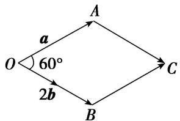

# 专题五 平面向量的模

# 平面向量的模长公式  
（1）平面向量模长公式的非坐标形式： $|a|=\sqrt{a^{2}}$ .  
（2）平面向量模长公式的坐标形式：若 $\boldsymbol{a}=(x,y)$ ，则 $|a|=\sqrt{x^{2}+y^{2}}$ .

# 考点一 平面向量模的定值问题

# 【方法总结】

# 求向量模的常用方法  
（1）若向量 a, b 是以非坐标形式出现的，求向量 a 的模可应用公式 $|a| = \sqrt{a^{2}}$ 。将模长问题转化为数量积问题，通过 $(a \pm b)^{2} = a^{2} \pm 2a \cdot b + b^{2}$ 从而能够与条件中的已知向量（已知模长，夹角的基向量）找到联系。  
（2）若向量 a 是以坐标形式出现的，求向量 a 的模可直接利用公式 $\left|a\right|=\sqrt{x^{2}+y^{2}}$ 。某些题目如果能把几何图形放入坐标系中，则只要确定所求向量的坐标，即可求出(或表示)出模长。  
（3）数形结合法，利用模的几何意义.

# 【例题选讲】

[例 1] （1）(2017·全国 I) 已知向量 a, b 的夹角为 $60^{\circ}$ ， $|a|=2$ ， $|b|=1$ ，则 $|a+2b|=$ \_\_\_\_.

  
（2）(2012·全国)已知向量 a，b 夹角为 $45^{\circ}$ ，且 $|a|=1$ ， $|2a-b|=\sqrt{10}$ ，则 $|b|=$ \_\_\_\_.  
（3）若向量 a, b 满足： $|a|=1$ ， $(a+b)\perp a$ ， $(2a+b)\perp b$ ，则 $|b|=(\quad)$

A. 2

B. $\sqrt{2}$

C. 1

D. $\frac{\sqrt{2}}{2}$  
（4）已知向量 $\boldsymbol{a}=(x,\sqrt{3})$ , $\boldsymbol{b}=(x,-\sqrt{3})$ ，若 $(2\boldsymbol{a}+\boldsymbol{b})\perp\boldsymbol{b}$ ，则 $|a|=(\quad)$

A. 1

B. $\sqrt{2}$

C. $\sqrt{3}$

D. 2  
（5）若 $|\overrightarrow{AB}|=|\overrightarrow{AC}|=|\overrightarrow{AB}-\overrightarrow{AC}|=2$ ，则 $|\overrightarrow{AB}+\overrightarrow{AC}|=$ \_\_\_\_.  
（6） (2013·天津)在平行四边形 $ABCD$ 中, $AD = 1$ , $\angle BAD = 60^{\circ}$ , $E$ 为 $CD$ 的中点. 若 $\overrightarrow{AC} \cdot \overrightarrow{BE} = 1$ , 则 $AB$ 的长为 \_\_\_\_.

# 【对点训练】

1. 已知向量 $a, b$ 均为单位向量，若它们的夹角为 $60^{\circ}$ ，则 $|a + 3b|$ 等于（）

A. $\sqrt{7}$

B. $\sqrt{10}$

C. $\sqrt{13}$

D. 4

2. (2012·全国)平面向量 a 与 b 的夹角为 $45^{\circ}$ ， $a=(1,1)$ ， $|b|=2$ ，则 $|3a+b|$ 等于()

A. $13+6\sqrt{2}$

B. $2 \sqrt{5}$

C. $\sqrt{30}$

D. $\sqrt{34}$

3. 已知 $|a|=1$ ， $|b|=2$ ，a与b的夹角为 $\frac{\pi}{3}$ ，那么 $|4a-b|=()$

A. 2

B. 6

C. $2\sqrt{3}$

D. 12

4. 已知非零向量 a, b 的夹角为 $60^{\circ}$ ，且 $|b|=1$ ， $|2a-b|=1$ ，则 $|a|=(\quad)$

A. $\frac{1}{2}$

B. 1

C. $\sqrt{2}$

D. 2

5. 已知 $e_{1}$ ， $e_{2}$ 是平面单位向量，且 $e_{1} \cdot e_{2} = \frac{1}{2}$ 。若平面向量 b 满足 $b \cdot e_{1} = b \cdot e_{2} = 1$ ，则 $|b| =$ \_\_\_\_ 。

6. 已知 a, b 为单位向量，且 $a \perp (a + 2b)$ ，则 $|a - 2b| =$ \_\_\_\_ .

7. 设向量 a, b 满足 $|a|=1$ , $|a-b|=\sqrt{3}$ , $a\cdot(a-b)=0$ , 则 $|2a+b|=(\quad)$

A. 2

B. $2\sqrt{3}$

C. 4

D. $4\sqrt{3}$

8. 已知平面向量 $a, b$ ，满足 $a = (1, \sqrt{3})$ ， $|b| = 3$ ， $a \perp (a - 2b)$ ，则 $|a - b| = (\quad)$

A. 2

B. 3

C. 4

D. 6

9. 设 $x \in \mathbf{R}$ , 向量 $a = (x, 1)$ , $b = (1, -2)$ , 且 $a \perp b$ , 则 $|a + b| = (\quad)$

A. $\sqrt{5}$

B. $\sqrt{10}$

C. $2\sqrt{5}$

D. 10

10. 已知 $A(1, 0)$ , $B(4, 0)$ , $C(3, 4)$ , $O$ 为坐标原点, 且 $\overrightarrow{OD} = \frac{1}{2} (\overrightarrow{OA} + \overrightarrow{OB} - \overrightarrow{CB})$ , 则 $|\overrightarrow{BD}| =$ \_\_\_\_.

11. 已知平面向量 $a = (2, 4)$ , $b = (1, -2)$ , 若 $c = a - (a \cdot b) \cdot b$ , 则 $|c| = \_$ .

12. 在 $\triangle ABC$ 中， $O$ 为 $BC$ 的中点，若 $AB=1$ ， $AC=4$ ， $<\overrightarrow{AB}$ ， $\overrightarrow{AC}>=60^{\circ}$ ，则 $|\overrightarrow{OA}|=$ \_\_\_\_.

13. 在 $\triangle ABC$ 中， $\angle BAC=60^{\circ}$ ， $AB=5$ ， $AC=6$ ， $D$ 是 $AB$ 上一点，且 $\overrightarrow{AB} \cdot \overrightarrow{CD}=-5$ ，则 $|\overrightarrow{BD}|$ 等于( )

A. 1

B. 2

C. 3

D. 4

# 考点二 平面向量模的最值(范围)问题

# 【方法总结】

# 求向量模的最值(范围)的 2 种方法  
（1）代数法：把所求的模表示成某个变量的函数，再用求最值的方法求解.  
（2）几何法(数形结合法): 弄清所求的模表示的几何意义, 结合动点表示的图形求解.

# 【例题选讲】

[例 1] （1） 已知向量 $a=(1, \sqrt{3})$ , $b=(0, t^{2}+1)$ ，则当 $t \in [-\sqrt{3}, 2]$ 时， $\left|a-t\frac{b}{|b|}\right|$ 的取值范围是 \_\_\_\_.  
（2）已知直角梯形 ABCD 中， $AD \parallel BC$ ， $\angle ADC = 90^{\circ}$ ，AD = 2，BC = 1，P 是腰 DC 上的动点，则 $\overrightarrow{PA} + 3\overrightarrow{PB}$ 的最小值为 \_\_\_\_。  
（3）已知 a, b 是两个互相垂直的单位向量，且 $c \cdot a = 1, c \cdot b = 1, |c| = \sqrt{2}$ ，则对任意的正实数 t， $\left|c + ta + \frac{1}{t}b\right|$ 的最小值是（）

A. 2

B. $2\sqrt{2}$

C. 4

D. $4\sqrt{2}$  
（4）已知 P 是边长为 3 的等边三角形 ABC 外接圆上的动点，则 $\left|\overrightarrow{PA}+\overrightarrow{PB}+2\overrightarrow{PC}\right|$ 的最大值为()

A. $2 \sqrt{3}$

B. $3\sqrt{3}$

C. $4\sqrt{3}$

D. $5\sqrt{3}$  
（5）已知平面向量 a，b 满足 $|b|=1$ ，且 a 与 b-a 的夹角为 $120^{\circ}$ ，则 $|a|$ 的取值范围为 \_\_\_\_.  
（6）已知 $|\overrightarrow{AB}|=1,\quad|\overrightarrow{BC}|=2$ ，若 $\overrightarrow{AB}\cdot\overrightarrow{BC}=0,\quad\overrightarrow{AD}\cdot\overrightarrow{DC}=0$ ，则 $|\overrightarrow{BD}|$ 的最大值为()

A. $\frac{2\sqrt{5}}{5}$

B. 2

C. $\sqrt{5}$

D. $2\sqrt{5}$

# 【对点训练】

1. 已知向量 $\overrightarrow{OA} = (3, 1)$ , $\overrightarrow{OB} = (-1, 3)$ , $\overrightarrow{OC} = m\overrightarrow{OA} - n\overrightarrow{OB}(m > 0, n > 0)$ , 若 $m + n = 1$ , 则 $|\overrightarrow{OC}|$ 的最小值为( )

A. $\frac{\sqrt{5}}{2}$

B. $\frac{\sqrt{10}}{2}$

C. $\sqrt{5}$

D. $\sqrt{10}$

2. 已知在直角梯形 $ABCD$ 中, $AB = AD = 2CD = 2$ , $\angle ADC = 90^{\circ}$ , 若点 $M$ 在线段 $AC$ 上, 则 $|\overrightarrow{MB} + \overrightarrow{MD}|$ 的取值范围为 \_\_\_\_.

3. 已知直角梯形 $ABCD$ 中, $AD \parallel BC$ , $\angle BAD = 90^{\circ}$ , $\angle ADC = 45^{\circ}$ , $AD = 2$ , $BC = 1$ , $P$ 是腰 $CD$ 上的动点, 则 $|3\overrightarrow{PA} + \overrightarrow{BP}|$ 的最小值为 \_\_\_\_.

4. 已知 $a, b$ 是平面内两个互相垂直的单位向量，若向量 $c$ 满足 $(a - c) \cdot (b - c) = 0$ ，则 $|c|$ 的最大值是（）

A. 1

B. 2

C. $\sqrt{2}$

D. $\frac{\sqrt{2}}{2}$

5. 在 $\triangle ABC$ 中，若 $A=120^{\circ}$ ， $\overrightarrow{AB} \cdot \overrightarrow{AC} = -1$ ，则 $|\overrightarrow{BC}|$ 的最小值是( )

A. $\sqrt{2}$

B. 2

C. $\sqrt{6}$

D. 6

6. 已知非零向量 a, b, c 满足 $|a| = |b| = |a - b|$ , $<c - a, c - b> = \frac{2\pi}{3}$ ，则 $\frac{|c|}{|a|}$ 的最大值为 \_\_\_\_.

7. 已知向量 $a, b$ 的夹角为 $\frac{\pi}{3}$ , $|b| = 2$ , 对任意 $x \in \mathbf{R}$ , 有 $|b + xa| \geq |a - b|$ , 则 $|tb - a| + \left|t b - \frac{a}{2}\right|(t \in \mathbf{R})$ 的最小值

为\_\_\_\_。

8. 已知单位向量 $e_{1}$ ， $e_{2}$ ，且 $e_{1} \cdot e_{2} = -\frac{1}{2}$ ，若向量 a 满足 $(a - e_{1}) \cdot (a - e_{2}) = \frac{5}{4}$ ，则 $|a|$ 的取值范围为（）

A. $\left[\sqrt{2} -\frac{\sqrt{3}}{2},\sqrt{2} +\frac{\sqrt{3}}{2}\right]$

B. $\left[\sqrt{2} -\frac{1}{2},\sqrt{2} +\frac{1}{2}\right]$

C. $\left[0,\sqrt{2}+\frac{1}{2}\right]$

D. $\left(0,\sqrt{2}+\frac{\sqrt{3}}{2}\right]$

