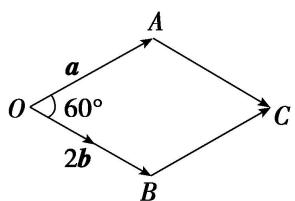
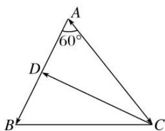
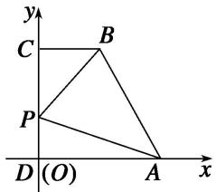
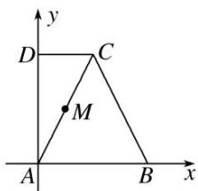
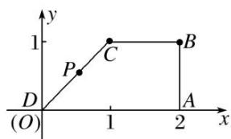
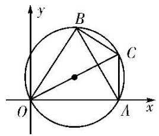
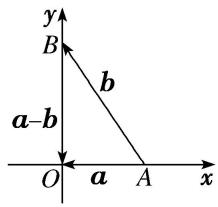

# 专题五 平面向量的模

# 平面向量的模长公式  
（1）平面向量模长公式的非坐标形式： $|a|=\sqrt{a^{2}}$ .  
（2）平面向量模长公式的坐标形式：若 $\boldsymbol{a}=(x,y)$ ，则 $|a|=\sqrt{x^{2}+y^{2}}$ .

# 考点一 平面向量模的定值问题

# 【方法总结】

# 求向量模的常用方法  
（1）若向量 a, b 是以非坐标形式出现的，求向量 a 的模可应用公式 $|a| = \sqrt{a^{2}}$ 。将模长问题转化为数量积问题，通过 $(a \pm b)^{2} = a^{2} \pm 2a \cdot b + b^{2}$ 从而能够与条件中的已知向量（已知模长，夹角的基向量）找到联系。  
（2）若向量 a 是以坐标形式出现的，求向量 a 的模可直接利用公式 $\left|a\right|=\sqrt{x^{2}+y^{2}}$ 。某些题目如果能把几何图形放入坐标系中，则只要确定所求向量的坐标，即可求出(或表示)出模长。  
（3）数形结合法，利用模的几何意义.

# 【例题选讲】

[例 1] （1）(2017·全国 I) 已知向量 a, b 的夹角为 $60^{\circ}$ ， $|a|=2$ ， $|b|=1$ ，则 $|a+2b|=$ \_\_\_\_.
答案 $2\sqrt{3}$ 解析 解法1 $|a + 2b| = \sqrt{(a + 2b)^2} = \sqrt{a^2 + 4a \cdot b + 4b^2} = \sqrt{2^2 + 4 \times 2 \times 1 \times \cos 60^\circ + 4 \times 1^2} = \sqrt{12} = 2\sqrt{3}$ .
解法2 (数形结合法)由 $|a| = |2b| = 2$ ，知以 $\pmb{a}$ 与 $2b$ 为邻边可作出边长为2的菱形OACB，如图，则 $|a + 2b| = |\overrightarrow{OC}|$ .又 $\angle AOB = 60^{\circ}$ ，所以 $|a + 2b| = 2\sqrt{3}$
  
（2） (2012·全国)已知向量 a，b 夹角为 $45^{\circ}$ ，且 $|a|=1$ ， $|2a-b|=\sqrt{10}$ ，则 $|b|=$ \_\_\_\_.
答案 $3\sqrt{2}$ 解析 依题意，可知 $|2a - b|^2 = 4|a|^2 - 4a \cdot b + |b|^2 = 4 - 4|a||b|\cdot \cos 45^\circ + |b|^2 = 4 - 2\sqrt{2} |b| + |b|^2 = 10$ ，即 $|b|^2 - 2\sqrt{2} |b| - 6 = 0$ ， $\therefore |b| = \frac{2\sqrt{2} + \sqrt{32}}{2} = 3\sqrt{2}$ (负值舍去).  
（3）若向量 a, b 满足： $|a|=1$ ， $(a+b)\perp a$ ， $(2a+b)\perp b$ ，则 $|b|=(\quad)$

A. 2

B. $\sqrt{2}$

C. 1

D. $\frac{\sqrt{2}}{2}$
答案 B 解析 由题意知 $\left\{ \begin{array}{l} (a + b) \cdot a = 0, \\ (2a + b) \cdot b = 0, \end{array} \right.$ 即 $\left\{ \begin{array}{l} a^2 + b \cdot a = 0, \\ 2a \cdot b + b^2 = 0, \end{array} \right.$ 将①×2-②得， $2a^2 - b^2 = 0$ ， $\therefore b^2 = |b|^2 = 2a^2 = 2|a|^2 = 2$ ，故 $|b| = \sqrt{2}$ .  
（4）已知向量 $a=(x,\sqrt{3})$ , $b=(x,-\sqrt{3})$ , 若 $(2a+b)\perp b$ , 则 $|a|=(\quad)$

A. 1

B. $\sqrt{2}$

C. $\sqrt{3}$

D. 2
答案 D 解析 因为 $(2a + b) \perp b$ ，所以 $(2a + b) \cdot b = 0$ ，即 $(3x, \sqrt{3}) \cdot (x, -\sqrt{3}) = 3x^2 - 3 = 0$ ，解得 $x = \pm 1$ ，所以 $a = (\pm 1, \sqrt{3})$ ， $|a| = \sqrt{(\pm 1)^2 + (\sqrt{3})^2} = 2$ .  
（5）若 $|\overrightarrow{AB}|=|\overrightarrow{AC}|=|\overrightarrow{AB}-\overrightarrow{AC}|=2$ ，则 $|\overrightarrow{AB}+\overrightarrow{AC}|=$ \_\_\_\_.
答案 $2\sqrt{3}$ 解析 $\because |\overrightarrow{AB}| = |\overrightarrow{AC}| = |\overrightarrow{AB} - \overrightarrow{AC}| = 2, \therefore \triangle ABC$ 是边长为 2 的正三角形， $\therefore |\overrightarrow{AB} + \overrightarrow{AC}|$ 为 $\triangle ABC$ 的边 $BC$ 上的高的 2 倍， $\therefore |\overrightarrow{AB} + \overrightarrow{AC}| = 2 \times 2\sin \frac{\pi}{3} = 2\sqrt{3}$ .  
（6） (2013·天津)在平行四边形 $ABCD$ 中， $AD = 1$ ， $\angle BAD = 60^\circ$ ， $E$ 为 $CD$ 的中点。若 $\overrightarrow{AC} \cdot \overrightarrow{BE} = 1$ ，则 $AB$ 的长为 \_\_\_\_.
答案 $\frac{1}{2}$ 解析 在平行四边形 $ABCD$ 中，取 $AB$ 的中点 $F$ ，则 $\overrightarrow{BE} = \overrightarrow{FD}$ ， $\therefore \overrightarrow{BE} = \overrightarrow{FD} = \overrightarrow{AD} - \frac{1}{2}\overrightarrow{AB}$ ，又 $\overrightarrow{AC} = \overrightarrow{AD} + \overrightarrow{AB}$ ， $\therefore \overrightarrow{AC} \cdot \overrightarrow{BE} = (\overrightarrow{AD} + \overrightarrow{AB}) \cdot (\overrightarrow{AD} - \frac{1}{2}\overrightarrow{AB}) = \overrightarrow{AD}^2 - \frac{1}{2}\overrightarrow{AD} \cdot \overrightarrow{AB} + \overrightarrow{AD} \cdot \overrightarrow{AB} - \frac{1}{2}\overrightarrow{AB}^2 = |\overrightarrow{AD}|^2 + \frac{1}{2} |\overrightarrow{AD}||\overrightarrow{AB}|\cos 60^\circ - \frac{1}{2} |\overrightarrow{AB}|^2 = 1 + \frac{1}{2} \times \frac{1}{2} |\overrightarrow{AB}| - \frac{1}{2} |\overrightarrow{AB}|^2 = 1.\quad \therefore \left(\frac{1}{2} - |\overrightarrow{AB}|\right)|\overrightarrow{AB}| = 0,$ 又 $|\overrightarrow{AB}| \neq 0,\quad \therefore |\overrightarrow{AB}| = \frac{1}{2}.$

# 【对点训练】

1. 已知向量 $a, b$ 均为单位向量，若它们的夹角为 $60^{\circ}$ ，则 $|a + 3b|$ 等于（）

A. $\sqrt{7}$

B. $\sqrt{10}$

C. $\sqrt{13}$

D. 4

1. 答案 C 解析 依题意得 $a \cdot b = \frac{1}{2}$ ， $|a + 3b| = \sqrt{a^{2} + 9b^{2} + 6a \cdot b} = \sqrt{13}$ ，故选 C.

2. (2012·全国)平面向量 a 与 b 的夹角为 $45^{\circ}$ ， $a=(1,1)$ ， $|b|=2$ ，则 $|3a+b|$ 等于()

A. $13+6\sqrt{2}$

B. $2 \sqrt{5}$

C. $\sqrt{30}$

D. $\sqrt{34}$

2. 答案 D 解析 依题意得 $|a| = \sqrt{2}$ , $a \cdot b = \sqrt{2} \times 2 \times \cos 45^\circ = 2$ , $\therefore |3a + b| = \sqrt{(3a + b)^2} = \sqrt{9a^2 + 6a \cdot b + b^2} = \sqrt{18 + 12 + 4} = \sqrt{34}$ , 故选 D.

3. 已知 $|a|=1$ ， $|b|=2$ ，a 与 b 的夹角为 $\frac{\pi}{3}$ ，那么 $|4a-b|=()$

A. 2

B. 6

C. $2\sqrt{3}$

D. 12

3. 答案 C 解析 $\left|4a-b\right|^{2}=16a^{2}+b^{2}-8a\cdot b=16\times1+4-8\times1\times2\times\cos\frac{\pi}{3}=12,\quad\therefore\left|4a-b\right|=2\sqrt{3}.$

4. 已知非零向量 $a, b$ 的夹角为 $60^{\circ}$ , 且 $|b|=1$ , $|2a-b|=1$ , 则 $|a|=(\quad)$

A. $\frac{1}{2}$

B. 1

C. $\sqrt{2}$

D. 2

4. 答案 A 解析 由题意得 $a \cdot b = |a| \times 1 \times \frac{1}{2} = \frac{|a|}{2}$ , 又 $|2a - b| = 1$ , $\therefore |2a - b|^2 = 4a^2 - 4a \cdot b + b^2 = 4|a|^2 - 2|a| + 1 = 1$ , 即 $4|a|^2 - 2|a| = 0$ , 又 $|a| \neq 0$ , 解得 $|a| = \frac{1}{2}$ .

5. 已知 $e_{1}$ ， $e_{2}$ 是平面单位向量，且 $e_{1} \cdot e_{2} = \frac{1}{2}$ 。若平面向量 b 满足 $b \cdot e_{1} = b \cdot e_{2} = 1$ ，则 $|b| =$ \_\_\_\_ 。

5. 答案 $\frac{2\sqrt{3}}{3}$ 解析 $\because e_1 \cdot e_2 = \frac{1}{2}, \therefore |e_1||e_2|\cos < e_1, e_2 > = \frac{1}{2}, \therefore <e_1, e_2 > = 60^\circ.$ 又 $\because b \cdot e_1 = b \cdot e_2 = 1 > 0,$ $\therefore <b, e_1> = <b, e_2> = 30^\circ.$ 由 $b \cdot e_1 = 1$ ，得 $|b||e_1|\cos 30^\circ = 1,\therefore |b| = \frac{1}{\frac{\sqrt{3}}{2}} = \frac{2\sqrt{3}}{3}.$

6. 已知 a, b 为单位向量，且 $a \perp (a + 2b)$ ，则 $|a - 2b| =$ \_\_\_\_ .

6. 答案 $\sqrt{7}$ 解析 由 $a \perp (a + 2b)$ 得 $a \cdot (a + 2b) = 0$ , $\therefore |a|^2 + 2a \cdot b = 0$ , 得 $2a \cdot b = -1$ , $\therefore |a - 2b|^2 = (a - 2b)^2 = a^2 - 4a \cdot b + 4b^2 = |a|^2 - 4a \cdot b + 4|b|^2 = 1 + 2 + 4 = 7$ , $\therefore |a - 2b| = \sqrt{7}$ .

7. 设向量 a, b 满足 $|a|=1$ , $|a-b|=\sqrt{3}$ , $a\cdot(a-b)=0$ , 则 $|2a+b|=(\quad)$

A. 2

B. $2\sqrt{3}$

C. 4

D. $4\sqrt{3}$

7. 答案 B 解析 由 $a \cdot (a - b) = 0$ ，可得 $a \cdot b = a^2 = 1$ ，由 $|a - b| = \sqrt{3}$ ，可得 $(a - b)^2 = 3$ ，即 $a^2 - 2a \cdot b + b^2 = 3$ ，解得 $b^2 = 4$ 。所以 $(2a + b)^2 = 4a^2 + 4a \cdot b + b^2 = 12$ ，所以 $|2a + b| = 2\sqrt{3}$ 。

8. 已知平面向量 $a, b$ ，满足 $a = (1, \sqrt{3})$ ， $|b| = 3$ ， $a \perp (a - 2b)$ ，则 $|a - b| = (\quad)$

A. 2

B. 3

C. 4

D. 6

8. 答案 B 解析 由题意可得， $|a|=\sqrt{1+3}=2$ ，且 $a\cdot(a-2b)=0$ ，即 $a^{2}-2a\cdot b=0$ ，所以 $4-2a\cdot b=0$ ， $a\cdot b=2$ ，由平面向量模的计算公式可得， $|a-b|=\sqrt{(a-b)^{2}}=\sqrt{a^{2}-2a\cdot b+b^{2}}=\sqrt{4-4+9}=3$ 。故选 B.

9. 设 $x \in \mathbf{R}$ , 向量 $a = (x, 1)$ , $b = (1, -2)$ , 且 $a \perp b$ , 则 $|a + b| = (\quad)$

A. $\sqrt{5}$

B. $\sqrt{10}$

C. $2\sqrt{5}$

D. 10

9. 解析：选 B $\because a\perp b,\therefore a\cdot b=0$ ，即 x-2=0，解得 x=2， $\therefore a+b=(3,-1)$ ，于是 $|a+b|=\sqrt{10}$ ，故选 B.

10. 已知 $A(1, 0)$ , $B(4, 0)$ , $C(3, 4)$ , $O$ 为坐标原点, 且 $\overrightarrow{OD} = \frac{1}{2} (\overrightarrow{OA} + \overrightarrow{OB} - \overrightarrow{CB})$ , 则 $|\overrightarrow{BD}| =$ \_\_\_\_.

10. 答案 $2\sqrt{2}$ 解析 由 $\overrightarrow{OD} = \frac{1}{2} (\overrightarrow{OA} + \overrightarrow{OB} - \overrightarrow{CB}) = \frac{1}{2} (\overrightarrow{OA} + \overrightarrow{OC})$ 知，点 $D$ 是线段 $AC$ 的中点，故 $D(2, 2)$ ，所以 $\overrightarrow{BD} = (-2, 2)$ ，故 $|\overrightarrow{BD}| = \sqrt{(-2)^2 + 2^2} = 2\sqrt{2}$ .

11. 已知平面向量 $a=(2,4)$ ， $b=(1,-2)$ ，若 $c=a-(a\cdot b)\cdot b$ ，则 $|c|=$ \_\_\_\_.

11. 答案 $8\sqrt{2}$ 解析 由题意可得 $a \cdot b = 2 \times 1 + 4 \times (-2) = -6, \therefore c = a - (a \cdot b) \cdot b = a + 6b = (2,4) + 6(1, -2) = (8, -8), \therefore |c| = \sqrt{8^2 + (-8)^2} = 8\sqrt{2}$ .

12. 在 $\triangle ABC$ 中， $O$ 为 $BC$ 的中点，若 $AB=1$ ， $AC=4$ ， $<\overrightarrow{AB}$ ， $\overrightarrow{AC}>=60^{\circ}$ ，则 $|\overrightarrow{OA}|=$ \_\_\_\_.

12. 答案 $\frac{\sqrt{21}}{2}$ 解析 因为 $<\overrightarrow{AB}, \overrightarrow{AC}> = 60^{\circ}$ , 所以 $\overrightarrow{AB} \cdot \overrightarrow{AC} = |\overrightarrow{AB}| \cdot |\overrightarrow{AC}| \cos 60^{\circ} = 1 \times 4 \times \frac{1}{2} = 2$ . 又 $\overrightarrow{AO} = \frac{1}{2} (\overrightarrow{AB} + \overrightarrow{AC})$ , 所以 $\overrightarrow{AO}^{2} = \frac{1}{4} (\overrightarrow{AB} + \overrightarrow{AC})^{2} = \frac{1}{4} (\overrightarrow{AB}^{2} + 2\overrightarrow{AB} \cdot \overrightarrow{AC} + \overrightarrow{AC}^{2})$ , 即 $\overrightarrow{OA}^{2} = \frac{1}{4} \times (1 + 4 + 16) = \frac{21}{4}$ , 所以 $|\overrightarrow{OA}| = \frac{\sqrt{21}}{2}$ .

13. 在 $\triangle ABC$ 中， $\angle BAC=60^{\circ}$ ， $AB=5$ ， $AC=6$ ， $D$ 是 $AB$ 上一点，且 $\overrightarrow{AB} \cdot \overrightarrow{CD}=-5$ ，则 $|\overrightarrow{BD}|$ 等于( )

A. 1

B. 2

C. 3

D. 4

13. 答案 C 解析 如图所示,

设 $\overrightarrow{AD}=k\overrightarrow{AB}$ ，所以 $\overrightarrow{CD}=\overrightarrow{AD}-\overrightarrow{AC}=k\overrightarrow{AB}-\overrightarrow{AC}$ ，所以 $\overrightarrow{AB}\cdot\overrightarrow{CD}=\overrightarrow{AB}\cdot(k\overrightarrow{AB}-\overrightarrow{AC})=k\overrightarrow{AB}^{2}-\overrightarrow{AB}\cdot\overrightarrow{AC}=25k-$
$5 \times 6 \times \frac{1}{2} = 25k - 15 = -5$ ，解得 $k = \frac{2}{5}$ ，所以 $|\overrightarrow{BD}| = \begin{pmatrix} 1 - \frac{2}{5} \\ |AB| = 3. \end{pmatrix}$

# 考点二 平面向量模的最值(范围)问题

# 【方法总结】

# 求向量模的最值(范围)的 2 种方法  
（1）代数法：把所求的模表示成某个变量的函数，再用求最值的方法求解.  
（2）几何法(数形结合法): 弄清所求的模表示的几何意义, 结合动点表示的图形求解.

# 【例题选讲】

[例 1] （1） 已知向量 $a=(1, \sqrt{3})$ , $b=(0, t^{2}+1)$ ，则当 $t \in [-\sqrt{3}, 2]$ 时， $\left|a-t\frac{b}{|b|}\right|$ 的取值范围是 \_\_\_\_.
答案 [1, $\sqrt{13}$ ] 解析 由题意可得 $\frac{b}{|b|} = (0, 1)$ , $\therefore \left|a - t\frac{b}{|b|}\right| = |(1, \sqrt{3}) - t(0, 1)| = \sqrt{(t - \sqrt{3})^2 + 1}$ , $\because t \in [-\sqrt{3}, 2]$ , $\therefore$ 当 $t = \sqrt{3}$ 时, $\left|a - t\frac{b}{|b|}\right|$ 取得最小值 1, 当 $t = -\sqrt{3}$ 时, $\left|a - t\frac{b}{|b|}\right|$ 取得最大值 $\sqrt{13}$ , 即 $\left|a - t\frac{b}{|b|}\right|$ 的取值范围是 $[1, \sqrt{13}]$ .  
（2）已知直角梯形 ABCD 中， $AD \parallel BC$ ， $\angle ADC = 90^{\circ}$ ，AD = 2，BC = 1，P 是腰 DC 上的动点，则 $\overrightarrow{PA} + 3\overrightarrow{PB}$ 的最小值为 \_\_\_\_.
答案 5 解析 方法一 以 D 为原点，分别以 DA、DC 所在直线为 x、y 轴建立如图所示的平面直角坐标系，设 DC=a，DP=x. ∴D(0,0)，A(2,0)，C(0，a)，B(1，a)，P(0，x)，

$\overrightarrow{PA}=(2,-x),\overrightarrow{PB}=(1,a-x),\therefore\overrightarrow{PA}+3\overrightarrow{PB}=(5,3a-4x),|\overrightarrow{PA}+3\overrightarrow{PB}|^{2}=25+(3a-4x)^{2}\geqslant25,\therefore|\overrightarrow{PA}+3\overrightarrow{PB}|$ 的最小值为5.
方法二 设 $\overrightarrow{DP} = x\overrightarrow{DC}(0 < x < 1)$ . $\therefore \overrightarrow{PC} = (1 - x)\overrightarrow{DC}$ , $\overrightarrow{PA} = \overrightarrow{DA} - \overrightarrow{DP} = \overrightarrow{DA} - x\overrightarrow{DC}$ , $\overrightarrow{PB} = \overrightarrow{PC} + \overrightarrow{CB} = (1 - x)\overrightarrow{DC} + \frac{1}{2}\overrightarrow{DA}$ . $\therefore \overrightarrow{PA} + 3\overrightarrow{PB} = \frac{5}{2}\overrightarrow{DA} + (3 - 4x)\overrightarrow{DC}$ , $|\overrightarrow{PA} + 3\overrightarrow{PB}|^2 = \frac{25}{4}\overrightarrow{DA}^2 + 2 \times \frac{5}{2} \times (3 - 4x)\overrightarrow{DA} \cdot \overrightarrow{DC} + (3 - 4x)^2 \cdot \overrightarrow{DC}^2 = 25 + (3 - 4x)^2\overrightarrow{DC}^2 \geqslant 25$ , $\therefore |\overrightarrow{PA} + 3\overrightarrow{PB}|$ 的最小值为 5.  
（3）已知 a, b 是两个互相垂直的单位向量，且 $c \cdot a = 1, c \cdot b = 1, |c| = \sqrt{2}$ ，则对任意的正实数 t， $\left|c + ta + \frac{1}{t}b\right|$ 的最小值是（）

A. 2

B. $2\sqrt{2}$

C. 4

D. $4\sqrt{2}$
答案 B 解析 $\left|c+ta+\frac{1}{t}b\right|^{2}=c^{2}+t^{2}a^{2}+\frac{1}{t^{2}}b^{2}+2ta\cdot c+\frac{2}{t}c\cdot b+2a\cdot b=2+t^{2}+\frac{1}{t^{2}}+2t+\frac{2}{t}\geqslant2+2\sqrt{t^{2}\cdot\frac{1}{t^{2}}}$ $+2\sqrt{2t\cdot\frac{2}{t}}=8(t>0)$ ，当且仅当 $t^{2}=\frac{1}{t^{2}}$ ， $2t=\frac{2}{t}$ ，即 t=1 时等号成立，∴ $|c+ta+\frac{1}{t}b|$ 的最小值为 $2\sqrt{2}$ .  
（4）已知 $P$ 是边长为3的等边三角形 $ABC$ 外接圆上的动点，则 $\left|\overrightarrow{PA} +\overrightarrow{PB} +2\overrightarrow{PC}\right|$ 的最大值为（

A. $2 \sqrt{3}$

B. $3 \sqrt{3}$

C. $4\sqrt{3}$

D. $5\sqrt{3}$
答案 D 解析 设 $\triangle ABC$ 的外接圆的圆心为 $O$ ，则圆的半径为 $\frac{3}{\sqrt{3}} \times \frac{1}{2} = \sqrt{3}$ ， $\overrightarrow{OA} + \overrightarrow{OB} + \overrightarrow{OC} = 0$ ，故 $\overrightarrow{PA} + \overrightarrow{PB} + 2\overrightarrow{PC} = 4\overrightarrow{PO} + \overrightarrow{OC}$ 。又 $|4\overrightarrow{PO} + \overrightarrow{OC}|^2 = 51 + 8\overrightarrow{PO} \cdot \overrightarrow{OC} \leq 51 + 24 = 75$ ，故 $|\overrightarrow{PA} + \overrightarrow{PB} + 2\overrightarrow{PC}| \leq 5\sqrt{3}$ ，当 $\overrightarrow{PO}$ ， $\overrightarrow{OC}$ 同向共线时取最大值。  
（5）已知平面向量 a, b 满足 $|b|=1$ ，且 a 与 b-a 的夹角为 $120^{\circ}$ ，则 $|a|$ 的取值范围为 \_\_\_\_.
答案 $\left\{0,\frac{2\sqrt{3}}{3}\right\}$ 解析 在 $\triangle ABC$ 中，设 $\overrightarrow{AB}=a,\overrightarrow{AC}=b$ ，则 $b-a=\overrightarrow{AC}-\overrightarrow{AB}=\overrightarrow{BC}$ ，∵a与b-a的夹角为 $120^{\circ}$ ，∴ $\angle B=60^{\circ}$ ，由正弦定理得 $\frac{1}{\sin60^{\circ}}=\frac{|a|}{\sin C}$ ，∴ $|a|=\frac{\sin C}{\sin60^{\circ}}=\frac{2\sqrt{3}}{3}\sin C$ ，∵ $0^{\circ}<C<120^{\circ}$ ，∴ $\sin C\in(0,1]$ ，∴ $|a|\in\left[0,\frac{2\sqrt{3}}{3}\right]$ .  
（6）已知 $|\overrightarrow{AB}|=1,\quad|\overrightarrow{BC}|=2$ ，若 $\overrightarrow{AB}\cdot\overrightarrow{BC}=0,\quad\overrightarrow{AD}\cdot\overrightarrow{DC}=0$ ，则 $|\overrightarrow{BD}|$ 的最大值为()

A. $\frac{2\sqrt{5}}{5}$

B. 2

C. $\sqrt{5}$

D. $2\sqrt{5}$
答案 $\frac{2\sqrt{3}}{3}$ 解析 C 由题意可知， $AB \perp BC$ ， $CD \perp AD$ ，故四边形 $ABCD$ 为圆内接四边形，且圆的直径为 $AC$ ，由勾股定理可得 $AC = \sqrt{AB^2 + BC^2} = \sqrt{5}$ ，因为 $BD$ 为上述圆的弦，而圆的最长的弦为其直径，故 $|\overrightarrow{BD}|$ 的最大值为 $\sqrt{5}$ 。故选 C.

# 【对点训练】

1. 已知向量 $\overrightarrow{OA} = (3, 1)$ , $\overrightarrow{OB} = (-1, 3)$ , $\overrightarrow{OC} = m\overrightarrow{OA} - n\overrightarrow{OB}(m > 0, n > 0)$ , 若 $m + n = 1$ , 则 $|\overrightarrow{OC}|$ 的最小值为( )

A. $\frac{\sqrt{5}}{2}$

B. $\frac{\sqrt{10}}{2}$

C. $\sqrt{5}$

D. $\sqrt{10}$

1. 答案 C 解析 由 $\overrightarrow{OA} = (3, 1)$ , $\overrightarrow{OB} = (-1, 3)$ , 得 $\overrightarrow{OC} = m\overrightarrow{OA} - n\overrightarrow{OB} = (3m + n, m - 3n)$ , 因为 $m + n = 1 (m > 0, n > 0)$ , 所以 $n = 1 - m$ 且 $0 < m < 1$ , 所以 $\overrightarrow{OC} = (1 + 2m, 4m - 3)$ , 则 $|\overrightarrow{OC}| = \sqrt{(1 + 2m)^2 + (4m - 3)^2} = \sqrt{20m^2 - 20m + 10} = \sqrt{20(m - \frac{1}{2})^2 + 5} (0 < m < 1)$ , 所以当 $m = \frac{1}{2}$ 时, $|\overrightarrow{OC}|_{\min} = \sqrt{5}$ .

2. 已知在直角梯形 $ABCD$ 中, $AB = AD = 2CD = 2$ , $\angle ADC = 90^{\circ}$ , 若点 $M$ 在线段 $AC$ 上, 则 $|\overrightarrow{MB} + \overrightarrow{MD}|$ 的取值范围为 \_\_\_\_.

2. 答案 $\left[\frac{2\sqrt{5}}{5}, 2\sqrt{2}\right]$ 解析 以 $A$ 为坐标原点， $AB$ ， $AD$ 所在直线分别为 $x$ 轴， $y$ 轴，建立如图所示的平面直角坐标系，

则 $A(0,0)$ , $B(2,0)$ , $C(1,2)$ , $D(0,2)$ , 设 $\overrightarrow{AM} = \lambda \overrightarrow{AC} (0 \leq \lambda \leq 1)$ , 则 $M(\lambda, 2\lambda)$ , 故 $\overrightarrow{MD} = (-\lambda, 2 - 2\lambda)$ , $\overrightarrow{MB} = (2 - \lambda, -2\lambda)$ , 则 $\overrightarrow{MB} + \overrightarrow{MD} = (2 - 2\lambda, 2 - 4\lambda)$ , $\therefore |\overrightarrow{MB} + \overrightarrow{MD}| = \sqrt{(2 - 2\lambda)^2 + (2 - 4\lambda)^2} = \sqrt{20\left[\lambda - \frac{3}{5}\right]^2 + \frac{4}{5}}$ , $0 \leq \lambda \leq 1$ , 当 $\lambda = 0$ 时, $|\overrightarrow{MB} + \overrightarrow{MD}|$ 取得最大值为 $2\sqrt{2}$ , 当 $\lambda = \frac{3}{5}$ 时, $|\overrightarrow{MB} + \overrightarrow{MD}|$ 取得最小值为 $\frac{2\sqrt{5}}{5}$ , $\therefore |\overrightarrow{MB} + \overrightarrow{MD}| \in \left[\frac{2\sqrt{5}}{5}, 2\sqrt{2}\right]$ .

3. 已知直角梯形 $ABCD$ 中, $AD \parallel BC$ , $\angle BAD = 90^{\circ}$ , $\angle ADC = 45^{\circ}$ , $AD = 2$ , $BC = 1$ , $P$ 是腰 $CD$ 上的动点, 则 $|3\overrightarrow{PA} + \overrightarrow{BP}|$ 的最小值为 \_\_\_\_.

3. 答案 $\frac{5\sqrt{2}}{2}$ 解析 以 $D$ 为坐标原点， $DA$ 为 $x$ 轴，过 $D$ 与 $DA$ 垂直的直线为 $y$ 轴，建立平面直角坐标系，

由 $AD \parallel BC$ ， $\angle BAD = 90^\circ$ ， $\angle ADC = 45^\circ$ ， $AD = 2$ ， $BC = 1$ ，可得 $D(0,0)$ ， $A(2,0)$ ， $B(2,1)$ ， $C(1,1)$ ， $\because P$ 在 $CD$ 上， $\therefore$ 可设 $P(t, t) (0 \leqslant t \leqslant 1)$ ，则 $\overrightarrow{PA} = (2 - t, -t)$ ， $\overrightarrow{BP} = (t - 2, t - 1)$ ， $3\overrightarrow{PA} + \overrightarrow{BP} = (4 - 2t, -2t - 1)$ ， $\therefore |3\overrightarrow{PA} + \overrightarrow{BP}| = \sqrt{(4 - 2t)^2 + (-2t - 1)^2} = \sqrt{8\left(t - \frac{3}{4}\right)^2 + \frac{25}{2}} \geqslant \sqrt{\frac{25}{2}} = \frac{5\sqrt{2}}{2}$ （当 $t = \frac{3}{4}$ 时，等号成立），即 $|3\overrightarrow{PA} + \overrightarrow{BP}|$ 的最小值为 $\frac{5\sqrt{2}}{2}$ .

4. 已知 a, b 是平面内两个互相垂直的单位向量，若向量 c 满足 $(a-c)\cdot(b-c)=0$ ，则 $|c|$ 的最大值是()

A. 1

B. 2

C. $\sqrt{2}$

D. $\frac{\sqrt{2}}{2}$

4. 答案 C 解析 因为 $|a| = |b| = 1$ ， $a \cdot b = 0$ ， $(a - c) \cdot (b - c) = -c \cdot (a + b) + |c|^2 = -|c||a + b| \cdot \cos \theta + |c|^2 = 0$ ，其中 $\theta$ 为 $c$ 与 $a + b$ 的夹角，所以 $|c| = |a + b| \cos \theta = \sqrt{2} \cos \theta \leqslant \sqrt{2}$ ，所以 $|c|$ 的最大值是 $\sqrt{2}$ .

5. 在 $\triangle ABC$ 中，若 $A = 120^{\circ}$ ， $\overrightarrow{AB} \cdot \overrightarrow{AC} = -1$ ，则 $|\overrightarrow{BC}|$ 的最小值是（）

A. $\sqrt{2}$

B. 2

C. $\sqrt{6}$

D. 6

5. 答案 C 解析 $\because \overrightarrow{AB} \cdot \overrightarrow{AC} = -1, \therefore |\overrightarrow{AB}| \cdot |\overrightarrow{AC}| \cdot \cos 120^{\circ} = -1$ ，即 $|\overrightarrow{AB}| \cdot |\overrightarrow{AC}| = 2, \therefore |\overrightarrow{BC}|^{2} = |\overrightarrow{AC} - \overrightarrow{AB}|^{2} = \overrightarrow{AC}$ $^{2} - 2\overrightarrow{AB} \cdot \overrightarrow{AC} + \overrightarrow{AB}^{2} \geqslant 2|\overrightarrow{AB}| \cdot |\overrightarrow{AC}| - 2\overrightarrow{AB} \cdot \overrightarrow{AC} = 6, \therefore |\overrightarrow{BC}|_{\min} = \sqrt{6}.$

6. 已知非零向量 $a, b, c$ 满足 $|a| = |b| = |a - b|$ , $<c - a, c - b> = \frac{2\pi}{3}$ , 则 $\frac{|c|}{|a|}$ 的最大值为 \_\_\_\_.

6. 答案 $\frac{2\sqrt{3}}{3}$ 解析 $\overrightarrow{OA} = a, \overrightarrow{OB} = b$ ，则 $\overrightarrow{BA} = a - b$ 。因为非零向量 $a, b, c$ 满足 $|a| = |b| = |a - b|$ ，所以 $\triangle OAB$ 是等边三角形。设 $\overrightarrow{OC} = c$ ，则 $\overrightarrow{AC} = c - a, \overrightarrow{BC} = c - b$ 。因为 $<c - a, c - b> = \frac{2\pi}{3}$ ，所以点 $C$ 在 $\triangle ABC$ 的外接圆上，所以当 $OC$ 为 $\triangle ABC$ 的外接圆的直径时， $\frac{|c|}{|a|}$ 取得最大值，为 $\frac{1}{\cos 30^\circ} = \frac{2\sqrt{3}}{3}$ 。

7. 已知向量 $a, b$ 的夹角为 $\frac{\pi}{3}$ , $|b| = 2$ , 对任意 $x \in \mathbf{R}$ , 有 $|b + xa| \geq |a - b|$ , 则 $|tb - a| + \left|t b - \frac{a}{2}\right|(t \in \mathbf{R})$ 的最小值

为\_\_\_\_。

7. 答案 $\frac{\sqrt{7}}{2}$ 解析 向量 $a, b$ 夹角为 $\frac{\pi}{3}, |b| = 2$ ，对任意 $x \in \mathbf{R}$ ，有 $|b + xa| \geq |a - b|$ ，两边平方整理可得 $x^2 a^2 + 2xa \cdot b - (a^2 - 2a \cdot b) \geq 0$ ，则 $\Delta = 4(a \cdot b)^2 + 4a^2 (a^2 - 2a \cdot b) \leq 0$ ，即有 $(a^2 - a \cdot b)^2 \leq 0$ ，即为 $a^2 = a \cdot b$ ，则 $(a - b) \perp a$ ，由向量 $a, b$ 夹角为 $\frac{\pi}{3}, |b| = 2$ ，由 $a^2 = a \cdot b = |a| \cdot |b| \cdot \cos \frac{\pi}{3}$ ，得 $|a| = 1$ ，则 $|a - b| = \sqrt{a^2 + b^2 - 2a \cdot b} = \sqrt{3}$ ，

画出 $\overrightarrow{AO} = a, \overrightarrow{AB} = b$ ，建立平面直角坐标系，如图所示：则 $A(1,0), B(0, \sqrt{3})$ ， $\therefore a = (-1,0), b = (-1, \sqrt{3})$ ； $\therefore |tb - a| + \left|t b - \frac{a}{2}\right| = \sqrt{(1 - t)^2 + (\sqrt{3} t)^2} + \sqrt{\left(\frac{1}{2} - t\right)_2 + (\sqrt{3} t)^2} = \sqrt{4t^2 - 2t + 1} + \sqrt{4t^2 - t + \frac{1}{4}} =$
$2\left(\sqrt{\left(t-\frac{1}{4}\right)^{2}+\left(0-\frac{\sqrt{3}}{4}\right)^{2}}+\sqrt{\left(t-\frac{1}{8}\right)^{2}+\left(0+\frac{\sqrt{3}}{8}\right)^{2}}\right)$ 表示 $P(t,0)$ 与 $M\left(\frac{1}{4},\frac{\sqrt{3}}{4}\right),N\left(\frac{1}{8},-\frac{\sqrt{3}}{8}\right)$ 的距离之和的2倍，当M,P,N共线时，取得最小值 $2|MN|$ 。即有 $2|MN|=2\sqrt{\left(\frac{1}{4}-\frac{1}{8}\right)^{2}+\left(\frac{\sqrt{3}}{4}+\frac{\sqrt{3}}{8}\right)^{2}}=\frac{\sqrt{7}}{2}$ 。

8. 已知单位向量 $e_1$ , $e_2$ , 且 $e_1 \cdot e_2 = -\frac{1}{2}$ , 若向量 $a$ 满足 $(a - e_1) \cdot (a - e_2) = \frac{5}{4}$ , 则 $|a|$ 的取值范围为( )

A. $\left[\sqrt{2} -\frac{\sqrt{3}}{2},\sqrt{2} +\frac{\sqrt{3}}{2}\right]$

B. $\left[\sqrt{2} -\frac{1}{2},\sqrt{2} +\frac{1}{2}\right]$

C. $\left\{0,\sqrt{2}+\frac{1}{2}\right]$

D. $\left(0,\sqrt{2}+\frac{\sqrt{3}}{2}\right]$

8. 答案 B 解析 ∵单位向量 $e_{1}, e_{2}$ ，且 $e_{1} \cdot e_{2} = -\frac{1}{2}$ ，∴ $\langle e_{1}, e_{2} \rangle = 120^{\circ}$ ，∴ $|e_{1} + e_{2}| = \sqrt{1 + 1 + 2 \times \left(-\frac{1}{2}\right)}$ =1. 若向量 a 满足 $(a-e_{1})\cdot(a-e_{2})=\frac{5}{4}$ ，则 $a^{2}-a\cdot(e_{1}+e_{2})+e_{1}\cdot e_{2}=\frac{5}{4}$ ，∴ $|a|^{2}-a\cdot(e_{1}+e_{2})=\frac{7}{4}$ ，∴ $|a|^{2}-|a|\cos<a$ ， $e_{1}+e_{2}>=\frac{7}{4}$ ，即 $\cos<a, e_{1}+e_{2}>=\frac{|a|^{2}-\frac{7}{4}}{|a|}$ . ∵ $-1\leq\cos<a, e_{1}+e_{2}\geq1$ , ∴ $-1\leq|a|-\frac{7}{4|a|}\leq1$ ，解得 $\sqrt{2}-\frac{1}{2}\leq|a|\leq\sqrt{2}+\frac{1}{2}$ ，∴ $|a|$ 的取值范围为 $\left[\sqrt{2}-\frac{1}{2}, \sqrt{2}+\frac{1}{2}\right]$ .

