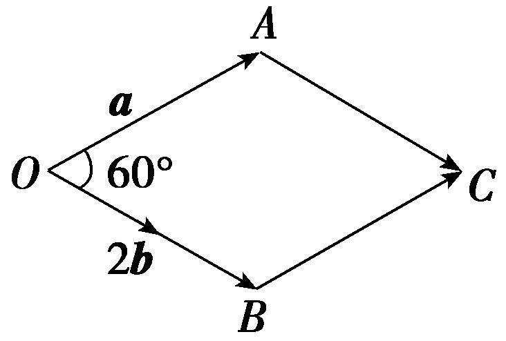
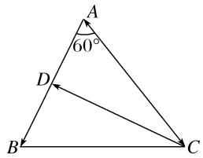
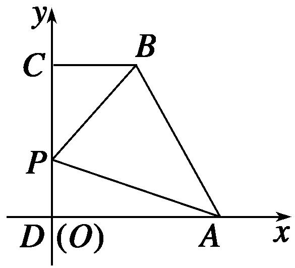
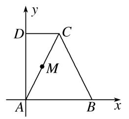
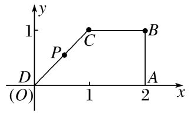
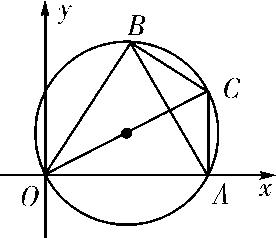
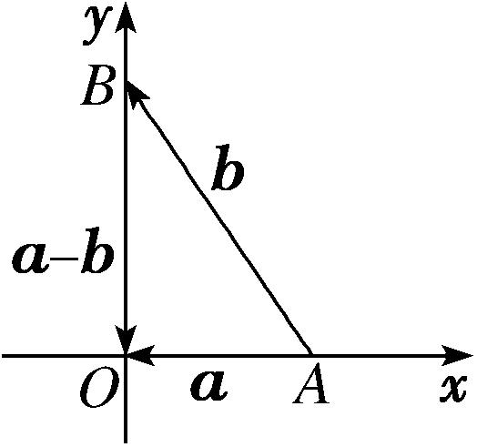

**专题五　平面向量的模**

**平面向量的模长公式**

(1)平面向量模长公式的非坐标形式：|***a***|＝．

(2)平面向量模长公式的坐标形式：若<em><strong>a</strong></em>＝(<em>x</em>，<em>y</em>)，则|<em><strong>a</strong></em>|＝．

**考点一　平面向量模的定值问题**

【**方法总结**】

求向量模的常用方法

(1)若向量<em><strong>a</strong></em><strong>，</strong><em><strong>b</strong></em>是以非坐标形式出现的，求向量<em><strong>a</strong></em>的模可应用公式|<em><strong>a</strong></em>|＝．将模长问题转化为数量积问题，通过(<em><strong>a</strong></em>±<em><strong>b</strong></em>)2＝<em><strong>a</strong></em>2±2<em><strong>a</strong></em><strong>·</strong><em><strong>b</strong></em>＋<em><strong>b</strong></em>2从而能够与条件中的已知向量(已知模长，夹角的基向量)找到联系．

(2)若向量***a***是以坐标形式出现的，求向量***a***的模可直接利用公式|***a***|＝．某些题目如果能把几何图形放入坐标系中，则只要确定所求向量的坐标，即可求出(或表示)出模长．

(3)数形结合法，利用模的几何意义．

**【例题选讲】**

<strong>[例1]</strong> (1)(2017·全国Ⅰ)已知向量<em><strong>a</strong></em>，<em><strong>b</strong></em>的夹角为60°，|<em><strong>a</strong></em>|＝2，|<em><strong>b</strong></em>|＝1，则|<em><strong>a</strong></em>＋2<em><strong>b</strong></em>|＝\_\_\_\_\_\_\_\_．

答案　2　解析　解法1　|***a***＋2***b***|＝＝＝＝＝2．

解法2　(数形结合法)由|<em><strong>a</strong></em>|＝|2<em><strong>b</strong></em>|＝2，知以<em><strong>a</strong></em>与2<em><strong>b</strong></em>为邻边可作出边长为2的菱形<em>OACB</em>，如图，则|<em><strong>a</strong></em>＋2<em><strong>b</strong></em>|＝||．又∠<em>AOB</em>＝60°，所以|<em><strong>a</strong></em>＋2<em><strong>b</strong></em>|＝2．

(2) (2012·全国)已知向量***a***，***b***夹角为45°，且|***a***|＝1，|2***a***－***b***|＝，则|***b***|＝\_\_\_\_\_\_\_\_．

答案　3　解析　依题意，可知|2<em><strong>a</strong></em>－<em><strong>b</strong></em>|2＝4|<em><strong>a</strong></em>|2－4<em><strong>a</strong></em>·<em><strong>b</strong></em>＋|<em><strong>b</strong></em>|2＝4－4|<em><strong>a</strong></em>||<em><strong>b</strong></em>|·cos 45°＋|<em><strong>b</strong></em>|2＝4－2|<em><strong>b</strong></em>|＋|<em><strong>b</strong></em>|2＝10，即|<em><strong>b</strong></em>|2－2|<em><strong>b</strong></em>|－6＝0，∴|<em><strong>b</strong></em>|＝＝3(负值舍去)．

(3)若向量***a***，***b***满足：|***a***|＝1，(***a***＋***b***)⊥***a***，(2***a***＋***b***)⊥***b***，则|***b***|＝(　　)

A．2　　　　　　　　B．　　　　　　　　C．1　　　　　　　　D．

答案　B　解析　由题意知即将①×2－②得，2<em><strong>a</strong></em>2－<em><strong>b</strong></em>2＝0，∴<em><strong>b</strong></em>2＝|<em><strong>b</strong></em>|2＝2<em><strong>a</strong></em>2＝2|<em><strong>a</strong></em>|2＝2，故|<em><strong>b</strong></em>|＝．

(4)已知向量<em><strong>a</strong></em>＝(<em>x</em>，)，<em><strong>b</strong></em>＝(<em>x</em>，－)，若(2<em><strong>a</strong></em>＋<em><strong>b</strong></em>)⊥<em><strong>b</strong></em>，则|<em><strong>a</strong></em>|＝(　　)

A．1　　　　　　　　B．　　　　　　　　C．　　　　　　　　D．2

答案　D　解析　因为(2<em><strong>a</strong></em>＋<em><strong>b</strong></em>)⊥<em><strong>b</strong></em>，所以(2<em><strong>a</strong></em>＋<em><strong>b</strong></em>)·<em><strong>b</strong></em>＝0，即(3<em>x</em>，)·(<em>x</em>，－)＝3<em>x</em>2－3＝0，解得<em>x</em>＝±1，所以<em>a</em>＝(±1，)，|<em>a</em>|＝＝2．

(5)若||＝||＝|－|＝2，则|＋|＝\_\_\_\_\_\_\_\_．

答案　2　解析　∵||＝||＝|－|＝2，∴△*ABC*是边长为2的正三角形，∴|＋|为△*ABC*的边*BC*上的高的2倍，∴|＋|＝2×2sin＝2．

(6) (2013·天津)在平行四边形*ABCD*中，*AD*＝1，∠*BAD*＝60°，*E*为*CD*的中点．若·＝1，则*AB*的长为\_\_\_\_\_\_\_\_．

答案　　解析　在平行四边形<em>ABCD</em>中，取<em>AB</em>的中点<em>F</em>，则＝，∴＝＝－，又＝＋，∴·＝(＋)·(－)＝2－·＋·－2＝||2＋||||cos60°－||2＝1＋×||－||2＝1．∴||＝0，又||≠0，∴||＝．

【**对点训练**】

1．已知向量***a***，***b***均为单位向量，若它们的夹角为60˚，则|***a***＋3***b***|等于(　　)

A．　　　　　　　　B．　　　　　　　　C．　　　　　　　　D．4

1．答案　C　解析　依题意得***a·b***＝，|***a***＋3***b***|＝＝，故选C．

2．(2012·全国)平面向量***a***与***b***的夹角为45°，***a***＝(1，1)，|***b***|＝2，则|3***a***＋***b***|等于(　　)

A．13＋6　　　　　　　　B．2　　　　　　　　C．　　　　　　　　D．

2．答案　D　解析　依题意得|***a***|＝，***a·b***＝×2×cos 45°＝2，∴|3***a***＋***b***|＝＝

＝＝，故选D．

3．已知|***a***|＝1，|***b***|＝2，***a***与***b***的夹角为，那么|4***a***－***b***|＝(　　)

A．2　　　　　　　　B．6　　　　　　　　C．2　　　　　　　　D．12

3．答案　C　解析　|4<em><strong>a</strong></em>－<em><strong>b</strong></em>|2＝16<em><strong>a</strong></em>2＋<em><strong>b</strong></em>2－8<em><strong>a</strong></em>·<em><strong>b</strong></em>＝16×1＋4－8×1×2×cos＝12，∴|4<em><strong>a</strong></em>－<em><strong>b</strong></em>|＝2．

4．已知非零向量***a***，***b***的夹角为60°，且|***b***|＝1，|2***a***－***b***|＝1，则|***a***|＝(　　)

A．　　　　　　　　B．1　　　　　　　　C．　　　　　　　　D．2

4．答案　A　解析　由题意得<em><strong>a</strong></em>·<em><strong>b</strong></em>＝|<em><strong>a</strong></em>|×1×＝，又|2<em><strong>a</strong></em>－<em><strong>b</strong></em>|＝1，∴|2<em><strong>a</strong></em>－<em><strong>b</strong></em>|2＝4<em><strong>a</strong></em>2－4<em><strong>a</strong></em>·<em><strong>b</strong></em>＋<em><strong>b</strong></em>2＝4|<em><strong>a</strong></em>|2－2|<em><strong>a</strong></em>|

＋1＝1，即4|<em><strong>a</strong></em>|2－2|<em><strong>a</strong></em>|＝0，又|<em><strong>a</strong></em>|≠0，解得|<em><strong>a</strong></em>|＝．

5．已知<em><strong>e</strong></em>1，<em><strong>e</strong></em>2是平面单位向量，且<em><strong>e</strong></em>1·<em><strong>e</strong></em>2＝．若平面向量<em><strong>b</strong></em>满足<em><strong>b</strong></em>·<em><strong>e</strong></em>1＝<em><strong>b</strong></em>·<em><strong>e</strong></em>2＝1，则|<em><strong>b</strong></em>|＝\_\_\_\_\_\_\_\_．

5．答案　　解析　∵<em><strong>e</strong></em>1·<em><strong>e</strong></em>2＝，∴|<em><strong>e</strong></em>1||<em><strong>e</strong></em>2|cos＜<em><strong>e</strong></em>1，<em><strong>e</strong></em>2＞＝，∴＜<em><strong>e</strong></em>1，<em><strong>e</strong></em>2＞＝60°．又∵<em><strong>b</strong></em>·<em><strong>e</strong></em>1＝<em><strong>b</strong></em>·<em><strong>e</strong></em>2＝1＞0，

∴＜<em><strong>b</strong></em>，<em><strong>e</strong></em>1＞＝＜<em><strong>b</strong></em>，<em><strong>e</strong></em>2＞＝30°．由<em><strong>b</strong></em>·<em><strong>e</strong></em>1＝1，得|<em><strong>b</strong></em>||<em><strong>e</strong></em>1|cos 30°＝1，∴|<em><strong>b</strong></em>|＝＝．

6．已知***a***，***b***为单位向量，且***a***⊥(***a***＋2***b***)，则|***a***－2***b***|＝\_\_\_\_\_\_\_\_．

6．答案　　解析　由<em><strong>a</strong></em>⊥(<em><strong>a</strong></em>＋2<em><strong>b</strong></em>)得<em><strong>a</strong></em>·(<em><strong>a</strong></em>＋2<em><strong>b</strong></em>)＝0，∴|<em><strong>a</strong></em>|2＋2<em><strong>a</strong></em>·<em><strong>b</strong></em>＝0，得2<em><strong>a</strong></em>·<em><strong>b</strong></em>＝－1，∴|<em><strong>a</strong></em>－2<em><strong>b</strong></em>|2＝(<em><strong>a</strong></em>－2<em><strong>b</strong></em>)2

＝<em><strong>a</strong></em>2－4<em><strong>a</strong></em>·<em><strong>b</strong></em>＋4<em><strong>b</strong></em>2＝|<em><strong>a</strong></em>|2－4<em><strong>a</strong></em>·<em><strong>b</strong></em>＋4|<em><strong>b</strong></em>|2＝1＋2＋4＝7，∴|<em><strong>a</strong></em>－2<em><strong>b</strong></em>|＝．

7．设向量***a***，***b***满足|***a***|＝1，|***a***－***b***|＝，***a***·(***a***－***b***)＝0，则|2***a***＋***b***|＝(　　)

A．2　　　　　　　　B．2　　　　　　　　C．4　　　　　　　　D．4

7．答案　B　解析　由<em><strong>a</strong></em>·(<em><strong>a</strong></em>－<em><strong>b</strong></em>)＝0，可得<em><strong>a</strong></em>·<em><strong>b</strong></em>＝<em><strong>a</strong></em>2＝1，由|<em><strong>a</strong></em>－<em><strong>b</strong></em>|＝，可得(<em><strong>a</strong></em>－<em><strong>b</strong></em>)2＝3，即<em><strong>a</strong></em>2－2<em><strong>a</strong></em>·<em><strong>b</strong></em>＋<em><strong>b</strong></em>2

＝3，解得<em><strong>b</strong></em>2＝4．所以(2<em><strong>a</strong></em>＋<em><strong>b</strong></em>)2＝4<em><strong>a</strong></em>2＋4<em><strong>a</strong></em>·<em><strong>b</strong></em>＋<em><strong>b</strong></em>2＝12，所以|2<em><strong>a</strong></em>＋<em><strong>b</strong></em>|＝2．

8．已知平面向量***a***，***b***，满足***a***＝(1，)，|***b***|＝3，***a***⊥(***a***－2***b***)，则|***a***－***b***|＝(　　)

A．2　　　　　　　　B．3　　　　　　　　C．4　　　　　　　　D．6

8．答案　B　解析　由题意可得，|<em><strong>a</strong></em>|＝＝2，且<em><strong>a</strong></em>·(<em><strong>a</strong></em>－2<em><strong>b</strong></em>)＝0，即<em><strong>a</strong></em>2－2<em><strong>a</strong></em>·<em><strong>b</strong></em>＝0，所以4－2<em><strong>a</strong></em>·<em><strong>b</strong></em>＝0，

***a***·***b***＝2，由平面向量模的计算公式可得，|***a***－***b***|＝＝＝＝3．故选B．

9．设<em>x</em>∈<strong>R</strong>，向量<em><strong>a</strong></em>＝(<em>x</em>，1)，<em><strong>b</strong></em>＝(1，－2)，且<em><strong>a</strong></em>⊥<em><strong>b</strong></em>，则|<em><strong>a</strong></em>＋<em><strong>b</strong></em>|＝(　　)

A．　　　　　　　　B．　　　　　　　　C．2　　　　　　　　D．10

9．解析：选B　∵<em><strong>a</strong></em>⊥<em><strong>b</strong></em>，∴<em><strong>a</strong></em>·<em><strong>b</strong></em>＝0，即<em>x</em>－2＝0，解得<em>x</em>＝2，∴<em><strong>a</strong></em>＋<em><strong>b</strong></em>＝(3，－1)，于是|<em><strong>a</strong></em>＋<em><strong>b</strong></em>|＝，故选

B．

10．已知*A*(1，0)，*B*(4，0)，*C*(3，4)，*O*为坐标原点，且＝(＋－)，则||＝\_\_\_\_\_\_\_\_．

10．答案　2　解析　由＝(＋－)＝(＋)知，点*D*是线段*AC*的中点，故*D*(2，2)，

所以＝(－2，2)，故||＝＝2．

11．已知平面向量<em><strong>a</strong></em>＝(2，4)，<em><strong>b</strong></em>＝(1，－2)，若<em><strong>c</strong></em>＝<em><strong>a</strong></em>－<strong>(</strong><em><strong>a</strong></em><strong>·</strong><em><strong>b</strong></em><strong>)·</strong><em><strong>b</strong></em>，则<strong>|</strong><em><strong>c</strong></em><strong>|</strong>＝\_\_\_\_\_\_\_\_．

11．答案　8　解析　由题意可得<em><strong>a</strong></em><strong>·</strong><em><strong>b</strong></em>＝2×1＋4×(－2)＝－6，∴<em><strong>c</strong></em>＝<em><strong>a</strong></em>－<strong>(</strong><em><strong>a</strong></em><strong>·</strong><em><strong>b</strong></em><strong>)·</strong><em><strong>b</strong></em>＝<em><strong>a</strong></em>＋6<em><strong>b</strong></em>＝(2,4)＋6(1，－

2)＝(8，－8)，∴<strong>|</strong><em><strong>c</strong></em><strong>|</strong>＝＝8．

12．在△*ABC*中，*O*为*BC*的中点，若*AB*＝1，*AC*＝4，<，>＝60°，则||＝\_\_\_\_\_\_\_\_．

12．答案　　解析　因为<，>＝60°，所以·＝||·||cos 60°＝1×4×＝2．又＝(＋)，

所以2＝(＋)2＝(2＋2·＋2)，即2＝×(1＋4＋16)＝，所以||＝．

13．在△*ABC*中，∠*BAC*＝60°，*AB*＝5，*AC*＝6，*D*是*AB*上一点，且·＝－5，则||等于(　　)

A．1　　　　　　　　B．2　　　　　　　　C．3　　　　　　　　D．4

13．答案　C　解析　如图所示，

设＝<em>k</em>，所以＝－＝<em>k</em>－，所以·＝·(<em>k</em>－)＝<em>k</em>2－·＝25<em>k</em>－5×6×＝25<em>k</em>－15＝－5，解得<em>k</em>＝，所以||＝||＝3．

**考点二　平面向量模的最值(范围)问题**

【**方法总结**】

**求向量模的最值(范围)的2种方法**

(1)代数法：把所求的模表示成某个变量的函数，再用求最值的方法求解．

(2)几何法(数形结合法)：弄清所求的模表示的几何意义，结合动点表示的图形求解．

**【例题选讲】**

<strong>[例1]</strong> (1)已知向量<em><strong>a</strong></em>＝(1，)，<em><strong>b</strong></em>＝(0，<em>t</em>2＋1)，则当<em>t</em>∈[－，2]时，的取值范围是\_\_\_\_．

答案　[1，]　解析　由题意可得＝(0，1)，∴＝|(1，)－*t*(0，1)|＝，∵*t*∈[－，2]，∴当*t*＝时，取得最小值1，当*t*＝－时，取得最大值，即的取值范围是[1，]．

(2)已知直角梯形*ABCD*中，*AD*∥*BC*，∠*ADC*＝90°，*AD*＝2，*BC*＝1，*P*是腰*DC*上的动点，则|＋3|的最小值为\_\_\_\_\_\_\_\_．

答案　5　解析　方法一　以*D*为原点，分别以*DA*、*DC*所在直线为*x*、*y*轴建立如图所示的平面直角坐标系，设*DC*＝*a*，*DP*＝*x*．∴*D*(0,0)，*A*(2,0)，*C*(0，*a*)，*B*(1，*a*)，*P*(0，*x*)，

＝(2，－<em>x</em>)，＝(1，<em>a</em>－<em>x</em>)，∴＋3＝(5,3<em>a</em>－4<em>x</em>)，|＋3|2＝25＋(3<em>a</em>－4<em>x</em>)2≥25，∴|＋3|的最小值为5．

方法二　设＝<em>x</em>(0&lt;<em>x</em>&lt;1)．∴＝(1－<em>x</em>)，＝－＝－<em>x</em>，＝＋＝(1－<em>x</em>)＋．∴＋3＝＋(3－4<em>x</em>)，|＋3|2＝2＋2××(3－4<em>x</em>)·＋(3－4<em>x</em>)2·2＝25＋(3－4<em>x</em>)22≥25，∴|＋3|的最小值为5．

(3)已知<em><strong>a</strong></em>，<em><strong>b</strong></em>是两个互相垂直的单位向量，且<em><strong>c·a</strong></em>＝1，<em><strong>c·b</strong></em>＝1，<em><strong>|c|</strong></em>＝，则对任意的正实数<em>t</em>，的最小值是(　　)

A．2　　　　　　　　B．2　　　　　　　　C．4　　　　　　　　D．4

答案　B　解析　2＝<em><strong>c</strong></em>2＋<em>t</em>2<em><strong>a</strong></em>2＋<em><strong>b</strong></em>2＋2<em>t<strong>a</strong></em>·<em><strong>c</strong></em>＋<em><strong>c·b</strong></em>＋2<em><strong>a·b</strong></em>＝2＋<em>t</em>2＋＋2<em>t</em>＋≥2＋2＋2＝8(<em>t</em>＞0)，当且仅当<em>t</em>2＝，2<em>t</em>＝，即<em>t</em>＝1时等号成立，∴|<em><strong>c</strong></em>＋<em>t<strong>a</strong></em>＋<em><strong>b</strong></em>|的最小值为2．

(4)已知*P*是边长为3的等边三角形*ABC*外接圆上的动点，则的最大值为(　　)

A．2　　　　　　　　B．3　　　　　　　　C．4　　　　　　　　D．5

答案　D　解析　设△<em>ABC</em>的外接圆的圆心为<em>O</em>，则圆的半径为×＝， ＋＋＝<strong>0</strong>，故＋＋2＝4＋．又2＝51＋8·≤51＋24＝75，故≤5，当，同向共线时取最大值．

(5)已知平面向量***a***，***b***满足|***b***|＝1，且***a***与***b***－***a***的夹角为120°，则|***a***|的取值范围为\_\_\_\_\_\_\_\_．

答案　　解析　在△<em>ABC</em>中，设＝<em><strong>a</strong></em>，＝<em><strong>b</strong></em>，则<em><strong>b</strong></em>－<em><strong>a</strong></em>＝－＝，∵<em><strong>a</strong></em>与<em><strong>b</strong></em>－<em><strong>a</strong></em>的夹角为120°，∴∠<em>B</em>＝60°，由正弦定理得＝，∴|<em><strong>a</strong></em>|＝＝sin <em>C</em>，∵0°＜<em>C</em>＜120°，∴sin <em>C</em>∈(0，1]，∴|<em><strong>a</strong></em>|∈．

(6)已知||＝1，||＝2，若·＝0，·＝0，则||的最大值为(　　)

A．　　　　　　　　B．2　　　　　　　　C．　　　　　　　　D．2

答案　　解析　C由题意可知，*AB*⊥*BC*，*CD*⊥*AD*，故四边形*ABCD*为圆内接四边形，且圆的直径为*AC*，由勾股定理可得*AC*＝＝，因为*BD*为上述圆的弦，而圆的最长的弦为其直径，故||的最大值为．故选C．

【**对点训练**】

1．已知向量＝(3，1)，＝(－1，3)，＝*m*－*n*(*m*＞0，*n*＞0)，若*m*＋*n*＝1，则||的最小值

为(　　)

A．　　　　　　　　B．　　　　　　　　C．　　　　　　　　D．

1．答案　C　解析　由＝(3，1)，＝(－1，3)，得＝*m*－*n*＝(3*m*＋*n*，*m*－3*n*)，因为*m*＋*n*＝

1(<em>m</em>＞0，<em>n</em>＞0)，所以<em>n</em>＝1－<em>m</em>且0＜<em>m</em>＜1，所以＝(1＋2<em>m，</em>4<em>m</em>－3)，则||＝＝＝(0＜<em>m</em>＜1)，所以当<em>m</em>＝时，||min＝．

2．已知在直角梯形*ABCD*中，*AB*＝*AD*＝2*CD*＝2，∠*ADC*＝90°，若点*M*在线段*AC*上，则|＋|的

取值范围为\_\_\_\_\_\_\_\_\_\_\_\_\_\_\_\_．

2．答案　　解析　以*A*为坐标原点，*AB*，*AD*所在直线分别为*x*轴，*y*轴，建立如图所示的平

面直角坐标系，

则*A*(0,0)，*B*(2,0)，*C*(1,2)，*D*(0,2)，设＝*λ*(0≤*λ*≤1)，则*M*(*λ*，2*λ*)，故＝(－*λ*，2－2*λ*)，＝(2－*λ*，－2*λ*)，则＋＝(2－2*λ*，2－4*λ*)，∴|＋|＝＝，0≤*λ*≤1，当*λ*＝0时，|＋|取得最大值为2，当*λ*＝时，|＋|取得最小值为，∴|＋|∈．

3．已知直角梯形*ABCD*中，*AD*∥*BC*，∠*BAD*＝90°，∠*ADC*＝45°，*AD*＝2，*BC*＝1，*P*是腰*CD*上的动

点，则|3＋|的最小值为\_\_\_\_\_\_\_\_．

3．答案　　解析　以*D*为坐标原点，*DA*为*x*轴，过*D*与*DA*垂直的直线为*y*轴，建立平面直角坐

标系，

由*AD*∥*BC*，∠*BAD*＝90°，∠*ADC*＝45°，*AD*＝2，*BC*＝1，可得*D*(0,0)，*A*(2,0)，*B*(2,1)，*C*(1,1)，∵*P*在*CD*上，∴可设*P*(*t*，*t*)(0≤*t*≤1)，则＝(2－*t*，－*t*)，＝(*t*－2，*t*－1)，3＋＝(4－2*t*，－2*t*－1)，∴|3＋|＝＝ ≥＝，即|3＋|的最小值为．

4．已知***a***，***b***是平面内两个互相垂直的单位向量，若向量***c***满足(***a***－***c***)***·***(***b***－***c***)＝0，则|***c***|的最大值是(　　)

A．1　　　　　　　　B．2　　　　　　　　C．　　　　　　　　D．

4．答案　C　解析　因为|<em><strong>a|</strong></em>＝<em><strong>|b|</strong></em>＝1，<em><strong>a·b</strong></em>＝0，(<em><strong>a</strong></em>－<em><strong>c</strong></em>)<em><strong>·</strong></em>(<em><strong>b</strong></em>－<em><strong>c</strong></em>)＝－<em><strong>c·</strong></em>(<em><strong>a</strong></em>＋<em><strong>b</strong></em>)＋<em><strong>|c|2</strong></em>＝－<em><strong>|c||a</strong></em>＋<em><strong>b|</strong></em>·cos <em>θ</em>＋|<em><strong>c</strong></em>|2＝0，

其中<em>θ</em>为<em><strong>c</strong></em>与<em><strong>a</strong></em>＋<em><strong>b</strong></em>的夹角，所以|<em><strong>c</strong></em>|＝|<em><strong>a</strong></em>＋<em><strong>b</strong></em>|cos <em>θ</em> ＝ cos <em>θ</em>≤，所以|<em><strong>c|</strong></em>的最大值是．

5．在△*ABC*中，若*A*＝120°，·＝－1，则||的最小值是(　　)

A．　　　　　　　　B．2　　　　　　　　C．　　　　　　　　D．6

5．答案　C　解析　∵·＝－1，∴||·||·cos120°＝－1，即||·||＝2，∴||2＝|－|2＝

2－2·＋2≥2||·||－2·＝6，∴||min＝．

6．已知非零向量***a***，***b***，***c***满足***|a|***＝***|b|***＝***|a***－***b|***，<***c***－***a***，***c***－***b***>＝，则的最大值为\_\_\_\_\_\_\_\_．

6．答案　　解析　＝***a***，＝***b***，则＝***a***－***b***．因为非零向量***a***，***b***，***c***满足|***a***|＝|***b***|＝|***a***－***b***|，所

以△<em>OAB</em>是等边三角形．设＝<em><strong>c</strong></em>，则＝<em><strong>c</strong></em>－<em><strong>a</strong></em>，＝<em><strong>c</strong></em>－<em><strong>b</strong></em>．因为&lt;<em><strong>c</strong></em>－<em><strong>a</strong></em>，<em><strong>c</strong></em>－<em><strong>b</strong></em>&gt;＝，所以点<em>C</em>在△<em>ABC</em>的外接圆上，所以当<em>OC</em>为△<em>ABC</em>的外接圆的直径时，取得最大值，为＝．

7．已知向量<em><strong>a</strong></em><strong>，</strong><em><strong>b</strong></em>的夹角为<strong>，|</strong><em><strong>b</strong></em><strong>|</strong>＝2，对任意<em>x</em>∈<strong>R，</strong>有|<em><strong>b</strong></em><strong>＋</strong><em>x<strong>a</strong></em>|≥|<em><strong>a</strong></em><strong>－</strong><em><strong>b</strong></em>|，则|<em>t<strong>b</strong></em><strong>－</strong><em><strong>a</strong></em>|＋(<em>t</em>∈<strong>R</strong>)的最小值

为\_\_\_\_\_\_\_\_．

7．答案　　<strong>解析</strong>　向量<em><strong>a</strong></em>，<em><strong>b</strong></em>夹角为，|<em><strong>b</strong></em>|＝2，对任意<em>x</em>∈<strong>R</strong>，有|<em><strong>b</strong></em>＋<em>x<strong>a</strong></em>|≥|<em><strong>a</strong></em>－<em><strong>b</strong></em>|，两边平方整理可得<em>x</em>2<em><strong>a</strong></em>2

＋2<em>x<strong>a</strong></em>·<em><strong>b</strong></em>－(<em><strong>a</strong></em>2－2<em><strong>a</strong></em>·<em><strong>b</strong></em>)≥0，则<em>Δ</em>＝4(<em><strong>a</strong></em>·<em><strong>b</strong></em>)2＋4<em><strong>a</strong></em>2(<em><strong>a</strong></em>2－2<em><strong>a</strong></em>·<em><strong>b</strong></em>)≤0，即有(<em><strong>a</strong></em>2－<em><strong>a·b</strong></em>)2≤0，即为<em><strong>a</strong></em>2＝<em><strong>a</strong></em>·<em><strong>b</strong></em>，则(<em><strong>a</strong></em>－<em><strong>b</strong></em>)⊥<em><strong>a</strong></em>，由向量<em><strong>a</strong></em>，<em><strong>b</strong></em>夹角为，|<em><strong>b</strong></em>|＝2，由<em><strong>a</strong></em>2＝<em><strong>a</strong></em>·<em><strong>b</strong></em>＝|<em><strong>a</strong></em>|·|<em><strong>b</strong></em>|·cos，得|<em><strong>a</strong></em>|＝1，则|<em><strong>a</strong></em>－<em><strong>b</strong></em>|＝＝，

画出＝<em><strong>a</strong></em>，＝<em><strong>b</strong></em>，建立平面直角坐标系，如图所示：则<em>A</em>(1,0)，<em>B</em>(0，)，∴<em><strong>a</strong></em>＝(－1,0)，<em><strong>b</strong></em>＝(－1，)；∴|<em>t<strong>b</strong></em>－<em><strong>a</strong></em>|＋＝＋ ＝＋＝2表示<em>P</em>(<em>t,</em>0)与<em>M</em>，<em>N</em>的距离之和的2倍，当<em>M</em>，<em>P</em>，<em>N</em>共线时，取得最小值2|<em>MN</em>|．即有2|<em>MN</em>|＝2＝．

8．已知单位向量<em><strong>e</strong></em>1，<em><strong>e</strong></em>2，且<em><strong>e</strong></em>1·<em><strong>e</strong></em>2＝－，若向量<em><strong>a</strong></em>满足(<em><strong>a</strong></em>－<em><strong>e</strong></em>1)·(<em><strong>a</strong></em>－<em><strong>e</strong></em>2)＝，则|<em><strong>a</strong></em>|的取值范围为(　　)

A．　　　　　　　　　　B．

C．　　　　　　　　　　　　　　D．

8．答案　B　解析　∵单位向量<em><strong>e</strong></em>1，<em><strong>e</strong></em>2，且<em><strong>e</strong></em>1·<em><strong>e</strong></em>2＝－，∴&lt;<em><strong>e</strong></em>1，<em><strong>e</strong></em>2&gt;＝120°，∴|<em><strong>e</strong></em>1＋<em><strong>e</strong></em>2|＝

＝1．若向量<em><strong>a</strong></em>满足(<em><strong>a</strong></em>－<em><strong>e</strong></em>1)·(<em><strong>a</strong></em>－<em><strong>e</strong></em>2)＝，则<em><strong>a</strong></em>2－<em><strong>a</strong></em>·(<em><strong>e</strong></em>1＋<em><strong>e</strong></em>2)＋<em><strong>e</strong></em>1·<em><strong>e</strong></em>2＝，∴|<em><strong>a</strong></em>|2－<em><strong>a</strong></em>·(<em><strong>e</strong></em>1＋<em><strong>e</strong></em>2)＝，∴|<em><strong>a</strong></em>|2－|<em><strong>a</strong></em>|·cos&lt;<em><strong>a</strong></em>，<em><strong>e</strong></em>1＋<em><strong>e</strong></em>2&gt;＝，即cos&lt;<em><strong>a</strong></em>，<em><strong>e</strong></em>1＋<em><strong>e</strong></em>2&gt;＝．∵－1≤cos&lt;<em><strong>a</strong></em>，<em><strong>e</strong></em>1＋<em><strong>e</strong></em>2&gt;≤1，∴－1≤|<em><strong>a</strong></em>|－≤1，解得－≤|<em><strong>a</strong></em>|≤＋，∴|<em><strong>a</strong></em>|的取值范围为．

