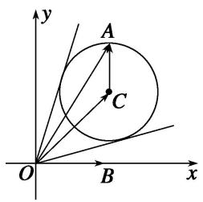
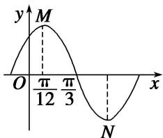
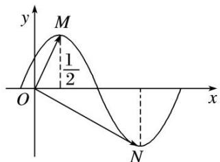
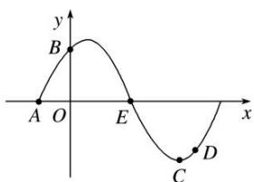
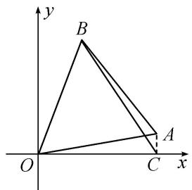

# 专题六 平面向量与三角函数

# 平面向量与三角函数综合问题的类型及求解思路  
（1）向量平行、垂直与三角函数综合

此类题型的解答一般是利用向量平行(共线)、垂直关系得到三角函数式，再利用三角恒等变换对三角函数式进行化简，结合三角函数的图象与性质进行求解.  
（2）向量的模与三角函数综合

此类题型主要是利用向量模的性质 $|\pmb{a}|^{2} = \pmb{a}^{2}$ , 如果涉及向量的坐标, 解答时可利用两种方法: 一是先进行向量的运算, 再代入向量的坐标进行求解; 二是先将向量的坐标代入, 再利用向量的坐标运算求解. 此类题型主要表现为两种形式: ①利用三角函数与向量的数量积直接联系; ②利用三角函数与向量的夹角交汇, 达到与数量积的综合.

# 考点一 平面向量与三角函数选填题

# 【例题选讲】

[例 1] （1） 设向量 $a=(2\cos\theta,\sin\theta)$ ，向量 $b=(1,-6)$ ，且 $a\cdot b=0$ ，则 $\frac{2\cos\theta+\sin\theta}{\cos\theta+3\sin\theta}$ 等于 \_\_\_\_.  
（2）在 $\triangle ABC$ 中， $BC=2$ ， $A=\frac{2\pi}{3}$ ，则 $\overrightarrow{AB}\cdot\overrightarrow{AC}$ 的最小值为\_\_\_\_.  
（3）已知向量 $\boldsymbol{a}=(\cos\frac{3x}{2},\sin\frac{3x}{2})$ ， $\boldsymbol{b}=(\cos\frac{x}{2},-\sin\frac{x}{2})$ ，且 $x\in[-\frac{\pi}{3},\frac{\pi}{4}]$ ，则 $|a+b|=$ \_\_\_\_.  
（4）已知向量 $\overrightarrow{OB} = (2,0)$ ，向量 $\overrightarrow{OC} = (2,2)$ ，向量 $\overrightarrow{CA} = (\sqrt{2}\cos \alpha, \sqrt{2}\sin \alpha)$ ，则向量 $\overrightarrow{OA}$ 与向量 $\overrightarrow{OB}$ 的夹角的取值范围是（）

A. $\left[0, \frac{\pi}{4}\right]$

B. $\left[\frac{\pi}{4}, \frac{5}{12}\pi\right]$

C. $\left[\frac{5}{12}\pi, \frac{\pi}{2}\right]$

D. $\left[\frac{\pi}{12},\frac{5}{12}\pi\right]$

  
（5）在平面直角坐标系 $xOy$ 中，点 $P(\sqrt{3}, 1)$ ，将向量 $\overrightarrow{OP}$ 绕点 $O$ 按逆时针方向旋转 $\frac{\pi}{2}$ 后得到向量 $\overrightarrow{OQ}$ ，则点 $Q$ 的坐标是（）

A. $(- \sqrt{2}, 1)$

B. $(-1,\sqrt{2})$

C. $(- \sqrt{3}, 1)$

D. $(-1,\sqrt{3})$  
（6）已知 $a, b, c$ 为 $\triangle ABC$ 的三个内角 $A, B, C$ 的对边，向量 $m = (\sqrt{3}, -1)$ ， $n = (\cos A, \sin A)$ 。若 $m \perp n$ ，且 $a \cos B + b \cos A = c \sin C$ ，则角 $A, B$ 的大小分别为（）

A. $\frac{\pi}{6},\quad\frac{\pi}{3}$

B. $\frac{2\pi}{3},\quad\frac{\pi}{6}$

C. $\frac{\pi}{3},\quad\frac{\pi}{6}$

D. $\frac{\pi}{3},\quad\frac{\pi}{3}$  
（7）若函数 $y=A\sin(\omega x+\varphi)(A>0,\quad\omega>0,\quad|\varphi|<\frac{\pi}{2})$ 在一个周期内的图象如图所示，M，N 分别是这段图象的最高点和最低点，且 $\overrightarrow{OM}\cdot\overrightarrow{ON}=0$ (O 为坐标原点)，则 A 等于()

A. $\frac{\pi}{6}$

B. $\frac{\sqrt{7}}{12}\pi$

C. $\frac{\sqrt{7}}{6}\pi$

D. $\frac{\sqrt{7}}{3}\pi$  
（8）设向量 $\boldsymbol{a}=(a_{1}, a_{2})$ ， $\boldsymbol{b}=(b_{1}, b_{2})$ ，定义一种向量积 $\boldsymbol{a} \otimes \boldsymbol{b} = (a_{1}b_{1}, a_{2}b_{2})$ ，已知向量 $\boldsymbol{m} = (2, \frac{1}{2})$ ， $\boldsymbol{n} = (\frac{\pi}{3}, 0)$ ，点 $P(x, y)$ 在 $y = \sin x$ 的图象上运动，Q 是函数 $y = f(x)$ 图象上的点，且满足 $\overrightarrow{OQ} = m \otimes \overrightarrow{OP} + n$ （其中 O 为坐标原点），则函数 $y = f(x)$ 的值域是 \_\_\_\_。

# 【对点训练】

1. 已知向量 $e_{1}=\left(\cos\frac{\pi}{4},\sin\frac{\pi}{6}\right)$ ， $e_{2}=\left(2\sin\frac{\pi}{4},4\cos\frac{\pi}{3}\right)$ ，则 $e_{1}\cdot e_{2}=$ \_\_\_\_.  
2. 已知向量 $a = (1 - \sin \theta, 1)$ , $b = \left(\frac{1}{2}, 1 + \sin \theta\right)$ , 若 $a // b$ , 则锐角 $\theta =$ \_\_\_\_.  
3. 已知向量 $m = (1, \cos \theta)$ , $n = (\sin \theta, -2)$ , 且 $m \perp n$ , 则 $\sin 2\theta + 6\cos^2\theta$ 的值为( )

A. $\frac{1}{2}$

B. 2

C. $2\sqrt{2}$

D. -2

4. 设向量 $\boldsymbol{a}=(\cos\alpha,-1)$ ， $\boldsymbol{b}=(2,\sin\alpha)$ ，若 $a\perp b$ ，则 $\tan(\alpha-\frac{\pi}{4})=$ \_\_\_\_.  
5. 在 $\triangle ABC$ 中，已知 $AB=\sqrt{3}$ ， $C=\frac{\pi}{3}$ ，则 $\overrightarrow{CA}\cdot\overrightarrow{CB}$ 的最大值为\_\_\_\_。  
6. 设向量 $a=(\cos10^{\circ}, \sin10^{\circ})$ , $b=(\cos70^{\circ}, \sin70^{\circ})$ ，则 $|a-2b|=$ \_\_\_\_.  
7. 将 $\overrightarrow{OA}=(1,1)$ 绕原点 O 逆时针方向旋转 $60^{\circ}$ 得到 $\overrightarrow{OB}$ ，则 $\overrightarrow{OB}=$ \_\_\_\_.  
8. 已知向量 $\boldsymbol{a}=(\cos\theta,\sin\theta)$ ， $\boldsymbol{b}=(\sqrt{3},-1)$ ，则 $|2a-b|$ 的最大值为 \_\_\_\_.  
9. 已知 A, B, C 三点的坐标分别为 $A(3, 0)$ , $B(0, 3)$ , $C(\cos \alpha, \sin \alpha)$ ，其中 $\alpha \in (\frac{\pi}{2}, \frac{3\pi}{2})$ 。若 $|\overrightarrow{AC}| = |\overrightarrow{BC}|$ ，则角 $\alpha =$ \_\_\_\_.  
10. 在 $\triangle ABC$ 中，角 $A, B, C$ 的对边分别是 $a, b, c$ ，若 $20a\overrightarrow{BC}+15b\overrightarrow{CA}+12c\overrightarrow{AB}=\mathbf{0}$ ，则 $\triangle ABC$ 最小角的正弦值等于( )

A. $\frac{4}{5}$

B. $\frac{3}{4}$

C. $\frac{3}{5}$

D. $\frac{\sqrt{7}}{4}$

11. 已知在 $\triangle ABC$ 中， $\overline{AB} = a$ ， $\overline{AC} = b$ ， $a \cdot b < 0$ ， $S_{\triangle ABC} = \frac{15}{4}$ ， $|a| = 3$ ， $|b| = 5$ ，则 $\angle BAC = \_$ 。  
12. $\triangle ABC$ 的三个内角 $A, B, C$ 所对的边长分别是 $a, b, c$ , 设向量 $m = (a + b, \sin C)$ , $n = (\sqrt{3} a + c, \sin B - \sin A)$ , 若 $m // n$ , 则角 $B$ 的大小为 \_\_\_\_.  
13. 在 $\triangle ABC$ 中，若 $\overrightarrow{BC} \cdot \overrightarrow{BA} + 2\overrightarrow{AC} \cdot \overrightarrow{AB} = \overrightarrow{CA} \cdot \overrightarrow{CB}$ ，则 $\frac{\sin A}{\sin C}$ 的值为（）

A. $\sqrt{2}$

B. $\frac{1}{2}$

C. $\frac{\sqrt{2}}{2}$

D. $\frac{\sqrt{3}}{2}$

14. 函数 $y=\sin(\omega x+\varphi)$ 在一个周期内的图象如图所示，M, N 分别是最高点、最低点，O 为坐标原点，且
$\overrightarrow{OM}\cdot\overrightarrow{ON}=0$ ，则函数 $f(x)$ 的最小正周期是\_\_\_\_。

15. 已知 A, B, C, D 是函数 $y=\sin(\omega x+\varphi)\left[\omega>0,0<\varphi<\frac{\pi}{2}\right]$ 一个周期内的图象上的四个点，如图所示， $A\left(-\frac{\pi}{6},0\right)$ ，B 为 y 轴上的点，C 为图象上的最低点，E 为该函数图象的一个对称中心，B 与 D 关于点 E 对称，由 $\overrightarrow{CD}$ 在 x 轴上的投影为 $\frac{\pi}{12}\frac{\overrightarrow{CD}}{|\overrightarrow{CD}|}$ ，则 $\omega,\varphi$ 的值为（）

A. $\omega = 2, \varphi = \frac{\pi}{3}$

B. $\omega = 2, \varphi = \frac{\pi}{6}$

C. $\omega = \frac{1}{2},\varphi = \frac{\pi}{3}$

D. $\omega = \frac{1}{2},\varphi = \frac{\pi}{6}$

16. 若直线 $ax - y = 0 (a \neq 0)$ 与函数 $f(x) = \frac{2\cos^2 x + 1}{\ln \frac{2 + x}{2 - x}}$ 的图象交于不同的两点 $A, B$ , 且点 $C(6, 0)$ , 若点 $D(m,$
$n)$ 满足 $\overrightarrow{DA} +\overrightarrow{DB} = \overrightarrow{CD}$ ，则 $m + n$ 等于（

A. 1

B. 2

C. 3

D. 4

# 考点二 平面向量与三角函数解答题

# 【例题选讲】

[例 1]在平面直角坐标系 xOy 中，已知向量 $m=\left(\frac{\sqrt{2}}{2}, -\frac{\sqrt{2}}{2}\right)$ ， $n=(\sin x, \cos x)$ ， $x\in\left(0, \frac{\pi}{2}\right)$ .  
（1）若 $m \perp n$ ，求 $\tan x$ 的值；  
（2）若 m 与 n 的夹角为 $\frac{\pi}{3}$ ，求 x 的值.

[例2]在平面直角坐标系中，设向量 $m = (\sqrt{3}\cos A, \sin A)$ ， $n = (\cos B, -\sqrt{3}\sin B)$ ，其中 $A$ ， $B$ 为 $\triangle ABC$ 的两个内角.  
（1）若 $m \perp n$ ，求证：C 为直角；  
（2）若 $m \parallel n$ ，求证：B 为锐角.

[例 3] (2014·山东) 已知向量 $a=(m, \cos2x)$ ， $b=(\sin2x, n)$ ，函数 $f(x)=a \cdot b$ ，且 $y=f(x)$ 的图象过点 $\left(\frac{\pi}{12}, \sqrt{3}\right)$ 和点 $\left(\frac{2\pi}{3}, -2\right)$ .  
（1）求 m, n 的值;  
（2）将 $y = f(x)$ 的图象向左平移 $\varphi (0 < \varphi < \pi)$ 个单位后得到函数 $y = g(x)$ 的图象，若 $y = g(x)$ 图象上各最高点到

点(0, 3)的距离的最小值为 1，求 $y=g(x)$ 的单调递增区间.

[例 4] (2017·江苏) 已知向量 $a=(\cos x, \sin x)$ ， $b=(3, -\sqrt{3})$ ， $x\in[0, \pi]$ .  
（1）若 $a \parallel b$ ，求 $x$ 的值；  
（2）记 $f(x)=\boldsymbol{a}\cdot\boldsymbol{b}$ ，求 $f(x)$ 的最大值和最小值以及对应的 x 的值.

[例 5]在 $\triangle ABC$ 中，角 A, B, C 的对边分别为 a, b, c，向量 $m=(\cos(A-B),\sin(A-B))$ ， $n=(\cos B,-\sin B)$ ，且 $m\cdot n=-\frac{3}{5}$ .  
（1）求 $\sin A$ 的值;  
（2）若 $a = 4\sqrt{2}$ ， $b = 5$ ，求角 $B$ 的大小及向量 $\overrightarrow{BA}$ 在 $\overrightarrow{BC}$ 方向上的投影向量.

[例 6]已知在 $\triangle ABC$ 中，角 A, B, C 的对边分别为 a, b, c，向量 $m=(\sin A, \sin B)$ ， $n=(\cos B, \cos A)$ ， $m \cdot n=\sin 2C$ .  
（1） 角 C 的度数;  
（2） $\sin A$ ， $\sin C$ ， $\sin B$ 成等差数列，且 $\overrightarrow{CA} \cdot (\overrightarrow{AB} - \overrightarrow{AC}) = 18$ ，求边 $c$ 的长.

[例 7]在 $\triangle ABC$ 中，设内角 $A, B, C$ 的对边分别为 $a, b, c$ ，向量 $m=(\cos A, \sin A)$ ，向量 $n=(\sqrt{2}-\sin A, \cos A)$ ，若 $|m+n|=2$ 。  
（1）求内角 A 的大小;  
（2）若 $b = 4\sqrt{2}$ ，且 $c = \sqrt{2} a$ ，求 $\triangle ABC$ 的面积.

[例 8] （1） $\triangle ABC$ 面积 S 的最大值;  
（2） $\overrightarrow{BA}\cdot\overrightarrow{BC}$ 的取值范围.

# 【对点训练】

1. 已知向量 $\boldsymbol{a}=(\cos\alpha,\sin\alpha)$ ， $\boldsymbol{b}=(\cos\beta,\sin\beta)$ ， $\boldsymbol{c}=(-1,0)$ .  
（1）求向量 $b+c$ 的模的最大值;  
（2）设 $\alpha=\frac{\pi}{4}$ ，且 $a\perp(b+c)$ ，求 $\cos\beta$ 的值.

2. 已知 A, B, C 三点的坐标分别为 $A(3, 0)$ , $B(0, 3)$ , $C(\cos\alpha, \sin\alpha)$ ，其中 $\alpha \in (\frac{\pi}{2}, \frac{3\pi}{2})$ .  
（1）若 $|\overrightarrow{AC}|=|\overrightarrow{BC}|$ ，求角 $\alpha$ 的值.  
（2）若 $\overrightarrow{AC} \cdot \overrightarrow{BC} = -1$ ，求 $\tan (\alpha + \frac{\pi}{4})$ 的值.

3. 已知向量 $\boldsymbol{m}=(\cos\alpha,-1)$ ， $\boldsymbol{n}=(2,\sin\alpha)$ ，其中 $\alpha\in(0,\frac{\pi}{2})$ ，且 $m\perp n$ .  
（1）求 $\cos2\alpha$ 的值;  
（2）若 $\sin(\alpha-\beta)=\frac{\sqrt{10}}{10}$ ，且 $\beta\in(0,\frac{\pi}{2})$ ，求角 $\beta$ 的大小.

4. 已知向量 $\boldsymbol{a}=(\cos\alpha,\sin\alpha)$ ， $\boldsymbol{b}=(\cos\beta,\sin\beta)$ ， $0<\alpha<\beta<\pi$ .  
（1）若 $|a-b|=\sqrt{2}$ ，求证 $a\perp b;$  
（2）设 $c = (0, 1)$ ，若 $a + b = c$ ，求 $\alpha, \beta$ 的值.

5. 已知在锐角 $\triangle ABC$ 中, 两向量 $p = (2 - 2\sin A, \cos A + \sin A)$ , $q = (\sin A - \cos A, 1 + \sin A)$ , 且 $p$ 与 $q$ 是共线向量.  
（1）求 A 的大小;  
（2）求函数 $y = 2\sin^2 B + \cos \left(\frac{C - 3B}{2}\right)$ 取最大值时， $B$ 的大小.

6. 已知向量 $a=(1-\tan x, 1)$ ， $b=(1+\sin 2x+\cos 2x, 0)$ 。记函数 $f(x)=a \cdot b$ 。  
（1）求函数 $f(x)$ 的解析式，并指出它的定义域；  
（2）若 $f(a+\frac{\pi}{8})=\frac{\sqrt{2}}{5},\quad a\in(0,\frac{\pi}{2})$ ，求 $f(a)$ .

7. 已知向量 $a = (2\sin (\omega x + \frac{2\pi}{3}), 0)$ , $b = (2\cos \omega x, 3)(\omega > 0)$ , 函数 $f(x) = a \cdot b$ 的图象与直线 $y = -2 + \sqrt{3}$ 相邻两个交点之间的距离为 $\pi$ .  
（1）求 $\omega$ 的值;  
（2）求函数 $f(x)$ 在 $[0, 2\pi]$ 上的单调增区间.

8. 已知向量 $\boldsymbol{m}=(2\sin(\omega x+\frac{\pi}{3}),1)$ ， $\boldsymbol{n}=(2\cos\omega x,-\sqrt{3})(\omega>0)$ ，函数 $f(x)=\boldsymbol{m}\cdot\boldsymbol{n}$ 的两条相邻对称轴间的距离为 $\frac{\pi}{2}$ .  
（1）求函数 $f(x)$ 的单调递增区间;  
（2）当 $x \in [-\frac{5\pi}{6}, \frac{\pi}{12}]$ 时，求 $f(x)$ 的值域.

9. 已知 $a=(\cos x, 2\cos x)$ ， $b=(2\cos x, \sin x)$ ， $f(x)=a \cdot b$ .  
（1）把 $f(x)$ 的图象向右平移 $\frac{\pi}{6}$ 个单位长度得到函数 $g(x)$ 的图象，求函数 $g(x)$ 的单调递增区间；  
（2）当 $a \neq 0$ ，a 与 b 共线时，求 $f(x)$ 的值.

10. 已知向量 $a=\left(\cos\frac{3x}{2},\sin\frac{3x}{2}\right)$ ， $b=\left(\cos\frac{x}{2},-\sin\frac{x}{2}\right)$ ，且 $x\in\left[-\frac{\pi}{3},\frac{\pi}{4}\right]$ .  
（1）求 $a \cdot b$ 及 $|a + b|$ ;  
（2）若 $f(x)=a\cdot b-|a+b|$ ，求 $f(x)$ 的最大值和最小值.

11. 已知 $a=(5\sqrt{3}\cos x,\ \cos x)$ ， $b=(\sin x,2\cos x)$ ，设函数 $f(x)=a\cdot b+|b|^{2}+\frac{3}{2}$ .  
（1）当 $x \in [\frac{\pi}{6}, \frac{\pi}{2}]$ 时，求函数 $f(x)$ 的值域；  
（2）当 $x \in [\frac{\pi}{6}, \frac{\pi}{2}]$ 时，若 $f(x) = 8$ ，求函数 $f(x - \frac{\pi}{12})$ 的值；  
（3）将函数 $y=f(x)$ 的图象向右平移 $\frac{\pi}{12}$ 个单位后，再将得到的图象上各点的纵坐标向下平移 5 个单位，得到函数 $y=g(x)$ 的图象，求函数 $g(x)$ 的表达式并判断其奇偶性.

12. 已知向量 $a=(\cos\alpha,\ \sin\alpha)$ ， $b=(\cos x,\ \sin x)$ ， $c=(\sin x+2\sin\alpha,\ \cos x+2\cos\alpha)$ ，其中 $0<\alpha<x<\pi$ .  
（1）若 $\alpha=\frac{\pi}{4}$ ，求函数 $f(x)=\boldsymbol{b}\cdot\boldsymbol{c}$ 的最小值及相应x的值；  
（2）若 a 与 b 的夹角为 $\frac{\pi}{3}$ ，且 $a \perp c$ ，求 $\tan 2\alpha$ 的值.

13. 如图，在平面直角坐标系 $xOy$ 中，边长为 1 的正三角形 $OAB$ 的顶点 $A$ ， $B$ 均在第一象限，设点 $A$ 在 $x$ 轴上的射影为 $C$ ， $\angle AOC = \alpha$ .  
（1） 试将 $\overrightarrow{OA} \cdot \overrightarrow{CB}$ 表示为 $\alpha$ 的函数 $f(\alpha)$ , 并写出其定义域;  
（2） 求函数 $f(\alpha)$ 的值域.

14. 已知向量 $m = \left( \sqrt{3} \sin \frac{x}{4}, 1 \right)$ , $n = \left( \cos \frac{x}{4}, \cos^{2} \frac{x}{4} \right)$ .  
（1）若 $m \cdot n = 1$ ，求 $\cos\left(\frac{2\pi}{3}-x\right)$ 的值；  
（2）记 $f(x)=m\cdot n$ ，在 $\triangle ABC$ 中，角 A, B, C 的对边分别是 a, b, c，且满足 $(2a-c)\cos B=b\cos C$ ，求函数 $f(A)$ 的取值范围.

15. (2017·山东)在 $\triangle ABC$ 中，角 $A, B, C$ 的对边分别为 $a, b, c$ 。已知 $b=3$ ， $\overrightarrow{AB} \cdot \overrightarrow{AC}=-6$ ， $S_{\triangle ABC}=3$ ，求 $A$ 和 $a$ 的值。

16. 已知 $A, B, C$ 是 $\triangle ABC$ 的内角， $a, b, c$ 分别是其对边长，向量 $m = (\sqrt{3}, \cos A + 1)$ ， $n = (\sin A, -1)$ ， $m \perp n$ .  
（1）求角 A 的大小;  
（2）若 $a = 2$ ， $\cos B = \frac{\sqrt{3}}{3}$ ，求 $b$ 的值.

17. 已知向量 $p=(2\sin x, \sqrt{3}\cos x)$ ， $q=(-\sin x, 2\sin x)$ ，函数 $f(x)=p \cdot q$ .  
（1）求 $f(x)$ 的单调递增区间；  
（2）在 $\triangle ABC$ 中， $a, b, c$ 分别是角 $A, B, C$ 的对边，且 $f(C)=1, c=1, ab=2\sqrt{3}$ ，且 $a>b$ ，求 $a, b$ 的值.

18. 在 $\triangle ABC$ 中，角 $A, B, C$ 的对边分别为 $a, b, c, a + c = 8, \cos B = \frac{1}{4}$ .  
（1） 若 $\overrightarrow{BA} \cdot \overrightarrow{BC} = 4$ ，求 b 的值；  
（2） 若 $\sin A = \frac{\sqrt{6}}{4}$ , 求 $\sin C$ 的值.

19. 设 $\triangle ABC$ 的内角 $A, B, C$ 所对边分别为 $a, b, c$ . 向量 $m = (a, \sqrt{3}b)$ , $n = (\sin B, -\cos A)$ , 且 $m \perp n$ .  
（1）求 A 的大小;  
（2）若 $|n|=\frac{\sqrt{6}}{4}$ ，求 $\cos C$ 的值.

20. 在 $\triangle ABC$ 中，内角 $A$ ， $B$ ， $C$ 的对边分别为 $a$ ， $b$ ， $c$ ，且 $a>c$ 。已知 $\overrightarrow{BA}\cdot\overrightarrow{BC}=2$ ， $\cos B=\frac{1}{3}$ ， $b=3$ 。  
（1）求 a 和 c 的值;  
（2）求 $\cos (B - C)$ 的值.

21. 已知 $\triangle ABC$ 的角 $A$ 、 $B$ 、 $C$ 所对的边分别是 $a$ 、 $b$ 、 $c$ ，设向量 $\boldsymbol{m}=(a, b)$ ， $\boldsymbol{n}=(\sin B, \sin A)$ ， $\boldsymbol{p}=(b-2, a-2)$ .  
（1）若 $m \parallel n$ ，求证： $\triangle ABC$ 为等腰三角形；  
（2）若 $m \perp p$ ，边长 c=2，角 $C=\frac{\pi}{3}$ ，求 $\triangle ABC$ 的面积.

22. 已知向量 $\boldsymbol{m}=(\sin x, -1)$ ，向量 $\boldsymbol{n}=\left(\sqrt{3}\cos x, -\frac{1}{2}\right)$ ，函数 $f(x)=(\boldsymbol{m}+\boldsymbol{n})\cdot\boldsymbol{m}$ .  
（1）求 $f(x)$ 的单调递减区间；  
（2）已知 $a, b, c$ 分别为 $\triangle ABC$ 内角 $A, B, C$ 的对边， $A$ 为锐角， $a = 2\sqrt{3}, c = 4$ ，且 $f(A)$ 恰是 $f(x)$ 在 $\left[0, \frac{\pi}{2}\right]$ 上的最大值，求 $A, b$ 和 $\triangle ABC$ 的面积 $S$ .

23. 已知 $\triangle ABC$ 为锐角三角形, 向量 $m = (3\cos^2 A, \sin A)$ , $n = (1, -\sin A)$ , 且 $m \perp n$ .  
（1）求 A 的大小;  
（2）当 $\overrightarrow{AB}=pm,\quad\overrightarrow{AC}=qn(p>0,\quad q>0)$ ，且满足 $p+q=6$ 时，求 $\triangle ABC$ 面积的最大值.

24. 已知 $\triangle ABC$ 的内角为 $A, B, C$ , 其对边分别为 $a, b, c, B$ 为锐角, 向量 $m = (2\sin B, -\sqrt{3})$ , $n = (\cos 2B, 2\cos \frac{2B}{2} - 1)$ , 且 $m // n$ .  
（1）求角 B 的大小;  
（2）如果 b=2，求 $S_{\triangle ABC}$ 的最大值.

25. 在 $\triangle ABC$ 中，角 $A, B, C$ 的对边分别为 $a, b, c$ ，且满足 $(\sqrt{2} a - c)\overrightarrow{BA}\cdot \overrightarrow{BC} = c\overrightarrow{CB}\cdot \overrightarrow{CA}$ .  
（1）求角 B 的大小;  
（2）若 $|\overrightarrow{BA}-\overrightarrow{BC}|=\sqrt{6}$ ，求 $\triangle ABC$ 面积的最大值.

26. 已知向量 $a = (2, 2)$ ，向量 $\pmb{b}$ 与向量 $\pmb{a}$ 的夹角为 $\frac{3\pi}{4}$ ，且 $a \cdot b = -2$ .  
（1）求向量 b;  
（2）若 $t = (1,0)$ ，且 $\pmb{b} \perp \pmb{t}$ ， $\pmb{c} = \left[\cos A, 2\cos^2\frac{C}{2}\right]$ ，其中 $A, B, C$ 是 $\triangle ABC$ 的内角，若 $A, B, C$ 依次成等差数列，试求 $|\pmb{b} + \pmb{c}|$ 的取值范围.

