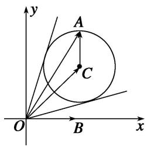
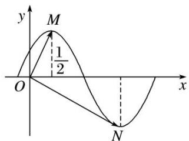
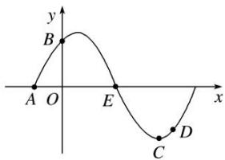
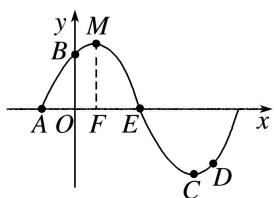
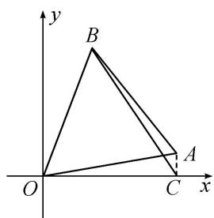

# 专题六 平面向量与三角函数

# 平面向量与三角函数综合问题的类型及求解思路  
（1）向量平行、垂直与三角函数综合

此类题型的解答一般是利用向量平行(共线)、垂直关系得到三角函数式，再利用三角恒等变换对三角函数式进行化简，结合三角函数的图象与性质进行求解.  
（2）向量的模与三角函数综合

此类题型主要是利用向量模的性质 $|\pmb{a}|^{2} = \pmb{a}^{2}$ , 如果涉及向量的坐标, 解答时可利用两种方法: 一是先进行向量的运算, 再代入向量的坐标进行求解; 二是先将向量的坐标代入, 再利用向量的坐标运算求解. 此类题型主要表现为两种形式: ①利用三角函数与向量的数量积直接联系; ②利用三角函数与向量的夹角交汇, 达到与数量积的综合.

# 考点一 平面向量与三角函数选填题

# 【例题选讲】

[例 1] （1） 设向量 $a=(2\cos\theta,\sin\theta)$ ，向量 $b=(1,-6)$ ，且 $a\cdot b=0$ ，则 $\frac{2\cos\theta+\sin\theta}{\cos\theta+3\sin\theta}$ 等于 \_\_\_\_.
答案 $\frac{7}{6}$ 解析 因为 $a \cdot b = 0$ ，则 $2\cos \theta - 6\sin \theta = 0$ ，即 $\tan \theta = \frac{1}{3}$ ，则 $\frac{2\cos \theta + \sin \theta}{\cos \theta + 3\sin \theta} = \frac{2 + \tan \theta}{1 + 3\tan \theta} = \frac{2 + \frac{1}{3}}{2} = \frac{7}{6}$ .  
（2）在 $\triangle ABC$ 中， $BC=2$ ， $A=\frac{2\pi}{3}$ ，则 $\overrightarrow{AB}\cdot\overrightarrow{AC}$ 的最小值为\_\_\_\_.
答案 $-\frac{2}{3}$ 解析 由余弦定理得 $BC^2 = AB^2 + AC^2 - 2AB \cdot AC \cdot \cos \frac{2\pi}{3} \geq 2AB \cdot AC + AB \cdot AC = 3AB \cdot AC$ ，所以 $AB \cdot AC \leq \frac{4}{3}$ . 所以 $\overrightarrow{AB} \cdot \overrightarrow{AC} = AB \cdot AC \cdot \cos \frac{2\pi}{3} = -\frac{1}{2} AB \cdot AC \geq -\frac{2}{3}$ ，故 $(\overrightarrow{AB} \cdot \overrightarrow{AC})_{\min} = -\frac{2}{3}$ ，当且仅当 $AB = AC$ 时等号成立.  
（3）已知向量 $\boldsymbol{a}=(\cos\frac{3x}{2},\sin\frac{3x}{2})$ ， $\boldsymbol{b}=(\cos\frac{x}{2},-\sin\frac{x}{2})$ ，且 $x\in[-\frac{\pi}{3},\frac{\pi}{4}]$ ，则 $|a+b|=$ \_\_\_\_.
答案 $2\cos x$ 解析 $\because a+b=(\cos\frac{3x}{2}+\cos\frac{x}{2},\sin\frac{3x}{2}-\sin\frac{x}{2}),\therefore|a+b|=\sqrt{(\cos\frac{3x}{2}+\cos\frac{x}{2})^{2}+(\sin\frac{3x}{2}-\sin\frac{x}{2})^{2}}= \sqrt{2+2\cos 2x}=2|\cos x|.$ $\because x\in[-\frac{\pi}{3},\frac{\pi}{4}],\quad\therefore\cos x>0,\quad\therefore|a+b|=2\cos x.$  
（4）已知向量 $\overrightarrow{OB} = (2,0)$ ，向量 $\overrightarrow{OC} = (2,2)$ ，向量 $\overrightarrow{CA} = (\sqrt{2}\cos \alpha, \sqrt{2}\sin \alpha)$ ，则向量 $\overrightarrow{OA}$ 与向量 $\overrightarrow{OB}$ 的夹角的取值范围是（）

A. $\begin{bmatrix}0,\frac{\pi}{4}\end{bmatrix}$

B. $\left[\frac{\pi}{4},\frac{5}{12}\pi\right]$

C. $\left[\frac{5}{12}\pi,\frac{\pi}{2}\right]$

D. $\left[\frac{\pi}{12},\frac{5}{12}\pi\right]$
答案 D 解析 由题意，得： $\overrightarrow{OA}=\overrightarrow{OC}+\overrightarrow{CA}=(2+\sqrt{2}\cos\alpha,2+\sqrt{2}\sin\alpha)$ ，所以点 A 的轨迹是圆 $(x-2)^{2}+(y-2)^{2}=2$ ，如图，当 A 位于使向量 $\overrightarrow{OA}$ 与圆相切时，向量 $\overrightarrow{OA}$ 与向量 $\overrightarrow{OB}$ 的夹角分别达到最大、最小值，故选 D.

  
（5）在平面直角坐标系 $xOy$ 中，点 $P(\sqrt{3}, 1)$ ，将向量 $\overrightarrow{OP}$ 绕点 $O$ 按逆时针方向旋转 $\frac{\pi}{2}$ 后得到向量 $\overrightarrow{OQ}$ ，则点 $Q$ 的坐标是（）

A. $(- \sqrt{2}, 1)$

B. $(-1,\sqrt{2})$

C. $(- \sqrt{3}, 1)$

D. $(-1, \sqrt{3})$
答案 D 解析 由 $P(\sqrt{3}, 1)$ ，得 $P\left(2\cos \frac{\pi}{6}, 2\sin \frac{\pi}{6}\right)$ ， $\because$ 将向量 $\overrightarrow{OP}$ 绕点 $O$ 按逆时针方向旋转 $\frac{\pi}{2}$ 后得到向量 $\overrightarrow{OQ}$ ， $\therefore Q\left(2\cos \left(\frac{\pi}{6} + \frac{\pi}{2}\right), 2\sin \left(\frac{\pi}{6} + \frac{\pi}{2}\right)\right)$ ，又 $\cos \left(\frac{\pi}{6} + \frac{\pi}{2}\right) = -\sin \frac{\pi}{6} = -\frac{1}{2}$ ， $\sin \left(\frac{\pi}{6} + \frac{\pi}{2}\right) = \cos \frac{\pi}{6} = \frac{\sqrt{3}}{2}$ ， $\therefore Q(-1, \sqrt{3})$ 。  
（6）已知 $a, b, c$ 为 $\triangle ABC$ 的三个内角 $A, B, C$ 的对边，向量 $m = (\sqrt{3}, -1)$ ， $n = (\cos A, \sin A)$ 。若 $m \perp n$ ，且 $a \cos B + b \cos A = c \sin C$ ，则角 $A, B$ 的大小分别为（）

A. $\frac{\pi}{6},\quad\frac{\pi}{3}$

B. $\frac{2\pi}{3},\quad\frac{\pi}{6}$

C. $\frac{\pi}{3},\quad\frac{\pi}{6}$

D. $\frac{\pi}{3},\quad\frac{\pi}{3}$
答案 C 解析 由 $m \perp n$ 得 $m \cdot n = 0$ ，即 $\sqrt{3}\cos A - \sin A = 0$ ，即 $2\cos\left(\frac{A + \pi}{6}\right) = 0$ ， $\because \frac{\pi}{6} < A + \frac{\pi}{6} < \frac{7\pi}{6}$ ， $\therefore A + \frac{\pi}{6} = \frac{\pi}{2}$ ，即 $A = \frac{\pi}{3}$ 。又 $a\cos B + b\cos A = 2R\sin A\cos B + 2R\sin B\cos A = 2R\sin(A + B) = 2R\sin C = c = c\sin C$ ， $\therefore \sin C = 1$ ， $C = \frac{\pi}{2}$ ， $\therefore B = \pi - \frac{\pi}{3} - \frac{\pi}{2} = \frac{\pi}{6}$ 。  
（7）若函数 $y=A\sin(\omega x+\varphi)(A>0,\quad\omega>0,\quad|\varphi|<\frac{\pi}{2})$ 在一个周期内的图象如图所示，M，N 分别是这段图象的最高点和最低点，且 $\overrightarrow{OM}\cdot\overrightarrow{ON}=0$ (O 为坐标原点)，则 A 等于()

A. $\frac{\pi}{6}$

B. $\frac{\sqrt{7}}{12}\pi$

C. $\frac{\sqrt{7}}{6}\pi$

D. $\frac{\sqrt{7}}{3}\pi$
答案 B 解析 由题意知 $M(\frac{\pi}{12}, A)$ ， $N(\frac{7}{12}\pi, -A)$ ，又 $\overrightarrow{OM} \cdot \overrightarrow{ON} = \frac{\pi}{12} \times \frac{7}{12}\pi - A^2 = 0$ ，∴ $A = \frac{\sqrt{7}}{12}\pi$ .  
（8）设向量 $\boldsymbol{a}=(a_{1}, a_{2})$ , $\boldsymbol{b}=(b_{1}, b_{2})$ ，定义一种向量积 $\boldsymbol{a} \otimes \boldsymbol{b}=(a_{1}b_{1}, a_{2}b_{2})$ ，已知向量 $\boldsymbol{m}=(2, \frac{1}{2})$ , $\boldsymbol{n}=(\frac{\pi}{3}, 0)$ ，点 $P(x, y)$ 在 $y=\sin x$ 的图象上运动，Q 是函数 $y=f(x)$ 图象上的点，且满足 $\overrightarrow{OQ} = m \otimes \overrightarrow{OP} + n$ （其中 O 为坐标原点），则函数 $y=f(x)$ 的值域是 \_\_\_\_。
答案 $\left[-\frac{1}{2},\frac{1}{2}\right]$ 解析 设 $Q(c,d)$ ，由新的运算可得 $\overrightarrow{OQ}=m\otimes\overrightarrow{OP}+n=(2x,\frac{1}{2}\sin x)+(\frac{\pi}{3},0)=(2x+\frac{\pi}{3})$
$\frac{1}{2}\sin x)$ ，由 $\left\{ \begin{array}{l} c = 2x + \frac{\pi}{3}, \\ d = \frac{1}{2}\sin x, \end{array} \right.$ 消去 $x$ 得 $d = \frac{1}{2}\sin (\frac{1}{2}c - \frac{\pi}{6})$ ，所以 $y = f(x) = \frac{1}{2}\sin (\frac{1}{2}x - \frac{\pi}{6})$ ，易知 $y = f(x)$ 的值域是 $\left[-\frac{1}{2}, \frac{1}{2}\right]$ .

# 【对点训练】

1. 已知向量 $e_{1}=\left(\cos\frac{\pi}{4},\sin\frac{\pi}{6}\right)$ ， $e_{2}=\left(2\sin\frac{\pi}{4},4\cos\frac{\pi}{3}\right)$ ，则 $e_{1}\cdot e_{2}=$ \_\_\_\_.

1. 答案 2 解析 由向量数量积公式得 $e_1 \cdot e_2 = \cos \frac{\pi}{4} \times 2\sin \frac{\pi}{4} + \sin \frac{\pi}{6} \times 4\cos \frac{\pi}{3} = \frac{\sqrt{2}}{2} \times \sqrt{2} + \frac{1}{2} \times 2 = 2$ .

2. 已知向量 $a = (1 - \sin \theta, 1)$ , $b = \left(\frac{1}{2}, 1 + \sin \theta\right)$ , 若 $a // b$ , 则锐角 $\theta =$ \_\_\_\_.

2. 答案 $45^{\circ}$ 解析 由 $a // b$ ，得 $(1 - \sin \theta)(1 + \sin \theta) = \frac{1}{2}$ ， $\therefore \cos^{2} \theta = \frac{1}{2}$ ， $\therefore \cos \theta = \frac{\sqrt{2}}{2}$ 或 $\cos \theta = -\frac{\sqrt{2}}{2}$ ，又 $\theta$ 为锐角， $\therefore \theta = 45^{\circ}$ .

3. 已知向量 $m = (1, \cos \theta)$ , $n = (\sin \theta, -2)$ , 且 $m \perp n$ , 则 $\sin 2\theta + 6\cos^2\theta$ 的值为( )

A. $\frac{1}{2}$

B. 2

C. $2\sqrt{2}$

D. -2

3. 答案 B 解析 由题意可得 $m \cdot n = \sin \theta - 2\cos \theta = 0$ ，则 $\tan \theta = 2$ ，所以 $\sin 2\theta + 6\cos^2\theta = \frac{2\sin \theta\cos \theta + 6\cos^2\theta}{\sin^2\theta + \cos^2\theta} = \frac{2\tan \theta + 6}{\tan^2\theta + 1} = 2$ 。故选 B.

4. 设向量 $\boldsymbol{a}=(\cos\alpha,-1)$ ， $\boldsymbol{b}=(2,\sin\alpha)$ ，若 $a\perp b$ ，则 $\tan(\alpha-\frac{\pi}{4})=$ \_\_\_\_.

4. 答案 $\frac{1}{3}$ 解析：由已知可得 $a \cdot b = 2\cos \alpha - \sin \alpha = 0$ ， $\therefore \tan \alpha = 2$ ， $\tan (\alpha - \frac{\pi}{4}) = \frac{\tan \alpha - 1}{1 + \tan \alpha} = \frac{1}{3}$ .

5. 在 $\triangle ABC$ 中，已知 $AB=\sqrt{3}$ ， $C=\frac{\pi}{3}$ ，则 $\overrightarrow{CA}\cdot\overrightarrow{CB}$ 的最大值为\_\_\_\_。

5. 答案: $\frac{3}{2}$ 解析 因为 $AB = \sqrt{3}$ , $C = \frac{\pi}{3}$ , 设角 $A, B, C$ 所对的边分别为 $a, b, c$ , 所以由余弦定理得 3 $= a^{2} + b^{2} - 2ab\cos \frac{\pi}{3} = a^{2} + b^{2} - ab \geq ab$ , 当且仅当 $a = b = \sqrt{3}$ 时等号成立. 又 $\overrightarrow{CA} \cdot \overrightarrow{CB} = ab\cos C = \frac{1}{2}ab$ , 所以当 $a = b = \sqrt{3}$ 时, $(\overrightarrow{CA} \cdot \overrightarrow{CB})_{\max} = \frac{3}{2}$ .

6. 设向量 $a=(\cos10^{\circ}, \sin10^{\circ})$ ， $b=(\cos70^{\circ}, \sin70^{\circ})$ ，则 $|a-2b|=$ \_\_\_\_.

6. 答案 $\sqrt{3}$ 解析 $|a - 2b| = |(\cos 10^{\circ} - 2\cos 70^{\circ}, \sin 10^{\circ} - 2\sin 70^{\circ})| = \sqrt{(\cos 10^{\circ} - 2\cos 70^{\circ})^{2} + (\sin 10^{\circ} - 2\sin 70^{\circ})^{2}} = \sqrt{3}$ .

7. 将 $\overrightarrow{OA}=(1,1)$ 绕原点 O 逆时针方向旋转 $60^{\circ}$ 得到 $\overrightarrow{OB}$ ，则 $\overrightarrow{OB}=$ \_\_\_\_.

7. 答案 $\left(\frac{1 - \sqrt{3}}{2}, \frac{1 + \sqrt{3}}{2}\right)$ 解析 由题意可得 $\overrightarrow{OB}$ 的横坐标 $x = \sqrt{2} \cos(60^{\circ} + 45^{\circ}) = \sqrt{2} \times \left(\frac{\sqrt{2}}{4} - \frac{\sqrt{6}}{4}\right) = \frac{1 - \sqrt{3}}{2}$ , 纵坐标 $y = \sqrt{2} \cdot \sin(60^{\circ} + 45^{\circ}) = \sqrt{2} \times \left(\frac{\sqrt{6}}{4} + \frac{\sqrt{2}}{4}\right) = \frac{1 + \sqrt{3}}{2}$ , 则 $\overrightarrow{OB} = \left(\frac{1 - \sqrt{3}}{2}, \frac{1 + \sqrt{3}}{2}\right)$ .

8. 已知向量 $\boldsymbol{a}=(\cos\theta,\sin\theta)$ ， $\boldsymbol{b}=(\sqrt{3},-1)$ ，则 $|2a-b|$ 的最大值为 \_\_\_\_.

8. 答案 4 解析 设 $a$ 与 $b$ 夹角为 $\alpha$ ，因为 $|2a - b|^2 = 4a^2 - 4a \cdot b + b^2 = 8 - 4|a||b|\cos \alpha = 8 - 8\cos \alpha$ ，因为 $\alpha$ $\in [0, \pi]$ , 所以 $\cos \alpha \in [-1, 1]$ , 所以 $8 - 8\cos \alpha \in [0, 16]$ , 即 $|2a - b|^2 \in [0, 16]$ , 所以 $|2a - b| \in [0, 4]$ . 所以 $|2a - b|$ 的最大值为 4.

9. 已知 $A, B, C$ 三点的坐标分别为 $A(3, 0), B(0, 3), C(\cos \alpha, \sin \alpha)$ ，其中 $\alpha \in (\frac{\pi}{2}, \frac{3\pi}{2})$ 。若 $|\overrightarrow{AC}| = |\overrightarrow{BC}|$ ，则角 $\alpha =$ \_\_\_\_.

9. 答案 $\frac{5\pi}{4}$ 解析 $\because \overrightarrow{AC} = (\cos \alpha - 3, \sin \alpha), \overrightarrow{BC} = (\cos \alpha, \sin \alpha - 3), \therefore |\overrightarrow{AC}| = \sqrt{(\cos \alpha - 3)^2 + \sin^2\alpha} = \sqrt{10 - 6\cos \alpha}, |\overrightarrow{BC}| = \sqrt{10 - 6\sin \alpha}$ . 由 $|\overrightarrow{AC}| = |\overrightarrow{BC}|$ 得 $\sin \alpha = \cos \alpha$ . 又 $\alpha \in (\frac{\pi}{2}, \frac{3\pi}{2}), \therefore \alpha = \frac{5\pi}{4}$ .

10. 在 $\triangle ABC$ 中，角 $A, B, C$ 的对边分别是 $a, b, c$ ，若 $20a\overrightarrow{BC}+15b\overrightarrow{CA}+12c\overrightarrow{AB}=\mathbf{0}$ ，则 $\triangle ABC$ 最小角的正弦值等于( )

A. $\frac{4}{5}$

B. $\frac{3}{4}$

C. $\frac{3}{5}$

D. $\frac{\sqrt{7}}{4}$

10. 答案 C 解析 $\because 20a\overrightarrow{BC} + 15b\overrightarrow{CA} + 12c\overrightarrow{AB} = 0, \therefore 20a(\overrightarrow{AC} - \overrightarrow{AB}) + 15b\overrightarrow{CA} + 12c\overrightarrow{AB} = 0, \therefore (20a - 15b)\overrightarrow{AC}$ $+(12c - 20a)\overrightarrow{AB} = 0, \because \overrightarrow{AC}$ 与 $\overrightarrow{AB}$ 不共线， $\therefore \begin{cases} 20a - 15b = 0, \\ 12c - 20a = 0, \end{cases}$ 解得 $\left\{ \begin{array}{l} b = \frac{4}{3} a, \\ c = \frac{5}{3} a, \end{array} \right.$ $\therefore \triangle ABC$ 最小角为角 $A, \therefore \cos A = \frac{b^2 + c^2 - a^2}{2bc} = \frac{\frac{16}{9}a^2 + \frac{25}{9}a^2 - a^2}{2\times\frac{4}{3}a\times\frac{5}{3}a} = \frac{4}{5}, \therefore \sin A = \frac{3}{5}$ ，故选 C.

11. 已知在 $\triangle ABC$ 中， $\overrightarrow{AB} = a$ ， $\overrightarrow{AC} = b$ ， $a \cdot b < 0$ ， $S_{\triangle ABC} = \frac{15}{4}$ ， $|a| = 3$ ， $|b| = 5$ ，则 $\angle BAC =$ \_\_\_\_.

11. 答案 $150^{\circ}$ 解析 $\because\overrightarrow{AB}\cdot\overrightarrow{AC}<0,\therefore\angle BAC$ 为钝角，又 $S_{\triangle ABC}=\frac{1}{2}|a||b|\sin\angle BAC=\frac{15}{4}.\therefore\sin\angle BAC=\frac{1}{2},$ $\therefore\angle BAC=150^{\circ}.$

12. $\triangle ABC$ 的三个内角 $A, B, C$ 所对的边长分别是 $a, b, c$ , 设向量 $m = (a + b, \sin C)$ , $n = (\sqrt{3} a + c, \sin B - \sin A)$ , 若 $m \parallel n$ , 则角 $B$ 的大小为 \_\_\_\_.

12. 答案 $\frac{5\pi}{6}$ 解析 $\because m // n, \therefore (a + b)(\sin B - \sin A) - \sin C(\sqrt{3} a + c) = 0$ ，又 $\because \frac{a}{\sin A} = \frac{b}{\sin B} = \frac{c}{\sin C}$ ，则化简得 $a^2 + c^2 - b^2 = -\sqrt{3} ac, \therefore \cos B = \frac{a^2 + c^2 - b^2}{2ac} = -\frac{\sqrt{3}}{2}, \because 0 < B < \pi, \therefore B = \frac{5\pi}{6}$ .

13. 在 $\triangle ABC$ 中，若 $\overrightarrow{BC} \cdot \overrightarrow{BA} + 2\overrightarrow{AC} \cdot \overrightarrow{AB} = \overrightarrow{CA} \cdot \overrightarrow{CB}$ ，则 $\frac{\sin A}{\sin C}$ 的值为（）

A. $\sqrt{2}$

B. $\frac{1}{2}$

C. $\frac{\sqrt{2}}{2}$

D. $\frac{\sqrt{3}}{2}$

13. 答案 A 解析 设 $\triangle ABC$ 的内角 $A, B, C$ 所对的边分别为 $a, b, c$ , 由 $\overrightarrow{BC} \cdot \overrightarrow{BA} + 2\overrightarrow{AC} \cdot \overrightarrow{AB} = \overrightarrow{CA} \cdot \overrightarrow{CB}$ , 得 $ac \times \frac{a^2 + c^2 - b^2}{2ac} + 2bc \times \frac{b^2 + c^2 - a^2}{2bc} = ab \times \frac{a^2 + b^2 - c^2}{2ab}$ , 化简可得 $a = \sqrt{2}c$ . 由正弦定理得 $\frac{\sin A}{\sin C} = \frac{a}{c} = \sqrt{2}$ .

14. 函数 $y = \sin (\omega x + \varphi)$ 在一个周期内的图象如图所示， $M, N$ 分别是最高点、最低点， $O$ 为坐标原点，且 $\overrightarrow{OM} \cdot \overrightarrow{ON} = 0$ ，则函数 $f(x)$ 的最小正周期是 \_\_\_\_.

14. 答案 3 解析 由图象可知， $M\left(\frac{1}{2},1\right)$ ， $N(x_{N},-1)$ ，所以 $\overrightarrow{OM}\cdot\overrightarrow{ON}=\left(\frac{1}{2},1\right)\cdot(x_{N},-1)=\frac{1}{2}x_{N}-1=0$ ，解得 $x_{N}=2$ ，所以函数 $f(x)$ 的最小正周期是 $2\times\left(2-\frac{1}{2}\right)=3$ .

15. 已知 A, B, C, D 是函数 $y=\sin(\omega x+\varphi)\left[\omega>0,0<\varphi<\frac{\pi}{2}\right]$ 一个周期内的图象上的四个点，如图所示， $A\left(-\frac{\pi}{6},0\right)$ ，B 为 y 轴上的点，C 为图象上的最低点，E 为该函数图象的一个对称中心，B 与 D 关于点 E 对称，由 $\overrightarrow{CD}$ 在 x 轴上的投影为 $\frac{\pi}{12}\frac{\overrightarrow{CD}}{|\overrightarrow{CD}|}$ ，则 $\omega,\varphi$ 的值为（）

A. $\omega = 2, \varphi = \frac{\pi}{3}$

B. $\omega = 2, \varphi = \frac{\pi}{6}$

C. $\omega = \frac{1}{2},\varphi = \frac{\pi}{3}$

D. $\omega=\frac{1}{2},\quad\varphi=\frac{\pi}{6}$

15. 答案 A 解析 由 E 为该函数图象的一个对称中心，作点 C 的对称点 M，作 $MF \perp x$ 轴，垂足为 F，如图。B 与 D 关于点 E 对称，由 $\overrightarrow{CD}$ 在 x 轴上的投影为 $\frac{\pi}{12}$ ，知 $OF = \frac{\pi}{12}$ ，又 $A\left(-\frac{\pi}{6}, 0\right)$ ，所以 $AF = \frac{T}{4} = \frac{\pi}{2\omega} = \frac{\pi}{4}$ ，所以 $\omega = 2$ 。同时函数 $y = \sin(\omega x + \varphi)$ 图象可以看作是由 $y = \sin \omega x$ 的图象向左平移得到，故可知 $\frac{\varphi}{\omega} = \frac{\varphi}{2} = \frac{\pi}{6}$ ，即 $\varphi = \frac{\pi}{3}$ 。

16. 若直线 $ax - y = 0 (a \neq 0)$ 与函数 $f(x) = \frac{2\cos^2 x + 1}{\ln \frac{2 + x}{2 - x}}$ 的图象交于不同的两点 $A, B$ ，且点 $C(6, 0)$ ，若点 $D(m, n)$ 满足 $\overrightarrow{DA} + \overrightarrow{DB} = \overrightarrow{CD}$ ，则 $m + n$ 等于（）

A. 1

B. 2

C. 3

D. 4

16. 答案 B 解析 因为 $f(-x) = \frac{2\cos^2(-x) + 1}{\ln\frac{2 - x}{2 + x}} = \frac{2\cos^2x + 1}{-\ln\frac{2 + x}{2 - x}} = -f(x)$ ，且直线 $ax - y = 0$ 过坐标原点，所以

直线与函数 $f(x) = \frac{2\cos^2 x + 1}{\ln \frac{2 + x}{2 - x}}$ 的图象的两个交点 $A, B$ 关于原点对称，即 $x_A + x_B = 0, y_A + y_B = 0$ ，又 $\overrightarrow{DA} =$
$(x_{A}-m, y_{A}-n)$ , $\overrightarrow{DB}=(x_{B}-m, y_{B}-n)$ , $\overrightarrow{CD}=(m-6, n)$ ，由 $\overrightarrow{DA}+\overrightarrow{DB}=\overrightarrow{CD}$ ，得 $x_{A}-m+x_{B}-m=m-6$ , $y_{A}-n+y_{B}-n=n$ ，解得 m=2, n=0，所以 $m+n=2$ ，故选 B.

# 考点二 平面向量与三角函数解答题

# 【例题选讲】

[例 1]在平面直角坐标系 xOy 中，已知向量 $m=\left(\frac{\sqrt{2}}{2}, -\frac{\sqrt{2}}{2}\right)$ ， $n=(\sin x, \cos x)$ ， $x\in\left(0, \frac{\pi}{2}\right)$ .  
（1）若 $m \perp n$ ，求 $\tan x$ 的值；  
（2）若 m 与 n 的夹角为 $\frac{\pi}{3}$ ，求 x 的值.
解析 （1） 因为 $m=\left(\frac{\sqrt{2}}{2}, -\frac{\sqrt{2}}{2}\right)$ ， $n=(\sin x, \cos x)$ ， $m \perp n$ .
所以 $m \cdot n = 0$ ，即 $\frac{\sqrt{2}}{2}\sin x - \frac{\sqrt{2}}{2}\cos x = 0$ ，所以 $\sin x = \cos x$ ，所以 $\tan x = 1$ 。  
（2）因为 $|m|=|n|=1$ ，所以 $m\cdot n=\cos\frac{\pi}{3}=\frac{1}{2}$ ，即 $\frac{\sqrt{2}}{2}\sin x-\frac{\sqrt{2}}{2}\cos x=\frac{1}{2}$ ，所以 $\sin\left(x-\frac{\pi}{4}\right)=\frac{1}{2}$
因为 $0 < x < \frac{\pi}{2}$ ，所以 $-\frac{\pi}{4} < x - \frac{\pi}{4} < \frac{\pi}{4}$ ，所以 $x - \frac{\pi}{4} = \frac{\pi}{6}$ ，即 $x = \frac{5\pi}{12}$ .

[例 2]在平面直角坐标系中，设向量 $\boldsymbol{m}=(\sqrt{3}\cos A,\sin A)$ ， $\boldsymbol{n}=(\cos B,-\sqrt{3}\sin B)$ ，其中 A，B 为 $\triangle ABC$ 的两个内角.  
（1）若 $m \perp n$ ，求证：C 为直角；  
（2）若 $m \parallel n$ ，求证：B 为锐角.
证明：（1） 易得 $m \cdot n = \sqrt{3} (\cos A \cos B - \sin A \sin B) = \sqrt{3} \cos (A + B)$ .
因为 $m \perp n$ ，所以 $m \cdot n = 0$ ，即 $\cos(A + B) = \cos\frac{\pi}{2}$ .
因为 $0<A+B<\pi$ ，且函数 $y=\cos x$ 在 $(0,\pi)$ 内是单调减函数，
所以 $A + B = \frac{\pi}{2}$ ，即 C 为直角.  
（2）因为 $m \parallel n$ ，所以 $\sqrt{3} \cos A \cdot (-\sqrt{3} \sin B) - \sin A \cos B = 0$ ，即 $\sin A \cos B + 3 \cos A \sin B = 0$ .
因为 A, B 是三角形内角，所以 $\cos A \cos B \neq 0$ ,
于是 $\tan A = -3\tan B$ ，因而 A，B 中恰有一个是钝角，所以 $\frac{\pi}{2} < A + B < \pi$ ,
从而 $\tan(A+B)=\frac{\tan A+\tan B}{1-\tan A\tan B}=\frac{-3\tan B+\tan B}{1+3\tan^{2}B}=\frac{-2\tan B}{1+3\tan^{2}B}<0$ ，所以 $\tan B>0$ ，即证 B 为锐角.

注：（2） 解得 $\tan A = -3\tan B$ 后，得 $\tan A$ 与 $\tan B$ 异号，
若 $\tan B<0$ ，则 $\tan C=-\tan(A+B)=-\frac{\tan A+\tan B}{1-\tan A\tan B}=-\frac{-3\tan B+\tan B}{1+3\tan^{2}B}=\frac{2\tan B}{1+3\tan^{2}B}<0,$
于是，在 $\triangle ABC$ 中，有两个钝角 $B$ 和 $C$ ，这与三角形内角和定理矛盾，不可能.
于是必有 $\tan B > 0$ ，即证 B 为锐角.

[例 3] (2014·山东) 已知向量 $a=(m, \cos2x)$ ， $b=(\sin2x, n)$ ，函数 $f(x)=a \cdot b$ ，且 $y=f(x)$ 的图象过点 $\left(\frac{\pi}{12}, \sqrt{3}\right)$ 和点 $\left(\frac{2\pi}{3}, -2\right)$ .  
（1）求 $m, n$ 的值；  
（2）将 $y = f(x)$ 的图象向左平移 $\varphi (0 < \varphi < \pi)$ 个单位后得到函数 $y = g(x)$ 的图象，若 $y = g(x)$ 图象上各最高点到点(0,3)的距离的最小值为1，求 $y = g(x)$ 的单调递增区间.
解析 （1）由题意知 $f(x) = a \cdot b = m \sin 2x + n \cos 2x$ . 因为 $y = f(x)$ 的图象过点 $(\frac{\pi}{12}, \sqrt{3})$ 和 $(\frac{2\pi}{3}, -2)$ ,
所以 $\left\{\begin{aligned}\sqrt{3}&=m\sin\frac{\pi}{6}+n\cos\frac{\pi}{6},\\ -2&=m\sin\frac{4\pi}{3}+n\cos\frac{4\pi}{3},\end{aligned}\right.$ 即 $\left\{\begin{aligned}\sqrt{3}&=\frac{1}{2}m+\frac{\sqrt{3}}{2}n,\\ -2&=-\frac{\sqrt{3}}{2}m-\frac{1}{2}n,\end{aligned}\right.$ 解得 $\left\{\begin{aligned}m&=\sqrt{3},\\ n&=1.\end{aligned}\right.$  
（2）由（1）知 $f(x)=\sqrt{3}\sin2x+\cos2x=2\sin(2x+\frac{\pi}{6})$ . 由题意知 $g(x)=f(x+\varphi)=2\sin(2x+2\varphi+\frac{\pi}{6})$ .
设 $y=g(x)$ 的图象上符合题意的最高点为 $(x_{0}, 2)$ ，由题意知 $x_{0}^{2}+1=1$ ，所以 $x_{0}=0$ ，
即到点(0, 3)的距离为1的最高点为(0, 2). 将其代入 $y = g(x)$ 得 $\sin (2\varphi + \frac{\pi}{6}) = 1$ ,
因为 $0<\varphi<\pi$ ，所以 $\varphi=\frac{\pi}{6}$ ，因此 $g(x)=2\sin(2x+\frac{\pi}{2})=2\cos2x$ .
由 $2k\pi - \pi \leqslant 2x \leqslant 2k\pi, k \in \mathbf{Z}$ 得， $k\pi - \frac{\pi}{2} \leqslant x \leqslant k\pi, k \in \mathbf{Z},$
所以函数 $y=g(x)$ 的单调递增区间为 $\left[k\pi-\frac{\pi}{2}, k\pi\right]$ ， $k \in Z$ .

[例 4] (2017·江苏) 已知向量 $a=(\cos x, \sin x)$ ， $b=(3, -\sqrt{3})$ ， $x\in[0, \pi]$ .  
（1）若 $a \parallel b$ ，求 $x$ 的值；  
（2）记 $f(x)=a\cdot b$ ，求 $f(x)$ 的最大值和最小值以及对应的x的值.
解析 （1） 因为 $a = (\cos x, \sin x)$ , $b = (3, -\sqrt{3})$ , $a // b$ , 所以 $-\sqrt{3} \cos x = 3 \sin x$ .
若 $\cos x=0$ ，则 $\sin x=0$ ，与 $\sin^{2}x+\cos^{2}x=1$ 矛盾，
故 $\cos x \neq 0$ 。于是 $\tan x = -\frac{\sqrt{3}}{3}$ 。又 $x \in [0, \pi]$ ，所以 $x = \frac{5\pi}{6}$  
（2） $f(x)=\boldsymbol{a}\cdot\boldsymbol{b}=(\cos x,\sin x)\cdot(3,-\sqrt{3})=3\cos x-\sqrt{3}\sin x=2\sqrt{3}\cos\left(x+\frac{\pi}{6}\right).$
因为 $x \in [0, \pi]$ ，所以 $x + \frac{\pi}{6} \in \left[\frac{\pi}{6}, \frac{7\pi}{6}\right]$ ，从而 $-1 \leq \cos\left(x + \frac{\pi}{6}\right) \leq \frac{\sqrt{3}}{2}$ ,
于是，当 $x + \frac{\pi}{6} = \frac{\pi}{6}$ ，即 x = 0 时， $f(x)$ 取得最大值 3；当 $x + \frac{\pi}{6} = \pi$ ，即 $x = \frac{5\pi}{6}$ 时， $f(x)$ 取得最小值 $-2\sqrt{3}$ .

[例 5]在 $\triangle ABC$ 中，角 A, B, C 的对边分别为 a, b, c，向量 $m=(\cos(A-B),\sin(A-B))$ ， $n=(\cos B,-\sin B)$ ，且 $m\cdot n=-\frac{3}{5}$ .  
（1）求 $\sin A$ 的值；  
（2）若 $a=4\sqrt{2}$ ，b=5，求角 B 的大小及向量 $\overrightarrow{BA}$ 在 $\overrightarrow{BC}$ 方向上的投影向量.
解析 （1） 由 $m \cdot n = -\frac{3}{5}$ , 得 $\cos(A - B) \cos B - \sin(A - B) \sin B = -\frac{3}{5}$ , 所以 $\cos A = -\frac{3}{5}$ . 因为 $0 < A < \pi$ ,
所以 $\sin A=\sqrt{1-\cos^{2}A}=\sqrt{1-\left(-\frac{3}{5}\right)^{2}}=\frac{4}{5}.$  
（2）由正弦定理，得 $\frac{a}{\sin A} = \frac{b}{\sin B}$ ，则 $\sin B = \frac{b\sin A}{a} = \frac{5\times\frac{4}{5}}{4\sqrt{2}} = \frac{\sqrt{2}}{2},$
因为 $a > b$ ，所以 $A > B$ ，且 $B$ 是 $\triangle ABC$ 一内角，则 $B = \frac{\pi}{4}$ 由余弦定理得 $(4\sqrt{2})^2 = 5^2 + c^2 - 2 \times 5c \times \left(-\frac{3}{5}\right)$ ，解得 $c = 1$ ， $c = -7$ 舍去，故向量 $\overrightarrow{BA}$ 在 $\overrightarrow{BC}$ 方向上的投影向量为 $|\overrightarrow{BA}| \cos B \frac{\overrightarrow{BC}}{|\overrightarrow{BC}|} = c \cos B \frac{\overrightarrow{BC}}{|\overrightarrow{BC}|} = 1 \times \frac{\sqrt{2}}{2} \times \frac{\overrightarrow{BC}}{4\sqrt{2}} = \frac{1}{8} \overrightarrow{BC}$ .

[例 6]已知在 $\triangle ABC$ 中，角 A, B, C 的对边分别为 a, b, c，向量 $m=(\sin A, \sin B)$ ， $n=(\cos B, \cos A)$ ， $m \cdot n=\sin 2C$ .  
（1） 角 C 的度数;  
（2） $\sin A$ ， $\sin C$ ， $\sin B$ 成等差数列，且 $\overrightarrow{CA} \cdot (\overrightarrow{AB} - \overrightarrow{AC}) = 18$ ，求边 $c$ 的长.
解析 （1） $m \cdot n = \sin A \cdot \cos B + \sin B \cdot \cos A = \sin (A + B)$ ，对于 $\triangle ABC, A + B = \pi - C, 0 < C < \pi$ ,
$\therefore \sin (A + B) = \sin C, \quad \therefore m \cdot n = \sin C.$
又 $m \cdot n = \sin 2C, \therefore \sin 2C = \sin C, \therefore \cos C = \frac{1}{2}, \therefore C = \frac{\pi}{3}.$  
（2）由 $\sin A$ ， $\sin C$ ， $\sin B$ 成等差数列，可得 $2\sin C = \sin A + \sin B$ .
由正弦定理得 $2c=a+b$ . ∵ $\overrightarrow{CA}\cdot(\overrightarrow{AB}-\overrightarrow{AC})=18$ ,
$\therefore\overrightarrow{CA}\cdot\overrightarrow{CB}=18$ ，即 $ab\cos C=18,\quad ab=36.$
由余弦定理得 $c^{2}=a^{2}+b^{2}-2ab\cos C=(a+b)^{2}-3ab$ ,
$\therefore c ^ {2} = 4 c ^ {2} - 3 \times 3 6, c ^ {2} = 3 6, \therefore c = 6.$

[例 7]在 $\triangle ABC$ 中，设内角 $A, B, C$ 的对边分别为 $a, b, c$ ，向量 $m=(\cos A, \sin A)$ ，向量 $n=(\sqrt{2}-\sin A, \cos A)$ ，若 $|m+n|=2$ 。  
（1）求内角 A 的大小;  
（2）若 $b=4\sqrt{2}$ ，且 $c=\sqrt{2}a$ ，求 $\triangle ABC$ 的面积.
解析 （1） $|\pmb {m} + \pmb{n}|^{2} = (\cos A + \sqrt{2} -\sin A)^{2} + (\sin A + \cos A)^{2} = 4 + 2\sqrt{2} (\cos A - \sin A) = 4 + 4\cos (\frac{\pi}{4} +A).$
$\because 4 + 4 \cos (\frac {\pi}{4} + A) = 4, \therefore \cos (\frac {\pi}{4} + A) = 0. \because A \in (0, \pi), \therefore \frac {\pi}{4} + A = \frac {\pi}{2}, A = \frac {\pi}{4}.$  
（2）由余弦定理知： $a^2 = b^2 +c^2 -2bc\cos A$ ，即 $a^2 = (4\sqrt{2})^2 +(\sqrt{2} a)^2 -2\times 4\sqrt{2}\times \sqrt{2} a\cos \frac{\pi}{4},$
解得 $a=4\sqrt{2}, \therefore c=8.$ $\therefore S_{\triangle ABC}=\frac{1}{2}\times4\sqrt{2}\times8\times\frac{\sqrt{2}}{2}=16.$

[例 8] （1） $\triangle ABC$ 面积 S 的最大值;  
（2） $\overrightarrow{BA} \cdot \overrightarrow{BC}$ 的取值范围.
解析 设 $|\overrightarrow{BC}|$ ， $|\overrightarrow{CA}|$ ， $|\overrightarrow{AB}|$ 依次为a，b，c，则 $a+b+c=6$ ， $b^{2}=ac$ .
在 $\triangle ABC$ 中， $\cos B=\frac{a^{2}+c^{2}-b^{2}}{2ac}=\frac{a^{2}+c^{2}-ac}{2ac}\geq\frac{2ac-ac}{2ac}=\frac{1}{2}$ ，故有 $0<B\leq\frac{\pi}{3}$ .
又 $b = \sqrt{ac} \leq \frac{a + c}{2} = \frac{6 - b}{2}$ ，从而 $0 < b \leq 2$  
（1） $S=\frac{1}{2}ac\sin B=\frac{1}{2}b^{2}\sin B\leq\frac{1}{2}\times2^{2}\cdot\sin\frac{\pi}{3}=\sqrt{3}$ ，当且仅当a=c，且 $B=\frac{\pi}{3}$
即 $\triangle ABC$ 为等边三角形时面积最大，即 $S_{\max}=\sqrt{3}$ .  
（2） $\overrightarrow{BA} \cdot \overrightarrow{BC} = a c \cos B = \frac{a^2 + c^2 - b^2}{2} = \frac{(a + c)^2 - 2 a c - b^2}{2} = \frac{(6 - b)^2 - 3 b^2}{2} = -(b + 3)^2 + 27.$
∵ a, b, c 为 $\triangle ABC$ 的边，∴ a - c < b，即 $(a - c)^{2} < b^{2}$ . ∵ $a + b + c = 6$ , $b^{2} = ac$ , ∴ $b^{2} > (a + c)^{2} - 4ac$ ,
$\therefore b ^ {2} > (6 - b) ^ {2} - 4 b ^ {2}, b ^ {2} + 3 b - 9 > 0, \therefore b > \frac {- 3 + 3 \sqrt {5}}{2}. \text {又} 0 <   b \leq 2, \therefore \frac {- 3 + 3 \sqrt {5}}{2} <   b \leq 2,$
$\therefore \frac {2 7 + 9 \sqrt {5}}{2} <   (b + 3) ^ {2} \leq 2 5, \quad \therefore 2 \leq - (b + 3) ^ {2} + 2 7 <   \frac {2 7 - 9 \sqrt {5}}{2}, \quad \therefore 2 \leq \overrightarrow {B A} \cdot \overrightarrow {B C} <   \frac {2 7 - 9 \sqrt {5}}{2},$
即 $\overrightarrow{BA}\cdot\overrightarrow{BC}$ 的取值范围是 $\left[2,\frac{27-9\sqrt{5}}{2}\right]$ .

# 【对点训练】

1. 已知向量 $\boldsymbol{a}=(\cos\alpha,\sin\alpha)$ ， $\boldsymbol{b}=(\cos\beta,\sin\beta)$ ， $\boldsymbol{c}=(-1,0)$ .  
（1）求向量 $b+c$ 的模的最大值;  
（2）设 $\alpha=\frac{\pi}{4}$ ，且 $a\perp(b+c)$ ，求 $\cos\beta$ 的值.

1. 解析 （1） $b+c=(\cos\beta-1,\sin\beta)$ ，则 $|b+c|^{2}=(\cos\beta-1)^{2}+\sin^{2}\beta=2(1-\cos\beta)$ .
因为 $-1 \leq \cos \beta \leq 1$ ，所以 $0 \leq |b + c|^2 \leq 4$ ，即 $0 \leq |b + c| \leq 2$ 。当 $\cos \beta = -1$ 时，有 $|b + c| = 2$ ，
所以向量 $b+c$ 的模的最大值为 2.  
（2）若 $\alpha = \frac{\pi}{4}$ , 则 $a = \left[\frac{\sqrt{2}}{2}, \frac{\sqrt{2}}{2}\right]$ . 又由 $b = (\cos \beta, \sin \beta)$ , $c = (-1, 0)$
得 $\boldsymbol{a}\cdot(\boldsymbol{b}+\boldsymbol{c})=\left[\frac{\sqrt{2}}{2},\quad\frac{\sqrt{2}}{2}\right]\cdot(\cos\beta-1,\quad\sin\beta)=\frac{\sqrt{2}}{2}\cos\beta+\frac{\sqrt{2}}{2}\sin\beta-\frac{\sqrt{2}}{2}.$
因为 $a \perp (b + c)$ ，所以 $a \cdot (b + c) = 0$ ，即 $\cos \beta + \sin \beta = 1$ ，所以 $\sin \beta = 1 - \cos \beta$ ，

平方后化简得 $\cos\beta(\cos\beta-1)=0$ ，解得 $\cos\beta=0$ 或 $\cos\beta=1$ 。经检验 $\cos\beta=0$ 或 $\cos\beta=1$ 即为所求。

2. 已知 A, B, C 三点的坐标分别为 $A(3, 0)$ , $B(0, 3)$ , $C(\cos\alpha, \sin\alpha)$ ，其中 $\alpha \in (\frac{\pi}{2}, \frac{3\pi}{2})$ .  
（1）若 $|\overrightarrow{AC}|=|\overrightarrow{BC}|$ ，求角 $\alpha$ 的值.  
（2）若 $\overrightarrow{AC} \cdot \overrightarrow{BC} = -1$ ，求 $\tan (\alpha + \frac{\pi}{4})$ 的值.

2. 解析 （1） $\because \overrightarrow{AC} = (\cos \alpha - 3, \sin \alpha), \overrightarrow{BC} = (\cos \alpha, \sin \alpha - 3), \therefore |\overrightarrow{AC}| = \sqrt{(\cos \alpha - 3)^2 + \sin^2 \alpha} = \sqrt{10 - 6\cos \alpha}, |\overrightarrow{BC}| = \sqrt{10 - 6\sin \alpha}$ . 由 $|\overrightarrow{AC}| = |\overrightarrow{BC}|$ 得 $\sin \alpha = \cos \alpha$ ，又 $\alpha \in (\frac{\pi}{2}, \frac{3\pi}{2}), \therefore \alpha = \frac{5}{4}\pi$ .  
（2）由 $\overrightarrow{AC} \cdot \overrightarrow{BC} = -1$ ，得 $(\cos \alpha - 3)\cos \alpha + \sin \alpha (\sin \alpha - 3) = -1$ ， $\therefore \sin \alpha + \cos \alpha = \frac{2}{3}$ ， $\therefore \sin (\alpha + \frac{\pi}{4}) = \frac{\sqrt{2}}{3} > 0$ .
由于 $\frac{\pi}{2} < \alpha < \frac{3\pi}{2}$ , $\therefore \frac{3\pi}{4} < \alpha + \frac{\pi}{4} < \pi$ , $\therefore \cos (\alpha + \frac{\pi}{4}) = -\frac{\sqrt{7}}{3}$ . 故 $\tan (\alpha + \frac{\pi}{4}) = -\frac{\sqrt{14}}{7}$ .

3. 已知向量 $m = (\cos \alpha, -1)$ , $n = (2, \sin \alpha)$ , 其中 $\alpha \in (0, \frac{\pi}{2})$ , 且 $m \perp n$ .  
（1）求 $\cos 2\alpha$ 的值；  
（2）若 $\sin (\alpha -\beta) = \frac{\sqrt{10}}{10}$ ，且 $\beta \in (0,\frac{\pi}{2})$ ，求角 $\beta$ 的大小.

3. 解析 （1）由 $m \perp n$ ，得 $2\cos \alpha - \sin \alpha = 0$ ，所以 $\sin \alpha = 2\cos \alpha$ ，代入 $\cos^2\alpha + \sin^2\alpha = 1$
得 $5\cos^{2}\alpha=1$ ，且 $\alpha\in(0,\frac{\pi}{2})$ ，则 $\cos\alpha=\frac{\sqrt{5}}{5}$ ， $\sin\alpha=\frac{2\sqrt{5}}{5}$
则 $\cos 2\alpha = 2\cos^2\alpha - 1 = 2\times (\frac{\sqrt{5}}{5})^2 - 1 = -\frac{3}{5}$ .  
（2） 由 $\alpha \in (0, \frac{\pi}{2})$ , $\beta \in (0, \frac{\pi}{2})$ , 得 $\alpha - \beta \in (-\frac{\pi}{2}, \frac{\pi}{2})$ . 因为 $\sin (\alpha - \beta) = \frac{\sqrt{10}}{10}$ , 所以 $\cos (\alpha - \beta) = \frac{3\sqrt{10}}{10}$ .
则 $\sin \beta = \sin [\alpha - (\alpha - \beta)] = \sin \alpha \cos (\alpha - \beta) - \cos \alpha \sin (\alpha - \beta) = \frac{2\sqrt{5}}{5} \times \frac{3\sqrt{10}}{10} - \frac{\sqrt{5}}{5} \times \frac{\sqrt{10}}{10} = \frac{\sqrt{2}}{2}$ .
因为 $\beta\in(0,\frac{\pi}{2})$ ，则 $\beta=\frac{\pi}{4}$ .

4. 已知向量 $\boldsymbol{a}=(\cos\alpha,\sin\alpha)$ ， $\boldsymbol{b}=(\cos\beta,\sin\beta)$ ， $0<\alpha<\beta<\pi$ .  
（1）若 $|a-b|=\sqrt{2}$ ，求证 $a\perp b;$   
（2）设 $c = (0, 1)$ ，若 $a + b = c$ ，求 $\alpha, \beta$ 的值.

4. 解析 （1）证明： $\because |a - b| = \sqrt{2}$ ， $\therefore (a - b)^2 = 2$ ，即 $a^2 - 2a \cdot b + b^2 = 2$
$\because a ^ {2} = \cos^ {2} \alpha + \sin^ {2} \alpha = 1, b ^ {2} = \cos^ {2} \beta + \sin^ {2} \beta = 1, \therefore a \cdot b = 0, \therefore a \perp b.$  
（2） $\because a+b=(\cos\alpha+\cos\beta,\sin\alpha+\sin\beta)=(0,1).$ $\therefore\left\{\begin{aligned}\cos\alpha+\cos\beta=0,\\ \sin\alpha+\sin\beta=1,\end{aligned}\right.$ ①

① $^{2}$ +② $^{2}$ 得 $\cos(\beta-\alpha)=-\frac{1}{2}$ . $\because0<\alpha<\beta<\pi,\quad\therefore0<\beta-\alpha<\pi,\quad\therefore\beta-\alpha=\frac{2\pi}{3},\quad\text{即}\beta=\alpha+\frac{2\pi}{3},$
代入②得 $\sin\alpha+\sin\left(\alpha+\frac{2\pi}{3}\right)=1$ ，整理得 $\frac{1}{2}\sin\alpha+\frac{\sqrt{3}}{2}\cos\alpha=1$ ，即 $\sin\left(\alpha+\frac{\pi}{3}\right)=1$ .
$\because 0 <   \alpha <   \pi , \therefore \frac {\pi}{3} <   \alpha + \frac {\pi}{3} <   \frac {4 \pi}{3}, \therefore \alpha + \frac {\pi}{3} = \frac {\pi}{2}, \therefore \alpha = \frac {\pi}{6}, \beta = \alpha + \frac {2 \pi}{3} = \frac {5 \pi}{6}.$

5. 已知在锐角 $\triangle ABC$ 中，两向量 $p = (2 - 2\sin A, \cos A + \sin A)$ ， $q = (\sin A - \cos A, 1 + \sin A)$ ，且 $p$ 与 $q$ 是共线向量.  
（1）求 A 的大小;  
（2）求函数 $y = 2\sin^2 B + \cos \left(\frac{C - 3B}{2}\right)$ 取最大值时， $B$ 的大小.

5. 解析 （1） $\because p \parallel q,\quad\therefore(2-2\sin A)(1+\sin A)-(\cos A+\sin A)(\sin A-\cos A)=0,$
∴ $\sin^{2}A=\frac{3}{4}$ ， $\sin A=\frac{\sqrt{3}}{2}$ ，∵ $\triangle ABC$ 为锐角三角形，∴ $A=60^{\circ}$ .
$\begin{array}{l} （2） y = 2 \sin^ {2} B + \cos \left(\frac {C - 3 B}{2}\right) = 2 \sin^ {2} B + \cos \left(\frac {1 8 0 ^ {\circ} - B - A - 3 B}{2}\right) = 2 \sin^ {2} B + \cos (2 B - 6 0 ^ {\circ}) \\ = 1 - \cos 2 B + \cos (2 B - 6 0 ^ {\circ}) = 1 - \cos 2 B + \cos 2 B \cos 6 0 ^ {\circ} + \sin 2 B \sin 6 0 ^ {\circ} = 1 - \frac {1}{2} \cos 2 B + \frac {\sqrt {3}}{2} \sin 2 B \\ = 1 + \sin (2 B - 3 0 ^ {\circ}), \text {当} 2 B - 3 0 ^ {\circ} = 9 0 ^ {\circ}, \text {即} B = 6 0 ^ {\circ} \text {时,函数取最大值} 2. \\ \end{array}$

6. 已知向量 $a = (1 - \tan x, 1)$ , $b = (1 + \sin 2x + \cos 2x, 0)$ . 记函数 $f(x) = a \cdot b$ .  
（1）求函数 $f(x)$ 的解析式，并指出它的定义域；  
（2）若 $f(a+\frac{\pi}{8})=\frac{\sqrt{2}}{5},\quad a\in(0,\frac{\pi}{2})$ ，求 $f(a)$ .

6. 解析 （1） $f(x)=a\cdot b=(1-\tan x)(1+\sin2x+\cos2x)$
$= \frac {\cos x - \sin x}{\cos x} \cdot (2 \cos^ {2} x + 2 \sin x \cos x) = 2 (\cos^ {2} x - \sin^ {2} x) = 2 \cos 2 x,$
∴定义域为 $\left\{x|x\neq k\pi+\frac{\pi}{2},\quad k\in\mathbf{Z}\right\}$  
（2） $\because f(\alpha+\frac{\pi}{8})=2\cos(2\alpha+\frac{\pi}{4})=\frac{\sqrt{2}}{5},\quad\therefore\cos(2\alpha+\frac{\pi}{4})=\frac{\sqrt{2}}{10}>0,$ 且 $2\alpha+\frac{\pi}{4}\in(\frac{\pi}{4},\frac{5\pi}{4}),\quad\therefore\sin(2\alpha+\frac{\pi}{4})=\frac{7\sqrt{2}}{10}.$
$\therefore f (\alpha) = 2 \cos 2 \alpha = 2 \cos [ (2 \alpha + \frac {\pi}{4}) - \frac {\pi}{4} ] = 2 \cos (2 \alpha + \frac {\pi}{4}) \cos \frac {\pi}{4} + 2 \sin (2 \alpha + \frac {\pi}{4}) \sin \frac {\pi}{4} = \frac {8}{5}.$

7. 已知向量 $a = (2\sin (\omega x + \frac{2\pi}{3}), 0)$ , $b = (2\cos \omega x, 3)(\omega > 0)$ , 函数 $f(x) = a \cdot b$ 的图象与直线 $y = -2 + \sqrt{3}$ 相邻两个交点之间的距离为 $\pi$ .  
（1）求 $\omega$ 的值;  
（2）求函数 $f(x)$ 在 $[0, 2\pi]$ 上的单调增区间.

7. 解析 （1） 因为向量 $a = (2\sin (\omega x + \frac{2\pi}{3}), 0)$ , $b = (2\cos \omega x, 3)(\omega > 0)$ ,
所以函数 $f(x) = a \cdot b = 4\sin (\omega x + \frac{2\pi}{3})\cos \omega x = 4[(-\frac{1}{2}) \cdot \sin \omega x + \frac{\sqrt{3}}{2} \cdot \cos \omega x]\cos \omega x$
$= 2 \sqrt {3} \cdot \cos^ {2} \omega x - 2 \sin \omega x \cos \omega x = \sqrt {3} (1 + \cos 2 \omega x) - \sin 2 \omega x = 2 \cos (2 \omega x + \frac {\pi}{6}) + \sqrt {3}.$
由题意可知 $f(x)$ 的最小正周期为 $T=\pi$ ，所以 $\frac{2\pi}{2\omega}=\pi$ ，即 $\omega=1$ 。  
（2） 由（1）知 $f(x) = 2\cos \left(2x + \frac{\pi}{6}\right) + \sqrt{3}$ ，当 $x \in [0, 2\pi]$ 时， $2x + \frac{\pi}{6} \in [\frac{\pi}{6}, 4\pi + \frac{\pi}{6}]$ ,
故 $2x + \frac{\pi}{6} \in [\pi, 2\pi]$ 或 $2x + \frac{\pi}{6} \in [3\pi, 4\pi]$ 时，函数 $f(x)$ 单调递增，
所以函数 $f(x)$ 的单调增区间为 $\left[\frac{5\pi}{12}, \frac{11\pi}{12}\right]$ 和 $\left[\frac{17\pi}{12}, \frac{23\pi}{12}\right]$ .

8. 已知向量 $\boldsymbol{m}=(2\sin(\omega x+\frac{\pi}{3}),1)$ ， $\boldsymbol{n}=(2\cos\omega x,-\sqrt{3})(\omega>0)$ ，函数 $f(x)=\boldsymbol{m}\cdot\boldsymbol{n}$ 的两条相邻对称轴间的距离为 $\frac{\pi}{2}$ .  
（1）求函数 $f(x)$ 的单调递增区间；  
（2）当 $x \in [-\frac{5\pi}{6}, \frac{\pi}{12}]$ 时，求 $f(x)$ 的值域.

8. 解析 （1） $f(x)=m\cdot n=4\sin(\omega x+\frac{\pi}{3})\cos\omega x-\sqrt{3}=2\sin\omega x\cos\omega x+2\sqrt{3}\cos^{2}\omega x-\sqrt{3}$
$= \sin 2\omega x + \sqrt{3}\cos 2\omega x = 2\sin (2\omega x + \frac{\pi}{3})$ 因为 $T = \frac{2\pi}{2\omega} = \pi$ ，所以 $\omega = 1$ 所以 $f(x) = 2\sin (2x + \frac{\pi}{3})$
由 $2k\pi - \frac{\pi}{2} \leqslant 2x + \frac{\pi}{3} \leqslant 2k\pi + \frac{\pi}{2} (k \in \mathbf{Z})$ 得 $k\pi - \frac{5\pi}{12} \leqslant x \leqslant k\pi + \frac{\pi}{12} (k \in \mathbf{Z})$ .
所以函数 $f(x)$ 的单调递增区间是 $\left[k\pi-\frac{5\pi}{12}, k\pi+\frac{\pi}{12}\right](k\in\mathbf{Z})$ .  
（2）因为 $x \in [-\frac{5\pi}{6}, \frac{\pi}{12}]$ , 所以 $2x + \frac{\pi}{3} \in [-\frac{4\pi}{3}, \frac{\pi}{2}]$ . 所以 $\sin (2x + \frac{\pi}{3}) \in [-1, 1]$ .
所以 $f(x) \in [-2, 2]$ ，即 $f(x)$ 的值域是 $[-2, 2]$ .

9. 已知 $a=(\cos x, 2\cos x)$ ， $b=(2\cos x, \sin x)$ ， $f(x)=a \cdot b$ .  
（1）把 $f(x)$ 的图象向右平移 $\frac{\pi}{6}$ 个单位长度得到函数 $g(x)$ 的图象，求函数 $g(x)$ 的单调递增区间；  
（2）当 $a \neq 0$ ，a 与 b 共线时，求 $f(x)$ 的值.

9. 解析 （1） $\because f(x) = a \cdot b = 2\cos^2 x + 2\sin x\cos x = \sin 2x + \cos 2x + 1 = \sqrt{2}\sin (2x + \frac{\pi}{4}) + 1,$
$\therefore g (x) = \sqrt {2} \sin [ 2 (x - \frac {\pi}{6}) + \frac {\pi}{4} ] + 1 = \sqrt {2} \sin (2 x - \frac {\pi}{1 2}) + 1.$
由 $-\frac{\pi}{2} + 2k\pi \leqslant 2x - \frac{\pi}{12} \leqslant \frac{\pi}{2} + 2k\pi, k \in \mathbf{Z}$ 得， $-\frac{5\pi}{24} + k\pi \leqslant x \leqslant \frac{7\pi}{24} + k\pi, k \in \mathbf{Z},$
∴ $g(x)$ 的单调递增区间为 $\left[-\frac{5\pi}{24}+k\pi,\frac{7\pi}{24}+k\pi\right]$ ， $k\in Z$ .  
（2） $\because a \neq 0, a$ 与 $b$ 共线， $\therefore \cos x \neq 0, \therefore \sin x \cos x - 4 \cos^2 x = 0, \therefore \tan x = 4,$
$\therefore f (x) = 2 \cos^ {2} x + 2 \sin x \cos x = \frac {2 \cos^ {2} x + 2 \sin x \cos x}{\sin^ {2} x + \cos^ {2} x} = \frac {2 + 2 \tan x}{1 + \tan^ {2} x} = \frac {1 0}{1 7}.$

10. 已知向量 $a=\left(\cos\frac{3x}{2},\sin\frac{3x}{2}\right)$ ， $b=\left(\cos\frac{x}{2},-\sin\frac{x}{2}\right)$ ，且 $x\in\left[-\frac{\pi}{3},\frac{\pi}{4}\right]$ .  
（1）求 $a\cdot b$ 及 $|a+b|$ ;  
（2）若 $f(x) = a \cdot b - |a + b|$ ，求 $f(x)$ 的最大值和最小值.

10. 解析 （1） $a \cdot b = \cos \frac{3x}{2} \cos \frac{x}{2} - \sin \frac{3x}{2} \sin \frac{x}{2} = \cos 2x$ . $a + b = \left( \cos \frac{3x}{2} + \cos \frac{x}{2}, \sin \frac{3x}{2} - \sin \frac{x}{2} \right)$ ,
$| a + b | = \sqrt {\left(\cos \frac {3 x}{2} + \cos \frac {x}{2}\right) ^ {2} + \left(\sin \frac {3 x}{2} - \sin \frac {x}{2}\right) ^ {2}} = \sqrt {2 + 2 \cos 2 x} = 2 | \cos x |.$
因为 $x \in \left[-\frac{\pi}{3}, \frac{\pi}{4}\right]$ ，所以 $\cos x > 0$ ，所以 $|a + b| = 2\cos x$ .  
（2） $f(x)=\cos 2x-2\cos x=2\cos^{2}x-2\cos x-1=2\left(\cos x-\frac{1}{2}\right)^{2}-\frac{3}{2}.$ 又 $x\in\left[-\frac{\pi}{3},\frac{\pi}{4}\right]$ ，所以 $\frac{1}{2}\leqslant\cos x\leqslant1$ 所以当 $\cos x=\frac{1}{2}$ 时， $f(x)$ 取得最小值 $-\frac{3}{2}$ ; 当 $\cos x=1$ 时， $f(x)$ 取得最大值 -1.

11. 已知 $a = (5\sqrt{3}\cos x, \cos x)$ , $b = (\sin x, 2\cos x)$ , 设函数 $f(x) = a \cdot b + |b|^2 + \frac{3}{2}$ .  
（1）当 $x \in [\frac{\pi}{6}, \frac{\pi}{2}]$ 时，求函数 $f(x)$ 的值域；  
（2）当 $x \in [\frac{\pi}{6}, \frac{\pi}{2}]$ 时，若 $f(x) = 8$ ，求函数 $f(x - \frac{\pi}{12})$ 的值；  
（3）将函数 $y=f(x)$ 的图象向右平移 $\frac{\pi}{12}$ 个单位后，再将得到的图象上各点的纵坐标向下平移 5 个单位，得到函数 $y=g(x)$ 的图象，求函数 $g(x)$ 的表达式并判断其奇偶性.

11. 解析 （1） $f(x)=a\cdot b+|b|^{2}+\frac{3}{2}=5\sqrt{3}\sin x\cos x+2\cos^{2}x+4\cos^{2}x+\sin^{2}x+\frac{3}{2}=5\sqrt{3}\sin x\cos x+5\cos^{2}x+\frac{5}{2}$
$= \frac {5 \sqrt {3}}{2} \sin 2 x + 5 \times \frac {1 + \cos 2 x}{2} + \frac {5}{2} = 5 \sin (2 x + \frac {\pi}{6}) + 5.$
由 $\frac{\pi}{6} \leqslant x \leqslant \frac{\pi}{2}$ ，得 $\frac{\pi}{2} \leqslant 2x + \frac{\pi}{6} \leqslant \frac{7\pi}{6}$ ， $\therefore -\frac{1}{2} \leqslant \sin(2x + \frac{\pi}{6}) \leqslant 1$ ， $\therefore$ 当 $\frac{\pi}{6} \leqslant x \leqslant \frac{\pi}{2}$ 时，函数 $f(x)$ 的值域为 $[\frac{5}{2}, 10]$ .  
（2） $f(x)=5\sin(2x+\frac{\pi}{6})+5=8$ ，则 $\sin(2x+\frac{\pi}{6})=\frac{3}{5}$ ，所以 $\cos(2x+\frac{\pi}{6})=-\frac{4}{5}$ ,
$f (x - \frac {\pi}{1 2}) = 5 \sin 2 x + 5 = 5 \sin (2 x + \frac {\pi}{6} - \frac {\pi}{6}) + 5 = \frac {3 \sqrt {3}}{2} + 7.$  
（3）由题意知 $f(x)=5\sin(2x+\frac{\pi}{6})+5\rightarrow g(x)=5\sin[2(x-\frac{\pi}{12})+\frac{\pi}{6}]+5-5=5\sin2x$ ，即 $g(x)=5\sin2x$ ，
$g(-x)=5\sin(-2x)=-5\sin2x=-g(x)$ ，故 $g(x)$ 为奇函数.

12. 已知向量 $a=(\cos\alpha,\ \sin\alpha)$ ， $b=(\cos x,\ \sin x)$ ， $c=(\sin x+2\sin\alpha,\ \cos x+2\cos\alpha)$ ，其中 $0<\alpha<x<\pi$ .  
（1）若 $\alpha=\frac{\pi}{4}$ ，求函数 $f(x)=\boldsymbol{b}\cdot\boldsymbol{c}$ 的最小值及相应x的值；  
（2）若 a 与 b 的夹角为 $\frac{\pi}{3}$ ，且 $a \perp c$ ，求 $\tan 2\alpha$ 的值.

12. 解析 （1） $\because b = (\cos x, \sin x)$ , $c = (\sin x + 2\sin \alpha, \cos x + 2\cos \alpha)$ , $\alpha = \frac{\pi}{4}$ ,
$\therefore f (x) = \boldsymbol {b} \cdot \boldsymbol {c} = \cos x \sin x + 2 \cos x \sin \alpha + \sin x \cos x + 2 \sin x \cos \alpha = 2 \sin x \cos x + \sqrt {2} (\sin x + \cos x).$
令 $t=\sin x+\cos x\left(\frac{\pi}{4}<x<\pi\right)$ ，则 $2\sin x\cos x=t^{2}-1$ ，且 $-1<t<\sqrt{2}$ .
则 $y=t^{2}+\sqrt{2}t-1=\left(t+\frac{\sqrt{2}}{2}\right)^{2}-\frac{3}{2},\quad-1<t<\sqrt{2},\quad\therefore t=-\frac{\sqrt{2}}{2}$ 时， $y_{\min}=-\frac{3}{2},$
此时 $\sin x + \cos x = -\frac{\sqrt{2}}{2}$ ，即 $\sqrt{2}\sin\left(x + \frac{\pi}{4}\right) = -\frac{\sqrt{2}}{2}$ ， $\because \frac{\pi}{4} < x < \pi, \therefore \frac{\pi}{2} < x + \frac{\pi}{4} < \frac{5}{4}\pi, \therefore x + \frac{\pi}{4} = \frac{7}{6}\pi, \therefore x = \frac{11\pi}{12}.$ ∴函数 $f(x)$ 的最小值为 $-\frac{3}{2}$ ，相应 x 的值为 $\frac{11\pi}{12}$ .  
（2） $\because a$ 与 b 的夹角为 $\frac{\pi}{3}$ ，∴ $\cos\frac{\pi}{3}=\frac{a\cdot b}{|a|\cdot|b|}=\cos\alpha\cos x+\sin\alpha\sin x=\cos(x-\alpha)$ .
$\because 0 <   \alpha <   x <   \pi , \quad \therefore 0 <   x - \alpha <   \pi , \quad \therefore x - \alpha = \frac {\pi}{3}. \quad \because a \perp c,$
$\therefore \cos \alpha (\sin x + 2\sin \alpha) + \sin \alpha (\cos x + 2\cos \alpha) = 0,\quad \therefore \sin (x + \alpha) + 2\sin 2\alpha = 0,\text{即}\sin \left(2\alpha +\frac{\pi}{3}\right) + 2\sin 2\alpha = 0.$
$\therefore \frac {5}{2} \sin 2 \alpha + \frac {\sqrt {3}}{2} \cos 2 \alpha = 0, \quad \therefore \tan 2 \alpha = - \frac {\sqrt {3}}{5}.$

13. 如图，在平面直角坐标系 $xOy$ 中，边长为 1 的正三角形 $OAB$ 的顶点 $A$ ， $B$ 均在第一象限，设点 $A$ 在 $x$ 轴上的射影为 $C$ ， $\angle AOC = \alpha$ .  
（1） 试将 $\overrightarrow{OA} \cdot \overrightarrow{CB}$ 表示为 $\alpha$ 的函数 $f(\alpha)$ , 并写出其定义域;  
（2） 求函数 $f(\alpha)$ 的值域.

13. 解析 （1）由条件知， $A(\cos \alpha, \sin \alpha)$ ， $C(\cos \alpha, 0)$ ， $B(\cos (\alpha + 60^\circ), \sin (\alpha + 60^\circ))$ .
所以 $\overrightarrow{OA}=(\cos\alpha,\sin\alpha)$ ， $\overrightarrow{CB}=(\cos(\alpha+60^{\circ})-\cos\alpha,\sin(\alpha+60^{\circ}))$
所以 $\overrightarrow{OA} \cdot \overrightarrow{CB} = \cos \alpha \cdot [\cos (\alpha + 60^\circ) - \cos \alpha] + \sin \alpha \cdot \sin (\alpha + 60^\circ)$
$\begin{array}{l} = \cos \alpha \cdot \cos (\alpha + 6 0 ^ {\circ}) + \sin \alpha \cdot \sin (\alpha + 6 0 ^ {\circ}) - \cos^ {2} \alpha \\ = \cos [ (\alpha + 6 0 ^ {\circ}) - \alpha ] - \cos^ {2} \alpha = \frac {1}{2} - \cos^ {2} \alpha = \frac {1}{2} - \frac {1 + \cos 2 \alpha}{2} = - \frac {1}{2} \cos 2 \alpha , \\ \end{array}$
所以 $f(\alpha)=-\frac{1}{2}\cos2\alpha$ ，其定义域为 $(0,\frac{\pi}{6})$ .  
（2）因为 $\alpha \in (0, \frac{\pi}{6})$ ，所以 $2\alpha \in (0, \frac{\pi}{3})$ ， $\cos 2\alpha \in (\frac{1}{2}, 1)$ ，所以 $-\frac{1}{2}\cos 2\alpha \in (-\frac{1}{2}, -\frac{1}{4})$
即函数 $f(\alpha)$ 的值域为 $(- \frac{1}{2}, -\frac{1}{4})$ .

14. 已知向量 $m = \left( \sqrt{3} \sin \frac{x}{4}, 1 \right)$ , $n = \left( \cos \frac{x}{4}, \cos^{2} \frac{x}{4} \right)$ .  
（1）若 $m \cdot n = 1$ ，求 $\cos\left(\frac{2\pi}{3}-x\right)$ 的值；  
（2）记 $f(x)=\boldsymbol{m}\cdot\boldsymbol{n}$ ，在△ABC中，角A，B，C的对边分别是a，b，c，且满足 $(2a-c)\cos B=b\cos C$ ，求函数 $f(A)$ 的取值范围.

14. 解析 $m \cdot n = \sqrt{3} \sin \frac{x}{4} \cos \frac{x}{4} + \cos^{2} \frac{x}{4} = \frac{\sqrt{3}}{2} \sin \frac{x}{2} + \frac{1}{2} \cos \frac{x}{2} + \frac{1}{2} = \sin \left( \frac{x}{2} + \frac{\pi}{6} \right) + \frac{1}{2}.$  
（1）因为 $m \cdot n = 1$ ，所以 $\sin\left(\frac{x}{2} + \frac{\pi}{6}\right) = \frac{1}{2}$ ， $\cos\left(x + \frac{\pi}{3}\right) = 1 - 2\sin^{2}\left(\frac{x}{2} + \frac{\pi}{6}\right) = \frac{1}{2}$ ， $\cos\left(\frac{2\pi}{3} - x\right) = -\cos\left(x + \frac{\pi}{3}\right) = -\frac{1}{2}$ .  
（2）因为 $(2a-c)\cos B=b\cos C$ ，由正弦定理得 $(2\sin A-\sin C)\cos B=\sin B\cos C,$
所以 $2\sin A\cos B=\sin C\cos B+\sin B\cos C$ ，所以 $2\sin A\cos B=\sin(B+C)$ .
因为 $A+B+C=\pi$ ，所以 $\sin(B+C)=\sin A$ ，且 $\sin A\neq0$ ，所以 $\cos B=\frac{1}{2}$ ， $B=\frac{\pi}{3}$ .
所以 $0 < A < \frac{2\pi}{3}$ . 所以 $\frac{\pi}{6} < \frac{A}{2} + \frac{\pi}{6} < \frac{\pi}{2}$ , $\frac{1}{2} < \sin\left(\frac{A}{2} + \frac{\pi}{6}\right) < 1$ .
又因为 $f(x)=m\cdot n=\sin\left(\frac{x}{2}+\frac{\pi}{6}\right)+\frac{1}{2}$ ，所以 $f(A)=\sin\left(\frac{A}{2}+\frac{\pi}{6}\right)+\frac{1}{2}$ ，故 $1<f(A)<\frac{3}{2}$ .
故函数 $f(A)$ 的取值范围是 $\begin{pmatrix}1,&\frac{3}{2}\end{pmatrix}$ .

15. (2017·山东)在 $\triangle ABC$ 中，角 $A, B, C$ 的对边分别为 $a, b, c$ 。已知 $b=3$ ， $\overrightarrow{AB} \cdot \overrightarrow{AC}=-6$ ， $S_{\triangle ABC}=3$ ，求 $A$ 和 $a$ 的值。

15. 解析 因为 $\overrightarrow{AB} \cdot \overrightarrow{AC} = -6$ ，所以 $b \cos A = -6$ 。又 $S_{\triangle ABC} = 3$ ，所以 $b \sin A = 6$ 。因此 $\tan A = -1$ 。
又 $0 < A < \pi$ ，所以 $A = \frac{3\pi}{4}$ 。又 $b = 3$ ，所以 $c = 2\sqrt{2}$ 。
由余弦定理 $a^2 = b^2 + c^2 - 2bc\cos A$ ，得 $a^2 = 9 + 8 - 2 \times 3 \times 2\sqrt{2} \times \left(-\frac{\sqrt{2}}{2}\right) = 29$ ，所以 $a = \sqrt{29}$ .

16. 已知 $A, B, C$ 是 $\triangle ABC$ 的内角， $a, b, c$ 分别是其对边长，向量 $m = (\sqrt{3}, \cos A + 1)$ ， $n = (\sin A, -1)$ ， $m \perp n$ .  
（1）求角 A 的大小;  
（2）若 $a = 2$ ， $\cos B = \frac{\sqrt{3}}{3}$ ，求 $b$ 的值.

16. 解析 （1） $\because m \perp n, \therefore m \cdot n = \sqrt{3} \sin A + (\cos A + 1) \times (-1) = 0, \therefore \sqrt{3} \sin A - \cos A = 1,$
$\therefore \sin \left[ A - \frac {\pi}{6} \right] = \frac {1}{2}. \quad \because 0 <   A <   \pi , \quad \therefore - \frac {\pi}{6} <   A - \frac {\pi}{6} <   \frac {5 \pi}{6}, \quad \therefore A - \frac {\pi}{6} = \frac {\pi}{6}, \quad \therefore A = \frac {\pi}{3}.$  
（2）在 $\triangle ABC$ 中， $A = \frac{\pi}{3}$ ， $a = 2$ ， $\cos B = \frac{\sqrt{3}}{3}$ ， $\therefore \sin B = \sqrt{1 - \cos^2B} = \sqrt{1 - \frac{1}{3}} = \frac{\sqrt{6}}{3}.$
由正弦定理知 $\frac{a}{\sin A}=\frac{b}{\sin B},\quad\therefore b=\frac{a\sin B}{\sin A}=\frac{2\times\frac{\sqrt{6}}{3}}{\frac{\sqrt{3}}{2}}=\frac{4\sqrt{2}}{3},\quad\therefore b=\frac{4\sqrt{2}}{3}.$

17. 已知向量 $p=(2\sin x, \sqrt{3}\cos x)$ ， $q=(-\sin x, 2\sin x)$ ，函数 $f(x)=p \cdot q$ .  
（1）求 $f(x)$ 的单调递增区间;  
（2）在 $\triangle ABC$ 中， $a, b, c$ 分别是角 $A, B, C$ 的对边，且 $f(C)=1, c=1, ab=2\sqrt{3}$ ，且 $a>b$ ，求 $a, b$ 的值.

17. 解析 （1） $f(x) = -2\sin^{2}x + 2\sqrt{3}\sin x\cos x = -1 + \cos 2x + 2\sqrt{3}\sin x\cos x = \sqrt{3}\sin 2x + \cos 2x - 1 = 2\sin \left(2x + \frac{\pi}{6}\right) - 1.$
由 $2k\pi - \frac{\pi}{2} \leqslant 2x + \frac{\pi}{6} \leqslant 2k\pi + \frac{\pi}{2}, k \in \mathbf{Z}$ , 得 $k\pi - \frac{\pi}{3} \leqslant x \leqslant k\pi + \frac{\pi}{6}, k \in \mathbf{Z}$ ,
∴ $f(x)$ 的单调递增区间是 $\left[k\pi - \frac{\pi}{3}, k\pi + \frac{\pi}{6}\right] (k \in \mathbf{Z})$ .  
（2） $\because f(C)=2\sin(2C+\frac{\pi}{6})-1=1,\quad\therefore\sin(2C+\frac{\pi}{6})=1,\quad\because C$ 是三角形的内角， $\therefore2C+\frac{\pi}{6}=\frac{\pi}{2}$ ，即 $C=\frac{\pi}{6}$ $\therefore\cos C=\frac{a^{2}+b^{2}-c^{2}}{2ab}=\frac{\sqrt{3}}{2}$ ，即 $a^{2}+b^{2}=7$ 。将 $ab=2\sqrt{3}$ 代入可得 $a^{2}+\frac{12}{a^{2}}=7$ ，解得 $a^{2}=3$ 或4. $\therefore a=\sqrt{3}$ 或2， $\therefore b=2$ 或 $\sqrt{3}$ . $\because a>b,\quad\therefore a=2,\quad b=\sqrt{3}.$

18. 在 $\triangle ABC$ 中，角 $A, B, C$ 的对边分别为 $a, b, c, a + c = 8, \cos B = \frac{1}{4}$ .  
（1） 若 $\overrightarrow{BA} \cdot \overrightarrow{BC} = 4$ ，求 $b$ 的值；  
（2） 若 $\sin A = \frac{\sqrt{6}}{4}$ , 求 $\sin C$ 的值.

18. 解析 （1） 因为 $\overrightarrow{BA} \cdot \overrightarrow{BC} = a c \cos B = 4$ ，而 $\cos B = \frac{1}{4}$ ，所以 ac = 16，
所以 $b^{2}=a^{2}+c^{2}-2ac\cos B=(a+c)^{2}-\frac{5}{2}ac=24$ ，所以 $b=2\sqrt{6}$ .  
（2） 因为 $\cos B=\frac{1}{4}$ ，所以 $\sin B=\frac{\sqrt{15}}{4}$ ，所以 $a:b=\sin A:\sin B=\frac{\sqrt{10}}{5}<1$ ，所以 a<b，
所以 A 为锐角，所以 $\cos A=\frac{\sqrt{10}}{4}$ ,
所以 $\sin C = \sin (A + B) = \sin A\cos B + \cos A\sin B = \frac{\sqrt{6}}{4}\times \frac{1}{4} +\frac{\sqrt{10}}{4}\times \frac{\sqrt{15}}{4} = \frac{3\sqrt{6}}{8}.$

19. 设 $\triangle ABC$ 的内角 $A, B, C$ 所对边分别为 $a, b, c$ . 向量 $\boldsymbol{m} = (a, \sqrt{3}b)$ , $\boldsymbol{n} = (\sin B, -\cos A)$ , 且 $\boldsymbol{m} \perp \boldsymbol{n}$ .  
（1）求 A 的大小;  
（2）若 $|n|=\frac{\sqrt{6}}{4}$ ，求 $\cos C$ 的值.

19. 解析 （1） 因为 $m \perp n$ ，所以 $m \cdot n = 0$ ，即 $a \sin B - \sqrt{3} b \cos A = 0$ .
由正弦定理得 $\sin A\sin B - \sqrt{3}\sin B\cos A = 0$ 。在 $\triangle ABC$ 中， $B \in (0, \pi)$ ， $\sin B > 0$ ，所以 $\sin A = \sqrt{3}\cos A$ 。若 $\cos A = 0$ ，则 $\sin A = 0$ ，矛盾。若 $\cos A \neq 0$ ，则 $\tan A = \frac{\sin A}{\cos A} = \sqrt{3}$ 。
在 $\triangle ABC$ 中， $A\in(0,\pi)$ ，所以 $A=\frac{\pi}{3}$ .  
（2） 由（1）知， $A=\frac{\pi}{3}$ ，所以 $n=\left(\sin B, -\frac{1}{2}\right)$ 。因为 $|n|=\frac{\sqrt{6}}{4}$ ，所以 $\sqrt{\sin^{2}B+\left(-\frac{1}{2}\right)^{2}}=\frac{\sqrt{6}}{4}$ .
解得 $\sin B=\frac{\sqrt{2}}{4}$ (负值已舍). 因为 $\sin B=\frac{\sqrt{2}}{4}<\frac{1}{2}$ ，所以 $0<B<\frac{\pi}{6}$ 或 $\frac{5\pi}{6}<B<\pi$ .
在 $\triangle ABC$ 中，又 $A = \frac{\pi}{3}$ ，故 $0 < B < \frac{\pi}{6}$ ，所以 $\cos B > 0$ 。因为 $\sin^2 B + \cos^2 B = 1$ ，所以 $\cos B = \frac{\sqrt{14}}{4}$ 。
从而 $\cos C = -\cos (A + B) = -\cos A\cos B + \sin A\sin B = -\frac{1}{2}\times \frac{\sqrt{14}}{4} +\frac{\sqrt{3}}{2}\times \frac{\sqrt{2}}{4} = \frac{\sqrt{6} - \sqrt{14}}{8}.$

20. 在 $\triangle ABC$ 中，内角 $A$ ， $B$ ， $C$ 的对边分别为 $a$ ， $b$ ， $c$ ，且 $a>c$ 。已知 $\overrightarrow{BA}\cdot\overrightarrow{BC}=2$ ， $\cos B=\frac{1}{3}$ ， $b=3$ 。  
（1）求 a 和 c 的值;  
（2）求 $\cos(B-C)$ 的值.

20. 解析 （1） 由 $\overrightarrow{BA} \cdot \overrightarrow{BC} = 2$ 得 $c a \cos B = 2$ . 因为 $\cos B = \frac{1}{3}$ , 所以 $a c = 6$ .
由余弦定理，得 $a^{2}+c^{2}=b^{2}+2ac\cos B$ 。又 b=3 ，所以 $a^{2}+c^{2}=9+2\times2=13$ 。
由 $\left\{\begin{aligned}ac=6,\\ a^{2}+c^{2}=13,\end{aligned}\right.$ 解得 $\left\{\begin{aligned}a=2,\\ c=3\end{aligned}\right.$ 或 $\left\{\begin{aligned}a=3,\\ c=2.\end{aligned}\right.$ 因为a>c，所以a=3，c=2.  
（2） 在 $\triangle ABC$ 中， $\sin B = \sqrt{1 - \cos^2 B} = \sqrt{1 - (\frac{1}{3})^2} = \frac{2\sqrt{2}}{3}$ ，
由正弦定理，得 $\sin C=\frac{c}{b}\sin B=\frac{2}{3}\times\frac{2\sqrt{2}}{3}=\frac{4\sqrt{2}}{9}$ .
因为 $a = b > c$ ，所以 $C$ 为锐角，因此 $\cos C = \sqrt{1 - \sin^2 C} = \sqrt{1 - (\frac{4\sqrt{2}}{9})^2} = \frac{7}{9}$
于是 $\cos(B-C)=\cos B\cos C+\sin B\sin C=\frac{1}{3}\times\frac{7}{9}+\frac{2\sqrt{2}}{3}\times\frac{4\sqrt{2}}{9}=\frac{23}{27}.$

21. 已知 $\triangle ABC$ 的角 $A$ 、 $B$ 、 $C$ 所对的边分别是 $a$ 、 $b$ 、 $c$ ，设向量 $\boldsymbol{m} = (a, b)$ ， $\boldsymbol{n} = (\sin B, \sin A)$ ， $\boldsymbol{p} = (b - 2, a - 2)$ .  
（1）若 $m \parallel n$ ，求证： $\triangle ABC$ 为等腰三角形；  
（2）若 $m \perp p$ ，边长 c=2，角 $C=\frac{\pi}{3}$ ，求 $\triangle ABC$ 的面积.

21. 解析 （1） $\because m // n, \therefore a \sin A = b \sin B$ ，即 $a \cdot \frac{a}{2R} = b \cdot \frac{b}{2R}$ ，其中 $R$ 是三角形 $ABC$ 外接圆半径， $\therefore a = b$ .
∴△ABC 为等腰三角形.  
（2）由题意可知 $m \cdot p = 0$ ，即 $a(b - 2) + b(a - 2) = 0$ 。∴ $a + b = ab$ .
由余弦定理可知， $4=a^{2}+b^{2}-ab=(a+b)^{2}-3ab$ ，即 $(ab)^{2}-3ab-4=0$ ，
∴ab=4(舍去 ab=-1)，∴ $S=\frac{1}{2}ab\sin C=\frac{1}{2}\times4\times\sin\frac{\pi}{3}=\sqrt{3}$

22. 已知向量 $\boldsymbol{m}=(\sin x, -1)$ ，向量 $\boldsymbol{n}=\left(\sqrt{3}\cos x, -\frac{1}{2}\right)$ ，函数 $f(x)=(\boldsymbol{m}+\boldsymbol{n})\cdot\boldsymbol{m}$ .  
（1）求 $f(x)$ 的单调递减区间；  
（2）已知 $a, b, c$ 分别为 $\triangle ABC$ 内角 $A, B, C$ 的对边， $A$ 为锐角， $a = 2\sqrt{3}, c = 4$ ，且 $f(A)$ 恰是 $f(x)$ 在 $\left[0, \frac{\pi}{2}\right]$ 上的最大值，求 $A, b$ 和 $\triangle ABC$ 的面积 $S$ .

22. 解析 $（1）f(x) = (\pmb {m} + \pmb{n})\cdot \pmb {m} = \sin^2 x + 1 + \sqrt{3}\sin x\cos x + \frac{1}{2} = \frac{1 - \cos 2x}{2} +1 + \frac{\sqrt{3}}{2}\sin 2x + \frac{1}{2}$
$= \frac {\sqrt {3}}{2} \sin 2 x - \frac {1}{2} \cos 2 x + 2 = \sin \left(2 x - \frac {\pi}{6}\right) + 2.$
由 $2k\pi + \frac{\pi}{2} \leqslant 2x - \frac{\pi}{6} \leqslant 2k\pi + \frac{3\pi}{2} (k \in \mathbf{Z})$ ，得 $k\pi + \frac{\pi}{3} \leqslant x \leqslant k\pi + \frac{5\pi}{6} (k \in \mathbf{Z})$ .
所以 $f(x)$ 的单调递减区间为 $\left[k\pi+\frac{\pi}{3}, k\pi+\frac{5\pi}{6}\right](k\in\mathbf{Z})$ .  
（2）由（1）知 $f(A)=\sin\left(2A-\frac{\pi}{6}\right)+2$ ，当 $x\in\left[0,\frac{\pi}{2}\right]$ 时， $-\frac{\pi}{6}\leqslant2x-\frac{\pi}{6}\leqslant\frac{5\pi}{6}$ ，
由正弦函数图象可知，当 $2x - \frac{\pi}{6} = \frac{\pi}{2}$ 时 $f(x)$ 取得最大值3．所以 $2A - \frac{\pi}{6} = \frac{\pi}{2}, A = \frac{\pi}{3}$ .
由余弦定理， $a^{2}=b^{2}+c^{2}-2bc\cos A$ ，得 $12=b^{2}+16-2\times4b\times\frac{1}{2}$ ，所以 b=2.
所以 $S=\frac{1}{2}bc\sin A=\frac{1}{2}\times2\times4\sin60^{\circ}=2\sqrt{3}$ .

23. 已知 $\triangle ABC$ 为锐角三角形，向量 $m = (3\cos^2 A, \sin A)$ ， $n = (1, -\sin A)$ ，且 $m \perp n$ .  
（1）求 $A$ 的大小;  
（2）当 $\overrightarrow{AB}=pm,\quad\overrightarrow{AC}=qn(p>0,\quad q>0)$ ，且满足 $p+q=6$ 时，求 $\triangle ABC$ 面积的最大值.

23. 解析 （1） $\because m \perp n, \therefore 3\cos^2 A - \sin^2 A = 0.$ $\therefore 3\cos^2 A - 1 + \cos^2 A = 0,$ $\therefore \cos^2 A = \frac{1}{4}.$
又∵ $\triangle ABC$ 为锐角三角形，∴ $\cos A=\frac{1}{2}$ ，∴ $A=\frac{\pi}{3}$ .  
（2）由（1）可得 $m = \left(\frac{3}{4}, \frac{\sqrt{3}}{2}\right)$ , $n = \left(1, -\frac{\sqrt{3}}{2}\right)$ . $\therefore |\overrightarrow{AB}| = \frac{\sqrt{21}}{4} p$ , $|\overrightarrow{AC}| = \frac{\sqrt{7}}{2} q$ .
$\therefore S_{\triangle ABC} = \frac{1}{2} |\overrightarrow{AB}|\cdot |\overrightarrow{AC}|\cdot \sin A = \frac{21}{32} pq.$ 又 $\because p + q = 6$ ，且 $p > 0$ ， $q > 0$
$\therefore \sqrt {p} \cdot \sqrt {q} \leqslant \frac {p + q}{2}, \quad \therefore \sqrt {p} \cdot \sqrt {q} \leqslant 3. \quad \therefore p \cdot q \leqslant 9.$
∴△ABC 面积的最大值为 $\frac{21}{32}\times9=\frac{189}{32}$ .

24. 已知 $\triangle ABC$ 的内角为 $A, B, C$ , 其对边分别为 $a, b, c, B$ 为锐角, 向量 $m = (2\sin B, -\sqrt{3})$ , $n = (\cos 2B, 2\cos \frac{2B}{2} - 1)$ , 且 $m // n$ .  
（1）求角 B 的大小;  
（2）如果 b=2，求 $S_{\triangle ABC}$ 的最大值.

24. 解析 （1） $\because m // n, \therefore 2\sin B \cdot (2\cos^2\frac{B}{2} - 1) + \sqrt{3}\cos 2B = 0 \Rightarrow \sin 2B + \sqrt{3}\cos 2B = 0$
∴ $2\sin(2B+\frac{\pi}{3})=0$ (B 为锐角)， $2B=\frac{2\pi}{3}$ ， $B=\frac{\pi}{3}$ .  
（2） $\because \cos B = \frac{a^2 + c^2 - b^2}{2ac}, \therefore ac = a^2 + c^2 - 4 \geqslant 2ac - 4 \Rightarrow ac \leqslant 4.$
$\therefore S_{\triangle ABC} = \frac{1}{2} a \cdot c \cdot \sin B \leqslant \frac{1}{2} \times 4 \times \frac{\sqrt{3}}{2} = \sqrt{3}$ . 故 $S_{\triangle ABC}$ 的最大值为 $\sqrt{3}$ .

25. 在 $\triangle ABC$ 中，角 $A, B, C$ 的对边分别为 $a, b, c$ ，且满足 $(\sqrt{2} a - c)\overrightarrow{BA} \cdot \overrightarrow{BC} = c\overrightarrow{CB} \cdot \overrightarrow{CA}$ .  
（1）求角 B 的大小;  
（2）若 $|\overrightarrow{BA}-\overrightarrow{BC}|=\sqrt{6}$ ，求 $\triangle ABC$ 面积的最大值.

25. 解析 （1）由题意得 $(\sqrt{2} a - c)\cos B = b\cos C$ 。根据正弦定理得 $(\sqrt{2}\sin A - \sin C)\cos B = \sin B\cos C$ ，所以 $\sqrt{2}\sin A\cos B = \sin (C + B)$ ，即 $\sqrt{2}\sin A\cos B = \sin A$ ，
因为 $A \in (0, \pi)$ ，所以 $\sin A > 0$ 。所以 $\cos B = \frac{\sqrt{2}}{2}$ ，又 $B \in (0, \pi)$ ，所以 $B = \frac{\pi}{4}$ 。  
（2）因为 $|\overrightarrow{BA}-\overrightarrow{BC}|=\sqrt{6}$ ，所以 $|\overrightarrow{CA}|=\sqrt{6}$ 。即 $b=\sqrt{6}$ ，根据余弦定理及基本不等式，得 $6=a^{2}+c^{2}-\sqrt{2}ac\geq2ac-\sqrt{2}ac=(2-\sqrt{2})ac$ （当且仅当a=c时取等号），即 $ac\leq3(2+\sqrt{2})$ ，故△ABC的面积 $S=\frac{1}{2}ac\sin B\leq\frac{3(\sqrt{2}+1)}{2}$ ，即△ABC的面积的最大值为 $\frac{3\sqrt{2}+3}{2}$ 。

26. 已知向量 $a = (2, 2)$ ，向量 $b$ 与向量 $a$ 的夹角为 $\frac{3\pi}{4}$ ，且 $a \cdot b = -2$ .  
（1）求向量 b;  
（2）若 $t = (1,0)$ ，且 $\pmb{b} \perp \pmb{t}$ ， $\pmb{c} = \left[ \cos A, 2\cos^2\frac{C}{2} \right]$ ，其中 $A, B, C$ 是 $\triangle ABC$ 的内角，若 $A, B, C$ 依次成等差数列，试求 $|\pmb{b} + \pmb{c}|$ 的取值范围.

26. 解析 （1） 设 $b = (x, y)$ ，则 $a \cdot b = 2x + 2y = -2$ ，且 $|b| = \frac{a \cdot b}{|a| \cos \frac{3\pi}{4}} = 1 = \sqrt{x^2 + y^2}$ ，
联立方程组 $\left\{ \begin{array}{l} 2x + 2y = -2, \\ x^2 + y^2 = 1, \end{array} \right.$ 解得 $\left\{ \begin{array}{l} x = -1, \\ y = 0 \end{array} \right.$ 或 $\left\{ \begin{array}{l} x = 0, \\ y = -1. \end{array} \right.$ $\therefore b = (-1, 0)$ 或 $b = (0, -1)$ .  
（2） $\because b\perp t$ ，且 $t=(1,0)$ ， $\therefore b=(0,-1)$ 。 $\because A,B,C$ 依次成等差数列， $\therefore B=\frac{\pi}{3}$
$\therefore b + c = \left[ \cos A, 2 \cos^ {2} \frac {C}{2} - 1 \right] = (\cos A, \cos C),$
$\therefore | b + c | ^ {2} = \cos^ {2} A + \cos^ {2} C = 1 + \frac {1}{2} (\cos 2 A + \cos 2 C) = 1 + \frac {1}{2} \left[ \cos 2 A + \cos \left(\frac {4 \pi}{3} - 2 A\right) \right]$
$= 1 + \frac {1}{2} \left(\cos 2 A - \frac {1}{2} \cos 2 A - \frac {\sqrt {3}}{2} \sin 2 A\right) = 1 + \frac {1}{2} \cos \left(2 A + \frac {\pi}{3}\right).$
$\because A \in \left(0, \frac{2\pi}{3}\right)$ , 则 $2A + \frac{\pi}{3} \in \left(\frac{\pi}{3}, \frac{5\pi}{3}\right)$ , $\therefore -1 \leq \cos \left(2A + \frac{\pi}{3}\right) < \frac{1}{2}$ , $\therefore \frac{1}{2} \leq |b + c|^2 < \frac{5}{4}$ ,
故 $\frac{\sqrt{2}}{2} \leq |b + c| < \frac{\sqrt{5}}{2}$ . $\therefore |b + c|$ 的取值范围为 $\left[\frac{\sqrt{2}}{2}, \frac{\sqrt{5}}{2}\right]$ .

