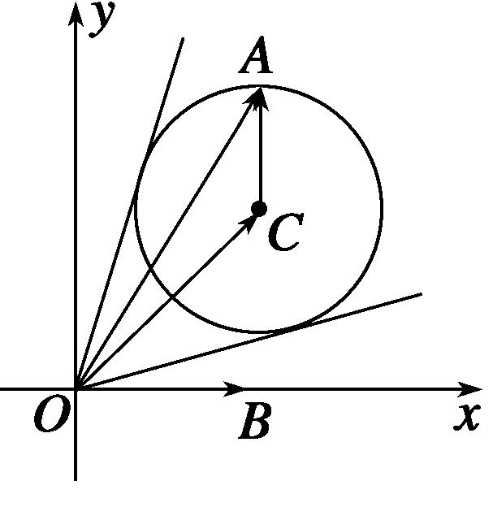
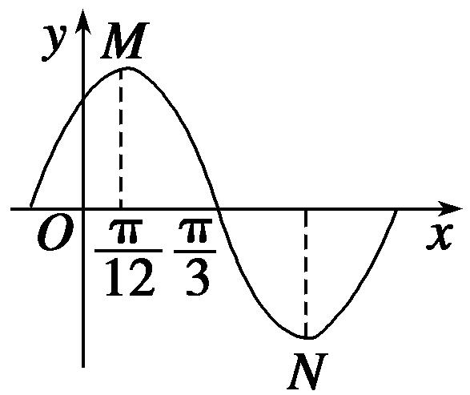
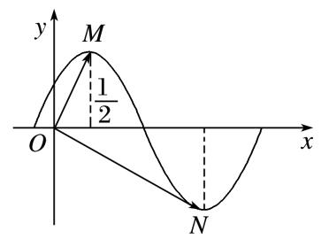
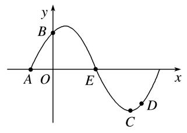
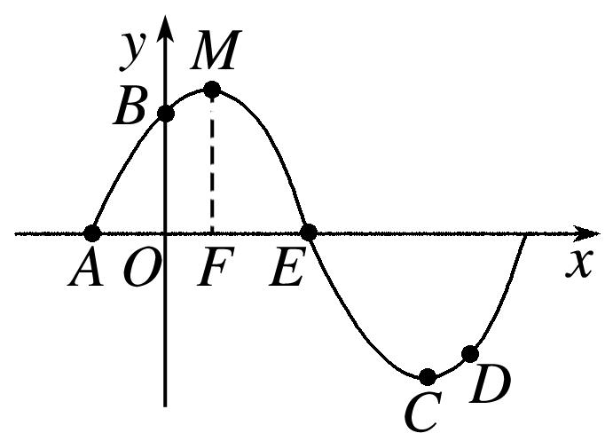
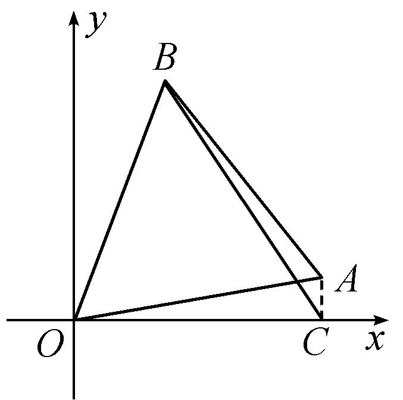

专题六　平面向量与三角函数

平面向量与三角函数综合问题的类型及求解思路  
（1）向量平行、垂直与三角函数综合

此类题型的解答一般是利用向量平行(共线)、垂直关系得到三角函数式，再利用三角恒等变换对三角函数式进行化简，结合三角函数的图象与性质进行求解．  
（2）向量的模与三角函数综合

此类题型主要是利用向量模的性质|<em><strong>a</strong></em>|2＝<em><strong>a</strong></em>2，如果涉及向量的坐标，解答时可利用两种方法：一是先进行向量的运算，再代入向量的坐标进行求解；二是先将向量的坐标代入，再利用向量的坐标运算求解．此类题型主要表现为两种形式：①利用三角函数与向量的数量积直接联系；②利用三角函数与向量的夹角交汇，达到与数量积的综合．

考点一　平面向量与三角函数选填题

【例题选讲】

<strong>[例1]</strong> （1）设向量<em><strong>a</strong></em>＝(2cos <em>θ</em>，sin <em>θ</em>)，向量<em><strong>b</strong></em>＝(1，－6)，且<em><strong>a</strong></em>·<em><strong>b</strong></em>＝0，则等于\_\_\_\_\_\_\_\_．
答案　　解析　因为<em><strong>a·b</strong></em>＝0，则2cos <em>θ</em>－6sin <em>θ</em>＝0，即tan <em>θ</em>＝，则＝＝＝．  
（2）在△*ABC*中，*BC*＝2，*A*＝，则·的最小值为\_\_\_\_\_\_\_\_．
答案　－　解析　由余弦定理得<em>BC</em>2＝<em>AB</em>2＋<em>AC</em>2－2<em>AB</em>·<em>AC</em>·cos≥2<em>AB</em>·<em>AC</em>＋<em>AB</em>·<em>AC</em>＝3<em>AB</em>·<em>AC</em>，所以<em>AB</em>·<em>AC</em>≤．所以·＝<em>AB</em>·<em>AC</em>·cos＝－<em>AB</em>·<em>AC</em>≥－，故(·)min＝－，当且仅当<em>AB</em>＝<em>AC</em>时等号成立．  
（3）已知向量<em><strong>a</strong></em>＝(cos，sin)，<em><strong>b</strong></em>＝(cos，－sin)，且<em>x</em>∈[－，]，则|<em><strong>a</strong></em>＋<em><strong>b</strong></em>|＝\_\_\_\_\_\_\_\_．
答案　2cos<em>x</em>　解析　∵<em><strong>a</strong></em>＋<em><strong>b</strong></em>＝(cos＋cos，sin－sin)，∴|<em><strong>a</strong></em>＋<em><strong>b</strong></em>|＝＝＝2|cos <em>x</em>|．∵ <em>x</em>∈[－，]，∴ cos <em>x</em>&gt;0，∴ |<em><strong>a</strong></em>＋<em><strong>b</strong></em>|＝2cos <em>x</em>．

  
（4）已知向量＝(2，0)，向量＝(2，2)，向量＝(cos*α*，sin*α*)，则向量与向量的夹角的取值范围是(　　)

A．　　　　　
B．　　　　　
C．　　　　　
D．
答案　D　解析　由题意，得：＝＋＝(2＋cos<em>α</em>，2＋sin<em>α</em>)，所以点<em>A</em>的轨迹是圆(<em>x</em>－2)2＋(<em>y</em>－2)2＝2，如图，当<em>A</em>位于使向量与圆相切时，向量与向量的夹角分别达到最大、最小值，故选D．

  
（5）在平面直角坐标系*xOy*中，点*P*(，1)，将向量绕点*O*按逆时针方向旋转后得到向量，则点*Q*的坐标是(　　)

A．(－，1)　　　　　　
B．(－1，)　　　　　　
C．(－，1)　　　　　　
D．(－1，)
答案　D　解析　由*P*(，1)，得*P*，∵将向量绕点*O*按逆时针方向旋转后得到向量，∴*Q*，又cos＝－sin ＝－，sin＝cos ＝，∴*Q*(－1，)．  
（6）已知<em>a</em>，<em>b</em>，<em>c</em>为△<em>ABC</em>的三个内角<em>A</em>，<em>B</em>，<em>C</em>的对边，向量<em><strong>m</strong></em>＝(，－1)，<em><strong>n</strong></em>＝(cos<em>A</em>，sin<em>A</em>)．若<em><strong>m</strong></em>⊥<em><strong>n</strong></em>，且<em>a</em>cos<em>B</em>＋<em>b</em>cos<em>A</em>＝<em>c</em>sin<em>C</em>，则角<em>A</em>，<em>B</em>的大小分别为(　　)

A．，　　　　　　　　
B．，　　　　　　　　
C．，　　　　　　　　
D．，
答案　C　解析　由<em><strong>m</strong></em>⊥<em><strong>n</strong></em>得<em><strong>m·n</strong></em>＝0，即cos<em>A</em>－sin<em>A</em>＝0，即2cos＝0，∵&lt;<em>A</em>＋&lt;，∴<em>A</em>＋＝，即<em>A</em>＝．又<em>a</em>cos<em>B</em>＋<em>b</em>cos<em>A</em>＝2<em>R</em>sin<em>A</em>cos<em>B</em>＋2<em>R</em>sin<em>B</em>cos<em>A</em>＝2<em>R</em>sin(<em>A</em>＋<em>B</em>)＝2<em>R</em>sin<em>C</em>＝<em>c</em>＝<em>c</em>sin<em>C</em>，∴sin <em>C</em>＝1，<em>C</em>＝，∴<em>B</em>＝π－－＝．

  
（7）若函数*y*＝*A*sin(*ωx*＋*φ*)(*A*>0，*ω*>0，|*φ*|<)在一个周期内的图象如图所示，*M*，*N*分别是这段图象的最高点和最低点，且·＝0(*O*为坐标原点)，则*A*等于(　　)

A．　　　　　　　　
B．π　　　　　　　　
C．π　　　　　　　　
D．π
答案　B　解析　由题意知<em>M</em>(，<em>A</em>)，<em>N</em>(π，－<em>A</em>)，又·＝×π－<em>A</em>2＝0，∴<em>A</em>＝π．

  
（8）设向量<em><strong>a</strong></em>＝(<em>a</em>1，<em>a</em>2)，<em><strong>b</strong></em>＝(<em>b</em>1，<em>b</em>2)，定义一种向量积<em><strong>ab</strong></em>＝(<em>a</em>1<em>b</em>1，<em>a</em>2<em>b</em>2)，已知向量<em><strong>m</strong></em>＝(2，)，<em><strong>n</strong></em>＝(，0)，点<em>P</em>(<em>x</em>，<em>y</em>)在<em>y</em>＝sin<em>x</em>的图象上运动，<em>Q</em>是函数<em>y</em>＝<em>f</em>(<em>x</em>)图象上的点，且满足＝<em><strong>m</strong></em>＋<em><strong>n</strong></em>(其中<em>O</em>为坐标原点)，则函数<em>y</em>＝<em>f</em>(<em>x</em>)的值域是\_\_\_\_\_\_\_\_．

答案　　解析　设<em>Q</em>(<em>c</em>，<em>d</em>)，由新的运算可得＝<em><strong>m</strong></em>＋<em><strong>n</strong></em>＝(2<em>x</em>，sin<em>x</em>)＋(，0)＝(2<em>x</em>＋，sin<em>x</em>)，由消去<em>x</em>得<em>d</em>＝sin(<em>c</em>－)，所以<em>y</em>＝<em>f</em>(<em>x</em>)＝sin(<em>x</em>－)，易知<em>y</em>＝<em>f</em>(<em>x</em>)的值域是．

【对点训练】

1．已知向量<em><strong>e</strong></em>1＝，<em><strong>e</strong></em>2＝，则<em><strong>e</strong></em>1·<em><strong>e</strong></em>2＝\_\_\_\_\_\_\_\_．

1．答案　2　解析　由向量数量积公式得<em><strong>e</strong></em>1·<em><strong>e</strong></em>2＝cos×2sin＋sin×4cos＝×＋×2＝2．

2．已知向量<em><strong>a</strong></em>＝(1－sin <em>θ</em>，1)，<em><strong>b</strong></em>＝，若<em><strong>a</strong></em>∥<em><strong>b</strong></em>，则锐角<em>θ</em>＝\_\_\_\_\_\_\_\_．

2．答案　45°　解析　由<em><strong>a</strong></em>∥<em><strong>b</strong></em>，得(1－sin <em>θ</em>)(1＋sin <em>θ</em>)＝，∴cos2<em>θ</em>＝，∴cos <em>θ</em>＝或cos <em>θ</em>＝－，又<em>θ</em>

为锐角，∴*θ*＝45°．

3．已知向量<em><strong>m</strong></em>＝(1，cos <em>θ</em>)，<em><strong>n</strong></em>＝(sin <em>θ</em>，－2)，且<em><strong>m</strong></em>⊥<em><strong>n</strong></em>，则sin 2<em>θ</em>＋6cos2<em>θ</em>的值为(　　)

A．　　　　　　　　
B．2　　　　　　　　
C．2　　　　　　　　
D．－2

3．答案　B　解析　由题意可得<em><strong>m·n</strong></em>＝sin <em>θ</em>－2cos <em>θ</em>＝0，则tan <em>θ</em>＝2，所以sin 2<em>θ</em>＋6cos2<em>θ</em>＝

＝＝2．故选B．

4．设向量<em><strong>a</strong></em>＝(cos <em>α</em>，－1)，<em><strong>b</strong></em>＝(2，sin <em>α</em>)，若<em><strong>a</strong></em>⊥<em><strong>b</strong></em>，则tan(<em>α</em>－)＝\_\_\_\_\_\_\_\_．

4．答案　　解析：由已知可得<em><strong>a</strong></em>·<em><strong>b</strong></em>＝2cos <em>α</em>－sin <em>α</em>＝0，∴ tan <em>α</em>＝2，tan(<em>α</em>－)＝＝．

5．在△*ABC*中，已知*AB*＝，*C*＝，则·的最大值为\_\_\_\_\_\_\_\_．

5．答案：　解析　因为*AB*＝，*C*＝，设角*A*，*B*，*C*所对的边分别为*a*，*b*，*c*，所以由余弦定理得3

＝<em>a</em>2＋<em>b</em>2－2<em>ab</em>cos＝<em>a</em>2＋<em>b</em>2－<em>ab</em>≥<em>ab</em>，当且仅当<em>a</em>＝<em>b</em>＝时等号成立．又·＝<em>ab</em>cos <em>C</em>＝<em>ab</em>，所以当<em>a</em>＝<em>b</em>＝时，(·)max＝．

6．设向量*a*＝(cos 10°，sin 10°)，*b*＝(cos 70°，sin 70°)，则|*a*－2*b*|＝\_\_\_\_\_\_\_\_．

6．答案　　解析　|*a*－2*b*|＝|(cos10°－2cos70°，sin10°－2sin70°)|＝

＝．

7．将＝(1，1)绕原点*O*逆时针方向旋转60°得到，则＝\_\_\_\_\_\_\_\_．

7．答案　(，)　解析　由题意可得的横坐标*x*＝cos(60°＋45°)＝×(－)＝，

纵坐标*y*＝·sin(60°＋45°)＝×(＋)＝，则＝(，)．

8．已知向量<em><strong>a</strong></em>＝(cos <em>θ</em>，sin <em>θ</em>)，<em><strong>b</strong></em>＝(，－1)，则<em><strong>|2a</strong></em>－<em><strong>b|</strong></em>的最大值为\_\_\_\_\_\_\_\_．

8．答案　4　解析　设<em>a</em>与<em>b</em>夹角为<em>α</em>，因为|2<em><strong>a</strong></em>－<em><strong>b</strong></em>|2＝4<em><strong>a</strong></em>2－4<em><strong>a·b</strong></em>＋<em><strong>b</strong></em>2＝8－4|<em><strong>a||b</strong></em>|cos <em>α</em>＝8－8cos <em>α</em>，因为<em>α</em>

∈[0，π]，所以cos <em>α</em>∈[－1，1]，所以8－8cos <em>α</em>∈[0，16]，即|2<em><strong>a</strong></em>－<em><strong>b</strong></em>|2∈[0，16]，所以|2<em><strong>a</strong></em>－<em><strong>b</strong></em>|∈[0，4]．所以|2<em><strong>a</strong></em>－<em><strong>b</strong></em>|的最大值为4．

9．已知*A*，*B*，*C*三点的坐标分别为*A*(3，0)，*B*(0，3)，*C*(cos *α*，sin *α*)，其中*α*∈(，)．若||＝||，
则角*α*＝\_\_\_\_\_\_\_\_．

9．答案　　解析　∵ ＝(cos *α*－3，sin *α*)，＝(cos *α*，sin *α*－3)，∴ ||＝

＝，||＝．由||＝||得sin *α*＝cos *α*．又*α*∈(，)，∴ *α*＝．

10．在△<em>ABC</em>中，角<em>A</em>，<em>B</em>，<em>C</em>的对边分别是<em>a</em>，<em>b</em>，<em>c</em>，若20<em>a</em>＋15<em>b</em>＋12<em>c</em>＝<strong>0</strong>，则△<em>ABC</em>最小角的

正弦值等于(　　)

A．　　　　　　　　
B．　　　　　　　　
C．　　　　　　　　
D．

10．答案　C　解析　∵20<em>a</em>＋15<em>b</em>＋12<em>c</em>＝<strong>0</strong>，∴20<em>a</em>(－)＋15<em>b</em>＋12<em>c</em>＝<strong>0</strong>，∴(20<em>a</em>－15<em>b</em>)

＋(12<em>c</em>－20<em>a</em>)＝<strong>0</strong>，∵与不共线，∴解得∴△<em>ABC</em>最小角为角<em>A</em>，∴cos <em>A</em>＝＝＝，∴sin <em>A</em>＝，故选C．

11．已知在△<em>ABC</em>中，＝<em><strong>a</strong></em>，＝<em><strong>b</strong></em>，<em><strong>a·b</strong></em>&lt;0，<em>S</em>△<em>ABC</em>＝，|<em><strong>a</strong></em>|＝3，|<em><strong>b</strong></em>|＝5，则∠<em>BAC</em>＝\_\_\_\_\_\_\_\_．

11．答案　150°　解析　∵·&lt;0，∴∠<em>BAC</em>为钝角，又<em>S</em>△<em>ABC</em>＝|<em><strong>a||b</strong></em>|sin∠<em>BAC</em>＝．∴sin∠<em>BAC</em>＝，
∴∠*BAC*＝150°．

12．△<em>ABC</em>的三个内角<em>A</em>，<em>B</em>，<em>C</em>所对的边长分别是<em>a</em>，<em>b</em>，<em>c</em>，设向量<em><strong>m</strong></em>＝(<em>a</em>＋<em>b</em>，sin<em>C</em>)，<em><strong>n</strong></em>＝(<em>a</em>＋<em>c</em>，sin<em>B</em>

－sin<em>A</em>)，若<em><strong>m</strong></em>∥<em><strong>n</strong></em>，则角<em>B</em>的大小为\_\_\_\_\_\_\_\_．

12．答案　　解析　∵<em><strong>m</strong></em>∥<em><strong>n</strong></em>，∴(<em>a</em>＋<em>b</em>)(sin <em>B</em>－sin <em>A</em>)－sin <em>C</em>(<em>a</em>＋<em>c</em>)＝0，又∵＝＝，则化

简得<em>a</em>2＋<em>c</em>2－<em>b</em>2＝－<em>ac</em>，∴cos<em>B</em>＝＝－，∵0&lt;<em>B</em>&lt;π，∴<em>B</em>＝．

13．在△*ABC*中，若·＋2·＝·，则的值为(　　)

A．　　　　　　　　
B．　　　　　　　　
C．　　　　　　　　
D．

13．答案　A　解析　设△*ABC*的内角*A*，*B*，*C*所对的边分别为*a*，*b*，*c*，由·＋2·＝·，
得*ac*×＋2*bc*×＝*ab*×，化简可得*a*＝*c*．由正弦定理得＝＝．

14．函数*y*＝sin(*ωx*＋*φ*)在一个周期内的图象如图所示，*M*，*N*分别是最高点、最低点，*O*为坐标原点，且

·＝0，则函数*f*(*x*)的最小正周期是\_\_\_\_\_\_．

14．答案　3　解析　由图象可知，<em>M</em>，<em>N</em>，所以·＝·(<em>xN</em>，－1)＝<em>xN</em>－1＝0，
解得<em>xN</em>＝2，所以函数<em>f</em>(<em>x</em>)的最小正周期是2×＝3．

15．已知*A*，*B*，*C*，*D*是函数*y*＝sin(*ωx*＋*φ*)一个周期内的图象上的四个点，如图所示，

*A*，*B*为*y*轴上的点，*C*为图象上的最低点，*E*为该函数图象的一个对称中心，*B*与*D*关于点*E*对称，由在*x*轴上的投影为，则*ω*，*φ*的值为(　　)

A．*ω*＝2，*φ*＝　　　　
B．*ω*＝2，*φ*＝　　　　
C．*ω*＝，*φ*＝　　　　
D．*ω*＝，*φ*＝

15．答案　A　解析　由*E*为该函数图象的一个对称中心，作点*C*的对称点*M*，作*MF*⊥*x*轴，垂足为*F*，
如图．*B*与*D*关于点*E*对称，由在*x*轴上的投影为，知*OF*＝，又*A*，所以*AF*＝＝＝，所以*ω*＝2.同时函数*y*＝sin(*ωx*＋*φ*)图象可以看作是由*y*＝sin *ωx*的图象向左平移得到，故可知＝＝，即*φ*＝．

16．若直线*ax*－*y*＝0(*a*≠0)与函数*f*(*x*)＝的图象交于不同的两点*A*，*B*，且点*C*(6，0)，若点*D*(*m*，

*n*)满足＋＝，则*m*＋*n*等于(　　)

A．1　　　　　　　　
B．2　　　　　　　　
C．3　　　　　　　　
D．4

16．答案　B　解析　因为*f*(－*x*)＝＝＝－*f*(*x*)，且直线*ax*－*y*＝0过坐标原点，所以

直线与函数<em>f</em>(<em>x</em>)＝的图象的两个交点<em>A</em>，<em>B</em>关于原点对称，即<em>xA</em>＋<em>xB</em>＝0，<em>yA</em>＋<em>yB</em>＝0，又＝(<em>xA</em>－<em>m</em>，<em>yA</em>－<em>n</em>)，＝(<em>xB</em>－<em>m</em>，<em>yB</em>－<em>n</em>)，＝(<em>m</em>－6，<em>n</em>)，由＋＝，得<em>xA</em>－<em>m</em>＋<em>xB</em>－<em>m</em>＝<em>m</em>－6，<em>yA</em>－<em>n</em>＋<em>yB</em>－<em>n</em>＝<em>n</em>，解得<em>m</em>＝2，<em>n</em>＝0，所以<em>m</em>＋<em>n</em>＝2，故选B．

考点二　平面向量与三角函数解答题

【例题选讲】

<strong>[例1]</strong>在平面直角坐标系<em>xOy</em>中，已知向量<em><strong>m</strong></em>＝，<em><strong>n</strong></em>＝(sin<em>x</em>，cos<em>x</em>)，<em>x</em>∈．  
（1）若<em><strong>m</strong></em>⊥<em><strong>n</strong></em>，求tan <em>x</em>的值；  
（2）若<em><strong>m</strong></em>与<em><strong>n</strong></em>的夹角为，求<em>x</em>的值．
解析　（1）因为<em><strong>m</strong></em>＝，<em><strong>n</strong></em>＝(sin <em>x</em>，cos <em>x</em>)，<em><strong>m</strong></em>⊥<em><strong>n</strong></em>．
所以<em><strong>m</strong></em>·<em><strong>n</strong></em>＝0，即sin <em>x</em>－cos <em>x</em>＝0，所以sin <em>x</em>＝cos <em>x</em>，所以tan <em>x</em>＝1．  
（2）因为|<em><strong>m</strong></em>|＝|<em><strong>n</strong></em>|＝1，所以<em><strong>m</strong></em>·<em><strong>n</strong></em>＝cos＝，即sin <em>x</em>－cos <em>x</em>＝，所以sin＝，
因为0<*x*<，所以－<*x*－<，所以*x*－＝，即*x*＝．

<strong>[例2]</strong>在平面直角坐标系中，设向量<em><strong>m</strong></em>＝(cos<em>A</em>，sin<em>A</em>)，<em><strong>n</strong></em>＝(cos<em>B</em>，－sin<em>B</em>)，其中<em>A</em>，<em>B</em>为△<em>ABC</em>的两个内角．  
（1）若<em><strong>m</strong></em>⊥<em><strong>n</strong></em>，求证：<em>C</em>为直角；  
（2）若<em><strong>m</strong></em>∥<em><strong>n</strong></em>，求证：<em>B</em>为锐角．
证明：（1） 易得<em><strong>m·n</strong></em>＝(cos <em>A</em>cos <em>B</em>－sin <em>A</em>sin <em>B</em>)＝cos(<em>A</em>＋<em>B</em>)．
因为<em><strong>m</strong></em>⊥<em><strong>n</strong></em>，所以<em><strong>m·n</strong></em>＝0，即cos(<em>A</em>＋<em>B</em>)＝cos．
因为0<*A*＋*B*<π，且函数*y*＝cos *x*在(0，π)内是单调减函数，
所以*A*＋*B*＝，即*C*为直角．  
（2）因为<em><strong>m</strong></em>∥<em><strong>n</strong></em>，所以cos <em>A</em>·(－sin <em>B</em>)－sin <em>A</em>cos <em>B</em>＝0，即sin <em>A</em>cos <em>B</em>＋3cos <em>A</em>sin <em>B</em>＝0．
因为*A*，*B*是三角形内角，所以cos *A*cos *B*≠0，
于是tan *A*＝－3tan *B*，因而*A*，*B*中恰有一个是钝角，所以<*A*＋*B*<π，
从而tan(*A*＋*B*)＝＝＝<0，所以tan *B*>0，即证*B*为锐角．

注：（2） 解得tan *A*＝－3tan *B*后，得tan *A*与tan *B*异号，
若tan *B*<0，则tan *C*＝－tan(*A*＋*B*)＝－＝－＝<0，
于是，在△*ABC*中，有两个钝角*B*和*C*，这与三角形内角和定理矛盾，不可能．
于是必有tan *B*>0，即证*B*为锐角．

<strong>[例3]</strong> (2014·山东)已知向量<em><strong>a</strong></em>＝(<em>m</em>，cos2<em>x</em>)，<em><strong>b</strong></em>＝(sin2<em>x</em>，<em>n</em>)，函数<em>f</em>(<em>x</em>)＝<em><strong>a</strong></em>·<em><strong>b</strong></em>，且<em>y</em>＝<em>f</em>(<em>x</em>)的图象过点(，)和点(，－2)．  
（1）求*m*，*n*的值；  
（2）将*y*＝*f*(*x*)的图象向左平移*φ*(0<*φ*<π)个单位后得到函数*y*＝*g*(*x*)的图象，若*y*＝*g*(*x*)图象上各最高点到点(0，3)的距离的最小值为1，求*y*＝*g*(*x*)的单调递增区间．
解析　（1）由题意知<em>f</em>(<em>x</em>)＝<em><strong>a</strong></em>·<em><strong>b</strong></em>＝<em>m</em>sin2<em>x</em>＋<em>n</em>cos2<em>x</em>．因为<em>y</em>＝<em>f</em>(<em>x</em>)的图象过点(，)和(，－2)，
所以即解得  
（2）由（1）知*f*(*x*)＝sin2*x*＋cos2*x*＝2sin(2*x*＋)．由题意知*g*(*x*)＝*f*(*x*＋*φ*)＝2sin(2*x*＋2*φ*＋)．
设<em>y</em>＝<em>g</em>(<em>x</em>)的图象上符合题意的最高点为(<em>x</em>0，2)，由题意知<em>x</em>＋1＝1，所以<em>x</em>0＝0，
即到点(0，3)的距离为1的最高点为(0，2)．将其代入*y*＝*g*(*x*)得sin(2*φ*＋)＝1，
因为0<*φ*<π，所以*φ*＝，因此*g*(*x*)＝2sin(2*x*＋)＝2cos2*x*．
由2<em>k</em>π－π≤2<em>x</em>≤2<em>k</em>π，<em>k</em>∈<strong>Z</strong>得，<em>k</em>π－≤<em>x</em>≤<em>k</em>π，<em>k</em>∈<strong>Z</strong>，
所以函数<em>y</em>＝<em>g</em>(<em>x</em>)的单调递增区间为[<em>k</em>π－，<em>k</em>π]，<em>k</em>∈<strong>Z</strong>．

<strong>[例4]</strong> (2017·江苏)已知向量<em><strong>a</strong></em>＝(cos <em>x</em>，sin <em>x</em>)，<em><strong>b</strong></em>＝(3，－)，<em>x</em>∈[0，π]．  
（1）若<em><strong>a</strong></em>∥<em><strong>b</strong></em>，求<em>x</em>的值；  
（2）记<em>f</em>(<em>x</em>)＝<em><strong>a</strong></em>·<em><strong>b</strong></em>，求<em>f</em>(<em>x</em>)的最大值和最小值以及对应的<em>x</em>的值．
解析　（1）因为<em><strong>a</strong></em>＝(cos <em>x</em>，sin <em>x</em>)，<em><strong>b</strong></em>＝(3，－)，<em><strong>a</strong></em>∥<em><strong>b</strong></em>，所以－cos <em>x</em>＝3sin <em>x</em>．
若cos <em>x</em>＝0，则sin <em>x</em>＝0，与sin2<em>x</em>＋cos2<em>x</em>＝1矛盾，
故cos *x*≠0．于是tan *x*＝－．又*x*∈[0，π]，所以*x*＝．  
（2）<em>f</em>(<em>x</em>)＝<em><strong>a·b</strong></em>＝(cos <em>x</em>，sin <em>x</em>)·(3，－)＝3cos <em>x</em>－sin <em>x</em>＝2cos．
因为*x*∈[0，π]，所以*x*＋∈，从而－1≤cos≤，
于是，当*x*＋＝，即*x*＝0时，*f*(*x*)取得最大值3；当*x*＋＝π，即*x*＝时，*f*(*x*)取得最小值－2．

<strong>[例5]</strong>在△<em>ABC</em>中，角<em>A</em>，<em>B</em>，<em>C</em>的对边分别为<em>a</em>，<em>b</em>，<em>c</em>，向量<em><strong>m</strong></em>＝(cos(<em>A</em>－<em>B</em>)，sin(<em>A</em>－<em>B</em>))，<em><strong>n</strong></em>＝(cos <em>B</em>，－sin <em>B</em>)，且<em><strong>m</strong></em>·<em><strong>n</strong></em>＝－．  
（1）求sin *A*的值；  
（2）若*a*＝4，*b*＝5，求角*B*的大小及向量在方向上的投影向量．
解析　（1） 由<em><strong>m</strong></em>·<em><strong>n</strong></em>＝－，得cos(<em>A</em>－<em>B</em>)cos <em>B</em>－sin(<em>A</em>－<em>B</em>)sin <em>B</em>＝－，所以cos <em>A</em>＝－．因为0&lt;<em>A</em>&lt;π，
所以sin *A*＝＝＝．  
（2）由正弦定理，得＝，则sin *B*＝＝＝，
因为<em>a</em>&gt;<em>b</em>，所以<em>A</em>&gt;<em>B</em>，且<em>B</em>是△<em>ABC</em>一内角，则<em>B</em>＝．由余弦定理得（4）2＝52＋<em>c</em>2－2×5<em>c</em>×，
解得*c*＝1，*c*＝－7舍去，故向量在方向上的投影向量为||cos *B*＝*c*cos *B*＝1××＝．

<strong>[例6]</strong>已知在△<em>ABC</em>中，角<em>A</em>，<em>B</em>，<em>C</em>的对边分别为<em>a</em>，<em>b</em>，<em>c</em>，向量<em><strong>m</strong></em>＝(sin<em>A</em>，sin<em>B</em>)，<em><strong>n</strong></em>＝(cos<em>B</em>，cos<em>A</em>)，<em><strong>m·n</strong></em>＝sin2<em>C</em>．  
（1） 角*C*的度数；  
（2） sin*A*，sin*C*，sin*B*成等差数列，且·(－)＝18，求边*c*的长．
解析　（1） <em><strong>m·n</strong></em>＝sin<em>A</em>·cos<em>B</em>＋sin<em>B</em>·cos<em>A</em>＝sin (<em>A</em>＋<em>B</em>)，对于△<em>ABC</em>，<em>A</em>＋<em>B</em>＝π－<em>C</em>，0&lt;<em>C</em>&lt;π，
∴sin (<em>A</em>＋<em>B</em>)＝sin<em>C</em>，∴ <em><strong>m·n</strong></em>＝sin<em>C</em>．
又<em><strong>m·n</strong></em>＝sin2<em>C</em>，∴ sin2<em>C</em>＝sin<em>C</em>，∴ cos<em>C</em>＝，∴<em>C</em>＝．  
（2）由sin*A*，sin*C*，sin*B*成等差数列，可得2sin*C*＝sin*A*＋sin*B*．
由正弦定理得2*c*＝*a*＋*b*．∵ ·(－)＝18，
∴·＝18，即*ab*cos*C*＝18，*ab*＝36．
由余弦定理得<em>c</em>2＝<em>a</em>2＋<em>b</em>2－2<em>ab</em>cos<em>C</em>＝(<em>a</em>＋<em>b</em>)2－3<em>ab</em>，
∴<em>c</em>2＝4<em>c</em>2－3×36，<em>c</em>2＝36，∴<em>c</em>＝6．

<strong>[例7]</strong>在△<em>ABC</em>中，设内角<em>A</em>，<em>B</em>，<em>C</em>的对边分别为<em>a</em>，<em>b</em>，<em>c</em>，向量<em><strong>m</strong></em>＝(cos<em>A</em>，sin<em>A</em>)，向量<em><strong>n</strong></em>＝(－sin<em>A</em>，cos<em>A</em>)，若|<em><strong>m</strong></em>＋<em><strong>n</strong></em>|＝2．  
（1）求内角*A*的大小；  
（2）若*b*＝4，且*c*＝*a*，求△*ABC*的面积．
解析　（1）|<em><strong>m</strong></em>＋<em><strong>n</strong></em>|2＝(cos<em>A</em>＋－sin<em>A</em>)2＋(sin<em>A</em>＋cos<em>A</em>)2＝4＋2(cos<em>A</em>－sin<em>A</em>)＝4＋4cos(＋<em>A</em>)．
∵4＋4cos(＋*A*)＝4，∴cos(＋*A*)＝0．∵*A*∈(0，π)，∴＋*A*＝，*A*＝．  
（2）由余弦定理知：<em>a</em>2＝<em>b</em>2＋<em>c</em>2－2<em>bc</em>cos<em>A</em>，即<em>a</em>2＝（4）2＋(<em>a</em>)2－2×4×<em>a</em>cos，
解得<em>a</em>＝4，∴<em>c</em>＝8．∴<em>S</em>△<em>ABC</em>＝×4×8×＝16．

<strong>[例8]</strong> （1） △<em>ABC</em>面积<em>S</em>的最大值；  
（2） ·的取值范围．
解析　设||，||，||依次为<em>a</em>，<em>b</em>，<em>c</em>，则<em>a</em>＋<em>b</em>＋<em>c</em>＝6，<em>b</em>2＝<em>ac</em>．
在△*ABC*中，cos *B*＝＝≥＝，故有0＜*B*≤．
又*b*＝≤＝，从而0＜*b*≤2．  
（1） <em>S</em>＝<em>ac</em>sin <em>B</em>＝<em>b</em>2sin <em>B</em>≤×22·sin＝，当且仅当<em>a</em>＝<em>c</em>，且<em>B</em>＝，
即△<em>ABC</em>为等边三角形时面积最大，即<em>S</em>max＝．  
（2） ·＝<em>ac</em>cos <em>B</em>＝＝＝＝－(<em>b</em>＋3)2＋27．
∵ <em>a</em>，<em>b</em>，<em>c</em>为△<em>ABC</em>的边，∴ <em>a</em>－<em>c</em>＜<em>b</em>，即(<em>a</em>－<em>c</em>)2＜<em>b</em>2．∵ <em>a</em>＋<em>b</em>＋<em>c</em>＝6，<em>b</em>2＝<em>ac</em>，∴ <em>b</em>2＞(<em>a</em>＋<em>c</em>)2－4<em>ac</em>，
∴ <em>b</em>2＞(6－<em>b</em>)2－4<em>b</em>2，<em>b</em>2＋3<em>b</em>－9＞0，∴ <em>b</em>＞．又0＜<em>b</em>≤2，∴＜<em>b</em>≤2，
∴ ＜(<em>b</em>＋3)2≤25，∴ 2≤－(<em>b</em>＋3)2＋27＜，∴ 2≤·＜，
即·的取值范围是．

【对点训练】

1．已知向量<em><strong>a</strong></em>＝(cos<em>α</em>，sin<em>α</em>)，<em><strong>b</strong></em>＝(cos<em>β</em>，sin<em>β</em>)，<em><strong>c</strong></em>＝(－1，0)．  
（1）求向量*b*＋*c*的模的最大值；  
（2）设<em>α</em>＝，且<em><strong>a</strong></em>⊥(<em><strong>b</strong></em>＋<em><strong>c</strong></em>)，求cos<em>β</em>的值．

1．解析　（1）<em><strong>b</strong></em>＋<em><strong>c</strong></em>＝(cos <em>β</em>－1，sin <em>β</em>)，则|<em><strong>b</strong></em>＋<em><strong>c</strong></em>|2＝(cos <em>β</em>－1)2＋sin2<em>β</em>＝2(1－cos <em>β</em>)．
因为－1≤cos <em>β</em>≤1，所以0≤|<em><strong>b</strong></em>＋<em><strong>c</strong></em>|2≤4，即0≤|<em><strong>b</strong></em>＋<em><strong>c</strong></em>|≤2．当cos <em>β</em>＝－1时，有|<em><strong>b</strong></em>＋<em><strong>c</strong></em>|＝2，
所以向量*b*＋*c*的模的最大值为2．  
（2）若<em>α</em>＝，则<em><strong>a</strong></em>＝．又由<em><strong>b</strong></em>＝(cos <em>β</em>，sin <em>β</em>)，<em><strong>c</strong></em>＝(－1，0)
得<em><strong>a</strong></em>·(<em><strong>b</strong></em>＋<em><strong>c</strong></em>)＝·(cos <em>β</em>－1，sin <em>β</em>)＝cos <em>β</em>＋sin <em>β</em>－．
因为<em><strong>a</strong></em>⊥(<em><strong>b</strong></em>＋<em><strong>c</strong></em>)，所以<em><strong>a</strong></em>·(<em><strong>b</strong></em>＋<em><strong>c</strong></em>)＝0，即cos <em>β</em>＋sin <em>β</em>＝1，所以sin <em>β</em>＝1－cos <em>β</em>，

平方后化简得cos *β*(cos *β*－1)＝0，解得cos *β*＝0或cos *β*＝1．经检验cos *β*＝0或cos *β*＝1即为所求．

2．已知*A*，*B*，*C*三点的坐标分别为*A*(3，0)，*B*(0，3)，*C*(cos*α*，sin*α*)，其中*α*∈(，)．

  
（1）若||＝||，求角*α*的值．

  
（2）若·＝－1，求tan(*α*＋)的值．

2．解析　（1）∵＝(cos*α*－3，sin*α*)，＝(cos*α*，sin*α*－3)，∴||＝＝，

||＝．由||＝||得sin*α*＝cos*α*，又*α*∈(，)，∴*α*＝π．  
（2）由·＝－1，得(cos*α*－3)cos*α*＋sin*α*(sin*α*－3)＝－1，∴sin*α*＋cos*α*＝，∴sin(*α*＋)＝>0．
由于<*α*<，∴<*α*＋<π，∴cos(*α*＋)＝－．故tan(*α*＋)＝－．

3．已知向量<em><strong>m</strong></em>＝(cos<em>α</em>，－1)，<em><strong>n</strong></em>＝(2，sin<em>α</em>)，其中<em>α</em>∈(0，)，且<em><strong>m</strong></em>⊥<em><strong>n</strong></em>．  
（1）求cos2*α*的值；  
（2）若sin(*α*－*β*)＝，且*β*∈(0，)，求角*β*的大小．

3．解析　（1）由<em><strong>m</strong></em>⊥<em><strong>n</strong></em>，得2cos <em>α</em>－sin <em>α</em>＝0，所以sin <em>α</em>＝2cos <em>α</em>，代入cos2<em>α</em>＋sin2<em>α</em>＝1，
得5cos2<em>α</em>＝1，且<em>α</em>∈(0，)，则cos <em>α</em>＝，sin <em>α</em>＝，
则cos 2<em>α</em>＝2cos2<em>α</em>－1＝2×()2－1＝－．  
（2） 由*α*∈(0，)，*β*∈(0，)，得*α*－*β*∈(－，)．因为sin(*α*－*β*)＝，所以cos(*α*－*β*)＝．
则sin *β*＝sin[*α*－(*α*－*β*)]＝sin *α*cos(*α*－*β*)－cos *α*sin(*α*－*β*)＝×－×＝．
因为*β*∈(0，)，则*β*＝．

4．已知向量<em><strong>a</strong></em>＝(cos<em>α</em>，sin<em>α</em>)，<em><strong>b</strong></em>＝(cos<em>β</em>，sin<em>β</em>)，0&lt;<em>α</em>&lt;<em>β</em>&lt;π．  
（1）若|*a*－*b*|＝，求证*a*⊥*b*；  
（2）设<em><strong>c</strong></em>＝(0，1)，若<em><strong>a</strong></em>＋<em><strong>b</strong></em>＝<em><strong>c</strong></em>，求<em>α</em>，<em>β</em>的值．

4．解析　（1）证明：∵|<em><strong>a</strong></em>－<em><strong>b</strong></em>|＝，∴(<em><strong>a</strong></em>－<em><strong>b</strong></em>)2＝2，即<em><strong>a</strong></em>2－2<em><strong>a</strong></em>·<em><strong>b</strong></em>＋<em><strong>b</strong></em>2＝2，
∵<em><strong>a</strong></em>2＝cos2<em>α</em>＋sin2<em>α</em>＝1，<em><strong>b</strong></em>2＝cos2<em>β</em>＋sin2<em>β</em>＝1，∴<em><strong>a</strong></em>·<em><strong>b</strong></em>＝0，∴<em><strong>a</strong></em>⊥<em><strong>b．</strong></em>  
（2）∵<em><strong>a</strong></em>＋<em><strong>b</strong></em>＝(cos <em>α</em>＋cos <em>β</em>，sin <em>α</em>＋sin <em>β</em>)＝(0，1)．∴

①2＋②2得cos(<em>β</em>－<em>α</em>)＝－．∵0&lt;<em>α</em>&lt;<em>β</em>&lt;π，∴0&lt;<em>β</em>－<em>α</em>&lt;π，∴<em>β</em>－<em>α</em>＝，即<em>β</em>＝<em>α</em>＋，
代入②得sin *α*＋sin＝1，整理得sin *α*＋cos *α*＝1，即sin＝1．
∵0<*α*<π，∴<*α*＋<，∴*α*＋＝，∴*α*＝，*β*＝*α*＋＝．

5．已知在锐角△<em>ABC</em>中，两向量<em><strong>p</strong></em>＝(2－2sin<em>A</em>，cos<em>A</em>＋sin<em>A</em>)，<em><strong>q</strong></em>＝(sin<em>A</em>－cos<em>A</em>，1＋sin<em>A</em>)，且<em><strong>p</strong></em>与<em><strong>q</strong></em>是共

线向量．  
（1）求*A*的大小；  
（2）求函数<em>y</em>＝2sin2<em>B</em>＋cos取最大值时，<em>B</em>的大小．

5．解析　（1）∵<em><strong>p</strong></em>∥<em><strong>q</strong></em>，∴(2－2sin<em>A</em>)(1＋sin<em>A</em>)－(cos<em>A</em>＋sin<em>A</em>)(sin<em>A</em>－cos<em>A</em>)＝0，
∴sin2<em>A</em>＝，sin<em>A</em>＝，∵△<em>ABC</em>为锐角三角形，∴<em>A</em>＝60°．  
（2）<em>y</em>＝2sin2<em>B</em>＋cos＝2sin2<em>B</em>＋cos＝2sin2<em>B</em>＋cos(2<em>B</em>－60°)

＝1－cos2*B*＋cos(2*B*－60°)＝1－cos2*B*＋cos2*B*cos60°＋sin2*B*sin60°＝1－cos2*B*＋sin2*B*

＝1＋sin(2*B*－30°)，当2*B*－30°＝90°，即*B*＝60°时，函数取最大值2．

6．已知向量<em><strong>a</strong></em>＝(1－tan<em>x</em>，1)，<em><strong>b</strong></em>＝(1＋sin2<em>x</em>＋cos2<em>x</em>，0)．记函数<em>f</em>(<em>x</em>)＝<em><strong>a</strong></em>·<em><strong>b</strong></em>．  
（1）求函数*f*(*x*)的解析式，并指出它的定义域；  
（2）若*f*(*α*＋)＝，*α*∈(0，)，求*f*(*α*)．

6．解析　（1） <em>f</em>(<em>x</em>)＝<em><strong>a</strong></em>·<em><strong>b</strong></em>＝(1－tan <em>x</em>)(1＋sin2<em>x</em>＋cos2<em>x</em>)

＝·(2cos2<em>x</em>＋2sin<em>x</em>cos<em>x</em>)＝2(cos2<em>x</em>－sin2<em>x</em>)＝2cos2<em>x</em>，
∴定义域为．  
（2）∵*f*(*α*＋)＝2cos (2*α*＋)＝，∴ cos (2*α*＋)＝＞0，且2*α*＋∈(，)，∴sin (2*α*＋)＝．
∴*f*(*α*)＝2cos2*α*＝2cos [(2*α*＋)－]＝2cos (2*α*＋)cos＋2sin (2*α*＋)sin ＝．

7．已知向量<em><strong>a</strong></em>＝(2sin(<em>ωx</em>＋)，0)，<em><strong>b</strong></em>＝(2cos <em>ωx</em>，3)(<em>ω</em>&gt;0)，函数<em>f</em>(<em>x</em>)＝<em><strong>a</strong></em>·<em><strong>b</strong></em>的图象与直线<em>y</em>＝－2＋相邻

两个交点之间的距离为π．  
（1）求*ω*的值；  
（2）求函数*f*(*x*)在[0，2π]上的单调增区间．

7．解析　（1） 因为向量<em><strong>a</strong></em>＝(2sin(<em>ωx</em>＋)，0)，<em><strong>b</strong></em>＝(2cos <em>ωx</em>，3)(<em>ω</em>&gt;0)，
所以函数<em>f</em>(<em>x</em>)＝<em><strong>a</strong></em>·<em><strong>b</strong></em>＝4sin(<em>ωx</em>＋)cos <em>ωx</em>＝4[(－)·sin <em>ωx</em>＋·cos <em>ωx</em>]cos <em>ωx</em>

＝2·cos2<em>ωx</em>－2sin <em>ωx</em>cos <em>ωx</em>＝(1＋cos 2<em>ωx</em>)－sin 2<em>ωx</em>＝2cos(2<em>ωx</em>＋)＋．
由题意可知*f*(*x*)的最小正周期为*T*＝π，所以＝π，即*ω*＝1．  
（2） 由（1）知*f*(*x*)＝2cos(2*x*＋)＋，当*x*∈[0，2π]时，2*x*＋∈[，4π＋]，
故2*x*＋∈[π，2π]或2*x*＋∈[3π，4π]时，函数*f*(*x*)单调递增，
所以函数*f*(*x*)的单调增区间为[，]和[，]．

8．已知向量<em><strong>m</strong></em>＝(2sin(<em>ωx</em>＋)，1)，<em><strong>n</strong></em>＝(2cos<em>ωx</em>，－)(<em>ω</em>&gt;0)，函数<em>f</em>(<em>x</em>)＝<em><strong>m</strong></em>·<em><strong>n</strong></em>的两条相邻对称轴间的距

离为．  
（1）求函数*f*(*x*)的单调递增区间；  
（2）当*x*∈[－，]时，求*f*(*x*)的值域．

8．解析　（1）<em>f</em>(<em>x</em>)＝<em><strong>m</strong></em>·<em><strong>n</strong></em>＝4sin(<em>ωx</em>＋)cos<em>ωx</em>－＝2sin<em>ωx</em>cos<em>ωx</em>＋2cos2<em>ωx</em>－

＝sin2*ωx*＋cos2*ωx*＝2sin(2*ωx*＋)．因为*T*＝＝π，所以*ω*＝1．所以*f*(*x*)＝2sin(2*x*＋)．
由2<em>k</em>π－≤2<em>x</em>＋≤2<em>k</em>π＋(<em>k</em>∈<strong>Z</strong>)得<em>k</em>π－≤<em>x</em>≤<em>k</em>π＋(<em>k</em>∈<strong>Z</strong>)．
所以函数<em>f</em>(<em>x</em>)的单调递增区间是[<em>k</em>π－，<em>k</em>π＋](<em>k</em>∈<strong>Z</strong>)．  
（2）因为*x*∈[－，]，所以2*x*＋∈[－，]．所以sin(2*x*＋)∈[－1，1]．
所以*f*(*x*)∈[－2，2]，即*f*(*x*)的值域是[－2，2]．

9．已知<em><strong>a</strong></em>＝(cos <em>x</em>，2cos <em>x</em>)，<em><strong>b</strong></em>＝(2cos <em>x</em>，sin <em>x</em>)，<em>f</em>(<em>x</em>)＝<em><strong>a</strong></em>·<em><strong>b</strong></em>．  
（1）把*f*(*x*)的图象向右平移个单位长度得到函数*g*(*x*)的图象，求函数*g*(*x*)的单调递增区间；  
（2）当<em><strong>a</strong></em>≠<strong>0</strong>，<em><strong>a</strong></em>与<em><strong>b</strong></em>共线时，求<em>f</em>(<em>x</em>)的值．

9．解析　（1） ∵ <em>f</em>(<em>x</em>)＝<em><strong>a</strong></em>·<em><strong>b</strong></em>＝2cos 2<em>x</em>＋2sin <em>x</em>cos<em>x</em>＝sin2<em>x</em>＋cos2<em>x</em>＋1＝sin (2<em>x</em>＋)＋1，
∴*g*(*x*)＝sin [2(*x*－)＋]＋1＝sin (2*x*－)＋1．
由－＋2<em>k</em>π≤2<em>x</em>－≤＋2<em>k</em>π，<em>k</em>∈<strong>Z</strong>得，－＋<em>k</em>π≤<em>x</em>≤＋<em>k</em>π，<em>k</em>∈<strong>Z</strong>，
∴ <em>g</em>(<em>x</em>)的单调递增区间为[－＋<em>k</em>π，＋<em>k</em>π]，<em>k</em>∈<strong>Z</strong>．  
（2） ∵ <em><strong>a</strong></em>≠<strong>0</strong>，<em><strong>a</strong></em>与<em><strong>b</strong></em>共线，∴ cos<em>x</em>≠0，∴sin<em>x</em>cos <em>x</em>－4cos2<em>x</em>＝0，∴ tan <em>x</em>＝4，
∴ <em>f</em>(<em>x</em>)＝2cos2<em>x</em>＋2sin<em>x</em>cos<em>x</em>＝＝＝．

10．已知向量<em><strong>a</strong></em>＝，<em><strong>b</strong></em>＝，且<em>x</em>∈．  
（1）求*a·b*及*|a*＋*b|*；  
（2）若<em>f</em>(<em>x</em>)＝<em><strong>a·b</strong></em>－<em><strong>|a</strong></em>＋<em><strong>b|</strong></em>，求<em>f</em>(<em>x</em>)的最大值和最小值．

10．解析　（1）<em><strong>a·b</strong></em>＝coscos－sinsin＝cos 2<em>x</em>．<em><strong>a</strong></em>＋<em><strong>b</strong></em>＝，

|<em><strong>a</strong></em>＋<em><strong>b</strong></em>|＝＝＝2|cos <em>x</em>|．
因为<em>x</em>∈，所以cos <em>x</em>&gt;0，所以|<em><strong>a</strong></em>＋<em><strong>b</strong></em>|＝2cos <em>x</em>．  
（2）<em>f</em>(<em>x</em>)＝cos 2<em>x</em>－2cos <em>x</em>＝2cos2<em>x</em>－2cos <em>x</em>－1＝22－．又<em>x</em>∈，所以≤cos <em>x</em>≤1，
所以当cos *x*＝时，*f*(*x*)取得最小值－；当cos *x*＝1时，*f*(*x*)取得最大值－1．

11．已知<em><strong>a</strong></em>＝(5cos<em>x</em>，cos<em>x</em>)，<em><strong>b</strong></em>＝(sin<em>x</em>，2cos<em>x</em>)，设函数<em>f</em>(<em>x</em>)＝<em><strong>a</strong></em>·<em><strong>b</strong></em>＋|<em><strong>b</strong></em>|2＋．  
（1）当*x*∈[，]时，求函数*f*(*x*)的值域；  
（2）当*x*∈[，]时，若*f*(*x*)＝8，求函数*f*(*x*－)的值；  
（3）将函数*y*＝*f*(*x*)的图象向右平移个单位后，再将得到的图象上各点的纵坐标向下平移5个单位，得到函数*y*＝*g*(*x*)的图象，求函数*g*(*x*)的表达式并判断其奇偶性．

11．解析　（1）<em>f</em>(<em>x</em>)＝<em><strong>a</strong></em>·<em><strong>b</strong></em>＋|<em><strong>b</strong></em>|2＋＝5sin<em>x</em>cos<em>x</em>＋2cos2<em>x</em>＋4cos2<em>x</em>＋sin2<em>x</em>＋＝5sin<em>x</em>cos<em>x</em>＋5cos2<em>x</em>＋

＝sin2*x*＋5×＋＝5sin(2*x*＋)＋5．
由≤*x*≤，得≤2*x*＋≤，∴－≤sin(2*x*＋)≤1，∴当≤*x*≤时，函数*f*(*x*)的值域为[，10]．  
（2）*f*(*x*)＝5sin(2*x*＋)＋5＝8，则sin(2*x*＋)＝，所以cos(2*x*＋)＝－，

*f*(*x*－)＝5sin2*x*＋5＝5sin(2*x*＋－)＋5＝＋7．  
（3）由题意知*f*(*x*)＝5sin(2*x*＋)＋5→*g*(*x*)＝5sin[2(*x*－)＋]＋5－5＝5sin2*x*，即*g*(*x*)＝5sin2*x*，

*g*(－*x*)＝5sin(－2*x*)＝－5sin2*x*＝－*g*(*x*)，故*g*(*x*)为奇函数．

12．已知向量<em><strong>a</strong></em>＝(cos<em>α</em>，sin<em>α</em>)，<em><strong>b</strong></em>＝(cos<em>x</em>，sin<em>x</em>)，<em><strong>c</strong></em>＝(sin<em>x</em>＋2sin<em>α</em>，cos<em>x</em>＋2cos<em>α</em>)，其中0&lt;<em>α</em>&lt;<em>x</em>&lt;π．  
（1）若<em>α</em>＝，求函数<em>f</em>(<em>x</em>)＝<em><strong>b</strong></em>·<em><strong>c</strong></em>的最小值及相应<em>x</em>的值；  
（2）若<em><strong>a</strong></em>与<em><strong>b</strong></em>的夹角为，且<em><strong>a</strong></em>⊥<em><strong>c</strong></em>，求tan2<em>α</em>的值．

12．解析　（1）∵<em><strong>b</strong></em>＝(cos<em>x</em>，sin<em>x</em>)，<em><strong>c</strong></em>＝(sin<em>x</em>＋2sin<em>α</em>，cos<em>x</em>＋2cos<em>α</em>)，<em>α</em>＝，
∴<em>f</em>(<em>x</em>)＝<em><strong>b</strong></em>·<em><strong>c</strong></em>＝cos<em>x</em>sin<em>x</em>＋2cos<em>x</em>sin<em>α</em>＋sin<em>x</em>cos<em>x</em>＋2sin<em>x</em>cos<em>α</em>＝2sin<em>x</em>cos<em>x</em>＋(sin<em>x</em>＋cos<em>x</em>)．
令<em>t</em>＝sin<em>x</em>＋cos<em>x</em>，则2sin<em>x</em>cos<em>x</em>＝<em>t</em>2－1，且－1&lt;<em>t</em>&lt;．
则<em>y</em>＝<em>t</em>2＋<em>t</em>－1＝2－，－1&lt;<em>t</em>&lt;，∴<em>t</em>＝－时，<em>y</em>min＝－，
此时sin*x*＋cos*x*＝－，即sin＝－，∵<*x*<π，∴<*x*＋<π，∴*x*＋＝π，∴*x*＝．
∴函数*f*(*x*)的最小值为－，相应*x*的值为．  
（2）∵<em><strong>a</strong></em>与<em><strong>b</strong></em>的夹角为，∴cos＝＝cos<em>α</em>cos<em>x</em>＋sin<em>α</em>sin<em>x</em>＝cos(<em>x</em>－<em>α</em>)．
∵0&lt;<em>α</em>&lt;<em>x</em>&lt;π，∴0&lt;<em>x</em>－<em>α</em>&lt;π，∴<em>x</em>－<em>α</em>＝．∵<em><strong>a</strong></em>⊥<em><strong>c</strong></em>，
∴cos*α*(sin*x*＋2sin*α*)＋sin*α*(cos*x*＋2cos*α*)＝0，∴sin(*x*＋*α*)＋2sin2*α*＝0，即sin＋2sin2*α*＝0．
∴sin2*α*＋cos2*α*＝0，∴tan2*α*＝－．

13．如图，在平面直角坐标系*xOy*中，边长为1的正三角形*OAB*的顶点*A*，*B*均在第一象限，设点*A*在*x*

轴上的射影为*C*，∠*AOC*＝*α*．  
（1） 试将·表示为*α*的函数*f*(*α*)，并写出其定义域；  
（2） 求函数*f*(*α*)的值域．

13．解析　（1）由条件知，*A*(cos *α*，sin *α*)，*C*(cos *α*，0)，*B*(cos(*α*＋60°)，sin(*α*＋60°))．
所以＝(cos *α*，sin *α*)，＝(cos(*α*＋60°)－cos *α*，sin(*α*＋60°))，
所以·＝cos *α*·[cos(*α*＋60°)－cos *α*]＋sin *α*·sin(*α*＋60°)

＝cos <em>α</em>·cos(<em>α</em>＋60°)＋sin <em>α</em>·sin(<em>α</em>＋60°)－cos2<em>α</em>

＝cos[(<em>α</em>＋60°)－<em>α</em>]－cos2<em>α</em>＝－cos2<em>α</em>＝－＝－cos 2<em>α</em>，
所以*f*(*α*)＝－cos2*α*，其定义域为(0，)．  
（2）因为*α*∈(0，)，所以2*α*∈(0，)，cos 2*α*∈(，1)，所以－cos 2*α*∈(－，－)，
即函数*f*(*α*)的值域为(－，－)．

14．已知向量*m*＝，*n*＝．  
（1）若*m*·*n*＝1，求cos的值；  
（2）记<em>f</em>(<em>x</em>)＝<em><strong>m</strong></em>·<em><strong>n</strong></em>，在△<em>ABC</em>中，角<em>A</em>，<em>B</em>，<em>C</em>的对边分别是<em>a</em>，<em>b</em>，<em>c</em>，且满足(2<em>a</em>－<em>c</em>)cos<em>B</em>＝<em>b</em>cos<em>C</em>，求函数<em>f</em>(<em>A</em>)的取值范围．

14．解析　<em><strong>m</strong></em>·<em><strong>n</strong></em>＝sincos＋cos2＝sin＋cos＋＝sin＋．  
（1）因为<em><strong>m</strong></em>·<em><strong>n</strong></em>＝1，所以sin＝，cos＝1－2sin2＝，cos＝－cos＝－．  
（2）因为(2*a*－*c*)cos *B*＝*b*cos *C*，由正弦定理得(2sin *A*－sin *C*)cos *B*＝sin *B*cos *C*，
所以2sin *A*cos *B*＝sin *C*cos*B*＋sin *B*cos *C*，所以2sin *A*cos *B*＝sin(*B*＋*C*)．
因为*A*＋*B*＋*C*＝π，所以sin(*B*＋*C*)＝sin *A*，且sin *A*≠0，所以cos *B*＝，*B*＝．
所以0＜*A*＜．所以＜＋＜，＜sin＜1．
又因为<em>f</em>(<em>x</em>)＝<em><strong>m</strong></em>·<em><strong>n</strong></em>＝sin＋，所以<em>f</em>(<em>A</em>)＝sin＋，故1＜<em>f</em>(<em>A</em>)＜．
故函数*f*(*A*)的取值范围是．

15．(2017·山东)在△<em>ABC</em>中，角<em>A</em>，<em>B</em>，<em>C</em>的对边分别为<em>a</em>，<em>b</em>，<em>c</em>．已知<em>b</em>＝3，·＝－6，<em>S</em>△<em>ABC</em>＝3，

求*A*和*a*的值．

15．解析　　因为·＝－6，所以<em>b</em>ccos <em>A</em>＝－6．又<em>S</em>△<em>ABC</em>＝3，所以<em>bc</em>sin <em>A</em>＝6．因此tan <em>A</em>＝－1．
又0<*A*<π，所以*A*＝．又*b*＝3，所以*c*＝2．
由余弦定理<em>a</em>2＝<em>b</em>2＋<em>c</em>2－2<em>bc</em>cos <em>A</em>，得<em>a</em>2＝9＋8－2×3×2×(－)＝29，所以<em>a</em>＝．

16．已知<em>A</em>，<em>B</em>，<em>C</em>是△<em>ABC</em>的内角，<em>a</em>，<em>b</em>，<em>c</em>分别是其对边长，向量<em><strong>m</strong></em>＝(，cos<em>A</em>＋1)，<em><strong>n</strong></em>＝(sin<em>A</em>，－1)，

*m*⊥*n*．  
（1）求角*A*的大小；  
（2）若*a*＝2，cos *B*＝，求*b*的值．

16．解析　（1）∵<em><strong>m</strong></em>⊥<em><strong>n</strong></em>，∴<em><strong>m</strong></em>·<em><strong>n</strong></em>＝sin <em>A</em>＋(cos <em>A</em>＋1)×(－1)＝0，∴sin <em>A</em>－cos <em>A</em>＝1，
∴sin＝．∵0<*A*<π，∴－<*A*－<，∴*A*－＝，∴*A*＝．  
（2）在△*ABC*中，*A*＝，*a*＝2，cos *B*＝，∴sin *B*＝＝＝．
由正弦定理知＝，∴*b*＝＝＝，∴*b*＝．

17．已知向量<em><strong>p</strong></em>＝(2sin<em>x</em>，cos<em>x</em>)，<em><strong>q</strong></em>＝(－sin<em>x</em>，2sin<em>x</em>)，函数<em>f</em>(<em>x</em>)＝<em><strong>p</strong></em>·<em><strong>q</strong></em>．  
（1）求*f*(*x*)的单调递增区间；  
（2）在△*ABC*中，*a*，*b*，*c*分别是角*A*，*B*，*C*的对边，且*f*(*C*)＝1，*c*＝1，*ab*＝2，且*a*>*b*，求*a*，*b*的值．

17．解析　（1）<em>f</em>(<em>x</em>)＝－2sin2<em>x</em>＋2sin<em>x</em>cos<em>x</em>＝－1＋cos2<em>x</em>＋2sin<em>x</em>cos<em>x</em>＝sin2<em>x</em>＋cos2<em>x</em>－1＝2sin(2<em>x</em>＋)

－1．
由2<em>k</em>π－≤2<em>x</em>＋≤2<em>k</em>π＋，<em>k</em>∈<strong>Z</strong>，得<em>k</em>π－≤<em>x</em>≤<em>k</em>π＋，<em>k</em>∈<strong>Z</strong>，
∴<em>f</em>(<em>x</em>)的单调递增区间是(<em>k</em>∈<strong>Z</strong>)．  
（2）∵*f*(*C*)＝2sin(2*C*＋)－1＝1，∴sin(2*C*＋)＝1，∵*C*是三角形的内角，∴2*C*＋＝，即*C*＝．
∴cos<em>C</em>＝＝，即<em>a</em>2＋<em>b</em>2＝7．将<em>ab</em>＝2代入可得<em>a</em>2＋＝7，解得<em>a</em>2＝3或4．
∴*a*＝或2，∴*b*＝2或．∵*a*>*b*，∴*a*＝2，*b*＝．

18．在△*ABC*中，角*A*，*B*，*C*的对边分别为*a*，*b*，*c*，*a*＋*c*＝8，cos*B*＝．  
（1） 若·＝4，求*b*的值；  
（2） 若sin *A*＝，求sin *C*的值．

18．解析　（1） 因为·＝*ac*cos *B*＝4，而cos *B*＝，所以*ac*＝16，
所以<em>b</em>2＝<em>a</em>2＋<em>c</em>2－2<em>ac</em>cos <em>B</em>＝(<em>a</em>＋<em>c</em>)2－<em>ac</em>＝24，所以<em>b</em>＝2．  
（2） 因为cos *B*＝，所以sin *B*＝，所以*a*∶*b*＝sin *A*∶sin *B*＝＜1，所以*a*＜*b*，
所以*A*为锐角，所以cos *A*＝，
所以sin *C*＝sin(*A*＋*B*)＝sin *A*cos *B*＋cos *A*sin *B*＝×＋×＝．

19．设△<em>ABC</em>的内角<em>A</em>，<em>B</em>，<em>C</em>所对边分别为<em>a</em>，<em>b</em>，<em>c</em>．向量<em><strong>m</strong></em>＝(<em>a</em>，<em>b</em>)，<em><strong>n</strong></em>＝(sin <em>B</em>，－cos <em>A</em>)，且<em><strong>m</strong></em>⊥<em><strong>n</strong></em>．  
（1）求*A*的大小；  
（2）若|<em><strong>n</strong></em>|＝，求cos <em>C</em>的值．

19．解析　（1）因为<em><strong>m</strong></em>⊥<em><strong>n</strong></em>，所以<em><strong>m·n</strong></em>＝0，即<em>a</em>sin <em>B</em>－<em>b</em>cos <em>A</em>＝0．
由正弦定理得sin *A*sin *B*－sin *B*cos *A*＝0．在△*ABC*中，*B*∈(0，π)，sin *B*＞0，所以sin *A*＝cos *A*．
若cos *A*＝0，则sin *A*＝0，矛盾．若cos *A*≠0，则tan *A*＝＝．
在△*ABC*中，*A*∈(0，π)，所以*A*＝．  
（2） 由（1）知，<em>A</em>＝，所以<em><strong>n</strong></em>＝．因为|<em><strong>n</strong></em>|＝，所以＝．
解得sin *B*＝(负值已舍)．因为sin *B*＝＜，所以0＜*B*＜或＜*B*＜π．
在△<em>ABC</em>中，又<em>A</em>＝，故0＜<em>B</em>＜，所以cos <em>B</em>＞0．因为sin2<em>B</em>＋cos2<em>B</em>＝1，所以cos <em>B</em>＝．
从而cos *C*＝－cos(*A*＋*B*)＝－cos *A*cos *B*＋sin *A*sin *B*＝－×＋×＝．

20．在△*ABC*中，内角*A*，*B*，*C*的对边分别为*a*，*b*，*c*，且*a*>*c*．已知·＝2，cos*B*＝，*b*＝3．  
（1）求*a*和*c*的值；  
（2）求cos(*B*－*C*)的值．

20．解析　（1） 由·＝2得*ca*cos *B*＝2．因为cos *B*＝，所以*ac*＝6．
由余弦定理，得<em>a</em>2＋<em>c</em>2＝<em>b</em>2＋2<em>ac</em>cos <em>B</em>．又<em>b</em>＝3，所以<em>a</em>2＋<em>c</em>2＝9＋2×2＝13．
由解得或因为*a*>*c*，所以*a*＝3，*c*＝2．  
（2） 在△*ABC*中，sin *B*＝＝＝，
由正弦定理，得sin *C*＝sin *B*＝×＝．
因为*a*＝*b*>*c*，所以*C*为锐角，因此cos *C*＝＝＝．
于是cos(*B*－*C*)＝cos *B*cos *C*＋sin *B*sin *C*＝×＋×＝．

21．已知△<em>ABC</em>的角<em>A</em>、<em>B</em>、<em>C</em>所对的边分别是<em>a</em>、<em>b</em>、<em>c</em>，设向量<em><strong>m</strong></em>＝(<em>a</em>，<em>b</em>)，<em><strong>n</strong></em>＝(sin<em>B</em>，sin<em>A</em>)，<em><strong>p</strong></em>＝(<em>b</em>－2，

*a*－2)．  
（1）若<em><strong>m</strong></em>∥<em><strong>n</strong></em>，求证：△<em>ABC</em>为等腰三角形；  
（2）若<em><strong>m</strong></em>⊥<em><strong>p</strong></em>，边长<em>c</em>＝2，角<em>C</em>＝，求△<em>ABC</em>的面积．

21．解析　（1）∵<em><strong>m</strong></em>∥<em><strong>n</strong></em>，∴<em>a</em>sin<em>A</em>＝<em>b</em>sin<em>B</em>，即<em>a</em>·＝<em>b</em>·，其中<em>R</em>是三角形<em>ABC</em>外接圆半径，∴<em>a</em>＝<em>b</em>．
∴△*ABC*为等腰三角形．  
（2）由题意可知<em><strong>m</strong></em>·<em><strong>p</strong></em>＝0，即<em>a</em>(<em>b</em>－2)＋<em>b</em>(<em>a</em>－2)＝0．∴<em>a</em>＋<em>b</em>＝<em>ab</em>．
由余弦定理可知，4＝<em>a</em>2＋<em>b</em>2－<em>ab</em>＝(<em>a</em>＋<em>b</em>)2－3<em>ab</em>，即(<em>ab</em>)2－3<em>ab</em>－4＝0，
∴*ab*＝4(舍去*ab*＝－1)，∴*S*＝*ab*sin*C*＝×4×sin＝．

22．已知向量<em><strong>m</strong></em>＝(sin <em>x</em>，－1)，向量<em><strong>n</strong></em>＝，函数<em>f</em>(<em>x</em>)＝(<em><strong>m</strong></em>＋<em><strong>n</strong></em>)·<em><strong>m</strong></em>．  
（1）求*f*(*x*)的单调递减区间；  
（2）已知*a*，*b*，*c*分别为△*ABC*内角*A*，*B*，*C*的对边，*A*为锐角，*a*＝2，*c*＝4，且*f*(*A*)恰是*f*(*x*)在上的最大值，求*A*，*b*和△*ABC*的面积*S*．

22．解析　（1）<em>f</em>(<em>x</em>)＝(<em><strong>m</strong></em>＋<em><strong>n</strong></em>)·<em><strong>m</strong></em>＝sin2<em>x</em>＋1＋sin <em>x</em>cos <em>x</em>＋＝＋1＋sin 2<em>x</em>＋

＝sin 2*x*－cos 2*x*＋2＝sin＋2．
由2<em>k</em>π＋≤2<em>x</em>－≤2<em>k</em>π＋(<em>k</em>∈<strong>Z</strong>)，得<em>k</em>π＋≤<em>x</em>≤<em>k</em>π＋(<em>k</em>∈<strong>Z</strong>)．
所以<em>f</em>(<em>x</em>)的单调递减区间为(<em>k</em>∈<strong>Z</strong>)．  
（2）由（1）知*f*(*A*)＝sin＋2，当*x*∈时，－≤2*x*－≤，
由正弦函数图象可知，当2*x*－＝时*f*(*x*)取得最大值3．所以2*A*－＝，*A*＝．
由余弦定理，<em>a</em>2＝<em>b</em>2＋<em>c</em>2－2<em>bc</em>cos <em>A</em>，得12＝<em>b</em>2＋16－2×4<em>b</em>×，所以<em>b</em>＝2．
所以*S*＝*bc*sin *A*＝×2×4sin 60°＝2．

23．已知△<em>ABC</em>为锐角三角形，向量<em><strong>m</strong></em>＝(3cos2<em>A</em>，sin <em>A</em>)，<em><strong>n</strong></em>＝(1，－sin <em>A</em>)，且<em><strong>m</strong></em>⊥<em><strong>n</strong></em>．  
（1）求*A*的大小；

  
（2）当＝<em>p<strong>m</strong></em>，＝<em>q<strong>n</strong></em>(<em>p</em>&gt;0，<em>q</em>&gt;0)，且满足<em>p</em>＋<em>q</em>＝6时，求△<em>ABC</em>面积的最大值．

23．解析　（1）∵<em><strong>m</strong></em>⊥<em><strong>n</strong></em>，∴3cos2<em>A</em>－sin2<em>A</em>＝0．∴3cos2<em>A</em>－1＋cos2<em>A</em>＝0，∴cos2<em>A</em>＝．
又∵△*ABC*为锐角三角形，∴cos *A*＝，∴*A*＝．

  
（2）由（1）可得<em><strong>m</strong></em>＝，<em><strong>n</strong></em>＝．∴||＝<em>p</em>，||＝<em>q</em>．

∴<em>S</em>△<em>ABC</em>＝||·||·sin <em>A</em>＝<em>pq</em>．又∵<em>p</em>＋<em>q</em>＝6，且<em>p</em>&gt;0，<em>q</em>&gt;0，
∴·≤，∴·≤3．∴*p*·*q*≤9．
∴△*ABC*面积的最大值为×9＝．

24．已知△<em>ABC</em>的内角为<em>A</em>、<em>B</em>、<em>C</em>，其对边分别为<em>a</em>、<em>b</em>、<em>c</em>，<em>B</em>为锐角，向量<em><strong>m</strong></em>＝(2sin<em>B</em>，－)，<em><strong>n</strong></em>＝(cos2<em>B</em>，2cos2－1)，且<em><strong>m</strong></em>∥<em><strong>n</strong></em>．  
（1）求角*B*的大小；  
（2）如果<em>b</em>＝2，求<em>S</em>△<em>ABC</em>的最大值．

24．解析　（1）∵<em><strong>m</strong></em>∥<em><strong>n，</strong></em>∴2sin<em>B</em>·(2cos2－1)＋cos2<em>B</em>＝0⇒sin2<em>B</em>＋cos2<em>B</em>＝0
∴2sin(2*B*＋)＝0(*B*为锐角)，2*B*＝，*B*＝．  
（2）∵cos<em>B</em>＝，∴<em>ac</em>＝<em>a</em>2＋<em>c</em>2－4≥2<em>ac</em>－4⇒<em>ac</em>≤4．
∴<em>S</em>△<em>ABC</em>＝<em>a</em>·<em>c</em>·sin<em>B</em>≤×4×＝．故<em>S</em>△<em>ABC</em>的最大值为．

25．在△*ABC*中，角*A*，*B*，*C*的对边分别为*a*，*b*，*c*，且满足(*a*－*c*)·＝*c*·．  
（1）求角*B*的大小；  
（2）若|－|＝，求△*ABC*面积的最大值．

25．解析　（1）由题意得(*a*－*c*)cos *B*＝*b*cos *C*．根据正弦定理得(sin *A*－sin *C*)cos *B*＝sin *B*cos *C*，
所以sin *A*cos *B*＝sin(*C*＋*B*)，即sin *A*cos *B*＝sin *A*，
因为*A*∈(0，π)，所以sin *A*>0．所以cos *B*＝，又*B*∈(0，π)，所以*B*＝．  
（2）因为|－|＝，所以||＝．即*b*＝，根据余弦定理及基本不等式，得

6＝<em>a</em>2＋<em>c</em>2－<em>ac</em>≥2<em>ac</em>－<em>ac</em>＝(2－)<em>ac</em>(当且仅当<em>a</em>＝<em>c</em>时取等号)，即<em>ac</em>≤3(2＋)，
故△*ABC*的面积*S*＝*ac*sin *B*≤，即△*ABC*的面积的最大值为．

26．已知向量*a*＝(2，2)，向量*b*与向量*a*的夹角为，且*a*·*b*＝－2．  
（1）求向量*b*；  
（2）若<em><strong>t</strong></em>＝(1，0)，且<em><strong>b</strong></em>⊥<em><strong>t</strong></em>，<em><strong>c</strong></em>＝，其中<em>A</em>，<em>B</em>，<em>C</em>是△<em>ABC</em>的内角，若<em>A</em>，<em>B</em>，<em>C</em>依次成等差数列，试求|<em><strong>b</strong></em>＋<em><strong>c</strong></em>|的取值范围．

26．解析　（1）设<em><strong>b</strong></em>＝(<em>x</em>，<em>y</em>)，则<em><strong>a</strong></em>·<em><strong>b</strong></em>＝2<em>x</em>＋2<em>y</em>＝－2，且|<em><strong>b</strong></em>|＝＝1＝ ，
联立方程组解得或∴*b*＝(－1，0)或*b*＝(0，－1)．  
（2）∵<em><strong>b</strong></em>⊥<em><strong>t</strong></em>，且<em><strong>t</strong></em>＝(1，0)，∴<em><strong>b</strong></em>＝(0，－1)．∵<em>A</em>，<em>B</em>，<em>C</em>依次成等差数列，∴<em>B</em>＝．
∴<em><strong>b</strong></em>＋<em><strong>c</strong></em>＝＝(cos <em>A</em>，cos <em>C</em>)，
∴|<em><strong>b</strong></em>＋<em><strong>c</strong></em>|2＝cos2<em>A</em>＋cos2<em>C</em>＝1＋(cos 2<em>A</em>＋cos 2<em>C</em>)＝1＋

＝1＋＝1＋cos．
∵<em>A</em>∈，则2<em>A</em>＋∈，∴－1≤cos&lt;，∴≤|<em><strong>b</strong></em>＋<em><strong>c</strong></em>|2&lt;，
故≤|*b*＋*c*|<．∴|*b*＋*c*|的取值范围为．

