# 专题七 平面向量的等和线

根据平面向量基本定理，如果 $\overrightarrow{PA}$ ， $\overrightarrow{PB}$ 为同一平面内两个不共线的向量，那么这个平面内的任意向量 $\overrightarrow{PC}$ 都可以由 $\overrightarrow{PA}$ ， $\overrightarrow{PB}$ 唯一线性表示： $\overrightarrow{PC} = x\overrightarrow{PA} + y\overrightarrow{PB}$ 。特殊地，如果点 $C$ 正好在直线 $AB$ 上，那么 $x + y = 1$ ，反之如果 $x + y = 1$ ，那么点 $C$ 一定在直线 $AB$ 上。于是有三点共线结论：已知 $\overrightarrow{PA}$ ， $\overrightarrow{PB}$ 为平面内两个不共线的向量，设 $\overrightarrow{PC} = x\overrightarrow{PA} + y\overrightarrow{PB}$ ，则 $A, B, C$ 三点共线的充要条件为 $x + y = 1$ 。

以上讨论了点 $C$ 在直线 $AB$ 上的特殊情况，得到了平面向量中的三点共线结论．下面讨论点 $C$ 不在直线 $AB$ 上的情况.

如图所示，直线 $DE \parallel AB$ ， $C$ 为直线 $DE$ 上任一点，设 $\overrightarrow{PC} = x\overrightarrow{PA} + y\overrightarrow{PB}(x, y \in \mathbf{R})$ .

text_image

E
A
C
l
F
P
B
D

# 1. 平面向量等和线定义

(1)当直线 DE 经过点 P 时，容易得到 $x + y = 0$ .  
(2)当直线 DE 不过点 P 时，直线 PC 与直线 AB 的交点记为 F，因为点 F 在直线 AB 上，所以由三点共线结论可知，若 $\overrightarrow{PF} = \lambda \overrightarrow{PA} + \mu \overrightarrow{PB} (\lambda, \mu \in \mathbf{R})$ ，则 $\lambda + \mu = 1$ 。由 $\triangle PAB$ 与 $\triangle PED$ 相似，知必存在一个常数 $k \in R$ ，使得 $\overrightarrow{PC} = k \overrightarrow{PF}$ （其中 $k = \frac{|PC|}{|PF|} = \frac{|PE|}{|PA|} = \frac{|PD|}{|PB|}$ ），则 $\overrightarrow{PC} = k \overrightarrow{PF} = k \lambda \overrightarrow{PA} + k \mu \overrightarrow{PB}$ 。又 $\overrightarrow{PC} = x \overrightarrow{PA} + y \overrightarrow{PB} (x, y \in \mathbf{R})$ ，所以 $x + y = k \lambda + k \mu = k$ 。以上过程可逆。

在向量起点相同的前提下，所有以与两向量终点所在的直线平行的直线上的点为终点的向量，其基底的系数和为定值，这样的线，我们称之为“等和线”.

# 2. 平面向量等和线定理

平面内一组基底 $\overrightarrow{PA}$ ， $\overrightarrow{PB}$ 及任一向量 $\overrightarrow{PF}$ 满足： $\overrightarrow{PF} = \lambda \overrightarrow{PA} + \mu \overrightarrow{PB} (\lambda, \mu \in \mathbf{R})$ ，若点 $F$ 在直线 $AB$ 上或在平行于 $AB$ 的直线上，则 $\lambda + \mu = k$ （定值），反之也成立，我们把直线 $AB$ 以及与直线 $AB$ 平行的直线称为等和线.

# 3. 平面向量等和线性质

(1)当等和线恰为直线 AB 时，k=1;  
(2)当等和线在点 P 和直线 AB 之间时， $k \in (0, 1)$ ;  
(3)当直线 AB 在点 P 和等和线之间时， $k \in (1, +\infty)$ ;  
(4)当等和线过点 P 时，k=0;  
(5)若两等和线关于点 P 对称，则定值 k 互为相反数.

# 考点一 根据等和线求基底系数和的值

# 【方法总结】

# 根据等和线求基底系数和的步骤

(1)确定值为 1 的等和线;  
(2)平移(旋转或伸缩)该线，作出满足条件的等和线；  
(3)从长度比或点的位置两个角度，计算满足条件的等和线的值.

已知点 $P$ 是 $\triangle ABC$ 所在平面内一点，且 $\overrightarrow{AP} = x\overrightarrow{AB} +y\overrightarrow{AC}$ ，则有点 $P$ 在直线 $BC$ 上 $\Leftrightarrow x + y = 1$ ；点 $P$ 与点

A 在直线 BC 异侧 $\Leftrightarrow x + y > 1$ ，且 $x + y$ 的值随点 P 到直线 BC 的距离越远而越大；点 P 与点 A 在直线 BC 同侧 $\Leftrightarrow x + y < 1$ ，且 $x + y$ 的值随点 P 到直线 BC 的距离越远而越小.

平面向量共线定理的表达式中的三个向量的起点务必一致，若不一致，本着少数服从多数的原则，优先平移固定的向量；若需要研究两系数的线性关系，则需要通过变换基底向量，使得需要研究的代数式为基底的系数和。考虑到向量可以通过数乘继而将向量进行拉伸压缩反向等操作，那么理论上来说，所有的系数之间的线性关系，我们都可以通过调节基底，使得要求的表达式是两个新基底的系数和。

# 【例题选讲】

[例 1](1)如图，A, B 分别是射线 OM，ON 上的点，给出下列以 O 为起点的向量：① $\overrightarrow{OA}+2\overrightarrow{OB}$ ；② $\frac{1}{2}\overrightarrow{OA}+\frac{1}{3}\overrightarrow{OB}$ ；③ $\frac{3}{4}\overrightarrow{OA}+\frac{1}{3}\overrightarrow{OB}$ ；④ $\frac{3}{4}\overrightarrow{OA}+\frac{1}{5}\overrightarrow{OB}$ ；⑤ $\frac{3}{4}\overrightarrow{OA}+\overrightarrow{BA}+\frac{2}{3}\overrightarrow{OB}$ ．其中终点落在阴影区域(不包括边界)内的向量的序号是\_\_\_\_(写出满足条件的所有向量的序号).

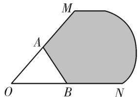

text_image

M
A
O
B
N

(2)设向量 $\overrightarrow{OA}$ , $\overrightarrow{OB}$ 不共线 ( $O$ 为坐标原点), 若 $\overrightarrow{OC} = \lambda \overrightarrow{OA} + \mu \overrightarrow{OB}$ , 且 $0 \leqslant \lambda \leqslant \mu \leqslant 1$ , 则点 $C$ 所有可能的位置区域用阴影表示正确的是 ( )

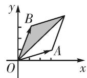  
A

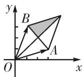  
B

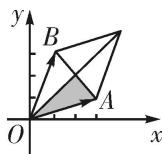  
C

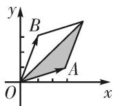  
D

(3)在 $\triangle ABC$ 中， $M$ 为边 $BC$ 上任意一点， $N$ 为 $AM$ 的中点， $\overrightarrow{AN}=\lambda\overrightarrow{AB}+\mu\overrightarrow{AC}$ ，则 $\lambda+\mu$ 的值为( )

A. $\frac{1}{2}$

B. $\frac{1}{3}$

C. $\frac{1}{4}$

D. 1

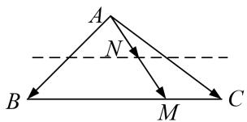

text_image

A
N
B
M
C

(4)在平行四边形 ABCD 中，点 E 和 F 分别是边 CD 和 BC 的中点．若 $\overrightarrow{AC} = \lambda \overrightarrow{AE} + \mu \overrightarrow{AF}$ ，其中 $\lambda, \mu \in R$ ，则 $\lambda + \mu =$ \_\_\_\_ .

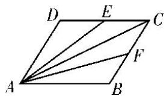

text_image

D E C
A F B

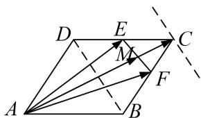

text_image

Geometric diagram of parallelogram ABCD with internal points E, F, M and directional arrows indicating vectors or transformations.

(5)如图所示，在 $\triangle ABC$ 中， $D$ ， $F$ 分别是 $AB$ ， $AC$ 的中点， $BF$ 与 $CD$ 交于点 $O$ ，设 $\overrightarrow{AB}=\boldsymbol{a}$ ， $\overrightarrow{AC}=\boldsymbol{b}$ ，向量 $\overrightarrow{AO}=\lambda\boldsymbol{a}+\mu\boldsymbol{b}$ ，则 $\lambda+\mu$ 的值为\_\_\_\_.

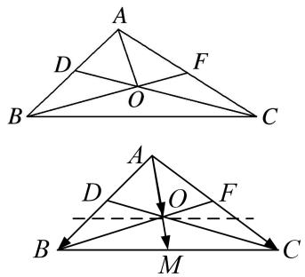

text_image

Geometric diagram showing two triangles with labeled points and lines, likely illustrating a geometry proof or construction.

(6)如图, 在平行四边形 $ABCD$ 中, $AC$ , $BD$ 相交于点 $O$ , $E$ 为线段 $AO$ 的中点. 若 $\overrightarrow{BE} = \lambda \overrightarrow{BA} + \mu \overrightarrow{BD} (\lambda, \mu \in \mathbf{R})$ , 则 $\lambda + \mu$ 等于 ( )

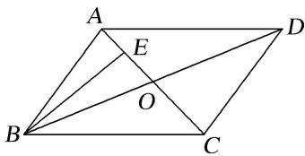

text_image

A
E
D
O
B
C

A. 1

B. $\frac{3}{4}$

C. $\frac{2}{3}$

D. $\frac{1}{2}$

(7)在梯形 ABCD 中，已知 $AB \parallel CD$ ，AB = 2CD，M，N 分别为 CD，BC 的中点．若 $\overrightarrow{AB} = \lambda \overrightarrow{AM} + \mu \overrightarrow{AN}$ ，则 $\lambda + \mu$ 的值为（）

A. $\frac{1}{4}$

B. $\frac{1}{5}$

C. $\frac{4}{5}$

D. $\frac{5}{4}$

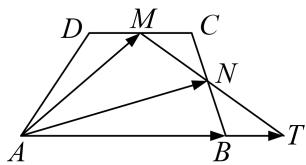

text_image

D M C
A N B T

(8) (2013 江苏) 设 $D, E$ 分别是 $\triangle ABC$ 的边 $AB, BC$ 上的点, $AD = \frac{1}{2} AB$ , $BE = \frac{2}{3} BC$ , 若 $\overrightarrow{DE} = \lambda_1\overrightarrow{AB} + \lambda_2\overrightarrow{AC} (\lambda_1, \lambda_2 \in \mathbf{R})$ , 则 $\lambda_1 + \lambda_2$ 的值为 \_\_\_\_.  
(9)在平行四边形ABCD中，AC与BD相交于点O，点E是线段OD的中点，AE的延长线与CD交于点F，若 $\overrightarrow{AC} = \boldsymbol{a}$ ， $\overrightarrow{BD} = \boldsymbol{b}$ ，且 $\overrightarrow{AF} = \lambda \boldsymbol{a} + \mu \boldsymbol{b}$ ，则 $\lambda + \mu$ 等于（ ）

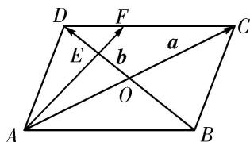

text_image

D
F
C
E
b
a
O
A
B

A. 1

B. $\frac{3}{4}$

C. $\frac{2}{3}$

D. $\frac{1}{2}$

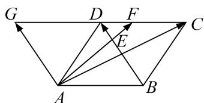

flowchart

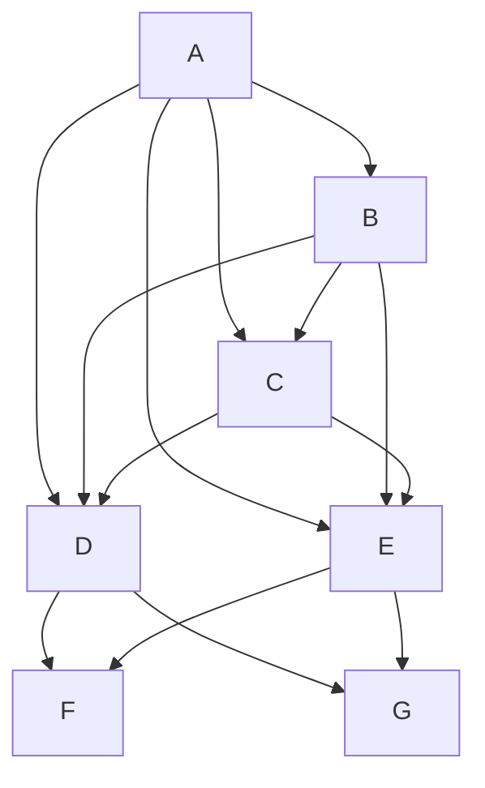

# 考点二 根据等和线求基底的系数和的最值(范围)

# 【方法总结】

# 根据等和线求基底的系数和的最值(范围)的步骤

(1)确定值为 1 的等和线;  
(2)平移(旋转或伸缩)该线，结合动点的可行域，分析何处取得最大值和最小值；

(3)从长度比或点的位置两个角度，计算最大值和最小值.

当点 $P$ 是某个平面区域内的动点时，首先作与基底两端点连线平行的直线 $l$ ，因点 $P$ 无论在 $l$ 何处，对应 $\alpha +\beta$ 的值恒为定值，我们不妨称之为“等和线”(或“等值线”)，然后将“等和线” $l$ 在动点 $P$ 的“可行域”内平行移动，于是问题便转化为求两个线段长度的比值范围，称之为“平移法”。已知点 $P$ 是△ABC所在平面内一点，且 $\overrightarrow{AP} = x\overrightarrow{AB} +y\overrightarrow{AC}$ ，则有点 $P$ 在直线 $BC$ 上 $\Leftrightarrow x + y = 1$ ；点 $P$ 与点 $A$ 在直线 $BC$ 异侧 $\Leftrightarrow x + y > 1$ ，且 $x + y$ 的值随点 $P$ 到直线 $BC$ 的距离越远而越大；点 $P$ 与点 $A$ 在直线 $BC$ 同侧 $\Leftrightarrow x + y <   1$ ，且 $x + y$ 的值随点 $P$ 到直线 $BC$ 的距离越远而越小.

平面向量共线定理的表达式中的三个向量的起点务必一致，若不一致，本着少数服从多数的原则，优先平移固定的向量；若需要研究两系数的线性关系，则需要通过变换基底向量，使得需要研究的代数式为基底的系数和。考虑到向量可以通过数乘继而将向量进行拉伸压缩反向等操作，那么理论上来说，所有的系数之间的线性关系，我们都可以通过调节基底，使得要求的表达式是两个新基底的系数和。

# 【例题选讲】

[例 1](1)如图，在正六边形 ABCDEF 中，P 是 $\triangle CDE$ 内(包括边界)的动点，设 $\overrightarrow{AP} = \alpha \overrightarrow{AB} + \beta \overrightarrow{AF} (\alpha, \beta \in \mathbb{R})$ ，则 $\alpha + \beta$ 的取值范围是 \_\_\_\_.

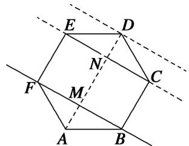

text_image

E
D
N
C
F
M
A
B

(2)(2009 安徽)给定两个长度为 1 的平面向量 $\overrightarrow{OA}$ 和 $\overrightarrow{OB}$ , 它们的夹角为 $\frac{2\pi}{3}$ , 如图所示, 点 $C$ 在以 $O$ 为圆心的弧 $\widehat{AB}$ 上运动, 若 $\overrightarrow{OC} = x\overrightarrow{OA} + y\overrightarrow{OB}(x, y \in \mathbf{R})$ , 则 $x + y$ 的最大值是 \_\_\_\_.

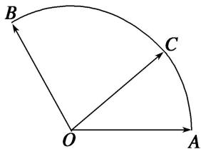

text_image

B
C
O
A

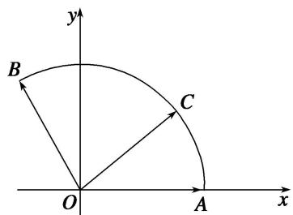

text_image

y
B
C
O
A
x

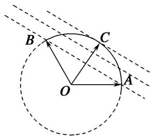

text_image

B
C
O
A

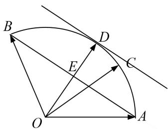

text_image

Geometric diagram with labeled points and intersecting lines, likely from a math problem or proof

(3) (2017·全国III)在矩形ABCD中，AB=1，AD=2，动点P在以点C为圆心且与BD相切的圆上．若 $\overrightarrow{AP}=\lambda\overrightarrow{AB}+\mu\overrightarrow{AD}$ ，则 $\lambda+\mu$ 的最大值为()

A. 3

B. $2\sqrt{2}$

C. $\sqrt{5}$

D. 2

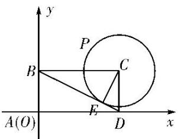

text_image

y
P
B
C
A(O)
E
D
x

(4)在直角梯形 ABCD 中， $AB \perp AD$ ，AD = DC = 1，AB = 3，动点 P 在以点 C 为圆心，且与直线 BD 相切的圆内运动，设 $\overrightarrow{AP} = x\overrightarrow{AB} + y\overrightarrow{AD}(x, y \in \mathbb{R})$ ，则 $x + y$ 的取值范围是 \_\_\_\_.

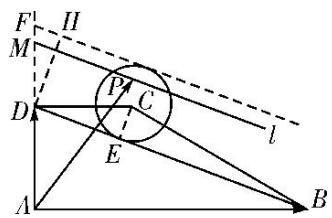

text_image

Geometric diagram with labeled points, lines, and a circle, likely from a math problem or proof.

(5)如图, 在平行四边形 $ABCD$ 中, $M$ , $N$ 为 $CD$ 的三等分点, $S$ 为 $AM$ 与 $BN$ 的交点, $P$ 为边 $AB$ 上一动点, $Q$ 为三角形 $SMN$ 内一点 (含边界), 若 $\overrightarrow{PQ} = x\overrightarrow{AM} + y\overrightarrow{BN}(x, y \in \mathbf{R})$ , 则 $x + y$ 的取值范围是 \_\_\_\_.

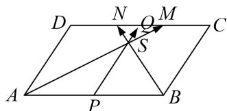

text_image

D
N
O
M
C
S
A
P
B

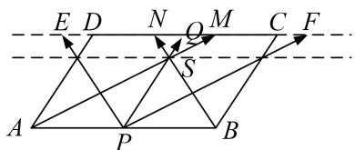

text_image

E D N O M C F
A P B

(6)如图，圆 $O$ 是边长为 $2\sqrt{3}$ 的等边三角形 $ABC$ 的内切圆，其与 $BC$ 边相切于点 $D$ ，点 $M$ 为圆上任意一点， $\overrightarrow{BM} = x\overrightarrow{BA} +y\overrightarrow{BD}(x,y\in \mathbf{R})$ ，则 $2x + y$ 的最大值为（）

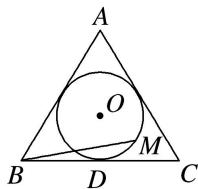

A. $\sqrt{2}$

B. $\sqrt{3}$

C. 2

D. $2\sqrt{2}$

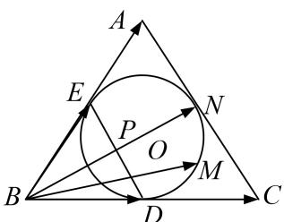

text_image

A
E
P
O
N
B
D
M
C

(7) 如图所示, $A$ , $B$ , $C$ 是圆 $O$ 上的三点, 线段 $CO$ 的延长线与 $BA$ 的延长线交于圆 $O$ 外的一点 $D$ , 若 $\overrightarrow{OC} = m\overrightarrow{OA} + n\overrightarrow{OB}$ , 则 $m + n$ 的取值范围是 \_\_\_\_.

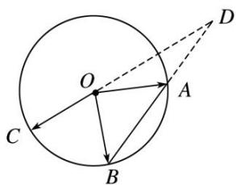

text_image

Geometric diagram showing a circle with center O, points A and B on circumference, and auxiliary lines from center to point D.

(8)已知点 O 为△ABC 的边 AB 的中点，D 为边 BC 的三等分点，DC=2DB，P 为△ADC 内(包括边界)任一点，若 $\overrightarrow{OP}=x\overrightarrow{OB}+y\overrightarrow{OD}$ ，则 x-2y 的取值范围为 \_\_\_\_.

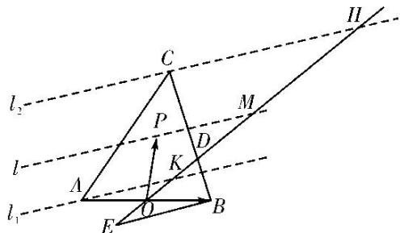

text_image

l₂
C
H
P
M
l
A
K
D
E
O
B
l₁

(9)如图, 在边长为 1 的正方形 $ABCD$ 中, $E$ 为 $AB$ 的中点, $P$ 为以 $A$ 为圆心, $AB$ 为半径的圆弧 (在正方形内, 包括边界点) 上的任意一点, 若向量 $\overrightarrow{AC} = \lambda \overrightarrow{DE} + \mu \overrightarrow{AP}$ , 则 $\lambda + \mu$ 的最小值为 \_\_\_\_.

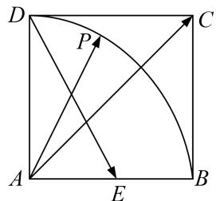

text_image

D
P
C
A
E
B

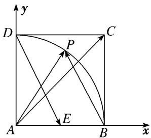

text_image

y
D
P
C
A
E
B
x

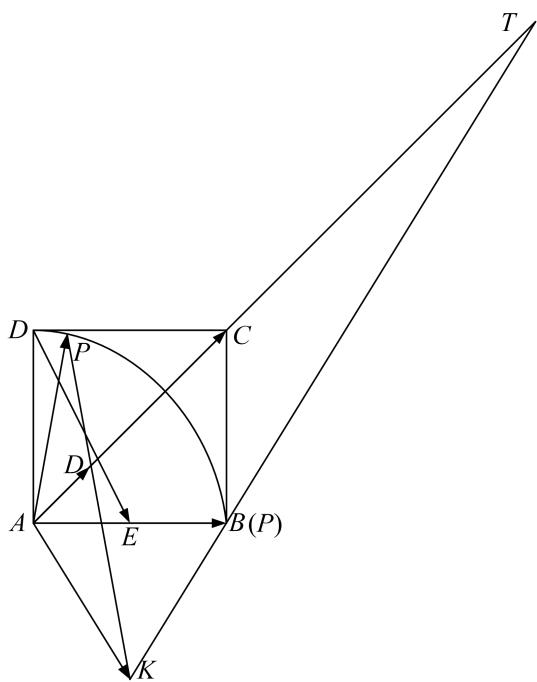

text_image

T
D
P
C
D
A
E
B(P)
K

(10) (2013·安徽)在平面直角坐标系中，O 是坐标原点，两定点 A，B 满足 $\left|\overrightarrow{OA}\right|=\left|\overrightarrow{OB}\right|=\overrightarrow{OA}\cdot\overrightarrow{OB}=2$ ，则点集 $\{P\mid\overrightarrow{OP}=\lambda\overrightarrow{OA}+\mu\overrightarrow{OB},\quad|\lambda|+|\mu|\leq1,\quad\lambda,\quad\mu\in\mathbf{R}\}$ 所表示的区域的面积是()

A. $2 \sqrt{2}$

B. $2 \sqrt{3}$

C. $4\sqrt{2}$

D. $4 \sqrt{3}$

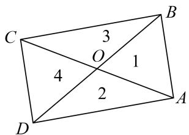

text_image

C
3
B
O
1
4
2
D
A

# 【对点训练】

1. 如图, $\triangle BCD$ 与 $\triangle ABC$ 的面积之比为 2, 点 $P$ 是区域 $ABCD$ 内任意一点(含边界), 且 $\overrightarrow{AP} = \lambda \overrightarrow{AB} + \mu \overrightarrow{AC}$ , 则 $\lambda + \mu$ 的取值范围为 ( )

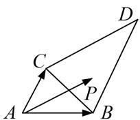

A. $[0, 1]$

B. $[0, 2]$

C. $[0, 3]$

D. $[0, 4]$

2. 在直角梯形 $ABCD$ 中, $\angle A = 90^{\circ}$ , $\angle B = 30^{\circ}$ , $AB = 2\sqrt{3}$ , $BC = 2$ , 点 $E$ 在线段 $CD$ 上, 若 $\overrightarrow{AE} = \overrightarrow{AD} + \mu \overrightarrow{AB}$ , 则 $\mu$ 的取值范围是 \_\_\_\_.

3. 如图, 四边形 $OABC$ 是边长为 1 的正方形, 点 $D$ 在 $OA$ 的延长线上, 且 $OD = 2$ , 点 $P$ 是 $\triangle BCD$ 内任意一点 (含边界), 设 $\overrightarrow{OP} = \lambda \overrightarrow{OC} + \mu \overrightarrow{OD}$ , 则 $\lambda + \mu$ 的取值范围为 \_\_\_\_.

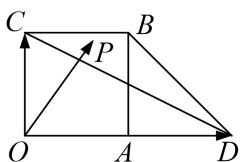

text_image

C
B
P
O
A
D

4. 给定两个长度为 1 的平面向量 $\overrightarrow{OA}$ 和 $\overrightarrow{OB}$ , 它们的夹角为 $90^{\circ}$ , 如图所示, 点 $C$ 在以 $O$ 为圆心的圆弧 $\widehat{AB}$ 上运动, 若 $\overrightarrow{OC} = x\overrightarrow{OA} + y\overrightarrow{OB}$ , 其中 $x, y \in \mathbf{R}$ , 则 $x + y$ 的最大值是( )

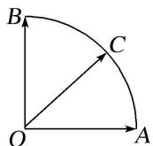

A. 1

B. $\sqrt{2}$

C. $\sqrt{3}$

D. 2

5. 如图, 在边长为 2 的正六边形 $ABCDEF$ 中, 动圆 $Q$ 半径为 1 , 圆心在线段 $CD$ (含端点)上运动, $P$ 是圆上及其内部的动点, 设 $\overrightarrow{AP} = m\overrightarrow{AB} + n\overrightarrow{AF}(m, n \in \mathbf{R})$ , 则 $m + n$ 的取值范围是 \_\_\_\_.

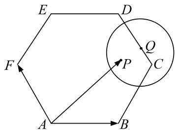

text_image

E
D
F
P
Q
C
A
B

6. 如图, 已知点 $P$ 为等边三角形 $ABC$ 外接圆上一点, 点 $Q$ 是该三角形内切圆上的一点, 若 $\overrightarrow{AP} = x_{1}\overrightarrow{AB} + y_{1}\overrightarrow{AC}$ , $\overrightarrow{AQ} = x_{2}\overrightarrow{AB} + y_{2}\overrightarrow{AC}$ , 则 $(2x_{1} - x_{2}) + (2y_{1} - y_{2})|$ 的最大值为 \_\_\_\_.

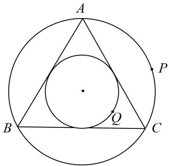

text_image

A
P
B
Q
C

7. 如图, 在扇形 $OAB$ 中, $\angle AOB = \frac{\pi}{3}$ , $C$ 为弧 $AB$ 上的动点, 若 $\overrightarrow{OC} = x\overrightarrow{OA} + y\overrightarrow{OB}$ , 则 $x + 3y$ 的取值范围是 \_\_\_\_.

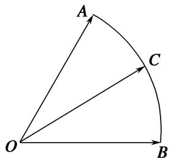

text_image

A
C
O
B

8. 如图, $G$ 为 $\triangle ADE$ 的重心, $P$ 为 $\triangle GDE$ 内任一点(包括边界), $B$ , $C$ 均为 $AD$ , $AE$ 上的三等分点(靠近点 $A$ ), $\overrightarrow{AP} = \alpha \overrightarrow{AB} + \beta \overrightarrow{AC}$ , 则 $\alpha + \frac{1}{2} \beta$ 的取值范围是 \_\_\_\_.

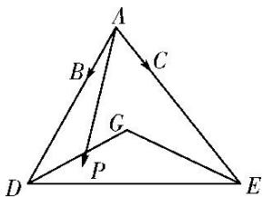

text_image

A
B
C
G
P
D
E

9. 给定两个长度为 1 的平面向量 $\overrightarrow{OA}$ 和 $\overrightarrow{OB}$ ，它们的夹角为 $90^{\circ}$ ，如图所示，点 $C$ 在以 $O$ 为圆心的圆弧 $AB$ 上运动。若 $\overrightarrow{OC} = x\overrightarrow{OA} + y\overrightarrow{OB}$ 。其中 $x, y \in \mathbf{R}$ ，则 $2x + 3y$ 的最大值是（）

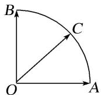

A. $\sqrt{13}$

B. 3

C. $\sqrt{5}$

D. 5

10. 平行四边形 $ABCD$ 中, $AB=3$ , $AD=2$ , $\angle BAD=120^{\circ}$ , $P$ 是平行四边形 $ABCD$ 内一点, 且 $AP=1$ , 若 $\overrightarrow{AP}=x\overrightarrow{AB}+y\overrightarrow{AD}$ , 则 $3x+2y$ 的最大值为 \_\_\_\_.

11. 在矩形 $ABCD$ 中， $AB = \sqrt{5}$ ， $BC = \sqrt{3}$ ， $P$ 为矩形内一点，且 $AP = \frac{\sqrt{5}}{2}$ ，若 $\overrightarrow{AP} = \lambda \overrightarrow{AB} + \mu \overrightarrow{AD} (\lambda, \mu \in \mathbf{R})$ 则 $\sqrt{5}\lambda + \sqrt{3}\mu$ 的最大值为 \_\_\_\_.

12. 如图，在扇形 $OAB$ 中， $\angle AOB = \frac{\pi}{3}$ ， $C$ 为弧 $\widehat{AB}$ 上的一个动点，若 $\overrightarrow{OC} = x\overrightarrow{OA} + y\overrightarrow{OB}$ ，则 $x - y$ 的取值范围是 \_\_\_\_.

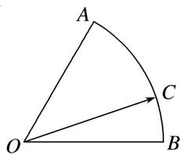

text_image

A
O
B
C

13. 如图, 在直角梯形 $ABCD$ 中, $AB \perp AD$ , $AB // DC$ , $AB = 2$ , $AD = DC = 1$ , 图中圆弧所在圆的圆心为点 $C$ , 半径为 $\frac{1}{2}$ , 且点 $P$ 在图中阴影部分 (包括边界) 运动. 若 $\overrightarrow{AP} = x\overrightarrow{AB} + y\overrightarrow{BC}$ , 其中 $x, y \in \mathbf{R}$ , 则 $4x - y$ 的最大值为 ( )

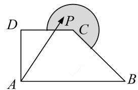

text_image

D
P
C
A
B

A. $3 - \frac{\sqrt{2}}{4}$

B. $3 + \frac{\sqrt{5}}{2}$

C. 2

D. $3 + \frac{\sqrt{17}}{2}$

14. 如图，在扇形 $OAB$ 中， $\angle AOB = \frac{\pi}{3}$ ， $C$ 为弧 $AB$ 上，且与 $A, B$ 不重合的一个动点， $\overrightarrow{OC} = x\overrightarrow{OA} + y\overrightarrow{OB}$ ，若 $u = x + \lambda y (\lambda > 0)$ 存在最大值，则 $\lambda$ 的取值范围为（）

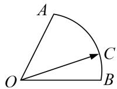

A. $\left(\frac{1}{2},1\right)$

B. (1, 3)

C. $\left(\frac{1}{2},2\right)$

D. $\left(\frac{1}{3},3\right)$

15. 在平面直角坐标系中，O 是坐标原点，若两定点 A，B 满足 $\left|\overrightarrow{OA}\right|=\left|\overrightarrow{OB}\right|=\sqrt{2}$ ， $\overrightarrow{OA}\cdot\overrightarrow{OB}=1$ ，则点集 $\left\{P\mid\overrightarrow{OP}=\lambda\overrightarrow{OA}+\mu\overrightarrow{OB},\quad\left|\lambda\right|+\left|\mu\right|\leqslant2,\quad\lambda,\quad\mu\in\mathbf{R}\right\}$ 所表示的区域的面积是（）

A. $4 \sqrt{2}$

B. $4\sqrt{3}$

C. $6\sqrt{2}$

D. $8\sqrt{3}$

