# 专题七 平面向量的等和线

根据平面向量基本定理，如果 $\overrightarrow{PA}$ ， $\overrightarrow{PB}$ 为同一平面内两个不共线的向量，那么这个平面内的任意向量 $\overrightarrow{PC}$ 都可以由 $\overrightarrow{PA}$ ， $\overrightarrow{PB}$ 唯一线性表示： $\overrightarrow{PC} = x\overrightarrow{PA} + y\overrightarrow{PB}$ 。特殊地，如果点 $C$ 正好在直线 $AB$ 上，那么 $x + y = 1$ ，反之如果 $x + y = 1$ ，那么点 $C$ 一定在直线 $AB$ 上。于是有三点共线结论：已知 $\overrightarrow{PA}$ ， $\overrightarrow{PB}$ 为平面内两个不共线的向量，设 $\overrightarrow{PC} = x\overrightarrow{PA} + y\overrightarrow{PB}$ ，则 $A, B, C$ 三点共线的充要条件为 $x + y = 1$ 。

以上讨论了点 $C$ 在直线 $AB$ 上的特殊情况，得到了平面向量中的三点共线结论．下面讨论点 $C$ 不在直线 $AB$ 上的情况.

如图所示，直线 $DE \parallel AB$ ， $C$ 为直线 $DE$ 上任一点，设 $\overrightarrow{PC} = x\overrightarrow{PA} + y\overrightarrow{PB}(x, y \in \mathbf{R})$ .

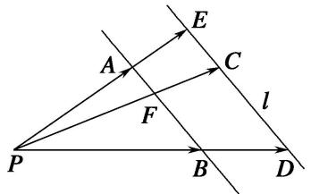

text_image

E
A
C
l
F
P
B
D

# 1. 平面向量等和线定义

(1)当直线 DE 经过点 P 时，容易得到 $x + y = 0$ .  
(2)当直线 DE 不过点 P 时，直线 PC 与直线 AB 的交点记为 F，因为点 F 在直线 AB 上，所以由三点共线结论可知，若 $\overrightarrow{PF} = \lambda \overrightarrow{PA} + \mu \overrightarrow{PB} (\lambda, \mu \in \mathbf{R})$ ，则 $\lambda + \mu = 1$ 。由 $\triangle PAB$ 与 $\triangle PED$ 相似，知必存在一个常数 $k \in R$ ，使得 $\overrightarrow{PC} = k \overrightarrow{PF}$ （其中 $k = \frac{|PC|}{|PF|} = \frac{|PE|}{|PA|} = \frac{|PD|}{|PB|}$ ），则 $\overrightarrow{PC} = k \overrightarrow{PF} = k \lambda \overrightarrow{PA} + k \mu \overrightarrow{PB}$ 。又 $\overrightarrow{PC} = x \overrightarrow{PA} + y \overrightarrow{PB} (x, y \in \mathbf{R})$ ，所以 $x + y = k \lambda + k \mu = k$ 。以上过程可逆。

在向量起点相同的前提下，所有以与两向量终点所在的直线平行的直线上的点为终点的向量，其基底的系数和为定值，这样的线，我们称之为“等和线”.

# 2. 平面向量等和线定理

平面内一组基底 $\overrightarrow{PA}$ ， $\overrightarrow{PB}$ 及任一向量 $\overrightarrow{PF}$ 满足： $\overrightarrow{PF} = \lambda \overrightarrow{PA} + \mu \overrightarrow{PB} (\lambda, \mu \in \mathbf{R})$ ，若点 $F$ 在直线 $AB$ 上或在平行于 $AB$ 的直线上，则 $\lambda + \mu = k$ （定值），反之也成立，我们把直线 $AB$ 以及与直线 $AB$ 平行的直线称为等和线.

# 3. 平面向量等和线性质

(1)当等和线恰为直线 AB 时，k=1;  
(2)当等和线在点 P 和直线 AB 之间时， $k \in (0, 1)$ ;  
(3)当直线 AB 在点 P 和等和线之间时， $k \in (1, +\infty)$ ;  
(4)当等和线过点 P 时，k=0;  
(5)若两等和线关于点 P 对称，则定值 k 互为相反数.

# 考点一 根据等和线求基底系数和的值

# 【方法总结】

# 根据等和线求基底系数和的步骤

(1)确定值为 1 的等和线;  
(2)平移(旋转或伸缩)该线，作出满足条件的等和线；  
(3)从长度比或点的位置两个角度，计算满足条件的等和线的值.

已知点 $P$ 是 $\triangle ABC$ 所在平面内一点，且 $\overrightarrow{AP} = x\overrightarrow{AB} +y\overrightarrow{AC}$ ，则有点 $P$ 在直线 $BC$ 上 $\Leftrightarrow x + y = 1$ ；点 $P$ 与点

A 在直线 BC 异侧 $\Leftrightarrow x + y > 1$ ，且 $x + y$ 的值随点 P 到直线 BC 的距离越远而越大；点 P 与点 A 在直线 BC 同侧 $\Leftrightarrow x + y < 1$ ，且 $x + y$ 的值随点 P 到直线 BC 的距离越远而越小.

平面向量共线定理的表达式中的三个向量的起点务必一致，若不一致，本着少数服从多数的原则，优先平移固定的向量；若需要研究两系数的线性关系，则需要通过变换基底向量，使得需要研究的代数式为基底的系数和。考虑到向量可以通过数乘继而将向量进行拉伸压缩反向等操作，那么理论上来说，所有的系数之间的线性关系，我们都可以通过调节基底，使得要求的表达式是两个新基底的系数和。

# 【例题选讲】

[例 1](1)如图，A, B 分别是射线 OM，ON 上的点，给出下列以 O 为起点的向量：① $\overrightarrow{OA}+2\overrightarrow{OB}$ ; ② $\frac{1}{2}\overrightarrow{OA}+\frac{1}{3}\overrightarrow{OB}$ ; ③ $\frac{3}{4}\overrightarrow{OA}+\frac{1}{3}\overrightarrow{OB}$ ; ④ $\frac{3}{4}\overrightarrow{OA}+\frac{1}{5}\overrightarrow{OB}$ ; ⑤ $\frac{3}{4}\overrightarrow{OA}+\overrightarrow{BA}+\frac{2}{3}\overrightarrow{OB}$ . 其中终点落在阴影区域(不包括边界)内的向量的序号是\_\_\_\_(写出满足条件的所有向量的序号).

text_image

M
A
O
B
N

答案 ①③ 解析 由向量共线的充要条件可得，当点 $P$ 在直线 $AB$ 上时，存在唯一的一对有序实数 $u, \nu,$ 使得 $\overrightarrow{OP} = u\overrightarrow{OA} + \nu\overrightarrow{OB}$ 成立，且 $u + \nu = 1$ ，所以点 $P$ 位于阴影区域内的充要条件是“满足 $\overrightarrow{OP} = u\overrightarrow{OA} + \nu\overrightarrow{OB}$ ，且 $u > 0, \nu > 0, u + \nu > 1$ ”。①因为 $1 + 2 > 1$ ，所以点 $P$ 位于阴影区域内，故正确；同理③正确，②④不正确；⑤原式 $= \frac{3}{4}\overrightarrow{OA} + (\overrightarrow{OA} - \overrightarrow{OB}) + \frac{2}{3}\overrightarrow{OB} = \frac{7}{4}\overrightarrow{OA} - \frac{1}{3}\overrightarrow{OB}$ ，而 $-\frac{1}{3} < 0$ ，故不符合条件。综上可知，只有①③正确。

(2)设向量 $\overrightarrow{OA}$ ， $\overrightarrow{OB}$ 不共线(O为坐标原点)，若 $\overrightarrow{OC}=\lambda\overrightarrow{OA}+\mu\overrightarrow{OB}$ ，且 $0\leqslant\lambda\leqslant\mu\leqslant1$ ，则点C所有可能的位置区域用阴影表示正确的是()

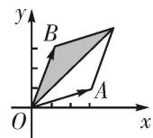  
A

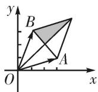  
B

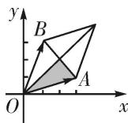  
C

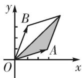  
D

答案 A 解析 当 $\lambda=0$ 时， $\overrightarrow{OC}=\mu\overrightarrow{OB}$ ，故点 C 所有可能的位置区域应该包括边界 $\overrightarrow{OB}$ 或 $\overrightarrow{OB}$ 的一部分，故排除 B，C，D 项．故选 A 项．

(3)在 $\triangle ABC$ 中， $M$ 为边 $BC$ 上任意一点， $N$ 为 $AM$ 的中点， $\overrightarrow{AN}=\lambda\overrightarrow{AB}+\mu\overrightarrow{AC}$ ，则 $\lambda+\mu$ 的值为( )

A. $\frac{1}{2}$

B. $\frac{1}{3}$

C. $\frac{1}{4}$

D. 1

答案 A 解析 通法 设 $\overrightarrow{BM} = t\overrightarrow{BC}$ ，则 $\overrightarrow{AN} = \frac{1}{2}\overrightarrow{AM} = \frac{1}{2} (\overrightarrow{AB} +\overrightarrow{BM}) = \frac{1}{2}\overrightarrow{AB} +\frac{1}{2}\overrightarrow{BM} = \frac{1}{2}\overrightarrow{AB} +\frac{t}{2}\overrightarrow{BC} = \frac{1}{2}\overrightarrow{AB}+$ $\frac{t}{2} (\overrightarrow{AC} -\overrightarrow{AB}) = \left(\frac{1}{2} -\frac{t}{2}\right)\overrightarrow{AB} +\frac{t}{2}\overrightarrow{AC},\quad \therefore \lambda = \frac{1}{2} -\frac{t}{2},\mu = \frac{t}{2},\quad \therefore \lambda +\mu = \frac{1}{2},$ 故选A.

等和线法 如图, $BC$ 为值是1的等和线, 过 $N$ 作 $BC$ 的平行线, 设 $\lambda + \mu = k$ , 则 $k = \frac{|AN|}{|AM|}$ . 由图易知, $\frac{|AN|}{|AM|} = \frac{1}{2}$ , 故选A.

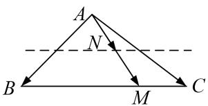

text_image

A
N
B
M
C

(4)在平行四边形 ABCD 中，点 E 和 F 分别是边 CD 和 BC 的中点．若 $\overrightarrow{AC} = \lambda \overrightarrow{AE} + \mu \overrightarrow{AF}$ ，其中 $\lambda, \mu \in R$ ，则 $\lambda + \mu =$ \_\_\_\_ .

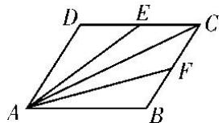

text_image

D E C
A B F

答案 $\frac{4}{3}$ 解析 通法 选择 $\overrightarrow{AB},\overrightarrow{AD}$ 作为平面向量的一组基底，则 $\overrightarrow{AC} = \overrightarrow{AB} +\overrightarrow{AD},\overrightarrow{AE} = \frac{1}{2}\overrightarrow{AB} +\overrightarrow{AD},\overrightarrow{AF}$ $= \overrightarrow{AB} +\frac{1}{2}\overrightarrow{AD},$ 又 $\overrightarrow{AC} = \lambda \overrightarrow{AE} +\mu \overrightarrow{AF} = \left(\frac{1}{2}\lambda +\mu\right)\overrightarrow{AB} +\left(\lambda +\frac{1}{2}\mu\right)\overrightarrow{AD},$ 于是得 $\left\{ \begin{array}{l}\frac{1}{2}\lambda +\mu = 1,\\ \lambda +\frac{1}{2}\mu = 1, \end{array} \right.$ 即 $\left\{ \begin{array}{l}\lambda = \frac{2}{3},\\ \mu = \frac{2}{3}, \end{array} \right.$ 故 $\lambda +\mu$ $= \frac{4}{3}.$

等和线法 如图, EF 为值是 1 的等和线, 过 C 作 EF 的平行线, 设 $\lambda + \mu = k$ , 则 $k = \frac{|AC|}{|AM|}$ . 由图易知, $\frac{|AC|}{|AM|} = \frac{4}{3}$ , 故选 B.

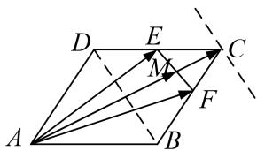

text_image

Geometric diagram of parallelogram ABCD with internal points E, F, M and directional arrows indicating vectors or transformations.

(5)如图所示, 在 $\triangle ABC$ 中, $D$ , $F$ 分别是 $AB$ , $AC$ 的中点, $BF$ 与 $CD$ 交于点 $O$ , 设 $\overrightarrow{AB} = a$ , $\overrightarrow{AC} = b$ , 向量 $\overrightarrow{AO} = \lambda a + \mu b$ , 则 $\lambda + \mu$ 的值为 \_\_\_\_.

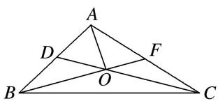

text_image

A
D
F
O
B
C

答案 $\frac{2}{3}$ 解析 等和线法 如图， $BC$ 为值是1的等和线，过 $O$ 作 $BC$ 的平行线，设 $\lambda + \mu = k$ ，则 $k = \frac{|AO|}{|AM|}$ . 由图易知， $\frac{|AO|}{|AM|} = \frac{2}{3}$ .

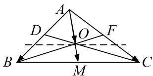

text_image

A
D
O
F
B
M
C

(6)如图，在平行四边形ABCD中，AC，BD相交于点O，E为线段AO的中点．若 $\overrightarrow{BE}=\lambda\overrightarrow{BA}+\mu\overrightarrow{BD}(\lambda,\mu\in\mathbf{R})$ ，则 $\lambda+\mu$ 等于()

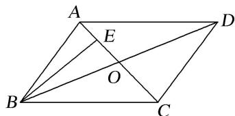

text_image

A
E
D
O
B
C

A. 1

B. $\frac{3}{4}$

C. $\frac{2}{3}$

D. $\frac{1}{2}$

答案 B 解析 通法 ∵为线段 AO 的中点，∴ $\overrightarrow{BE} = \frac{1}{2}\overrightarrow{BA} + \frac{1}{2}\overrightarrow{BO} = \frac{1}{2}\overrightarrow{BA} + \frac{1}{2} \times \frac{1}{2}\overrightarrow{BD} = \frac{1}{2}\overrightarrow{BA} + \frac{1}{4}\overrightarrow{BD} = \lambda\overrightarrow{BA} + \mu\overrightarrow{BD}, \therefore \lambda + \mu = \frac{1}{2} + \frac{1}{4} = \frac{3}{4}.$

等和线法 如图，AD 为值是 1 的等和线，过 E 作 AD 的平行线，设 $\lambda + \mu = k$ ，则 $k = \frac{|BE|}{|BF|}$ 。由图易知， $\frac{|BE|}{|BF|} = \frac{3}{4}$ ，故选 B.

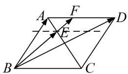

text_image

Geometric diagram of a parallelogram with labeled vertices and directional arrows, likely illustrating vector addition or projection.

(7)在梯形ABCD中，已知 $AB \parallel CD$ ， $AB = 2CD$ ， $M$ ， $N$ 分别为 $CD$ ， $BC$ 的中点．若 $\overrightarrow{AB} = \lambda \overrightarrow{AM} + \mu \overrightarrow{AN}$ ，则 $\lambda + \mu$ 的值为（）

A. $\frac{1}{4}$

B. $\frac{1}{5}$

C. $\frac{4}{5}$

D. $\frac{5}{4}$

答案 C 解析 法一：连接 AC(图略)，由 $\overrightarrow{AB} = \lambda \overrightarrow{AM} + \mu \overrightarrow{AN}$ ，得 $\overrightarrow{AB} = \lambda \cdot \frac{1}{2} (\overrightarrow{AD} + \overrightarrow{AC}) + \mu \cdot \frac{1}{2} (\overrightarrow{AC} + \overrightarrow{AB})$ ，则 $\left(\frac{\mu}{2} - 1\right)_{\overrightarrow{AB}} + \frac{\lambda}{2} \overrightarrow{AD} + \left[\frac{\lambda}{2} + \frac{\mu}{2}\right)_{\overrightarrow{AC}} = 0$ ，得 $\left(\frac{\mu}{2} - 1\right)_{\overrightarrow{AB}} + \frac{\lambda}{2} \overrightarrow{AD} + \left[\frac{\lambda}{2} + \frac{\mu}{2}\right)_{[\overrightarrow{AD} + \frac{1}{2} \overrightarrow{AB}] = 0}$ ，得 $\left(\frac{1}{4} \lambda + \frac{3}{4} \mu - 1\right)_{\overrightarrow{AB}} + \left(\lambda + \frac{\mu}{2}\right)_{\overrightarrow{AD}} = 0$ 。又 $\overrightarrow{AB}$ ， $\overrightarrow{AD}$ 不共线，所以由平面向量基本定理得 $\left\{\begin{aligned}&\frac{1}{4}\lambda + \frac{3}{4}\mu - 1 = 0,\\&\lambda + \frac{\mu}{2} = 0,\end{aligned}\right.$ 解得 $\left\{\begin{aligned}&\lambda = -\frac{4}{5},\\&\mu = \frac{8}{5}.\\\end{aligned}\right.$ 所以 $\lambda + \mu = \frac{4}{5}.$

法二：因为 $\overrightarrow{AB} = \overrightarrow{AN} + \overrightarrow{NB} = \overrightarrow{AN} + \overrightarrow{CN} = \overrightarrow{AN} + (\overrightarrow{CA} + \overrightarrow{AN}) = 2\overrightarrow{AN} + \overrightarrow{CM} + \overrightarrow{MA} = 2\overrightarrow{AN} - \frac{1}{4}\overrightarrow{AB} - \overrightarrow{AM}$ ，所以 $\overrightarrow{AB} = \frac{8}{5}\overrightarrow{AN} - \frac{4}{5}\overrightarrow{AM}$ ，所以 $\lambda + \mu = \frac{4}{5}$ .

法三：根据题意作出图形如图所示，连接 MN 并延长，交 AB 的延长线于点 T，由已知易得 $AB=\frac{4}{5}AT$ ，所以 $\frac{4}{5}\overrightarrow{AT}=\overrightarrow{AB}=\lambda\overrightarrow{AM}+\mu\overrightarrow{AN}$ ，因为 T, M, N 三点共线，所以 $\lambda+\mu=\frac{4}{5}$ .

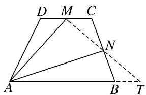

text_image

D M C
A B T
N

等和线法 如图，连接 $MN$ 并延长，交 $AB$ 的延长线于点 $T$ ，则 $MT$ 为值是1的等和线，设 $\lambda +\mu = k$ ，则 $k = \frac{|AB|}{|AT|}$ .由图易知， $\frac{|AB|}{|AT|} = \frac{4}{5}$ ，故选C.

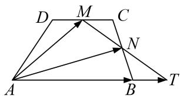

text_image

D M C
A N B T

(8) (2013 江苏) 设 $D, E$ 分别是 $\triangle ABC$ 的边 $AB, BC$ 上的点, $AD = \frac{1}{2} AB$ , $BE = \frac{2}{3} BC$ , 若 $\overrightarrow{DE} = \lambda_1\overrightarrow{AB} + \lambda_2\overrightarrow{AC} (\lambda_1, \lambda_2 \in \mathbf{R})$ , 则 $\lambda_1 + \lambda_2$ 的值为 \_\_\_\_.

答案 $\frac{1}{2}$ 解析 如图, 过点 A 作 $\overrightarrow{AF} = \overrightarrow{DE}$ , 设 AF 与 BC 的延长线交于点 H, 易知 AF = FH, $\therefore DF = \frac{1}{2} BH$ , 因此 $\lambda_{1} + \lambda_{2} = \frac{1}{2}$ .

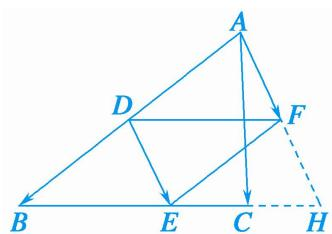

text_image

Geometric diagram with labeled points A, B, C, D, E, F and dashed lines forming triangles and a rectangle

(9)在平行四边形ABCD中，AC与BD相交于点O，点E是线段OD的中点，AE的延长线与CD交于点F，若 $\overrightarrow{AC} = \boldsymbol{a}$ ， $\overrightarrow{BD} = \boldsymbol{b}$ ，且 $\overrightarrow{AF} = \lambda \boldsymbol{a} + \mu \boldsymbol{b}$ ，则 $\lambda + \mu$ 等于（ ）

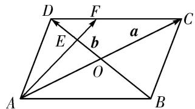

text_image

D
F
C
E
b
a
O
A
B

A. 1

B. $\frac{3}{4}$

C. $\frac{2}{3}$

D. $\frac{1}{2}$

答案 A 解析 等和线法 如图，作 $\overrightarrow{AG} = \overrightarrow{BD}$ ，延长 $CD$ 与 $AG$ 相交于 $G$ ，因为 $C, F, G$ 三点共线，所以 $\lambda + \mu = 1$ 。故选 A.

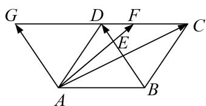

flowchart

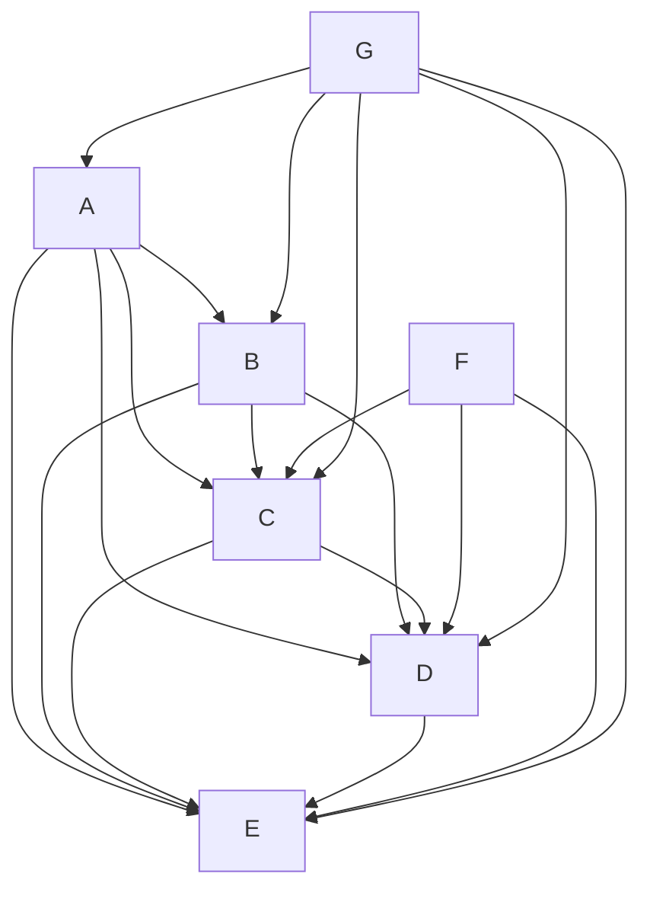

# 考点二 根据等和线求基底的系数和的最值(范围)

# 【方法总结】

# 根据等和线求基底的系数和的最值(范围)的步骤

(1)确定值为 1 的等和线;  
(2)平移(旋转或伸缩)该线，结合动点的可行域，分析何处取得最大值和最小值；  
(3)从长度比或点的位置两个角度，计算最大值和最小值.

当点 $P$ 是某个平面区域内的动点时，首先作与基底两端点连线平行的直线 $l$ ，因点 $P$ 无论在 $l$ 何处，对应 $\alpha +\beta$ 的值恒为定值，我们不妨称之为“等和线”(或“等值线”)，然后将“等和线” $l$ 在动点 $P$ 的“可行域”内平行移动，于是问题便转化为求两个线段长度的比值范围，称之为“平移法”。已知点 $P$ 是△ABC所在平面内一点，且 $\overrightarrow{AP} = x\overrightarrow{AB} +y\overrightarrow{AC}$ ，则有点 $P$ 在直线 $BC$ 上 $\Leftrightarrow x + y = 1$ ；点 $P$ 与点 $A$ 在直线 $BC$ 异侧 $\Leftrightarrow x + y > 1$ ，且 $x + y$ 的值随点 $P$ 到直线 $BC$ 的距离越远而越大；点 $P$ 与点 $A$ 在直线 $BC$ 同侧 $\Leftrightarrow x + y < 1$ ，且 $x + y$ 的值随点 $P$ 到直线 $BC$ 的距离越远而越小.

平面向量共线定理的表达式中的三个向量的起点务必一致，若不一致，本着少数服从多数的原则，优先平移固定的向量；若需要研究两系数的线性关系，则需要通过变换基底向量，使得需要研究的代数式为基底的系数和。考虑到向量可以通过数乘继而将向量进行拉伸压缩反向等操作，那么理论上来说，所有的系数之间的线性关系，我们都可以通过调节基底，使得要求的表达式是两个新基底的系数和。

# 【例题选讲】

[例 1](1)如图，在正六边形 ABCDEF 中，P 是△CDE 内(包括边界)的动点，设 $\overrightarrow{AP} = \alpha \overrightarrow{AB} + \beta \overrightarrow{AF} (\alpha, \beta \in \mathbb{R})$ ，则 $\alpha + \beta$ 的取值范围是 \_\_\_\_.

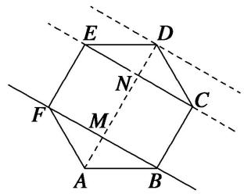

text_image

E
D
N
C
F
M
A
B

答案 [3, 4] 解析 等和线法 直线 $BF$ 为 $k = 1$ 的等和线，当 $P$ 在 $\triangle CDE$ 内时，直线 $EC$ 是最近的等和线，过 $D$ 点的等和线是最远的，所以 $\alpha + \beta \in [\frac{AN}{AM}, \frac{AD}{AM}] = [3, 4]$ .

(2)(2009 安徽)给定两个长度为 1 的平面向量 $\overrightarrow{OA}$ 和 $\overrightarrow{OB}$ ，它们的夹角为 $\frac{2\pi}{3}$ ，如图所示，点 $C$ 在以 $O$ 为圆心的弧 $\widehat{AB}$ 上运动，若 $\overrightarrow{OC} = x\overrightarrow{OA} + y\overrightarrow{OB}(x, y \in \mathbf{R})$ ，则 $x + y$ 的最大值是 \_\_\_\_.

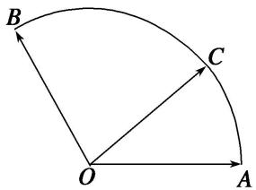

text_image

B
C
O
A

答案 2 解析 通法 以 O 为坐标原点， $\overrightarrow{OA}$ 所在的直线为 x 轴建立平面直角坐标系，如图所示，则 $A(1,0)$ ， $B(-\frac{1}{2},\frac{\sqrt{3}}{2})$ ，设 $\angle AOC = \alpha (\alpha \in [0, \frac{2\pi}{3}])$ ，则 $C(\cos\alpha, \sin\alpha)$ ，由 $\overrightarrow{OC} = x\overrightarrow{OA} + y\overrightarrow{OB}$ ，得 $\left\{\begin{aligned}\cos\alpha &= x - \frac{1}{2}y \\ \sin\alpha &= \frac{\sqrt{3}}{2}y\end{aligned}\right.$ ，
所以 $x=\cos\alpha+\frac{\sqrt{3}}{3}\sin\alpha,\quad y=\frac{2\sqrt{3}}{3}\sin\alpha$ ，所以 $x+y=\cos\alpha+\sqrt{3}\sin\alpha=2\sin(\alpha+\frac{\pi}{6})$ ，又 $\alpha\in[0,\frac{2\pi}{3}]$ ，所以当 $\alpha=\frac{\pi}{3}$ 时，x+y 取得最大值 2.

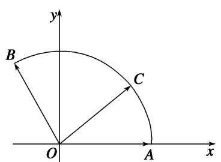

text_image

y
B
C
O
A
x

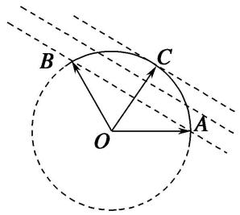

text_image

B
C
O
A

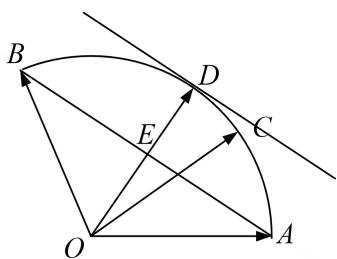

text_image

Geometric diagram with labeled points O, A, B, C, D, E and intersecting lines forming a semicircle and triangle

等和线法 令 $x + y = k$ ，所有与直线 $AB$ 平行的直线中，切线离圆心最远，即此时 $k$ 取得最大值，结合角度，不难得到 $k = \frac{|DO|}{|OE|} = 2$ .

(3) (2017·全国III)在矩形 $ABCD$ 中, $AB = 1$ , $AD = 2$ , 动点 $P$ 在以点 $C$ 为圆心且与 $BD$ 相切的圆上. 若

$\overrightarrow{AP}=\lambda\overrightarrow{AB}+\mu\overrightarrow{AD}$ ，则 $\lambda+\mu$ 的最大值为()

A. 3

B. $2\sqrt{2}$

C. $\sqrt{5}$

D. 2

答案 A 解析 建立如图所示的直角坐标系，则 C 点坐标为 $(2, 1)$ 。设 BD 与圆 C 切于点 E，连接 CE，则 $CE \perp BD$ 。因为 CD = 1，BC = 2，所以 $BD = \sqrt{1^{2} + 2^{2}} = \sqrt{5}$ ， $EC = \frac{BC \cdot CD}{BD} = \frac{2}{\sqrt{5}} = \frac{2\sqrt{5}}{5}$ ，所以 P 点的轨迹方程为 $(x - 2)^{2} + (y - 1)^{2} = \frac{4}{5}$ 。设 $P(x_{0}, y_{0})$ ，则 $\left\{\begin{aligned} x_{0} &= 2 + \frac{2\sqrt{5}}{5}\cos\theta, \\ y_{0} &= 1 + \frac{2\sqrt{5}}{5}\sin\theta \end{aligned}\right.$ （θ为参数），而 $\overrightarrow{AP} = (x_{0}, y_{0})$ ， $\overrightarrow{AB} = (0, 1)$ ， $\overrightarrow{AD} = (2, 0)$ 。因为 $\overrightarrow{AP} = \lambda\overrightarrow{AB} + \mu\overrightarrow{AD} = \lambda(0, 1) + \mu(2, 0) = (2\mu, \lambda)$ ，所以 $\mu = \frac{1}{2}x_{0} = 1 + \frac{\sqrt{5}}{5}\cos\theta$ ， $\lambda = y_{0} = 1 + \frac{2\sqrt{5}}{5}\sin\theta$ 。两式相加，得 $\lambda + \mu = 1 + \frac{2\sqrt{5}}{5}\sin\theta + 1 + \frac{\sqrt{5}}{5}\cos\theta = 2 + \sin(\theta + \varphi) \leq 3$ （其中 $\sin\varphi = \frac{\sqrt{5}}{5}$ ， $\cos\varphi = \frac{2\sqrt{5}}{5}$ ），当且仅当 $\theta = \frac{\pi}{2} + 2k\pi - \varphi$ ， $k \in Z$ 时， $\lambda + \mu$ 取得最大值 3。故选 A。

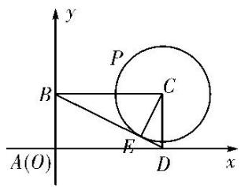

text_image

y
P
B
C
A(O)
E
D
x

等和线法 过动点 $P$ 作等和线，设 $x + y = k$ ，则 $k = \frac{|AM|}{|AB|}$ 。由图易知，当等和线与 $EF$ 重合时， $k$ 取最大值，由 $EF \parallel BD$ ，可求得 $\frac{|AE|}{|AB|} = 3$ ， $\therefore \lambda + \mu$ 取得最大值3。故选A.

(4)在直角梯形 ABCD 中， $AB \perp AD$ ，AD = DC = 1，AB = 3，动点 P 在以点 C 为圆心，且与直线 BD 相切的圆内运动，设 $\overrightarrow{AP} = x\overrightarrow{AB} + y\overrightarrow{AD}(x, y \in \mathbb{R})$ ，则 $x + y$ 的取值范围是 \_\_\_\_.

答案 $\left(1, \frac{5}{3}\right)$ 解析 等和线法 如图，作 $CE \perp BD$ 于 $E$ ，由 $\triangle CDE \sim \triangle DBA$ 知 $\frac{CE}{DA} = \frac{CD}{BD}$ ，即 $\frac{CE}{1} = \frac{1}{\sqrt{10}}$ 所以 $CE = \frac{\sqrt{10}}{10}$ ，设与 $BD$ 平行且与圆 $C$ 相切的直线交 $AD$ 延长线于点 $F$ ，作 $DH$ 垂直该线于点 $H$ ，显然 $DH = 2CE = \frac{\sqrt{10}}{5}$ ，由 $\triangle DFH \sim \triangle BDA$ 得 $\frac{DF}{BD} = \frac{DH}{BA}$ ，即 $\frac{DF}{\sqrt{10}} = \frac{\frac{\sqrt{10}}{5}}{3}$ ，所以 $DF = \frac{2}{3}$ ，过点 $P$ 作直线 $l // BD$ ，交 $AD$ 的延长线于点 $M$ ，设 $t = \frac{AM}{AD}$ ，则 $x + y = t$ ，由图形知“等值线” $l$ 可从直线 $BD$ 的位置平移至直线 $FH$ 的位置（不包括 $BD$ 和 $FH$ ），由平面几何知识可得 $1 = \frac{AD}{AD} < \frac{AM}{AD} < \frac{AF}{AD} = \frac{5}{3}$ ，即 $1 < t < \frac{5}{3}$ ，故 $x + y$ 的取值范围是 $\left(1, \frac{5}{3}\right)$ .

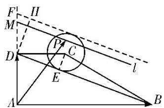

text_image

Geometric diagram with labeled points, lines, and a circle, likely from a math problem or proof.

(5)如图，在平行四边形ABCD中，M，N为CD的三等分点，S为AM与BN的交点，P为边AB上一动点，Q 为三角形 SMN 内一点 (含边界)，若 $\overrightarrow{PQ}=x\overrightarrow{AM}+y\overrightarrow{BN}(x,\ y\in\mathbf{R})$ ，则 $x+y$ 的取值范围是 \_\_\_\_.

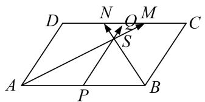

text_image

D
N
Q
M
C
S
A
P
B

答案 $[\frac{3}{4}, 1]$ 解析 如图，作 $\overrightarrow{PE} = \overrightarrow{BN}$ ， $\overrightarrow{PF} = \overrightarrow{AM}$ ，过 $S$ 直线 $MN$ 的平行线，由等和线定理知， $(x + y)_{max} = 1$ ， $(x + y)_{min} = \frac{3}{4}$ .

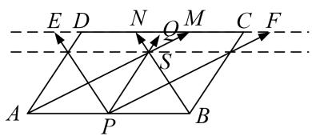

text_image

E D N O M C F
A P B

(6)如图，圆 $O$ 是边长为 $2\sqrt{3}$ 的等边三角形 $ABC$ 的内切圆，其与 $BC$ 边相切于点 $D$ ，点 $M$ 为圆上任意一点， $\overrightarrow{BM} = x\overrightarrow{BA} +y\overrightarrow{BD}(x,y\in \mathbf{R})$ ，则 $2x + y$ 的最大值为（）

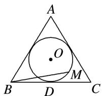

A. $\sqrt{2}$

B. $\sqrt{3}$

C. 2

D. $2 \sqrt{2}$

答案 C 解析 方法一 如图，连接 DA，以 D 点为原点，BC 所在直线为 x 轴，DA 所在直线为 y 轴，建立如图所示的平面直角坐标系．设内切圆的半径为 r，则圆心为坐标 $(0, r)$ ，

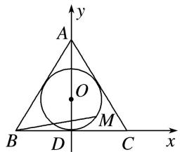

text_image

A
y
O
M
B
D
C
x

根据三角形面积公式，得 $\frac{1}{2} \times l_{\triangle ABC} \times r = \frac{1}{2} \times AB \times AC \times \sin 60^\circ (l_{\triangle ABC}$ 为 $\triangle ABC$ 的周长)，解得 $r = 1$ 。易得 $B(-\sqrt{3}, 0)$ ， $C(\sqrt{3}, 0)$ ， $A(0, 3)$ ， $D(0, 0)$ ，设 $M(\cos \theta, 1 + \sin \theta)$ ， $\theta \in [0, 2\pi)$ ，则 $\overrightarrow{BM} = (\cos \theta + \sqrt{3}, 1 + \sin \theta)$ ， $\overrightarrow{BA} = (\sqrt{3}, 3)$ ， $\overrightarrow{BD} = (\sqrt{3}, 0)$ ，故 $B\overrightarrow{M} = (\cos \theta + \sqrt{3}, 1 + \sin \theta) = (\sqrt{3}x + \sqrt{3}y, 3x)$ ，故 $\left\{ \begin{array}{l} \cos \theta = \sqrt{3}x + \sqrt{3}y - \sqrt{3}, \\ \sin \theta = 3x - 1, \end{array} \right.$ 则 $\left\{ \begin{array}{l} x = \frac{1 + \sin \theta}{3}, \\ y = \frac{\sqrt{3}\cos \theta}{3} - \frac{\sin \theta}{3} + \frac{2}{3}, \end{array} \right.$ 所以 $2x + y = \frac{\sqrt{3}\cos \theta}{3} + \frac{\sin \theta}{3} + \frac{4}{3} = \frac{2}{3}\sin\left[\theta + \frac{\pi}{3}\right] + \frac{4}{3} \leq 2$ 。当 $\theta = \frac{\pi}{6}$ 时等号成立。故 $2x + y$ 的最大值为 2。

方法二 因为 $\overrightarrow{BM}=x\overrightarrow{BA}+y\overrightarrow{BD}$ ，所以 $|\overrightarrow{BM}|^{2}=3(4x^{2}+2xy+y^{2})=3[(2x+y)^{2}-2xy]$ 。由题意知， $x\geq0,\quad y\geq0$ ， $|\overrightarrow{BM}|$ 的最大值为 $\sqrt{(2\sqrt{3})^{2}-(\sqrt{3})^{2}}=3$ ，又 $\frac{(2x+y)^{2}}{4}\geq2xy$ ，即 $\frac{-(2x+y)^{2}}{4}\leq-2xy$ ，所以 $3\times\frac{3}{4}(2x+y)^{2}\leq9$ ，得 $2x+y\leq2$ ，当且仅当2x=y=1时取等号。

等和线法 $\overrightarrow{BM}=x\overrightarrow{BA}+y\overrightarrow{BD}=2x(\frac{1}{2}\overrightarrow{BA})+y\overrightarrow{BD}=2x\overrightarrow{BE}+y\overrightarrow{BD}$ ，作出值1为的等和线DE，AC是过圆上的

点最远的等和线，设 $2x + y = k$ ，则 $k = \frac{|NB|}{|PB|} = 2$ 。∴ $2x + y$ 取得最大值 2。故选 C.

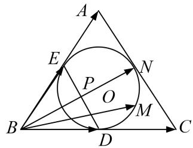

text_image

A
E
P
O
N
B
D
M
C

(7) 如图所示, $A$ , $B$ , $C$ 是圆 $O$ 上的三点, 线段 $CO$ 的延长线与 $BA$ 的延长线交于圆 $O$ 外的一点 $D$ , 若 $\overrightarrow{OC} = m\overrightarrow{OA} + n\overrightarrow{OB}$ , 则 $m + n$ 的取值范围是 \_\_\_\_.

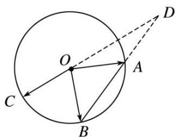

text_image

Geometric diagram showing a circle with center O, points A and B on circumference, and auxiliary lines from center to point D.

答案 $(-1,0)$ 解析 通法 由题意得， $\overrightarrow{OC}=k\overrightarrow{OD}(k<0)$ ，又 $|k|=\frac{|\overrightarrow{OC}|}{|\overrightarrow{OD}|}<1,\therefore-1<k<0.$ 又 $\because B, A,D$ 三点共线， $\therefore\overrightarrow{OD}=\lambda\overrightarrow{OA}+(1-\lambda)\overrightarrow{OB},\therefore m\overrightarrow{OA}+n\overrightarrow{OB}=k\lambda\overrightarrow{OA}+k(1-\lambda)\overrightarrow{OB},\therefore m=k\lambda,n=k(1-\lambda),\therefore m+n=k,$ 从而 $m+n\in(-1,0)$ .

等和线法 如图，作 $\overrightarrow{OA}$ ， $\overrightarrow{OB}$ 的相反向量 $\overrightarrow{OA_1}, \overrightarrow{OB_1}$ ，则 $AB \parallel A_1B_1$ ，过 $O$ 作直线 $l \parallel AB$ ，则直线 $l, A_1B_1$ 分别为以 $\overrightarrow{OA}$ ， $\overrightarrow{OB}$ 为基底的值为 $0, -1$ 的等和线，由题意线段 $CO$ 的延长线与 $BA$ 的延长线交于圆 $O$ 外的一点 $D$ ，所以点 $C$ 在直线 $l$ 与直线 $A_1B_1$ 之间，所以 $m + n \in (-1, 0)$ .

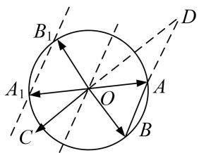

text_image

B₁
A₁
O
A
C
B
D

(8)已知点 O 为△ABC 的边 AB 的中点，D 为边 BC 的三等分点，DC=2DB，P 为△ADC 内(包括边界)任一点，若 $\overrightarrow{OP}=x\overrightarrow{OB}+y\overrightarrow{OD}$ ，则 x-2y 的取值范围为 \_\_\_\_.

答案 $[-8, -1]$ 解析 等和线法 如图，延长 $DO$ 至点 $E$ ，使 $DO = 2OE$ ，则 $\overrightarrow{OE} = -\frac{1}{2}\overrightarrow{OD}$ ，则 $\overrightarrow{OP} = x\overrightarrow{OB} + y\overrightarrow{OD} = x\overrightarrow{OB} + (-2y)\overrightarrow{OE}$ ，令 $z = -2y$ ，则 $x - 2y = x + z$ ， $\overrightarrow{OP} = x\overrightarrow{OB} + z\overrightarrow{OE}$ ，设过点 $A$ ， $C$ ， $P$ 与 $BE$ 平行的直线分别为为 $l_{1}$ ， $l_{2}$ ， $l$ ，设 $l$ ， $l_{2}$ 交线段 $OD$ 延长线于点 $M$ ， $H$ ， $l_{1}$ 交线段 $OD$ 于点 $K$ ，令 $x + z = t$ ，由图形知， $t = -\frac{OM}{OE}$ “等和线” $l$ 可从 $l_{1}$ 的位置平移至 $l_{2}$ 的位置，由平面几何知识可知 $\triangle OBE \cong \triangle OAK$ ， $\triangle DBE \sim \triangle DCH$ ，所以 $\frac{OE}{OK} = \frac{OB}{OA} = 1$ ， $\frac{BD}{CD} = \frac{DE}{DH} = \frac{3OE}{DH} = \frac{1}{2}$ ，所以 $1 = \frac{OK}{OE} \leq \frac{OM}{OE} \leq \frac{OH}{OE} = \frac{OD + DH}{OE} = \frac{2OE + 6OE}{OE} = 8$ ，则 $-8 \leq t \leq -1$ ，故 $x - 2y$ 的取值范围为[-8，-1].

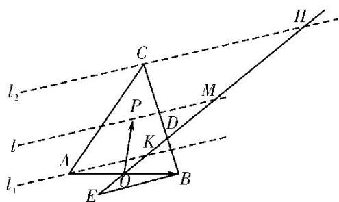

text_image

l₂
C
P
M
A
K
D
E
O
B
H
l₁

(9)如图，在边长为1的正方形ABCD中，E为AB的中点，P为以A为圆心，AB为半径的圆弧(在正方形内，包括边界点)上的任意一点，若向量 $\overrightarrow{AC}=\lambda\overrightarrow{DE}+\mu\overrightarrow{AP}$ ，则 $\lambda+\mu$ 的最小值为\_\_\_\_.

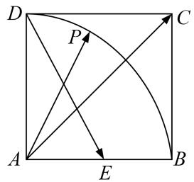

text_image

D
P
C
A
E
B

答案 $\frac{1}{2}$ 解析 通法 以 $A$ 为原点，以 $AB$ 所在的直线为 $x$ 轴， $AD$ 所在的直线为 $y$ 轴建立如图所示的平面直角坐标系，则 $A(0,0), B(1,0), E\left(\frac{1}{2},0\right), C(1,1), D(0,1)$ . 设 $P(\cos \theta, \sin \theta), \therefore \overrightarrow{AC} = (1,1), \overrightarrow{AP} = (\cos \theta, \sin \theta), \overrightarrow{DE} = \left(\frac{1}{2}, -1\right), \because \overrightarrow{AC} = \lambda \left(\frac{1}{2}, -1\right) + \mu (\cos \theta, \sin \theta) = \left(\frac{\lambda}{2} + \mu \cos \theta, -\lambda + \mu \sin \theta\right) = (1,1)$ ,

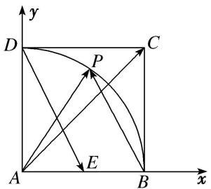

text_image

y
D
P
C
A
E
B
x

$$
\therefore \left\{ \begin{array}{l} \frac {\lambda}{2} + \mu \cos \theta = 1, \\ - \lambda + \mu \sin \theta = 1, \end{array} \right. \quad \therefore \left\{ \begin{array}{l} \lambda = \frac {2 \sin \theta - 2 \cos \theta}{2 \cos \theta + \sin \theta}, \\ \mu = \frac {3}{2 \cos \theta + \sin \theta}, \end{array} \right. \quad \therefore \lambda + \mu = \frac {3 + 2 \sin \theta - 2 \cos \theta}{2 \cos \theta + \sin \theta} = - 1 + \frac {3 \sin \theta + 3}{2 \cos \theta + \sin \theta}.
$$

$\therefore (\lambda + \mu)' = \frac{6 + 6\sin \theta - 3\cos \theta}{(2\cos \theta + \sin \theta)^2} > 0$ ，故 $\lambda + \mu$ 在 $\left[0, \frac{\pi}{2}\right]$ 上是增函数， $\therefore$ 当 $\theta = 0$ ，即 $\cos \theta = 1$ 时， $\lambda + \mu$ 取最小值为 $\frac{3 + 0 - 2}{2 + 0} = \frac{1}{2}$ .

等和线法 由题意，作 $\overrightarrow{AK} = \overrightarrow{DE}$ ，设 $\overrightarrow{AD} = \lambda \overrightarrow{AC}$ ，直线 $AC$ 与 $PK$ 直线相交于点 $D$ ，则有 $\overrightarrow{AD} = \lambda x\overrightarrow{AK} + \lambda y\overrightarrow{AP}$ ，由等和线定理， $\lambda x + \lambda y = 1$ ，从而 $x + y = \frac{1}{\lambda}$ ，当点 $P$ 与 $B$ 点重合时，如图， $\lambda_{max} = 2$ ，此时， $(x + y)_{max} = \frac{1}{2}$ .

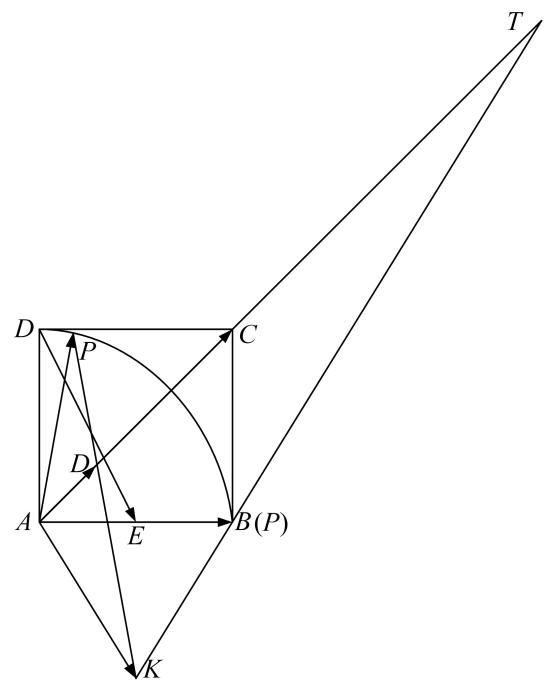

text_image

T
D
P
C
D
A
E
B(P)
K

(10) (2013·安徽)在平面直角坐标系中，O 是坐标原点，两定点 A，B 满足 $\left|\overrightarrow{OA}\right|=\left|\overrightarrow{OB}\right|=\overrightarrow{OA}\cdot\overrightarrow{OB}=2$ ，则点集 $\{P\mid\overrightarrow{OP}=\lambda\overrightarrow{OA}+\mu\overrightarrow{OB},\quad|\lambda|+|\mu|\leq1,\quad\lambda,\quad\mu\in\mathbf{R}\}$ 所表示的区域的面积是()

A. $2 \sqrt{2}$

B. $2 \sqrt{3}$

C. $4\sqrt{2}$

D. $4 \sqrt{3}$

答案 D 解析 等和线法 如图，分别作 $\overrightarrow{OC} = -\overrightarrow{OA}$ ， $\overrightarrow{OD} = -\overrightarrow{OB}$ 。当 $\lambda \geq 0$ ， $\mu \geq 0$ 时， $\{P|\overrightarrow{OP} = \lambda\overrightarrow{OA} + \mu\overrightarrow{OB}, |\lambda| + |\mu| \leq 1, \lambda, \mu \in R\} = \{P|\overrightarrow{OP} = |\lambda|\overrightarrow{OA} + |\mu|\overrightarrow{OB}, |\lambda| + |\mu| \leq 1, \lambda, \mu \in R\}$ ，对应区域 1；当 $\lambda \geq 0$ ， $\mu < 0$ 时， $\{P|\overrightarrow{OP} = \lambda\overrightarrow{OA} + \mu\overrightarrow{OB}, |\lambda| + |\mu| \leq 1, \lambda, \mu \in R\} = \{P|\overrightarrow{OP} = |\lambda|\overrightarrow{OA} + |\mu|\overrightarrow{OD}, |\lambda| + |\mu| \leq 1, \lambda, \mu \in R\}$ ，对应区域 2；

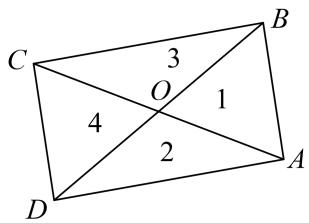

text_image

C
3
O
1
4
2
D
A
B

当 $\lambda < 0$ ， $\mu \geq 0$ 时， $\{P|\overrightarrow{OP} = \lambda \overrightarrow{OA} +\mu \overrightarrow{OB}, |\lambda | + |\mu |\leq 1,\lambda ,\mu \in \mathbf{R}\} = \{P|\overrightarrow{OP} = |\lambda |\overrightarrow{OC} +|\mu |\overrightarrow{OB}, |\lambda | + |\mu |\leq 1,\lambda ,\mu$ $\in \mathbf{R}\}$ ，对应区域3；当 $\lambda < 0$ ， $\mu < 0$ 时， $\{P|\overrightarrow{OP} = \lambda \overrightarrow{OA} +\mu \overrightarrow{OB}, |\lambda | + |\mu |\leq 1,\lambda ,\mu \in \mathbf{R}\} = \{P|\overrightarrow{OP} = |\lambda |\overrightarrow{OC} +|\mu |\overrightarrow{OD}, |\lambda |+\mid \mu |\leq 1,\lambda ,\mu \in \mathbf{R}\}$ ，对应区域4．综上所述可得，点集 $\{P|\overrightarrow{OP} = \lambda \overrightarrow{OA} +\mu \overrightarrow{OB}, |\lambda | + |\mu |\leq 1,\lambda ,\mu \in \mathbf{R}\}$ 所表示的区域即图中的矩形区域，其面积 $S = 2\times 2\sqrt{3} = 4\sqrt{3}$ 故选D.

# 【对点训练】

1. 如图, $\triangle BCD$ 与 $\triangle ABC$ 的面积之比为 2, 点 $P$ 是区域 $ABCD$ 内任意一点(含边界), 且 $\overrightarrow{AP} = \lambda \overrightarrow{AB} + \mu \overrightarrow{AC}$ , 则 $\lambda + \mu$ 的取值范围为 ( )

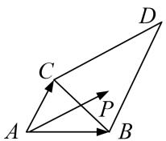

A. $[0, 1]$

B. $[0, 2]$

C. $[0, 3]$

D. $[0, 4]$

1. 答案 解析 等和线法 如图， $(\lambda + \mu)_{\min} = 0$ ， $(\lambda + \mu)_{\max} = 3$ 。故选 C.

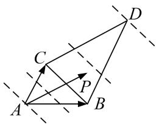

text_image

Geometric diagram with labeled points A, B, C, D and vectors P, showing a 3D-like figure with dashed auxiliary lines.

2. 在直角梯形 $ABCD$ 中, $\angle A = 90^{\circ}$ , $\angle B = 30^{\circ}$ , $AB = 2\sqrt{3}$ , $BC = 2$ , 点 $E$ 在线段 $CD$ 上, 若 $\overrightarrow{AE} = \overrightarrow{AD} + \mu \overrightarrow{AB}$ , 则 $\mu$ 的取值范围是 \_\_\_\_.

2. 答案 $\left[0, \frac{1}{2}\right]$ 解析 通法 由题意可求得 $AD = 1$ ， $CD = \sqrt{3}$ ，所以 $\overrightarrow{AB} = 2\overrightarrow{DC}$ 。∵点 $E$ 在线段 $CD$ 上， $\therefore \overrightarrow{DE} = \lambda \overrightarrow{DC} (0 \leq \lambda \leq 1)$ 。∵ $\overrightarrow{AE} = \overrightarrow{AD} + \overrightarrow{DE}$ ，又 $\overrightarrow{AE} = \overrightarrow{AD} + \mu \overrightarrow{AB} = \overrightarrow{AD} + 2\mu \overrightarrow{DC} = \overrightarrow{AD} + \frac{2\mu}{\lambda} \overrightarrow{DE}$ ， $\therefore \frac{2\mu}{\lambda} = 1$ ，即 $\mu = \frac{\lambda}{2}$ 。∵ $0 \leq \lambda \leq 1$ ， $\therefore 0 \leq \mu \leq \frac{1}{2}$ ，即 $\mu$ 的取值范围是 $\left[0, \frac{1}{2}\right]$ .

等和线法 如图， $(1+\mu)_{\min}=1,\quad\mu_{\min}=0.\quad(1+\mu)_{\max}=\frac{3}{2},\quad\mu_{\max}=\frac{1}{2}.$

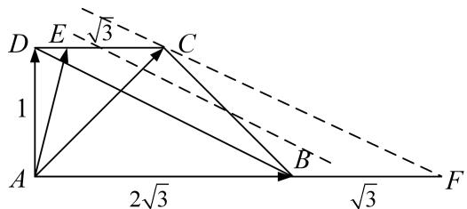

text_image

D E √3 C
1
A 2√3 B √3 F

3. 如图, 四边形 $OABC$ 是边长为 1 的正方形, 点 $D$ 在 $OA$ 的延长线上, 且 $OD = 2$ , 点 $P$ 是 $\triangle BCD$ 内任意一点 (含边界), 设 $\overrightarrow{OP} = \lambda \overrightarrow{OC} + \mu \overrightarrow{OD}$ , 则 $\lambda + \mu$ 的取值范围为 \_\_\_\_.

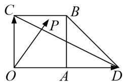

text_image

C
B
P
O
A
D

3. 答案 $[1, \frac{3}{2}]$ 解析 等和线法 如图， $(\lambda + \mu)_{\min} = 1$ ， $(\lambda + \mu)_{\max} = \frac{3}{2}$ .

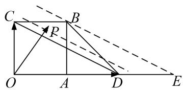

text_image

Geometric diagram with labeled points and lines, including triangle ABC and auxiliary constructions

4. 给定两个长度为 1 的平面向量 $\overrightarrow{OA}$ 和 $\overrightarrow{OB}$ ，它们的夹角为 $90^{\circ}$ ，如图所示，点 $C$ 在以 $O$ 为圆心的圆弧 $\widehat{AB}$ 上运动，若 $\overrightarrow{OC} = x\overrightarrow{OA} + y\overrightarrow{OB}$ ，其中 $x, y \in \mathbf{R}$ ，则 $x + y$ 的最大值是（）

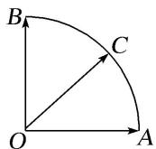

A. 1

B. $\sqrt{2}$

C. $\sqrt{3}$

D. 2

4. 答案 B 解析 通法 因为点 C 在以 O 为圆心的圆弧 $\widehat{AB}$ 上，所以 $|\overrightarrow{OC}|^{2}=|x\overrightarrow{OA}+y\overrightarrow{OB}|^{2}=x^{2}+y^{2}+2xy\overrightarrow{OA}\cdot\overrightarrow{OB}=x^{2}+y^{2},\therefore x^{2}+y^{2}=1$ ，则 $2xy\leq x^{2}+y^{2}=1$ 。又 $(x+y)^{2}=x^{2}+y^{2}+2xy\leq2$ ，故 $x+y$ 的最大值为 $\sqrt{2}$ .

等和线法 确定值为 1 的等和线 AB，过动点 C 作等和线，设 $x + y = k$ ，则 $k = \frac{|CO|}{|PO|}$ 。由图易知，当等和线与圆相切时，k 取最大值，此时 $\frac{|MO|}{|NO|} = \sqrt{2}$ ，∴ $x + y$ 取得最大值 $\sqrt{2}$ 。故选 B.

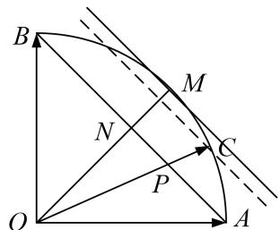

text_image

B
M
N
C
P
O
A

5. 如图, 在边长为 2 的正六边形 $ABCDEF$ 中, 动圆 $Q$ 半径为 1 , 圆心在线段 $CD$ (含端点)上运动, $P$ 是圆上及其内部的动点, 设 $\overrightarrow{AP} = m\overrightarrow{AB} + n\overrightarrow{AF}(m, n \in \mathbf{R})$ , 则 $m + n$ 的取值范围是 \_\_\_\_.

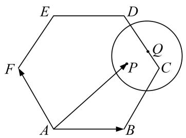

text_image

E
D
F
P
Q
C
A
B

5. 答案 [2, 5] 解析 等和线法 如图1时， $m + n$ 的值最小且 $m + n = \frac{AN}{AB} = 2$ ，如图2时， $m + n$ 的值最大且 $m + n = \frac{AM}{AB} = 5$ ，

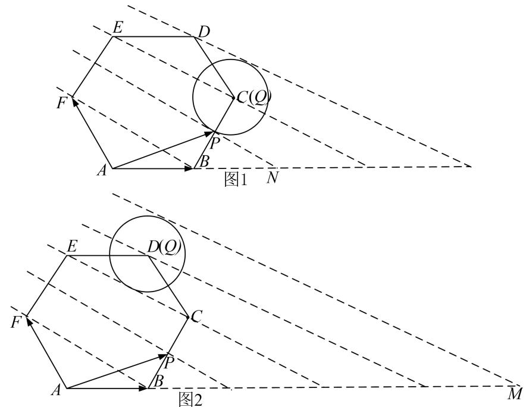

text_image

图1 N
图2

6. 如图, 已知点 $P$ 为等边三角形 $ABC$ 外接圆上一点, 点 $Q$ 是该三角形内切圆上的一点, 若 $\overrightarrow{AP} = x_1\overrightarrow{AB} + y_1\overrightarrow{AC}$ , $\overrightarrow{AQ} = x_2\overrightarrow{AB} + y_2\overrightarrow{AC}$ , 则 $(2x_1 - x_2) + (2y_1 - y_2)$ 的最大值为 \_\_\_\_.

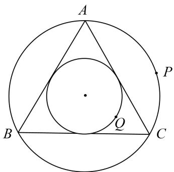

text_image

A
P
B
Q
C

6. 答案 $\frac{7}{3}$ 解析 等和线法 由等和线定理知当点 $P, Q$ 分别在如图所示的位置时 $x_{1} + y_{1}$ 取最大值， $x_{2} + y_{2}$ 取最小值，且 $x_{1} + y_{1}$ 的最大值为 $\frac{|AP|}{|AM|} = \frac{4}{3}, x_{2} + y_{2}$ 的最小值为 $\frac{|AQ|}{|AM|} = \frac{1}{3}$ . 故 $|(2x_{1} - x_{2}) + (2y_{1} - y_{2})| = |(2(x_{1} + y_{1}) - (x_{2} + y_{2})| \leq \frac{4}{3} + \frac{1}{3} = \frac{7}{3}$ .

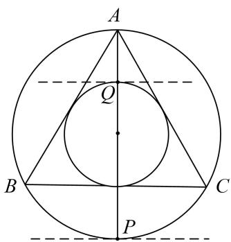

text_image

A
Q
B
C
P

7. 如图, 在扇形 $OAB$ 中, $\angle AOB = \frac{\pi}{3}$ , $C$ 为弧 $AB$ 上的动点, 若 $\overrightarrow{OC} = x\overrightarrow{OA} + y\overrightarrow{OB}$ , 则 $x + 3y$ 的取值范围是 \_\_\_\_.

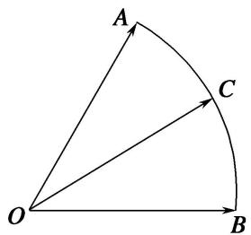

text_image

A
C
O
B

7. 答案 [1, 3] 解析 等和线法 依题意， $\overrightarrow{OC} = x\overrightarrow{OA} + 3y\left(\frac{\overrightarrow{OB}}{3}\right)$ ，如图，作 $\overrightarrow{OB'} = \frac{\overrightarrow{OB}}{3}$ ，重新调整基底为 $\overrightarrow{OA}$ ， $\overrightarrow{OB'}$ ，设 $k = x + 3y$ ，显然，当 $C$ 在 $A$ 点时，经过 $k = 1$ 的等和线，当 $C$ 在 $B$ 点时，经过 $k = 3$ 的等和线，这两条线分别是最近与最远的等和线，所以 $x + 3y$ 的取值范围是[1, 3].

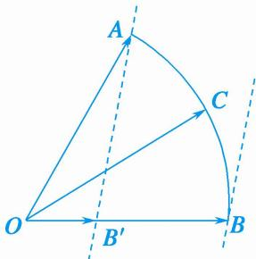

text_image

A
C
O
B'
B

8. 如图, $G$ 为 $\triangle ADE$ 的重心, $P$ 为 $\triangle GDE$ 内任一点(包括边界), $B$ , $C$ 均为 $AD$ , $AE$ 上的三等分点(靠近点 $A$ ), $\overrightarrow{AP} = \alpha \overrightarrow{AB} + \beta \overrightarrow{AC}$ , 则 $\alpha + \frac{1}{2} \beta$ 的取值范围是 \_\_\_\_.

text_image

A
B
C
G
P
D
E

8. 答案 $\left[\frac{3}{2}, 3\right]$ 解析 等和线法 如图, 在线段 $AE$ 上取点 $F$ , 使 $AC = CF$ , 则 $\overrightarrow{AP} = \alpha \overrightarrow{AB} + \frac{1}{2} \beta \overrightarrow{AF}$ , 设 $\frac{1}{2} \beta = \gamma$ , 则 $\overrightarrow{AP} = \alpha \overrightarrow{AB} + \gamma \overrightarrow{AF}$ , 连接 $BF$ , 延长 $EG$ 交 $AD$ 于点 $H$ , 因为 $G$ 为 $\triangle ADE$ 的重心, 所以 $H$ 为 $AD$ 的中点, 又 $B$ , $C$ 均为 $AD$ , $AE$ 上靠近点 $A$ 的三等分点, 所以 $\frac{AF}{FE} = \frac{AB}{BH} = 2$ , 所以 $BF // HE$ , 过点 $P$ 作直线 $l // HE$ 交 $AD$ 于点 $M$ ,

text_image

A
B
C
H
M
G
F
P
D
E
l

设 $\alpha + \gamma = t$ ，则 $t = \frac{AM}{AB}$ ，由图形知，“等值线” $l$ 可从直线 $HE$ 的位置平移到过点 $D$ 的位置，由平面几何知识可知 $\frac{3}{2} = \frac{AH}{AB} \leqslant \frac{AM}{AB} \leqslant \frac{AD}{AB} = 3$ ，故 $\frac{3}{2} \leqslant t \leqslant 3$ ，即 $\alpha + \gamma \in \left[\frac{3}{2}, 3\right]$ ，故 $\alpha + \frac{1}{2}\beta$ 的取值范围是 $\left[\frac{3}{2}, 3\right]$ .

9. 给定两个长度为 1 的平面向量 $\overrightarrow{OA}$ 和 $\overrightarrow{OB}$ ，它们的夹角为 $90^{\circ}$ ，如图所示，点 $C$ 在以 $O$ 为圆心的圆弧 $AB$ 上运动。若 $\overrightarrow{OC} = x\overrightarrow{OA} + y\overrightarrow{OB}$ 。其中 $x, y \in \mathbf{R}$ ，则 $2x + 3y$ 的最大值是（）

A. $\sqrt{13}$

B. 3

C. $\sqrt{5}$

D. 5

9. 答案 A 解析 通法 ∵点 C 在以 O 为圆心的圆弧 AB 上运动，∴ 可以设圆的参数方程 $x = \cos \theta$ ， $y = \sin \theta$ ， $\theta \in [0^\circ, 90^\circ]$ ，∴ $2x + 3y = 2\cos \theta + 3\sin \theta = \sqrt{13}\sin(\theta + \varphi)$ ，其中 $\cos \varphi = \frac{3}{\sqrt{13}}$ ， $\sin \varphi = \frac{2}{\sqrt{13}}$ ，∴ $3x + 5y \leqslant \sqrt{13}$ ，当且仅当 $\sin(\theta + \varphi) = 1$ 时取等号。∴ $x + y$ 的最大值是 $\sqrt{13}$ ，当三角函数取到 1 时成立。故选 A.

等和线法 $\overrightarrow{OC}=x\overrightarrow{OA}+y\overrightarrow{OB}=2x(\frac{1}{2}\overrightarrow{OA})+3y(\frac{1}{3}\overrightarrow{OB})=2x\overrightarrow{OE}+3y\overrightarrow{OF},\quad2x+3y=k,$ 则 $k=\frac{|OD|}{|OM|}=\sqrt{13}.$

text_image

Geometric diagram with labeled points and lines, including a semicircle and intersecting curves

10. 平行四边形 $ABCD$ 中, $AB = 3$ , $AD = 2$ , $\angle BAD = 120^{\circ}$ , $P$ 是平行四边形 $ABCD$ 内一点, 且 $AP = 1$ ,

若 $\overrightarrow{AP}=x\overrightarrow{AB}+y\overrightarrow{AD}$ ，则 $3x+2y$ 的最大值为 \_\_\_\_.

10. 答案 2 解析 通法 $|\overrightarrow{AP}|^2 = (x\overrightarrow{AB} + y\overrightarrow{AD})^2 = 9x^2 + 4y^2 + 2xy \times 3 \times 2 \times \left(-\frac{1}{2}\right) = (3x + 2y)^2 - 3(3x) \cdot (2y) \geq (3x + 2y)^2 - \frac{3}{4}(3x + 2y)^2 = \frac{1}{4}(3x + 2y)^2$ 。又 $|\overrightarrow{AP}|^2 = 1$ ，因此 $\frac{1}{4}(3x + 2y)^2 \leq 1$ ，故 $3x + 2y \leq 2$ ，当且仅当 $3x = 2y$ ，即 $x = \frac{1}{3}$ ， $y = \frac{1}{2}$ 时， $3x + 2y$ 取得最大值 2.

等和线法 可转化为例 2(2).

text_image

D
1
C
N
1
A
P
1 M 2
B

11. 在矩形 $ABCD$ 中， $AB = \sqrt{5}$ ， $BC = \sqrt{3}$ ， $P$ 为矩形内一点，且 $AP = \frac{\sqrt{5}}{2}$ ，若 $\overrightarrow{AP} = \lambda \overrightarrow{AB} + \mu \overrightarrow{AD} (\lambda, \mu \in \mathbf{R})$ 则 $\sqrt{5}\lambda + \sqrt{3}\mu$ 的最大值为 \_\_\_\_.

11. 答案 $\frac{\sqrt{10}}{2}$ 解析 通法 建立如图所示的平面直角坐标系，设 $P(x, y), B(\sqrt{5}, 0), C(\sqrt{5}, \sqrt{3}), D(0, \sqrt{3})$ . $\because AP = \frac{\sqrt{5}}{2}, \therefore x^2 + y^2 = \frac{5}{4}$ . 点 $P$ 满足的约束条件为 $\left\{ \begin{array}{l} 0 \leq x \leq \sqrt{5}, \\ 0 \leq y \leq \sqrt{3}, \\ x^2 + y^2 = \frac{5}{4}, \end{array} \right.$ $\because \overrightarrow{AP} = \lambda \overrightarrow{AB} + \mu \overrightarrow{AD} (\lambda, \mu \in \mathbf{R})$

$\therefore (x, y) = \lambda (\sqrt{5}, 0) + \mu (0, \sqrt{3}), \therefore \left\{ \begin{array}{l} x = \sqrt{5}\lambda, \\ y = \sqrt{3}\mu, \end{array} \right. \therefore x + y = \sqrt{5}\lambda + \sqrt{3}\mu. \because x + y \leq \sqrt{2(x^2 + y^2)} = \sqrt{2\times\frac{5}{4}} = \frac{\sqrt{10}}{2},$ 当且仅当 $x = y$ 时取等号， $\therefore \sqrt{5}\lambda + \sqrt{3}\mu$ 的最大值为 $\frac{\sqrt{10}}{2}$ .

text_image

y
D	C
P
A	B x

等和线法 $\overrightarrow{AP} = \lambda \overrightarrow{AB} +\mu \overrightarrow{AD} = \sqrt{5}\lambda (\frac{1}{\sqrt{5}}\overrightarrow{AB}) + \sqrt{3}\mu (\frac{1}{\sqrt{3}}\overrightarrow{AD}) = \sqrt{5}\lambda \overrightarrow{AM} +\sqrt{3}\mu \overrightarrow{AN},\sqrt{5}\lambda +\sqrt{3}\mu = k$ ，则 $k = \frac{\frac{\sqrt{5}}{2}}{\frac{\sqrt{2}}{2}}$ $= \frac{\sqrt{10}}{2}.$

text_image

D
C
N
P
A
M
B

12. 如图，在扇形 OAB 中， $\angle AOB=\frac{\pi}{3}$ ，C 为弧 $\widehat{AB}$ 上的一个动点，若 $\overrightarrow{OC}=x\overrightarrow{OA}+y\overrightarrow{OB}$ ，则 x-y 的取值

范围是\_\_\_\_。

text_image

A
O
B
C

12. 答案 $[-1, 1]$ 解析 通法 设半径为 1，由已知可设 $OB$ 为 $x$ 轴的正半轴， $O$ 为坐标原点，建立直角坐标系，其中 $A\left(\frac{1}{2}, \frac{\sqrt{3}}{2}\right)$ ； $B(1,0)$ ； $C(\cos \theta, \sin \theta)$ （其中 $\angle BOC = \theta (0 \leqslant \theta \leqslant \frac{\pi}{3})$ ，有若 $\overrightarrow{OC} = x\overrightarrow{OA} + y\overrightarrow{OB} = (\cos \theta, \sin \theta) = x\left(\frac{1}{2}, \frac{\sqrt{3}}{2}\right) + y(1, 0)$ ；整理得： $\frac{1}{2} x + y = \cos \theta$ ； $\frac{\sqrt{3}}{2} x = \sin \theta$ ，解得 $x = \frac{2\sin \theta}{\sqrt{3}}$ ， $y = \cos \theta - \frac{\sin \theta}{\sqrt{3}}$ ，则 $x - y = \frac{2\sin \theta}{\sqrt{3}} - \cos \theta + \frac{\sin \theta}{\sqrt{3}} = \sqrt{3} \sin \theta - \cos \theta = 2\sin (\theta - \frac{\pi}{6})$ ，其中 $(0 \leqslant \theta \leqslant \frac{\pi}{3})$ ；易知 $x - y = \frac{2\sin \theta}{\sqrt{3}} - \cos \theta + \frac{\sin \theta}{\sqrt{3}} = \sqrt{3} \sin \theta - \cos \theta = 2\sin (\theta - \frac{\pi}{6})$ ，为增函数，由单调性易得其值域为 $[-1, 1]$ ，故答案为 $[-1, 1]$ .

text_image

y
A
O
C
B
x

等和线法

text_image

A
B₁ O C
B

13. 如图，在直角梯形 $ABCD$ 中， $AB \perp AD$ ， $AB // DC$ ， $AB = 2$ ， $AD = DC = 1$ ，图中圆弧所在圆的圆心为点 $C$ ，半径为 $\frac{1}{2}$ ，且点 $P$ 在图中阴影部分（包括边界）运动。若 $\overrightarrow{AP} = x\overrightarrow{AB} + y\overrightarrow{BC}$ ，其中 $x, y \in \mathbf{R}$ ，则 $4x - y$ 的最大值为（ ）

text_image

D
P
C
A
B

A. $3 - \frac{\sqrt{2}}{4}$

B. $3 + \frac{\sqrt{5}}{2}$

C. 2

D. $3 + \frac{\sqrt{17}}{2}$

13. 答案 B 解析 以 A 为坐标原点，AB 为 x 轴，AD 为 y 轴建立平面直角坐标系，则 $A(0,0)$ ， $D(0,1)$ ， $C(1,1)$ ， $B(2,0)$ ，直线 BD 的方程为 $x + 2y - 2 = 0$ ，C 到 BD 的距离 $d = \frac{\sqrt{5}}{5}$ ，∴ 圆弧以点 C 为圆心的圆方程为 $(x - 1)^{2} + (y - 1)^{2} = \frac{1}{4}$ ，设 $P(m,n)$ 则 $\overrightarrow{AP} = (m,n)$ ， $\overrightarrow{AD} = (0,1)$ ， $\overrightarrow{AB} = (2,0)$ ， $\overrightarrow{BC} = (-1,1)$ ，若 $\overrightarrow{AP} = x\overrightarrow{AB} + y\overrightarrow{BC}$ ，∴ $(m, n) = (2x - y, y)$ ，∴ m = 2x - y，n = y，∵ P 在圆内或圆上，∴ $(2x - y - 1)^{2} + (y - 1)^{2} \leqslant \frac{1}{4}$ ，设 4x - y = t，则 y = 4x - t，代入上式整理得 $80x^{2} - (48t + 16)x + 8t^{2} + 7 \leqslant 0$ ，

设 $f(x) = 80x^{2} - (48t + 16)x + 8t^{2} + 7\leqslant 0$ ， $x\in [\frac{1}{2},\frac{3}{2} ]$ ，则 $\left\{ \begin{array}{l}f(\frac{1}{2}) <   0\\ f(\frac{3}{2}) <   0 \end{array} \right.$ ，解得 $2\leqslant t\leqslant 3 + \frac{\sqrt{5}}{2}$ ，故 $4x - y$ 的最大值为 $3 + \frac{\sqrt{5}}{2}$ ，故选B.

text_image

y
D
P
C
A
B
x

等和线法

14. 如图，在扇形 $OAB$ 中， $\angle AOB = \frac{\pi}{3}$ ， $C$ 为弧 $AB$ 上，且与 $A, B$ 不重合的一个动点， $\overrightarrow{OC} = x\overrightarrow{OA} + y\overrightarrow{OB}$ ，若 $u = x + \lambda y (\lambda > 0)$ 存在最大值，则 $\lambda$ 的取值范围为（）

A. $\left(\frac{1}{2},1\right)$

B. (1, 3)

C. $\left(\frac{1}{2},2\right)$

D. $\left(\frac{1}{3},3\right)$

14. 答案 C 解析 通法 以 O 为原点, OB 为 x 轴, 建立如图所示的直角坐标系, 设 $\angle COB = \theta (0 < \theta < \frac{\pi}{3})$ ,

OB = 1 ， 则 $C(\cos\theta, \sin\theta)$ ， $B(1,0)$ ， $A(\frac{1}{2}, \frac{\sqrt{3}}{2})$ ，由 $\overrightarrow{OC} = x\overrightarrow{OA} + y\overrightarrow{OB}$ ，得 $\left\{\begin{aligned}\cos\theta &= y + \frac{1}{2}x \\ \sin\theta &= \frac{\sqrt{3}}{2}x\end{aligned}\right.$

$\therefore \left\{ \begin{array}{l} x = \frac{2}{\sqrt{3}} \sin \theta \\ y = \cos \theta - \frac{\sin \theta}{\sqrt{3}} \end{array} \right., \quad \therefore u = x + \lambda y = \frac{2 - \lambda}{\sqrt{3}} \sin \theta + \lambda \cos \theta (0 < \theta < \frac{\pi}{3})$ ， $\because u = x + \lambda y (\lambda > 0)$ 存在最大值，

$\therefore u(\theta)$ 存在极值点， $\therefore u' = \frac{2 - \lambda}{\sqrt{3}}\cos \theta -\lambda \sin \theta$ 在 $\theta \in (0,\frac{\pi}{3})$ 上有零点．令 $u^{\prime} = 0$ ，则 $\tan \theta = \frac{2 - \lambda}{\sqrt{3}\lambda}$ ∴ $\theta \in (0,\frac{\pi}{3})$ ，∴ $\tan \theta = \frac{2 - \lambda}{\sqrt{3}\lambda}\in (0,\sqrt{3})$ ，∴ $\frac{1}{2} <  \lambda <  2$ ，∴ $\lambda$ 的取值范围为 $(\frac{1}{2},2)$ .故选C.

text_image

y
A
O
C
B
x

等和线法

15. 在平面直角坐标系中，O 是坐标原点，若两定点 A，B 满足 $\left|\overrightarrow{OA}\right|=\left|\overrightarrow{OB}\right|=\sqrt{2}$ ， $\overrightarrow{OA}\cdot\overrightarrow{OB}=1$ ，则点集 $\left\{P\mid\overrightarrow{OP}=\lambda\overrightarrow{OA}+\mu\overrightarrow{OB},\quad\left|\lambda\right|+\left|\mu\right|\leqslant2,\quad\lambda,\quad\mu\in\mathbf{R}\right\}$ 所表示的区域的面积是（）

A. $4 \sqrt{2}$

B. $4 \sqrt{3}$

C. $6\sqrt{2}$

D. $8 \sqrt{3}$

15. 答案 D 解析 $\because \overrightarrow{OA} \cdot \overrightarrow{OB} = \sqrt{2} \times \sqrt{2} \times \cos \angle AOB = 1, \therefore \cos \angle AOB = \frac{1}{2}$ , 即 $\angle AOB = 60^{\circ}$ . (1) 若 $\lambda > 0$ , $\mu > 0$ , 设 $\overrightarrow{OE} = 2\overrightarrow{OA}$ , $\overrightarrow{OF} = 2\overrightarrow{OB}$ , 则 $\overrightarrow{OP} = \frac{\lambda}{2}\overrightarrow{OE} + \frac{\mu}{2}\overrightarrow{OF}$ ,

text_image

E
A
P
O
B
F

$\because |\lambda| + |\mu| = \lambda + \mu \leqslant 2$ ，故当 $\lambda + \mu = 2$ 时， $E$ ， $F$ ， $P$ 三点共线，故点 $P$ 表示的区域为 $\Delta OEF$ ，此时 $S_{\Delta OEF} = \frac{1}{2} \times 2\sqrt{2} \times 2\sqrt{2} \times \sin 60^\circ = 2\sqrt{3}$ .

(2)若 $\lambda < 0$ ， $\mu >0$ ，设 $\overrightarrow{OE} = -2\overrightarrow{OA}$ ， $\overrightarrow{OF} = 2\overrightarrow{OB}$ ，则 $\overrightarrow{OP} = -\frac{\lambda}{2}\overrightarrow{OE} +\frac{\mu}{2}\overrightarrow{OF}$

text_image

A
O
B
P.
E
F

$\because |\lambda| + |\mu| = -\lambda + \mu \leqslant 2$ ，故当 $-\lambda + \mu = 2$ 时， $P$ ， $E$ ， $F$ 三点共线，故点 $P$ 表示的区域为 $\Delta OEF$ ，此时 $S_{\Delta OEF} = \frac{1}{2} \times 2\sqrt{2} \times 2\sqrt{2} \times \sin 120^\circ = 2\sqrt{3}$ 。同理可得：当 $\lambda > 0$ ， $\mu < 0$ 时， $P$ 点表示的区域面积为 $2\sqrt{3}$ ，当 $\lambda < 0$ ， $\mu < 0$ 时， $P$ 点表示的区域面积为 $2\sqrt{3}$ ，综上， $P$ 点表示的区域面积为 $2\sqrt{3} \times 4 = 8\sqrt{3}$ 。故选 D.

等和线法

