专题七　平面向量的等和线
根据平面向量基本定理，如果，为同一平面内两个不共线的向量，那么这个平面内的任意向量都可以由，唯一线性表示：＝*x*＋*y*．特殊地，如果点*C*正好在直线*AB*上，那么*x*＋*y*＝1，反之如果*x*＋*y*＝1，那么点*C*一定在直线*AB*上．于是有三点共线结论：已知，为平面内两个不共线的向量，设＝*x*＋*y*，则*A*，*B*，*C*三点共线的充要条件为*x*＋*y*＝1．

以上讨论了点*C*在直线*AB*上的特殊情况，得到了平面向量中的三点共线结论．下面讨论点*C*不在直线*AB*上的情况．
如图所示，直线<em>DE</em>∥<em>AB</em>，<em>C</em>为直线<em>DE</em>上任一点，设＝<em>x</em>＋<em>y</em>(<em>x</em>，<em>y</em>∈<strong>R</strong>)．

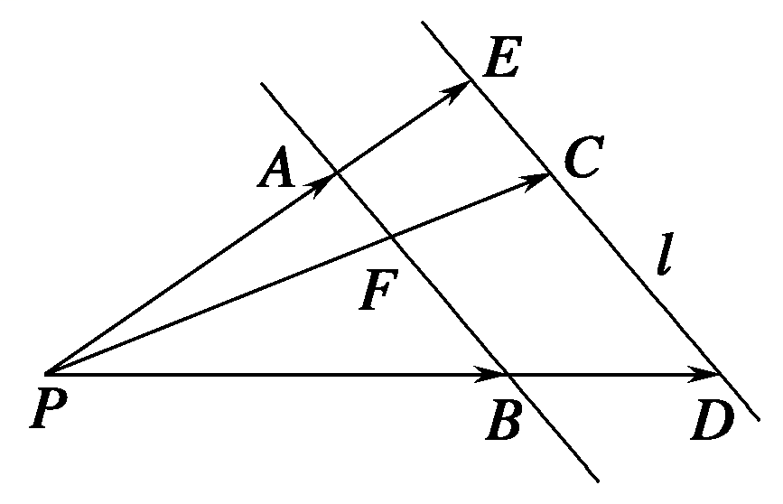

1．平面向量等和线定义  
（1）当直线*DE*经过点*P*时，容易得到*x*＋*y*＝0．  
（2）当直线<em>DE</em>不过点<em>P</em>时，直线<em>PC</em>与直线<em>AB</em>的交点记为<em>F</em>，因为点<em>F</em>在直线<em>AB</em>上，所以由三点共线结论可知，若＝<em>λ</em>＋<em>μ</em> (<em>λ</em>，<em>μ</em>∈<strong>R</strong>)，则<em>λ</em>＋<em>μ</em>＝1．由△<em>PAB</em>与△<em>PED</em>相似，知必存在一个常数<em>k</em>∈<strong>R</strong>，使得＝<em>k</em>(其中<em>k</em>＝＝＝)，则＝<em>k</em>＝<em>kλ</em>＋<em>kμ</em>．又＝<em>x</em>＋<em>y</em> (<em>x</em>，<em>y</em>∈<strong>R</strong>)，所以<em>x</em>＋<em>y</em>＝<em>kλ</em>＋<em>kμ</em>＝<em>k</em>．以上过程可逆．
在向量起点相同的前提下，所有以与两向量终点所在的直线平行的直线上的点为终点的向量，其基底的系数和为定值，这样的线，我们称之为“等和线”．

2．平面向量等和线定理

平面内一组基底，及任一向量满足：＝<em>λ</em>＋<em>μ</em> (<em>λ</em>，<em>μ</em>∈<strong>R</strong>)，若点<em>F</em>在直线<em>AB</em>上或在平行于<em>AB</em>的直线上，则<em>λ</em>＋<em>μ</em>＝<em>k</em>（定值），反之也成立，我们把直线<em>AB</em>以及与直线<em>AB</em>平行的直线称为等和线．

3．平面向量等和线性质  
（1）当等和线恰为直线*AB*时，*k*＝1；  
（2）当等和线在点*P*和直线*AB*之间时，*k*∈(0，1)；  
（3）当直线*AB*在点*P*和等和线之间时，*k*∈(1，＋∞)；  
（4）当等和线过点*P*时，*k*＝0；  
（5）若两等和线关于点*P*对称，则定值*k*互为相反数．

考点一　根据等和线求基底系数和的值

【方法总结】
根据等和线求基底系数和的步骤  
（1）确定值为1的等和线；  
（2）平移(旋转或伸缩)该线，作出满足条件的等和线；  
（3）从长度比或点的位置两个角度，计算满足条件的等和线的值．

已知点*P*是△*ABC*所在平面内一点，且＝*x*＋*y*，则有点*P*在直线*BC*上⇔*x*＋*y*＝1；点*P*与点*A*在直线*BC*异侧⇔*x*＋*y*>1，且*x*＋*y*的值随点*P*到直线*BC*的距离越远而越大；点*P*与点*A*在直线*BC*同侧⇔*x*＋*y*< 1，且*x*＋*y*的值随点*P*到直线*BC*的距离越远而越小．

平面向量共线定理的表达式中的三个向量的起点务必一致，若不一致，本着少数服从多数的原则，优先平移固定的向量；若需要研究两系数的线性关系，则需要通过变换基底向量，使得需要研究的代数式为基底的系数和．考虑到向量可以通过数乘继而将向量进行拉伸压缩反向等操作，那么理论上来说，所有的系数之间的线性关系，我们都可以通过调节基底，使得要求的表达式是两个新基底的系数和．

【例题选讲】

<strong>[例1]</strong>（1）如图，<em>A</em>，<em>B</em>分别是射线<em>OM</em>，<em>ON</em>上的点，给出下列以<em>O</em>为起点的向量：①＋2；②＋；③＋；④＋；⑤＋＋．其中终点落在阴影区域(不包括边界)内的向量的序号是\_\_\_\_\_\_\_\_(写出满足条件的所有向量的序号)．

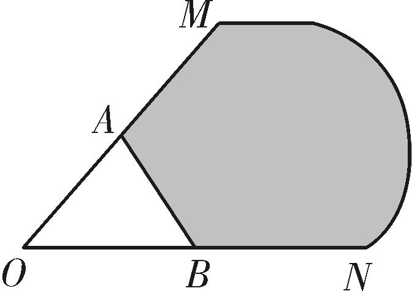
答案　①③　解析　由向量共线的充要条件可得，当点*P*在直线*AB*上时，存在唯一的一对有序实数*u*，*v*，使得＝*u*＋*v*成立，且*u*＋*v*＝1，所以点*P*位于阴影区域内的充要条件是“满足＝*u*＋*v*，且*u*＞0，*v*＞0，*u*＋*v*＞1”．①因为1＋2＞1，所以点*P*位于阴影区域内，故正确；同理③正确，②④不正确；⑤原式＝＋(－)＋＝－，而－<0，故不符合条件．综上可知，只有①③正确．  
（2）设向量，不共线(*O*为坐标原点)，若＝*λ*＋*μ*，且0≤*λ*≤*μ*≤1，则点*C*所有可能的位置区域用阴影表示正确的是(　　)

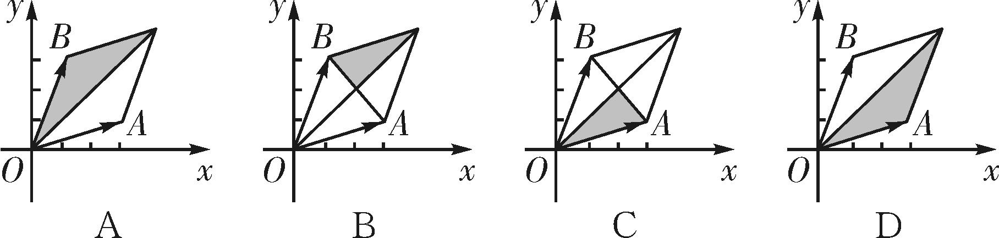
答案　A　解析　当*λ*＝0时，＝*μ*，故点*C*所有可能的位置区域应该包括边界或的一部分，故排除B，C，D项．故选A项．  
（3）在△*ABC*中，*M*为边*BC*上任意一点，*N*为*AM*的中点，＝*λ*＋*μ*，则*λ*＋*μ*的值为(　　)

A．　　　　　　　　
B．　　　　　　　　
C．　　　　　　　　
D．1
答案　A　解析　通法　设＝*t*，则＝＝(＋)＝＋＝＋＝＋(－)＝＋，∴*λ*＝－，*μ*＝，∴*λ*＋*μ*＝，故选A．

等和线法　如图，*BC*为值是1的等和线，过*N*作*BC*的平行线，设*λ*＋*μ*＝*k*，则*k*＝．由图易知，＝，故选A．

  
（4）在平行四边形<em>ABCD</em>中，点<em>E</em>和<em>F</em>分别是边<em>CD</em>和<em>BC</em>的中点．若＝<em>λ</em>＋<em>μ</em>，其中<em>λ</em>，<em>μ</em>∈<strong>R</strong>，则<em>λ</em>＋<em>μ</em>＝\_\_\_\_\_\_\_\_\_\_．

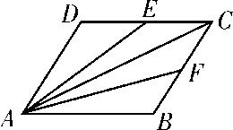
答案　　解析　通法　选择，作为平面向量的一组基底，则＝＋，＝＋，＝＋，又＝*λ*＋*μ*＝＋，于是得即故*λ*＋*μ*＝．

等和线法　如图，*EF*为值是1的等和线，过*C*作*EF*的平行线，设*λ*＋*μ*＝*k*，则*k*＝．由图易知，＝，故选B．

  
（5）如图所示，在△<em>ABC</em>中，<em>D</em>，<em>F</em>分别是<em>AB</em>，<em>AC</em>的中点，<em>BF</em>与<em>CD</em>交于点<em>O</em>，设＝<em><strong>a</strong></em>，＝<em><strong>b</strong></em>，向量＝<em>λ<strong>a</strong></em>＋<em>μ<strong>b</strong></em>，则<em>λ</em>＋<em>μ</em>的值为\_\_\_\_\_\_\_．

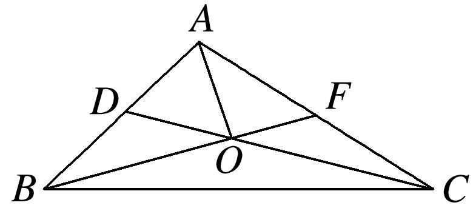
答案　　解析　等和线法　如图，*BC*为值是1的等和线，过*O*作*BC*的平行线，设*λ*＋*μ*＝*k*，则*k*＝．由图易知，＝．

  
（6）如图，在平行四边形<em>ABCD</em>中，<em>AC</em>，<em>BD</em>相交于点<em>O</em>，<em>E</em>为线段<em>AO</em>的中点．若＝<em>λ</em>＋<em>μ</em>(<em>λ</em>，<em>μ</em>∈<strong>R</strong>)，则<em>λ</em>＋<em>μ</em>等于(　　)

A．1　　　　　　　　
B．　　　　　　　　
C．　　　　　　　　
D．
答案　B　解析　通法　∵为线段*AO*的中点，∴＝＋＝＋×＝＋＝*λ*＋*μ*，∴*λ*＋*μ*＝＋＝．

等和线法　如图，*AD*为值是1的等和线，过*E*作*AD*的平行线，设*λ*＋*μ*＝*k*，则*k*＝．由图易知，＝，故选B．

  
（7）在梯形*ABCD*中，已知*AB*∥*CD*，*AB*＝2*CD*，*M*，*N*分别为*CD*，*BC*的中点．若＝*λ*＋*μ*，则*λ*＋*μ*的值为(　　)

A．　　　　　　　　　
B．　　　　　　　　　
C．　　　　　　　　　
D．
答案　C　解析　法一：连接*AC*(图略)，由＝*λ*＋*μ*，得＝*λ*·(＋)＋*μ*·(＋)，则＋＋＝0，得＋＋ [＋]＝0，得＋＝0．又，不共线，所以由平面向量基本定理得解得所以*λ*＋*μ*＝．

法二：因为＝＋＝＋＝＋(＋)＝2＋＋＝2－－，所以＝－，所以*λ*＋*μ*＝．

法三：根据题意作出图形如图所示，连接*MN*并延长，交*AB*的延长线于点*T*，由已知易得*AB*＝*AT*，所以＝＝*λ*＋*μ*，因为*T*，*M*，*N*三点共线，所以*λ*＋*μ*＝．

等和线法　如图，连接*MN*并延长，交*AB*的延长线于点*T*，则*MT*为值是1的等和线，设*λ*＋*μ*＝*k*，则*k*＝．由图易知，＝，故选C．

  
（8） (2013江苏)设<em>D</em>，<em>E</em>分别是△<em>ABC</em>的边<em>AB</em>，<em>BC</em>上的点，<em>AD</em>＝<em>AB</em>，<em>BE</em>＝<em>BC</em>，若＝<em>λ</em>1＋<em>λ</em>2(<em>λ</em>1，<em>λ</em>2∈<strong>R</strong>)，则<em>λ</em>1＋<em>λ</em>2的值为\_\_\_\_\_\_\_\_．
答案　　解析　如图，过点<em>A</em>作＝，设<em>AF</em>与<em>BC</em>的延长线交于点<em>H</em>，易知<em>AF</em>＝<em>FH</em>，∴<em>DF</em>＝<em>BH</em>，因此<em>λ</em>1＋<em>λ</em>2＝．

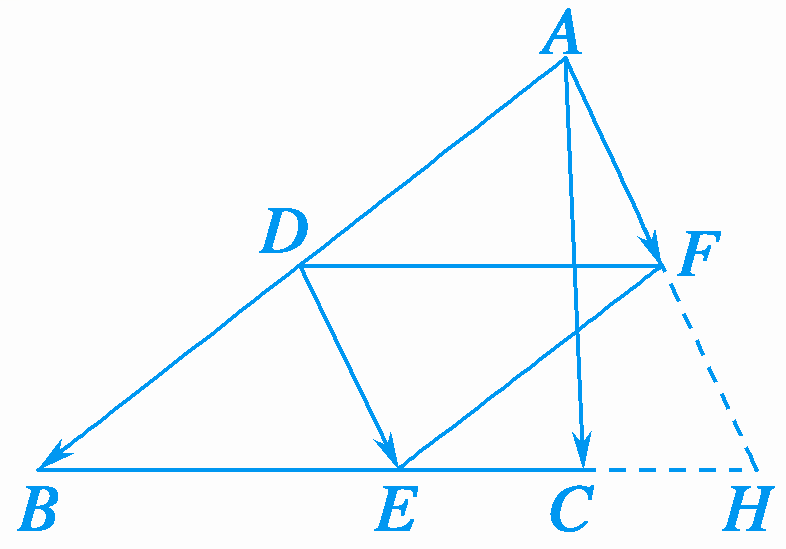  
（9）在平行四边形<em>ABCD</em>中，<em>AC</em>与<em>BD</em>相交于点<em>O</em>，点<em>E</em>是线段<em>OD</em>的中点，<em>AE</em>的延长线与<em>CD</em>交于点<em>F</em>，若＝<em><strong>a</strong></em>，＝<em><strong>b</strong></em>，且＝<em>λ<strong>a</strong></em>＋<em>μ<strong>b</strong></em>，则<em>λ</em>＋<em>μ</em>等于(　　)

A．1　　　　　　　　
B．　　　　　　　　
C．　　　　　　　　
D．
答案　A　解析　等和线法　如图，作＝，延长*CD*与*AG*相交于*G*，因为*C*，*F*，*G*三点共线，所以*λ*＋*μ*＝1．故选A．

考点二　根据等和线求基底的系数和的最值(范围)

【方法总结】
根据等和线求基底的系数和的最值(范围)的步骤  
（1）确定值为1的等和线；  
（2）平移(旋转或伸缩)该线，结合动点的可行域，分析何处取得最大值和最小值；  
（3）从长度比或点的位置两个角度，计算最大值和最小值．
当点*P*是某个平面区域内的动点时，首先作与基底两端点连线平行的直线*l*，因点*P*无论在*l*何处，对应*α*＋*β*的值恒为定值，我们不妨称之为“等和线”(或“等值线”)，然后将“等和线”*l*在动点*P*的“可行域”内平行移动，于是问题便转化为求两个线段长度的比值范围，称之为“平移法”．已知点*P*是△*ABC*所在平面内一点，且＝*x*＋*y*，则有点*P*在直线*BC*上⇔*x*＋*y*＝1；点*P*与点*A*在直线*BC*异侧⇔*x*＋*y*>1，且*x*＋*y*的值随点*P*到直线*BC*的距离越远而越大；点*P*与点*A*在直线*BC*同侧⇔*x*＋*y*< 1，且*x*＋*y*的值随点*P*到直线*BC*的距离越远而越小．

平面向量共线定理的表达式中的三个向量的起点务必一致，若不一致，本着少数服从多数的原则，优先平移固定的向量；若需要研究两系数的线性关系，则需要通过变换基底向量，使得需要研究的代数式为基底的系数和．考虑到向量可以通过数乘继而将向量进行拉伸压缩反向等操作，那么理论上来说，所有的系数之间的线性关系，我们都可以通过调节基底，使得要求的表达式是两个新基底的系数和．

【例题选讲】

<strong>[例1]</strong>（1）如图，在正六边形<em>ABCDEF</em>中，<em>P</em>是△<em>CDE</em>内(包括边界)的动点，设＝<em>α</em>＋<em>β</em>(<em>α</em>，<em>β</em>∈<strong>R</strong>)，则<em>α</em>＋<em>β</em>的取值范围是\_\_\_\_\_\_\_\_．

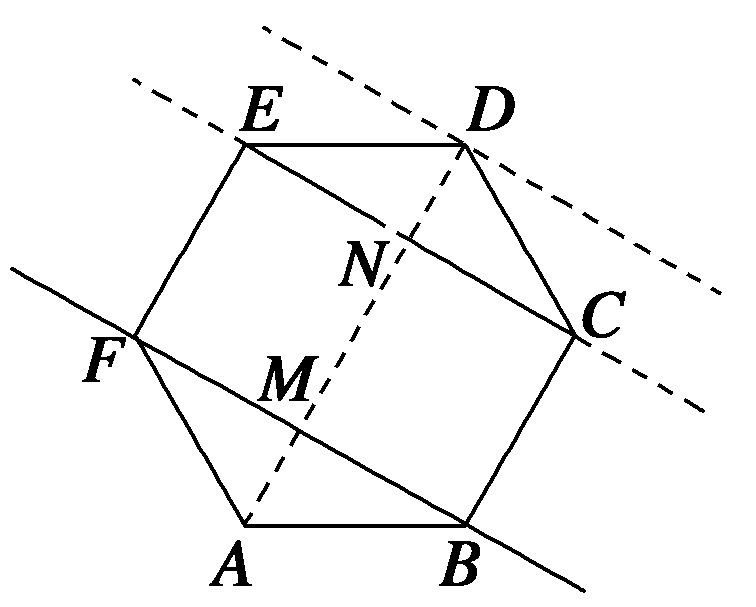
答案　[3，4]　解析　等和线法　直线*BF*为*k*＝1的等和线，当*P*在△*CDE*内时，直线*EC*是最近的等和线，过*D*点的等和线是最远的，所以*α*＋*β*∈[，]＝[3，4]．

  
（2）(2009安徽)给定两个长度为1的平面向量和，它们的夹角为，如图所示，点<em>C</em>在以<em>O</em>为圆心的弧上运动，若＝<em>x</em>＋<em>y</em>(<em>x</em>，<em>y</em>∈<strong>R</strong>)，则<em>x</em>＋<em>y</em>的最大值是\_\_\_\_\_\_\_\_．

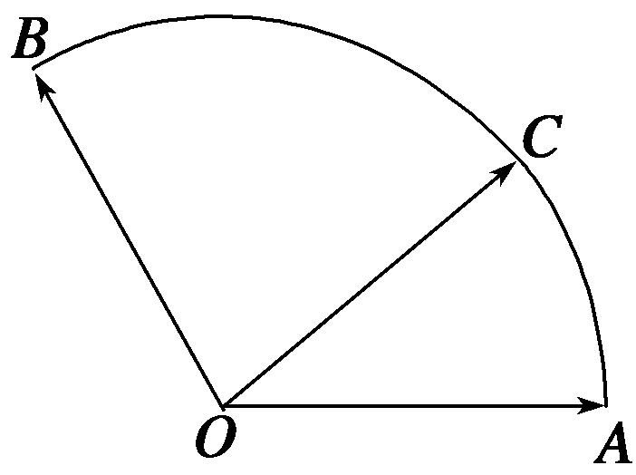

答案　2　解析　通法　以*O*为坐标原点，所在的直线为*x*轴建立平面直角坐标系，如图所示，则*A*(1，0)，*B*(－，)，设∠*AOC*＝*α*(*α*∈[0，])，则*C*(cos*α*，sin*α*)，由＝*x*＋*y*，得，所以*x*＝cos*α*＋sin*α*，*y*＝sin*α*，所以*x*＋*y*＝cos*α*＋sin*α*＝2sin(*α*＋)，又*α*∈[0，]，所以当*α*＝时，*x*＋*y*取得最大值2．

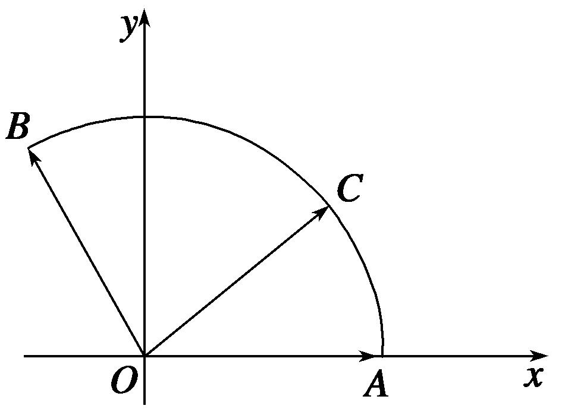

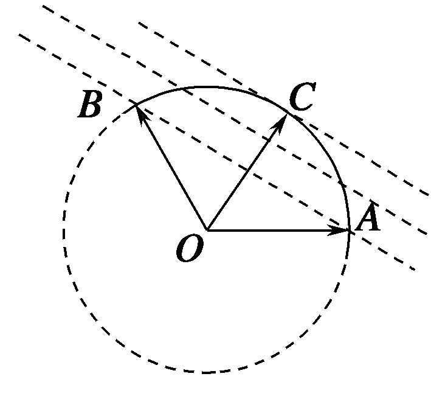

等和线法　令*x*＋*y*＝*k*，所有与直线*AB*平行的直线中，切线离圆心最远，即此时*k*取得最大值，结合角度，不难得到*k*＝＝2．  
（3） (2017·全国Ⅲ)在矩形*ABCD*中，*AB*＝1，*AD*＝2，动点*P*在以点*C*为圆心且与*BD*相切的圆上．若＝*λ*＋*μ*，则*λ*＋*μ*的最大值为(　　)

A．3　　　　　　　　
B．2　　　　　　　　
C．　　　　　　　　
D．2
答案　A　解析　建立如图所示的直角坐标系，则<em>C</em>点坐标为(2，1)．设<em>BD</em>与圆<em>C</em>切于点<em>E</em>，连接<em>CE</em>，则<em>CE</em>⊥<em>BD．</em>因为<em>CD</em>＝1，<em>BC</em>＝2，所以<em>BD</em>＝＝，<em>EC</em>＝＝＝，所以<em>P</em>点的轨迹方程为(<em>x</em>－2)2＋(<em>y</em>－1)2＝．设<em>P</em>(<em>x</em>0，<em>y</em>0)，则(<em>θ</em>为参数)，而＝(<em>x</em>0，<em>y</em>0)，＝(0，1)，＝(2，0)．因为＝<em>λ</em>＋<em>μ</em>＝<em>λ</em>(0，1)＋<em>μ</em>(2，0)＝(2<em>μ</em>，<em>λ</em>)，所以<em>μ</em>＝<em>x</em>0＝1＋cos <em>θ</em>，<em>λ</em>＝<em>y</em>0＝1＋sin<em>θ</em>．两式相加，得<em>λ</em>＋<em>μ</em>＝1＋sin<em>θ</em>＋1＋cos<em>θ</em>＝2＋sin(<em>θ</em>＋<em>φ</em>)≤3，当且仅当<em>θ</em>＝＋2<em>k</em>π－<em>φ</em>，<em>k</em>∈<strong>Z</strong>时，<em>λ</em>＋<em>μ</em>取得最大值3．故选A．

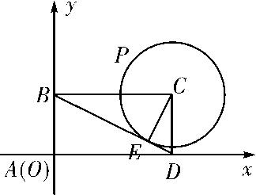

等和线法　过动点*P*作等和线，设*x*＋*y*＝*k*，则*k*＝．由图易知，当等和线与*EF*重合时，*k*取最大值，由*EF∥BD*，可求得＝3，∴*λ*＋*μ*取得最大值3．故选A．  
（4）在直角梯形<em>ABCD</em>中，<em>AB</em>⊥<em>AD</em>，<em>AD</em>＝<em>DC</em>＝1，<em>AB</em>＝3，动点<em>P</em>在以点<em>C</em>为圆心，且与直线<em>BD</em>相切的圆内运动，设＝<em>x</em>＋<em>y</em>(<em>x</em>，<em>y</em>∈<strong>R</strong>)，则<em>x</em>＋<em>y</em>的取值范围是\_\_\_\_\_\_\_\_．
答案　　解析　等和线法　如图，作*CE*⊥*BD*于*E*，由△*CDE*∽△*DBA*知＝，即＝，所以*CE*＝，设与*BD*平行且与圆*C*相切的直线交*AD*延长线于点*F*，作*DH*垂直该线于点*H*，显然*DH*＝2*CE*＝，由△*DFH*∽△*BDA*得＝，即＝，所以*DF*＝，过点*P*作直线*l*∥*BD*，交*AD*的延长线于点*M*，设*t*＝，则*x*＋*y*＝*t*，由图形知“等值线”*l*可从直线*BD*的位置平移至直线*FH*的位置(不包括*BD*和*FH*)，由平面几何知识可得1＝<<＝，即1<*t*<，故*x*＋*y*的取值范围是.

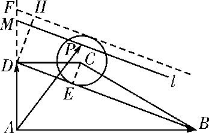  
（5）如图，在平行四边形<em>ABCD</em>中，<em>M</em>，<em>N</em>为<em>CD</em>的三等分点，<em>S</em>为<em>AM</em>与<em>BN</em>的交点，<em>P</em>为边<em>AB</em>上一动点，<em>Q</em>为三角形<em>SMN</em>内一点(含边界),若＝<em>x</em>＋<em>y</em>(<em>x</em>，<em>y</em>∈<strong>R</strong>)，则<em>x</em>＋<em>y</em>的取值范围是\_\_\_\_\_\_\_\_．

答案　[，1]　解析　如图，作＝，＝，过<em>S</em>直线<em>MN</em>的平行线，由等和线定理知，(<em>x</em>＋<em>y</em>)<em>max</em>＝1，(<em>x</em>＋<em>y</em>)<em>min</em>＝．

  
（6）如图，圆<em>O</em>是边长为2的等边三角形<em>ABC</em>的内切圆，其与<em>BC</em>边相切于点<em>D</em>，点<em>M</em>为圆上任意一点，＝<em>x</em>＋<em>y</em>(<em>x</em>，<em>y</em>∈<strong>R</strong>)，则2<em>x</em>＋<em>y</em>的最大值为(　　)

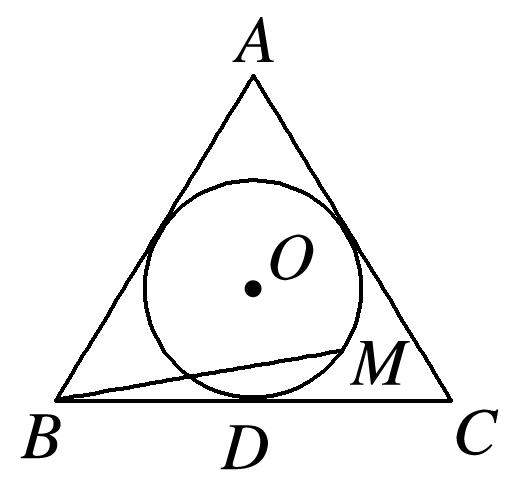

A．　　　　　　　　
B．　　　　　　　　
C．2　　　　　　　　
D．2
答案　C　解析　方法一　如图，连接*DA*，以*D*点为原点，*BC*所在直线为*x*轴，*DA*所在直线为*y*轴，建立如图所示的平面直角坐标系．设内切圆的半径为*r*，则圆心为坐标(0，*r*)，

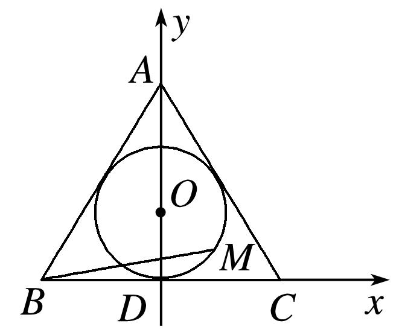
根据三角形面积公式，得×<em>l</em>△<em>ABC</em>×<em>r</em>＝×<em>AB</em>×<em>AC</em>×sin 60°(<em>l</em>△<em>ABC</em>为△<em>ABC</em>的周长)，解得<em>r</em>＝1．易得<em>B</em>(－，0)，<em>C</em>(，0)，<em>A</em>(0，3)，<em>D</em>(0，0)，设<em>M</em>(cos <em>θ</em>，1＋sin <em>θ</em>)，<em>θ</em>∈[0，2π)，则＝(cos <em>θ</em>＋，1＋sin <em>θ</em>)，＝(，3)，＝(，0)，故＝(cos <em>θ</em>＋，1＋sin <em>θ</em>)＝(<em>x</em>＋<em>y</em>,3<em>x</em>)，故则所以2<em>x</em>＋<em>y</em>＝＋＋＝sin＋≤2．当<em>θ</em>＝时等号成立．故2<em>x</em>＋<em>y</em>的最大值为2．
方法二　因为＝<em>x</em>＋<em>y</em>，所以||2＝3(4<em>x</em>2＋2<em>xy</em>＋<em>y</em>2)＝3[(2<em>x</em>＋<em>y</em>)2－2<em>xy</em>]．由题意知，<em>x</em>≥0，<em>y</em>≥0，||的最大值为＝3，又≥2<em>xy</em>，即≤－2<em>xy</em>，所以3×(2<em>x</em>＋<em>y</em>)2≤9，得2<em>x</em>＋<em>y</em>≤2，当且仅当2<em>x</em>＝<em>y</em>＝1时取等号．

等和线法　＝*x*＋*y*＝2*x*()＋*y*＝2*x*＋*y*，作出值1为的等和线*DE*，*AC*是过圆上的点最远的等和线，设2*x*＋*y*＝*k*，则*k*＝＝2．∴2*x*＋*y*取得最大值2．故选C．

  
（7） 如图所示，*A*，*B*，*C*是圆*O*上的三点，线段*CO*的延长线与*BA*的延长线交于圆*O*外的一点*D*，若＝*m*＋*n*，则*m*＋*n*的取值范围是\_\_\_\_\_\_\_\_．

答案　(－1，0)　解析　通法　由题意得，＝*k*(*k*＜0)，又|*k*|＝＜1，∴－1＜*k*＜0．又∵*B*，*A*，*D*三点共线，∴＝*λ*＋(1－*λ*)，∴*m*＋*n*＝*kλ*＋*k*(1－*λ*)，∴*m*＝*kλ*，*n*＝*k*(1－*λ*)，∴*m*＋*n*＝*k*，从而*m*＋*n*∈(－1，0)．

等和线法　如图，作，的相反向量，，则<em>AB∥A</em>1<em>B</em>1，过<em>O</em>作直线<em>l∥AB</em>，则直线<em>l</em>，<em>A</em>1<em>B</em>1分别为以，为基底的值为0，－1的等和线，由题意线段<em>CO</em>的延长线与<em>BA</em>的延长线交于圆<em>O</em>外的一点<em>D</em>，所以点<em>C</em>在直线<em>l</em>与直线<em>A</em>1<em>B</em>1之间，所以<em>m</em>＋<em>n</em>∈(－1，0)．

  
（8）已知点*O*为△*ABC*的边*AB*的中点，*D*为边*BC*的三等分点，*DC*＝2*DB*，*P*为△*ADC*内(包括边界)任一点，若＝*x*＋*y*，则*x*－2*y*的取值范围为\_\_\_\_\_\_\_\_．
答案　[－8，－1]　解析　等和线法　如图，延长<em>DO</em>至点<em>E</em>，使<em>DO</em>＝2<em>OE</em>，则＝－，则＝<em>x</em>＋<em>y</em>＝<em>x</em>＋(－2<em>y</em>) ，令<em>z</em>＝－2<em>y</em>，则<em>x</em>－2<em>y</em>＝<em>x</em>＋<em>z</em>，＝<em>x</em>＋<em>z</em>，设过点<em>A</em>，<em>C</em>，<em>P</em>与<em>BE</em>平行的直线分别为为<em>l</em>1，<em>l</em>2，<em>l</em>，设<em>l</em>，<em>l</em>2交线段<em>OD</em>延长线于点<em>M</em>，<em>H</em>，<em>l</em>1交线段<em>OD</em>于点<em>K</em>，令<em>x</em>＋<em>z</em>＝<em>t</em>，由图形知，<em>t</em>＝－，“等和线”<em>l</em>可从<em>l</em>1的位置平移至<em>l</em>2的位置，由平面几何知识可知△<em>OBE</em>≌△<em>OAK</em>，△<em>DBE</em>∽△<em>DCH</em>，所以＝＝1，＝＝＝，所以1＝≤≤＝＝＝8，则－8≤<em>t</em>≤－1，故<em>x</em>－2<em>y</em>的取值范围为[－8，－1]．

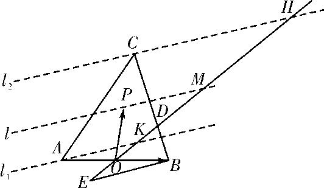  
（9）如图，在边长为1的正方形*ABCD*中，*E*为*AB*的中点，*P*为以*A*为圆心，*AB*为半径的圆弧(在正方形内，包括边界点)上的任意一点，若向量＝*λ*＋*μ*，则*λ*＋*μ*的最小值为\_\_\_\_\_\_\_\_．

答案　　解析　通法　以*A*为原点，以*AB*所在的直线为*x*轴，*AD*所在的直线为*y*轴建立如图所示的平面直角坐标系，则*A*(0，0)，*B*(1，0)，*E*，*C*(1，1)，*D*(0，1)．设*P*(cos *θ*，sin *θ*)，∴＝(1，1)，＝(cos *θ*，sin *θ*)，＝，∵＝*λ*＋*μ*(cos*θ*，sin*θ*)＝＝(1，1)，

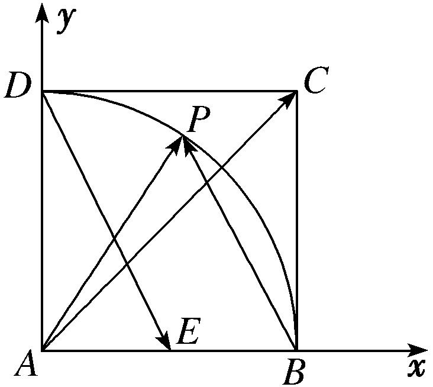
∴∴∴*λ*＋*μ*＝＝－1＋．
∴(*λ*＋*μ*)′＝>0，故*λ*＋*μ*在上是增函数，∴当*θ*＝0，即cos *θ*＝1时，*λ*＋*μ*取最小值为＝．

等和线法　由题意，作＝，设＝<em>λ</em>，直线<em>AC</em>与<em>PK</em>直线相交于点<em>D</em>，则有＝<em>λx</em>＋<em>λy</em>，由等和线定理，<em>λx</em>＋<em>λy</em>＝1，从而<em>x</em>＋<em>y</em>＝，当点<em>P</em>与<em>B</em>点重合时，如图，<em>λmax</em>＝2，此时，(<em>x</em>＋<em>y</em>) <em>max</em>＝．

  
（10） (2013·安徽)在平面直角坐标系中，<em>O</em>是坐标原点，两定点<em>A</em>，<em>B</em>满足||＝||＝·＝2，则点集{<em>P</em>|＝<em>λ</em>＋<em>μ</em>，|<em>λ</em>|＋|<em>μ</em>|≤1，<em>λ</em>，<em>μ</em>∈<strong>R</strong>}所表示的区域的面积是(　　)

A．2　　　　　　　　
B．2　　　　　　　　
C．4　　　　　　　　
D．4
答案　D　解析　等和线法　如图，分别作＝－，＝－．当<em>λ</em>≥0，<em>μ</em>≥0时，{<em>P</em>|＝<em>λ</em>＋<em>μ</em>，|<em>λ</em>|＋|<em>μ</em>|≤1，<em>λ</em>，<em>μ</em>∈<strong>R</strong>}＝{<em>P</em>|＝|<em>λ</em>|＋|<em>μ</em>|，|<em>λ</em>|＋|<em>μ</em>|≤1，<em>λ</em>，<em>μ</em>∈<strong>R</strong>}，对应区域1；当<em>λ</em>≥0，<em>μ</em>&lt;0时，{<em>P</em>|＝<em>λ</em>＋<em>μ</em>，|<em>λ</em>|＋|<em>μ</em>|≤1，<em>λ</em>，<em>μ</em>∈<strong>R</strong>}＝{<em>P</em>|＝|<em>λ</em>|＋|<em>μ</em>|，|<em>λ</em>|＋|<em>μ</em>|≤1，<em>λ</em>，<em>μ</em>∈<strong>R</strong>}，对应区域2；

当<em>λ</em>&lt;0，<em>μ</em>≥0时，{<em>P</em>|＝<em>λ</em>＋<em>μ</em>，|<em>λ</em>|＋|<em>μ</em>|≤1，<em>λ</em>，<em>μ</em>∈<strong>R</strong>}＝{<em>P</em>|＝|<em>λ</em>|＋|<em>μ</em>|，|<em>λ</em>|＋|<em>μ</em>|≤1，<em>λ</em>，<em>μ</em>∈<strong>R</strong>}，对应区域3；当<em>λ</em>&lt;0，<em>μ</em>&lt;0时，{<em>P</em>|＝<em>λ</em>＋<em>μ</em>，|<em>λ</em>|＋|<em>μ</em>|≤1，<em>λ</em>，<em>μ</em>∈<strong>R</strong>}＝{<em>P</em>|＝|<em>λ</em>|＋|<em>μ</em>|，|<em>λ</em>|＋|<em>μ</em>|≤1，<em>λ</em>，<em>μ</em>∈<strong>R</strong>}，对应区域4．综上所述可得，点集{<em>P</em>|＝<em>λ</em>＋<em>μ</em>，|<em>λ</em>|＋|<em>μ</em>|≤1，<em>λ</em>，<em>μ</em>∈<strong>R</strong>}所表示的区域即图中的矩形区域，其面积<em>S</em>＝2×2＝4．故选D．

【对点训练】

1．如图，△*BCD*与△*ABC*的面积之比为2，点*P*是区域*ABCD*内任意一点(含边界)，且＝*λ*＋*μ*，
则*λ*＋*μ*的取值范围为(　　)

A．[0，1]　　　　　　　　
B．[0，2]　　　　　　　　
C．[0，3]　　　　　　　
D．[0，4]

1．答案　　解析　等和线法　如图，(<em>λ</em>＋<em>μ</em>)min＝0，(<em>λ</em>＋<em>μ</em>)max＝3．故选C．

2．在直角梯形*ABCD*中，∠*A*＝90°，∠*B*＝30°，*AB*＝2，*BC*＝2，点*E*在线段*CD*上，若＝＋*μ*，
则*μ*的取值范围是\_\_\_\_\_\_\_\_．

2．答案　　解析　通法　由题意可求得*AD*＝1，*CD*＝，所以＝2．∵点*E* 在线段*CD*上，
∴＝*λ* (0≤*λ*≤1)．∵＝＋，又＝＋*μ*＝＋2*μ*＝＋，∴＝1，即*μ*＝．∵0≤*λ*≤1，∴0≤*μ*≤，即*μ*的取值范围是．

等和线法　如图，(1＋<em>μ</em>)min＝1，<em>μ</em>min＝0．(1＋<em>μ</em>)max＝，<em>μ</em>max＝．

3．如图，四边形*OABC*是边长为1的正方形，点*D*在*OA*的延长线上，且*OD*＝2，点*P*是△*BCD*内任意

一点(含边界)，设＝*λ*＋*μ*，则*λ*＋*μ*的取值范围为\_\_\_\_\_\_\_\_．

3．答案　[1，]　解析　等和线法　如图，(<em>λ</em>＋<em>μ</em>)min＝1，(<em>λ</em>＋<em>μ</em>)max＝．

4．给定两个长度为1的平面向量和，它们的夹角为90°，如图所示，点*C*在以*O*为圆心的圆弧上

运动，若＝<em>x</em>＋<em>y</em>，其中<em>x</em>，<em>y</em>∈<strong>R</strong>，则<em>x</em>＋<em>y</em>的最大值是(　　)

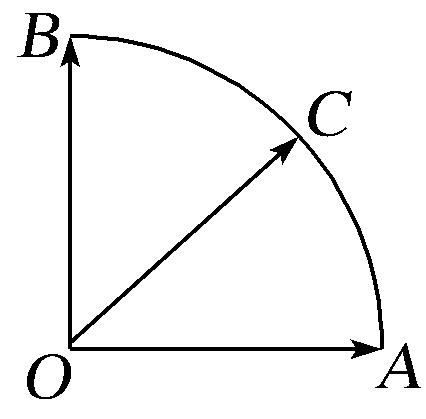

A．1　　　　　　　　
B．　　　　　　　　
C．　　　　　　　
D．2

4．答案　B　解析　通法　因为点<em>C</em>在以<em>O</em>为圆心的圆弧上，所以||2＝|<em>x</em>＋<em>y</em>|2＝<em>x</em>2＋<em>y</em>2＋

2<em>xy</em>·＝<em>x</em>2＋<em>y</em>2，∴<em>x</em>2＋<em>y</em>2＝1，则2<em>xy</em>≤<em>x</em>2＋<em>y</em>2＝1．又(<em>x</em>＋<em>y</em>)2＝<em>x</em>2＋<em>y</em>2＋2<em>xy</em>≤2，故<em>x</em>＋<em>y</em>的最大值为．

等和线法　确定值为1的等和线*AB*，过动点*C*作等和线，设*x*＋*y*＝*k*，则*k*＝．由图易知，当等和线与圆相切时，*k*取最大值，此时＝，∴*x*＋*y*取得最大值．故选B．

5．如图，在边长为2的正六边形*ABCDEF*中，动圆*Q*半径为1，圆心在线段*CD*(含端点)上运动，*P*是圆

上及其内部的动点，设＝<em>m</em>＋<em>n</em>(<em>m</em>，<em>n</em>∈<strong>R</strong>)，则<em>m</em>＋<em>n</em>的取值范围是\_\_\_\_\_\_\_\_．

5．答案　[2，5]　解析　等和线法　如图1时，*m*＋*n*的值最小且*m*＋*n*＝＝2，如图2时，*m*＋*n*的值最

大且*m*＋*n*＝＝5，

6．如图，已知点<em>P</em>为等边三角形<em>ABC</em>外接圆上一点，点<em>Q</em>是该三角形内切圆上的一点，若＝<em>x</em>1＋<em>y</em>1

，＝<em>x</em>2＋<em>y</em>2，则|(2<em>x</em>1－<em>x</em>2)＋(2<em>y</em>1－<em>y</em>2)|的最大值为\_\_\_\_\_\_．

6．答案　　解析　等和线法　由等和线定理知当点<em>P</em>，<em>Q</em>分别在如图所示的位置时<em>x</em>1＋<em>y</em>1取最大值，<em>x</em>2

＋<em>y</em>2取最小值，且<em>x</em>1＋<em>y</em>1的最大值为＝，<em>x</em>2＋<em>y</em>2的最小值为＝．故|(2<em>x</em>1－<em>x</em>2)＋(2<em>y</em>1－<em>y</em>2)|＝|(2(<em>x</em>1＋<em>y</em>1)－(<em>x</em>2＋<em>y</em>2)| ≤＋＝．

7．如图，在扇形*OAB*中，∠*AOB*＝，*C*为弧*AB*上的动点，若＝*x*＋*y*，则*x*＋3*y*的取值范围是

\_\_\_\_\_\_\_\_．

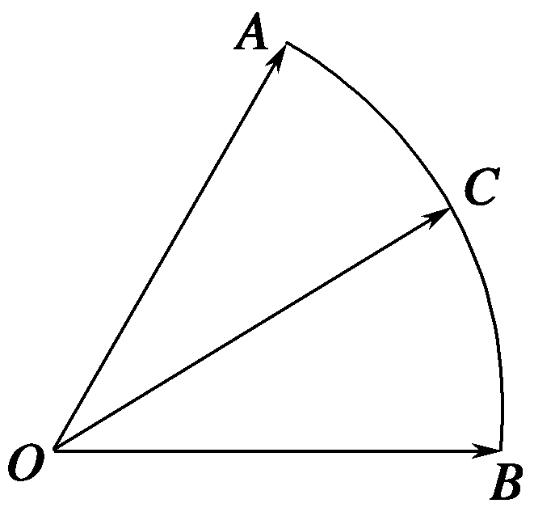

7．答案　[1，3]　解析　等和线法　依题意，＝*x*＋3*y*()，如图，作＝，重新调整基底为，

′，设*k*＝*x*＋3*y*，显然，当*C*在*A*点时，经过*k*＝1的等和线，当*C*在*B*点时，经过*k*＝3的等和线，这两条线分别是最近与最远的等和线，所以*x*＋3*y*的取值范围是[1，3]．

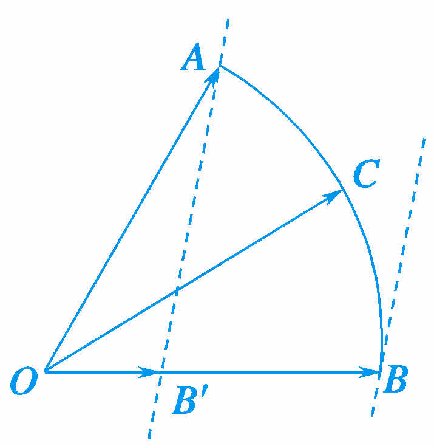

8．如图，*G*为△*ADE*的重心，*P*为△*GDE*内任一点(包括边界)，*B*，*C*均为*AD*，*AE*上的三等分点(靠近

点*A*)，＝*α*＋*β*，则*α*＋*β*的取值范围是\_\_\_\_\_\_\_\_．

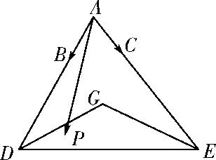

8．答案　　解析　等和线法　如图，在线段*AE*上取点*F*，使*AC*＝*CF*，则＝*α*＋*β*，设*β*

＝*γ*，则＝*α*＋*γ*，连接*BF*，延长*EG*交*AD*于点*H*，因为*G*为△*ADE*的重心，所以*H*为*AD*的中点，又*B*，*C*均为*AD*，*AE*上靠近点*A*的三等分点，所以＝＝2，所以*BF*∥*HE*，过点*P*作直线*l*∥*HE*交*AD*于点*M*，

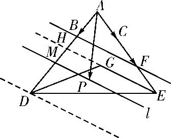
设*α*＋*γ*＝*t*，则*t*＝，由图形知，“等值线”*l*可从直线*HE*的位置平移到过点*D*的位置，由平面几何知识可知＝≤≤＝3，故≤*t*≤3，即*α*＋*γ*∈，故*α*＋*β*的取值范围是．

9．给定两个长度为1的平面向量和，它们的夹角为，如图所示，点在以为圆心的圆弧

上运动．若．其中，，则的最大值是

A．　　　　　　　　
B．3　　　　　　　　
C．　　　　　　　　
D．5

9．答案　A　解析　通法　点在以为圆心的圆弧上运动，可以设圆的参数方程，

，，，，其中，，，当且仅当时取等号．的最大值是，当三角函数取到1时成立．故选A．

等和线法　＝*x*＋*y*＝2*x*()＋3*y*()＝2*x*＋3*y*，2*x*＋3*y*＝*k*，则*k*＝＝．

10．平行四边形*ABCD*中，*AB*＝3，*AD*＝2，∠*BAD*＝120°，*P*是平行四边形*ABCD*内一点，且*AP*＝1，
若＝*x*＋*y*，则3*x*＋2*y*的最大值为\_\_\_\_\_\_\_\_．

10．答案　2　解析　通法　||2＝(<em>x</em>＋<em>y</em>)2＝9<em>x</em>2＋4<em>y</em>2＋2<em>xy</em>×3×2×＝(3<em>x</em>＋2<em>y</em>)2－3(3<em>x</em>)·(2<em>y</em>)≥(3<em>x</em>＋

2<em>y</em>)2－(3<em>x</em>＋2<em>y</em>)2＝(3<em>x</em>＋2<em>y</em>)2．又||2＝1，因此(3<em>x</em>＋2<em>y</em>)2≤1，故3<em>x</em>＋2<em>y</em>≤2，当且仅当3<em>x</em>＝2<em>y</em>，即<em>x</em>＝，<em>y</em>＝时，3<em>x</em>＋2<em>y</em>取得最大值2．

等和线法　可转化为例2(2)．

11．在矩形<em>ABCD</em>中，<em>AB</em>＝，<em>BC</em>＝，<em>P</em>为矩形内一点，且<em>AP</em>＝，若＝<em>λ</em>＋<em>μ</em>(<em>λ</em>，<em>μ</em>∈<strong>R</strong>)，
则*λ*＋*μ*的最大值为\_\_\_\_\_\_．

11．答案　　解析　通法　建立如图所示的平面直角坐标系，设*P*(*x*，*y*)，*B*(，0)，*C*(，)，*D*(0，

)．∵<em>AP</em>＝，∴<em>x</em>2＋<em>y</em>2＝．点<em>P</em>满足的约束条件为∵＝<em>λ</em>＋<em>μ</em>(<em>λ</em>，<em>μ</em>∈<strong>R</strong>)，∴(<em>x</em>，<em>y</em>)＝<em>λ</em>(，0)＋<em>μ</em>(0，)，∴∴<em>x</em>＋<em>y</em>＝<em>λ</em>＋<em>μ</em>．∵<em>x</em>＋<em>y</em>≤＝＝，当且仅当<em>x</em>＝<em>y</em>时取等号，∴<em>λ</em>＋<em>μ</em>的最大值为．

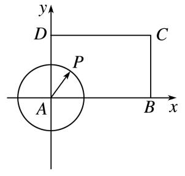

等和线法　＝*λ*＋*μ*＝*λ*()＋*μ*()＝*λ*＋*μ*，*λ*＋*μ*＝*k*，则*k*＝

＝．

12．如图，在扇形*OAB*中，∠*AOB*＝，*C*为弧上的一个动点，若＝*x*＋*y*，则*x－y*的取值

范围是\_\_\_\_\_\_\_\_．

12．答案　，　解析　通法　设半径为1，由已知可设为轴的正半轴，为坐标原点，建立直

角坐标系，其中，；；（其中，有若＝*x*＋*y*＝，，，；整理得：；，解得，，则，其中；易知，为增函数，由单调性易得其值域为，，故答案为，．

等和线法

13．如图，在直角梯形中，，，，，图中圆弧所在圆的圆

心为点，半径为，且点在图中阴影部分（包括边界）运动．若，其中，，则的最大值为

A．　　　　　　　　
B．　　　　　　　　
C．2　　　　　　　　
D．

13．答案　B　解析　以为坐标原点，为轴，为轴建立平面直角坐标系，则，，

，，直线的方程为，到的距离，圆弧以点为圆心的圆方程为，设则，，，，若，，，，，，在圆内或圆上，，设，则，代入上式整理得，设，，，则，解得，故的最大值为，故选B．

等和线法

14．如图，在扇形*OAB*中，∠*AOB*＝，*C*为弧*AB*上，且与*A*，*B*不重合的一个动点，＝*x*＋*y*，

若*u*＝*x*＋*λy*(*λ*>0)存在最大值，则*λ*的取值范围为

A．　　　　　　　
B．　　　　　　　
C．　　　　　　　
D．

14．答案　C　解析　通法　以为原点，为轴，建立如图所示的直角坐标系，设，

，则，，，由，得，，，存在最大值，存在极值点，在上有零点．令，则，，，，的取值范围为．故选C．

等和线法

15．在平面直角坐标系中，是坐标原点，若两定点，满足，，则点集

所表示的区域的面积是

A．　　　　　　
B．　　　　　　
C．　　　　　　
D．

15．答案　D　解析　，，即．（1）若，

，设，，则，

，故当时，，，三点共线，故点表示的区域为，此时．

  
（2）若，，设，，则，

，故当时，，，三点共线，故点表示的区域为，此时．同理可得：当，时，点表示的区域面积为，当，时，点表示的区域面积为，综上，点表示的区域面积为．故选D．

等和线法

