专题八　平面向量的极化恒等式
利用向量的极化恒等式可以快速对共起点(终点)的两向量的数量积问题数量积进行转化，体现了向量的几何属性，让“秒杀”向量数量积问题成为一种可能，此恒等式的精妙之处在于建立了向量的数量积与几何长度(数量)之间的桥梁，实现向量与几何、代数的巧妙结合．对于不共起点和不共终点的问题可通过平移转化法等价转化为对共起点(终点)的两向量的数量积问题，从而用极化恒等式解决．

<strong>1．极化恒等式：</strong><em><strong>a</strong></em>·<em><strong>b</strong></em>＝[(<em><strong>a</strong></em>＋<em><strong>b</strong></em>)2－(<em><strong>a</strong></em>－<em><strong>b</strong></em>)2]

几何意义：向量的数量积可以表示为以这组向量为邻边的平行四边形的“和对角线”与“差对角线”平方差的*．*

<strong>2．平行四边形模式：</strong>如图（1），平行四边形<em>ABCD</em>，<em>O</em>是对角线交点．则：（1）·＝[|<em>AC</em>|2－|<em>BD</em>|2]．

<strong>3．三角形模式：</strong>如图（2），在△<em>ABC</em>中，设<em>D</em>为<em>BC</em>的中点，则·＝|<em>AD</em>|2－|<em>BD</em>|2．

三角形模式是平面向量极化恒等式的终极模式，几乎所有的问题都是用它解决．

记忆：向量的数量积等于第三边的中线长与第三边长的一半的平方差．

考点一　平面向量数量积的定值问题

【方法总结】
利用极化恒等式求数量积的定值问题的步骤  
（1）取第三边的中点，连接向量的起点与中点；  
（2）利用积化恒等式将数量积转化为中线长与第三边长的一半的平方差；  
（3）求中线及第三边的长度，从而求出数量积的值．

积化恒等式适用于求对共起点(终点)的两向量的数量积，对于不共起点和不共终点的问题可通过平移转化法等价转化为对共起点(终点)的两向量的数量积，从而用极化恒等式解决．在运用极化恒等式求数量积时，关键在于取第三边的中点，找到三角形的中线，再写出极化恒等式，难点在于求中线及第三边的长度，通常用平面几何方法或用正余弦定理求解，从而得到数量的值．

【例题选讲】

<strong>[例1]</strong> （1）(2014·全国Ⅱ)设向量<em><strong>a</strong></em>，<em><strong>b</strong></em>满足|<em><strong>a</strong></em>＋<em><strong>b</strong></em>|＝，|<em><strong>a</strong></em>－<em><strong>b</strong></em>|＝，则<em><strong>a</strong></em>·<em><strong>b</strong></em>＝(　　)

A．1　　　　　　　　
B．2　　　　　　　　
C．3　　　　　　　　
D．5
答案　A　解析　通法　由条件可得，(<em><strong>a</strong></em>＋<em><strong>b</strong></em>)2＝10，(<em><strong>a</strong></em>－<em><strong>b</strong></em>)2＝6，两式相减得4<em><strong>a·b</strong></em>＝4，所以<em><strong>a</strong></em>·<em><strong>b</strong></em>＝1．

极化恒等式　<em><strong>a</strong></em>·<em><strong>b</strong></em>＝[(<em><strong>a</strong></em>＋<em><strong>b</strong></em>)2－(<em><strong>a</strong></em>－<em><strong>b</strong></em>)2]＝(10－6)＝1．  
（2） (2012·浙江)在△*ABC*中，*M*是*BC*的中点，*AM*＝3，*BC*＝10，则·＝\_\_\_\_\_\_\_\_．
答案　－16　解析　因为<em>M</em>是<em>BC</em>的中点，由极化恒等式得：·＝|<em>AM</em>|2－|<em>BC</em>|2＝9－×100＝－16．

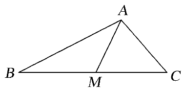

  
（3）如图所示，*AB*是圆*O*的直径，*P*是上的点，*M*，*N*是直径*AB*上关于点*O*对称的两点，且*AB*＝6，*MN*＝4，则·＝(　　)

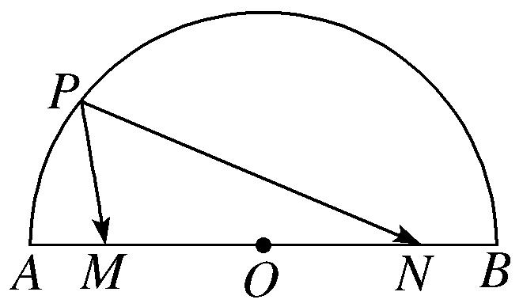

A．13　　　　　　　　
B．7　　　　　　　　
C．5　　　　　　　　
D．3
答案　C　解析　连接<em>AP</em>，<em>BP</em>，则＝＋，＝＋＝－，所以·＝(＋)·(－)＝·－·＋·－||2＝－·＋·－||2＝·－||2＝1×6－1＝5．  
（4）如图，在平行四边形*ABCD*中，*AB*＝1，*AD*＝2，点*E*，*F*，*G*，*H*分别是*AB*，*BC*，*CD*，*AD*边上的中点，则·＋·＝\_\_\_\_\_\_\_\_．

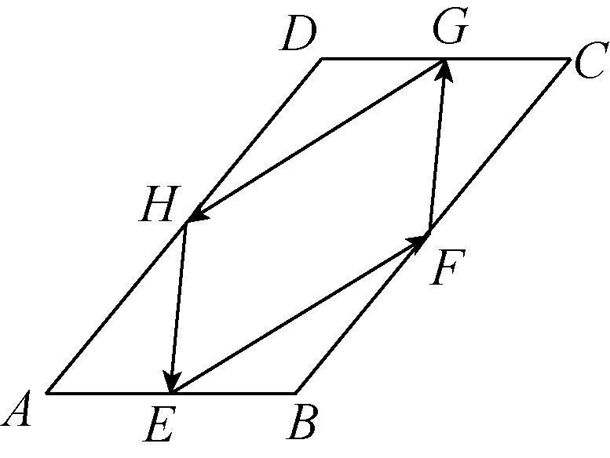
答案　　解析　连结<em>EG</em>，<em>FH</em>，交于点<em>O</em>，则·＝·＝2－2＝1－＝，·＝·＝2－2＝1－＝，因此·＋·＝．  
（5） (2016·江苏)如图，在△*ABC*中，*D*是*BC*的中点，*E*，*F*是*AD*上的两个三等分点．·＝4，·＝－1，则·的值为\_\_\_\_\_\_\_\_．

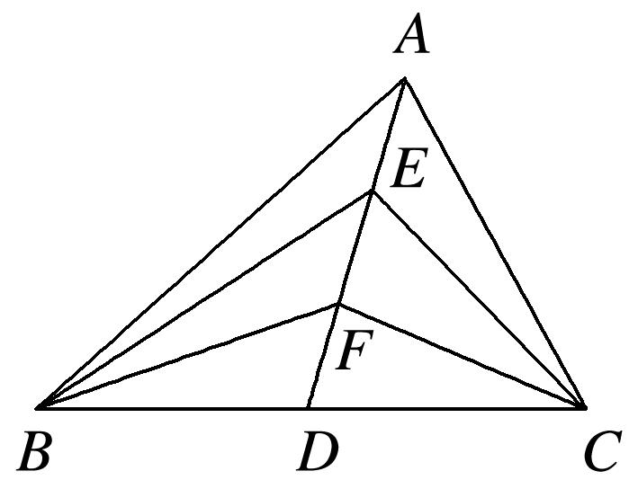
答案　　解析　极化恒等式法　设<em>BD</em>＝<em>DC</em>＝<em>m</em>，<em>AE</em>＝<em>EF</em>＝<em>FD</em>＝<em>n</em>，则<em>AD</em>＝3<em>n</em>．根据向量的极化恒等式，有·＝2－2＝9<em>n</em>2－<em>m</em>2＝4， ·＝2－2＝<em>n</em>2－<em>m</em>2＝－1．联立解得<em>n</em>2＝，<em>m</em>2＝．因此·＝2－2＝4<em>n</em>2－<em>m</em>2＝．即·＝．

坐标法　以直线<em>BC</em>为<em>x</em>轴，过点<em>D</em>且垂直于<em>BC</em>的直线为<em>y</em>轴，建立如图所示的平面直角坐标系<em>xoy</em>，如图：设<em>A</em>(3<em>a</em>，3<em>b</em>)，<em>B</em>(－<em>c</em>，0)，<em>C</em>(－<em>c</em>，0)，则有<em>E</em>(2<em>a</em>，2<em>b</em>)，<em>F</em>(<em>a</em>，<em>b</em>)　·＝(3<em>a</em>＋<em>c</em>，3<em>b</em>)·(3<em>a</em>－<em>c</em>，3<em>b</em>)＝9<em>a</em>2－<em>c</em>2＋9<em>b</em>2＝4　·＝(<em>a</em>＋<em>c</em>，<em>b</em>)·(<em>a</em>－<em>c</em>，<em>b</em>)＝<em>a</em>2－<em>c</em>2＋<em>b</em>2＝－1，则<em>a</em>2＋<em>b</em>2＝，<em>c</em>2＝　·＝·＝4<em>a</em>2－<em>c</em>2＋4<em>b</em>2＝．

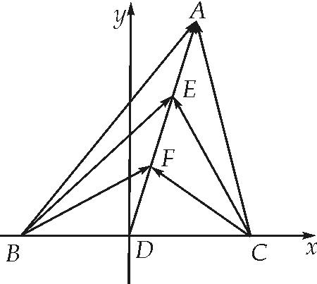

基向量　·＝(－)(－)＝＝＝4，·＝(－)(－)＝＝－1，因此2＝，＝，·＝(－)(－)＝＝＝．  
（6）在梯形*ABCD*中，满足*AD*∥*BC*，*AD*＝1，*BC*＝3，·＝2，则·的值为\_\_\_\_\_\_\_\_．

答案　4　解析　过*A*点作*AE*平行于*DC*，交*BC*于*E*，取*BE*中点*F*，连接*AF*，过*D*点作*DH*平行于*AC*，交*BC*延长线于*H*，*E*为*BH*中点，连接*DE*，，

，又，*AD*∥*BC*，则四边形*ADEF*为平行四边形，，．

【对点训练】

1．已知正方形*ABCD*的边长为1，点*E*是*AB*边上的动点，则·的值为\_\_\_\_\_\_\_\_．

1．答案　1　解析　取<em>AE</em>中点<em>O</em>，设|<em>AE</em>|＝<em>x</em>(0≤<em>x</em>≤1)，则|<em>AO</em>|＝<em>x</em>，∴·＝|<em>DO</em>|2－|<em>AO</em>|2＝12＋

－<em>x</em>2＝1．

2．如图，△*AOB*为直角三角形，*OA*＝1，*OB*＝2，*C*为斜边*AB*的中点，*P*为线段*OC*的中点，则·＝

(　　)

A．1　　　　　　　　
B．　　　　　　　　
C．　　　　　　　　
D．－

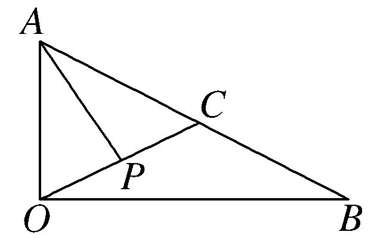

2．答案　B　解析　取<em>AO</em>中点<em>Q</em>，连接<em>PQ</em>，·＝·＝<em>PQ</em>2－<em>AQ</em>2＝－＝．

3．如图，在平面四边形*ABCD*中，*O*为*BD*的中点，且*OA*＝3，*OC*＝5，若·＝－7，则·的值

是\_\_\_\_\_\_\_\_．

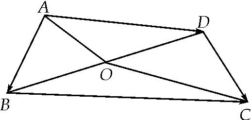

3．答案　9　解析　因为·＝2－2＝9－2＝－7⇒2＝16，所以·＝2－2＝25

－16＝9．

4．已知点*A*，*B*分别在直线*x*＝3，*x*＝1上，|－|＝4，当|＋|取最小值时，·的值是\_\_\_\_\_．

A．0　　　　　　　　
B．2　　　　　　　　
C．3　　　　　　　　
D．6

4．答案　C　解析　如图，点*A*，*B*分别在直线*x*＝1，*x*＝3上，||＝4，当|＋|取最小值时，*AB*的

中点在<em>x</em>轴上，·＝2－2＝4－4＝0．

5．在边长为1的正三角形*ABC*中，*D*，*E*是边*BC*的两个三等分点(*D*靠近点*B*)，则·等于(　　)

A．　　　　　　　　
B．　　　　　　　　
C．　　　　　　　　
D．

5．答案　C　解析　解法一：因为*D*，*E*是边*BC*的两个三等分点，所以*BD*＝*DE*＝*CE*＝，在△*ABD*中，

<em>AD</em>2＝<em>BD</em>2＋<em>AB</em>2－2<em>BD</em>·<em>AB</em>·cos60°＝2＋12－2××1×＝，即<em>AD</em>＝，同理可得<em>AE</em>＝，在△<em>ADE</em>中，由余弦定理得cos∠<em>DAE</em>＝＝＝，所以·＝||·||cos∠<em>DAE</em>＝××＝．
解法二：如图，建立平面直角坐标系，由正三角形的性质易得*A*，*D*，*E*，
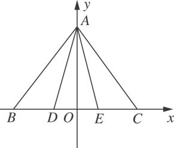
所以＝(－，－)，＝，所以·＝·＝－＋＝．

极化恒等式法　取<em>DE</em>中点<em>F</em>，连接<em>AF</em>，则·＝|<em>AF</em>|2－|<em>DF</em>|2＝－＝．

6．在△*ABC*中，|＋|＝|－|，*AB*＝2，*AC*＝1，*E*，*F*为*BC*的三等分点，则·等于(　　)

A．　　　　　　　　
B．　　　　　　　　
C．　　　　　　　　
D．

6．答案　B　解析　坐标法　由|＋|＝|－|，化简得·＝0，又因为*AB*和*AC*为三角形的两

条边，它们的长不可能为0，所以*AB*与*AC*垂直，所以△*ABC*为直角三角形．以*A*为原点，以*AC*所在直线为*x*轴，以*AB*所在直线为*y*轴建立平面直角坐标系，如图所示，则*A*(0，0)，*B*(0，2)，*C*(1，0)．不妨令*E*为*BC*的靠近*C*的三等分点，则*E*，*F*，所以＝，＝，所以·＝×＋×＝．

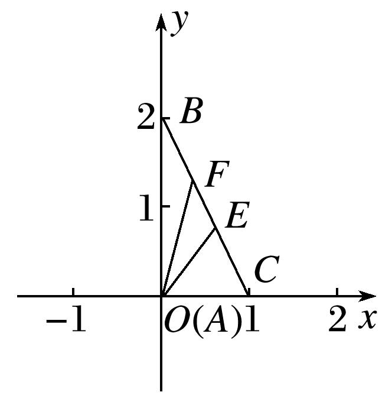

极化恒等式法　取<em>EF</em>中点<em>M</em>，连接<em>AM</em>，则·＝|<em>AM</em>|2－|<em>EM</em>|2＝－＝．

7．如图，在平行四边形*ABCD*中，已知*AB*＝8，*AD*＝5，＝3，·＝2，则·的值是(　　)

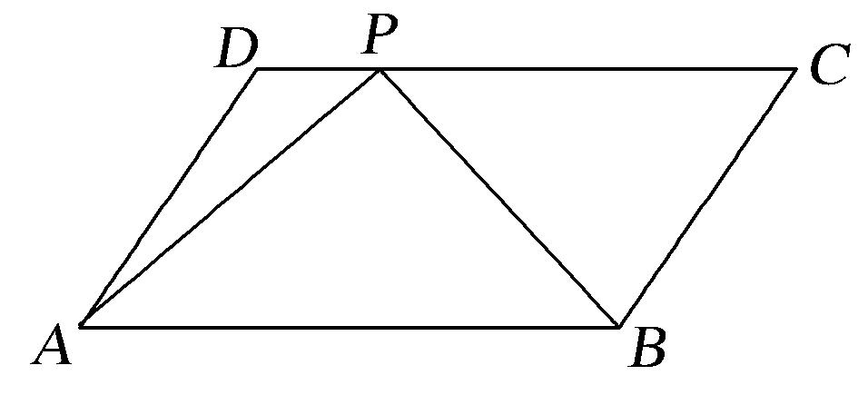

A．44　　　　　　　　
B．22　　　　　　　　
C．24　　　　　　　　
D．72

7．答案　B　解析　如图，取<em>AB</em>中点<em>E</em>，连接<em>EP</em>并延长，交<em>AD</em>延长线于<em>F</em>，·＝<em>EP</em>2－<em>AE</em>2＝<em>EP</em>2

－16＝2，∴<em>EP</em>＝3，又∵＝3，＝，＝，∴<em>AE</em>＝2<em>DP</em>，即△<em>FAE</em>中，<em>DP</em>为中位线，<em>AF</em>＝2<em>AD</em>＝10，<em>AE</em>＝<em>AB</em>＝4，<em>FE</em>＝2<em>PE</em>＝6，<em>AP</em>2＝40，·＝·＝<em>AP</em>2－<em>EP</em>2＝40－（3）2＝22．

8．如图，在△*ABC*中，已知*AB*＝4，*AC*＝6，∠*A*＝60°，点*D*，*E*分别在边*AB*，*AC*上，且＝2，

＝2，若*F*为*DE*的中点，则·的值为\_\_\_\_\_\_\_\_．

8．答案　4　解析　取*BD*的中点*N*，连接*NF*，*EB*，则*BE*⊥*AE*，∴*BE*＝2．在△*DEB*中．*FN*∥*EB*．∴*FN*

＝．·＝2·＝2(<em>FN</em>2－<em>DN</em>2)＝4．

9．如图，在△*ABC*中，已知*AB*＝3，*AC*＝2，∠*BAC*＝120°，*D*为边*BC*的中点，若*CD*⊥*AD*，垂足为*E*，
则·＝\_\_\_\_\_\_\_\_．

9．答案　－　解析　由余弦定理得，<em>BC</em>2＝<em>AB</em>2＋<em>AC</em>2－2 <em>AB</em>·<em>AC</em>·cos120°＝19，即<em>BC</em>＝，因为·

<em>AD</em>2－<em>CD</em>2＝|<em>AB</em>|·|<em>AC</em>|·cos120°＝－3，所以|<em>AD</em>|＝，因为<em>S</em>△<em>ABC</em>＝2<em>S</em>△<em>ADC</em>，则|<em>AB</em>|·|<em>AC</em>|·sin120°＝2·|<em>AD</em>||<em>CE</em>|，解得|<em>CE</em>|＝，在Rt△<em>DEC</em>中，|<em>DE</em>|＝＝，所以·＝|<em>ED</em>|2－|<em>CD</em>|2＝－．

10．在平面四边形*ABCD*中，点*E*，*F*分别是边*AD*，*BC*的中点，且*AB*＝1，*EF*＝，*CD*＝，若·

＝15．则·的值为\_\_\_\_\_\_\_\_．

10．答案　　解析　极化恒等式　如图，取中点，四边形中，易知

三线共点于，，又，在中，，由中线长公式知,从而，=．

基向量法　，，，

，，则

，可化为，

．

考点二　平面向量数量积的最值(范围)问题

【方法总结】
利用极化恒等式求数量积的最值(范围)问题的步骤  
（1）取第三边的中点，连接向量的起点与中点；  
（2）利用积化恒等式将数量积转化为中线长与第三边长的一半的平方差；  
（3）求中线长的最值(范围)，从而得到数量的最值(范围)．

积化恒等式适用于求对共起点(终点)的两向量的数量积的最值(范围)问题，利用极化恒等式将多变量转变为单变量，再用数形结合等方法求出单变量的范围．对于不共起点和不共终点的问题可通过平移转化法等价转化为对共起点(终点)的两向量的数量积的最值(范围)问题，从而用极化恒等式解决．在运用极化恒等式求数量积的最值(范围)时，关键在于取第三边的中点，找到三角形的中线，再写出极化恒等式，难点在于求中线长的最值(范围)，通过观察或用点到直线的距离最小或用三角形两边之和大于等于第三边，两边之差小于第三边或用基本不等式等求得中线长的最值(范围)，从而得到数量的最值(范围)．

【例题选讲】

<strong>[例1]</strong>（1）若平面向量<em><strong>a</strong></em>，<em><strong>b</strong></em>满足|2<em><strong>a</strong></em>－<em><strong>b</strong></em>|≤，则<em><strong>a</strong></em>·<em><strong>b</strong></em>的最小值为\_\_\_\_\_\_\_\_．
答案　－　解析　<em><strong>a</strong></em>·<em><strong>b</strong></em>＝[(2<em><strong>a</strong></em>＋<em><strong>b</strong></em>)2－(2<em><strong>a</strong></em>－<em><strong>b</strong></em>)2]＝[|2<em><strong>a</strong></em>＋<em><strong>b</strong></em>|2－|2<em><strong>a</strong></em>－<em><strong>b</strong></em>|2]≥＝－．当且仅当|2<em><strong>a</strong></em>＋<em><strong>b</strong></em>|＝0，|2<em><strong>a</strong></em>－<em><strong>b</strong></em>|＝3，即|<em><strong>a</strong></em>|＝，|<em><strong>b</strong></em>|＝，&lt; <em><strong>a</strong></em>，<em><strong>b</strong></em> &gt;＝π时，<em><strong>a</strong></em>·<em><strong>b</strong></em>取最小值－．  
（2）如图，在同一平面内，点*A*位于两平行直线*m*，*n*的同侧，且*A*到*m*，*n*的距离分别为1，3，点*B*，*C*分别在*m*，*n*上，|＋|＝5，则·的最大值是\_\_\_\_\_\_\_\_．

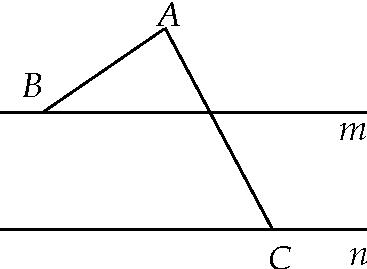
答案　　解析　坐标法　以直线<em>n</em>为<em>x</em>轴，过点<em>A</em>且垂直于<em>n</em>的直线为<em>y</em>轴，建立如图所示的平面直角坐标系<em>xOy</em>，如图：则<em>A</em>，<em>C，B</em>，则＝，＝，从而2＋2＝52，即2＝9，又·＝<em>bc</em>＋3≤＋3＝，当且仅当<em>b</em>＝<em>c</em>时，等号成立．

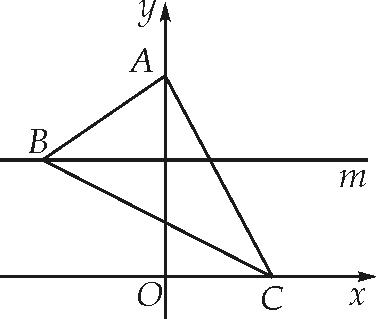

极化恒等式　连接<em>BC</em>，取<em>BC</em>的中点<em>D</em>，·＝<em>AD2</em>－<em>BD2</em>，又<em>AD</em>＝＝，故·＝－<em>BD2</em>＝－<em>BC2</em>，又因为<em>BCmin</em>＝3－1＝2，所以(·) <em>max</em>＝．

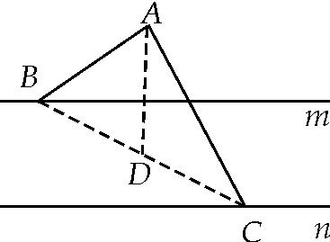  
（3）(2017·全国Ⅱ)已知△*ABC*是边长为2的等边三角形，*P*为平面*ABC*内一点，则·(＋)的最小值是(　　)

A．－2　　　　　　　　
B．－　　　　　　　　
C．－　　　　　　　　
D．－1
答案　B　解析　方法一　(解析法)　建立坐标系如图①所示，则*A*，*B*，*C*三点的坐标分别为*A*(0，)，*B*(－1，0)，*C*(1，0)．设*P*点的坐标为(*x*，*y*)，

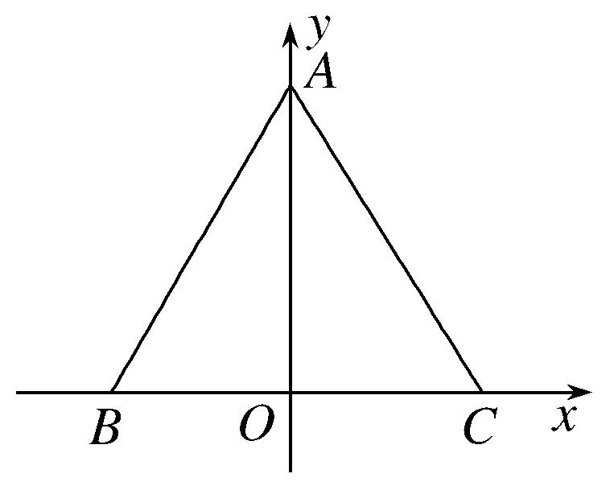  
图①
则＝(－<em>x</em>，－<em>y</em>)，＝(－1－<em>x</em>，－<em>y</em>)，＝(1－<em>x</em>，－<em>y</em>)，∴·(＋)＝(－<em>x</em>，－<em>y</em>)·(－2<em>x</em>，－2<em>y</em>)＝2(<em>x</em>2＋<em>y</em>2－<em>y</em>)＝2≥2×＝－．当且仅当<em>x</em>＝0，<em>y</em>＝时，·(＋)取得最小值，最小值为－．故选B．
方法二　(几何法)　如图②所示，＋＝2(*D*为*BC*的中点)，则·(＋)＝2·．

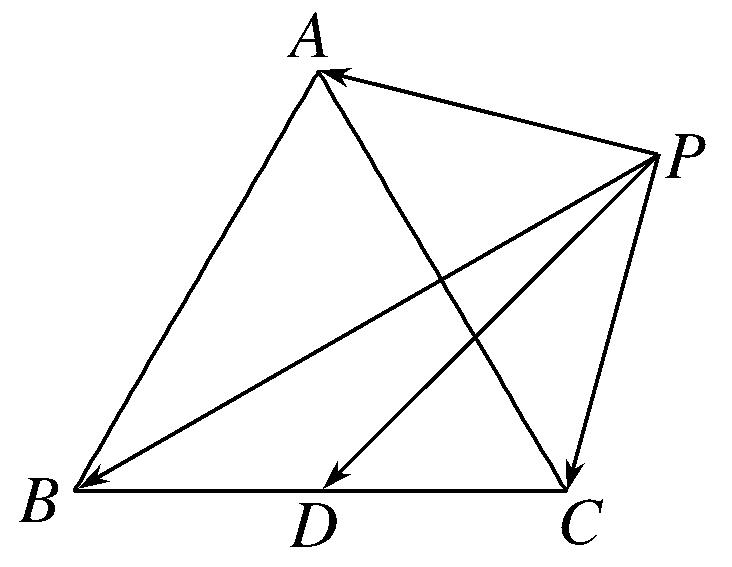  
图②

要使·最小，则与方向相反，即点<em>P</em>在线段<em>AD</em>上，则(2·)min＝－2||||，问题转化为求||||的最大值．又当点<em>P</em>在线段<em>AD</em>上时，||＋||＝||＝2×＝，∴||||≤2＝2＝，∴[·(＋)]min＝(2·)min＝－2×＝－．故选B．

极化恒等式法　设<em>BC</em>的中点为<em>D</em>，<em>AD</em>的中点为<em>M</em>，连接<em>DP</em>，<em>PM</em>，∴·(＋)＝2·＝2||2－||2＝2||2－≥－．当且仅当<em>M</em>与<em>P</em>重合时取等号．

  
（4）已知正三角形*ABC*内接于半径为2的圆*O*，点*P*是圆*O*上的一个动点，则·的取值范围是\_\_\_\_\_\_\_\_．
答案　[－2，6]　解析　取<em>AB</em>的中点<em>D</em>，连接<em>CD</em>，因为三角形<em>ABC</em>为正三角形，所以<em>O</em>为三角形<em>ABC</em>的重心，<em>O</em>在<em>CD</em>上，且<em>OC</em>＝2<em>OD</em>＝2，所以<em>CD</em>＝3，<em>AB</em>＝2．又由极化恒等式得：·＝|<em>PD</em>|2－|<em>AB</em>|2＝|<em>PD</em>|2－3，因为<em>P</em>在圆<em>O</em>上，所以当<em>P</em>在点<em>C</em>处时，|<em>PD</em>|max＝3，当<em>P</em>在<em>CO</em>的延长线与圆<em>O</em>的交点处时，|<em>PD</em>|min＝1，所以·∈[－2，6]．

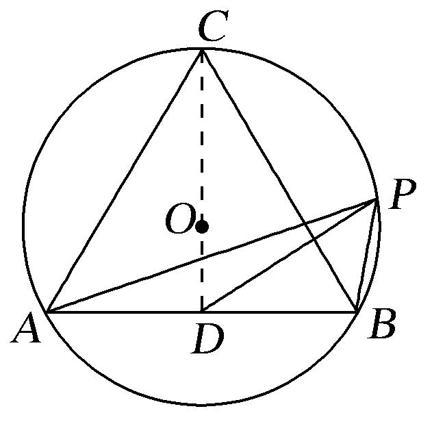  
（5）如图，已知*P*是半径为2，圆心角为的一段圆弧*AB*上的一点，若＝2，则·的最小值为\_\_\_\_\_．

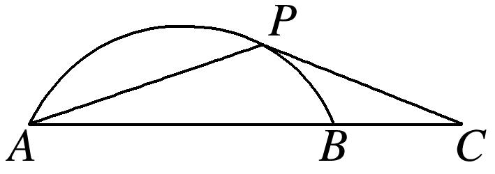
答案　5－2　解析　通法　以圆心为坐标原点，平行于*AB*的直径所在直线为*x*轴，*AB*的垂直平分线所在的直线为*y*轴，建立平面直角坐标系(图略)，则*A*(－1，)，*C*(2，)，设*P*(2cos *θ*，2sin *θ*)，则·＝(2－2cos *θ*，－2sin *θ*)·(－1－2cos *θ*，－2sin *θ*)＝5－2cos *θ*－4sin *θ*＝5－2sin(*θ*＋*φ*)，其中0<tan *φ*＝<，所以0<*φ*<，当*θ*＝－*φ*时，·取得最小值，为5－2．

极化恒等式法　设圆心为<em>O</em>，由题得<em>AB</em>＝2，∴<em>AC</em>＝3．取<em>AC</em>的中点<em>M</em>，由极化恒等式得·＝2－2＝2－，要使·取最小值，则需<em>PM</em>最小，当圆弧的圆心与点<em>P</em>，<em>M</em>共线时，<em>PM</em>最小．易知<em>DM</em>＝，∴<em>OM</em>＝＝，所以<em>PM</em>有最小值为2－，代入求得·的最小值为5－2．  
（6）在面积为2的△<em>ABC</em>中，<em>E</em>，<em>F</em>分别是<em>AB</em>，<em>AC</em>的中点，点<em>P</em>在直线<em>EF</em>上，则·＋2的最小值是\_\_\_\_\_\_\_\_．
答案　2　解析　取<em>BC</em>的中点为<em>D</em>，连接<em>PD</em>，则由极化恒等式得·＋2＝2－＋2＝2＋≥＋，此时当且仅当⊥时取等号，·＋2≥＋≥2＝2．

另解　取<em>BC</em>边的中点<em>M</em>，连接<em>PM</em>，设点<em>P</em>到<em>BC</em>边的距离为<em>h</em>．则<em>S</em>△<em>ABC</em>＝··2<em>h</em>＝2⇒＝，<em>PM</em>≥<em>h</em>，所以·＋2＝＋2＝2＋2＝2＋≥<em>h</em>2＋≥2(当且仅当＝<em>h</em>，<em>h</em>2＝时，等号成立)

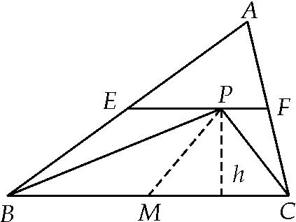

【对点训练】

1．已知*AB*是圆*O*的直径，*AB*长为2，*C*是圆*O*上异于*A*，*B*的一点，*P*是圆*O*所在平面上任意一点，
则(＋)·的最小值为(　　)

A．－　　　　　　　　
B．－　　　　　　　　
C．－　　　　　　　　
D．－1

1．答案　C　解析　＋＝2，∴(＋)·＝2·，取*OC*中点*D*，由极化恒等式得，·

＝|<em>PD</em>|2－|<em>CD</em>|2＝|<em>PD</em>|2－，又|<em>PD</em>|＝0，∴(＋)·的最小值为－．

2．如图，设*A*，*B*是半径为2的圆*O*上的两个动点，点*C*为*AO*中点，则·的取值范围是(　　)

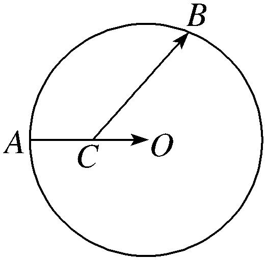

A．[－1，3]　　　　　　
B．[1，3]　　　　　　
C．[－3，－1]　　　　　　
D．[－3，1]

2．答案　A　解析　建立平面直角坐标系如图所示，可得*O*(0，0)，*A*(－2，0)，*C*(－1，0)，设*B*(2cos *θ*，

2sin*θ*)．*θ*∈[0，2π)．则·＝(1，0)·(2cos *θ*＋1，2sin *θ*)＝2cos *θ*＋1∈[－1，3]．故选A．

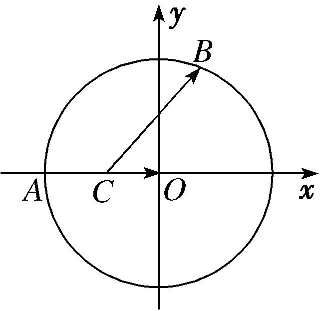

极化恒等式法　连接<em>OB</em>，取<em>OB</em>的中<em>D</em>，连接<em>CD</em>，则·＝|<em>CD</em>|2－|<em>BD</em>|2＝<em>CD</em>2－1，又|<em>CD</em>|＝0，∴·的最小值为－1．|<em>CD</em>|＝2，∴·的最大值为3．

3．如图，在半径为1的扇形*AOB*中，∠*AOB*＝，*C*为弧上的动点，*AB*与*OC*交于点*P*，则·的最

小值为\_\_\_\_\_\_\_\_．

3．答案　－　解析　取<em>OB</em>的中点<em>D</em>，连接<em>PD</em>，则·＝||2－||2＝||2－，于是只要求求

*PD*的最小值即可，由图可知，当*PD*⊥*AB*，时，*PD*＝，即所求最小值为－．

4．(2020·天津)如图，在四边形*ABCD*中，∠*B*＝60°，*AB*＝3，*BC*＝6，且＝*λ*，·＝－，则实

数*λ*的值为\_\_\_\_\_\_\_\_，若*M*，*N*是线段*BC*上的动点，且||＝1，则·的最小值为\_\_\_\_\_\_\_\_．

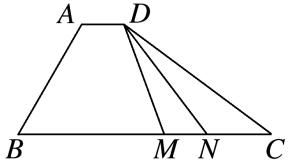

4．答案　　　解析　第1空　因为＝*λ*，所以*AD*∥*BC*，则∠*BAD*＝120°，所以·＝||·|

|·cos 120°＝－，解得||＝1．因为，同向，且*BC*＝6，所以＝，即*λ*＝．

第2空　通法　在四边形*ABCD*中，作*AO*⊥*BC*于点*O*，则*BO*＝*AB*·cos 60°＝，*AO*＝*AB*·sin 60°＝．以*O*为坐标原点，以*BC*和*AO*所在直线分别为*x*，*y*轴建立平面直角坐标系．如图，设*M*(*a，* 0)，不妨设点*N*在点*M*右侧，

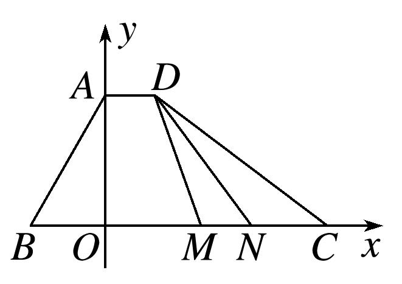
则<em>N</em>(<em>a</em>＋1，0)，且－≤<em>a</em>≤．又<em>D</em>，所以＝，＝，所以·＝<em>a</em>2－<em>a</em>＋＝2＋．所以当<em>a</em>＝时，·取得最小值．

极化恒等式法　如图，取<em>MN</em>的中点<em>P</em>，连接<em>PD</em>，则·＝2－2＝2－，当⊥时，||2取最小值，所以·的最小值为．

5．在△*ABC*中，*AC*＝2*BC*＝4，∠*ACB*为钝角，*M*，*N*是边*AB*上的两个动点，且*MN*＝1，若的

最小值为，则cos∠*ACB*＝\_\_\_\_\_\_\_\_．

5．答案　　解析　取*MN*的中点*P*，则由极化恒等式得，∵

的最小值为，∴，由平几知识知：当<em>CP</em>⊥<em>AB</em>时，<em>CP</em>最小，如图，作<em>CH</em>⊥<em>AB</em>，<em>H</em>为垂足，则<em>CH</em>＝1，又<em>AC</em>＝2<em>BC</em>＝4，所以∠<em>B</em>＝30o，sin<em>A</em>=，所以cos∠<em>ACB</em>＝cos（150o －<em>A</em>）=．

6．已知*AB*为圆*O*的直径，*M*为圆*O*的弦*CD*上一动点，*AB*＝8，*CD*＝6，则·的取值范围是\_\_\_\_\_\_\_\_．

6．答案　[－9，0]　解析　如图，·＝2－2＝2－16，∵||≤||≤||，∴≤||≤4，
∴·的取值范围是[－9，0]．

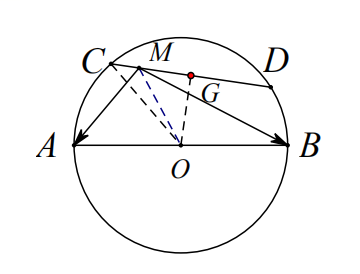

7．如图，设正方形*ABCD*的边长为4，动点*P*在以*AB*为直径的弧*APB*上，则·的取值范围为\_\_\_\_\_\_．

7．答案　[0，16]　解析　如图取<em>CD</em>的中点<em>E</em>，连接<em>PE</em>，·＝2－2＝2－2，2≤||≤2，
所以·的取值范围为[0，16]．

8．已知正△*ABC*内接于半径为2的圆*O*，*E*为线段*BC*上的一个动点，延长*AE*交圆*O*于点*F*，则·

的取值范围是\_\_\_\_\_\_\_\_．

8．答案　[0，6]　解析　取*AB*的中点*D*，连接*CD*，因为三角形*ABC*为正三角形，所以*O*为三角形*ABC*

的重心，<em>O</em>在<em>CD</em>上，且<em>OC</em>＝2<em>OD</em>＝2，所以<em>CD</em>＝3，<em>AB</em>＝2．又由极化恒等式得：·＝|<em>FD</em>|2－|<em>AD</em>|2＝|<em>FD</em>|2－3，因为<em>F</em>在劣弧<em>BC</em>上，所以当<em>F</em>在点<em>C</em>处时，|<em>FD</em>|max＝3，当<em>F</em>在点<em>B</em>处时， |<em>PD</em>|min＝，所以·∈[0，6]．

9．已知*AB*是半径为4的圆*O*的一条弦，圆心*O*到弦*AB*的距离为1，*P*是圆*O*上的动点，则·的取

值范围为\_\_\_\_\_\_\_\_\_．

9．答案　[－6，10]　解析　极化恒等式法　设<em>AB</em>的中点为<em>C</em>，连接<em>CP</em>，则·＝||2－||2＝||2

－15．||2－15≥25－15＝10，||2－15≤9－15＝－6．

10．矩形*ABCD*中，*AB*＝3，*BC*＝4，点*M*，*N*分别为边*BC*，*CD*上的动点，且*MN*＝2，则·的最小

值为\_\_\_\_\_\_\_\_．

10．答案　15　解析　取<em>K</em>为<em>MN</em>中点，由极化恒等式，·＝|<em>AK</em>|2－1，显然<em>K</em>的轨迹是以点<em>C</em>为圆

心，1为半径的圆周在矩形内部的圆弧，所以|<em>AK</em>|<em>min</em>＝5－1＝4，所以·的最小值为15．

11．在△*ABC*中，已知*AB*＝，*C*＝，则·的最大值为\_\_\_\_\_\_\_\_．

11．答案　　解析　设*D*是*AB*的中点，连接*CD*，点*O*是△*ABC*的外心，连接*DO*并延长交圆*O*于*C*´，
由△<em>ABC</em>´是等边三角形，∵<em>AD</em>＝，∴<em>C</em>´<em>D</em>＝，则·＝||2－||2＝||2－()2≤||2－＝()2－＝．∴(·)<em>max</em>＝．

12．已知在△<em>ABC</em>中，<em>P</em>0是边<em>AB</em>上一定点，满足<em>P</em>0<em>B</em>＝<em>AB</em>，且对于边<em>AB</em>上任一点<em>P</em>，恒有·≥·

，则(　　)

A．∠*ABC*＝90°　　　　　
B．∠*BAC*＝90°　　　　　
C．*AB*＝*AC*　　　　　
D．*AC*＝*BC*

12．答案　D　解析　如图所示，取<em>AB</em>的中点<em>E</em>，因为<em>P</em>0<em>B</em>＝<em>AB</em>，所以<em>P</em>0为<em>EB</em>的中点，取<em>BC</em>的中点

<em>D</em>，则<em>DP</em>0为△<em>CEB</em>的中位线，<em>DP</em>0∥<em>CE</em>．

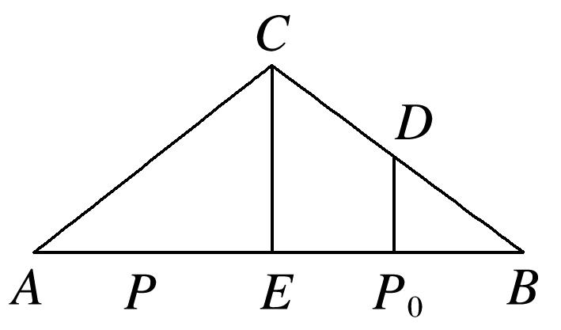
根据向量的极化恒等式，有·＝2－2，·＝2－2．又·≥·，则||≥||恒成立，必有<em>DP</em>0⊥<em>AB</em>．因此<em>CE</em>⊥<em>AB</em>，又<em>E</em>为<em>AB</em>的中点，所以<em>AC</em>＝<em>BC</em>．

13．在正方形*ABCD*中，*AB*＝1，*A*，*D*分别在*x*，*y*轴的非负半轴上滑动，则·的最大值为\_\_\_\_\_\_．

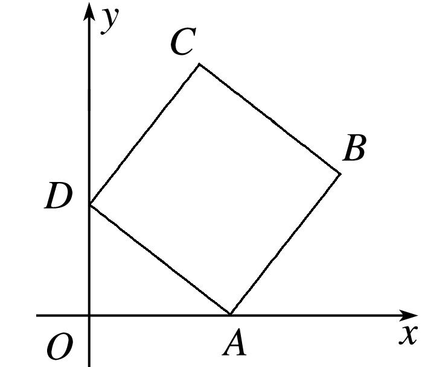

13．答案　2　解析　如图取<em>BC</em>的中点<em>E</em>，取<em>AD</em>的中点<em>F</em>，·＝2－2＝2－，而||≤||

＋||＝|||＋|||＝＋1＝，当且仅当*O*，*F*，*E*三点共线时取等号．，所以·的最大值为2．

14．在三角形*ABC*中，*D*为*AB*中点，∠*C*＝90°，*AC*＝4，*BC*＝3，*E*，*F*分别为*BC*，*AC*上的动点，且

*EF*＝1，则·最小值为\_\_\_\_\_\_\_\_．

14．答案　　解析　设*EF*的中点为*M*，连接*CM*，则||＝，即点*M*在如图所示的圆弧上，则·

＝||2－||2＝||2－≥||<em>CD</em>|－|2－＝．

15．在Rt*ABC*中，∠*C*＝90°，*AC*＝3，*AB*＝5，若点*A*，*B*分别在*x*，*y*轴的非负半轴上滑动，则·的

最大值为\_\_\_\_\_\_\_\_．

15．答案　18　解析　如图取<em>AC</em>的中点<em>M</em>，取<em>AB</em>的中点<em>N</em>，则·＝2－2＝2－()2≤(2

－2)－()2＝(2＋)2－()2＝18．

16．已知正方形*ABCD*的边长为2，点*F*为*AB*的中点，以*A*为圆心，*AF*为半径作弧交*AD*于*E*，若*P*为

劣弧*EF*上的动点，则·的最小值为\_\_\_\_\_\_．

16．答案　5－2　解析　如图取<em>CD</em>的中点<em>M</em>，·＝<em>PM</em>2－<em>DM</em>2＝<em>PM</em>2－1，而|<em>PM</em>|＋1＝|<em>PM</em>|＋

|<em>AP</em>|≥|<em>AM</em>|＝，当且仅当<em>P</em>，<em>Q</em>重合时等号成立，所以·的最小值为(－1)2－1＝5－2．

17．如图，已知*B*，*D*是直角*C*两边上的动点，*AD*⊥*BD*，||＝，∠*BAD*＝，＝(＋)，＝

(＋)，则·的最大值为\_\_\_\_\_\_\_\_．

17．答案　　解析　设<em>MN</em>的中点为<em>G</em>，<em>BD</em>的中点为<em>H</em>，·＝||2－||2＝||2－，
∵||≤||＋||＝＋，∴·≤(＋)2－＝．所以·的最大值为．

18．如图，在平面四边形*ABCD*中，*AB*⊥*BC*，*AD*⊥*CD*，∠*BCD*＝60°，*CB*＝*CD*＝2．若点*M*为边*BC*

上的动点，则·的最小值为\_\_\_\_\_\_\_\_．

18．答案　　解析　设*E*是*AD*的中点，作*EN*⊥*BC*于*N*，延长*CB*交*DA*的延长线于*F*，由题意可得：

*FD*＝*CD*＝6，*FC*＝2*CD*＝4，∴*BF*＝2，∴*AB*＝2，*FA*＝4，∴*AD*＝2，＝＝，*EN*＝．
则·＝·＝||2－||2＝||2－1≥<em>EN</em>2－1＝()2－1＝．∴·＝．

另解　设<em>E</em>是<em>AD</em>的中点，作<em>EF</em>⊥<em>BC</em>于<em>F</em>，作<em>AG</em>⊥<em>EF</em>于<em>G</em>，∵<em>AB</em>⊥<em>BC</em>，<em>AD</em>⊥<em>CD</em>，∴四边形<em>ABCD</em>共圆，如图，由圆的对称性及∠<em>BCD</em>＝60°，<em>CB</em>＝<em>CD</em>＝2，可知∠<em>BCA</em>＝∠<em>DCA</em>＝30°，∴<em>AB</em>＝2，∵∠<em>GAE</em>＝30°，∴<em>GE</em>＝，∴<em>EF</em>＝2＋＝，则·＝·＝||2－||2＝||2－1≥<em>EN</em>2－1＝()2－1＝．∴·＝．

19．(2018·天津)如图，在平面四边形*ABCD*中，*AB*⊥*BC*，*AD*⊥*CD*，∠*BAD*＝120°，*AB*＝*AD*＝1．若点*E*

为边*CD*上的动点，则·的最小值为\_\_\_\_\_\_\_\_．

19．答案　　解析　通法　如图，以*D*为坐标原点建立直角坐标系．连接*AC*，由题意知∠*CAD*＝∠*CAB*

＝60°，∠<em>ACD</em>＝∠<em>ACB</em>＝30°，则<em>D</em>(0，0)，<em>A</em>(1，0)，<em>B</em>，<em>C</em>(0，)．设<em>E</em>(0，<em>y</em>)(0≤<em>y</em>≤)，则＝(－1，<em>y</em>)，＝，所以·＝＋<em>y</em>2－<em>y</em>＝2＋，所以当<em>y</em>＝时，·有最小值．

极化恒等式法　如图，取<em>AB</em>的中点<em>P</em>，连接<em>PE</em>，则·＝2－2＝2－，当⊥时，||取最小值，由几何关系可知，此时，2＝，所以·的最小值为．

20．如图，圆*O*为Rt△*ABC*的内切圆，已知*AC*＝3，*BC*＝4，*C*＝，过圆心*O*的直线*l*交圆于*P*，*Q*两点，
则·的取值范围为\_\_\_\_\_\_\_\_．

20．答案　[－7，1]　解析　易知，圆的半径为1，·＝(＋)·＝·＋·＝·－·

，·＝2－2＝2－1＝1．·＝||||cos∠<em>BCQ</em>＝2||cos∠<em>BCQ</em>，(||cos∠<em>BCQ</em>)<em>min</em>＝0，(||cos∠<em>BCQ</em>)<em>max</em>＝4．所以·的取值范围为[－7，1]．

21．在三棱锥*S*－*ABC*中，*SA*，*SB*，*SC*两两垂直，且*SA*＝*SB*＝*SC*＝2，点*M*为三棱锥*S*－*ABC*的外接球

面上任意一点，则·的最大值为\_\_\_\_\_\_\_\_．

21．答案　2＋2　解析　如图，·＝2－2．当<em>M</em>，<em>A</em>，<em>B</em>在同一个大圆上且<em>MO</em>1⊥<em>AB</em>，点<em>M</em>与

线段<em>AB</em>在球心的异侧时，||最大，又2<em>R</em>＝＝2，所以<em>R</em>＝．||<em>max</em>＝＋1，2－2的最大值为2＋2．

22．如图所示，正方体<em>ABCD</em>－<em>A</em>1<em>B</em>1<em>C</em>1<em>D</em>1的棱长为2，<em>MN</em>是它的内切球的一条弦(我们把球面上任意两点

之间的线段称为球的弦)，*P*为正方体表面上的动点，当弦*MN*的长度最大时，·的取值范围是\_\_\_\_\_\_\_\_．

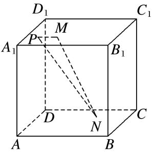

22．答案　[0，2]　解析　由正方体的棱长为2，得内切球的半径为1，正方体的体对角线长为2．当弦

<em>MN</em>的长度最大时，<em>MN</em>为球的直径．设内切球的球心为<em>O</em>，则·＝2－2＝2－1．由于<em>P</em>为正方体表面上的动点，故<em>OP</em>∈[1，]，所以·∈[0，2]．

23．已知线段*AB*的长为2，动点*C*满足·＝*λ*（*λ*为常数），且点*C*总不在以点*B*为圆心，为半径的

圆内，则负数*λ*的最大值为\_\_\_\_\_\_\_\_．

23．答案　－　解析　如图取<em>AB</em>的中点为<em>D</em>，连接<em>CD</em>，则·＝||2－1＝<em>λ</em>，||＝，，
又由点*C*总不在以点*B*为圆心，为半径的圆内，故≤，则负数*λ*的最大值为－．

24．若点*O*和点*F*分别为椭圆＋＝1的中心和左焦点，点*P*为椭圆上的任意一点，则·的最大值

为(　　)

A．2　　　　　　　　
B．3　　　　　　　　
C．6　　　　　　　　
D．8

24．答案　C　解析　如图，由已知|<em>OF</em>|＝1，取<em>FO</em>中点<em>E</em>，连接<em>PE</em>，由极化恒等式得：·＝|<em>PE</em>|2－

|<em>OF</em>|2＝|<em>PE</em>|2－，∵|<em>PE</em>|＝，∴·的最大值为6．

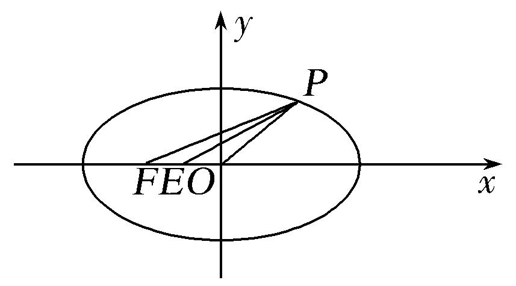

