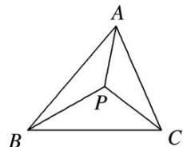
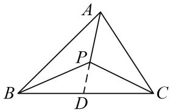
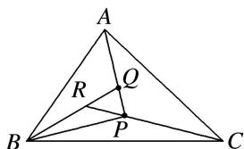
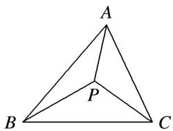

# 专题九 平面向量的奔驰定理

#### 1. 奔驰定理
如图，已知 P 为 $\triangle ABC$ 内一点，则有 $S_{\triangle PBC} \cdot \overrightarrow{PA} + S_{\triangle PAC} \cdot \overrightarrow{PB} + S_{\triangle PAB} \cdot \overrightarrow{PC} = 0$ .

证明：如图，延长 $AP$ 与 $BC$ 边相交于点则 $D$ ， $\frac{BD}{DC} = \frac{S_{\triangle ABD}}{S_{\triangle ACD}} = \frac{S_{\triangle BPD}}{S_{\triangle CPD}} = \frac{S_{\triangle ABD} - S_{\triangle BPD}}{S_{\triangle ACD} - S_{\triangle CPD}} = \frac{S_{\triangle PAB}}{S_{\triangle PAC}}$
$\because \overrightarrow {P D} = \frac {D C}{B C} \overrightarrow {P B} + \frac {B D}{B C} \overrightarrow {P C}, \therefore \overrightarrow {P D} = \frac {S _ {\triangle P A C}}{S _ {\triangle P A C} + S _ {\triangle P A B}} \overrightarrow {P B} + \frac {S _ {\triangle P A B}}{S _ {\triangle P A C} + S _ {\triangle P A B}} \overrightarrow {P C},$
$\because \frac {P D}{P A} = \frac {S _ {\triangle B P D}}{S _ {\triangle B P A}} = \frac {S _ {\triangle C P D} S _ {\triangle B P D} + S _ {\triangle C P D}}{S _ {\triangle C P A} S _ {\triangle B P A} + S _ {\triangle C P A}} = \frac {S _ {\triangle P B C}}{S _ {\triangle P A C} + S _ {\triangle P A B}}, \quad \therefore \overrightarrow {P D} = - \frac {S _ {\triangle P B C}}{S _ {\triangle P A C} + S _ {\triangle P A B}} \overrightarrow {P A},$
即 $-\frac{S_{\triangle PBC}}{S_{\triangle PAC} + S_{\triangle PAB}}\overrightarrow{PA} = \frac{S_{\triangle PAC}}{S_{\triangle PAC} + S_{\triangle PAB}}\overrightarrow{PB} +\frac{S_{\triangle PAB}}{S_{\triangle PAC} + S_{\triangle PAB}}\overrightarrow{PC},\therefore S_{\triangle PBC}\cdot \overrightarrow{PA} +S_{\triangle PAC}\cdot \overrightarrow{PB} +S_{\triangle PAB}\cdot \overrightarrow{PC} = 0.$

由于这个定理对应的图象和奔驰车的标志很相似，我们把它称为“奔驰定理”。这个定理对于利用平面向量解决平面几何问题，尤其是解决跟三角形的面积和“四心”相关的问题，有着决定性的基石作用。奔驰定理是三角形四心向量式的完美统一。

推论：已知 P 为 $\triangle ABC$ 内一点，且 $x\overrightarrow{PA} + y\overrightarrow{PB} + z\overrightarrow{PC} = 0$ . (x, y, $z \in R$ , $xyz \neq 0$ , $x + y + z \neq 0$ ). 则有  
（1） $S_{\triangle PBC}: S_{\triangle PAC}: S_{\triangle PAB} = |x|: |y|: |z|$ .  
（2） $\frac{S_{\triangle PBC}}{S_{\triangle ABC}} = |\frac{x}{x + y + z} |, \frac{S_{\triangle PAC}}{S_{\triangle ABC}} = |\frac{y}{x + y + z} |, \frac{S_{\triangle PAB}}{S_{\triangle ABC}} = |\frac{z}{x + y + z} |.$

# 【例题选讲】

[例 1]（1）设点 O 在 $\triangle ABC$ 的内部，且有 $\overrightarrow{OA} + 2\overrightarrow{OB} + 3\overrightarrow{OC} = 0$ ，则 $\triangle ABC$ 的面积和 $\triangle AOC$ 的面积之比为（）

A. 3

B. $\frac{5}{3}$

C. 2

D. $\frac{3}{2}$  
（2）在 $\triangle ABC$ 中， $D$ 为 $\triangle ABC$ 所在平面内一点，且 $\overrightarrow{AD}=\frac{1}{3}\overrightarrow{AB}+\frac{1}{2}\overrightarrow{AC}$ ，则 $\frac{S_{\triangle BCD}}{S_{\triangle ABD}}$ 等于( )

A. $\frac{1}{6}$

B. $\frac{1}{3}$

C. $\frac{1}{2}$

D. $\frac{2}{3}$  
（3）已知点 A, B, C, P 在同一平面内， $\overrightarrow{PQ}=\frac{1}{3}\overrightarrow{PA}$ ， $\overrightarrow{QR}=\frac{1}{3}\overrightarrow{QB}$ ， $\overrightarrow{RP}=\frac{1}{3}\overrightarrow{RC}$ ，则 $S_{\triangle ABC}:S_{\triangle PBC}$ 等于()

A. 14:3

B. 19:4

C. 24:5

D. 29:6  
（4）已知点 $P$ ， $Q$ 在 $\triangle ABC$ 内， $\overrightarrow{PA} +2\overrightarrow{PB} +3\overrightarrow{PC} = 2\overrightarrow{QA} +3\overrightarrow{QB} +5\overrightarrow{QC} = 0$ ，则 $\frac{|\overrightarrow{PQ}|}{|\overrightarrow{AB}|}$ 等于（

A. $\frac{1}{30}$

B. $\frac{1}{31}$

C. $\frac{1}{32}$

D. $\frac{1}{33}$  
（5）点 O 为△ABC 内一点，若 $S_{\triangle AOB}:S_{\triangle BOC}:S_{\triangle AOC}=4:3:2$ ，设 $\overrightarrow{AO}=\lambda\overrightarrow{AB}+\mu\overrightarrow{AC}$ ，则实数 $\lambda$ 和 $\mu$ 的值分别为（）

A. $\frac{2}{9}$ , $\frac{4}{9}$

B. $\frac{4}{9}$ , $\frac{2}{9}$

C. $\frac{1}{9}$ , $\frac{2}{9}$

D. $\frac{2}{9}$ , $\frac{1}{9}$  
（6）设点 P 在 $\triangle ABC$ 内且为 $\triangle ABC$ 的外心， $\angle BAC = 30^{\circ}$ ，如图．若 $\triangle PBC, \triangle PCA, \triangle PAB$ 的面积分别为 $\frac{1}{2}, x, y$ ，则 $x + y$ 的最大值是 \_\_\_\_.

# 【对点训练】

1. 设 $O$ 是 $\triangle ABC$ 内部一点，且 $\overrightarrow{OA} + \overrightarrow{OC} = -2\overrightarrow{OB}$ ，则 $\triangle AOB$ 与 $\triangle AOC$ 的面积之比为 \_\_\_\_.

2. 设 $O$ 在 $\triangle ABC$ 的内部, $D$ 为 $AB$ 的中点, 且 $\overrightarrow{OA} + \overrightarrow{OB} + 2\overrightarrow{OC} = \mathbf{0}$ , 则 $\triangle ABC$ 的面积与 $\triangle AOC$ 的面积的比值为 \_\_\_\_.

3. 已知 P, Q 为 $\triangle ABC$ 中不同的两点，且 $3\overrightarrow{PA} + 2\overrightarrow{PB} + \overrightarrow{PC} = 0$ , $\overrightarrow{QA} + \overrightarrow{QB} + \overrightarrow{QC} = 0$ ，则 $S_{\triangle PAB}: S_{\triangle QAB}$ 为 \_\_\_\_.

4. 已知 D 为 $\triangle ABC$ 的边 AB 的中点，M 在 DC 上满足 $5\overrightarrow{AM} = \overrightarrow{AB} + 3\overrightarrow{AC}$ ，则 $\triangle ABM$ 与 $\triangle ABC$ 的面积比为（）

A. $\frac{1}{5}$

B. $\frac{2}{5}$

C. $\frac{3}{5}$

D. $\frac{4}{5}$

5. 若 M 是 $\triangle ABC$ 内一点，且满足 $\overrightarrow{BA} + \overrightarrow{BC} = 4\overrightarrow{BM}$ ，则 $\triangle ABM$ 与 $\triangle ACM$ 的面积之比为()

A. $\frac{1}{2}$

B. $\frac{1}{3}$

C. $\frac{1}{4}$

D. 2

6. 已知 O 是面积为 4 的 $\triangle ABC$ 内部一点，且有 $\overrightarrow{OA} + \overrightarrow{OB} + 2\overrightarrow{OC} = 0$ ，则 $\triangle AOC$ 的面积为 \_\_\_\_.

7. 已知点 $D$ 为 $\triangle ABC$ 所在平面上一点，且满足 $\overrightarrow{AD} = \frac{1}{5}\overrightarrow{AB} - \frac{4}{5}\overrightarrow{CA}$ ，若 $\triangle ACD$ 的面积为 1，则 $\triangle ABD$ 的面积为 \_\_\_\_.

8. 已知点 $P$ 是 $\triangle ABC$ 的中位线 $EF$ 上任意一点，且 $EF \parallel BC$ ，实数 $x, y$ 满足 $\overrightarrow{PA} + x\overrightarrow{PB} + y\overrightarrow{PC} = 0$ ，设 $\triangle ABC$ ， $\triangle PBC$ ， $\triangle PCA$ ， $\triangle PAB$ 的面积分别为 $S, S_1, S_2, S_3$ ，记 $\frac{S_1}{S} = \lambda_1, \frac{S_2}{S} = \lambda_2, \frac{S_3}{S} = \lambda_3$ ，则 $\lambda_2\lambda_3$ 取最大值时， $3x + y$ 的值为（）

A. $\frac{1}{2}$

B. $\frac{3}{2}$

C. 1

D. 2

