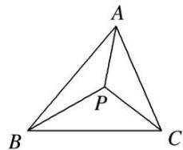
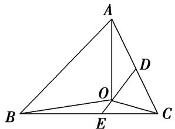
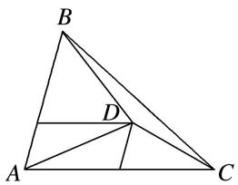
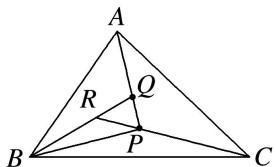
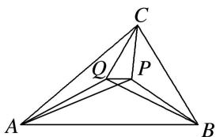
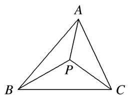
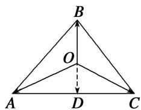
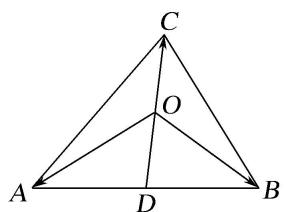
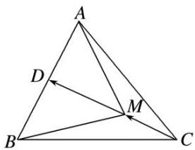
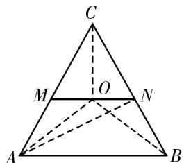

# 专题九 平面向量的奔驰定理

#### 1. 奔驰定理
如图，已知 P 为 $\triangle ABC$ 内一点，则有 $S_{\triangle PBC} \cdot \overrightarrow{PA} + S_{\triangle PAC} \cdot \overrightarrow{PB} + S_{\triangle PAB} \cdot \overrightarrow{PC} = 0$ .

证明：如图，延长 $AP$ 与 $BC$ 边相交于点则 $D$ ， $\frac{BD}{DC} = \frac{S_{\triangle ABD}}{S_{\triangle ACD}} = \frac{S_{\triangle BPD}}{S_{\triangle CPD}} = \frac{S_{\triangle ABD} - S_{\triangle BPD}}{S_{\triangle ACD} - S_{\triangle CPD}} = \frac{S_{\triangle PAB}}{S_{\triangle PAC}}$
$\because \overrightarrow {P D} = \frac {D C}{B C} \overrightarrow {P B} + \frac {B D}{B C} \overrightarrow {P C}, \therefore \overrightarrow {P D} = \frac {S _ {\triangle P A C}}{S _ {\triangle P A C} + S _ {\triangle P A B}} \overrightarrow {P B} + \frac {S _ {\triangle P A B}}{S _ {\triangle P A C} + S _ {\triangle P A B}} \overrightarrow {P C},$
$\because \frac {P D}{P A} = \frac {S _ {\triangle B P D}}{S _ {\triangle B P A}} = \frac {S _ {\triangle C P D} S _ {\triangle B P D} + S _ {\triangle C P D}}{S _ {\triangle C P A} S _ {\triangle B P A} + S _ {\triangle C P A}} = \frac {S _ {\triangle P B C}}{S _ {\triangle P A C} + S _ {\triangle P A B}}, \quad \therefore \overrightarrow {P D} = - \frac {S _ {\triangle P B C}}{S _ {\triangle P A C} + S _ {\triangle P A B}} \overrightarrow {P A},$
即 $-\frac{S_{\triangle PBC}}{S_{\triangle PAC} + S_{\triangle PAB}}\overrightarrow{PA} = \frac{S_{\triangle PAC}}{S_{\triangle PAC} + S_{\triangle PAB}}\overrightarrow{PB} +\frac{S_{\triangle PAB}}{S_{\triangle PAC} + S_{\triangle PAB}}\overrightarrow{PC},\therefore S_{\triangle PBC}\cdot \overrightarrow{PA} +S_{\triangle PAC}\cdot \overrightarrow{PB} +S_{\triangle PAB}\cdot \overrightarrow{PC} = 0.$

由于这个定理对应的图象和奔驰车的标志很相似，我们把它称为“奔驰定理”。这个定理对于利用平面向量解决平面几何问题，尤其是解决跟三角形的面积和“四心”相关的问题，有着决定性的基石作用。奔驰定理是三角形四心向量式的完美统一。

推论：已知 P 为 $\triangle ABC$ 内一点，且 $x\overrightarrow{PA} + y\overrightarrow{PB} + z\overrightarrow{PC} = 0$ . (x, y, $z \in R$ , $xyz \neq 0$ , $x + y + z \neq 0$ ). 则有  
（1） $S_{\triangle PBC}: S_{\triangle PAC}: S_{\triangle PAB} = |x|: |y|: |z|$ .  
（2） $\frac{S_{\triangle PBC}}{S_{\triangle ABC}} = |\frac{x}{x + y + z} |, \frac{S_{\triangle PAC}}{S_{\triangle ABC}} = |\frac{y}{x + y + z} |, \frac{S_{\triangle PAB}}{S_{\triangle ABC}} = |\frac{z}{x + y + z} |.$

# 【例题选讲】

[例 1]（1）设点 O 在 $\triangle ABC$ 的内部，且有 $\overrightarrow{OA} + 2\overrightarrow{OB} + 3\overrightarrow{OC} = 0$ ，则 $\triangle ABC$ 的面积和 $\triangle AOC$ 的面积之比为（）

A. 3

B. $\frac{5}{3}$

C. 2

D. $\frac{3}{2}$
答案 A 解析 分别取 AC、BC 的中点 D、E，∵ $\overrightarrow{OA} + 2\overrightarrow{OB} + 3\overrightarrow{OC} = 0$ ，∴ $\overrightarrow{OA} + \overrightarrow{OC} = -2(\overrightarrow{OB} + \overrightarrow{OC})$ ，即 $2\overrightarrow{OD} = -4\overrightarrow{OE}$ ，∴ O 是 DE 的一个三等分点，∴ $\frac{S_{\triangle ABC}}{S_{\triangle AOC}} = 3$ .

秒杀 根据奔驰定理得， $S_{\triangle ABC}:S_{\triangle AOC}=(1+2+3):2=3.$  
（2）在 $\triangle ABC$ 中， $D$ 为 $\triangle ABC$ 所在平面内一点，且 $\overrightarrow{AD}=\frac{1}{3}\overrightarrow{AB}+\frac{1}{2}\overrightarrow{AC}$ ，则 $\frac{S_{\triangle BCD}}{S_{\triangle ABD}}$ 等于( )

A. $\frac{1}{6}$

B. $\frac{1}{3}$

C. $\frac{1}{2}$

D. $\frac{2}{3}$
答案 B 解析 如图，由点 D 在 $\triangle ABC$ 中与 AB 平行的中位线上，且在靠近 BC 边的三等分点处，从而有 $S_{\triangle ABD} = \frac{1}{2} S_{\triangle ABC}$ ， $S_{\triangle ACD} = \frac{1}{3} S_{\triangle ABC}$ ， $S_{\triangle BCD} = \left(1 - \frac{1}{2} - \frac{1}{3}\right) S_{\triangle ABC} = \frac{1}{6} S_{\triangle ABC}$ ，所以 $\frac{S_{\triangle BCD}}{S_{\triangle ABD}} = \frac{1}{3}$ .

秒杀 由 $\overrightarrow{AD} = \frac{1}{3}\overrightarrow{AB} +\frac{1}{2}\overrightarrow{AC}$ 得， $\overrightarrow{DA} +2\overrightarrow{DB} +3\overrightarrow{DC} = 0$ ，根据奔驰定理得， $S_{\triangle BCD}:S_{\triangle ABD} = 1:3.$  
（3）已知点 A, B, C, P 在同一平面内， $\overrightarrow{PQ}=\frac{1}{3}\overrightarrow{PA}$ ， $\overrightarrow{QR}=\frac{1}{3}\overrightarrow{QB}$ ， $\overrightarrow{RP}=\frac{1}{3}\overrightarrow{RC}$ ，则 $S_{\triangle ABC}:S_{\triangle PBC}$ 等于()

A. 14:3

B. 19:4

C. 24:5

D. 29:6
答案 B 解析 由 $\overrightarrow{QR} = \frac{1}{3}\overrightarrow{QB}$ ，得 $\overrightarrow{PR} - \overrightarrow{PQ} = \frac{1}{3} (\overrightarrow{PB} - \overrightarrow{PQ})$ ，整理得 $\overrightarrow{PR} = \frac{1}{3}\overrightarrow{PB} + \frac{2}{3}\overrightarrow{PQ} = \frac{1}{3}\overrightarrow{PB} + \frac{2}{9}\overrightarrow{PA}$ ，由 $\overrightarrow{RP} = \frac{1}{3}\overrightarrow{RC}$ ，得 $\overrightarrow{RP} = \frac{1}{3} (\overrightarrow{PC} - \overrightarrow{PR})$ ，整理得 $\overrightarrow{PR} = -\frac{1}{2}\overrightarrow{PC}$ ， $\therefore -\frac{1}{2}\overrightarrow{PC} = \frac{1}{3}\overrightarrow{PB} + \frac{2}{9}\overrightarrow{PA}$ ，整理得 $4\overrightarrow{PA} + 6\overrightarrow{PB} + 9\overrightarrow{PC} = 0$ ，根据奔驰定理得， $\therefore S_{\triangle ABC}: S_{\triangle PBC} = (4 + 6 + 9): 4 = 19:4.$  
（4）已知点 $P$ ， $Q$ 在 $\triangle ABC$ 内， $\overrightarrow{PA} +2\overrightarrow{PB} +3\overrightarrow{PC} = 2\overrightarrow{QA} +3\overrightarrow{QB} +5\overrightarrow{QC} = \mathbf{0}$ ，则 $\frac{|\overrightarrow{PQ}|}{|\overrightarrow{AB}|}$ 等于（

A. $\frac{1}{30}$

B. $\frac{1}{31}$

C. $\frac{1}{32}$

D. $\frac{1}{33}$
答案 A 解析 根据奔驰定理得， $S_{\triangle PBC}:S_{\triangle PAC}:S_{\triangle PAB}=1:2:3,\quad S_{\triangle QBC}:S_{\triangle QAC}:S_{\triangle QAB}=2:3:5,$ $\therefore S_{\triangle PAB}=S_{\triangle QAB}=\frac{1}{2}S_{\triangle ABC},\quad\therefore PQ//AB,$ 又 $\because S_{\triangle PBC}=\frac{1}{6}S_{\triangle ABC},\quad S_{\triangle QBC}=\frac{1}{5}S_{\triangle ABC},\quad\therefore\frac{|\overrightarrow{PQ}|}{|\overrightarrow{AB}|}=\frac{1}{5}-\frac{1}{6}=\frac{1}{30}.$  
（5）点 $O$ 为 $\triangle ABC$ 内一点，若 $S_{\triangle AOB}: S_{\triangle BOC}: S_{\triangle AOC} = 4:3:2$ ，设 $\overrightarrow{AO} = \lambda \overrightarrow{AB} + \mu \overrightarrow{AC}$ ，则实数 $\lambda$ 和 $\mu$ 的值分别为（）

A. $\frac{2}{9}$ , $\frac{4}{9}$

B. $\frac{4}{9}$ , $\frac{2}{9}$

C. $\frac{1}{9}$ , $\frac{2}{9}$

D. $\frac{2}{9}$ , $\frac{1}{9}$
答案 A 解析 秒杀 根据奔驰定理，得 $3\overrightarrow{OA} + 2\overrightarrow{OB} + 4\overrightarrow{OC} = 0$ ，即 $3\overrightarrow{OA} + 2(\overrightarrow{OA} + \overrightarrow{AB}) + 4(\overrightarrow{OA} + \overrightarrow{AC}) = 0$ ，整理得 $\overrightarrow{AO} = \frac{2}{9}\overrightarrow{AB} + \frac{4}{9}\overrightarrow{AC}$ ，故选 A.  
（6）设点 P 在 $\triangle ABC$ 内且为 $\triangle ABC$ 的外心， $\angle BAC = 30^{\circ}$ ，如图．若 $\triangle PBC, \triangle PCA, \triangle PAB$ 的面积分别为 $\frac{1}{2}, x, y$ ，则 $x + y$ 的最大值是 \_\_\_\_.

答案 $\frac{\sqrt{3}}{3}$ 解析 根据奔驰定理得， $\frac{1}{2}\overrightarrow{PA} + x\overrightarrow{PB} + y\overrightarrow{PC} = 0$ ，即 $\overrightarrow{AP} = 2x\overrightarrow{PB} + 2y\overrightarrow{PC}$ ，平方得 $\overrightarrow{AP^2} = 4x^2\overrightarrow{PB^2} + 4y^2\overrightarrow{PC^2} + 8xy|\overrightarrow{PB}|\cdot |\overrightarrow{PC}|\cdot \cos \angle BPC$ ，又因为点 $P$ 是 $\triangle ABC$ 的外心，所以 $|\overrightarrow{PA}| = |\overrightarrow{PB}| = |\overrightarrow{PC}|$ ，且 $\angle BPC = 2\angle BAC = 60^\circ$ ，所以 $x^2 + y^2 + xy = \frac{1}{4}$ ， $(x + y)^2 = \frac{1}{4} + xy \leq \frac{1}{4} + \left(\frac{x + y}{2}\right)^2$ ，解得 $0 < x + y \leq \frac{\sqrt{3}}{3}$ ，当且仅当 $x = y = \frac{\sqrt{3}}{6}$ 时取等号。所以 $(x + y)_{\max} = \frac{\sqrt{3}}{3}$ 。

# 【对点训练】

1. 设 O 是 $\triangle ABC$ 内部一点，且 $\overrightarrow{OA} + \overrightarrow{OC} = -2\overrightarrow{OB}$ ，则 $\triangle AOB$ 与 $\triangle AOC$ 的面积之比为 \_\_\_\_.

1. 答案 $\frac{1}{2}$ 解析 设 $D$ 为 $AC$ 的中点，连接 $OD$ ，则 $\overrightarrow{OA} + \overrightarrow{OC} = 2\overrightarrow{OD}$ 。又 $\overrightarrow{OA} + \overrightarrow{OC} = -2\overrightarrow{OB}$ ，所以 $\overrightarrow{OD} = -\overrightarrow{OB}$ ，即 $O$ 为 $BD$ 的中点，从而容易得 $\triangle AOB$ 与 $\triangle AOC$ 的面积之比为 $\frac{1}{2}$ 。

秒杀 由 $\overrightarrow{OA} +\overrightarrow{OC} = -2\overrightarrow{OB}$ ，得 $\overrightarrow{OA} +\overrightarrow{OC} +2\overrightarrow{OB} = 0$ ，根据奔驰定理得，△AOB与△AOC的面积之比为 $\frac{1}{2}$

2. 设 $O$ 在 $\triangle ABC$ 的内部， $D$ 为 $AB$ 的中点，且 $\overrightarrow{OA} + \overrightarrow{OB} + 2\overrightarrow{OC} = 0$ ，则 $\triangle ABC$ 的面积与 $\triangle AOC$ 的面积的比值为 \_\_\_\_.

2. 答案 4 解析 $\because D$ 为 $AB$ 的中点, 则 $\overrightarrow{OD} = \frac{1}{2} (\overrightarrow{OA} + \overrightarrow{OB})$ , 又 $\overrightarrow{OA} + \overrightarrow{OB} + 2\overrightarrow{OC} = 0$ , $\therefore \overrightarrow{OD} = -\overrightarrow{OC}$ , $\therefore O$ 为 $CD$ 的中点. 又 $\because D$ 为 $AB$ 的中点, $\therefore S_{\triangle AOC} = \frac{1}{2} S_{\triangle ADC} = \frac{1}{4} S_{\triangle ABC}$ , 则 $\frac{S_{\triangle ABC}}{S_{\triangle AOC}} = 4$ .

秒杀 因为 $\overrightarrow{OA} + \overrightarrow{OB} + 2\overrightarrow{OC} = 0$ ，根据奔驰定理得， $\frac{S_{\triangle ABC}}{S_{\triangle AOC}} = 4$ .

3. 已知 P, Q 为 $\triangle ABC$ 中不同的两点，且 $3\overrightarrow{PA} + 2\overrightarrow{PB} + \overrightarrow{PC} = 0$ , $\overrightarrow{QA} + \overrightarrow{QB} + \overrightarrow{QC} = 0$ ，则 $S_{\triangle PAB}: S_{\triangle QAB}$ 为 \_\_\_\_.

3. 答案 1:2 解析 因为 $3\overrightarrow{PA} + 2\overrightarrow{PB} + \overrightarrow{PC} = 2(\overrightarrow{PA} + \overrightarrow{PB}) + \overrightarrow{PA} + \overrightarrow{PC} = 0$ ，所以 $P$ 在与 $BC$ 平行的中位线上，

且是该中位线上的一个三等分点，可得 $S_{\triangle PAB} = \frac{1}{6} S_{\triangle ABC}$ ， $\overrightarrow{QA} + \overrightarrow{QB} + \overrightarrow{QC} = 0$ ，可得 $Q$ 是 $\triangle ABC$ 的重心，因此 $S_{\triangle QAB} = \frac{1}{3} S_{\triangle ABC}$ ， $S_{\triangle PAB}: S_{\triangle QAB} = 1:2$ ，故选A.

秒杀 由 $3\overrightarrow{PA} + 2\overrightarrow{PB} + \overrightarrow{PC} = 0$ ， $\overrightarrow{QA} +\overrightarrow{QB} +\overrightarrow{QC} = 0$ ，根据奔驰定理得， $S_{\triangle PAB}:S_{\triangle ABC} = 1:6$ ， $S_{\triangle QAB}:S_{\triangle ABC}$ $= 1:3 = 2:6$ ，所以 $S_{\triangle PAB}:S_{\triangle QAB} = 1:2$ ，故选A.

4. 已知 D 为 $\triangle ABC$ 的边 AB 的中点, M 在 DC 上满足 $5\overrightarrow{AM} = \overrightarrow{AB} + 3\overrightarrow{AC}$ , 则 $\triangle ABM$ 与 $\triangle ABC$ 的面积比为()

A. $\frac{1}{5}$

B. $\frac{2}{5}$

C. $\frac{3}{5}$

D. $\frac{4}{5}$

4. 答案 C 解析 因为 D 是 AB 的中点，所以 $\overrightarrow{AB}=2\overrightarrow{AD}$ ，因为 $5\overrightarrow{AM}=\overrightarrow{AB}+3\overrightarrow{AC}$ ，所以 $2\overrightarrow{AM}-2\overrightarrow{AD}=3\overrightarrow{AC}-3\overrightarrow{AM}$ ，即 $2\overrightarrow{DM}=3\overrightarrow{MC}$ ，所以 $5\overrightarrow{DM}=3\overrightarrow{DM}+3\overrightarrow{MC}=3\overrightarrow{DC}$ ，所以 $\overrightarrow{DM}=\frac{3}{5}\overrightarrow{DC}$ ，设 $h_{1}, h_{2}$ 分别是 $\triangle ABM, \triangle ABC$ 的 AB 边上的高，所以 $\frac{S_{\triangle ABM}}{S_{\triangle ABC}}=\frac{\frac{1}{2}\times AB\times h_{1}}{\frac{1}{2}\times AB\times h_{2}}=\frac{h_{1}}{h_{2}}=\frac{DM}{DC}=\frac{|\overrightarrow{DM}|}{|\overrightarrow{DC}|}=\frac{3}{5}.$

秒杀 由 $5\overrightarrow{AM}=\overrightarrow{AB}+3\overrightarrow{AC}$ ，得 $\overrightarrow{AM}+\overrightarrow{BM}+3\overrightarrow{CM}=0$ ，根据奔驰定理得， $\frac{S_{\triangle ABM}}{S_{\triangle ABC}}=\frac{3}{5}$ .

5. 若 $M$ 是 $\triangle ABC$ 内一点，且满足 $\overrightarrow{BA} + \overrightarrow{BC} = 4\overrightarrow{BM}$ ，则 $\triangle ABM$ 与 $\triangle ACM$ 的面积之比为（）

A. $\frac{1}{2}$

B. $\frac{1}{3}$

C. $\frac{1}{4}$

D. 2

5. 答案 A 解析 设 AC 的中点为 D，则 $\overrightarrow{BA} + \overrightarrow{BC} = 2\overrightarrow{BD}$ ，于是 $2\overrightarrow{BD} = 4\overrightarrow{BM}$ ，从而 $\overrightarrow{BD} = 2\overrightarrow{BM}$ ，即 M 为 BD 的中点，于是 $\frac{S_{\triangle ABM}}{S_{\triangle ACM}} = \frac{S_{\triangle ABM}}{2S_{\triangle AMD}} = \frac{BM}{2MD} = \frac{1}{2}$ .

秒杀 由 $\overrightarrow{BA}+\overrightarrow{BC}=4\overrightarrow{BM}$ ，得 $\overrightarrow{AM}+2\overrightarrow{BM}+\overrightarrow{CM}=0$ ，根据奔驰定理得， $\frac{S_{\triangle ABM}}{S_{\triangle ACM}}=\frac{1}{2}$ .

6. 已知 O 是面积为 4 的 $\triangle ABC$ 内部一点，且有 $\overrightarrow{OA} + \overrightarrow{OB} + 2\overrightarrow{OC} = 0$ ，则 $\triangle AOC$ 的面积为 \_\_\_\_.

6. 答案 1 解析 如图，设 $AC$ 中点为 $M, BC$ 中点为 $N$ . 因为 $\overrightarrow{OA} + \overrightarrow{OC} + \overrightarrow{OB} + \overrightarrow{OC} = 0$ ，所以 $2\overrightarrow{OM} + 2\overrightarrow{ON} = 0$ ，所以 $\overrightarrow{OM} + \overrightarrow{ON} = 0$ ， $O$ 为中位线 $MN$ 的中点，所以 $S_{\triangle AOC} = \frac{1}{2} S_{\triangle ANC} = \frac{1}{2} \times \frac{1}{2} S_{\triangle ABC} = \frac{1}{4} \times 4 = 1$ .

秒杀 根据奔驰定理得， $S_{\triangle OBC}:S_{\triangle OAC}:S_{\triangle OAB}=1:1:2$ 。因为 $S_{\triangle ABC}=4$ ，所以 $S_{\triangle AOC}=1$ 。

7. 已知点 $D$ 为 $\triangle ABC$ 所在平面上一点，且满足 $\overrightarrow{AD} = \frac{1}{5}\overrightarrow{AB} - \frac{4}{5}\overrightarrow{CA}$ ，若 $\triangle ACD$ 的面积为 1，则 $\triangle ABD$ 的面积为

7. 答案 4 解析 由 $\overrightarrow{AD} = \frac{1}{5}\overrightarrow{AB} -\frac{4}{5}\overrightarrow{CA}$ ，得 $5\overrightarrow{AD} = \overrightarrow{AB} +4\overrightarrow{AC}$ ，所以 $\overrightarrow{AD} -\overrightarrow{AB} = 4(\overrightarrow{AC} -\overrightarrow{AD})$ ，即 $\overrightarrow{BD} = 4\overrightarrow{DC}$ ．所以点 $D$ 在边 $BC$ 上，且 $|\overrightarrow{BD}| = 4|\overrightarrow{DC} |$ ，所以 $S_{\triangle ABD} = 4S_{\triangle ACD} = 4$

秒杀 由 $\overrightarrow{AD}=\frac{1}{5}\overrightarrow{AB}-\frac{4}{5}\overrightarrow{CA}$ ，得 $8\overrightarrow{AD}+\overrightarrow{BD}+4\overrightarrow{CD}=0$ ，根据奔驰定理得， $S_{\triangle ABD}:S_{\triangle ACD}=4:1$ ，所以 $S_{\triangle ABD}=4$ .

8. 已知点 $P$ 是 $\triangle ABC$ 的中位线 $EF$ 上任意一点，且 $EF \parallel BC$ ，实数 $x, y$ 满足 $\overrightarrow{PA} + x\overrightarrow{PB} + y\overrightarrow{PC} = 0$ ，设 $\triangle ABC$ ， $\triangle PBC$ ， $\triangle PCA$ ， $\triangle PAB$ 的面积分别为 $S, S_1, S_2, S_3$ ，记 $\frac{S_1}{S} = \lambda_1, \frac{S_2}{S} = \lambda_2, \frac{S_3}{S} = \lambda_3$ ，则 $\lambda_2\lambda_3$ 取最大值时， $3x + y$ 的值为（）

A. $\frac{1}{2}$

B. $\frac{3}{2}$

C. 1

D. 2

8. 答案 D 解析 由题意可知 $\lambda_1 + \lambda_2 + \lambda_3 = 1$ 。因为 $P$ 是 $\triangle ABC$ 的中位线 $EF$ 上任意一点，且 $EF \parallel BC$ ，所以 $\lambda_1 = \frac{1}{2}$ ，所以 $\lambda_2 + \lambda_3 = \frac{1}{2}$ ，所以 $\lambda_2\lambda_3 \leq \left(\frac{\lambda_2 + \lambda_3}{2}\right)^2 = \frac{1}{16}$ ，当且仅当 $\lambda_2 = \lambda_3 = \frac{1}{4}$ 时，等号成立，所以 $\lambda_2\lambda_3$ 取最大值时， $P$ 为 $EF$ 的中点。延长 $AP$ 交 $BC$ 于 $M$ ，则 $M$ 为 $BC$ 的中点，所以 $PA = PM$ ，所以 $\overrightarrow{PA} = -\overrightarrow{PM} = -\frac{1}{2} (\overrightarrow{PB} + \overrightarrow{PC})$ ，又因为 $\overrightarrow{PA} + x\overrightarrow{PB} + y\overrightarrow{PC} = 0$ ，所以 $x = y = \frac{1}{2}$ ，所以 $3x + y = 2$ 。故选 D。

秒杀 根据奔驰定理得，

