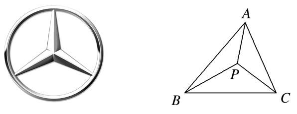
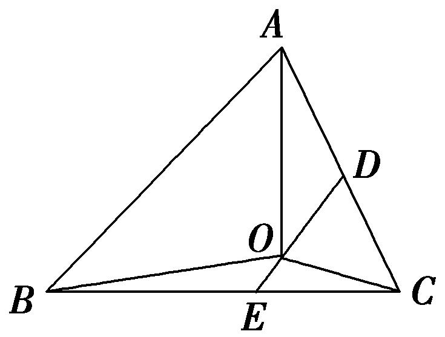
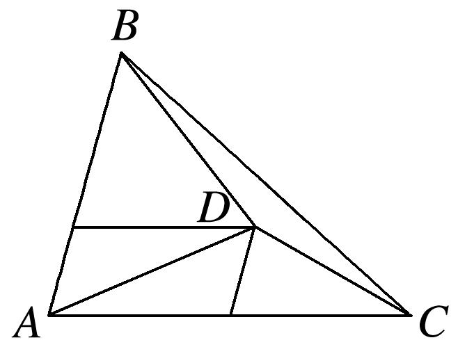
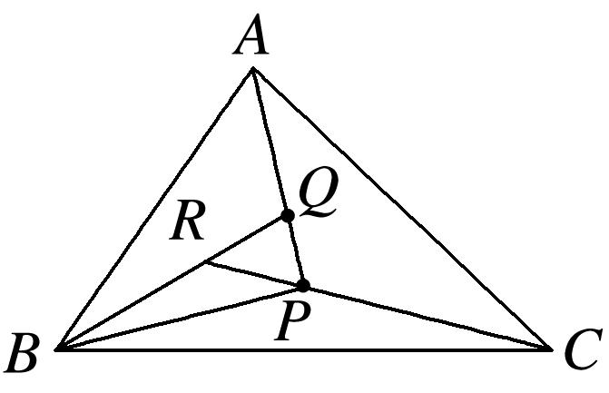
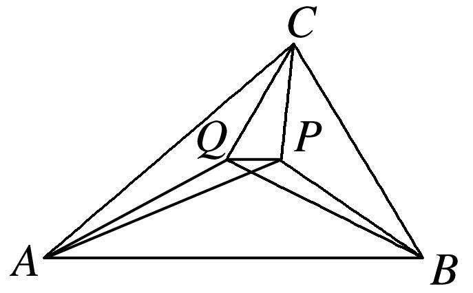
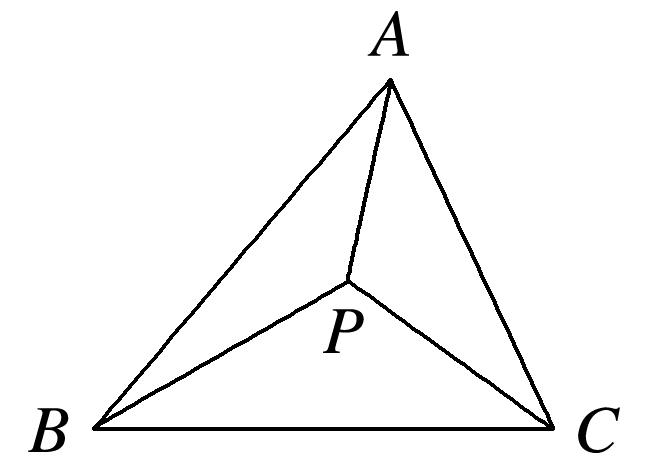
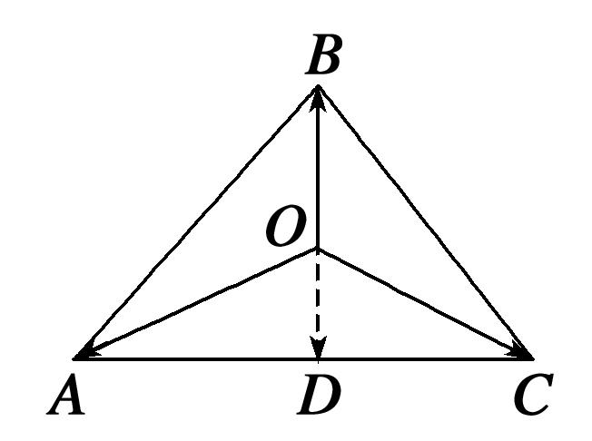
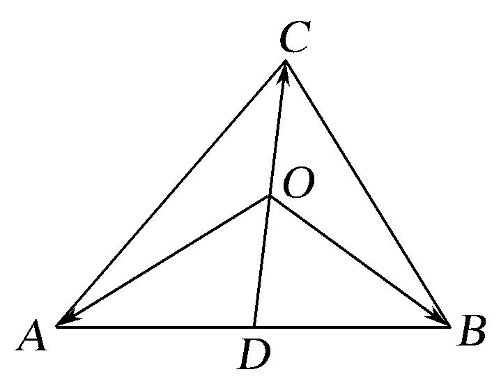
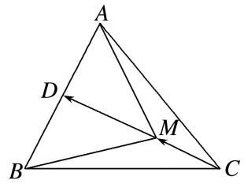
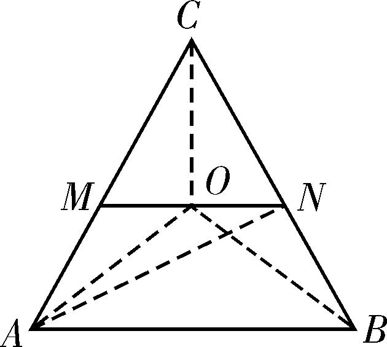

专题九　平面向量的奔驰定理

1．奔驰定理
如图，已知<em>P</em>为△<em>ABC</em>内一点，则有<em>S</em>△<em>PBC</em>·＋<em>S</em>△<em>PAC</em>·＋<em>S</em>△<em>PAB</em>·＝<strong>0</strong>．

证明：如图，延长*AP*与*BC*边相交于点则*D*，＝＝＝＝，
∵＝＋，∴＝＋，
∵＝＝＝，∴＝－，
即－＝＋，∴<em>S</em>△<em>PBC</em>·＋<em>S</em>△<em>PAC</em>·＋<em>S</em>△<em>PAB</em>·＝<strong>0</strong>．

由于这个定理对应的图象和奔驰车的标志很相似，我们把它称为“奔驰定理”．这个定理对于利用平面向量解决平面几何问题，尤其是解决跟三角形的面积和“四心”相关的问题，有着决定性的基石作用．奔驰定理是三角形四心向量式的完美统一．

推论：已知<em>P</em>为△<em>ABC</em>内一点，且<em>x</em>＋<em>y</em>＋<em>z</em>＝<strong>0</strong>．(<em>x，y，z</em>∈<strong>R</strong>，<em>xyz</em>≠0，<em>x</em>＋<em>y</em>＋<em>z</em>≠0)．则有  
（1）<em>S</em>△<em>PBC</em>∶<em>S</em>△<em>PAC</em>∶<em>S</em>△<em>PAB</em>＝|<em>x</em>|∶|<em>y</em>|∶|<em>z</em>|．  
（2）＝||，＝||，＝||．

【例题选讲】

<strong>[例1]</strong>（1）设点<em>O</em>在△<em>ABC</em>的内部，且有＋2＋3＝0，则△<em>ABC</em>的面积和△<em>AOC</em>的面积之比为(　　)

A．3　　　　　　　　
B．　　　　　　　　
C．2　　　　　　　　
D．
答案　<strong>A</strong>　解析　分别取<em>AC</em>、<em>BC</em>的中点<em>D</em>、 <em>E</em>，∵＋2＋3＝0，∴＋＝－2(＋)，即2＝－4，∴<em>O</em>是<em>DE</em>的一个三等分点，∴＝3．

秒杀　根据奔驰定理得，<em>S</em>△<em>ABC</em>∶<em>S</em>△<em>AOC</em>＝(1＋2＋3)∶2＝3．  
（2）在△*ABC*中，*D*为△*ABC*所在平面内一点，且＝＋，则等于(　　)

A．　　　　　　　　
B．　　　　　　　　
C．　　　　　　　　
D．
答案　B　解析　如图，由点<em>D</em>在△<em>ABC</em>中与<em>AB</em>平行的中位线上，且在靠近<em>BC</em>边的三等分点处，从而有<em>S</em>△<em>ABD</em>＝<em>S</em>△<em>ABC</em>，<em>S</em>△<em>ACD</em>＝<em>S</em>△<em>ABC</em>，<em>S</em>△<em>BCD</em>＝<em>S</em>△<em>ABC</em>＝<em>S</em>△<em>ABC</em>，所以＝．

秒杀　由＝＋得，＋2＋3＝0，根据奔驰定理得，<em>S</em>△<em>BCD</em>∶<em>S</em>△<em>ABD</em>＝1∶3．  
（3）已知点<em>A</em>，<em>B</em>，<em>C</em>，<em>P</em>在同一平面内，＝，＝，＝，则<em>S</em>△<em>ABC</em>∶<em>S</em>△<em>PBC</em>等于(　　)

A．14∶3　　　　　　
B．19∶4　　　　　　
C．24∶5　　　　　　
D．29∶6
答案　B　解析　由＝，得－＝(－)，整理得＝＋＝＋，由＝，得＝(－)，整理得＝－，∴－＝＋，整理得4＋6＋9＝<strong>0</strong>，根据奔驰定理得，∴<em>S</em>△<em>ABC</em>∶<em>S</em>△<em>PBC</em>＝(4＋6＋9)∶4＝19∶4．  
（4）已知点<em>P</em>，<em>Q</em>在△<em>ABC</em>内，＋2＋3＝2＋3＋5＝<strong>0</strong>，则等于(　　)

A．　　　　　　　　
B．　　　　　　　　
C．　　　　　　　　
D．
答案　A　解析　根据奔驰定理得，<em>S</em>△<em>PBC</em>∶<em>S</em>△<em>PAC</em>∶<em>S</em>△<em>PAB</em>＝1∶2∶3，<em>S</em>△<em>QBC</em>∶<em>S</em>△<em>QAC</em>∶<em>S</em>△<em>QAB</em>＝2∶3∶5，∴<em>S</em>△<em>PAB</em>＝<em>S</em>△<em>QAB</em>＝<em>S</em>△<em>ABC</em>，∴<em>PQ</em>∥<em>AB</em>，又∵<em>S</em>△<em>PBC</em>＝<em>S</em>△<em>ABC</em>，<em>S</em>△<em>QBC</em>＝<em>S</em>△<em>ABC</em>，∴＝－＝．  
（5）点<em>O</em>为△<em>ABC</em>内一点，若<em>S</em>△<em>AOB</em>∶<em>S</em>△<em>BOC</em>∶<em>S</em>△<em>AOC</em>＝4∶3∶2，设＝<em>λ</em>＋<em>μ</em>，则实数<em>λ</em>和<em>μ</em>的值分别为(　　)

A．，　　　　　　　　
B．，　　　　　　　　
C．，　　　　　　　　
D．，
答案　A　解析　秒杀　根据奔驰定理，得3＋2＋4＝0，即3＋2(＋)＋4(＋)＝0，整理得＝＋，故选A．  
（6）设点*P*在△*ABC*内且为△*ABC*的外心，∠*BAC*＝30°，如图．若△*PBC*，△*PCA*，△*PAB*的面积分别为，*x*，*y*，则*x*＋*y*的最大值是\_\_\_\_\_\_\_\_．

答案　　解析　根据奔驰定理得，＋<em>x</em>＋<em>y</em>＝<strong>0</strong>，即＝2<em>x</em>＋2<em>y</em>，平方得2＝4<em>x</em>22＋4<em>y</em>22＋8<em>xy</em>| |·||·cos∠<em>BPC</em>，又因为点<em>P</em>是△<em>ABC</em>的外心，所以||＝||＝||，且∠<em>BPC</em>＝2∠<em>BAC</em>＝60°，所以<em>x</em>2＋<em>y</em>2＋<em>xy</em>＝，(<em>x</em>＋<em>y</em>)2＝＋<em>xy</em>≤＋2，解得0&lt;<em>x</em>＋<em>y</em>≤，当且仅当<em>x</em>＝<em>y</em>＝时取等号．所以(<em>x</em>＋<em>y</em>)max＝．

【对点训练】

1．设*O*是△*ABC*内部一点，且＋＝－2，则△*AOB*与△*AOC*的面积之比为\_\_\_\_\_\_\_\_．

1．答案　　解析　设*D*为*AC*的中点，连接*OD*，则＋＝2．又＋＝－2，所以＝－

，即*O*为*BD*的中点，从而容易得△*AOB*与△*AOC*的面积之比为．

秒杀　由＋＝－2，得＋＋2＝<strong>0</strong>，根据奔驰定理得，△<em>AOB</em>与△<em>AOC</em>的面积之比为．

2．设<em>O</em>在△<em>ABC</em>的内部，<em>D</em>为<em>AB</em>的中点，且＋＋2＝<strong>0</strong>，则△<em>ABC</em>的面积与△<em>AOC</em>的面积的比

值为\_\_\_\_\_\_\_\_．

2．答案　4　解析　∵<em>D</em>为<em>AB</em>的中点，则＝(＋)，又＋＋2＝<strong>0</strong>，∴＝－，∴<em>O</em>

为<em>CD</em>的中点．又∵<em>D</em>为<em>AB</em>的中点，∴<em>S</em>△<em>AOC</em>＝<em>S</em>△<em>ADC</em>＝<em>S</em>△<em>ABC</em>，则＝4．

秒杀　因为＋＋2＝0，根据奔驰定理得，＝4．

3．已知<em>P</em>，<em>Q</em>为△<em>ABC</em>中不同的两点，且3＋2＋＝<strong>0</strong>，＋＋＝<strong>0</strong>，则<em>S</em>△<em>PAB</em>∶<em>S</em>△<em>QAB</em>为\_\_\_\_\_．

3．答案　1∶2　解析　因为3＋2＋＝2(＋)＋＋＝<strong>0</strong>，所以<em>P</em>在与<em>BC</em>平行的中位线上，

且是该中位线上的一个三等分点，可得<em>S</em>△<em>PAB</em>＝<em>S</em>△<em>ABC</em>，＋＋＝<strong>0</strong>，可得<em>Q</em>是△<em>ABC</em>的重心，因此<em>S</em>△<em>QAB</em>＝<em>S</em>△<em>ABC</em>，<em>S</em>△<em>PAB</em>∶<em>S</em>△<em>QAB</em>＝1∶2，故选A．

秒杀　由3＋2＋＝<strong>0</strong>，＋＋＝<strong>0</strong>，根据奔驰定理得，<em>S</em>△<em>PAB</em>∶<em>S</em>△<em>ABC</em>＝1∶6，<em>S</em>△<em>QAB</em>∶<em>S</em>△<em>ABC</em>＝1∶3＝2∶6，所以<em>S</em>△<em>PAB</em>∶<em>S</em>△<em>QAB</em>＝1∶2，故选A．

4．已知*D*为△*ABC*的边*AB*的中点，*M*在*DC*上满足5＝＋3，则△*ABM*与△*ABC*的面积比为(　　)

A．　　　　　　　　
B．　　　　　　　　
C．　　　　　　　　
D．

4．答案　C　解析　因为*D*是*AB*的中点，所以＝2，因为5＝＋3，所以2－2＝3

－3，即2＝3，所以5＝3＋3＝3，所以＝，设<em>h</em>1，<em>h</em>2分别是△<em>ABM</em>，△<em>ABC</em>的<em>AB</em>边上的高，所以＝＝＝＝＝．

秒杀　由5＝＋3，得＋＋3＝0，根据奔驰定理得，＝．

5．若*M*是△*ABC*内一点，且满足＋＝4，则△*ABM*与△*ACM*的面积之比为(　　)

A．　　　　　　　　
B．　　　　　　　　
C．　　　　　　　　
D．2

5．答案　A　解析　设*AC*的中点为*D*，则＋＝2，于是2＝4，从而＝2，即*M*为*BD*

的中点，于是＝＝＝．

秒杀　由＋＝4，得＋2＋＝0，根据奔驰定理得，＝．

6．已知<em>O</em>是面积为4的△<em>ABC</em>内部一点，且有＋＋2＝<strong>0</strong>，则△<em>AOC</em>的面积为\_\_\_\_\_\_\_\_\_\_．

6．答案　1　解析　如图，设<em>AC</em>中点为<em>M</em>，<em>BC</em>中点为<em>N</em>．因为＋＋＋＝<strong>0</strong>，所以2＋2

＝<strong>0</strong>，所以＋＝<strong>0</strong>，<em>O</em>为中位线<em>MN</em>的中点，所以<em>S</em>△<em>AOC</em>＝<em>S</em>△<em>ANC</em>＝×<em>S</em>△<em>ABC</em>＝×4＝1．

秒杀　根据奔驰定理得，<em>S</em>△<em>OBC</em>∶<em>S</em>△<em>OAC</em>∶<em>S</em>△<em>OAB</em>＝1∶1∶2．因为<em>S</em>△<em>ABC</em>＝4，所以<em>S</em>△<em>AOC</em>＝1．

7．已知点*D*为△*ABC*所在平面上一点，且满足＝－，若△*ACD*的面积为1，则△*ABD*的面积为

\_\_\_\_\_\_\_\_．

7．答案　4　解析　由＝－，得5＝＋4，所以－＝4(－)，即＝4．所

以点<em>D</em>在边<em>BC</em>上，且||＝4||，所以<em>S</em>△<em>ABD</em>＝4<em>S</em>△<em>ACD</em>＝4．

秒杀　由＝－，得8＋＋4＝<strong>0</strong>，根据奔驰定理得，<em>S</em>△<em>ABD</em>∶<em>S</em>△<em>ACD</em>＝4∶1，所以<em>S</em>△<em>ABD</em>＝4．

8．已知点*P*是△*ABC*的中位线*EF*上任意一点，且*EF*∥*BC*，实数*x*，*y*满足＋*x*＋*y*＝0，设△*ABC*，

△<em>PBC</em>，△<em>PCA</em>，△<em>PAB</em>的面积分别为<em>S</em>，<em>S</em>1，<em>S</em>2，<em>S</em>3，记＝<em>λ</em>1，＝<em>λ</em>2，＝<em>λ</em>3，则<em>λ</em>2<em>λ</em>3取最大值时，3<em>x</em>＋<em>y</em>的值为(　　)

A．　　　　　　　　
B．　　　　　　　　
C．1 　　　　　　　　
D．2

8．答案　D　解析　由题意可知<em>λ</em>1＋<em>λ</em>2＋<em>λ</em>3＝1．因为<em>P</em>是△<em>ABC</em>的中位线<em>EF</em>上任意一点，且<em>EF</em>∥<em>BC</em>，
所以<em>λ</em>1＝，所以<em>λ</em>2＋<em>λ</em>3＝，所以<em>λ</em>2<em>λ</em>3≤2＝，当且仅当<em>λ</em>2＝<em>λ</em>3＝时，等号成立，所以<em>λ</em>2<em>λ</em>3取最大值时，<em>P</em>为<em>EF</em>的中点．延长<em>AP</em>交<em>BC</em>于<em>M</em>，则<em>M</em>为<em>BC</em>的中点，所以<em>PA</em>＝<em>PM</em>，所以＝－＝－(＋)，又因为＋<em>x</em>＋<em>y</em>＝0，所以<em>x</em>＝<em>y</em>＝，所以3<em>x</em>＋<em>y</em>＝2．故选D．

秒杀　根据奔驰定理得，

