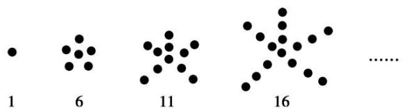
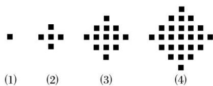
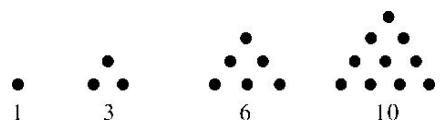
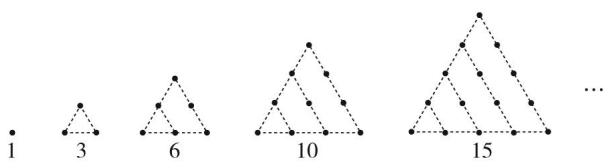

# 专题01 数列的概念及性质

# 1. 数列的定义

按照一定顺序排列的一列数称为数列，数列中的每一个数叫做这个数列的项.

# 2. 数列的分类

<table><tr><td>分类标准</td><td>名称</td><td>含义</td></tr><tr><td rowspan="2">按项的个数</td><td>有穷数列</td><td>项数有限的数列</td></tr><tr><td>无穷数列</td><td>项数无限的数列</td></tr><tr><td rowspan="5">按项的变化趋势</td><td>递增数列</td><td>从第2项起,每一项都大于它的前一项的数列,即 $a_{n+1} > a_n$ </td></tr><tr><td>递减数列</td><td>从第2项起,每一项都小于它的前一项的数列,即 $a_{n+1} < a_n$ </td></tr><tr><td>常数列</td><td>各项都相等的数列,即 $a_{n+1} = a_n$ </td></tr><tr><td>周期数列</td><td>项呈现周期性变化</td></tr><tr><td>摆动数列</td><td>从第2项起,有些项大于它的前一项,有些项小于它的前一项</td></tr></table>

# 3. 数列的表示法

数列有三种表示法，它们分别是列表法、图象法和解析法.

(1)列举法： $a_{1}$ ， $a_{2}$ ， $a_{3}$ ， $\cdots$ ， $a_{n}$ ， $\cdots$ ;  
(2)图像法：数列可用一群孤立的点表示；  
(3)解析法(公式法): 通项公式或递推公式.

# 4. 数列的通项公式

如果数列 $\{a_{n}\}$ 的第 $n$ 项与它的序号 $n$ 之间的关系可以用一个公式 $a_{n} = f(n)$ 来表示，那么这个公式叫作这个数列的通项公式．通项公式可以看成数列的函数解析式.

# 5. 数列的递推公式

如果已知数列 $\{a_{n}\}$ 的首项(或前几项)，且任意一项 $a_{n}$ 与 $a_{n - 1}$ (或其前面的项)之间的关系可以用一个公式来表示，那么这个公式叫作数列的递推公式．它是数列的一种表示法.

注：并不是所有的数列都有通项公式，即使有通项公式也未必唯一.

# 6. 数列的通项 $a_{n}$ 与前 $n$ 项和 $S_{n}$ 的关系

已知数列 $\{a_{n}\}$ 的前n项和 $S_{n}$ ，则 $a_{n}=\begin{cases}S_{1}&(n=1),\\S_{n}-S_{n-1}(n\geqslant2).\end{cases}$ 这个关系式对任意数列均成立.

# 7. 数列与函数的内在联系

从映射、函数的观点看，数列可以看作是一个定义域为正整数集 $\mathbf{N}_{+}$ 的函数，即当自变量从小到大依次取值时对应的一列函数值，而数列的通项公式也就是相应函数的解析式.

# 考点一 由数列前几项求数列通项公式

# 【基本方法】

由数列前几项求数列通项公式的常用方法及具体策略

(1)常用方法:

观察(观察规律)、比较(比较已知数列)、归纳、转化(转化为特殊数列)、联想(联想常见的数列)等方法. 同时也可以使用添项、还原、分割等方法，转化为一个常见数列，通过常见数列的通项公式求得所给数列的通项公式.

(2)具体策略:

①分式中分子、分母的特征；  
②相邻项的变化特征，如递增时可考虑关于 n 为一次递增或以 $2^{n} \cdot 3^{n}$ 等形式递增；  
③拆项后的特征；  
④各项的符号特征和绝对值的特征；  
⑤化异为同，对于分式还可以考虑对分子、分母各个击破，或寻找分子、分母之间的关系；  
⑥对于符号交替出现的情况，可用 $(-1)^{n}$ 或 $(-1)^{n+1}$ ， $n\in N^{*}$ 来处理.

# 【基本题型】

[例 1](1)数列 $\sqrt{3},\sqrt{7},\sqrt{11},\sqrt{15}$ ，…的一个通项公式 $a_{n}=$ \_\_\_\_.

(2)数列 $-\frac{1}{1\times2},\frac{1}{2\times3},-\frac{1}{3\times4},\frac{1}{4\times5},\ldots$ 的一个通项公式 $a_{n}=$ \_\_\_\_.  
(3)已知数列 1, 2, $\sqrt{7}$ , $\sqrt{10}$ , $\sqrt{13}$ , ..., 则 $2\sqrt{19}$ 在这个数列中的项数是()

A. 16

B. 24

C. 26

D. 28

(4)数列 $\frac{2}{3}$ ， $-\frac{4}{5}$ ， $\frac{6}{7}$ ， $-\frac{8}{9}$ ，…的第10项是()

A. $-\frac{16}{17}$

B. $-\frac{18}{19}$

C. $-\frac{20}{21}$

D. $-\frac{22}{23}$

(5)根据下面的图形及相应的点数，写出点数构成的数列的一个通项公式 $a_{n} =$ \_\_\_\_.

text_image

1
6
11
16
......

(6)某少数民族的刺绣有着悠久的历史, 图(1), (2), (3), (4)为最简单的四个图案, 这些图案都由小正方形构成, 小正方形数越多刺绣越漂亮. 现按同样的规律刺绣(小正方形的摆放规律相同), 设第 $n$ 个图形包含 $f(n)$ 个小正方形, 则 $f(6)=$ \_\_\_\_.

text_image

(1)
(2)
(3)
(4)

# 【对点精练】

1. 数列 $0, \frac{2}{3}, \frac{4}{5}, \frac{6}{7}$ ，…的一个通项公式为 \_\_\_\_.  
2. 已知数列 $\{a_{n}\}$ 为 $\frac{1}{2}, \frac{1}{4}, -\frac{5}{8}, \frac{13}{16}, -\frac{29}{32}, \frac{61}{64}, \cdots$ ，则数列 $\{a_{n}\}$ 的一个通项公式是 \_\_\_\_.  
3. 在数列 1, 1, 2, 3, 5, 8, 13, x, 34, 55, ... 中，x 应取()

A. 19

B. 20

C. 21

D. 22

4. 已知数列 $\sqrt{2}, \sqrt{5}, 2\sqrt{2}, \ldots$ ，则 $2\sqrt{5}$ 是该数列的（）

A. 第5项

B. 第6项

C. 第7项

D. 第8项

5. 传说古希腊毕达哥拉斯学派的数学家经常在沙滩上面画点或用小石子表示数。他们研究过如图所示的三角形数：

text_image

1
3
6
10

将三角形数 1, 3, 6, 10, …记为数列 $\{a_{n}\}$ ，则数列 $\{a_{n}\}$ 的通项公式为 \_\_\_\_.

6. 把 1, 3, 6, 10, 15, ...这些数叫做三角形数，这是因为这些数目的圆点可以排成一个正三角形(如图所示).

text_image

1
3
6
10
15
...

则第 7 个三角形数是( )

A. 27

B. 28

C. 29

D. 30

# 考点二 数列的周期性

# 【基本知识】

周期数列：对于数列 $\{a_{n}\}$ ，如果存在一个常数 $T$ ，使得对任意的正整数 $i$ 恒有 $a_{i} = a_{i + T}$ 成立，则称数列 $\{a_{n}\}$ 是周期为 $T$ 的周期数列.

周期数列的常见形式：(1) $a_{n+1}=a_{n}+a_{n+2}(n\in\mathbf{N}^{*})$ ; (2) $a_{n+1}=a_{n}a_{n+2}(n\in\mathbf{N}^{*})$ ; (3) $a_{n+1}=\frac{1}{1-a_{n}}(n\in\mathbf{N}^{*})$ ; (4) $a_{n+1}=\frac{1+a_{n}}{1-a_{n}}(n\in\mathbf{N}^{*})$ ; (5)三角函数型；

# 【基本方法】

解决数列周期性问题的方法：根据给出的关系式求出数列的若干项，通过观察归纳出数列的周期，进而求有关项的值或者前 $n$ 项的和.

# 【基本题型】

[例 2](1)已知数列 $\{a_{n}\}$ ，若 $a_{n+1}=a_{n}+a_{n+2}(n\in\mathbf{N}^{*})$ ，则称数列 $\{a_{n}\}$ 为“凸数列”。已知数列 $\{b_{n}\}$ 为“凸数列”，且 $b_{1}=1,\quad b_{2}=-2$ ，则 $\{b_{n}\}$ 的前2022项的和为()

A. 0

B. 1

C. -5

D. -1

(2)已知数列 $\{a_{n}\}$ 中， $a_{1}=1,\quad a_{2}=2$ ，且 $a_{n}\cdot a_{n+2}=a_{n+1}(n\in\mathbf{N}^{*})$ ，则 $a_{2022}$ 的值为()

A. 2

B. 1

C. $\frac{1}{2}$

D. $\frac{1}{4}$

(3)在一个数列中，如果对任意 $n \in \mathbf{N}^*$ ，都有 $a_{n}a_{n + 1}a_{n + 2} = k$ (k为常数)，那么这个数列叫做等积数列， $k$ 叫做这个数列的公积．已知数列 $\{a_{n}\}$ 是等积数列，且 $a_{1}=1,\quad a_{2}=2$ ，公积为8，则 $a_{1}+a_{2}+a_{3}+\cdots+a_{12}=$ \_\_\_\_.

(4)已知数列 $\{a_{n}\}$ 满足 $a_{n + 1} = \frac{1}{1 - a_n}$ ，若 $a_1 = \frac{1}{2}$ ，则 $a_{2022} = (\quad)$

A. -1

B. $\frac{1}{2}$

C. 1

D. 2

(5)若数列 $\{a_{n}\}$ 满足 $a_1 = 2$ ， $a_{n + 1} = \frac{1 + a_n}{1 - a_n}$ ，则 $a_{2022}$ 的值为（

A. 2

B. -3

C. $-\frac{1}{2}$

D. $\frac{1}{3}$

(6)在数列 $\{a_{n}\}$ 中， $a_1 = 1$ ， $a_{n + 1} - a_n = \sin \frac{(n + 1)\pi}{2}$ 记 $S_{n}$ 为数列 $\{a_{n}\}$ 的前 $n$ 项和，则 $S_{2018} = (\quad)$

A. 0

B. 2018

C. 1010

D. 1009

# 【对点精练】

1. 已知数列 $\{a_{n}\}$ 满足 $a_{n + 2} = a_{n + 1} - a_n$ ， $n\in \mathbf{N}^*$ ， $a_1 = 1$ ， $a_2 = 2$ ，则 $a_{2021}$ 等于（）

A.-2

B. -1

C. 1

D. 2

2. 已知数列 $\{a_{n}\}$ 的前 $n$ 项和为 $S_{n}$ ，且 $a_{2} = 2a_{1} = 1$ ， $a_{n + 1}a_{n - 1} = a_{n}(n\geqslant 2)$ ，则下列结论不正确的是（）

A. $a_{2020} = 2$

B. $a_{4}=a_{100}$

C. $S_{3}=\frac{7}{2}$

D. $S_{30} = 6S_{6}$

3. 在数列 $\{a_{n}\}$ 中，若对任意的 $n \in \mathbf{N}^{*}$ 均有 $a_{n} + a_{n+1} + a_{n+2}$ 为定值，且 $a_{1} = 2$ ， $a_{9} = 3$ ， $a_{98} = 4$ ，则数列 $\{a_{n}\}$ 的前100项的和 $S_{100} = (\quad)$

A. 132

B. 299

C. 68

D. 99

4. 已知数列 $a_1 = 2$ ， $a_n = 1 - \frac{1}{a_{n-1}} (n \geqslant 2)$ . 则 $a_{2022} =$ \_\_\_\_.

5. (2014·全国Ⅱ)数列 $\{a_{n}\}$ 满足 $a_{n+1}=\frac{1}{1-a_{n}}$ ， $a_{8}=2$ ，则 $a_{1}=$ \_\_\_\_.

6. 已知数列 $\{a_{n}\}$ 中， $a_{1} = -\frac{1}{2}$ ， $a_{n+1} = \frac{1}{1 - a_{n}}$ ，则下列各数是 $\{a_{n}\}$ 的项的有（）

A. -2

B. $\frac{2}{3}$

C. $\frac{3}{2}$

D. 3

7. 已知数列 $\{a_{n}\}$ 满足 $a_1 = 2$ ， $a_{n+1} = \frac{1 + a_n}{1 - a_n} (n \in \mathbb{N}^*)$ ，则 $a_1 \cdot a_2 \cdot a_3 \cdot \ldots \cdot a_{2022} = (\quad)$

A. -6

B. 6

C. -3

D. 3

8. 在数列 $\{a_{n}\}$ 中， $a_{1} = 0$ ， $a_{n+1} = \frac{\sqrt{3} + a_{n}}{1 - \sqrt{3} a_{n}}$ ，则 $S_{2022} = \underline{\quad}$ .

9. 数列 $\{a_{n}\}$ 满足 $a_{n + 1} = \left\{ \begin{array}{ll}2a_{n}, & 0\leqslant a_{n} <   \frac{1}{2},\\ 2a_{n} - 1, & \frac{1}{2}\leqslant a_{n} <   1, \end{array} \right.$ 若 $a_1 = \frac{3}{5}$ ，则 $a_{2020} = (\quad)$

A. $\frac{1}{5}$

B. $\frac{2}{5}$

C. $\frac{3}{5}$

D. $\frac{4}{5}$

10. 已知数列 $\{a_{n}\}$ 满足 $a_1 = 1$ ， $a_{n+1} = a_n^2 - 2a_n + 1 (n \in \mathbf{N}^*)$ ，则 $a_{2022} = \underline{\quad}$ .

# 考点三 数列的单调性

# 【基本方法】

# 判断数列单调性的两种方法

# 1. 作差(或商)法.

(1)作差比较法

$a_{n + 1} - a_n > 0\Leftrightarrow$ 数列 $\{a_n\}$ 是单调递增数列； $a_{n + 1} - a_n <   0\Leftrightarrow$ 数列 $\{a_n\}$ 是单调递减数列； $a_{n + 1} - a_n = 0\Leftrightarrow$ 数列 $\{a_n\}$ 是常数列.

(2)作商比较法

$a_{n} > 0$ 时， $\frac{a_{n + 1}}{a_n} > 1\Leftrightarrow$ 数列 $\{a_n\}$ 是单调递增数列； $\frac{a_{n + 1}}{a_n} < 1\Leftrightarrow$ 数列 $\{a_n\}$ 是单调递减数列； $\frac{a_{n + 1}}{a_n} = 1\Leftrightarrow$ 数列 $\{a_n\}$ 是常数列.

$a_{n}<0$ 时， $\frac{a_{n+1}}{a_{n}}>1\Leftrightarrow$ 数列 $\{a_{n}\}$ 是单调递减数列； $\frac{a_{n+1}}{a_{n}}<1\Leftrightarrow$ 数列 $\{a_{n}\}$ 是单调递增数列； $\frac{a_{n+1}}{a_{n}}=1\Leftrightarrow$ 数列 $\{a_{n}\}$ 是常数列.

# 2. 目标函数法

写出数列对应的函数，利用导数或利用基本初等函数的单调性探求其单调性，再将函数的单调性对应到数列中去.

# 【基本题型】

[例 3](1)记 $S_{n}$ 为数列 $\{a_{n}\}$ 的前 n 项和. “任意正整数 n，均有 $a_{n}>0$ ”是“ $\{S_{n}\}$ 是递增数列”的()

A. 充分不必要条件

B. 必要不充分条件

C. 充要条件

D. 既不充分也不必要条件

(2)已知数列 $\{a_{n}\}$ 的通项 $a_{n} = \frac{na}{nb + c} (a, b, c$ 都是正实数)，则 $a_{n}$ 与 $a_{n + 1}$ 的大小关系是( ).

A. $a_{n} > a_{n+1}$

B. $a_{n}<a_{n+1}$

C. $a_{n}=a_{n+1}$

D. 不能确定

(3)已知数列 $\{a_{n}\}$ 的通项公式是 $a_{n} = \frac{n}{3n + 1}$ ，那么这个数列是（

A. 递增数列

B. 递减数列

C. 摆动数列

D. 常数列

(4)(多选)已知数列 $\{a_{n}\}$ 的前n项和为 $S_{n}$ ，且满足 $a_{n}+4S_{n-1}S_{n}=0(n\geq2)$ ， $a_{1}=\frac{1}{4}$ ，则下列说法正确的是()

A. 数列 $\{a_{n}\}$ 的前 $n$ 项和为 $S_{n} = \frac{1}{4n}$

B. 数列 $\{a_{n}\}$ 的通项公式为 $a_{n} = \frac{1}{4n(n + 1)}$

C. 数列 $\{a_{n}\}$ 为递增数列

D. 数列 $\left\{\frac{1}{S_n}\right\}$ 为递增数列

(5)设函数 $f(x) = \begin{cases} (3 - a)x - 3, & x \leqslant 7, \\ a^{x - 6}, & x > 7, \end{cases}$ 数列 $\{a_n\}$ 满足 $a_{n} = f(n), n \in \mathbf{N}^{*}$ ，且数列 $\{a_{n}\}$ 是递增数列，则实数 $a$ 的取值范围是（）

A. $\left(\frac{9}{4},3\right)$

B. $\left[\frac{9}{4},3\right]$

C. $(1, 3)$

D. $(2, 3)$

(6)已知等差数列 $\{a_{n}\}$ 的前 $n$ 项和为 $S_{n}(n\in \mathbf{N}^{*})$ ，且 $a_{n} = 2n + \lambda$ ，若数列 $\{S_n\} (n\geq 7,n\in \mathbf{N}^*)$ 为递增数列，则实数 $\lambda$ 的取值范围为

(7)若 $a_{n} = n^{2} + kn + 4$ 且对于 $n\in \mathbf{N}^*$ ，都有 $a_{n + 1} > a_n$ 成立，则实数 $k$ 的取值范围是

# 【对点精练】

1. 对于数列 $\{a_{n}\}$ ，“ $a_{n+1}>|a_{n}|(n=1,2,\cdots)$ ”是“ $\{a_{n}\}$ 为递增数列”的()

A. 必要不充分条件

B. 充分不必要条件

C. 充要条件

D. 既不充分也不必要条件

2. 在数列 $\{a_{n}\}$ 中， $a_{n} = \frac{n + 2}{n + 1}$ ，则 $\{a_{n}\}$ ( )

A. 是常数列

B. 不是单调数列

C. 是递增数列

D. 是递减数列

3. (多选)下面四个数列中, 既是无穷数列又是递增数列的是( )

A. $1, \frac{1}{2}, \frac{1}{3}, \frac{1}{4}, \cdots, \frac{1}{n}, \cdots$

B. $\sin\frac{\pi}{7}$ , $\sin\frac{2\pi}{7}$ , $\sin\frac{3\pi}{7}$ , $\cdots$ , $\sin\frac{n\pi}{7}$ , $\cdots$

C. $-1, -\frac{1}{2}, -\frac{1}{4}, -\frac{1}{8}, \cdots, -\frac{1}{2^{n-1}}, \cdots$

D. $1,\sqrt{2},\sqrt{3},\cdots,\sqrt{n},\cdots$

4. 已知数列 $\{a_{n}\}$ 满足 $a_{n} = \begin{cases} (1 - 3a) \cdot n + 10a, & n \leq 6, \\ a^{n-7}, & n > 6 \end{cases}$ （ $n \in \mathbb{N}^{*}$ ），若对任意的 $n \in \mathbb{N}^{*}$ ，均有 $a_{n} > a_{n+1}$ ，则实数 $a$ 的取值范围是（）

A. $\left(\frac{1}{3},1\right)$

B. $\left(\frac{1}{3},\frac{5}{8}\right]$

C. $\left(\frac{1}{3},\frac{1}{2}\right]$

D. $\left(\frac{1}{3},\frac{5}{8}\right)$

5. 已知 $f(x) = \begin{cases} (2a - 1)x + 4 (x \leqslant 1), \\ a^x (x > 1), \end{cases}$ 数列 $\{a_n\} (n \in \mathbb{N}^*)$ 满足 $a_n = f(n)$ ，且 $\{a_n\}$ 是递增数列，则 $a$ 的取值范围是（）

A. $(1, +\infty)$

B. $\left(\frac{1}{2},+\infty\right)$

C. (1, 3)

D. $(3, +\infty)$

6. 已知 $a_{n} = n^{2} + \lambda n$ ，且对于任意的 $n \in \mathbf{N}^{*}$ ，数列 $\{a_{n}\}$ 是递增数列，则实数 $\lambda$ 的取值范围是 \_\_\_\_.

7. 在数列 $\{a_{n}\}$ 中， $a_{1} = a$ ， $a_{n+1} = 2a_{n} - 1$ ，若 $\{a_{n}\}$ 为递增数列，则 $a$ 的取值范围为（）

A. a>0

B. $a > 1$

C. a>2

D. a>3

8. 已知数列 $\{a_{n}\}$ 的通项公式为 $a_{n} = \frac{3n + k}{2^{n}}$ ，若数列 $\{a_{n}\}$ 为递减数列，则实数 $k$ 的取值范围为（）

A. $(3, +\infty)$

B. $(2, +\infty)$

C. $(1, +\infty)$

D. $(0, +\infty)$

