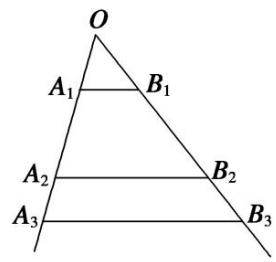

# 专题 5 用构造辅助数列通项公式

考点一 由 $a_{n + 1} = Aa_n + B(A\neq 0$ 且 $A\neq 1$ ， $B\neq 0)$ 求 $a_{n}$ 型

# 【基本方法】

已知 $a_{n + 1} = Aa_n + B$ 求 $a_{n}$ 的方法1

递推关系形如 $a_{n + 1} = A a_n + B (A \neq 0$ 且 $A \neq 1, B \neq 0, A, B$ 为常数)可化为 $a_{n + 1} + \frac{B}{A - 1} = A \left( a_n + \frac{B}{A - 1} \right) (p \neq 1)$ 的形式，利用 $\left\{a_n + \frac{B}{A - 1}\right\}$ 是以 $A$ 为公比的等比数列求解.

已知 $a_{n + 1} = Aa_n + B$ 求 $a_{n}$ 的方法2

对于一个函数 $f(x)$ ，我们把满足 $f(m) = m$ 的值 $x = m$ 称为函数 $f(x)$ 的“不动点”。利用“不动点法”可以构造新数列，求数列的通项公式。

若 $f(x) = Ax + B (A \neq 0, 1)$ ， $p$ 是 $f(x)$ 的不动点．数列 $\{a_n\}$ 满足 $a_{n+1} = f(a_n)$ ，则 $a_{n+1} - p = A (a_n - p)$ ，即 $\{a_n - p\}$ 是公比为 $A$ 的等比数列.

# 【基本题型】

[例 1] (1) 已知数列 $\{a_{n}\}$ 满足 $a_{1}=1$ ， $a_{n+1}=3a_{n}+2(n\in\mathbf{N}^{*})$ ，则数列 $\{a_{n}\}$ 的通项公式为 \_\_\_\_.

(2)已知数列 $\{a_{n}\}$ 中， $a_1 = 3$ ，且点 $P_{n}(a_{n}, a_{n + 1})(n\in \mathbf{N}^{*})$ 在直线 $3x - y + 1 = 0$ 上，则数列 $\{a_{n}\}$ 的通项公式为

[例 2] (1) 在数列 $\{a_{n}\}$ 中， $a_{1}=1,\quad a_{n+1}=\frac{1}{2}a_{n}+1$ ，则数列 $\{a_{n}\}$ 的通项公式为 \_\_\_\_.

(2)已知数列 $\{a_{n}\}$ 满足 $a_{n+1}=-\frac{1}{3}a_{n}-2,\quad a_{1}=4$ ，则数列 $\{a_{n}\}$ 的通项公式为\_\_\_\_.

# 【对点精练】

1. 在数列 $\{a_{n}\}$ 中，若 $a_1 = 1$ ， $a_{n + 1} = 2a_{n} + 3$ ，则通项公式 $a_{n} =$   
2. 在数列 $\{a_{n}\}$ 中，已知 $a_1 = 1$ ， $a_{n + 1} = 2a_{n} + 1$ ，则其通项公式 $a_{n} =$   
3. 已知数列 $\{a_{n}\}$ 中， $a_{1} = 3$ ，且点 $P_{n}(a_{n}, a_{n+1})(n \in \mathbb{N}^{*})$ 在直线 $4x - y + 1 = 0$ 上，则数列 $\{a_{n}\}$ 的通项公式为 \_\_\_\_.

考点二 由 $a_{n + 1} = pa_n + f(n)$ 求 $a_{n}$ 型

# 【基本方法】

已知 $a_{n+1}=pa_{n}+f(n)$ 求 $a_{n}$ 的方法

递推关系形如 $a_{n + 1} = pa_n + f(n)(p$ 是非零常数)的数列 $\{a_{n}\}$ 的通项公式，可先在两边同除以 $f(n)$ 后再用累加法求得.

# 【基本题型】

[例 3] (1) 在数列 $\{a_{n}\}$ 中，若 $a_{1}=2,\quad a_{n+1}=2a_{n}+2^{n+1}$ ，则通项公式 $a_{n}=$ \_\_\_\_.

(2)在数列 $\{a_{n}\}$ 中， $a_1 = 1$ ， $a_{n + 1} = \frac{1}{3} a_n + \left(\frac{1}{3}\right)_{n + 1}(n\in \mathbf{N}^*)$ ，则通项公式 $a_{n} =$

(3)已知数列 $\{a_{n}\}$ 的前 $n$ 项和为 $S_{n}$ ，满足 $2S_{n} = a_{n + 1} - 2^{n + 1} + 1, n \in \mathbf{N}^{*}$ ，且 $a_{1}, a_{2} + 5, a_{3}$ 成等差数列，则 $a_{n} =$ \_\_\_\_.

# 【对点精练】

1. 已知数列 $\{a_{n}\}$ 满足 $a_1 = 1$ ， $a_{n+1} - 2a_{n} = 2^{n}(n \in \mathbf{N}^{*})$ ，则数列 $\{a_{n}\}$ 的通项公式为 $a_{n} =$

2. 在数列 $\{a_{n}\}$ 中，已知 $a_1 = 1$ ， $a_{n+1} = \frac{1}{2} a_n - \frac{1}{2^n}$ ，则其通项公式 $a_{n} = \underline{\quad}$ .

3. 已知各项均不为 0 的数列 $\{a_{n}\}$ 满足 $a_{1} = \frac{1}{2}$ , $a_{n} a_{n-1} = a_{n-1} - a_{n} (n \geqslant 2, n \in \mathbb{N}^{*})$ , 则数列 $\{a_{n}\}$ 的通项公式 $a_{n} =$

考点三 由 $a_{n + 2} = pa_{n + 1} + qa_n$ 求 $a_{n}$ 型

# 【基本方法】

已知 $a_{n + 2} = pa_{n + 1} + qa_n$ 求 $a_{n}$ 的方法

递推关系形如 $a_{n + 2} = pa_{n + 1} + qa_n$ 型，可化为 $a_{n + 2} + xa_{n + 1} = (p + x)\left(a_{n + 1} + \frac{q}{p + x} a_n\right)$ ，令 $x = \frac{q}{p + x}$ ，求得 $x$ 来解决.

# 【基本题型】

[例 4] 已知数列 $\{a_{n}\}$ 满足 $a_{1}=1, a_{2}=4, a_{n+2}+2a_{n}=3a_{n+1}(n\in\mathbb{N}_{+})$ ，则数列 $\{a_{n}\}$ 的通项公式 $a_{n}=$ \_\_\_\_.

# 【对点精练】

1. 若 $a_1 = 5, a_2 = 2, a_{n+2} = 2a_{n+1} + 3a_n$ ，则 $a_n =$ \_\_\_\_.

考点四 由 $a_{n+1} = \frac{A a_n}{B a_n + C}$ 求 $a_n$ 型

# 【基本方法】

已知 $a_{n + 1} = \frac{Aa_n}{Ba_n + C}$ 求 $a_{n}$ 的方法1

递推关系形如 $a_{n+1}=\frac{Aa_{n}}{Ba_{n}+C}$ 型可取倒数，构造新数列求解.

已知 $a_{n+1}=\frac{Aa_{n}}{Ba_{n}+C}$ 求 $a_{n}$ 的方法 2

对于一个函数 $f(x)$ ，我们把满足 $f(m) = m$ 的值 $x = m$ 称为函数 $f(x)$ 的“不动点”。利用“不动点法”可以构造新数列，求数列的通项公式。

设 $f(x) = \frac{Ax + B}{Cx + D} (c\neq 0, AD - BC\neq 0)$ ，数列 $\{a_{n}\}$ 满足 $a_{n + 1} = f(a_n)$ ， $a_1\neq f(a_1)$ 。若 $f(x)$ 有两个相异的不动点 $p$ ，则 $\frac{a_{n + 1} - p}{a_{n + 1} - q} = k\cdot \frac{a_n - p}{a_n - q}\left\{\text{此处 } k = \frac{a - pc}{a - qc}\right\}$ .

# 【基本题型】

[例 5] (1) 已知数列 $\{a_{n}\}$ 中， $a_{1}=2,\quad a_{n+1}=\frac{2a_{n}}{a_{n}+2}(n\in\mathbf{N}^{*})$ ，则数列 $\{a_{n}\}$ 的通项公式 $a_{n}=$ \_\_\_\_.

(2)已知数列 $\{a_{n}\}$ 中， $a_{1}=1,\quad a_{n+1}=\frac{a_{n}}{a_{n}+3}(n\in\mathbf{N}^{*})$ ，则数列 $\{a_{n}\}$ 的通项公式为\_\_\_\_.

[例 6] (1) 已知数列 $\{a_{n}\}$ 满足 $a_{1}=3$ ， $a_{n+1}=\frac{7a_{n}-2}{a_{n}+4}$ ，则数列 $\{a_{n}\}$ 的通项公式为 \_\_\_\_.

(2)已知数列 $\{a_{n}\}$ 满足 $a_{1}=2,\quad a_{n}=\frac{a_{n-1}+2}{2a_{n-1}+1}(n\geqslant2)$ ，则数列 $\{a_{n}\}$ 的通项公式为\_\_\_\_.

(3)设数列 $\{a_{n}\}$ 满足 $8a_{n + 1}a_{n} - 16a_{n + 1} + 2a_{n} + 5 = 0(n\geqslant 1, n\in \mathbf{N}^{*})$ ，且 $a_1 = 1$ ，记 $b_{n} = \frac{1}{a_{n} - \frac{1}{2}} (n\geqslant 1)$ . 则数列 $\{b_n\}$ 的通项公式为 \_\_\_\_.

# 【对点精练】

1. 已知数列 $\{a_{n}\}$ 中， $a_{1} = 1$ ， $a_{n+1} = \frac{2a_{n}}{a_{n} + 2} (n \in \mathbf{N}_{+})$ ，则数列 $\{a_{n}\}$ 的通项公式为 \_\_\_\_.

2. 若 $a_1 = 1, a_{n+1} = \frac{a_n}{3a_n + 1}$ , 则数列 $\{a_n\}$ 的通项公式 $a_n = \_$ .

3. 若 $a_1 = 5$ ， $a_{n+1} = \frac{3a_n - 4}{a_n - 1}$ ，则 $a_n = \_$ .

# 考点五 由其他形式的递推公式求 $a_{n}$ 型

# 【基本方法】

已知其他形式的递推公式求 $a_{n}$ 的方法

对递推公式进行合理的变形，然后转化为等差数列或等比数列

# 【基本题型】

[例 7] (1) 数列 $\{a_{n}\}$ 满足 $a_{1}=2,\quad a_{n+1}=a_{n}^{2}(a_{n}>0,\quad n\in\mathbf{N}^{*})$ ，则 $a_{n}=(\quad)$

A. $10^{n - 2}$

B. $10^{n - 1}$

C. $102^{n - 1}$

D. $22^{n - 1}$

(2)已知各项都为正数的数列 $\{a_{n}\}$ 满足： $a_1 = 1$ ， $a_{n}^{2} - (2a_{n + 1} - 1)a_{n} - 2a_{n + 1} = 0$ ，则数列 $a_{n}$ 的通项公式为

(3)已知数列 $\{a_{n}\}$ 的首项 $a_{1}=1$ ，前n项和为 $S_{n}$ ，且 $S_{n+1}=4a_{n}+2(n\in\mathbf{N}^{*})$ ，则 $a_{n}=$ \_\_\_\_

[例 8] (2016·全国III)已知各项都为正数的数列 $\{a_{n}\}$ 满足 $a_{1}=1,\quad a_{n}^{2}-(2a_{n+1}-1)a_{n}-2a_{n+1}=0.$

(1)求 $a_2, a_3$ ;

(2)求 $\{a_{n}\}$ 的通项公式.

# 【对点精练】

1. 已知数列 $\{a_{n}\}$ 满足 $a_{1}=1, (a_{n}+a_{n+1}-1)^{2}=4a_{n}a_{n+1}$ ，且 $a_{n+1}>a_{n}(n\in\mathbb{N}^{*})$ ，则数列 $\{a_{n}\}$ 的通项公式 $a_{n}=(\quad)$

A. $2n$

B. $n^{2}$

C. $n+2$

D. $3n - 2$

2. 已知数列 $\{a_{n}\}$ 满足 $a_{n} \neq 0, 2a_{n}(1 - a_{n+1}) - 2a_{n+1}(1 - a_{n}) = a_{n} - a_{n+1} + a_{n} \cdot a_{n+1}$ , 且 $a_{1} = \frac{1}{3}$ , 则数列 $\{a_{n}\}$ 的通项公式 $a_{n} =$ \_\_\_\_.

3. 各项均不为 0 的数列 $\{a_{n}\}$ 满足 $\frac{a_{n+1}(a_n + a_{n+2})}{2} = a_{n+2}a_n (n \in \mathbf{N}^*)$ ，且 $a_3 = 2a_8 = \frac{1}{5}$ ，则数列 $\{a_{n}\}$ 的通项公式为 \_\_\_\_.

4. (2013·安徽)如图, 互不相同的点 $A_{1}, A_{2}, \cdots, A_{n}, \cdots$ 和 $B_{1}, B_{2}, \cdots, B_{n} \cdots$ 分别在角 $O$ 的两条边上, 所有 $A_{n} B_{n}$ 相互平行, 且所有梯形 $A_{n} B_{n} B_{n+1} A_{n+1}$ 的面积均相等. 设 $OA_{n} = a_{n}$ , 若 $a_{1} = 1$ , $a_{2} = 2$ , 则数列 $\{a_{n}\}$ 的通项公式是

text_image

O
A₁ B₁
A₂ B₂
A₃ B₃

