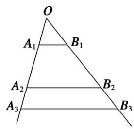

# 专题 5 用构造辅助数列通项公式

考点一 由 $a_{n + 1} = Aa_n + B(A\neq 0$ 且 $A\neq 1$ ， $B\neq 0)$ 求 $a_{n}$ 型

# 【基本方法】

已知 $a_{n + 1} = Aa_n + B$ 求 $a_{n}$ 的方法1

递推关系形如 $a_{n + 1} = A a_n + B (A \neq 0$ 且 $A \neq 1, B \neq 0, A, B$ 为常数)可化为 $a_{n + 1} + \frac{B}{A - 1} = A \left( a_n + \frac{B}{A - 1} \right) (p \neq 1)$ 的形式，利用 $\left\{a_n + \frac{B}{A - 1}\right\}$ 是以 $A$ 为公比的等比数列求解.

已知 $a_{n + 1} = Aa_n + B$ 求 $a_{n}$ 的方法2

对于一个函数 $f(x)$ ，我们把满足 $f(m) = m$ 的值 $x = m$ 称为函数 $f(x)$ 的“不动点”。利用“不动点法”可以构造新数列，求数列的通项公式。
若 $f(x) = Ax + B (A \neq 0, 1)$ ， $p$ 是 $f(x)$ 的不动点．数列 $\{a_n\}$ 满足 $a_{n+1} = f(a_n)$ ，则 $a_{n+1} - p = A (a_n - p)$ ，即 $\{a_n - p\}$ 是公比为 $A$ 的等比数列.

# 【基本题型】

[例 1] （1） 已知数列 $\{a_{n}\}$ 满足 $a_{1}=1$ ， $a_{n+1}=3a_{n}+2(n\in\mathbf{N}^{*})$ ，则数列 $\{a_{n}\}$ 的通项公式为 \_\_\_\_.
答案 $a_{n} = 2\cdot 3^{n - 1} - 1$ 解析 $\because a_{n + 1} = 3a_n + 2,\therefore a_{n + 1} + 1 = 3(a_n + 1),\therefore \frac{a_{n + 1} + 1}{a_n + 1} = 3,\therefore$ 数列 $\{a_n + 1\}$ 为等比数列，公比 $q = 3$ ，又 $a_1 + 1 = 2$ ， $\therefore a_n + 1 = 2\cdot 3^{n - 1},\therefore a_n = 2\cdot 3^{n - 1} - 1.$

(迭代法) $a_{n+1}=3a_{n}+2$ ，即 $a_{n+1}+1=3(a_{n}+1)=3^{2}(a_{n-1}+1)=3^{3}(a_{n-2}+1)=\cdots=3^{n}(a_{1}+1)=2\times3^{n}(n\geqslant1)$ ，所以 $a_{n}=2\times3^{n-1}-1(n\geqslant2)$ ，又 $a_{1}=1$ 也满足上式，故数列 $\{a_{n}\}$ 的一个通项公式为 $a_{n}=2\times3^{n-1}-1$ .  
（2）已知数列 $\{a_{n}\}$ 中， $a_1 = 3$ ，且点 $P_{n}(a_{n}, a_{n + 1})(n\in \mathbf{N}^{*})$ 在直线 $3x - y + 1 = 0$ 上，则数列 $\{a_{n}\}$ 的通项公式为
答案 $a_{n} = \frac{7}{2}\cdot 3^{n - 1} - \frac{1}{2}$ 解析 因为点 $P_{n}(a_{n},a_{n + 1})(n\in \mathbf{N}^{*})$ 在直线 $3x - y + 1 = 0$ 上，所以 $3a_{n} - a_{n + 1} + 1 =$ 0，即 $a_{n + 1} = 3a_n + 1$ ，所以 $a_{n + 1} + \frac{1}{2} = 3\left(a_n + \frac{1}{2}\right)$ ，所以数列 $\left\{a_n + \frac{1}{2}\right\}$ 是公比为3的等比数列，首项为 $a_1 + \frac{1}{2} = 3$ $+\frac{1}{2} = \frac{7}{2}$ ，所以 $a_{n} + \frac{1}{2} = \frac{7}{2}\cdot 3^{n - 1}$ ，所以 $a_{n} = \frac{7}{2}\cdot 3^{n - 1} - \frac{1}{2}$

[例 2] （1） 在数列 $\{a_{n}\}$ 中， $a_{1}=1,\quad a_{n+1}=\frac{1}{2}a_{n}+1$ ，则数列 $\{a_{n}\}$ 的通项公式为 \_\_\_\_.
答案 $2 - \left(\frac{1}{2}\right)^{n - 1}$ 解析 设 $f(x) = \frac{1}{2} x + 1$ ，令 $f(x) = x$ ，即 $\frac{1}{2} x + 1 = x$ ，得 $x = 2$ ， $\therefore x = 2$ 是函数 $f(x) = \frac{1}{2} x + 1$ 的不动点， $\therefore a_{n + 1} - 2 = \frac{1}{2}(a_n - 2)$ ， $\therefore$ 数列 $\{a_n - 2\}$ 是以-1为首项，以 $\frac{1}{2}$ 为公比的等比数列， $\therefore a_n - 2 = -1 \times \left(\frac{1}{2}\right)^{n - 1}$ ， $\therefore a_n = 2 - \left(\frac{1}{2}\right)^{n - 1}$ ， $n \in \mathbf{N}^*$ .  
（2）已知数列 $\{a_{n}\}$ 满足 $a_{n+1}=-\frac{1}{3}a_{n}-2,\quad a_{1}=4$ ，则数列 $\{a_{n}\}$ 的通项公式为\_\_\_\_.
答案 $-\frac{3}{2} + \frac{11}{2} \cdot \left[ -\frac{1}{3} \right]_{n-1}$ 解析 设 $f(x) = -\frac{1}{3} x - 2$ ，由 $f(x) = x$ ，得 $x = -\frac{3}{2}$ . $\therefore a_{n+1} + \frac{3}{2} = -\frac{1}{3} \left( a_n + \frac{3}{2} \right)$ ，又 $a_1 = 4$ ， $\therefore \left\{ a_n + \frac{3}{2} \right\}$ 是以 $\frac{11}{2}$ 为首项，以 $-\frac{1}{3}$ 为公比的等比数列， $\therefore a_n + \frac{3}{2} = \frac{11}{2} \times \left[ -\frac{1}{3} \right]_{n-1}$ , $\therefore a_n = -\frac{3}{2} + \frac{11}{2} \cdot \left[ -\frac{1}{3} \right]_n^{-1}$ , $n \in \mathbf{N}^*$ .

# 【对点精练】

1. 在数列 $\{a_{n}\}$ 中，若 $a_1 = 1$ ， $a_{n + 1} = 2a_{n} + 3$ ，则通项公式 $a_{n} =$

1. 答案 $2^{n+1} - 3$ 解析 设递推公式 $a_{n+1} = 2a_n + 3$ 可以转化为 $a_{n+1} + t = 2(a_n + t)$ ，即 $a_{n+1} = 2a_n + t$ ，解得 $t = 3$ 。故 $a_{n+1} + 3 = 2(a_n + 3)$ 。令 $b_n = a_n + 3$ ，则 $b_1 = a_1 + 3 = 4$ ，且 $\frac{b_{n+1}}{b_n} = \frac{a_{n+1} + 3}{a_n + 3} = 2$ 。所以 $\{b_n\}$ 是以 4 为首项，2 为公比的等比数列。 $\therefore b_n = 4 \cdot 2^{n-1} = 2^{n+1}$ ， $\therefore a_n = 2^{n+1} - 3$ 。

2. 在数列 $\{a_{n}\}$ 中，已知 $a_1 = 1$ ， $a_{n + 1} = 2a_{n} + 1$ ，则其通项公式 $a_{n} =$

2. 答案 $2^{n} - 1$ 解析 由题意知 $a_{n+1} + 1 = 2(a_n + 1)$ , $\therefore$ 数列 $\{a_n + 1\}$ 是以 2 为首项, 2 为公比的等比数列, $\therefore a_n + 1 = 2^n$ , $\therefore a_n = 2^n - 1$ .

3. 已知数列 $\{a_{n}\}$ 中， $a_{1} = 3$ ，且点 $P_{n}(a_{n}, a_{n+1})(n \in \mathbb{N}^{*})$ 在直线 $4x - y + 1 = 0$ 上，则数列 $\{a_{n}\}$ 的通项公式为 \_\_\_\_.

3. 答案 $a_{n} = \frac{10}{3} \times 4^{n - 1} - \frac{1}{3}$ 解析 因为点 $P_{n}(a_{n}, a_{n + 1})(n \in \mathbb{N}^{*})$ 在直线 $4x - y + 1 = 0$ 上，所以 $4a_{n} - a_{n + 1} + 1 = 0$ . 所以 $a_{n + 1} + \frac{1}{3} = 4\left(a_{n} + \frac{1}{3}\right)$ . 因为 $a_{1} = 3$ ，所以 $a_{1} + \frac{1}{3} = \frac{10}{3}$ . 故数列 $\left\{a_{n} + \frac{1}{3}\right\}$ 是首项为 $\frac{10}{3}$ ，公比为4的等比数列．所以 $a_{n} + \frac{1}{3} = \frac{10}{3} \times 4^{n - 1}$ ，故数列 $\{a_{n}\}$ 的通项公式为 $a_{n} = \frac{10}{3} \times 4^{n - 1} - \frac{1}{3}$ .

考点二 由 $a_{n + 1} = pa_n + f(n)$ 求 $a_{n}$ 型

# 【基本方法】
$\text { 已知 } a _ {n + 1} = p a _ {n} + f (n) \text { 求 } a _ {n} \text { 的方法 }$

递推关系形如 $a_{n + 1} = pa_n + f(n)(p$ 是非零常数)的数列 $\{a_{n}\}$ 的通项公式，可先在两边同除以 $f(n)$ 后再用累加法求得.

# 【基本题型】

[例 3] （1） 在数列 $\{a_{n}\}$ 中，若 $a_{1}=2,\quad a_{n+1}=2a_{n}+2^{n+1}$ ，则通项公式 $a_{n}=$ \_\_\_\_.
答案 $n \cdot 2^n$ 解析 将式子 $a_{n+1} = 2a_n + 2^{n+1}$ 两边同除以 $2^{n+1}$ 得， $\frac{a_{n+1}}{2^{n+1}} = \frac{a_n}{2^n} + 1$ ，所以 $\left\{\frac{a_n}{2^n}\right\}$ 是首项、公差均为 1 的等差数列，所以 $\frac{a_n}{2^n} = n$ ， $a_n = n \cdot 2^n$ .  
（2）在数列 $\{a_{n}\}$ 中， $a_1 = 1$ ， $a_{n + 1} = \frac{1}{3} a_n + \left(\frac{1}{3}\right)_{n + 1}(n\in \mathbf{N}^*)$ ，则通项公式 $a_{n} = \underline{\quad}$
答案 B 解析 由题意得 $a_{n} = \frac{1}{3} a_{n - 1} + \left(\frac{1}{3}\right)^{n}(n\geq 2)$ ， $\therefore 3^{n}a_{n} = 3^{n - 1}a_{n - 1} + 1(n\geq 2)$ ，即 $3^{n}a_{n} - 3^{n - 1}a_{n - 1} = 1(n\geq 2)$ 。又 $a_1 = 1$ ， $\therefore 3^1\cdot a_1 = 3$ ， $\therefore$ 数列 $\{3^n a_n\}$ 是以 3 为首项，1 为公差的等差数列， $\therefore 3^n a_n = 3 + (n - 1)\times 1 = n + 2$ ， $\therefore a_n = \frac{n + 2}{3^n} (n\in \mathbf{N}^*)$ 。  
（3）已知数列 $\{a_{n}\}$ 的前 $n$ 项和为 $S_{n}$ ，满足 $2S_{n} = a_{n + 1} - 2^{n + 1} + 1$ ， $n \in \mathbf{N}^{*}$ ，且 $a_{1}, a_{2} + 5, a_{3}$ 成等差数列，则 $a_{n} = \underline{\quad}$ .
答案 $3^{n} - 2^{n}$ 解析 由 $a_1, a_2 + 5, a_3$ 成等差数列可得 $a_1 + a_3 = 2a_2 + 10$ ，由 $2S_n = a_{n+1} - 2^{n+1} + 1$ ，得 $2a_1 + 2a_2 = a_3 - 7$ ，即 $2a_2 = a_3 - 7 - 2a_1$ 。代入 $a_1 + a_3 = 2a_2 + 10$ ，得 $a_1 = 1$ ，代入 $2S_1 = a_2 - 2^2 + 1$ ，得 $a_2 = 5.2S_n = a_{n+1} - 2^{n+1} + 1$ ，得当 $n \geq 2$ 时， $2S_{n-1} = a_n - 2^n + 1$ ，两式相减，得 $2a_n = a_{n+1} - a_n - 2^n$ ，即 $a_{n+1} = 3a_n + 2^n$ ，当 $n = 1$ 时， $5 = 3 \times 1 + 2^1$ 也适合 $a_{n+1} = 3a_n + 2^n$ ，所以对任意正整数 $n, a_{n+1} = 3a_n + 2^n$ 。上式两端同时除以 $2^{n+1}$ ，得 $\frac{a_{n+1}}{2^{n+1}} = \frac{3}{2} \cdot \frac{a_n}{2^n} + \frac{1}{2}$ ，两端同时加 $1$ ，得 $\frac{a_{n+1}}{2^{n+1}} + 1 = \frac{3}{2} \cdot \frac{a_n}{2^n} + \frac{3}{2} = \frac{3}{2} \left( \frac{a_n}{2^n} + 1 \right)$ ，所以数列 $\left\{ \frac{a_n}{2^n} + 1 \right\}$ 是首项为 $\frac{3}{2}$ ，公比为 $\frac{3}{2}$ 的等比数列，所以 $\frac{a_n}{2^n} + 1 = \left( \frac{3}{2} \right)^n$ ，所以 $\frac{a_n}{2^n} = \left( \frac{3}{2} \right)^n - 1$ ，所以 $a_n = 3^n - 2^n$ 。

# 【对点精练】

1. 已知数列 $\{a_{n}\}$ 满足 $a_{1} = 1$ ， $a_{n+1} - 2a_{n} = 2^{n}(n \in \mathbf{N}^{*})$ ，则数列 $\{a_{n}\}$ 的通项公式为 $a_{n} = \underline{\quad}$ .

1. 答案 $n \cdot 2^{n-1}$ 解析 $a_{n+1} - 2a_n = 2^n$ 两边同除以 $2^{n+1}$ ，可得 $\frac{a_{n+1}}{2^{n+1}} - \frac{a_n}{2^n} = \frac{1}{2}$ ，又 $\frac{a_1}{2} = \frac{1}{2}$ ， $\therefore$ 数列 $\left\{\frac{a_n}{2^n}\right\}$ 是以 $\frac{1}{2}$ 为首项， $\frac{1}{2}$ 为公差的等差数列， $\therefore \frac{a_n}{2^n} = \frac{1}{2} + (n-1) \times \frac{1}{2} = \frac{n}{2}$ ， $\therefore a_n = n \cdot 2^{n-1}$ .

2. 在数列 $\{a_{n}\}$ 中，已知 $a_1 = 1$ ， $a_{n+1} = \frac{1}{2} a_n - \frac{1}{2^n}$ ，则其通项公式 $a_{n} = \underline{\quad}$ .

2. 答案 $\frac{2 - n}{2^{n - 1}}$ 解析 由 $a_{n + 1} = \frac{1}{2} a_n - \frac{1}{2^n}$ 得 $2^{n}a_{n + 1} = 2^{n - 1}a_{n} - 1$ ，令 $b_{n} = 2^{n - 1}a_{n}$ ，则 $b_{n + 1} - b_{n} = -1$ ，又 $a_1 = 1$ $\therefore b_{1} = 1, \therefore b_{n} = 1 + (n - 1)\times (-1) = -n + 2.$ 即 $2^{n - 1}a_{n} = -n + 2,\therefore a_{n} = \frac{2 - n}{2^{n - 1}}.$

3. 已知各项均不为 0 的数列 $\{a_{n}\}$ 满足 $a_{1} = \frac{1}{2}, a_{n}a_{n - 1} = a_{n - 1} - a_{n}(n\geqslant 2, n\in \mathbf{N}^{*})$ ，则数列 $\{a_{n}\}$ 的通项公式 $a_{n} = \_$ .

3. 解 $\because a_{n}a_{n - 1} = a_{n - 1} - a_{n}$ ，且各项均不为0， $\therefore \frac{1}{a_n} -\frac{1}{a_{n - 1}} = 1$ ： $\{\frac{1}{a_n}\}$ 为首项是2，公差为1的等差数列， $\therefore \frac{1}{a_n} = n + 1$ ，∴当 $n\geqslant 2$ 时， $a_{n} = \frac{1}{n + 1}$ . $\because a_1 = \frac{1}{2}$ 也符合上式， $\therefore a_{n} = \frac{1}{n + 1} (n\in \mathbf{N}^{*})$

考点三 由 $a_{n + 2} = pa_{n + 1} + qa_n$ 求 $a_{n}$ 型

# 【基本方法】

已知 $a_{n + 2} = pa_{n + 1} + qa_n$ 求 $a_{n}$ 的方法

递推关系形如 $a_{n + 2} = pa_{n + 1} + qa_n$ 型，可化为 $a_{n + 2} + xa_{n + 1} = (p + x)\left(a_{n + 1} + \frac{q}{p + x} a_n\right)$ ，令 $x = \frac{q}{p + x}$ ，求得 $x$ 来解决.

# 【基本题型】

[例 4] 已知数列 $\{a_{n}\}$ 满足 $a_{1}=1, a_{2}=4, a_{n+2}+2a_{n}=3a_{n+1}(n\in\mathrm{N}_{+})$ ，则数列 $\{a_{n}\}$ 的通项公式 $a_{n}=$ \_\_\_\_.
答案 $3 \times 2^{n-1} - 2$ 解析 由 $a_{n+2} + 2a_n - 3a_{n+1} = 0$ ，得 $a_{n+2} - a_{n+1} = 2(a_{n+1} - a_n)$ ， $\therefore$ 数列 $\{a_{n+1} - a_n\}$ 是以 $a_2 - a_1 = 3$ 为首项，2为公比的等比数列， $\therefore a_{n+1} - a_n = 3 \times 2^{n-1}$ ， $\therefore$ 当 $n \geq 2$ 时， $a_n - a_{n-1} = 3 \times 2^{n-2}$ ， $\ldots, a_3 - a_2 = 3 \times 2, a_2 - a_1 = 3$ ，将以上各式累加，得 $a_n - a_1 = 3 \times 2^{n-2} + \ldots + 3 \times 2 + 3 = 3(2^{n-1} - 1), \therefore a_n = 3 \times 2^{n-1} - 2$ （当 $n = 1$ 时，也满足）.

# 【对点精练】

1. 若 $a_1 = 5, a_2 = 2, a_{n+2} = 2a_{n+1} + 3a_n$ ，则 $a_n =$ \_\_\_\_.

1. 答案 $\frac{7 \cdot 3^{n-1} + 13(-1)^{n-1}}{4}$ 解析 设 $a_{n+2} + xa_{n+1} = (2 + x)a_{n+1} + 3a_n(x \neq -2, x$ 是待定系数)，即 $a_{n+1}$
$_{2}+xa_{n+1}=(2+x)\left(a_{n+1}+\frac{3}{2+x}a_{n}\right)$ ，令 $x=\frac{3}{2+x}$ ，解得x=-3或1．当x=-3时，得 $a_{n+2}-3a_{n+1}=-(a_{n+1}-3a_{n})$ ，所以 $\{a_{n+1}-3a_{n}\}$ 是首项为-13、公比为-1的等比数列，得 $a_{n+1}-3a_{n}=-13\cdot(-1)^{n-1}$ ．当x=1时，同理可得 $a_{n+1}+a_{n}=7\cdot3^{n-1}$ ，解关于 $a_{n+1}$ ， $a_{n}$ 的方程组 $\left\{\begin{aligned}a_{n+1}-3a_{n}&=-13\cdot(-1)^{n-1},\\ a_{n+1}+a_{n}&=7\cdot3^{n-1},\end{aligned}\right.$ 可得 $a_{n}=\frac{7\cdot3^{n-1}+13(-1)^{n-1}}{4}$ .

考点四 由 $a_{n + 1} = \frac{A a_n}{B a_n + C}$ 求 $a_{n}$ 型

# 【基本方法】

已知 $a_{n + 1} = \frac{Aa_n}{Ba_n + C}$ 求 $a_{n}$ 的方法1

递推关系形如 $a_{n+1}=\frac{Aa_{n}}{Ba_{n}+C}$ 型可取倒数，构造新数列求解.

已知 $a_{n+1}=\frac{Aa_{n}}{Ba_{n}+C}$ 求 $a_{n}$ 的方法 2

对于一个函数 $f(x)$ ，我们把满足 $f(m) = m$ 的值 $x = m$ 称为函数 $f(x)$ 的“不动点”。利用“不动点法”可以构造新数列，求数列的通项公式。
设 $f(x) = \frac{Ax + B}{Cx + D} (c \neq 0, AD - BC \neq 0)$ ，数列 $\{a_n\}$ 满足 $a_{n+1} = f(a_n), a_1 \neq f(a_1)$ . 若 $f(x)$ 有两个相异的不动点 $p$ ，

q，则 $\frac{a_{n+1}-p}{a_{n+1}-q}=k\cdot\frac{a_{n}-p}{a_{n}-q}\left(\text{此处}k=\frac{a-pc}{a-qc}\right).$

# 【基本题型】

[例 5] （1） 已知数列 $\{a_{n}\}$ 中， $a_{1}=2,\quad a_{n+1}=\frac{2a_{n}}{a_{n}+2}(n\in\mathbf{N}^{*})$ ，则数列 $\{a_{n}\}$ 的通项公式 $a_{n}=$ \_\_\_\_.
答案 $\frac{2}{n}$ 解析 $\because a_{n+1} = \frac{2a_n}{a_n + 2}, a_1 = 2, \therefore a_n \neq 0, \therefore \frac{1}{a_{n+1}} = \frac{1}{a_n} + \frac{1}{2}$ , 即 $\frac{1}{a_{n+1}} - \frac{1}{a_n} = \frac{1}{2}$ , 又 $a_1 = 2$ , 则 $\frac{1}{a_1} = \frac{1}{2}$ , $\therefore \left\{\frac{1}{a_n}\right\}$ 是以 $\frac{1}{2}$ 为首项, $\frac{1}{2}$ 为公差的等差数列. $\therefore \frac{1}{a_n} = \frac{1}{a_1} + (n-1) \times \frac{1}{2} = \frac{n}{2}, \therefore a_n = \frac{2}{n}$ .  
（2）已知数列 $\{a_{n}\}$ 中， $a_1 = 1$ ， $a_{n + 1} = \frac{a_n}{a_n + 3} (n\in \mathbf{N}^*)$ ，则数列 $\{a_{n}\}$ 的通项公式为
答案 $\frac{2}{3^n - 1}$ 解析 因为 $a_{n+1} = \frac{a_n}{a_n + 3} (n \in \mathbb{N}^*)$ ，所以 $\frac{1}{a_{n+1}} = \frac{3}{a_n} + 1$ ，设 $\frac{1}{a_{n+1}} + t = 3\left(\frac{1}{a_n} + t\right)$ ，所以 $3t - t = 1$ ，解得 $t = \frac{1}{2}$ ，所以 $\frac{1}{a_{n+1}} + \frac{1}{2} = 3\left(\frac{1}{a_n} + \frac{1}{2}\right)$ ，又 $\frac{1}{a_1} + \frac{1}{2} = 1 + \frac{1}{2} = \frac{3}{2}$ ，所以数列 $\left\{\frac{1}{a_n} + \frac{1}{2}\right\}$ 是以 $\frac{3}{2}$ 为首项，3 为公比的等比数列，所以 $\frac{1}{a_n} + \frac{1}{2} = \frac{3}{2} \times 3^{n-1} = \frac{3^n}{2}$ ，所以 $\frac{1}{a_n} = \frac{3^n - 1}{2}$ ，所以 $a_n = \frac{2}{3^n - 1}$ .

[例 6] （1） 已知数列 $\{a_{n}\}$ 满足 $a_{1}=3$ ， $a_{n+1}=\frac{7a_{n}-2}{a_{n}+4}$ ，则数列 $\{a_{n}\}$ 的通项公式为 \_\_\_\_.
答案 $\frac{4\cdot 6^{n - 1} - 5^{n - 1}}{2\cdot 6^{n - 1} - 5^{n - 1}}$ 解析 由方程 $x = \frac{7x - 2}{x + 4}$ ，得数列 $\{a_{n}\}$ 的不动点为1和2， $\frac{a_{n + 1} - 1}{a_{n + 1} - 2} = \frac{\frac{7a_n - 2}{a_n + 4} - 1}{\frac{7a_n - 2}{a_n + 4} - 2} =$ $\frac{7a_n - 2 - (a_n + 4)}{7a_n - 2 - 2(a_n + 4)} = \frac{6}{5}\cdot \frac{a_n - 1}{a_n - 2}$ 所以 $\left\{\frac{a_n - 1}{a_n - 2}\right\}$ 是首项为 $\frac{a_1 - 1}{a_1 - 2} = 2$ ，公比为 $\frac{6}{5}$ 的等比数列，所以 $\frac{a_n - 1}{a_n - 2} = 2\cdot \left(\frac{6}{5}\right)^{n - 1},$ 解得 $a_{n} = \frac{1}{2\cdot\left(\frac{6}{5}\right)^{n - 1} - 1} +2 = \frac{4\cdot 6^{n - 1} - 5^{n - 1}}{2\cdot 6^{n - 1} - 5^{n - 1}}, n\in \mathbf{N}^*$  
（2）已知数列 $\{a_{n}\}$ 满足 $a_{1}=2,\quad a_{n}=\frac{a_{n-1}+2}{2a_{n-1}+1}(n\geqslant2)$ ，则数列 $\{a_{n}\}$ 的通项公式为\_\_\_\_.
答案 $\frac{3^n - (-1)^n}{3^n + (-1)^n}$ 解析 解方程 $x = \frac{x + 2}{2x + 1}$ , 化简得 $2x^2 - 2 = 0$ , 解得 $x_1 = 1, x_2 = -1$ , 令 $\frac{a_{n+1} - 1}{a_{n+1} + 1} = c \cdot \frac{a_n - 1}{a_n + 1}$ , 由 $a_1 = 2$ , 得 $a_2 = \frac{4}{5}$ , 可得 $c = -\frac{1}{3}$ , $\therefore$ 数列 $\left\{\frac{a_n - 1}{a_n + 1}\right\}$ 是以 $\frac{a_1 - 1}{a_1 + 1} = \frac{1}{3}$ 为首项, 以 $-\frac{1}{3}$ 为公比的等比数列, $\therefore \frac{a_n - 1}{a_n + 1} = \frac{1}{3} \cdot \left(-\frac{1}{3}\right)^{n-1}, \therefore a_n = \frac{3^n - (-1)^n}{3^n + (-1)^n}$ .  
（3）设数列 $\{a_{n}\}$ 满足 $8a_{n + 1}a_{n} - 16a_{n + 1} + 2a_{n} + 5 = 0(n\geqslant 1, n\in \mathbf{N}^{*})$ ，且 $a_1 = 1$ ，记 $b_{n} = \frac{1}{a_{n} - \frac{1}{2}} (n\geqslant 1)$ . 则数列 $\{b_n\}$ 的通项公式为 \_\_\_\_.
答案 $\frac{2^n + 4}{3}$ 解析 由已知得 $a_{n+1} = \frac{2a_n + 5}{16 - 8a_n}$ , 由方程 $x = \frac{2x + 5}{16 - 8x}$ , 得不动点 $x_1 = \frac{1}{2}, x_2 = \frac{5}{4}$ . 所以 $\frac{a_{n+1} - \frac{1}{2}}{a_{n+1} - \frac{5}{4}} = \frac{\frac{2a_n + 5}{16 - 8a_n} - \frac{1}{2}}{\frac{2a_n + 5}{16 - 8a_n} - \frac{5}{4}} = \frac{1}{2} \cdot \frac{a_n - \frac{1}{2}}{a_n - \frac{5}{4}}$ , 所以数列 $\left\{\frac{a_n - \frac{1}{2}}{a_n - \frac{5}{4}}\right\}$ 是首项为 -2, 公比为 $\frac{1}{2}$ 的等比数列, 所以 $\frac{a_n - \frac{1}{2}}{a_n - \frac{5}{4}} = -2 \times \left(\frac{1}{2}\right)^{n-1} = -\frac{4}{2^n}$ , 解得 $a_n = \frac{2^{n-1} + 5}{2^n + 4}$ . 故 $b_n = \frac{1}{a_n - \frac{1}{2}} = \frac{2^n + 4}{3}, n \in \mathbf{N}^*$ .

# 【对点精练】

1. 已知数列 $\{a_{n}\}$ 中， $a_{1} = 1$ ， $a_{n+1} = \frac{2a_{n}}{a_{n} + 2} (n \in \mathbf{N}_{+})$ ，则数列 $\{a_{n}\}$ 的通项公式为 \_\_\_\_.

1. 答案 $\frac{2}{n + 1}$ 解析 因为 $a_{n + 1} = \frac{2a_n}{a_n + 2}, a_1 = 1$ ，所以 $a_n \neq 0$ ，所以 $\frac{1}{a_{n + 1}} = \frac{1}{a_n} + \frac{1}{2}$ ，即 $\frac{1}{a_{n + 1}} - \frac{1}{a_n} = \frac{1}{2}$ . 又因为 $a_1 = 1$ ，则 $\frac{1}{a_1} = 1$ ，所以 $\left\{\frac{1}{a_n}\right\}$ 是以 1 为首项， $\frac{1}{2}$ 为公差的等差数列．所以 $\frac{1}{a_n} = \frac{1}{a_1} + (n - 1) \times \frac{1}{2} = \frac{n}{2} + \frac{1}{2}$ . 所以 $a_n = \frac{2}{n + 1}$ .

2. 若 $a_1 = 1$ ， $a_{n+1} = \frac{a_n}{3a_n + 1}$ ，则数列 $\{a_n\}$ 的通项公式 $a_n = \_$ .

2. 答案 $\frac{1}{3n - 2}$ 解析 对 $a_{n + 1} = \frac{a_n}{3a_n + 1}$ 两边取倒数，得 $\frac{1}{a_{n + 1}} = \frac{1}{a_n} + 3$ ，所以数列 $\left\{\frac{1}{a_n}\right\}$ 是首项为 $\frac{1}{a_1} = 1$ ，公差为3的等差数列，所以 $\frac{1}{a_n} = 3n - 2, a_n = \frac{1}{3n - 2}$ .

3. 若 $a_1 = 5$ ， $a_{n+1} = \frac{3a_n - 4}{a_n - 1}$ ，则 $a_n = \_$ .

3. 答案 $\frac{6n - 1}{3n - 2}$ 解析 令 $a_{n} = b_{n} + p$ ，得 $b_{n + 1} + p = \frac{3b_{n} + 3p - 4}{b_{n} + p - 1} b_{n + 1} = \frac{3b_{n} + 3p - 4}{b_{n} + p - 1} - p = \frac{(3 - p)b_{n} + 4p - 4 - p^{2}}{b_{n} + p - 1}$ 令 $4p - 4 - p^{2} = 0$ ，得 $p = 2$ ，所以 $b_{1} = 3$ ， $b_{n + 1} = \frac{b_{n}}{b_{n} + 1}$ ，两边取倒数， $\frac{1}{b_{n + 1}} = 1 + \frac{1}{b_{n}}$ ， $\left\{\frac{1}{b_{n}}\right\}$ 为首项为 $\frac{1}{b_1} = \frac{1}{3}$ ，公差为 1 的等差数列，可求得 $b_{n} = \frac{3}{3n - 2}$ ，所以 $a_{n} = \frac{6n - 1}{3n - 2}$ .

# 考点五 由其他形式的递推公式求 $a_{n}$ 型

# 【基本方法】

# 已知其他形式的递推公式求 $a_{n}$ 的方法

对递推公式进行合理的变形，然后转化为等差数列或等比数列

# 【基本题型】

[例7] （1） 数列 $\{a_{n}\}$ 满足 $a_{1} = 2$ ， $a_{n + 1} = a_n^2 (a_n > 0, n \in \mathbf{N}^*)$ ，则 $a_{n} = (\quad)$

A. $10^{n - 2}$

B. $10^{n - 1}$

C. $102^{n - 1}$

D. $22^{n - 1}$
答案 D 解析 因为数列 $\{a_{n}\}$ 满足 $a_{1}=2,\quad a_{n+1}=a_{n}^{2}(a_{n}>0,\quad n\in\mathbf{N}^{*})$ ，所以 $\log_{2}a_{n+1}=2\log_{2}a_{n}$ ，即 $\frac{\log_{2}a_{n+1}}{\log_{2}a_{n}}=2$ 。又 $a_{1}=2$ ，所以 $\log_{2}a_{1}=\log_{2}2=1$ 。故数列 $\{\log_{2}a_{n}\}$ 是首项为 1，公比为 2 的等比数列。所以 $\log_{2}a_{n}=2^{n-1}$ ，即 $a_{n}=22^{n-1}$ 。故选 D.  
（2）已知各项都为正数的数列 $\{a_{n}\}$ 满足： $a_1 = 1$ ， $a_{n}^{2} - (2a_{n + 1} - 1)a_{n} - 2a_{n + 1} = 0$ ，则数列 $a_{n}$ 的通项公式为
答案 $a_{n} = \frac{1}{2^{n - 1}}$ 解析 $\because a_n^2 -(2a_{n + 1} - 1)a_n - 2a_{n + 1} = 0,\therefore (a_n - 2a_{n + 1})(a_n + 1) = 0.$ 又 $\because$ 数列 $\{a_{n}\}$ 的各项都是正数， $\therefore a_n - 2a_{n + 1} = 0$ ，即 $\frac{a_{n + 1}}{a_n} = \frac{1}{2}.\therefore \{a_n\}$ 是首项为1，公比为 $\frac{1}{2}$ 的等比数列， $\therefore a_{n} = \frac{1}{2^{n - 1}}.$  
（3）已知数列 $\{a_{n}\}$ 的首项 $a_1 = 1$ ，前 $n$ 项和为 $S_{n}$ ，且 $S_{n + 1} = 4a_{n} + 2(n\in \mathbf{N}^{*})$ ，则 $a_{n} =$
答案 $(3n - 1)2^{n - 2}$ 解析 当 $n\geqslant 2$ 时， $S_{n + 1} = 4a_n + 2$ ， $S_{n} = 4a_{n - 1} + 2$ 。两式相减，得 $a_{n + 1} = 4a_n - 4a_{n - 1}$ 将之变形为 $a_{n + 1} - 2a_{n} = 2(a_{n} - 2a_{n - 1})$ 。所以 $\{a_{n + 1} - 2a_n\}$ 是公比为2的等比数列。又 $a_1 + a_2 = S_2 = 4a_1 + 2$ ， $a_1 = 1$ ，得 $a_2 = 5$ ，则 $a_2 - 2a_1 = 3$ 。所以 $a_{n + 1} - 2a_n = 3\cdot 2^{n - 1}$ 。两边同除以 $2^{n + 1}$ ，得 $\frac{a_{n + 1}}{2^{n + 1}} -\frac{a_n}{2^n} = \frac{3}{4}$ ，所以 $\left\{\frac{a_n}{2^n}\right\}$ 是首项为 $\frac{a_1}{2} = \frac{1}{2}$ ，公差为 $\frac{3}{4}$ 的等差数列。所以 $\frac{a_n}{2^n} = \frac{1}{2} +\frac{3}{4} (n - 1) = \frac{3}{4} n - \frac{1}{4}$ ，所以 $a_{n} = (3n - 1)2^{n - 2}$

[例 8] (2016·全国III)已知各项都为正数的数列 $\{a_{n}\}$ 满足 $a_{1}=1,\quad a_{n}^{2}-(2a_{n+1}-1)a_{n}-2a_{n+1}=0.$  
（1）求 $a_2, a_3$ ;   
（2）求 $\{a_{n}\}$ 的通项公式.
解析 （1）由题意得 $a_{2}=\frac{1}{2}$ ， $a_{3}=\frac{1}{4}$ .  
（2）由 $a_{n}^{2} - (2a_{n + 1} - 1)a_{n} - 2a_{n + 1} = 0$ 得， $2a_{n + 1}(a_n + 1) = a_n(a_n + 1)$
因为 $\{a_{n}\}$ 的各项都为正数，所以 $\frac{a_{n+1}}{a_{n}}=\frac{1}{2}$ .
故 $\{a_{n}\}$ 是首项为1，公比为 $\frac{1}{2}$ 的等比数列，因此 $a_{n}=\frac{1}{2^{n-1}}$ .

# 【对点精练】

1. 已知数列 $\{a_{n}\}$ 满足 $a_{1} = 1, (a_{n} + a_{n+1} - 1)^{2} = 4a_{n}a_{n+1}$ ，且 $a_{n+1} > a_{n}(n \in \mathbf{N}^{*})$ ，则数列 $\{a_{n}\}$ 的通项公式 $a_{n} = (\quad)$

A. $2n$

B. $n^{2}$

C. $n+2$

D. $3n - 2$

1. 答案 B 解析 因为 $a_1 = 1, a_{n+1} > a_n$ ，所以 $\sqrt{a_{n+1}} > \sqrt{a_n}$ . 由 $(a_n + a_{n+1} - 1)^2 = 4a_na_{n+1}$ 得 $a_{n+1} + a_n - 1$ $= 2\sqrt{a_{n}a_{n + 1}}$ ，所以 $(\sqrt{a_{n + 1}} -\sqrt{a_n})^2 = 1$ ，所以 $\sqrt{a_{n + 1}} -\sqrt{a_n} = 1$ ，所以数列 $\{\sqrt{a_n}\}$ 是首项为1，公差为1的等差数列，所以 $\sqrt{a_n} = n$ ，即 $a_{n} = n^{2}$ ，故选B.

2. 已知数列 $\{a_{n}\}$ 满足 $a_{n} \neq 0, 2a_{n}(1 - a_{n+1}) - 2a_{n+1}(1 - a_{n}) = a_{n} - a_{n+1} + a_{n} \cdot a_{n+1}$ , 且 $a_{1} = \frac{1}{3}$ , 则数列 $\{a_{n}\}$ 的通项公式 $a_{n} =$ \_\_\_\_.

2. 答案 $\frac{1}{n + 2}$ 解析 $\because a_{n} \neq 0, 2a_{n}(1 - a_{n+1}) - 2a_{n+1}(1 - a_{n}) = a_{n} - a_{n+1} + a_{n} \cdot a_{n+1}, \therefore$ 两边同除以 $a_{n} \cdot a_{n+1}$ , 得 $\frac{2(1 - a_{n+1})}{a_{n+1}} - \frac{2(1 - a_{n})}{a_{n}} = \frac{1}{a_{n+1}} - \frac{1}{a_{n}} + 1$ , 整理, 得 $\frac{1}{a_{n+1}} - \frac{1}{a_{n}} = 1$ , 即 $\left\{\frac{1}{a_{n}}\right\}$ 是以 3 为首项, 1 为公差的等差数列, $\therefore \frac{1}{a_{n}} = 3 + (n - 1) \times 1 = n + 2$ , 即 $a_{n} = \frac{1}{n + 2}$ .

3. 各项均不为 0 的数列 $\{a_{n}\}$ 满足 $\frac{a_{n+1}(a_n + a_{n+2})}{2} = a_{n+2}a_n (n \in \mathbb{N}^*)$ ，且 $a_3 = 2a_8 = \frac{1}{5}$ ，则数列 $\{a_{n}\}$ 的通项公式为 \_\_\_\_.

3. 答案 $a_{n} = \frac{1}{n + 2}$ 解析 因为 $\frac{a_{n + 1}(a_n + a_{n + 2})}{2} = a_{n + 2}a_n$ ，所以 $a_{n + 1}a_{n} + a_{n + 1}a_{n + 2} = 2a_{n + 2}a_{n}$ 。因为 $a_{n}a_{n + 1}a_{n + 2} \neq 0$ ，所以 $\frac{1}{a_{n + 2}} + \frac{1}{a_n} = \frac{2}{a_{n + 1}}$ ，所以数列 $\left\{\frac{1}{a_n}\right\}$ 为等差数列。设数列 $\left\{\frac{1}{a_n}\right\}$ 的公差为 $d$ ，则 $\frac{1}{a_8} = \frac{1}{a_3} + (8 - 3)d$ 。因为 $a_3 = 2a_8 = \frac{1}{5}$ ，所以 $d = 1$ ，又 $\frac{1}{a_1} = \frac{1}{a_3} - 2d = 3$ ，所以数列 $\left\{\frac{1}{a_n}\right\}$ 是以3为首项，1为公差的等差数列。 $\therefore \frac{1}{a_n} = 3 + (n - 1) \times 1 = n + 2$ ， $\therefore a_n = \frac{1}{n + 2}$ 。

4. (2013·安徽)如图, 互不相同的点 $A_{1}, A_{2}, \cdots, A_{n}, \cdots$ 和 $B_{1}, B_{2}, \cdots, B_{n} \cdots$ 分别在角 $O$ 的两条边上, 所有 $A_{n} B_{n}$ 相互平行, 且所有梯形 $A_{n} B_{n} B_{n+1} A_{n+1}$ 的面积均相等. 设 $OA_{n} = a_{n}$ , 若 $a_{1} = 1$ , $a_{2} = 2$ , 则数列 $\{a_{n}\}$ 的通项公式是 \_\_\_\_.

4. 答案 $a_{n} = \sqrt{3n - 2}$ 解析 由已知 $S$ 梯形 $A_{n}B_{n}B_{n + 1}A_{n + 1} = S_{\text{梯形} A_{n + 1}B_{n + 1}B_{n + 2}A_{n + 2}} = S_{\triangle OB_{n + 1}A_{n + 1}} - S_{\triangle OB_nA_n}$ $= S_{\triangle OB_{n + 2}A_{n + 2}} - S_{\triangle OB_{n + 1}A_{n + 1}}$ ，即 $S_{\triangle OB_nA_n} + S_{\triangle OB_{n + 2}A_{n + 2}} = 2S_{\triangle OB_{n + 1}A_{n + 1}}$ ，由相似三角形面积比是相似比的平方知 $OA_n^2 + OA_{n + 2}^2 = 2OA_{n + 1}^2$ ，即 $a_{n}^{2} + a_{n + 2}^{2} = 2a_{n + 1}^{2}$ ，因此 $\{a_n^2\}$ 为等差数列且 $a_{n}^{2} = a_{1}^{2} + 3(n - 1) = 3n - 2$ ，故 $a_{n} = \sqrt{3n - 2}$ .

