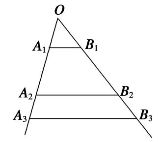

专题5　用构造辅助数列通项公式

<strong>考点一　由</strong><em><strong>an</strong></em><strong>＋1＝</strong><em><strong>Aan</strong></em><strong>＋</strong><em><strong>B</strong></em><strong>(</strong><em><strong>A</strong></em><strong>≠0且</strong><em><strong>A</strong></em><strong>≠1，</strong><em><strong>B</strong></em><strong>≠0)求</strong><em><strong>an</strong></em><strong>型</strong>

【基本方法】

已知<em>an</em>＋1＝<em>Aan</em>＋<em>B</em>求<em>an</em>的方法1

递推关系形如<em>an</em>＋1＝<em>Aan</em>＋<em>B</em>(<em>A</em>≠0且<em>A</em>≠1，<em>B</em>≠0，<em>A</em>，<em>B</em>为常数)可化为<em>an</em>＋1＋＝<em>A</em>(<em>p</em>≠1)的形式，利用是以<em>A</em>为公比的等比数列求解．

已知<em>an</em>＋1＝<em>Aan</em>＋<em>B</em>求<em>an</em>的方法2

对于一个函数*f*(*x*)，我们把满足*f*(*m*)＝*m*的值*x*＝*m*称为函数*f*(*x*)的“不动点”．利用“不动点法”可以构造新数列，求数列的通项公式．
若<em>f</em>(<em>x</em>)＝<em>Ax</em>＋<em>B</em>(<em>A</em>≠0，1)，<em>p</em>是<em>f</em>(<em>x</em>)的不动点．数列{<em>an</em>}满足<em>an</em>＋1＝<em>f</em>(<em>an</em>)，则<em>an</em>＋1－<em>p</em>＝<em>A</em>(<em>an</em>－<em>p</em>)，即{<em>an</em>－<em>p</em>}是公比为<em>A</em>的等比数列．

【基本题型】

<strong>[例1]</strong> （1）已知数列{<em>an</em>}满足<em>a</em>1＝1，<em>an</em>＋1＝3<em>an</em>＋2(<em>n</em>∈<strong>N</strong>\*)，则数列{<em>an</em>}的通项公式为\_\_\_\_\_\_\_\_．
答案　<em>an</em>＝2·3<em>n</em>－1－1　解析　∵<em>an</em>＋1＝3<em>an</em>＋2，∴<em>an</em>＋1＋1＝3(<em>an</em>＋1)，∴＝3，∴数列{<em>an</em>＋1}为等比数列，公比<em>q</em>＝3，又<em>a</em>1＋1＝2，∴<em>an</em>＋1＝2·3<em>n</em>－1，∴<em>an</em>＝2·3<em>n</em>－1－1．

(迭代法)<em>an</em>＋1＝3<em>an</em>＋2，即<em>an</em>＋1＋1＝3(<em>an</em>＋1)＝32(<em>an</em>－1＋1)＝33(<em>an</em>－2＋1)＝…＝3<em>n</em>(<em>a</em>1＋1)＝2×3<em>n</em>(<em>n</em>≥1)，所以<em>an</em>＝2×3<em>n</em>－1－1(<em>n</em>≥2)，又<em>a</em>1＝1也满足上式，故数列{<em>an</em>}的一个通项公式为<em>an</em>＝2×3<em>n</em>－1－1．  
（2）已知数列{<em>an</em>}中，<em>a</em>1＝3，且点<em>Pn</em>(<em>an</em>，<em>an</em>＋1)(<em>n</em>∈<strong>N</strong>\*)在直线3<em>x</em>－<em>y</em>＋1＝0上，则数列{<em>an</em>}的通项公式为\_\_\_\_\_\_\_\_．
答案　<em>an</em>＝·3<em>n</em>－1－　解析　因为点<em>Pn</em>(<em>an</em>，<em>an</em>＋1)(<em>n</em>∈<strong>N</strong>\*)在直线3<em>x</em>－<em>y</em>＋1＝0上，所以3<em>an</em>－<em>an</em>＋1＋1＝0，即<em>an</em>＋1＝3<em>an</em>＋1，所以<em>an</em>＋1＋＝3，所以数列是公比为3的等比数列，首项为<em>a</em>1＋＝3＋＝，所以<em>an</em>＋＝·3<em>n</em>－1，所以<em>an</em>＝·3<em>n</em>－1－．

<strong>[例2]</strong> （1）在数列{<em>an</em>}中，<em>a</em>1＝1，<em>an</em>＋1＝<em>an</em>＋1，则数列{<em>an</em>}的通项公式为\_\_\_\_\_\_\_\_．
答案　2－<em>n</em>－1　解析　设<em>f</em>(<em>x</em>)＝<em>x</em>＋1，令<em>f</em>(<em>x</em>)＝<em>x</em>，即<em>x</em>＋1＝<em>x</em>，得<em>x</em>＝2，∴<em>x</em>＝2是函数<em>f</em>(<em>x</em>)＝<em>x</em>＋1的不动点，∴<em>an</em>＋1－2＝(<em>an</em>－2)，∴数列{<em>an</em>－2}是以－1为首项，以为公比的等比数列，∴<em>an</em>－2＝－1×<em>n</em>－1，∴<em>an</em>＝2－<em>n</em>－1，<em>n</em>∈<strong>N</strong>\*．  
（2）已知数列{<em>an</em>}满足<em>an</em>＋1＝－<em>an</em>－2，<em>a</em>1＝4，则数列{<em>an</em>}的通项公式为\_\_\_\_\_\_\_\_．
答案　－＋·<em>n</em>－1　解析　设<em>f</em>(<em>x</em>)＝－<em>x</em>－2，由<em>f</em>(<em>x</em>)＝<em>x</em>，得<em>x</em>＝－．∴<em>an</em>＋1＋＝－，又<em>a</em>1＝4，∴是以为首项，以－为公比的等比数列，∴<em>an</em>＋＝×<em>n</em>－1，∴<em>an</em>＝－＋·<em>n</em>－1，<em>n</em>∈<strong>N</strong>\*．

【对点精练】

1．在数列{<em>an</em>}中，若<em>a</em>1＝1，<em>an</em>＋1＝2<em>an</em>＋3，则通项公式<em>an</em>＝\_\_\_\_\_\_\_\_．

1．答案　2<em>n</em>＋1－3　解析　设递推公式<em>an</em>＋1＝2<em>an</em>＋3可以转化为<em>an</em>＋1＋<em>t</em>＝2(<em>an</em>＋<em>t</em>)，即<em>an</em>＋1＝2<em>an</em>＋<em>t</em>，解得

<em>t</em>＝3．故<em>an</em>＋1＋3＝2(<em>an</em>＋3)．令<em>bn</em>＝<em>an</em>＋3，则<em>b</em>1＝<em>a</em>1＋3＝4，且＝＝2．所以{<em>bn</em>}是以4为首项，2为公比的等比数列．∴<em>bn</em>＝4·2<em>n</em>－1＝2<em>n</em>＋1，∴<em>an</em>＝2<em>n</em>＋1－3．

2．在数列{<em>an</em>}中，已知<em>a</em>1＝1，<em>an</em>＋1＝2<em>an</em>＋1，则其通项公式<em>an</em>＝\_\_\_\_\_\_\_\_．

2．答案　2<em>n</em>－1　解析　由题意知<em>an</em>＋1＋1＝2(<em>an</em>＋1)，∴数列{<em>an</em>＋1}是以2为首项，2为公比的等比数列，
∴<em>an</em>＋1＝2<em>n</em>，∴<em>an</em>＝2<em>n</em>－1．

3．已知数列{<em>an</em>}中，<em>a</em>1＝3，且点<em>Pn</em>(<em>an</em>，<em>an</em>＋1)(<em>n</em>∈N\*)在直线4<em>x</em>－<em>y</em>＋1＝0上，则数列{<em>an</em>}的通项公式为

\_\_\_\_\_\_\_\_．

3．答案　<em>an</em>＝×4<em>n</em>－1－　解析　因为点<em>Pn</em>(<em>an</em>，<em>an</em>＋1)(<em>n</em>∈N\*)在直线4<em>x</em>－<em>y</em>＋1＝0上，所以4<em>an</em>－<em>an</em>＋1＋1

＝0．所以<em>an</em>＋1＋＝4．因为<em>a</em>1＝3，所以<em>a</em>1＋＝．故数列是首项为，公比为4的等比数列．所以<em>an</em>＋＝×4<em>n</em>－1，故数列{<em>an</em>}的通项公式为<em>an</em>＝×4<em>n</em>－1－．

<strong>考点二　由</strong><em><strong>an</strong></em><strong>＋1＝</strong><em><strong>pan</strong></em><strong>＋</strong><em><strong>f</strong></em><strong>(</strong><em><strong>n</strong></em><strong>)求</strong><em><strong>an</strong></em><strong>型</strong>

【基本方法】

已知<em>an</em>＋1＝<em>pan</em>＋<em>f</em>(<em>n</em>)求<em>an</em>的方法

递推关系形如<em>an</em>＋1＝<em>pan</em>＋<em>f</em>(<em>n</em>)(<em>p</em>是非零常数)的数列{<em>an</em>}的通项公式，可先在两边同除以<em>f</em>(<em>n</em>)后再用累加法求得．

【基本题型】

<strong>[例3]</strong> （1）在数列{<em>an</em>}中，若<em>a</em>1＝2，<em>an</em>＋1＝2<em>an</em>＋2<em>n</em>＋1，则通项公式<em>an</em>＝\_\_\_\_\_\_\_\_．
答案　<em>n</em>·2<em>n</em>　解析　将式子<em>an</em>＋1＝2<em>an</em>＋2<em>n</em>＋1两边同除以2<em>n</em>＋1得，＝＋1，所以是首项、公差均为1的等差数列，所以＝<em>n</em>，<em>an</em>＝<em>n</em>·2<em>n</em>．  
（2）在数列{<em>an</em>}中，<em>a</em>1＝1，<em>an</em>＋1＝<em>an</em>＋<em>n</em>＋1(<em>n</em>∈<strong>N</strong>\*)，则通项公式<em>an</em>＝\_\_\_\_\_\_\_\_．
答案　B　解析　由题意得<em>an</em>＝<em>an</em>－1＋<em>n</em>(<em>n</em>≥2)，∴3<em>nan</em>＝3<em>n</em>－1<em>an</em>－1＋1(<em>n</em>≥2)，即3<em>nan</em>－3<em>n</em>－1<em>an</em>－1＝1(<em>n</em>≥2)．又<em>a</em>1＝1，∴31·<em>a</em>1＝3，∴数列{3<em>nan</em>}是以3为首项，1为公差的等差数列，∴3<em>nan</em>＝3＋(<em>n</em>－1)×1＝<em>n</em>＋2，∴<em>an</em>＝(<em>n</em>∈<strong>N</strong>\*)．  
（3）已知数列{<em>an</em>}的前<em>n</em>项和为<em>Sn</em>，满足2<em>Sn</em>＝<em>an</em>＋1－2<em>n</em>＋1＋1，<em>n</em>∈<strong>N</strong>\*，且<em>a</em>1，<em>a</em>2＋5，<em>a</em>3成等差数列，则<em>an</em>＝\_\_\_\_\_\_\_\_．
答案　3<em>n</em>－2<em>n</em>　解析　由<em>a</em>1，<em>a</em>2＋5，<em>a</em>3成等差数列可得<em>a</em>1＋<em>a</em>3＝2<em>a</em>2＋10，由2<em>Sn</em>＝<em>an</em>＋1－2<em>n</em>＋1＋1，得2<em>a</em>1＋2<em>a</em>2＝<em>a</em>3－7，即2<em>a</em>2＝<em>a</em>3－7－2<em>a</em>1， 代入<em>a</em>1＋<em>a</em>3＝2<em>a</em>2＋10，得<em>a</em>1＝1，代入2<em>S</em>1＝<em>a</em>2－22＋1，得<em>a</em>2＝5．2<em>Sn</em>＝<em>an</em>＋1－2<em>n</em>＋1＋1，得当<em>n</em>≥2时，2<em>Sn</em>－1＝<em>an</em>－2<em>n</em>＋1，两式相减，得2<em>an</em>＝<em>an</em>＋1－<em>an</em>－2<em>n</em>，即<em>an</em>＋1＝3<em>an</em>＋2<em>n</em>，当<em>n</em>＝1时，5＝3×1＋21也适合<em>an</em>＋1＝3<em>an</em>＋2<em>n</em>，所以对任意正整数<em>n</em>，<em>an</em>＋1＝3<em>an</em>＋2<em>n</em>．上式两端同时除以2<em>n</em>＋1，得＝·＋，两端同时加1，得＋1＝·＋＝，所以数列是首项为，公比为的等比数列，所以＋1＝<em>n</em>，所以＝<em>n</em>－1，所以<em>an</em>＝3<em>n</em>－2<em>n</em>．

【对点精练】

1．已知数列{<em>an</em>}满足<em>a</em>1＝1，<em>an</em>＋1－2<em>an</em>＝2<em>n</em>(<em>n</em>∈<strong>N</strong>\*)，则数列{<em>an</em>}的通项公式为<em>an</em>＝\_\_\_\_\_\_\_\_．

1．答案　<em>n</em>·2<em>n</em>－1　解析　<em>an</em>＋1－2<em>an</em>＝2<em>n</em>两边同除以2<em>n</em>＋1，可得－＝，又＝，∴数列是以为

首项，为公差的等差数列，∴＝＋(<em>n</em>－1)×＝，∴<em>an</em>＝<em>n</em>·2<em>n</em>－1．

2．在数列{<em>an</em>}中，已知<em>a</em>1＝1，<em>an</em>＋1＝<em>an</em>－，则其通项公式<em>an</em>＝\_\_\_\_\_\_\_\_．

2．答案　　解析　由<em>an</em>＋1＝<em>an</em>－得2<em>nan</em>＋1＝2<em>n</em>－1<em>an</em>－1，令<em>bn</em>＝2<em>n</em>－1<em>an</em>，则<em>bn</em>＋1－<em>bn</em>＝－1，又<em>a</em>1＝1，
∴<em>b</em>1＝1，∴<em>bn</em>＝1＋(<em>n</em>－1)×(－1)＝－<em>n</em>＋2．即2<em>n</em>－1<em>an</em>＝－<em>n</em>＋2，∴<em>an</em>＝．

3．已知各项均不为0的数列{<em>an</em>}满足<em>a</em>1＝，<em>anan</em>－1＝<em>an</em>－1－<em>an</em>(<em>n</em>≥2，<em>n</em>∈<strong>N</strong>\*)，则数列{<em>an</em>}的通项公式<em>an</em>

＝\_\_\_\_\_\_\_\_．

3．解　∵<em>anan</em>－1＝<em>an</em>－1－<em>an</em>，且各项均不为0，∴－＝1．∴{}为首项是2，公差为1的等差数列，
∴＝<em>n</em>＋1，∴当<em>n</em>≥2时，<em>an</em>＝．∵<em>a</em>1＝也符合上式，∴<em>an</em>＝(<em>n</em>∈<strong>N</strong>\*)．

<strong>考点三　由</strong><em><strong>an</strong></em><strong>＋2＝</strong><em><strong>pan</strong></em><strong>＋1＋</strong><em><strong>qan</strong></em><strong>求</strong><em><strong>an</strong></em><strong>型</strong>

【基本方法】

已知<em>an</em>＋2＝<em>pan</em>＋1＋<em>qan</em>求<em>an</em>的方法

递推关系形如<em>an</em>＋2＝<em>pan</em>＋1＋<em>qan</em>型，可化为<em>an</em>＋2＋<em>xan</em>＋1＝(<em>p</em>＋<em>x</em>)，令<em>x</em>＝，求得<em>x</em>来解决．

【基本题型】

<strong>[例4]</strong> 已知数列{<em>an</em>}满足<em>a</em>1＝1，<em>a</em>2＝4，<em>an</em>＋2＋2<em>an</em>＝3<em>an</em>＋1(<em>n</em>∈N＋)，则数列{<em>an</em>}的通项公式<em>an</em>＝\_\_\_\_\_\_\_\_．
答案　3×2<em>n</em>－1－2　解析　由<em>an</em>＋2＋2<em>an</em>－3<em>an</em>＋1＝0，得<em>an</em>＋2－<em>an</em>＋1＝2(<em>an</em>＋1－<em>an</em>)，∴数列{<em>an</em>＋1－<em>an</em>}是以<em>a</em>2－<em>a</em>1＝3为首项，2为公比的等比数列，∴<em>an</em>＋1－<em>an</em>＝3×2<em>n</em>－1，∴当<em>n</em>≥2时，<em>an</em>－<em>an</em>－1＝3×2<em>n</em>－2，…，<em>a</em>3－<em>a</em>2＝3×2，<em>a</em>2－<em>a</em>1＝3，将以上各式累加，得<em>an</em>－<em>a</em>1＝3×2<em>n</em>－2＋…＋3×2＋3＝3(2<em>n</em>－1－1)，∴<em>an</em>＝3×2<em>n</em>－1－2(当<em>n</em>＝1时，也满足)．

【对点精练】

1．若<em>a</em>1＝5，<em>a</em>2＝2，<em>an</em>＋2＝2<em>an</em>＋1＋3<em>an</em>，则<em>an</em>＝\_\_\_\_\_\_\_\_．

1．答案　　解析　设<em>an</em>＋2＋<em>xan</em>＋1＝(2＋<em>x</em>)<em>an</em>＋1＋3<em>an</em>(<em>x</em>≠－2，<em>x</em>是待定系数)，即<em>an</em>＋

2＋<em>xan</em>＋1＝(2＋<em>x</em>)，令<em>x</em>＝，解得<em>x</em>＝－3或1．当<em>x</em>＝－3时，得<em>an</em>＋2－3<em>an</em>＋1＝－(<em>an</em>＋1－3<em>an</em>)，所以{<em>an</em>＋1－3<em>an</em>}是首项为－13、公比为－1的等比数列，得<em>an</em>＋1－3<em>an</em>＝－13·(－1)<em>n</em>－1．当<em>x</em>＝1时，同理可得<em>an</em>＋1＋<em>an</em>＝7·3<em>n</em>－1，解关于<em>an</em>＋1，<em>an</em>的方程组可得<em>an</em>＝．

<strong>考点四　由</strong><em><strong>an</strong></em><strong>＋1＝求</strong><em><strong>an</strong></em><strong>型</strong>

【基本方法】

已知<em>an</em>＋1＝求<em>an</em>的方法1

递推关系形如<em>an</em>＋1＝型可取倒数，构造新数列求解．

已知<em>an</em>＋1＝求<em>an</em>的方法2

对于一个函数*f*(*x*)，我们把满足*f*(*m*)＝*m*的值*x*＝*m*称为函数*f*(*x*)的“不动点”．利用“不动点法”可以构造新数列，求数列的通项公式．
设<em>f</em>(<em>x</em>)＝(<em>c</em>≠0，<em>AD</em>－<em>BC</em>≠0)，数列{<em>an</em>}满足<em>an</em>＋1＝<em>f</em>(<em>an</em>)，<em>a</em>1≠<em>f</em>(<em>a</em>1)．若<em>f</em>(<em>x</em>)有两个相异的不动点<em>p</em>，<em>q</em>，则＝<em>k</em>·．

【基本题型】

<strong>[例5]</strong> （1）已知数列{<em>an</em>}中，<em>a</em>1＝2，<em>an</em>＋1＝(<em>n</em>∈<strong>N</strong>\*)，则数列{<em>an</em>}的通项公式<em>an</em>＝\_\_\_\_\_\_\_\_．
答案　　解析　∵<em>an</em>＋1＝，<em>a</em>1＝2，∴<em>an</em>≠0，∴＝＋，即－＝，又<em>a</em>1＝2，则＝，∴是以为首项，为公差的等差数列．∴＝＋(<em>n</em>－1)×＝，∴<em>an</em>＝．  
（2）已知数列{<em>an</em>}中，<em>a</em>1＝1，<em>an</em>＋1＝(<em>n</em>∈<strong>N</strong>\*)，则数列{<em>an</em>}的通项公式为\_\_\_\_\_\_\_\_．
答案　　解析　因为<em>an</em>＋1＝(<em>n</em>∈<strong>N</strong>\*)，所以＝＋1，设＋<em>t</em>＝3，所以3<em>t</em>－<em>t</em>＝1，解得<em>t</em>＝，所以＋＝3，又＋＝1＋＝，所以数列是以为首项，3为公比的等比数列，所以＋＝×3<em>n</em>－1＝，所以＝，所以<em>an</em>＝．

<strong>[例6]</strong> （1）已知数列{<em>an</em>}满足<em>a</em>1＝3，<em>an</em>＋1＝，则数列{<em>an</em>}的通项公式为\_\_\_\_\_\_\_\_．
答案　　解析　由方程<em>x</em>＝，得数列{<em>an</em>}的不动点为1和2，＝＝＝·，所以是首项为＝2，公比为的等比数列，所以＝2·<em>n</em>－1，解得<em>an</em>＝＋2＝，<em>n</em>∈<strong>N</strong>\*．  
（2）已知数列{<em>an</em>}满足<em>a</em>1＝2，<em>an</em>＝(<em>n</em>≥2)，则数列{<em>an</em>}的通项公式为\_\_\_\_\_\_\_\_．
答案　　解析　解方程<em>x</em>＝，化简得2<em>x</em>2－2＝0，解得<em>x</em>1＝1，<em>x</em>2＝－1，令＝<em>c</em>·，由<em>a</em>1＝2，得<em>a</em>2＝，可得<em>c</em>＝－，∴数列是以＝为首项，以－为公比的等比数列，∴＝·<em>n</em>－1，∴<em>an</em>＝．  
（3）设数列{<em>an</em>}满足8<em>an</em>＋1<em>an</em>－16<em>an</em>＋1＋2<em>an</em>＋5＝0(<em>n</em>≥1，<em>n</em>∈<strong>N</strong>\*)，且<em>a</em>1＝1，记<em>bn</em>＝(<em>n</em>≥1)．则数列{<em>bn</em>}的通项公式为\_\_\_\_\_\_\_\_．
答案　　解析　由已知得<em>an</em>＋1＝，由方程<em>x</em>＝，得不动点<em>x</em>1＝，<em>x</em>2＝．所以＝＝·，所以数列是首项为－2，公比为的等比数列，所以＝－2×<em>n</em>－1＝－，解得<em>an</em>＝．故<em>bn</em>＝＝，<em>n</em>∈<strong>N</strong>\*．

【对点精练】

1．已知数列{<em>an</em>}中，<em>a</em>1＝1，<em>an</em>＋1＝(<em>n</em>∈<strong>N</strong>＋)，则数列{<em>an</em>}的通项公式为\_\_\_\_\_\_\_\_．

1．答案　　解析　因为<em>an</em>＋1＝，<em>a</em>1＝1，所以<em>an</em>≠0，所以＝＋，即－＝．又因为

<em>a</em>1＝1，则＝1，所以是以1为首项，为公差的等差数列．所以＝＋(<em>n</em>－1)×＝＋．所以<em>an</em>＝．

2．若<em>a</em>1＝1，<em>an</em>＋1＝，则数列{<em>an</em>}的通项公式<em>an</em>＝\_\_\_\_\_\_\_\_．

2．答案　　解析　对<em>an</em>＋1＝两边取倒数，得＝＋3，所以数列是首项为＝1，公差

为3的等差数列，所以＝3<em>n</em>－2，<em>an</em>＝．

3．若<em>a</em>1＝5，<em>an</em>＋1＝，则<em>an</em>＝\_\_\_\_\_\_\_\_．

3．答案　　解析　令<em>an</em>＝<em>bn</em>＋<em>p</em>，得<em>bn</em>＋1＋<em>p</em>＝<em>bn</em>＋1＝－<em>p</em>＝
令4<em>p</em>－4－<em>p</em>2＝0，得<em>p</em>＝2，所以<em>b</em>1＝3，<em>bn</em>＋1＝，两边取倒数，＝1＋，为首项为＝，公差为1的等差数列，可求得<em>bn</em>＝，所以<em>an</em>＝．

<strong>考点五　由其他形式的递推公式求</strong><em><strong>an</strong></em><strong>型</strong>

【基本方法】

已知其他形式的递推公式求<em>an</em>的方法

对递推公式进行合理的变形，然后转化为等差数列或等比数列

【基本题型】

<strong>[例7]</strong> （1）数列{<em>an</em>}满足<em>a</em>1＝2，<em>an</em>＋1＝<em>a</em>(<em>an</em>＞0，<em>n</em>∈<strong>N</strong>\*)，则<em>an</em>＝(　　)

A．10<em>n</em>－2　　　　　　　
B．10<em>n</em>－1　　　　　　　　
C．102<em>n</em>－1 　　　　　　　　
D．22<em>n</em>－1
答案　D　解析　因为数列{<em>an</em>}满足<em>a</em>1＝2，<em>an</em>＋1＝<em>a</em>(<em>an</em>＞0，<em>n</em>∈<strong>N</strong>\*)，所以log2<em>an</em>＋1＝2log2<em>an</em>，即＝2．又<em>a</em>1＝2，所以log2<em>a</em>1＝log22＝1．故数列{log2<em>an</em>}是首项为1，公比为2的等比数列．所以log2<em>an</em>＝2<em>n</em>－1，即<em>an</em>＝22<em>n</em>－1．故选D．  
（2）已知各项都为正数的数列{<em>an</em>}满足：<em>a</em>1＝1，<em>a</em>－(2<em>an</em>＋1－1)<em>an</em>－2<em>an</em>＋1＝0，则数列<em>an</em>的通项公式为\_\_\_\_\_\_\_\_．
答案　<em>an</em>＝　解析　∵<em>a</em>－(2<em>an</em>＋1－1)<em>an</em>－2<em>an</em>＋1＝0，∴(<em>an</em>－2<em>an</em>＋1)(<em>an</em>＋1)＝0．又∵数列{<em>an</em>}的各项都是正数，∴<em>an</em>－2<em>an</em>＋1＝0，即＝．∴{<em>an</em>}是首项为1，公比为的等比数列，∴<em>an</em>＝．  
（3）已知数列{<em>an</em>}的首项<em>a</em>1＝1，前<em>n</em>项和为<em>Sn</em>，且<em>Sn</em>＋1＝4<em>an</em>＋2(<em>n</em>∈<strong>N</strong>\*)，则<em>an</em>＝\_\_\_\_\_\_\_\_．
答案　(3<em>n</em>－1)2<em>n</em>－2　解析　当<em>n</em>≥2时，<em>Sn</em>＋1＝4<em>an</em>＋2，<em>Sn</em>＝4<em>an</em>－1＋2．两式相减，得<em>an</em>＋1＝4<em>an</em>－4<em>an</em>－1，将之变形为<em>an</em>＋1－2<em>an</em>＝2(<em>an</em>－2<em>an</em>－1)．所以{<em>an</em>＋1－2<em>an</em>}是公比为2的等比数列．又<em>a</em>1＋<em>a</em>2＝<em>S</em>2＝4<em>a</em>1＋2，<em>a</em>1＝1，得<em>a</em>2＝5，则<em>a</em>2－2<em>a</em>1＝3．所以<em>an</em>＋1－2<em>an</em>＝3·2<em>n</em>－1．两边同除以2<em>n</em>＋1，得－＝，所以是首项为＝，公差为的等差数列．所以＝＋(<em>n</em>－1)＝<em>n</em>－，所以<em>an</em>＝(3<em>n</em>－1)2<em>n</em>－2．

<strong>[例8]</strong>　(2016·全国Ⅲ)已知各项都为正数的数列{<em>an</em>}满足<em>a</em>1＝1，<em>a</em>－(2<em>an</em>＋1－1)<em>an</em>－2<em>an</em>＋1＝0．  
（1）求<em>a</em>2，<em>a</em>3；  
（2）求{<em>an</em>}的通项公式．
解析　（1）由题意得<em>a</em>2＝，<em>a</em>3＝．  
（2）由<em>a</em>－(2<em>an</em>＋1－1)<em>an</em>－2<em>an</em>＋1＝0得，2<em>an</em>＋1(<em>an</em>＋1)＝<em>an</em>(<em>an</em>＋1)．
因为{<em>an</em>}的各项都为正数，所以＝．
故{<em>an</em>}是首项为1，公比为的等比数列，因此<em>an</em>＝．

【对点精练】

1．已知数列{<em>an</em>}满足<em>a</em>1＝1，(<em>an</em>＋<em>an</em>＋1－1)2＝4<em>anan</em>＋1，且<em>an</em>＋1＞<em>an</em>(<em>n</em>∈<strong>N</strong>\*)，则数列{<em>an</em>}的通项公式<em>an</em>＝(　　)

A．2<em>n</em>　　　　　　　　
B．<em>n</em>2　　　　　　　　
C．<em>n</em>＋2　　　　　　　　
D．3<em>n</em>－2

1．答案　B　解析　因为<em>a</em>1＝1，<em>an</em>＋1＞<em>an</em>，所以＞．由(<em>an</em>＋<em>an</em>＋1－1)2＝4<em>anan</em>＋1得<em>an</em>＋1＋<em>an</em>－1

＝2，所以(－)2＝1，所以－＝1，所以数列{}是首项为1，公差为1的等差数列，所以＝<em>n</em>，即<em>an</em>＝<em>n</em>2，故选B．

2．已知数列{<em>an</em>}满足<em>an</em>≠0，2<em>an</em>(1－<em>an</em>＋1)－2<em>an</em>＋1(1－<em>an</em>)＝<em>an</em>－<em>an</em>＋1＋<em>an</em>·<em>an</em>＋1，且<em>a</em>1＝，则数列{<em>an</em>}的通项

公式<em>an</em>＝\_\_\_\_\_\_\_\_．

2．答案　　解析　∵<em>an</em>≠0，2<em>an</em>(1－<em>an</em>＋1)－2<em>an</em>＋1(1－<em>an</em>)＝<em>an</em>－<em>an</em>＋1＋<em>an</em>·<em>an</em>＋1，∴两边同除以<em>an</em>·<em>an</em>＋1，
得－＝－＋1，整理，得－＝1，即是以3为首项，1为公差的等差数列，∴＝3＋(<em>n</em>－1)×1＝<em>n</em>＋2，即<em>an</em>＝．

3．各项均不为0的数列{<em>an</em>}满足＝<em>an</em>＋2<em>an</em>(<em>n</em>∈<strong>N</strong>\*)，且<em>a</em>3＝2<em>a</em>8＝，则数列{<em>an</em>}的通项公式为

\_\_\_\_\_\_\_\_．

3．答案　<em>an</em>＝　解析　因为＝<em>an</em>＋2<em>an</em>，所以<em>an</em>＋1<em>an</em>＋<em>an</em>＋1<em>an</em>＋2＝2<em>an</em>＋2<em>an</em>．因为<em>anan</em>＋1<em>an</em>＋2

≠0，所以＋＝，所以数列为等差数列．设数列的公差为<em>d</em>，则＝＋(8－3)<em>d</em>． 因为<em>a</em>3＝2<em>a</em>8＝，所以<em>d</em>＝1，又＝－2<em>d</em>＝3，所以数列 是以3为首项，1为公差的等差数列．∴＝3＋(<em>n</em>－1)×1＝<em>n</em>＋2，∴<em>an</em>＝．

4．(2013·安徽)如图，互不相同的点<em>A</em>1，<em>A</em>2，…，<em>An</em>，…和<em>B</em>1，<em>B</em>2，…，<em>Bn</em>…分别在角<em>O</em>的两条边上，所

有<em>AnBn</em>相互平行，且所有梯形<em>AnBnBn</em>＋1<em>An</em>＋1的面积均相等．设<em>OAn</em>＝<em>an</em>，若<em>a</em>1＝1，<em>a</em>2＝2，则数列{<em>an</em>}

的通项公式是\_\_\_\_\_\_\_\_．

4．答案　<em>an</em>＝　解析　由已知<em>S</em>梯形

即，由相似三角形面积比是相似比的平方知<em>OA</em>＋<em>OA</em>＝2<em>OA</em>，即<em>a</em>＋<em>a</em>＝2<em>a</em>，因此{<em>a</em>}为等差数列且<em>a</em>＝<em>a</em>＋3(<em>n</em>－1)＝3<em>n</em>－2，故<em>an</em>＝．

