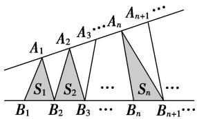

# 专题08 等差数列的判定与证明

# 【基本方法】

# 等差数列的四个判定方法

(1)定义法： $a_{n + 1} - a_n = d$ (常数） $(n\in \mathbf{N}^{*})\Leftrightarrow \{a_{n}\}$ 是等差数列.

(2)等差中项法： $2a_{n+1}=a_{n}+a_{n+2}(n\in\mathbf{N}^{*})\Leftrightarrow\{a_{n}\}$ 是等差数列.

(3)通项公式法： $a_{n}=pn+q(p,\quad q$ 为常数， $n\in N^{*})\Leftrightarrow\{a_{n}\}$ 是等差数列.

(4)前 n 项和公式法： $S_{n}=An^{2}+Bn(A,\ B$ 为常数， $n\in\mathbf{N}^{*})\Leftrightarrow\{a_{n}\}$ 是等差数列.

提醒：(1)定义法和等差中项法主要适合在解答题中使用，通项公式法和前 $n$ 项和公式法主要适合在选择题或填空题中使用.

(2)若要判定一个数列不是等差数列，则只需判定存在连续三项不成等差数列即可.

# 【基本题型】

[例 1] (1) 设 $a_{n}=(n+1)^{2}$ ， $b_{n}=n^{2}-n(n\in\mathbb{N}^{*})$ ，则下列命题中不正确的是()

A. $\{a_{n + 1} - a_n\}$ 是等差数列

B. $\{b_{n + 1} - b_n\}$ 是等差数列

C. $\{a_{n} - b_{n}\}$ 是等差数列

D. $\{a_{n} + b_{n}\}$ 是等差数列

(2)若 $\{a_{n}\}$ 是公差为1的等差数列，则 $\{a_{2n-1}+2a_{2n}\}$ 是()

A. 公差为 3 的等差数列

B. 公差为 4 的等差数列

C. 公差为 6 的等差数列

D. 公差为9的等差数列

(3)(多选)若 $\{a_{n}\}$ 是等差数列，则下列数列中仍为等差数列的是()

A. $\{|a_{n}|\}$

B. $\{a_{n+1}-a_{n}\}$

C. $\{pa_{n}+q\}(p,\ q$ 为常数)

D. $\{2a_{n}+n\}$

(4)已知数列 $\{a_{n}\}$ 的前 $n$ 项和是 $S_{n}$ ，则下列四个命题中，错误的是（）

A. 若数列 $\{a_{n}\}$ 是公差为 $d$ 的等差数列，则数列 $\left\{\frac{S_n}{n}\right\}$ 是公差为 $\frac{d}{2}$ 的等差数列

B. 若数列 $\left\{\frac{S_n}{n}\right\}$ 是公差为 $d$ 的等差数列，则数列 $\{a_n\}$ 是公差为 $2d$ 的等差数列

C. 若数列 $\{a_{n}\}$ 是等差数列，则数列的奇数项、偶数项分别构成等差数列

D. 若数列 $\{a_{n}\}$ 的奇数项、偶数项分别构成公差相等的等差数列，则 $\{a_{n}\}$ 是等差数列

(5)已知无穷数列 $\{a_{n}\}$ 的前n项和 $S_{n}=an^{2}+bn+c$ ，其中a，b，c为实数，则()

A. $\{a_{n}\}$ 可能为等差数列

B. $\{a_{n}\}$ 可能为等比数列

C. $\{a_{n}\}$ 中一定存在连续的三项构成等差数列

D. $\{a_{n}\}$ 中一定存在连续的三项构成等比数列

(6)如图，点列 $\{A_{n}\}$ ， $\{B_{n}\}$ 分别在某锐角的两边上，且 $|A_{n}A_{n + 1}| = |A_{n + 1}A_{n + 2}|$ ， $A_{n} \neq A_{n + 2}$ ， $n \in \mathbb{N}^{*}$ ， $|B_{n}B_{n + 1}| = |B_{n + 1}B_{n + 2}|$ ， $B_{n} \neq B_{n + 2}$ ， $n \in \mathbb{N}^{*}(P \neq Q$ 表示点 $P$ 与 $Q$ 不重合）。若 $d_{n} = |A_{n}B_{n}|$ ， $S_{n}$ 为 $\triangle A_{n}B_{n}B_{n + 1}$ 的面积，则（）

text_image

A₁ A₂ A₃…Aₙ Aₙ₊₁…
S₁ S₂ … Sₙ …
B₁ B₂ B₃ … Bₙ Bₙ₊₁…

A. $\{S_{n}\}$ 是等差数列

B. $\{S_n^2\}$ 是等差数列

C. $\{d_n\}$ 是等差数列

D. $\{d_n^2\}$ 是等差数列

[例 2] 已知等差数列 $\{a_{n}\}$ 的前 n 项和为 $S_{n}$ ，且 $a_{3}=7,\quad a_{5}+a_{7}=26.$

(1)求 $a_{n}$ 及 $S_{n}$ ;

(2)令 $b_{n} = \frac{S_{n}}{n} (n\in \mathbf{N}^{*})$ ，求证：数列 $\{b_n\}$ 为等差数列.

[例 3] 已知数列 $\{a_{n}\}$ 中， $a_{1}=\frac{3}{5}$ ， $a_{n}=2-\frac{1}{a_{n-1}}(n\geqslant2,\ n\in\mathbf{N}^{*})$ ，数列 $\{b_{n}\}$ 满足 $b_{n}=\frac{1}{a_{n}-1}(n\in\mathbf{N}^{*})$ .

(1)求证：数列 $\{b_n\}$ 是等差数列；

(2)求数列 $\{a_{n}\}$ 中的最大项和最小项，并说明理由.

[例 4] 在数列 $\{a_{n}\}$ 中， $a_{1}=4,\quad na_{n+1}-(n+1)a_{n}=2n^{2}+2n.$

(1)求证：数列 $\left\{\begin{aligned}&a_{n}\\ &n\end{aligned}\right\}$ 是等差数列；

(2)求数列 $\left\{\frac{1}{a_{n}}\right\}$ 的前n项和 $S_{n}$ .

[例 5] 数列 $\{a_{n}\}$ 满足 $a_{1}=1,\quad na_{n+1}=(n+1)a_{n}+n(n+1),\quad n\in\mathbf{N}^{*}.$

(1)求证：数列 $\left\{\begin{aligned}&a_{n}\\ &n\end{aligned}\right\}$ 是等差数列；

(2)设 $b_{n}=3^{n}\cdot\sqrt{a_{n}}$ ，求数列 $\{b_{n}\}$ 的前n项和 $S_{n}$ .

[例 6] 若数列 $\{a_{n}\}$ 的前 n 项和为 $S_{n}$ ，且满足 $a_{n} + 2S_{n}S_{n-1} = 0 (n \geq 2)$ ， $a_{1} = \frac{1}{2}$ .

(1)求证： $\left\{\frac{1}{S_{n}}\right\}$ 成等差数列；

(2)求数列 $\{a_{n}\}$ 的通项公式.

[例 7] 已知数列 $\{a_{n}\}$ 的前 n 项和为 $S_{n}$ ，且 $2S_{n}=3a_{n}-3^{n+1}+3(n\in\mathbf{N}^{*})$ .

(1)设 $b_{n} = \frac{a_{n}}{3^{n}}$ ，求证：数列 $\{b_n\}$ 为等差数列，并求出数列 $\{a_{n}\}$ 的通项公式；

(2)设 $c_{n}=\frac{a_{n}}{n}-\frac{a_{n}}{3^{n}}$ ， $T_{n}=c_{1}+c_{2}+c_{3}+\cdots+c_{n}$ ，求 $T_{n}$ .

[例 8] (2014·全国 I) 已知数列 $\{a_{n}\}$ 的前 n 项和为 $S_{n}$ ， $a_{1}=1$ ， $a_{n}\neq0$ ， $a_{n}a_{n+1}=\lambda S_{n}-1$ ，其中 $\lambda$ 为常数.

(1)证明： $a_{n+2}-a_{n}=\lambda;$

(2)是否存在 $\lambda$ ，使得 $\{a_{n}\}$ 为等差数列？并说明理由.

[例 9] 设数列 $\{a_{n}\}$ 的前 n 项和为 $S_{n}$ ，且满足 $a_{n}-\frac{1}{2}S_{n}-1=0(n\in\mathbf{N}^{*})$ .

(1)求数列 $\{a_{n}\}$ 的通项公式;

(2)是否存在实数 $\lambda$ ，使得数列 $\{S_n + (n + 2^n)\lambda \}$ 为等差数列？若存在，求出 $\lambda$ 的值；若不存在，请说明理由.

[例10] 若数列 $\{b_n\}$ 对于任意的 $n\in \mathbf{N}^*$ ，都有 $b_{n + 2} - b_n = d$ (常数)，则称数列 $\{b_n\}$ 是公差为 $d$ 的准等差数

列．如数列 $c_{n}$ ，若 $c_{n}=\begin{cases}4n-1, & n\text{为奇数}, \\4n+9, & n\text{为偶数},\end{cases}$ 则数列 $\{c_{n}\}$ 是公差为 8 的准等差数列．设数列 $\{a_{n}\}$ 满足 $a_{1}=a$ ，对于 $n\in N^{*}$ ，都有 $a_{n}+a_{n+1}=2n$ .

(1)求证： $\{a_{n}\}$ 是准等差数列；  
(2)求 $\{a_{n}\}$ 的通项公式及前20项和 $S_{20}$ .

# 【对点精练】

1. 已知等差数列的前三项依次为 a, 4, 3a，前 n 项和为 $S_{n}$ ，且 $S_{k}=110$ .

(1)求 a 及 k 的值;  
(2)设数列 $\{b_{n}\}$ 的通项公式 $b_{n}=\frac{S_{n}}{n}$ ，证明：数列 $\{b_{n}\}$ 是等差数列，并求其前n项和 $T_{n}$ .

2. 已知数列 $\{a_{n}\}$ 满足： $a_1 = 2$ ， $a_{n + 1} = 3a_n + 3^{n + 1} - 2^n$ ，设 $b_{n} = \frac{a_{n} - 2^{n}}{3^{n}}$

(1)求证：数列 $\{b_{n}\}$ 为等差数列；  
(2)并求 $\{a_{n}\}$ 的通项公式.

3. 已知数列 $\{a_{n}\}$ 满足 $a_1 = 1$ ，且 $na_{n+1} - (n+1)a_n = 2n^2 + 2n$ .

(1)求 $a_{2}$ ， $a_{3}$ ;

(2)证明数列 $\left\{\frac{a_n}{n}\right\}$ 是等差数列，并求 $\{a_n\}$ 的通项公式.

4. 已知数列 $\{a_{n}\}$ 满足 $a_{1}=1,\quad na_{n+1}-(n+1)a_{n}=1+2+3+\cdots+n.$

(1)求证：数列 $\left\{\begin{aligned}&a_{n}\\ &n\end{aligned}\right\}$ 是等差数列；

(2)若 $b_{n} = \frac{1}{a_{n}}$ ，求数列 $\{b_n\}$ 的前 $n$ 项和 $S_{n}$

5. 已知数列 $\{a_{n}\}$ 满足 $a_{1} = 2$ ，且 $a_{n+1} = 2a_{n} + 2^{n+1}$ ， $n \in \mathbf{N}^{*}$ .

(1)设 $b_{n}=\frac{a_{n}}{2^{n}}$ ，证明： $\{b_{n}\}$ 为等差数列，并求数列 $\{b_{n}\}$ 的通项公式；

(2)在(1)的条件下，求数列 $\{a_{n}\}$ 的前n项和 $S_{n}$ .

6. 已知数列 $\{a_{n}\}$ 的各项均为正数，其前 $n$ 项和为 $S_{n}$ ，且满足 $2S_{n} = a_{n}^{2} + n - 4 (n \in \mathbf{N}^{*})$ .

(1)求证：数列 $\{a_{n}\}$ 为等差数列；

(2)求数列 $\{a_{n}\}$ 的通项公式.

7. 已知数列 $\{a_{n}\}$ 的前 $n$ 项积为 $T_{n}$ ，且 $T_{n} = 1 - a_{n}$ .

(1)证明： $\left\{\frac{1}{T_n}\right\}$ 是等差数列；

(2)求数列 $\left\{\frac{a_{n}}{T_{n}}\right\}$ 的前n项和 $S_{n}$ .

8. 设数列 $\{a_{n}\}$ 的前 $n$ 项和为 $S_{n}$ , $4S_{n} = a_{\mathrm{n}}^{2} + 2a_{n} - 3$ , 且 $a_{1}, a_{2}, a_{3}, a_{4}, a_{5}$ 成等比数列, 当 $n \geq 5$ 时, $a_{n} > 0 (n \in \mathbb{N}^{*})$ .

(1)求证：当 $n \geq 5$ 时， $\{a_n\}$ 成等差数列；

(2)求 $\{a_{n}\}$ 的前n项和 $S_{n}$ .

9. 设等差数列 $\{a_{n}\}$ 的前 $n$ 项和为 $S_{n}$ ，且 $a_{5} + a_{13} = 34$ ， $S_{3} = 9$ .

(1)求数列 $\{a_{n}\}$ 的通项公式及前n项和公式;

(2)设数列 $\{b_n\}$ 的通项公式为 $b_{n} = \frac{a_{n}}{a_{n} + t}$ ，问：是否存在正整数 $t$ ，使得 $b_{1}, b_{2}, b_{m} (m \geq 3, m \in \mathbb{N})$ 成等差数列？若存在，求出 $t$ 和 $m$ 的值；若不存在，请说明理由。

10. 已知数列 $\{a_{n}\}$ 满足 $a_{n + 1} = \frac{1 + a_n}{3 - a_n} (n\in \mathbf{N}^*)$ ，且 $a_1 = 0$

(1)求 $a_2, a_3$ ;

(2)是否存在一个实数 $\lambda$ ，使得数列 $\left\{\frac{1}{a_n - \lambda}\right\}$ 为等差数列，请说明理由.

