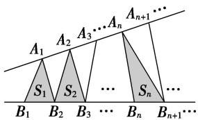

# 专题08 等差数列的判定与证明

# 【基本方法】

# 等差数列的四个判定方法

(1)定义法： $a_{n + 1} - a_n = d$ (常数） $(n\in \mathbf{N}^{*})\Leftrightarrow \{a_{n}\}$ 是等差数列.

(2)等差中项法： $2a_{n+1}=a_{n}+a_{n+2}(n\in\mathbf{N}^{*})\Leftrightarrow\{a_{n}\}$ 是等差数列.

(3)通项公式法： $a_{n}=pn+q(p,\quad q$ 为常数， $n\in N^{*})\Leftrightarrow\{a_{n}\}$ 是等差数列.

(4)前 n 项和公式法： $S_{n}=An^{2}+Bn(A,\ B$ 为常数， $n\in\mathbf{N}^{*})\Leftrightarrow\{a_{n}\}$ 是等差数列.

提醒：(1)定义法和等差中项法主要适合在解答题中使用，通项公式法和前 $n$ 项和公式法主要适合在选择题或填空题中使用.

(2)若要判定一个数列不是等差数列，则只需判定存在连续三项不成等差数列即可.

# 【基本题型】

[例 1] (1) 设 $a_{n}=(n+1)^{2}$ ， $b_{n}=n^{2}-n(n\in\mathbb{N}^{*})$ ，则下列命题中不正确的是()

A. $\{a_{n + 1} - a_n\}$ 是等差数列

B. $\{b_{n + 1} - b_n\}$ 是等差数列

C. $\{a_{n} - b_{n}\}$ 是等差数列

D. $\{a_{n} + b_{n}\}$ 是等差数列

答案 D 解析 对于 A，因为 $a_{n}=(n+1)^{2}$ ，所以 $a_{n+1}-a_{n}=(n+2)^{2}-(n+1)^{2}=2n+3$ ，设 $c_{n}=2n+3$ ，所以 $c_{n+1}-c_{n}=2$ 。所以 $\{a_{n+1}-a_{n}\}$ 是等差数列，故 A 正确；对于 B，因为 $b_{n}=n^{2}-n(n\in\mathbb{N}^{*})$ ，所以 $b_{n+1}-b_{n}=2n$ ，设 $c_{n}=2n$ ，所以 $c_{n+1}-c_{n}=2$ ，所以 $\{b_{n+1}-b_{n}\}$ 是等差数列，故 B 正确；对于 C，因为 $a_{n}=(n+1)^{2}$ ， $b_{n}=n^{2}-n(n\in\mathbb{N}^{*})$ ，所以 $a_{n}-b_{n}=(n+1)^{2}-(n^{2}-n)=3n+1$ ，设 $c_{n}=3n+1$ ，所以 $c_{n+1}-c_{n}=3$ ，所以 $\{a_{n}-b_{n}\}$ 是等差数列，故 C 正确；对于 D， $a_{n}+b_{n}=2n^{2}+n+1$ ，设 $c_{n}=a_{n}+b_{n}$ ， $c_{n+1}-c_{n}$ 不是常数，故 D 错误。

(2)若 $\{a_{n}\}$ 是公差为1的等差数列，则 $\{a_{2n-1}+2a_{2n}\}$ 是()

A. 公差为 3 的等差数列

B. 公差为 4 的等差数列

C. 公差为 6 的等差数列

D. 公差为9的等差数列

答案 C 解析 令 $b_{n}=a_{2n-1}+2a_{2n}$ ，则 $b_{n+1}=a_{2n+1}+2a_{2n+2}$ ，故 $b_{n+1}-b_{n}=a_{2n+1}+2a_{2n+2}-(a_{2n-1}+2a_{2n})=(a_{2n+1}-a_{2n-1})+2(a_{2n+2}-a_{2n})=2d+4d=6d=6\times1=6$ 。即 $\{a_{2n-1}+2a_{2n}\}$ 是公差为 6 的等差数列。

(3)(多选)若 $\{a_{n}\}$ 是等差数列，则下列数列中仍为等差数列的是()

A. $\{|a_{n}|\}$

B. $\{a_{n + 1} - a_n\}$

C. $\{pa_{n}+q\}(p,\ q$ 为常数)

D. $\{2a_{n} + n\}$

答案 BCD 解析 数列-1, 1, 3 是等差数列，取绝对值后：1, 1, 3 不是等差数列，A 不成立．若 $\{a_{n}\}$ 是等差数列，利用等差数列的定义知， $\{a_{n+1}-a_{n}\}$ 为常数列，故是等差数列，B 成立．若 $\{a_{n}\}$ 的公差为 $d$ ，则 $(pa_{n+1}+q)-(pa_{n}+q)=p(a_{n+1}-a_{n})=pd$ 为常数，故 $\{pa_{n}+q\}$ 是等差数列，C 成立． $(2a_{n+1}+n+1)-(2a_{n}+n)=2(a_{n+1}-a_{n})+1=2d+1$ 为常数，故 $\{2a_{n}+n\}$ 是等差数列，D 成立．

(4)已知数列 $\{a_{n}\}$ 的前n项和是 $S_{n}$ ，则下列四个命题中，错误的是()

A. 若数列 $\{a_{n}\}$ 是公差为 $d$ 的等差数列，则数列 $\left\{\frac{S_n}{n}\right\}$ 是公差为 $\frac{d}{2}$ 的等差数列

B. 若数列 $\left\{\frac{S_n}{n}\right\}$ 是公差为 $d$ 的等差数列，则数列 $\{a_n\}$ 是公差为 $2d$ 的等差数列

C. 若数列 $\{a_{n}\}$ 是等差数列, 则数列的奇数项、偶数项分别构成等差数列   
D. 若数列 $\{a_{n}\}$ 的奇数项、偶数项分别构成公差相等的等差数列，则 $\{a_{n}\}$ 是等差数列

答案 D 解析 A 项，若等差数列 $\{a_{n}\}$ 的首项为 $a_{1}$ ，公差为 d，前 n 项的和为 $S_{n}$ ，则数列 $\left\{\begin{aligned}&S_{n}\\ &n\end{aligned}\right\}$ 为等差数列，且通项为 $\frac{S_{n}}{n}=a_{1}+(n-1)\frac{d}{2}$ ，即数列 $\left\{\begin{aligned}&S_{n}\\ &n\end{aligned}\right\}$ 是公差为 $\frac{d}{2}$ 的等差数列，故说法正确；B 项，由题意得 $\frac{S_{n}}{n}=a_{1}+(n-1)d$ ，所以 $S_{n}=na_{1}+n(n-1)d$ ，则 $a_{n}=S_{n}-S_{n-1}=a_{1}+2(n-1)d$ ，即数列 $\{a_{n}\}$ 是公差为 2d 的等差数列，故说法正确；C 项，若等差数列 $\{a_{n}\}$ 的公差为 d，则数列的奇数项、偶数项都是公差为 2d 的等差数列，故说法正确；D 项，若数列 $\{a_{n}\}$ 的奇数项、偶数项分别构成公差相等的等差数列，则 $\{a_{n}\}$ 不一定是等差数列，例如： $\{1,4,3,6,5,8,7\}$ ，说法错误．故选 D.

(5)已知无穷数列 $\{a_{n}\}$ 的前n项和 $S_{n}=an^{2}+bn+c$ ，其中a，b，c为实数，则()

A. $\{a_{n}\}$ 可能为等差数列

B. $\{a_{n}\}$ 可能为等比数列

C. $\{a_{n}\}$ 中一定存在连续的三项构成等差数列

D. $\{a_{n}\}$ 中一定存在连续的三项构成等比数列

答案 ABC 解析 解法一：因为 $S_{n}=an^{2}+bn+c$ ，所以 $S_{n-1}=a(n-1)^{2}+b(n-1)+c(n\geq2)$ ，所以 $a_{n}=S_{n}-S_{n-1}=2na-a+b(n\geq2)$ ，若数列 $\{a_{n}\}$ 为等差数列，则 $a_{1}=a+b+c=a+b$ ，c=0，验证知，当 c=0 时， $\{a_{n}\}$ 为等差数列，所以 A 正确；在 $a_{n}=2na-a+b(n\geq2)$ 中，当 a=0， $b\neq0$ 时， $a_{n}=b(n\geq2)$ ，若数列 $\{a_{n}\}$ 为等比数列，则 $a_{1}=b+c=b$ ，c=0，验证知，当 a=c=0， $b\neq0$ 时， $\{a_{n}\}$ 为等比数列，所以 B 正确；由 $a_{n}=2na-a+b(n\geq2)$ 可知， $\{a_{n}\}$ 中一定存在连续的三项构成等差数列，所以 C 正确；假设 $a_{k}, a_{k+1}, a_{k+2}(k\geq2, \text{且 } k \in \mathbf{N}^{*})$ 成等比数列，则 $[2(k+1)a-a+b]^{2}=(2ka-a+b)\cdot[2(k+2)a-a+b]$ ，整理得 $(k+1)^{2}=k(k+2)$ ，即 1=0（不成立），所以 $\{a_{n}\}$ 中不存在连续的三项构成等比数列，所以 D 错误．故选 ABC.

解法二：当 $c = 0$ ， $a\neq 0$ 时，数列 $\{a_{n}\}$ 为等差数列，所以A正确；当 $a = c = 0$ ， $b\neq 0$ 时，数列 $\{a_{n}\}$ 为常数列，也是等比数列，所以B正确；当 $n\geq 2$ 时， $a_{n} = S_{n} - S_{n - 1} = 2na - a + b$ ，则 $\{a_{n}\}$ 中一定存在连续的三项构成等差数列，所以C正确；假设 $a_{k}$ ， $a_{k + 1}$ ， $a_{k + 2}(k\geq 2$ ，且 $k\in \mathbf{N}^*)$ 成等比数列，则 $[2(k + 1)a - a + b]^{2} = (2ka - a + b)\cdot [2(k + 2)a - a + b]$ ，整理得 $(k + 1)^{2} = k(k + 2)$ ，即 $1 = 0$ （不成立），所以 $\{a_{n}\}$ 中不存在连续的三项构成等比数列，所以D错误．故选ABC.

(6)如图，点列 $\{A_{n}\}$ ， $\{B_{n}\}$ 分别在某锐角的两边上，且 $|A_{n}A_{n + 1}| = |A_{n + 1}A_{n + 2}|$ ， $A_{n} \neq A_{n + 2}$ ， $n \in \mathbb{N}^{*}$ ， $|B_{n}B_{n + 1}| = |B_{n + 1}B_{n + 2}|$ ， $B_{n} \neq B_{n + 2}$ ， $n \in \mathbb{N}^{*}(P \neq Q$ 表示点 $P$ 与 $Q$ 不重合）。若 $d_{n} = |A_{n}B_{n}|$ ， $S_{n}$ 为 $\triangle A_{n}B_{n}B_{n + 1}$ 的面积，则（）

text_image

A₁ A₂ ... Aₙ ... Aₙ₊₁ ...
S₁ S₂ ... Sₙ ...
B₁ B₂ B₃ ... Bₙ Bₙ₊₁ ...

A. $\{S_{n}\}$ 是等差数列

B. $\{S_n^2\}$ 是等差数列

C. $\{d_n\}$ 是等差数列

D. $\{d_n^2\}$ 是等差数列

答案 A 解析 作 $A_{1}C_{1}$ ， $A_{2}C_{2}$ ， $A_{3}C_{3}$ ，…， $A_{n}C_{n}$ 垂直于直线 $B_{1}B_{n}$ ，垂足分别为 $C_{1}$ ， $C_{2}$ ， $C_{3}$ ，…， $C_{n}$ ，则 $A_{1}C_{1} // A_{2}C_{2} // \ldots // A_{n}C_{n}$ . $\because |A_{n}A_{n+1}| = |A_{n+1}A_{n+2}|$ , $\therefore |C_nC_{n+1}| = |C_{n+1}C_{n+2}|$ . 设 $|A_{1}C_{1}| = a$ , $|A_{2}C_{2}| = b$ , $|B_{1}B_{2}| = c$ , 则 $|A_{3}C_{3}| = 2b - a$ , $\ldots$ , $|A_{n}C_{n}| = (n-1)b - (n-2)a(n \geq 3)$ , $\therefore S_n = \frac{1}{2}c[(n-1)b - (n-2)a] = \frac{1}{2}c[(b-a)n + (2a - b)]$ , $\therefore S_{n+1} - S_n = \frac{1}{2}c[(b-a)(n+1) + (2a-b) - (b-a)n - (2a-b)] = \frac{1}{2}c(b-a)$ , $\therefore$ 数列 $\{S_n\}$ 是等差数列.

[例 2] 已知等差数列 $\{a_{n}\}$ 的前 n 项和为 $S_{n}$ ，且 $a_{3}=7,\quad a_{5}+a_{7}=26$ .

(1)求 $a_{n}$ 及 $S_{n}$ ;   
(2)令 $b_{n} = \frac{S_{n}}{n} (n\in \mathbf{N}^{*})$ ，求证：数列 $\{b_n\}$ 为等差数列.

解析 (1)设等差数列 $\{a_{n}\}$ 的首项为 $a_1$ ，公差为 $d$ ，由题意有 $\left\{\begin{aligned} & a_{1} + 2d = 7, \\ & 2a_{1} + 10d = 26, \end{aligned}\right.$ 解得 $a_1 = 3, d = 2,$

则 $a_{n} = a_{1} + (n - 1)d = 3 + 2(n - 1) = 2n + 1$ ， $S_{n} = \frac{n(a_{1} + a_{n})}{2} = \frac{n[3 + (2n + 1)]}{2} = n(n + 2).$

(2)因为 $b_{n}=\frac{S_{n}}{n}=\frac{n(n+2)}{n}=n+2$ ，又 $b_{n+1}-b_{n}=n+3-(n+2)=1$ ，

所以数列 $\{b_{n}\}$ 是首项为3，公差为1的等差数列.

[例3] 已知数列 $\{a_{n}\}$ 中， $a_{1} = \frac{3}{5}$ ， $a_{n} = 2 - \frac{1}{a_{n-1}} (n \geqslant 2, n \in \mathbb{N}^{*})$ ，数列 $\{b_{n}\}$ 满足 $b_{n} = \frac{1}{a_{n}-1} (n \in \mathbb{N}^{*})$ .

(1)求证：数列 $\{b_{n}\}$ 是等差数列；  
(2)求数列 $\{a_{n}\}$ 中的最大项和最小项，并说明理由.

解析 (1) 因为 $a_{n} = 2 - \frac{1}{a_{n-1}} (n \geqslant 2, n \in \mathbf{N}^{*})$ , $b_{n} = \frac{1}{a_{n}-1} (n \in \mathbf{N}^{*})$ ,

所以 $b_{n+1}-b_{n}=\frac{1}{a_{n+1}-1}-\frac{1}{a_{n}-1}=\frac{1}{(2-\frac{1}{a_{n}})-1}-\frac{1}{a_{n}-1}=\frac{a_{n}}{a_{n}-1}-\frac{1}{a_{n}-1}=1$ 。又 $b_{1}=\frac{1}{a_{1}-1}=-\frac{5}{2}$

所以数列 $\{b_{n}\}$ 是以 $-\frac{5}{2}$ 为首项，1为公差的等差数列.

(2)由(1)知 $b_{n}=n-\frac{7}{2}$ ，则 $a_{n}=1+\frac{1}{b_{n}}=1+\frac{2}{2n-7}$ .

设 $f(x)=1+\frac{2}{2x-7}$ ，则 $f(x)$ 在区间 $(-∞, \frac{7}{2})$ 和 $(\frac{7}{2}, +∞)$ 上为减函数.

所以当 n=3 时， $a_{n}$ 取得最小值 -1，当 n=4 时， $a_{n}$ 取得最大值 3.

[例 4] 在数列 $\{a_{n}\}$ 中， $a_{1}=4,\quad na_{n+1}-(n+1)a_{n}=2n^{2}+2n.$

(1)求证：数列 $\left\{\begin{aligned}&a_{n}\\ &n\end{aligned}\right\}$ 是等差数列；  
(2)求数列 $\left\{\frac{1}{a_{n}}\right\}$ 的前n项和 $S_{n}$ .

解析 (1)证法一： $na_{n+1}-(n+1)a_n=2n^2+2n$ 的两边同时除以 $n(n+1)$ ，得 $\frac{a_{n+1}}{n+1}-\frac{a_n}{n}=2$ ，又 $\frac{a_1}{1}=4$ ，

所以数列 $\left\{\frac{a_{n}}{n}\right\}$ 是首项为4，公差为2的等差数列.

证法二：因为 $\frac{a_{n+1}}{n+1}-\frac{a_{n}}{n}=\frac{na_{n+1}-(n+1)a_{n}}{n(n+1)}=\frac{2n^{2}+2n}{n^{2}+n}=2,\quad\frac{a_{1}}{1}=4,$

所以数列 $\left\{ \begin{array}{l}a_{n}\\ n \end{array} \right.$ 是首项为4，公差为2的等差数列.

(2)由(1)，得 $\frac{a_n}{n} = a_1 + 2(n - 1)$ ，即 $\frac{a_n}{n} = 2n + 2$ ，即 $a_{n} = 2n^{2} + 2n$

故 $\frac{1}{a_{n}}=\frac{1}{2n^{2}+2n}=\frac{1}{2}\cdot\frac{1}{n(n+1)}=\frac{1}{2}\left(\frac{1}{n}-\frac{1}{n+1}\right)$ ,

所以 $S_{n}=\frac{1}{2}\left[\left(1-\frac{1}{2}\right)+\left(\frac{1}{2}-\frac{1}{3}\right)+\cdots+\left(\frac{1}{n}-\frac{1}{n+1}\right)\right]=\frac{1}{2}\left(1-\frac{1}{n+1}\right)=\frac{n}{2(n+1)}$ .

[例 5] 数列 $\{a_{n}\}$ 满足 $a_{1}=1,\quad na_{n+1}=(n+1)a_{n}+n(n+1),\quad n\in\mathbf{N}^{*}.$

(1)求证：数列 $\left\{\frac{a_n}{n}\right\}$ 是等差数列；

(2)设 $b_{n}=3^{n}\cdot\sqrt{a_{n}}$ ，求数列 $\{b_{n}\}$ 的前n项和 $S_{n}$ .

解析 (1)由已知可得 $\frac{a_{n+1}}{n+1} = \frac{a_n}{n} + 1$ ，即 $\frac{a_{n+1}}{n+1} - \frac{a_n}{n} = 1$ ，所以 $\left\{\frac{a_n}{n}\right\}$ 是以 $\frac{a_1}{1} = 1$ 为首项，1为公差的等差数列.

(2)由(1)得， $\frac{a_{n}}{n}=1+(n-1)\cdot1=n$ ，所以 $a_{n}=n^{2}$ ，从而可得 $b_{n}=n\cdot3^{n}$ .

$$
S _ {n} = 1 \times 3 ^ {1} + 2 \times 3 ^ {2} + \dots + (n - 1) \times 3 ^ {n - 1} + n \times 3 ^ {n} \quad ①,
$$

$$
3 S _ {n} = 1 \times 3 ^ {2} + 2 \times 3 ^ {3} + \dots + (n - 1) \times 3 ^ {n} + n \times 3 ^ {n + 1} \quad ②.
$$

①-②，得 $-2S_{n}=3^{1}+3^{2}+\ldots+3^{n}-n\cdot3^{n+1}=\frac{3\cdot(1-3^{n})}{1-3}-n\cdot3^{n+1}=\frac{(1-2n)\cdot3^{n+1}-3}{2}$

所以 $S_{n}=\frac{(2n-1)\cdot3^{n+1}+3}{4}$ .

[例 6] 若数列 $\{a_{n}\}$ 的前 n 项和为 $S_{n}$ ，且满足 $a_{n}+2S_{n}S_{n-1}=0(n\geq2)$ ， $a_{1}=\frac{1}{2}$ .

(1)求证： $\left\{\frac{1}{S_{n}}\right\}$ 成等差数列；

(2)求数列 $\{a_{n}\}$ 的通项公式.

解析 (1) 当 $n \geq 2$ 时，由 $a_{n} + 2S_{n}S_{n-1} = 0$ ，得 $S_{n} - S_{n-1} = -2S_{n}S_{n-1}$ ，

因为 $S_{n} \neq 0$ ，所以 $\frac{1}{S_{n}} - \frac{1}{S_{n-1}} = 2$ ，又 $\frac{1}{S_{1}} = \frac{1}{a_{1}} = 2$ ，

故 $\left\{\frac{1}{S_n}\right\}$ 是首项为2，公差为2的等差数列.

(2)由(1)可得 $\frac{1}{S_{n}}=2n$ ，所以 $S_{n}=\frac{1}{2n}$ .

当 $n \geq 2$ 时， $a_n = S_n - S_{n-1} = \frac{1}{2n} - \frac{1}{2(n-1)} = \frac{n-1-n}{2n(n-1)} = -\frac{1}{2n(n-1)}$ .

当 n=1 时， $a_{1}=\frac{1}{2}$ 不适合上式．故 $a_{n}=\left\{\begin{aligned}\frac{1}{2},&n=1,\\ -\frac{1}{2n(n-1)},&n\geq2.\end{aligned}\right.$

[例 7] 已知数列 $\{a_{n}\}$ 的前 n 项和为 $S_{n}$ ，且 $2S_{n}=3a_{n}-3^{n+1}+3(n\in\mathbf{N}^{*})$ .

(1)设 $b_{n} = \frac{a_{n}}{3^{n}}$ ，求证：数列 $\{b_n\}$ 为等差数列，并求出数列 $\{a_{n}\}$ 的通项公式；

(2)设 $c_{n}=\frac{a_{n}}{n}-\frac{a_{n}}{3^{n}}$ ， $T_{n}=c_{1}+c_{2}+c_{3}+\cdots+c_{n}$ ，求 $T_{n}$ .

解析 (1)由已知 $2S_{n} = 3a_{n} - 3^{n + 1} + 3(n\in \mathbf{N}^{*})$ ，①

$$
n \geqslant 2 \text {   时,   } 2 S _ {n - 1} = 3 a _ {n - 1} - 3 ^ {n} + 3, \tag {②}
$$

①-②得： $2a_{n}=3a_{n}-3a_{n-1}-2\cdot3^{n}\Rightarrow a_{n}=3a_{n-1}+2\cdot3^{n}$

故 $\frac{a_{n}}{3^{n}}=\frac{a_{n-1}}{3^{n-1}}+2$ ，则 $b_{n}-b_{n-1}=2(n\geqslant2)$ .

又 n=1 时， $2a_{1}=3a_{1}-9+3$ ，解得 $a_{1}=6$ ，则 $b_{1}=\frac{a_{1}}{3}=2$ .

故数列 $\{b_{n}\}$ 是以2为首项，2为公差的等差数列， $\therefore b_{n}=2+2(n-1)=2n\Rightarrow a_{n}=2n\cdot3^{n}$ .

(2)由(1)，得 $c_{n}=2\cdot3^{n}-2n$

$$
T _ {n} = 2 \left(3 + 3 ^ {2} + 3 ^ {3} + \dots + 3 ^ {n}\right) - 2 (1 + 2 + \dots + n) = 2 \cdot \frac {3 \left(1 - 3 ^ {n}\right)}{1 - 3} - 2 \cdot \frac {(1 + n) n}{2} = 3 ^ {n + 1} - n ^ {2} - n - 3.
$$

[例8] (2014·全国I)已知数列 $\{a_{n}\}$ 的前 $n$ 项和为 $S_{n}$ ， $a_{1} = 1$ ， $a_{n} \neq 0$ ， $a_{n} a_{n+1} = \lambda S_{n} - 1$ ，其中 $\lambda$ 为常数.

(1)证明： $a_{n+2}-a_{n}=\lambda;$

(2)是否存在 $\lambda$ ，使得 $\{a_{n}\}$ 为等差数列？并说明理由.

解析 (1)由题设知， $a_{n}a_{n+1}=\lambda S_{n}-1,\quad a_{n+1}a_{n+2}=\lambda S_{n+1}-1$ ，两式相减得 $a_{n+1}(a_{n+2}-a_{n})=\lambda a_{n+1}$ ，由于 $a_{n+1}\neq0$ ，所以 $a_{n+2}-a_{n}=\lambda$ .

(2)由题设知， $a_{1}=1$ ， $a_{1}a_{2}=\lambda S_{1}-1$ ，可得 $a_{2}=\lambda-1$ ．由(1)知， $a_{3}=\lambda+1$

令 $2a_{2}=a_{1}+a_{3}$ ，解得 $\lambda=4$ .

故 $a_{n + 2} - a_n = 4$ ，由此可得数列 $\{a_{2n - 1}\}$ 是首项为1，公差为4的等差数列， $a_{2n - 1} = 4n - 3$

数列 $\{a_{2n}\}$ 是首项为3，公差为4的等差数列， $a_{2n} = 4n - 1$ ，所以 $a_{n} = 2n - 1$ ， $a_{n + 1} - a_n = 2$ 因此存在 $\lambda = 4$ ，使得数列 $\{a_n\}$ 为等差数列.

[例 9] 设数列 $\{a_{n}\}$ 的前 n 项和为 $S_{n}$ ，且满足 $a_{n}-\frac{1}{2}S_{n}-1=0(n\in\mathbf{N}^{*})$ .

(1)求数列 $\{a_{n}\}$ 的通项公式;

(2)是否存在实数 $\lambda$ ，使得数列 $\{S_n + (n + 2^n)\lambda \}$ 为等差数列？若存在，求出 $\lambda$ 的值；若不存在，请说明理由.

解析 (1)由 $a_{n} - \frac{1}{2} S_{n} - 1 = 0(n\in \mathbf{N}^{*})$ ，可知当 $n = 1$ 时， $a_1 - \frac{1}{2} a_1 - 1 = 0$ ，即 $a_1 = 2$

又由 $a_{n} - \frac{1}{2} S_{n} - 1 = 0 (n \in \mathbf{N}^{*})$ ，可得 $a_{n+1} - \frac{1}{2} S_{n+1} - 1 = 0$

两式相减，得 $\left(a_{n+1}-\frac{1}{2}S_{n+1}-1\right)-\left(a_{n}-\frac{1}{2}S_{n}-1\right)=0$ ，即 $\frac{1}{2}a_{n+1}-a_{n}=0$ ，即 $a_{n+1}=2a_{n}$ .

所以数列 $\{a_{n}\}$ 是以2为首项，2为公比的等比数列，故 $a_{n}=2^{n}(n\in\mathbf{N}^{*})$ .

(2)由(1)知， $S_{n}=\frac{a_{1}(1-q^{n})}{1-q}=2(2^{n}-1)$ ，所以 $S_{n}+(n+2^{n})\lambda=2(2^{n}-1)+(n+2^{n})\lambda.$

若数列 $\{S_n + (n + 2^n)\lambda\}$ 为等差数列，则 $S_{1} + (1 + 2)\lambda$ ， $S_{2} + (2 + 2^{2})\lambda$ ， $S_{3} + (3 + 2^{3})\lambda$ 成等差数列，

即有 $2[S_{2} + (2 + 2^{2})\lambda ] = [S_{1} + (1 + 2)\lambda ] + [S_{3} + (3 + 2^{3})\lambda ]$ ，即 $2(6 + 6\lambda) = (2 + 3\lambda) + (14 + 11\lambda)$ ，解得 $\lambda = -2$

经检验 $\lambda=-2$ 时， $\{S_{n}+(n+2^{n})\lambda\}$ 成等差数列，故 $\lambda$ 的值为-2.

[例10] 若数列 $\{b_n\}$ 对于任意的 $n \in \mathbf{N}^*$ ，都有 $b_{n+2} - b_n = d$ (常数)，则称数列 $\{b_n\}$ 是公差为 $d$ 的准等差数列。如数列 $c_n$ ，若 $c_n = \begin{cases} 4n-1, & n \text{为奇数,}\\ 4n+9, & n \text{为偶数,} \end{cases}$ 则数列 $\{c_n\}$ 是公差为8的准等差数列。设数列 $\{a_n\}$ 满足 $a_1 = a$ ，对于 $n \in \mathbf{N}^*$ ，都有 $a_n + a_{n+1} = 2n$ 。

(1)求证： $\{a_{n}\}$ 是准等差数列；  
(2)求 $\{a_{n}\}$ 的通项公式及前20项和 $S_{20}$ .

解析 (1)证明： $\because a_{n}+a_{n+1}=2n(n\in\mathbf{N}^{*})$ ，①， $\therefore a_{n+1}+a_{n+2}=2(n+1)(n\in\mathbf{N}^{*})$ ，②

②-①，得 $a_{n+2}-a_{n}=2(n\in\mathbf{N}^{*})$ . $\therefore\{a_{n}\}$ 是公差为 2 的准等差数列.

(2) $\because a_{1}=a,\quad a_{n}+a_{n+1}=2n(n\in\mathbf{N}^{*}),\quad\therefore a_{1}+a_{2}=2\times1,$ 即 $a_{2}=2-a.$

∴由(1)得 $a_{1}$ ， $a_{3}$ ， $a_{5}$ ，…是以 a 为首项，2 为公差的等差数列；

$a_{2}$ ， $a_{4}$ ， $a_{6}$ …是以2-a为首项，2为公差的等差数列.

当 n 为偶数时， $a_{n}=2-a+\left(\frac{n}{2}-1\right)\times2=n-a;$

当 n 为奇数时， $a_{n}=a+\left(\frac{n+1}{2}-1\right)\times2=n+a-1$ .

$$
\therefore a _ {n} = \left\{ \begin{array}{l l} n + a - 1, & n \text {为奇数，} \\ n - a, & n \text {为偶数．} \end{array} \right.
$$

$$
\begin{array}{l} S _ {2 0} = a _ {1} + a _ {2} + a _ {3} + a _ {4} + \dots + a _ {1 9} + a _ {2 0} = (a _ {1} + a _ {2}) + (a _ {3} + a _ {4}) + \dots + (a _ {1 9} + a _ {2 0}) \\ = 2 \times 1 + 2 \times 3 + \dots + 2 \times 1 9 = 2 \times \frac {(1 + 1 9) \times 1 0}{2} = 2 0 0. \\ \end{array}
$$

# 【对点精练】

1. 已知等差数列的前三项依次为 $a, 4, 3a$ ，前 $n$ 项和为 $S_{n}$ ，且 $S_{k} = 110$ .

(1)求 a 及 k 的值;  
(2)设数列 $\{b_n\}$ 的通项公式 $b_{n} = \frac{S_{n}}{n}$ ，证明：数列 $\{b_{n}\}$ 是等差数列，并求其前 $n$ 项和 $T_{n}$ .

1. 解析 (1)设该等差数列为 $\{a_{n}\}$ ，则 $a_{1}=a,\quad a_{2}=4,\quad a_{3}=3a,$

由已知有 $a+3a=8$ ，得 $a_{1}=a=2$ ，公差 d=4-2=2，

所以 $S_{k}=ka_{1}+\frac{k(k-1)}{2}\cdot d=2k+\frac{k(k-1)}{2}\times2=k^{2}+k,$

由 $S_{k}=110$ ，得 $k^{2}+k-110=0$ ，解得 k=10 或 k=-11（舍去），故 a=2，k=10。

(2)由(1)得 $S_{n}=\frac{n(2+2n)}{2}=n(n+1)$ ，则 $b_{n}=\frac{S_{n}}{n}=n+1$ ，

故 $b_{n+1}-b_n=(n+2)-(n+1)=1$ ，即数列 $\{b_n\}$ 是首项为2，公差为1的等差数列，

所以 $T_{n}=\frac{n(2+n+1)}{2}=\frac{n(n+3)}{2}$ .

2. 已知数列 $\{a_{n}\}$ 满足： $a_{1} = 2$ ， $a_{n+1} = 3a_{n} + 3^{n+1} - 2^{n}$ ，设 $b_{n} = \frac{a_{n} - 2^{n}}{3^{n}}$

(1)求证：数列 $\{b_{n}\}$ 为等差数列；  
(2)并求 $\{a_{n}\}$ 的通项公式.

2. 解析 (1) 因为 $b_{n+1} - b_n = \frac{a_{n+1} - 2^{n+1}}{3^{n+1}} - \frac{a_n - 2^n}{3^n} = \frac{3a_n + 3^{n+1} - 2^n - 2^{n+1}}{3^{n+1}} - \frac{3a_n - 3 \cdot 2^n}{3^{n+1}} = 1$ ,

所以数列 $\{b_{n}\}$ 是以0为首项，1为公差的等差数列.

(2)由(1) $b_{n}=n-1$ ，所以 $a_{n}=(n-1)\cdot3^{n}+2^{n}$ .

3. 已知数列 $\{a_{n}\}$ 满足 $a_1 = 1$ ，且 $na_{n+1} - (n+1)a_n = 2n^2 + 2n$ .

(1)求 $a_2, a_3$ ;

(2)证明数列 $\left\{\frac{a_{n}}{n}\right\}$ 是等差数列，并求 $\{a_{n}\}$ 的通项公式.

3. 解析 (1)由已知得 $a_{2}-2a_{1}=4$ ，则 $a_{2}=2a_{1}+4$ ，又 $a_{1}=1$ ，所以 $a_{2}=6$ .

由 $2a_{3}-3a_{2}=12$ 得 $2a_{3}=12+3a_{2}$ ，所以 $a_{3}=15$ .

(2)由已知 $na_{n+1}-(n+1)a_{n}=2n(n+1)$ ，得 $\frac{na_{n+1}-(n+1)a_{n}}{n(n+1)}=2$ ，即 $\frac{a_{n+1}}{n+1}-\frac{a_{n}}{n}=2$ ，

所以数列 $\left\{ \begin{array}{l} a_n \\ n \end{array} \right.$ 是首项为 1，公差为 2 的等差数列.

则 $\frac{a_{n}}{n}=1+2(n-1)=2n-1$ ，所以 $a_{n}=2n^{2}-n$ .

4. 已知数列 $\{a_{n}\}$ 满足 $a_{1}=1,\quad na_{n+1}-(n+1)a_{n}=1+2+3+\cdots+n.$

(1)求证：数列 $\left\{\begin{aligned}&a_{n}\\ &n\end{aligned}\right\}$ 是等差数列；

(2)若 $b_{n}=\frac{1}{a_{n}}$ ，求数列 $\{b_{n}\}$ 的前 n 项和 $S_{n}$ .

4. 解析 (1) $\because na_{n+1}-(n+1)a_{n}=1+2+3+\cdots+n=\frac{n(n+1)}{2},$

$$
\therefore \frac {n a _ {n + 1}}{n (n + 1)} - \frac {(n + 1) a _ {n}}{n (n + 1)} = \frac {a _ {n + 1}}{n + 1} - \frac {a _ {n}}{n} = \frac {1}{2},
$$

∴数列 $\left\{\begin{aligned}a_{n}\\ n\end{aligned}\right\}$ 是首项为1，公差为 $\frac{1}{2}$ 的等差数列.

(2)由(1)知， $\frac{a_{n}}{n}=1+\frac{1}{2}(n-1)=\frac{n+1}{2},\quad\therefore a_{n}=\frac{n(n+1)}{2}.$

$$
\therefore b _ {n} = \frac {1}{a _ {n}} = \frac {2}{n (n + 1)} = 2 \left(\frac {1}{n} - \frac {1}{n + 1}\right).
$$

$$
\therefore S _ {n} = b _ {1} + b _ {2} + \dots + b _ {n} = 2 \left(1 - \frac {1}{2} + \frac {1}{2} - \frac {1}{3} + \dots + \frac {1}{n} - \frac {1}{n + 1}\right) = \frac {2 n}{n + 1}.
$$

5. 已知数列 $\{a_{n}\}$ 满足 $a_1 = 2$ ，且 $a_{n+1} = 2a_n + 2^{n+1}$ ， $n \in \mathbf{N}^*$ .

(1)设 $b_{n} = \frac{a_{n}}{2^{n}}$ ，证明： $\{b_{n}\}$ 为等差数列，并求数列 $\{b_{n}\}$ 的通项公式；

(2)在(1)的条件下，求数列 $\{a_{n}\}$ 的前n项和 $S_{n}$ .

5. 解析 (1) 把 $a_{n} = 2^{n}b_{n}$ 代入到 $a_{n+1} = 2a_{n} + 2^{n+1}$ , 得 $2^{n+1}b_{n+1} = 2^{n+1}b_{n} + 2^{n+1}$ , 两边同除以 $2^{n+1}$ ,

得 $b_{n+1}=b_{n}+1$ ，即 $b_{n+1}-b_{n}=1$ ，∴ $\{b_{n}\}$ 为等差数列，首项 $b_{1}=\frac{a_{1}}{2}=1$ ，公差为 1，∴ $b_{n}=n(n\in\mathbf{N}^{*})$ .

(2)由 $b_{n} = n = \frac{a_{n}}{2^{n}}$ ，得 $a_{n} = n\times 2^{n}$

$$
\therefore S _ {n} = 1 \times 2 ^ {1} + 2 \times 2 ^ {2} + 3 \times 2 ^ {3} + \dots + n \times 2 ^ {n},
$$

$$
\therefore 2 S _ {n} = 1 \times 2 ^ {2} + 2 \times 2 ^ {3} + 3 \times 2 ^ {4} + \dots + (n - 1) \times 2 ^ {n} + n \times 2 ^ {n + 1},
$$

两式相减，得 $-S_{n}=2^{1}+2^{2}+2^{3}+\cdots+2^{n}-n\times2^{n+1}=(1-n)\times2^{n+1}-2$

$$
\therefore S _ {n} = (n - 1) \times 2 ^ {n + 1} + 2 (n \in \mathbf {N} ^ {*}).
$$

6. 已知数列 $\{a_{n}\}$ 的各项均为正数，其前 $n$ 项和为 $S_{n}$ ，且满足 $2S_{n} = a_{n}^{2} + n - 4 (n \in \mathbf{N}^{*})$ .

(1)求证：数列 $\{a_{n}\}$ 为等差数列；

(2)求数列 $\{a_{n}\}$ 的通项公式.

6. 解析 (1) 当 $n = 1$ 时, 有 $2a_{1} = a_{1}^{2} + 1 - 4$ , 即 $a_{1}^{2} - 2a_{1} - 3 = 0$ , 所以 $a_{1} = 3(a_{1} = -1$ 舍去).

当 $n \geq 2$ 时，有 $2S_{n-1} = a_{n-1}^{2} + n - 5$ ，又 $2S_{n} = a_{n}^{2} + n - 4$ ，

所以两式相减得 $2a_{n}=a_{n}^{2}-a_{n-1}^{2}+1$ ，即 $a_{n}^{2}-2a_{n}+1=a_{n-1}^{2}$ ，即 $(a_{n}-1)^{2}=a_{n-1}^{2}$

因此 $a_{n}-1=a_{n-1}$ 或 $a_{n}-1=-a_{n-1}$ . 若 $a_{n}-1=-a_{n-1}$ ，则 $a_{n}+a_{n-1}=1$ . 而 $a_{1}=3$ ,

所以 $a_{2}=-2$ ，这与数列 $\{a_{n}\}$ 的各项均为正数矛盾，所以 $a_{n}-1=a_{n-1}$ ，即 $a_{n}-a_{n-1}=1$ ，

因此数列 $\{a_{n}\}$ 为等差数列.

(2)由(1)知 $a_{1}=3$ ，数列 $\{a_{n}\}$ 的公差 d=1，

所以数列 $\{a_{n}\}$ 的通项公式为 $a_{n}=3+(n-1)\times1=n+2$ .

7. 已知数列 $\{a_{n}\}$ 的前 $n$ 项积为 $T_{n}$ ，且 $T_{n} = 1 - a_{n}$ .

(1)证明： $\left\{\frac{1}{T_{n}}\right\}$ 是等差数列；

(2)求数列 $\left\{\frac{a_{n}}{T_{n}}\right\}$ 的前n项和 $S_{n}$ .

7. 解析 (1)由 $T_{n} = 1 - a_{n}$ 得，当 $n \geqslant 2$ 时， $T_{n} = 1 - \frac{T_{n}}{T_{n-1}}$ ，两边同时除以 $T_{n}$ ，得 $\frac{1}{T_n} - \frac{1}{T_{n-1}} = 1$ .

$\because T_{1}=1-a_{1}=a_{1},\quad\therefore a_{1}=\frac{1}{2},\quad\frac{1}{T_{1}}=\frac{1}{a_{1}}=2,\quad\therefore\left\{\frac{1}{T_{n}}\right\}$ 是首项为2，公差为1的等差数列.

(2)由(1)知 $\frac{1}{T_n} = n + 1$ ，则 $T_{n} = \frac{1}{n + 1}$ ，从而 $a_{n} = 1 - T_{n} = \frac{n}{n + 1}$ 故 $\frac{a_n}{T_n} = n.$

∴数列 $\left\{\frac{a_{n}}{T_{n}}\right\}$ 是首项为1，公差为1的等差数列， $\therefore S_{n}=\frac{n(n+1)}{2}$ .

8. 设数列 $\{a_{n}\}$ 的前 $n$ 项和为 $S_{n}$ ， $4S_{n} = a_{\mathrm{n}}^{2} + 2a_{n} - 3$ ，且 $a_{1}, a_{2}, a_{3}, a_{4}, a_{5}$ 成等比数列，当 $n \geq 5$ 时， $a_{n} > 0 (n \in \mathbf{N}^{*})$ .

(1)求证：当 $n \geq 5$ 时， $\{a_n\}$ 成等差数列；

(2)求 $\{a_{n}\}$ 的前n项和 $S_{n}$ .

8. 解析 (1)由 $4S_{n}=a_{n}^{2}+2a_{n}-3$ ，得 $4S_{n+1}=a_{n+1}^{2}+2a_{n+1}-3$ ，

两式相减，得 $4a_{n+1}=a_{n+1}^{2}-a_{n}^{2}+2a_{n+1}-2a_{n}$ ，即 $(a_{n+1}+a_{n})(a_{n+1}-a_{n}-2)=0$ .

当 $n \geq 5$ 时， $a_{n} > 0$ ，所以 $a_{n+1} - a_{n} = 2$ ，所以当 $n \geq 5$ 时， $\{a_{n}\}$ 成等差数列.

(2)当 n=1 时，有 $4a_{1}=a_{1}^{2}+2a_{1}-3$ ，得 $a_{1}=3$ 或 $a_{1}=-1$ .

又 $a_{1}$ ， $a_{2}$ ， $a_{3}$ ， $a_{4}$ ， $a_{5}$ 成等比数列，所以由(1)得 $a_{n+1} + a_{n} = 0 (n \leq 5)$ ，q = -1，

而 $a_{5}>0$ ，所以 $a_{1}>0$ ，从而 $a_{1}=3$ ，所以 $a_{n}=\begin{cases}3(-1)^{n-1},&1\leq n\leq4,\\2n-7,&n\geq5,\end{cases}$

所以 $S_{n}=\begin{cases}\frac{3}{2}[1-(-1)^{n}],&1\leq n\leq4,\\n^{2}-6n+8,&n\geq5.\end{cases}$

9. 设等差数列 $\{a_{n}\}$ 的前 $n$ 项和为 $S_{n}$ ，且 $a_{5} + a_{13} = 34$ ， $S_{3} = 9$ .

(1)求数列 $\{a_{n}\}$ 的通项公式及前n项和公式;

(2)设数列 $\{b_{n}\}$ 的通项公式为 $b_{n} = \frac{a_{n}}{a_{n} + t}$ ，问：是否存在正整数 $t$ ，使得 $b_{1}, b_{2}, b_{m} (m \geq 3, m \in \mathbf{N})$ 成等差数列？若存在，求出 $t$ 和 $m$ 的值；若不存在，请说明理由。

9. 解析 (1)设等差数列 $\{a_{n}\}$ 的公差为 $d$ 。由已知得 $\left\{\begin{array}{l} a_{5} + a_{13} = 34, \\ 3a_{2} = 9, \end{array}\right.$ 即 $\left\{\begin{array}{l} a_{1} + 8d = 17, \\ a_{1} + d = 3, \end{array}\right.$ 解得 $\left\{\begin{array}{l} a_{1} = 1, \\ d = 2. \end{array}\right.$

故 $a_{n}=2n-1,\quad n\in N^{*},\quad S_{n}=n^{2}.$

(2)存在．由(1)知 $b_{n}=\frac{2n-1}{2n-1+t}$ ．要使 $b_{1}, b_{2}, b_{m}$ 成等差数列，则必有 $2b_{2}=b_{1}+b_{m}$

即 $2 \times \frac{3}{3 + t} = \frac{1}{1 + t} + \frac{2m - 1}{2m - 1 + t}$ ，整理得 $m = 3 + \frac{4}{t - 1}$ .

因为 m, t 为正整数，所以 t 只能取 2, 3, 5.

当 t=2 时，m=7；当 t=3 时，m=5；当 t=5 时，m=4。

故存在正整数 t，使得 $b_{1}$ ， $b_{2}$ ， $b_{m}$ 成等差数列.

10. 已知数列 $\{a_{n}\}$ 满足 $a_{n + 1} = \frac{1 + a_n}{3 - a_n} (n\in \mathbf{N}^*)$ ，且 $a_1 = 0$

(1)求 $a_2, a_3$ ;

(2)是否存在一个实数 $\lambda$ ，使得数列 $\left\{\frac{1}{a_n - \lambda}\right\}$ 为等差数列，请说明理由.

10. 解析 (1) 因为 $a_{1}=0$ , $a_{n+1}=\frac{1+a_{n}}{3-a_{n}}(n\in\mathbf{N}^{*})$ ，所以 $a_{2}=\frac{1+a_{1}}{3-a_{1}}=\frac{1}{3}$ , $a_{3}=\frac{1+a_{2}}{3-a_{2}}=\frac{1}{2}$ .

(2)假设存在一个实数 $\lambda$ ，使得数列 $\left\{\frac{1}{a_n - \lambda}\right\}$ 为等差数列，所以 $\frac{2}{a_2 - \lambda} = \frac{1}{a_1 - \lambda} +\frac{1}{a_3 - \lambda}$ 即 $\frac{2}{\frac{1}{3} - \lambda} = \frac{1}{0 - \lambda} +\frac{1}{\frac{1}{2} - \lambda},$

解得 $\lambda = 1$ ，因为 $\frac{1}{a_{n + 1} - 1} -\frac{1}{a_n - 1} = \frac{1}{\frac{1 + a_n}{3 - a_n} - 1} -\frac{1}{a_n - 1} = \frac{3 - a_n}{2(a_n - 1)} -\frac{1}{a_n - 1} = \frac{1 - a_n}{2(a_n - 1)} = -\frac{1}{2},$

又 $\frac{1}{a_1 - 1} = -1$ ，所以存在一个实数 $\lambda = 1$ ，使得数列 $\left\{\frac{1}{a_n - \lambda}\right\}$ 是首项为-1，公差为 $-\frac{1}{2}$ 的等差数列.

