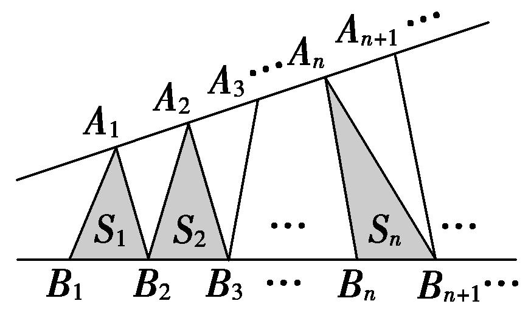

专题08　等差数列的判定与证明

【基本方法】

等差数列的四个判定方法  
（1）定义法：<em>an</em>＋1－<em>an</em>＝<em>d</em>(常数)(<em>n</em>∈<strong>N</strong>\*)⇔{<em>an</em>}是等差数列．  
（2）等差中项法：2<em>an</em>＋1＝<em>an</em>＋<em>an</em>＋2(<em>n</em>∈<strong>N</strong>\*)⇔{<em>an</em>}是等差数列．  
（3）通项公式法：<em>an</em>＝<em>pn</em>＋<em>q</em>(<em>p</em>，<em>q</em>为常数，<em>n</em>∈<strong>N</strong>\*)⇔{<em>an</em>}是等差数列．  
（4）前<em>n</em>项和公式法：<em>Sn</em>＝<em>An</em>2＋<em>Bn</em>(<em>A</em>，<em>B</em>为常数，<em>n</em>∈<strong>N</strong>\*)⇔{<em>an</em>}是等差数列．

提醒：（1）定义法和等差中项法主要适合在解答题中使用，通项公式法和前*n*项和公式法主要适合在选择题或填空题中使用．  
（2）若要判定一个数列不是等差数列，则只需判定存在连续三项不成等差数列即可．

【基本题型】

<strong>[例1]</strong>　（1）设<em>an</em>＝(<em>n</em>＋1)2，<em>bn</em>＝<em>n</em>2－<em>n</em>(<em>n</em>∈N\*)，则下列命题中不正确的是(　　)

A．{<em>an</em>＋1－<em>an</em>}是等差数列　　　　　　　
B．{<em>bn</em>＋1－<em>bn</em>}是等差数列

C．{<em>an</em>－<em>bn</em>}是等差数列　　　　　　　　
D．{<em>an</em>＋<em>bn</em>}是等差数列
答案　D　解析　对于A，因为<em>an</em>＝(<em>n</em>＋1)2，所以<em>an</em>＋1－<em>an</em>＝(<em>n</em>＋2)2－(<em>n</em>＋1)2＝2<em>n</em>＋3，设<em>cn</em>＝2<em>n</em>＋3，所以<em>cn</em>＋1－<em>cn</em>＝2．所以{<em>an</em>＋1－<em>an</em>}是等差数列，故A正确；对于B，因为<em>bn</em>＝<em>n</em>2－<em>n</em>(<em>n</em>∈N\*)，所以<em>bn</em>＋1－<em>bn</em>＝2<em>n</em>，设<em>cn</em>＝2<em>n</em>，所以<em>cn</em>＋1－<em>cn</em>＝2，所以{<em>bn</em>＋1－<em>bn</em>}是等差数列，故B正确；对于C，因为<em>an</em>＝(<em>n</em>＋1)2，<em>bn</em>＝<em>n</em>2－<em>n</em>(<em>n</em>∈N\*)，所以<em>an</em>－<em>bn</em>＝(<em>n</em>＋1)2－(<em>n</em>2－<em>n</em>)＝3<em>n</em>＋1，设<em>cn</em>＝3<em>n</em>＋1，所以<em>cn</em>＋1－<em>cn</em>＝3，所以{<em>an</em>－<em>bn</em>}是等差数列，故C正确；对于D，<em>an</em>＋<em>bn</em>＝2<em>n</em>2＋<em>n</em>＋1，设<em>cn</em>＝<em>an</em>＋<em>bn</em>，<em>cn</em>＋1－<em>cn</em>不是常数，故D错误．  
（2）若{<em>an</em>}是公差为1的等差数列，则{<em>a</em>2<em>n</em>－1＋2<em>a</em>2<em>n</em>}是(　　)

A．公差为3的等差数列　　　　　　　　　　
B．公差为4的等差数列

C．公差为6的等差数列　　　　　　　　　　
D．公差为9的等差数列
答案　C　解析　令<em>bn</em>＝<em>a</em>2<em>n</em>－1＋2<em>a</em>2<em>n</em>，则<em>bn</em>＋1＝<em>a</em>2<em>n</em>＋1＋2<em>a</em>2<em>n</em>＋2，故<em>bn</em>＋1－<em>bn</em>＝<em>a</em>2<em>n</em>＋1＋2<em>a</em>2<em>n</em>＋2－(<em>a</em>2<em>n</em>－1＋2<em>a</em>2<em>n</em>)＝(<em>a</em>2<em>n</em>＋1－<em>a</em>2<em>n</em>－1)＋2(<em>a</em>2<em>n</em>＋2－<em>a</em>2<em>n</em>)＝2<em>d</em>＋4<em>d</em>＝6<em>d</em>＝6×1＝6．即{<em>a</em>2<em>n</em>－1＋2<em>a</em>2<em>n</em>}是公差为6的等差数列．  
（3）(多选)若{<em>an</em>}是等差数列，则下列数列中仍为等差数列的是(　　)

A．{|<em>an</em>|}　　　　　
B．{<em>an</em>＋1－<em>an</em>}　　　　　
C．{<em>pan</em>＋<em>q</em>}(<em>p</em>，<em>q</em>为常数)　　　　　
D．{2<em>an</em>＋<em>n</em>}
答案　BCD　解析　数列－1，1，3是等差数列，取绝对值后：1，1，3不是等差数列，A不成立．若{<em>an</em>}是等差数列，利用等差数列的定义知，{<em>an</em>＋1－<em>an</em>}为常数列，故是等差数列，B成立．若{<em>an</em>}的公差为<em>d</em>，则(<em>pan</em>＋1＋<em>q</em>)－(<em>pan</em>＋<em>q</em>)＝<em>p</em>(<em>an</em>＋1－<em>an</em>)＝<em>pd</em>为常数，故{<em>pan</em>＋<em>q</em>}是等差数列，C成立．(2<em>an</em>＋1＋<em>n</em>＋1)－(2<em>an</em>＋<em>n</em>)＝2(<em>an</em>＋1－<em>an</em>)＋1＝2<em>d</em>＋1为常数，故{2<em>an</em>＋<em>n</em>}是等差数列，D成立．  
（4）已知数列{<em>an</em>}的前<em>n</em>项和是<em>Sn</em>，则下列四个命题中，错误的是(　　)

A．若数列{<em>an</em>}是公差为<em>d</em>的等差数列，则数列是公差为的等差数列

B．若数列是公差为<em>d</em>的等差数列，则数列{<em>an</em>}是公差为2<em>d</em>的等差数列

C．若数列{<em>an</em>}是等差数列，则数列的奇数项、偶数项分别构成等差数列

D．若数列{<em>an</em>}的奇数项、偶数项分别构成公差相等的等差数列，则{<em>an</em>}是等差数列
答案　D　解析　A项，若等差数列{<em>an</em>}的首项为<em>a</em>1，公差为<em>d</em>，前<em>n</em>项的和为<em>Sn</em>，则数列为等差数列，且通项为＝<em>a</em>1＋(<em>n</em>－1)，即数列是公差为的等差数列，故说法正确；B项，由题意得＝<em>a</em>1＋(<em>n</em>－1)<em>d</em>，所以<em>Sn</em>＝<em>na</em>1＋<em>n</em>(<em>n</em>－1)<em>d</em>，则<em>an</em>＝<em>Sn</em>－<em>Sn</em>－1＝<em>a</em>1＋2(<em>n</em>－1)<em>d</em>，即数列{<em>an</em>}是公差为2<em>d</em>的等差数列，故说法正确；C项，若等差数列{<em>an</em>}的公差为<em>d</em>，则数列的奇数项、偶数项都是公差为2<em>d</em>的等差数列，故说法正确；D项，若数列{<em>an</em>}的奇数项、偶数项分别构成公差相等的等差数列，则{<em>an</em>}不一定是等差数列，例如：{1，4，3，6，5，8，7}，说法错误．故选D．  
（5）已知无穷数列{<em>an</em>}的前<em>n</em>项和<em>Sn</em>＝<em>an</em>2＋<em>bn</em>＋<em>c</em>，其中<em>a</em>，<em>b</em>，<em>c</em>为实数，则(　　)

A．{<em>an</em>}可能为等差数列　　　　　　　　　　　　
B．{<em>an</em>}可能为等比数列

C．{<em>an</em>}中一定存在连续的三项构成等差数列　　　
D．{<em>an</em>}中一定存在连续的三项构成等比数列
答案　ABC　解析　解法一：因为<em>Sn</em>＝<em>an</em>2＋<em>bn</em>＋<em>c</em>，所以<em>Sn</em>－1＝<em>a</em>(<em>n</em>－1)2＋<em>b</em>(<em>n</em>－1)＋<em>c</em>(<em>n</em>≥2)，所以<em>an</em>＝<em>Sn</em>－<em>Sn</em>－1＝2<em>na</em>－<em>a</em>＋<em>b</em>(<em>n</em>≥2)，若数列{<em>an</em>}为等差数列，则<em>a</em>1＝<em>a</em>＋<em>b</em>＋<em>c</em>＝<em>a</em>＋<em>b</em>，<em>c</em>＝0，验证知，当<em>c</em>＝0时，{<em>an</em>}为等差数列，所以A正确；在<em>an</em>＝2<em>na</em>－<em>a</em>＋<em>b</em>(<em>n</em>≥2)中，当<em>a</em>＝0，<em>b</em>≠0时，<em>an</em>＝<em>b</em>(<em>n</em>≥2)，若数列{<em>an</em>}为等比数列，则<em>a</em>1＝<em>b</em>＋<em>c</em>＝<em>b</em>，<em>c</em>＝0，验证知，当<em>a</em>＝<em>c</em>＝0，<em>b</em>≠0时，{<em>an</em>}为等比数列，所以B正确；由<em>an</em>＝2<em>na</em>－<em>a</em>＋<em>b</em>(<em>n</em>≥2)可知，{<em>an</em>}中一定存在连续的三项构成等差数列，所以C正确；假设<em>ak</em>，<em>ak</em>＋1，<em>ak</em>＋2(<em>k</em>≥2，且<em>k</em>∈<strong>N</strong>\*)成等比数列，则[2(<em>k</em>＋1)<em>a</em>－<em>a</em>＋<em>b</em>]2＝(2<em>ka</em>－<em>a</em>＋<em>b</em>)·[2(<em>k</em>＋2)<em>a</em>－<em>a</em>＋<em>b</em>]，整理得(<em>k</em>＋1)2＝<em>k</em>(<em>k</em>＋2)，即1＝0(不成立)，所以{<em>an</em>}中不存在连续的三项构成等比数列，所以D错误．故选ABC．
解法二：当<em>c</em>＝0，<em>a</em>≠0时，数列{<em>an</em>}为等差数列，所以A正确；当<em>a</em>＝<em>c</em>＝0，<em>b</em>≠0时，数列{<em>an</em>}为常数列，也是等比数列，所以B正确；当<em>n</em>≥2时，<em>an</em>＝<em>Sn</em>－<em>Sn</em>－1＝2<em>na</em>－<em>a</em>＋<em>b</em>，则{<em>an</em>}中一定存在连续的三项构成等差数列，所以C正确；假设<em>ak</em>，<em>ak</em>＋1，<em>ak</em>＋2(<em>k</em>≥2，且<em>k</em>∈<strong>N</strong>\*)成等比数列，则[2(<em>k</em>＋1)<em>a</em>－<em>a</em>＋<em>b</em>]2＝(2<em>ka</em>－<em>a</em>＋<em>b</em>)·[2(<em>k</em>＋2)<em>a</em>－<em>a</em>＋<em>b</em>]，整理得(<em>k</em>＋1)2＝<em>k</em>(<em>k</em>＋2)，即1＝0(不成立)，所以{<em>an</em>}中不存在连续的三项构成等比数列，所以D错误．故选ABC．  
（6）如图，点列{<em>An</em>}，{<em>Bn</em>}分别在某锐角的两边上，且|<em>AnAn</em>＋1|＝|<em>An</em>＋1<em>An</em>＋2|，<em>An</em>≠<em>An</em>＋2，<em>n</em>∈N\*，|<em>BnBn</em>＋1|＝|<em>Bn</em>＋1<em>Bn</em>＋2|，<em>Bn</em>≠<em>Bn</em>＋2，<em>n</em>∈N\*(<em>P</em>≠<em>Q</em>表示点<em>P</em>与<em>Q</em>不重合)．若<em>dn</em>＝|<em>AnBn</em>|，<em>Sn</em>为△<em>AnBnBn</em>＋1的面积，则(　　)

A．{<em>Sn</em>}是等差数列　　
B．{<em>S</em>}是等差数列　　
C．{<em>dn</em>}是等差数列　　
D．{<em>d</em>}是等差数列
答案　A解析　作<em>A</em>1<em>C</em>1，<em>A</em>2<em>C</em>2，<em>A</em>3<em>C</em>3，…，<em>AnCn</em>垂直于直线<em>B</em>1<em>Bn</em>，垂足分别为<em>C</em>1，<em>C</em>2，<em>C</em>3，…，<em>Cn</em>，则<em>A</em>1<em>C</em>1∥<em>A</em>2<em>C</em>2∥…∥<em>AnCn</em>．∵|<em>AnAn</em>＋1|＝|<em>An</em>＋1<em>An</em>＋2|，∴|<em>CnCn</em>＋1|＝|<em>Cn</em>＋1<em>Cn</em>＋2|．设|<em>A</em>1<em>C</em>1|＝<em>a</em>，|<em>A</em>2<em>C</em>2|＝<em>b</em>，|<em>B</em>1<em>B</em>2|＝<em>c</em>，则|<em>A</em>3<em>C</em>3|＝2<em>b</em>－<em>a</em>，…，|<em>AnCn</em>|＝(<em>n</em>－1)<em>b</em>－(<em>n</em>－2)<em>a</em>(<em>n</em>≥3)，∴<em>Sn</em>＝<em>c</em>[(<em>n</em>－1)<em>b</em>－(<em>n</em>－2)<em>a</em>]＝<em>c</em>[(<em>b</em>－<em>a</em>)<em>n</em>＋(2<em>a</em>－<em>b</em>)]，∴<em>Sn</em>＋1－<em>Sn</em>＝<em>c</em>[(<em>b</em>－<em>a</em>)(<em>n</em>＋1)＋(2<em>a</em>－<em>b</em>)－(<em>b</em>－<em>a</em>)<em>n</em>－(2<em>a</em>－<em>b</em>)]＝<em>c</em>(<em>b</em>－<em>a</em>)，∴数列{<em>Sn</em>}是等差数列．

<strong>[例2]</strong>　已知等差数列{<em>an</em>}的前<em>n</em>项和为<em>Sn</em>，且<em>a</em>3＝7，<em>a</em>5＋<em>a</em>7＝26．  
（1）求<em>an</em>及<em>Sn</em>；  
（2）令<em>bn</em>＝(<em>n</em>∈<strong>N</strong>\*)，求证：数列{<em>bn</em>}为等差数列．
解析　（1）设等差数列{<em>an</em>}的首项为<em>a</em>1，公差为<em>d</em>，由题意有解得<em>a</em>1＝3，<em>d</em>＝2，
则<em>an</em>＝<em>a</em>1＋(<em>n</em>－1)<em>d</em>＝3＋2(<em>n</em>－1)＝2<em>n</em>＋1，<em>Sn</em>＝＝＝<em>n</em>(<em>n</em>＋2)．  
（2）因为<em>bn</em>＝＝＝<em>n</em>＋2，又<em>bn</em>＋1－<em>bn</em>＝<em>n</em>＋3－(<em>n</em>＋2)＝1，
所以数列{<em>bn</em>}是首项为3，公差为1的等差数列．

<strong>[例3]</strong>　已知数列{<em>an</em>}中，<em>a</em>1＝，<em>an</em>＝2－(<em>n</em>≥2，<em>n</em>∈<strong>N</strong>\*)，数列{<em>bn</em>}满足<em>bn</em>＝(<em>n</em>∈<strong>N</strong>\*)．  
（1）求证：数列{<em>bn</em>}是等差数列；  
（2）求数列{<em>an</em>}中的最大项和最小项，并说明理由．
解析　（1）因为<em>an</em>＝2－(<em>n</em>≥2，<em>n</em>∈<strong>N</strong>\*)，<em>bn</em>＝(<em>n</em>∈<strong>N</strong>\*)，
所以<em>bn</em>＋1－<em>bn</em>＝－＝－＝－＝1．又<em>b</em>1＝＝－．
所以数列{<em>bn</em>}是以－为首项，1为公差的等差数列．  
（2）由（1）知<em>bn</em>＝<em>n</em>－，则<em>an</em>＝1＋＝1＋．
设*f*(*x*)＝1＋，则*f*(*x*)在区间(－∞，)和(，＋∞)上为减函数．
所以当<em>n</em>＝3时，<em>an</em>取得最小值－1，当<em>n</em>＝4时，<em>an</em>取得最大值3．

<strong>[例4]</strong>　在数列{<em>an</em>}中，<em>a</em>1＝4，<em>nan</em>＋1－(<em>n</em>＋1)<em>an</em>＝2<em>n</em>2＋2<em>n</em>．  
（1）求证：数列是等差数列；  
（2）求数列的前<em>n</em>项和<em>Sn</em>．
解析　（1）证法一：<em>nan</em>＋1－(<em>n</em>＋1)<em>an</em>＝2<em>n</em>2＋2<em>n</em>的两边同时除以<em>n</em>(<em>n</em>＋1)，得－＝2，又＝4，
所以数列是首项为4，公差为2的等差数列．

证法二：因为－＝＝＝2，＝4，
所以数列是首项为4，公差为2的等差数列．  
（2）由（1），得＝<em>a</em>1＋2(<em>n</em>－1)，即＝2<em>n</em>＋2，即<em>an</em>＝2<em>n</em>2＋2<em>n</em>，
故＝＝·＝，
所以<em>Sn</em>＝＝＝．

<strong>[例5]</strong>　数列{<em>an</em>}满足<em>a</em>1＝1，<em>nan</em>＋1＝(<em>n</em>＋1)<em>an</em>＋<em>n</em>(<em>n</em>＋1)，<em>n</em>∈<strong>N</strong>\*．  
（1）求证：数列是等差数列；  
（2）设<em>bn</em>＝3<em>n</em>·，求数列{<em>bn</em>}的前<em>n</em>项和<em>Sn</em>．
解析　（1）由已知可得＝＋1，即－＝1，所以是以＝1为首项，1为公差的等差数列．  
（2）由（1）得，＝1＋(<em>n</em>－1)·1＝<em>n</em>，所以<em>an</em>＝<em>n</em>2，从而可得<em>bn</em>＝<em>n</em>·3<em>n</em>．

<em>Sn</em>＝1×31＋2×32＋…＋(<em>n</em>－1)×3<em>n</em>－1＋<em>n</em>×3<em>n</em>　①，

3<em>Sn</em>＝1×32＋2×33＋…＋(<em>n</em>－1)×3<em>n</em>＋<em>n</em>×3<em>n</em>＋1　②．

①－②，得－2<em>Sn</em>＝31＋32＋…＋3<em>n</em>－<em>n</em>·3<em>n</em>＋1＝－<em>n</em>·3<em>n</em>＋1＝，
所以<em>Sn</em>＝．

<strong>[例6]</strong>　若数列{<em>an</em>}的前<em>n</em>项和为<em>Sn</em>，且满足<em>an</em>＋2<em>SnSn</em>－1＝0(<em>n</em>≥2)，<em>a</em>1＝．  
（1）求证：成等差数列；  
（2）求数列{<em>an</em>}的通项公式．
解析　（1）当<em>n</em>≥2时，由<em>an</em>＋2<em>SnSn</em>－1＝0，得<em>Sn</em>－<em>Sn</em>－1＝－2<em>SnSn</em>－1，
因为<em>Sn</em>≠0，所以－＝2，又＝＝2，
故是首项为2，公差为2的等差数列．  
（2）由（1）可得＝2<em>n</em>，所以<em>Sn</em>＝．
当<em>n</em>≥2时，<em>an</em>＝<em>Sn</em>－<em>Sn</em>－1＝－＝＝－．
当<em>n</em>＝1时，<em>a</em>1＝不适合上式．故<em>an</em>＝

<strong>[例7]</strong>　已知数列{<em>an</em>}的前<em>n</em>项和为<em>Sn</em>，且2<em>Sn</em>＝3<em>an</em>－3<em>n</em>＋1＋3(<em>n</em>∈<strong>N</strong>\*)．  
（1）设<em>bn</em>＝，求证：数列{<em>bn</em>}为等差数列，并求出数列{<em>an</em>}的通项公式；  
（2）设<em>cn</em>＝－，<em>Tn</em>＝<em>c</em>1＋<em>c</em>2＋<em>c</em>3＋…＋<em>cn</em>，求<em>Tn</em>．
解析　（1）由已知2<em>Sn</em>＝3<em>an</em>－3<em>n</em>＋1＋3(<em>n</em>∈<strong>N</strong>\*)，①

<em>n</em>≥2时，2<em>Sn</em>－1＝3<em>an</em>－1－3<em>n</em>＋3，②

①－②得：2<em>an</em>＝3<em>an</em>－3<em>an</em>－1－2·3<em>n</em>⇒<em>an</em>＝3<em>an</em>－1＋2·3<em>n</em>，
故＝＋2，则<em>bn</em>－<em>bn</em>－1＝2(<em>n</em>≥2)．
又<em>n</em>＝1时，2<em>a</em>1＝3<em>a</em>1－9＋3，解得<em>a</em>1＝6，则<em>b</em>1＝＝2．
故数列{<em>bn</em>}是以2为首项，2为公差的等差数列，∴<em>bn</em>＝2＋2(<em>n</em>－1)＝2<em>n</em>⇒<em>an</em>＝2<em>n</em>·3<em>n</em>．  
（2）由（1），得<em>cn</em>＝2·3<em>n</em>－2<em>n</em>

<em>Tn</em>＝2(3＋32＋33＋…＋3<em>n</em>)－2(1＋2＋…＋<em>n</em>)＝2·－2·＝3<em>n</em>＋1－<em>n</em>2－<em>n</em>－3．

<strong>[例8]</strong>　(2014·全国Ⅰ)已知数列{<em>an</em>}的前<em>n</em>项和为<em>Sn</em>，<em>a</em>1＝1，<em>an</em>≠0，<em>anan</em>＋1＝<em>λSn</em>－1，其中<em>λ</em>为常数．  
（1）证明：<em>an</em>＋2－<em>an</em>＝<em>λ</em>；  
（2）是否存在<em>λ</em>，使得{<em>an</em>}为等差数列？并说明理由．
解析　（1）由题设知，<em>anan</em>＋1＝<em>λSn</em>－1，<em>an</em>＋1<em>an</em>＋2＝<em>λSn</em>＋1－1，两式相减得<em>an</em>＋1(<em>an</em>＋2－<em>an</em>)＝<em>λan</em>＋1，
由于<em>an</em>＋1≠0，所以<em>an</em>＋2－<em>an</em>＝<em>λ</em>．  
（2）由题设知，<em>a</em>1＝1，<em>a</em>1<em>a</em>2＝<em>λS</em>1－1，可得<em>a</em>2＝<em>λ</em>－1．由（1）知，<em>a</em>3＝<em>λ</em>＋1．
令2<em>a</em>2＝<em>a</em>1＋<em>a</em>3，解得<em>λ</em>＝4．
故<em>an</em>＋2－<em>an</em>＝4，由此可得数列{<em>a</em>2<em>n</em>－1}是首项为1，公差为4的等差数列，<em>a</em>2<em>n</em>－1＝4<em>n</em>－3；
数列{<em>a</em>2<em>n</em>}是首项为3，公差为4的等差数列，<em>a</em>2<em>n</em>＝4<em>n</em>－1．所以<em>an</em>＝2<em>n</em>－1，<em>an</em>＋1－<em>an</em>＝2，
因此存在<em>λ</em>＝4，使得数列{<em>an</em>}为等差数列．

<strong>[例9]</strong>　设数列{<em>an</em>}的前<em>n</em>项和为<em>Sn</em>，且满足<em>an</em>－<em>Sn</em>－1＝0(<em>n</em>∈<strong>N</strong>\*)．  
（1）求数列{<em>an</em>}的通项公式；  
（2）是否存在实数<em>λ</em>，使得数列{<em>Sn</em>＋(<em>n</em>＋2<em>n</em>)<em>λ</em>}为等差数列？若存在，求出<em>λ</em>的值；若不存在，请说明理由．
解析　（1）由<em>an</em>－<em>Sn</em>－1＝0(<em>n</em>∈<strong>N</strong>\*)，可知当<em>n</em>＝1时，<em>a</em>1－<em>a</em>1－1＝0，即<em>a</em>1＝2．
又由<em>an</em>－<em>Sn</em>－1＝0(<em>n</em>∈<strong>N</strong>\*)，可得<em>an</em>＋1－<em>Sn</em>＋1－1＝0，

两式相减，得－＝0，即<em>an</em>＋1－<em>an</em>＝0，即<em>an</em>＋1＝2<em>an</em>．
所以数列{<em>an</em>}是以2为首项，2为公比的等比数列，故<em>an</em>＝2<em>n</em>(<em>n</em>∈<strong>N</strong>\*)．  
（2）由（1）知，<em>Sn</em>＝＝2(2<em>n</em>－1)，所以<em>Sn</em>＋(<em>n</em>＋2<em>n</em>)<em>λ</em>＝2(2<em>n</em>－1)＋(<em>n</em>＋2<em>n</em>)<em>λ</em>．
若数列{<em>Sn</em>＋(<em>n</em>＋2<em>n</em>)<em>λ</em>}为等差数列，则<em>S</em>1＋(1＋2)<em>λ</em>，<em>S</em>2＋(2＋22)<em>λ</em>，<em>S</em>3＋(3＋23)<em>λ</em>成等差数列，
即有2[<em>S</em>2＋(2＋22)<em>λ</em>]＝[<em>S</em>1＋(1＋2)<em>λ</em>]＋[<em>S</em>3＋(3＋23)<em>λ</em>]，即2(6＋6<em>λ</em>)＝(2＋3<em>λ</em>)＋(14＋11<em>λ</em>)，解得<em>λ</em>＝－2．
经检验<em>λ</em>＝－2时，{<em>Sn</em>＋(<em>n</em>＋2<em>n</em>)<em>λ</em>}成等差数列，故<em>λ</em>的值为－2．

<strong>[例10]</strong>　若数列{<em>bn</em>}对于任意的<em>n</em>∈<strong>N</strong>\*，都有<em>bn</em>＋2－<em>bn</em>＝<em>d</em>(常数)，则称数列{<em>bn</em>}是公差为<em>d</em>的准等差数列．如数列<em>cn</em>，若<em>cn</em>＝则数列{<em>cn</em>}是公差为8的准等差数列．设数列{<em>an</em>}满足<em>a</em>1＝<em>a</em>，对于<em>n</em>∈<strong>N</strong>\*，都有<em>an</em>＋<em>an</em>＋1＝2<em>n</em>．  
（1）求证：{<em>an</em>}是准等差数列；  
（2）求{<em>an</em>}的通项公式及前20项和<em>S</em>20．
解析　（1）证明：∵<em>an</em>＋<em>an</em>＋1＝2<em>n</em>(<em>n</em>∈<strong>N</strong>\*)，①，∴<em>an</em>＋1＋<em>an</em>＋2＝2(<em>n</em>＋1)(<em>n</em>∈<strong>N</strong>\*)，②

②－①，得<em>an</em>＋2－<em>an</em>＝2(<em>n</em>∈<strong>N</strong>\*)．∴{<em>an</em>}是公差为2的准等差数列．  
（2）∵<em>a</em>1＝<em>a</em>，<em>an</em>＋<em>an</em>＋1＝2<em>n</em>(<em>n</em>∈<strong>N</strong>\*)，∴<em>a</em>1＋<em>a</em>2＝2×1，即<em>a</em>2＝2－<em>a</em>．
∴由（1）得<em>a</em>1，<em>a</em>3，<em>a</em>5，…是以<em>a</em>为首项，2为公差的等差数列；
<em>a</em>2，<em>a</em>4，<em>a</em>6…是以2－<em>a</em>为首项，2为公差的等差数列．
当<em>n</em>为偶数时，<em>an</em>＝2－<em>a</em>＋×2＝<em>n</em>－<em>a</em>；
当<em>n</em>为奇数时，<em>an</em>＝<em>a</em>＋×2＝<em>n</em>＋<em>a</em>－1．
∴<em>an</em>＝

<em>S</em>20＝<em>a</em>1＋<em>a</em>2＋<em>a</em>3＋<em>a</em>4＋…＋<em>a</em>19＋<em>a</em>20＝(<em>a</em>1＋<em>a</em>2)＋(<em>a</em>3＋<em>a</em>4)＋…＋(<em>a</em>19＋<em>a</em>20)

＝2×1＋2×3＋…＋2×19＝2×＝200．

【对点精练】

1．已知等差数列的前三项依次为<em>a</em>，4，3<em>a</em>，前<em>n</em>项和为<em>Sn</em>，且<em>Sk</em>＝110．  
（1）求*a*及*k*的值；  
（2）设数列{<em>bn</em>}的通项公式<em>bn</em>＝，证明：数列{<em>bn</em>}是等差数列，并求其前<em>n</em>项和<em>Tn</em>．

1．解析　（1）设该等差数列为{<em>an</em>}，则<em>a</em>1＝<em>a</em>，<em>a</em>2＝4，<em>a</em>3＝3<em>a</em>，
由已知有<em>a</em>＋3<em>a</em>＝8，得<em>a</em>1＝<em>a</em>＝2，公差<em>d</em>＝4－2＝2，
所以<em>Sk</em>＝<em>ka</em>1＋·<em>d</em>＝2<em>k</em>＋×2＝<em>k</em>2＋<em>k</em>，
由<em>Sk</em>＝110，得<em>k</em>2＋<em>k</em>－110＝0，解得<em>k</em>＝10或<em>k</em>＝－11(舍去)，故<em>a</em>＝2，<em>k</em>＝10．  
（2）由（1）得<em>Sn</em>＝＝<em>n</em>(<em>n</em>＋1)，则<em>bn</em>＝＝<em>n</em>＋1，
故<em>bn</em>＋1－<em>bn</em>＝(<em>n</em>＋2)－(<em>n</em>＋1)＝1，即数列{<em>bn</em>}是首项为2，公差为1的等差数列，
所以<em>Tn</em>＝＝．

2．已知数列{<em>an</em>}满足：<em>a</em>1＝2，<em>an</em>＋1＝3<em>an</em>＋3<em>n</em>＋1－2<em>n</em>，设<em>bn</em>＝，  
（1）求证：数列{<em>bn</em>}为等差数列；  
（2）并求{<em>an</em>}的通项公式．

2．解析　（1）因为<em>bn</em>＋1－<em>bn</em>＝－＝－＝1，
所以数列{<em>bn</em>}是以0为首项，1为公差的等差数列．  
（2）由（1）<em>bn</em>＝<em>n</em>－1，所以<em>an</em>＝(<em>n</em>－1)·3<em>n</em>＋2<em>n</em>．

3．已知数列{<em>an</em>}满足<em>a</em>1＝1，且<em>nan</em>＋1－(<em>n</em>＋1)<em>an</em>＝2<em>n</em>2＋2<em>n</em>．  
（1）求<em>a</em>2，<em>a</em>3；  
（2）证明数列是等差数列，并求{<em>an</em>}的通项公式．

3．解析　（1）由已知得<em>a</em>2－2<em>a</em>1＝4，则<em>a</em>2＝2<em>a</em>1＋4，又<em>a</em>1＝1，所以<em>a</em>2＝6．
由2<em>a</em>3－3<em>a</em>2＝12得2<em>a</em>3＝12＋3<em>a</em>2，所以<em>a</em>3＝15．  
（2）由已知<em>nan</em>＋1－(<em>n</em>＋1)<em>an</em>＝2<em>n</em>(<em>n</em>＋1)，得＝2，即－＝2，
所以数列是首项为1，公差为2的等差数列．
则＝1＋2(<em>n</em>－1)＝2<em>n</em>－1，所以<em>an</em>＝2<em>n</em>2－<em>n</em>．

4．已知数列{<em>an</em>}满足<em>a</em>1＝1，<em>nan</em>＋1－(<em>n</em>＋1)<em>an</em>＝1＋2＋3＋…＋<em>n</em>．  
（1）求证：数列是等差数列；  
（2）若<em>bn</em>＝，求数列{<em>bn</em>}的前<em>n</em>项和<em>Sn</em>．

4．解析　（1）∵<em>nan</em>＋1－(<em>n</em>＋1)<em>an</em>＝1＋2＋3＋…＋<em>n</em>＝，
∴－＝－＝，
∴数列是首项为1，公差为的等差数列．  
（2）由（1）知，＝1＋(<em>n</em>－1)＝，∴<em>an</em>＝．
∴<em>bn</em>＝＝＝2．
∴<em>Sn</em>＝<em>b</em>1＋<em>b</em>2＋…＋<em>bn</em>＝2(1－＋－＋…＋－)＝．

5．已知数列{<em>an</em>}满足<em>a</em>1＝2，且<em>an</em>＋1＝2<em>an</em>＋2<em>n</em>＋1，<em>n</em>∈<strong>N</strong>\*．  
（1）设<em>bn</em>＝，证明：{<em>bn</em>}为等差数列，并求数列{<em>bn</em>}的通项公式；  
（2）在（1）的条件下，求数列{<em>an</em>}的前<em>n</em>项和<em>Sn</em>．

5．解析　（1）把<em>an</em>＝2<em>nbn</em>代入到<em>an</em>＋1＝2<em>an</em>＋2<em>n</em>＋1，得2<em>n</em>＋1<em>bn</em>＋1＝2<em>n</em>＋1<em>bn</em>＋2<em>n</em>＋1，两边同除以2<em>n</em>＋1，
得<em>bn</em>＋1＝<em>bn</em>＋1，即<em>bn</em>＋1－<em>bn</em>＝1，∴{<em>bn</em>}为等差数列，首项<em>b</em>1＝＝1，公差为1，∴<em>bn</em>＝<em>n</em>(<em>n</em>∈<strong>N</strong>\*)．  
（2）由<em>bn</em>＝<em>n</em>＝，得<em>an</em>＝<em>n</em>×2<em>n</em>，
∴<em>Sn</em>＝1×21＋2×22＋3×23＋…＋<em>n</em>×2<em>n</em>，
∴2<em>Sn</em>＝1×22＋2×23＋3×24＋…＋(<em>n</em>－1)×2<em>n</em>＋<em>n</em>×2<em>n</em>＋1，

两式相减，得－<em>Sn</em>＝21＋22＋23＋…＋2<em>n</em>－<em>n</em>×2<em>n</em>＋1＝(1－<em>n</em>)×2<em>n</em>＋1－2，
∴<em>Sn</em>＝(<em>n</em>－1)×2<em>n</em>＋1＋2(<em>n</em>∈<strong>N</strong>\*)．

6．已知数列{<em>an</em>}的各项均为正数，其前<em>n</em>项和为<em>Sn</em>，且满足2<em>Sn</em>＝<em>a</em>＋<em>n</em>－4(<em>n</em>∈<strong>N</strong>\*)．  
（1）求证：数列{<em>an</em>}为等差数列；  
（2）求数列{<em>an</em>}的通项公式．

6．解析　（1）当<em>n</em>＝1时，有2<em>a</em>1＝<em>a</em>＋1－4，即<em>a</em>－2<em>a</em>1－3＝0，所以<em>a</em>1＝3(<em>a</em>1＝－1舍去)．
当<em>n</em>≥2时，有2<em>Sn</em>－1＝<em>a</em>＋<em>n</em>－5，又2<em>Sn</em>＝<em>a</em>＋<em>n</em>－4，
所以两式相减得2<em>an</em>＝<em>a</em>－<em>a</em>＋1，即<em>a</em>－2<em>an</em>＋1＝<em>a</em>，即(<em>an</em>－1)2＝<em>a</em>，
因此<em>an</em>－1＝<em>an</em>－1或<em>an</em>－1＝－<em>an</em>－1．若<em>an</em>－1＝－<em>an</em>－1，则<em>an</em>＋<em>an</em>－1＝1．而<em>a</em>1＝3，
所以<em>a</em>2＝－2，这与数列{<em>an</em>}的各项均为正数矛盾，所以<em>an</em>－1＝<em>an</em>－1，即<em>an</em>－<em>an</em>－1＝1，
因此数列{<em>an</em>}为等差数列．  
（2）由（1）知<em>a</em>1＝3，数列{<em>an</em>}的公差<em>d</em>＝1，
所以数列{<em>an</em>}的通项公式为<em>an</em>＝3＋(<em>n</em>－1)×1＝<em>n</em>＋2．

7．已知数列{<em>an</em>}的前<em>n</em>项积为<em>Tn</em>，且<em>Tn</em>＝1－<em>an</em>．  
（1）证明：是等差数列；  
（2）求数列的前<em>n</em>项和<em>Sn</em>．

7．解析　（1）由<em>Tn</em>＝1－<em>an</em>得，当<em>n</em>≥2时，<em>Tn</em>＝1－，两边同时除以<em>Tn</em>，得－＝1．
∵<em>T</em>1＝1－<em>a</em>1＝<em>a</em>1，∴<em>a</em>1＝，＝＝2，∴是首项为2，公差为1的等差数列．  
（2）由（1）知＝<em>n</em>＋1，则<em>Tn</em>＝，从而<em>an</em>＝1－<em>Tn</em>＝，故＝<em>n</em>．
∴数列是首项为1，公差为1的等差数列，∴<em>Sn</em>＝．

8．设数列{<em>an</em>}的前<em>n</em>项和为<em>Sn</em>，4<em>Sn</em>＝<em>a</em>＋2<em>an</em>－3，且<em>a</em>1，<em>a</em>2，<em>a</em>3，<em>a</em>4，<em>a</em>5成等比数列，当<em>n</em>≥5时，<em>an</em>&gt;0(<em>n</em>

∈<strong>N</strong>\*)．  
（1）求证：当<em>n</em>≥5时，{<em>an</em>}成等差数列；  
（2）求{<em>an</em>}的前<em>n</em>项和<em>Sn</em>．

8．解析　（1）由4<em>Sn</em>＝<em>a</em>＋2<em>an</em>－3，得4<em>Sn</em>＋1＝<em>a</em>＋2<em>an</em>＋1－3，

两式相减，得4<em>an</em>＋1＝<em>a</em>－<em>a</em>＋2<em>an</em>＋1－2<em>an</em>，即(<em>an</em>＋1＋<em>an</em>)(<em>an</em>＋1－<em>an</em>－2)＝0．
当<em>n</em>≥5时，<em>an</em>&gt;0，所以<em>an</em>＋1－<em>an</em>＝2，所以当<em>n</em>≥5时，{<em>an</em>}成等差数列．  
（2）当<em>n</em>＝1时，有4<em>a</em>1＝<em>a</em>＋2<em>a</em>1－3，得<em>a</em>1＝3或<em>a</em>1＝－1．
又<em>a</em>1，<em>a</em>2，<em>a</em>3，<em>a</em>4，<em>a</em>5成等比数列，所以由（1）得<em>an</em>＋1＋<em>an</em>＝0(<em>n</em>≤5)，<em>q</em>＝－1，

而<em>a</em>5&gt;0，所以<em>a</em>1&gt;0，从而<em>a</em>1＝3，所以<em>an</em>＝
所以<em>Sn</em>＝

9．设等差数列{<em>an</em>}的前<em>n</em>项和为<em>Sn</em>，且<em>a</em>5＋<em>a</em>13＝34，<em>S</em>3＝9．  
（1）求数列{<em>an</em>}的通项公式及前<em>n</em>项和公式；  
（2）设数列{<em>bn</em>}的通项公式为<em>bn</em>＝，问：是否存在正整数<em>t</em>，使得<em>b</em>1，<em>b</em>2，<em>bm</em>(<em>m</em>≥3，<em>m</em>∈<strong>N</strong>)成等差数列？若存在，求出<em>t</em>和<em>m</em>的值；若不存在，请说明理由．

9．解析　（1）设等差数列{<em>an</em>}的公差为<em>d</em>．由已知得即解得
故<em>an</em>＝2<em>n</em>－1，<em>n</em>∈<strong>N\*</strong>，<em>Sn</em>＝<em>n</em>2．  
（2）存在．由（1）知<em>bn</em>＝．要使<em>b</em>1，<em>b</em>2，<em>bm</em>成等差数列，则必有2<em>b</em>2＝<em>b</em>1＋<em>bm</em>，
即2×＝＋，整理得*m*＝3＋．
因为*m*，*t*为正整数，所以*t*只能取2，3，5．
当*t*＝2时，*m*＝7；当*t*＝3时，*m*＝5；当*t*＝5时，*m*＝4．
故存在正整数<em>t</em>，使得<em>b</em>1，<em>b</em>2，<em>bm</em>成等差数列．

10．已知数列{<em>an</em>}满足<em>an</em>＋1＝(<em>n</em>∈<strong>N</strong>\*)，且<em>a</em>1＝0．  
（1）求<em>a</em>2，<em>a</em>3；  
（2）是否存在一个实数*λ*，使得数列为等差数列，请说明理由．

10．解析　（1）因为<em>a</em>1＝0，<em>an</em>＋1＝(<em>n</em>∈<strong>N</strong>\*)，所以<em>a</em>2＝＝，<em>a</em>3＝＝．  
（2）假设存在一个实数*λ*，使得数列为等差数列，所以＝＋，即＝＋，解得*λ*＝1．因为－＝－＝－＝＝－，
又＝－1，所以存在一个实数*λ*＝1，使得数列是首项为－1，公差为－的等差数列．

