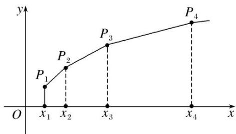

# 专题 14 错位相减法求和

# 【基本知识】

# 错位相减法求和

1. 错位相减法：错位相减法是在推导等比数列的前 $n$ 项和公式时所用的方法，适用于各项由一个等差数列和一个等比数列对应项的乘积组成的数列。把 $S_{n} = a_{1} + a_{2} + \ldots + a_{n}$ 两边同乘以相应等比数列的公比 $q$ ，得到 $qS_{n} = a_{1}q + a_{2}q + \ldots + a_{n}q$ ，两式错位相减即可求出 $S_{n}$ 。

用错位相减法求和时，应注意：  
（1）要善于识别题目类型，特别是等比数列公比为负数的情形.   
（2）在写出“ $S_{n}$ ”与“ $qS_{n}$ ”的表达式时应特别注意将两式“错项对齐”，以便于下一步准确地写出“ $S_{n}-qS_{n}$ ”的表达式.  
（3）在应用错位相减法时，注意观察未合并项的正负号；结论中形如 $a^n$ ， $a^{n + 1}$ 的式子应进行合并.

如：已知 $u_{n}=a^{n}+a^{n-1}b+a^{n-2}b^{2}+\cdots+ab^{n-1}+b^{n}(a>0,\ b>0,\ n\in\mathbf{N}^{*})$ .  
（1）当 a=2, b=3 时，求 $u_{n}$ ;  
（2）若 a=b，求数列 $\{u_{n}\}$ 的前 n 项和 $S_{n}$ .
解析 （1） 当 a=2, b=3 时， $u_{n}=2^{n}+2^{n-1}\cdot3+2^{n-2}\cdot3^{2}+\cdots+2\cdot3^{n-1}+3^{n}(n\in\mathbf{N}^{*})$ ,

两边除以 $2^{n}$ ，得 $\frac{u_n}{2^n} = 1 + \frac{3}{2} + \left(\frac{3}{2}\right)^2 + \cdots + \left(\frac{3}{2}\right)^{n-1} + \left(\frac{3}{2}\right)^n = \frac{1 - \left(\frac{3}{2}\right)^{n+1}}{1 - \frac{3}{2}} = \frac{2\left(1 - \frac{3^{n+1}}{2^{n+1}}\right)}{-1} = \frac{3^{n+1}}{2^n} - 2,$
所以 $u_{n}=3^{n+1}-2^{n+1}$ .  
（2）若 a=b，则 $u_{n}=(n+1)a^{n}$ ，所以 $S_{n}=2a+3a^{2}+4a^{3}+\cdots+(n+1)a^{n}$ ，①
当 a=1 时， $S_{n}=2+3+\cdots+(n+1)=\frac{n(n+3)}{2}$ ;
当 $a>0,\quad a\neq1$ 时，在①的两边同乘以 a，得 $aS_{n}=2a^{2}+3a^{3}+4a^{4}+\cdots+(n+1)a^{n+1}$

与①式作差，得 $(1-a)S_{n}=2a+a^{2}+a^{3}+\cdots+a^{n}-(n+1)a^{n+1}=a+\frac{a(1-a^{n})}{1-a}-(n+1)a^{n+1}$
所以 $S_{n}=\frac{a}{1-a}+\frac{a(1-a^{n})}{(1-a)^{2}}-\frac{(n+1)a^{n+1}}{1-a}$ .

综上， $S_{n}=\left\{\begin{aligned}&\frac{n(n+3)}{2},&a=1,\\&\frac{a-(n+1)a^{n+1}}{1-a}+\frac{a(1-a^{n})}{(1-a)^{2}},&a>0,\quad a\neq1.\end{aligned}\right.$

# 【基本题型】

#### 1. 等差(比)数列+错位相减法型

[例 1] 已知等差数列 $\{a_{n}\}$ 的前 n 项和为 $S_{n}$ ， $a_{1}=2$ ，且 $\frac{S_{10}}{10}=\frac{S_{5}}{5}+5$ .  
（1）求 $a_{n}$ ;  
（2）若 $b_{n} = a_{n}\cdot 4^{\frac{S_{n}}{a_{n}}}$ 求数列 $\{b_n\}$ 的前 $n$ 项的和 $T_{n}$ .
解析 （1）设等差数列 $\{a_{n}\}$ 的公差为 $d$ ，因为 $\frac{S_{10}}{10} = \frac{S_5}{5} + 5$ ，所以 $\frac{\frac{10(a_1 + a_{10})}{2}}{10} - \frac{\frac{5(a_1 + a_5)}{2}}{5} = 5$
所以 $a_{10}-a_{5}=10$ ，所以 5d=10，解得 d=2。所以 $a_{n}=a_{1}+(n-1)d=2+(n-1)\times2=2n$ ;  
（2）由（1）知， $a_{n}=2n$ ，所以 $S_{n}=\frac{n(2+2n)}{2}=n^{2}+n$ 。所以 $b_{n}=a_{n}\cdot4\frac{S_{n}}{a_{n}}=2n\cdot4\frac{n^{2}+n}{2n}=2n\cdot2^{n+1}=n\cdot2^{n+2}$
所以 $T_{n}=1\times2^{3}+2\times2^{4}+2\times2^{5}+\ldots+n\cdot2^{n+2}$ ①,
所以 $2T_{n}=1\times2^{4}+2\times2^{5}+3\times2^{6}+\ldots+(n-1)\cdot2^{n+2}+n\cdot2^{n+3②}$

①-②，得 $-T_{n}=2^{3}+2^{4}+\ldots+2^{n+2}-n\times2^{n+3}=\frac{2^{3}(1-2^{n})}{1-2}-n\times2^{n+3}=2^{n+3}-8-n\times2^{n+3}$
所以 $T_{n}=(n-1)\times2^{n+3}+8.$

[例2] 已知各项均为正数的等比数列 $\{a_{n}\}$ ，满足 $a_1 = 1$ ，且 $\frac{1}{a_1} - \frac{1}{a_2} = \frac{2}{a_3}$ .  
（1）求等比数列 $\{a_{n}\}$ 的通项公式;  
（2）若数列 $\{b_n\}$ 满足 $b_{n} = \log_{2}a_{n + 1}$ ，求数列 $\left\{\frac{b_n}{a_n}\right\}$ 的前 $n$ 项和 $T_{n}$ .
解析 （1）由已知 $\frac{1}{a_1} -\frac{1}{a_2} = \frac{2}{a_3}$ 得： $\frac{1}{a_1} -\frac{1}{a_1q} = \frac{2}{a_1q^2}$ 又 $a_1 = 1$ ， $\therefore q = 2$ 或 $q = -1$ （舍去）， $\therefore a_{n} = 2^{n - 1}$  
（2） $b_{n}=\log_{2}2^{n}=n,\quad\frac{b_{n}}{a_{n}}=\frac{n}{2^{n-1}}$
$T _ {n} = \frac {1}{2 ^ {0}} + \frac {2}{2 ^ {1}} + \frac {3}{2 ^ {2}} + \dots + \frac {n}{2 ^ {n - 1}}, \frac {1}{2} T _ {n} = \frac {1}{2 ^ {1}} + \frac {2}{2 ^ {2}} + \frac {3}{2 ^ {3}} + \dots + \frac {n}{2 ^ {n}}$

两式相减得： $\frac{1}{2} T_n = \frac{1}{2^0} +\frac{1}{2^1} +\frac{1}{2^2} +\dots +\frac{1}{2^{n - 1}} -\frac{n}{2^n} = \frac{1 - \frac{1}{2^n}}{1 - \frac{1}{2}} -\frac{n}{2^n} = 2 - \frac{n + 2}{2^n}$
$\therefore T _ {n} = 4 - \frac {n + 2}{2 ^ {n - 1}}.$

[例 3] 已知等比数列 $\{a_{n}\}$ 的前 n 项和 $S_{n}$ 满足 $4S_{5}=3S_{4}+S_{6}$ ，且 $a_{3}=9$ .  
（1）求数列 $\{a_{n}\}$ 的通项公式 $a_{n}$ ;  
（2）设 $b_{n} = (2n - 1)\cdot a_{n}$ ，求数列 $\{b_n\}$ 的前 $n$ 项和 $T_{n}$
解析 （1）设数列 $\{a_{n}\}$ 的公比为q，由 $4S_{5}=3S_{4}+S_{6}$ ，得 $S_{6}-S_{5}=3S_{5}-3S_{4}$ ，即 $a_{6}=3a_{5}$ ，∴q=3，
$\therefore a _ {n} = 9 \cdot 3 ^ {n - 3} = 3 ^ {n - 1}.$  
（2） $b_{n}=(2n-1)\cdot a_{n}=(2n-1)\cdot3^{n-1},$
$\therefore T _ {n} = 1 \cdot 3 ^ {0} + 3 \cdot 3 ^ {1} + 5 \cdot 3 ^ {2} + \dots + (2 n - 1) \cdot 3 ^ {n - 1},$
$\therefore 3 T _ {n} = 1 \cdot 3 ^ {1} + 3 \cdot 3 ^ {2} + \dots + (2 n - 3) \cdot 3 ^ {n - 1} + (2 n - 1) \cdot 3 ^ {n},$
$\therefore - 2 T _ {n} = 1 + 2 \cdot 3 ^ {1} + 2 \cdot 3 ^ {2} + \dots + 2 \cdot 3 ^ {n - 1} - (2 n - 1) \cdot 3 ^ {n} = - 2 + (2 - 2 n) \cdot 3 ^ {n},$
$\therefore T _ {n} = 1 - \frac {(2 - 2 n) \cdot 3 ^ {n}}{2} = (n - 1) \cdot 3 ^ {n} + 1.$

[例4] 已知等差数列 $\{a_{n}\}$ 满足： $a_{n+1} > a_{n}(n \in \mathbf{N}^{*})$ ， $a_{1} = 1$ ，该数列的前三项分别加上1，1，3后成等比数列， $a_{n} + 2\log_{2}b_{n} = -1$ 。  
（1）分别求数列 $\{a_{n}\}$ ， $\{b_{n}\}$ 的通项公式；  
（2）求数列 $\{a_{n}\cdot b_{n}\}$ 的前n项和 $T_{n}$ .
解析 （1）设等差数列 $\{a_{n}\}$ 的公差为d，则d>0，
由 $a_{1}=1,\quad a_{2}=1+d,\quad a_{3}=1+2d$ 分别加上 1, 1, 3 后成等比数列，得 $(2+d)^{2}=2(4+2d)$ ,
解得 d=2(舍负)，所以 $a_{n}=1+(n-1)\times2=2n-1$ .
又因为 $a_{n}+2\log_{2}b_{n}=-1$ ，所以 $\log_{2}b_{n}=-n$ ，则 $b_{n}=\frac{1}{2^{n}}$ .  
（2）由（1）知 $a_{n}\cdot b_{n} = (2n - 1)\cdot \frac{1}{2^{n}}$
则 $T_{n}=\frac{1}{2^{1}}+\frac{3}{2^{2}}+\frac{5}{2^{3}}+\ldots+\frac{2n-1}{2^{n}}$ ，①， $\frac{1}{2}T_{n}=\frac{1}{2^{2}}+\frac{3}{2^{3}}+\frac{5}{2^{4}}+\ldots+\frac{2n-1}{2^{n+1}}$ ，②
由①-②，得 $\frac{1}{2}T_{n}=\frac{1}{2}+2\times\left(\frac{1}{2^{2}}+\frac{1}{2^{3}}+\frac{1}{2^{4}}+\cdots+\frac{1}{2^{n}}\right)-\frac{2n-1}{2^{n+1}}$ .
$\therefore \frac {1}{2} T _ {n} = \frac {1}{2} + 2 \times \frac {\frac {1}{4} \left(1 - \frac {1}{2 ^ {n - 1}}\right)}{1 - \frac {1}{2}} - \frac {2 n - 1}{2 ^ {n + 1}}, \quad \therefore T _ {n} = 1 + 2 - \frac {2}{2 ^ {n - 1}} - \frac {2 n - 1}{2 ^ {n}} = 3 - \frac {4 + 2 n - 1}{2 ^ {n}} = 3 - \frac {3 + 2 n}{2 ^ {n}}.$

[例 5] (2020·全国 I) 设 $\{a_{n}\}$ 是公比不为 1 的等比数列， $a_{1}$ 为 $a_{2}$ ， $a_{3}$ 的等差中项.  
（1）求 $\{a_{n}\}$ 的公比;  
（2）若 $a_{1}=1$ ，求数列 $\{na_{n}\}$ 的前 n 项和.
解析 （1）设 $\{a_{n}\}$ 的公比为q，∵ $a_{1}$ 为 $a_{2}$ ， $a_{3}$ 的等差中项，
$\therefore 2 a _ {1} = a _ {2} + a _ {3} = a _ {1} q + a _ {1} q ^ {2}, \quad a _ {1} \neq 0, \quad \therefore q ^ {2} + q - 2 = 0, \quad \because q \neq 1, \quad \therefore q = - 2.$  
（2）设 $\{na_{n}\}$ 的前n项和为 $S_{n}$ ， $a_{1}=1$ ， $a_{n}=(-2)^{n-1}$
$\begin{array}{l} S _ {n} = 1 \times 1 + 2 \times (- 2) + 3 \times (- 2) ^ {2} + \dots + n (- 2) ^ {n - 1}, (①) \\ - 2 S _ {n} = 1 \times (- 2) + 2 \times (- 2) ^ {2} + 3 \times (- 2) ^ {3} + \dots + (n - 1) \cdot (- 2) ^ {n - 1} + n (- 2) ^ {n}, (②) \\ \end{array}$

①-②得， $3S_{n}=1+(-2)+(-2)^{2}+\cdots+(-2)^{n-1}-n(-2)^{n}=\frac{1-(-2)^{n}}{1-(-2)}-n(-2)^{n}=\frac{1-(1+3n)(-2)^{n}}{3}$
$\therefore S _ {n} = \frac {1 - (1 + 3 n) (- 2) ^ {n}}{9}, n \in \mathbf {N} ^ {*}.$

[例 6] (2017·天津)已知 $\{a_{n}\}$ 为等差数列，前 n 项和为 $S_{n}(n\in\mathbf{N}^{*})$ ， $\{b_{n}\}$ 是首项为 2 的等比数列，且公比大于 0， $b_{2}+b_{3}=12$ ， $b_{3}=a_{4}-2a_{1}$ ， $S_{11}=11b_{4}$ .  
（1）求 $\{a_{n}\}$ 和 $\{b_{n}\}$ 的通项公式;  
（2）求数列 $\{a_{2n}b_{2n-1}\}$ 的前n项和 $(n\in\mathbf{N}^{*})$ .
解析 （1）设等差数列 $\{a_{n}\}$ 的公差为d，等比数列 $\{b_{n}\}$ 的公比为q.
由已知 $b_{2}+b_{3}=12$ ，得 $b_{1}(q+q^{2})=12$ ，而 $b_{1}=2$ ，所以 $q^{2}+q-6=0$ 。
又因为 q>0，解得 q=2，所以 $b_{n}=2^{n}$ 。由 $b_{3}=a_{4}-2a_{1}$ ，可得 $3d-a_{1}=8$ ，①
由 $S_{11}=11b_{4}$ ，可得 $a_{1}+5d=16$ ，②
联立①②，解得 $a_{1}=1,\ d=3$ ，由此可得 $a_{n}=3n-2(n\in\mathbf{N}^{*})$ .
所以数列 $\{a_{n}\}$ 的通项公式为 $a_{n}=3n-2(n\in\mathbf{N}^{*})$ ，数列 $\{b_{n}\}$ 的通项公式为 $b_{n}=2^{n}(n\in\mathbf{N}^{*})$ .  
（2）设数列 $\{a_{2n}b_{2n-1}\}$ 的前n项和为 $T_{n}$ ，由 $a_{2n}=6n-2,\quad b_{2n-1}=2\times4^{n-1}$ ，得 $a_{2n}b_{2n-1}=(3n-1)\times4^{n}$
故 $T_{n}=2\times4+5\times4^{2}+8\times4^{3}+\cdots+(3n-1)\times4^{n}$ ，③
$4 T _ {n} = 2 \times 4 ^ {2} + 5 \times 4 ^ {3} + 8 \times 4 ^ {4} + \dots + (3 n - 4) \times 4 ^ {n} + (3 n - 1) \times 4 ^ {n + 1}, \tag {④}$

③-④，得 $-3T_{n}=2\times4+3\times4^{2}+3\times4^{3}+\cdots+3\times4^{n}-(3n-1)\times4^{n+1}$
$= \frac {1 2 \times (1 - 4 ^ {n})}{1 - 4} - 4 - (3 n - 1) \times 4 ^ {n + 1} = - (3 n - 2) \times 4 ^ {n + 1} - 8,$
得 $T_{n}=\frac{3n-2}{3}\times4^{n+1}+\frac{8}{3}(n\in\mathbf{N}^{*})$ .
所以数列 $\{a_{2n}b_{2n - 1}\}$ 的前 $n$ 项和为 $\frac{3n - 2}{3}\times 4^{n + 1} + \frac{8}{3} (n\in \mathbf{N}^{*})$

[例 7] (2017·山东)已知 $\{x_{n}\}$ 是各项均为正数的等比数列，且 $x_{1}+x_{2}=3,\quad x_{3}-x_{2}=2$ .  
（1）求数列 $\{x_{n}\}$ 的通项公式;  
（2）如图，在平面直角坐标系 xOy 中，依次连接点 $P_{1}(x_{1}, 1)$ ， $P_{2}(x_{2}, 2)$ ，…， $P_{n+1}(x_{n+1}, n+1)$ 得到折线 $P_{1}P_{2}\cdots P_{n+1}$ ，求由该折线与直线 y=0， $x=x_{1}$ ， $x=x_{n+1}$ 所围成的区域的面积 $T_{n}$ .

解析 （1）设数列 $\{x_{n}\}$ 的公比为 $q$ 。由题意得 $\left\{\begin{array}{l} x_{1} + x_{1}q = 3, \\ x_{1}q^{2} - x_{1}q = 2. \end{array}\right.$ 所以 $3q^{2} - 5q - 2 = 0$ ,
由已知得 q>0，所以 q=2， $x_{1}=1$ 。因此数列 $\{x_{n}\}$ 的通项公式为 $x_{n}=2^{n-1}(n\in\mathbb{N}^{*})$ 。  
（2）过 $P_{1}$ ， $P_{2}$ ，…， $P_{n+1}$ 向 x 轴作垂线，垂足分别为 $Q_{1}$ ， $Q_{2}$ ，…， $Q_{n+1}$ .
由（1）得 $x_{n+1}-x_{n}=2^{n}-2^{n-1}=2^{n-1}$ ，记梯形 $P_{n}P_{n+1}Q_{n+1}Q_{n}$ 的面积为 $b_{n}$ ,
由题意得 $b_{n}=\frac{(n+n+1)}{2}\times2^{n-1}=(2n+1)\times2^{n-2}$ ,
所以 $T_{n}=b_{1}+b_{2}+\cdots+b_{n}=3\times2^{-1}+5\times2^{0}+7\times2^{1}+\cdots+(2n-1)\times2^{n-3}+(2n+1)\times2^{n-2}$ . ①
又 $2T_{n}=3\times2^{0}+5\times2^{1}+7\times2^{2}+\cdots+(2n-1)\times2^{n-2}+(2n+1)\times2^{n-1}$ ，②

①-②得 $-T_{n}=3\times2^{-1}+(2+2^{2}+\cdots+2^{n-1})-(2n+1)\times2^{n-1}=\frac{3}{2}+\frac{2(1-2^{n-1})}{1-2}-(2n+1)\times2^{n-1}.$
所以 $T_{n}=\frac{(2n-1)\times2^{n}+1}{2}(n\in\mathbf{N}^{*})$ .

# 【对点精练】

1. (2017·山东)已知 $\{a_{n}\}$ 是各项均为正数的等比数列，且 $a_1 + a_2 = 6$ ， $a_1a_2 = a_3$  
（1）求数列 $\{a_{n}\}$ 的通项公式;  
（2） $\{b_n\}$ 为各项非零的等差数列，其前 $n$ 项和为 $S_{n}$ 。已知 $S_{2n+1} = b_{n}b_{n+1}$ ，求数列 $\left\{\frac{b_n}{a_n}\right\}$ 的前 $n$ 项和 $T_{n}$ 。

1. 解析 （1） 设 $\{a_{n}\}$ 的公比为 q，由题意知 $a_{1}(1+q)=6,\quad a_{1}^{2}q=a_{1}q^{2}$
又 $a_{n}>0$ ，由以上两式联立方程组解得 $a_{1}=2,\quad q=2$ ，所以 $a_{n}=2^{n}$ .  
（2）由题意知 $S_{2n + 1} = \frac{(2n + 1)(b_1 + b_{2n + 1})}{2} = (2n + 1)b_{n + 1},$
又 $S_{2n + 1} = b_nb_{n + 1}, b_{n + 1}\neq 0$ ，所以 $b_{n} = 2n + 1$
令 $c_{n}=\frac{b_{n}}{a_{n}}$ ，则 $c_{n}=\frac{2n+1}{2^{n}}$ .
因此 $T_{n}=c_{1}+c_{2}+\ldots+c_{n}=\frac{3}{2}+\frac{5}{2^{2}}+\frac{7}{2^{3}}+\ldots+\frac{2n-1}{2^{n-1}}+\frac{2n+1}{2^{n}}$
又 $\frac{1}{2} T_n = \frac{3}{2^2} +\frac{5}{2^3} +\frac{7}{2^4} +\ldots +\frac{2n - 1}{2^n} +\frac{2n + 1}{2^{n + 1}},$

两式相减得 $\frac{1}{2} T_n = \frac{3}{2} + (\frac{1}{2} + \frac{1}{2^2} + \ldots + \frac{1}{2^{n-1}}) - \frac{2n+1}{2^{n+1}} = \frac{3}{2} + \frac{\frac{1}{2}[1 - (\frac{1}{2})^{n-1}]}{1 - \frac{1}{2}} - \frac{2n+1}{2^{n+1}} = \frac{5}{2} - \frac{2n+5}{2^{n+1}}$ ,
所以 $T_{n}=5-\frac{2n+5}{2^{n}}$ .

2. 已知等比数列 $\{a_{n}\}$ 中， $a_{1}+a_{2}=8,\quad a_{2}+a_{3}=24,\quad S_{n}$ 为数列 $\{a_{n}\}$ 的前 n 项和.  
（1）求数列 $\{a_{n}\}$ 的通项公式;  
（2）若 $b_{n} = a_{n}\cdot \log_{3}(S_{n} + 1)$ ，求数列 $\{b_n\}$ 的前 $n$ 项和 $T_{n}$

2. 解析 （1） 设等比数列 $\{a_{n}\}$ 的公比为 q，则 $q=\frac{a_{2}+a_{3}}{a_{1}+a_{2}}=\frac{24}{8}=3$ .
故 $a_1 + a_2 = a_1 + 3a_1 = 8$ ，解得 $a_1 = 2$ ，所以 $a_{n} = a_{1}q^{n - 1} = 2\times 3^{n - 1}$  
（2）由（1）知 $S_{n} = 3^{n} - 1$ ，所以 $b_{n} = a_{n}\cdot \log_{3}(S_{n} + 1) = 2\times 3^{n - 1}\times \log_{3}3^{n} = 2n\times 3^{n - 1},$
所以 $T_{n}=b_{1}+b_{2}+b_{3}+\cdots+b_{n}=2\times3^{0}+4\times3^{1}+6\times3^{2}+\cdots+2(n-1)\times3^{n-2}+2n\times3^{n-1}$ ，①
$3 T _ {n} = 2 \times 3 ^ {1} + 4 \times 3 ^ {2} + 6 \times 3 ^ {3} + \dots + 2 (n - 1) \times 3 ^ {n - 1} + 2 n \times 3 ^ {n}, \tag {②}$

①-②得 $-2T_{n}=2\times3^{0}+2\times3^{1}+2\times3^{2}+2\times3^{3}+\cdots+2\times3^{n-1}-2n\times3^{n}=3^{n}(1-2n)-1.$
所以 $T_{n}=\frac{3^{n}(2n-1)+1}{2}$ .

3. 已知正项等比数列 $\{a_{n}\}$ 的前 $n$ 项和 $S_{n}$ 满足： $S_{n+2} = \frac{1}{4} S_{n} + \frac{3}{2}$ .  
（1）求数列 $\{a_{n}\}$ 的首项 $a_{1}$ 和公比q;  
（2）若 $b_{n} = na_{n}$ ，求数列 $\{b_n\}$ 的前 $n$ 项和 $T_{n}$

3. 解析 （1） 因为 $S_{n+2}=\frac{1}{4}S_{n}+\frac{3}{2}$ ，所以 $S_{3}=\frac{1}{4}S_{1}+\frac{3}{2}$ ， $S_{4}=\frac{1}{4}S_{2}+\frac{3}{2}$ ，两式相减得： $a_{4}=\frac{1}{4}a_{2}$
所以 $q^{2}=\frac{1}{4}$ ，又 q>0，则 $q=\frac{1}{2}$ 。又由 $S_{3}=\frac{1}{4}S_{1}+\frac{3}{2}$ ，可知： $a_{1}+a_{2}+a_{3}=\frac{1}{4}a_{1}+\frac{3}{2}$
所以 $a_{1}\left(1+\frac{1}{2}+\frac{1}{4}\right)=\frac{1}{4}a_{1}+\frac{3}{2}$ ，所以 $a_{1}=1$ .  
（2）由（1）知 $a_{n} = \left(\frac{1}{2}\right)_{n - 1}$ ，所以 $b_{n} = \frac{n}{2^{n - 1}}$
所以 $T_{n}=1+\frac{2}{2}+\frac{3}{2^{2}}+\cdots+\frac{n}{2^{n-1}},\quad\frac{1}{2}T_{n}=\frac{1}{2}+\frac{2}{2^{2}}+\cdots+\frac{n-1}{2^{n-1}}+\frac{n}{2^{n}}.$

两式相减得 $\frac{1}{2}T_{n}=1+\frac{1}{2}+\cdots+\frac{1}{2^{n-1}}-\frac{n}{2^{n}}=2-\frac{1}{2^{n-1}}-\frac{n}{2^{n}}$ . 所以 $T_{n}=4-\frac{n+2}{2^{n-1}}$ .

4. 已知各项均为正数的等差数列 $\{a_{n}\}$ 中， $a_{1} + a_{2} + a_{3} = 15$ ，且 $a_{1} + 2, a_{2} + 5, a_{3} + 13$ 构成等比数列 $\{b_{n}\}$ 的前三项.  
（1）求数列 $\{a_{n}\}$ ， $\{b_{n}\}$ 的通项公式；  
（2）求数列 $\{a_{n}b_{n}\}$ 的前n项和 $T_{n}$ .

4. 解析 （1）设等差数列的公差为 d，则由已知得， $a_{1}+a_{2}+a_{3}=3a_{2}=15$ ，即 $a_{2}=5$ ，
又 $(5-d+2)(5+d+13)=100$ ，解得d=2或d=-13(舍去)， $a_{1}=a_{2}-d=3$ ，
$\therefore a _ {n} = a _ {1} + (n - 1) \times d = 2 n + 1, \text {又} b _ {1} = a _ {1} + 2 = 5, b _ {2} = a _ {2} + 5 = 1 0, \therefore q = 2, \therefore b _ {n} = 5 \cdot 2 ^ {n - 1}.$  
（2）由（1）知 $a_{n}b_{n}=(2n+1)\cdot5\cdot2^{n-1}=5\cdot(2n+1)\cdot2^{n-1}$ ,
$\because T _ {n} = 5 \left[ 3 + 5 \times 2 + 7 \times 2 ^ {2} + \dots + (2 n + 1) \times 2 ^ {n - 1} \right],$
$2 T _ {n} = 5 \left[ 3 \times 2 + 5 \times 2 ^ {2} + 7 \times 2 ^ {3} + \dots + (2 n + 1) \times 2 ^ {n} \right],$

两式相减得 $-T_{n}=5[3+2\times2+2\times2^{2}+\cdots+2\times2^{n-1}-(2n+1)\times2^{n}]=5[(1-2n)2^{n}-1]$ ,
则 $T_{n}=5[(2n-1)2^{n}+1]$ .

5. 已知等比数列 $\{a_{n}\}$ 的公比 $q > 1$ ， $a_{1} = 1$ ，且 $2a_{2}, a_{4}, 3a_{3}$ 成等差数列.  
（1）求数列 $\{a_{n}\}$ 的通项公式;  
（2）记 $b_{n}=2na_{n}$ ，求数列 $\{b_{n}\}$ 的前 n 项和 $T_{n}$ .

5. 解析 （1）由 $2a_{2}$ ， $a_{4}$ ， $3a_{3}$ 成等差数列可得 $2a_{4}=2a_{2}+3a_{3}$ ，即 $2a_{1}q^{3}=2a_{1}q+3a_{1}q^{2}$
又 q>1, $a_{1}=1$ ，故 $2q^{2}=2+3q$ ，即 $2q^{2}-3q-2=0$ ，得 q=2，
因此数列 $\{a_{n}\}$ 的通项公式为 $a_{n}=2^{n-1}$ .  
（2） $b_{n}=2n\times2^{n-1}=n\times2^{n}$ ,
$T _ {n} = 1 \times 2 + 2 \times 2 ^ {2} + 3 \times 2 ^ {3} + \dots + n \times 2 ^ {n}, \quad ①. \quad 2 T _ {n} = 1 \times 2 ^ {2} + 2 \times 2 ^ {3} + 3 \times 2 ^ {4} + \dots + n \times 2 ^ {n + 1}, \quad ②$

①-②得 $-T_{n}=2+2^{2}+2^{3}+\ldots+2^{n}-n\times2^{n+1},\quad-T_{n}=\frac{2(2^{n}-1)}{2-1}-n\times2^{n+1},$
$T _ {n} = (n - 1) \times 2 ^ {n + 1} + 2.$

6. 已知数列 $\{a_{n}\}$ 是等比数列， $a_{2} = 4$ ， $a_{3} + 2$ 是 $a_{2}$ 和 $a_{4}$ 的等差中项.  
（1）求数列 $\{a_{n}\}$ 的通项公式;  
（2）设 $b_{n} = 2\log_{2}a_{n} - 1$ ，求数列 $\{a_{n}b_{n}\}$ 的前 $n$ 项和 $T_{n}$

6. 解析 （1）设数列 $\{a_{n}\}$ 的公比为q，因为 $a_{2}=4$ ，所以 $a_{3}=4q,\quad a_{4}=4q^{2}$ .
因为 $a_{3}+2$ 是 $a_{2}$ 和 $a_{4}$ 的等差中项，所以 $2(a_{3}+2)=a_{2}+a_{4}$ .
即 $2(4q+2)=4+4q^{2}$ ，化简得 $q^{2}-2q=0$ 。因为公比 $q\neq0$ ，所以 q=2。
所以 $a_{n}=a_{2}q^{n-2}=4\times2^{n-2}=2^{n}(n\in\mathbf{N}^{*})$ .  
（2） 因为 $a_{n}=2^{n}$ ，所以 $b_{n}=2\log_{2}a_{n}-1=2n-1$ ，所以 $a_{n}b_{n}=(2n-1)2^{n}$
则 $T_{n}=1\times2+3\times2^{2}+5\times2^{3}+\cdots+(2n-3)2^{n-1}+(2n-1)2^{n}$ ，①
$2 T _ {n} = 1 \times 2 ^ {2} + 3 \times 2 ^ {3} + 5 \times 2 ^ {4} + \dots + (2 n - 3) 2 ^ {n} + (2 n - 1) 2 ^ {n + 1}. \tag {②}$
由①-②得， $-T_{n}=2+2\times2^{2}+2\times2^{3}+\cdots+2\times2^{n}-(2n-1)2^{n+1}$
$= 2 + 2 \times \frac {4 (1 - 2 ^ {n - 1})}{1 - 2} - (2 n - 1) 2 ^ {n + 1} = - 6 - (2 n - 3) 2 ^ {n + 1},$
所以 $T_{n}=6+(2n-3)2^{n+1}$ .

7. 已知 $\{a_{n}\}$ 为等差数列，前 $n$ 项和为 $S_{n}(n \in \mathbf{N}^{*})$ ， $\{b_{n}\}$ 是首项为 2 的等比数列，且公比大于 0， $b_{2} + b_{3} = 12$
$b _ {3} = a _ {4} - 2 a _ {1}, S _ {1 1} = 1 1 b _ {4}.$  
（1）求 $\{a_{n}\}$ 和 $\{b_{n}\}$ 的通项公式;  
（2）求数列 $\{a_{2n}b_{n}\}$ 的前n项和 $(n\in\mathbf{N}^{*})$ .

7. 解析 （1）设等差数列 $\{a_{n}\}$ 的公差为d，等比数列 $\{b_{n}\}$ 的公比为q.
由已知 $b_{2}+b_{3}=12$ ，得 $b_{1}(q+q^{2})=12$ ，

而 $b_{1}=2$ ，所以 $q^{2}+q-6=0$ .
因为 q>0，解得 q=2，所以 $b_{n}=2^{n}$ .
由 $b_{3}=a_{4}-2a_{1}$ ，可得 $3d-a_{1}=8.$ ①
由 $S_{11}=11b_{4}$ ，可得 $a_{1}+5d=16$ 。②
联立①②，解得 $a_{1}=1,\ d=3$
由此可得 $a_{n}=3n-2$ .
所以 $\{a_{n}\}$ 的通项公式为 $a_{n}=3n-2,\quad\{b_{n}\}$ 的通项公式为 $b_{n}=2^{n}$ .  
（2）设数列 $\{a_{2n}b_{n}\}$ 的前n项和为 $T_{n}$ ，由 $a_{2n}=6n-2$ ，有
$T _ {n} = 4 \times 2 + 1 0 \times 2 ^ {2} + 1 6 \times 2 ^ {3} + \dots + (6 n - 2) \times 2 ^ {n},$
$2 T _ {n} = 4 \times 2 ^ {2} + 1 0 \times 2 ^ {3} + 1 6 \times 2 ^ {4} + \dots + (6 n - 8) \times 2 ^ {n} + (6 n - 2) \times 2 ^ {n + 1},$

上述两式相减，得
$- T _ {n} = 4 \times 2 + 6 \times 2 ^ {2} + 6 \times 2 ^ {3} + \dots + 6 \times 2 ^ {n} - (6 n - 2) \times 2 ^ {n + 1} = \frac {1 2 \times (1 - 2 ^ {n})}{1 - 2} - 4 - (6 n - 2) \times 2 ^ {n + 1}$
$= - (3 n - 4) 2 ^ {n + 2} - 1 6,$
得 $T_{n}=(3n-4)2^{n+2}+16$ 。所以数列 $\{a_{2n}b_{n}\}$ 的前 n 项和为 $(3n-4)2^{n+2}+16$ 。

#### 2. $f(S_{n}, a_{n}) = 1+$ 错位相减法型

[例8] 已知数列 $\{a_{n}\}$ 的前 $n$ 项和为 $S_{n}$ ， $a_{1} = 1$ ，当 $n \geqslant 2$ 时， $2S_{n} = (n + 1)a_{n} - 2$ .  
（1）求 $a_2$ ， $a_3$ 和通项 $a_{n}$  
（2）设数列 $\{b_n\}$ 满足 $b_{n} = a_{n}\cdot 2^{n - 1}$ ，求 $\{b_n\}$ 的前 $n$ 项和 $T_{n}$
解析 （1） 当 n=2 时， $2S_{2}=2(1+a_{2})=3a_{2}-2$ ，则 $a_{2}=4$ ，
当 n=3 时， $2S_{3}=2(1+4+a_{3})=4a_{3}-2$ ，则 $a_{3}=6$ ，
当 $n \geqslant 2$ 时， $2S_{n} = (n + 1)a_{n} - 2,$
当 $n \geqslant 3$ 时， $2S_{n-1} = na_{n-1} - 2,$
所以当 $n \geqslant 3$ 时， $2(S_{n} - S_{n-1}) = (n + 1)a_{n} - na_{n-1} = 2a_{n}$ ，即 $2a_{n} = (n + 1)a_{n} - na_{n-1}$ ,

整理可得 $(n-1)a_{n}=na_{n-1}$ ，所以 $\frac{a_{n}}{n}=\frac{a_{n-1}}{n-1}$ ，因为 $\frac{a_{3}}{3}=\frac{a_{2}}{2}=2$ ，所以 $\frac{a_{n}}{n}=\frac{a_{n-1}}{n-1}=\cdots=\frac{a_{3}}{3}=\frac{a_{2}}{2}=2$ ，
因此，当 $n \geqslant 2$ 时， $a_n = 2n$ ，而 $a_1 = 1$ ，故 $a_n = \begin{cases} 1, & n = 1, \\ 2n, & n \geqslant 2. \end{cases}$  
（2）由（1）可知 $b_{n}=\left\{\begin{aligned}&1,&n=1,\\ &n\cdot2^{n},&n\geqslant2,\end{aligned}\right.$ 所以当 n=1 时， $T_{1}=b_{1}=1$
当 $n \geqslant 2$ 时， $T_{n} = b_{1} + b_{2} + b_{3} + \cdots + b_{n}$ ，则
$T _ {n} = 1 + 2 \times 2 ^ {2} + 3 \times 2 ^ {3} + \dots + (n - 1) \times 2 ^ {n - 1} + n \times 2 ^ {n},$
$2 T _ {n} = 2 + 2 \times 2 ^ {3} + 3 \times 2 ^ {4} + \dots + (n - 1) \times 2 ^ {n} + n \times 2 ^ {n + 1},$

作差得 $T_{n}=1-8-(2^{3}+2^{4}+\cdots+2^{n})+n\times2^{n+1}=(n-1)\times2^{n+1}+1$

易知当 n=1 时，也满足上式，
故 $T_{n}=(n-1)\times2^{n+1}+1(n\in\mathbf{N}^{*})$ .

[例 9] 已知数列 $\{a_{n}\}$ 的前 n 项和为 $S_{n}$ ，且满足 $S_{n}-n=2(a_{n}-2)(n\in\mathbf{N}^{*})$ .  
（1）证明：数列 $\{a_{n}-1\}$ 为等比数列；  
（2）若 $b_{n} = a_{n}\cdot \log_{2}(a_{n} - 1)$ ，数列 $\{b_n\}$ 的前 $n$ 项和为 $T_{n}$ ，求 $T_{n}$
解析 （1） $\because S_{n} - n = 2(a_{n} - 2)$ ，当 $n \geqslant 2$ 时， $S_{n-1} - (n - 1) = 2(a_{n-1} - 2)$ ，

两式相减，得 $a_{n}-1=2a_{n}-2a_{n-1}$ ，∴ $a_{n}=2a_{n-1}-1$ ，∴ $a_{n}-1=2(a_{n-1}-1)$ ，
$\therefore \frac{a_{n} - 1}{a_{n - 1} - 1} = 2(n\geqslant 2)$ (常数). 又当 $n = 1$ 时， $a_1 - 1 = 2(a_1 - 2)$ ，得 $a_1 = 3$ ， $a_1 - 1 = 2$
∴数列 $\{a_{n}-1\}$ 是以2为首项，2为公比的等比数列.  
（2）由（1）知， $a_{n}-1=2\times2^{n-1}=2^{n},\quad\therefore a_{n}=2^{n}+1,$
又 $b_{n}=a_{n}\cdot\log_{2}(a_{n}-1)$ ，∴ $b_{n}=n(2^{n}+1)$ ,
$\therefore T _ {n} = b _ {1} + b _ {2} + b _ {3} + \dots + b _ {n} = (1 \times 2 + 2 \times 2 ^ {2} + 3 \times 2 ^ {3} + \dots + n \times 2 ^ {n}) + (1 + 2 + 3 + \dots + n),$
设 $A_{n}=1\times2+2\times2^{2}+3\times2^{3}+\cdots+(n-1)\times2^{n-1}+n\times2^{n}$
则 $2A_{n}=1\times2^{2}+2\times2^{3}+\cdots+(n-1)\times2^{n}+n\times2^{n+1}$

两式相减，得 $-A_{n}=2+2^{2}+2^{3}+\cdots+2^{n}-n\times2^{n+1}=\frac{2(1-2^{n})}{1-2}-n\times2^{n+1}$
$\therefore A_{n}=(n-1)\times2^{n+1}+2.$ 又 $1+2+3+\cdots+n=\frac{n(n+1)}{2},$
$\therefore T _ {n} = (n - 1) \times 2 ^ {n + 1} + 2 + \frac {n (n + 1)}{2} (n \in \mathbf {N} ^ {*}).$

[例10] 已知数列 $\{a_{n}\}$ 的前 $n$ 项和是 $S_{n}$ ，且 $S_{n} + \frac{1}{2} a_{n} = 1 (n \in \mathbb{N}^{*})$ 。数列 $\{b_{n}\}$ 是公差 $d$ 不等于 0 的等差数列，且满足： $b_{1} = \frac{3}{2} a_{1}, b_{2}, b_{5}, b_{14}$ 成等比数列。  
（1）求数列 $\{a_{n}\}$ ， $\{b_{n}\}$ 的通项公式；  
（2）设 $c_{n} = a_{n}\cdot b_{n}$ ，求数列 $\{c_n\}$ 的前 $n$ 项和 $T_{n}$
解析 （1） $n = 1$ 时， $a_1 + \frac{1}{2} a_1 = 1, a_1 = \frac{2}{3}, n \geqslant 2$ 时， $\left\{ \begin{array}{l} S_n = 1 - \frac{1}{2} a_n, \\ S_{n-1} = 1 - \frac{1}{2} a_{n-1}, \end{array} \right.$
$S_{n}-S_{n-1}=\frac{1}{2}(a_{n-1}-a_{n}),\quad\therefore a_{n}=\frac{1}{3}a_{n-1}(n\geqslant2),\quad\{a_{n}\}$ 是以 $\frac{2}{3}$ 为首项， $\frac{1}{3}$ 为公比的等比数列，
$a _ {n} = \frac {2}{3} \times \left(\frac {1}{3}\right) ^ {n - 1} = 2 \left(\frac {1}{3}\right) ^ {n}.$
$b_{1}=1$ ，由 $b_{5}^{2}=b_{2}b_{14}$ 得， $(1+4d)^{2}=(1+d)(1+13d)$ ， $d^{2}-2d=0$ ，因为 $d\neq0$ ，解得d=2，
$b _ {n} = 2 n - 1 (n \in \mathbf {N} ^ {*}).$  
（2） $c_{n}=\frac{4n-2}{3^{n}}$ ,
$T _ {n} = \frac {2}{3} + \frac {6}{3 ^ {2}} + \frac {1 0}{3 ^ {3}} + \dots + \frac {4 n - 2}{3 ^ {n}}, \tag {①}$
$\frac {1}{3} T _ {n} = \frac {2}{3 ^ {2}} + \frac {6}{3 ^ {3}} + \frac {1 0}{3 ^ {4}} + \dots + \frac {4 n - 6}{3 ^ {n}} + \frac {4 n - 2}{3 ^ {n + 1}}, \tag {②}$

①-②得， $\frac{2}{3}T_{n}=\frac{2}{3}+4\left(\frac{1}{3^{2}}+\frac{1}{3^{3}}+\cdots+\frac{1}{3^{n}}\right)-\frac{4n-2}{3^{n+1}}=\frac{2}{3}+4\times\frac{\frac{1}{9}-\frac{1}{3^{n+1}}}{1-\frac{1}{3}}-\frac{4n-2}{3^{n+1}}=\frac{4}{3}-\frac{2}{3^{n}}-\frac{4n-2}{3^{n+1}}$
所以 $T_{n}=2-\frac{2n+2}{3^{n}}(n\in\mathbf{N}^{*})$ .

# 【对点精练】

8. 已知数列 $\{a_{n}\}$ 的前 $n$ 项和为 $S_{n}$ , $a_{1} = 5$ , $nS_{n + 1} - (n + 1)S_{n} = n^{2} + n$ .  
（1）求证：数列 $\left\{\begin{aligned}&S_{n}\\ &n\end{aligned}\right\}$ 为等差数列；  
（2）令 $b_{n}=2^{n}a_{n}$ ，求数列 $\{b_{n}\}$ 的前n项和 $T_{n}$ .

8. 解析 （1） 由 $nS_{n+1}-(n+1)S_n=n^2+n$ 得 $\frac{S_{n+1}}{n+1}-\frac{S_n}{n}=1$ ，又 $\frac{S_1}{1}=5$
所以数列 $\left\{ \begin{array}{l} S_n \\ n \end{array} \right.$ 是首项为5，公差为1的等差数列.  
（2）由（1）可知 $\frac{S_{n}}{n}=5+(n-1)=n+4$ ，所以 $S_{n}=n^{2}+4n$ .
当 $n \geq 2$ 时， $a_{n} = S_{n} - S_{n-1} = n^{2} + 4n - (n-1)^{2} - 4(n-1) = 2n + 3$ .
又 $a_{1}=5$ 也符合上式，所以 $a_{n}=2n+3(n\in\mathbf{N}^{*})$ ，所以 $b_{n}=(2n+3)2^{n}$
所以 $T_{n}=5\times2+7\times2^{2}+9\times2^{3}+\ldots+(2n+3)2^{n}$ ，①
$2 T _ {n} = 5 \times 2 ^ {2} + 7 \times 2 ^ {3} + 9 \times 2 ^ {4} + \dots + (2 n + 1) 2 ^ {n} + (2 n + 3) 2 ^ {n + 1}, \tag {②}$
所以②-①得 $T_{n}=(2n+3)2^{n+1}-10-(2^{3}+2^{4}+\ldots+2^{n+1})=(2n+3)2^{n+1}-10-\frac{2^{3}(1-2^{n-1})}{1-2}$
$= (2 n + 3) 2 ^ {n + 1} - 1 0 - \left(2 ^ {n + 2} - 8\right) = (2 n + 1) 2 ^ {n + 1} - 2.$

9. 已知数列 $\{a_{n}\}$ 的前 $n$ 项和为 $S_{n}$ ，若 $a_{n} = -3S_{n} + 4$ ， $b_{n} = -\log_{2}a_{n + 1}$ .  
（1）求数列 $\{a_{n}\}$ 的通项公式与数列 $\{b_{n}\}$ 的通项公式;  
（2）令 $c_{n} = \frac{b_{n}}{2^{n + 1}}$ ，其中 $n\in \mathbb{N}^*$ ，记数列 $\{c_n\}$ 的前 $n$ 项和为 $T_{n}$ ，求 $T_{n} + \frac{n + 2}{2^{n}}$ 的值.

9. 解析 （1）由题意知 $a_{1}=1,\quad\because a_{n}=-3S_{n}+4,\quad\therefore a_{n+1}=-3S_{n+1}+4.$

两式相减并化简得 $a_{n+1}=\frac{1}{4}a_{n},\quad\therefore a_{n}=\left(\frac{1}{4}\right)^{n-1}.$ $b_{n}=-\log_{2}a_{n+1}=-\log_{2}\left(\frac{1}{4}\right)^{n}=2n.$  
（2）由（1）知 $c_{n}=\frac{n}{2^{n}}$ . 则 $T_{n}=\frac{1}{2}+\frac{2}{2^{2}}+\frac{3}{2^{3}}+\ldots+\frac{n}{2^{n}}$ , ①
$\frac {1}{2} T _ {n} = \frac {1}{2 ^ {2}} + \frac {2}{2 ^ {3}} + \dots + \frac {n - 1}{2 ^ {n}} + \frac {n}{2 ^ {n + 1}}, \tag {②}$

①-②得， $\frac{1}{2}T_{n}=\frac{1}{2}+\frac{1}{2^{2}}+\frac{1}{2^{3}}+\ldots+\frac{1}{2^{n}}-\frac{n}{2^{n+1}}=1-\frac{n+2}{2^{n+1}}.$
$\therefore T_{n} = 2 - \frac{n + 2}{2^{n}}$ 可得 $T_{n} + \frac{n + 2}{2^{n}} = 2$

10. 已知等差数列 $\{a_{n}\}$ 中， $a_{2} = 2$ ， $a_{3} + a_{5} = 8$ ，数列 $\{b_{n}\}$ 中， $b_{1} = 2$ ，其前 $n$ 项和 $S_{n}$ 满足： $b_{n+1} = S_{n} + 2 (n \in \mathbf{N}^{*})$ .  
（1）求数列 $\{a_{n}\}$ ， $\{b_{n}\}$ 的通项公式；  
（2）设 $c_{n}=\frac{a_{n}}{b_{n}}$ ，求数列 $\{c_{n}\}$ 的前 n 项和 $T_{n}$ .

10. 解析 （1） $\because a_{2} = 2, a_{3} + a_{5} = 8, \therefore 2 + d + 2 + 3d = 8, \therefore d = 1, \therefore a_{n} = n(n \in \mathbf{N}^{*})$ .
$\because b _ {n + 1} = S _ {n} + 2 (n \in \mathbf {N} ^ {*}), \quad ①$
$\therefore b _ {n} = S _ {n - 1} + 2 (n \in \mathbf {N} ^ {*}, n \geqslant 2). \tag {②}$
由①-②，得 $b_{n+1}-b_n=S_n-S_{n-1}=b_n(n\in\mathbf{N}^*, n\geqslant2)$
$\therefore b _ {n + 1} = 2 b _ {n} \left(n \in \mathbf {N} ^ {*}, n \geqslant 2\right). \because b _ {1} = 2, b _ {2} = 2 b _ {1},$
∴ $\{b_{n}\}$ 是首项为 2，公比为 2 的等比数列，∴ $b_{n}=2^{n}(n\in\mathbf{N}^{*})$ .  
（2）由 $c_{n}=\frac{a_{n}}{b_{n}}=\frac{n}{2^{n}}$ ，得 $T_{n}=\frac{1}{2}+\frac{2}{2^{2}}+\frac{3}{2^{3}}+\cdots+\frac{n-1}{2^{n-1}}+\frac{n}{2^{n}}$
$\frac {1}{2} T _ {n} = \frac {1}{2 ^ {2}} + \frac {2}{2 ^ {3}} + \frac {3}{2 ^ {4}} + \dots + \frac {n - 1}{2 ^ {n}} + \frac {n}{2 ^ {n + 1}},$

两式相减，得 $\frac{1}{2}T_{n}=\frac{1}{2}+\frac{1}{2^{2}}+\cdots+\frac{1}{2^{n}}-\frac{n}{2^{n+1}}=1-\frac{2+n}{2^{n+1}}$
$\therefore T _ {n} = 2 - \frac {n + 2}{2 ^ {n}} (n \in \mathbf {N} ^ {*}).$

#### 3. $f(a_{n + 1}, a_n) = 0+$ 错位相减法型

[例 11] 已知首项为 2 的数列 $\{a_{n}\}$ 的前 n 项和为 $S_{n}$ ，且 $S_{n+1}=3S_{n}-2S_{n-1}(n\geq2,\ n\in\mathbb{N}^{*})$ .  
（1）求数列 $\{a_{n}\}$ 的通项公式;  
（2）设 $b_{n} = \frac{n + 1}{a_{n}}$ ，求数列 $\{b_n\}$ 的前 $n$ 项和 $T_{n}$
解析 （1） 因为 $S_{n+1}=3S_{n}-2S_{n-1}(n\geq2)$ ，所以 $S_{n+1}-S_{n}=2S_{n}-2S_{n-1}(n\geq2)$ ,
即 $a_{n+1}=2a_{n}(n\geq2)$ ，所以 $a_{n+1}=2^{n+1}$ ，则 $a_{n}=2^{n}$ ，当 n=1 时，也满足，
故数列 $\{a_{n}\}$ 的通项公式为 $a_{n}=2^{n}$ .  
（2） 因为 $b_{n}=\frac{n+1}{2^{n}}=(n+1)\left(\frac{1}{2}\right)^{n}$ ,
所以 $T_{n}=2\times\frac{1}{2}+3\times\left(\frac{1}{2}\right)^{2}+4\times\left(\frac{1}{2}\right)^{3}+\ldots+(n+1)\times\left(\frac{1}{2}\right)^{n},$ ①
$\frac {1}{2} T _ {n} = 2 \times \left(\frac {1}{2}\right) ^ {2} + 3 \times \left(\frac {1}{2}\right) ^ {3} + 4 \times \left(\frac {1}{2}\right) ^ {4} + \dots + n \times \left(\frac {1}{2}\right) ^ {n} + (n + 1) \times \left(\frac {1}{2}\right) ^ {n + 1}, \tag {②}$

①-②得 $\frac{1}{2} T_n = 2 \times \frac{1}{2} + \left(\frac{1}{2}\right)^2 + \left(\frac{1}{2}\right)^3 + \ldots + \left(\frac{1}{2}\right)^n - (n+1)\left(\frac{1}{2}\right)^{n+1}$
$= \frac {1}{2} + \left(\frac {1}{2}\right) ^ {1} + \left(\frac {1}{2}\right) ^ {2} + \left(\frac {1}{2}\right) ^ {3} + \dots + \left(\frac {1}{2}\right) ^ {n} - (n + 1) \left(\frac {1}{2}\right) ^ {n + 1} = \frac {1}{2} + \frac {\frac {1}{2} \left[ 1 - \left(\frac {1}{2}\right) ^ {n} \right]}{1 - \frac {1}{2}} - (n + 1) \left(\frac {1}{2}\right) ^ {n + 1}$
$= \frac {1}{2} + 1 - \left(\frac {1}{2}\right) ^ {n} - (n + 1) \left(\frac {1}{2}\right) ^ {n + 1} = \frac {3}{2} - \frac {n + 3}{2 ^ {n + 1}}.$
故数列 $\{b_{n}\}$ 的前 n 项和为 $T_{n}=3-\frac{n+3}{2^{n}}$ .

[例 12] 已知数列 $\{a_{n}\}$ 满足 $a_{1}=a_{3}$ ， $a_{n+1}-\frac{a_{n}}{2}=\frac{3}{2^{n+1}}$ ，设 $b_{n}=2^{n}a_{n}(n\in\mathbf{N}^{*})$ .  
（1）求数列 $\{b_{n}\}$ 的通项公式;  
（2）求数列 $\{a_{n}\}$ 的前n项和 $S_{n}$ .
解析 （1）由 $b_{n} = 2^{n}a_{n}$ ，得 $a_{n} = \frac{b_{n}}{2^{n}}$ ，代入 $a_{n + 1} - \frac{a_n}{2} = \frac{3}{2^{n + 1}}$ 得 $\frac{b_{n + 1}}{2^{n + 1}} -\frac{b_n}{2^{n + 1}} = \frac{3}{2^{n + 1}}$ ，即 $b_{n + 1} - b_n = 3$ ，所以数列 $\{b_n\}$ 是公差为3的等差数列，又 $a_1 = a_3$ ，所以 $\frac{b_1}{2} = \frac{b_3}{8}$ ，即 $\frac{b_1}{2} = \frac{b_1 + 6}{8}$ ，所以 $b_{1} = 2$ ，所以 $b_{n} = b_{1} + 3(n - 1) = 3n - 1(n\in \mathbf{N}^{*})$ 。  
（2）由 $b_{n} = 3n - 1$ ，得 $a_{n} = \frac{b_{n}}{2^{n}} = \frac{3n - 1}{2^{n}}$
所以 $S_{n}=\frac{2}{2}+\frac{5}{2^{2}}+\frac{8}{2^{3}}+\cdots+\frac{3n-1}{2^{n}}$ ,
$\frac {1}{2} S _ {n} = \frac {2}{2 ^ {2}} + \frac {5}{2 ^ {3}} + \frac {8}{2 ^ {4}} + \dots + \frac {3 n - 1}{2 ^ {n + 1}},$

两式相减得 $\frac{1}{2}S_{n}=1+3\left(\frac{1}{2^{2}}+\frac{1}{2^{3}}+\cdots+\frac{1}{2^{n}}\right)-\frac{3n-1}{2^{n+1}}=\frac{5}{2}-\frac{3n+5}{2^{n+1}}$
所以 $S_{n}=5-\frac{3n+5}{2^{n}}(n\in\mathbf{N}^{*})$ .

[例13] 已知数列 $\{a_{n}\}$ 满足 $a_1 = \frac{1}{2}, a_{n + 1} = \frac{a_n}{2a_n + 1}$ .  
（1）证明数列 $\left\{\frac{1}{a_{n}}\right\}$ 是等差数列，并求 $\{a_{n}\}$ 的通项公式；  
（2）若数列 $\{b_n\}$ 满足 $b_{n} = \frac{1}{2^{n}\cdot a_{n}}$ ，求数列 $\{b_n\}$ 的前 $n$ 项和 $S_{n}$
解析 （1） 因为 $a_{n+1} = \frac{a_n}{2a_n + 1}$ , 所以 $\frac{1}{a_{n+1}} - \frac{1}{a_n} = 2$ , 所以 $\left\{\frac{1}{a_n}\right\}$ 是等差数列,
所以 $\frac{1}{a_{n}}=\frac{1}{a_{1}}+2(n-1)=2n$ ，即 $a_{n}=\frac{1}{2n}$ .  
（2）因为 $b_{n}=\frac{2n}{2^{n}}=\frac{n}{2^{n-1}}$ ,
所以 $S_{n}=b_{1}+b_{2}+b_{3}+\cdots+b_{n}=1+\frac{2}{2}+\frac{3}{2^{2}}+\cdots+\frac{n}{2^{n-1}}$
则 $\frac{1}{2}S_{n}=\frac{1}{2}+\frac{2}{2^{2}}+\frac{3}{2^{3}}+\cdots+\frac{n}{2^{n}}$

两式相减得 $\frac{1}{2}S_{n}=1+\frac{1}{2}+\frac{1}{2^{2}}+\frac{1}{2^{3}}+\cdots+\frac{1}{2^{n-1}}-\frac{n}{2^{n}}=2\left(1-\frac{1}{2^{n}}\right)-\frac{n}{2^{n}}$ ，所以 $S_{n}=4-\frac{2+n}{2^{n-1}}$ .

[例14] 已知数列 $\{a_{n}\}$ 的前 $n$ 项和为 $S_{n}$ ，且 $a_1 = \frac{1}{2}$ ， $a_{n+1} = \frac{n + 1}{2n} a_n (n \in \mathbb{N}^*)$ .  
（1）证明：数列 $\left\{\frac{a_n}{n}\right\}$ 是等比数列；  
（2）求数列 $\{a_{n}\}$ 的通项公式与前n项和 $S_{n}$ .
解析 （1） $\because a_{1} = \frac{1}{2}, a_{n + 1} = \frac{n + 1}{2n} a_{n}$ , 当 $n\in \mathbf{N}^*$ 时, $\frac{a_n}{n}\neq 0$ ，又 $\frac{a_1}{1} = \frac{1}{2}, \frac{a_{n + 1}}{n + 1} : \frac{a_n}{n} = \frac{1}{2}(n\in \mathbf{N}^*)$ 为常数，
$\therefore \left\{\frac{a_n}{n}\right\}$ 是以 $\frac{1}{2}$ 为首项， $\frac{1}{2}$ 为公比的等比数列.  
（2）由 $\left\{\frac{a_n}{n}\right\}$ 是以 $\frac{1}{2}$ 为首项， $\frac{1}{2}$ 为公比的等比数列，得 $\frac{a_n}{n} = \frac{1}{2}\cdot \left(\frac{1}{2}\right)^{n - 1},\therefore a_n = n\cdot \left(\frac{1}{2}\right)^n.$
$\therefore S _ {n} = 1 \cdot \frac {1}{2} + 2 \cdot \left(\frac {1}{2}\right) ^ {2} + 3 \cdot \left(\frac {1}{2}\right) ^ {3} + \dots + n \cdot \left(\frac {1}{2}\right) ^ {n},$
$\frac {1}{2} S _ {n} = 1 \cdot \left(\frac {1}{2}\right) ^ {2} + 2 \cdot \left(\frac {1}{2}\right) ^ {3} + \dots + (n - 1) \left(\frac {1}{2}\right) ^ {n} + n \cdot \left(\frac {1}{2}\right) ^ {n + 1},$
∴两式相减得 $\frac{1}{2}S_{n}=\frac{1}{2}+\left(\frac{1}{2}\right)^{2}+\left(\frac{1}{2}\right)^{3}+\ldots+\left(\frac{1}{2}\right)^{n}-n\cdot\left(\frac{1}{2}\right)^{n+1}=\frac{\frac{1}{2}-\left(\frac{1}{2}\right)^{n+1}}{1-\frac{1}{2}}-n\cdot\left(\frac{1}{2}\right)^{n+1},$
$\therefore S _ {n} = 2 - \left(\frac {1}{2}\right) ^ {n - 1} - n \cdot \left(\frac {1}{2}\right) ^ {n} = 2 - (n + 2) \cdot \left(\frac {1}{2}\right) ^ {n}.$

综上， $a_{n} = n\cdot \left(\frac{1}{2}\right)^{n}, S_{n} = 2 - (n + 2)\cdot \left(\frac{1}{2}\right)^{n}.$

[例 15] (2020·全国III)设数列 $\{a_{n}\}$ 满足 $a_{1}=3,\quad a_{n+1}=3a_{n}-4n.$  
（1）计算 $a_{2}$ ， $a_{3}$ ，猜想 $\{a_{n}\}$ 的通项公式并加以证明；  
（2）求数列 $\{2^{n}a_{n}\}$ 的前n项和 $S_{n}$ .
解析 （1） $a_{2}=5,\quad a_{3}=7$ ．猜想 $a_{n}=2n+1$ ．证明如下：
由已知可得 $a_{n+1}-(2n+3)=3[a_n-(2n+1)]$ ， $a_n-(2n+1)=3[a_{n-1}-(2n-1)]$ ， $\cdots$ ， $a_2-5=3(a_1-3)$ .
因为 $a_{1}=3$ ，所以 $a_{n}=2n+1$ 。  
（2）由（1）得 $2^{n}a_{n}=(2n+1)2^{n}$ ，所以 $S_{n}=3\times2+5\times2^{2}+7\times2^{3}+\cdots+(2n+1)\times2^{n}$ . ①
从而 $2S_{n}=3\times2^{2}+5\times2^{3}+7\times2^{4}+\cdots+(2n+1)\times2^{n+1}$ . ②

①-②得 $-S_{n}=3\times2+2\times2^{2}+2\times2^{3}+\cdots+2\times2^{n}-(2n+1)\times2^{n+1}$
所以 $S_{n}=(2n-1)2^{n+1}+2$ .

# 【对点精练】

11. 已知数列 $\{a_{n}\}$ 的各项均为正数，且 $a_{n}^{2} - 2na_{n} - (2n + 1) = 0$ ， $n \in \mathbf{N}^{*}$ .  
（1）求数列 $\{a_{n}\}$ 的通项公式;  
（2）若 $b_{n} = 2^{n}\cdot a_{n}$ ，求数列 $\{b_n\}$ 的前 $n$ 项和 $T_{n}$

11. 解析 （1） 由 $a_{n}^{2} - 2na_{n} - (2n + 1) = 0$ 得 $[a_{n} - (2n + 1)] \cdot (a_{n} + 1) = 0$ ，所以 $a_{n} = 2n + 1$ 或 $a_{n} = -1$
又数列 $\{a_{n}\}$ 的各项均为正数，负值应舍去，所以 $a_{n}=2n+1,\ n\in N^{*}$ .  
（2）因为 $b_{n}=2^{n}\cdot a_{n}=2^{n}\cdot(2n+1)$ ,
所以 $T_{n}=2\times3+2^{2}\times5+2^{3}\times7+\cdots+2^{n}\times(2n+1)$ ，①
$2 T _ {n} = 2 ^ {2} \times 3 + 2 ^ {3} \times 5 + \dots + 2 ^ {n} \times (2 n - 1) + 2 ^ {n + 1} \times (2 n + 1), \tag {②}$
由①-②得 $-T_{n}=6+2\times(2^{2}+2^{3}+\cdots+2^{n})-2^{n+1}\times(2n+1)$
$= 6 + 2 \times \frac {2 ^ {2} (1 - 2 ^ {n - 1})}{1 - 2} - 2 ^ {n + 1} \times (2 n + 1) = - 2 + 2 ^ {n + 1} (1 - 2 n).$
所以 $T_{n}=(2n-1)\cdot2^{n+1}+2.$

12. 数列 $\{a_{n}\}$ 的前 $n$ 项和 $S_{n}$ 满足： $S_{n} = n^{2}$ ，数列 $\{b_{n}\}$ 满足：① $b_{3} = \frac{1}{4}$ ；② $b_{n} > 0$ ；③ $2b_{n+1}^{2} + b_{n+1}b_{n} - b_{n}^{2} = 0$ .  
（1）求数列 $\{a_{n}\}$ 与 $\{b_{n}\}$ 的通项公式;  
（2）设 $c_{n}=a_{n}b_{n}$ ，求数列 $\{c_{n}\}$ 的前 n 项和 $T_{n}$ .

12. 解析 （1） 当 n=1 时， $a_{1}=S_{1}=1$ ，
当 $n \geqslant 2$ 时， $a_{n} = S_{n} - S_{n-1} = 2n - 1 (n \in \mathbf{N}^{*})$ ,
又 $a_{1}=1$ 满足 $a_{n}=2n-1,\quad\therefore a_{n}=2n-1(n\in\mathbf{N}^{*})$ .
$\because 2 b _ {n + 1} ^ {2} + b _ {n + 1} b _ {n} - b _ {n} ^ {2} = 0, \text {且} b _ {n} > 0, \therefore 2 b _ {n + 1} = b _ {n}, \therefore q = \frac {1}{2}, b _ {3} = b _ {1} q ^ {2} = \frac {1}{4},$
$\therefore b _ {1} = 1, \quad b _ {n} = \left(\frac {1}{2}\right) ^ {n - 1} (n \in \mathbf {N} ^ {*}).$  
（2）由（1）得 $c_{n}=(2n-1)\left(\frac{1}{2}\right)^{n-1}$ ,
$T _ {n} = 1 + 3 \times \frac {1}{2} + 5 \times \left(\frac {1}{2}\right) ^ {2} + \dots + (2 n - 1) \left(\frac {1}{2}\right) ^ {n - 1},$
$\frac {1}{2} T _ {n} = 1 \times \frac {1}{2} + 3 \times \left(\frac {1}{2}\right) ^ {2} + \dots + (2 n - 3) \left(\frac {1}{2}\right) ^ {n - 1} + (2 n - 1) \times \left(\frac {1}{2}\right) ^ {n},$

两式相减，得 $\frac{1}{2}T_{n}=1+2\times\frac{1}{2}+2\times\left(\frac{1}{2}\right)^{2}+\cdots+2\times\left(\frac{1}{2}\right)^{n-1}-(2n-1)\times\left(\frac{1}{2}\right)^{n}$
$= 1 + 2 \left[ 1 - \left(\frac {1}{2}\right) ^ {n - 1} \right] - (2 n - 1) \times \left(\frac {1}{2}\right) ^ {n} = 3 - \left(\frac {1}{2}\right) ^ {n - 1} \left(\frac {3}{2} + n\right).$
$\therefore T _ {n} = 6 - \left(\frac {1}{2}\right) ^ {n - 1} (2 n + 3) (n \in \mathbf {N} ^ {*}).$

13. 已知数列 $\{a_{n}\}$ , $a_{1} = \mathrm{e}(\mathrm{e}$ 是自然对数的底数), $a_{n+1} = a_{n}^{3}(n \in \mathbf{N}^{*})$ .  
（1）求数列 $\{a_{n}\}$ 的通项公式;  
（2）设 $b_{n}=(2n-1)\ln a_{n}$ ，求数列 $\{b_{n}\}$ 的前 n 项和 $T_{n}$ .

13. 解析 （1）由 $a_{1}=e,\quad a_{n+1}=a_{n}^{3}$ 知， $a_{n}>0$ ，所以 $\ln a_{n+1}=3\ln a_{n}$

数列 $\{\ln a_{n}\}$ 是以1为首项，3为公比的等比数列，
所以 $\ln a_{n}=3^{n-1},\quad a_{n}=\mathrm{e}^{3n-1}(n\in\mathbf{N}^{*})$ .  
（2）由（1）得 $b_{n}=(2n-1)\ln a_{n}=(2n-1)\cdot3^{n-1}$ ,
$T _ {n} = 1 \times 3 ^ {0} + 3 \times 3 ^ {1} + 5 \times 3 ^ {2} + \dots + (2 n - 1) \times 3 ^ {n - 1}, \tag {①}$
$3 T _ {n} = 1 \times 3 ^ {1} + 3 \times 3 ^ {2} + \dots + (2 n - 3) \times 3 ^ {n - 1} + (2 n - 1) \times 3 ^ {n}, \tag {②}$

①-②，得 $-2T_{n}=1+2(3^{1}+3^{2}+3^{3}+\cdots+3^{n-1})-(2n-1)\times3^{n}$
$= 1 + 2 \times \frac {3 - 3 ^ {n}}{1 - 3} - (2 n - 1) \times 3 ^ {n} = - 2 (n - 1) \times 3 ^ {n} - 2.$
所以 $T_{n}=(n-1)\times3^{n}+1(n\in\mathbf{N}^{*})$ .

14. 已知数列 $\{a_{n}\}$ 满足 $a_{n} \neq 0, a_{1} = \frac{1}{3}, a_{n} - a_{n+1} = 2a_{n}a_{n+1}, n \in \mathbf{N}^{*}$ .  
（1）求证： $\left\{\frac{1}{a_{n}}\right\}$ 是等差数列，并求出数列 $\{a_{n}\}$ 的通项公式；  
（2）若数列 $\{b_n\}$ 满足 $b_{n} = \frac{2^{n}}{a_{n}}$ ，求数列 $\{b_n\}$ 的前 $n$ 项和 $T_{n}$

14. 解析 （1）由已知可得， $\frac{1}{a_{n+1}}-\frac{1}{a_{n}}=2,\quad\therefore\left\{\frac{1}{a_{n}}\right\}$ 是首项为3，公差为2的等差数列，
$\therefore \frac {1}{a _ {n}} = 3 + 2 (n - 1) = 2 n + 1, \quad \therefore a _ {n} = \frac {1}{2 n + 1}.$  
（2）由（1）知 $b_{n}=(2n+1)2^{n}$ ,
$\therefore T _ {n} = 3 \times 2 + 5 \times 2 ^ {2} + 7 \times 2 ^ {3} + \dots + (2 n - 1) 2 ^ {n - 1} + (2 n + 1) 2 ^ {n},$
$2 T _ {n} = 3 \times 2 ^ {2} + 5 \times 2 ^ {3} + 7 \times 2 ^ {4} + \dots + (2 n - 1) 2 ^ {n} + (2 n + 1) \cdot 2 ^ {n + 1},$

两式相减得， $-T_{n}=6+2\times2^{2}+2\times2^{3}+\ldots+2\times2^{n}-(2n+1)2^{n+1}$
$= 6 + \frac {8 - 2 \times 2 ^ {n} \times 2}{1 - 2} - (2 n + 1) 2 ^ {n + 1} = - 2 - (2 n - 1) 2 ^ {n + 1},$
$\therefore T _ {n} = 2 + (2 n - 1) 2 ^ {n + 1}.$

15. 已知数列 $\{a_{n}\}$ 的前 $n$ 项和 $S_{n} = 3n^{2} + 8n$ ， $\{b_{n}\}$ 是等差数列，且 $a_{n} = b_{n} + b_{n+1}$ .  
（1）求数列 $\{b_{n}\}$ 的通项公式;  
（2）令 $c_{n} = \frac{(a_{n} + 1)^{n + 1}}{(b_{n} + 2)^{n}}$ ，求数列 $\{c_n\}$ 的前 $n$ 项和 $T_{n}$

15. 解析 （1） 因为 $S_{n}=3n^{2}+8n$ ，所以当 $n\geq2$ 时， $a_{n}=S_{n}-S_{n-1}=3n^{2}+8n-[3(n-1)^{2}+8(n-1)]=6n+5$ .
当 n=1 时， $a_{1}=S_{1}=11$ 也符合上式，所以 $a_{n}=6n+5,\quad n\in N^{*}$ .
于是， $b_{n+1} + b_n = a_n = 6n + 5$ 。因为 $\{b_n\}$ 是等差数列，所以可设 $b_n = kn + t (k, t \text{ 均为常数})$ ，
则有 $k(n+1)+t+kn+t=6n+5$ ，即 $2kn+k+2t=6n+5$ 对任意的 $n\in N^{*}$ 恒成立，
所以 $\left\{ \begin{array}{l} 2k = 6, \\ k + 2t = 5, \end{array} \right.$ 解得 $\left\{ \begin{array}{l} k = 3, \\ t = 1, \end{array} \right.$ 故 $b_{n} = 3n + 1$ .  
（2）因为 $a_{n} = 6n + 5$ ， $b_{n} = 3n + 1$ ，所以 $c_{n} = \frac{(a_{n} + 1)^{n + 1}}{(b_{n} + 2)^{n}} = \frac{(6n + 6)^{n + 1}}{(3n + 3)^{n}} = 2^{n}\times (6n + 6).$
于是， $T_{n}=12\times2+18\times2^{2}+24\times2^{3}+\ldots+2^{n}\times(6n+6)$ ，①
所以 $2T_{n}=12\times2^{2}+18\times2^{3}+24\times2^{4}+\ldots+2^{n}\times6n+2^{n+1}\times(6n+6)$ ，②

①-②得， $-T_{n}=24+6(2^{2}+2^{3}+\ldots+2^{n})-2^{n+1}\times(6n+6)=24+6\times\frac{2^{2}-2^{n}\times2}{1-2}-2^{n+1}\times(6n+6)=-2^{n+1}\times6n,$
故 $T_{n}=2^{n+1}\times6n=2^{n+2}\times3n.$

