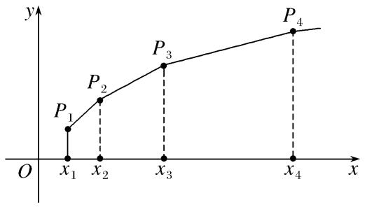

**专题14　错位相减法求和**

【**基本知识**】

错位相减法求和

1．错位相减法：错位相减法是在推导等比数列的前<em>n</em>项和公式时所用的方法，适用于各项由一个等差数列和一个等比数列对应项的乘积组成的数列．把<em>Sn</em>＝<em>a</em>1＋<em>a</em>2＋…＋<em>an</em>两边同乘以相应等比数列的公比<em>q</em>，得到<em>qSn</em>＝<em>a</em>1<em>q</em>＋<em>a</em>2<em>q</em>＋…＋<em>anq</em>，两式错位相减即可求出<em>Sn</em>．

用错位相减法求和时，应注意：

(1)要善于识别题目类型，特别是等比数列公比为负数的情形．

(2)在写出“<em>Sn</em>”与“<em>qSn</em>”的表达式时应特别注意将两式“错项对齐”，以便于下一步准确地写出“<em>Sn</em>－<em>qSn</em>”的表达式．

(3)在应用错位相减法时，注意观察未合并项的正负号；结论中形如<em>an</em>，<em>an</em>＋1的式子应进行合并．

如：已知<em>un</em>＝<em>an</em>＋<em>an</em>－1<em>b</em>＋<em>an</em>－2<em>b</em>2＋…＋<em>abn</em>－1＋<em>bn</em>(<em>a</em>&gt;0，<em>b</em>&gt;0，<em>n</em>∈<strong>N</strong>\*)．

(1)当<em>a</em>＝2，<em>b</em>＝3时，求<em>un</em>；

(2)若<em>a</em>＝<em>b</em>，求数列{<em>un</em>}的前<em>n</em>项和<em>Sn</em>．

解析　(1)当<em>a</em>＝2，<em>b</em>＝3时，<em>un</em>＝2<em>n</em>＋2<em>n</em>－1·3＋2<em>n</em>－2·32＋…＋2·3<em>n</em>－1＋3<em>n</em>(<em>n</em>∈<strong>N</strong>\*)，

两边除以2<em>n</em>，得＝1＋＋2＋…＋<em>n</em>－1＋<em>n</em>＝＝＝－2，

所以<em>un</em>＝3<em>n</em>＋1－2<em>n</em>＋1．

(2)若<em>a</em>＝<em>b</em>，则<em>un</em>＝(<em>n</em>＋1)<em>an</em>，所以<em>Sn</em>＝2<em>a</em>＋3<em>a</em>2＋4<em>a</em>3＋…＋(<em>n</em>＋1)<em>an</em>，①

当<em>a</em>＝1时，<em>Sn</em>＝2＋3＋…＋(<em>n</em>＋1)＝；

当<em>a</em>&gt;0，<em>a</em>≠1时，在①的两边同乘以<em>a</em>，得<em>aSn</em>＝2<em>a</em>2＋3<em>a</em>3＋4<em>a</em>4＋…＋(<em>n</em>＋1)<em>an</em>＋1，

与①式作差，得(1－<em>a</em>)<em>Sn</em>＝2<em>a</em>＋<em>a</em>2＋<em>a</em>3＋…＋<em>an</em>－(<em>n</em>＋1)<em>an</em>＋1＝<em>a</em>＋－(<em>n</em>＋1)<em>an</em>＋1，

所以<em>Sn</em>＝＋－．

综上，<em>Sn</em>＝

**【基本题型】**

**1．等差(比)数列＋错位相减法型**

<strong>[例1]</strong>　已知等差数列{<em>an</em>}的前<em>n</em>项和为<em>Sn</em>，<em>a</em>1＝2，且＝＋5．

(1)求<em>an</em>；

(2)若<em>bn</em>＝<em>an</em>·4求数列{<em>bn</em>}的前<em>n</em>项的和<em>Tn</em>．

解析　(1)设等差数列{<em>an</em>}的公差为<em>d</em>，因为＝＋5，所以－＝5，

所以<em>a</em>10－<em>a</em>5＝10，所以5<em>d</em>＝10，解得<em>d</em>＝2．所以<em>an</em>＝<em>a</em>1＋(<em>n</em>－1)<em>d</em>＝2＋(<em>n</em>－1)×2＝2<em>n</em>；

(2)由(1)知，<em>an</em>＝2<em>n</em>，所以<em>Sn</em>＝＝<em>n</em>2＋<em>n</em>．所以<em>bn</em>＝<em>an</em>·4＝2<em>n</em>·4＝2<em>n</em>·2<em>n</em>＋1＝<em>n</em>·2<em>n</em>＋2，

所以<em>Tn</em>＝1×23＋2×24＋2×25＋…＋<em>n</em>·2<em>n</em>＋2①，

所以2<em>Tn</em>＝1×24＋2×25＋3×26＋…＋(<em>n</em>－1)·2<em>n</em>＋2＋<em>n</em>·2<em>n</em>＋3②，

①－②，得－<em>Tn</em>＝23＋24＋…＋2<em>n</em>＋2－<em>n</em>×2<em>n</em>＋3＝－<em>n</em>×2<em>n</em>＋3＝2<em>n</em>＋3－8－<em>n</em>×2<em>n</em>＋3

所以<em>Tn</em>＝(<em>n</em>－1)×2<em>n</em>＋3＋8．

<strong>[例2]</strong>　已知各项均为正数的等比数列{<em>an</em>}，满足<em>a</em>1＝1，且－＝．

(1)求等比数列{<em>an</em>}的通项公式；

(2)若数列{<em>bn</em>}满足<em>bn</em>＝log2<em>an</em>＋1，求数列的前<em>n</em>项和<em>Tn</em>．

解析　(1)由已知－＝得：－＝，又<em>a</em>1＝1，∴<em>q</em>＝2或<em>q</em>＝－1(舍去)，∴<em>an</em>＝2<em>n</em>－1．

(2)<em>bn</em>＝log22<em>n</em>＝<em>n</em>，＝

<em>Tn</em>＝＋＋＋…＋，<em>Tn</em>＝＋＋＋…＋

两式相减得：<em>Tn</em>＝＋＋＋…＋－＝－＝2－

∴<em>Tn</em>＝4－．

<strong>[例3]</strong>　已知等比数列{<em>an</em>}的前<em>n</em>项和<em>Sn</em>满足4<em>S</em>5＝3<em>S</em>4＋<em>S</em>6，且<em>a</em>3＝9．

(1)求数列{<em>an</em>}的通项公式<em>an</em>；

(2)设<em>bn</em>＝(2<em>n</em>－1)·<em>an</em>，求数列{<em>bn</em>}的前<em>n</em>项和<em>Tn</em>．

解析　(1)设数列{<em>an</em>}的公比为<em>q</em>，由4<em>S</em>5＝3<em>S</em>4＋<em>S</em>6，得<em>S</em>6－<em>S</em>5＝3<em>S</em>5－3<em>S</em>4，即<em>a</em>6＝3<em>a</em>5，∴<em>q</em>＝3，

∴<em>an</em>＝9·3<em>n</em>－3＝3<em>n</em>－1．

(2)<em>bn</em>＝(2<em>n</em>－1)·<em>an</em>＝(2<em>n</em>－1)·3<em>n</em>－1，

∴<em>Tn</em>＝1·30＋3·31＋5·32＋…＋(2<em>n</em>－1)·3<em>n</em>－1，

∴3<em>Tn</em>＝1·31＋3·32＋…＋(2<em>n</em>－3)·3<em>n</em>－1＋(2<em>n</em>－1)·3<em>n</em>，

∴－2<em>Tn</em>＝1＋2·31＋2·32＋…＋2·3<em>n</em>－1－(2<em>n</em>－1)·3<em>n</em>＝－2＋(2－2<em>n</em>)·3<em>n</em>，

∴<em>Tn</em>＝1－＝(<em>n</em>－1)·3<em>n</em>＋1．

<strong>[例4]</strong>　已知等差数列{<em>an</em>}满足：<em>an</em>＋1&gt;<em>an</em>(<em>n</em>∈<strong>N</strong>\*)，<em>a</em>1＝1，该数列的前三项分别加上1，1，3后成等比数列，<em>an</em>＋2log2<em>bn</em>＝－1．

(1)分别求数列{<em>an</em>}，{<em>bn</em>}的通项公式；

(2)求数列{<em>an</em>·<em>bn</em>}的前<em>n</em>项和<em>Tn</em>．

解析　(1)设等差数列{<em>an</em>}的公差为<em>d</em>，则<em>d</em>&gt;0，

由<em>a</em>1＝1，<em>a</em>2＝1＋<em>d</em>，<em>a</em>3＝1＋2<em>d</em>分别加上1，1，3后成等比数列，得(2＋<em>d</em>)2＝2(4＋2<em>d</em>)，

解得<em>d</em>＝2(舍负)，所以<em>an</em>＝1＋(<em>n</em>－1)×2＝2<em>n</em>－1．

又因为<em>an</em>＋2log2<em>bn</em>＝－1，所以log2<em>bn</em>＝－<em>n</em>，则<em>bn</em>＝．

(2)由(1)知<em>an</em>·<em>bn</em>＝(2<em>n</em>－1)·，

则<em>Tn</em>＝＋＋＋…＋，①，<em>Tn</em>＝＋＋＋…＋，②

由①－②，得<em>Tn</em>＝＋2×－．

∴<em>Tn</em>＝＋2×－，∴<em>Tn</em>＝1＋2－－＝3－＝3－．

<strong>[例5]</strong>　(2020·全国Ⅰ)设{<em>an</em>}是公比不为1的等比数列，<em>a</em>1为<em>a</em>2，<em>a</em>3的等差中项．

(1)求{<em>an</em>}的公比；

(2)若<em>a</em>1＝1，求数列{<em>nan</em>}的前<em>n</em>项和．

解析　(1)设{<em>an</em>}的公比为<em>q</em>，∵<em>a</em>1为<em>a</em>2，<em>a</em>3的等差中项，

∴2<em>a</em>1＝<em>a</em>2＋<em>a</em>3＝<em>a</em>1<em>q</em>＋<em>a</em>1<em>q</em>2，<em>a</em>1≠0，∴<em>q</em>2＋<em>q</em>－2＝0，∵<em>q</em>≠1，∴<em>q</em>＝－2．

(2)设{<em>nan</em>}的前<em>n</em>项和为<em>Sn</em>，<em>a</em>1＝1，<em>an</em>＝(－2)<em>n</em>－1，

<em>Sn</em>＝1×1＋2×(－2)＋3×(－2)2＋…＋<em>n</em>(－2)<em>n</em>－1，①

－2<em>Sn</em>＝1×(－2)＋2×(－2)2＋3×(－2)3＋…＋(<em>n</em>－1)·(－2)<em>n</em>－1＋<em>n</em>(－2)<em>n</em>，②

①－②得，3<em>Sn</em>＝1＋(－2)＋(－2)2＋…＋(－2)<em>n</em>－1－<em>n</em>(－2)<em>n</em>＝－<em>n</em>(－2)<em>n</em>＝，

∴<em>Sn</em>＝，<em>n</em>∈<strong>N</strong>\*．

<strong>[例6]</strong>　(2017·天津)已知{<em>an</em>}为等差数列，前<em>n</em>项和为<em>Sn</em>(<em>n</em>∈<strong>N</strong>\*)，{<em>bn</em>}是首项为2的等比数列，且公比大于0，<em>b</em>2＋<em>b</em>3＝12，<em>b</em>3＝<em>a</em>4－2<em>a</em>1，<em>S</em>11＝11<em>b</em>4．

(1)求{<em>an</em>}和{<em>bn</em>}的通项公式；

(2)求数列{<em>a</em>2<em>nb</em>2<em>n</em>－1}的前<em>n</em>项和(<em>n</em>∈<strong>N</strong>\*)．

解析　(1)设等差数列{<em>an</em>}的公差为<em>d</em>，等比数列{<em>bn</em>}的公比为<em>q</em>．

由已知<em>b</em>2＋<em>b</em>3＝12，得<em>b</em>1(<em>q</em>＋<em>q</em>2)＝12，而<em>b</em>1＝2，所以<em>q</em>2＋<em>q</em>－6＝0．

又因为<em>q</em>&gt;0，解得<em>q</em>＝2，所以<em>bn</em>＝2<em>n</em>．由<em>b</em>3＝<em>a</em>4－2<em>a</em>1，可得3<em>d</em>－<em>a</em>1＝8，①

由<em>S</em>11＝11<em>b</em>4，可得<em>a</em>1＋5<em>d</em>＝16，②

联立①②，解得<em>a</em>1＝1，<em>d</em>＝3，由此可得<em>an</em>＝3<em>n</em>－2(<em>n</em>∈<strong>N</strong>\*)．

所以数列{<em>an</em>}的通项公式为<em>an</em>＝3<em>n</em>－2(<em>n</em>∈<strong>N</strong>\*)，数列{<em>bn</em>}的通项公式为<em>bn</em>＝2<em>n</em>(<em>n</em>∈<strong>N</strong>\*)．

(2)设数列{<em>a</em>2<em>nb</em>2<em>n</em>－1}的前<em>n</em>项和为<em>Tn</em>，由<em>a</em>2<em>n</em>＝6<em>n</em>－2，<em>b</em>2<em>n</em>－1＝2×4<em>n</em>－1，得<em>a</em>2<em>nb</em>2<em>n</em>－1＝(3<em>n</em>－1)×4<em>n</em>，

故<em>Tn</em>＝2×4＋5×42＋8×43＋…＋(3<em>n</em>－1)×4<em>n</em>，③

4<em>Tn</em>＝2×42＋5×43＋8×44＋…＋(3<em>n</em>－4)×4<em>n</em>＋(3<em>n</em>－1)×4<em>n</em>＋1，④

③－④，得－3<em>Tn</em>＝2×4＋3×42＋3×43＋…＋3×4<em>n</em>－(3<em>n</em>－1)×4<em>n</em>＋1

＝－4－(3<em>n</em>－1)×4<em>n</em>＋1＝－(3<em>n</em>－2)×4<em>n</em>＋1－8，

得<em>Tn</em>＝×4<em>n</em>＋1＋(<em>n</em>∈<strong>N</strong>\*)．

所以数列{<em>a</em>2<em>nb</em>2<em>n</em>－1}的前<em>n</em>项和为×4<em>n</em>＋1＋(<em>n</em>∈<strong>N</strong>\*)．

<strong>[例7]</strong>　(2017·山东)已知{<em>xn</em>}是各项均为正数的等比数列，且<em>x</em>1＋<em>x</em>2＝3，<em>x</em>3－<em>x</em>2＝2．

(1)求数列{<em>xn</em>}的通项公式；

(2)如图，在平面直角坐标系<em>xOy</em>中，依次连接点<em>P</em>1(<em>x</em>1，1)，<em>P</em>2(<em>x</em>2，2)，…，<em>Pn</em>＋1(<em>xn</em>＋1，<em>n</em>＋1)得到折线<em>P</em>1<em>P</em>2…<em>Pn</em>＋1，求由该折线与直线<em>y</em>＝0，<em>x</em>＝<em>x</em>1，<em>x</em>＝<em>xn</em>＋1所围成的区域的面积<em>Tn</em>．

解析　(1)设数列{<em>xn</em>}的公比为<em>q</em>．由题意得所以3<em>q</em>2－5<em>q</em>－2＝0，

由已知得<em>q</em>&gt;0，所以<em>q</em>＝2，<em>x</em>1＝1．因此数列{<em>xn</em>}的通项公式为<em>xn</em>＝2<em>n</em>－1(<em>n</em>∈<strong>N</strong>\*)．

(2)过<em>P</em>1，<em>P</em>2，…，<em>Pn</em>＋1向<em>x</em>轴作垂线，垂足分别为<em>Q</em>1，<em>Q</em>2，…，<em>Qn</em>＋1．

由(1)得<em>xn</em>＋1－<em>xn</em>＝2<em>n</em>－2<em>n</em>－1＝2<em>n</em>－1，记梯形<em>PnPn</em>＋1<em>Qn</em>＋1<em>Qn</em>的面积为<em>bn</em>，

由题意得<em>bn</em>＝×2<em>n</em>－1＝(2<em>n</em>＋1)×2<em>n</em>－2，

所以<em>Tn</em>＝<em>b</em>1＋<em>b</em>2＋…＋<em>bn</em>＝3×2－1＋5×20＋7×21＋…＋(2<em>n</em>－1)×2<em>n</em>－3＋(2<em>n</em>＋1)×2<em>n</em>－2．①

又2<em>Tn</em>＝3×20＋5×21＋7×22＋…＋(2<em>n</em>－1)×2<em>n</em>－2＋(2<em>n</em>＋1)×2<em>n</em>－1，②

①－②得－<em>Tn</em>＝3×2－1＋(2＋22＋…＋2<em>n</em>－1)－(2<em>n</em>＋1)×2<em>n</em>－1＝＋－(2<em>n</em>＋1)×2<em>n</em>－1．

所以<em>Tn</em>＝(<em>n</em>∈<strong>N</strong>\*)．

【**对点精练**】

1．(2017·山东)已知{<em>an</em>}是各项均为正数的等比数列，且<em>a</em>1＋<em>a</em>2＝6，<em>a</em>1<em>a</em>2＝<em>a</em>3．

(1)求数列{<em>an</em>}的通项公式；

(2){<em>bn</em>}为各项非零的等差数列，其前<em>n</em>项和为<em>Sn</em>．已知<em>S</em>2<em>n</em>＋1＝<em>bnbn</em>＋1，求数列的前<em>n</em>项和<em>Tn</em>．

1．解析　(1)设{<em>an</em>}的公比为<em>q</em>，由题意知<em>a</em>1(1＋<em>q</em>)＝6，<em>aq</em>＝<em>a</em>1<em>q</em>2，

又<em>an</em>&gt;0，由以上两式联立方程组解得<em>a</em>1＝2，<em>q</em>＝2，所以<em>an</em>＝2<em>n</em>．

(2)由题意知<em>S</em>2<em>n</em>＋1＝＝(2<em>n</em>＋1)<em>bn</em>＋1，

又<em>S</em>2<em>n</em>＋1＝<em>bnbn</em>＋1，<em>bn</em>＋1≠0，所以<em>bn</em>＝2<em>n</em>＋1．

令<em>cn</em>＝，则<em>cn</em>＝．

因此<em>Tn</em>＝<em>c</em>1＋<em>c</em>2＋…＋<em>cn</em>＝＋＋＋…＋＋，

又<em>Tn</em>＝＋＋＋…＋＋，

两式相减得<em>Tn</em>＝＋(＋＋…＋)－＝＋－＝－，

所以<em>Tn</em>＝5－．

2．已知等比数列{<em>an</em>}中，<em>a</em>1＋<em>a</em>2＝8，<em>a</em>2＋<em>a</em>3＝24，<em>Sn</em>为数列{<em>an</em>}的前<em>n</em>项和．

(1)求数列{<em>an</em>}的通项公式；

(2)若<em>bn</em>＝<em>an</em>·log3(<em>Sn</em>＋1)，求数列{<em>bn</em>}的前<em>n</em>项和<em>Tn</em>．

2．解析　(1)设等比数列{<em>an</em>}的公比为<em>q</em>，则<em>q</em>＝＝＝3．

故<em>a</em>1＋<em>a</em>2＝<em>a</em>1＋3<em>a</em>1＝8，解得<em>a</em>1＝2．所以<em>an</em>＝<em>a</em>1<em>qn</em>－1＝2×3<em>n</em>－1．

(2)由(1)知<em>Sn</em>＝3<em>n</em>－1，所以<em>bn</em>＝<em>an</em>·log3(<em>Sn</em>＋1)＝2×3<em>n</em>－1×log33<em>n</em>＝2<em>n</em>×3<em>n</em>－1，

所以<em>Tn</em>＝<em>b</em>1＋<em>b</em>2＋<em>b</em>3＋…＋<em>bn</em>＝2×30＋4×31＋6×32＋…＋2(<em>n</em>－1)×3<em>n</em>－2＋2<em>n</em>×3<em>n</em>－1，①

3<em>Tn</em>＝2×31＋4×32＋6×33＋…＋2(<em>n</em>－1)×3<em>n</em>－1＋2<em>n</em>×3<em>n</em>，②

①－②得－2<em>Tn</em>＝2×30＋2×31＋2×32＋2×33＋…＋2×3<em>n</em>－1－2<em>n</em>×3<em>n</em>＝3<em>n</em>(1－2<em>n</em>)－1．

所以<em>Tn</em>＝．

3．已知正项等比数列{<em>an</em>}的前<em>n</em>项和<em>Sn</em>满足：<em>Sn</em>＋2＝<em>Sn</em>＋．

(1)求数列{<em>an</em>}的首项<em>a</em>1和公比<em>q</em>；

(2)若<em>bn</em>＝<em>nan</em>，求数列{<em>bn</em>}的前<em>n</em>项和<em>Tn</em>．

3．解析　(1)因为<em>Sn</em>＋2＝<em>Sn</em>＋，所以<em>S</em>3＝<em>S</em>1＋，<em>S</em>4＝<em>S</em>2＋，两式相减得：<em>a</em>4＝<em>a</em>2，

所以<em>q</em>2＝，又<em>q</em>&gt;0，则<em>q</em>＝．又由<em>S</em>3＝<em>S</em>1＋，可知：<em>a</em>1＋<em>a</em>2＋<em>a</em>3＝<em>a</em>1＋，

所以<em>a</em>1＝<em>a</em>1＋，所以<em>a</em>1＝1．

(2)由(1)知<em>an</em>＝<em>n</em>－1，所以<em>bn</em>＝，

所以<em>Tn</em>＝1＋＋＋…＋，<em>Tn</em>＝＋＋…＋＋．

两式相减得<em>Tn</em>＝1＋＋…＋－＝2－－．所以<em>Tn</em>＝4－．

4．已知各项均为正数的等差数列{<em>an</em>}中，<em>a</em>1＋<em>a</em>2＋<em>a</em>3＝15，且<em>a</em>1＋2，<em>a</em>2＋5，<em>a</em>3＋13构成等比数列{<em>bn</em>}的

前三项．

(1)求数列{<em>an</em>}，{<em>bn</em>}的通项公式；

(2)求数列{<em>anbn</em>}的前<em>n</em>项和<em>Tn</em>．

4．解析　(1)设等差数列的公差为<em>d</em>，则由已知得，<em>a</em>1＋<em>a</em>2＋<em>a</em>3＝3<em>a</em>2＝15，即<em>a</em>2＝5，

又(5－<em>d</em>＋2)(5＋<em>d</em>＋13)＝100，解得<em>d</em>＝2或<em>d</em>＝－13(舍去)，<em>a</em>1＝<em>a</em>2－<em>d</em>＝3，

∴<em>an</em>＝<em>a</em>1＋(<em>n</em>－1)×<em>d</em>＝2<em>n</em>＋1，又<em>b</em>1＝<em>a</em>1＋2＝5，<em>b</em>2＝<em>a</em>2＋5＝10，∴<em>q</em>＝2，∴<em>bn</em>＝5·2<em>n</em>－1．

(2)由(1)知<em>anbn</em>＝(2<em>n</em>＋1)·5·2<em>n</em>－1＝5·(2<em>n</em>＋1)·2<em>n</em>－1，

∵<em>Tn</em>＝5[3＋5×2＋7×22＋…＋(2<em>n</em>＋1)×2<em>n</em>－1]，

2<em>Tn</em>＝5[3×2＋5×22＋7×23＋…＋(2<em>n</em>＋1)×2<em>n</em>]，

两式相减得－<em>Tn</em>＝5[3＋2×2＋2×22＋…＋2×2<em>n</em>－1－(2<em>n</em>＋1)×2<em>n</em>]＝5[(1－2<em>n</em>)2<em>n</em>－1]，

则<em>Tn</em>＝5[(2<em>n</em>－1)2<em>n</em>＋1]．

5．已知等比数列{<em>an</em>}的公比<em>q</em>&gt;1，<em>a</em>1＝1，且2<em>a</em>2，<em>a</em>4，3<em>a</em>3成等差数列．

(1)求数列{<em>an</em>}的通项公式；

(2)记<em>bn</em>＝2<em>nan</em>，求数列{<em>bn</em>}的前<em>n</em>项和<em>Tn</em>．

5．解析　(1)由2<em>a</em>2，<em>a</em>4，3<em>a</em>3成等差数列可得2<em>a</em>4＝2<em>a</em>2＋3<em>a</em>3，即2<em>a</em>1<em>q</em>3＝2<em>a</em>1<em>q</em>＋3<em>a</em>1<em>q</em>2，

又<em>q</em>&gt;1，<em>a</em>1＝1，故2<em>q</em>2＝2＋3<em>q</em>，即2<em>q</em>2－3<em>q</em>－2＝0，得<em>q</em>＝2，

因此数列{<em>an</em>}的通项公式为<em>an</em>＝2<em>n</em>－1．

(2)<em>bn</em>＝2<em>n</em>×2<em>n</em>－1＝<em>n</em>×2<em>n</em>，

<em>Tn</em>＝1×2＋2×22＋3×23＋…＋<em>n</em>×2<em>n</em>，①．2<em>Tn</em>＝1×22＋2×23＋3×24＋…＋<em>n</em>×2<em>n</em>＋1，②

①－②得－<em>Tn</em>＝2＋22＋23＋…＋2<em>n</em>－<em>n</em>×2<em>n</em>＋1，－<em>Tn</em>＝－<em>n</em>×2<em>n</em>＋1，

<em>Tn</em>＝(<em>n</em>－1)×2<em>n</em>＋1＋2．

6．已知数列{<em>an</em>}是等比数列，<em>a</em>2＝4，<em>a</em>3＋2是<em>a</em>2和<em>a</em>4的等差中项．

(1)求数列{<em>an</em>}的通项公式；

(2)设<em>bn</em>＝2log2<em>an</em>－1，求数列{<em>anbn</em>}的前<em>n</em>项和<em>Tn</em>．

6．解析　(1)设数列{<em>an</em>}的公比为<em>q</em>，因为<em>a</em>2＝4，所以<em>a</em>3＝4<em>q</em>，<em>a</em>4＝4<em>q</em>2．

因为<em>a</em>3＋2是<em>a</em>2和<em>a</em>4的等差中项，所以2(<em>a</em>3＋2)＝<em>a</em>2＋<em>a</em>4．

即2(4<em>q</em>＋2)＝4＋4<em>q</em>2，化简得<em>q</em>2－2<em>q</em>＝0．因为公比<em>q</em>≠0，所以<em>q</em>＝2．

所以<em>an</em>＝<em>a</em>2<em>qn</em>－2＝4×2<em>n</em>－2＝2<em>n</em>(<em>n</em>∈<strong>N</strong>\*)．

(2)因为<em>an</em>＝2<em>n</em>，所以<em>bn</em>＝2log2<em>an</em>－1＝2<em>n</em>－1，所以<em>anbn</em>＝(2<em>n</em>－1)2<em>n</em>，

则<em>Tn</em>＝1×2＋3×22＋5×23＋…＋(2<em>n</em>－3)2<em>n</em>－1＋(2<em>n</em>－1)2<em>n</em>，①

2<em>Tn</em>＝1×22＋3×23＋5×24＋…＋(2<em>n</em>－3)2<em>n</em>＋(2<em>n</em>－1)2<em>n</em>＋1．②

由①－②得，－<em>Tn</em>＝2＋2×22＋2×23＋…＋2×2<em>n</em>－(2<em>n</em>－1)2<em>n</em>＋1

＝2＋2×－(2<em>n</em>－1)2<em>n</em>＋1＝－6－(2<em>n</em>－3)2<em>n</em>＋1，

所以<em>Tn</em>＝6＋(2<em>n</em>－3)2<em>n</em>＋1．

7．已知{<em>an</em>}为等差数列，前<em>n</em>项和为<em>Sn</em>(<em>n</em>∈<strong>N</strong>\*)，{<em>bn</em>}是首项为2的等比数列，且公比大于0，<em>b</em>2＋<em>b</em>3＝12，

<em>b</em>3＝<em>a</em>4－2<em>a</em>1，<em>S</em>11＝11<em>b</em>4．

(1)求{<em>an</em>}和{<em>bn</em>}的通项公式；

(2)求数列{<em>a</em>2<em>nbn</em>}的前<em>n</em>项和(<em>n</em>∈<strong>N</strong>\*)．

7．解析　(1)设等差数列{<em>an</em>}的公差为<em>d</em>，等比数列{<em>bn</em>}的公比为<em>q</em>．

由已知<em>b</em>2＋<em>b</em>3＝12，得<em>b</em>1(<em>q</em>＋<em>q</em>2)＝12，

而<em>b</em>1＝2，所以<em>q</em>2＋<em>q</em>－6＝0．

因为<em>q</em>&gt;0，解得<em>q</em>＝2，所以<em>bn</em>＝2<em>n</em>．

由<em>b</em>3＝<em>a</em>4－2<em>a</em>1，可得3<em>d</em>－<em>a</em>1＝8．　①

由<em>S</em>11＝11<em>b</em>4，可得<em>a</em>1＋5<em>d</em>＝16．　②

联立①②，解得<em>a</em>1＝1，<em>d</em>＝3，

由此可得<em>an</em>＝3<em>n</em>－2．

所以{<em>an</em>}的通项公式为<em>an</em>＝3<em>n</em>－2，{<em>bn</em>}的通项公式为<em>bn</em>＝2<em>n</em>．

(2)设数列{<em>a</em>2<em>nbn</em>}的前<em>n</em>项和为<em>Tn</em>，由<em>a</em>2<em>n</em>＝6<em>n</em>－2，有

<em>Tn</em>＝4×2＋10×22＋16×23＋…＋(6<em>n</em>－2)×2<em>n</em>，

2<em>Tn</em>＝4×22＋10×23＋16×24＋…＋(6<em>n</em>－8)×2<em>n</em>＋(6<em>n</em>－2)×2<em>n</em>＋1，

上述两式相减，得

－<em>Tn</em>＝4×2＋6×22＋6×23＋…＋6×2<em>n</em>－(6<em>n</em>－2)×2<em>n</em>＋1＝－4－(6<em>n</em>－2)×2<em>n</em>＋1

＝－(3<em>n</em>－4)2<em>n</em>＋2－16，

得<em>Tn</em>＝(3<em>n</em>－4)2<em>n</em>＋2＋16．所以数列{<em>a</em>2<em>nbn</em>}的前<em>n</em>项和为(3<em>n</em>－4)2<em>n</em>＋2＋16．

<strong>2．</strong><em><strong>f</strong></em><strong>(</strong><em><strong>Sn</strong></em>，<em><strong>an</strong></em>)<strong>＝1＋错位相减法型</strong>

<strong>[例8]</strong>　已知数列{<em>an</em>}的前<em>n</em>项和为<em>Sn</em>，<em>a</em>1＝1，当<em>n</em>≥2时，2<em>Sn</em>＝(<em>n</em>＋1)<em>an</em>－2．

(1)求<em>a</em>2，<em>a</em>3和通项<em>an</em>；

(2)设数列{<em>bn</em>}满足<em>bn</em>＝<em>an</em>·2<em>n</em>－1，求{<em>bn</em>}的前<em>n</em>项和<em>Tn</em>．

解析　(1)当<em>n</em>＝2时，2<em>S</em>2＝2(1＋<em>a</em>2)＝3<em>a</em>2－2，则<em>a</em>2＝4，

当<em>n</em>＝3时，2<em>S</em>3＝2(1＋4＋<em>a</em>3)＝4<em>a</em>3－2，则<em>a</em>3＝6，

当<em>n</em>≥2时，2<em>Sn</em>＝(<em>n</em>＋1)<em>an</em>－2，

当<em>n</em>≥3时，2<em>Sn</em>－1＝<em>nan</em>－1－2，

所以当<em>n</em>≥3时，2(<em>Sn</em>－<em>Sn</em>－1)＝(<em>n</em>＋1)<em>an</em>－<em>nan</em>－1＝2<em>an</em>，即2<em>an</em>＝(<em>n</em>＋1)<em>an</em>－<em>nan</em>－1，

整理可得(<em>n</em>－1)<em>an</em>＝<em>nan</em>－1，所以＝，因为＝＝2，所以＝＝…＝＝＝2，

因此，当<em>n</em>≥2时，<em>an</em>＝2<em>n</em>，而<em>a</em>1＝1，故<em>an</em>＝

(2)由(1)可知<em>bn</em>＝所以当<em>n</em>＝1时，<em>T</em>1＝<em>b</em>1＝1，

当<em>n</em>≥2时，<em>Tn</em>＝<em>b</em>1＋<em>b</em>2＋<em>b</em>3＋…＋<em>bn</em>，则

<em>Tn</em>＝1＋2×22＋3×23＋…＋(<em>n</em>－1)×2<em>n</em>－1＋<em>n</em>×2<em>n</em>，

2<em>Tn</em>＝2＋2×23＋3×24＋…＋(<em>n</em>－1)×2<em>n</em>＋<em>n</em>×2<em>n</em>＋1，

作差得<em>Tn</em>＝1－8－(23＋24＋…＋2<em>n</em>)＋<em>n</em>×2<em>n</em>＋1＝(<em>n</em>－1)×2<em>n</em>＋1＋1，

易知当*n*＝1时，也满足上式，

故<em>Tn</em>＝(<em>n</em>－1)×2<em>n</em>＋1＋1(<em>n</em>∈<strong>N</strong>\*)．

<strong>[例9]</strong>　已知数列{<em>an</em>}的前<em>n</em>项和为<em>Sn</em>，且满足<em>Sn</em>－<em>n</em>＝2(<em>an</em>－2)(<em>n</em>∈<strong>N</strong>\*)．

(1)证明：数列{<em>an</em>－1}为等比数列；

(2)若<em>bn</em>＝<em>an</em>·log2(<em>an</em>－1)，数列{<em>bn</em>}的前<em>n</em>项和为<em>Tn</em>，求<em>Tn</em>．

解析　(1)∵<em>Sn</em>－<em>n</em>＝2(<em>an</em>－2)，当<em>n</em>≥2时，<em>Sn</em>－1－(<em>n</em>－1)＝2(<em>an</em>－1－2)，

两式相减，得<em>an</em>－1＝2<em>an</em>－2<em>an</em>－1，∴<em>an</em>＝2<em>an</em>－1－1，∴<em>an</em>－1＝2(<em>an</em>－1－1)，

∴＝2(<em>n</em>≥2)(常数)．又当<em>n</em>＝1时，<em>a</em>1－1＝2(<em>a</em>1－2)，得<em>a</em>1＝3，<em>a</em>1－1＝2，

∴数列{<em>an</em>－1}是以2为首项，2为公比的等比数列．

(2)由(1)知，<em>an</em>－1＝2×2<em>n</em>－1＝2<em>n</em>，∴<em>an</em>＝2<em>n</em>＋1，

又<em>bn</em>＝<em>an</em>·log2(<em>an</em>－1)，∴<em>bn</em>＝<em>n</em>(2<em>n</em>＋1)，

∴<em>Tn</em>＝<em>b</em>1＋<em>b</em>2＋<em>b</em>3＋…＋<em>bn</em>＝(1×2＋2×22＋3×23＋…＋<em>n</em>×2<em>n</em>)＋(1＋2＋3＋…＋<em>n</em>)，

设<em>An</em>＝1×2＋2×22＋3×23＋…＋(<em>n</em>－1)×2<em>n</em>－1＋<em>n</em>×2<em>n</em>，

则2<em>An</em>＝1×22＋2×23＋…＋(<em>n</em>－1)×2<em>n</em>＋<em>n</em>×2<em>n</em>＋1，

两式相减，得－<em>An</em>＝2＋22＋23＋…＋2<em>n</em>－<em>n</em>×2<em>n</em>＋1＝－<em>n</em>×2<em>n</em>＋1，

∴<em>An</em>＝(<em>n</em>－1)×2<em>n</em>＋1＋2．又1＋2＋3＋…＋<em>n</em>＝，

∴<em>Tn</em>＝(<em>n</em>－1)×2<em>n</em>＋1＋2＋(<em>n</em>∈<strong>N</strong>\*)．

<strong>[例10]</strong>　已知数列{<em>an</em>}的前<em>n</em>项和是<em>Sn</em>，且<em>Sn</em>＋<em>an</em>＝1(<em>n</em>∈<strong>N</strong>\*)．数列{<em>bn</em>}是公差<em>d</em>不等于0的等差数列，且满足：<em>b</em>1＝<em>a</em>1，<em>b</em>2，<em>b</em>5，<em>b</em>14成等比数列．

(1)求数列{<em>an</em>}，{<em>bn</em>}的通项公式；

(2)设<em>cn</em>＝<em>an</em>·<em>bn</em>，求数列{<em>cn</em>}的前<em>n</em>项和<em>Tn</em>．

解析　(1)<em>n</em>＝1时，<em>a</em>1＋<em>a</em>1＝1，<em>a</em>1＝，<em>n</em>≥2时，

<em>Sn</em>－<em>Sn</em>－1＝，∴<em>an</em>＝<em>an</em>－1(<em>n</em>≥2)，{<em>an</em>}是以为首项，为公比的等比数列，

<em>an</em>＝×<em>n</em>－1＝2<em>n</em>．

<em>b</em>1＝1，由<em>b</em>＝<em>b</em>2<em>b</em>14得，2＝，<em>d</em>2－2<em>d</em>＝0，因为<em>d</em>≠0，解得<em>d</em>＝2，

<em>bn</em>＝2<em>n</em>－1(<em>n</em>∈<strong>N</strong>\*)．

(2)<em>cn</em>＝，

<em>Tn</em>＝＋＋＋…＋，①

<em>Tn</em>＝＋＋＋…＋＋，②

①－②得，<em>Tn</em>＝＋4－＝＋4×－＝－－，

所以<em>Tn</em>＝2－(<em>n</em>∈<strong>N</strong>\*)．

【**对点精练**】

8．已知数列{<em>an</em>}的前<em>n</em>项和为<em>Sn</em>，<em>a</em>1＝5，<em>nSn</em>＋1－(<em>n</em>＋1)<em>Sn</em>＝<em>n</em>2＋<em>n</em>．

(1)求证：数列为等差数列；

(2)令<em>bn</em>＝2<em>nan</em>，求数列{<em>bn</em>}的前<em>n</em>项和<em>Tn</em>．

8．解析　(1)由<em>nSn</em>＋1－(<em>n</em>＋1)<em>Sn</em>＝<em>n</em>2＋<em>n</em>得－＝1，又＝5，

所以数列是首项为5，公差为1的等差数列．

(2)由(1)可知＝5＋(<em>n</em>－1)＝<em>n</em>＋4，所以<em>Sn</em>＝<em>n</em>2＋4<em>n</em>．

当<em>n</em>≥2时，<em>an</em>＝<em>Sn</em>－<em>Sn</em>－1＝<em>n</em>2＋4<em>n</em>－(<em>n</em>－1)2－4(<em>n</em>－1)＝2<em>n</em>＋3．

又<em>a</em>1＝5也符合上式，所以<em>an</em>＝2<em>n</em>＋3(<em>n</em>∈<strong>N</strong>\*)，所以<em>bn</em>＝(2<em>n</em>＋3)2<em>n</em>，

所以<em>Tn</em>＝5×2＋7×22＋9×23＋…＋(2<em>n</em>＋3)2<em>n</em>，①

2<em>Tn</em>＝5×22＋7×23＋9×24＋…＋(2<em>n</em>＋1)2<em>n</em>＋(2<em>n</em>＋3)2<em>n</em>＋1，②

所以②－①得<em>Tn</em>＝(2<em>n</em>＋3)2<em>n</em>＋1－10－(23＋24＋…＋2<em>n</em>＋1)＝(2<em>n</em>＋3)2<em>n</em>＋1－10－

＝(2<em>n</em>＋3)2<em>n</em>＋1－10－(2<em>n</em>＋2－8)＝(2<em>n</em>＋1)2<em>n</em>＋1－2．

9．已知数列{<em>an</em>}的前<em>n</em>项和为<em>Sn</em>，若<em>an</em>＝－3<em>Sn</em>＋4，<em>bn</em>＝－log2<em>an</em>＋1．

(1)求数列{<em>an</em>}的通项公式与数列{<em>bn</em>}的通项公式；

(2)令<em>cn</em>＝，其中<em>n</em>∈N\*，记数列{<em>cn</em>}的前<em>n</em>项和为<em>Tn</em>，求<em>Tn</em>＋的值．

9．解析　(1)由题意知<em>a</em>1＝1，∵<em>an</em>＝－3<em>Sn</em>＋4，∴<em>an</em>＋1＝－3<em>Sn</em>＋1＋4．

两式相减并化简得<em>an</em>＋1＝<em>an</em>，∴<em>an</em>＝．<em>bn</em>＝－log2<em>an</em>＋1＝－log2＝2<em>n</em>．

(2)由(1)知<em>cn</em>＝．则<em>Tn</em>＝＋＋＋…＋，①

<em>Tn</em>＝＋＋…＋＋，②

①－②得，<em>Tn</em>＝＋＋＋…＋－＝1－．

∴<em>Tn</em>＝2－．可得<em>Tn</em>＋＝2．

10．已知等差数列{<em>an</em>}中，<em>a</em>2＝2，<em>a</em>3＋<em>a</em>5＝8，数列{<em>bn</em>}中，<em>b</em>1＝2，其前<em>n</em>项和<em>Sn</em>满足：<em>bn</em>＋1＝<em>Sn</em>＋2(<em>n</em>∈<strong>N</strong>\*)．

(1)求数列{<em>an</em>}，{<em>bn</em>}的通项公式；

(2)设<em>cn</em>＝，求数列{<em>cn</em>}的前<em>n</em>项和<em>Tn</em>．

10．解析　(1)∵<em>a</em>2＝2，<em>a</em>3＋<em>a</em>5＝8，∴2＋<em>d</em>＋2＋3<em>d</em>＝8，∴<em>d</em>＝1，∴<em>an</em>＝<em>n</em>(<em>n</em>∈<strong>N</strong>\*)．

∵<em>bn</em>＋1＝<em>Sn</em>＋2(<em>n</em>∈<strong>N</strong>\*)，①

∴<em>bn</em>＝<em>Sn</em>－1＋2(<em>n</em>∈<strong>N</strong>\*，<em>n</em>≥2)．②

由①－②，得<em>bn</em>＋1－<em>bn</em>＝<em>Sn</em>－<em>Sn</em>－1＝<em>bn</em>(<em>n</em>∈<strong>N</strong>\*，<em>n</em>≥2)，

∴<em>bn</em>＋1＝2<em>bn</em>(<em>n</em>∈<strong>N</strong>\*，<em>n</em>≥2)．∵<em>b</em>1＝2，<em>b</em>2＝2<em>b</em>1，

∴{<em>bn</em>}是首项为2，公比为2的等比数列，∴<em>bn</em>＝2<em>n</em>(<em>n</em>∈<strong>N</strong>\*)．

(2)由<em>cn</em>＝＝，得<em>Tn</em>＝＋＋＋…＋＋，

<em>Tn</em>＝＋＋＋…＋＋，

两式相减，得<em>Tn</em>＝＋＋…＋－＝1－，

∴<em>Tn</em>＝2－(<em>n</em>∈<strong>N</strong>\*)．

<strong>3．</strong><em><strong>f</strong></em><strong>(</strong><em><strong>an</strong></em><strong>＋1</strong>，<em><strong>an</strong></em>)<strong>＝0＋错位相减法型</strong>

<strong>[例11]</strong>　已知首项为2的数列{<em>an</em>}的前<em>n</em>项和为<em>Sn</em>，且<em>Sn</em>＋1＝3<em>Sn</em>－2<em>Sn</em>－1(<em>n</em>≥2，<em>n</em>∈N\*)．

(1)求数列{<em>an</em>}的通项公式；

(2)设<em>bn</em>＝，求数列{<em>bn</em>}的前<em>n</em>项和<em>Tn</em>．

解析　(1)因为<em>Sn</em>＋1＝3<em>Sn</em>－2<em>Sn</em>－1(<em>n</em>≥2)，所以<em>Sn</em>＋1－<em>Sn</em>＝2<em>Sn</em>－2<em>Sn</em>－1(<em>n</em>≥2)，

即<em>an</em>＋1＝2<em>an</em>(<em>n</em>≥2)，所以<em>an</em>＋1＝2<em>n</em>＋1，则<em>an</em>＝2<em>n</em>，当<em>n</em>＝1时，也满足，

故数列{<em>an</em>}的通项公式为<em>an</em>＝2<em>n</em>．

(2)因为<em>bn</em>＝＝(<em>n</em>＋1)<em>n</em>，

所以<em>Tn</em>＝2×＋3×2＋4×3＋…＋(<em>n</em>＋1)×<em>n</em>，①

<em>Tn</em>＝2×2＋3×3＋4×4＋…＋<em>n</em>×<em>n</em>＋(<em>n</em>＋1)×<em>n</em>＋1，②

①－②得<em>Tn</em>＝2×＋2＋3＋…＋<em>n</em>－(<em>n</em>＋1)<em>n</em>＋1

＝＋1＋2＋3＋…＋<em>n</em>－(<em>n</em>＋1)<em>n</em>＋1＝＋－(<em>n</em>＋1)<em>n</em>＋1

＝＋1－<em>n</em>－(<em>n</em>＋1)<em>n</em>＋1＝－．

故数列{<em>bn</em>}的前<em>n</em>项和为<em>Tn</em>＝3－．

<strong>[例12]</strong>　已知数列{<em>an</em>}满足<em>a</em>1＝<em>a</em>3，<em>an</em>＋1－＝，设<em>bn</em>＝2<em>nan</em>(<em>n</em>∈<strong>N</strong>\*)．

(1)求数列{<em>bn</em>}的通项公式；

(2)求数列{<em>an</em>}的前<em>n</em>项和<em>Sn</em>．

解析　(1)由<em>bn</em>＝2<em>nan</em>，得<em>an</em>＝，代入<em>an</em>＋1－＝得－＝，即<em>bn</em>＋1－<em>bn</em>＝3，

所以数列{<em>bn</em>}是公差为3的等差数列，又<em>a</em>1＝<em>a</em>3，所以＝，即＝，所以<em>b</em>1＝2，

所以<em>bn</em>＝<em>b</em>1＋3(<em>n</em>－1)＝3<em>n</em>－1(<em>n</em>∈<strong>N</strong>\*)．

(2)由<em>bn</em>＝3<em>n</em>－1，得<em>an</em>＝＝，

所以<em>Sn</em>＝＋＋＋…＋，

<em>Sn</em>＝＋＋＋…＋，

两式相减得<em>Sn</em>＝1＋3－＝－，

所以<em>Sn</em>＝5－(<em>n</em>∈<strong>N</strong>\*)．

<strong>[例13]</strong>　已知数列{<em>an</em>}满足<em>a</em>1＝，<em>an</em>＋1＝．

(1)证明数列是等差数列，并求{<em>an</em>}的通项公式；

(2)若数列{<em>bn</em>}满足<em>bn</em>＝，求数列{<em>bn</em>}的前<em>n</em>项和<em>Sn</em>．

解析　(1)因为<em>an</em>＋1＝，所以－＝2，所以是等差数列，

所以＝＋2(<em>n</em>－1)＝2<em>n</em>，即<em>an</em>＝．

(2)因为<em>bn</em>＝＝，

所以<em>Sn</em>＝<em>b</em>1＋<em>b</em>2＋<em>b</em>3＋…＋<em>bn</em>＝1＋＋＋…＋，

则<em>Sn</em>＝＋＋＋…＋，

两式相减得<em>Sn</em>＝1＋＋＋＋…＋－＝2－，所以<em>Sn</em>＝4－．

<strong>[例14]</strong>　已知数列{<em>an</em>}的前<em>n</em>项和为<em>Sn</em>，且<em>a</em>1＝，<em>an</em>＋1＝<em>an</em>(<em>n</em>∈<strong>N</strong>\*)．

(1)证明：数列是等比数列；

(2)求数列{<em>an</em>}的通项公式与前<em>n</em>项和<em>Sn</em>．

解析　(1)∵<em>a</em>1＝，<em>an</em>＋1＝<em>an</em>，当<em>n</em>∈<strong>N</strong>\*时，≠0，又＝，∶＝(<em>n</em>∈<strong>N</strong>\*)为常数，

∴是以为首项，为公比的等比数列．

(2)由是以为首项，为公比的等比数列，得＝·<em>n</em>－1，∴<em>an</em>＝<em>n</em>·<em>n</em>．

∴<em>Sn</em>＝1·＋2·2＋3·3＋…＋<em>n</em>·<em>n</em>，

<em>Sn</em>＝1·2＋2·3＋…＋(<em>n</em>－1)<em>n</em>＋<em>n</em>·<em>n</em>＋1，

∴两式相减得<em>Sn</em>＝＋2＋3＋…＋<em>n</em>－<em>n</em>·<em>n</em>＋1＝－<em>n</em>·<em>n</em>＋1，

∴<em>Sn</em>＝2－<em>n</em>－1－<em>n</em>·<em>n</em>＝2－(<em>n</em>＋2)·<em>n</em>．

综上，<em>an</em>＝<em>n</em>·<em>n</em>，<em>Sn</em>＝2－(<em>n</em>＋2)·<em>n</em>．

<strong>[例15]</strong>　(2020·全国Ⅲ)设数列{<em>an</em>}满足<em>a</em>1＝3，<em>an</em>＋1＝3<em>an</em>－4<em>n</em>．

(1)计算<em>a</em>2，<em>a</em>3，猜想{<em>an</em>}的通项公式并加以证明；

(2)求数列{2<em>nan</em>}的前<em>n</em>项和<em>Sn</em>．

解析　(1)<em>a</em>2＝5，<em>a</em>3＝7．猜想<em>an</em>＝2<em>n</em>＋1．证明如下：

由已知可得<em>an</em>＋1－(2<em>n</em>＋3)＝3[<em>an</em>－(2<em>n</em>＋1)]，<em>an</em>－(2<em>n</em>＋1)＝3[<em>an</em>－1－(2<em>n</em>－1)]，…，<em>a</em>2－5＝3(<em>a</em>1－3)．

因为<em>a</em>1＝3，所以<em>an</em>＝2<em>n</em>＋1．

(2)由(1)得2<em>nan</em>＝(2<em>n</em>＋1)2<em>n</em>，所以<em>Sn</em>＝3×2＋5×22＋7×23＋…＋(2<em>n</em>＋1)×2<em>n</em>．①

从而2<em>Sn</em>＝3×22＋5×23＋7×24＋…＋(2<em>n</em>＋1)×2<em>n</em>＋1．②

①－②得－<em>Sn</em>＝3×2＋2×22＋2×23＋…＋2×2<em>n</em>－(2<em>n</em>＋1)×2<em>n</em>＋1，

所以<em>Sn</em>＝(2<em>n</em>－1)2<em>n</em>＋1＋2．

【**对点精练**】

11．已知数列{<em>an</em>}的各项均为正数，且<em>a</em>－2<em>nan</em>－(2<em>n</em>＋1)＝0，<em>n</em>∈<strong>N</strong>\*．

(1)求数列{<em>an</em>}的通项公式；

(2)若<em>bn</em>＝2<em>n</em>·<em>an</em>，求数列{<em>bn</em>}的前<em>n</em>项和<em>Tn</em>．

11．解析　(1)由<em>a</em>－2<em>nan</em>－(2<em>n</em>＋1)＝0得[<em>an</em>－(2<em>n</em>＋1)]·(<em>an</em>＋1)＝0，所以<em>an</em>＝2<em>n</em>＋1或<em>an</em>＝－1，

又数列{<em>an</em>}的各项均为正数，负值应舍去，所以<em>an</em>＝2<em>n</em>＋1，<em>n</em>∈<strong>N</strong>\*．

(2)因为<em>bn</em>＝2<em>n</em>·<em>an</em>＝2<em>n</em>·(2<em>n</em>＋1)，

所以<em>Tn</em>＝2×3＋22×5＋23×7＋…＋2<em>n</em>×(2<em>n</em>＋1)，①

2<em>Tn</em>＝22×3＋23×5＋…＋2<em>n</em>×(2<em>n</em>－1)＋2<em>n</em>＋1×(2<em>n</em>＋1)，②

由①－②得－<em>Tn</em>＝6＋2×(22＋23＋…＋2<em>n</em>)－2<em>n</em>＋1×(2<em>n</em>＋1)

＝6＋2×－2<em>n</em>＋1×(2<em>n</em>＋1)＝－2＋2<em>n</em>＋1(1－2<em>n</em>)．

所以<em>Tn</em>＝(2<em>n</em>－1)·2<em>n</em>＋1＋2．

12．数列{<em>an</em>}的前<em>n</em>项和<em>Sn</em>满足：<em>Sn</em>＝<em>n</em>2，数列{<em>bn</em>}满足：①<em>b</em>3＝；②<em>bn</em>&gt;0；③2<em>b</em>＋<em>bn</em>＋1<em>bn</em>－<em>b</em>＝0．

(1)求数列{<em>an</em>}与{<em>bn</em>}的通项公式；

(2)设<em>cn</em>＝<em>anbn</em>，求数列{<em>cn</em>}的前<em>n</em>项和<em>Tn</em>．

12．解析　(1)当<em>n</em>＝1时，<em>a</em>1＝<em>S</em>1＝1，

当<em>n</em>≥2时，<em>an</em>＝<em>Sn</em>－<em>Sn</em>－1＝2<em>n</em>－1(<em>n</em>∈<strong>N</strong>\*)，

又<em>a</em>1＝1满足<em>an</em>＝2<em>n</em>－1，∴<em>an</em>＝2<em>n</em>－1(<em>n</em>∈<strong>N</strong>\*)．

∵2<em>b</em>＋<em>bn</em>＋1<em>bn</em>－<em>b</em>＝0，且<em>bn</em>&gt;0，∴2<em>bn</em>＋1＝<em>bn</em>，∴<em>q</em>＝，<em>b</em>3＝<em>b</em>1<em>q</em>2＝，

∴<em>b</em>1＝1，<em>bn</em>＝<em>n</em>－1(<em>n</em>∈<strong>N</strong>\*)．

(2)由(1)得<em>cn</em>＝(2<em>n</em>－1)<em>n</em>－1，

<em>Tn</em>＝1＋3×＋5×2＋…＋(2<em>n</em>－1)<em>n</em>－1，

<em>Tn</em>＝1×＋3×2＋…＋(2<em>n</em>－3)<em>n</em>－1＋(2<em>n</em>－1)×<em>n</em>，

两式相减，得<em>Tn</em>＝1＋2×＋2×2＋…＋2×<em>n</em>－1－(2<em>n</em>－1)×<em>n</em>

＝1＋2－(2<em>n</em>－1)×<em>n</em>＝3－<em>n</em>－1．

∴<em>Tn</em>＝6－<em>n</em>－1(2<em>n</em>＋3)(<em>n</em>∈<strong>N</strong>\*)．

13．已知数列{<em>an</em>}，<em>a</em>1＝e(e是自然对数的底数)，<em>an</em>＋1＝<em>a</em>(<em>n</em>∈<strong>N</strong>\*)．

(1)求数列{<em>an</em>}的通项公式；

(2)设<em>bn</em>＝(2<em>n</em>－1)ln <em>an</em>，求数列{<em>bn</em>}的前<em>n</em>项和<em>Tn</em>．

13．解析　(1)由<em>a</em>1＝e，<em>an</em>＋1＝<em>a</em>知，<em>an</em>&gt;0，所以ln <em>an</em>＋1＝3ln <em>an</em>，

数列是以1为首项，3为公比的等比数列，

所以ln <em>an</em>＝3<em>n</em>－1，<em>an</em>＝e3<em>n</em>－1(<em>n</em>∈<strong>N</strong>\*)．

(2)由(1)得<em>bn</em>＝(2<em>n</em>－1)ln <em>an</em>＝(2<em>n</em>－1)·3<em>n</em>－1，

<em>Tn</em>＝1×30＋3×31＋5×32＋…＋(2<em>n</em>－1)×3<em>n</em>－1，①

3<em>Tn</em>＝1×31＋3×32＋…＋(2<em>n</em>－3)×3<em>n</em>－1＋(2<em>n</em>－1)×3<em>n</em>，②

①－②，得－2<em>Tn</em>＝1＋2(31＋32＋33＋…＋3<em>n</em>－1)－(2<em>n</em>－1)×3<em>n</em>

＝1＋2×－(2<em>n</em>－1)×3<em>n</em>＝－2(<em>n</em>－1)×3<em>n</em>－2．

所以<em>Tn</em>＝(<em>n</em>－1)×3<em>n</em>＋1(<em>n</em>∈<strong>N</strong>\*)．

14．已知数列{<em>an</em>}满足<em>an</em>≠0，<em>a</em>1＝，<em>an</em>－<em>an</em>＋1＝2<em>anan</em>＋1，<em>n</em>∈<strong>N</strong>\*．

(1)求证：是等差数列，并求出数列{<em>an</em>}的通项公式；

(2)若数列{<em>bn</em>}满足<em>bn</em>＝，求数列{<em>bn</em>}的前<em>n</em>项和<em>Tn</em>．

14．解析　(1)由已知可得，－＝2，∴是首项为3，公差为2的等差数列，

∴＝3＋2(<em>n</em>－1)＝2<em>n</em>＋1，∴<em>an</em>＝．

(2)由(1)知<em>bn</em>＝(2<em>n</em>＋1)2<em>n</em>，

∴<em>Tn</em>＝3×2＋5×22＋7×23＋…＋(2<em>n</em>－1)2<em>n</em>－1＋(2<em>n</em>＋1)2<em>n</em>，

2<em>Tn</em>＝3×22＋5×23＋7×24＋…＋(2<em>n</em>－1)2<em>n</em>＋(2<em>n</em>＋1)·2<em>n</em>＋1，

两式相减得，－<em>Tn</em>＝6＋2×22＋2×23＋…＋2×2<em>n</em>－(2<em>n</em>＋1)2<em>n</em>＋1．

＝6＋－(2<em>n</em>＋1)2<em>n</em>＋1＝－2－(2<em>n</em>－1)2<em>n</em>＋1，

∴<em>Tn</em>＝2＋(2<em>n</em>－1)2<em>n</em>＋1．

15．已知数列{<em>an</em>}的前<em>n</em>项和<em>Sn</em>＝3<em>n</em>2＋8<em>n</em>，{<em>bn</em>}是等差数列，且<em>an</em>＝<em>bn</em>＋<em>bn</em>＋1．

(1)求数列{<em>bn</em>}的通项公式；

(2)令<em>cn</em>＝，求数列{<em>cn</em>}的前<em>n</em>项和<em>Tn</em>．

15．解析　(1)因为<em>Sn</em>＝3<em>n</em>2＋8<em>n</em>，所以当<em>n</em>≥2时，<em>an</em>＝<em>Sn</em>－<em>Sn</em>－1＝3<em>n</em>2＋8<em>n</em>－[3(<em>n</em>－1)2＋8(<em>n</em>－1)]＝6<em>n</em>＋5．

当<em>n</em>＝1时，<em>a</em>1＝<em>S</em>1＝11也符合上式，所以<em>an</em>＝6<em>n</em>＋5，<em>n</em>∈N\*．

于是，<em>bn</em>＋1＋<em>bn</em>＝<em>an</em>＝6<em>n</em>＋5．因为{<em>bn</em>}是等差数列，所以可设<em>bn</em>＝<em>kn</em>＋<em>t</em>(<em>k</em>，<em>t</em>均为常数)，

则有<em>k</em>(<em>n</em>＋1)＋<em>t</em>＋<em>kn</em>＋<em>t</em>＝6<em>n</em>＋5，即2<em>kn</em>＋<em>k</em>＋2<em>t</em>＝6<em>n</em>＋5对任意的<em>n</em>∈N\*恒成立，

所以解得故<em>bn</em>＝3<em>n</em>＋1．

(2)因为<em>an</em>＝6<em>n</em>＋5，<em>bn</em>＝3<em>n</em>＋1，所以<em>cn</em>＝＝＝2<em>n</em>×(6<em>n</em>＋6)．

于是，<em>Tn</em>＝12×2＋18×22＋24×23＋…＋2<em>n</em>×(6<em>n</em>＋6)，①

所以2<em>Tn</em>＝12×22＋18×23＋24×24＋…＋2<em>n</em>×6<em>n</em>＋2<em>n</em>＋1×(6<em>n</em>＋6)，②

①－②得，－<em>Tn</em>＝24＋6(22＋23＋…＋2<em>n</em>)－2<em>n</em>＋1×(6<em>n</em>＋6)＝24＋6×－2<em>n</em>＋1×(6<em>n</em>＋6)＝－2<em>n</em>＋1×6<em>n</em>，

故<em>Tn</em>＝2<em>n</em>＋1×6<em>n</em>＝2<em>n</em>＋2×3<em>n</em>．

