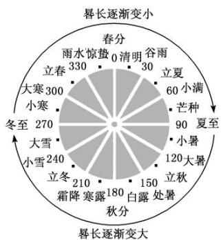
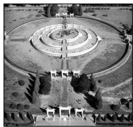
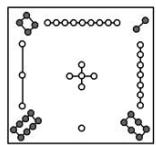
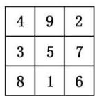

# 专题22 数列中的数学文化问题

纵观近几年高考，以数学文化为背景的数列问题，层出不穷，让人耳目一新，同时它也使考生们受困于背景陌生，阅读受阻，本专题通过对典型考题的分析，让考生提高审题能力，增加对数学文化的认识，进而加深对数学文化的理解，提升数学核心素养。

# 【基本方法】

数列与数学文化解题 3 步骤

<table><tr><td>读懂题意</td><td>会脱去数学文化的背景,读懂题意</td></tr><tr><td>构建模型</td><td>由题意,构建等差数列或等比数列或递推关系式的模型</td></tr><tr><td>求解模型</td><td>利用所学知识求解数列的相关信息,如求指定项、通项公式或前n项和的公式</td></tr></table>

# 考点一 等差数列型

# 【基本题型】

[例 1](1)《九章算术》是我国古代的数学名著，书中有如下问题：“今有五人分五钱，令上二人所得与下三人等．问各得几何？”其意思为：“已知甲、乙、丙、丁、戊五人分5钱，甲、乙两人所得与丙、丁、戊三人所得相同，且甲、乙、丙、丁、戊所得依次成等差数列．问五人各得多少钱？”（“钱”是古代的一种重量单位）这个问题中，甲所得为( )

A. $\frac{5}{4}$ 钱

B. $\frac{5}{3}$ 钱

C. $\frac{3}{2}$ 钱

D. $\frac{4}{3}$ 钱

(2)《莱因德纸草书》是世界上最古老的数学著作之一, 书中有一道这样的题目: 把 100 个面包分给 5 个人, 使每个人所得成等差数列, 且使较大的三份之和的 $\frac{1}{7}$ 是较小的两份之和, 问最小的一份为( )

A. $\frac{5}{3}$

B. $\frac{10}{3}$

C. $\frac{5}{6}$

D. $\frac{11}{6}$

(3)(多选)我国天文学和数学著作《周髀算经》中记载: 一年有二十四个节气, 每个节气的晷长损益相同(晷是按照日影测定时刻的仪器, 暑长即为所测量影子的长度). 二十四节气及晷长变化如图所示, 相邻两个节气晷长减少或增加的量相同, 周而复始. 已知每年冬至的晷长为一丈三尺五寸, 夏至的晷长为一尺五寸(一丈等于十尺, 一尺等于十寸), 则下列选项正确的有()

other

| 季度 | 数值 |
|---|---|
| 春长逐渐变小 | 330 |
| 冬至 | 270 |
| 大寒 | 300 |
| 小寒 | 240 |
| 立春 | 210 |
| 霜降寒露 | 180 |
| 立冬 | 210 |
| 大雪 | 240 |
| 立秋 | 150 |
| 小暑 | 120 |
| 芒种 | 90 |
| 立夏 | 60 |
| 谷雨 | 30 |
| 春分 | 0 |
| 雨水惊蛰 | 0 |
| 春长逐渐变大 | 180 |
| 春长逐渐变小 | 330 |

A. 相邻两个节气晷长减少或增加的量为一尺

B. 春分和秋分两个节气的晷长相同

C. 立冬的晷长为一丈五寸

D. 立春的晷长比立秋的晷长短

(4)《张丘建算经》卷上第22题为：“今有女善织，日益功疾。初日织五尺，今一月日织九匹三丈。”其意思为今有一女子擅长织布，且从第2天起，每天比前一天多织相同量的布，若第一天织5尺布，现在一个月(按30天计)共织390尺布。则该女子最后一天织布的尺数为()

A. 18

B. 20

C. 21

D. 25

(5)(2020·全国Ⅱ)北京天坛的圜丘坛为古代祭天的场所, 分上、中、下三层. 上层中心有一块圆形石板(称为天心石), 环绕天心石砌 9 块扇面形石板构成第一环, 向外每环依次增加 9 块. 下一层的第一环比上一层的最后一环多 9 块, 向外每环依次也增加 9 块. 已知每层环数相同, 且下层比中层多 729 块, 则三层共有扇面形石板(不含天心石)( )

natural_image

Aerial black-and-white view of a circular architectural structure with symmetrical wings and surrounding trees (no visible text or symbols)

A. 3699 块

B. 3474 块

C. 3402 块

D. 3339 块

(6)(多选)大衍数列来源于《乾坤谱》中对易传“大衍之数五十”的推论。主要用于解释中国传统文化中的太极衍生原理。数列中的每一项，都代表太极衍生过程中曾经经历过的两仪数量总和，是中国传统文化中隐藏着的世界数学史上第一道数列题。其前10项依次是0，2，4，8，12，18，24，32，40，50，…，则下列说法正确的是()

A. 此数列的第 20 项是 200

B. 此数列的第 19 项是 200

C. 此数列偶数项的通项公式为 $a_{2n} = 2n^2$

D. 此数列的前 $n$ 项和为 $S_{n} = n(n - 1)$

【对点精练】1. 《九章算术》“竹九节”问题：现有一根9节的竹子，自上而下各节的容积成等差数列．上面4节的容

积共为 3 升，下面 3 节的容积共 4 升，则第 5 节的容积为 \_\_\_\_ 升.

2. “珠算之父”程大位是我国明代著名的数学家，他的应用巨著《算法统宗》中有一首“竹筒容米”问题：“家有九节竹一茎，为因盛米不均平，下头三节六升六，上梢四节四升四，唯有中间两节竹，要将米数次第盛，若有先生能算法，也教算得到天明。”([注]六升六：6.6升，次第盛：盛米容积依次相差同一数量)用你所学的数学知识求得中间两节竹的容积为()

A. 3.4 升

B. 2.4 升

C. 2.3 升

D. 3.6 升

3. “中国剩余定理”又称“孙子定理”。1852年，英国来华传教士伟烈亚力将《孙子算经》中“物不知数”问题的解法传至欧洲。1874年，英国数学家马西森指出此法符合1801年由高斯得到的关于同余式解法的一般性定理，因而西方称之为“中国剩余定理”。“中国剩余定理”讲的是一个关于整除的问题，现有这样一个整除问题：将1至2020这2020个数中，能被3除余1且被7除余1的数按从小到大的顺序排成一列，构成数列 $\{a_{n}\}$ ，则此数列共有()

A. 98 项

B. 97 项

C. 96项

D. 95 项

4. 一元线性同余方程组问题最早可见于中国南北朝时期(公元5世纪)的数学著作《孙子算经》卷下第二十六题，叫做“物不知数”问题，原文如下：有物不知数，三三数之剩二，五五数之剩三，问物几何？即一个整数除以三余二，除以五余三，求这个整数．设这个整数为 a，当 $a \in [2, 2019]$ 时，符合条件的 a 共有 \_\_\_\_ 个.

5. 我国古代数学名著《算法统宗》中说: “九百九十六斤棉, 赠分八子做盘缠。次第每人多十七, 要将第八数来言。务要分明依次第, 孝和休惹外人传。” 意为: “996 斤棉花, 分别赠送给 8 个子女做旅费,从第 1 个孩子开始, 以后每人依次多 17 斤, 直到第 8 个孩子为止。分配时一定要按照次序分, 要顺从父母, 兄弟间和气, 不要引得外人说闲话。” 在这个问题中, 第 8 个孩子分到的棉花为( )

A. 184 斤

B. 176 斤

C. 65 斤

D. 60 斤

6. 中国古代数学有一题为: “现有一女子擅长织布, 每天织布量都比前一天多, 且从第 2 天起, 每天比前一天多织相同量的布, 若第一天织 5 尺布, 现有一月(按 30 天计), 共织 390 尺布”, 则该女最后一天织布\_\_\_\_尺.

7. 古代有这样一个问题：“今有墙厚 22.5 尺，两鼠从墙两侧同时打洞，大鼠第一天打洞一尺，小鼠第一天打洞半尺，大鼠之后每天打洞长度比前一天多半尺，小鼠前三天每天打洞长度比前一天多一倍，三天之后小鼠每天打洞长度与第三天打洞长度相同，问两鼠几天能打通墙相逢？”两鼠相逢最快需要的天数为( )

A. 4

B. 5

C. 6

D. 7

8. 我国古代数学著作《九章算术》有如下问题：“今有金箠，长五尺，斩本一尺，重四斤，斩末一尺，重二斤，问次一尺各重几何？”意思是：“现有一根金箠，长5尺，一头粗，一头细，在粗的一端截下1尺，重4斤，在细的一端截下1尺，重2斤，问依次每一尺各重多少斤？”设该金箠由粗到细是均匀变化的，其重量为M，现将该金箠截成长度相等的10段，记第i段的重量为 $a_{i}(i=1,2,\ldots,10)$ ，且 $a_{1}<a_{2}<\ldots<a_{10}$ ，若 $48a_{i}=5M$ ，则 $i=(\quad)$

A. 4

B. 5

C. 6

D. 7

9. 我国古代名著《九章算术》中有这样一段话：“今有金锤，长五尺，斩本一尺，重四斤。斩末一尺，重二斤。”意思是：“现有一根金锤，长度为5尺，头部的1尺，重4斤；尾部的1尺，重2斤；且从头到尾，每一尺的重量构成等差数列。”则下列说法正确的是( )

A. 该金锤中间一尺重 3.5 斤

B. 中间三尺的重量和是头尾两尺重量和的 3 倍

C. 该金锤的重量为 15 斤

D. 该金锤相邻两尺的重量之差的为 1.5 斤.

10. 我国古代的《洛书》中记载着世界上最古老的一个幻方(如图①所示). 将 1, 2, ..., 9 填入 $3 \times 3$ 的方格内(如图②所示), 使三行、三列及两条对角线上的三个数字之和都等于 15 , 这个方阵叫做 3 阶幻方. 一般地, 将连续的正整数 1, 2, 3, ..., $n^2$ 填入 $n \times n$ 的方格中, 使得每行、每列及两条对角线上的数字之和都相等, 这个方阵叫做 $n(n \geq 3)$ 阶幻方. 记 $n$ 阶幻方的对角线上的数的和为 $N_n$ , 如 $N_3 = 15$ , 那么 $N_9 = (\quad)$

  
①

  
②

A. 41

B. 45

C. 369

D. 321

11. 《周髀算经》是中国古代重要的数学著作，其记载的“日月历法”曰：“阴阳之数，日月之法，十九岁为一章，四章为一部，部七十六岁，二十部为一遂，遂千百五二十岁，…，生数皆终，万物复苏，天以更元作纪历”。某老年公寓住有20位老人，他们的年龄(都为正整数)之和恰好为一遂，其中年长者已是奔百之龄(年龄介于90～100岁)，其余19人的年龄依次相差一岁，则年长者的年龄为()

A. 94 岁

B. 95 岁

C. 96 岁

D. 98 岁

# 考点二 等比数列型

# 【基本题型】

[例 2](1)十二平均律是我国明代音乐理论家和数学家朱载堉发明的．明万历十二年(公元 1584 年)，他写成《律学新说》，提出了十二平均律的理论，这一成果被意大利传教士利玛窦通过丝绸之路带到了西方，对西方音乐产生了深远的影响．十二平均律的数学意义是：在 1 和 2 之间插入 11 个正数，使包含 1 和 2 的这 13 个数依次成递增的等比数列，依此规则，插入的第四个数应为()

A. $2^{\frac{1}{4}}$

B. $2^{\frac{1}{3}}$

C. $2^{\frac{3}{13}}$

D. $2^{\frac{4}{13}}$

(2)我国古代数学典籍《九章算术》“盈不足”中有一道两鼠穿墙问题：“今有垣厚十尺，两鼠对穿，初日各一尺，大鼠日自倍，小鼠日自半，问何日相逢？”上述问题中，两鼠在第几天相逢？（）

A. 2

B. 3

C. 4

D. 6

(3)(2017·全国Ⅱ)我国古代数学名著《算法统宗》中有如下问题：“远望巍巍塔七层，红光点点倍加增，共灯三百八十一，请问尖头几盏灯？”意思是：一座7层塔共挂了381盏灯，且相邻两层中的下一层灯数是上一层灯数的2倍，则塔的顶层共有灯（）

A. 1 盏

B. 3 盏

C. 5 盏

D. 9盏

(4)数学家也有许多美丽的错误，如法国数学家费马于1640年提出了 $F_{n}=2^{2n}+1(n=0,1,2,\cdots)$ 是质数的猜想，直到1732年才被善于计算的大数学家欧拉算出 $F_{5}=641$ ( )

A. 5

B. 6

C. 7

D. 8

(5)公元前 5 世纪, 古希腊哲学家芝诺发表了著名的阿基里斯悖论: 让乌龟在阿基里斯前面 1000 米处开始, 和阿基里斯赛跑, 并且假定阿基里斯的速度是乌龟的 10 倍, 当比赛开始后, 若阿基里斯跑了 1000 米, 则乌龟便领先他 100 米; 当阿基里斯跑完下一个 100 米时, 乌龟仍然前于他 10 米; 当阿基里斯跑完下一个 10 米时, 乌龟仍然前于他 1 米……所以阿基里斯永远追不上乌龟. 根据这样的规律, 当阿基里斯和乌龟的距离恰好为 $10^{-2}$ 米时, 乌龟爬行的总距离为( )

A. $\frac{10^{4}-1}{90}$ 米

B. $\frac{10^{5}-1}{900}$ 米

C. $\frac{10^{5}-9}{90}$ 米

D. $\frac{10^{4} - 9}{900}$ 米

(6)(多选)在《增删算法统宗》中有这样一则故事：“三百七十八里关，初行健步不为难；次日脚痛减一半，如此六日过其关。”则下列说法正确的是()

A. 此人第二天走了九十六里路

B. 此人第三天走的路程占全程的 $\frac{1}{8}$

C. 此人第一天走的路程比后五天走的路程多六里

D. 此人后三天共走了 42 里路

# 【对点精练】

12. “十二平均律”是通用的音律体系, 明代朱载堉最早用数学方法计算出半音比例, 为这个理论的发展做出了重要贡献. 十二平均律将一个纯八度音程分成十二份, 依次得到十三个单音, 从第二个单音起, 每一个单音的频率与它的前一个单音的频率的比都等于 $\sqrt[12]{2}$ . 若第一个单音的频率为 $f$ , 则第八个单音的频率为( )

A. $\sqrt[3]{2}f$

B. $\sqrt[3]{2^{2}}f$

C. $\sqrt[12]{2^{5}f}$

D. $\sqrt[12]{2^{7}}f$

13. 中国古代数学著作《算法统宗》中有这样一个问题：“三百七十八里关，初行健步不为难，次日脚痛减一半，六朝才得到其关，要见次日行里数，请公仔细算相还。”其意思为：有一个人走378里路，第一天健步行走，从第二天起脚痛每天走的路程为前一天的一半，走了6天后到达目的地，请问第二天走了( )

A. 192 里

B. 96 里

C. 48 里

D. 24 里

14. 公元前 5 世纪, 古希腊哲学家芝诺发表了著名的阿基里斯悖论。他提出让乌龟在阿基里斯前面 1000 米处开始, 和阿基里斯赛跑, 并且假定阿基里斯的速度是乌龟的 10 倍。当比赛开始后, 若阿基里斯跑了 1000 米, 此时乌龟便领先他 100 米; 当阿基里斯跑完下一个 100 米时, 乌龟仍然领先他 10 米; 当阿基里斯跑完下一个 10 米时, 乌龟仍然领先他 1 米……所以阿基里斯永远追不上乌龟。按照这样的规律, 若阿基里斯和乌龟的距离恰好为 $10^{-2}$ 米时, 乌龟爬行的总距离(单位: 米)为( )

A. $\frac{10^{4} - 1}{90}$

B. $\frac{10^{5} - 1}{900}$

C. $\frac{10^{5}-9}{90}$

D. $\frac{10^{4} - 9}{900}$

15. 中国古代数学著作《张丘建算经》中记载：“今有马行转迟，次日减半，疾七日，行七百里。”其意思是：“现有一匹马行走的速度逐渐变慢，每天走的里数是前一天的一半，连续行走7天，共走了700里。”若该匹马按此规律继续行走7天，则它这14天内所走的总路程为( )

A. $\frac{175}{32}$ 里

B. 1050 里

C. $\frac{22575}{32}$ 里

D. 2100 里

16. 中国古代数学著作《算法统宗》中有这样一个问题：“三百七十八里关，初步健步不为难，次日脚痛减一半，六朝才得到其关，要见次日行里数，请公仔细算相还。”其大意为：“有一个人走378里路，第一天健步行走，从第二天起脚痛每天走的路程为前一天的一半，走了6天后到达目的地。”则该人第一天走的路程为\_\_\_\_里，后三天一共走\_\_\_\_里。

17. 据统计测量, 已知某养鱼场, 第一年鱼的质量增长率为 $200\%$ , 以后每年的增长率为前一年的一半. 若饲养 5 年后, 鱼的质量预计为原来的 $t$ 倍. 下列选项中, 与 $t$ 值最接近的是( )

A. 11

B. 13

C. 15

D. 17

# 考点三 其他型

# 【基本题型】

[例 3](1)九连环是我国古代至今广为流传的一种益智游戏，它由九个铁丝圆环相连成串，按一定规则移动圆环的次数，决定解开圆环的个数．在某种玩法中，用 $a_{n}$ 表示解下 $n(n \leqslant 9, n \in \mathbf{N}^{*})$ 个圆环所需是多少移动次数，数列 $\{a_{n}\}$ 满足 $a_{1}=1$ ，且 $a_{n}=\left\{\begin{aligned}&2a_{n-1}-1,\quad n\text{为偶数},\\&2a_{n-1}+2,\quad n\text{为奇数},\end{aligned}\right.$ 则解下 5 个环所需的最少移动次数为()

A. 7

B. 10

C. 16

D. 22

(2)意大利数学家斐波那契以兔子繁殖为例，引入“兔子数列”：1，1，2，3，5，8，13，21，34，55，…即 $F(1)=F(2)=1$ ， $F(n)=F(n-1)+F(n-2)(n\geqslant3,\ n\in\mathbf{N}^{*})$ ．此数列在现代物理、化学等方面都有着广泛的应用．若此数列被2除后的余数构成一个新数列 $\{a_{n}\}$ ，则数列 $\{a_{n}\}$ 的前2022项的和为()

A. 672

B. 673

C. 1348

D. 2021

(3)1772 年德国的天文学家 J. E. 波得发现了求太阳和行星间距离的法则。记地球距离太阳的平均距离为 10，可以算得当时已知的六大行星距离太阳的平均距离如下表：

<table><tr><td>星名</td><td>水星</td><td>金星</td><td>地球</td><td>火星</td><td>木星</td><td>土星</td></tr><tr><td>与太阳的距离</td><td>4</td><td>7</td><td>10</td><td>16</td><td>52</td><td>100</td></tr></table>

除水星外，其余各星与太阳的距离都满足波得定则(某一数列规律)。当时德国数学家高斯根据此定则推算，火星和木星之间距离太阳28应该还有一颗大行星。1801年意大利天文学家皮亚齐通过观测，果然找到了火星和木星之间距离太阳28的谷神星以及它所在的小行星带。请你根据这个定则，估算出从水星开始由近到远算，第10个行星与太阳的平均距离大约是()

A. 388

B. 772

C. 1 540

D. 3 076

(4)我国古代数学名著《九章算术》中，有已知长方形面积求一边的算法，其方法的前两步为：

第一步：构造数列 $1, \frac{1}{2}, \frac{1}{3}, \frac{1}{4}, \ldots, \frac{1}{n}$ . ①

第二步：将数列①的各项乘以 $\frac{n}{2}$ ，得到一个新数列 $a_1, a_2, a_3, \ldots, a_n$ .

则 $a_1a_2 + a_2a_3 + a_3a_4 + \ldots + a_{n - 1}a_n = (\quad)$

A. $\frac{n^{2}}{4}$

B. $\frac{(n-1)^{2}}{4}$

C. $\frac{n(n - 1)}{4}$

D. $\frac{n(n+1)}{4}$

