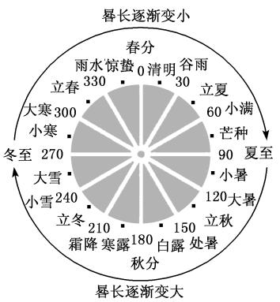
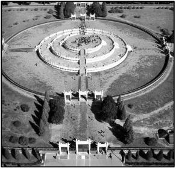
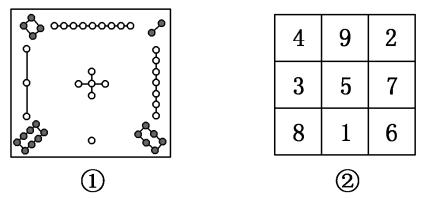

专题22　数列中的数学文化问题

纵观近几年高考，以数学文化为背景的数列问题，层出不穷，让人耳目一新，同时它也使考生们受困于背景陌生，阅读受阻，本专题通过对典型考题的分析，让考生提高审题能力，增加对数学文化的认识，进而加深对数学文化的理解，提升数学核心素养．

【基本方法】

数列与数学文化解题3步骤

<table><tr><td>
读懂题意
</td><td>
会脱去数学文化的背景，读懂题意
</td></tr><tr><td>
构建模型
</td><td>
由题意，构建等差数列或等比数列或递推关系式的模型
</td></tr><tr><td>
求解模型
</td><td>
利用所学知识求解数列的相关信息，如求指定项、通项公式或前<em>n</em>项和的公式
</td></tr></table>

考点一　等差数列型

【基本题型】

[例1]（1）《九章算术》是我国古代的数学名著，书中有如下问题：“今有五人分五钱，令上二人所得与下三人等．问各得几何？”其意思为：“已知甲、乙、丙、丁、戊五人分5钱，甲、乙两人所得与丙、丁、戊三人所得相同，且甲、乙、丙、丁、戊所得依次成等差数列．问五人各得多少钱？”(“钱”是古代的一种重量单位)这个问题中，甲所得为(　　)

A．钱　　　　　　　　
B．钱　　　　　　　　
C．钱　　　　　　　
D．钱
答案　D　解析　设等差数列{<em>an</em>}的首项为<em>a</em>1，公差为<em>d</em>，依题意有解得即甲得钱，故选D．  
（2）《莱因德纸草书》是世界上最古老的数学著作之一，书中有一道这样的题目：把100个面包分给5个人，使每个人所得成等差数列，且使较大的三份之和的是较小的两份之和，问最小的一份为(　　)

A．　　　　　　　　
B．　　　　　　　
C．　　　　　　　　
D．
答案　A　解析　由100个面包分给5个人，每个人所得成等差数列，可知中间一人得20块面包，设较大的两份为20＋*d，* 20＋2*d*，较小的两份为20－*d，* 20－2*d*，由已知条件可得(20＋20＋*d*＋20＋2*d*)＝20－*d*＋20－2*d*，解得*d*＝，所以最小的一份为20－2*d*＝20－2×＝．  
（3）(多选)我国天文学和数学著作《周髀算经》中记载：一年有二十四个节气，每个节气的晷长损益相同(晷是按照日影测定时刻的仪器，晷长即为所测量影子的长度)．二十四节气及晷长变化如图所示，相邻两个节气晷长减少或增加的量相同，周而复始．已知每年冬至的晷长为一丈三尺五寸，夏至的晷长为一尺五寸(一丈等于十尺，一尺等于十寸)，则下列选项正确的有(　　)

A．相邻两个节气晷长减少或增加的量为一尺　　　　　
B．春分和秋分两个节气的晷长相同

C．立冬的晷长为一丈五寸　　　　　　　　　　　　　
D．立春的晷长比立秋的晷长短
答案　ABC　解析　由题意可知夏至到冬至的晷长构成等差数列{<em>an</em>}，其中<em>a</em>1＝15寸，<em>a</em>13＝135寸，公差为<em>d</em>寸，则135＝15＋12<em>d</em>，解得<em>d</em>＝10寸，同理可知由冬至到夏至的晷长构成等差数列{<em>bn</em>}，首项<em>b</em>1＝135，末项<em>b</em>13＝15，公差<em>d</em>＝－10(单位都为寸)．故A正确；∵春分的晷长为<em>b</em>7，∴<em>b</em>7＝<em>b</em>1＋6<em>d</em>＝135－60＝75，∵秋分的晷长为<em>a</em>7，∴<em>a</em>7＝<em>a</em>1＋6<em>d</em>＝15＋60＝75，故B正确；∵立冬的晷长为<em>a</em>10，∴<em>a</em>10＝<em>a</em>1＋9<em>d</em>＝15＋90＝105，即立冬的晷长为一丈五寸，故C正确；∵立春的晷长，立秋的晷长分别为<em>b</em>4，<em>a</em>4，∴<em>a</em>4＝<em>a</em>1＋3<em>d</em>＝15＋30＝45，<em>b</em>4＝<em>b</em>1＋3<em>d</em>＝135－30＝105，∴<em>b</em>4&gt;<em>a</em>4，故D错误．故选A、B、C．  
（4）《张丘建算经》卷上第22题为：“今有女善织，日益功疾．初日织五尺，今一月日织九匹三丈．”其意思为今有一女子擅长织布，且从第2天起，每天比前一天多织相同量的布，若第一天织5尺布，现在一个月(按30天计)共织390尺布．则该女子最后一天织布的尺数为(　　)

A．18　　　　　　　　
B．20　　　　　　　　
C．21　　　　　　　　
D．25
答案　C　解析　依题意得，该女子每天所织的布的尺数依次排列形成一个等差数列，设为{<em>an</em>}，其中<em>a</em>1＝5，前30项和为390，于是有＝390，解得<em>a</em>30＝21，即该女子最后一天织21尺布．  
（5）(2020·全国Ⅱ)北京天坛的圜丘坛为古代祭天的场所，分上、中、下三层．上层中心有一块圆形石板(称为天心石)，环绕天心石砌9块扇面形石板构成第一环，向外每环依次增加9块．下一层的第一环比上一层的最后一环多9块，向外每环依次也增加9块．已知每层环数相同，且下层比中层多729块，则三层共有扇面形石板(不含天心石)(　　)

A．3 699块　　　　　
B．3 474块　　　　　
C．3 402块　　　　　
D．3 339块
答案　C　解析　由题意知，由天心石开始向外的每环的扇面形石板块数构成一个等差数列，记为{<em>an</em>}，易知其首项<em>a</em>1＝9，公差<em>d</em>＝9，所以<em>an</em>＝<em>a</em>1＋(<em>n</em>－1)<em>d</em>＝9<em>n</em>．设数列{<em>an</em>}的前<em>n</em>项和为<em>Sn</em>，由等差数列的性质知<em>Sn</em>，<em>S</em>2<em>n</em>－<em>Sn</em>，<em>S</em>3<em>n</em>－<em>S</em>2<em>n</em>也成等差数列，所以2(<em>S</em>2<em>n</em>－<em>Sn</em>)＝<em>Sn</em>＋<em>S</em>3<em>n</em>－<em>S</em>2<em>n</em>，所以(<em>S</em>3<em>n</em>－<em>S</em>2<em>n</em>)－(<em>S</em>2<em>n</em>－<em>Sn</em>)＝<em>S</em>2<em>n</em>－2<em>Sn</em>＝－2×＝9<em>n</em>2＝729，得<em>n</em>＝9，所以三层共有扇面形石板的块数为<em>S</em>3<em>n</em>＝＝＝3 402，故选C．  
（6）(多选)大衍数列来源于《乾坤谱》中对易传“大衍之数五十”的推论．主要用于解释中国传统文化中的太极衍生原理．数列中的每一项，都代表太极衍生过程中曾经经历过的两仪数量总和，是中国传统文化中隐藏着的世界数学史上第一道数列题．其前10项依次是0，2，4，8，12，18，24，32，40，50，…，则下列说法正确的是(　　)

A．此数列的第20项是200　　　　　　　　　　
B．此数列的第19项是200

C．此数列偶数项的通项公式为<em>a</em>2<em>n</em>＝2<em>n</em>2　　　　　
D．此数列的前<em>n</em>项和为<em>Sn</em>＝<em>n</em>(<em>n</em>－1)
答案　AC　解析　观察此数列，偶数项通项公式为<em>a</em>2<em>n</em>＝2<em>n</em>2，奇数项是后一项减去后一项的项数，<em>a</em>2<em>n</em>－1＝<em>a</em>2<em>n</em>－2<em>n</em>，由此可得<em>a</em>20＝2×102＝200，A正确，C正确；<em>a</em>19＝<em>a</em>20－20＝180，B错误；<em>Sn</em>＝<em>n</em>(<em>n</em>－1)＝<em>n</em>2－<em>n</em>是一个等差数列的前<em>n</em>项和，而题中数列不是等差数列，不可能有<em>Sn</em>＝<em>n</em>(<em>n</em>－1)，D错误．故选A、C．

【对点精练】

1．《九章算术》“竹九节”问题：现有一根9节的竹子，自上而下各节的容积成等差数列．上面4节的容

积共为3升，下面3节的容积共4升，则第5节的容积为\_\_\_\_\_\_\_\_升．

1．答案　　解析　设该数列{<em>an</em>}的首项为<em>a</em>1，公差为<em>d</em>，依题意即
解得则<em>a</em>5＝<em>a</em>1＋4<em>d</em>＝＋4×＝．

2．“珠算之父”程大位是我国明代著名的数学家，他的应用巨著《算法统宗》中有一首“竹筒容米”问

题：“家有九节竹一茎，为因盛米不均平，下头三节六升六，上梢四节四升四，唯有中间两节竹，要将米数次第盛，若有先生能算法，也教算得到天明．”([注]六升六：6.6升，次第盛：盛米容积依次相差同一数量)用你所学的数学知识求得中间两节竹的容积为(　　)

A．3.4升　　　　　　
B．2.4升　　　　　
C．2.3升　　　　　　
D．3.6升

2．答案　A　解析　设从下至上各节容积分别为<em>a</em>1，<em>a</em>2，…，<em>a</em>9为等差数列，公差<em>d</em>，则由题意可知，
故解得，<em>d</em>＝－0．2，<em>a</em>1＝2．4，所以中间节<em>a</em>4＋<em>a</em>5＝1．8＋1．6＝3．4．故选A．

3．“中国剩余定理”又称“孙子定理”．1852年，英国来华传教士伟烈亚力将《孙子算经》中“物不知数”问

题的解法传至欧洲．1874年，英国数学家马西森指出此法符合1801年由高斯得到的关于同余式解法的一般性定理，因而西方称之为“中国剩余定理”．“中国剩余定理”讲的是一个关于整除的问题，现有这样一个整除问题：将1至2 020这2 020个数中，能被3除余1且被7除余1的数按从小到大的顺序排成一列，构成数列{<em>an</em>}，则此数列共有(　　)

A．98项　　　　　　　　
B．97项　　　　　　　　
C．96项　　　　　　　　
D．95项

3．答案　B　解析　能被3除余1且被7除余1的数就只能是被21除余1的数，故<em>an</em>＝21<em>n</em>－20，由1≤<em>an</em>

≤2020得1≤<em>n</em>≤97，又<em>n</em>∈<strong>N</strong>＋，故此数列共有97项．

4．一元线性同余方程组问题最早可见于中国南北朝时期(公元5世纪)的数学著作《孙子算经》卷下第二

十六题，叫做“物不知数”问题，原文如下：有物不知数，三三数之剩二，五五数之剩三，问物几何？即一个整数除以三余二，除以五余三，求这个整数．设这个整数为*a*，当*a*∈[2，2 019]时，符合条件的*a*共有\_\_\_\_\_\_\_\_个．

4．答案　135　解析　法一：由题设<em>a</em>＝3<em>m</em>＋2＝5<em>n</em>＋3，<em>m</em>，<em>n</em>∈<strong>N</strong>，则3<em>m</em>＝5<em>n</em>＋1，<em>m</em>，<em>n</em>∈<strong>N</strong>，当<em>m</em>＝5<em>k</em>

时，<em>n</em>不存在；当<em>m</em>＝5<em>k</em>＋1时，<em>n</em>不存在；当<em>m</em>＝5<em>k</em>＋2时，<em>n</em>＝3<em>k</em>＋1，满足题意；当<em>m</em>＝5<em>k</em>＋3时，<em>n</em>不存在；当<em>m</em>＝5<em>k</em>＋4时，<em>n</em>不存在，其中<em>k</em>∈<strong>N</strong>．故2≤<em>a</em>＝15<em>k</em>＋8≤2 019，解得－≤<em>k</em>≤，则<em>k</em>＝0，1，2，…，134，共135个．即符合条件的<em>a</em>共有135个，故答案为135．

法二：一个整数除以三余二，这个整数可以为2，5，8，11，14，17，20，23，26，29，32，35，38，…，一个整数除以五余三，这个整数可以为3，8，13，18，23，28，33，38，…，则同时除以三余二、除以五余三的整数为8，23，38，…，构成首项为8，公差为15的等差数列，通项公式为<em>an</em>＝8＋15(<em>n</em>－1)＝15<em>n</em>－7，

5．我国古代数学名著《算法统宗》中说：“九百九十六斤棉，赠分八子做盘缠．次第每人多十七，要将

第八数来言．务要分明依次第，孝和休惹外人传．”意为：“996斤棉花，分别赠送给8个子女做旅费，从第1个孩子开始，以后每人依次多17斤，直到第8个孩子为止．分配时一定要按照次序分，要顺从父母，兄弟间和气，不要引得外人说闲话．”在这个问题中，第8个孩子分到的棉花为(　　)

A．184斤　　　　　　　　
B．176斤　　　　　　　　
C．65斤　　　　　　　　
D．60斤

5．答案　A　解析　依题意得，八个子女所得棉花斤数依次构成等差数列，设该等差数列为{<em>an</em>}，公差为

<em>d</em>，前<em>n</em>项和为<em>Sn</em>，第一个孩子所得棉花斤数为<em>a</em>1，则由题意得，<em>d</em>＝17，<em>S</em>8＝8<em>a</em>1＋×17＝996，解得<em>a</em>1＝65，∴<em>a</em>8＝<em>a</em>1＋(8－1)<em>d</em>＝184．

6．中国古代数学有一题为：“现有一女子擅长织布，每天织布量都比前一天多，且从第2天起，每天比前

一天多织相同量的布，若第一天织5尺布，现有一月(按30天计)，共织390尺布”，则该女最后一天织布\_\_\_\_\_\_\_\_尺．

6．答案　21　解析　由题意可得每天织布的尺数构成等差数列，设公差为<em>d</em>，则前30天织布尺数的和<em>S</em>30

＝390＝30×5＋*d*，解得*d*＝．所以最后一天织布的尺数为5＋29*d*＝5＋29×＝21．

7．古代有这样一个问题：“今有墙厚22．5尺，两鼠从墙两侧同时打洞，大鼠第一天打洞一尺，小鼠第一

天打洞半尺，大鼠之后每天打洞长度比前一天多半尺，小鼠前三天每天打洞长度比前一天多一倍，三天之后小鼠每天打洞长度与第三天打洞长度相同，问两鼠几天能打通墙相逢？”两鼠相逢最快需要的天数为(　　)

A．4　　　　　　　　
B．5　　　　　　　　
C．6　　　　　　　　
D．7

7．答案　C　解析　依题意得，大鼠每天打洞长度构成等差数列{<em>an</em>}，且首项<em>a</em>1＝1，公差<em>d</em>＝．小鼠前

三天打洞长度之和为＋1＋2＝，之后每天打洞长度是常数2，令<em>n</em>·1＋·＋＋(<em>n</em>－3)·2≥22(<em>n</em>指天数，且<em>n</em>是正整数)，则有<em>n</em>2＋11<em>n</em>－100≥0，即<em>n</em>(<em>n</em>＋11)≥100，则易知<em>n</em>的最小值为6．故选C．

8．我国古代数学著作《九章算术》有如下问题：“今有金箠，长五尺，斩本一尺，重四斤，斩末一尺，重

二斤，问次一尺各重几何？”意思是：“现有一根金箠，长5尺，一头粗，一头细，在粗的一端截下1尺，重4斤，在细的一端截下1尺，重2斤，问依次每一尺各重多少斤？”设该金箠由粗到细是均匀变化的，其重量为<em>M</em>，现将该金箠截成长度相等的10段，记第<em>i</em>段的重量为<em>ai</em>(<em>i</em>＝1，2，…，10)，且<em>a</em>1&lt;<em>a</em>2&lt;…&lt;<em>a</em>10，若48<em>ai</em>＝5<em>M</em>，则<em>i</em>＝(　　)

A．4　　　　　　　　
B．5　　　　　　　　
C．6　　　　　　　　
D．7

8．答案　C　解析　由题意知，由细到粗每段的重量组成一个等差数列，记为{<em>an</em>}，设公差为<em>d</em>，则有

⇒⇒所以该金箠的总重量<em>M</em>＝10×＋×＝15．因为48<em>ai</em>＝5<em>M</em>，所以有48＝75，解得<em>i</em>＝6，故选C．

9．我国古代名著《九章算术》中有这样一段话：“今有金锤，长五尺，斩本一尺，重四斤．斩末一尺，

重二斤．”意思是：“现有一根金锤，长度为5尺，头部的1尺，重4斤；尾部的1尺，重2斤；且从头到尾，每一尺的重量构成等差数列．”则下列说法正确的是(　　)

A．该金锤中间一尺重3．5斤

B．中间三尺的重量和是头尾两尺重量和的3倍

C．该金锤的重量为15斤

D．该金锤相邻两尺的重量之差的为1.5斤．

9．答案　C　解析　设该等差数列为{<em>an</em>}，公差为<em>d</em>，<em>a</em>5＝2，<em>a</em>1＝4，则4＋4<em>d</em>＝2，解得<em>d</em>＝－．∴<em>an</em>＝4

－(<em>n</em>－1)＝．∴<em>a</em>3＝3，<em>S</em>5＝＝15，∴<em>a</em>2＋<em>a</em>3＋<em>a</em>4＝＋3＋＝9，<em>a</em>5＋<em>a</em>1＝6，故选C．

10．我国古代的《洛书》中记载着世界上最古老的一个幻方(如图①所示)．将1，2，…，9填入3×3的方

格内(如图②所示)，使三行、三列及两条对角线上的三个数字之和都等于15，这个方阵叫做3阶幻方．一般地，将连续的正整数1，2，3，…，<em>n</em>2填入<em>n</em>×<em>n</em>的方格中，使得每行、每列及两条对角线上的数字之和都相等，这个方阵叫做<em>n</em>(<em>n</em>≥3)阶幻方．记<em>n</em>阶幻方的对角线上的数的和为<em>Nn</em>，如<em>N</em>3＝15，那么<em>N</em>9＝(　　)

A．41　　　　　　　　
B．45　　　　　　　　
C．369　　　　　　　　
D．321

10．答案　C　解析　根据题意得，幻方对角线上的数成等差数列，则根据等差数列的性质可知对角线上

的首尾两个数相加恰好等于1＋<em>n</em>2．根据等差数列的求和公式得<em>Nn</em>＝，则<em>N</em>9＝＝369．故选C．

11．《周髀算经》是中国古代重要的数学著作，其记载的“日月历法”曰：“阴阳之数，日月之法，十九

岁为一章，四章为一部，部七十六岁，二十部为一遂，遂千百五二十岁，…，生数皆终，万物复苏，天以更元作纪历”．某老年公寓住有20位老人，他们的年龄(都为正整数)之和恰好为一遂，其中年长者已是奔百之龄(年龄介于90～100岁)，其余19人的年龄依次相差一岁，则年长者的年龄为(　　)

A．94岁　　　　　　　　
B．95岁　　　　　　　　
C．96岁　　　　　　　　
D．98岁

11．答案　B　解析　设年长者的年龄为*t*，由已知，其余19位老人的年龄从小到大依次排列构成公差*d*

＝1的等差数列，设最小者的年龄为<em>a</em>1，由“遂千百五二十岁”知，一遂就是1 520岁(一遂有20部，一部有4章，一章有19岁，且20×4×19＝1 520)．所以这20位老人的年龄之和为19<em>a</em>1＋<em>d</em>＋<em>t</em>＝1 520，整理得<em>a</em>1＋9＋＝80．因为<em>t</em>∈<strong>N</strong>\*，<em>a</em>1∈<strong>N</strong>\*，所以∈<strong>N</strong>\*．又因为<em>t</em>∈(90，100)，所以<em>t</em>＝19×5＝95．故选B．

考点二　等比数列型

【基本题型】

[例2]（1）十二平均律是我国明代音乐理论家和数学家朱载堉发明的．明万历十二年(公元1584年)，他写成《律学新说》，提出了十二平均律的理论，这一成果被意大利传教士利玛窦通过丝绸之路带到了西方，对西方音乐产生了深远的影响．十二平均律的数学意义是：在1和2之间插入11个正数，使包含1和2的这13个数依次成递增的等比数列，依此规则，插入的第四个数应为(　　)

A．　　　　　　　　
B．　　　　　　　　
C．　　　　　　　　
D．
答案　B　解析　根据题意，设这个等比数列为{<em>an</em>}，设其公比为<em>q</em>，又由<em>a</em>1＝1，<em>a</em>13＝2，则<em>q</em>12＝＝2，插入的第四个数应<em>a</em>5＝<em>a</em>1<em>q</em>4＝<em>q</em>4＝2，故选B．  
（2）我国古代数学典籍《九章算术》“盈不足”中有一道两鼠穿墙问题：“今有垣厚十尺，两鼠对穿，初日各一尺，大鼠日自倍，小鼠日自半，问何日相逢？”上述问题中，两鼠在第几天相逢？(　　)

A．2　　　　　　　　
B．3　　　　　　　　
C．4　　　　　　　　
D．6
答案　C　解析　不妨设大老鼠和小老鼠每天穿墙的厚度为数列{<em>an</em>}和{<em>bn</em>}，则由题意可知，数列{<em>an</em>}是首项为1，公比为2的等比数列，数列{<em>bn</em>}是首项为1，公比为的等比数列，设前<em>n</em>天两鼠总共穿墙的厚度之和为<em>Sn</em>，则<em>Sn</em>＝＋＝2<em>n</em>－<em>n</em>－1＋1，当<em>n</em>＝3时，<em>S</em>3＝&lt;10，当<em>n</em>＝4时，<em>S</em>4＝&gt;10，故两个老鼠在第4天相逢．  
（3）(2017·全国Ⅱ)我国古代数学名著《算法统宗》中有如下问题：“远望巍巍塔七层，红光点点倍加增，共灯三百八十一，请问尖头几盏灯？”意思是：一座7层塔共挂了381盏灯，且相邻两层中的下一层灯数是上一层灯数的2倍，则塔的顶层共有灯(　　)

A．1盏　　　　　　　　
B．3盏　　　　　　　　
C．5盏　　　　　　　　
D．9盏
答案　B　解析　每层塔所挂的灯数从上到下构成等比数列，记为{<em>an</em>}，则前7项的和<em>S</em>7＝381，公比<em>q</em>＝2，依题意，得<em>S</em>7＝＝381，解得<em>a</em>1＝3．  
（4）数学家也有许多美丽的错误，如法国数学家费马于1640年提出了<em>Fn</em>＝22<em>n</em>＋1(<em>n</em>＝0，1，2，…)是质数的猜想，直到1732年才被善于计算的大数学家欧拉算出<em>F</em>5＝641](　　)

A．5　　　　　　　　
B．6　　　　　　　　
C．7　　　　　　　　
D．8
答案　<strong>B</strong>　解析　因为<em>Fn</em>＝22<em>n</em>＋1(<em>n</em>＝0，1，2，…)，所以<em>an</em>＝log4(<em>Fn</em>－1)＝log4(22<em>n</em>＋1－1)＝log422<em>n</em>＝2<em>n</em>－1，所以{<em>an</em>}是等比数列，首项为1，公比为2，所以<em>Sn</em>＝＝2<em>n</em>－1．所以32(2<em>n</em>－1)＝63×2<em>n</em>－1，解得<em>n</em>＝6，故选B．  
（5）公元前5世纪，古希腊哲学家芝诺发表了著名的阿基里斯悖论：让乌龟在阿基里斯前面1 000 米处开始，和阿基里斯赛跑，并且假定阿基里斯的速度是乌龟的10倍，当比赛开始后，若阿基里斯跑了1 000 米，则乌龟便领先他100米；当阿基里斯跑完下一个100米时，乌龟仍然前于他10米；当阿基里斯跑完下一个10米时，乌龟仍然前于他1米……所以阿基里斯永远追不上乌龟．根据这样的规律，当阿基里斯和乌龟的距离恰好为10－2米时，乌龟爬行的总距离为(　　)

A．米　　　　　　
B．米　　　　　　
C．米　　　　　　
D．米
答案　B　解析　法一：设乌龟每次爬行的距离构成数列{<em>an</em>}，则数列{<em>an</em>}为等比数列，设其公比为<em>q</em>，则<em>a</em>1＝100，<em>q</em>＝，<em>an</em>＝<em>a</em>1<em>qn</em>－1．令10－2＝100×<em>n</em>－1，解得<em>n</em>＝5，所以<em>S</em>5＝＝＝，即乌龟爬行的总距离为米．故选B．

法二：设乌龟每次爬行的距离构成数列{<em>an</em>}，则数列{<em>an</em>}为等比数列，设其公比为<em>q</em>，则<em>a</em>1＝100，<em>q</em>＝．令<em>an</em>＝10－2，则<em>Sn</em>＝＝＝＝，即乌龟爬行的总距离为米．故选B．  
（6）(多选)在《增删算法统宗》中有这样一则故事：“三百七十八里关，初行健步不为难；次日脚痛减一半，如此六日过其关．”则下列说法正确的是(　　)

A．此人第二天走了九十六里路　　　　　　　　　　　　
B．此人第三天走的路程占全程的

C．此人第一天走的路程比后五天走的路程多六里　　　　
D．此人后三天共走了42里路
答案　ACD　解析　设此人第<em>n</em>天走<em>an</em>里路，则数列{<em>an</em>}是首项为<em>a</em>1，公比为<em>q</em>＝的等比数列，因为<em>S</em>6＝378，所以<em>S</em>6＝＝378，解得<em>a</em>1＝192，对于A，由于<em>a</em>2＝192×＝96，所以此人第二天走了九十六里路，所以A正确；对于B，由于<em>a</em>3＝192×＝48，&gt;，所以B不正确；对于C，由于378－192＝186，192－186＝6，所以此人第一天走的路程比后五天走的路程多六里，所以C正确；对于D，<em>a</em>4＋<em>a</em>5＋<em>a</em>6＝378－192－96－48＝42，所以此人后三天共走了42里路，所以D正确．

【对点精练】

12．“十二平均律”是通用的音律体系，明代朱载堉最早用数学方法计算出半音比例，为这个理论的

发展做出了重要贡献．十二平均律将一个纯八度音程分成十二份，依次得到十三个单音，从第二个单音起，每一个单音的频率与它的前一个单音的频率的比都等于．若第一个单音的频率为*f*，则第八个单音的频率为(　　)

A．*f*　　　　　　　　
B．*f*　　　　　　　　
C．*f*　　　　　　　　
D．*f*

12．答案　D　解析　从第二个单音起，每一个单音的频率与它的前一个单音的频率的比都等于，第一

个单音的频率为<em>f</em>，由等比数列的概念可知，这十三个单音的频率构成一个首项为<em>f</em>，公比为的等比数列，记为{<em>an</em>}，则第八个单音频率为<em>a</em>8＝<em>f</em>()8－1＝<em>f</em>，故选D．

13．中国古代数学著作《算法统宗》中有这样一个问题：“三百七十八里关，初行健步不为难，次日脚痛

减一半，六朝才得到其关，要见次日行里数，请公仔细算相还．”其意思为：有一个人走378里路，第一天健步行走，从第二天起脚痛每天走的路程为前一天的一半，走了6天后到达目的地，请问第二天走了(　　)

A．192 里　　　　　　
B．96 里　　　　　　
C．48 里　　　　　　
D．24 里

13．解析：选B　设等比数列{<em>an</em>}的首项为<em>a</em>1，公比为<em>q</em>＝，依题意有＝378，解得<em>a</em>1＝192，则

<em>a</em>2＝192×＝96，即第二天走了96 里，故选B．

14．公元前5世纪，古希腊哲学家芝诺发表了著名的阿基里斯悖论．他提出让乌龟在阿基里斯前面 1 000

米处开始，和阿基里斯赛跑，并且假定阿基里斯的速度是乌龟的10倍．当比赛开始后，若阿基里斯跑了1 000米，此时乌龟便领先他100米；当阿基里斯跑完下一个100米时，乌龟仍然领先他10米；当阿基里斯跑完下一个10米时，乌龟仍然领先他1米……所以阿基里斯永远追不上乌龟．按照这样的规律，若阿基里斯和乌龟的距离恰好为10－2米时，乌龟爬行的总距离(单位：米)为(　　)

A．　　　　　　
B．　　　　　　
C．　　　　　　
D．

14．答案　B　解析　由题意知，乌龟每次爬行的距离(单位：米)构成等比数列{<em>an</em>}，且首项<em>a</em>1＝100，公

比<em>q</em>＝，易知<em>a</em>5＝10－2，则乌龟爬行的总距离(单位：米)为<em>S</em>5＝＝＝．故选B．

15．中国古代数学著作《张丘建算经》中记载：“今有马行转迟，次日减半，疾七日，行七百里．”其意思

是：“现有一匹马行走的速度逐渐变慢，每天走的里数是前一天的一半，连续行走7天，共走了700里．”若该匹马按此规律继续行走7天，则它这14天内所走的总路程为(　　)

A．里　　　　　　
B．1 050里　　　　　　
C．里　　　　　　
D．2 100里

15．答案　C　解析　由题意可知，马每天行走的路程组成一个等比数列，设该数列为{<em>an</em>}，则该匹马首

日行走的路程为<em>a</em>1，公比为，则有＝700，则<em>a</em>1＝，则＝(里)．故选C．

16．中国古代数学著作《算法统宗》中有这样一个问题：“三百七十八里关，初步健步不为难，次日脚痛

减一半，六朝才得到其关，要见次日行里数，请公仔细算相还．”其大意为：“有一个人走378里路，第一天健步行走，从第二天起脚痛每天走的路程为前一天的一半，走了6天后到达目的地．”则该人第一天走的路程为\_\_\_\_\_\_\_\_里，后三天一共走\_\_\_\_\_\_\_\_里．

16．答案　192　42　解析　由题可知这六天中每天走的路程数组成公比为的等比数列，设第一天走*x*里，
则＝378，解得*x*＝192，即该人第一天走的路程是192里；后三天共走了192×＋192×＋192×＝42(里) ．

17．据统计测量，已知某养鱼场，第一年鱼的质量增长率为200%，以后每年的增长率为前一年的一半．若

饲养5年后，鱼的质量预计为原来的*t*倍．下列选项中，与*t*值最接近的是(　　)

A．11　　　　　　　　
B．13　　　　　　　　
C．15　　　　　　　　
D．17

17．答案　B　解析　设鱼原来的质量为<em>a</em>，饲养<em>n</em>年后鱼的质量为<em>an</em>，<em>q</em>＝200%＝2，则<em>a</em>1＝<em>a</em>(1＋<em>q</em>)，<em>a</em>2

＝<em>a</em>1＝<em>a</em>(1＋<em>q</em>)，…，<em>a</em>5＝<em>a</em>(1＋2)×(1＋1)×××＝<em>a</em>≈12．7<em>a</em>，即5年后，鱼的质量预计为原来的12．7倍，故选B．

考点三　其他型

【基本题型】

<strong>[例3]</strong>（1）九连环是我国古代至今广为流传的一种益智游戏，它由九个铁丝圆环相连成串，按一定规则移动圆环的次数，决定解开圆环的个数．在某种玩法中，用<em>an</em>表示解下<em>n</em>(<em>n</em>≤9，<em>n</em>∈<strong>N</strong>\*)个圆环所需的多少移动次数，数列{<em>an</em>}满足<em>a</em>1＝1，且<em>an</em>＝则解下5个环所需的最少移动次数为(　　)

A．7　　　　　　　　
B．10　　　　　　　　
C．16　　　　　　　　
D．22
答案　<strong>C</strong>　解析　数列{<em>an</em>}满足<em>a</em>1＝1，且<em>an</em>＝所以<em>a</em>2＝1，<em>a</em>3＝4，<em>a</em>4＝7，<em>a</em>5＝16．故选C．  
（2）意大利数学家斐波那契以兔子繁殖为例，引入“兔子数列”：1，1，2，3，5，8，13，21，34，55，…即<em>F</em>（1）＝<em>F</em>（2）＝1，<em>F</em>(<em>n</em>)＝<em>F</em>(<em>n</em>－1)＋<em>F</em>(<em>n</em>－2)(<em>n</em>≥3，<em>n</em>∈<strong>N</strong>\*)．此数列在现代物理、化学等方面都有着广泛的应用．若此数列被2除后的余数构成一个新数列{<em>an</em>}，则数列{<em>an</em>}的前2 022项的和为(　　)

A．672　　　　　　　　
B．673　　　　　　　　
C．1 348　　　　　　　　
D．2 021
答案　<strong>C</strong>　解析　由于{<em>an</em>}是数列1，1，2，3，5，8，13，21，34，55，…各项除以2的余数，故{<em>an</em>}为1，1，0，1，1，0，1，1，0，1，…所以{<em>an</em>}是周期为3的周期数列，且一个周期中的三项之和为1＋1＋0＝2．因为2 022＝674×3，所以数列{<em>an</em>}的前2 022项的和为674×2＝1 348．故选C．  
（3）1772年德国的天文学家J．E．波得发现了求太阳和行星间距离的法则．记地球距离太阳的平均距离为10，可以算得当时已知的六大行星距离太阳的平均距离如下表：

<table><tr><td>
星名
</td><td>
水星
</td><td>
金星
</td><td>
地球
</td><td>
火星
</td><td>
木星
</td><td>
土星
</td></tr><tr><td>
与太阳的距离
</td><td>
4
</td><td>
7
</td><td>
10
</td><td>
16
</td><td>
52
</td><td>
100
</td></tr></table>

除水星外，其余各星与太阳的距离都满足波得定则(某一数列规律)．当时德国数学家高斯根据此定则推算，火星和木星之间距离太阳28应该还有一颗大行星．1801年意大利天文学家皮亚齐通过观测，果然找到了火星和木星之间距离太阳28的谷神星以及它所在的小行星带．请你根据这个定则，估算出从水星开始由近到远算，第10个行星与太阳的平均距离大约是(　　)

A．388　　　　　　　　
B．772　　　　　　　　
C．1 540　　　　　　　　
D．3 076
答案　B　解析　设<em>an</em>是从水星开始，第<em>n</em>个行星与太阳的平均距离，依题意可知<em>an</em>＝<em>an</em>－1＋3·2<em>n</em>－3(<em>n</em>≥3)，<em>a</em>3＝10，<em>a</em>4＝16，<em>a</em>5＝28，<em>a</em>6＝52，<em>a</em>7＝100，所以<em>an</em>＝(<em>an</em>－<em>an</em>－1)＋(<em>an</em>－1－<em>an</em>－2)＋…＋(<em>a</em>4－<em>a</em>3)＋<em>a</em>3＝3·(2<em>n</em>－3＋2<em>n</em>－4＋…＋21)＋10＝3×2×＋10＝3·2<em>n</em>－2＋4(<em>n</em>≥3)．<em>a</em>2＝7也满足上式，故<em>an</em>＝3·2<em>n</em>－2＋4(<em>n</em>≥2)．所以<em>a</em>10＝3×210－2＋4＝772．故选B．  
（4）我国古代数学名著《九章算术》中，有已知长方形面积求一边的算法，其方法的前两步为：

第一步：构造数列1，，，，…，．①
第二步：将数列①的各项乘以，得到一个新数列<em>a</em>1，<em>a</em>2，<em>a</em>3，…，<em>an</em>．
则<em>a</em>1<em>a</em>2＋<em>a</em>2<em>a</em>3＋<em>a</em>3<em>a</em>4＋…＋<em>an</em>－1<em>an</em>＝(　　)

A．　　　　　　　
B．　　　　　　
C．　　　　　
D．
答案　C　解析　由题意知所得新数列为1×，×，×，…，×，所以<em>a</em>1<em>a</em>2＋<em>a</em>2<em>a</em>3＋<em>a</em>3<em>a</em>4＋…＋<em>an</em>－1<em>an</em>＝＝＝＝，故选C．

