# 专题01 关于三视图还原几何体的深度剖析与秒杀

# 一 标准几何体还原

# 标准几何体还原口诀

1. 如果一个几何体的三视图中有两个视图是矩形，那么这个几何体是直棱柱或圆柱；  
2. 如果一个几何体的三视图是两个平行四边形+一个交错结构，那么这个几何体是斜棱柱；  
3. 如果一个几何体的三视图中有两个视图是三角形，那么这个几何体是锥体；  
4. 如果一个几何体的三视图是两个梯形+一个位似结构，那么这个几何体是棱台；  
5. 三圆得球.

# 【例题选讲】

[例 1] 下图是一些标准几何体的三视图，写出其直观图的名称.

1 cm

$\sqrt{3}$ cm

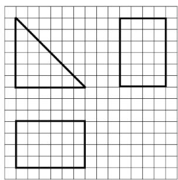

natural_image

Three geometric shapes (rectangle, square, and hollow rectangle) drawn on a grid background with no text or symbols.

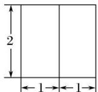

正视图  
  
俯视图

  
侧视图

  
正(主)视图

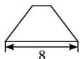  
侧(左)视图

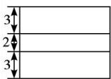  
俯视图

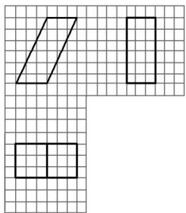

natural_image

Geometric shapes including parallelogram, rectangle, and trapezoid drawn on a grid background (no text or symbols)

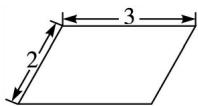  
正视图  
图1

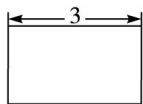  
侧视图  
图2

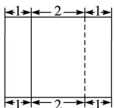  
俯视图  
图3

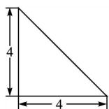  
正(主)视图

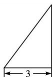  
侧(左)视图

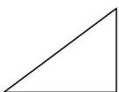  
俯视图

  
正(主)视图

  
侧(左)视图

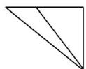  
俯视图

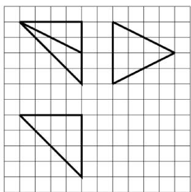

natural_image

Three black triangles drawn on a grid background, no text or symbols present

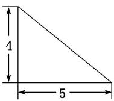  
正(主)视图

  
侧(左)视图

  
正视图

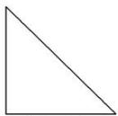  
侧视图

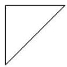  
正视图

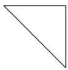  
侧视图

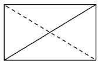  
俯视图

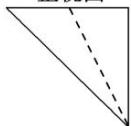  
俯视图

  
俯视图

  
正视图

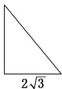  
侧视图

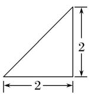  
正视图

  
侧视图

  
正视图

  
侧视图

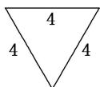  
俯视图

  
俯视图

  
俯视图

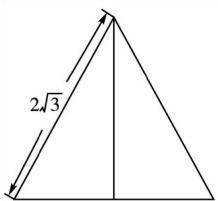

text_image

2\u221a3

正视图

  
侧视图

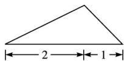  
正(主)视图

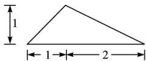  
侧(左)视图

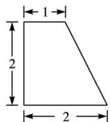  
正视图

  
侧视图

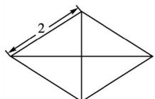  
俯视图

natural_image

Pure geometric diagram of a square with internal diagonals and no text or symbols

俯视图

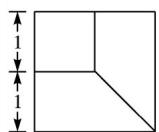  
俯视图

# 二 锥体几何体还原

锥体几何体还原口诀(六线诀)

点点线线断底面，定长锁高宽相连，双线汇交寻阵眼，返璞归真显在前.

# 【例题选讲】

[例 2] 下图是一些锥体的三视图，还原其直观图.

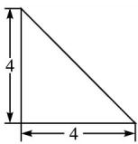  
正(主)视图

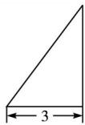  
侧(左)视图

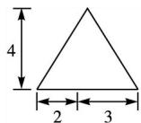  
正(主)视图

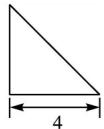  
侧(左)视图

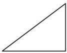  
俯视图

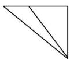  
俯视图

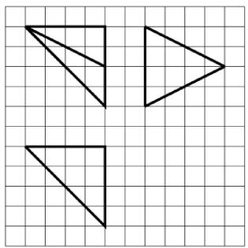

natural_image

Three geometric shapes (inverted triangles) drawn on a grid background, no text or symbols present.

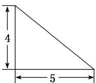  
正(主)视图

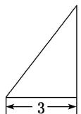  
侧(左)视图

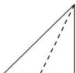  
正视图

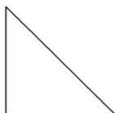  
侧视图

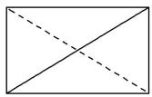  
俯视图

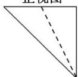  
俯视图

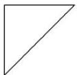  
正视图

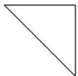  
侧视图

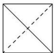  
俯视图

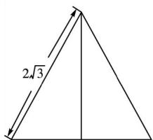

text_image

2\u221a3

正视图

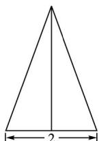  
侧视图

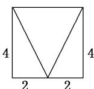  
正视图

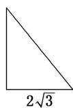  
侧视图

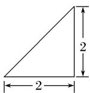  
正视图

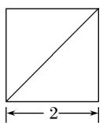  
侧视图

  
俯视图

  
俯视图

  
俯视图

  
正(主)视图

  
侧(左)视图

natural_image

Geometric diagram of a square divided into four triangles by diagonals (no text or symbols)

俯视图

正视图  
  
俯视图

  
侧视图

  
正视图

  
俯视图

  
侧视图

[解析]   

text_image

D₁
A₁
B₁
C₁
G
C
D
A
B

text_image

Geometric diagram of a cube with labeled vertices A, B, C, D and internal diagonals forming triangles

text_image

Geometric diagram of a cube with labeled vertices A, B, C, and D, showing solid and dashed edges for spatial relationships.

text_image

A
B
C
D

natural_image

Geometric diagram of a triangular pyramid (tetrahedron) with solid and dashed lines indicating visible and hidden edges, no text or labels present.

natural_image

Geometric diagram of a triangular pyramid with dashed base line (no text or symbols)

natural_image

Geometric diagram of a triangular pyramid with solid and dashed edges (no text or labels)

natural_image

Simple line drawing of a 3D geometric pyramid (tetrahedron) with no text or labels

natural_image

Simple line drawing of a 3D geometric pyramid (tetrahedron) with no text or labels

text_image

D₁
A₁
D
B₁
C₁
C
A
B

# 【对点训练】

1. 已知某几何体的三视图如图所示, 正视图和侧视图都是矩形, 俯视图是正方形, 在该几何体上任意选择 4 个顶点, 以这 4 个点为顶点的几何体的形状给出下列命题: ①矩形; ②有三个面为直角三角形, 有一个面为等腰三角形的四面体; ③两个面都是等腰直角三角形的四面体.

  
正视图

  
侧视图

  
俯视图

其中正确命题的序号是\_\_\_\_。

2. 如图是一个几何体的三视图，若其正视图的面积等于 $8 \mathrm{~cm}^{2}$ ，俯视图是一个面积为 $4 \sqrt{3} \mathrm{~cm}^{2}$ 的正三角形，则其侧视图的面积等于 \_\_\_\_.

  
正视图

  
侧视图

  
俯视图

3. (2019·银川模拟)如图, 水平放置的三棱柱的侧棱长为 1 , 且侧棱 $AA_{1} \perp$ 平面 $A_{1}B_{1}C_{1}$ , 正视图是边长为 1 的正方形, 俯视图为一个等边三角形, 则该三棱柱的侧视图面积为( )

  
正视图

  
俯视图

A. $2 \sqrt{3}$

B. $\sqrt{3}$

C. $\frac{\sqrt{3}}{2}$

D. 1

4. (2018·全国 I)某圆柱的高为 2，底面周长为 16，其三视图如图所示．圆柱表面上的点 M 在正视图上的对应点为 A，圆柱表面上的点 N 在左视图上的对应点为 B，则在此圆柱侧面上，从 M 到 N 的路径中，最短路径的长度为( )

natural_image

Simple geometric shapes: rectangle ABC and circle, no text or symbols present

A. $2 \sqrt{17}$

B. $2 \sqrt{5}$

C. 3

D. 2

5. (2019·四川成都七中诊断)一个棱锥的三视图如图所示，则该棱锥的外接球的体积是( )

  
正视图

  
侧视图

  
俯视图

A. $9\pi$

B. $\frac{9\pi}{2}$

C. $36\pi$

D. $18\pi$

6. 某几何体的三视图如图所示, 则该几何体的体积是( )

  
正视图

  
侧视图

  
俯视图

A. $\frac{2\sqrt{2}}{3}\pi$

B. $\frac{\pi}{2}$

C. $\frac{\sqrt{2}}{3}\pi$

D. $\pi$

7. 某几何体的三视图如图所示, 且该几何体的体积是 $\frac{3}{2}$ , 则正视图中的 $x$ 是( )

  
正视图

  
侧视图

  
俯视图

A. 2

B. 4.5

C. 1.5

D. 3

8. (2018·北京)某四棱锥的三视图如图所示, 在此四棱锥的侧面中, 直角三角形的个数为( )

  
正(主)视图

  
侧(左)视图

  
俯视图

A. 1

B. 2

C. 3

D. 4

9. 已知以下三视图中有三个同时表示某一个棱锥，则下列不是该三棱锥的三视图的是( )

10. 某几何体的三视图如图所示，则该几何体的体积为( )

  
正视图

  
侧视图

  
俯视图

A. 1

B. $\frac{1}{2}$

C. $\frac{1}{3}$

D. $\frac{1}{4}$

11. (2019·南昌联考)已知底面为正方形的四棱锥，其一条侧棱垂直于底面，那么该四棱锥的三视图可能是下列各图中的( )

  
正视图

  
侧视图

  
正视图

  
侧视图

  
俯视图  
A

  
俯视图  
-

  
正视图

  
侧视图

  
正视图

  
侧视图

  
俯视图  
3

  
俯视图  
[Non-Text]   
-

12. 如图, 网格纸上小正方形的边长为 1 , 粗线画出的是某几何体的正视图和侧视图, 且该几何体的体积为 $\frac{8}{3}$ , 则该几何体的俯视图可以是( )

  
A

natural_image

Geometric diagram showing two squares with a diagonal line and a dashed diagonal line on a grid background (no text or symbols)

  
B

  
C

  
D

13. 如图, 网格纸上小正方形的边长为 1 , 粗线画出的是某三棱锥的三视图, 则该几何体的体积为( )

natural_image

Three geometric diagrams on a grid: triangle, square, and diagonal line (no text or symbols)

A. 4

B. 2

C. $\frac{4}{3}$

D. $\frac{2}{3}$

14. 某几何体的三视图如图所示, 则该几何体的外接球的表面积为( )

A. $25\pi$

B. $26\pi$

C. $32\pi$

D. $36\pi$

15. (2019·福建漳州调研)某三棱锥的三视图如图所示，则该三棱锥的最长棱的长度为( )

  
正（主）视图

  
侧（左）视图

  
俯视图

A. $\sqrt{5}$

B. $2\sqrt{2}$

C. 3

D. $2 \sqrt{3}$

16. (2019·武汉调研)已知某四棱锥的三视图如图所示，则该四棱锥的四个侧面中最小的面积为\_\_\_\_。

  
正视图

  
侧视图

  
俯视图

17. 某几何体的三视图如图所示，则该几何体外接球的表面积是( )

  
正(主)视图

  
侧(左)视图

  
俯视图

A. $8\pi$

B. $12\pi$

C. $16\pi$

D. $\frac{25\pi}{2}$

18. 如图, 网格上小正方形的边长为 1 , 粗线画出的是某个多面体的三视图, 若该多面体的所有顶点都在球 $O$ 的表面上, 则球 $O$ 的表面积是 ( )

natural_image

Geometric diagram of triangles and quadrilaterals on a grid background (no text or symbols)

A. $36\pi$

B. $48\pi$

C. $56\pi$

D. $64\pi$

# 三 秒杀锥体体积与面积典例

# 【例题选讲】

[例 3] (1)某几何体的三视图如图所示，则该几何体的体积为()

text_image

√2
1 1

正(主)视图

  
侧(左)视图

  
俯视图

A. $\frac{\sqrt{2}}{3}$

B. $\frac{2\sqrt{2}}{3}$

C. $\sqrt{2}$

D. $2\sqrt{2}$

(2)一个四面体的三视图如图所示，则该四面体的体积是()

  
正(主)视图

  
侧(左)视图

  
俯视图

A. $\frac{1}{2}$

B. $\frac{1}{3}$

C. $\frac{2}{3}$

D. 1

(3)(2017·北京)某三棱锥的三视图如图所示，则该三棱锥的体积为()

  
正(主)视图

  
侧(左)视图

  
俯视图

A. 60

B. 30

C. 20

D. 10

(4)(2018·福州四校联考)已知某几何体的三视图如图所示，则该几何体的表面积为()

  
正视图

  
侧视图

  
俯视图

A. $\frac{27}{2}$

B. 27

C. $27\sqrt{2}$

D. $27\sqrt{3}$

(5)某四棱锥的三视图如图所示，则该四棱锥的侧面积是()

  
正视图

  
侧视图

  
俯视图

A. $4 + 4\sqrt{2}$

B. $4\sqrt{2}+2$

C. $8+4\sqrt{2}$

D. $\frac{8}{3}$

(6)某几何体的三视图如图所示，则该几何体中，面积最大的侧面的面积为\_\_\_\_。

正（主）视图侧（左）视图  
  
俯视图

text_image

A
E
B
C
D

# 【对点训练】

1. 一个几何体的三视图如图所示, 其中正视图是一个正三角形, 则该几何体的体积为( )

  
正视图

  
侧视图

  
俯视图

A. $\frac{\sqrt{3}}{3}$

B. 1

C. $\frac{2\sqrt{3}}{3}$

D. $\sqrt{3}$

2. 某几何体的三视图如图所示, 则该几何体的体积为( )

  
正视图

  
侧视图

  
俯视图

A. $\frac{2\sqrt{2}}{3}$

B. $\frac{2\sqrt{3}}{3}$

C. $\frac{4\sqrt{2}}{3}$

D. $\frac{4\sqrt{3}}{3}$

3. 一个几何体的三视图如图所示，则该几何体的体积为\_\_\_\_。

  
正视图

  
侧视图

  
俯视图

4. 某几何体的三视图如图所示(单位: cm), 则该几何体的体积(单位: $\mathrm{cm}^3$ )是()

  
正视图

  
侧视图

  
俯视图

A. 2

B. 3

C. 4

D. 6

5. 一个几何体的三视图如图所示, 则该几何体的体积为( )

  
正视图

  
侧视图

  
俯视图

A. 1

B. $\frac{3}{2}$

C. $\frac{1}{2}$

D. $\frac{3}{4}$

6. 如图, 网格纸上小正方形的边长为 1 , 粗实线及粗虚线画出的是某多面体的三视图, 则该多面体的体积为( )

text_image

主视图
左视图
俯视图

A. $\frac{2}{3}$

B. $\frac{4}{3}$

C. 2

D. $\frac{8}{3}$

7. 如图所示, 网格纸上小正方形的边长为 1 , 粗实线及粗虚线画出的是三棱锥的三视图, 则此三棱锥的体积是( )

natural_image

Geometric shapes drawn on grid paper with solid and dashed lines (no text or symbols)

A. 8

B. 16

C. 24

D. 48

8. 某几何体的三视图如图所示, 则该几何体的体积为( )

A. $\frac{1}{2}$

B. $\frac{\sqrt{2}}{2}$

C. $\frac{\sqrt{3}}{3}$

D. $\frac{2}{3}$

9. 如图, 网格纸上小正方形的边长为 1 , 粗线画的是一个几何体的三视图, 则该几何体的体积为( )

natural_image

Geometric grid pattern with three squares and one dashed diagonal line (no text or symbols)

A. 3

B. $\frac{11}{3}$

C. 7

D. $\frac{23}{3}$

10. 某三棱锥的三视图如图所示，则该三棱锥的表面积是( )

  
正(主)视图

  
侧(左)视图

  
俯视图

A. $2 + \sqrt{5}$

B. $2+2\sqrt{5}$

C. $\frac{4}{3}$

D. $\frac{2}{3}$

11. 一个几何体的三视图及其尺寸如图所示, 则该几何体的表面积为( )

  
正视图

  
侧视图

  
俯视图

A. 16

B. $8\sqrt{2}+8$

C. $2\sqrt{2}+2\sqrt{6}+8$

D. $4\sqrt{2} + 4\sqrt{6} + 8$

12. 如图, 网格纸上小正方形的边长为 1 , 粗线是一个棱锥的三视图, 则该棱锥的表面积为( )

text_image

正视图
侧视图

俯视图

A. $6 + 4\sqrt{2} + 2\sqrt{3}$

B. $8+4\sqrt{2}$

C. $6+6\sqrt{2}$

D. $6+2\sqrt{2}+4\sqrt{3}$

13. 某四面体的三视图如图所示, 正视图、侧视图都是腰长为 2 的等腰直角三角形, 俯视图是边长为 2 的正方形, 则此四面体的最大面的面积是( )

  
正视图

  
侧视图

  
俯视图

A. 2

B. $2\sqrt{2}$

C. $2\sqrt{3}$

D. 4

14. 某四棱锥的三视图如图所示，则该四棱锥的最长棱的长度为( )

  
正(主)视图

  
侧(左)视图

  
俯视图

A. $3 \sqrt{2}$

B. $2 \sqrt{3}$

C. $2 \sqrt{2}$

D. 2

15.《九章算术》是我国古代内容极为丰富的数学名著, 系统地总结了战国、秦、汉时期的数学成就。书中将底面为长方形且有一条侧棱与底面垂直的四棱锥称之为 “阳马”, 若某 “阳马” 的三视图如图所示(网格纸上小正方形的边长为 1), 则该 “阳马” 最长的棱长为 \_\_\_\_.

text_image

正视图
侧视图
俯视图

# 四 秒杀组合体三视图典例

秒杀组合体三视图的思维逻辑:

1. 判断组合体的形式

①. 上下组合结构(由正视图和侧视图可判断)  
②. 前后组合结构(由侧视图和俯视图可判断)  
③. 左右组合结构(由正视图和俯视图可判断)  
2. 利用另一视图确定组合体的形状;  
3. 检验各视图是否满足题意.

# 【例题选讲】

[例 4] (1)(2017·全国 I)某多面体的三视图如图所示，其中正视图和左视图都由正方形和等腰直角三角形组成，正方形的边长为 2，俯视图为等腰直角三角形．该多面体的各个面中有若干个是梯形，这些梯形的面积之和为( )

A. 10

B. 12

C. 14

D. 16

(2)(2016·全国Ⅱ)如图是由圆柱与圆锥组合而成的几何体的三视图，则该几何体的表面积为()

text_image

2\u221a3
4
4

A. $20\pi$

B. $24\pi$

C. $28\pi$

D. $32\pi$

(3)某几何体的三视图如图所示，三个视图中的曲线都是圆弧，则该几何体的体积为( )

text_image

3
1
2

A. $\frac{4\pi}{3}$

B. $\frac{5\pi}{3}$

C. $\frac{7\pi}{6}$

D. $\frac{11\pi}{6}$

(4)(2017·山东)由一个长方体和两个 $\frac{1}{4}$ 圆柱构成的几何体的三视图如图，则该几何体的体积为\_\_\_\_.

  
正视图

  
侧视图

  
俯视图

(5)(2017·浙江)某几何体的三视图如图所示(单位: cm), 则该几何体的体积(单位: $\mathrm{cm}^3$ )是()

  
正视图

  
侧视图

  
俯视图

A. $\frac{\pi}{2} + 1$

B. $\frac{\pi}{2} + 3$

C. $\frac{3\pi}{2} + 1$

D. $\frac{3\pi}{2} + 3$

(6)某几何体的三视图如图所示，则该几何体的体积是()

text_image

2
1
主视图
左视图
1
2
俯视图

A. $\frac{4\pi}{3}$

B. $\frac{5\pi}{3}$

C. $2+\frac{2\pi}{3}$

D. $4 + \frac{2\pi}{3}$

# 【对点训练】

1. 如图是一个体积为 10 的空间几何体的三视图，则图中 $x$ 的值为( )

  
正视图

  
侧视图

  
俯视图

A. 2

B. 3

C. 4

D. 5

2. 已知一几何体的三视图如图所示, 它的侧(左)视图与正(主)视图相同, 则该几何体的体积为( )

  
正(主)视图

  
侧(左)视图

  
俯视图

A. $\frac{16}{3}\pi +\frac{8\sqrt{2}}{3}$

B. $\frac{8}{3}\pi +\frac{8\sqrt{2}}{3}$

C. $\frac{16}{3}\pi + 8\sqrt{2}$

D. $\frac{8}{3}\pi + 8\sqrt{2}$

3. 一个由半球和四棱锥组成的几何体, 其三视图如图所示, 则该几何体的体积为( )

text_image

Geometric diagram showing two identical semicircles with inscribed triangles, each labeled with base length 1.

正视图  
侧视图

  
俯视图

A. $\frac{1}{3} +\frac{2}{3}\pi$

B. $\frac{1}{3} + \frac{\sqrt{2}}{3}\pi$

C. $\frac{1}{3} +\frac{\sqrt{2}}{6}\pi$

D. $1 + \frac{\sqrt{2}}{6}\pi$

4. (2016·浙江)某几何体的三视图如图所示(单位: cm), 则该几何体的表面积是\_\_\_\_cm², 体积是\_\_\_\_cm³.

正视图  
  
俯视图

5. 一个几何体的三视图如图所示，则该几何体的体积为\_\_\_\_。

  
正视图

  
侧视图

  
俯视图

6. 如图, 网格纸上小正方形的边长为 1 , 粗线画出的是某几何体的三视图, 则该几何体的表面积为( )

natural_image

Geometric shapes including parallelograms and triangles drawn on a grid background (no text or symbols)

A. $8 + 4\sqrt{2} + 8\sqrt{5}$

B. $24+4\sqrt{2}$

C. $8+20\sqrt{2}$

D. 28

7. 一个几何体的三视图如图所示，则该几何体的体积是\_\_\_\_，表面积是\_\_\_\_。

正视图  
  
侧视图  
俯视图

8. 《九章算术》卷五商功中有如下问题: 今有刍甍, 下广三丈, 裘四丈, 上袤二丈, 无广, 高一丈, 问积几何? 刍甍: 底面为矩形的屋脊状的几何体(网格纸中粗线部分为其三视图, 设网格纸上每个小正方形的边长为 1), 那么该刍甍的体积为( )

natural_image

Geometric shapes including polygons and triangles drawn on a grid background (no text or symbols)

A. 4

B. 5

C. 6

D. 12

9. 一个几何体按比例绘制的三视图如图所示(单位: m), 则该几何体的体积为(A)

  
正视图

  
侧视图

  
俯视图

A. $\frac{7}{2} \mathrm{~m}^{3}$

B. $\frac{9}{2}m^{3}$

C. $\frac{7}{3} \mathrm{~m}^{3}$

D. $\frac{9}{4}m^{3}$

# 五 秒杀切割体三视图典例

秒杀切割体三视图的思维逻辑:

1. 判断切割体的形式:

①. 完全轮廓切割体;  
②．不完全轮廓切割体；

2. 如果是不完全轮廓切割体先补成完全轮廓切割体;  
3. 检验各视图是否满足题意.

# 【例题选讲】

[例 5] (1)(2015·全国Ⅱ)一个正方体被一个平面截去一部分后，剩余部分的三视图如下图，则截去部分体积与剩余部分体积的比值为()

  
正(主)视图

  
侧(左)视图

  
俯视图

A. $\frac{1}{8}$

B. $\frac{1}{7}$

C. $\frac{1}{6}$

D. $\frac{1}{5}$

(2)如图是某几何体的三视图，则该几何体的外接球的表面积为()

  
正视图

  
侧视图

  
俯视图

A. $200\pi$

B. $150\pi$

C. $100\pi$

D. $50\pi$

(3)如图, 网格纸上小正方形的边长为 1 , 下图画出的是某几何体的三视图, 则该几何体的表面积为 ( )

text_image

正（主）视图
侧（左）视图

俯视图

A. $12\sqrt{13}+6\sqrt{2}+18$

B. $9\sqrt{13}+6\sqrt{2}+18$

C. $9\sqrt{13} + 8\sqrt{2} + 18$

D. $9\sqrt{13}+6\sqrt{2}+12$

(4)如图是某几何体的三视图，则该几何体的体积为()

A. 12

B. 15

C. 18

D. 21

  
正视图

  
侧视图

  
俯视图

(5)(2017·全国Ⅱ)如图，网格纸上小正方形的边长为1，粗实线画出的是某几何体的三视图，该几何体由一平面将一圆柱截去一部分后所得，则该几何体的体积为()

natural_image

Geometric shapes including circles, a right triangle, and a rectangle on a grid background (no text or symbols)

A. $90\pi$

B. $63\pi$

C. $42\pi$

D. $36\pi$

(6)如图是一个空间几何体的正视图和俯视图，则它的侧视图为()

  
正视图

  
俯视图

  
A

  
B

  
C

  
D

# 【对点训练】

1. (2013 浙江)已知某几何体的三视图(单位: cm)如图所示, 则该几何体的体积是().

text_image

4→2
4
2
正视图

  
俯视图

A. $108 \mathrm{~cm}^{3}$

B. $100 \, cm^{3}$

C. $92 \, cm^{3}$

D. $84 \, cm^{3}$

2. 如图, 网格纸上小正方形的边长为 1 , 粗线画出的是一个几何体的三视图, 则该几何体的体积为( )

natural_image

Grid pattern with four geometric shapes: two solid triangles and one dashed diagonal line (no text or symbols)

A. 3

B. $\frac{11}{3}$

C. 7

D. $\frac{23}{3}$

3. (2019·武汉部分学校调研)一个几何体的三视图如图所示, 则它的表面积为( )

  
正视图

  
侧视图

  
俯视图

A. 28

B. $24 + 2\sqrt{5}$

C. $20+4\sqrt{5}$

D. $20 + 2\sqrt{5}$

4. (2014 安徽)一个多面体的三视图如图所示, 则该多面体的表面积为( )

  
正视图

  
侧视图

  
俯视图

A. $21+\sqrt{3}$

B. $18+\sqrt{3}$

C. 21

D. 18

5. 如图, 网格纸上小正方形的边长为 1 , 粗线画出的是某多面体的三视图, 则该多面体的表面积为 ( )

natural_image

Geometric shapes (rectangle, square, triangle) drawn on a grid with dashed lines, no text or symbols present

A. 14

B. $10 + 4\sqrt{2}$

C. $\frac{21}{2}+4\sqrt{2}$

D. $\frac{21 + \sqrt{3}}{2} + 4\sqrt{2}$

6. 已知某几何体的三视图如图所示，其中俯视图是正三角形，则该几何体的体积为 \_\_\_\_.

  
正视图

  
侧视图

  
俯视图

7. 已知一个棱长为 2 的正方体, 被一个平面截后所得几何体的三视图如图所示, 则该几何体的体积是 \_\_\_\_.

  
正视图

  
侧视图

  
俯视图

8. (2014 重庆)某几何体的三视图如图所示, 则该几何体的体积为( ).

  
正视图

  
左视图

  
俯视图

A. 12

B. 18

C. 24

D. 30

9. (2013 浙江)若某几何体的三视图(单位: cm)如图所示, 则此几何体的体积等于 $\mathrm{cm}^{3}$ .

  
正视图

  
侧视图

  
俯视图

10. (2014 辽宁)某几何体的三视图如图所示, 该几何体的体积为( )

  
正(主)视图

  
侧(左)视图

  
俯视图

A. $8 - 2\pi$

B. $8 - \pi$

C. $8-\frac{\pi}{2}$

D. $8 - \frac{\pi}{4}$

11. (2016·全国 I) 如图, 某几何体的三视图是三个半径相等的圆及每个圆中两条互相垂直的半径. 若该几何体的体积是 $\frac{28\pi}{3}$ , 则它的表面积是( )

  
正视图

  
侧视图

  
俯视图

A. $17\pi$

B. $18\pi$

C. $20\pi$

D. $28\pi$

12. 某几何体的三视图如图所示, 图中的四边形都是边长为 1 的正方形, 其中正(主)视图、侧(左)视图中的两条虚线互相垂直, 则该几何体的体积是( )

  
正(主)视图

  
侧(左)视图

  
俯视图

A. $\frac{5}{6}$

B. $\frac{3}{4}$

C. $\frac{1}{2}$

D. $\frac{1}{6}$

13. 某几何体的三视图如图所示, 则该几何体的表面积是( )

正视图  
  
俯视图

A. $20 + \sqrt{2}\pi$

B. $24 + (\sqrt{2} - 1)\pi$

C. $24+(2-\sqrt{2})\pi$

D. $20 + (\sqrt{2} + 1)\pi$

14. 如图, 网格纸上小正方形的边长为 1 , 粗线画出的是某几何体的三视图, 则该几何体的表面积为( )

natural_image

Three geometric shapes (oval, rectangle, circle) drawn on a grid background with dashed lines indicating hidden edges (no text or symbols)

A. $5\pi + 18$

B. $6\pi+18$

C. $8\pi+6$

D. $10\pi+6$

15. 已知某几何体的三视图如图，其中正视图中半圆直径为 4，则该几何体的体积为 \_\_\_\_.

  
正视图

  
侧视图

  
俯视图

16. 某几何体的三视图如图所示, 其中俯视图右侧曲线为半圆弧, 则几何体的表面积为( )

A. $3\pi + 4\sqrt{2} - 2$

B. $3\pi + 2\sqrt{2} - 2$

C. $\frac{3\pi}{2} + 2\sqrt{2} - 2$

D. $\frac{3\pi}{2} + 2\sqrt{2} + 2$

17. 某几何体的三视图如图所示，则该几何体的体积为( )

A. $8\pi - \frac{16}{3}$

B. $4\pi - \frac{16}{3}$

C. $8\pi - 4$

D. $4\pi + \frac{8}{3}$

18. 某几何体的三视图如图所示, 则该几何体的表面积为( )

A. $8(\pi+4)$

B. $8(\pi+8)$

C. $16(\pi+4)$

D. $16(\pi+8)$

