# 专题01 关于三视图还原几何体的深度剖析与秒杀

# 一 标准几何体还原

# 标准几何体还原口诀

1. 如果一个几何体的三视图中有两个视图是矩形，那么这个几何体是直棱柱或圆柱；  
2. 如果一个几何体的三视图是两个平行四边形+一个交错结构，那么这个几何体是斜棱柱；  
3. 如果一个几何体的三视图中有两个视图是三角形，那么这个几何体是锥体；  
4. 如果一个几何体的三视图是两个梯形+一个位似结构，那么这个几何体是棱台；  
5. 三圆得球.

# 【例题选讲】

[例 1] 下图是一些标准几何体的三视图，写出其直观图的名称.

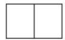

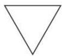

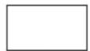  
$\sqrt{3}$ cm

1 cm

  
正视图

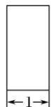  
侧视图

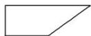  
俯视图

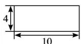  
正(主)视图

  
侧(左)视图

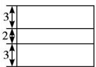  
俯视图

  
正视图  
图1

  
侧视图  
图2

  
俯视图  
图3

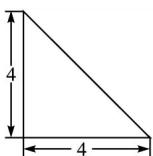  
正(主)视图

  
侧(左)视图

  
俯视图

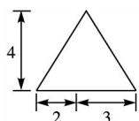  
正(主)视图

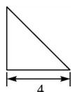  
侧(左)视图

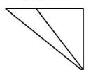  
俯视图

  
正(主)视图

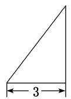  
侧(左)视图

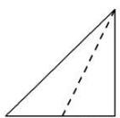  
正视图

  
侧视图

  
正视图

  
侧视图

  
俯视图

  
俯视图

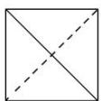  
俯视图

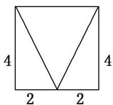  
正视图

  
侧视图

  
正视图

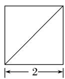  
侧视图

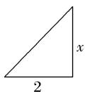  
正视图

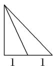  
侧视图

  
俯视图

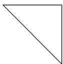  
俯视图

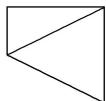  
俯视图

正视图

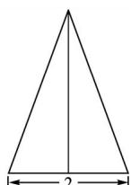  
侧视图

  
正(主)视图

  
侧(左)视图

  
正视图

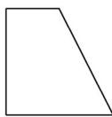  
侧视图

  
俯视图

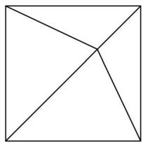

俯视图

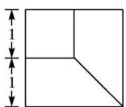  
俯视图

[解析] 直三棱柱 直三棱柱 直四棱柱 直四棱柱 斜四棱柱 斜四棱柱 三棱锥 三棱锥 三棱锥 三棱锥 三棱锥 三棱锥 四棱锥 四棱锥 四棱锥 四棱锥 四棱锥 四棱锥 四棱台.

# 二 锥体几何体还原

锥体几何体还原口诀(六线诀)

点点线线断底面，定长锁高宽相连，双线汇交寻阵眼，返璞归真显在前.

# 【例题选讲】

[例 2] 下图是一些锥体的三视图，还原其直观图.

  
正(主)视图

  
侧(左)视图

  
正(主)视图

  
侧(左)视图

  
俯视图

  
俯视图

  
正(主)视图

  
侧(左)视图

  
正视图

  
侧视图

  
俯视图

  
俯视图

  
正视图

  
侧视图

  
俯视图

正视图

  
侧视图

  
正视图

  
侧视图

  
正视图

  
侧视图

  
俯视图

  
俯视图

  
俯视图

  
正(主)视图

  
侧(左)视图

俯视图

正视图  
  
俯视图

  
侧视图

  
正视图

  
俯视图

  
侧视图

[解析]   

# 【对点训练】

1. 已知某几何体的三视图如图所示, 正视图和侧视图都是矩形, 俯视图是正方形, 在该几何体上任意选择 4 个顶点, 以这 4 个点为顶点的几何体的形状给出下列命题: ①矩形; ②有三个面为直角三角形, 有一个面为等腰三角形的四面体; ③两个面都是等腰直角三角形的四面体.

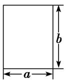  
正视图

  
侧视图

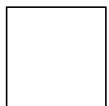  
俯视图
其中正确命题的序号是\_\_\_\_。

1. 答案 ①② 解析 由三视图可知，该几何体是正四棱柱，作出其直观图为如图所示的四棱柱 ABCD - $A_{1}B_{1}C_{1}D_{1}$ ，当选择的 4 个点是 $B_{1}, B, C, C_{1}$ 时，可知①正确；当选择的 4 个点是 $B, A, B_{1}, C$ 时，可知②正确；易知③不正确.

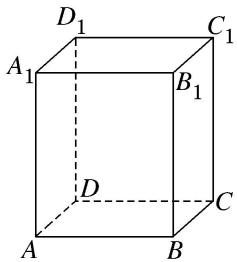

2. 如图是一个几何体的三视图, 若其正视图的面积等于 $8 \mathrm{~cm}^{2}$ , 俯视图是一个面积为 $4 \sqrt{3} \mathrm{~cm}^{2}$ 的正三角形, 则其侧视图的面积等于 \_\_\_\_.

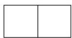  
正视图

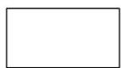  
侧视图

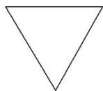  
俯视图

2. 答案 $4\sqrt{3} \mathrm{~cm}^{2}$ 解析 易知三视图所对应的几何体为正三棱柱，设其底面边长为 $a$ ，高为 $h$ ，则其正视图的长为 $a$ ，宽为 $h$ ，故其面积为 $S_{1}=ah=8$ ；①．而俯视图是一个底面边长为 $a$ 的正三角形，其面积为 $S_{2}=\frac{\sqrt{3}}{4}a^{2}=4\sqrt{3}$ ，②．由②得 $a=4$ ，代入①得 $h=2$ ．侧视图是一个长为 $\frac{\sqrt{3}}{2}a$ ，宽为 $h$ 的矩形，其面积为 $S_{3}=\frac{\sqrt{3}}{2}ah=4\sqrt{3} (\mathrm{cm}^{2})$ 。

3. (2019·银川模拟)如图, 水平放置的三棱柱的侧棱长为 1 , 且侧棱 $AA_{1} \perp$ 平面 $A_{1}B_{1}C_{1}$ , 正视图是边长为 1 的正方形, 俯视图为一个等边三角形, 则该三棱柱的侧视图面积为( )

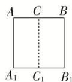

正视图  
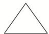  
俯视图

A. $2 \sqrt{3}$

B. $\sqrt{3}$

C. $\frac{\sqrt{3}}{2}$

D. 1

3. 答案 C 解析 由直观图、正视图以及俯视图可知，侧视图是宽为 $\frac{\sqrt{3}}{2}$ ，长为1的长方形，所以其面积 $S = \frac{\sqrt{3}}{2} \times 1 = \frac{\sqrt{3}}{2}$ . 故选C.

4. (2018·全国 I)某圆柱的高为 2，底面周长为 16，其三视图如图所示．圆柱表面上的点 M 在正视图上的对应点为 A，圆柱表面上的点 N 在左视图上的对应点为 B，则在此圆柱侧面上，从 M 到 N 的路径中，最短路径的长度为( )

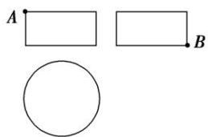

A. $2 \sqrt{17}$

B. $2 \sqrt{5}$

C. 3

D. 2

4. 答案 B 解析 先画出圆柱的直观图，根据题图的三视图可知点 M, N 的位置如图①所示.

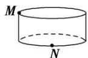  
①

  
②

圆柱的侧面展开图及 $M, N$ 的位置 ( $N$ 为 $OP$ 的四等分点) 如图②所示，连接 $MN$ ，则图中 $MN$ 即为 $M$ 到 $N$ 的最短路径。 $ON = \frac{1}{4} \times 16 = 4, OM = 2, \therefore |MN| = \sqrt{OM^2 + ON^2} = \sqrt{2^2 + 4^2} = 2\sqrt{5}$ 。故选 B.

5. (2019·四川成都七中诊断)一个棱锥的三视图如图所示，则该棱锥的外接球的体积是( )

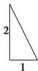  
正视图

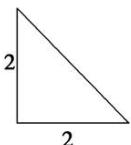  
侧视图

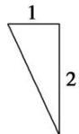  
俯视图

A. $9\pi$

B. $\frac{9\pi}{2}$

C. $36\pi$

D. $18\pi$

5. 答案 B 解析 由三视图可知，棱锥为三棱锥，放在长方体中，为如图所示的三棱锥 A-BCD。该三棱锥的外接球就是长方体的外接球，外接球的直径等于长方体的体对角线的长，所以球的半径 $R = \frac{1}{2} \times \sqrt{2^2 + 2^2 + 1^2} = \frac{3}{2}$ ，则外接球的体积 $V = \frac{4}{3}\pi \times \left(\frac{3}{2}\right)^3 = \frac{9\pi}{2}$ . 故选 B.

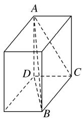

6. 某几何体的三视图如图所示, 则该几何体的体积是( )

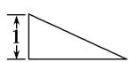  
正视图

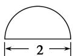  
侧视图

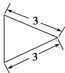  
俯视图

A. $\frac{2\sqrt{2}}{3}\pi$

B. $\frac{\pi}{2}$

C. $\frac{\sqrt{2}}{3}\pi$

D. $\pi$

6. 答案 C 解析 由三视图知，几何体是以半径为 1，母线长为 3 的半圆锥，几何体的体积 $V = \frac{1}{3} \times \frac{1}{2} \times \pi \times 1^2 \times \sqrt{3^2 - 1^2} = \frac{\sqrt{2}}{3}\pi$ . 故选 C.

7. 某几何体的三视图如图所示, 且该几何体的体积是 $\frac{3}{2}$ , 则正视图中的 $x$ 是( )

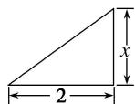  
正视图

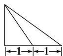  
侧视图

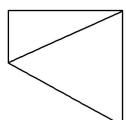  
俯视图

A. 2

B. 4.5

C. 1.5

D. 3

7. 答案 C 解析 由三视图可知, 几何体为四棱锥, 其底面为直角梯形, 面积 $S = \frac{1}{2} \times (1 + 2) \times 2 = 3$ . 由该几何体的体积 $V = \frac{1}{3} \times 3x = \frac{3}{2}$ , 解得 $x = 1.5$ . 故选 C.

8. (2018·北京)某四棱锥的三视图如图所示, 在此四棱锥的侧面中, 直角三角形的个数为( )

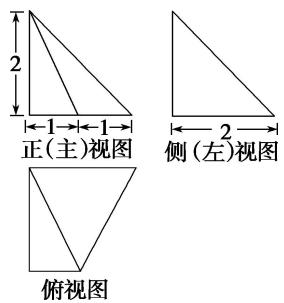

A. 1

B. 2

C. 3

D. 4

8. 答案 C 解析 将三视图还原为直观图，几何体是底面为直角梯形，且一条侧棱和底面垂直的四棱锥，如图所示．易知， $BC \parallel AD$ ，BC=1，AD=AB=PA=2， $AB \perp AD$ ， $PA \perp$ 平面 ABCD，故△PAD，△PAB 为直角三角形，因为 $PA \perp$ 平面 ABCD， $BC \subset$ 平面 ABCD，所以 $PA \perp BC$ ，又 $BC \perp AB$ ，且 $PA \cap AB = A$ ，所以 $BC \perp$ 平面 PAB，又 $PB \subset$ 平面 PAB，所以 $BC \perp PB$ ，所以 △PBC 为直角三角形，容易求得 PC =3， $CD = \sqrt{5}$ ， $PD = 2\sqrt{2}$ ，故 △PCD 不是直角三角形，故选 C.

9. 已知以下三视图中有三个同时表示某一个棱锥，则下列不是该三棱锥的三视图的是()

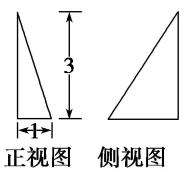

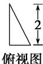  
A

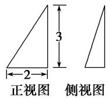

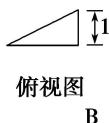

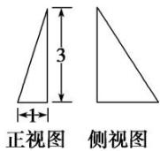

9. 答案 D 解析 四个选项中, 因为观察的位置不同, 得到的三个视图也不同。可从俯视图入手, 以 A 选项中的正方向作为标准。则 A 中的方向, B 中的方向, C 中的方向。依次如图所示

10. 某几何体的三视图如图所示，则该几何体的体积为( )

A. 1

B. $\frac{1}{2}$

C. $\frac{1}{3}$

D. $\frac{1}{4}$

10. 答案 C 解析 法一：该几何体的直观图为四棱锥 SABCD，如图， $SD \perp$ 平面 ABCD，且 SD = 1，四边形 ABCD 是平行四边形，且 AB = DC = 1，连接 BD，由题意知 $BD \perp DC, BD \perp AB$ ，且 BD = 1，所以 $S_{四边形ABCD} = 1$ ，所以 $V_{SABCD} = \frac{1}{3} S_{四边形ABCD} \cdot SD = \frac{1}{3}$ ，故选 C.

法二：由三视图易知该几何体为锥体，所以 $V=\frac{1}{3}Sh$ ，其中 S 指的是锥体的底面积，即俯视图中四边形的面积，易知 S=1，h 指的是锥体的高，从正视图和侧视图易知 h=1，所以 $V=\frac{1}{3}Sh=\frac{1}{3}$ ，故选 C.

11. (2019·南昌联考)已知底面为正方形的四棱锥，其一条侧棱垂直于底面，那么该四棱锥的三视图可能是下列各图中的( )

11. 答案 C 解析 由题意，该四棱锥的直观图如图所示：

12. 如图, 网格纸上小正方形的边长为 1 , 粗线画出的是某几何体的正视图和侧视图, 且该几何体的体积为 $\frac{8}{3}$ , 则该几何体的俯视图可以是( )

12. 答案 C 解析 若俯视图为选项 C 中的图形，则该几何体为正方体截去一部分后的四棱锥 P-AB CD，如图所示，该四棱锥的体积 $V=\frac{1}{3}\times(2\times2)\times2=\frac{8}{3}$ ，符合题意。若俯视图为其他选项中的图形，则根据三视图易判断对应的几何体不存在，故选 C.

13. 如图, 网格纸上小正方形的边长为 1 , 粗线画出的是某三棱锥的三视图, 则该几何体的体积为( )

A. 4

B. 2

C. $\frac{4}{3}$

D. $\frac{2}{3}$

13. 答案 D 解析 由三视图可知, 几何体为三棱锥, 底面为腰长为 2 的等腰直角三角形, 高为 1 , 则该几何体的体积为 $\frac{1}{3} \times \frac{1}{2} \times 2 \times 2 \times 1 = \frac{2}{3}$ . 故选 D.

14. 某几何体的三视图如图所示, 则该几何体的外接球的表面积为( )

  
侧视图

A. $25\pi$

B. $26\pi$

C. $32\pi$

D. $36\pi$

14. 答案 C 解析 由三视图可知，该几何体是以俯视图的图形为底面，一条侧棱与底面垂直的三棱锥。如图，三棱锥 $A - BCD$ 即为该几何体，且 $AB = BD = 4$ ， $CD = 2$ ， $BC = 2\sqrt{3}$ ，则 $BD^{2} = BC^{2} + CD^{2}$ ，即 $\angle BCD = 90^{\circ}$ 。故底面外接圆的直径 $2r = BD = 4$

易知 $AD$ 为三棱锥 $A - BCD$ 的外接球的直径．设球的半径为 $R$ ，则由勾股定理得 $4R^{2} = AB^{2} + 4r^{2} = 32$ 故该几何体的外接球的表面积为 $4\pi R^2 = 32\pi$ ，故选C.

15. (2019·福建漳州调研)某三棱锥的三视图如图所示，则该三棱锥的最长棱的长度为( )

  
正（主）视图

  
侧（左）视图

  
俯视图

A. $\sqrt{5}$

B. $2\sqrt{2}$

C. 3

D. $2\sqrt{3}$

15. 答案 C 解析 在棱长为 2 的正方体 $ABCD - A_{1}B_{1}C_{1}D_{1}$ 中， $M$ 为 $AD$ 的中点，该几何体的直观图如图中三棱锥 $D_{1} - MB_{1}C$ . 故通过计算可得 $D_{1}C = D_{1}B_{1} = B_{1}C = 2\sqrt{2}$ ， $D_{1}M = MC = \sqrt{5}$ ， $MB_{1} = 3$ ，故最长棱的长度为 3，故选 C.

16. (2019·武汉调研)已知某四棱锥的三视图如图所示，则该四棱锥的四个侧面中最小的面积为\_\_\_\_。

  
正视图

  
侧视图

  
俯视图

16. 答案 $\frac{1}{2}$ 解析 由三视图知，该几何体是在长、宽、高分别为 2, 1, 1 的长方体中，截去一个三棱柱 $AA_{1}D_{1}-BB_{1}C_{1}$ 和一个三棱锥 $CBC_{1}D$ 后剩下的几何体，即如图所示的四棱锥 $D-ABC_{1}D_{1}$ ，其中侧面 $ADD_{1}$ 的面积最小，其值为 $\frac{1}{2}$ .

17. 某几何体的三视图如图所示，则该几何体外接球的表面积是( )

  
正(主)视图

  
侧(左)视图

  
俯视图

A. $8\pi$

B. $12\pi$

C. $16\pi$

D. $\frac{25\pi}{2}$

17. 答案 D 解析 如图所示，该几何体是三棱锥 $D - ABC$ ，其中 $AB = 2\sqrt{2}$ ， $AC = 2$ ， $BC = 2\sqrt{3}$ ，取 $BC$ 的中点 $E$ ，则 $DE = \sqrt{2}$ ，且 $AB \perp AC, DE \perp$ 平面 $ABC$ ，故外接球球心 $O$ 必在直线 $DE$ 上，设三棱锥 $D - ABC$ 外接球的半径为 $R$ ，由 $(OD - DE)^2 + EC^2 = OC^2 = R^2$ ，得 $(R - \sqrt{2})^2 + (\sqrt{3})^2 = R^2$ ，解得 $R^2 = \frac{25}{8}$ ，故三棱锥 $D - ABC$ 的外接球的表面积 $S = 4\pi R^2 = \frac{25\pi}{2}$ ，故选 D.

18. 如图, 网格上小正方形的边长为 1 , 粗线画出的是某个多面体的三视图, 若该多面体的所有顶点都在球 $O$ 的表面上, 则球 $O$ 的表面积是 ( )

A. $36\pi$

B. $48\pi$

C. $56\pi$

D. $64\pi$

18. 答案 C 解析 根据三视图知几何体是三棱锥 $D - ABC$ ，为棱长为 4 的正方体的一部分，直观图如图所示.

∵该多面体的所有顶点都在球 O 的表面上，∴由正方体的性质，得球心 O 到平面 ABC 的距离 d=2，由正方体的性质，可得 $AB=BD=\sqrt{4^{2}+2^{2}}=2\sqrt{5}$ ， $AC=4\sqrt{2}$ ，设 $\triangle ABC$ 的外接圆的半径为 r，在 $\triangle ABC$ 中， $\angle ACB=45^{\circ}$ ，则 $\sin\angle ACB=\frac{\sqrt{2}}{2}$ ，由正弦定理可得， $2r=\frac{AB}{\sin\angle ACB}=\frac{2\sqrt{5}}{\frac{\sqrt{2}}{2}}=2\sqrt{10}$ ，则 $r=\sqrt{10}$ ，则球 O 的半径 $R=\sqrt{r^{2}+d^{2}}=\sqrt{14}$ ，∴球 O 的表面积 $S=4\pi R^{2}=56\pi$ .

# 三 秒杀锥体体积与面积典例

# 【例题选讲】

[例 3] （1）某几何体的三视图如图所示，则该几何体的体积为()

正(主)视图

  
侧(左)视图

  
俯视图

A. $\frac{\sqrt{2}}{3}$

B. $\frac{2\sqrt{2}}{3}$

C. $\sqrt{2}$

D. $2\sqrt{2}$  
（2）一个四面体的三视图如图所示，则该四面体的体积是()

  
正(主)视图

  
侧(左)视图

  
俯视图

A. $\frac{1}{2}$

B. $\frac{1}{3}$

C. $\frac{2}{3}$

D. 1  
（3）(2017·北京)某三棱锥的三视图如图所示，则该三棱锥的体积为()

  
正(主)视图

  
侧(左)视图

  
俯视图

A. 60

B. 30

C. 20

D. 10  
（4）(2018·福州四校联考)已知某几何体的三视图如图所示，则该几何体的表面积为()

  
正视图

  
侧视图

  
俯视图

A. $\frac{27}{2}$

B. 27

C. $27\sqrt{2}$

D. $27\sqrt{3}$  
（5）某四棱锥的三视图如图所示，则该四棱锥的侧面积是()

  
正视图

  
侧视图

  
俯视图

A. $4 + 4\sqrt{2}$

B. $4\sqrt{2}+2$

C. $8+4\sqrt{2}$

D. $\frac{8}{3}$  
（6）某几何体的三视图如图所示，则该几何体中，面积最大的侧面的面积为\_\_\_\_。

[解析] （1）答案 B 题中三视图表示的几何体如图所示，其中 $\triangle PAD$ 为等腰直角三角形，平面 $PAD \perp$ 平面 $ABCD$ ，四边形 $ABCD$ 为矩形且面积为 $2\sqrt{2}$ ，点 $P$ 到平面 $ABCD$ 的距离为1，故体积为 $\frac{1}{3} \times 1 \times 2\sqrt{2} = \frac{2\sqrt{2}}{3}$ ，故选B.

  
（2）答案 B 根据题意得到原四面体是底面为等腰直角三角形,高为 1 的三棱锥,故得到体积为 $\frac{1}{3} \times \frac{1}{2} \times 2 \times 1 \times 1 = \frac{1}{3}$ . 故选 B.  
（3）答案 D 如图，把三棱锥 A-BCD 放到长方体中，长方体的长、宽、高分别为 5,3,4， $\triangle BCD$ 为直角三角形，直角边分别为 5 和 3，三棱锥 A-BCD 的高为 4，故该三棱锥的体积 $V=\frac{1}{3}\times\frac{1}{2}\times5\times3\times4=10$ 。故选 D.
> 

> 
> |  |  |  |
> | --- | --- | --- |
> | （4）答案 D 在长、宽、高分别为 $3\sqrt{3}$ , 3, $3\sqrt{3}$ 的长方体中, 由几何体的三视图得几何体为如图所示的三棱锥 $C - BAP$ , 其中底面 $BAP$ 是 $\angle BAP = 90^{\circ}$ 的直角三角形, $AB = 3$ , $AP = 3\sqrt{3}$ , 所以 $BP = 6$ , 又棱 $CB \perp$ 平面 $BAP$ 且 $CB = 3\sqrt{3}$ , 所以 $AC = 6$ , 所以该几何体的表面积是 $\frac{1}{2} \times 3 \times 3\sqrt{3} + \frac{1}{2} \times 3 \times 3\sqrt{3} + \frac{1}{2} \times 6 \times 3\sqrt{3} + \frac{1}{2} \times 6 \times 3\sqrt{3} = 27\sqrt{3}$ , 故选 D. | （5）答案 A 由三视图可知该几何体是一个四棱锥，记为四棱锥 P-ABCD，如图所示，其中 $PA \perp$ 底面 ABCD，四边形 ABCD 是正方形，且 PA=2, AB=2, $PB=2\sqrt{2}$ ，所以该四棱锥的侧面积 S 是四个直角三角形的面积和，即 $S=2\times(\frac{1}{2}\times2\times2+\frac{1}{2}\times2\times2\sqrt{2})=4+4\sqrt{2}$ ，故选 A. | （6）答案 $\frac{\sqrt{5}}{2}$ 由三视图可知，几何体的直观图如图所示，平面 $AED \perp$ 平面 $BCDE$ ，四棱锥 $ABCDE$ 的高为1，四边形 $BCDE$ 是边长为1的正方形，则 $S_{\triangle ABC} = S_{\triangle ABE} = \frac{1}{2} \times 1 \times \sqrt{2} = \frac{\sqrt{2}}{2}, S_{\triangle ADE} = \frac{1}{2}, S_{\triangle ACD} = \frac{1}{2} \times 1 \times \sqrt{5} = \frac{\sqrt{5}}{2}$ ，故面积最大的侧面的面积为 $\frac{\sqrt{5}}{2}$ . |
> 

# 【对点训练】

1. 一个几何体的三视图如图所示, 其中正视图是一个正三角形, 则该几何体的体积为( )

A. $\frac{\sqrt{3}}{3}$

B. 1

C. $\frac{2\sqrt{3}}{3}$

D. $\sqrt{3}$

1. 答案 A 解析 根据三视图可知该几何体是一个高为 $\sqrt{3}$ 的三棱锥，所以该几何体的体积 $V = \frac{1}{3} \times \left[\frac{1}{2} \times 2 \times 1\right] \times \sqrt{3} = \frac{\sqrt{3}}{3}$ .

2. 某几何体的三视图如图所示, 则该几何体的体积为( )

A. $\frac{2\sqrt{2}}{3}$

B. $\frac{2\sqrt{3}}{3}$

C. $\frac{4\sqrt{2}}{3}$

D. $\frac{4\sqrt{3}}{3}$

2. 答案 D 解析 由三视图可知该几何体是一个以俯视图为底面的四棱锥，其直观图如图所示．底面 $ABCD$ 的面积为 $2 \times 2 = 4$ ，高 $PO = \sqrt{3}$ ，故该几何体的体积 $V = \frac{1}{3} \times 4 \times \sqrt{3} = \frac{4\sqrt{3}}{3}$ .

3. 一个几何体的三视图如图所示，则该几何体的体积为\_\_\_\_。

3. 答案 $\frac{2}{3}$ 解析 由题图可知该几何体是一个四棱锥，如图所示，其中 $PD \perp$ 平面 $ABCD$ ，底面 $ABCD$ 是一个对角线长为 2 的正方形，底面积 $S = \frac{1}{2} \times 2 \times 2 = 2$ ，高 $h = 1$ ，则该几何体的体积 $V = \frac{1}{3} Sh = \frac{2}{3}$ .

4. 某几何体的三视图如图所示(单位: cm), 则该几何体的体积(单位: $\mathrm{cm}^{3}$ )是()

正视图  
  
俯视图

A. 2

B. 3

C. 4

D. 6

4. 答案 A 解析 将俯视图的对角线的交点向上拉起，结合正视图与侧视图知，此空间几何体是底面为正方形(边长 $\sqrt{2}$ )，高为3的正四棱锥，则其体积 $V=\frac{1}{3}Sh=\frac{1}{3}\times(\sqrt{2})^{2}\times3=2$ ，故选A.

5. 一个几何体的三视图如图所示, 则该几何体的体积为( )

  
侧视图

正视图  
  
俯视图

A. 1

B. $\frac{3}{2}$

C. $\frac{1}{2}$

D. $\frac{3}{4}$

5. 答案 C 解析 由题可得，该几何体是一个四棱锥，底面是上下底边分别为 1 和 2，高为 1 的直角梯形，又四棱锥的高为 1。所以该几何体的体积为 $V=\frac{1}{3}\times\frac{1}{2}\times(1+2)\times1\times1=\frac{1}{2}$ .

6. 如图, 网格纸上小正方形的边长为 1 , 粗实线及粗虚线画出的是某多面体的三视图, 则该多面体的体积为( )

A. $\frac{2}{3}$

B. $\frac{4}{3}$

C. 2

D. $\frac{8}{3}$

6. 答案 A 解析 由三视图可知，该几何体为三棱锥，将其放在棱长为 2 的正方体中，如图中三棱锥 A - BCD 所示，故该几何体的体积 $V=\frac{1}{3}\times\frac{1}{2}\times1\times2\times2=\frac{2}{3}$ .

7. 如图所示, 网格纸上小正方形的边长为 1 , 粗实线及粗虚线画出的是三棱锥的三视图, 则此三棱锥的体积是( )

A. 8

B. 16

C. 24

D. 48

7. 答案 A 解析 由三视图还原三棱锥的直观图，如图中三棱锥 P-ABC 所示，且长方体的长、宽、高分别为 6, 2, 4, $\triangle ABC$ 是直角三角形， $AB \perp BC$ , AB = 2, BC = 6，三棱锥 PABC 的高为 4，故其体积为 $\frac{1}{3} \times \frac{1}{2} \times 6 \times 2 \times 4 = 8$ ，故选 A.

8. 某几何体的三视图如图所示, 则该几何体的体积为( )

A. $\frac{1}{2}$

B. $\frac{\sqrt{2}}{2}$

C. $\frac{\sqrt{3}}{3}$

D. $\frac{2}{3}$

  
正视图

  
侧视图

  
俯视图

8. 答案 D 解析 由三视图知，该几何体是在长、宽、高分别为 2, 1, 1 的长方体中，截去一个三棱柱 $AA_{1}D_{1} - BB_{1}C_{1}$ 和一个三棱锥 $C - BC_{1}D$ 后剩下的几何体，即如图所示的四棱锥 $D - ABC_{1}D_{1}$ ，四棱锥 $D - ABC_{1}D_{1}$ 的底面积为 $S_{\text{四边形 }ABC_{1}D_{1}} = 2 \times \sqrt{2} = 2\sqrt{2}$ ，高 $h = \frac{\sqrt{2}}{2}$ ，其体积 $V = \frac{1}{3} S_{\text{四边形 }ABC_{1}D_{1}} h = \frac{1}{3} \times 2\sqrt{2} \times \frac{\sqrt{2}}{2} = \frac{2}{3}$ . 故选 D.

9. 如图, 网格纸上小正方形的边长为 1 , 粗线画的是一个几何体的三视图, 则该几何体的体积为( )

A. 3

B. $\frac{11}{3}$

C. 7

D. $\frac{23}{3}$

9. 答案 B 解析 由题中的三视图可得, 该几何体是由一个长方体切去一个三棱锥所得的几何体, 长方体的长, 宽, 高分别为 2, 1, 2, 体积为 4, 切去的三棱锥的体积为 $\frac{1}{3}$ , 故该几何体的体积 $V = 4 - \frac{1}{3} = \frac{11}{3}$ . 故选 B

10. 某三棱锥的三视图如图所示，则该三棱锥的表面积是( )

  
正(主)视图

  
侧(左)视图

  
俯视图

A. $2 + \sqrt{5}$

B. $2 + 2\sqrt{5}$

C. $\frac{4}{3}$

D. $\frac{2}{3}$

10. 答案 B 解析 三棱锥的高为 1，底面为等腰三角形，如图，因此表面积是 $\frac{1}{2} \times 2 \times 2 + 2 \times \frac{1}{2} \times \sqrt{5} \times 1$
$+\frac{1}{2}\times\sqrt{5}\times2=2+2\sqrt{5}$ . 故选 B.

11. 一个几何体的三视图及其尺寸如图所示, 则该几何体的表面积为( )

  
正视图

  
侧视图

  
俯视图

A. 16

B. $8 \sqrt{2} + 8$

C. $2\sqrt{2}+2\sqrt{6}+8$

D. $4\sqrt{2} + 4\sqrt{6} + 8$

11. 答案 D 解析 由三视图知，该几何体是底面边长为 $\sqrt{2^2 + 2^2} = 2\sqrt{2}$ 的正方形，高 $PD = 2$ 的四棱锥 $P - ABCD$ ，因为 $PD \perp$ 平面 $ABCD$ ，且四边形 $ABCD$ 是正方形，

易得 $BC \perp PC, BA \perp PA$ ，又 $PC = \sqrt{PD^2 + CD^2} = \sqrt{2^2 + (2\sqrt{2})^2} = 2\sqrt{3}$ ，所以 $S_{\triangle PCD} = S_{\triangle PAD} = \frac{1}{2} \times 2 \times 2\sqrt{2} = 2\sqrt{2}$ ， $S_{\triangle PAB} = S_{\triangle PBC} = \frac{1}{2} \times 2\sqrt{2} \times 2\sqrt{3} = 2\sqrt{6}$ ，所以几何体的表面积为 $4\sqrt{6} + 4\sqrt{2} + 8$ 。

12. 如图, 网格纸上小正方形的边长为 1 , 粗线是一个棱锥的三视图, 则该棱锥的表面积为( )

俯视图

A. $6+4\sqrt{2}+2\sqrt{3}$

B. $8+4\sqrt{2}$

C. $6+6\sqrt{2}$

D. $6+2\sqrt{2}+4\sqrt{3}$

12. 答案 A 解析 由三视图可知该棱锥为如图所示的四棱锥 $P - ABCD$ ， $S_{\triangle PAB} = S_{\triangle PAD} = S_{\triangle PDC} = \frac{1}{2} \times 2 \times 2 = 2$ ， $S_{\triangle PBC} = \frac{1}{2} \times 2\sqrt{2} \times 2\sqrt{2} \times \sin 60^\circ = 2\sqrt{3}$ ， $S_{\text{四边形 }ABCD} = 2\sqrt{2} \times 2 = 4\sqrt{2}$ ，故该棱锥的表面积为 $6 + 4\sqrt{2} + 2\sqrt{3}$ .

13. 某四面体的三视图如图所示，正视图、侧视图都是腰长为 2 的等腰直角三角形，俯视图是边长为 2 的

正方形，则此四面体的最大面的面积是( )

  
正视图

  
侧视图

  
俯视图

A. 2

B. $2\sqrt{2}$

C. $2\sqrt{3}$

D. 4

13. 答案 C 解析 由三视图得该几何体如图中的三棱锥 A-BCD 所示，则 $S_{\triangle ABD}=\frac{1}{2}\times(2\sqrt{2})^{2}\times\frac{\sqrt{3}}{2}=$ $2\sqrt{3}$ ， $S_{\triangle BCD}=\frac{1}{2}\times2\times2=2$ ， $S_{\triangle ABC}=S_{\triangle ADC}=\frac{1}{2}\times2\sqrt{2}\times2=2\sqrt{2}$ ，所以最大面的面积为 $2\sqrt{3}$ ，故选 C.

14. 某四棱锥的三视图如图所示，则该四棱锥的最长棱的长度为( )

  
正(主)视图

  
侧(左)视图

  
俯视图

A. $3 \sqrt{2}$

B. $2 \sqrt{3}$

C. $2\sqrt{2}$

D. 2

14. 答案 B 解析 在正方体中还原该四棱锥，如图所示，

可知 $SD$ 为该四棱锥的最长棱，由三视图可知正方体的棱长为2，故 $SD = \sqrt{2^2 + 2^2 + 2^2} = 2\sqrt{3}$ 。故选B.

15.《九章算术》是我国古代内容极为丰富的数学名著，系统地总结了战国、秦、汉时期的数学成就。书中将底面为长方形且有一条侧棱与底面垂直的四棱锥称之为“阳马”，若某“阳马”的三视图如图所示(网格纸上小正方形的边长为1)，则该“阳马”最长的棱长为\_\_\_\_。

15. 答案 $5\sqrt{2}$ 解析 由三视图知，几何体是四棱锥，且四棱锥的一条侧棱与底面垂直，如图所示.

其中 $PA \perp$ 平面 $ABCD, \therefore PA = 3, AB = CD = 4, AD = BC = 5, \therefore PB = \sqrt{9 + 16} = 5, PC = \sqrt{9 + 16 + 25} = 5\sqrt{2}, PD = \sqrt{9 + 25} = \sqrt{34}$ . $\therefore$ 该几何体最长的棱长为 $5\sqrt{2}$ .

# 四 秒杀组合体三视图典例

秒杀组合体三视图的思维逻辑：

1. 判断组合体的形式

①. 上下组合结构(由正视图和侧视图可判断)  
2. 前后组合结构(由侧视图和俯视图可判断)  
③. 左右组合结构(由正视图和俯视图可判断)

2. 利用另一视图确定组合体的形状;

3. 检验各视图是否满足题意.

# 【例题选讲】

[例 4] （1）(2017·全国 I)某多面体的三视图如图所示，其中正视图和左视图都由正方形和等腰直角三角形组成，正方形的边长为 2，俯视图为等腰直角三角形．该多面体的各个面中有若干个是梯形，这些梯形的面积之和为( )

A. 10

B. 12

C. 14

D. 16  
（2）(2016·全国Ⅱ)如图是由圆柱与圆锥组合而成的几何体的三视图，则该几何体的表面积为( )

A. $20\pi$

B. $24\pi$

C. $28\pi$

D. $32\pi$  
（3）某几何体的三视图如图所示，三个视图中的曲线都是圆弧，则该几何体的体积为( )

A. $\frac{4\pi}{3}$

B. $\frac{5\pi}{3}$

C. $\frac{7\pi}{6}$

D. $\frac{11\pi}{6}$  
（4）(2017·山东)由一个长方体和两个 $\frac{1}{4}$ 圆柱构成的几何体的三视图如图, 则该几何体的体积为\_\_\_\_.

  
正视图

  
侧视图

俯视图  
（5）(2017·浙江)某几何体的三视图如图所示(单位: cm), 则该几何体的体积(单位: $\mathrm{cm}^3$ )是()

  
正视图

  
侧视图

  
俯视图

A. $\frac{\pi}{2} + 1$

B. $\frac{\pi}{2} + 3$

C. $\frac{3\pi}{2} + 1$

D. $\frac{3\pi}{2} + 3$  
（6）某几何体的三视图如图所示，则该几何体的体积是()

A. $\frac{4\pi}{3}$

B. $\frac{5\pi}{3}$

C. $2+\frac{2\pi}{3}$

D. $4 + \frac{2\pi}{3}$

[解析] （1）答案 B 由三视图可知该多面体是一个组合体，下面是一个底面是等腰直角三角形的直三棱柱，上面是一个底面是等腰直角三角形的三棱锥，等腰直角三角形的腰长为2，直三棱柱的高为2，三棱锥的高为2，易知该多面体有2个面是梯形，这些梯形的面积之和为 $\frac{(2+4)\times2}{2}\times2=12$ ，故选B.

  
（2）答案 C 由三视图知该几何体是圆锥与圆柱的组合体，设圆柱底面圆半径为 r，周长为 c，圆锥母线长为 l，圆柱高为 h。由图得 r=2， $c=2\pi r=4\pi$ ，h=4，由勾股定理得： $l=\sqrt{2^{2}+(2\sqrt{3})^{2}}=4$ ， $S_{表}=\pi r^{2}+ch+\frac{1}{2}cl=4\pi+16\pi+8\pi=28\pi$ 。故选 C。  
（3）答案 B 由三视图可知，该几何体是由半个圆柱与 $\frac{1}{8}$ 个球组成的组合体，其体积为 $\frac{1}{2}\times\pi\times1^{2}\times3+\frac{1}{8}\times\frac{4\pi}{3}\times1^{3}=\frac{5\pi}{3}.$
> 

> 
> |  |  |
> | --- | --- |
> | （4）答案 $2 + \frac{\pi}{2}$ 该几何体由一个长、宽、高分别为2，1，1的长方体和两个半径为1，高为1的 $\frac{1}{4}$ 圆柱体构成．所以 $V = 2\times 1\times 1 + 2\times \frac{1}{4}\times \pi \times 1^2\times 1 = 2 + \frac{\pi}{2}.$ | （5）答案 A 由三视图可知，该几何体是半个圆锥和一个三棱锥的组合体，半圆锥的底面半径为1，高为3，三棱锥的底面积为 $\frac{1}{2}\times2\times1=1$ ，高为3．故原几何体体积为： $V=\frac{1}{2}\times\pi\times1^{2}\times3\times\frac{1}{3}+1\times3\times\frac{1}{3}=\frac{\pi}{2}+1$ ．故选A. |
> 
  
（6）答案 B 由三视图可知，该几何体为一个半径为 1 的半球与一个底面半径为 1，高为 2 的半圆柱组合而成的组合体，故其体积 $V = \frac{2}{3}\pi \times 1^3 + \frac{1}{2}\pi \times 1^2 \times 2 = \frac{5}{3}\pi$ ，故选 B.

# 【对点训练】

1. 如图是一个体积为 10 的空间几何体的三视图，则图中 $x$ 的值为( )

  
正视图

  
侧视图

  
俯视图

A. 2

B. 3

C. 4

D. 5

1. 答案 A 解析 根据给定的三视图可知，该几何体对应的直观图是一个长方体和四棱锥的组合体，所以几何体的体积 $V=3\times2\times1+\frac{1}{3}\times3\times2\times x=10$ ，解之得 x=2。

2. 已知一几何体的三视图如图所示, 它的侧(左)视图与正(主)视图相同, 则该几何体的体积为( )

  
正(主)视图

  
侧(左)视图

  
俯视图

A. $\frac{16}{3}\pi+\frac{8\sqrt{2}}{3}$

B. $\frac{8}{3}\pi +\frac{8\sqrt{2}}{3}$

C. $\frac{16}{3}\pi + 8\sqrt{2}$

D. $\frac{8}{3}\pi + 8\sqrt{2}$

2. 答案 A 解析 由三视图知该几何体是正四棱锥(底面为正方形，且顶点在底面的射影为正方形的中心的棱锥)与半球体的组合体，且正四棱锥的高为 $\sqrt{2}$ ，底面对角线长为 4，球的半径为 2，所以组合体的体积为 $V = \frac{1}{2} \times \frac{4}{3} \pi \times 2^3 + \frac{1}{3} \times \frac{1}{2} \times 4^2 \times \sqrt{2} = \frac{16}{3} \pi + \frac{8\sqrt{2}}{3}$ .

3. 一个由半球和四棱锥组成的几何体, 其三视图如图所示, 则该几何体的体积为( )

  
正视图

  
侧视图

  
俯视图

A. $\frac{1}{3} +\frac{2}{3}\pi$

B. $\frac{1}{3} +\frac{\sqrt{2}}{3}\pi$

C. $\frac{1}{3} +\frac{\sqrt{2}}{6}\pi$

D. $1 + \frac{\sqrt{2}}{6}\pi$

3. 答案 C 解析 由三视图知，半球的半径 $R = \frac{\sqrt{2}}{2}$ ，四棱锥为底面边长为 1，高为 1 的正四棱锥， $\therefore V = \frac{1}{3} \times 1 \times 1 + \frac{1}{2} \times \frac{4}{3} \pi \times \left(\frac{\sqrt{2}}{2}\right)^{3} = \frac{1}{3} + \frac{\sqrt{2}}{6} \pi$ ，故选 C.

4. (2016·浙江)某几何体的三视图如图所示(单位: cm), 则该几何体的表面积是 $\mathrm{cm}^{2}$ , 体积是 $\mathrm{cm}^{3}$ .

4. 答案 72 32 解析 由三视图可知，该几何体为两个相同长方体组合，长方体的长、宽、高分别为 $4 \mathrm{~cm}$ 、 $2 \mathrm{~cm}$ 、 $2 \mathrm{~cm}$ ，其直观图如下：

其体积 $V=2\times2\times2\times4=32(\mathrm{cm}^{3})$ ，由于两个长方体重叠部分为一个边长为 2 的正方形，所以表面积为 $S=2(2\times2\times2+2\times4\times4)-2\times2\times2=2\times(8+32)-8=72(\mathrm{cm}^{2})$ .

5. 一个几何体的三视图如图所示，则该几何体的体积为\_\_\_\_。

  
正视图

  
侧视图

  
俯视图

5. 答案 $4 + 6\pi$ 解析 由三视图可知，几何体由半个圆柱和一个三棱锥的组合体，故体积为 $\frac{1}{2}\pi \times 2^2 \times 3 + \frac{1}{3} \times \frac{1}{2} \times 4 \times 2 \times 3 = 4 + 6\pi$ .

6. 如图, 网格纸上小正方形的边长为 1 , 粗线画出的是某几何体的三视图, 则该几何体的表面积为( )

A. $8+4\sqrt{2}+8\sqrt{5}$

B. $24+4\sqrt{2}$

C. $8+20\sqrt{2}$

D. 28

6. 答案 A 解析 由三视图可知，该几何体的下底面是长为 4，宽为 2 的矩形，左右两个侧面是底边为 2，高为 $2\sqrt{2}$ 的三角形，前后两个侧面是底边为 4，高为 $\sqrt{5}$ 的平行四边形，所以该几何体的表面积为 $S = 4 \times 2 + 2 \times \frac{1}{2} \times 2 \times 2\sqrt{2} + 2 \times 4 \times \sqrt{5} = 8 + 4\sqrt{2} + 8\sqrt{5}$ .

7. 一个几何体的三视图如图所示，则该几何体的体积是\_\_\_\_，表面积是\_\_\_\_。

  
正视图

  
侧视图

  
俯视图

7. 答案 $\frac{14}{3}\pi 6 + (6 + \sqrt{13})\pi$ 解析 由三视图知，该几何体是由四分之一球与半个圆锥组合而成，则该组合体的体积为 $V = \frac{1}{4} \times \frac{4}{3}\pi \times 2^3 + \frac{1}{2} \times \frac{1}{3}\pi \times 2^2 \times 3 = \frac{14}{3}\pi$ ，表面积为 $S = \frac{1}{4} \times 4\pi \times 2^2 + \frac{1}{2} \times \pi \times 2^2 + \frac{1}{2} \times 4 \times 3 + \frac{1}{2} \times \frac{1}{2} \times 2\pi \times 2 \times \sqrt{3^2 + 2^2} = 6 + (6 + \sqrt{13})\pi$ .

8.《九章算术》卷五商功中有如下问题：今有刍甍，下广三丈，袤四丈，上袤二丈，无广，高一丈，问积几何？刍甍：底面为矩形的屋脊状的几何体(网格纸中粗线部分为其三视图，设网格纸上每个小正方形的边长为1)，那么该刍甍的体积为()

A. 4

B. 5

C. 6

D. 12

8. 答案 B 解析

如图，由三视图可还原得几何体 $ABCDEF$ ，过 $E$ ， $F$ 分别作垂直于底面的截面 $EGH$ 和 $FMN$ ，将原几何体拆分成两个底面积为3，高为1的四棱锥和一个底面积为 $\frac{3}{2}$ ，高为2的三棱柱，所以 $V_{ABCDEF} = 2V_{\text{四棱锥}}$ $E - ADHG + V_{\text{三棱柱}EHG - FNM} = 2\times \frac{1}{3}\times 3\times 1 + \frac{3}{2}\times 2 = 5$ ，故选B.

9. 一个几何体按比例绘制的三视图如图所示(单位: m)，则该几何体的体积为(A)

  
正视图

  
侧视图

  
俯视图

A. $\frac{7}{2} \mathrm{~m}^{3}$

B. $\frac{9}{2}m^{3}$

C. $\frac{7}{3}$ m $^{3}$

D. $\frac{9}{4}m^{3}$

9. 答案 A 解析 由三视图可知，该几何体为如图所示的几何体，其体积为 3 个正方体的体积加三棱柱的体积，所以 $V = 3 + \frac{1}{2} = \frac{7}{2}$ . 故选 A.

# 五 秒杀切割体三视图典例

秒杀切割体三视图的思维逻辑：

1. 判断切割体的形式:

①. 完全轮廓切割体;  
②．不完全轮廓切割体；
2. 如果是不完全轮廓切割体先补成完全轮廓切割体;  
3. 检验各视图是否满足题意.

# 【例题选讲】

[例 5] （1）(2015·全国Ⅱ)一个正方体被一个平面截去一部分后，剩余部分的三视图如下图，则截去部分体积与剩余部分体积的比值为()

  
正(主)视图

  
侧(左)视图

  
俯视图

A. $\frac{1}{8}$

B. $\frac{1}{7}$

C. $\frac{1}{6}$

D. $\frac{1}{5}$  
（2）如图是某几何体的三视图，则该几何体的外接球的表面积为( )

  
正视图

  
侧视图

  
俯视图

A. $200\pi$

B. $150\pi$

C. $100\pi$

D. $50\pi$  
（3）如图, 网格纸上小正方形的边长为 1 , 下图画出的是某几何体的三视图, 则该几何体的表面积为 ( )

俯视图

A. $12\sqrt{13}+6\sqrt{2}+18$

B. $9\sqrt{13}+6\sqrt{2}+18$

C. $9\sqrt{13} + 8\sqrt{2} + 18$

D. $9\sqrt{13} + 6\sqrt{2} + 12$  
（4）如图是某几何体的三视图，则该几何体的体积为()

A. 12

B. 15

C. 18

D. 21

  
正视图

  
侧视图

  
俯视图  
（5）(2017·全国Ⅱ)如图，网格纸上小正方形的边长为1，粗实线画出的是某几何体的三视图，该几何体由一平面将一圆柱截去一部分后所得，则该几何体的体积为()

A. $90\pi$

B. $63\pi$

C. $42\pi$

D. $36\pi$  
（6）如图是一个空间几何体的正视图和俯视图，则它的侧视图为()

  
正视图

  
俯视图

  
A

  
B

  
C

  
D

[解析] （1）答案 D 由题意知该正方体截去了一个三棱锥，如图所示，设正方体棱长为 a，则 $V_{正方体}=a^{3}$ ， $V_{截去部分}=\frac{1}{6}a^{3}$ ，故截去部分体积与剩余部分体积的比值为 $\frac{1}{6}a^{3}:\frac{5}{6}a^{3}=1:5$ .

  
（2）答案 D 由三视图知，该几何体可以由一个长方体截去4个角后得到，此长方体的长、宽、高分别为5,4,3，所以外接球半径 $R$ 满足 $2R = \sqrt{4^2 + 3^2 + 5^2} = 5\sqrt{2}$ ，所以外接球的表面积为 $S = 4\pi R^2 = 4\pi \times \left(\frac{5\sqrt{2}}{2}\right)^2 = 50\pi$ ，故选D.  
（3）答案 B 作出该几何体的直观图如图所示(所作图形进行了一定角度的旋转)，故所求几何体的表面积 $S = 2 \times 3 \times \sqrt{13} + 2 \times \frac{1}{2} \times 3 \times \sqrt{13} + \frac{1}{2} \times 4 \times 6 + \frac{1}{2} \times 3 \times 4 + \frac{1}{2} \times 4 \times 3\sqrt{2} = 9\sqrt{13} + 6\sqrt{2} + 18$ ，故选 B.
> 

> 
> |  |  |
> | --- | --- |
> | （4）答案 C 由三视图可得该几何体是一个长、宽、高分别为 4, 3, 3 的长方体切去一半得到的, 其直观图如图所示. 其体积为 $\frac{1}{2} \times 4 \times 3 \times 3 = 18$ , 故选 C. | （5）答案 B 由题意知，该几何体由底面半径为 3，高为 10 的圆柱截去底面半径为 3，高为 6 的圆柱的一半所得，故其体积 $V = \pi \times 3^2 \times 10 - \frac{1}{2} \times \pi \times 3^2 \times 6 = 63\pi$ . 故选 B. |
> 
  
（6）答案 A 由正视图和俯视图可知，该几何体是由一个圆柱挖去一个圆锥构成的，结合正视图的宽及俯视图的直径可知侧视图应为 A，故选 A.

# 【对点训练】

1. (2013 浙江)已知某几何体的三视图(单位: cm)如图所示, 则该几何体的体积是().

A. $108 \mathrm{~cm}^{3}$

B. $100 \mathrm{~cm}^{3}$

C. $92 \, cm^{3}$

D. $84 \, cm^{3}$

1. 答案：B 解析 由三视图可知，该几何体是如图所示长方体去掉一个三棱锥，故几何体的体积是 $6 \times 3$
$\times6-\frac{1}{3}\times\frac{1}{2}\times3\times4^{2}=100(cm^{3})$ . 故选 B.

2. 如图, 网格纸上小正方形的边长为 1 , 粗线画出的是一个几何体的三视图, 则该几何体的体积为( )

A. 3

B. $\frac{11}{3}$

C. 7

D. $\frac{23}{3}$

2. 答案 B 解析 由三视图可知该几何体是由一个长方体切去一个三棱锥所得，长方体的长、宽、高分别为 2, 1, 2，体积为 $2 \times 1 \times 2 = 4$ ，切去的三棱锥的体积为 $\frac{1}{3} \times \frac{1}{2} \times 1 \times 2 \times 1 = \frac{1}{3}$ ，所以该几何体的体积为 $4 - \frac{1}{3} = \frac{11}{3}$ 。故选 B.

3. (2019·武汉部分学校调研)一个几何体的三视图如图所示, 则它的表面积为( )

  
正视图

  
侧视图

  
俯视图

A. 28

B. $24+2\sqrt{5}$

C. $20+4\sqrt{5}$

D. $20+2\sqrt{5}$

3. 答案 B 解析 如图，三视图所对应的几何体是长、宽、高分别为 2,2,3 的长方体去掉一个三棱柱后的棱柱 ABIE-DCMH，则该几何体的表面积 $S=(2\times2)\times5+\left(\frac{1}{2}\times1\times2\right)\times2+2\times1+2\times\sqrt{5}=24+2\sqrt{5}$ . 故选 B.

4. (2014 安徽)一个多面体的三视图如图所示，则该多面体的表面积为( )

  
正视图

  
侧视图

  
俯视图

A. $21+\sqrt{3}$

B. $18+\sqrt{3}$

C. 21

D. 18

4. 答案 A 解析 由几何体的三视图可知，该几何体的直观图如图所示，因此该几何体的表面积为 $6 \times \left(4 - \frac{1}{2}\right) + 2 \times \frac{\sqrt{3}}{4} \times (\sqrt{2})^2 = 21 + \sqrt{3}$ . 故选 A.

5. 如图, 网格纸上小正方形的边长为 1 , 粗线画出的是某多面体的三视图, 则该多面体的表面积为 ( )

A. 14

B. $10 + 4\sqrt{2}$

C. $\frac{21}{2} + 4\sqrt{2}$

D. $\frac{21+\sqrt{3}}{2}+4\sqrt{2}$

5. 答案 D 解析 由三视图可知，该几何体为一个直三棱柱切去一个小三棱锥后剩余的几何体，如图所示．所以该多面体的表面积 $S = 2 \times \left(2^2 - \frac{1}{2} \times 1 \times 1\right) + \frac{1}{2} \times (2^2 - 1^2) + \frac{1}{2} \times 2^2 + 2 \times 2\sqrt{2} + \frac{1}{2} \times \frac{\sqrt{3}}{2} \times (\sqrt{2})^2 = \frac{21 + \sqrt{3}}{2} + 4\sqrt{2}$ ，故选 D.

6. 已知某几何体的三视图如图所示, 其中俯视图是正三角形, 则该几何体的体积为

  
正视图

  
侧视图

  
俯视图

6. 答案 $2\sqrt{3}$ 解析 依题意得，该几何体是由如图所示的三棱柱 $ABC - A_{1}B_{1}C_{1}$ 截去四棱锥 $A - BEDC$ 得到的，故其体积 $V = \frac{1}{2} \times 2^{2} \times \frac{\sqrt{3}}{2} \times 3 - \frac{1}{3} \times \frac{1 + 2}{2} \times 2 \times \sqrt{3} = 2\sqrt{3}$ .

7. 已知一个棱长为 2 的正方体, 被一个平面截后所得几何体的三视图如图所示, 则该几何体的体积是 \_\_\_\_.

  
正视图

  
侧视图

  
俯视图

7. 答案 $\frac{17}{3}$ 解析 根据三视图，我们先画出其几何直观图，几何体由正方体切割而成，即正方体截去一个棱台。如图1所示，把棱台补成锥体如图2， $V_{\text{棱台}} = 2 \times 2 \times \frac{1}{2} \times 4 \times \frac{1}{3} - 1 \times 1 \times \frac{1}{2} \times 2 \times \frac{1}{3} = \frac{7}{3}$ ，故所求几何体的体积 $V = 2^3 - \frac{7}{3} = \frac{17}{3}$ .

图1

8. (2014 重庆)某几何体的三视图如图所示, 则该几何体的体积为( ).

  
正视图

  
左视图

  
俯视图

A. 12

B. 18

C. 24

D. 30

8. 答案 C 解析 由三视图可知，该几何体的直观图如图所示，为直三棱柱 $ABC-A_{1}B_{1}C_{1}$ 截掉了三棱锥 $D-A_{1}B_{1}C_{1}$ ，所以其体积 $V=VABC-A_{1}B_{1}C_{1}-VD-A_{1}B_{1}C_{1}=\frac{1}{2}\times3\times4\times5-\frac{1}{3}\times\frac{1}{2}\times3\times4\times3=24.$

9. (2013 浙江)若某几何体的三视图(单位: cm)如图所示, 则此几何体的体积等于 $\mathrm{cm}^{3}$ .

  
正视图

  
侧视图

  
俯视图

9．答案 24 解析 由三视图可知该几何体为如图所示的三棱柱割掉了一个三棱锥. $V_{A_1EC_1 - ABC} = V_{A_1B_1C_1 - ABC} - V_{E - A_1B_1C_1} = \frac{1}{2}\times 3\times 4\times 5 - \frac{1}{3}\times \frac{1}{2}\times 3\times 4\times 3 = 30 - 6 = 24.$

10. (2014 辽宁)某几何体的三视图如图所示, 该几何体的体积为( )

  
正(主)视图

  
侧(左)视图

  
俯视图

A. $8 - 2\pi$

B. $8 - \pi$

C. $8-\frac{\pi}{2}$

D. $8-\frac{\pi}{4}$

10. 答案 B 解析 由三视图可知，该几何体是由一个棱长为 2 的正方体切去两个四分之一圆柱而成，所以该几何体的体积为 $V=\left(2^{2}-2\times\frac{1}{4}\times\pi\times1^{2}\right)\times2=8-\pi$ .

11. (2016·全国 I)如图, 某几何体的三视图是三个半径相等的圆及每个圆中两条互相垂直的半径. 若该几何体的体积是 $\frac{28\pi}{3}$ , 则它的表面积是( )

  
正视图

  
侧视图

  
俯视图

A. $17\pi$

B. $18\pi$

C. $20\pi$

D. $28\pi$

11. 答案 A 解析 由题知，该几何体的直观图如图所示，它是一个球(被过球心 O 且互相垂直的三个平面)切掉左上角的 $\frac{1}{8}$ 后得到的组合体，其表面积是球面面积的 $\frac{7}{8}$ 和三个 $\frac{1}{4}$ 圆面积之和，易得球的半径为 2，则得 $S=\frac{7}{8}\times4\pi\times2^{2}+3\times\frac{1}{4}\pi\times2^{2}=17\pi$ 。故选 A.

12. 某几何体的三视图如图所示，图中的四边形都是边长为 1 的正方形，其中正(主)视图、侧(左)视图中的

两条虚线互相垂直，则该几何体的体积是( )

  
正(主)视图

  
侧(左)视图

  
俯视图

A. $\frac{5}{6}$

B. $\frac{3}{4}$

C. $\frac{1}{2}$

D. $\frac{1}{6}$

12. 答案 A 解析 由三视图还原可知，原图形为一个棱长为 1 的正方体挖去了一个高为 $\frac{1}{2}$ 的正四棱锥，所以体积为 $V = 1 - \frac{1}{3} \times 1 \times \frac{1}{2} = \frac{5}{6}$ .

13. 某几何体的三视图如图所示，则该几何体的表面积是( )

  
正视图

  
侧视图

  
俯视图

A. $20 + \sqrt{2}\pi$

B. $24 + (\sqrt{2} - 1)\pi$

C. $24 + (2 - \sqrt{2})\pi$

D. $20 + (\sqrt{2} + 1)\pi$

13. 答案 B 解析 由三视图知，该几何体是由一个棱长为 2 的正方体挖去一个底面半径为 1、高为 1 的圆锥后所剩余的部分，所以该几何体的表面积 $S = 6 \times 2^{2} - \pi \times 1^{2} + \pi \times 1 \times \sqrt{2} = 24 + (\sqrt{2} - 1)\pi$ ，故选 B.

14. 如图, 网格纸上小正方形的边长为 1 , 粗线画出的是某几何体的三视图, 则该几何体的表面积为( )

A. $5\pi + 18$

B. $6\pi+18$

C. $8\pi+6$

D. $10\pi+6$

14. 答案 C 解析 由三视图可知，该几何体由一个半圆柱与两个半球构成，故其表面积为 $4\pi \times 1^{2} + \frac{1}{2} \times 2 \times \pi \times 1 \times 3 + 2 \times \frac{1}{2} \times \pi \times 1^{2} + 3 \times 2 = 8\pi + 6$ 。故选 C.

15. 已知某几何体的三视图如图，其中正视图中半圆直径为 4，则该几何体的体积为 \_\_\_\_.

15. 答案 $64 - 4\pi$ 解析 由三视图可知该几何体为一个长方体挖掉半个圆柱，所以其体积为 $2 \times 4 \times 8 - \frac{1}{2} \times \pi \times 2^2 \times 2 = 64 - 4\pi$ .

16. 某几何体的三视图如图所示, 其中俯视图右侧曲线为半圆弧, 则几何体的表面积为( )

A. $3\pi + 4\sqrt{2} - 2$

B. $3\pi + 2\sqrt{2} - 2$

C. $\frac{3\pi}{2} + 2\sqrt{2} - 2$

D. $\frac{3\pi}{2} + 2\sqrt{2} + 2$

16. 答案 A 解析 由三视图，该几何体是一个半圆柱挖去一直三棱柱，由对称性，几何体的底面面积 $S_{\text{底}} = \pi \times 1^{2} - (\sqrt{2})^{2} = \pi - 2$ . ∴ 几何体表面积 $S = 2(2 \times \sqrt{2}) + \frac{1}{2}(2\pi \times 1 \times 2) + S_{\text{底}} = 4\sqrt{2} + 2\pi + \pi - 2 = 3\pi + 4\sqrt{2} - 2$ . 故选 A.

17. 某几何体的三视图如图所示, 则该几何体的体积为( )

A. $8\pi - \frac{16}{3}$

B. $4\pi - \frac{16}{3}$

C. $8\pi - 4$

D. $4\pi + \frac{8}{3}$

17. 答案 A 解析 该图形为一个半圆柱中间挖去一个四面体，∴体积 $V=\frac{1}{2}\pi\times2^{2}\times4-\frac{1}{3}\times\frac{1}{2}\times2\times4\times4=8\pi-\frac{16}{3}$ .

18. 某几何体的三视图如图所示, 则该几何体的表面积为( )

  
正视图

  
侧视图

  
俯视图

A. $8(\pi+4)$

B. $8(\pi+8)$

C. $16(\pi+4)$

D. $16(\pi+8)$

18. 答案 B 解析 由三视图还原原几何体如右图：该几何体为两个空心半圆柱相切，半圆柱的半径为2，母线长为4，左右为边长是4的正方形.∴该几何体的表面积为 $2\times4\times4+2\pi\times2\times4+2(4\times4-\pi\times2^{2})=64+8\pi=8(\pi+8)$ .

