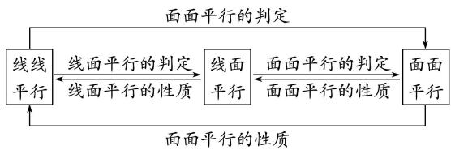
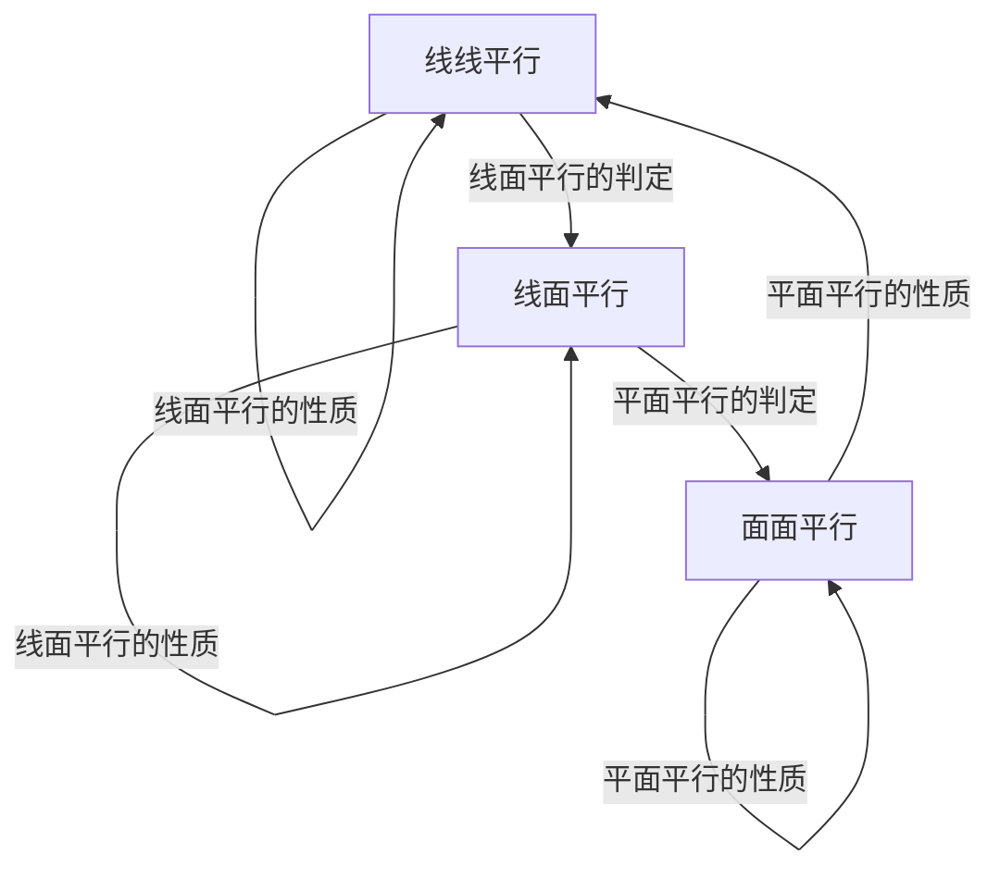
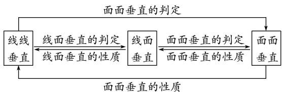
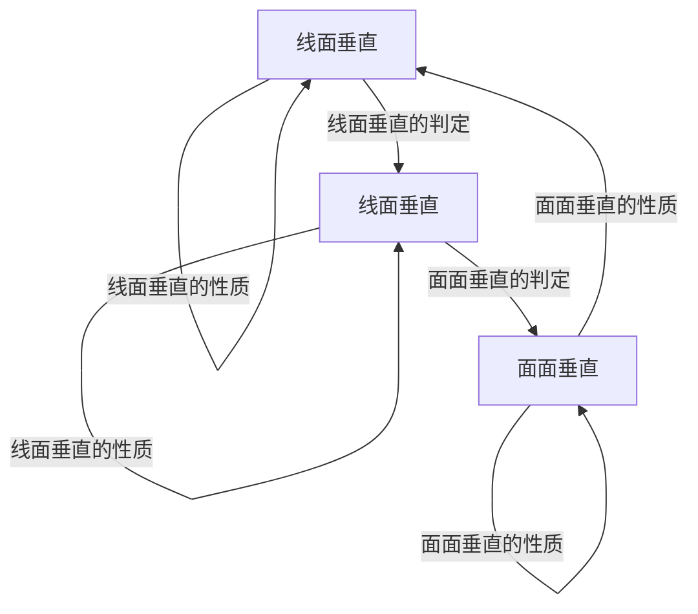
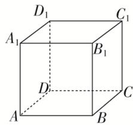

# 专题02 立体几何中空间线、面位置关系的判定(1)

# 1. 直线、平面平行的判定及其性质

(1)线面平行的判定定理： $a \notin \alpha,\ b \subset \alpha,\ a \parallel b \Rightarrow a \parallel \alpha.$   
(2)线面平行的性质定理： $a \parallel \alpha, a \subset \beta, \alpha \cap \beta = b \Rightarrow a \parallel b.$   
(3)面面平行的判定定理： $a \subset \beta$ ， $b \subset \beta$ ， $a \cap b = P$ ， $a \parallel \alpha$ ， $b \parallel \alpha \Rightarrow \alpha \parallel \beta$ .  
(4)面面平行的性质定理： $\alpha//\beta,\quad\alpha\cap\gamma=a,\quad\beta\cap\gamma=b\Rightarrow a//b.$

平行问题的转化

flowchart

利用线线平行、线面平行、面面平行的相互转化解决平行关系的判定问题时，一般遵循从“低维”到“高维”的转化，即从“线线平行”到“线面平行”，再到“面面平行”；而应用性质定理时，其顺序正好相反。在实际的解题过程中，判定定理和性质定理一般要相互结合，灵活运用。

平行关系的基础是线线平行，证明线线平行常用的方法：一是利用平行公理，即证两直线同时和第三条直线平行；二是利用平行四边形进行平行转换：三是利用三角形的中位线定理证线线平行；四是利用线段的比例关系证明线线平行；五是利用线面平行、面面平行的性质定理进行平行转换.

# 2. 直线、平面垂直的判定及其性质

(1)线面垂直的判定定理： $m \subset \alpha$ ， $n \subset \alpha$ ， $m \cap n = P$ ， $l \perp m$ ， $l \perp n \Rightarrow l \perp \alpha$ .  
(2)线面垂直的性质定理： $a \perp \alpha,\quad b \perp \alpha \Rightarrow a // b.$   
(3)面面垂直的判定定理： $a \subset \beta$ ， $a \perp \alpha \Rightarrow \alpha \perp \beta$ .  
(4)面面垂直的性质定理： $\alpha\perp\beta,\quad\alpha\cap\beta=l,\quad a\subset\alpha,\quad a\perp l\Rightarrow a\perp\beta.$

垂直问题的转化

flowchart

在空间垂直关系中，线面垂直是核心，已知线面垂直，既可为证明线线垂直提供依据，又可为利用判定定理证明面面垂直作好铺垫。应用面面垂直的性质定理时，一般需作辅助线，基本作法是过其中一个平面内一点作交线的垂线，从而把面面垂直问题转化为线面垂直问题，进而可转化为线线垂直问题。

垂直关系的基础是线线垂直，证明线线垂直常用的方法：一是利用等腰三角形底边中线即高线的性质；二是利用勾股定理；三是利用线面垂直的性质：即要证两线垂直，只需证明一线垂直于另一线所在的平面即可， $l \perp a, a \subset a \Rightarrow l \perp a.$

# 立体几何中空间线、面位置关系的判定(1)

# 【方法总结】

# 判断与空间位置关系有关命题真假的方法

(1)借助空间线面平行、面面平行、线面垂直、面面垂直的判定定理和性质定理进行判断.  
(2)借助空间几何模型，如从长方体模型、四面体模型等模型中观察线面位置关系，结合有关定理，进行肯定或否定.  
(3)借助于反证法，当从正面入手较难时，可利用反证法，推出与题设或公认的结论相矛盾的命题，进而作出判断.

# 【例题选讲】

[例 1](1)若 m, n 是两条不同的直线， $\alpha$ ， $\beta$ 是两个不同的平面，则下列命题正确的是()

A. 若 $m \perp \alpha, n \parallel \beta, \alpha \parallel \beta$ ，则 $m \perp n$

B. 若 $m \parallel \alpha, n \perp \beta, \alpha \perp \beta$ ，则 $m \perp n$

C. 若 $m \parallel \alpha$ , $n \parallel \beta$ , $\alpha \parallel \beta$ , 则 $m \parallel n$

D. 若 $m \perp \alpha, n \perp \beta, \alpha \perp \beta$ ，则 $m \parallel n$

(2) $\alpha$ ， $\beta$ 是两个不重合的平面，在下列条件下，可判定 $\alpha\parallel\beta$ 的是()

A. $\alpha, \beta$ 都平行于直线 $l, m$

B. $\alpha$ 内有三个不共线的点到 $\beta$ 的距离相等

C. l, m 是 $\alpha$ 内的两条直线且 $l \parallel \beta$ , $m \parallel \beta$

D. $l, m$ 是两条异面直线且 $l \parallel \alpha, m \parallel \alpha, l \parallel \beta, m \parallel \beta$

(3)(2020·浙江)已知空间中不过同一点的三条直线 $m, n, l$ ，则“ $m, n, l$ 在同一平面”是“ $m, n, l$ 两两相交”的（）

A. 充分不必要条件

B. 必要不充分条件

C. 充分必要条件

D. 既不充分也不必要条件

(4)(2019·全国II)设 $\alpha$ ， $\beta$ 为两个平面，则 $\alpha\parallel\beta$ 的充要条件是()

A. $\alpha$ 内有无数条直线与 $\beta$ 平行

B. $\alpha$ 内有两条相交直线与 $\beta$ 平行

C. $\alpha, \beta$ 平行于同一条直线

D. $\alpha, \beta$ 垂直于同一平面

(5)已知 $\alpha$ ， $\beta$ 表示两个不同平面，a，b表示两条不同直线，对于下列两个命题：

①若 $b \subset \alpha, a \notin \alpha$ ，则“ $a \parallel b$ ”是“ $a \parallel \alpha$ ”的充分不必要条件；

②若 $a \subset \alpha$ ， $b \subset \alpha$ ，则“ $\alpha // \beta$ ”是“ $a // \beta$ 且 $b // \beta$ ”的充要条件.

判断正确的是()

A. ①②都是真命题

B. ①是真命题，②是假命题

C. ①是假命题，②是真命题

D. ①②都是假命题

(6)已知 $\alpha, \beta$ 是空间两个不同的平面， $m, n$ 是空间两条不同的直线，则给出的下列说法正确的是（）

① $m \parallel \alpha$ ， $n \parallel \beta$ ，且 $m \parallel n$ ，则 $\alpha \parallel \beta$ ；② $m \parallel \alpha$ ， $n \parallel \beta$ ，且 $m \perp n$ ，则 $\alpha \perp \beta$ ；

③ $m \perp \alpha,\ n \perp \beta$ ，且 $m \parallel n$ ，则 $\alpha \parallel \beta$ ；④ $m \perp \alpha,\ n \perp \beta$ ，且 $m \perp n$ ，则 $\alpha \perp \beta$ .

A. ①②③

B. ①③④

C. ②④

D. ③④

(7)已知 m, n 是两条不同的直线, $\alpha$ , $\beta$ 是两个不同的平面, 给出四个命题:

①若 $\alpha\cap\beta=m,\ n\subset\alpha,\ n\perp m$ ，则 $\alpha\perp\beta$ ；②若 $m\perp\alpha,\ m\perp\beta$ ，则 $\alpha//\beta$ ;

③若 $m \perp \alpha$ , $n \perp \beta$ , $m \perp n$ , 则 $\alpha \perp \beta$ ; ④若 $m \parallel \alpha$ , $n \parallel \beta$ , $m \parallel n$ , 则 $\alpha \parallel \beta$ .

其中正确的命题是( )

A. ①②

B. ②③

C. ①④

D. ③④

(8)(2020·全国Ⅱ)设有下列四个命题：

①两两相交且不过同一点的三条直线必在同一平面内；  
②过空间中任意三点有且仅有一个平面；  
③若空间两条直线不相交，则这两条直线平行；  
④若直线 $l \subset$ 平面 $\alpha$ ，直线 $m \perp$ 平面 $\alpha$ ，则 $m \perp l$ .

则上述命题中所有真命题的序号是\_\_\_\_．(填写所有正确命题的序号)

(9)(2019·北京)已知 $l, m$ 是平面 $\alpha$ 外的两条不同直线．给出下列三个论断：

① $l \perp m$ ; ② $m \parallel a$ ; ③ $l \perp a$ .

以其中的两个论断作为条件，余下的一个论断作为结论，写出一个正确的命题：\_\_\_\_。

(10)设 $\alpha, \beta, \gamma$ 是三个不同的平面， $m, n$ 是两条不同的直线，在命题“ $\alpha \cap \beta = m, n \subset \gamma$ ，且\_\_\_\_，则 $m // n$ ”中的横线处填入下列三组条件中的一组，使该命题为真命题.

① $\alpha\parallel\gamma,\ n\subset\beta;$ ② $m\parallel\gamma,\ n\parallel\beta;$ ③ $n\parallel\beta,\ m\subset\gamma.$

可以填入的条件有\_\_\_\_。

text_image

D₁
A₁
B₁
C₁
D
A
B
C

# 【对点精练】

1. 对于空间中的两条直线 $m, n$ 和一个平面 $\alpha$ , 下列命题中的真命题是( )

A. 若 $m \parallel \alpha$ , $n \parallel \alpha$ , 则 $m \parallel n$

B. 若 $m \parallel \alpha, n \subset \alpha$ ，则 $m \parallel n$

C. 若 $m \parallel \alpha, n \perp \alpha$ , 则 $m \parallel n$

D. 若 $m \perp \alpha, n \perp \alpha$ , 则 $m \parallel n$

2. 已知直线 a, b, 平面 $\alpha$ , $\beta$ , $\gamma$ ，下列命题正确的是()

A. 若 $\alpha \perp \gamma$ , $\beta \perp \gamma$ , $\alpha \cap \beta = a$ , 则 $a \perp \gamma$   
B. 若 $\alpha \cap \beta = a,\quad \alpha \cap \gamma = b,\quad \beta \cap \gamma = c,$ 则 $a \parallel b \parallel c$   
C. 若 $\alpha \cap \beta = a, b \parallel a$ ，则 $b \parallel \alpha$   
D. 若 $\alpha \perp \beta, \alpha \cap \beta = a, b \parallel \alpha,$ 则 $b \parallel a$

3. 关于直线 a, b 及平面 $\alpha$ , $\beta$ ，下列命题中正确的是()

A. 若 $a \parallel a, a \cap \beta = b$ , 则 $a \parallel b$

B. 若 $\alpha \perp \beta, m \parallel \alpha$ ，则 $m \perp \beta$

C. 若 $a \perp \alpha$ , $a \parallel \beta$ , 则 $\alpha \perp \beta$

D. 若 $a \parallel a, b \perp a$ , 则 $b \perp a$

4. 设 $\alpha, \beta$ 是两个不同的平面， $l, m$ 是两条不同的直线，且 $l \subset \alpha, m \subset \beta$ ( )

A. 若 $l \perp \beta$ ，则 $\alpha \perp \beta$

B. 若 $\alpha \perp \beta$ ，则 $l \perp m$

C. 若 $l \parallel \beta$ , 则 $\alpha \parallel \beta$

D. 若 $\alpha // \beta$ ，则 $l // m$

5. (多选)已知 m, n 为两条不重合的直线， $\alpha$ ， $\beta$ 为两个不重合的平面，则()

A. 若 $m \parallel \alpha$ , $n \parallel \beta$ , $\alpha \parallel \beta$ , 则 $m \parallel n$

B. 若 $m \perp \alpha, n \perp \beta, \alpha \perp \beta$ , 则 $m \perp n$

C. 若 $m \parallel n$ , $m \perp \alpha$ , $n \perp \beta$ , 则 $\alpha \parallel \beta$

D. 若 $m \parallel n, n \perp \alpha, \alpha \perp \beta$ ，则 $m \parallel \beta$

6. 设直线 $m, n$ 是两条不同的直线, $\alpha, \beta$ 是两个不同的平面, 则下列命题中正确的是( )

A. 若 $m \parallel \alpha, n \parallel \beta, m \perp n$ ，则 $\alpha \perp \beta$

B. 若 $m \parallel \alpha, n \perp \beta, m \parallel n$ ，则 $\alpha \parallel \beta$

C. 若 $m \perp \alpha, n \parallel \beta, m \perp n$ ，则 $\alpha \parallel \beta$

D. 若 $m \perp \alpha, n \perp \beta, m \parallel n$ ，则 $\alpha \parallel \beta$

7. 已知 $\alpha$ 是一个平面， $m, n$ 是两条直线， $A$ 是一个点，若 $m \notin \alpha, n \subset \alpha$ ，且 $A \in m, A \in \alpha$ ，则 $m, n$ 的位置关系不可能是（）

A. 垂直

B. 相交

C. 异面

D. 平行

8. 下列命题中错误的是()

A. 如果平面 $\alpha \perp$ 平面 $\beta$ , 那么平面 $\alpha$ 内一定存在直线平行于平面 $\beta$

B. 如果平面 $\alpha$ 不垂直于平面 $\beta$ , 那么平面 $\alpha$ 内一定不存在直线垂直于平面 $\beta$

C. 如果平面 $\alpha \perp$ 平面 $\gamma$ , 平面 $\beta \perp$ 平面 $\gamma$ , $\alpha \cap \beta = l$ , 那么 $l \perp$ 平面 $\gamma$

D. 如果平面 $\alpha \perp$ 平面 $\beta$ , 那么平面 $\alpha$ 内所有直线都垂直于平面 $\beta$

9. 已知直线 $a$ 与平面 $\alpha, \beta, \alpha // \beta, a \subset \alpha$ , 点 $B \in \beta$ , 则在 $\beta$ 内过点 $B$ 的所有直线中( )

A. 不一定存在与 $a$ 平行的直线

B. 只有两条与 $a$ 平行的直线

C. 存在无数条与 $a$ 平行的直线

D. 存在唯一一条与 $a$ 平行的直线

10. 已知 $E, F, G, H$ 是空间四点，命题甲： $E, F, G, H$ 四点不共面，命题乙：直线 $EF$ 和 $GH$ 不相交，则甲是乙成立的（）

A. 必要不充分条件

B. 充分不必要条件

C. 充要条件

D. 既不充分也不必要条件

11. (2016·山东)已知直线 a, b 分别在两个不同的平面 $\alpha$ , $\beta$ 内，则 “直线 a 和直线 b 相交” 是 “平面 $\alpha$ 和平面 $\beta$ 相交” 的()

A. 充分不必要条件

B. 必要不充分条件

C. 充要条件

D. 既不充分也不必要条件

12. 已知直线 $a$ 和平面 $\alpha$ ，那么 $a // \alpha$ 的一个充分条件是（ ）

A. 存在一条直线 $b, a \parallel b$ 且 $b \subset \alpha$

B. 存在一条直线 $b, a \perp b$ 且 $b \perp \alpha$

C. 存在一个平面 $\beta, a \subset \beta$ 且 $\alpha // \beta$

D. 存在一个平面 $\beta, a \parallel \beta$ 且 $\alpha \parallel \beta$

13. 平面 $\alpha //$ 平面 $\beta$ , 点 $A, C \in \alpha$ , 点 $B, D \in \beta$ , 则直线 $AC //$ 直线 $BD$ 的充要条件是( )

A. $AB \parallel CD$

B. $AD \parallel CB$

C. AB 与 CD 相交

D. A, B, C, D 四点共面

14. 设 $l, m, n$ 为三条不同的直线，其中 $m, n$ 在平面 $\alpha$ 内，则“ $l \perp \alpha$ ”是“ $l \perp m$ 且 $l \perp n$ ”的（）

A. 充分不必要条件

B. 必要不充分条件

C. 充要条件

D. 既不充分也不必要条件

15. 已知 $l$ 为平面 $\alpha$ 内的一条直线, $\alpha$ , $\beta$ 表示两个不同的平面, 则“ $\alpha \perp \beta$ ”是“ $l \perp \beta$ ”的( )

A. 充分不必要条件

B. 必要不充分条件

C. 充要条件

D. 既不充分也不必要条件

16. 已知直线 $a \parallel$ 平面 $\alpha$ , 则“直线 $a \perp$ 平面 $\beta$ ”是“平面 $\alpha \perp$ 平面 $\beta$ ”的( )

A. 充分不必要条件

B. 必要不充分条件

C. 充要条件

D. 既不充分也不必要条件

17. 已知 $a, b, c$ 为三条不重合的直线，已知下列结论：

①若 $a \perp b,\quad a \perp c$ ，则 $b \parallel c$ ；②若 $a \perp b,\quad a \perp c$ ，则 $b \perp c$ ；③若 $a \parallel b,\quad b \perp c$ ，则 $a \perp c$ .

其中正确的个数为( )

A. 0

B. 1

C. 2

D. 3

18. 用 a, b, c 表示空间中三条不同的直线， $\gamma$ 表示平面，给出下列命题：

①若 $a \perp b$ ， $b \perp c$ ，则 $a \parallel c$ ；②若 $a \parallel b$ ， $a \parallel c$ ，则 $b \parallel c$ ；

③若 $a \parallel \gamma$ , $b \parallel \gamma$ ，则 $a \parallel b$ ; ④若 $a \perp \gamma$ , $b \perp \gamma$ ，则 $a \parallel b$ .

其中真命题的序号是( )

A. ①②

B. ②③

C. ①④

D. ②④

19. 已知直线 m, l, 平面 $\alpha$ , $\beta$ , 且 $m \perp \alpha$ , $l \subset \beta$ , 给出下列命题:

①若 $\alpha\parallel\beta$ ，则 $m\perp l$ ；②若 $\alpha\perp\beta$ ，则 $m\parallel l$ ；③若 $m\perp l$ ，则 $\alpha\perp\beta$ ；④若 $m\parallel l$ ，则 $\alpha\perp\beta$ .

其中正确的命题是( )

A. ①④

B. ③④

C. ①②

D. ①③

20. 给出下列命题:

①若平面 $\alpha$ 内的直线 $a$ 与平面 $\beta$ 内的直线 $b$ 为异面直线，直线 $c$ 是 $\alpha$ 与 $\beta$ 的交线，那么 $c$ 至多与 $a, b$ 中的一条相交；  
②若直线 a 与 b 异面，直线 b 与 c 异面，则直线 a 与 c 异面；  
③一定存在平面a同时和异面直线a，b都平行.

其中正确的命题为( )

A. ①

B. ②

C. ③

D. ①③

21. 下列命题中，正确的是()

A. 若 $a, b$ 是两条直线， $\alpha, \beta$ 是两个平面，且 $a \subset \alpha, b \subset \beta$ ，则 $a, b$ 是异面直线  
B. 若 $a, b$ 是两条直线，且 $a \parallel b$ ，则直线 $a$ 平行于经过直线 $b$ 的所有平面  
C. 若直线 $a$ 与平面 $\alpha$ 不平行, 则此直线与平面内的所有直线都不平行  
D. 若直线 $a \parallel$ 平面 $\alpha$ , 点 $P \in \alpha$ , 则平面 $\alpha$ 内经过点 $P$ 且与直线 $a$ 平行的直线有且只有一条

22. a, b, c 是两两不同的三条直线，下面四个命题中，真命题是( )

A. 若直线 $a, b$ 异面， $b, c$ 异面，则 $a, c$ 异面  
B. 若直线 $a, b$ 相交， $b, c$ 相交，则 $a, c$ 相交  
C. 若 $a \parallel b$ , 则 $a, b$ 与 $c$ 所成的角相等  
D. 若 $a \perp b, b \perp c$ , 则 $a \parallel c$

23. 若空间中四条两两不同的直线 $l_{1}, l_{2}, l_{3}, l_{4}$ , 满足 $l_{1} \perp l_{2}, l_{2} \perp l_{3}, l_{3} \perp l_{4}$ , 则下列结论一定正确的是( )

A. $l_{1} \perp l_{4}$

B. $l_{1} \parallel l_{4}$

C. $l_{1}$ 与 $l_{4}$ 既不垂直也不平行

D. $l_{1}$ 与 $l_{4}$ 的位置关系不确定

24. 已知 $\alpha$ ， $\beta$ 表示平面，m，n 表示直线， $m \perp \beta$ ， $\alpha \perp \beta$ ，给出下列四个结论：

① $\forall n\subset\alpha,\quad n\perp\beta;\quad②\forall n\subset\beta,\quad m\perp n;\quad③\forall n\subset\alpha,\quad m//n;\quad④\exists n\subset\alpha,\quad m\perp n.$

则上述结论中正确的序号为\_\_\_\_．(填写所有正确命题的序号)

25. 已知 m, n 是两条不同的直线, $\alpha$ , $\beta$ 为两个不同的平面, 有下列四个命题:

①若 $m \perp \alpha$ ， $n \perp \beta$ ， $m \perp n$ ，则 $\alpha \perp \beta$ ；②若 $m \parallel \alpha$ ， $n \parallel \beta$ ， $m \perp n$ ，则 $\alpha \parallel \beta$ ；  
③若 $m \perp \alpha$ , $n \parallel \beta$ , $m \perp n$ , 则 $\alpha \parallel \beta$ ; ④若 $m \perp \alpha$ , $n \parallel \beta$ , $\alpha \parallel \beta$ , 则 $m \perp n$ .

其中所有正确的命题是\_\_\_\_。（填写所有正确命题的序号）

26. $\alpha$ , $\beta$ 是两个平面, m, n 是两条直线, 有下列四个命题:

①如果 $m \perp n$ ， $m \perp \alpha$ ， $n \parallel \beta$ ，那么 $\alpha \perp \beta$ ;  
②如果 $m \perp \alpha$ ， $n \parallel \alpha$ ，那么 $m \perp n$ ;  
③如果 $\alpha\parallel\beta,\ m\subset\alpha$ ，那么 $m\parallel\beta;$   
④如果 $m \parallel n$ ， $\alpha \parallel \beta$ ，那么 m 与 $\alpha$ 所成的角和 n 与 $\beta$ 所成的角相等.

其中正确的命题有\_\_\_\_．(填写所有正确命题的序号)

27. 设 $a, b$ 为不重合的两条直线， $\alpha, \beta$ 为不重合的两个平面，给出下列命题：

①若 $a \parallel \alpha$ 且 $b \parallel \alpha$ , 则 $a \parallel b$ ; ②若 $a \perp \alpha$ 且 $a \perp \beta$ , 则 $\alpha \parallel \beta$ ;

③若 $\alpha\perp\beta$ ，则一定存在平面 $\gamma$ ，使得 $\gamma\perp\alpha,\gamma\perp\beta$ ；④若 $\alpha\perp\beta$ ，则一定存在直线l，使得 $l\perp\alpha,l//\beta$ 。其中真命题的序号是\_\_\_\_。(填写所有正确命题的序号)

28. 已知 $m$ 和 $n$ 是两条不同的直线, $\alpha$ 和 $\beta$ 是两个不重合的平面, 下面给出的条件中一定能推出 $m \perp \beta$ 的是( )

A. $\alpha \perp \beta$ 且 $m \subset \alpha$

B. $\alpha \perp \beta$ 且 $m / / \alpha$

C. $m \parallel n$ 且 $n \perp \beta$

D. $m \perp n$ 且 $n \parallel \beta$

29. 已知直线 $a$ 和平面 $\alpha, \beta$ 有如下关系: ① $\alpha \perp \beta$ , ② $\alpha // \beta$ , ③ $a \perp \beta$ , ④ $a // \alpha$ , 则下列命题为真的是( )

A. ①③⇒④

B. ①④⇒③

C. ③④⇒①

D. ②③⇒④

30. 将一个真命题中的 “平面” 换成 “直线”、“直线” 换成 “平面” 后仍是真命题，则该命题称为 “可换命题”。给出下列四个命题：

①垂直于同一平面的两直线平行；②垂直于同一平面的两平面平行；③平行于同一直线的两直线平行；④平行于同一平面的两直线平行．其中是“可换命题”的是\_\_\_\_．(填序号)

