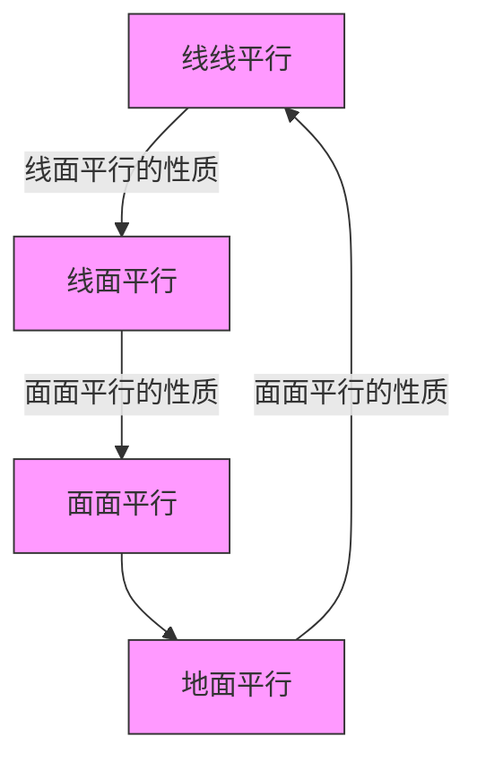
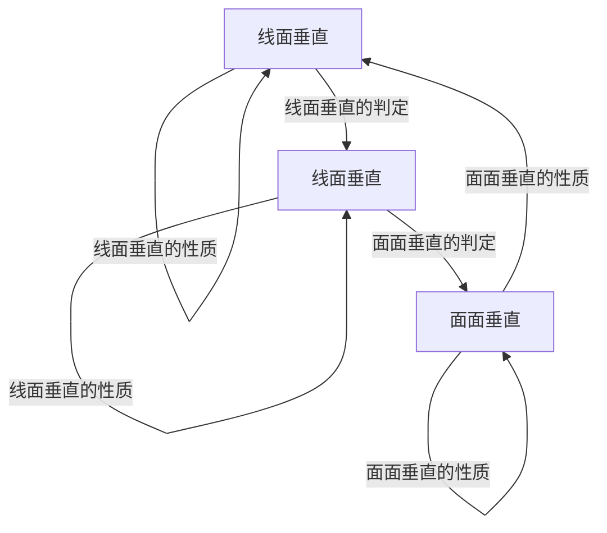
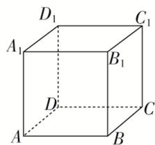
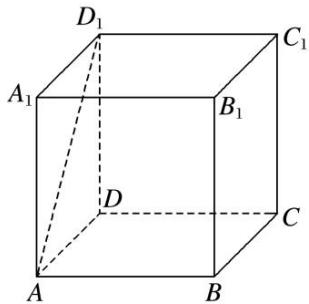
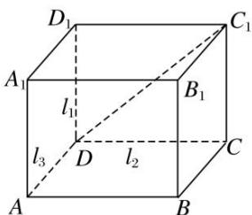

# 专题02 立体几何中空间线、面位置关系的判定(1)

# 1. 直线、平面平行的判定及其性质

(1)线面平行的判定定理： $a \notin \alpha,\ b \subset \alpha,\ a \parallel b \Rightarrow a \parallel \alpha.$   
(2)线面平行的性质定理： $a \parallel \alpha, a \subset \beta, \alpha \cap \beta = b \Rightarrow a \parallel b.$   
(3)面面平行的判定定理： $a \subset \beta$ ， $b \subset \beta$ ， $a \cap b = P$ ， $a \parallel \alpha$ ， $b \parallel \alpha \Rightarrow \alpha \parallel \beta$ .  
(4)面面平行的性质定理： $\alpha//\beta,\quad\alpha\cap\gamma=a,\quad\beta\cap\gamma=b\Rightarrow a//b.$

平行问题的转化

flowchart

利用线线平行、线面平行、面面平行的相互转化解决平行关系的判定问题时，一般遵循从“低维”到“高维”的转化，即从“线线平行”到“线面平行”，再到“面面平行”；而应用性质定理时，其顺序正好相反。在实际的解题过程中，判定定理和性质定理一般要相互结合，灵活运用。

平行关系的基础是线线平行，证明线线平行常用的方法：一是利用平行公理，即证两直线同时和第三条直线平行；二是利用平行四边形进行平行转换：三是利用三角形的中位线定理证线线平行；四是利用线段的比例关系证明线线平行；五是利用线面平行、面面平行的性质定理进行平行转换.

# 2. 直线、平面垂直的判定及其性质

(1)线面垂直的判定定理： $m \subset \alpha$ ， $n \subset \alpha$ ， $m \cap n = P$ ， $l \perp m$ ， $l \perp n \Rightarrow l \perp \alpha$ .  
(2)线面垂直的性质定理： $a \perp \alpha,\quad b \perp \alpha \Rightarrow a // b.$   
(3)面面垂直的判定定理： $a \subset \beta$ ， $a \perp \alpha \Rightarrow \alpha \perp \beta$ .  
(4)面面垂直的性质定理： $\alpha\perp\beta,\quad\alpha\cap\beta=l,\quad a\subset\alpha,\quad a\perp l\Rightarrow a\perp\beta.$

垂直问题的转化

flowchart

在空间垂直关系中，线面垂直是核心，已知线面垂直，既可为证明线线垂直提供依据，又可为利用判定定理证明面面垂直作好铺垫。应用面面垂直的性质定理时，一般需作辅助线，基本作法是过其中一个平面内一点作交线的垂线，从而把面面垂直问题转化为线面垂直问题，进而可转化为线线垂直问题。

垂直关系的基础是线线垂直，证明线线垂直常用的方法：一是利用等腰三角形底边中线即高线的性质；二是利用勾股定理；三是利用线面垂直的性质：即要证两线垂直，只需证明一线垂直于另一线所在的平面即可， $l \perp \alpha$ ， $a \subset \alpha \Rightarrow l \perp a$ .

# 立体几何中空间线、面位置关系的判定(1)

# 【方法总结】

# 判断与空间位置关系有关命题真假的方法

(1)借助空间线面平行、面面平行、线面垂直、面面垂直的判定定理和性质定理进行判断.  
(2)借助空间几何模型，如从长方体模型、四面体模型等模型中观察线面位置关系，结合有关定理，进行肯定或否定.  
(3)借助于反证法，当从正面入手较难时，可利用反证法，推出与题设或公认的结论相矛盾的命题，进而作出判断.

# 【例题选讲】

[例 1](1)若 m, n 是两条不同的直线， $\alpha$ ， $\beta$ 是两个不同的平面，则下列命题正确的是()

A. 若 $m \perp \alpha, n \parallel \beta, \alpha \parallel \beta$ ，则 $m \perp n$

B. 若 $m \parallel \alpha, n \perp \beta, \alpha \perp \beta$ ，则 $m \perp n$

C. 若 $m \parallel \alpha$ , $n \parallel \beta$ , $\alpha \parallel \beta$ , 则 $m \parallel n$

D. 若 $m \perp \alpha, n \perp \beta, \alpha \perp \beta$ ，则 $m \parallel n$

答案 A 解析 对于选项 A，由 $n \parallel \beta$ ， $\alpha \parallel \beta$ 可得 $n \parallel \alpha$ 或 $n \subset \alpha$ ，又 $m \perp \alpha$ ，所以可得 $m \perp n$ ，故 A 正确；对于选项 B，由条件可得 $m \perp n$ 或 $m \parallel n$ ，或 m 与 n 既不垂直也不平行，故 B 不正确；对于选项 C，由条件可得 $m \parallel n$ 或 m，n 相交或 m，n 异面，故 C 不正确；对于选项 D，由题意得 $m \perp n$ ，故 D 不正确.

(2) $\alpha$ ， $\beta$ 是两个不重合的平面，在下列条件下，可判定 $\alpha\parallel\beta$ 的是()

A. $\alpha, \beta$ 都平行于直线 $l, m$

B. $\alpha$ 内有三个不共线的点到 $\beta$ 的距离相等

C. l, m 是 $\alpha$ 内的两条直线且 $l \parallel \beta$ , $m \parallel \beta$

D. l, m 是两条异面直线且 $l \parallel \alpha$ , $m \parallel \alpha$ , $l \parallel \beta$ , $m \parallel \beta$

答案 D 解析 对于 A, l, m 应相交；对于 B，应考虑三个点在 $\beta$ 的同侧或异侧两种情况；对于 C, l, m 应相交，故选 D.

(3)(2020·浙江)已知空间中不过同一点的三条直线 m, n, l，则 “m, n, l 在同一平面” 是 “m, n, l 两两相交”的()

A. 充分不必要条件 B. 必要不充分条件 C. 充分必要条件 D. 既不充分也不必要条件

答案 B 解析 依题意 $m, n, l$ 是空间中不过同一点的三条直线，当 $m, n, l$ 在同一平面时，可能有 $m // n // l$ ，故不能得出 $m, n, l$ 两两相交。当 $m, n, l$ 两两相交时，设 $m \cap n = A, m \cap l = B, n \cap l = C$ ，则 $m, n$ 确定一个平面 $\alpha$ ，而 $B \in m \subset \alpha, C \in n \subset \alpha$ ，所以直线 $BC$ 即 $l \subset \alpha$ ，所以 $m, n, l$ 在同一平面。综上所述，“ $m, n, l$ 在同一平面”是“ $m, n, l$ 两两相交”的必要不充分条件。故选 B.

(4)(2019·全国Ⅱ)设 $\alpha$ ， $\beta$ 为两个平面，则 $\alpha\parallel\beta$ 的充要条件是()

A. $\alpha$ 内有无数条直线与 $\beta$ 平行

B. $\alpha$ 内有两条相交直线与 $\beta$ 平行

C. $\alpha$ , $\beta$ 平行于同一条直线

D. $\alpha, \beta$ 垂直于同一平面

答案 B 解析 若 $\alpha // \beta$ ，则 $\alpha$ 内有无数条直线与 $\beta$ 平行，反之则不成立；若 $\alpha$ ， $\beta$ 平行于同一条直线，则 $\alpha$ 与 $\beta$ 可以平行也可以相交；若 $\alpha$ ， $\beta$ 垂直于同一个平面，则 $\alpha$ 与 $\beta$ 可以平行也可以相交，故 A，C，D 中条件均不是 $\alpha // \beta$ 的充要条件。根据平面与平面平行的判定定理知，若一个平面内有两条相交直线与另一个平面平行，则两平面平行，反之也成立。因此，B 中条件是 $\alpha // \beta$ 的充要条件。故选 B。

(5)已知 $\alpha$ ， $\beta$ 表示两个不同平面，a，b表示两条不同直线，对于下列两个命题：

①若 $b \subset \alpha, a \notin \alpha$ ，则“ $a \parallel b$ ”是“ $a \parallel \alpha$ ”的充分不必要条件；   
②若 $a \subset \alpha, b \subset \alpha$ ，则“ $\alpha \parallel \beta$ ”是“ $a \parallel \beta$ 且 $b \parallel \beta$ ”的充要条件.

判断正确的是()

A. ①②都是真命题

B. ①是真命题，②是假命题

C. ①是假命题，②是真命题

D. ①②都是假命题

答案 B 解析 若 $b \subset \alpha, a \not\subset \alpha, a \parallel b$ ，则由线面平行的判定定理可得 $a \parallel \alpha$ ，反过来，若 $b \subset \alpha, a \not\subset \alpha, a \parallel \alpha$ ，则 a, b 可能平行或异面，则 $b \subset \alpha, a \not\subset \alpha, “a \parallel b”$ 是“ $a \parallel \alpha$ ”的充分不必要条件，①是真命题；若 $a \subset \alpha, b \subset \alpha, \alpha \parallel \beta$ ，则由面面平行的性质可得 $a \parallel \beta, b \parallel \beta$ ，反过来，若 $a \subset \alpha, b \subset \alpha, a \parallel \beta, b \parallel \beta$ ，则 $\alpha, \beta$ 可能平行或相交，则 $a \subset \alpha, b \subset \alpha$ ，则“ $\alpha \parallel \beta$ ”是“ $a \parallel \beta, b \parallel \beta$ ”的充分不必要条件，②是假命题，选项 B 正确.

(6)已知 $\alpha, \beta$ 是空间两个不同的平面， $m, n$ 是空间两条不同的直线，则给出的下列说法正确的是（）

① $m \parallel \alpha$ ， $n \parallel \beta$ ，且 $m \parallel n$ ，则 $\alpha \parallel \beta$ ；② $m \parallel \alpha$ ， $n \parallel \beta$ ，且 $m \perp n$ ，则 $\alpha \perp \beta$ ；  
③ $m \perp \alpha$ ， $n \perp \beta$ ，且 $m \parallel n$ ，则 $\alpha \parallel \beta$ ；④ $m \perp \alpha$ ， $n \perp \beta$ ，且 $m \perp n$ ，则 $\alpha \perp \beta$ .

A. ①②③

B. ①③④

C. ②④

D. ③④

答案 D 解析 对于①，当 $m \parallel \alpha, n \parallel \beta$ ，且 $m \parallel n$ 时，有 $\alpha \parallel \beta$ 或 $\alpha, \beta$ 相交，所以①错误；对于②，当 $m \parallel \alpha, n \parallel \beta$ ，且 $m \perp n$ 时，有 $\alpha \perp \beta$ 或 $\alpha \parallel \beta$ 或 $\alpha, \beta$ 相交且不垂直，所以②错误；对于③，当 $m \perp \alpha, n \perp \beta$ ，且 $m \parallel n$ 时，得出 $m \perp \beta$ ，所以 $\alpha \parallel \beta$ ，③正确；对于④，当 $m \perp \alpha, n \perp \beta$ ，且 $m \perp n$ 时， $\alpha \perp \beta$ 成立，所以④正确．综上知，正确的命题序号是③④．故选 D.

(7)已知 m, n 是两条不同的直线， $\alpha$ ， $\beta$ 是两个不同的平面，给出四个命题：

①若 $\alpha\cap\beta=m,\ n\subset\alpha,\ n\perp m$ ，则 $\alpha\perp\beta$ ；②若 $m\perp\alpha,\ m\perp\beta$ ，则 $\alpha\parallel\beta$ ;  
③若 $m \perp \alpha$ , $n \perp \beta$ , $m \perp n$ , 则 $\alpha \perp \beta$ ; ④若 $m \parallel \alpha$ , $n \parallel \beta$ , $m \parallel n$ , 则 $\alpha \parallel \beta$ .

其中正确的命题是( )

A. ①②

B. ②③

C. ①④

D. ③④

答案 B 解析 两个平面斜交时也会出现一个平面内的直线垂直于两个平面的交线的情况，①不正确；垂直于同一条直线的两个平面平行，②正确；当两个平面与两条互相垂直的直线分别垂直时，它们所成的二面角为直二面角，故③正确；当两个平面相交时，分别与两个平面平行的直线也平行，故④不正确.

(8)(2020·全国Ⅱ)设有下列四个命题：

①两两相交且不过同一点的三条直线必在同一平面内；  
②过空间中任意三点有且仅有一个平面；  
③若空间两条直线不相交，则这两条直线平行；  
④若直线 $l \subset$ 平面 $\alpha$ ，直线 $m \perp$ 平面 $\alpha$ ，则 $m \perp l$ .

则上述命题中所有真命题的序号是\_\_\_\_．(填写所有正确命题的序号)

答案 ①④ 解析 ①是真命题，两两相交且不过同一点的三条直线必定有三个交点，且这三个交点不在同一条直线上，由平面的基本性质“经过不在同一直线上的三个点，有且只有一个平面”，可知①为真命题；②是假命题，因为空间三点在一条直线上时，有无数个平面过这三个点；③是假命题，因为空间两条直线不相交时，它们可能平行，也可能异面；④是真命题，因为一条直线垂直于一个平面，那么它垂直于平面内的所有直线．从而①④为真命题.

(9)(2019·北京)已知 $l$ ， $m$ 是平面 $\alpha$ 外的两条不同直线．给出下列三个论断：

① $l \perp m$ ; ② $m \parallel a$ ; ③ $l \perp a$ .

以其中的两个论断作为条件，余下的一个论断作为结论，写出一个正确的命题：\_\_\_\_。

答案 若 $m \parallel \alpha$ 且 $l \perp \alpha$ , 则 $l \perp m$ (或若 $l \perp m, l \perp \alpha$ , 则 $m \parallel \alpha$ ) 解析 已知 $l, m$ 是平面 $\alpha$ 外的两条不同直线, 由① $l \perp m$ 与② $m \parallel \alpha$ , 不能推出③ $l \perp \alpha$ , 因为 $l$ 可以与 $\alpha$ 平行, 也可以相交不垂直; 由① $l \perp m$ 与③ $l \perp \alpha$ 能推出② $m \parallel \alpha$ ; 由② $m \parallel \alpha$ 与③ $l \perp \alpha$ 可以推出① $l \perp m$ . 故正确的命题是②③⇒①或①③⇒②.

(10)设 $\alpha, \beta, \gamma$ 是三个不同的平面， $m, n$ 是两条不同的直线，在命题“ $\alpha \cap \beta = m, n \subset \gamma$ ，且\_\_\_\_，则 $m // n$ ”中的横线处填入下列三组条件中的一组，使该命题为真命题.

① $\alpha\parallel\gamma,\ n\subset\beta;$ ② $m\parallel\gamma,\ n\parallel\beta;$ ③ $n\parallel\beta,\ m\subset\gamma.$

可以填入的条件有\_\_\_\_。

答案 ①或③ 解析 由面面平行的性质定理可知，①正确；当 $n \parallel \beta, m \subset \gamma$ 时， $n$ 和 $m$ 在同一平面内，且没有公共点，所以平行，③正确.

text_image

D₁
A₁
B₁
C₁
D
A
B
C

# 【对点精练】

1. 对于空间中的两条直线 $m, n$ 和一个平面 $\alpha$ , 下列命题中的真命题是( )

A. 若 $m \parallel \alpha$ , $n \parallel \alpha$ , 则 $m \parallel n$

B. 若 $m \parallel \alpha, n \subset \alpha$ ，则 $m \parallel n$

C. 若 $m \parallel \alpha$ , $n \perp \alpha$ , 则 $m \parallel n$

D. 若 $m \perp \alpha$ , $n \perp \alpha$ , 则 $m \parallel n$

1. 答案 D 解析 对 A，直线 m，n 可能平行、异面或相交，故 A 错误；对 B，直线 m 与 n 可能平行，也可能异面，故 B 错误；对 C，m 与 n 垂直而非平行，故 C 错误；对 D，垂直于同一平面的两直线平行，故 D 正确.

2. 已知直线 a, b, 平面 $\alpha$ , $\beta$ , $\gamma$ ，下列命题正确的是()

A. 若 $\alpha \perp \gamma$ , $\beta \perp \gamma$ , $\alpha \cap \beta = a$ , 则 $a \perp \gamma$

B. 若 $\alpha \cap \beta = a,\quad \alpha \cap \gamma = b,\quad \beta \cap \gamma = c,$ 则 $a \parallel b \parallel c$

C. 若 $\alpha \cap \beta = a, b \parallel a$ ，则 $b \parallel \alpha$

D. 若 $\alpha \perp \beta, \alpha \cap \beta = a, b \parallel \alpha,$ 则 $b \parallel a$

2. 答案 A 解析 A 中，若 $\alpha \perp \gamma$ ， $\beta \perp \gamma$ ， $\alpha \cap \beta = a$ ，则 $a \perp \gamma$ ，该说法正确；B 中，若 $\alpha \cap \beta = a$ ， $\alpha \cap \gamma = b$ ， $\beta \cap \gamma = c$ ，在三棱锥 P-ABC 中，令平面 $\alpha$ ， $\beta$ ， $\gamma$ 分别为平面 PAB，平面 PAC，平面 PBC，交线 a，b，c 为 PA，PB，PC，不满足 $a // b // c$ ，该说法错误；C 中，若 $\alpha \cap \beta = a$ ， $b // a$ ，有可能 $b \subset \alpha$ ，不满足 $b // \alpha$ ，该说法错误；D 中，若 $\alpha \perp \beta$ ， $\alpha \cap \beta = a$ ， $b // \alpha$ ，正方体 $ABCD - A_{1}B_{1}C_{1}D_{1}$ 中，令平面 $\alpha$ ， $\beta$ 分别为平面 ABCD，平面 $ADD_{1}A_{1}$ ，交线 a 为 AD，当直线 b 为 $A_{1}C_{1}$ 时，满足 $b // \alpha$ ，不满足 $b // a$ ，该说法错误。

3. 关于直线 a, b 及平面 $\alpha$ , $\beta$ ，下列命题中正确的是()

A. 若 $a \parallel \alpha, \alpha \cap \beta = b$ ，则 $a \parallel b$

B. 若 $\alpha \perp \beta, m \parallel \alpha$ ，则 $m \perp \beta$

C. 若 $a \perp \alpha, a \parallel \beta$ , 则 $\alpha \perp \beta$

D. 若 $a \parallel a, b \perp a$ , 则 $b \perp a$

3. 答案 C 解析 A 是错误的，因为 a 不一定在平面 $\beta$ 内，所以 a, b 有可能是异面直线；B 是错误的，若 $\alpha \perp \beta$ , $m \parallel \alpha$ ，则 m 与 $\beta$ 可能平行，可能相交，也可能线在面内，故 B 错误；C 是正确的，由直线与平面垂直的判断定理能得到 C 正确；D 是错误的，直线与平面垂直，需直线与平面中的两条相交直线垂直。

4. 设 $\alpha, \beta$ 是两个不同的平面， $l, m$ 是两条不同的直线，且 $l \subset \alpha, m \subset \beta$ ( )

A. 若 $l \perp \beta$ ，则 $\alpha \perp \beta$

B. 若 $\alpha \perp \beta$ ，则 $l \perp m$

C. 若 $l \parallel \beta$ , 则 $\alpha \parallel \beta$

D. 若 $\alpha // \beta$ ，则 $l // m$

4. 答案 A 解析 选项 A, $\because l \perp \beta, l \subset \alpha, \therefore \alpha \perp \beta, A$ 正确；选项 B, $\alpha \perp \beta, l \subset \alpha, m \subset \beta, l$ 与 $m$ 的位置关系不确定；选项 C, $\because l // \beta, l \subset \alpha, \therefore \alpha // \beta$ 或 $\alpha$ 与 $\beta$ 相交；选项 D, $\because \alpha // \beta, l \subset \alpha, m \subset \beta$ , 此时， $l$ 与 $m$ 的位置关系不确定。故选 A.

5. (多选)已知 $m, n$ 为两条不重合的直线, $\alpha, \beta$ 为两个不重合的平面, 则( )

A. 若 $m \parallel \alpha$ , $n \parallel \beta$ , $\alpha \parallel \beta$ , 则 $m \parallel n$

B. 若 $m \perp \alpha, n \perp \beta, \alpha \perp \beta$ , 则 $m \perp n$

C. 若 $m \parallel n, m \perp \alpha, n \perp \beta$ , 则 $\alpha \parallel \beta$

D. 若 $m \parallel n, n \perp \alpha, \alpha \perp \beta$ ，则 $m \parallel \beta$

5. 答案 BC 解析 由 $m, n$ 为两条不重合的直线， $\alpha, \beta$ 为两个不重合的平面，知：对于 A，若 $m \parallel \alpha, n \parallel \beta, \alpha \parallel \beta$ ，则 $m$ 与 $n$ 相交、平行或异面，故错误；对于 B，若 $m \perp \alpha, n \perp \beta, \alpha \perp \beta$ ，则由线面垂直、面面垂直的性质定理得 $m \perp n$ ，故正确；对于 C，若 $m \parallel n, m \perp \alpha, n \perp \beta$ ，则由线面垂直的性质定理和面面平行的判定定理得 $\alpha \parallel \beta$ ，故正确；对于 D，若 $m \parallel n, n \perp \alpha, \alpha \perp \beta$ ，则 $m \parallel \beta$ 或 $m \subset \beta$ ，故错误。故选 BC。

6. 设直线 $m, n$ 是两条不同的直线, $\alpha, \beta$ 是两个不同的平面, 则下列命题中正确的是( )

A. 若 $m \parallel \alpha$ , $n \parallel \beta$ , $m \perp n$ , 则 $\alpha \perp \beta$

B. 若 $m \parallel \alpha, n \perp \beta, m \parallel n$ ，则 $\alpha \parallel \beta$

C. 若 $m \perp \alpha$ , $n \parallel \beta$ , $m \perp n$ , 则 $\alpha \parallel \beta$

D. 若 $m \perp \alpha, n \perp \beta, m \parallel n$ ，则 $\alpha \parallel \beta$

6. 答案 D 解析 对于 A, $m \parallel \alpha$ , $n \parallel \beta$ , $m \perp n$ ，则 $\alpha$ 与 $\beta$ 可能平行，也可能相交，所以 A 不正确；对于 B, $n \perp \beta$ , $m \parallel n$ ，则 $m \perp \beta$ ，又 $m \parallel \alpha$ ，则 $\alpha \perp \beta$ ，所以 B 不正确；对于 C, $m \perp \alpha$ , $n \parallel \beta$ , $m \perp n$ ，则 $\alpha$ 与 $\beta$ 可能平行也可能相交，所以 C 不正确；对于 D, $m \perp \alpha$ , $m \parallel n$ ，则 $n \perp \alpha$ ，又 $n \perp \beta$ ，所以 $\alpha \parallel \beta$ ，所以 D 正确。故选 D.

7. 已知 $\alpha$ 是一个平面， $m, n$ 是两条直线， $A$ 是一个点，若 $m \notin \alpha, n \subset \alpha$ ，且 $A \in m, A \in \alpha$ ，则 $m, n$ 的位置关系不可能是（）

A. 垂直

B. 相交

C. 异面

D. 平行

7. 答案 D 解析因为 $\alpha$ 是一个平面， $m, n$ 是两条直线， $A$ 是一个点， $m \not\subset \alpha, n \subset \alpha$ ，且 $A \in m, A \in \alpha$ ，所以 $n$ 在平面 $\alpha$ 内， $m$ 与平面 $\alpha$ 相交，且 $A$ 是 $m$ 和平面 $\alpha$ 相交的点，所以 $m$ 和 $n$ 异面或相交，一定不平行。

8. 下列命题中错误的是()

A. 如果平面 $\alpha \perp$ 平面 $\beta$ , 那么平面 $\alpha$ 内一定存在直线平行于平面 $\beta$

B. 如果平面 $\alpha$ 不垂直于平面 $\beta$ , 那么平面 $\alpha$ 内一定不存在直线垂直于平面 $\beta$

C. 如果平面 $\alpha \perp$ 平面 $\gamma$ , 平面 $\beta \perp$ 平面 $\gamma$ , $\alpha \cap \beta = l$ , 那么 $l \perp$ 平面 $\gamma D$ . 如果平面 $\alpha \perp$ 平面 $\beta$ , 那么平面 $\alpha$ 内所有直线都垂直于平面 $\beta$

8. 答案 D 解析 对于 D，若平面 $\alpha \perp$ 平面 $\beta$ ，则平面 $\alpha$ 内的直线可能不垂直于平面 $\beta$ ，即与平面 $\beta$ 的关系还可以是斜交、平行或在平面 $\beta$ 内，其他选项均是正确的。

9. 已知直线 $a$ 与平面 $\alpha, \beta, \alpha // \beta, a \subset \alpha$ , 点 $B \in \beta$ , 则在 $\beta$ 内过点 $B$ 的所有直线中( )

A. 不一定存在与 $a$ 平行的直线

B. 只有两条与 $a$ 平行的直线

C. 存在无数条与 $a$ 平行的直线

D. 存在唯一一条与 $a$ 平行的直线

9. 答案 D 解析 在平面内过一点，只能作一条直线与已知直线平行.

10. 已知 $E, F, G, H$ 是空间四点，命题甲： $E, F, G, H$ 四点不共面，命题乙：直线 $EF$ 和 $GH$ 不相交，则甲是乙成立的（）

A. 必要不充分条件

B. 充分不必要条件

C. 充要条件

D. 既不充分也不必要条件

10. 答案 B 解析 若 $E, F, G, H$ 四点不共面，则直线 $EF$ 和 $GH$ 肯定不相交，但直线 $EF$ 和 $GH$ 不相交， $E, F, G, H$ 四点可以共面，例如 $EF // GH$ ，故甲是乙成立的充分不必要条件。

11. (2016·山东)已知直线 a, b 分别在两个不同的平面 $\alpha$ , $\beta$ 内，则 “直线 a 和直线 b 相交” 是 “平面 $\alpha$ 和平面 $\beta$ 相交” 的()

A. 充分不必要条件

B. 必要不充分条件

C. 充要条件

D. 既不充分也不必要条件

11. 答案 A 解析 若直线 $a$ 和直线 $b$ 相交，则平面 $\alpha$ 和平面 $\beta$ 相交；若平面 $\alpha$ 和平面 $\beta$ 相交，那么直线 $a$ 和直线 $b$ 可能平行或异面或相交，故选A.

12. 已知直线 $a$ 和平面 $\alpha$ , 那么 $a \parallel \alpha$ 的一个充分条件是( )

A. 存在一条直线 $b, a \parallel b$ 且 $b \subset \alpha$

B. 存在一条直线 $b, a \perp b$ 且 $b \perp a$

C. 存在一个平面 $\beta, a \subset \beta$ 且 $\alpha \parallel \beta$

D. 存在一个平面 $\beta, a \parallel \beta$ 且 $\alpha \parallel \beta$

12. 答案 C 解析 在 A, B, D 中，均有可能 $a \subset \alpha$ ，错误；在 C 中，两平面平行，则其中一个平面内的任一条直线都平行于另一平面，故 C 正确.

13. 平面 $\alpha //$ 平面 $\beta$ , 点 $A, C \in \alpha$ , 点 $B, D \in \beta$ , 则直线 $AC //$ 直线 $BD$ 的充要条件是( )

A. $AB \parallel CD$

B. $AD \parallel CB$

C. $AB$ 与 $CD$ 相交

D. $A, B, C, D$ 四点共面

13. 答案 D 解析 充分性: $A, B, C, D$ 四点共面, 由平面与平面平行的性质知 $AC \parallel BD$ . 必要性显然成立.

14. 设 $l, m, n$ 为三条不同的直线，其中 $m, n$ 在平面 $\alpha$ 内，则“ $l \perp \alpha$ ”是“ $l \perp m$ 且 $l \perp n$ ”的（）

A. 充分不必要条件

B. 必要不充分条件

C. 充要条件

D. 既不充分也不必要条件

14. 答案 A 解析 当 $l \perp \alpha$ 时， $l$ 垂直于 $\alpha$ 内的任意一条直线，由于 $m, n \subset \alpha$ ，故“ $l \perp m$ 且 $l \perp n$ ”成立，反之，因为缺少 $m, n$ 相交的条件，故不一定能推出“ $l \perp \alpha$ ”，故选 A.

15. 已知 $l$ 为平面 $\alpha$ 内的一条直线, $\alpha$ , $\beta$ 表示两个不同的平面, 则“ $\alpha \perp \beta$ ”是“ $l \perp \beta$ ”的( )

A. 充分不必要条件

B. 必要不充分条件

C. 充要条件

D. 既不充分也不必要条件

15. 答案 B 解析 若 $l$ 为平面 $\alpha$ 内的一条直线且 $l \perp \beta$ , 则 $\alpha \perp \beta$ , 反过来则不一定成立, 所以“ $\alpha \perp \beta$ ”是“ $l \perp \beta$ ”的必要不充分条件, 故选 B.

16. 已知直线 $a \parallel$ 平面 $\alpha$ , 则“直线 $a \perp$ 平面 $\beta$ ”是“平面 $\alpha \perp$ 平面 $\beta$ ”的( )

A. 充分不必要条件

B. 必要不充分条件

C. 充要条件

D. 既不充分也不必要条件

16. 答案 A 解析 若直线 $a \perp$ 平面 $\beta$ , 直线 $a //$ 平面 $\alpha$ , 可得平面 $\alpha \perp$ 平面 $\beta$ ; 若平面 $\alpha \perp$ 平面 $\beta$ , 又直线 $a \parallel$ 平面 $\alpha$ , 那么直线 $a \perp$ 平面 $\beta$ 不一定成立. 如正方体 $ABCD—A_1B_1C_1D_1$ 中, 平面 $ABCD \perp$ 平面 $BCC_1B_1$ , 直线 $AD \parallel$ 平面 $BCC_1B_1$ , 但直线 $AD \subset$ 平面 $ABCD$ ; 直线 $AD_1 \parallel$ 平面 $BCC_1B_1$ , 但直线 $AD_1$ 与平面 $ABCD$ 不垂直. 综上, “直线 $a \perp$ 平面 $\beta$ ”是“平面 $\alpha \perp$ 平面 $\beta$ ”的充分不必要条件.

text_image

D₁
A₁
B₁
C₁
D
C
A
B

17. 已知 $a, b, c$ 为三条不重合的直线，已知下列结论：

①若 $a \perp b$ ， $a \perp c$ ，则 $b \parallel c$ ；②若 $a \perp b$ ， $a \perp c$ ，则 $b \perp c$ ；③若 $a \parallel b$ ， $b \perp c$ ，则 $a \perp c$ 。

其中正确的个数为( )

A. 0

B. 1

C. 2

D. 3

17. 答案 B 解析 在空间中，若 $a \perp b$ ， $a \perp c$ ，则 b，c 可能平行，也可能相交，还可能异面，所以①②错，③显然成立.

18. 用 $a, b, c$ 表示空间中三条不同的直线， $\gamma$ 表示平面，给出下列命题：

①若 $a \perp b,\quad b \perp c$ ，则 $a \parallel c$ ；②若 $a \parallel b,\quad a \parallel c$ ，则 $b \parallel c$ ;

③若 $a \parallel \gamma$ ， $b \parallel \gamma$ ，则 $a \parallel b$ ；④若 $a \perp \gamma$ ， $b \perp \gamma$ ，则 $a \parallel b$ 。

其中真命题的序号是( )

A. ①②

B. ②③

C. ①④

D. ②④

18. 答案 D 解析 对于①, 正方体从同一顶点引出的三条直线 $a, b, c$ , 满足 $a \perp b, b \perp c$ , 但是 $a \perp c$ , 所以①错误; 对于②, 若 $a // b, a // c$ , 则 $b // c$ , 满足平行线公理, 所以②正确; 对于③, 平行于同一平面的两条直线的位置关系可能是平行、相交或者异面, 所以③错误; 对于④, 由垂直于同一平面的两条直线平行, 知④正确. 故选 D.

19. 已知直线 m, l, 平面 $\alpha$ , $\beta$ , 且 $m \perp \alpha$ , $l \subset \beta$ , 给出下列命题:

①若 $\alpha\parallel\beta$ ，则 $m\perp l$ ；②若 $\alpha\perp\beta$ ，则 $m\parallel l$ ；③若 $m\perp l$ ，则 $\alpha\perp\beta$ ；④若 $m\parallel l$ ，则 $\alpha\perp\beta$ .

其中正确的命题是( )

A. ①④

B. ③④

C. ①②

D. ①③

19. 答案 A 解析对于①，若 $\alpha // \beta, m \perp \alpha$ ，则 $m \perp \beta$ ，又 $l \subset \beta$ ，所以 $m \perp l$ ，故①正确，排除 B．对于④，若 $m // l, m \perp \alpha$ ，则 $l \perp \alpha$ ，又 $l \subset \beta$ ，所以 $\alpha \perp \beta$ ．故④正确．故选 A.

20. 给出下列命题:

①若平面 $\alpha$ 内的直线 a 与平面 $\beta$ 内的直线 b 为异面直线，直线 c 是 $\alpha$ 与 $\beta$ 的交线，那么 c 至多与 a, b 中的一条相交；

②若直线 a 与 b 异面，直线 b 与 c 异面，则直线 a 与 c 异面；

③一定存在平面 $\alpha$ 同时和异面直线a，b都平行.

其中正确的命题为( )

A. ①

B. ②

C. ③

D. ①③

20. 答案 C 解析 ①错，c 可与 a, b 都相交；②错，因为 a, c 也可能相交或平行；③正确，例如过异面直线 a, b 的公垂线段的中点且与公垂线垂直的平面即满足条件.

21. 下列命题中，正确的是()

A. 若 $a, b$ 是两条直线， $\alpha, \beta$ 是两个平面，且 $a \subset \alpha, b \subset \beta$ ，则 $a, b$ 是异面直线  
B. 若 $a, b$ 是两条直线，且 $a \parallel b$ ，则直线 $a$ 平行于经过直线 $b$ 的所有平面  
C. 若直线 $a$ 与平面 $\alpha$ 不平行, 则此直线与平面内的所有直线都不平行  
D. 若直线 $a \parallel$ 平面 $\alpha$ , 点 $P \in \alpha$ , 则平面 $\alpha$ 内经过点 $P$ 且与直线 $a$ 平行的直线有且只有一条

21. 答案 D 解析 对于 A，当 $\alpha \parallel \beta$ ，a，b 分别为第三个平面 $\gamma$ 与 $\alpha$ ， $\beta$ 的交线时，由面面平行的性质可知 $a \parallel b$ ，故 A 错误。对于 B，设 a，b 确定的平面为 $\alpha$ ，显然 $a \subset \alpha$ ，故 B 错误。对于 C，当 $a \subset \alpha$ 时，直线 a 与平面 $\alpha$ 内的无数条直线都平行，故 C 错误。易知 D 正确。故选 D。

22. a, b, c 是两两不同的三条直线，下面四个命题中，真命题是( )

A. 若直线 $a, b$ 异面， $b, c$ 异面，则 $a, c$ 异面  
B. 若直线 a, b 相交, b, c 相交, 则 a, c 相交  
C. 若 $a \parallel b$ , 则 $a, b$ 与 $c$ 所成的角相等  
D. 若 $a \mid b, b \mid c$ , 则 $a \parallel c$

22. 答案 C 解析 若直线 a, b 异面, b, c 异面, 则 a, c 相交、平行或异面; 若 a, b 相交, b, c 相交, 则 a, c 相交、平行或异面; 若 $a \perp b$ , $b \perp c$ , 则 a, c 相交、平行或异面; 由异面直线所成的角的定义知 C 正确. 故选 C.

23. 若空间中四条两两不同的直线 $l_{1}, l_{2}, l_{3}, l_{4}$ , 满足 $l_{1} \perp l_{2}, l_{2} \perp l_{3}, l_{3} \perp l_{4}$ , 则下列结论一定正确的是( )

A. $l_{1} \perp l_{4}$

B. $l_{1} \parallel l_{4}$

C. $l_{1}$ 与 $l_{4}$ 既不垂直也不平行

D. $l_{1}$ 与 $l_{4}$ 的位置关系不确定

23. 答案 D 解析 如图，在长方体 $ABCD - A_1B_1C_1D_1$ 中，记 $l_{1} = DD_{1}$ ， $l_{2} = DC$ ， $l_{3} = DA$ 。若 $l_{4} = AA_{1}$ ，满足 $l_{1} \perp l_{2}$ ， $l_{2} \perp l_{3}$ ， $l_{3} \perp l_{4}$ ，此时 $l_{1} // l_{4}$ ，可以排除选项A和C。若取 $C_1D$ 为 $l_{4}$ ，则 $l_{1}$ 与 $l_{4}$ 相交；若取 $BA$ 为 $l_{4}$ ，则 $l_{1}$ 与 $l_{4}$ 异面；若取 $C_1D_1$ 为 $l_{4}$ ，则 $l_{1}$ 与 $l_{4}$ 相交且垂直。因此 $l_{1}$ 与 $l_{4}$ 的位置关系不能确定。

text_image

D₁
A₁
l₁
B₁
l₃
D
l₂
C
A
B
C₁

24. 已知 $\alpha, \beta$ 表示平面， $m, n$ 表示直线， $m \perp \beta, \alpha \perp \beta$ ，给出下列四个结论：

① $\forall n\subset\alpha,\quad n\perp\beta;\quad②\forall n\subset\beta,\quad m\perp n;\quad③\forall n\subset\alpha,\quad m//n;\quad④\exists n\subset\alpha,\quad m\perp n.$

则上述结论中正确的序号为\_\_\_\_．(填写所有正确命题的序号)

24. 答案 ②④ 解析 由于 $m \perp \beta, \alpha \perp \beta$ , 所以 $m \subset \alpha$ 或 $m \parallel \alpha$ . $\forall n \subset \alpha, n \perp \beta$ 或 $n$ 与 $\beta$ 斜交或 $n \parallel \beta$ , 所以 ①不正确; $\forall n \subset \beta, m \perp n$ , 所以 ②正确; $\forall n \subset \alpha, m$ 与 $n$ 可能平行、相交或异面, 所以 ③不正确; 当 $m \subset \alpha$ 或 $m \parallel \alpha$ 时, $\exists n \subset \alpha, m \perp n$ , 所以 ④正确.

25. 已知 $m, n$ 是两条不同的直线, $\alpha, \beta$ 为两个不同的平面, 有下列四个命题:

①若 $m \perp \alpha$ ， $n \perp \beta$ ， $m \perp n$ ，则 $\alpha \perp \beta$ ；②若 $m \parallel \alpha$ ， $n \parallel \beta$ ， $m \perp n$ ，则 $\alpha \parallel \beta$ ;

③若 $m \perp \alpha$ , $n \parallel \beta$ , $m \perp n$ ，则 $\alpha \parallel \beta$ ; ④若 $m \perp \alpha$ , $n \parallel \beta$ , $\alpha \parallel \beta$ ，则 $m \perp n$ .

其中所有正确的命题是\_\_\_\_。（填写所有正确命题的序号）

25. 答案 ①④ 解析 借助于长方体模型来解决本题，对于①，可以得到平面α，β互相垂直，如图(1)所示，故①正确；对于②，平面α，β可能垂直，如图(2)所示，故②不正确；对于③，平面α，β可能垂直，如图(3)所示，故③不正确；对于④，由 $m \perp \alpha$ ，α//β可得 $m \perp \beta$ ，因为 $n // \beta$ ，所以过n作平面γ，且γ∩β=g，如图(4)所示，所以n与交线g平行，因为 $m \perp g$ ，所以 $m \perp n$ ，故④正确.

26. $\alpha$ , $\beta$ 是两个平面, m, n 是两条直线, 有下列四个命题:

①如果 $m \perp n$ ， $m \perp \alpha$ ， $n \parallel \beta$ ，那么 $\alpha \perp \beta$ ;  
②如果 $m \perp \alpha$ ， $n \parallel \alpha$ ，那么 $m \perp n$ ;  
③如果 $\alpha\parallel\beta,\ m\subset\alpha$ ，那么 $m\parallel\beta;$   
④如果 $m \parallel n$ ， $\alpha \parallel \beta$ ，那么 m 与 $\alpha$ 所成的角和 n 与 $\beta$ 所成的角相等.

其中正确的命题有\_\_\_\_．(填写所有正确命题的序号)

26. 答案 ②③④ 解析 当 $m \perp n, m \perp \alpha, n // \beta$ 时，两个平面的位置关系不确定，故①错误，经判断知 ②③④均正确.  
27. 设 $a, b$ 为不重合的两条直线， $\alpha, \beta$ 为不重合的两个平面，给出下列命题：

①若 $a \parallel \alpha$ 且 $b \parallel \alpha$ ，则 $a \parallel b$ ；②若 $a \perp \alpha$ 且 $a \perp \beta$ ，则 $\alpha \parallel \beta$ ;  
③若 $\alpha\perp\beta$ ，则一定存在平面 $\gamma$ ，使得 $\gamma\perp\alpha,\gamma\perp\beta$ ；④若 $\alpha\perp\beta$ ，则一定存在直线l，使得 $l\perp\alpha,l//\beta$ .

其中真命题的序号是\_\_\_\_．(填写所有正确命题的序号)

27. 答案 ②③④ 解析 ①中 a 与 b 也可能相交或异面，故不正确。②垂直于同一直线的两平面平行，正确。③中存在 $\gamma$ ，使得 $\gamma$ 与 $\alpha$ ， $\beta$ 都垂直，正确。④中只需直线 $l \perp \alpha$ 且 $l \not\subset \beta$ 就可以，正确。  
28. 已知 $m$ 和 $n$ 是两条不同的直线, $\alpha$ 和 $\beta$ 是两个不重合的平面, 下面给出的条件中一定能推出 $m \perp \beta$ 的是( )

A. $\alpha \perp \beta$ 且 $m \subset \alpha$

B. $\alpha \perp \beta$ 且 $m / / \alpha$

C. $m \parallel n$ 且 $n \perp \beta$

D. $m \perp n$ 且 $n \parallel \beta$

28. 答案 C 解析 对于选项 A，由 $\alpha \perp \beta$ 且 $m \subset \alpha$ ，可得 $m \parallel \beta$ 或 m 与 $\beta$ 相交或 $m \subset \beta$ ，故 A 不成立；对于选项 B，由 $\alpha \perp \beta$ 且 $m \parallel \alpha$ ，可得 $m \subset \beta$ 或 $m \parallel \beta$ 或 m 与 $\beta$ 相交，故 B 不成立；对于选项 C，由 $m \parallel n$ 且 $n \perp \beta$ ，可得 $m \perp \beta$ ，故 C 正确；对于选项 D，由 $m \perp n$ 且 $n \parallel \beta$ ，可得 $m \parallel \beta$ 或 m 与 $\beta$ 相交或 $m \subset \beta$ ，故 D 不成立。故选 C。

29. 已知直线 $a$ 和平面 $\alpha, \beta$ 有如下关系: ① $\alpha \perp \beta$ , ② $\alpha // \beta$ , ③ $a \perp \beta$ , ④ $a // \alpha$ , 则下列命题为真的是( )

A. ①③⇒④

B. ①④⇒③

C. ③④⇒①

D. ②③⇒④

29. 答案 C 解析 如图正方体中，当直线 a 为 AB，平面 $\alpha$ 为平面 $A_{1}ABB_{1}$ ，平面 $\beta$ 为平面 $B_{1}BCC_{1}$ 时， $\alpha \perp \beta, a \perp \beta, a \subset \alpha$ ，故 A 不正确；当直线 a 为 $DD_{1}$ ，平面 $\alpha$ 为平面 $A_{1}ABB_{1}$ ，平面 $\beta$ 为平面 $B_{1}BCC_{1}$ 时， $\alpha \perp \beta, a // \alpha, a // \beta$ ，故 B 不正确；若 $a \perp \beta, a // \alpha$ ，则由面面垂直的判定定理可推出 $\alpha \perp \beta$ ，故 C 正确；当直线 a 为 $A_{1}D_{1}$ ，平面 $\alpha$ 为平面 $A_{1}ABB_{1}$ ，平面 $\beta$ 为平面 $D_{1}DCC_{1}$ 时， $\alpha // \beta, a \perp \beta, a \perp \alpha$ ，故 D 不正确。综上所述，C 为真命题，故选 C。

30. 将一个真命题中的 “平面” 换成 “直线”、“直线” 换成 “平面” 后仍是真命题，则该命题称为 “可换命题”。给出下列四个命题：

①垂直于同一平面的两直线平行；②垂直于同一平面的两平面平行；③平行于同一直线的两直线平行；  
④平行于同一平面的两直线平行．其中是“可换命题”的是\_\_\_\_．(填序号)

30. 答案 ①③ 解析 由线面垂直的性质定理可知①是真命题，且垂直于同一直线的两平面平行也是真命题，故①是“可换命题”；因为垂直于同一平面的两平面可能平行或相交，所以②是假命题，不是“可换命题”；由公理4可知③是真命题，且平行于同一平面的两平面平行也是真命题，故③是“可换命题”；因为平行于同一平面的两条直线可能平行、相交或异面，故④是假命题，故④不是“可换命题”。

