# 专题 03 立体几何中空间线、面位置关系的判定(2)

# 【方法总结】

# 判断与空间位置关系有关命题真假的方法

(1)借助空间线面平行、面面平行、线面垂直、面面垂直的判定定理和性质定理进行判断.  
(2)借助空间几何模型，如从长方体模型、四面体模型等模型中观察线面位置关系，结合有关定理，进行肯定或否定.  
(3)借助于反证法，当从正面入手较难时，可利用反证法，推出与题设或公认的结论相矛盾的命题，进而作出判断.

# 【例题选讲】

[例 1](1)以下四个命题中，

①不共面的四点中，其中任意三点不共线；  
②若点 A, B, C, D 共面，点 A, B, C, E 共面，则点 A, B, C, D, E 共面；  
③若直线 a, b 共面，直线 a, c 共面，则直线 b, c 共面；  
④依次首尾相接的四条线段必共面.

正确命题的个数是( )

A. 0

B. 1

C. 2

D. 3

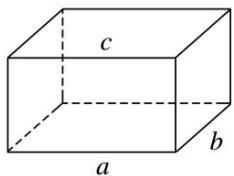

text_image

c
a
b

(2)(2019·全国Ⅲ)如图，点 N 为正方形 ABCD 的中心， $\triangle ECD$ 为正三角形，平面 $ECD \perp$ 平面 ABCD，M 是线段 ED 的中点，则()

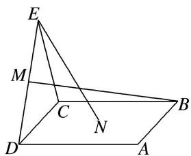

text_image

E
M
C
N
D
A
B

A. BM=EN，且直线 BM，EN 是相交直线

B. $BM \neq EN$ , 且直线 $BM, EN$ 是相交直线

C. BM=EN，且直线 BM，EN 是异面直线

D. $BM \neq EN$ ，且直线 $BM$ ， $EN$ 是异面直线

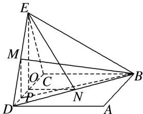

text_image

Geometric diagram of a pyramid with labeled vertices and internal points, used in spatial geometry problems.

(3)(多选)在正方体 $ABCD-A_{1}B_{1}C_{1}D_{1}$ 中，下列直线或平面与平面 $ACD_{1}$ 平行的是()

A. 直线 $A_{1}B$

B. 直线 $BB_{1}$

C. 平面 $A_{1}DC_{1}$

D. 平面 $A_{1}BC_{1}$

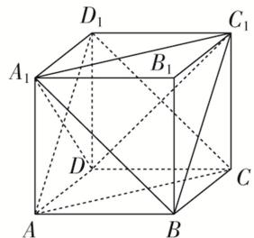

text_image

D₁
C₁
A₁
B₁
D
C
A
B

(4)(2017·全国 I)如图，在下列四个正方体中，A, B 为正方体的两个顶点，M, N, Q 为所在棱的中点，则在这四个正方体中，直线 AB 与平面 MNQ 不平行的是()

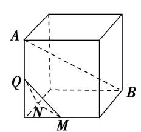

text_image

A
Q
N
M
B

A

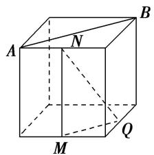

text_image

A
N
B
M
Q

B

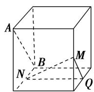  
C

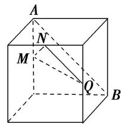

text_image

A
N
M
Q
B

D

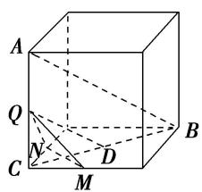

text_image

A
Q
C
N
D
M
B

①

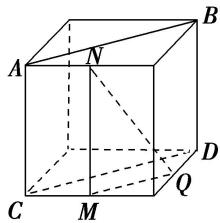

text_image

Geometric diagram of a cube with labeled vertices and internal points, used for spatial geometry problems.

②

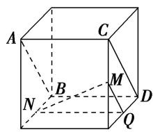

text_image

A
C
B
M
N
D
Q

③

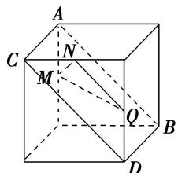

text_image

A
C
M
N
Q
B
D

④

(5)已知点 E, F 分别是正方体 $ABCD-A_{1}B_{1}C_{1}D_{1}$ 的棱 AB, $AA_{1}$ 的中点，点 M, N 分别是线段 $D_{1}E$ 与 $C_{1}F$ 上的点，则满足与平面 ABCD 平行的直线 MN 有()

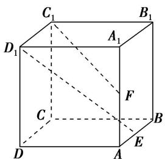

text_image

C₁
B₁
D₁
A₁
F
C
B
D
A
E

A. 0 条

B. 1 条

C. 2 条

D. 无数条

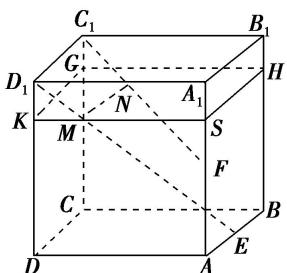

text_image

C₁
B₁
D₁
G
H
N
A₁
K
M
S
F
C
B
D
A
E

(6)如图所示，在正方体 $ABCD - A_{1}B_{1}C_{1}D_{1}$ 中，点 $O, M, N$ 分别是线段 $BD, DD_{1}, D_{1}C_{1}$ 的中点，则直线 $OM$ 与 $AC, MN$ 的位置关系是（）

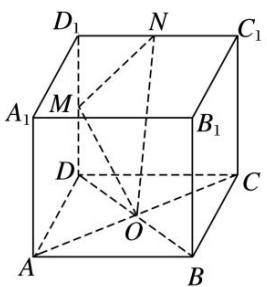

text_image

D₁ N C₁
A₁ M B₁
D O C
A B

A. 与 $AC, MN$ 均垂直

B. 与 $AC$ 垂直，与 $MN$ 不垂直

C. 与 $AC$ 不垂直，与 $MN$ 垂直

D. 与 $AC, MN$ 均不垂直

(7)如图， $PA \perp$ 圆 $O$ 所在的平面， $AB$ 是圆 $O$ 的直径， $C$ 是圆 $O$ 上的一点， $E$ ， $F$ 分别是点 $A$ 在 $PB$ ， $PC$ 上的射影，给出下列结论：

① $AF \perp PB$ ; ② $EF \perp PB$ ; ③ $AF \perp BC$ ; ④ $AE \perp$ 平面 PBC.

其中正确结论的序号是\_\_\_\_。

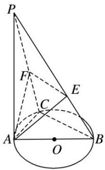

text_image

Geometric diagram of a cone with labeled points and auxiliary lines, likely from a math problem or proof.

(8)如图，AB 是圆锥 SO 的底面圆 O 的直径，D 是圆 O 上异于 A，B 的任意一点，以 AO 为直径的圆与 AD 的另一个交点为 C，P 为 SD 的中点．现给出以下结论：

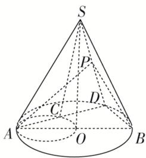

text_image

S
P
D
C
A
O
B

①△SAC 为直角三角形；②平面 $SAD \perp$ 平面 SBD；③平面 PAB 必与圆锥 SO 的某条母线平行。其中正确结论的序号是 \_\_\_\_ (写出所有正确结论的序号).

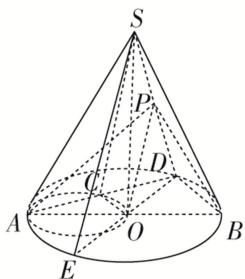

text_image

S
P
D
C
A
O
B
E

(9)如图所示, 直线 $PA$ 垂直于 $\odot O$ 所在的平面, $\triangle ABC$ 内接于 $\odot O$ , 且 $AB$ 为 $\odot O$ 的直径, 点 $M$ 为线段 $PB$ 的中点. 现有结论: ① $BC \perp PC$ ; ② $OM \parallel$ 平面 $APC$ ; ③ 点 $B$ 到平面 $PAC$ 的距离等于线段 $BC$ 的长. 其

中正确的是()

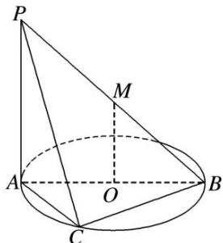

text_image

P
M
A
O
B
C

A. ①②

B. ①②③

C. ①

D. ②③

(10)(多选)已知四棱台 $ABCD - A_{1}B_{1}C_{1}D_{1}$ 的上、下底面均为正方形，其中 $AB = 2\sqrt{2}$ ， $A_{1}B_{1} = \sqrt{2}$ ， $AA_{1} = BB_{1} = CC_{1} = 2$ ，则下列叙述中正确的是（）

A. 该四棱台的高为 $\sqrt{3}$

B. $AA_{1} \perp CC_{1}$

C. 该四棱台的表面积为 26

D. 该四棱台外接球的表面积为 $16 \pi$

# 【对点精练】

1. 给出下列命题，其中正确的命题为\_\_\_\_。（填序号）

①如果线段 AB 在平面 $\alpha$ 内，那么直线 AB 在平面 $\alpha$ 内；

②两个不同的平面可以相交于不在同一直线上的三个点 A, B, C;

③若三条直线 a, b, c 互相平行且分别交直线 l 于 A, B, C 三点，则这四条直线共面；

④若三条直线两两相交，则这三条直线共面；

⑤两组对边相等的四边形是平行四边形.

2. 在三棱柱 $ABC - A_{1}B_{1}C_{1}$ 中， $E, F$ 分别为棱 $AA_{1}, CC_{1}$ 的中点，则在空间中与直线 $A_{1}B_{1}, EF, BC$ 都相交的直线（）

A. 不存在

B. 有且只有两条

C. 有且只有三条

D. 有无数条

3. (多选)如图, 在四面体 $A - BCD$ 中, $M, N, P, Q, E$ 分别为 $AB, BC, CD, AD, AC$ 的中点, 则下列说法中正确的是( )

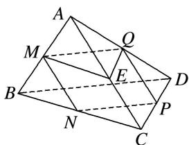

text_image

Geometric diagram of a polyhedron with labeled vertices and internal points, used for spatial geometry problems.

A. M, N, P, Q 四点共面

B. $\angle QME = \angle CBD$

C. $\triangle BCD \sim \triangle MEQ$

D. 四边形 $MNPQ$ 为梯形

4. 如图，在正方体 $ABCD - A_{1}B_{1}C_{1}D_{1}$ 中，下列命题正确的是( )

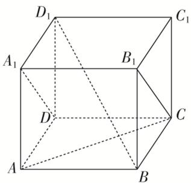

text_image

D₁
A₁
B₁
C₁
D
C
A
B

A. $AC$ 与 $B_{1}C$ 是相交直线且垂直

B. AC 与 $A_{1}D$ 是异面直线且垂直

C. $BD_{1}$ 与 BC 是相交直线且垂直

D. $AC$ 与 $BD_{1}$ 是异面直线且垂直

5. 如图所示的三棱柱 $ABC - A_{1}B_{1}C_{1}$ 中，过 $A_{1}B_{1}$ 的平面与平面 $ABC$ 交于 $DE$ ，则 $DE$ 与 $AB$ 的位置关系是（）

A. 异面

B. 平行

C. 相交

D. 以上均有可能

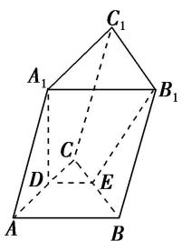

text_image

C₁
A₁ B₁
C
D E
A B

6. 如图，在正方体 $ABCDA_{1}B_{1}C_{1}D_{1}$ 中， $M, N$ 分别为棱 $C_{1}D_{1}, C_{1}C$ 的中点，有以下四个结论：

①直线 AM 与 $CC_{1}$ 是相交直线；②直线 AM 与 BN 是平行直线；

③直线 BN 与 $MB_{1}$ 是异面直线；④直线 MN 与 AC 所成的角为 $60^{\circ}$ .

其中正确的结论为\_\_\_\_(把你认为正确结论的序号都填上).

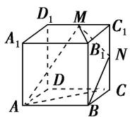

7. 如图, $DC \perp$ 平面 $ABC$ , $EB \parallel DC$ , $EB = 2DC$ , $P$ , $Q$ 分别为 $AE$ , $AB$ 的中点. 则直线 $DP$ 与平面 $ABC$ 的位置关系是 \_\_\_\_.

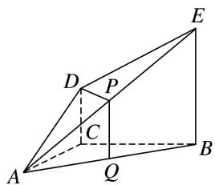

text_image

Geometric diagram of a triangular pyramid with labeled vertices and internal points

8. 如图所示, 在长方体 $ABCD - A_{1}B_{1}C_{1}D_{1}$ 中, 平面 $AB_{1}C$ 与平面 $A_{1}DC_{1}$ 的位置关系是

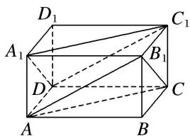

text_image

D₁
A₁
B₁
C₁
D
C
A
B

9. 如图, $L$ , $M$ , $N$ 分别为正方体对应棱的中点, 则平面 $LMN$ 与平面 $PQR$ 的位置关系是( )

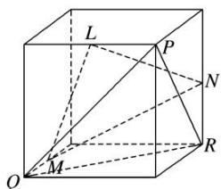

text_image

L
P
N
Q
M
R

A. 垂直

B. 相交不垂直

C. 平行

D. 重合

10. 若 $P$ 为矩形 $ABCD$ 所在平面外一点, 矩形对角线的交点为 $O$ , $M$ 为 $PB$ 的中点, 给出以下四个命题: ① $OM \parallel$ 平面 $PCD$ ; ② $OM \parallel$ 平面 $PBC$ ; ③ $OM \parallel$ 平面 $PDA$ ; ④ $OM \parallel$ 平面 $PBA$ . 其中正确的个数是 \_\_\_\_.

11. 如图所示，在正四棱柱 $ABCD - A_1B_1C_1D_1$ 中， $E, F, G, H$ 分别是棱 $CC_1, C_1D_1, D_1D, DC$ 的中点， $N$ 是 $BC$ 的中点，点 $M$ 在四边形 $EFGH$ 及其内部运动，则 $M$ 只需满足条件 \_\_\_\_ 时，就有 $MN//$ 平面 $B_1BDD_1$ . (注：请填上你认为正确的一个条件即可，不必考虑全部可能情况)

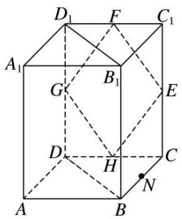

text_image

D₁ F C₁
A₁ G B₁ E
D H C
A B N

12. 若点 $A, B, C, M, N$ 为正方体的顶点或所在棱的中点，则下列各图中，不满足直线 $MN \parallel$ 平面 $ABC$ 的是（）

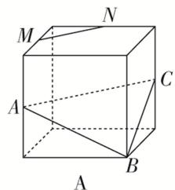

text_image

M
N
A
C
B
A

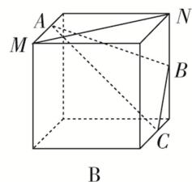

text_image

A
M
N
B
C
B

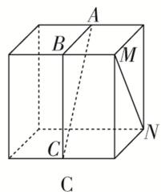

text_image

A
B
M
C
N
C

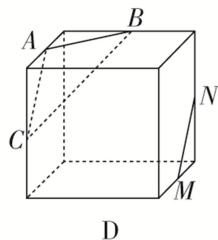

text_image

A
B
C
D
M
N

13. (2017·全国III)在正方体 $ABCDA_{1}B_{1}C_{1}D_{1}$ 中，E 为棱 CD 的中点，则()

A. $A_{1}E \perp DC_{1}$

B. $A_{1}E \perp BD$

C. $A_{1}E \perp BC_{1}$

D. $A_{1}E \perp AC$

14. 在下列四个正方体中，能得出异面直线 $AB \perp CD$ 的是()

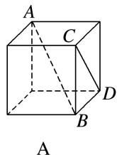

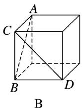

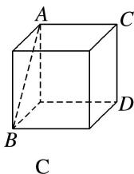

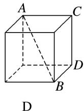

15. 如图，在三棱锥 $P - ABC$ 中，不能证明 $AP \perp BC$ 的条件是( )

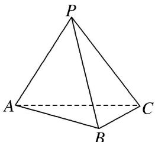

text_image

P
A
B
C

A. $AP \perp PB$ , $AP \perp PC$

B. $AP \perp PB, BC \perp PB$

C. 平面 $BPC \perp$ 平面 $APC, BC \perp PC$

D. $AP \perp$ 平面 $PBC$

16. (多选)如图，在以下四个正方体中，直线 AB 与平面 CDE 垂直的是()

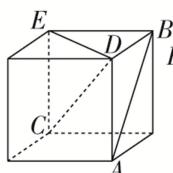  
A

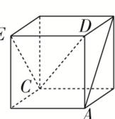  
B

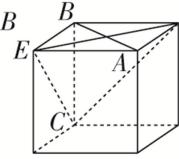  
C

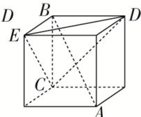  
D

17. 如图所示, $AB$ 是半圆 $O$ 的直径, $VA$ 垂直于半圆 $O$ 所在的平面, 点 $C$ 是圆周上不同于 $A$ , $B$ 的任意一点, $M$ , $N$ 分别为 $VA$ , $VC$ 的中点, 则下列结论正确的是( )

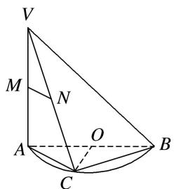

text_image

V
M
N
A
O
B
C

A. $MN \parallel AB$

B. 平面 $VAC \perp$ 平面 $VBC$

C. MN 与 BC 所成的角为 $45^{\circ}$

D. OC⊥平面 VAC

18. (多选)在正方体 $ABCD - A_{1}B_{1}C_{1}D_{1}$ 中， $N$ 为底面 $ABCD$ 的中心， $P$ 为线段 $A_{1}D_{1}$ 上的动点(不包括两个端点)， $M$ 为线段 $AP$ 的中点，则（）

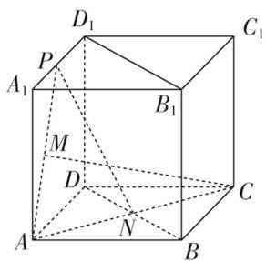

text_image

D₁
C₁
P
A₁
B₁
M
D
N
A
B
C

A. CM 与 PN 是异面直线

B. CM>PN

C. 平面 $PAN \perp$ 平面 $BDD_{1}B_{1}$

D. 过 $P, A, C$ 三点的正方体的截面一定是等腰梯形

19. 如图, 在正四面体 $P - ABC$ 中, $D, E, F$ 分别是 $AB, BC, CA$ 的中点, 下面四个结论不成立的是 ( )

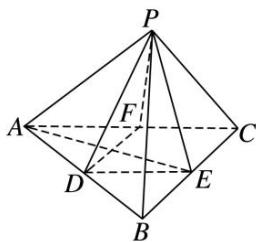

text_image

Geometric diagram of a pyramid with labeled vertices and internal points, used in spatial geometry problems.

A. $BC \parallel$ 平面 PDF

B. $DF \perp$ 平面 PAE

C. 平面 $PDF \perp$ 平面 $PAE$

D. 平面 $PDE \perp$ 平面 $ABC$

20. 如图所示, 在四棱锥 $P - ABCD$ 中, $PA \perp$ 底面 $ABCD$ , 且底面各边都相等, $M$ 是 $PC$ 上的一动点, 当点 $M$ 满足\_\_\_\_时, 平面 $MBD \perp$ 平面 $PCD$ . (只要填写一个你认为正确的条件即可)

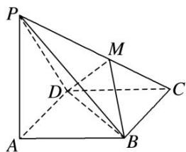

text_image

Geometric diagram of a tetrahedron with labeled vertices P, A, B, C, D, M and internal diagonals

21. 正方体 $ABCD - A_{1}B_{1}C_{1}D_{1}$ 的棱和六个面的对角线共有 24 条, 其中与体对角线 $AC_{1}$ 垂直的有

条.

22. 如图，已知六棱锥 P-ABCDEF 的底面是正六边形，PA⊥平面 ABC，PA=2AB，

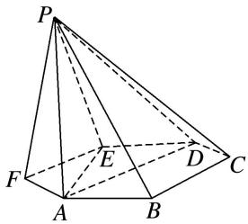

text_image

Geometric diagram of a pyramid with labeled vertices and internal points, used in spatial geometry problems.

则下列结论中: ① $PB \perp AE$ ; ②平面 $ABC \perp$ 平面 $PBC$ ; ③直线 $BC \parallel$ 平面 $PAE$ ; ④ $\angle PDA = 45^{\circ}$ . 正确的为 (把所有正确的序号都填上).

23. (多选)正方体 $ABCD - A_{1}B_{1}C_{1}D_{1}$ 的棱长为 1, E, F, G 分别为 BC, $CC_{1}$ , $BB_{1}$ 的中点, 则( )

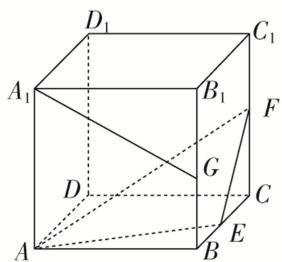

text_image

D₁
C₁
A₁
B₁
F
G
D
C
A
B
E

A. 直线 $D_{1} D$ 与直线 $A F$ 垂直

B. 直线 $A_{1}G$ 与平面 $AEF$ 平行

C. 平面 $AEF$ 截正方体所得的截面面积为 $\frac{9}{8}$

D. 点 $C$ 与点 $G$ 到平面 $AEF$ 的距离相等

24. (多选)如图, 四棱锥 $P - ABCD$ 中, 平面 $PAD \perp$ 底面 $ABCD$ , $\triangle PAD$ 是等边三角形, 底面 $ABCD$ 是菱形, 且 $\angle BAD = 60^{\circ}$ , $M$ 为棱 $PD$ 的中点, $N$ 为菱形 $ABCD$ 的中心, 下列结论正确的有( )

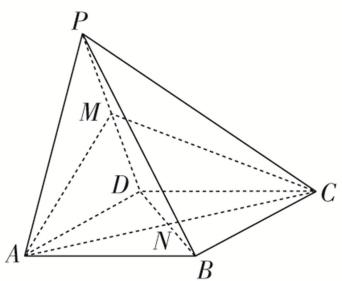

text_image

P
M
D
A
N
B
C

A. 直线 $PB$ 与平面 $AMC$ 平行

B. 直线 $PB$ 与直线 $AD$ 垂直

C. 线段 $AM$ 与线段 $CM$ 长度相等

D. $PB$ 与 $AM$ 所成角的余弦值为 $\frac{\sqrt{2}}{4}$

