# 专题 03 立体几何中空间线、面位置关系的判定（2）

# 【方法总结】

# 判断与空间位置关系有关命题真假的方法  
（1）借助空间线面平行、面面平行、线面垂直、面面垂直的判定定理和性质定理进行判断.  
（2）借助空间几何模型，如从长方体模型、四面体模型等模型中观察线面位置关系，结合有关定理，进行肯定或否定.  
（3）借助于反证法，当从正面入手较难时，可利用反证法，推出与题设或公认的结论相矛盾的命题，进而作出判断.

# 【例题选讲】

[例 1]（1）以下四个命题中，

①不共面的四点中，其中任意三点不共线；  
②若点 A, B, C, D 共面，点 A, B, C, E 共面，则点 A, B, C, D, E 共面；  
③若直线 a, b 共面，直线 a, c 共面，则直线 b, c 共面；  
④依次首尾相接的四条线段必共面.

正确命题的个数是( )

A. 0

B. 1

C. 2

D. 3 答案 B 解析 ①显然

是正确的；②中若 A, B, C 三点共线，则 A, B, C, D, E 五点不一定共面；③中构造长方体(或正方体)，如图所示，显然 b, c 异面，故不正确；④中空间四边形中四条线段不共面，故只有①正确.

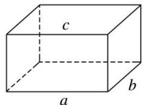  
（2）(2019·全国Ⅲ)如图，点 N 为正方形 ABCD 的中心， $\triangle ECD$ 为正三角形，平面 $ECD \perp$ 平面 ABCD，M 是线段 ED 的中点，则()

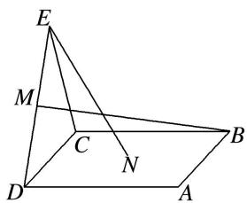

A. BM=EN，且直线 BM，EN 是相交直线

B. $BM \neq EN$ ，且直线 BM，EN 是相交直线

C. BM=EN，且直线 BM，EN 是异面直线

D. $BM \neq EN$ ，且直线 $BM$ ， $EN$ 是异面直线
答案 B 解析 如图，取 CD 的中点 O，连接 ON，EO，因为 $\triangle ECD$ 为正三角形，所以 $EO \perp CD$ ，又平面 $ECD \perp$ 平面 ABCD，平面 $ECD \cap$ 平面 ABCD = CD，所以 $EO \perp$ 平面 ABCD。设正方形 ABCD 的边长为 2，则 $EO = \sqrt{3}$ ，ON = 1，所以 $EN^{2} = EO^{2} + ON^{2} = 4$ ，得 EN = 2。过 M 作 CD 的垂线，垂足为 P，连接 BP，则 $MP = \frac{\sqrt{3}}{2}$ ， $CP = \frac{3}{2}$ ，所以 $BM^{2} = MP^{2} + BP^{2} = \left(\frac{\sqrt{3}}{2}\right)^{2} + \left(\frac{3}{2}\right)^{2} + 2^{2} = 7$ ，得 $BM = \sqrt{7}$ ，所以 $BM \neq EN$ 。连接 BD，BE，因为四边形 ABCD 为正方形，所以 N 为 BD 的中点，即 EN，MB 均在平面 BDE 内，所以直线 BM，EN 是相交直线。

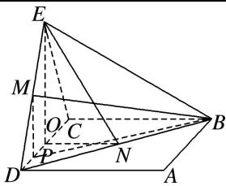  
（3）(多选)在正方体 $ABCD-A_{1}B_{1}C_{1}D_{1}$ 中，下列直线或平面与平面 $ACD_{1}$ 平行的是()

A. 直线 $A_{1}B$

B. 直线 $BB_{1}$

C. 平面 $A_{1}DC_{1}$

D. 平面 $A_{1}BC_{1}$
答案 AD 解析 如图，由 $A_{1}B \parallel D_{1}C$ ，且 $A_{1}B \not\subset$ 平面 $ACD_{1}$ ， $D_{1}C \subset$ 平面 $ACD_{1}$ ，故直线 $A_{1}B$ 与平面 $ACD_{1}$ 平行，故 A 正确；直线 $BB_{1} \parallel DD_{1}$ ， $DD_{1}$ 与平面 $ACD_{1}$ 相交，故直线 $BB_{1}$ 与平面 $ACD_{1}$ 相交，故 B 错误；显然平面 $A_{1}DC_{1}$ 与平面 $ACD_{1}$ 相交，故 C 错误；由 $A_{1}B \parallel D_{1}C$ ， $AC \parallel A_{1}C_{1}$ ，且 $A_{1}B \cap A_{1}C_{1} = A_{1}$ ， $AC \cap D_{1}C = C$ ，故平面 $A_{1}BC_{1}$ 与平面 $ACD_{1}$ 平行，故 D 正确．故选 AD.

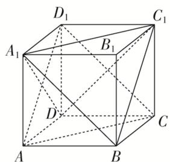  
（4）(2017·全国 I)如图，在下列四个正方体中，A, B 为正方体的两个顶点，M, N, Q 为所在棱的中点，则在这四个正方体中，直线 AB 与平面 MNQ 不平行的是()

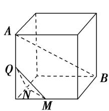

A

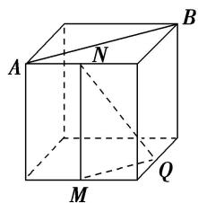

B

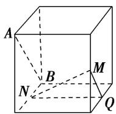  
C

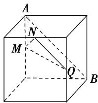

D
答案 A 解析 A 项, 作如图①所示的辅助线, 其中 D 为 BC 的中点, 则 $QD \parallel AB$ . $\because QD \cap$ 平面 MNQ = Q, $\therefore QD$ 与平面 MNQ 相交, $\therefore$ 直线 AB 与平面 MNQ 相交. B 项, 作如图②所示的辅助线, 则 $AB \parallel CD$ , $CD \parallel MQ$ , $\therefore AB \parallel MQ$ , 又 $AB \not\subset$ 平面 MNQ, $MQ \subset$ 平面 MNQ, $\therefore AB \parallel$ 平面 MNQ. C 项, 作如图③所示的辅助线, 则 $AB \parallel CD$ , $CD \parallel MQ$ , $\therefore AB \parallel MQ$ , 又 $AB \not\subset$ 平面 MNQ, $MQ \subset$ 平面 MNQ, $\therefore AB \parallel$ 平面 MNQ. D 项, 作如图④所示的辅助线, 则 $AB \parallel CD$ , $CD \parallel NQ$ , $\therefore AB \parallel NQ$ , 又 $AB \not\subset$ 平面 MNQ, $NQ \subset$ 平面 MNQ, $\therefore AB \parallel$ 平面 MNQ. 故选 A.

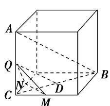

①

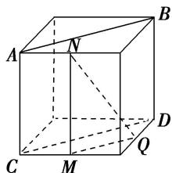

②

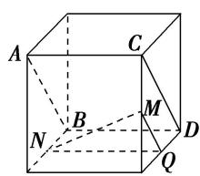

③

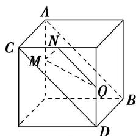

④  
（5）已知点 E, F 分别是正方体 $ABCD-A_{1}B_{1}C_{1}D_{1}$ 的棱 AB, $AA_{1}$ 的中点，点 M, N 分别是线段 $D_{1}E$ 与 $C_{1}F$ 上的点，则满足与平面 ABCD 平行的直线 MN 有()

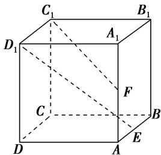

A. 0 条

B. 1 条

C. 2 条

D. 无数条
答案 D 解析 如图所示，作平面 $KSHG \parallel$ 平面 $ABCD$ ， $C_1F$ ， $D_1E$ 交平面 $KSHG$ 于点 $N$ ， $M$ ，连接 $MN$ ，由面面平行的性质得 $MN \parallel$ 平面 $ABCD$ ，由于平面 $KSHG$ 有无数多个，所以平行于平面 $ABCD$ 的 $MN$ 有无数多条，故选 D.

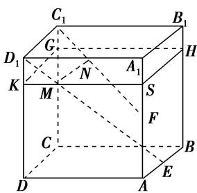  
（6）如图所示，在正方体 $ABCD - A_{1}B_{1}C_{1}D_{1}$ 中，点 $O, M, N$ 分别是线段 $BD, DD_{1}, D_{1}C_{1}$ 的中点，则直线 $OM$ 与 $AC, MN$ 的位置关系是（）

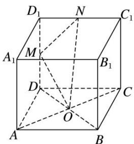

A. 与 $AC, MN$ 均垂直

B. 与 $AC$ 垂直，与 $MN$ 不垂直

C. 与 $AC$ 不垂直，与 $MN$ 垂直

D. 与 $AC$ ， $MN$ 均不垂直
答案 A 解析 因为 $DD_{1} \perp$ 平面 $ABCD$ ，所以 $AC \perp DD_{1}$ ，又因为 $AC \perp BD$ ， $DD_{1} \cap BD = D$ ，所以 $AC \perp$ 平面 $BDD_{1}B_{1}$ ，因为 $OM \subset$ 平面 $BDD_{1}B_{1}$ ，所以 $OM \perp AC$ 。设正方体的棱长为 2，则 $OM = \sqrt{1 + 2} = \sqrt{3}$ ， $MN = \sqrt{1 + 1} = \sqrt{2}$ ， $ON = \sqrt{1 + 4} = \sqrt{5}$ ，所以 $OM^{2} + MN^{2} = ON^{2}$ ，所以 $OM \perp MN$ 。故选 A.  
（7）如图， $PA \perp$ 圆 O 所在的平面，AB 是圆 O 的直径，C 是圆 O 上的一点，E，F 分别是点 A 在 PB，PC 上的射影，给出下列结论：

① $AF \perp PB$ ; ② $EF \perp PB$ ; ③ $AF \perp BC$ ; ④AE⊥平面PBC.
其中正确结论的序号是\_\_\_\_。

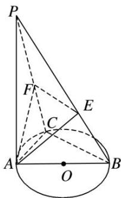

11. 答案 ①②③ 解析 由题意知 $PA \perp$ 平面 $ABC$ , $\therefore PA \perp BC$ . 又 $AC \perp BC$ , 且 $PA \cap AC = A$ , $PA$ , $AC \subset$ 平面 $PAC$ , $\therefore BC \perp$ 平面 $PAC$ , $\therefore BC \perp AF$ . $\because AF \perp PC$ , 且 $BC \cap PC = C$ , $BC$ , $PC \subset$ 平面 $PBC$ , $\therefore AF \perp$ 平面 $PBC$ , $\therefore AF \perp PB$ , 又 $AE \perp PB$ , $AE \cap AF = A$ , $AE$ , $AF \subset$ 平面 $AEF$ , $\therefore PB \perp$ 平面 $AEF$ , $\therefore PB \perp EF$ . 故①②③正确.  
（8）如图，AB 是圆锥 SO 的底面圆 O 的直径，D 是圆 O 上异于 A，B 的任意一点，以 AO 为直径的圆与 AD 的另一个交点为 C，P 为 SD 的中点．现给出以下结论：

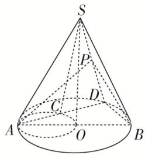

①△SAC为直角三角形；②平面 $SAD \perp$ 平面SBD；③平面PAB必与圆锥SO的某条母线平行.
其中正确结论的序号是\_\_\_\_(写出所有正确结论的序号).
答案 ①③ 解析 如图，连接 OC，∵SO⊥底面圆 O，∴SO⊥AC，C 在以 AO 为直径的圆上，∴AC⊥OC，∵OC∩SO=O，∴AC⊥平面 SOC，AC⊥SC，即△SAC 为直角三角形，故①正确；假设平面 SAD⊥平面 SBD，在平面 SAD 中过点 A 作 AH⊥SD 交 SD 于点 H，则 AH⊥平面 SBD，∴AH⊥BD，又 BD⊥AD，∴BD⊥平面 SAD，又 CO∥BD，∴CO⊥平面 SAD，∴CO⊥SC，又在△SOC 中，SO⊥OC，在一个三角形内不可能有两个直角，故平面 SAD⊥平面 SBD 不成立，故②错误；连接 DO 并延长交圆 O 于点 E，连接 PO，SE，∵P 为 SD 的中点，O 为 ED 的中点，∴OP 是△SDE 的中位线，∴PO∥SE，即 SE∥平面 PAB，即平面 PAB 必与圆锥 SO 的母线 SE 平行．故③正确．故正确是①③．

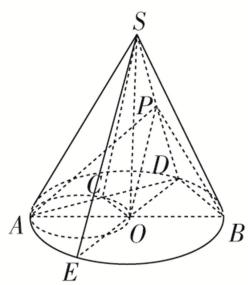  
（9）如图所示, 直线 $PA$ 垂直于 $\odot O$ 所在的平面, $\triangle ABC$ 内接于 $\odot O$ , 且 $AB$ 为 $\odot O$ 的直径, 点 $M$ 为线段 $PB$ 的中点. 现有结论: ① $BC \perp PC$ ; ② $OM \parallel$ 平面 $APC$ ; ③ 点 $B$ 到平面 $PAC$ 的距离等于线段 $BC$ 的长. 其中正确的是 ( )

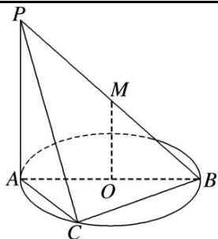

A. ①②

B. ①②③

C. ①

D. ②③
答案 B 解析 对于①，∵ $PA \perp$ 平面 ABC，∴ $PA \perp BC$ ，∵ AB 为 ⊙O 的直径，∴ $BC \perp AC$ ，∵ $AC \cap PA = A$ ，∴ $BC \perp$ 平面 PAC，又 $PC \subset$ 平面 PAC，∴ $BC \perp PC$ ；对于②，∵点 M 为线段 PB 的中点，∴ OM // PA，∵ $PA \subset$ 平面 PAC，OM ∉ 平面 PAC，∴ OM // 平面 PAC；对于③，由①知 BC ⊥ 平面 PAC，∴ 线段 BC 的长即是点 B 到平面 PAC 的距离，故①②③都正确.  
（10）(多选)已知四棱台 $ABCD - A_{1}B_{1}C_{1}D_{1}$ 的上、下底面均为正方形，其中 $AB = 2\sqrt{2}$ ， $A_{1}B_{1} = \sqrt{2}$ ， $AA_{1} = BB_{1} = CC_{1} = 2$ ，则下列叙述中正确的是（）

A. 该四棱台的高为 $\sqrt{3}$

B. $AA_{1} \perp CC_{1}$

C. 该四棱台的表面积为 26

D. 该四棱台外接球的表面积为 $16 \pi$
答案 AD 解析 由棱台的性质，画出切割前的四棱锥，如图所示．由于 $AB=2\sqrt{2}$ ， $A_{1}B_{1}=\sqrt{2}$ ，可知 $\triangle SA_{1}B_{1}$ 与 $\triangle SAB$ 的相似比为 1:2，则 $SA=2AA_{1}=4$ ，AO=2，则 $SO=2\sqrt{3}$ ，则 $OO_{1}=\sqrt{3}$ ，故该四棱台的高为 $\sqrt{3}$ ，A 正确；因为 SA=SC=AC=4，则 $AA_{1}$ 与 $CC_{1}$ 的夹角为 $60^{\circ}$ ，不垂直，B 错误；该四棱台的表面积为 $S=S_{上底}+S_{下底}+S_{侧}=2+8+4\times\frac{(\sqrt{2}+2\sqrt{2})}{2}\times\frac{\sqrt{14}}{2}=10+6\sqrt{7}$ ，C 错误；由于上、下底面都是正方形，则四棱台外接球的球心在 $OO_{1}$ 上，在平面 $B_{1}BOO_{1}$ 中，由于 $OO_{1}=\sqrt{3}$ ， $B_{1}O_{1}=1$ ，则 $OB_{1}=2=OB$ ，即点 O 到点 B 与点 $B_{1}$ 的距离相等，则四棱台外接球的半径 r=OB=2，故该四棱台外接球的表面积为 $16\pi$ ，D 正确．故选 AD.

# 【对点精练】

1. 给出下列命题，其中正确的命题为\_\_\_\_。（填序号）

①如果线段 AB 在平面 $\alpha$ 内，那么直线 AB 在平面 $\alpha$ 内；
②两个不同的平面可以相交于不在同一直线上的三个点A，B，C；
③若三条直线 a, b, c 互相平行且分别交直线 l 于 A, B, C 三点，则这四条直线共面；
④若三条直线两两相交，则这三条直线共面；
⑤两组对边相等的四边形是平行四边形.

1. 答案 ①③

2. 在三棱柱 $ABC - A_{1}B_{1}C_{1}$ 中， $E$ ， $F$ 分别为棱 $AA_{1}$ ， $CC_{1}$ 的中点，则在空间中与直线 $A_{1}B_{1}$ ， $EF$ ， $BC$ 都相交的直线（）

A. 不存在

B. 有且只有两条

C. 有且只有三条

D. 有无数条

2. 答案 D 解析 在 $EF$ 上任意取一点 $M$ , 直线 $A_{1}B_{1}$ 与 $M$ 确定一个平面, 这个平面与 $BC$ 有且仅有 1 个交点 $N$ , 当 $M$ 的位置不同时确定不同的平面, 从而与 $BC$ 有不同的交点 $N$ , 而直线 $MN$ 与 $A_{1}B_{1}$ , $EF$ ,

BC 分别有交点 P, M, N, 如图, 故有无数条直线与直线 $A_{1}B_{1}$ , EF, BC 都相交.

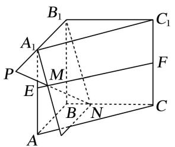

3. (多选)如图, 在四面体 $A - BCD$ 中, $M, N, P, Q, E$ 分别为 $AB, BC, CD, AD, AC$ 的中点, 则下列说法中正确的是( )

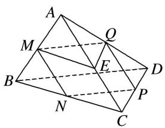

A. M, N, P, Q 四点共面

B. $\angle QME = \angle CBD$

C. $\triangle BCD \sim \triangle MEQ$

D. 四边形 $MNPQ$ 为梯形

3. 答案 ABC 解析 由三角形的中位线定理，易知 $MQ \parallel BD$ ， $ME \parallel BC$ ， $QE \parallel CD$ ， $NP \parallel BD$ 。对于 A，有 $MQ \parallel NP$ ，所以 M，N，P，Q 四点共面，故 A 说法正确；对于 B，根据等角定理，得 $\angle QME = \angle CBD$ ，故 B 说法正确；对于 C，由等角定理，知 $\angle QME = \angle CBD$ ， $\angle MEQ = \angle BCD$ ，所以 $\triangle BCD \sim \triangle MEQ$ ，故 C 说法正确；对于 D，由三角形的中位线定理，知 $MQ \parallel BD$ ， $MQ = \frac{1}{2} BD$ ， $NP \parallel BD$ ， $NP = \frac{1}{2} BD$ ，所以 $MQ = NP$ ， $MQ \parallel NP$ ，所以四边形 MNPQ 是平行四边形，故 D 说法不正确。

4. 如图，在正方体 $ABCD-A_{1}B_{1}C_{1}D_{1}$ 中，下列命题正确的是()

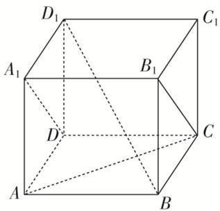

A. $AC$ 与 $B_{1}C$ 是相交直线且垂直

B. $AC$ 与 $A_{1}D$ 是异面直线且垂直

C. $BD_{1}$ 与 BC 是相交直线且垂直

D. $AC$ 与 $BD_{1}$ 是异面直线且垂直

4. 答案 D 解析 如图，连接 $AB_{1}$ ，可得 $\triangle AB_{1}C$ 为正三角形，可得 AC 与 $B_{1}C$ 是相交直线且成 $60^{\circ}$ 角，故 A 错误；∵ $A_{1}D \parallel B_{1}C$ ，∴ AC 与 $A_{1}D$ 是异面直线且成 $60^{\circ}$ 角，故 B 错误； $BD_{1}$ 与 BC 是相交直线，所成角为 $\angle D_{1}BC$ ，其正切值为 $\sqrt{2}$ ，故 C 错误；连接 BD，可知 $BD \perp AC$ ，则 $BD_{1} \perp AC$ ，可知 AC 与 $BD_{1}$ 是异面直线且垂直，故 D 正确．故选 D.

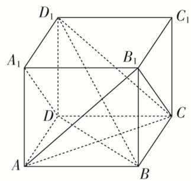

5. 如图所示的三棱柱 $ABC - A_{1}B_{1}C_{1}$ 中，过 $A_{1}B_{1}$ 的平面与平面 $ABC$ 交于 $DE$ ，则 $DE$ 与 $AB$ 的位置关系是（）

A. 异面

B. 平行

C. 相交

D. 以上均有可能

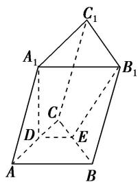

5. 答案 B 解析 在三棱柱 $ABC - A_{1}B_{1}C_{1}$ 中， $AB \parallel A_{1}B_{1}$ ， $\because AB \subset$ 平面 $ABC$ ， $A_{1}B_{1} \notin$ 平面 $ABC$ ， $\therefore A_{1}B_{1} \parallel$ 平面 $ABC$ ， $\because$ 过 $A_{1}B_{1}$ 的平面与平面 $ABC$ 交于 $DE$ ， $\therefore DE \parallel A_{1}B_{1}$ ， $\therefore DE \parallel AB$ 。故选 B.

6. 如图，在正方体 $ABCDA_{1}B_{1}C_{1}D_{1}$ 中， $M, N$ 分别为棱 $C_{1}D_{1}, C_{1}C$ 的中点，有以下四个结论：

①直线 AM 与 $CC_{1}$ 是相交直线；②直线 AM 与 BN 是平行直线；
③直线 BN 与 $MB_{1}$ 是异面直线；④直线 MN 与 AC 所成的角为 $60^{\circ}$ .
其中正确的结论为\_\_\_\_(把你认为正确结论的序号都填上).

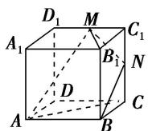

6. 答案 ③④ 解析 $AM$ 与 $CC_{1}$ 是异面直线， $AM$ 与 $BN$ 是异面直线， $BN$ 与 $MB_{1}$ 为异面直线。因为 $D_{1}C // MN$ ，所以直线 $MN$ 与 $AC$ 所成的角就是 $D_{1}C$ 与 $AC$ 所成的角，为 $60^{\circ}$ 。

7. 如图, $DC \perp$ 平面 $ABC$ , $EB \parallel DC$ , $EB = 2DC$ , $P$ , $Q$ 分别为 $AE$ , $AB$ 的中点. 则直线 $DP$ 与平面 $ABC$ 的位置关系是 \_\_\_\_.

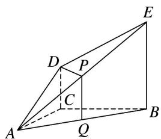

7. 答案 平行 解析 连接 $CQ$ ，在 $\triangle ABE$ 中， $P, Q$ 分别是 $AE, AB$ 的中点，所以 $PQ \parallel BE, PQ = \frac{1}{2} BE$ .

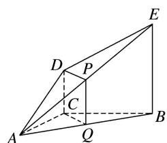
又 $DC \parallel EB, DC = \frac{1}{2} EB$ ，所以 $PQ \parallel DC, PQ = DC$ ，所以四边形 $DPQC$ 为平行四边形，所以 $DP \parallel CQ$ . 又 $DP \notin$ 平面 $ABC, CQ \subset$ 平面 $ABC$ ，所以 $DP \parallel$ 平面 $ABC$ .

8. 如图所示, 在长方体 $ABCD - A_{1}B_{1}C_{1}D_{1}$ 中, 平面 $AB_{1}C$ 与平面 $A_{1}DC_{1}$ 的位置关系是

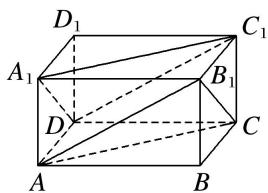

8. 答案 平行 解析 易证 $A_{1}C_{1}$ , $A_{1}D$ 都与平面 $AB_{1}C$ 平行, 且 $A_{1}D \cap A_{1}C_{1} = A_{1}$ , 所以平面 $AB_{1}C //$ 平面 $A_{1}DC_{1}$ .

9. 如图, $L$ , $M$ , $N$ 分别为正方体对应棱的中点, 则平面 $LMN$ 与平面 $PQR$ 的位置关系是( )

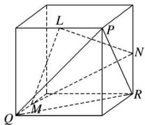

A. 垂直

B. 相交不垂直

C. 平行

D. 重合

9. 答案 C 解析 如图，分别取另三条棱的中点 A, B, C，将平面 LMN 延展为平面正六边形 AMBNCL，因为 $PQ \parallel AL$ ， $PR \parallel AM$ ，且 PQ 与 PR 相交，AL 与 AM 相交，所以平面 $PQR \parallel$ 平面 AMBNCL，即平面 LMN // 平面 PQR.

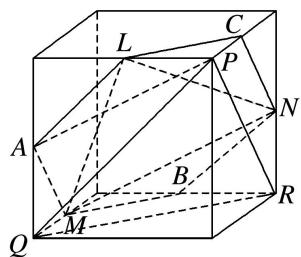

10. 若 $P$ 为矩形 $ABCD$ 所在平面外一点, 矩形对角线的交点为 $O$ , $M$ 为 $PB$ 的中点, 给出以下四个命题: ① $OM \parallel$ 平面 $PCD$ ; ② $OM \parallel$ 平面 $PBC$ ; ③ $OM \parallel$ 平面 $PDA$ ; ④ $OM \parallel$ 平面 $PBA$ . 其中正确的个数是 \_\_\_\_.

10. 答案 ①③ 解析 由已知可得 $OM \parallel PD$ , $\therefore OM \parallel$ 平面 $PCD$ 且 $OM \parallel$ 平面 $PAD$ . 故正确的只有①③.

11. 如图所示, 在正四棱柱 $ABCD-A_{1}B_{1}C_{1}D_{1}$ 中, $E$ , $F$ , $G$ , $H$ 分别是棱 $CC_{1}$ , $C_{1}D_{1}$ , $D_{1}D$ , $DC$ 的中点, $N$ 是 $BC$ 的中点, 点 $M$ 在四边形 $EFGH$ 及其内部运动, 则 $M$ 只需满足条件\_\_\_\_时, 就有 $MN//$ 平面 $B_{1}BDD_{1}$ . (注: 请填上你认为正确的一个条件即可, 不必考虑全部可能情况)

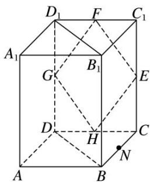

11. 答案 点 M 在线段 FH 上(或点 M 与点 H 重合) 解析 连接 HN, FH, FN, 则 $FH \parallel DD_{1}$ , $HN \parallel BD$ ,
∴平面 FHN// 平面 $B_{1}BDD_{1}$ ，只需 $M \in FH$ ，则 $MN \subset$ 平面 FHN，∴MN// 平面 $B_{1}BDD_{1}$ .

12. 若点 $A, B, C, M, N$ 为正方体的顶点或所在棱的中点，则下列各图中，不满足直线 $MN \parallel$ 平面 $ABC$ 的是（）

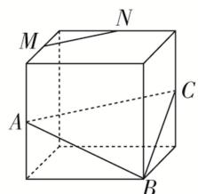

A

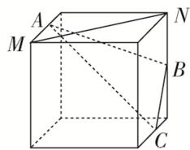

B

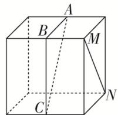

C

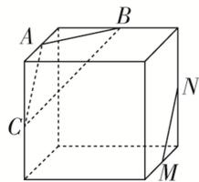

D

12. 答案 D 解析 对于 A，因为 A, C, M, N 分别为所在棱的中点，由正方体的性质知 $MN \parallel AC$ ，又 $MN \not\subset$ 平面 ABC， $AC \subset$ 平面 ABC，所以 $MN \parallel$ 平面 ABC。对于 B，取 AC 的中点 E，连接 BE，由条件及正方体的性质知 $MN \parallel BE$ 。因为 $MN \not\subset$ 平面 ABC， $BE \subset$ 平面 ABC，所以 $MN \parallel$ 平面 ABC。对于 C，取 AC 的中点 E，连接 BE，由条件及正方体的性质知 $MN \parallel BE$ ，因为 $MN \not\subset$ 平面 ABC， $BE \subset$ 平面 ABC，所以 $MN \parallel$ 平面 ABC。对于 D，连接 AM，BN，由条件及正方体的性质知四边形 AMNB 是等腰梯形，所以 AB 与 MN 所在的直线相交，故不能推出 $MN \parallel$ 平面 ABC。故选 D。

13. (2017·全国III)在正方体 $ABCDA_{1}B_{1}C_{1}D_{1}$ 中，E 为棱 CD 的中点，则()

A. $A_{1}E \perp DC_{1}$

B. $A_{1}E \perp BD$

C. $A_{1}E \perp BC_{1}$

D. $A_{1}E \perp AC$

13. 答案 C 解析 如图，∵ $A_{1}E$ 在平面 ABCD 上的射影为 AE，而 AE 不与 AC，BD 垂直，

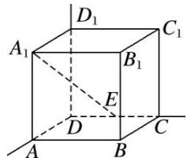
∴B，D错；∵ $A_{1}E$ 在平面 $BCC_{1}B_{1}$ 上的射影为 $B_{1}C$ ，且 $B_{1}C\perp BC_{1}$ ，∴ $A_{1}E\perp BC_{1}$ ，故C正确；(证明：由条件易知， $BC_{1}\perp B_{1}C$ ， $BC_{1}\perp CE$ ，又 $CE\cap B_{1}C=C$ ，∴ $BC_{1}\perp$ 平面 $CEA_{1}B_{1}$ 。又 $A_{1}E\subset$ 平面 $CEA_{1}B_{1}$ ，∴ $A_{1}E\perp BC_{1}$ )，∵ $A_{1}E$ 在平面 $DCC_{1}D_{1}$ 上的射影为 $D_{1}E$ ，而 $D_{1}E$ 不与 $DC_{1}$ 垂直，故A错。

14. 在下列四个正方体中, 能得出异面直线 $AB \perp CD$ 的是( )

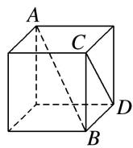  
A

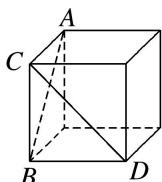  
B

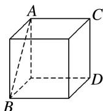  
C

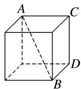  
D

14. 答案 A 解析 对于 A，作出过 AB 的平面 ABE，如图①，可得直线 CD 与平面 ABE 垂直，根据线面垂直的性质知， $AB \perp CD$ 成立，故 A 正确；对于 B，作出过 AB 的等边三角形 ABE，如图②，将 CD平移至 AE，可得 CD 与 AB 所成的角等于 $60^{\circ}$ ，故 B 不成立；对于 C，D，将 CD 平移至经过点 B 的侧棱处，可得 AB，CD 所成的角都是锐角，故 C 和 D 均不成立．故选 A.

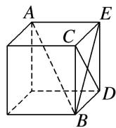  
图①

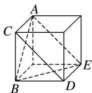  
图②

15. 如图, 在三棱锥 $P - ABC$ 中, 不能证明 $AP \perp BC$ 的条件是( )

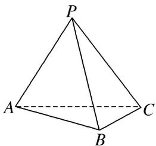

A. $AP \perp PB$ , $AP \perp PC$

B. $AP \perp PB, BC \perp PB$

C. 平面 $BPC \perp$ 平面 $APC, BC \perp PC$

D. $AP \perp$ 平面 $PBC$

15. 答案 B 解析 A 中，因为 $AP \perp PB, AP \perp PC, PB \cap PC = P$ ，所以 $AP \perp$ 平面 PBC。又 BC ⊂ 平面 PBC，所以 $AP \perp BC$ ，故 A 正确；C 中，因为平面 $BPC \perp$ 平面 APC，平面 $BPC \cap$ 平面 APC = PC， $BC \perp PC$ ，所以 $BC \perp$ 平面 APC。又 $AP \subset$ 平面 APC，所以 $AP \perp BC$ ，故 C 正确；D 中，由 A 知 D 正确；B 中条件不能判断出 $AP \perp BC$ ，故选 B。

16. (多选)如图，在以下四个正方体中，直线 $AB$ 与平面 $CDE$ 垂直的是( )

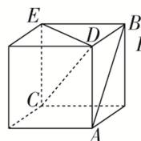  
A

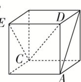  
B

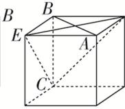  
C

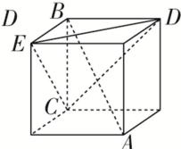  
D

16. 答案 BD 解析 在 A 中，AB 与 CE 的夹角为 $45^{\circ}$ ，所以直线 AB 与平面 CDE 不垂直，故不符合题意；在 B 中， $AB \perp CE$ ， $AB \perp DE$ ， $CE \cap DE = E$ ，所以 $AB \perp$ 平面 CDE，故符合题意；在 C 中，AB 与 EC 的夹角为 $60^{\circ}$ ，所以直线 AB 与平面 CDE 不垂直，故不符合题意；在 D 中， $AB \perp DE$ ， $AB \perp CE$ ， $DE \cap CE = E$ ，所以 $AB \perp$ 平面 CDE，故符合题意．故选 BD.

17. 如图所示, $AB$ 是半圆 $O$ 的直径, $VA$ 垂直于半圆 $O$ 所在的平面, 点 $C$ 是圆周上不同于 $A$ , $B$ 的任意一点, $M$ , $N$ 分别为 $VA$ , $VC$ 的中点, 则下列结论正确的是( )

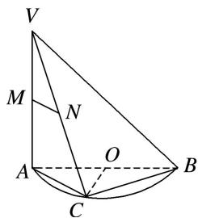

A. $MN \parallel AB$

B. 平面 $VAC \perp$ 平面 $VBC$

C. MN 与 BC 所成的角为 $45^{\circ}$

D. OC⊥平面 VAC

17. 答案 B 解析 由题意得 $BC \perp AC$ ，因为 $VA \perp$ 平面 $ABC$ ， $BC \subset$ 平面 $ABC$ ，所以 $VA \perp BC$ 。因为 $AC$

∩

VA=A，所以 $BC \perp$ 平面 VAC。因为 $BC \subset$ 平面 VBC，所以平面 $VAC \perp$ 平面 VBC。故选 B.

18. (多选)在正方体 $ABCD - A_{1}B_{1}C_{1}D_{1}$ 中， $N$ 为底面 $ABCD$ 的中心， $P$ 为线段 $A_{1}D_{1}$ 上的动点(不包括两个端点)， $M$ 为线段 $AP$ 的中点，则（）

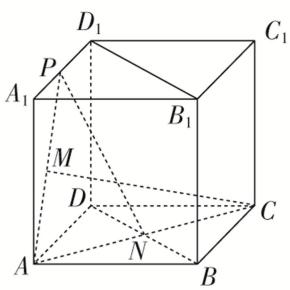

A. CM 与 PN 是异面直线

B. CM>PN

C. 平面 $PAN \perp$ 平面 $BDD_{1}B_{1}$

D. 过 $P, A, C$ 三点的正方体的截面一定是等腰梯形

18. 答案 BCD 解析 由 C, N, A 三点共线，得 CN, PM 交于点 A，因此 CM, PN 共面，A 错误；记 $\angle PAC = \theta$ ，则 $PN^{2} = AP^{2} + AN^{2} - 2AP \cdot AN \cos \theta = AP^{2} + \frac{1}{4}AC^{2} - AP \cdot AC \cos \theta$ , $CM^{2} = AC^{2} + AM^{2} - 2AC \cdot AM \cos \theta = AC^{2} + \frac{1}{4}AP^{2} - AP \cdot AC \cos \theta$ ，又 $AP < AC$ , $CM^{2} - PN^{2} = \frac{3}{4}(AC^{2} - AP^{2}) > 0$ ，所以 $CM^{2} > PN^{2}$ ，即 CM > PN，B 正确；在正方体 $ABCD - A_{1}B_{1}C_{1}D_{1}$ 中， $AN \perp BD$ ， $BB_{1} \perp$ 平面 ABCD，则 $BB_{1} \perp AN$ ， $BB_{1} \cap BD = B$ ，可得 $AN \perp$ 平面 $BDD_{1}B_{1}$ ， $AN \subset$ 平面 PAN，从而可得平面 $PAN \perp$ 平面 $BDD_{1}B_{1}$ ，C 正确；在 $C_{1}D_{1}$ 上取一点 K，使得 $D_{1}K = D_{1}P$ ，连接 KP, KC, $A_{1}C_{1}$ ，易知 $PK // A_{1}C_{1}$ ，又在正方体 $ABCD - A_{1}B_{1}C_{1}D_{1}$ 中， $A_{1}C_{1} // AC$ ，所以 $PK // AC$ ，所以 PK, AC 共面，PKCA 就是过 P, A, C 三点的正方体的截面，它是等腰梯形，D 正确．故选 BCD.

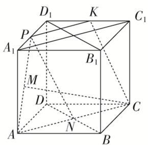

19. 如图，在正四面体 $P - ABC$ 中， $D, E, F$ 分别是 $AB, BC, CA$ 的中点，下面四个结论不成立的是（）

A. $BC \parallel$ 平面 PDF

B. $DF \perp$ 平面 $PAE$

C. 平面 $PDF \perp$ 平面 $PAE$

D. 平面 $PDE \perp$ 平面 $ABC$

19. 答案 D 解析 因为 $BC \parallel DF$ , $DF \subset$ 平面 $PDF$ , $BC \not\subset$ 平面 $PDF$ , 所以 $BC \parallel$ 平面 $PDF$ , 故选项 A 正确；在正四面体中， $AE \perp BC$ ， $PE \perp BC$ ， $AE \cap PE = E$ ，且 AE， $PE \subset$ 平面 PAE，所以 $BC \perp$ 平面 PAE，因为 $DF \parallel BC$ ，所以 $DF \perp$ 平面 PAE，又 $DF \subset$ 平面 PDF，从而平面 $PDF \perp$ 平面 PAE。因此选项 B，C 均正确。

20. 如图所示, 在四棱锥 $P - ABCD$ 中, $PA \perp$ 底面 $ABCD$ , 且底面各边都相等, $M$ 是 $PC$ 上的一动点, 当点 $M$ 满足\_\_\_\_时, 平面 $MBD \perp$ 平面 $PCD$ . (只要填写一个你认为正确的条件即可)

20. 答案 $DM \perp PC$ (或 $BM \perp PC$ 等) 解析 $\because PA \perp$ 底面 $ABCD$ , $\therefore BD \perp PA$ , 连接 $AC$ , 则 $BD \perp AC$ , 且 $PA \cap AC = A$ , $\therefore BD \perp$ 平面 $PAC$ , $\therefore BD \perp PC$ . $\therefore$ 当 $DM \perp PC$ (或 $BM \perp PC$ ) 时, 即有 $PC \perp$ 平面 $MBD$ , 而 $PC \subset$ 平面 $PCD$ , $\therefore$ 平面 $MBD \perp$ 平面 $PCD$ .

21. 正方体 $ABCD - A_{1}B_{1}C_{1}D_{1}$ 的棱和六个面的对角线共有 24 条, 其中与体对角线 $AC_{1}$ 垂直的有 \_\_\_\_ 条.

21. 答案 6 解析 如图所示，在正方体 $ABCD - A_{1}B_{1}C_{1}D_{1}$ 中， $BD \perp AC$ 。\$\because C\_{1}C \perp \text{平面 } BCD, BD \subset \text{平面 } BCD\$

$\therefore C_{1}C \perp BD$ ，又 $AC \cap CC_{1} = C$ ， $\therefore BD \perp$ 平面 $ACC_{1}$ ，又 $\because AC_{1} \subset$ 平面 $ACC_{1}$ ， $\therefore AC_{1} \perp BD$ 。同理 $A_{1}B$ ， $A_{1}D$ ， $B_{1}D_{1}$ ， $CD_{1}$ ， $B_{1}C$ 都与 $AC_{1}$ 垂直。正方体 $ABCD - A_{1}B_{1}C_{1}D_{1}$ 的棱中没有与 $AC_{1}$ 垂直的棱，故与体对角线 $AC_{1}$ 垂直的有6条。

22. 如图，已知六棱锥 $P - ABCDEF$ 的底面是正六边形， $PA \perp$ 平面 $ABC$ ， $PA = 2AB$ ，

则下列结论中: ① $PB \perp AE$ ; ②平面 $ABC \perp$ 平面 $PBC$ ; ③直线 $BC \parallel$ 平面 $PAE$ ; ④ $\angle PDA = 45^{\circ}$ . 正确的为 (把所有正确的序号都填上).

22. 答案 ①④ 解析 由 $PA \perp$ 平面 $ABC, AE \subset$ 平面 $ABC$ , 得 $PA \perp AE$ , 又由正六边形的性质得 $AE \perp AB$ , $PA \cap AB = A$ , 得 $AE \perp$ 平面 $PAB$ , $\because PB \subset$ 平面 $PAB$ , $\therefore PB \perp AE$ , $\therefore ①$ 正确; 由正六边形的性质计算可得 $PA = AD$ , 故 $\triangle PAD$ 是等腰直角三角形, $\therefore \angle PDA = 45^\circ$ , $\therefore ④$ 正确.

23. (多选)正方体 $ABCD - A_{1}B_{1}C_{1}D_{1}$ 的棱长为 1, E, F, G 分别为 BC, $CC_{1}$ , $BB_{1}$ 的中点, 则( )

A. 直线 $D_{1} D$ 与直线 $A F$ 垂直

B. 直线 $A_{1}G$ 与平面 $AEF$ 平行

C. 平面 AEF 截正方体所得的截面面积为 $\frac{9}{8}$

D. 点 $C$ 与点 $G$ 到平面 $AEF$ 的距离相等

23. 答案 BC 解析 $\because CC_{1}$ 与 $AF$ 不垂直, 而 $DD_{1} // CC_{1}$ , $\therefore AF$ 与 $DD_{1}$ 不垂直, 故 A 错误; 取 $B_{1}C_{1}$ 的中点 $N$ , 连接 $A_{1}N$ , $GN$ , 可得平面 $A_{1}GN //$ 平面 $AEF$ , 则直线 $A_{1}G //$ 平面 $AEF$ , 故 B 正确; 把截面 $AEF$ 补形为四边形 $AEFD_{1}$ , 由四边形 $AEFD_{1}$ 为等腰梯形可得平面 $AEF$ 截正方体所得的截面面积 $S = \frac{9}{8}$ , 故 C 正确; 假设点 $C$ 与点 $G$ 到平面 $AEF$ 的距离相等, 即平面 $AEF$ 将 $CG$ 平分, 则平面 $AEF$ 必过 $CG$ 的中点, 连接 $CG$ 交 $EF$ 于点 $H$ , 而 $H$ 不是 $CG$ 中点, 则假设不成立, 故 D 错误. 故选 BC.

24. (多选)如图, 四棱锥 $P - ABCD$ 中, 平面 $PAD \perp$ 底面 $ABCD$ , $\triangle PAD$ 是等边三角形, 底面 $ABCD$ 是菱形, 且 $\angle BAD = 60^{\circ}$ , $M$ 为棱 $PD$ 的中点, $N$ 为菱形 $ABCD$ 的中心, 下列结论正确的有( )

A. 直线 $PB$ 与平面 $AMC$ 平行

B. 直线 $PB$ 与直线 $AD$ 垂直

C. 线段 $AM$ 与线段 $CM$ 长度相等

D. $PB$ 与 $AM$ 所成角的余弦值为 $\frac{\sqrt{2}}{4}$

24. 答案 ABD 解析 如图，连接 MN，易知 $MN \parallel PB$ ，又 $MN \subset$ 平面 AMC，∴ $PB \parallel$ 平面 AMC，A 正确；在菱形 ABCD 中， $\angle BAD = 60^{\circ}$ ，∴ $\triangle BAD$ 为等边三角形。设 AD 的中点为 O，连接 OB，OP，则 OP $\perp AD$ ， $OB \perp AD$ ，∴ $AD \perp$ 平面 POB，又 $PB \subset$ 平面 POB，∴ $AD \perp PB$ ，B 正确；由平面 PAD $\perp$ 平面 ABCD，得 $\triangle POB$ 为直角三角形，设 AD = 4，则 $OP = OB = 2\sqrt{3}$ ，∴ $PB = 2\sqrt{6}$ ， $MN = \frac{1}{2}PB = \sqrt{6}$ 。在 $\triangle MAN$ 中，
$AM=AN=2\sqrt{3}$ ， $MN=\sqrt{6}$ ，可得 $\cos\angle AMN=\frac{\sqrt{2}}{4}$ ，故异面直线 PB 与 AM 所成角的余弦值为 $\frac{\sqrt{2}}{4}$ ，D 正确； $\because\cos\angle MNC=-\cos\angle MNA=-\cos\angle AMN=-\frac{\sqrt{2}}{4}$ ，又 $NC=2\sqrt{3}$ ， $MN=\sqrt{6}$ ， $\therefore-\frac{\sqrt{2}}{4}=\frac{6+12-CM^{2}}{2\times\sqrt{6}\times2\sqrt{3}}$ ，得 $CM=2\sqrt{6}>AM$ ，C 错误．故选 ABD.

