**专题03　立体几何中空间线、面位置关系的判定(2)**

【**方法总结**】

判断与空间位置关系有关命题真假的方法

(1)借助空间线面平行、面面平行、线面垂直、面面垂直的判定定理和性质定理进行判断．

(2)借助空间几何模型，如从长方体模型、四面体模型等模型中观察线面位置关系，结合有关定理，进行肯定或否定．

(3)借助于反证法，当从正面入手较难时，可利用反证法，推出与题设或公认的结论相矛盾的命题，进而作出判断．

**【例题选讲】**

**[例1]**(1)以下四个命题中，

①不共面的四点中，其中任意三点不共线；

②若点*A*，*B*，*C*，*D*共面，点*A*，*B*，*C*，*E*共面，则点*A*，*B*，*C*，*D*，*E*共面；

③若直线*a*，*b*共面，直线*a*，*c*共面，则直线*b*，*c*共面；

④依次首尾相接的四条线段必共面．

正确命题的个数是(　　)

A．0　　　　　　　　B．1　　　　　　　　C．2　　　　　　　　D．3答案　B　解析　①显然是正确的；②中若*A*，*B*，*C*三点共线，则*A*，*B*，*C*，*D*，*E*五点不一定共面；③中构造长方体(或正方体)，如图所示，显然*b*，*c*异面，故不正确；④中空间四边形中四条线段不共面，故只有①正确．

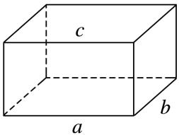

(2)(2019·全国Ⅲ)如图，点*N*为正方形*ABCD*的中心，△*ECD*为正三角形，平面*ECD*⊥平面*ABCD*，*M*是线段*ED*的中点，则(　　)

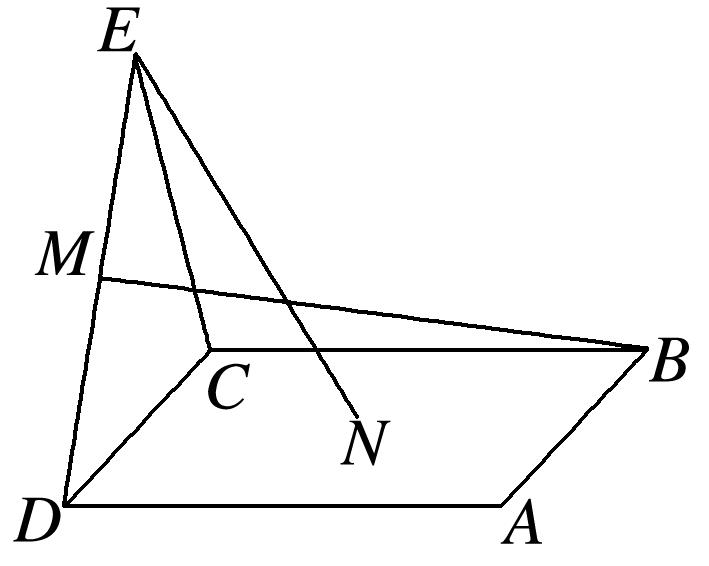

A．*BM*＝*EN*，且直线*BM*，*EN*是相交直线　　　　　B．*BM*≠*EN*，且直线*BM*，*EN*是相交直线

C．*BM*＝*EN*，且直线*BM*，*EN*是异面直线　　　　　D．*BM*≠*EN*，且直线*BM*，*EN*是异面直线

答案　B　解析　如图，取<em>CD</em>的中点<em>O</em>，连接<em>ON</em>，<em>EO</em>，因为△<em>ECD</em>为正三角形，所以<em>EO</em>⊥<em>CD</em>，又平面<em>ECD</em>⊥平面<em>ABCD</em>，平面<em>ECD</em>∩平面<em>ABCD</em>＝<em>CD</em>，所以<em>EO</em>⊥平面<em>ABCD</em>．设正方形<em>ABCD</em>的边长为2，则<em>EO</em>＝，<em>ON</em>＝1，所以<em>EN</em>2＝<em>EO</em>2＋<em>ON</em>2＝4，得<em>EN</em>＝2．过<em>M</em>作<em>CD</em>的垂线，垂足为<em>P</em>，连接<em>BP</em>，则<em>MP</em>＝，<em>CP</em>＝，所以<em>BM</em>2＝<em>MP</em>2＋<em>BP</em>2＝2＋2＋22＝7，得<em>BM</em>＝，所以<em>BM</em>≠<em>EN</em>．连接<em>BD</em>，<em>BE</em>，因为四边形<em>ABCD</em>为正方形，所以<em>N</em>为<em>BD</em>的中点，即<em>EN</em>，<em>MB</em>均在平面<em>BDE</em>内，所以直线<em>BM</em>，<em>EN</em>是相交直线．

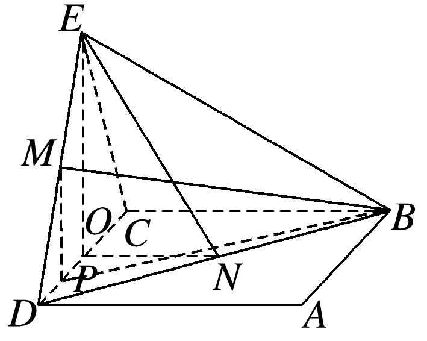

(3)(多选)在正方体<em>ABCD</em>－<em>A</em>1<em>B</em>1<em>C</em>1<em>D</em>1中，下列直线或平面与平面<em>ACD</em>1平行的是(　　)

A．直线<em>A</em>1<em>B</em>　　　　　B．直线<em>BB</em>1　　　　　C．平面<em>A</em>1<em>DC</em>1 　　　　　D．平面<em>A</em>1<em>BC</em>1

答案　AD　解析　如图，由<em>A</em>1<em>B</em>∥<em>D</em>1<em>C</em>，且<em>A</em>1<em>B</em>⊄平面<em>ACD</em>1，<em>D</em>1<em>C</em>⊂平面<em>ACD</em>1，故直线<em>A</em>1<em>B</em>与平面<em>ACD</em>1平行，故A正确；直线<em>BB</em>1∥<em>DD</em>1，<em>DD</em>1与平面<em>ACD</em>1相交，故直线<em>BB</em>1与平面<em>ACD</em>1相交，故B错误；显然平面<em>A</em>1<em>DC</em>1与平面<em>ACD</em>1相交，故C错误；由<em>A</em>1<em>B</em>∥<em>D</em>1<em>C</em>，<em>AC</em>∥<em>A</em>1<em>C</em>1，且<em>A</em>1<em>B</em>∩<em>A</em>1<em>C</em>1＝<em>A</em>1，<em>AC</em>∩<em>D</em>1<em>C</em>＝<em>C</em>，故平面<em>A</em>1<em>BC</em>1与平面<em>ACD</em>1平行，故D正确．故选AD．

(4)(2017·全国Ⅰ)如图，在下列四个正方体中，*A*，*B*为正方体的两个顶点，*M*，*N*，*Q*为所在棱的中点，则在这四个正方体中，直线*AB*与平面*MNQ*不平行的是(　　)

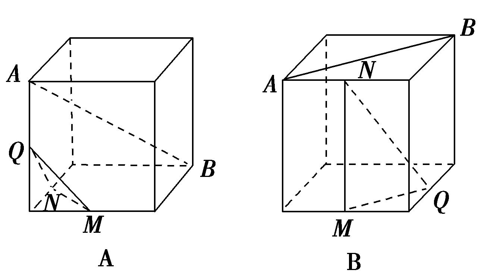

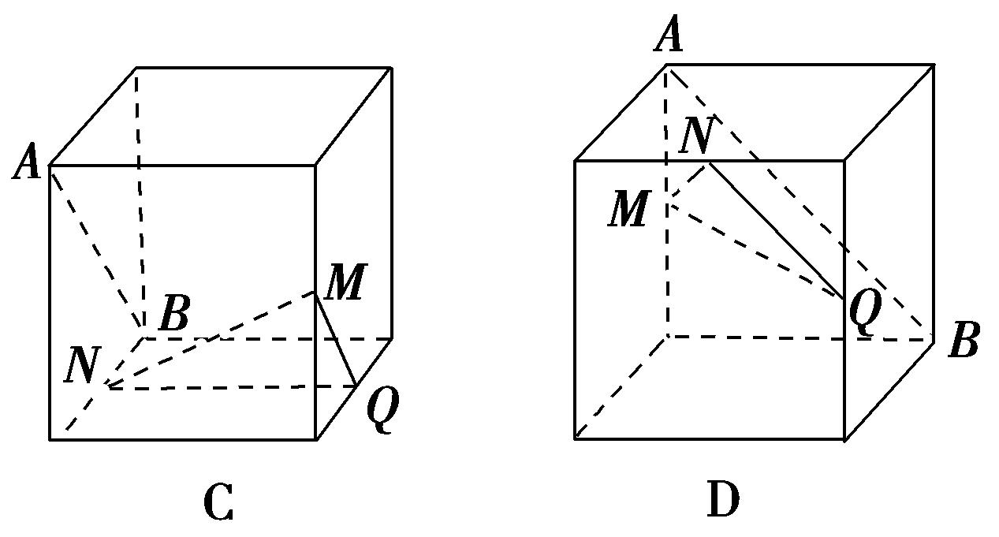

答案　A　解析　A项，作如图①所示的辅助线，其中*D*为*BC*的中点，则*QD*∥*AB*．∵*QD*∩平面*MNQ*＝*Q*，∴*QD*与平面*MNQ*相交，∴直线*AB*与平面*MNQ*相交．B项，作如图②所示的辅助线，则*AB*∥*CD*，*CD*∥*MQ*，∴*AB*∥*MQ*，又*AB*⊄平面*MNQ*，*MQ*⊂平面*MNQ*，∴*AB*∥平面*MNQ*．C项，作如图③所示的辅助线，则*AB*∥*CD*，*CD*∥*MQ*，∴*AB*∥*MQ*，又*AB*⊄平面*MNQ*，*MQ*⊂平面*MNQ*，∴*AB*∥平面*MNQ*．D项，作如图④所示的辅助线，则*AB*∥*CD*，*CD*∥*NQ*，∴*AB*∥*NQ*，又*AB*⊄平面*MNQ*，*NQ*⊂平面*MNQ*，∴*AB*∥平面*MNQ*．故选A．

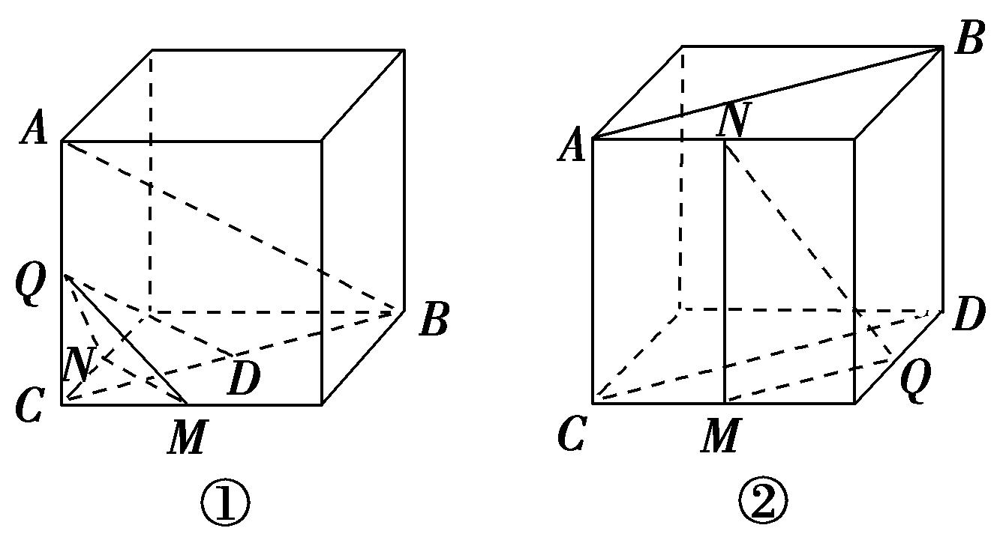

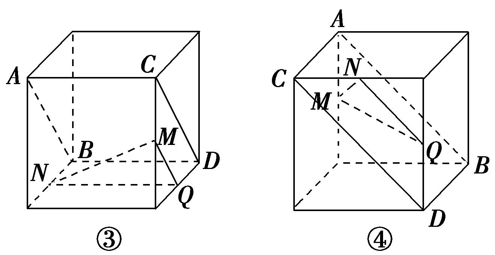

(5)已知点<em>E</em>，<em>F</em>分别是正方体<em>ABCD－A</em>1<em>B</em>1<em>C</em>1<em>D</em>1的棱<em>AB</em>，<em>AA</em>1的中点，点<em>M</em>，<em>N</em>分别是线段<em>D</em>1<em>E</em>与<em>C</em>1<em>F</em>上的点，则满足与平面<em>ABCD</em>平行的直线<em>MN</em>有(　　)

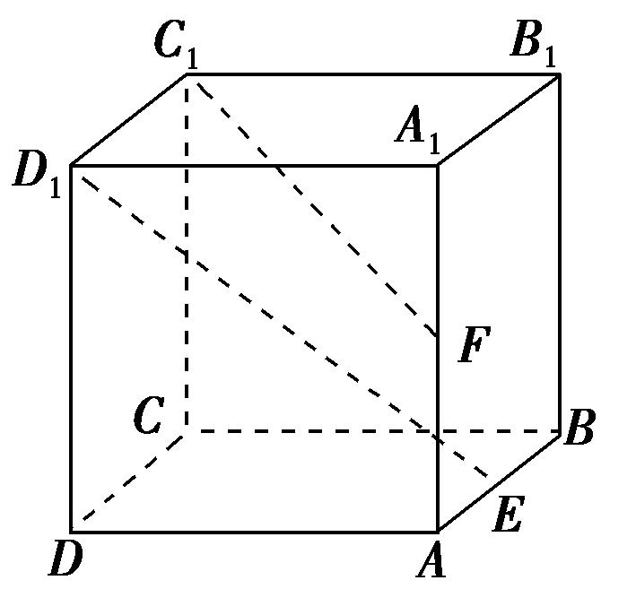

A．0条　　　　　　　　B．1条　　　　　　　　C．2条　　　　　　　　D．无数条

答案　D　解析　如图所示，作平面<em>KSHG</em>∥平面<em>ABCD</em>，<em>C</em>1<em>F</em>，<em>D</em>1<em>E</em>交平面<em>KSHG</em>于点<em>N</em>，<em>M</em>，连接<em>MN</em>，由面面平行的性质得<em>MN</em>∥平面<em>ABCD</em>，由于平面<em>KSHG</em>有无数多个，所以平行于平面<em>ABCD</em>的<em>MN</em>有无数多条，故选D．

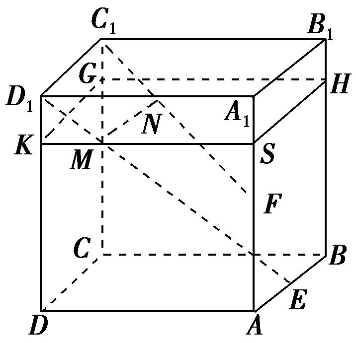

(6)如图所示，在正方体<em>ABCD</em>—<em>A</em>1<em>B</em>1<em>C</em>1<em>D</em>1中，点<em>O</em>，<em>M</em>，<em>N</em>分别是线段<em>BD</em>，<em>DD</em>1，<em>D</em>1<em>C</em>1的中点，则直线<em>OM</em>与<em>AC</em>，<em>MN</em>的位置关系是(　　)

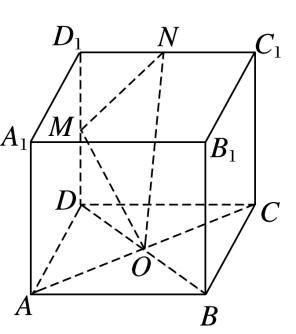

A．与*AC*，*MN*均垂直　　　　　　　　　　　B．与*AC*垂直，与*MN*不垂直

C．与*AC*不垂直，与*MN*垂直　　　　　　　D．与*AC*，*MN*均不垂直

答案　A　解析　因为<em>DD</em>1⊥平面<em>ABCD</em>，所以<em>AC</em>⊥<em>DD</em>1，又因为<em>AC</em>⊥<em>BD</em>，<em>DD</em>1∩<em>BD</em>＝<em>D</em>，所以<em>AC</em>⊥平面<em>BDD</em>1<em>B</em>1，因为<em>OM</em>⊂平面<em>BDD</em>1<em>B</em>1，所以<em>OM</em>⊥<em>AC</em>．设正方体的棱长为2，则<em>OM</em>＝＝，<em>MN</em>＝＝，<em>ON</em>＝＝，所以<em>OM</em>2＋<em>MN</em>2＝<em>ON</em>2，所以<em>OM</em>⊥<em>MN</em>．故选A．

(7)如图，*PA*⊥圆*O*所在的平面，*AB*是圆*O*的直径，*C*是圆*O*上的一点，*E*，*F*分别是点*A*在*PB*，*PC*上的射影，给出下列结论：

①*AF*⊥*PB*；②*EF*⊥*PB*；③*AF*⊥*BC*；④*AE*⊥平面*PBC*．

其中正确结论的序号是\_\_\_\_\_\_\_\_．

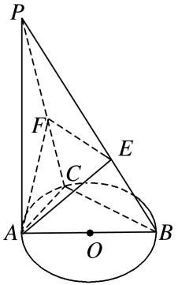

11．答案　①②③　解析　由题意知*PA*⊥平面*ABC*，∴*PA*⊥*BC*．又*AC*⊥*BC*，且*PA*∩*AC*＝*A*，*PA*，*AC*

⊂平面*PAC*，∴*BC*⊥平面*PAC*，∴*BC*⊥*AF*．∵*AF*⊥*PC*，且*BC*∩*PC*＝*C*，*BC*，*PC*⊂平面*PBC*，∴*AF*⊥平面*PBC*，∴*AF*⊥*PB*，又*AE*⊥*PB*，*AE*∩*AF*＝*A*，*AE*，*AF*⊂平面*AEF*，∴*PB*⊥平面*AEF*，∴*PB*⊥*EF*．故①②③正确．

(8)如图，*AB*是圆锥*SO*的底面圆*O*的直径，*D*是圆*O*上异于*A*，*B*的任意一点，以*AO*为直径的圆与*AD*的另一个交点为*C*，*P*为*SD*的中点．现给出以下结论：

①△*SAC*为直角三角形；②平面*SAD*⊥平面*SBD*；③平面*PAB*必与圆锥*SO*的某条母线平行．

其中正确结论的序号是\_\_\_\_\_\_\_\_(写出所有正确结论的序号)．

答案　①③　解析　如图，连接*OC*，∵*SO*⊥底面圆*O*，∴*SO*⊥*AC*，*C*在以*AO*为直径的圆上，∴*AC*⊥*OC*，∵*OC*∩*SO*＝*O*，∴*AC*⊥平面*SOC*，*AC*⊥*SC*，即△*SAC*为直角三角形，故①正确；假设平面*SAD*⊥平面*SBD*，在平面*SAD*中过点*A*作*AH*⊥*SD*交*SD*于点*H*，则*AH*⊥平面*SBD*，∴*AH*⊥*BD*，又*BD*⊥*AD*，∴*BD*⊥平面*SAD*，又*CO*∥*BD*，∴*CO*⊥平面*SAD*，∴*CO*⊥*SC*，又在△*SOC*中，*SO*⊥*OC*，在一个三角形内不可能有两个直角，故平面*SAD*⊥平面*SBD*不成立，故②错误；连接*DO*并延长交圆*O*于点*E*，连接*PO*，*SE*，∵*P*为*SD*的中点，*O*为*ED*的中点，∴*OP*是△*SDE*的中位线，∴*PO*∥*SE*，即*SE*∥平面*PAB*，即平面*PAB*必与圆锥*SO*的母线*SE*平行．故③正确．故正确是①③．

(9)如图所示，直线*PA*垂直于⊙*O*所在的平面，△*ABC*内接于⊙*O*，且*AB*为⊙*O*的直径，点*M*为线段*PB*的中点．现有结论：①*BC*⊥*PC*；②*OM*∥平面*APC*；③点*B*到平面*PAC*的距离等于线段*BC*的长．其中正确的是(　　)

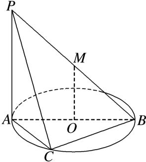

A．①②　　　　　　　　B．①②③　　　　　　　　C．①　　　　　　　　D．②③

答案　B　解析　对于①，∵*PA*⊥平面*ABC*，∴*PA*⊥*BC*，∵*AB*为⊙*O*的直径，∴*BC*⊥*AC*，∵*AC*∩*PA*＝*A*，∴*BC*⊥平面*PAC*，又*PC*⊂平面*PAC*，∴*BC*⊥*PC*；对于②，∵点*M*为线段*PB*的中点，∴*OM*∥*PA*，∵*PA*⊂平面*PAC*，*OM*⊄平面*PAC*，∴*OM*∥平面*PAC*；对于③，由①知*BC*⊥平面*PAC*，∴线段*BC*的长即是点*B*到平面*PAC*的距离，故①②③都正确．

(10)(多选)已知四棱台<em>ABCD</em>－<em>A</em>1<em>B</em>1<em>C</em>1<em>D</em>1的上、下底面均为正方形，其中<em>AB</em>＝2，<em>A</em>1<em>B</em>1＝，<em>AA</em>1＝<em>BB</em>1＝<em>CC</em>1＝2，则下列叙述中正确的是(　　)

A．该四棱台的高为　　　　　　　B．<em>AA</em>1⊥<em>CC</em>1

C．该四棱台的表面积为26　　　　　D．该四棱台外接球的表面积为16π

答案　AD　解析　由棱台的性质，画出切割前的四棱锥，如图所示．由于<em>AB</em>＝2，<em>A</em>1<em>B</em>1＝，可知△<em>SA</em>1<em>B</em>1与△<em>SAB</em>的相似比为1∶2，则<em>SA</em>＝2<em>AA</em>1＝4，<em>AO</em>＝2，则<em>SO</em>＝2，则<em>OO</em>1＝，故该四棱台的高为，A正确；因为<em>SA</em>＝<em>SC</em>＝<em>AC</em>＝4，则<em>AA</em>1与<em>CC</em>1的夹角为60°，不垂直，B错误；该四棱台的表面积为<em>S</em>＝<em>S</em>上底＋<em>S</em>下底＋<em>S</em>侧＝2＋8＋4××＝10＋6，C错误；由于上、下底面都是正方形，则四棱台外接球的球心在<em>OO</em>1上，在平面<em>B</em>1<em>BOO</em>1中，由于<em>OO</em>1＝，<em>B</em>1<em>O</em>1＝1，则<em>OB</em>1＝2＝<em>OB</em>，即点<em>O</em>到点<em>B</em>与点<em>B</em>1的距离相等，则四棱台外接球的半径<em>r</em>＝<em>OB</em>＝2，故该四棱台外接球的表面积为16π，D正确．故选AD．

**【对点精练】**

1．给出下列命题，其中正确的命题为\_\_\_\_\_\_\_\_．(填序号)

①如果线段*AB*在平面*α*内，那么直线*AB*在平面*α*内；

②两个不同的平面可以相交于不在同一直线上的三个点*A*，*B*，*C*；

③若三条直线*a*，*b*，*c*互相平行且分别交直线*l*于*A*，*B*，*C*三点，则这四条直线共面；

④若三条直线两两相交，则这三条直线共面；

⑤两组对边相等的四边形是平行四边形．

1．答案　①③

2．在三棱柱<em>ABC</em>－<em>A</em>1<em>B</em>1<em>C</em>1中，<em>E</em>，<em>F</em>分别为棱<em>AA</em>1，<em>CC</em>1的中点，则在空间中与直线<em>A</em>1<em>B</em>1，<em>EF</em>，<em>BC</em>都相

交的直线(　　)

A．不存在　　　　　B．有且只有两条　　　　　C．有且只有三条　　　　　D．有无数条

2．答案　D　解析　在<em>EF</em>上任意取一点<em>M</em>，直线<em>A</em>1<em>B</em>1与<em>M</em>确定一个平面，这个平面与<em>BC</em>有且仅有1

个交点<em>N</em>，当<em>M</em>的位置不同时确定不同的平面，从而与<em>BC</em>有不同的交点<em>N</em>，而直线<em>MN</em>与<em>A</em>1<em>B</em>1，<em>EF</em>，<em>BC</em>分别有交点<em>P</em>，<em>M</em>，<em>N</em>，如图，故有无数条直线与直线<em>A</em>1<em>B</em>1，<em>EF</em>，<em>BC</em>都相交．

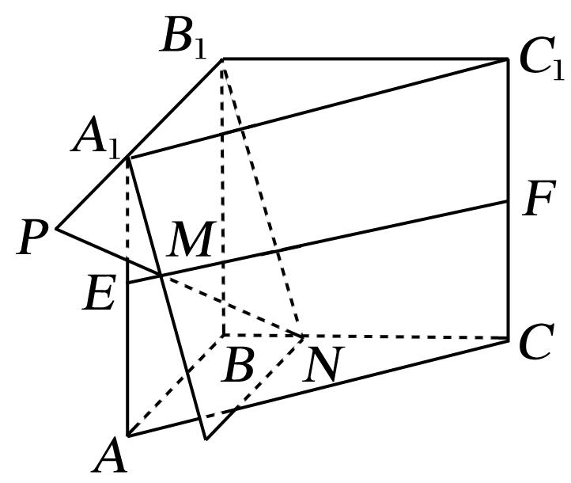

3．(多选)如图，在四面体*A*－*BCD*中，*M*，*N*，*P*，*Q*，*E*分别为*AB*，*BC*，*CD*，*AD*，*AC*的中点，则下

列说法中正确的是(　　)

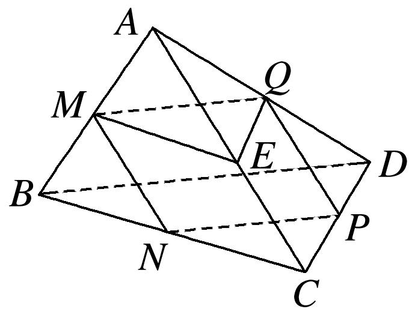

A．*M*，*N*，*P*，*Q*四点共面　　　　　　　　　　B．∠*QME*＝∠*CBD*

C．△*BCD*∽△*MEQ*　　　　　　　　　　　　　D．四边形*MNPQ*为梯形

3．答案　ABC　解析　由三角形的中位线定理，易知*MQ*∥*BD*，*ME*∥*BC*，*QE*∥*CD*，*NP*∥*BD*．对于A，

有*MQ*∥*NP*，所以*M*，*N*，*P*，*Q*四点共面，故A说法正确；对于B，根据等角定理，得∠*QME*＝∠*CBD*，故B说法正确；对于C，由等角定理，知∠*QME*＝∠*CBD*，∠*MEQ*＝∠*BCD*，所以△*BCD*∽△*MEQ*，故C说法正确；对于D，由三角形的中位线定理，知*MQ*∥*BD*，*MQ*＝*BD*，*NP*∥*BD*，*NP*＝*BD*，所以*MQ*＝*NP*，*MQ*∥*NP*，所以四边形*MNPQ*是平行四边形，故D说法不正确．

4．如图，在正方体<em>ABCD</em>－<em>A</em>1<em>B</em>1<em>C</em>1<em>D</em>1中，下列命题正确的是(　　)

A．<em>AC</em>与<em>B</em>1<em>C</em>是相交直线且垂直　　　　　　　　B．<em>AC</em>与<em>A</em>1<em>D</em>是异面直线且垂直

C．<em>BD</em>1与<em>BC</em>是相交直线且垂直　　　　　　　　D．<em>AC</em>与<em>BD</em>1是异面直线且垂直

4．答案　D　解析　如图，连接<em>AB</em>1，可得△<em>AB</em>1<em>C</em>为正三角形，可得<em>AC</em>与<em>B</em>1<em>C</em>是相交直线且成60°角，

故A错误；∵<em>A</em>1<em>D</em>∥<em>B</em>1<em>C</em>，∴<em>AC</em>与<em>A</em>1<em>D</em>是异面直线且成60°角，故B错误；<em>BD</em>1与<em>BC</em>是相交直线，所成角为∠<em>D</em>1<em>BC</em>，其正切值为，故C错误；连接<em>BD</em>，可知<em>BD</em>⊥<em>AC</em>，则<em>BD</em>1⊥<em>AC</em>，可知<em>AC</em>与<em>BD</em>1是异面直线且垂直，故D正确．故选D．

5．如图所示的三棱柱<em>ABC－A</em>1<em>B</em>1<em>C</em>1中，过<em>A</em>1<em>B</em>1的平面与平面<em>ABC</em>交于<em>DE</em>，则<em>DE</em>与<em>AB</em>的位置关系是(　　)

A．异面　　　　　　B．平行　　　　　　C．相交　　　　　　D．以上均有可能

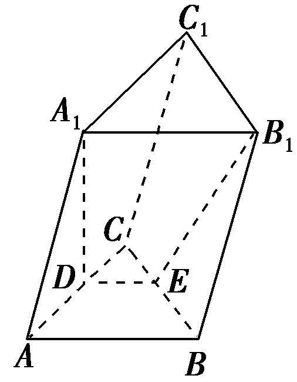

5．答案　B　解析　在三棱柱<em>ABC－A</em>1<em>B</em>1<em>C</em>1中，<em>AB</em>∥<em>A</em>1<em>B</em>1，∵<em>AB</em>⊂平面<em>ABC</em>，<em>A</em>1<em>B</em>1⊄平面<em>ABC</em>，∴<em>A</em>1<em>B</em>1

∥平面<em>ABC</em>，∵过<em>A</em>1<em>B</em>1的平面与平面<em>ABC</em>交于<em>DE</em>，∴<em>DE</em>∥<em>A</em>1<em>B</em>1，∴<em>DE</em>∥<em>AB</em>．故选B．

6．如图，在正方体<em>ABCDA</em>1<em>B</em>1<em>C</em>1<em>D</em>1中，<em>M</em>，<em>N</em>分别为棱<em>C</em>1<em>D</em>1，<em>C</em>1<em>C</em>的中点，有以下四个结论：

①直线<em>AM</em>与<em>CC</em>1是相交直线；②直线<em>AM</em>与<em>BN</em>是平行直线；

③直线<em>BN</em>与<em>MB</em>1是异面直线；④直线<em>MN</em>与<em>AC</em>所成的角为60°．

其中正确的结论为\_\_\_\_\_\_\_\_(把你认为正确结论的序号都填上)．

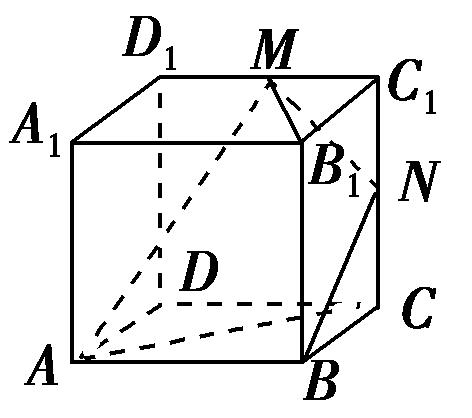

6．答案　③④　解析　<em>AM</em>与<em>CC</em>1是异面直线，<em>AM</em>与<em>BN</em>是异面直线，<em>BN</em>与<em>MB</em>1为异面直线．因为

<em>D</em>1<em>C</em>∥<em>MN</em>，所以直线<em>MN</em>与<em>AC</em>所成的角就是<em>D</em>1<em>C</em>与<em>AC</em>所成的角，为60°．

7．如图，*DC*⊥平面*ABC*，*EB*∥*DC*，*EB*＝2*DC*，*P*，*Q*分别为*AE*，*AB*的中点．则直线*DP*与平面*ABC*

的位置关系是\_\_\_\_\_\_\_\_．

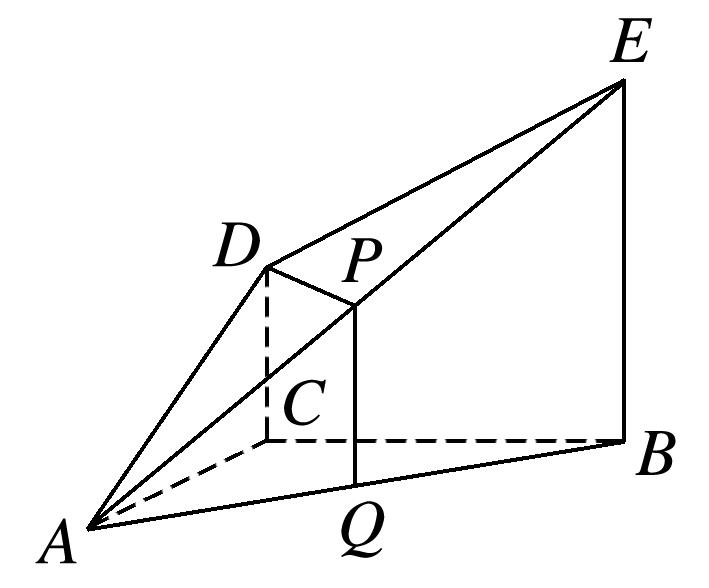

7．答案　平行　解析　连接*CQ*，在△*ABE*中，*P*，*Q*分别是*AE*，*AB*的中点，所以*PQ*∥*BE*，*PQ*＝*BE*．

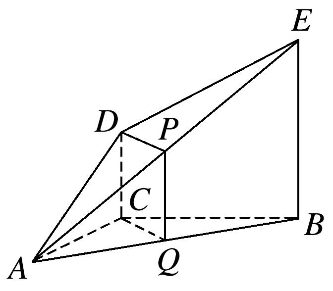

又*DC*∥*EB*，*DC*＝*EB*，所以*PQ*∥*DC*，*PQ*＝*DC*，所以四边形*DPQC*为平行四边形，所以*DP*∥*CQ*．又*DP*⊄平面*ABC*，*CQ*⊂平面*ABC*，所以*DP*∥平面*ABC*．

8．如图所示，在长方体<em>ABCD</em>－<em>A</em>1<em>B</em>1<em>C</em>1<em>D</em>1中，平面<em>AB</em>1<em>C</em>与平面<em>A</em>1<em>DC</em>1的位置关系是\_\_\_\_\_\_\_\_．

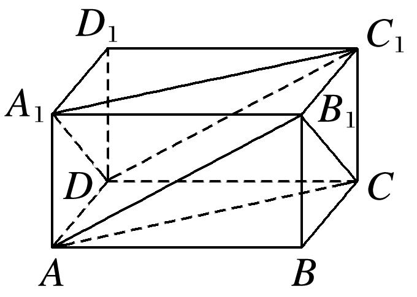

8．答案　平行　解析　易证<em>A</em>1<em>C</em>1，<em>A</em>1<em>D</em>都与平面<em>AB</em>1<em>C</em>平行，且<em>A</em>1<em>D</em>∩<em>A</em>1<em>C</em>1＝<em>A</em>1，所以平面<em>AB</em>1<em>C</em>∥平面

<em>A</em>1<em>DC</em>1．

9．如图，*L*，*M*，*N*分别为正方体对应棱的中点，则平面*LMN*与平面*PQR*的位置关系是(　　)

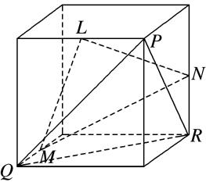

A．垂直　　　　　　B．相交不垂直　　　　　C．平行　　　　　D．重合

9．答案　C　解析　如图，分别取另三条棱的中点*A*，*B*，*C*，将平面*LMN*延展为平面正六边形*AMBNCL*，

因为*PQ*∥*AL*，*PR*∥*AM*，且*PQ*与*PR*相交，*AL*与*AM*相交，所以平面*PQR*∥平面*AMBNCL*，即平面*LMN*∥平面*PQR*．

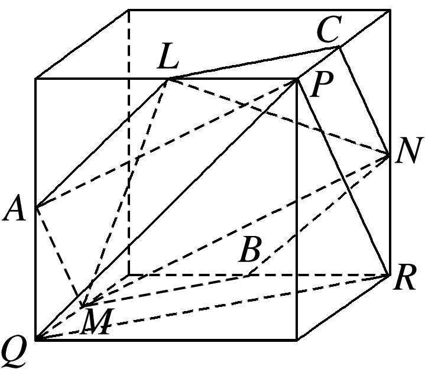

10．若*P*为矩形*ABCD*所在平面外一点，矩形对角线的交点为*O*，*M*为*PB*的中点，给出以下四个命题：

①*OM*∥平面*PCD*；②*OM*∥平面*PBC*；③*OM*∥平面*PDA*；④*OM*∥平面*PBA*．其中正确的个数是\_\_\_\_\_\_\_\_．

10．答案　①③　解析　由已知可得*OM*∥*PD*，∴*OM*∥平面*PCD*且*OM*∥平面*PAD*．故正确的只有①③．

11．如图所示，在正四棱柱<em>ABCD</em>—<em>A</em>1<em>B</em>1<em>C</em>1<em>D</em>1中，<em>E</em>，<em>F</em>，<em>G</em>，<em>H</em>分别是棱<em>CC</em>1，<em>C</em>1<em>D</em>1，<em>D</em>1<em>D</em>，<em>DC</em>的中点，

<em>N</em>是<em>BC</em>的中点，点<em>M</em>在四边形<em>EFGH</em>及其内部运动，则<em>M</em>只需满足条件\_\_\_\_\_\_时，就有<em>MN</em>∥平面<em>B</em>1<em>BDD</em>1．(注：请填上你认为正确的一个条件即可，不必考虑全部可能情况)

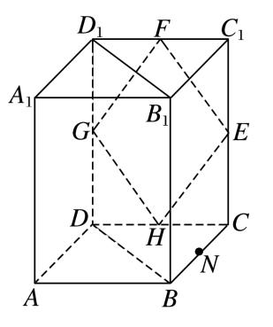

11．答案　点<em>M</em>在线段<em>FH</em>上(或点<em>M</em>与点<em>H</em>重合)　解析　连接<em>HN</em>，<em>FH</em>，<em>FN</em>，则<em>FH</em>∥<em>DD</em>1，<em>HN</em>∥<em>BD</em>，

∴平面<em>FHN</em>∥平面<em>B</em>1<em>BDD</em>1，只需<em>M</em>∈<em>FH</em>，则<em>MN</em>⊂平面<em>FHN</em>，∴<em>MN</em>∥平面<em>B</em>1<em>BDD</em>1．

12．若点*A*，*B*，*C*，*M*，*N*为正方体的顶点或所在棱的中点，则下列各图中，不满足直线*MN*∥平面*ABC*

的是(　　)

12．答案　D　解析　对于A，因为*A*，*C*，*M*，*N*分别为所在棱的中点，由正方体的性质知*MN*∥*AC*，又

*MN*⊄平面*ABC*，*AC*⊂平面*ABC*，所以*MN*∥平面*ABC*．对于B，取*AC*的中点*E*，连接*BE*，由条件及正方体的性质知*MN*∥*BE*．因为*MN*⊄平面*ABC*，*BE*⊂平面*ABC*，所以*MN*∥平面*ABC*．对于C，取*AC*的中点*E*，连接*BE*，由条件及正方体的性质知*MN*∥*BE*，因为*MN*⊄平面*ABC*，*BE*⊂平面*ABC*，所以*MN*∥平面*ABC*．对于D，连接*AM*，*BN*，由条件及正方体的性质知四边形*AMNB*是等腰梯形，所以*AB*与*MN*所在的直线相交，故不能推出*MN*∥平面*ABC*．故选D．

13．(2017·全国Ⅲ)在正方体<em>ABCDA</em>1<em>B</em>1<em>C</em>1<em>D</em>1中，<em>E</em>为棱<em>CD</em>的中点，则(　　)

A．<em>A</em>1<em>E</em>⊥<em>DC</em>1　　　　B．<em>A</em>1<em>E</em>⊥<em>BD</em>　　　　C．<em>A</em>1<em>E</em>⊥<em>BC</em>1　　　　D．<em>A</em>1<em>E</em>⊥<em>AC</em>

13．答案　C　解析　如图，∵<em>A</em>1<em>E</em>在平面<em>ABCD</em>上的射影为<em>AE</em>，而<em>AE</em>不与<em>AC</em>，<em>BD</em>垂直，

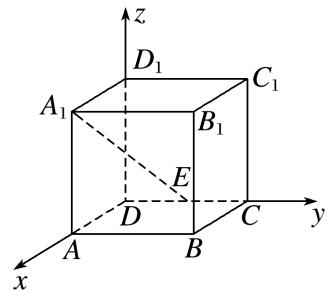

∴B，D错；∵<em>A</em>1<em>E</em>在平面<em>BCC</em>1<em>B</em>1上的射影为<em>B</em>1<em>C</em>，且<em>B</em>1<em>C</em>⊥<em>BC</em>1，∴<em>A</em>1<em>E</em>⊥<em>BC</em>1，故C正确；(证明：由条件易知，<em>BC</em>1⊥<em>B</em>1<em>C</em>，<em>BC</em>1⊥<em>CE</em>，又<em>CE</em>∩<em>B</em>1<em>C</em>＝<em>C</em>，∴<em>BC</em>1⊥平面<em>CEA</em>1<em>B</em>1．又<em>A</em>1<em>E</em>⊂平面<em>CEA</em>1<em>B</em>1，∴<em>A</em>1<em>E</em>⊥<em>BC</em>1)，∵<em>A</em>1<em>E</em>在平面<em>DCC</em>1<em>D</em>1上的射影为<em>D</em>1<em>E</em>，而<em>D</em>1<em>E</em>不与<em>DC</em>1垂直，故A错．

14．在下列四个正方体中，能得出异面直线*AB*⊥*CD*的是(　　)

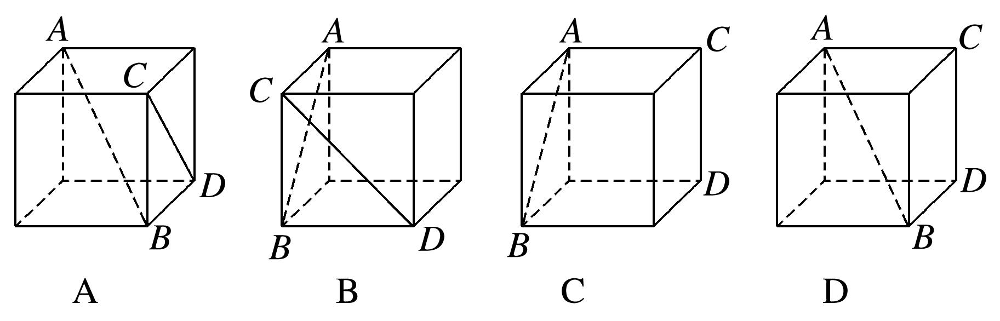

14．答案　A　解析　对于A，作出过*AB*的平面*ABE*，如图①，可得直线*CD*与平面*ABE*垂直，根据线

面垂直的性质知，*AB*⊥*CD*成立，故A正确；对于B，作出过*AB*的等边三角形*ABE*，如图②，将*CD*平移至*AE*，可得*CD*与*AB*所成的角等于60°，故B不成立；对于C，D，将*CD*平移至经过点*B*的侧棱处，可得*AB*，*CD*所成的角都是锐角，故C和D均不成立．故选A．

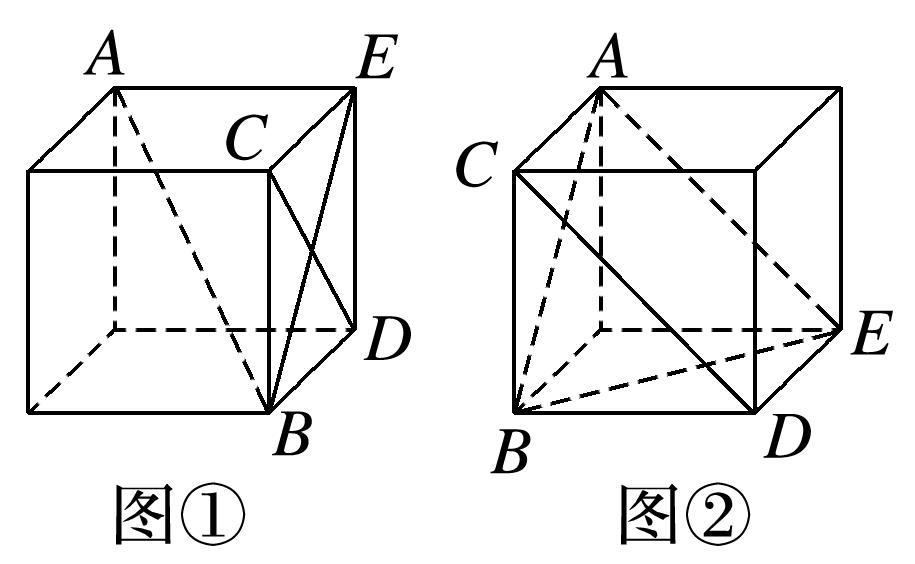

15．如图，在三棱锥*P－ABC*中，不能证明*AP*⊥*BC*的条件是(　　)

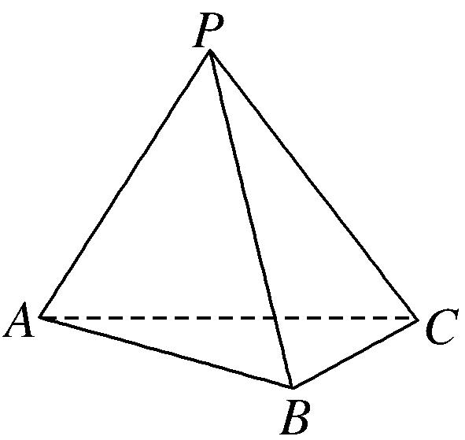

A．*AP*⊥*PB*，*AP*⊥*PC*　　　　　　　　　　B．*AP*⊥*PB*，*BC*⊥*PB*

C．平面*BPC*⊥平面*APC*，*BC*⊥*PC*　　　　D．*AP*⊥平面*PBC*

15．答案　B　解析　A中，因为*AP*⊥*PB*，*AP*⊥*PC*，*PB*∩*PC*＝*P*，所以*AP*⊥平面*PBC*．又*BC*⊂平面*PBC*，

所以*AP*⊥*BC*，故A正确；C中，因为平面*BPC*⊥平面*APC*，平面*BPC*∩平面*APC*＝*PC*，*BC*⊥*PC*，所以*BC*⊥平面*APC*．又*AP*⊂平面*APC*，所以*AP*⊥*BC*，故C正确；D中，由A知D正确；B中条件不能判断出*AP*⊥*BC*，故选B．

16．(多选)如图，在以下四个正方体中，直线*AB*与平面*CDE*垂直的是(　　)

16．答案　BD　解析　在A中，*AB*与*CE*的夹角为45°，所以直线*AB*与平面*CDE*不垂直，故不符合题

意；在B中，*AB*⊥*CE*，*AB*⊥*DE*，*CE*∩*DE*＝*E*，所以*AB*⊥平面*CDE*，故符合题意；在C中，*AB*与*EC*的夹角为60°，所以直线*AB*与平面*CDE*不垂直，故不符合题意；在D中，*AB*⊥*DE*，*AB*⊥*CE*，*DE*∩*CE*＝*E*，所以*AB*⊥平面*CDE*，故符合题意．故选BD．

17．如图所示，*AB*是半圆*O*的直径，*VA*垂直于半圆*O*所在的平面，点*C*是圆周上不同于*A*，*B*的任意一

点，*M*，*N*分别为*VA*，*VC*的中点，则下列结论正确的是(　　)

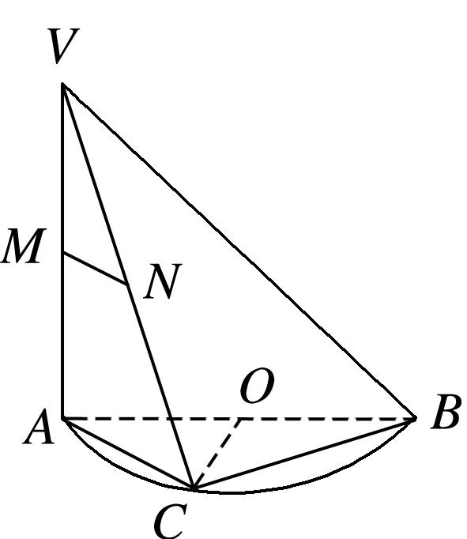

A．*MN*∥*AB*　　B．平面*VAC*⊥平面*VBC*　　C．*MN*与*BC*所成的角为45°　　D．*OC*⊥平面*VAC*

17．答案　B　解析　由题意得*BC*⊥*AC*，因为*VA*⊥平面*ABC*，*BC*⊂平面*ABC*，所以*VA*⊥*BC*．因为*AC*∩

*VA*＝*A*，所以*BC*⊥平面*VAC*．因为*BC*⊂平面*VBC*，所以平面*VAC*⊥平面*VBC*．故选B．

18．(多选)在正方体<em>ABCD</em>－<em>A</em>1<em>B</em>1<em>C</em>1<em>D</em>1中，<em>N</em>为底面<em>ABCD</em>的中心，<em>P</em>为线段<em>A</em>1<em>D</em>1上的动点(不包括两个端

点)，*M*为线段*AP*的中点，则(　　)

A．*CM*与*PN*是异面直线　　　　　　　　B．*CM*>*PN*

C．平面<em>PAN</em>⊥平面<em>BDD</em>1<em>B</em>1　　　　　　　D．过<em>P</em>，<em>A</em>，<em>C</em>三点的正方体的截面一定是等腰梯形

18．答案　BCD　解析　由*C*，*N*，*A*三点共线，得*CN*，*PM*交于点*A*，因此*CM*，*PN*共面，A错误；记

∠<em>PAC</em>＝<em>θ</em>，则<em>PN</em>2＝<em>AP</em>2＋<em>AN</em>2－2<em>AP</em>·<em>AN</em> cos <em>θ</em>＝<em>AP</em>2＋<em>AC</em>2－<em>AP</em>·<em>AC</em> cos <em>θ</em>，<em>CM</em>2＝<em>AC</em>2＋<em>AM</em>2－2<em>AC</em>·<em>AM</em> cos <em>θ</em>＝<em>AC</em>2＋<em>AP</em>2－<em>AP</em>·<em>AC</em> cos <em>θ</em>，又<em>AP</em>&lt;<em>AC</em>，<em>CM</em>2－<em>PN</em>2＝(<em>AC</em>2－<em>AP</em>2)&gt;0，所以<em>CM</em>2&gt;<em>PN</em>2，即<em>CM</em>&gt;<em>PN</em>，B正确；在正方体<em>ABCD</em>－<em>A</em>1<em>B</em>1<em>C</em>1<em>D</em>1中，<em>AN</em>⊥<em>BD</em>，<em>BB</em>1⊥平面<em>ABCD</em>，则<em>BB</em>1⊥<em>AN</em>，<em>BB</em>1∩<em>BD</em>＝<em>B</em>，可得<em>AN</em>⊥平面<em>BDD</em>1<em>B</em>1，<em>AN</em>⊂平面<em>PAN</em>，从而可得平面<em>PAN</em>⊥平面<em>BDD</em>1<em>B</em>1，C正确；在<em>C</em>1<em>D</em>1上取一点<em>K</em>，使得<em>D</em>1<em>K</em>＝<em>D</em>1<em>P</em>，连接<em>KP</em>，<em>KC</em>，<em>A</em>1<em>C</em>1，易知<em>PK</em>∥<em>A</em>1<em>C</em>1，又在正方体<em>ABCD</em>－<em>A</em>1<em>B</em>1<em>C</em>1<em>D</em>1中，<em>A</em>1<em>C</em>1∥<em>AC</em>，所以<em>PK</em>∥<em>AC</em>，所以<em>PK</em>，<em>AC</em>共面，<em>PKCA</em>就是过<em>P</em>，<em>A</em>，<em>C</em>三点的正方体的截面，它是等腰梯形，D正确．故选BCD．

19．如图，在正四面体*P*—*ABC*中，*D*，*E*，*F*分别是*AB*，*BC*，*CA*的中点，下面四个结论不成立的是(　　)

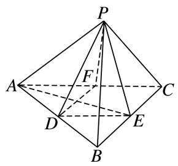

A．*BC*∥平面*PDF*　　B．*DF*⊥平面*PAE*　　C．平面*PDF*⊥平面*PAE*　　D．平面*PDE*⊥平面*ABC*

19．答案　D　解析　因为*BC*∥*DF*，*DF*⊂平面*PDF*，*BC*⊄平面*PDF*，所以*BC*∥平面*PDF*，故选项A正

确；在正四面体中，*AE*⊥*BC*，*PE*⊥*BC*，*AE*∩*PE*＝*E*，且*AE*，*PE*⊂平面*PAE*，所以*BC*⊥平面*PAE*，因为*DF*∥*BC*，所以*DF*⊥平面*PAE*，又*DF*⊂平面*PDF*，从而平面*PDF*⊥平面*PAE*．因此选项B，C均正确．

20．如图所示，在四棱锥*P*－*ABCD*中，*PA*⊥底面*ABCD*，且底面各边都相等，*M*是*PC*上的一动点，当

点*M*满足\_\_\_\_\_\_\_\_时，平面*MBD*⊥平面*PCD*．(只要填写一个你认为正确的条件即可)

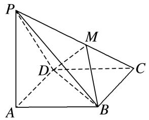

20．答案　*DM*⊥*PC*(或*BM*⊥*PC*等)　解析　∵*PA*⊥底面*ABCD*，∴*BD*⊥*PA*，连接*AC*，则*BD*⊥*AC*，且

*PA*∩*AC*＝*A*，∴*BD*⊥平面*PAC*，∴*BD*⊥*PC*．∴当*DM*⊥*PC*(或*BM*⊥*PC*)时，即有*PC*⊥平面*MBD*，而*PC*⊂平面*PCD*，∴平面*MBD*⊥平面*PCD*．

21．正方体<em>ABCD</em>－<em>A</em>1<em>B</em>1<em>C</em>1<em>D</em>1的棱和六个面的对角线共有24条，其中与体对角线<em>AC</em>1垂直的有\_\_\_\_\_\_\_\_

条．

21．答案　6　解析　如图所示，在正方体<em>ABCD</em>－<em>A</em>1<em>B</em>1<em>C</em>1<em>D</em>1中，<em>BD</em>⊥<em>AC</em>．∵<em>C</em>1<em>C</em>⊥平面<em>BCD</em>，<em>BD</em>⊂平面

*BCD*，

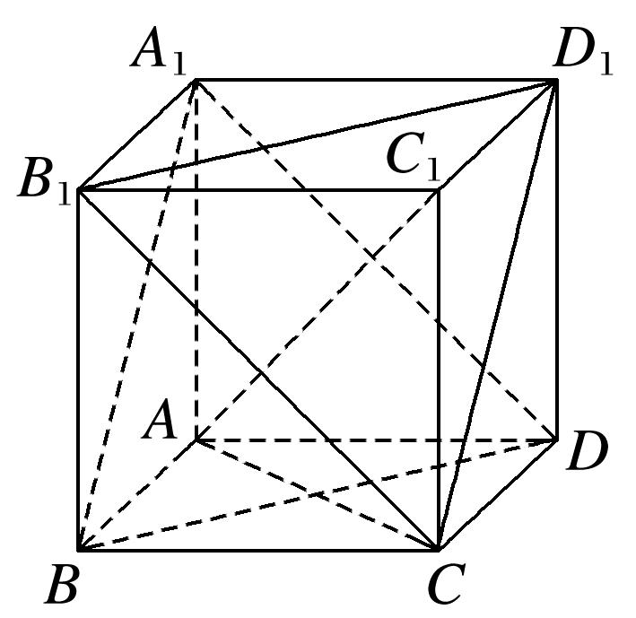

∴<em>C</em>1<em>C</em>⊥<em>BD</em>，又<em>AC</em>∩<em>CC</em>1＝<em>C</em>，∴<em>BD</em>⊥平面<em>ACC</em>1，又∵<em>AC</em>1⊂平面<em>ACC</em>1，∴<em>AC</em>1⊥<em>BD</em>．同理<em>A</em>1<em>B</em>，<em>A</em>1<em>D</em>，<em>B</em>1<em>D</em>1，<em>CD</em>1，<em>B</em>1<em>C</em>都与<em>AC</em>1垂直．正方体<em>ABCD</em>－<em>A</em>1<em>B</em>1<em>C</em>1<em>D</em>1的棱中没有与<em>AC</em>1垂直的棱，故与体对角线<em>AC</em>1垂直的有6条．

22．如图，已知六棱锥*P*－*ABCDEF*的底面是正六边形，*PA*⊥平面*ABC*，*PA*＝2*AB*，

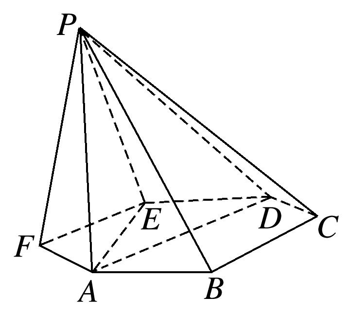

则下列结论中：①*PB*⊥*AE*；②平面*ABC*⊥平面*PBC*；③直线*BC*∥平面*PAE*；④∠*PDA*＝45°．

正确的为\_\_\_\_\_\_\_\_(把所有正确的序号都填上)．

22．答案　①④　解析　由*PA*⊥平面*ABC*，*AE*⊂平面*ABC*，得*PA*⊥*AE*，又由正六边形的性质得*AE*⊥*AB*，

*PA*∩*AB*＝*A*，得*AE*⊥平面*PAB*，∵*PB*⊂平面*PAB*，∴*PB*⊥*AE*，∴①正确；由正六边形的性质计算可得*PA*＝*AD*，故△*PAD*是等腰直角三角形，∴∠*PDA*＝45°，∴④正确．

23．(多选)正方体<em>ABCD</em>－<em>A</em>1<em>B</em>1<em>C</em>1<em>D</em>1的棱长为1，<em>E</em>，<em>F</em>，<em>G</em>分别为<em>BC</em>，<em>CC</em>1，<em>BB</em>1的中点，则(　　)

A．直线<em>D</em>1<em>D</em>与直线<em>AF</em>垂直　　　　　　　　　B．直线<em>A</em>1<em>G</em>与平面<em>AEF</em>平行

C．平面*AEF*截正方体所得的截面面积为　　　D．点*C*与点*G*到平面*AEF*的距离相等

23．答案　BC　解析　∵<em>CC</em>1与<em>AF</em>不垂直，而<em>DD</em>1∥<em>CC</em>1，∴<em>AF</em>与<em>DD</em>1不垂直，故A错误；取<em>B</em>1<em>C</em>1的

中点<em>N</em>，连接<em>A</em>1<em>N</em>，<em>GN</em>，可得平面<em>A</em>1<em>GN</em>∥平面<em>AEF</em>，则直线<em>A</em>1<em>G</em>∥平面<em>AEF</em>，故B正确；把截面<em>AEF</em>补形为四边形<em>AEFD</em>1，由四边形<em>AEFD</em>1为等腰梯形可得平面<em>AEF</em>截正方体所得的截面面积<em>S</em>＝，故C正确；假设点<em>C</em>与点<em>G</em>到平面<em>AEF</em>的距离相等，即平面<em>AEF</em>将<em>CG</em>平分，则平面<em>AEF</em>必过<em>CG</em>的中点，连接<em>CG</em>交<em>EF</em>于点<em>H</em>，而<em>H</em>不是<em>CG</em>中点，则假设不成立，故D错误．故选BC．

24．(多选)如图，四棱锥*P*－*ABCD*中，平面*PAD*⊥底面*ABCD*，△*PAD*是等边三角形，底面*ABCD*是菱形，

且∠*BAD*＝60°，*M*为棱*PD*的中点，*N*为菱形*ABCD*的中心，下列结论正确的有(　　)

A．直线*PB*与平面*AMC*平行　　　　　　　B．直线*PB*与直线*AD*垂直

C．线段*AM*与线段*CM*长度相等　　　　　D．*PB*与*AM*所成角的余弦值为

24．答案　ABD　解析　如图，连接*MN*，易知*MN*∥*PB*，又*MN*⊂平面*AMC*，∴*PB*∥平面*AMC*，A正确；

在菱形*ABCD*中，∠*BAD*＝60°，∴△*BAD*为等边三角形．设*AD*的中点为*O*，连接*OB*，*OP*，则*OP*⊥*AD*，*OB*⊥*AD*，∴*AD*⊥平面*POB*，又*PB*⊂平面*POB*，∴*AD*⊥*PB*，B正确；由平面*PAD*⊥平面*ABCD*，得△*POB*为直角三角形，设*AD*＝4，则*OP*＝*OB*＝2，∴*PB*＝2，*MN*＝*PB*＝．在△*MAN*中，*AM*＝*AN*＝2，*MN*＝，可得cos∠*AMN*＝，故异面直线*PB*与*AM*所成角的余弦值为，D正确；∵cos∠*MNC*＝－cos∠*MNA*＝－cos∠*AMN*＝－，又*NC*＝2，*MN*＝，∴－＝，得*CM*＝2>*AM*，C错误．故选ABD．

