# 专题 04 立体几何中空间线、面位置关系的判定（3）

# 【方法总结】

# 平面图形折叠问题的求解方法  
（1）解决与折叠有关的问题的关键是搞清折叠前后的变化量和不变量，一般情况下，翻折前后位于同一个半平面内的直线间的位置关系、数量关系不变，翻折前后分别位于两个半平面内(非交线)的直线位置关系、数量关系一般发生变化，解翻折问题的关键是辨析清楚“不变的位置关系和数量关系”“变的位置关系和数量关系”.  
（2）在解决问题时，要综合考虑折叠前后的图形，既要分析折叠后的图形，也要分析折叠前的图形.

# 【例题选讲】

[例 1]（1）如图是一个正方体的平面展开图．在这个正方体中，①BM 与 ED 是异面直线；②CN 与 BE 平行；③CN 与 BM 成 $60^{\circ}$ 角；④DM 与 BN 垂直.

以上四个命题中，正确命题的序号是\_\_\_\_。

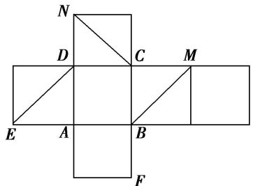

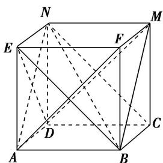  
（2）已知四边形 $ABCD$ 是矩形， $AB = 4$ ， $AD = 3$ 。沿 $AC$ 将 $\triangle ADC$ 折起到 $\triangle AD'C$ ，使平面 $AD'C \perp$ 平面 $ABC$ ， $F$ 是 $AD'$ 的中点， $E$ 是 $AC$ 上一点，给出下列结论：

①存在点 E，使得 $EF \parallel$ 平面 $BCD'$ ; ②存在点 E，使得 $EF \perp$ 平面 ABC;  
③存在点 E，使得 $D'E \perp$ 平面 ABC；④存在点 E，使得 $AC \perp$ 平面 $BD'E$ .
其中正确的结论是\_\_\_\_(写出所有正确结论的序号).  
（3）如图, 在正方形 $ABCD$ 中, $E$ , $F$ 分别是 $BC$ , $CD$ 的中点, 沿 $AE$ , $AF$ , $EF$ 把正方形折成一个四面体, 使 $B$ , $C$ , $D$ 三点重合, 重合后的点记为 $P$ , $P$ 点在 $\triangle AEF$ 内的射影为 $O$ , 则下列说法正确的是 ( )

A. $O$ 是 $\triangle AEF$ 的垂心

B. $O$ 是 $\triangle AEF$ 的内心

C. O 是 $\triangle AEF$ 的外心

D. $O$ 是 $\triangle AEF$ 的重心

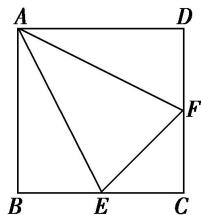

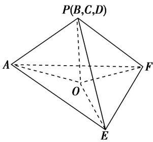  
（4）(多选)如图, 在直角梯形 $ABCD$ 中, $AB \parallel CD$ , $AB \perp BC$ , $BC = CD = \frac{1}{2} AB = 2$ , $E$ 为 $AB$ 的中点, 以 $DE$ 为折痕把 $\triangle ADE$ 折起, 使点 $A$ 到达点 $P$ 的位置, 且 $PC = 2\sqrt{3}$ . 则 ( )

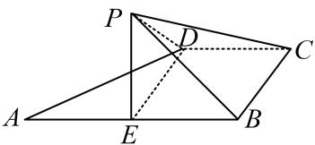

A. 平面 $PED \perp$ 平面 $EBCD$

B. $PC \perp ED$

C. 二面角 $P - DC - B$ 的大小为 $45^{\circ}$

D. $PC$ 与平面 $PED$ 所成角的正切值为 $\sqrt{2}$  
（5）如图, 在矩形 $ABCD$ 中, $AB = 2AD$ , $E$ 为边 $AB$ 的中点, 将 $\triangle ADE$ 沿直线 $DE$ 翻折成 $\triangle A_{1}DE$ . 若 $M$ 为线段 $A_{1}C$ 的中点, 则在 $\triangle ADE$ 翻折过程中, 下列四个命题中不正确的是 \_\_\_\_. (填序号)

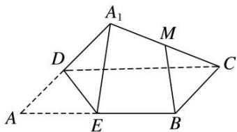

①BM 是定值;

②点 M 在某个球面上运动;

③存在某个位置，使 $DE \perp A_{1}C;$

④存在某个位置，使 $MB \parallel$ 平面 $A_{1}DE$ .

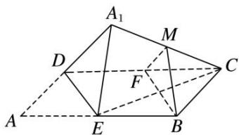  
（6）等腰直角三角形 $ABE$ 的斜边 $AB$ 为正四面体 $ABCD$ 的侧棱, 直角边 $AE$ 绕斜边 $AB$ 旋转, 则在旋转的过程中, 有下列说法:

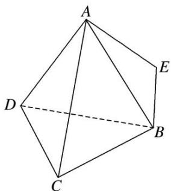

①四面体 E-BCD 的体积有最大值和最小值；
②存在某个位置，使得 $AE \perp BD;$   
③设二面角 D-AB-E 的平面角为 $\theta$ ，则 $\theta \geq \angle DAE$ ;  
④AE 的中点 M 与 AB 的中点 N 连线交平面 BCD 于点 P，则点 P 的轨迹为椭圆.
其中，正确说法的个数是( )

A. 1

B. 2

C. 3

D. 4  
（7）在正方体 $ABCD-A_{1}B_{1}C_{1}D_{1}$ 中，E 是棱 $CC_{1}$ 的中点，F 是侧面 $BCC_{1}B_{1}$ 内的动点，且 $A_{1}F$ 与平面 $D_{1}AE$ 的垂线垂直，如图所示，下列说法不正确的是()

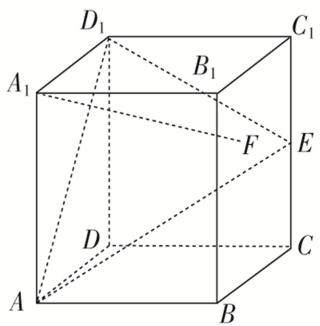

A. 点 $F$ 的轨迹是一条线段

B. $A_{1}F$ 与 $BE$ 是异面直线

C. $A_{1}F$ 与 $D_{1}E$ 不可能平行

D. 三棱锥 $F - ABC_{1}$ 的体积为定值  
（8）在正方体 $ABCD-A_{1}B_{1}C_{1}D_{1}$ 中，已知点 P 在直线 $BC_{1}$ 上运动，则下列四个命题：

①三棱锥 $A-D_{1}PC$ 的体积不变;  
②直线 AP 与平面 $ACD_{1}$ 所成的角的大小不变;  
③二面角 $P-AD_{1}-C$ 的大小不变;  
④若 M 是平面 $A_{1}B_{1}C_{1}D_{1}$ 上到点 D 和 $C_{1}$ 距离相等的点，则 M 点的轨迹是直线 $A_{1}D_{1}$ .
其中真命题的序号是\_\_\_\_。

# 【对点精练】

1. 将正方体的纸盒展开如图, 直线 $A B$ , $C D$ 在原正方体的位置关系是( )

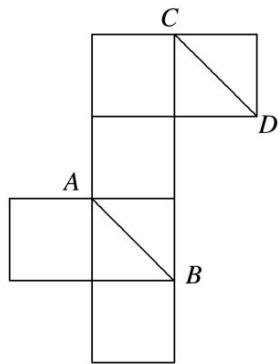

A. 平行

B. 垂直

C. 相交成 $60^{\circ}$ 角

D. 异面且成 $60^{\circ}$ 角

2. 如图是正四面体(各面均为正三角形)的平面展开图, $G$ , $H$ , $M$ , $N$ 分别为 $DE$ , $BE$ , $EF$ , $EC$ 的中点, 在这个正四面体中:

①GH 与 EF 平行；②BD 与 MN 为异面直线；③GH 与 MN 成 $60^{\circ}$ 角；④DE 与 MN 垂直.

以上四个命题中，正确命题的序号是\_\_\_\_。

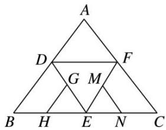

3. 如图是一几何体的平面展开图, 其中四边形 $ABCD$ 为正方形, $E$ , $F$ 分别为 $PA$ , $PD$ 的中点, 在此几何体中, 给出下面 4 个结论:

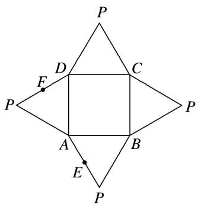

①直线 BE 与直线 CF 异面；②直线 BE 与直线 AF 异面；③直线 EF // 平面 PBC；④平面 BCE ⊥ 平面 PAD．其中正确的有( )

A. 1 个

B. 2 个

C. 3 个

D. 4 个

4. 如图，四边形 $ABCD$ 中， $AB = AD = CD = 1$ ， $BD = \sqrt{2}$ ， $BD \perp CD$ 。将四边形 $ABCD$ 沿对角线 $BD$ 拆成四面体 $A' - BCD$ ，使平面 $A'BD \perp$ 平面 $BCD$ ，则下列结论正确的是（）

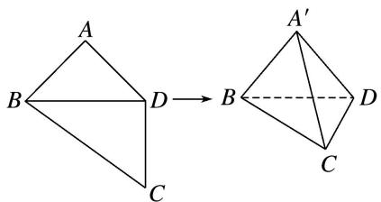

A. $A'C \perp BD$

B. $\angle BA'C = 90^{\circ}$

C. $CA'$ 与平面 $A'BD$ 所成的角为 $30^{\circ}$

D. 四面体 $A' - BCD$ 的体积为 $\frac{1}{3}$

5. 如图，在正方形 $ABCD$ 中， $E, F$ 分别是 $BC, CD$ 的中点， $G$ 是 $EF$ 的中点，现在沿 $AE, AF$ 及 $EF$ 把这个正方形折成一个空间图形，使 $B, C, D$ 三点重合，重合后的点记为 $H$ ，那么，在这个空间图形中必有（）

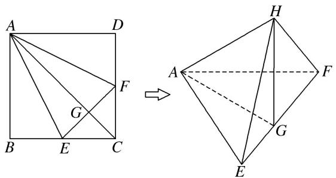

A. $AG \perp$ 平面 EFH

B. $AH \perp$ 平面 $EFH$

C. $HF \perp$ 平面 $AEF$

D. $HG \perp$ 平面 $AEF$

6. (多选)如图, 以等腰直角三角形 $ABC$ 的斜边 $BC$ 上的高 $AD$ 为折痕, 翻折 $\triangle ABD$ 和 $\triangle ACD$ , 使得平面 $ABD \perp$ 平面 $ACD$ . 下列结论正确的是( )

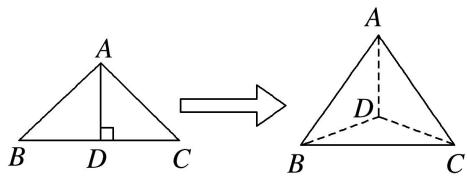

A. $BD \perp AC$

B. $\triangle BAC$ 是等边三角形

C. 三棱锥 $D - ABC$ 是正三棱锥

D. 平面 $ADC \perp$ 平面 $ABC$

7. 如图所示, 正方形 $BCDE$ 的边长为 $a$ , 已知 $AB = \sqrt{3} BC$ , 将 $\triangle ABE$ 沿边 $BE$ 折起, 折起后 $A$ 点在平面 $BCDE$ 上的射影为 $D$ 点, 关于翻折后的几何体有如下描述:

①AB 与 DE 所成的角的正切值是 $\sqrt{2}$ ; ②AB // CE; ③ $V_{B-ACE}=\frac{a^{3}}{6}$ ; ④ 平面 ABC ⊥ 平面 ADC.
其中正确的有\_\_\_\_．(填写你认为正确的序号)

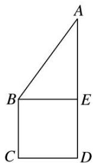

8. 如图, 在直角梯形 $ABCD$ 中, $BC \perp DC$ , $AE \perp DC$ , 且 $E$ 为 $CD$ 的中点, $M$ , $N$ 分别是 $AD$ , $BE$ 的中点, 将 $\triangle ADE$ 沿 $AE$ 折起, 则下列说法正确的是 \_\_\_\_. (写出所有正确说法的序号)

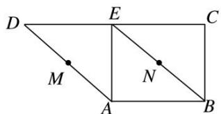

①不论 D 折至何位置(不在平面 ABC 内)，都有 $MN \parallel$ 平面 DEC;

②不论 D 折至何位置(不在平面 ABC 内)，都有 $MN \perp AE$ ;

③不论 D 折至何位置(不在平面 ABC 内)，都有 $MN \parallel AB$ ;

④在折起过程中，一定存在某个位置，使 $EC \perp AD$ .

9. 在矩形 $ABCD$ 中, $AB = \sqrt{3}$ , $BC = 1$ , 将 $\triangle ABC$ 与 $\triangle ADC$ 沿 $AC$ 所在的直线进行随意翻折, 在翻折过程中直线 $AD$ 与直线 $BC$ 所成的角的范围(包含初始状态)为( )

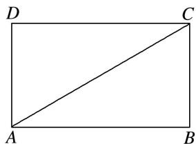

A. $\left[0, \frac{\pi}{6}\right]$

B. $\begin{bmatrix}0,\frac{\pi}{3}\end{bmatrix}$

C. $\begin{bmatrix}0,\frac{\pi}{2}\end{bmatrix}$

D. $\left[0,\frac{2\pi}{3}\right]$

10. 如图所示，在直角梯形 $BCEF$ 中， $\angle CBF = \angle BCE = 90^\circ$ ， $A, D$ 分别是 $BF$ ， $CE$ 上的点， $AD // BC$ ，且 $AB = DE = 2BC = 2AF$ （如图1）。将四边形 $ADEF$ 沿 $AD$ 折起，连接 $AC, CF, BE, BF, CE$ （如图2），在折起的过程中，下列说法错误的是（）
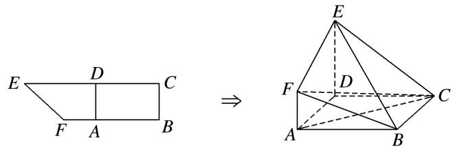

图1

A. $AC \parallel$ 平面 BEF

B. $B, C, E, F$ 四点不可能共面

C. 若 $EF \perp CF$ , 则平面 $ADEF \perp$ 平面 $ABCD$

D. 平面 $BCE$ 与平面 $BEF$ 可能垂直

11. 在等腰直角 $\triangle ABC$ 中， $AB \perp AC$ ， $BC = 2$ ， $M$ 为 $BC$ 的中点， $N$ 为 $AC$ 的中点， $D$ 为 $BC$ 边上一个动点， $\triangle ABD$ 沿 $AD$ 翻折使 $BD \perp DC$ ，点 $A$ 在平面 $BCD$ 上的投影为点 $O$ ，当点 $D$ 在 $BC$ 上运动时，以下说法错误的是（）

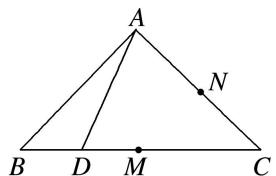

A. 线段 $NO$ 为定长

B. $CO \in [1, \sqrt{2})$

C. $\angle AMO + \angle ADB > 180^{\circ}$

D. 点 $O$ 的轨迹是圆弧

12. 如图, 在直三棱柱 $ABC - A_{1}B_{1}C_{1}$ 中, $AA_{1} = 2$ , $AB = BC = 1$ , $\angle ABC = 90^{\circ}$ , 外接球的球心为 $O$ , 点 $E$ 是侧棱 $BB_{1}$ 上的一个动点. 有下列判断:

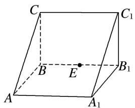

①直线 AC 与直线 $C_{1}E$ 是异面直线；② $A_{1}E$ 一定不垂直于 $AC_{1}$ ；③三棱锥 E— $AA_{1}O$ 的体积为定值；④ $AE + EC_{1}$ 的最小值为 $2\sqrt{2}$ .
其中正确的个数是( )

A. 1

B. 2

C. 3

D. 4

13. 如图，已知棱长为 1 的正方体 $ABCD - A_1B_1C_1D_1$ 中， $E, F, M$ 分别是线段 $AB, AD, AA_1$ 的中点，又 $P, Q$ 分别在线段 $A_1B_1, A_1D_1$ 上，且 $A_1P = A_1Q = x (0 < x < 1)$ .

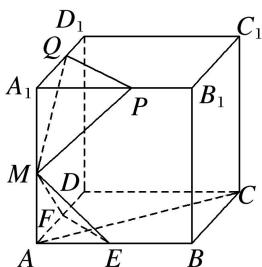
设平面 $MEF \cap$ 平面 MPQ = l，现有下列结论：① $l \parallel$ 平面 ABCD；② $l \perp AC$ ；③ 直线 l 与平面 $BCC_{1}B_{1}$ 不垂直；④ 当 x 变化时，l 不是定直线.
其中成立的结论是\_\_\_\_。（写出所有成立结论的序号）

14. (多选)在棱长为 1 的正方体 $ABCD - A_{1}B_{1}C_{1}D_{1}$ 中，点 $M$ 在棱 $CC_{1}$ 上，则下列结论正确的是( )

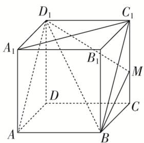

A. 直线 $BM$ 与平面 $ADD_{1}A_{1}$ 平行

B. 平面 $BMD_{1}$ 截正方体所得的截面为三角形

C. 异面直线 $AD_{1}$ 与 $A_{1}C_{1}$ 所成的角为 $\frac{\pi}{3}$

D. $MB + MD_{1}$ 的最小值为 $\sqrt{5}$

15. (多选)如图, 点 $P$ 在正方体 $ABCD - A_{1}B_{1}C_{1}D_{1}$ 的面对角线 $BC_{1}$ 上运动, 则下列四个结论正确的是( )

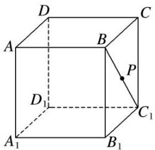

A. 三棱锥 $A - D_{1}PC$ 的体积不变

B. $A_{1}P \parallel$ 平面 $ACD_{1}$

C. $DP \perp BC_{1}$

D. 平面 $PDB_{1} \perp$ 平面 $ACD_{1}$

16. 在长方体 $ABCD - A_{1}B_{1}C_{1}D_{1}$ 中， $AB = AD = 6$ ， $AA_{1} = 2$ ， $M$ 为棱 $BC$ 的中点，动点 $P$ 满足 $\angle APD = \angle CP$ $M$ ，则点 $P$ 的轨迹与长方体的面 $DCC_{1}D_{1}$ 的交线长等于（）

A. $\frac{2\pi}{3}$

B. $\pi$

C. $\frac{4\pi}{3}$

D. $\sqrt{2}\pi$

