# 专题 04 立体几何中空间线、面位置关系的判定(3)

# 【方法总结】

# 平面图形折叠问题的求解方法

(1)解决与折叠有关的问题的关键是搞清折叠前后的变化量和不变量，一般情况下，翻折前后位于同一个半平面内的直线间的位置关系、数量关系不变，翻折前后分别位于两个半平面内(非交线)的直线位置关系、数量关系一般发生变化，解翻折问题的关键是辨析清楚“不变的位置关系和数量关系”“变的位置关系和数量关系”.

(2)在解决问题时，要综合考虑折叠前后的图形，既要分析折叠后的图形，也要分析折叠前的图形.

# 【例题选讲】

[例 1](1)如图是一个正方体的平面展开图．在这个正方体中，①BM 与 ED 是异面直线；②CN 与 BE 平行；③CN 与 BM 成 $60^{\circ}$ 角；④DM 与 BN 垂直.

以上四个命题中，正确命题的序号是\_\_\_\_。

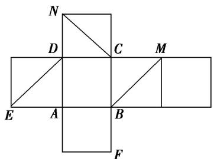

text_image

N
D C M
E A B
F

答案 ①②③④ 解析 由题意画出该正方体的图形如图所示，连接 BE，BN，显然①②正确；对于③，连接 AN，易得 $AN \parallel BM$ ， $\angle ANC = 60^{\circ}$ ，所以 CN 与 BM 成 $60^{\circ}$ 角，所以③正确；对于④，易知 $DM \perp$ 平面 BCN，所以 $DM \perp BN$ 正确.

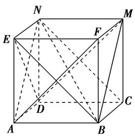

text_image

Geometric diagram of a cube with labeled vertices and internal diagonals, used for spatial geometry problems.

(2)已知四边形ABCD是矩形， $AB = 4$ ， $AD = 3$ ．沿AC将 $\triangle ADC$ 折起到 $\triangle AD'C$ ，使平面 $AD^{\prime}C\bot$ 平面ABC， $F$ 是 $AD^{\prime}$ 的中点， $E$ 是 $AC$ 上一点，给出下列结论：

①存在点 E，使得 $EF \parallel$ 平面 $BCD'$ ；②存在点 E，使得 $EF \perp$ 平面 ABC；  
③存在点 E，使得 $D'E \perp$ 平面 ABC；④存在点 E，使得 $AC \perp$ 平面 $BD'E$ .

其中正确的结论是\_\_\_\_(写出所有正确结论的序号).

答案 ①②③ 解析 对于①，存在 $AC$ 的中点 $E$ ，使得 $EF \parallel CD'$ ，利用线面平行的判定定理可得 $EF \parallel$ 平面 $BCD'$ ；对于②，过点 $F$ 作 $EF \perp AC$ ，垂足为 $E$ ，利用面面垂直的性质定理可得 $EF \perp$ 平面 $ABC$ ；对于③，过点 $D'$ 作 $D'E \perp AC$ ，垂足为 $E$ ，利用面面垂直的性质定理可得 $D'E \perp$ 平面 $ABC$ ；对于④，因为 $ABCD$ 是矩形， $AB = 4, AD = 3$ ，所以 $B, D'$ 在 $AC$ 上的射影不是同一点，所以不存在点 $E$ ，使得 $AC \perp$ 平面 $BD'E$ .

(3)如图，在正方形 ABCD 中，E，F 分别是 BC，CD 的中点，沿 AE，AF，EF 把正方形折成一个四面体，使 B，C，D 三点重合，重合后的点记为 P，P 点在 $\triangle AEF$ 内的射影为 O，则下列说法正确的是()

A. $O$ 是 $\triangle AEF$ 的垂心 B. $O$ 是 $\triangle AEF$ 的内心 C. $O$ 是 $\triangle AEF$ 的外心 D. $O$ 是 $\triangle AEF$ 的重心

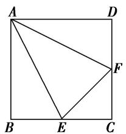

text_image

A
D
F
B
E
C

答案 A 解析 由题意可知 $PA$ 、 $PE$ 、 $PF$ 两两垂直，所以 $PA \perp$ 平面 $PEF$ ，从而 $PA \perp EF$ ，而 $PO \perp$ 平面 $AEF$ ，则 $PO \perp EF$ ，因为 $PO \cap PA = P$ ，所以 $EF \perp$ 平面 $PAO$ ， $\therefore EF \perp AO$ ，同理可知 $AE \perp FO$ ， $AF \perp EO$ ， $\therefore O$ 为 $\triangle AEF$ 的垂心。故选 A.

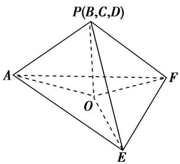

text_image

P(B,C,D)
A
O
F
E

(4)(多选)如图, 在直角梯形 $ABCD$ 中, $AB \parallel CD$ , $AB \perp BC$ , $BC = CD = \frac{1}{2} AB = 2$ , $E$ 为 $AB$ 的中点, 以 $DE$ 为折痕把 $\triangle ADE$ 折起, 使点 $A$ 到达点 $P$ 的位置, 且 $PC = 2\sqrt{3}$ . 则 ( )

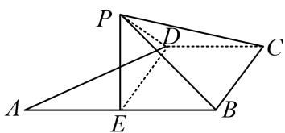

text_image

Geometric diagram with labeled points A, B, C, D, E, P and intersecting lines, likely from a math problem or proof.

A. 平面 $PED \perp$ 平面 $EBCD$

B. $PC \perp ED$

C. 二面角 $P - DC - B$ 的大小为 $45^{\circ}$

D. $PC$ 与平面 $PED$ 所成角的正切值为 $\sqrt{2}$

答案 AC 解析 A 项, $PD = AD = \sqrt{AE^2 + DE^2} = \sqrt{2^2 + 2^2} = 2\sqrt{2}$ , 在三角形 PDC 中, $PD^2 + CD^2 = PC^2$ , 所以 $PD \perp CD$ , 又 $CD \perp DE$ , 可得 $CD \perp$ 平面 PED, $CD \subset$ 平面 EBCD, 所以平面 PED $\perp$ 平面 EBCD, 正确; B 项, 若 $PC \perp ED$ , 又 $ED \perp CD$ , 可得 $ED \perp$ 平面 PDC, 则 $ED \perp PD$ , 而 $\angle EDP = \angle EDA = 45^\circ$ , 显然矛盾, 故错误; C 项, 二面角 $P - DC - B$ 的平面角为 $\angle PDE$ , 又 $\angle PDE = \angle ADE = 45^\circ$ , 故正确; D 项, 由上面分析可知, $\angle CPD$ 为直线 PC 与平面 PED 所成的角, 在 Rt $\triangle PCD$ 中, $\tan \angle CPD = \frac{CD}{PD} = \frac{\sqrt{2}}{2}$ , 故错误. 故选 AC.

(5)如图, 在矩形 $ABCD$ 中, $AB = 2AD$ , $E$ 为边 $AB$ 的中点, 将 $\triangle ADE$ 沿直线 $DE$ 翻折成 $\triangle A_{1}DE$ . 若 $M$ 为线段 $A_{1}C$ 的中点, 则在 $\triangle ADE$ 翻折过程中, 下列四个命题中不正确的是 \_\_\_\_. (填序号)

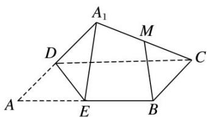

text_image

A₁
M
D
C
A
E
B

①BM 是定值;  
②点 M 在某个球面上运动;

③存在某个位置，使 $DE \perp A_{1}C;$

④存在某个位置，使 $MB \parallel$ 平面 $A_{1}DE$ .

答案 ③ 解析 取 $DC$ 的中点 $F$ , 连接 $MF$ , $BF$ , 则 $MF \parallel A_1D$ 且 $MF = \frac{1}{2} A_1D$ , $FB \parallel ED$ 且 $FB = ED$ , 所以 $\angle MFB = \angle A_1DE$ . 由余弦定理可得 $MB^2 = MF^2 + FB^2 - 2MF \cdot FB \cdot \cos \angle MFB$ 是定值, 所以 $M$ 是在以 $B$ 为球心, $MB$ 为半径的球上, 可得①②正确; 由 $MF \parallel A_1D$ 与 $FB \parallel ED$ 可得平面 $MBF \parallel$ 平面 $A_1DE$ , 可得④正确; 若存在某个位置, 使 $DE \perp A_1C$ , 则因为 $DE^2 + CE^2 = CD^2$ , 即 $CE \perp DE$ , 因为 $A_1C \cap CE = C$ , 则 $DE \perp$ 平面 $A_1CE$ , 所以 $DE \perp A_1E$ , 与 $DA_1 \perp A_1E$ 矛盾, 故③不正确.

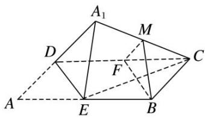

text_image

A₁
M
D
F
C
A
E
B

(6)等腰直角三角形 $ABE$ 的斜边 $AB$ 为正四面体 $ABCD$ 的侧棱, 直角边 $AE$ 绕斜边 $AB$ 旋转, 则在旋转的过程中, 有下列说法:

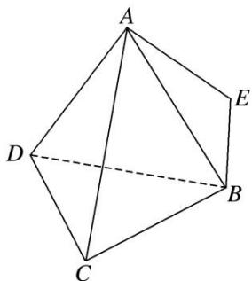

natural_image

Geometric diagram of a polyhedron with labeled vertices A, B, C, D, E (no text or symbols present)

①四面体 E-BCD 的体积有最大值和最小值；

②存在某个位置，使得 $AE \perp BD;$

③设二面角 D-AB-E 的平面角为 $\theta$ ，则 $\theta \geq \angle DAE$ ;

④AE 的中点 M 与 AB 的中点 N 连线交平面 BCD 于点 P，则点 P 的轨迹为椭圆.

其中，正确说法的个数是( )

A. 1

B. 2

C. 3

D. 4

答案 D 解析 根据正四面体的特征，以及等腰直角三角形的特征，可以得到当直角边 $AE$ 绕斜边 $AB$ 旋转的过程中，存在着最高点和最低点，并且最低点在底面的上方，所以四面体 $E - BCD$ 的体积有最大值和最小值，故①正确；要想使 $AE \perp BD$ ，就要使 $AE$ 落在竖直方向的平面内，而转到这个位置的时候，使得 $AE \perp BD$ ，且满足是等腰直角三角形，所以②正确；利用二面角的平面角的定义，找到其平面角，设二面角 $D - AB - E$ 的平面角为 $\theta$ ，则 $\theta \geq \angle DAE$ ，所以③是正确的；根据平面截圆锥所得的截面可以断定， $AE$ 的中点 $M$ 与 $AB$ 的中点 $N$ 连线交平面 $BCD$ 于点 $P$ ，则点 $P$ 的轨迹为椭圆，所以④正确．故正确的命题的个数是4，故选D.

(7)在正方体 $ABCD-A_{1}B_{1}C_{1}D_{1}$ 中，E 是棱 $CC_{1}$ 的中点，F 是侧面 $BCC_{1}B_{1}$ 内的动点，且 $A_{1}F$ 与平面 $D_{1}AE$ 的垂线垂直，如图所示，下列说法不正确的是()

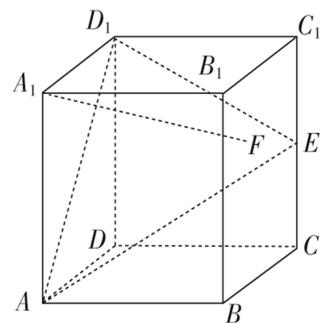

text_image

D₁
A₁
B₁
C₁
F
E
D
A
B
C

A. 点 $F$ 的轨迹是一条线段

B. $A_{1}F$ 与 $BE$ 是异面直线

C. $A_{1}F$ 与 $D_{1}E$ 不可能平行

D. 三棱锥 $F - ABC_{1}$ 的体积为定值

答案 C 解析 由题知 $A_{1}F \parallel$ 平面 $D_{1}AE$ ，分别取 $B_{1}C_{1}$ ， $BB_{1}$ 的中点 $H$ ， $G$ ，连接 $HG$ ， $A_{1}H$ ， $A_{1}G$ ， $BC_{1}$ ，可得 $HG \parallel BC_{1} \parallel AD_{1}$ ， $A_{1}G \parallel D_{1}E$ ，故平面 $A_{1}HG \parallel$ 平面 $AD_{1}E$ ，故点 $F$ 的轨迹为线段 $HG$ ，A 正确；由异面直线的判定定理可知 $A_{1}F$ 与 $BE$ 是异面直线，故 B 正确；当 $F$ 是 $BB_{1}$ 的中点时， $A_{1}F$ 与 $D_{1}E$ 平行，故 C 不正确； $\because HG \parallel$ 平面 $ABC_{1}$ ， $\therefore F$ 点到平面 $ABC_{1}$ 的距离不变，故三棱锥 $F-ABC_{1}$ 的体积为定值，故 D 正确.

(8)在正方体 $ABCD-A_{1}B_{1}C_{1}D_{1}$ 中，已知点 P 在直线 $BC_{1}$ 上运动，则下列四个命题：

①三棱锥 $A-D_{1}PC$ 的体积不变;

②直线 AP 与平面 $ACD_{1}$ 所成的角的大小不变;

③二面角 $P-AD_{1}-C$ 的大小不变;

④若 M 是平面 $A_{1}B_{1}C_{1}D_{1}$ 上到点 D 和 $C_{1}$ 距离相等的点，则 M 点的轨迹是直线 $A_{1}D_{1}$ .

其中真命题的序号是\_\_\_\_。

答案 ①③④ 解析 ① $V_{A-D_{1}PC}=V_{C-AD_{1}P}=\frac{1}{3}\times\frac{B_{1}C}{2}\times\frac{1}{2}S_{\square AD_{1}C_{1}B}$ 为定值；②因为 $BC_{1}//AD_{1}$ ，所以 $BC_{1}//$ 平面 $AD_{1}C$ ，因此 P 到平面 $AD_{1}C$ 的距离不变，但 AP 长度变化，因此直线 AP 与平面 $ACD_{1}$ 所成的角的大小变化；③二面角 $P-AD_{1}-C$ 的大小就是平面 $ABC_{1}D_{1}$ 与平面 $AD_{1}C$ 所成二面角的大小，因此不变；④到点 D 和 $C_{1}$ 距离相等的点在平面 $A_{1}BCD_{1}$ 上，所以 M 点的轨迹是平面 $A_{1}BCD_{1}$ 与平面 $A_{1}B_{1}C_{1}D_{1}$ 的交线 $A_{1}D_{1}$ 。综上，真命题的序号是①③④。

# 【对点精练】

1. 将正方体的纸盒展开如图，直线 $AB$ ， $CD$ 在原正方体的位置关系是( )

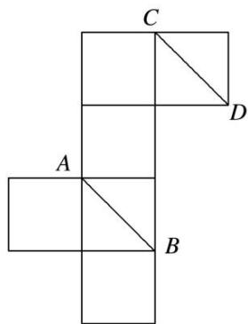

text_image

C
D
A
B

A. 平行

B. 垂直

C. 相交成 $60^{\circ}$ 角

D. 异面且成 $60^{\circ}$ 角

1. 答案 D 解析 如图，直线 $AB$ ， $CD$ 异面．因为 $CE \parallel AB$ ，所以 $\angle ECD$ 即为异面直线 $AB$ ， $CD$ 所成的角，因为 $\triangle CDE$ 为等边三角形，故 $\angle ECD = 60^\circ$ ．

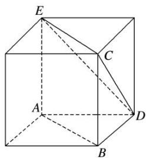

text_image

E
C
A
D
B

2. 如图是正四面体(各面均为正三角形)的平面展开图, $G$ , $H$ , $M$ , $N$ 分别为 $DE$ , $BE$ , $EF$ , $EC$ 的中点, 在这个正四面体中:

①GH 与 EF 平行；②BD 与 MN 为异面直线；③GH 与 MN 成 $60^{\circ}$ 角；④DE 与 MN 垂直.

以上四个命题中，正确命题的序号是\_\_\_\_。

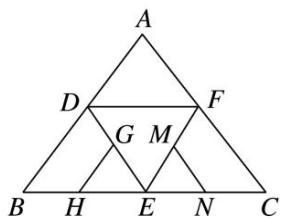

text_image

A
D
F
G M
B H E N C

2. 答案 ②③④ 解析 把正四面体的平面展开图还原，如图所示，GH 与 EF 为异面直线，BD 与 MN 为异面直线，GH 与 MN 成 $60^{\circ}$ 角，DE ⊥ MN.

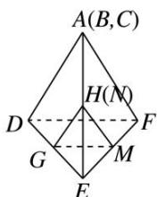

3. 如图是一几何体的平面展开图, 其中四边形 $ABCD$ 为正方形, $E$ , $F$ 分别为 $PA$ , $PD$ 的中点, 在此几何体中, 给出下面 4 个结论:

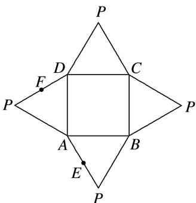

text_image

P
D C
F
P A B P
E
P

①直线 BE 与直线 CF 异面；②直线 BE 与直线 AF 异面；③直线 EF // 平面 PBC；④平面 BCE ⊥ 平面 PAD．其中正确的有( )

A. 1 个

B. 2 个

C. 3 个

D. 4 个

3. 答案 B 解析 将展开图还原为几何体(如图)，因为 E，F 分别为 PA，PD 的中点，所以 $EF \parallel AD \parallel BC$ ，即直线 BE 与 CF 共面，①错；因为 $B \notin$ 平面 PAD， $E \in$ 平面 PAD， $E \notin AF$ ，所以 BE 与 AF 是异面直线，②正确；因为 $EF \parallel AD \parallel BC$ ， $EF \notin$ 平面 PBC， $BC \subset$ 平面 PBC，所以 $EF \parallel$ 平面 PBC，③正确；平面 PAD 与平面 BCE 不一定垂直，④错．故选 B.

text_image

Geometric diagram of a pyramid with labeled vertices and internal points, used for spatial geometry problems.

4. 如图，四边形 ABCD 中， $AB = AD = CD = 1$ ， $BD = \sqrt{2}$ ， $BD \perp CD$ 。将四边形 ABCD 沿对角线 BD 拆成四面体 $A' - BCD$ ，使平面 $A'BD \perp$ 平面 BCD，则下列结论正确的是()

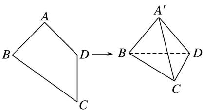

text_image

A
B D → B A'
C D

A. $A^{\prime}C \perp BD$

B. $\angle BA^{\prime}C = 90^{\circ}$

C. $CA'$ 与平面 $A'BD$ 所成的角为 $30^{\circ}$

D. 四面体 $A' - BCD$ 的体积为 $\frac{1}{3}$

4. 答案 B 解析 若 A 成立可得 $BD \perp A'D$ ，产生矛盾，故 A 不正确；由题干知 $\triangle BA'D$ 为等腰直角三角形， $CD \perp$ 平面 $A'BD$ ，得 $BA' \perp$ 平面 $A'CD$ ，所以 $BA' \perp A'C$ ，于是 B 正确；由 $CA'$ 与平面 $A'BD$ 所成的角为 $\angle CA'D = 45^{\circ}$ 知 C 不正确； $V_{A'-BCD} = V_{C-A'BD} = \frac{1}{6}$ ，D 不正确，故选 B.

5. 如图, 在正方形 $ABCD$ 中, $E$ , $F$ 分别是 $BC$ , $CD$ 的中点, $G$ 是 $EF$ 的中点, 现在沿 $AE$ , $AF$ 及 $EF$ 把这个正方形折成一个空间图形, 使 $B$ , $C$ , $D$ 三点重合, 重合后的点记为 $H$ , 那么, 在这个空间图形中必有( )

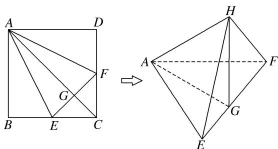

text_image

Geometric diagram showing a square ABCD transformed into a polyhedron with labeled vertices and internal points.

A. $AG \perp$ 平面 $EFH$

B. $AH \perp$ 平面 $EFH$

C. HF⊥平面 AEF

D. $HG \perp$ 平面 AEF

5. 答案 B 解析 根据折叠前、后 $AH \perp HE$ ， $AH \perp HF$ 不变，得 $AH \perp$ 平面 EFH，B 正确；∵ 过 A 只有一条直线与平面 EFH 垂直，∴ A 不正确；∵ $AG \perp EF$ ， $EF \perp GH$ ， $AG \cap GH = G$ ，∴ $EF \perp$ 平面 HAG，又 $EF \subset$ 平面 AEF，∴ 平面 $HAG \perp AEF$ ，过 H 作直线垂直于平面 AEF，一定在平面 HAG 内，∴ C 不正确；由条件证不出 $HG \perp$ 平面 AEF，∴ D 不正确．故选 B.

6. (多选)如图, 以等腰直角三角形 $ABC$ 的斜边 $BC$ 上的高 $AD$ 为折痕, 翻折 $\triangle ABD$ 和 $\triangle ACD$ , 使得平面 $ABD \perp$ 平面 $ACD$ . 下列结论正确的是( )

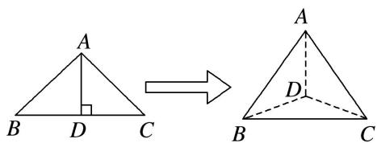

text_image

A
B D C
→
A
D
B C

A. $BD \perp AC$

B. $\triangle BAC$ 是等边三角形

C. 三棱锥 $D - ABC$ 是正三棱锥

D. 平面 $ADC \perp$ 平面 $ABC$

6. 答案 ABC 解析 由题意易知， $BD \perp$ 平面 ADC，又 $AC \subset$ 平面 ADC，故 $BD \perp AC$ ，A 中结论正确；设等腰直角三角形 ABC 的腰为 a，则 $BC = \sqrt{2}a$ ，由 A 知 $BD \perp$ 平面 ADC， $CD \subset$ 平面 ADC，∴ $BD \perp CD$ ，又 $BD = CD = \frac{\sqrt{2}}{2}a$ ，∴ 由勾股定理得 $BC = \sqrt{2} \times \frac{\sqrt{2}}{2}a = a$ ，∴ AB = AC = BC，则 $\triangle BAC$ 是等边三角形，B 中结论正确；易知 DA = DB = DC，又由 B 可知 C 中结论正确，D 中结论错误。

7. 如图所示, 正方形 $BCDE$ 的边长为 $a$ , 已知 $AB = \sqrt{3} BC$ , 将 $\triangle ABE$ 沿边 $BE$ 折起, 折起后 $A$ 点在平面 $BCDE$ 上的射影为 $D$ 点, 关于翻折后的几何体有如下描述:

①AB 与 DE 所成的角的正切值是 $\sqrt{2}$ ; ②AB // CE; ③ $V_{B-ACE}=\frac{a^{3}}{6}$ ; ④ 平面 ABC⊥平面 ADC.

其中正确的有\_\_\_\_．(填写你认为正确的序号)

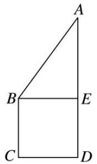

text_image

A
B
E
C
D

7. 答案 ①③④ 解析 作出折叠后的几何体直观图如图所示.

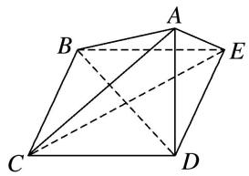

natural_image

Geometric diagram of a polyhedron with labeled vertices A, B, C, D, E and dashed internal diagonals (no text or symbols)

∵ A 点在平面 BCDE 上的射影为点 D，∴ $AD \perp$ 平面 BCDE。∵ $BC \subset$ 平面 BCDE，∴ $AD \perp BC$ 。∵ 四边形 BCDE 是正方形，∴ $BC \perp CD$ ，又 $AD \cap CD = D$ ，AD， $CD \subset$ 平面 ACD，∴ $BC \perp$ 平面 ADC。又 $BC \subset$ 平面 ABC，∴ 平面 $ABC \perp$ 平面 ADC，故④正确；∵ DE // BC，∴ ∠ABC 或其补角为 AB 与 DE 所成的角，∵ BC ⊥ 平面 ADC，AC ⊂ 平面 ADC，∴ BC ⊥ AC，∵ $AB = \sqrt{3}BC$ ，BC = a，∴ 在 Rt△ABC 中， $AC = \sqrt{AB^{2} - BC^{2}} = \sqrt{2}a$ ，∴ $\tan \angle ABC = \frac{AC}{BC} = \sqrt{2}$ ，故①正确；连接 BD，CE，则 CE ⊥ BD，又 AD ⊥ 平面 BCDE，CE ⊂ 平面 BCDE，∴ CE ⊥ AD。又 $BD \cap AD = D$ ，BD，AD ⊂ 平面 ABD，∴ CE ⊥ 平面 ABD，又 AB ⊂ 平面 ABD，∴ CE ⊥ AB。故②错误；在 Rt△ABE 中， $AB = \sqrt{3}a$ ，BE = a，∴ AE = $\sqrt{2}a$ ，又 DE = a，AD ⊥ DE，∴ AD = a，∴ 三棱锥 B-ACE 的体积 $V_{B-ACE} = V_{A-BCE} = \frac{1}{3}S_{\triangle BCE} \cdot AD = \frac{1}{3} \times \frac{1}{2} \times a^{2} \times a = \frac{a^{3}}{6}$ ，故③正确。

8. 如图, 在直角梯形 $ABCD$ 中, $BC \perp DC$ , $AE \perp DC$ , 且 $E$ 为 $CD$ 的中点, $M$ , $N$ 分别是 $AD$ , $BE$ 的中点, 将 $\triangle ADE$ 沿 $AE$ 折起, 则下列说法正确的是 \_\_\_\_. (写出所有正确说法的序号)

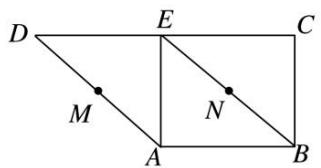

text_image

D
E
C
M
N
A
B

①不论 D 折至何位置(不在平面 ABC 内)，都有 $MN \parallel$ 平面 DEC;

②不论 D 折至何位置(不在平面 ABC 内)，都有 $MN \perp AE$ ;

③不论 D 折至何位置(不在平面 ABC 内)，都有 $MN \parallel AB$ ;

④在折起过程中，一定存在某个位置，使 $EC \perp AD$ .

8. 答案 ①②④ 解析 由已知，在未折叠的原梯形中， $AB \parallel DE$ ， $BE \parallel AD$ ，所以四边形 $ABED$ 为平行四边形，所以 $BE = AD$ ，折叠后如图所示。①过点 $M$ 作 $MP \parallel DE$ ，交 $AE$ 于点 $P$ ，连接 $NP$ 。因为 $M$ ， $N$ 分别是 $AD$ ， $BE$ 的中点，所以点 $P$ 为 $AE$ 的中点，故 $NP \parallel EC$ 。又 $MP \cap NP = P$ ， $DE \cap CE = E$ ，所以平面 $MNP \parallel$ 平面 $DEC$ ，故 $MN \parallel$ 平面 $DEC$ ，①正确；②由已知， $AE \perp ED$ ， $AE \perp EC$ ，所以 $AE \perp MP$ ， $AE \perp NP$ ，又 $MP \cap NP = P$ ，所以 $AE \perp$ 平面 $MNP$ ，又 $MN \subset$ 平面 $MNP$ ，所以 $MN \perp AE$ ，②正确；③假设 $MN \parallel AB$ ，则 $MN$ 与 $AB$ 确定平面 $MNBA$ ，从而 $BE \subset$ 平面 $MNBA$ ， $AD \subset$ 平面 $MNBA$ ，与 $BE$ 和 $AD$ 是异面直线矛盾，③错误；④当 $EC \perp ED$ 时， $EC \perp AD$ 。因为 $EC \perp EA$ ， $EC \perp ED$ ， $EA \cap ED = E$ ，所以 $EC \perp$ 平面 $AED$ ， $AD \subset$ 平面 $AED$ ，所以 $EC \perp AD$ ，④正确。

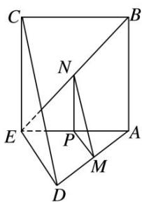

text_image

Geometric diagram of a cube with labeled vertices and internal points, used for spatial geometry problems.

9. 在矩形 $ABCD$ 中, $AB = \sqrt{3}$ , $BC = 1$ , 将 $\triangle ABC$ 与 $\triangle ADC$ 沿 $AC$ 所在的直线进行随意翻折, 在翻折过程中直线 $AD$ 与直线 $BC$ 所成的角的范围(包含初始状态)为( )

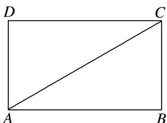

text_image

D
C
A
B

A. $\left[0, \frac{\pi}{6}\right]$

B. $\begin{bmatrix}0,\frac{\pi}{3}\end{bmatrix}$

C. $\begin{bmatrix}0,\frac{\pi}{2}\end{bmatrix}$

D. $\left[0,\frac{2\pi}{3}\right]$

9. 答案 C 解析 由题意, 初始状态直线 $AD$ 与直线 $BC$ 所成的角为 0 , 当 $DB = \sqrt{2}$ 时, $AD \perp DB$ , $AD \perp DC$ , 又 $DC \cap DB = D$ , $\therefore AD \perp$ 平面 $DBC$ , 又 $BC \subset$ 平面 $DBC$ , 所以 $AD \perp BC$ , 直线 $AD$ 与直线 $BC$ 所成的角为 $\frac{\pi}{2}$ , $\therefore$ 在翻折过程中直线 $AD$ 与直线 $BC$ 所成角的范围(包含初始状态)为 $\left[0, \frac{\pi}{2}\right]$ .

10. 如图所示，在直角梯形 $BCEF$ 中， $\angle CBF = \angle BCE = 90^\circ$ ， $A, D$ 分别是 $BF$ ， $CE$ 上的点， $AD // BC$ ，且 $AB = DE = 2BC = 2AF$ （如图1）。将四边形 $ADEF$ 沿 $AD$ 折起，连接 $AC, CF, BE, BF, CE$ （如图2），在折起的过程中，下列说法错误的是（）

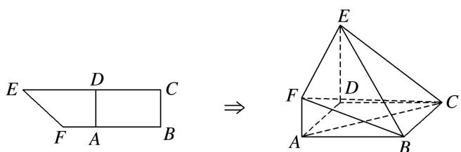

text_image

E D C
F A B
⇒
E
F D C
A B

图1

A. AC//平面 BEF

B. B, C, E, F 四点不可能共面

C. 若 $EF \perp CF$ , 则平面 $ADEF \perp$ 平面 $ABCD$

D. 平面 BCE 与平面 BEF 可能垂直

10. 答案 D 解析 A 选项, 连接 BD, 交 AC 于点 O, 取 BE 的中点 M, 连接 OM, FM, 则四边形 AOMF是平行四边形，所以 $AO \parallel FM$ ，因为 $FM \subset$ 平面 $BEF$ ， $AC \notin$ 平面 $BEF$ ，所以 $AC \parallel$ 平面 $BEF$ ；B选项，若 $B$ ， $C$ ， $E$ ， $F$ 四点共面，因为 $BC \parallel AD$ ，所以 $BC \parallel$ 平面 $ADEF$ ，又 $BC \subset$ 平面 $BCEF$ ，平面 $BCEF \cap$ 平面 $ADEF = EF$ ，所以可推出 $BC \parallel EF$ ，又 $BC \parallel AD$ ，所以 $AD \parallel EF$ ，矛盾；C选项，连接 $FD$ ，在平面 $ADEF$ 内，由勾股定理可得 $EF \perp FD$ ，又 $EF \perp CF$ ， $FD \cap CF = F$ ，所以 $EF \perp$ 平面 $CDF$ ，所以 $EF \perp CD$ ，又 $CD \perp AD$ ， $EF$ 与 $AD$ 相交，所以 $CD \perp$ 平面 $ADEF$ ，所以平面 $ADEF \perp$ 平面 $ABCD$ ；D选项，延长 $AF$ 至 $G$ ，使 $AF = FG$ ，连接 $BG$ ， $EG$ ，可得平面 $BCE \perp$ 平面 $ABF$ ，且平面 $BCE \cap$ 平面 $ABF = BG$ ，过 $F$ 作 $FN \perp BG$ 于 $N$ ，则 $FN \perp$ 平面 $BCE$ ，若平面 $BCE \perp$ 平面 $BEF$ ，则过 $F$ 作直线与平面 $BCE$ 垂直，其垂足在 $BE$ 上，矛盾.

11. 在等腰直角 $\triangle ABC$ 中， $AB \perp AC$ ， $BC = 2$ ， $M$ 为 $BC$ 的中点， $N$ 为 $AC$ 的中点， $D$ 为 $BC$ 边上一个动点， $\triangle ABD$ 沿 $AD$ 翻折使 $BD \perp DC$ ，点 $A$ 在平面 $BCD$ 上的投影为点 $O$ ，当点 $D$ 在 $BC$ 上运动时，以下说法错误的是（）

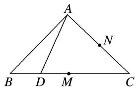

text_image

A
B D M C
N

A. 线段 $NO$ 为定长

B. $CO \in [1, \sqrt{2})$

C. $\angle AMO + \angle ADB > 180^{\circ}$

D. 点 $O$ 的轨迹是圆弧

11. 答案 C 解析 如图所示，对于 A， $\triangle AOC$ 为直角三角形， $ON$ 为斜边 $AC$ 上的中线， $ON = \frac{1}{2} AC$ 为定长，即 A 正确；对于 B， $D$ 在 $M$ 时， $AO = 1$ ， $CO = 1$ ， $\therefore CO \in [1, \sqrt{2})$ ，即 B 正确；对于 D，由 A 可知，点 $O$ 的轨迹是圆弧，即 D 正确，故选 C.

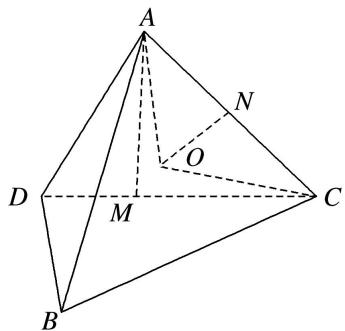

text_image

A
N
O
D
M
C
B

12. 如图，在直三棱柱 $ABC - A_{1}B_{1}C_{1}$ 中， $AA_{1} = 2$ ， $AB = BC = 1$ ， $\angle ABC = 90^{\circ}$ ，外接球的球心为 $O$ ，点 $E$ 是侧棱 $BB_{1}$ 上的一个动点。有下列判断：

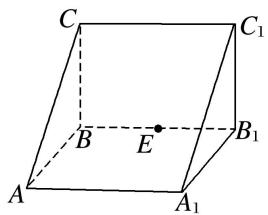

text_image

C
B
E
A
A₁
C₁
B₁

①直线 AC 与直线 $C_{1}E$ 是异面直线；② $A_{1}E$ 一定不垂直于 $AC_{1}$ ；③三棱锥 E— $AA_{1}O$ 的体积为定值；④ $AE + EC_{1}$ 的最小值为 $2\sqrt{2}$ .

其中正确的个数是( )

A. 1

B. 2

C. 3

D. 4

12. 答案 C 解析 ①因为点 $A \notin$ 平面 $BB_{1}C_{1}C$ ，所以直线 $AC$ 与直线 $C_{1}E$ 是异面直线；②当 $A_{1}E \perp AB_{1}$ 时，直线 $A_{1}E \perp$ 平面 $AB_{1}C_{1}$ ，所以 $A_{1}E \perp AC_{1}$ ，错误；③球心 $O$ 是直线 $AC_{1}$ ， $A_{1}C$ 的交点，底面 $OAA_{1}$ 面积不变，直线 $BB_{1} //$ 平面 $AA_{1}O$ ，所以点 $E$ 到底面的距离不变，体积为定值；④将矩形 $AA_{1}B_{1}B$ 和矩形 $BB_{1}C_{1}C$ 展开到一个面内，当点 E 为 $AC_{1}$ 与 $BB_{1}$ 的交点时， $AE + EC_{1}$ 取得最小值 $2\sqrt{2}$ ，故选 C.

13. 如图，已知棱长为 1 的正方体 $ABCD - A_1B_1C_1D_1$ 中， $E, F, M$ 分别是线段 $AB, AD, AA_1$ 的中点，又 $P, Q$ 分别在线段 $A_1B_1, A_1D_1$ 上，且 $A_1P = A_1Q = x (0 < x < 1)$ .

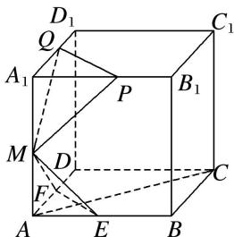

text_image

D₁
Q
A₁
P
B₁
M
D
F
C
A
E
B

设平面 $MEF \cap$ 平面 MPQ = l，现有下列结论：① $l \parallel$ 平面 ABCD；② $l \perp AC$ ；③ 直线 l 与平面 $BCC_{1}B_{1}$ 不垂直；④ 当 x 变化时，l 不是定直线.

其中成立的结论是\_\_\_\_．(写出所有成立结论的序号)

13. 答案 ①②③ 解析 连接 BD, $B_{1}D_{1}$ , $\because A_{1}P=A_{1}Q=x$ ,

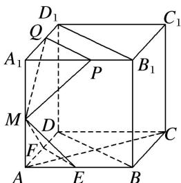

text_image

D₁
Q
A₁
P
B₁
M
D
F
C
A
E
B

$\therefore PQ \parallel B_{1}D_{1} \parallel BD \parallel EF$ ，易证 $PQ \parallel$ 平面 $MEF$ ，又平面 $MEF \cap$ 平面 $MPQ = l$ ， $\therefore PQ \parallel l, l \parallel EF$ ， $\therefore l \parallel$ 平面 $ABCD$ ，故①成立；又 $EF \perp AC$ ， $\therefore l \perp AC$ ，故②成立； $\because l \parallel EF \parallel BD$ ， $\therefore$ 易知直线 $l$ 与平面 $BCC_{1}B_{1}$ 不垂直，故③成立；当 $x$ 变化时， $l$ 是过点 $M$ 且与直线 $EF$ 平行的定直线，故④不成立.

14. (多选)在棱长为 1 的正方体 $ABCD - A_{1}B_{1}C_{1}D_{1}$ 中, 点 $M$ 在棱 $CC_{1}$ 上, 则下列结论正确的是( )

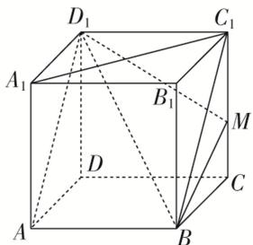

text_image

D₁
C₁
A₁
B₁
M
D
C
A
B

A. 直线 $BM$ 与平面 $ADD_{1}A_{1}$ 平行

B. 平面 $BMD_{1}$ 截正方体所得的截面为三角形

C. 异面直线 $AD_{1}$ 与 $A_{1}C_{1}$ 所成的角为 $\frac{\pi}{3}$

D. $MB + MD_{1}$ 的最小值为 $\sqrt{5}$

14. 答案 ACD 解析 对于 A，因为平面 $ADD_{1}A_{1} \parallel$ 平面 $BCC_{1}B_{1}$ ， $BM \subset$ 平面 $BCC_{1}B_{1}$ ，即可判定直线 BM 与平面 $ADD_{1}A_{1}$ 平行，故正确；对于 B，如图 1，平面 $BMD_{1}$ 截正方体所得的截面为四边形，故错误；对于 C，如图 2，异面直线 $AD_{1}$ 与 $A_{1}C_{1}$ 所成的角为 $\angle D_{1}AC$ ，即可判定异面直线 $AD_{1}$ 与 $A_{1}C_{1}$ 所成的角为 $\frac{\pi}{3}$ ，故正确；对于 D，如图 3，将正方体的侧面展开，可得当 B，M， $D_{1}$ 共线时， $MB + MD_{1}$ 有最小值，最小值为 $BD_{1} = \sqrt{2^{2} + 1^{2}} = \sqrt{5}$ ，故正确．故选 ACD.

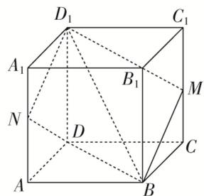

text_image

D₁
C₁
A₁
B₁
M
N
D
C
A
B

图1

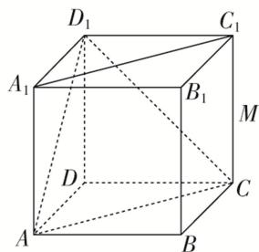

text_image

D₁
C₁
A₁
B₁
M
D
C
A
B

图2

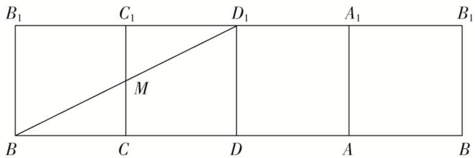

text_image

B₁ C₁ D₁ A₁ B₁
M
B C D A B

图3

15. (多选)如图, 点 $P$ 在正方体 $ABCD - A_{1}B_{1}C_{1}D_{1}$ 的面对角线 $BC_{1}$ 上运动, 则下列四个结论正确的是( )

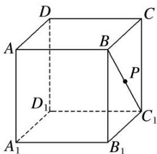

text_image

D
A
B
C
P
D₁
C₁
A₁
B₁

A. 三棱锥 $A - D_{1}PC$ 的体积不变

B. $A_{1}P \parallel$ 平面 $ACD_{1}$

C. $DP \perp BC_{1}$

D. 平面 $PDB_{1} \perp$ 平面 $ACD_{1}$

15. 答案 ABD 解析 对于 A，连接 $AD_{1}$ ， $CD_{1}$ ，AC， $D_{1}P$ ，如图，由题意知 $AD_{1} \parallel BC_{1}$ ， $AD_{1} \subset$ 平面 $AD_{1}C$ ， $BC_{1} \not\subset$ 平面 $AD_{1}C$ ，

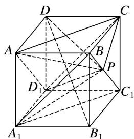

text_image

Geometric diagram of a cube with labeled vertices and internal points, used for spatial geometry problems.

从而 $BC_{1} //$ 平面 $AD_{1}C$ ，故 $BC_{1}$ 上任意一点到平面 $AD_{1}C$ 的距离均相等，所以以 $P$ 为顶点，平面 $AD_{1}C$ 为底面的三棱锥 $A - D_{1}PC$ 的体积不变，故 A 正确；对于 B，连接 $A_{1}B$ ， $A_{1}C_{1}$ ， $A_{1}P$ ，则 $A_{1}C_{1} // AC$ ，易知 $A_{1}C_{1} //$ 平面 $AD_{1}C$ ，由 A 知， $BC_{1} //$ 平面 $AD_{1}C$ ，又 $A_{1}C_{1} \cap BC_{1} = C_{1}$ ，所以平面 $BA_{1}C_{1} //$ 平面 $ACD_{1}$ ，又 $A_{1}P \subset$ 平面 $A_{1}C_{1}B$ ，所以 $A_{1}P //$ 平面 $ACD_{1}$ ，故 B 正确；对于 C，由于 $DC \perp$ 平面 $BCC_{1}B_{1}$ ，所以 $DC \perp BC_{1}$ ，若 $DP \perp BC_{1}$ ，则 $BC_{1} \perp$ 平面 $DCP$ ， $BC_{1} \perp PC$ ，则 $P$ 为中点，与 $P$ 为动点矛盾，故 C 错误；对于 D，连接 $DB_{1}$ ， $PD$ ，由 $DB_{1} \perp AC$ 且 $DB_{1} \perp AD_{1}$ ，可得 $DB_{1} \perp$ 平面 $ACD_{1}$ ，从而由面面垂直的判定定理知平面 $PDB_{1} \perp$ 平面 $ACD_{1}$ ，故 D 正确.

16. 在长方体 $ABCD - A_{1}B_{1}C_{1}D_{1}$ 中， $AB = AD = 6$ ， $AA_{1} = 2$ ， $M$ 为棱 $BC$ 的中点，动点 $P$ 满足 $\angle APD = \angle CP$ $M$ ，则点 $P$ 的轨迹与长方体的面 $DCC_{1}D_{1}$ 的交线长等于（）

A. $\frac{2\pi}{3}$

B. $\pi$

C. $\frac{4\pi}{3}$

D. $\sqrt{2}\pi$

16. 答案 A 解析 如图，由题意知，只需考虑点 P 在平面 $DCC_{1}D_{1}$ 上的情况，此时 $AD \perp DP, MC \perp CP$ ，所以 $\tan \angle APD = \frac{AD}{DP}, \tan \angle CPM = \frac{MC}{PC}$ 。因为 $\angle APD = \angle CPM$ ，所以 $\frac{AD}{DP} = \frac{MC}{PC}$ 。因为 M 是 BC 的中点，所以 AD = 2MC，所以 DP = 2PC。在平面 $D_{1}DCC_{1}$ 内，以 D 为原点，的方向为 x 轴的正方向， $DD_{1}$ 的方向为 y 轴的正方向，建立平面直角坐标系，则 $D(0, 0), C(6, 0)$ 。设 $P(x, y)$ ，则 $\sqrt{x^{2} + y^{2}} = 2\sqrt{(x - 6)^{2} + y^{2}}$ ，化简，得 $y^{2} + (x - 8)^{2} = 4^{2}$ 。该圆与平面 $D_{1}DCC_{1}$ 的交线长对应的圆心角为 $\frac{\pi}{6}$ ，则对应弧长为 $\frac{\pi}{6} \times 4 = \frac{2\pi}{3}$ 。

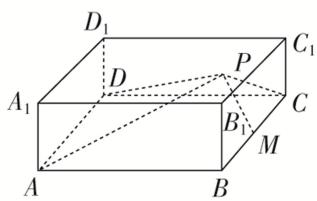

text_image

D₁
A₁ D P C₁
B₁ C
A B M

